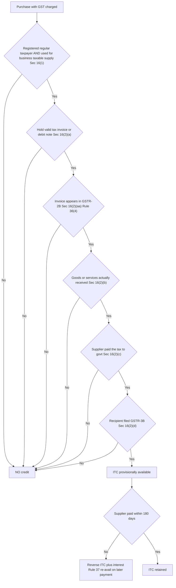
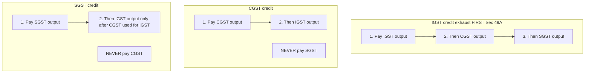

# Chapter 19 — Input Tax Credit (ITC)

> **Rates / thresholds / amendments flag:** This chapter teaches the *logic and machinery* of Input Tax Credit under Sections 16–21 of the CGST Act, 2017 and Rules 36–45 of the CGST Rules, 2017. ITC is the single most litigated and most amended area of GST — the invoice-matching mechanism (Sec 16(2)(aa), Rule 36(4)), the utilisation order (Sec 49, Rule 88A), and the reversal formulae (Rules 42/43) have all been tightened repeatedly. Internalise the *mechanism* here; then **verify the exact current wording, the latest time-limit for a financial year, the common-credit percentages, and any fresh amendments against ICAI study material for your attempt.** The design logic below is permanent.

---

## 1. The Problem — Why a tax on a tax destroys an economy

Imagine a simple three-stage chain with a flat 10% tax **charged on the full sale price at every stage**, and no credit for tax already suffered:

| Stage | Buys at | Adds value | Sells (pre-tax) | Tax @10% | Price to next buyer |
|---|---|---|---|---|---|
| Manufacturer | — | 100 | 100 | 10 | 110 |
| Wholesaler | 110 | 40 | 150 | 15 | 165 |
| Retailer | 165 | 35 | 200 | 20 | 220 |

The consumer pays ₹220. But the *real* value added across the whole chain was only 100 + 40 + 35 = **₹175**. A clean 10% tax on that should have collected **₹17.50**. Instead the exchequer collected 10 + 15 + 20 = **₹45**.

Where did the extra ₹27.50 come from? The wholesaler paid tax on ₹150 — but ₹110 of that ₹150 *already had ₹10 of tax baked into it*. He is being taxed on the manufacturer's tax. The retailer is taxed on both earlier taxes. **Tax is compounding on tax at every handover.** This is **cascading**, or the "tax-on-tax" effect, and it is economically toxic for four reasons:

1. **It punishes specialisation.** The more hands a product passes through, the more layers of tax-on-tax it accumulates. So a firm is pushed to do everything in-house (**vertical integration**) purely to dodge tax layers — a distortion that has nothing to do with efficiency.
2. **It is invisible and regressive.** Nobody can tell how much tax is embedded in the final ₹220. The effective rate is 25.7%, not the advertised 10%.
3. **It kills exports.** You cannot cleanly refund embedded tax you cannot even measure, so domestic taxes get exported inside the price, making Indian goods uncompetitive abroad.
4. **It rewards evasion.** Because each stage's tax is a dead cost to the next buyer, everyone has an incentive to deal off-the-books.

The old Indian indirect-tax system had *exactly* this disease across the Excise–VAT–Service-Tax–CST silos: credit could not flow across the boundaries between them (Central taxes vs State taxes; goods vs services). GST's entire reason for existing is to cure cascading. And the instrument that does the curing is **Input Tax Credit**.

> **The problem ITC solves, in one line:** *make sure that at every stage a business pays tax only on the value IT adds — never again on value (and tax) that earlier stages already bore.*

---

## 2. The Core Idea

> **Input Tax Credit means: the GST a registered person pays on his purchases (inputs, input services, capital goods) is not a cost — it is a *deposit* he can set off against the GST he collects on his sales. He deposits tax to the government on his sales (output tax), takes credit for tax already deposited by his suppliers on his purchases (input tax), and pays the government only the difference — which is exactly the tax on the value HE added.**

Re-run the chain above, now *with* full ITC at 10%:

| Stage | Output tax on sale | Less: ITC on purchases | **Net cash to govt** |
|---|---|---|---|
| Manufacturer | 100 × 10% = 10 | 0 | **10** |
| Wholesaler | 150 × 10% = 15 | 10 | **5** |
| Retailer | 200 × 10% = 20 | 15 | **5** |
| **Total** | | | **20** |

Total collected = ₹20 = exactly 10% of the final ₹200 value. The consumer bears ₹20 and *only* ₹20. Each business remitted tax purely on its own value-add (100→₹10, 40→₹5, 35→₹3.50... note the ₹5 and ₹5 net figures equal 10% of 40 and 35 respectively once you strip rounding). **Cascading is gone.** The tax has become a pure Value Added Tax by the mechanism of credit.

Three consequences fall out of this and organise the whole chapter:

1. **ITC makes GST a "credit-invoice" tax.** The invoice is the currency of credit. My purchase invoice is my *claim* on the treasury; my sale invoice is the *source* of my customer's claim. The whole system is a chain of matched invoices.
2. **The chain must be unbroken to work.** If any link fails to actually pay the tax he collected, the government would be crediting money it never received. So ITC is granted *conditionally* — the buyer only gets credit once the seller has genuinely paid. This is the self-policing heart of GST.
3. **Credit is not universal — it follows the tax.** You get credit only for tax on things used *in the course of business to make taxable supplies*. Personal use, exempt supplies, and specifically-blocked items break the "value-add-to-taxable-output" logic, so their credit is denied or apportioned.

Everything in Sections 16–21 is one of these three ideas made precise.

---

## 3. Why It's Built This Way — the design logic behind every rule

Before a single sub-section, lock in the design choices. Every technical rule below is one of these in disguise:

| Design choice | The problem it solves | How the Act implements it |
|---|---|---|
| Credit only what was used for *business* & *taxable* output | Personal use / exempt output added no taxable value — crediting it is a giveaway | Sec 16(1) purpose test; Sec 17(1)/(2) apportionment |
| Credit only when a *genuine tax-paid* transaction exists | Fake invoices with no real tax paid would drain the treasury | Sec 16(2): invoice + receipt + tax actually paid + return filed |
| Buyer's credit hinges on the *supplier's* compliance | Makes every buyer police his own suppliers — self-enforcing | Sec 16(2)(aa) invoice must appear in GSTR-2B; Sec 16(2)(c) tax actually paid |
| A hard deadline to claim | Books must close; the government cannot leave credit open forever | Sec 16(4) time limit |
| Pay the supplier within 180 days or reverse | Credit is for tax on a *real* purchase, not an unpaid paper entry | Sec 16(2) 2nd proviso + Rule 37 |
| Spread capital-goods credit correctly | A machine yields output over years, not instantly | Sec 16 + Rule 43 (and depreciation bar u/s 16(3)) |
| Block credit on items prone to personal use / no clear business nexus | Motor cars, food, club fees etc. blur business vs consumption | Sec 17(5) blocked credits |
| Reverse credit tied to exempt / non-business use | Restore the "taxable-output-only" principle proportionately | Sec 17(1)/(2) + Rules 42 & 43 |
| Fixed order of credit utilisation | Stop taxpayers hoarding one head's cash while another runs dry | Sec 49(5), Sec 49A/49B, Rule 88A |

The elegance to internalise: **ITC is a privilege granted against proof, not a right.** The default is *no credit*; you earn it by satisfying conditions that each guarantee the government isn't refunding tax it never got, or crediting consumption it shouldn't subsidise. Read every rule as *"which leak is this plugging?"* and the section numbers stop being arbitrary.

---

## 4. Full Technical Content

### 4.1 The gateway: Section 16(1) — the *eligibility* / purpose test

> "Every registered person shall... be entitled to take credit of input tax charged on any supply of goods or services... which are **used or intended to be used in the course or furtherance of his business**..."

Three gatekeepers hide in this single sentence:

- **Registered person.** An unregistered person or a composition dealer (Sec 10) gets *no* ITC — composition is a flat-rate scheme that trades away credit for simplicity. Credit is a benefit of the regular regime only.
- **Input tax.** Defined in Sec 2(62): the CGST, SGST/UTGST, IGST *charged on any supply to him*, plus IGST on imports and tax paid under reverse charge (RCM). It does **not** include tax paid under composition, nor any tax paid as penalty.
- **Course or furtherance of business + taxable output.** This is the load-bearing nexus. The purchase must feed the making of *taxable* (including zero-rated) supplies. This test is what powers the apportionment of Sec 17 (below).

**Memory hook — "R-I-B": Registered person, Input tax, Business (taxable) use.** Fail any one and Sec 16(1) shuts the gate before you even reach the conditions.

### 4.2 The four conditions: Section 16(2) — the *entitlement* test (non-obstante, overriding)

Sec 16(2) opens with *"Notwithstanding anything contained in this section"* — meaning **even if 16(1) is satisfied, NO credit is available unless ALL of the following are met.** These are cumulative, not alternatives.

**Condition 1 — Possession of a tax-paying document [Sec 16(2)(a)].**
You must hold a valid **tax invoice**, debit note, bill of entry (imports), or ISD invoice. *Why:* the invoice is the primary evidence that tax was charged; no document, no claim. It must contain the prescribed particulars (Rule 36) — at minimum GSTIN of supplier and recipient, invoice number/date, description, value, tax rate and amount.

**Condition 1A — Invoice communicated / appears in GSTR-2B [Sec 16(2)(aa)].**
The invoice details must have been **furnished by the supplier in his GSTR-1** and **communicated to the recipient** (i.e. it must show up in the auto-generated **GSTR-2B**). *Why:* this is the self-policing masterstroke. Your credit is now mechanically tied to your supplier actually declaring the sale. If he hides the sale, no 2B entry, no credit for you — so *you* will chase him. Rule 36(4) reinforces this: **no credit on any invoice not reflected in GSTR-2B.**

**Condition 2 — Receipt of the goods or services [Sec 16(2)(b)].**
You must have actually **received** the goods/services. *Why:* credit is for a *real* supply consumed in business, not a paper transaction.
- *"Bill-to-ship-to" deeming fiction:* if goods are delivered to a third party on the buyer's instruction, the buyer is *deemed* to have received them (so the buyer still gets credit). This mirrors the identical fiction in place-of-supply rules.
- Where goods are received in lots/instalments against a single invoice, credit is allowed only on receipt of the **last lot**.

**Condition 3 — Tax actually paid to the government [Sec 16(2)(c)].**
The tax charged on your invoice must have been **actually paid** to the government by the supplier (in cash or through his own valid ITC). *Why:* this is the ultimate anti-fraud clamp — the government will not credit you money it never received. This condition is what makes buyers vulnerable to defaulting suppliers, and is the single biggest ITC litigation battleground.

**Condition 4 — Return furnished [Sec 16(2)(d)].**
The recipient must have **filed his return under Sec 39** (GSTR-3B). *Why:* credit is claimed *through* the return; it is not a standalone right you bank unilaterally.

**Fifth, cross-cutting condition — pay the supplier within 180 days [2nd proviso to Sec 16(2)] + Rule 37.**
If the recipient does not pay the **supplier** the value + tax within **180 days** from the invoice date, the credit already taken must be **added back to output tax liability with interest**. Once payment is eventually made, credit can be **re-availed** (with no time bar under Sec 16(4) for the re-availment). *Why:* ITC is credit for tax on a *genuine, paid-for* purchase. An unpaid invoice is just a bookkeeping entry; letting it fund credit would let related parties raise invoices they never intend to settle. *(This does not apply to supplies taxed under RCM, or where value is deemed supplied without consideration under Schedule I.)*

**Memory hook — the "PRTR + 180" ladder:** **P**ossession of invoice → **R**eceipt of goods/services → **T**ax paid to govt (and in 2B) → **R**eturn filed → then keep it by **paying within 180 days**.


*Figure 19.1 — The Section 16 eligibility gauntlet: every gate must pass, in sequence, for credit to survive.*

### 4.3 The hard deadline: Section 16(4) — the time limit

ITC on an invoice/debit note for a financial year **cannot be claimed after the earlier of:**

- **30th November** following the end of that financial year, **or**
- the date of filing the **annual return** for that year.

*Why:* the government's accounts for a year must eventually close. An open-ended claim would make reconciliation impossible and invite backdated fraud. *(The date was liberalised from the old "due date of September return" to 30th November — always confirm the current cut-off for your exam year.)* Note the deadline is keyed to the *invoice's* financial year, not when you happened to receive it.

**Memory hook:** *"By 30-Nov-next or annual return, whichever is earlier — after that, the door is bolted."*

### 4.4 Apportionment & the "taxable-output-only" principle: Section 17(1) & (2)

Sec 16 says credit is for *business + taxable* use. Section 17 handles the messy real world where a purchase is used **partly** outside that pure zone:

- **Sec 17(1):** goods/services used *partly for business and partly for other (non-business/personal) purposes* → credit restricted to the **business portion**.
- **Sec 17(2):** goods/services used *partly for taxable (incl. zero-rated) supplies and partly for exempt supplies* → credit restricted to the portion attributable to **taxable supplies**.

*Why:* exempt output and personal use never carried output tax against which input tax could set off. Granting full credit there would refund tax with nothing to net it against — a straight subsidy. So credit is *apportioned*. For this purpose, **exempt supply** (Sec 17(3)) is defined broadly to also drag in supplies taxed under RCM in the recipient's hands, sale of land/completed building, and certain securities transactions — so common credit gets reversed against these too.

*Banking/NBFC option [Sec 17(4)]:* a bank or NBFC may, instead of the item-wise apportionment, opt to **claim a flat 50%** of eligible ITC each month and forgo the rest — a compliance-simplifying trade-off (the 50% option is irrevocable for the year).

### 4.5 The mechanical apportionment formulae: Rules 42 & 43

When inputs are *common* to taxable and exempt supplies and cannot be directly attributed, the reversal is computed by formula.

**Rule 42 — inputs & input services (monthly).** The logic:
1. **T** = total input tax on all inputs/input services in the month.
2. Strip out **T1** (used exclusively for non-business), **T2** (used exclusively for exempt), **T3** (blocked u/s 17(5)) — these get *no* credit, ever.
3. **T4** = credit *exclusively* for taxable/zero-rated supplies → fully allowed.
4. **Common credit C2 = T − (T1+T2+T3) − T4.**
5. Reverse the exempt-attributable slice: **D1 = C2 × (E ÷ F)**, where **E** = exempt turnover, **F** = total turnover.
6. Reverse the non-business slice **D2 = 5% of C2** (a standardised assumption).
7. **Eligible common credit C3 = C2 − (D1 + D2).** D1 and D2 are added back to output liability; a final annual true-up is done by 30th November of the next year, with interest if the annual figure exceeds the provisional monthly reversals.

**Rule 43 — capital goods (monthly, spread over 60 months).** *Why a separate rule:* a machine delivers its usefulness over *years*, so its credit is spread rather than reversed all at once. Common capital-goods credit **A** is spread as **Tm = A ÷ 60** per month (i.e. a useful life of **5 years**), and the exempt portion **Te = Tm × (E ÷ F)** is reversed each month. Capital goods used exclusively for taxable supplies get full credit; those exclusively for exempt/non-business get none.

**Memory hook:** *Rule 42 = inputs, reverse now, 5% non-business fudge. Rule 43 = capital goods, spread over 60 months.*

### 4.6 Blocked credits: Section 17(5) — the "no credit even if used in business" list

This is the most exam-tested memory list. The unifying *why*: each item is either (a) prone to **personal consumption** masquerading as business, or (b) an end-consumption item where the chain is meant to *stop* (the business is the final consumer). Group them by logic rather than rote:

| Clause | Blocked item | The "why" | Key exceptions (credit ALLOWED) |
|---|---|---|---|
| (a),(aa),(ab) | **Motor vehicles** for passenger transport (seating ≤ 13 incl. driver); vessels & aircraft; their insurance/repairs | Cars blur business vs personal use | If used for: (i) further supply of such vehicles (dealer), (ii) passenger transport (taxi/bus operator), (iii) driving training, or goods transport vehicles |
| (b) | **Food & beverages, outdoor catering, health services, club/fitness membership, beauty treatment, health insurance, travel benefits to employees on leave** | Classic personal-consumption items | If **inward = same category as outward** (e.g. a restaurant buying food) OR provision is **obligatory under any law** for the employer |
| (c),(d) | **Works contract services & goods/services for construction of immovable property** (on own account) | The building is final consumption; chain stops | If it's **plant & machinery**, or the works-contract is an input to *further* works-contract supply |
| (e) | Goods/services on which **composition tax** paid (Sec 10) | Composition dealer charged no creditable tax | — |
| (f) | Supplies to a **non-resident taxable person** (except imported goods) | Outside the domestic credit chain | — |
| (fa) | Goods/services used for **CSR activities** | Not "in the course of business" | — |
| (g) | Goods/services for **personal consumption** | Directly fails the business nexus | — |
| (h) | Goods **lost, stolen, destroyed, written off**, or given as **gifts/free samples** | No taxable output ever resulted | — |
| (i) | Tax paid after **fraud/detention/confiscation** (Secs 74, 129, 130) | Won't reward evasion with credit | — |

**Memory hook — "The consumer's basket."** Ask: *would a normal individual enjoy this personally, or does the value chain end here?* Cars, food, gym, cosmetics, a building, gifts, personal goods — all things a *consumer* enjoys. That's why the credit stops. The exceptions all restore a genuine *business-to-business, chain-continuing* purpose.

### 4.7 ITC on capital goods — the two special rules

Capital goods (Sec 2(19): goods capitalised in the books, used in business) get **full ITC upfront in the month of receipt** (subject to Sec 16 conditions) — GST does *not* make you spread the credit over the asset's life the way old CENVAT did, *except* under Rule 43 apportionment when the asset is common to taxable + exempt output.

Two capital-goods-specific rules matter:

- **Sec 16(3) — the depreciation bar.** If you claim **depreciation under the Income-tax Act on the *tax component*** of a capital good's cost, you **cannot** also take ITC on that tax. *Why:* that would be a double benefit — deducting the tax as cost *and* crediting it. Choose one. (Practically: capitalise the asset *net* of GST and claim ITC; do not include GST in the depreciable cost.)
- **Sec 18(6) + Rule 44 — supply of used capital goods.** If you sell/transfer capital goods on which ITC was taken, you must pay the **higher of**: (i) ITC taken *reduced by 5% per quarter (or part)* of use, or (ii) tax on the transaction value. *Why:* claw back the unused portion of credit on an asset leaving the taxable chain, so the remaining life isn't credit-subsidised.

### 4.8 The credit-utilisation order: Section 49, 49A, 49B & Rule 88A

You hold three separate credit ledgers — **IGST, CGST, SGST/UTGST** — and three output liabilities in the same heads. The law dictates a **strict order** for setting credit against liability. *Why an order at all:* CGST is Centre's revenue, SGST is the State's; IGST is shared. Uncontrolled utilisation would let a taxpayer drain the head that suits his cash flow, distorting the Centre–State settlement. The order protects the revenue-sharing arithmetic.

The rules, in force order:

1. **IGST credit must be exhausted FIRST** (Sec 49A) — before any CGST or SGST credit can be used at all.
2. **IGST credit** is set off against **IGST → then CGST → then SGST/UTGST**, in that order (Rule 88A allows IGST to be used against CGST/SGST in any order *once IGST output is cleared*, but IGST itself must be used before CGST/SGST credit).
3. **CGST credit** → against **CGST first, then IGST**. **CGST can NEVER be used for SGST.**
4. **SGST/UTGST credit** → against **SGST first, then IGST** — *and SGST can be used against IGST only after the CGST credit has been fully used for IGST.* **SGST can NEVER be used for CGST.**

**Memory hook — "IGST is the universal donor; CGST and SGST never touch each other."** IGST credit can pay any head (like O-negative blood). But the CGST↔SGST wall is absolute — one can never pay the other's liability, because that would silently transfer money between the Centre and a State.


*Figure 19.2 — Credit utilisation order: IGST is used up first and can pay anything; CGST and SGST guard the Centre–State wall and can never cross-pay each other.*

### 4.9 Reversal situations — a consolidated map

Credit, once taken, must be **reversed** (added back to output liability, usually with interest) whenever the "tax-on-genuine-taxable-business-use" premise breaks:

| Trigger | Provision | Reversal |
|---|---|---|
| Non-payment to supplier within 180 days | 2nd proviso Sec 16(2) + Rule 37 | Full ITC + interest; re-avail on payment |
| Common inputs used for exempt/non-business | Sec 17(1)/(2) + Rule 42 | Proportionate (E/F) + 5% |
| Common capital goods for exempt/non-business | Rule 43 | Proportionate, spread over 60 months |
| Inputs/CG in stock when switching to composition or when output becomes wholly exempt | Sec 18(4) + Rule 44 | Reverse ITC on stock/CG (CG reduced 5% per quarter) |
| Goods lost, stolen, destroyed, written off, gifted, free samples | Sec 17(5)(h) | Full reversal |
| Sale/transfer of capital goods on which ITC taken | Sec 18(6) + Rule 44 | Higher of (ITC − 5%/quarter) or tax on transaction value |
| Registration cancelled | Sec 29(5) | Reverse ITC on stock & CG held |

### 4.10 Special-situation credit: Section 18 (entitlement on transitions)

Sec 18 answers *"what happens to credit when a taxpayer's status changes?"* — symmetrical logic in both directions:

- **Sec 18(1)(a):** person becomes liable to register & registers within 30 days → ITC on **inputs in stock** (and in semi-finished/finished goods) on the day *before* registration liability.
- **Sec 18(1)(b):** voluntary registration → ITC on inputs in stock on day before registration.
- **Sec 18(1)(c):** composition dealer switches to regular scheme → ITC on inputs in stock **and capital goods** (CG reduced by 5% per quarter of prior use).
- **Sec 18(1)(d):** exempt supply becomes taxable → ITC on inputs in stock and CG relatable to that supply.
- **Sec 18(4):** reverse direction — regular → composition, or supplies become wholly exempt → **reverse** ITC on stock & CG.
- **Sec 18(3):** on **sale/merger/transfer of business**, unutilised ITC transfers to the new entity (Form ITC-02). *Why:* credit belongs to the business, not the legal shell; it should follow the going concern.

All Sec 18(1) claims require filing **Form ITC-01** within 30 days and carry a **one-year time bar** from the invoice date (credit on stock older than a year is stale).

### 4.11 Input Service Distributor & job-work (brief, for completeness)

- **ISD (Sec 20):** a head office that receives *common input-service* invoices (e.g. audit fee, software licence for the whole group) distributes that ITC to its branches (having the same PAN) in proportion to turnover, via an **ISD invoice**. *Why:* the credit belongs where the service is *used*, not where the invoice happens to land.
- **Job-work (Sec 19):** a principal sending inputs/CG to a job-worker retains ITC even though the goods left his premises, provided they return within **1 year (inputs) / 3 years (capital goods)**; else it is deemed a supply and tax applies. *Why:* physical movement to a processor isn't consumption — the business nexus continues.

---

## 5. Worked Examples

### Example 1 — Basic net-liability computation with the utilisation order

**Facts.** Mehta Traders (regular dealer, Maharashtra) for a month has:
- Output tax payable: IGST ₹40,000; CGST ₹30,000; SGST ₹30,000.
- ITC available (all conditions of Sec 16 met, invoices in GSTR-2B): IGST ₹50,000; CGST ₹20,000; SGST ₹18,000.

**Required.** Net GST payable in cash.

**Step 1 — Use IGST credit first (Sec 49A). IGST credit = ₹50,000.**
- Against IGST output ₹40,000 → uses ₹40,000. IGST output now nil. IGST credit left = ₹10,000.
- Remaining IGST credit ₹10,000 against CGST output ₹30,000 → uses ₹10,000. CGST output now ₹20,000. IGST credit exhausted.

**Step 2 — CGST credit ₹20,000 against remaining CGST output ₹20,000** → uses ₹20,000. CGST output now **nil**. CGST credit exhausted.

**Step 3 — SGST credit ₹18,000 against SGST output ₹30,000** → uses ₹18,000. SGST output left = ₹12,000. SGST credit exhausted.

**Step 4 — Cash payable.**

| Head | Output | Credit set off | **Cash payable** |
|---|---|---|---|
| IGST | 40,000 | 40,000 (IGST) | 0 |
| CGST | 30,000 | 10,000 (IGST) + 20,000 (CGST) | 0 |
| SGST | 30,000 | 18,000 (SGST) | **12,000** |
| **Total** | 1,00,000 | 88,000 | **12,000** |

**Reconciliation:** Total credit ₹88,000 + cash ₹12,000 = ₹1,00,000 = total output tax. ✓ **Net cash = ₹12,000 (SGST).** Note CGST credit could *not* rescue the SGST shortfall — the wall held.

---

### Example 2 — Eligible-ITC determination with blocked credits (Sec 17(5))

**Facts.** Surya Manufacturing Ltd (regular, taxable output only) received these inward supplies in a month. Determine **eligible ITC**. (All invoices are in GSTR-2B, tax paid, returns filed.)

| # | Inward supply | GST (₹) | Eligible? | Reason |
|---|---|---|---|---|
| 1 | Raw material for production | 1,80,000 | **Yes** 1,80,000 | Direct input, taxable output |
| 2 | Machinery (capital goods) for the factory | 90,000 | **Yes** 90,000 | Capital goods, full upfront credit |
| 3 | Car (seating 5) for the MD's use | 60,000 | **No** | Sec 17(5)(a) — passenger motor vehicle |
| 4 | Outdoor catering for staff annual party | 24,000 | **No** | Sec 17(5)(b) — food/catering, not obligatory |
| 5 | Works contract for constructing a new office building | 1,50,000 | **No** | Sec 17(5)(c)/(d) — construction of immovable property |
| 6 | GST on installation of the machinery (contractor) | 15,000 | **Yes** 15,000 | Installation of plant & machinery — not blocked |
| 7 | Audit & consultancy fees | 45,000 | **Yes** 45,000 | Input service for business |
| 8 | Goods destroyed in a minor fire | 12,000 | **No** | Sec 17(5)(h) — goods destroyed |

**Eligible ITC = 1,80,000 + 90,000 + 15,000 + 45,000 = ₹3,30,000.**
**Blocked/ineligible = 60,000 + 24,000 + 1,50,000 + 12,000 = ₹2,46,000.**

**Reconciliation:** total input tax on the eight supplies = ₹5,76,000; eligible ₹3,30,000 + blocked ₹2,46,000 = ₹5,76,000. ✓ *Teaching point:* item 6 is a deliberate trap — installation of **plant & machinery** is carved OUT of the construction block, so its credit survives even though item 5 (building works contract) does not.

---

### Example 3 — Rule 42 apportionment of common credit (taxable + exempt output)

**Facts.** Ganga Enterprises makes both taxable and exempt supplies. For the month:
- Total ITC on inputs & input services **T = ₹5,00,000**.
- Of this: **T1** (exclusively non-business/personal) = ₹20,000; **T2** (exclusively for exempt supplies) = ₹50,000; **T3** (blocked u/s 17(5)) = ₹30,000.
- **T4** (exclusively for taxable/zero-rated supplies) = ₹2,50,000.
- Turnover in the month: taxable ₹60,00,000; exempt ₹20,00,000; **total F = ₹80,00,000**; exempt **E = ₹20,00,000**.

**Required.** Eligible common credit and the reversal.

**Step 1 — Common credit C2.**
C2 = T − (T1 + T2 + T3) − T4
C2 = 5,00,000 − (20,000 + 50,000 + 30,000) − 2,50,000
C2 = 5,00,000 − 1,00,000 − 2,50,000 = **₹1,50,000.**

**Step 2 — Exempt-attributable reversal D1.**
D1 = C2 × (E ÷ F) = 1,50,000 × (20,00,000 ÷ 80,00,000) = 1,50,000 × 0.25 = **₹37,500.**

**Step 3 — Non-business standardised reversal D2.**
D2 = 5% of C2 = 5% × 1,50,000 = **₹7,500.**

**Step 4 — Eligible common credit C3.**
C3 = C2 − (D1 + D2) = 1,50,000 − (37,500 + 7,500) = **₹1,05,000.**

**Step 5 — Total ITC the assessee may finally take this month.**
= T4 (exclusive taxable) + C3 (eligible common) = 2,50,000 + 1,05,000 = **₹3,55,000.**
**Reversed / ineligible** = T1 + T2 + T3 + D1 + D2 = 20,000 + 50,000 + 30,000 + 37,500 + 7,500 = **₹1,45,000.**

**Reconciliation:** eligible ₹3,55,000 + ineligible ₹1,45,000 = ₹5,00,000 = T. ✓ *(D1 and D2 are added to output liability for the month; an annual true-up follows by 30 November of the next FY, with interest if the yearly ratio makes the reversal larger.)*

---

### Example 4 — The 180-day reversal (Sec 16(2) proviso + Rule 37)

**Facts.** On 10 April, Nova Ltd received goods worth ₹1,00,000 + IGST ₹18,000 and took ITC of ₹18,000 in April's GSTR-3B. By the 180th day (≈ 7 October) it had **not paid the supplier**. Payment was finally made on 20 December.

**Consequences.**
- **On crossing 180 days:** the ₹18,000 ITC must be **added back to output tax liability**, plus **interest** from the date of availing to the date of reversal. Nova's October return therefore shows ₹18,000 extra liability + interest.
- **On payment (20 December):** Nova may **re-avail** the ₹18,000. Crucially, this re-availment is **not subject to the Sec 16(4) time bar** — the door reopens once the genuine payment is made.

*Teaching point:* credit is for tax on a *paid-for* purchase. An unpaid invoice cannot fund credit indefinitely; the 180-day rule enforces that economic reality.

---

### Example 5 — Capital-goods credit vs the depreciation bar (Sec 16(3))

**Facts.** Tejas Ltd buys a machine: base ₹10,00,000 + CGST ₹90,000 + SGST ₹90,000 (total tax ₹1,80,000). It wants the best treatment.

**Option A — take ITC.** Capitalise the machine at ₹10,00,000 (net of GST). Claim full ITC of ₹1,80,000 upfront (Sec 16). Depreciation under Income-tax Act is computed on ₹10,00,000 — the tax component is *not* in the depreciable base.

**Option B — capitalise gross & claim depreciation on tax.** Capitalise at ₹11,80,000 and claim income-tax depreciation on the whole amount. Then, under **Sec 16(3), NO ITC of ₹1,80,000 is allowed** — you cannot double-dip.

**Which wins?** ITC is a **rupee-for-rupee** set-off against GST liability (worth the full ₹1,80,000 now). Depreciation only gives a *tax-rate* benefit on the ₹1,80,000, spread over years (e.g. at 15% WDV and a ~30% income-tax rate, a fraction of ₹1,80,000 recovered slowly). **Option A (take ITC) is almost always superior.** *This is a favourite exam/interview point: the correct choice is claim ITC, capitalise net of tax.*

---

## 6. Format / Summary Sheet

**Net-liability computation format (per return period):**

```
                                   IGST      CGST      SGST/UTGST
(A) Output tax payable              xxx       xxx        xxx
(B) Less: ITC utilised
     - IGST credit (first)          (xx)      (xx)       (xx)
     - CGST credit                   —        (xx)        —
     - SGST/UTGST credit             —         —         (xx)
(C) Tax payable in cash =A-B        xxx       xxx        xxx
Add: RCM liability (cash only)      xxx       xxx        xxx
Add: interest / late fee (cash)     xxx       xxx        xxx
= Total to be paid in cash          XXX       XXX        XXX
```
*Rules: IGST credit exhausted first; CGST never pays SGST and vice-versa; RCM is always paid in cash, then credit of it taken separately.*

**Rule 42 skeleton:** `C2 = T − (T1+T2+T3) − T4 ; D1 = C2 × E/F ; D2 = 5% C2 ; Eligible = T4 + (C2 − D1 − D2).`

---

## 7. Connections

- **Ch 13 (Concept & Framework):** ITC is the *reason* GST is a "value-added" tax and the reason for dual-GST + IGST — the IGST mechanism exists precisely so credit flows seamlessly across State borders.
- **Ch 14 (Supply) & Ch 16 (Exemptions):** whether output is a *taxable* supply decides whether the related ITC is fully available (taxable/zero-rated), blocked, or apportioned (exempt). Exemption is a double-edged sword — it breaks the credit chain (Sec 17(2)).
- **Ch 15 (Charge & RCM):** RCM-paid tax is *itself* input tax (Sec 2(62)) — you pay it in cash, then claim ITC of it, subject to Sec 16.
- **Ch 18 (Value of Supply):** the buyer's ITC = the tax the seller charged on the *value*. A wrong value poisons the downstream credit. Value and ITC are two ends of the same invoice.
- **Ch 17 (Time of Supply):** determines *when* output tax arises; Sec 16(2)/(4) determine *when* the matching credit can be taken.
- **Returns (later chapter):** GSTR-1 → GSTR-2B → GSTR-3B is the machinery that operationalises Sec 16(2)(aa) and Rule 36(4).

---

## 8. Traps & Examiner Tricks

1. **CGST cannot pay SGST (and vice-versa) — ever.** The commonest computation blunder is netting a CGST credit surplus against an SGST shortfall. Cash still has to be paid.
2. **IGST credit MUST be used before CGST/SGST credit (Sec 49A).** Students often set off CGST/SGST first and leave IGST credit lying — wrong order, wrong answer.
3. **Installation of "plant & machinery" is NOT blocked** even though "construction of a building" is. Read Sec 17(5)(c)/(d) — P&M is carved out.
4. **Motor-vehicle block is only for passenger vehicles seating ≤ 13.** Goods-carriage trucks, dumpers, and vehicles used for taxable transport/dealer/driving-school are fully eligible.
5. **Depreciation on the tax component blocks ITC (Sec 16(3)) — not depreciation on the asset.** You may depreciate the base cost *and* claim ITC; you just can't depreciate the *tax* and claim ITC on it.
6. **Composition dealers get NO ITC**, and buyers get no ITC on a composition dealer's supply (he charges no creditable tax).
7. **The 180-day reversal applies to the value + tax owed to the supplier, not to the government.** And it does *not* apply to RCM supplies.
8. **Sec 16(4) deadline is keyed to the invoice's financial year**, not the year of receipt or of claim — a late-received old invoice can be time-barred.
9. **"Received" includes bill-to-ship-to deeming** — don't deny the buyer credit merely because goods went to a third-party site on his instruction.
10. **Exempt supply for Sec 17 is wider than you think** — it drags in RCM-outward supplies, sale of land/building, and securities, forcing common-credit reversal against them.
11. **Blocked-credit list is exhaustive but its exceptions are the exam** — always check whether the "same-category inward = outward" or "obligatory under law" exception rescues the credit (e.g. a restaurant's food purchases, a cab operator's cars).
12. **Goods lost/stolen/destroyed/gifted → reverse (Sec 17(5)(h)).** A classic sneak-in line inside an otherwise-eligible list.

---

## 9. First-Principles Recap

Start from the disease, rebuild the cure:

1. **Cascading** (tax-on-tax) inflates prices invisibly, punishes specialisation, and cripples exports. *(Section 1.)*
2. The cure is to tax **only value added at each stage** — achieved by letting each business **credit the tax on its purchases against the tax on its sales**. That credit is **ITC**. *(Section 2.)*
3. But credit is money out of the treasury, so it is a **conditional privilege, not a right**: you must be a registered regular taxpayer using the input for **business + taxable output** (Sec 16(1)); hold an **invoice** that **appears in GSTR-2B**; have **received** the goods; the **supplier must have paid** the tax; you must have **filed your return** (Sec 16(2)); within the **time limit** (Sec 16(4)); and you must **pay the supplier within 180 days** or reverse.
4. Where use is mixed (personal/exempt), the "taxable-output-only" logic forces **apportionment** (Sec 17(1)/(2), Rules 42/43). Where the item is really **end-consumption** (cars, food, buildings, gifts), credit is **blocked** (Sec 17(5)).
5. To protect the **Centre–State revenue split**, credit is utilised in a **fixed order**: IGST first and universal; **CGST and SGST never cross-pay** (Sec 49/49A, Rule 88A).
6. When the "genuine-taxable-business-use" premise later breaks, credit is **reversed** (Sec 16 proviso, Sec 17, Sec 18(4), Sec 18(6)).

Every section number is just one of these six ideas made precise.

---

## 10. Quick-Revision Sheet

| Topic | Provision | One-line rule |
|---|---|---|
| Eligibility gate | Sec 16(1) | Registered + input tax + business/taxable use |
| Four conditions | Sec 16(2)(a)-(d) | Invoice · in GSTR-2B (aa) · received · tax paid by supplier · return filed |
| Match with GSTR-2B | Sec 16(2)(aa), Rule 36(4) | No 2B entry = no credit |
| 180-day rule | 2nd proviso 16(2) + Rule 37 | Pay supplier ≤180 days else reverse + interest; re-avail on payment |
| Time limit | Sec 16(4) | Earlier of 30 Nov of next FY or annual return |
| Depreciation bar | Sec 16(3) | No ITC if depreciation claimed on tax component |
| Apportionment (business vs other) | Sec 17(1) | Credit only business portion |
| Apportionment (taxable vs exempt) | Sec 17(2), Rule 42 | C2=T−(T1+T2+T3)−T4; D1=C2·E/F; D2=5%C2 |
| Capital-goods common credit | Rule 43 | Spread over 60 months (5 yrs) |
| Bank/NBFC option | Sec 17(4) | Flat 50% of eligible ITC |
| Blocked credits | Sec 17(5) | Cars/food/gym/construction/gifts/lost goods etc. |
| P&M exception | Sec 17(5)(c)/(d) | Plant & machinery NOT blocked |
| Utilisation order | Sec 49, 49A, Rule 88A | IGST first & universal; CGST↔SGST never cross |
| Sale of used CG | Sec 18(6), Rule 44 | Higher of (ITC − 5%/qtr) or tax on transaction value |
| Transition-in credit | Sec 18(1), Form ITC-01 | Stock/CG credit on registering/switching; 1-yr bar |
| Transition-out reversal | Sec 18(4) | Reverse stock/CG credit on going composition/exempt |
| Transfer of business | Sec 18(3), Form ITC-02 | Unutilised ITC follows the going concern |
| ISD | Sec 20 | Distribute common input-service credit by turnover |
| Job-work | Sec 19 | Retain ITC if goods return in 1 yr (inputs)/3 yrs (CG) |

**One-breath summary:** *ITC turns purchase-tax into a set-off so each business is taxed only on its own value-add. Earn it by satisfying Sec 16's PRTR conditions within time; keep the input for taxable business use or face Sec 17 apportionment / blocking; utilise it IGST-first without ever crossing the CGST–SGST wall; and reverse it whenever the genuine-taxable-use premise breaks.*

> **Final reminder:** confirm the current Sec 16(4) cut-off date, Rule 36(4) matching wording, the Sec 49 utilisation nuances (Rule 88A/88B), and the exact Sec 17(5) list and exceptions against the latest ICAI material for your attempt — these are amended more often than any other GST topic.
