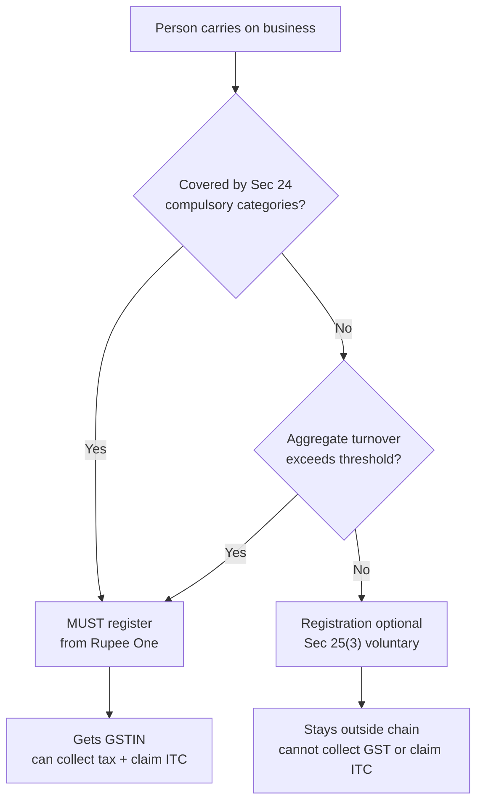
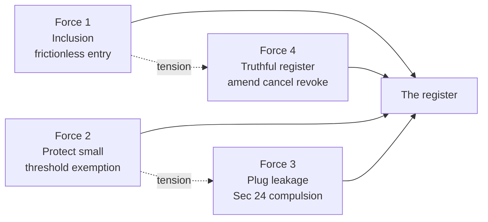
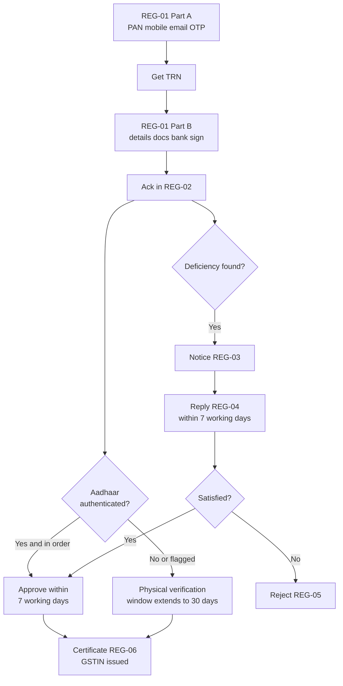
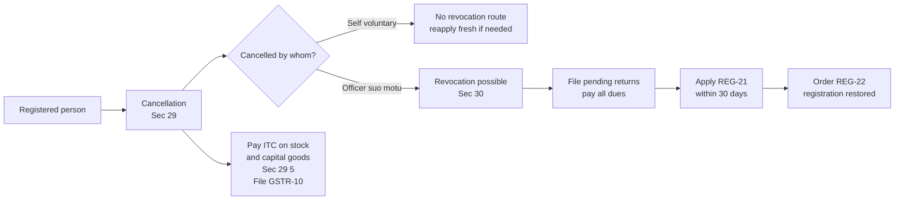

<!-- v2-deep -->

# Chapter 20 — Registration

> **Currency flag:** GST thresholds, State categorisation, and procedural timelines are amended frequently by notification. Every number in this chapter (₹40 lakh / ₹20 lakh / ₹10 lakh, the special-category State list, the 30-day and 7-working-day timelines) is stated as the settled position but **verify current thresholds, the special-category State list, and the latest amendments in the ICAI Study Material / RTP for your exam attempt** before relying on them.

---

## 1. The Problem — Who is even *allowed* into the credit chain?

GST is built on one beautiful, fragile idea: **tax is collected at every stage, but each stage gets credit for the tax paid on its inputs, so the tax sticks only on the value *it* added.** That is what kills cascading (tax-on-tax). We have spent earlier chapters admiring this seamless-credit machine.

But a machine that lets everyone freely collect tax from customers and freely claim credit from the government has an obvious hole: **how does the government even know you exist?**

Think about what the credit chain actually requires to function:

- When a buyer claims Input Tax Credit (ITC), the government must be able to check that the **seller actually deposited** that tax. That match is impossible if the seller is an anonymous person with no identity in the system.
- When a seller collects tax "on behalf of the government," the government must have a **handle** — a legal identity — through which it can demand that money, audit it, and penalise its non-payment.
- The whole system is **self-policing**: my purchase invoice is your sales invoice. For that mirror to work, both of us must be **identifiable by a common key**.

Without a gatekeeping mechanism, you would have two failures at once. Fraudsters could collect "GST" from customers and vanish (the government has nobody to chase). And genuine buyers could not claim credit, because there is no verified seller-identity to match their invoice against. The credit chain would snap.

**So before any of the credit rules can operate, the law needs a register of participants.** That register — and the identity it issues — is *registration*. It is the turnstile at the entrance of the GST stadium. This chapter is about who must pass through it, why, when, and how.

**A subtler point — why registration is *State-wise*, not entity-wise.** India's GST is a **dual GST**: on every intra-State supply, the Centre levies CGST *and* the State levies SGST on the same base. For a State to be sure its SGST is being collected and deposited inside *its own* fisc, it needs a person the State itself can identify and audit. A single all-India registration would let a Delhi-headquartered company's Tamil Nadu SGST be administered from Delhi — Tamil Nadu would lose visibility over its own tax. So the Constitution's fiscal federalism *forces* the register to be sliced State-by-State. Registration is therefore the point where **federal design and the credit chain meet**: PAN gives the Centre national traceability; the State code gives each State sovereignty over its slice.

---

## 2. The Core Idea — Registration is the licence to *participate*

Registration under GST does exactly two things, and they are the two things the entire tax rests on:

> **Only a registered person can (a) legally collect GST from customers, and (b) claim Input Tax Credit.**

That single sentence explains almost every rule that follows. Registration is not a bureaucratic formality — it is the **legal status that switches on your rights and duties inside the credit chain.**

The identity issued is the **GSTIN — Goods and Services Tax Identification Number** — a **15-character, State-wise, PAN-based** number. Decode it and you see the design intent baked in:

| Digits | Meaning | Why it is designed this way |
|---|---|---|
| 1–2 | State code (as per Census) | GST registration is **State-wise** — a person operating in 3 States needs 3 GSTINs |
| 3–12 | PAN (10 chars) | Ties GST identity to the **income-tax PAN** — one national key links direct and indirect tax, defeating identity-splitting |
| 13 | Entity code | Number of registrations of that PAN within the State |
| 14 | "Z" (default) | Reserved/blank check character |
| 15 | Checksum | Machine-verifiable — a typo'd GSTIN fails instantly, protecting the invoice-match |

**Memory hook — "PAN is the spine."** GST identity is *stapled to PAN*. No PAN, no normal registration (the lone exception is the non-resident and the TDS/TCS deductor, who can use other identity documents). This is why registration is **PAN-based and State-wise**: PAN gives national traceability; the State code gives fiscal federalism (each State's SGST must be trackable to that State).

**Two conceptual distinctions the examiner probes here:**

- **"Registered person" [Sec 2(94)] vs "taxable person" [Sec 2(107)].** A *taxable person* is one who **is registered or is *liable* to be registered**. So a person who has crossed the threshold but not yet applied is *already* a taxable person and *already* liable to tax — registration does not create the liability, it merely gives the person the machinery (GSTIN, ability to collect, ability to claim ITC) to discharge a liability that already exists. This is the doctrinal root of Example 3's asymmetry: the tax follows *liability*, the credit follows *registration*.
- **GSTIN is per-registration, not per-person.** One legal person (one PAN) can hold many GSTINs — one per State, and even several within a State (Sec 25(2)). Each GSTIN is treated as a **distinct person** for the Act. So "how many registrations" and "how many persons for GST purposes" are the same count, and can far exceed the one legal entity you started with.

---

## 3. Why It's Built This Way — Four design forces

Everything in Chapter 20 falls out of four forces. Hold these and you can *derive* the rules instead of memorising them.

**Force 1 — Enable the credit chain (inclusion).**
The system *wants* real businesses inside, because credit only flows between registered persons. Registration is therefore made **easy, online, and largely deemed-approved** — the State does not want to block genuine participants.

**Force 2 — Protect small persons (a threshold).**
Forcing a ₹15-lakh-turnover kirana store to file monthly returns and maintain the compliance apparatus would crush it and clog the system for no revenue gain. So the law grants an **exemption below a turnover threshold**. Compliance cost must be proportionate to revenue at stake.

**Force 3 — Plug leakage where the threshold would be abused (compulsory registration).**
Some activities are *so leakage-prone* that letting a small-turnover person stay outside the net would break the system regardless of size. Example: an e-commerce operator, or a person making inter-State supplies, or someone liable under reverse charge. Here **Section 24 overrides the threshold** — register from Rupee One.

**Force 4 — Keep the register truthful (amendment / cancellation / revocation).**
A register is only useful if it reflects reality. Businesses change address, add partners, stop trading, or turn fraudulent. So the law needs live maintenance: **amendment** (edit the record), **cancellation** (remove a person who should no longer be in), and **revocation** (a safety valve to reverse a wrongful/repaired cancellation). Without this, the register rots and the invoice-match degrades.

**How the four forces *interact* — the tension you must feel.** Force 1 (frictionless entry) and Force 4 (truthful register) pull against each other: the easier you make entry, the more fake registrations slip in, and the harder the register is to keep clean. The **entire history of GST registration amendments** is the see-saw between these two — deemed approval and OTP-based entry (Force 1) were later tightened with **Aadhaar authentication, biometric verification, and physical verification** (Force 4) precisely because frictionless entry was being exploited by "bill-trading" fraudsters who registered fake firms to pass on ITC without any real supply. If you understand this see-saw, every procedural amendment the ICAI adds each year will make sense to you on sight.

*Figure 20.1 — The registration decision at the highest level: compulsory categories are tested BEFORE the threshold, because Section 24 overrides turnover.*

*Figure 20.5 — The four forces and the two built-in tensions. Inclusion fights truthfulness (easy entry invites fraud) and the small-person threshold fights leakage-plugging (Sec 24 exists exactly where the threshold would be abused).*

---

## 4. Full Technical Content — Every provision, wrapped in its reason

### 4.1 The pivotal concept: "Aggregate Turnover" [Sec 2(6)]

The threshold is measured on **aggregate turnover**, not on the turnover of one branch or one product. *Why aggregate?* Because if the test were per-branch, a person could split a ₹1-crore business into ten ₹10-lakh "shops" and each stay below the limit. Aggregation defeats fragmentation.

**Aggregate Turnover = Taxable supplies + Exempt supplies + Exports + Inter-State supplies** of persons having the **same PAN, computed on an all-India basis.**

What is **included** and what is **excluded** — and the "why":

| Component | In / Out | Reason |
|---|---|---|
| Taxable supplies | **Include** | Core business turnover |
| Exempt supplies (incl. nil-rated, non-taxable) | **Include** | Threshold is about *scale of business*, not tax collected — a large exempt trader is still "large" |
| Exports / zero-rated | **Include** | Still economic activity of scale |
| Inter-State supplies | **Include** | Counts toward scale |
| **CGST, SGST, IGST, UTGST, Cess** | **Exclude** | Tax is not your turnover — it is collected *for* the government |
| **Inward supplies taxed under reverse charge** | **Exclude** | RCM is tax you *pay as recipient*; it is not *your* outward supply |
| Value of supplies as a **pure agent** (job-work goods for the principal, etc.) | Excluded on all-India same-PAN basis but computed together | Prevents double counting across the same PAN |

**Memory hook — "Everything you *sell* counts (even exempt); nothing you *pay as tax or as recipient* counts."**

> **Exam trap alert:** aggregate turnover **includes exempt supplies** for the *threshold* test, even though exempt supplies give no ITC. Students routinely drop exempt turnover here and get the registration answer wrong.

**Finer distinctions the exam tests inside "aggregate turnover":**

- **"Aggregate turnover" vs "turnover in a State."** Aggregate turnover is the **all-India, same-PAN** figure and is used for the **threshold** and for **composition eligibility**. "Turnover in State/UT" [Sec 2(112)] is the single-State slice and is used for computing the **composition levy** and certain State-level calculations. Do not use one where the other is intended: the *threshold* test is always the all-India aggregate.
- **Exempt supply is a wide bucket [Sec 2(47)]** — it includes nil-rated, wholly exempt, *and* non-taxable supplies (e.g. alcoholic liquor for human consumption, the five petroleum products currently outside GST). All of these still count toward aggregate turnover. This is why a petrol-pump dealer or a liquor vendor can be forced to look at the threshold even though their core product is outside GST.
- **Interest / discount on deposits, loans, advances.** By explanatory clarification, the *value of exempt services by way of extending deposits/loans/advances where consideration is interest or discount* is **not** counted for the special-category composition/threshold context in the manner prescribed — but for the general aggregate-turnover threshold, interest income being an exempt supply is generally includible. **This carve-out is nuanced and periodically clarified — verify the exact treatment in current ICAI material** before applying it in a numerical.
- **Same PAN, all establishments.** If Mr X owns a proprietorship *and* is a partner drawing a share of profit, only supplies made **on the same PAN** aggregate. A partner's profit share is not a supply and does not aggregate; but two proprietary businesses of Mr X under his one PAN **do** aggregate — even if in different States and different trades.

### 4.2 The threshold limits — and WHY they differ [Sec 22]

Section 22: a supplier must register in a State/UT if aggregate turnover in a financial year **exceeds** the threshold.

The threshold is **not one number** — and the differences are deliberate:

| Category of person | Threshold (aggregate turnover p.a.) | Design reason |
|---|---|---|
| **Supplier of GOODS** (exclusively), normal States | **₹40 lakh** | Goods traders are numerous and low-margin; a higher floor keeps small shopkeepers out of the net |
| **Supplier of SERVICES** (or goods + services), normal States | **₹20 lakh** | Services are harder to track (no physical stock trail), so the net is cast wider — lower floor |
| **Special-category States** — services / mixed | **₹10 lakh** | These States are smaller economies; ₹10L is "large" locally, and the revenue base needs protection |
| **Special-category States** — goods (specified States) | **₹20 lakh** | A middle floor reflecting their smaller economies |

**Why goods (₹40L) get a higher floor than services (₹20L):** Goods leave a **physical trail** — stock, e-way bills, transport records — so a small unregistered goods trader is comparatively low-risk and easy to catch later if needed. Services leave **no such trail**; an unregistered service provider is nearly invisible. The law therefore pulls services into the net at half the turnover.

**Why special-category States get a lower floor (₹10L):** These are the constitutionally recognised smaller/hilly/border States (the "special category" list). Their economies are smaller, so what looks tiny nationally is significant locally; a lower threshold protects their SGST base. **The special-category list is periodically re-notified — verify the exact list for your attempt** (historically it has moved between the full 11 north-eastern/hill States and a reduced set, with some States opting up to ₹20L or ₹40L).

**The three-tier reality of the special-category list (why students get this wrong).** For the *registration* threshold, the States are effectively in three baskets, and you must know which basket a State is in for your attempt:

1. States at **₹10 lakh** (services/mixed) — the smallest economies (historically Manipur, Mizoram, Nagaland, Tripura).
2. States that **opted up to ₹20 lakh** even though special-category (historically Arunachal Pradesh, Meghalaya, Sikkim, Uttarakhand, Puducherry, Telangana at various times).
3. States that are treated as **normal ₹20L / goods-₹40L** despite being "special category" for other constitutional purposes (e.g. Jammu & Kashmir, Assam, Himachal, Ladakh have at points opted into the ₹40L goods limit).

The lesson: **"special category State" for Article 279A purposes is NOT the same list as "special category for the registration threshold."** The registration list is a *notified sub-set that States themselves opted into*. Never map them one-to-one — **verify the current basket for the named State in your attempt's ICAI material.**

**The ₹40 lakh goods enhancement carries fine print** (all must hold, else fall back to ₹20L):
- Supplier is engaged **exclusively in supply of goods** (any service supply, even small, drops you to ₹20L);
- Not making **inter-State** supplies;
- Not a compulsory-registration person under Sec 24;
- Not supplying specified goods (e.g. ice cream, pan masala, tobacco, fly ash bricks and similar notified items);
- Not registered voluntarily.

**One statutory relief that saves the ₹40L limit — the interest carve-out.** A person who is otherwise "exclusively goods" but who *also* earns **interest/discount on deposits, loans or advances** is **still treated as exclusively supplying goods** for the ₹40L limit (interest, though an exempt *service*, is ignored for this exclusivity test). This is a favourite examiner tweak: "a goods trader who also has ₹2L bank interest income — does the interest drop him to ₹20L?" **No** — interest is disregarded for the exclusivity test, so the ₹40L limit survives (verify wording in current material).

**Memory hook — "40-20-10, and *services always sit at 20*."** If services are anywhere in the picture (normal State), the number is ₹20L. Goods-only-and-clean gets you the ₹40L upgrade.

**"Exceeds" is strict, and the timing subtlety.** The section says turnover must **exceed** the limit — so turnover of *exactly* ₹40,00,000 (goods) does **not** trigger registration; ₹40,00,001 does. Also, liability arises **during the financial year at the moment turnover crosses the limit** — you do not wait for year-end. The 30-day clock (Sec 25(1)) starts from that crossing date, which is why mid-year threshold crossings (Example 3) are so heavily tested.

### 4.3 Persons NOT liable to register [Sec 23]

The law also *names people it does not want to burden*, because forcing them in adds compliance with no revenue or tracking benefit:

- A person supplying **exclusively exempt / nil-rated / non-taxable** goods or services (there is no output tax to collect, so why register?);
- An **agriculturist**, to the extent of supply of produce out of cultivation of land;
- Persons making supplies **wholly under reverse charge** (the *recipient* pays the tax, so the supplier collects nothing — nothing to police at the supplier).

*Why Sec 23 overrides even Sec 22:* if your entire output is exempt, hitting the ₹40L threshold is irrelevant — there is literally no tax to collect. **Sec 23 (not liable) is checked to relieve; Sec 24 (compulsory) is checked to compel.** When both a "not liable" and a "compulsory" character could apply, note the interplay carefully (e.g., a person supplying exclusively exempt goods is genuinely outside — but the moment any taxable or Sec-24 element appears, the analysis changes).

**The Sec 23 vs Sec 24 hierarchy — a genuine drafting question the ICAI has flagged.** Section 23 opens with its own overriding language, and the amended Sec 23(2) gives the Government power to exempt specified categories from registration **notwithstanding Sec 22 or Sec 24**. The practical exam position taught in ICAI material: a person supplying **wholly RCM-based** supplies is relieved under Sec 23 *even though* "reverse charge recipient" is a Sec 24 category — because as a *supplier* he collects nothing. Contrast: a person who is *liable to pay under RCM as recipient* is squarely inside Sec 24. So the same three letters "RCM" land you in Sec 23 (as a wholly-RCM *supplier*) or Sec 24 (as an RCM-*recipient*) depending on **which side of the transaction you are on**. This is one of the sharpest traps in the chapter.

**The agriculturist carve-out is narrow.** "Agriculturist" [Sec 2(7)] means an **individual or HUF** who cultivates land **personally, or by own labour / family labour / servants on wages / hired labour under personal supervision**. A company or a partnership firm doing agriculture is **not** an agriculturist and gets no Sec 23 relief on that ground. And the relief covers only **produce out of cultivation of land** — a farmer who *also* trades in purchased grain is supplying beyond his own produce and must test the threshold on that trading turnover.

### 4.4 Compulsory registration [Sec 24] — threshold IRRELEVANT

Section 24 begins "**notwithstanding** anything in Sec 22(1)" — meaning **turnover does not matter; these persons register from the first rupee.** Learn the *reason category*, not the list:

| Compulsory category (Sec 24) | The leakage it plugs |
|---|---|
| Persons making **inter-State taxable supply** (of goods) | Cross-border trade must be tracked at both ends; can't be invisible |
| **Casual taxable person** (occasional supply, no fixed place e.g. exhibition stall) | Would otherwise supply and vanish — pin them down with advance-deposit registration |
| Persons liable under **reverse charge** (as recipient) | Recipient becomes the tax-payer — must be registered to deposit and be audited |
| Persons liable to pay tax under **Sec 9(5)** (e-commerce specified services) | The ECO pays; must be registered |
| **Non-resident taxable person** | No Indian PAN/place — needs a controlled, time-bound registration |
| Persons required to deduct **TDS (Sec 51)** | They withhold government money — must be identifiable |
| **E-commerce operators** required to collect **TCS (Sec 52)** | They sit on others' money and data — the biggest tracking node in the system |
| Persons supplying **through an ECO** (who are liable to collect TCS) | Each seller on the platform must be matchable |
| **Input Service Distributor (ISD)** | Distributes credit — must be registered to do so validly |
| Persons supplying **on behalf of another** (agents) | The agent's supplies must tie back |
| Person supplying **OIDAR** services from outside India to an unregistered Indian recipient | Otherwise wholly untaxed cross-border digital services |

**Two important carve-outs (relief within Sec 24):** Persons making **inter-State supply of *services*** up to ₹20L are exempted from compulsory registration (notification), because forcing every small freelancer serving another State to register was disproportionate. Similarly, small suppliers **through an ECO of *services*** got threshold relief. *Why the split?* Same Force-2 logic: services are lower-value-per-supply and the compliance burden on tiny service providers outweighed the leakage — so the compulsory hammer was softened *for services only*.

**A third, newer carve-out to know — inter-State supply of *specified handicraft / notified goods*.** Persons making inter-State supplies of **notified handicraft goods** (and certain notified products made by craftsmen) are **exempted from compulsory registration up to the ₹20L (₹10L special-category) threshold**, provided they have a PAN and generate e-way bills. *Why?* Artisans selling across State lines at melas are exactly the small, low-margin persons Force 2 protects — the blanket "inter-State goods = register" rule would have crushed them. **Verify the current notified list and conditions for your attempt.**

**Memory hook — "Sec 24 = people who touch *someone else's* tax or cross a *border*."** Inter-State, reverse charge, TDS/TCS, ECO, agents, ISD, non-residents — in every case the person is handling tax that isn't purely their own domestic small-scale output. That is why turnover is irrelevant: the risk is structural, not scale-based.

**The Sec 9(5) / e-commerce distinction the examiner loves.** Three different persons can all be "e-commerce" and each has a *different* registration consequence:

- The **ECO liable to pay tax under Sec 9(5)** (e.g. platform for passenger transport, restaurant service, certain accommodation) — the *platform itself* pays GST as if it were the supplier → compulsorily registered.
- The **ECO liable to collect TCS under Sec 52** (e.g. a marketplace for goods) — the platform *collects tax at source* on behalf of its sellers → compulsorily registered.
- The **supplier selling *through* an ECO** — compulsorily registered **only if** the ECO is one required to collect TCS; but a supplier of **services** (other than Sec 9(5) services) selling through an ECO gets **threshold relief up to ₹20L**. A supplier of **goods** through a TCS-ECO must register from Rupee One.

So "I sell through Amazon/Zomato" is not one answer — it depends on **goods vs services** and **which sub-category of ECO** the platform is. This is a classic multi-part MCQ.

### 4.5 Special persons

- **Casual Taxable Person (CTP)** and **Non-Resident Taxable Person (NRTP):** Since they have no permanent stake, they must **deposit estimated tax in advance** and get registration valid for **90 days (extendable by 90 more)**. *Why advance deposit?* They could otherwise supply at an exhibition and disappear owing tax — the deposit is the government's security.
- **Voluntary registration [Sec 25(3)]:** A below-threshold person *may* register to enter the credit chain (e.g., a small supplier whose B2B customers demand ITC). Once registered, **all provisions apply as to any registered person** — you can't enjoy ITC benefits and skip return-filing duties.
- **Single vs multiple registrations [Sec 25(2)]:** One registration per State/UT is the default, but a person with **multiple places of business in a State may obtain separate registrations for each** (each then treated as a distinct person, and supplies between them are taxable). *Why allow it?* Different verticals may want independent compliance/credit pools.
- **Distinct persons [Sec 25(4)/(5)]:** Establishments of the same PAN in **different States** are **distinct persons** — a stock transfer between them is a *supply* and attracts GST. *Why?* Each State's SGST base must be independently preserved; without "distinct persons," inter-State stock movement inside one company would escape the State-wise design.

**Finer points on CTP vs NRTP (they are *not* the same person):**

| Feature | Casual Taxable Person (CTP) | Non-Resident Taxable Person (NRTP) |
|---|---|---|
| Who | Has a business/PAN in India but supplies *occasionally* in a State where he has **no fixed place** | Has **no fixed place of business or residence in India** at all |
| PAN | Uses his existing **PAN** | Usually **no PAN** — registers on the strength of other ID (e.g. passport / tax ID of home country) via Form **REG-09** |
| Application form | REG-01 | **REG-09** (separate form) |
| Advance deposit | Estimated **net** tax liability | Estimated tax liability |
| ITC | Can claim ITC (normal rules) | **Cannot claim ITC** except on goods imported by him — a major restriction |
| Validity | 90 days (+90) | 90 days (+90) |

*Why NRTP is denied ITC:* he has no ongoing Indian presence to audit and the credit chain would be hard to police across borders — so the law lets him pay tax but broadly denies input credit (except on his own imports). Examiners test the CTP/NRTP swap by giving a foreign entity a temporary Indian stall and asking whether it can net off input credit — the answer turns on whether it is an NRTP (no PAN, no ITC) or merely a CTP.

**The advance-deposit mechanics (numerically testable).** The CTP/NRTP deposits an amount equal to the **estimated tax liability for the period of registration sought**. This deposit is credited to the **electronic cash ledger** and is used to discharge the actual liability shown in returns. If the estimate exceeded actuals, the **excess is refundable** — but only **after all returns for the registration period are filed**. On extension of the 90-day period, a **further advance deposit** for the extended period must accompany the extension application (Form REG-11). So the deposit is a rolling security, not a one-time fee.

**Voluntary registration — the trade the small person is really making.** By registering voluntarily under Sec 25(3), a below-threshold person *buys* the right to pass on ITC to B2B customers (making itself an attractive vendor) but *pays* with the full compliance load — monthly/quarterly returns, e-invoicing where applicable, and the **Sec 29 cancellation risk if it does not commence business within 6 months** or stops filing. The exam framing: "should a ₹12L B2B component-maker register voluntarily?" — the answer is a reasoned *yes if its customers demand ITC-bearing invoices, no if its customers are unregistered/final consumers* (to whom ITC is worthless and who only see a higher price).

### 4.6 Procedure & Timelines [Sec 25, Rules 8–11]

The design goal (Force 1) is **frictionless entry**, so the process is online and default-approved.

**When to apply [Sec 25(1)]:** within **30 days** from the date the person **becomes liable** to register. (A CTP/NRTP must apply **at least 5 days prior** to commencing business.)

**Step-by-step:**

1. **PART A of Form GST REG-01** — declare PAN, mobile, email. PAN is validated on the portal; mobile and email are **OTP-verified**. You receive a **TRN (Temporary Reference Number).**
2. **PART B of REG-01** — using the TRN, submit business details, place(s) of business, bank details, authorised signatory, and upload documents. Verify via **DSC / e-signature / EVC**.
3. **Acknowledgement in REG-02** is issued.
4. **Aadhaar authentication (Rule 8)** — if the applicant opts and succeeds, processing is faster. *Why Aadhaar?* It is an anti-fraud tightening — fake registrations exploded, so biometric/Aadhaar authentication (and physical verification where flagged) was added.
5. **Officer's scrutiny:**
   - If in order (and Aadhaar authenticated): **approve within 7 working days**.
   - If Aadhaar **not** authenticated / flagged for risk: **physical verification of premises** may be done and the window extends (commonly **30 days**).
   - If deficiency: **notice in REG-03** within the period; applicant replies in **REG-04 within 7 working days**; officer may reject via **REG-05**.
6. **Deemed approval:** if the officer takes **no action within the prescribed period**, registration is **deemed granted.** *Why deemed approval?* Force 1 again — the State should not be able to strangle genuine entry by inaction.
7. **Certificate in Form GST REG-06** is issued with the GSTIN.
8. **Effective date of registration:**
   - If applied **within 30 days** of becoming liable → effective from the **date of liability** (so no gap; supplies from day one are covered).
   - If applied **late** → effective from the **date of grant** (the gap period's tax exposure sits on you, but ITC of that gap is lost — the penalty for delay).

**The three timelines inside "deemed approval" — know which clock applies.** The prescribed period for the officer to act depends on the anti-fraud track:

| Situation | Officer's window before deemed approval |
|---|---|
| Aadhaar authenticated, no risk flag | **7 working days** |
| Aadhaar **not** opted / authentication **failed** | **30 days** (physical verification / deeper scrutiny may be done) |
| Applicant flagged as **high-risk** on biometric/data analytics | Extended per rules — physical verification of premises before grant |

So "the officer did nothing — is registration deemed granted after 7 days?" is a *trick* unless you first ask **was Aadhaar authenticated?** If not, the deemed-approval clock is **30 days**, not 7.

**Rule 9 / Rule 25 physical verification.** Where Aadhaar is not done, or the officer deems it fit even after Aadhaar, the premises may be **physically verified**; the verification report with photographs is uploaded in **Form REG-30** within the prescribed period. This is the Force-4 tightening layered onto the Force-1 fast lane.

**Suo-motu / temporary registration by the department [Rule 16].** If, during a survey/inspection, the officer finds an *unregistered* person who was liable, the officer can **grant registration on a temporary basis** and issue an order in **REG-12**. The person must then either apply properly within 90 days or, if he appeals and wins, be treated accordingly. *Why?* So a caught evader cannot escape the net merely by never having applied — the department can drag him in.

**Physical location matters — "place of business" documentation.** The applicant must prove the principal place of business (ownership deed / rent agreement + consent letter + a utility bill). A frequent real-world (and MCQ) failure: a **virtual office / co-working desk** without a valid address proof is a top reason for REG-03 deficiency notices and rejection under the anti-fraud tightening.

*Figure 20.3 — Registration procedure and the two speed-lanes (Aadhaar-authenticated fast track vs physical-verification slow track), plus deemed approval on official inaction.*

### 4.7 Amendment of registration [Sec 28, Rule 19]

*Why amendment exists (Force 4):* the register must mirror reality. Change something → tell the department in **REG-14 within 15 days** of the change.

| Type of change | Officer approval needed? | Reason |
|---|---|---|
| **Core fields** — legal name (no PAN change), principal/additional place of business, addition/deletion of partners/directors/karta | **Yes** — officer must approve (order in REG-15); acts within 15 working days | These affect *who and where* — high fraud value, must be vetted |
| **Non-core fields** — most other details (e.g. contact, minor particulars) | **No** — auto-amended on portal | Low risk, so no friction |
| Change requiring **fresh PAN** (change of constitution altering PAN, e.g. proprietorship → company) | Cannot be amended — **fresh registration** | GSTIN is PAN-based; a new PAN is a new legal person |

**The three-bucket rule, and the deemed-amendment trap.** Amendments fall into three buckets: **core (officer approval)**, **non-core (auto)**, and **PAN-changing (fresh registration, not amendment at all)**. Two exam points:

- For **core** amendments, if the officer **fails to act within 15 working days** on the REG-14, the amendment is **deemed approved** — the same Force-1 anti-inaction logic as fresh registration.
- **Change of the principal place of business or of the constitution *not* changing PAN** is *core*, but a change of business **from one State to another** is not an "amendment" — it is a **new registration in the new State plus cancellation of the old** (State-wise design again).
- **Change of mobile/email of the authorised signatory** is done through OTP verification, treated as a non-core/portal change — not a core amendment.

### 4.8 Cancellation of registration [Sec 29, Rule 20–22]

*Why cancellation (Force 4):* remove those who should no longer be in the net, or eject fraud.

**By the registered person (voluntary) or legal heirs**, e.g. business discontinued, transferred, amalgamated, constitution changed, or turnover fell and person no longer liable.

**By the proper officer (suo motu)**, for cause — the leakage-plugging teeth:
- Contravention of specified provisions;
- A composition dealer not filing returns for **specified tax periods**;
- Any other registered person **not filing returns for a continuous period** (as prescribed);
- **Voluntary registrant not commencing business** within 6 months;
- Registration obtained by **fraud, wilful misstatement or suppression**;
- Not conducting business from the declared place / issuing invoices without supply (bill-trading).

**Process:** show-cause **REG-17** → reply **REG-18** → order **REG-19**. The officer cannot cancel without opportunity of being heard (natural justice).

**The sting — Reversal on cancellation [Sec 29(5)]:** on cancellation, the person must **pay back**, by way of debit to the electronic credit/cash ledger, an amount equal to the **ITC on inputs held in stock, inputs in semi-finished/finished goods, and on capital goods** (reduced as prescribed) — **or the output tax on such goods, whichever is higher.** *Why?* You claimed credit as a chain participant; on exit you leave with tax-free stock in hand unless you disgorge that credit. This closes the exit-leak. **Final Return in GSTR-10** must be filed within 3 months.

**Finer distinctions on cancellation:**

- **Capital goods clawback is computed differently from inputs.** For **inputs** (in stock or embedded in finished/semi-finished goods) you reverse the **actual ITC** relatable to that stock. For **capital goods** you reverse the **ITC taken reduced by the prescribed percentage per quarter of use (5% per quarter or part thereof), OR the tax on the transaction value of such capital goods, whichever is higher** (Rule 44 / 40). So capital goods used for a long time may carry a *smaller* reversal — the credit is treated as "consumed" over its life. This is a genuinely numerical sub-topic.
- **"Whichever is higher" protects revenue on both sides.** If you sell the exit stock (output tax) for more than the embedded credit, you pay the output tax; if the credit exceeds a distressed sale price, you still disgorge the full credit. You cannot game the exit by dumping stock cheap.
- **Cancellation date can be retrospective.** The officer may cancel **from a back-date** (e.g. from the date the fraud started or from the date business ceased) — with consequences for the ITC others claimed against your invoices in the interim. **A recipient's ITC can be denied if the supplier's registration is cancelled retrospectively** — a real risk the examiner may weave into an ITC problem.
- **Cancellation does not extinguish past dues [Sec 29(3)].** Cancelling the registration does **not** wipe out tax, interest or penalty already due for periods *before* cancellation — the liability survives the registration. Students wrongly assume cancellation is a clean exit.
- **Suspension pending cancellation [Rule 21A].** Once a person applies for cancellation, or once the officer initiates suo-motu cancellation, the registration may be **suspended** during the proceedings — the person **cannot make taxable supplies or issue tax invoices** while suspended, and need not file returns for the suspension period. This prevents a doomed registration from continuing to pass on ITC while its cancellation is pending — a direct Force-4 plug.

### 4.9 Revocation of cancellation [Sec 30, Rule 23]

*Why revocation (Force 4 — the safety valve):* cancellation by the officer can be wrong, or the defaulter can cure the default (file the missing returns, pay dues). The system should let a *repaired* or *wrongly-ejected* person back in rather than force a costly fresh registration and loss of history.

- Applies **only where the officer cancelled suo motu** (you cannot "revoke" your own voluntary cancellation).
- Apply in **REG-21 within 30 days** of the cancellation order (this period is extendable by the proper officer / Commissioner up to a further specified period — **verify the current extension window**).
- **Precondition:** all pending returns must be furnished and all dues (tax, interest, penalty) paid before/along with the application — you must *cure the default first*.
- Officer's order in **REG-22** (revoke) or rejects after notice (REG-23) and reply (REG-24).

**The extension ladder (know the current numbers, but the *structure* is stable).** The base window is **30 days** from service of the cancellation order; this can be extended by the **proper officer** by a further period, and beyond that by the **Commissioner** by a further period (historically 30 + 30 + 30). Where cancellation was for **non-filing of returns**, a special condition applies: the person must first **file all pending returns and pay all dues** — and only then is the revocation application even entertained. **Verify the exact extension windows for your attempt** as these have been amended repeatedly.

**Revocation vs fresh registration — why one is far better.** A revoked registration **keeps the same GSTIN and the entire transaction/ITC history intact**; a fresh registration starts a **new GSTIN**, breaks the audit trail, and can strand the ITC on stock accumulated under the old number. So a wrongly-cancelled genuine business *always* prefers revocation. This is why Sec 30 exists as a distinct route rather than telling everyone to "just re-apply."

*Figure 20.4 — Cancellation vs revocation. Revocation is available ONLY against officer-initiated cancellation, and only after the default is cured.*

---

## 5. Worked Examples

### Example 1 — The exempt-turnover trap (threshold computation)

**Facts:** *Mehta Traders*, operating **only in Maharashtra** (a normal State), supplies **exclusively goods**. During FY, its supplies are:
- Taxable goods: ₹28,00,000
- Exempt goods: ₹9,00,000
- Nil-rated goods: ₹4,00,000
It also paid ₹1,50,000 GST under **reverse charge** on inward legal services. No inter-State supply, no Sec-24 category, no specified goods.

**Is registration required?**

**Step 1 — pick the threshold.** Goods-only, normal State, clean of all disqualifiers → the enhanced **₹40 lakh** threshold applies.

**Step 2 — compute aggregate turnover.** Include *all outward supplies* (taxable + exempt + nil-rated); **exclude** the reverse-charge inward supply.
= 28,00,000 + 9,00,000 + 4,00,000 = **₹41,00,000.**

**Step 3 — compare.** ₹41,00,000 **> ₹40,00,000** → **registration is required.**

**Reconciliation / the lesson:** Had we (wrongly) dropped the exempt + nil-rated ₹13,00,000, we'd have got ₹28,00,000 and concluded "no registration." **Aggregate turnover includes exempt supplies for the threshold test** — that ₹13L is exactly what pushes Mehta over. The RCM ₹1.5L is correctly excluded (it's inward, not Mehta's outward supply). *Answer: liable to register.*

### Example 2 — Services drag the threshold down, and Sec 24 overrides both

**Facts:** *Rao Consultancy* in Telangana (normal State) has aggregate turnover of **₹19,00,000**, entirely from **consultancy services** (intra-State). Separately, it made a **single inter-State supply of goods** worth ₹50,000 (sale of an old design mock-up to a Karnataka client).

**Is registration required?**

**Step 1 — threshold if we only looked at turnover.** Services → threshold is **₹20 lakh**, not ₹40L. ₹19,00,000 < ₹20,00,000 → *would* be below threshold.

**Step 2 — but check Sec 24 FIRST (per Figure 20.2 order).** Rao made an **inter-State taxable supply of goods** (₹50,000). Inter-State supply of *goods* is a **Sec 24 compulsory category — threshold irrelevant.**

> Note the services carve-out does *not* rescue Rao: the exemption from compulsory registration for small inter-State suppliers applies to inter-State supply of **services** up to ₹20L. Rao's inter-State supply was of **goods**, so the carve-out doesn't apply.

**Step 3 — conclusion.** Despite turnover below ₹20L, **Rao must register compulsorily** because of the inter-State supply of goods.

**Reconciliation / the lesson:** This is the classic "Sec 24 beats Sec 22" trap. A single ₹50,000 inter-State *goods* supply forces full registration on a ₹19L service firm. Had the ₹50,000 inter-State supply been of **services**, the carve-out would have kept Rao out (below ₹20L). *Answer: liable to register (compulsorily under Sec 24).*

### Example 3 — Effective date, and the cost of applying late

**Facts:** *Nair Foods* (goods-only, Kerala) crossed ₹40,00,000 aggregate turnover on **10 August**. It applied for registration on **25 September** and was granted registration on **1 October.** Between 10 August and 25 September it made taxable supplies of ₹6,00,000 and bought inputs bearing ₹90,000 GST.

**(a) From what date is registration effective? (b) What is the consequence?**

**Step 1 — was the 30-day window met?** Liability arose 10 August. 30 days ends **9 September**. Nair applied on **25 September** — **late by 16 days.**

**Step 2 — effective date rule.** Because the application was **not within 30 days**, registration is effective from the **date of grant = 1 October**, *not* from 10 August.

**Step 3 — consequences of the gap (10 Aug – 30 Sep).**
- Nair was **liable** to pay tax from 10 August (liability arises on crossing the threshold, independent of when registration is granted) — so tax on the ₹6,00,000 of supplies in the gap is still owed, plus interest/penalty for the delay.
- But because registration is effective only from 1 October, Nair **cannot claim the ₹90,000 ITC** on inputs bought during the gap under the normal transition rule for a timely applicant. (A timely applicant — applying within 30 days — gets registration from the date of liability and can claim ITC on inputs in stock as on that date. Late application forfeits that transition benefit.)

**Reconciliation / the lesson:** The 30-day rule is not cosmetic. **Apply within 30 days → effective from date of liability → no lost ITC on opening stock. Apply late → effective from grant date → you still owe output tax for the gap but lose the gap-period input credit.** The asymmetry (tax owed, credit lost) is the deliberate penalty that enforces timely registration. *Answer: effective 1 October; ₹6L supplies still taxable with interest; ₹90,000 gap-ITC lost.*

### Example 4 — Casual taxable person at a trade fair

**Facts:** *Bengal Handlooms* (registered in West Bengal) wants a **20-day stall at a Delhi trade fair**, expecting ₹8,00,000 of supplies there. It has no fixed place in Delhi.

**What must it do?**

**Step 1 — identify the character.** Occasional supply in a State where it has no fixed place of business = **Casual Taxable Person (CTP)** in Delhi. CTP is a **Sec 24 compulsory** category — threshold irrelevant.

**Step 2 — timing & deposit.** Apply for registration **at least 5 days before** commencing business at the fair. Deposit **advance tax** equal to the estimated tax liability (roughly the GST on the expected ₹8,00,000).

**Step 3 — validity.** Registration is valid for **90 days** (or the period requested), extendable once by **90 more days.**

**Reconciliation / the lesson:** The advance deposit is the government's security against a supplier who will pack up and leave. *Answer: register as CTP in Delhi ≥5 days ahead, deposit estimated tax, registration valid up to 90+90 days.*

### Example 5 — The exclusivity break: one small service kills the ₹40L limit

**Facts:** *Verma Hardware* (Uttar Pradesh, a normal State) has aggregate turnover of **₹38,00,000**, of which **₹37,60,000 is sale of hardware goods** (intra-State) and **₹40,000 is a repair/installation *service*** it performs at customers' sites. No inter-State supply, no Sec-24 category, no specified goods.

**Is registration required?**

**Step 1 — does the ₹40L limit apply?** The ₹40L enhanced limit is for a supplier engaged **exclusively in supply of goods.** Verma also supplies a **service** (₹40,000 of repair). It is therefore **not exclusively goods** → the enhanced limit is **lost**; the applicable threshold falls to **₹20 lakh.**

**Step 2 — compare.** Aggregate turnover ₹38,00,000 **> ₹20,00,000** → **registration is required.**

**Reconciliation / the lesson:** A tiny ₹40,000 of service — barely 1% of turnover — knocks Verma out of the ₹40L club and down to ₹20L, flipping the answer from "not liable" (had ₹40L applied to ₹38L) to "liable." Contrast this with the **interest carve-out**: had the extra ₹40,000 been *bank interest* rather than a supplied service, the exclusivity test *ignores* interest and the ₹40L limit would have survived (₹38L < ₹40L → not liable). *Answer: liable to register — the service breaks exclusivity and drops the limit to ₹20L.* **Examiner tweak to watch:** swap the ₹40,000 between "installation service" (breaks exclusivity → liable) and "interest on fixed deposit" (ignored → not liable) — the answer reverses.

### Example 6 — Cancellation clawback on inputs and capital goods

**Facts:** *Sethi Textiles* applies to cancel its registration (business discontinued) effective 31 March. On that date it holds:
- Raw material (inputs) in stock on which ITC of **₹1,20,000** was taken;
- Finished goods whose embedded inputs carried ITC of **₹80,000**;
- A machine (capital goods) bought **13 months ago** on which ITC of **₹3,00,000** was originally taken; its current transaction (sale) value would bear GST of **₹1,90,000.**

**What must Sethi pay back under Sec 29(5)?**

**Step 1 — inputs (raw material + embedded in finished goods).** Reverse the ITC relatable to inputs held in stock and in finished/semi-finished goods = 1,20,000 + 80,000 = **₹2,00,000.**

**Step 2 — capital goods.** Two candidate amounts:
- (a) **ITC reduced by 5% per quarter of use.** 13 months = **5 quarters (part of a quarter counts as a full quarter)**. Reduction = 5 × 5% = 25%. Remaining = ₹3,00,000 × (100% − 25%) = ₹3,00,000 × 75% = **₹2,25,000.**
- (b) **Output tax on transaction value** = **₹1,90,000.**
- Sec 29(5) / Rule 44 take the **higher** = **₹2,25,000.**

**Step 3 — total payable on cancellation** = inputs ₹2,00,000 + capital goods ₹2,25,000 = **₹4,25,000**, debited to the electronic credit/cash ledger. **File GSTR-10 within 3 months.**

**Reconciliation / the lesson:** Capital-goods reversal is *time-sensitive* — had the machine been used for, say, 4 years (16 quarters), the reduction would be capped at the point where remaining credit falls below the transaction-value tax, and then the **₹1,90,000 output-tax figure would win** as the higher amount. The "5% per quarter, part = full quarter" rule and the "whichever is higher" gate are exactly what the examiner checks. *Answer: ₹4,25,000 (₹2,00,000 on inputs + ₹2,25,000 on capital goods).* **Verify the current Rule 44/40 percentages for your attempt.**

### Example 7 — Aadhaar not done: which deemed-approval clock?

**Facts:** *Khan Enterprises* submits a complete, in-order REG-01 on 1 June but **does not opt for Aadhaar authentication.** The proper officer issues **no notice and takes no action.** Khan claims registration is "deemed granted" after 7 working days and starts issuing tax invoices from 12 June.

**Is Khan right?**

**Step 1 — which track?** Because Aadhaar was **not** authenticated, Khan is **not** on the 7-working-day fast lane. The officer's window (and the possibility of **physical verification**) extends the deemed-approval period to **30 days.**

**Step 2 — consequence.** Registration is **not** deemed granted on the 7th working day. Invoices Khan issued from 12 June, before the registration is actually/deemed granted, are issued by an **unregistered person** — he cannot lawfully collect GST or issue a *tax* invoice yet, and premature collection attracts penalty.

**Reconciliation / the lesson:** The deemed-approval clock is **conditional on Aadhaar.** No Aadhaar (or failed authentication) → **30-day** window with possible physical verification, not 7 days. *Answer: Khan is wrong — deemed approval is 30 days here; he registered/collected prematurely.* **Examiner tweak:** flip "did not opt for Aadhaar" to "Aadhaar authenticated successfully" and the 7-working-day deemed approval *does* apply — the answer reverses.

---

## 6. Format / Summary — the forms and the numbers at a glance

**Key forms (learn the REG family as a story: apply → clarify → grant → amend → cancel → revoke):**

| Form | Purpose |
|---|---|
| REG-01 | Application (Part A: PAN/OTP → TRN; Part B: details) |
| REG-02 | Acknowledgement |
| REG-03 | Notice for clarification / deficiency |
| REG-04 | Applicant's clarification (within 7 working days) |
| REG-05 | Order of rejection |
| REG-06 | **Registration Certificate (carries the GSTIN)** |
| REG-09 | Application by a **Non-Resident Taxable Person** |
| REG-10 | Application by a person supplying **OIDAR** from outside India |
| REG-11 | Application for **extension** of CTP / NRTP registration period |
| REG-12 | Order of **suo-motu / temporary** registration by officer |
| REG-14 | Application for amendment |
| REG-15 | Order approving amendment |
| REG-16 | Application for **cancellation** by the registered person |
| REG-17 | Show-cause notice for cancellation (by officer) |
| REG-18 | Reply to SCN |
| REG-19 | Order of cancellation |
| REG-20 | Order **dropping** cancellation proceedings (defaults cured) |
| REG-21 | Application for **revocation** |
| REG-22 | Order revoking cancellation |
| REG-23 / REG-24 | Notice rejecting revocation / applicant's reply |
| REG-30 | Physical verification report (with photographs) |
| GSTR-10 | **Final Return** (within 3 months of cancellation) |

**The critical timelines:**

| Event | Time limit |
|---|---|
| Apply after becoming liable | **30 days** |
| CTP / NRTP apply before business | **5 days prior** |
| Approval (Aadhaar authenticated, in order) | **7 working days** |
| Approval where Aadhaar not done / physical verification needed | **~30 days** |
| Reply to deficiency notice (REG-04) | **7 working days** |
| Intimate amendment (REG-14) | **15 days** of change |
| Officer to act on core amendment (else deemed) | **15 working days** |
| Apply for revocation (REG-21) | **30 days** of cancellation order (extendable, verify) |
| File Final Return GSTR-10 | **3 months** of cancellation/order |
| CTP / NRTP validity | **90 days (+90)** |
| Voluntary registrant — commence business | **6 months** (else cancellable) |
| Suo-motu temporary registrant to apply properly | **90 days** |

**Thresholds:** Goods-only clean = **₹40L**; Services / mixed = **₹20L**; Special-category = **₹10L** (services/mixed) / **₹20L** (goods). *Verify list & numbers for your attempt.*

**Capital-goods reversal on cancellation (Sec 29(5) / Rule 44):** higher of *[ITC less 5% per quarter (part = full) of use]* **or** *[output tax on transaction value].* Inputs: reverse ITC relatable to stock + finished/semi-finished goods.

---

## 7. Connections — where registration plugs into the rest of GST

- **→ Chapter on Supply & Levy:** you only need registration once you cross the threshold *on aggregate turnover* of *supplies* — so the definition of "supply" feeds directly into whether you're liable.
- **→ Input Tax Credit:** ITC is available **only to a registered person** and (broadly) **only from the effective date of registration** — this is why the effective-date rule (Example 3) is worth real marks. On the exit side, the **Sec 29(5) clawback** (Example 6) is pure ITC-reversal arithmetic.
- **→ Returns:** registration switches on return-filing duties (GSTR-1, GSTR-3B). Persistent non-filing is itself a *ground for cancellation* (Sec 29) — the loop closes. **GSTR-10** (final return) is the exit document.
- **→ Reverse Charge & E-commerce:** Sec 24 pulls RCM recipients, ECOs, and TCS/TDS deductors in irrespective of turnover — registration is the enabler of those special collection mechanisms. Note the *wholly-RCM supplier* sits in **Sec 23** (relieved), not Sec 24.
- **→ Composition Scheme:** a composition dealer is still a *registered* person; the scheme is a *manner of paying tax after* registration, not an alternative to it. Composition eligibility uses **aggregate turnover** too, and a composition dealer's persistent non-filing is a *specified* cancellation ground.
- **→ Place of Supply / IGST:** "distinct persons" (Sec 25(4)) makes inter-State branch transfers taxable — a direct consequence of State-wise registration.
- **→ Tax Invoice & E-way Bill:** only a registered person issues a *tax invoice* (with GSTIN); the artisan/handicraft carve-out from compulsory registration is conditioned on **PAN + e-way bill** — showing how registration, invoicing and movement documents interlock.

---

## 8. Traps & Examiner Tricks

1. **Dropping exempt turnover from aggregate turnover.** Exempt + nil-rated supplies **count** for the threshold (Example 1). This is the single most common error.
2. **Including RCM inward supplies in aggregate turnover.** They are **excluded** — RCM is tax you pay as *recipient*, not your outward supply. (But note: being *liable under RCM* triggers **compulsory** registration under Sec 24, a separate point.)
3. **Applying ₹40L to a service provider.** ₹40L is **goods-only-and-clean.** Any service element in a normal State → **₹20L.** Special-category → ₹10L. Examiners love a firm that supplies "goods and a little installation service" (Example 5).
4. **Forgetting Sec 24 overrides the threshold.** A ₹5-lakh firm making one inter-State *goods* supply, or liable under RCM, or an ECO — **must register from Rupee One** (Example 2).
5. **Confusing the two inter-State carve-outs.** Small inter-State supply of **services** (≤₹20L) escapes compulsory registration; inter-State supply of **goods** does **not** (except the notified **handicraft/craftsmen** goods carve-out).
6. **Effective-date / late-application ITC loss.** Late application → registration from date of grant → gap-period ITC lost but gap-period output tax still due (Example 3).
7. **Cancellation reversal (Sec 29(5)).** Students forget you must **pay back ITC on stock AND capital goods (whichever-higher test on capital goods)** on cancellation, and file **GSTR-10.** (Example 6.)
8. **Revocation scope.** Revocation (Sec 30) applies **only to officer-initiated (suo motu) cancellation**, and **only after all returns are filed and dues paid.** You cannot "revoke" your own voluntary cancellation.
9. **Core vs non-core amendment.** Change of place of business / partners = **core** (needs approval); PAN-changing constitution change = **fresh registration**, not amendment. Officer inaction on a core amendment for 15 working days = **deemed approved.**
10. **Special-category State list / thresholds are dynamic.** Never quote from memory in the exam without the caveat — the list and numbers have been amended repeatedly, and the *registration* special-category list is **not** the Article 279A list.
11. **Deemed-approval clock is conditional on Aadhaar.** No Aadhaar / failed authentication → **30-day** window (with possible physical verification), **not** 7 working days (Example 7).
12. **CTP vs NRTP swap.** NRTP registers via **REG-09**, usually has **no PAN**, and **cannot claim ITC** (except on own imports); CTP uses its PAN and claims ITC normally. Both deposit advance tax and are valid 90 (+90) days.
13. **Interest income and the exclusivity test.** Bank interest is an exempt *service* but is **ignored** when testing "exclusively goods" for the ₹40L limit — so a goods trader with FD interest keeps ₹40L (contrast a real supplied service, which breaks it).
14. **Cancellation ≠ clean exit.** Sec 29(3): past dues survive cancellation. And a **retrospective** cancellation of a supplier can strip a recipient's ITC.
15. **"Exceeds" vs "reaches."** Turnover of *exactly* ₹40,00,000 does **not** trigger registration — only turnover **exceeding** the limit does.

---

## 9. First-Principles Recap

Start from the machine, and every rule reappears on its own:

1. GST works only if participants are **identifiable and matchable** → we need a register → **registration** issues a PAN-based, State-wise **GSTIN**. State-wise because **dual GST** needs each State to police its own SGST slice.
2. Only registered persons should **collect tax and claim ITC** → registration is the *licence to participate*. But a person *liable* to register is already a **taxable person** — liability precedes the certificate, which is why late applicants owe tax but lose credit.
3. Crushing tiny businesses helps no one → grant a **threshold exemption** (₹40L/₹20L/₹10L), **higher for goods** (physical trail, low risk) and **lower for services / small States** (invisible / smaller base).
4. Some activities leak *regardless of size* → **Sec 24** forces registration from Rupee One for anyone touching **someone else's tax or a border** (inter-State, RCM, TDS/TCS, ECO, ISD, agents, non-residents) — softened only for small **service** and **handicraft** cases.
5. Some persons should be **relieved** entirely → **Sec 23** (wholly exempt / agriculturist / wholly-RCM *suppliers*) — note the RCM *supplier* (relieved) vs RCM *recipient* (compelled) split.
6. Entry must be **frictionless** → online process, Aadhaar fast-track, and **deemed approval** on official inaction; but frictionless entry invites fraud, so it is layered with **Aadhaar / biometric / physical verification** (the Force-1 vs Force-4 see-saw). Delay is punished via the **effective-date rule**.
7. A register must stay **truthful** → **amendment** (edit, with core/non-core/PAN buckets), **cancellation** (exit, with the ITC-on-stock-and-capital-goods clawback under Sec 29(5), plus suspension pending cancellation), and **revocation** (Sec 30 safety valve, only against officer cancellation and only after curing default).

If you can retell those seven sentences, you can rebuild the entire chapter — sections, thresholds, forms, and timelines — from reasoning alone.

---

## 10. Quick-Revision Sheet

**Identity:** GSTIN = 15 chars — State code (2) + PAN (10) + entity (1) + Z + checksum. **PAN-based, State-wise.** One PAN can hold many GSTINs; each GSTIN = a **distinct person.**

**Taxable person [2(107)]:** one who is registered **or liable to be registered** — liability precedes the certificate.

**Aggregate turnover [2(6)]:** all outward supplies (taxable + **exempt** + nil + exports + inter-State), all-India same PAN. **Exclude** taxes and **RCM inward** supplies. (Distinguish "turnover in State" [2(112)] used for composition levy.)

**Thresholds [22]:** Goods-only clean **₹40L** | Services/mixed **₹20L** | Special-category **₹10L** (svc/mixed) / **₹20L** (goods). "**Exceeds**" (exactly at limit ≠ liable). Interest income ignored for the "exclusively goods" test. *Verify list & basket for attempt.*

**Not liable [23]:** wholly exempt/nil/non-taxable, agriculturist (individual/HUF, own-cultivation produce only), wholly-RCM **suppliers.**

**Compulsory [24] — threshold irrelevant:** inter-State (goods), CTP, RCM **recipient**, Sec 9(5) ECO, NRTP, TDS (51), TCS/ECO (52), sellers via TCS-ECO, ISD, agents, OIDAR from abroad. *Carve-outs: small inter-State supply of **services** ≤₹20L exempted; small **services** via ECO ≤₹20L; notified **handicraft goods** ≤₹20L (PAN + e-way bill).*

**Special persons:** CTP → PAN + REG-01 + advance tax, ITC normal. NRTP → **REG-09**, usually no PAN, **no ITC** (except own imports). Both valid **90 (+90) days**, apply **5 days prior**, extend via **REG-11** with fresh deposit. Voluntary [25(3)] → all provisions apply; cancel if no business in 6 months. Same PAN different States = **distinct persons** [25(4)].

**Procedure [25, R8-11]:** REG-01 Part A (PAN/OTP→TRN) → Part B (docs, DSC/EVC) → REG-02 ack → Aadhaar auth → approve **7 working days** if Aadhaar done (else **30 days** + physical verification, report **REG-30**) → deficiency REG-03/reply REG-04 (**7 wd**)/reject REG-05 → **deemed approval** on inaction (clock = 7 wd *only if Aadhaar authenticated*, else 30 days) → **REG-06** with GSTIN. **Apply within 30 days** of liability. Officer suo-motu temp registration = **REG-12** (apply properly in 90 days).

**Effective date:** applied ≤30 days → **from date of liability** (ITC on opening stock allowed); applied late → **from date of grant** (gap ITC lost, gap tax still due).

**Amendment [28, R19]:** intimate **REG-14 within 15 days.** Core (name/place/partners) → officer approves **REG-15** (15 wd; else deemed). Non-core → auto. PAN change → **fresh registration.**

**Cancellation [29, R20-22]:** voluntary (**REG-16**) or suo motu (fraud, non-filing, no business, bill-trading). SCN **REG-17** → reply **REG-18** → order **REG-19** (or drop via **REG-20**). **Suspension [R21A]** pending cancellation — no taxable supply/invoice. **Sec 29(5):** pay back **ITC on inputs (stock + finished) + capital goods** — capital goods = higher of [ITC less 5%/quarter of use] or [output tax on transaction value]. Past dues survive [29(3)]; back-dated cancellation can strip recipient's ITC. File **GSTR-10 within 3 months.**

**Revocation [30, R23]:** only vs **officer** cancellation; file all returns + pay dues first; apply **REG-21 within 30 days** (extendable by officer then Commissioner — verify) → order **REG-22** (or reject REG-23/reply REG-24). Keeps **same GSTIN + history** — better than fresh registration.

**Golden order:** Relief (23) → Compulsion (24) → Threshold (22) → Voluntary (25(3)).

**Two-line mantra:** *Registration is the turnstile of the credit chain — only inside can you collect tax or claim ITC. Threshold protects the small; Section 24 overrides it wherever someone touches another's tax or crosses a border.*

---

*End of Chapter 20. Cross-check the special-category State list, exact thresholds, Rule 44/40 reversal percentages, and any latest procedural amendments (Aadhaar authentication, biometric verification, revocation extension windows) against the current ICAI Study Material / RTP / MTP for your examination attempt.*
