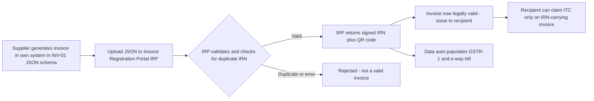
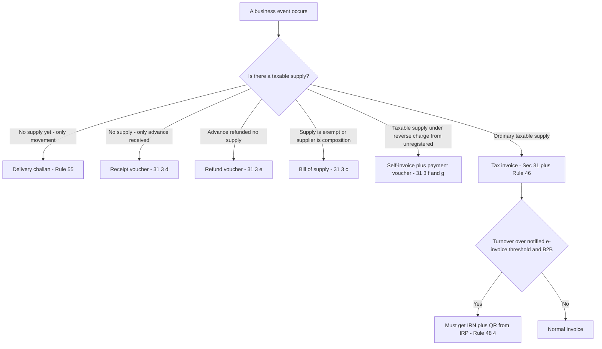
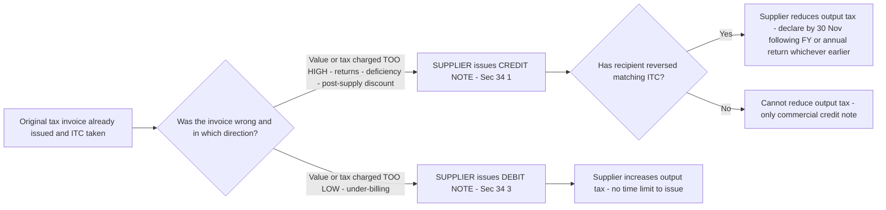

# Chapter 21 — Tax Invoice, Credit & Debit Notes

> **Rates / thresholds / amendments flag:** This chapter teaches the *logic and mechanism* of documentation under Sections 31–34 of the CGST Act, 2017 read with Rules 46–55A of the CGST Rules, 2017. The framework is permanent. But the **e-invoicing turnover threshold (currently ₹5 crore aggregate turnover), the QR-code rules, the HSN-digit requirements, and the exact time limits** are amended frequently by notification. **Verify current thresholds and any latest amendments in ICAI material for your attempt.** The *why* below does not change.

---

## 1. The Problem — Why a tax law obsesses over a piece of paper

Step back and ask a strange question: why does GST — a law about *money* — spend an entire chapter, four sections, and a dozen rules on *documents*? Excise and VAT never made this much fuss. The answer is the single most important structural fact about GST, and if you grasp it, this chapter writes itself.

**GST is a self-policing, credit-based tax that runs on a chain of documents, not on a chain of trust.**

Recall the promise of GST from the very first GST chapter: tax only on *value added*, achieved through **seamless input tax credit (ITC)**. Your output tax minus the tax you already paid on inputs equals what you deposit. But this creates an immediate, dangerous asymmetry:

**Problem 1 — The recipient's credit is the supplier's liability, and they are two different people.** When A sells to B and charges ₹18,000 GST, B wants to claim ₹18,000 as ITC. B's *credit* is only legitimate if A *actually charged and (eventually) paid* that ₹18,000 to the government. If B could claim credit on nothing but B's own word, the treasury would haemorrhage — every buyer would invent purchases. So the law needs a **single, standardised, tamper-resistant token** that simultaneously (a) records A's liability and (b) authorises B's credit. That token is the **tax invoice**. It is the *pivot* of the entire GST machine: one document, two tax consequences, opposite directions.

**Problem 2 — The government cannot watch every transaction, so it must audit backwards.** With crores of transactions, no officer can observe supply happening. The only way to reconstruct "did tax actually flow?" is a **paper (now digital) trail** that can be matched: A's outward invoice against B's inward claim. If the documents don't have a fixed format, mandatory contents, and a unique serial number, matching is impossible and fraud is invisible. The invoice is therefore the **audit trail's fundamental unit**.

**Problem 3 — Not every business event is a "sale with tax."** A dealer in exempt goods charges no tax. A registered person receiving a small cash advance hasn't supplied anything yet. A composition dealer isn't allowed to charge GST at all. If every such event were forced onto a "tax invoice," the invoice would falsely assert a tax that isn't due — and a buyer might wrongly claim credit off it. So the law needs a **family of documents**, each shaped to its situation: bill of supply, receipt voucher, refund voucher, payment voucher, delivery challan.

**Problem 4 — The original invoice is often *wrong after the fact*.** Goods come back. A discount is agreed later. The rate was mis-charged. The quantity was over-billed. Once B has already taken credit on the original invoice, you cannot simply tear it up — B's books and the government's records already reference it. You need a *linked correcting document* that adjusts the numbers **without erasing the audit trail**, and that forces a symmetrical reversal: if the supplier reduces output tax, the recipient must reduce ITC. That is the entire reason **credit notes and debit notes** exist under GST, and it is why a GST credit note is a very different animal from a commercial "credit note."

**Problem 5 — Paper invoices can be faked, back-dated, and double-used.** The rise of *fake-invoice rackets* (invoices with no underlying supply, used to pass on bogus ITC) is the biggest fraud in GST history. The structural fix is **e-invoicing** — reporting the invoice to a government portal *before* it is used, getting it authenticated with a unique number, so a fake can't enter the credit chain undetected.

So the whole chapter is one idea in five costumes: **the credit chain is only as trustworthy as the documents that feed it.** Every rule below is protecting that chain.

---

## 2. The Core Idea

> **The tax invoice is the load-bearing document of GST: it is simultaneously the *evidence of the supplier's output-tax liability* and the *sole legitimate basis for the recipient's input tax credit*. Everything else in this chapter is either (a) a *substitute* document for situations where a tax invoice would lie (bill of supply, vouchers, delivery challan), or (b) a *correcting* document that adjusts an already-issued invoice while preserving the audit trail (credit/debit notes), or (c) an *authentication* layer that stops fake invoices from entering the chain (e-invoicing).**

Three load-bearing ideas organise the chapter:

1. **One document, two mirror-image consequences.** The tax invoice is the hinge. On the supplier's side it fixes *when* and *how much* output tax is due; on the recipient's side it is condition-number-one for ITC under Section 16. This is why its *contents* and *timing* are legislated in detail — a vague invoice breaks both sides.

2. **Match the document to the truth of the event.** If there's a taxable supply → tax invoice. If the supply is exempt or the supplier is a composition dealer → **bill of supply** (no tax shown). If money is received but nothing is yet supplied → **receipt voucher**. If that advance is later refunded → **refund voucher**. If you pay tax under reverse charge to an unregistered supplier → **self-invoice + payment voucher**. If goods move without a supply → **delivery challan**. The document *is a factual claim* about the event; issuing the wrong one is issuing a false claim.

3. **Never erase — always link and reverse.** Post-supply corrections flow through credit/debit notes that carry the *original invoice reference*, so the trail stays intact and the tax adjustment is symmetric on both sides.

Everything else is detail hanging off these three hooks.

---

## 3. Why It's Built This Way — the design logic behind each lever

Before a single section, internalise the design choices. Every rule below is one of these in disguise:

| Design choice | The problem it solves | How the Act implements it |
|---|---|---|
| A mandatory, standard-format invoice | Credit needs a tamper-resistant, matchable token (Problems 1 & 2) | Sec 31 + Rule 46 (16 prescribed particulars, consecutive serial) |
| Legislated *time limits* to issue it | Late/no invoice hides supply and delays the tax point | Sec 31(1)/(2) — different rules for goods vs services |
| A no-tax document for non-taxable supplies | A tax invoice would falsely assert tax and enable wrong ITC (Problem 3) | Bill of supply, Sec 31(3)(c) + Rule 49 |
| Vouchers for advances and refunds | Money moved but supply hasn't (or was undone) | Receipt/refund voucher, Sec 31(3)(d)/(e) |
| Self-invoice under RCM | Unregistered supplier issues nothing; recipient owes the tax | Sec 31(3)(f) + payment voucher 31(3)(g) |
| Delivery challan for movement without supply | Goods move (job-work, transfer) but no supply/invoice yet | Rule 55 |
| Credit note reduces output tax | Over-billing / returns / discounts must be undone without deleting the invoice (Problem 4) | Sec 34(1)/(2) — supplier-issued, with reversal condition |
| Debit note increases output tax | Under-billing must be topped up, linked to the original | Sec 34(3)/(4) — supplier-issued |
| E-invoice pre-authentication (IRN + QR) | Fake invoices poison the credit chain (Problem 5) | Rule 48(4) + notified threshold |

Two elegant points to carry through the chapter:

- **The invoice is issued by the *supplier*, always — including credit and debit notes.** A recipient never issues a GST credit/debit note that adjusts tax. This surprises accountants used to commercial practice, and examiners love it (see Traps).
- **GST separates the *tax point* from the *document*, but ties them tightly.** The *time of supply* (Chapter 17) often *is* the invoice date — so getting the invoice timing wrong shifts the whole tax liability into the wrong month. Documentation is not paperwork bureaucracy; it *is* the timing mechanism.

---

## 4. Full Technical Content — Sections 31–34 with the "why"

### 4.1 The tax invoice — Section 31 + Rule 46

**Who and when — the charging link.** Section 31 obliges a **registered person** making a **taxable supply** to issue a tax invoice. The *timing* differs for goods and services because their economics differ — goods have a physical movement you can pin a date to; services are continuous and intangible.

**Time limit — GOODS — Sec 31(1):** invoice must be issued **before or at the time of**
- **removal** of goods, where supply involves *movement*; or
- **delivery / making available** to the recipient, where there is *no movement*.

*Why:* goods have a clean physical trigger (removal). Pinning the invoice to removal means the invoice date and the movement date coincide, so the e-way bill, the transporter's documents, and the tax point all line up and can be cross-matched.

**Time limit — SERVICES — Sec 31(2) + Rule 47:** invoice must be issued **within 30 days** of the *supply of service* (**45 days** for banking companies, insurers, and NBFCs).

*Why:* services have no "removal" moment. The law gives a reasonable window after the service is rendered, but caps it so the tax point can't be pushed indefinitely. The longer 45-day window for financial-sector entities reflects their high transaction volumes and billing cycles.

**Continuous supply of goods (Sec 31(4)):** invoice on or before each *statement of account / payment*.
**Continuous supply of services (Sec 31(5)):** invoice by the *due date of payment* if ascertainable from the contract; else *before/at receipt of payment*; if payment is linked to completion of an event, *on or before that event*.

*Why:* a 12-month AMC or an electricity connection has no single "supply" moment — the trigger is the contractual billing/payment milestone, so the invoice tracks the milestone.

**Goods sent on approval / sale-or-return (Sec 31(7)):** invoice **before or at the time of supply**, or **within 6 months** of removal, whichever is earlier. *Why:* the "supply" only crystallises when the recipient approves; the 6-month outer cap stops indefinite deferral.

**Contents — Rule 46 (the 16 particulars).** A tax invoice must contain (learn these as *what a matcher and an auditor need*, not as a list):

| # | Particular | Why it's mandatory |
|---|---|---|
| 1 | Name, address, **GSTIN of supplier** | Identifies who owes the output tax |
| 2 | **Consecutive serial number** (≤16 chars, unique for a FY) | Makes invoices countable and un-duplicable — the anti-fraud backbone |
| 3 | Date of issue | Fixes the tax point / time limit |
| 4 | Recipient name, address, **GSTIN/UIN** (if registered) | Links the credit to a real registered claimant |
| 5 | For unregistered recipient & value **> ₹50,000** — name, address, delivery address, State & code | Tracks high-value B2C for inter-State place-of-supply |
| 6 | **HSN code** of goods / SAC of services | Enables rate verification and analytics |
| 7 | Description of goods/services | Proves a real supply exists |
| 8 | Quantity (with unit) | Ties to physical movement |
| 9 | Total value of supply | — |
| 10 | **Taxable value** (after discounts under Sec 15) | The base the recipient claims credit against |
| 11 | **Rate of tax** (CGST/SGST/IGST/cess separately) | — |
| 12 | **Amount of tax** charged (each head separately) | The exact ITC the recipient may claim |
| 13 | Place of supply + State (for inter-State) | Decides CGST+SGST vs IGST |
| 14 | Delivery address if different from place of supply | Place-of-supply integrity |
| 15 | Whether tax is on **reverse charge** basis | Warns recipient *they* must pay, and must NOT claim on this invoice as forward charge |
| 16 | **Signature / digital signature** of supplier | Authenticates the document |

**Memory hook — "WHO, WHAT, HOW-MUCH, WHERE, SIGNED":** *Who* (supplier + recipient GSTIN), *What* (HSN + description + quantity), *How-much* (taxable value + rate + tax), *Where* (place of supply), *Signed*. Every particular falls under one of these five — because a matcher needs exactly these to reconcile A's outward with B's inward.

**Manner of issue — Rule 48:**
- **Goods → triplicate:** Original for **Recipient**, Duplicate for **Transporter**, Triplicate for **Supplier**.
- **Services → duplicate:** Original for **Recipient**, Duplicate for **Supplier**.
*Why the extra copy for goods?* The transporter must carry proof during physical movement (Problem 2 again — the trail must be visible on the road).

**HSN digit requirement (Rule 46 read with notification):** turnover-linked — broadly, aggregate turnover **up to ₹5 crore → 4 digits**, **above ₹5 crore → 6 digits** for B2B (B2C relaxations exist). *Verify current slabs for your attempt.*

**Relaxations — small value (Rule 46 proviso):** for supplies **< ₹200** to an unregistered recipient who doesn't need an invoice, the supplier may issue a **consolidated tax invoice** at day-end. *Why:* a tea-stall can't invoice every ₹10 cup; there's no ITC at stake so the audit-trail value is negligible.

**Revised invoice (Sec 31(3)(a) + Rule 53):** between the *effective date of registration* and the *date the certificate is granted*, a newly-registered person may issue **revised invoices** for supplies already made. *Why:* registration takes effect from an earlier date than the certificate arrives; the person supplied *before* they had a GSTIN to print, so the law lets them regularise those supplies (and pass on ITC).

### 4.2 Bill of Supply — Sec 31(3)(c) + Rule 49

Issued **instead of** a tax invoice by:
- a **composition** taxpayer (they pay a flat rate and cannot collect GST); and
- a supplier of **exempt** goods/services (no tax to charge).

**It shows NO tax and carries the legend accordingly** (a composition dealer must state *"composition taxable person, not eligible to collect tax on supplies"*). *Why:* if it showed tax, the recipient might wrongly claim ITC on tax that was never legitimately charged — corrupting the chain (Problem 3). Same 16-ish particulars minus rate/amount of tax. Small-value relaxation (< ₹200) also applies.

> A registered person supplying **both taxable and exempt** goods may issue a single **"invoice-cum-bill of supply"** to an unregistered recipient (Rule 46A).

### 4.3 Receipt, Refund, and Payment Vouchers — Sec 31(3)(d)–(g)

These plug the gap between *money* and *supply*.

- **Receipt voucher — Sec 31(3)(d) + Rule 50:** issued when a registered person **receives an advance** for a supply. *Why:* for *services*, receipt of advance is a time-of-supply trigger, so tax may be due before the invoice — the receipt voucher documents that advance and its tax. (For *goods*, advance no longer triggers tax for most suppliers, but the voucher framework remains.) If the rate/place isn't known when the advance is received, treat rate as **18%** and supply as **inter-State** — sensible fallbacks so tax is still collected.
- **Refund voucher — Sec 31(3)(e) + Rule 51:** if the advance was received (receipt voucher issued) but **no supply happens and no invoice is issued**, and the money is refunded, issue a refund voucher. *Why:* it closes the loop and supports the refund of the tax paid on the advance.
- **Payment voucher — Sec 31(3)(g) + Rule 52:** a recipient liable under **reverse charge (RCM)** issues this **when making payment** to the supplier. *Why:* documents the RCM payment leg.
- **Self-invoice — Sec 31(3)(f):** where a registered person receives goods/services from an **unregistered supplier under RCM**, the *recipient* issues an invoice **to himself** (the supplier can't, having no GSTIN). *Why:* the recipient owes the tax and needs a document to (a) discharge it and (b) later claim ITC on it — no self-invoice, no proof.

### 4.4 Delivery Challan — Rule 55

Used when goods move but there is **no supply / invoice yet**:
- supply quantity unknown at removal (e.g., liquid gas);
- goods sent for **job work**;
- **inter-branch / stock transfer** not amounting to supply;
- other notified cases (e.g., goods for exhibition, semi-knocked-down consignments).

Issued in **triplicate** (Original-consignee, Duplicate-transporter, Triplicate-consignor). *Why it exists:* the e-way-bill/matching system assumes documents accompany moving goods (Problem 2). When there's genuinely no invoice to issue, the challan is the stand-in so movement stays documented and legal.

### 4.5 Credit Notes and Debit Notes — Section 34 (the correction engine)

This is the heavily-examined heart of the chapter. Anchor on the **direction of the error**.

**Credit Note — Sec 34(1)/(2) — issued by the SUPPLIER when the original invoice OVER-stated the tax.** Triggers:
1. **taxable value or tax charged was more** than actual (over-billing / wrong higher rate);
2. **goods returned** by the recipient;
3. goods/services found **deficient**;
4. **post-supply discount** meeting Sec 15(3)(b) conditions.

**Effect:** it *reduces* the supplier's **output tax liability** — but **only if the reduction is passed correctly**.

> **The crucial condition (Sec 34(2)):** the supplier may reduce output tax **only if the recipient has correspondingly reduced his ITC.** *Why:* this is the symmetry rule that protects the treasury. If A reduces output tax by ₹1,800 but B keeps the ₹1,800 credit, the government loses ₹1,800. So the reduction is only allowed when the mirror reversal happens on B's side. This is enforced through the return system (the credit note is declared in GSTR-1, flows to B's GSTR-2B, and B must reverse).

**Time limit to *declare* a credit note (Sec 34(2)):** by the **30th November** following the end of the financial year of the supply, **or** the date of filing the relevant **annual return**, **whichever is earlier**. *Why:* after this date the year is effectively closed for adjustments; allowing later reductions would let suppliers reopen settled tax periods.

**Debit Note — Sec 34(3)/(4) — issued by the SUPPLIER when the original invoice UNDER-stated the tax.** Triggers: taxable value or tax charged was **less** than actual (under-billing / wrong lower rate / extra supply).

**Effect:** it *increases* output tax liability. **No time limit** to issue a debit note (you can always pay *more* tax — the treasury never objects to extra collection). *Note for ITC:* the recipient's time limit to claim ITC on a debit note runs from the **debit note's own date/financial year** (per the Sec 16(4) amendment), not the original invoice's — a favourable, tested point.

**Two structural rules students miss:**
- **Both notes are always issued by the supplier.** A "credit note" the buyer sends back is a commercial document with *no GST effect*. (Trap.)
- **A GST credit/debit note need not be one-per-invoice.** Since 2019, a supplier may issue **one consolidated credit/debit note against multiple invoices** in a financial year — no need to link to a single original invoice number. *Why:* eases compliance for volume discounts spanning many invoices.
- **Financial / commercial credit notes (no GST):** if a *post-supply discount* does **not** meet Sec 15(3)(b) (e.g., it wasn't agreed before supply, or ITC wasn't reversed), the supplier can still issue a **commercial credit note** — but **cannot reduce output tax**, and the recipient need not reverse ITC. Only the *taxable-value* leg is settled commercially. (Heavily tested — see Example 3.)

**Contents (Rule 53):** a credit/debit note must show the supplier's details, a consecutive serial number, date, the **corresponding tax-invoice number(s)** (or the reason if consolidated), the taxable value, and the tax adjusted.

### 4.6 E-invoicing — Rule 48(4) (the anti-fraud authentication layer)

**What it is (and isn't):** e-invoicing does **not** mean generating an invoice on a government website. The supplier generates the invoice in his own accounting system in a **standard schema (INV-01/JSON)**, then **uploads it to the Invoice Registration Portal (IRP)**, which validates it and returns:
- a unique **Invoice Reference Number (IRN)** — a 64-character hash; and
- a **signed QR code**.
Only then is it a **legally valid tax invoice**. An invoice required to be e-invoiced but **not** carrying an IRN is **not a valid document** — and the recipient **cannot claim ITC** on it (ties back to Sec 16). *Why this design:* pre-clearance. Because the invoice is registered with the government *before* it enters the supply chain, a fake invoice (no real supply) can be traced and blocked — directly attacking the fake-ITC racket (Problem 5). Data also auto-populates GSTR-1 and the e-way bill, killing duplicate entry.

**Who must:** registered persons whose **aggregate turnover exceeds the notified threshold (currently ₹5 crore)** in any preceding FY from 2017-18 onward, for **B2B supplies, exports, and credit/debit notes.** *Verify the current threshold for your attempt.*

**Exempt from e-invoicing regardless of turnover:** SEZ *units* (not developers), insurers, banks/NBFCs, GTAs, passenger-transport suppliers, suppliers of admission to cinema/multiplex, and government departments/local authorities. **B2C invoices are outside e-invoicing** (but large taxpayers must display a **dynamic QR code** on B2C invoices).

*Figure 1 — the e-invoicing flow: authentication happens BEFORE the invoice enters the credit chain, so fakes are blocked at the door.*

---

## 5. Worked Examples

### Example 1 — Invoice timing: goods vs services

**Facts.** (a) Alpha Ltd removes machinery from its factory to customer B on **10 July**; goods reach B on **14 July**. (b) Alpha also renders a consultancy service to C, completed on **10 July**.

**Solve.**
- **Goods (movement involved):** invoice must be issued **on or before removal = 10 July** (Sec 31(1)(a)). Delivery date (14 July) is irrelevant to invoicing. So the tax point sits in July.
- **Service:** invoice must be issued **within 30 days of supply**, i.e., on or before **9 August** (Sec 31(2) + Rule 47). If Alpha were a bank/NBFC/insurer, the window would be **45 days** (till 24 August).

**Reconcile.** Goods → invoice *coincides with* physical removal (10 Jul); service → up to 30 days grace (till 9 Aug). Same completion date, different documentation deadlines — because the underlying economics differ.

### Example 2 — Credit note for sales return, with the symmetry condition

**Facts.** On **5 May 2025**, Supplier S sells goods to Registered buyer R: taxable value **₹1,00,000**, IGST @18% = **₹18,000** (inter-State). R claims ₹18,000 ITC. On **20 June 2025**, R returns goods worth **₹40,000** (taxable value) as defective.

**Solve.**
1. S issues a **credit note** (Sec 34(1)) for taxable value ₹40,000 + IGST ₹7,200.
2. S may **reduce output tax by ₹7,200** — **but only because** R will reverse ₹7,200 of ITC (Sec 34(2) symmetry condition). Net position:

| Party | Original | After credit note | Effect |
|---|---|---|---|
| Supplier S output tax | ₹18,000 | ₹18,000 − ₹7,200 = **₹10,800** | pays ₹7,200 less |
| Buyer R ITC | ₹18,000 | ₹18,000 − ₹7,200 = **₹10,800** | reverses ₹7,200 |

3. **Time-limit check:** the supply is in FY 2025-26. S must **declare** the credit note by **30 November 2026** or the date of filing the annual return for FY 2025-26, whichever is earlier. 20 June 2025 is well within limits.

**Reconcile.** Treasury is neutral: ₹7,200 less collected from S, ₹7,200 less credited to R. The symmetry rule made the reduction safe.

### Example 3 — Post-supply discount: GST credit note vs commercial credit note

**Facts.** Supplier P sold goods across the year to dealer D on many invoices (total taxable value ₹50,00,000, GST ₹9,00,000, all credited by D). In March, P grants a **year-end volume discount of ₹2,00,000** (plus GST ₹36,000 on it).

**Case A — discount was agreed *in the contract before* the supplies (Sec 15(3)(b) satisfied) and is linked to invoices, and D reverses ITC.**
- P issues a **GST credit note** (may be a *single consolidated* note against all the year's invoices).
- P **reduces output tax by ₹36,000**; D **reverses ₹36,000 ITC**. Both taxable value and tax adjust.

**Case B — discount was decided *after* supply / not pre-agreed, OR D will not reverse ITC.**
- Sec 15(3)(b) is **not** met, so P **cannot** reduce output tax.
- P issues a **commercial (financial) credit note** for ₹2,00,000 only. **No GST adjustment**; D keeps full ₹9,00,000 ITC and does not reverse.
- P has effectively borne the ₹36,000 GST on the discount.

**Reconcile.** The document's *label* is the same ("credit note"), but the *tax effect* is governed entirely by whether Sec 15(3)(b) conditions are met — the classic examiner trap.

### Example 4 — Debit note for under-billing

**Facts.** On 12 August, Q invoices a supply at taxable value ₹80,000, CGST+SGST @18% = ₹14,400. In September Q realises the correct value was ₹90,000.

**Solve.** Q issues a **debit note** (Sec 34(3)) for the shortfall: taxable value ₹10,000 + tax ₹1,800. Q's output tax **increases by ₹1,800** in the month the debit note is issued. There is **no time limit** to issue it (extra tax is always welcome). Recipient may claim the additional ₹1,800 ITC, and his Sec 16(4) time limit runs from the **debit note's** financial year.

**Reconcile.** Original ₹14,400 + ₹1,800 = ₹16,200 = 18% of ₹90,000. Correct.

### Example 5 — Which document? A rapid classification drill

| Situation | Correct document | Section |
|---|---|---|
| Taxable inter-State sale of goods | Tax invoice (before removal) | 31(1) |
| Composition dealer sells goods | Bill of supply | 31(3)(c) |
| Trader sells only exempt fruit | Bill of supply | 31(3)(c) |
| ₹50,000 advance received for a service | Receipt voucher | 31(3)(d) |
| That advance later refunded (no supply) | Refund voucher | 31(3)(e) |
| Registered person pays lawyer (unregistered) under RCM | Self-invoice + payment voucher | 31(3)(f)/(g) |
| Goods sent to job-worker | Delivery challan | Rule 55 |
| Buyer returns goods | Credit note (by supplier) | 34(1) |
| Supplier under-charged tax | Debit note (by supplier) | 34(3) |

---

## 6. Format / Summary

*Figure 2 — the master decision tree: every GST document answers "what kind of event is this?"*

*Figure 3 — the correction engine: direction of error picks the note; the symmetry condition and time limit gate the credit note.*

**One-line summaries table:**

| Document | Issued by | When | Shows tax? | Section |
|---|---|---|---|---|
| Tax invoice | Supplier | Goods: ≤ removal; Services: ≤ 30 (45) days | Yes | 31(1)/(2) |
| Bill of supply | Composition / exempt supplier | With supply | No | 31(3)(c) |
| Receipt voucher | Supplier | On receiving advance | Yes (on advance) | 31(3)(d) |
| Refund voucher | Supplier | On refunding advance | Adjusts | 31(3)(e) |
| Self-invoice | Recipient | RCM from unregistered | Yes | 31(3)(f) |
| Payment voucher | Recipient | On paying RCM supplier | — | 31(3)(g) |
| Delivery challan | Consignor | Movement w/o supply | No | Rule 55 |
| Credit note | Supplier | Over-billed / return / discount | Reduces | 34(1) |
| Debit note | Supplier | Under-billed | Increases | 34(3) |

---

## 7. Connections

- **← Chapter 17 (Time of Supply):** the invoice date is usually *the* time-of-supply trigger. Wrong invoice timing → wrong tax month. This chapter *implements* the timing rules you learned there.
- **← Chapter 18 (Value of Supply):** the "taxable value" printed on the invoice is the Sec 15 value; the Sec 15(3)(b) discount conditions decide whether a credit note can reduce tax (Example 3).
- **→ Chapter on ITC (Sec 16):** condition #1 for ITC is *possession of a tax invoice / debit note*. A missing, defective, or non-IRN invoice = **no ITC**. This chapter is the *precondition* for that one.
- **→ Returns (GSTR-1 / GSTR-3B / GSTR-2B):** invoices and credit/debit notes are *declared* in GSTR-1, flow to the recipient's GSTR-2B, and drive the matching that enforces Sec 34(2) symmetry.
- **→ E-way bill:** the invoice/challan value and the transporter's copy feed the e-way-bill system for goods in movement.
- **↔ Reverse charge (Chapter 15):** self-invoice and payment voucher are the documentary machinery of RCM.

---

## 8. Traps & Examiner Tricks

1. **"The buyer issued a credit note."** *No.* Under GST, **only the supplier** issues credit/debit notes that adjust tax. A buyer's document has no GST effect.
2. **Credit note = automatic tax reduction.** *No.* Output tax reduces **only if** the recipient reverses matching ITC (Sec 34(2)) **and** it's declared by the 30 Nov / annual-return deadline. Miss either → no reduction (commercial credit note only).
3. **Debit note has a time limit.** *No issue-limit* — you can always pay more tax. (But the *recipient's ITC* time limit under Sec 16(4) now runs from the **debit note's** date, not the original invoice's — favourable, and tested.)
4. **Invoice date = delivery date for goods.** *No.* It's **removal** date (or making-available if no movement), not delivery.
5. **Confusing 30 vs 45 days for services.** 30 days generally; **45 days** only for banking companies, insurers, NBFCs.
6. **Composition/exempt dealer issues a tax invoice.** *No* — **bill of supply**, showing no tax; composition dealer adds the "not eligible to collect tax" legend.
7. **Post-supply discount always reduces GST.** *Only if* pre-agreed and linked to invoices per Sec 15(3)(b) *and* ITC reversed. Otherwise it's a commercial credit note — supplier eats the GST.
8. **E-invoicing means generating the invoice on the GST portal.** *No* — you generate it in your own system and get it *authenticated* (IRN + QR) from the IRP. And an e-invoice-required invoice **without IRN is not valid → recipient loses ITC.**
9. **A single credit note must map to a single invoice.** *No* — since 2019, one **consolidated** credit/debit note can cover many invoices.
10. **Triplicate vs duplicate mix-up.** Goods → **triplicate** (extra copy for the transporter); services → **duplicate**.
11. **Small-value ₹200 relaxation only if** recipient is unregistered *and* doesn't demand an invoice; then a *consolidated* invoice at day-end is allowed.

---

## 9. First-Principles Recap

Start from the one fact and rebuild the chapter without memorising:

1. GST runs on **seamless ITC**; a recipient's credit is only as real as the supplier's documented, matchable liability. → the **tax invoice** must exist, in a standard format, with a unique serial, issued by the supplier.
2. The invoice's *contents* are just "everything a matcher and an auditor need to reconcile A's outward with B's inward" → the 16 particulars.
3. The invoice's *timing* tracks the underlying trigger: goods have physical **removal** (invoice by then); services are continuous, so a **30/45-day** window.
4. When the event **isn't** a taxable supply, forcing a tax invoice would assert a false tax → a **family of substitute documents** (bill of supply, vouchers, self-invoice, delivery challan), each matched to its truth.
5. When the invoice turns out **wrong after the fact**, you can't erase it (both sides already reference it) → a **linked correcting note** issued by the supplier: **credit note** (over-charged, reduce) or **debit note** (under-charged, increase). Reduction is gated by **symmetry** (recipient reverses ITC) and a **deadline**, because those protect the treasury.
6. Because fake invoices can poison the whole chain, high-turnover B2B invoices are **pre-authenticated** (IRN + QR) before they can be used → **e-invoicing**.

Everything is downstream of "protect the credit chain."

---

## 10. Quick-Revision Sheet

**THE PIVOT:** Tax invoice = supplier's output-tax evidence **AND** recipient's sole ITC basis. (Sec 31 + Rule 46)

**TIME LIMITS (issue):**
- Goods: **before/at removal** (or making-available). Sec 31(1)
- Services: **within 30 days** (banks/NBFC/insurer **45**). Sec 31(2) + Rule 47
- Sale-or-return: earlier of supply or **6 months** from removal. 31(7)

**COPIES:** Goods → **triplicate** (Recipient/Transporter/Supplier). Services → **duplicate** (Recipient/Supplier).

**16 PARTICULARS hook:** WHO (both GSTINs) · WHAT (HSN + desc + qty) · HOW-MUCH (taxable value + rate + tax, each head) · WHERE (place of supply) · SIGNED. Plus serial no. + date + RCM flag.

**DOCUMENT PICKER:**
- Taxable supply → **Tax invoice**
- Composition / exempt → **Bill of supply** (no tax)
- Advance received → **Receipt voucher**; refunded → **Refund voucher**
- RCM from unregistered → **Self-invoice + Payment voucher**
- Movement w/o supply (job-work, transfer) → **Delivery challan** (Rule 55)

**CREDIT NOTE (Sec 34(1)/(2)) — by SUPPLIER, invoice was TOO HIGH** (return / deficiency / over-billing / Sec 15(3)(b) discount):
- Reduces output tax **only if recipient reverses ITC**.
- Declare by **30 Nov** following FY **or** annual return date, **whichever earlier**.

**DEBIT NOTE (Sec 34(3)) — by SUPPLIER, invoice was TOO LOW:** increases output tax; **no time limit** to issue. Recipient's ITC clock runs from the **debit note's** FY.

**COMMERCIAL credit note:** if Sec 15(3)(b) not met → no GST reduction, no ITC reversal.

**E-INVOICING (Rule 48(4)):** turnover > **₹5 cr** (verify), B2B + exports + credit/debit notes. Own-system JSON → IRP → **IRN + QR**. No IRN where required → **not a valid invoice → no ITC**. B2C excluded (but dynamic QR for large taxpayers). Exempt: banks, NBFCs, insurers, GTAs, passenger transport, cinema, SEZ *units*, govt.

**GOLDEN RULE:** Supplier issues everything (including credit/debit notes). Never erase — always **link and reverse symmetrically**.

> **Reminder:** confirm the **e-invoicing threshold, HSN-digit slabs, service invoice window, and any 2025-26 amendments** against current ICAI study material for your exam attempt.
