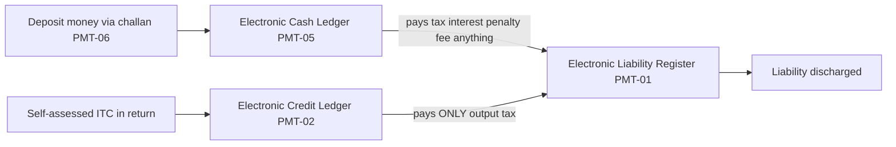
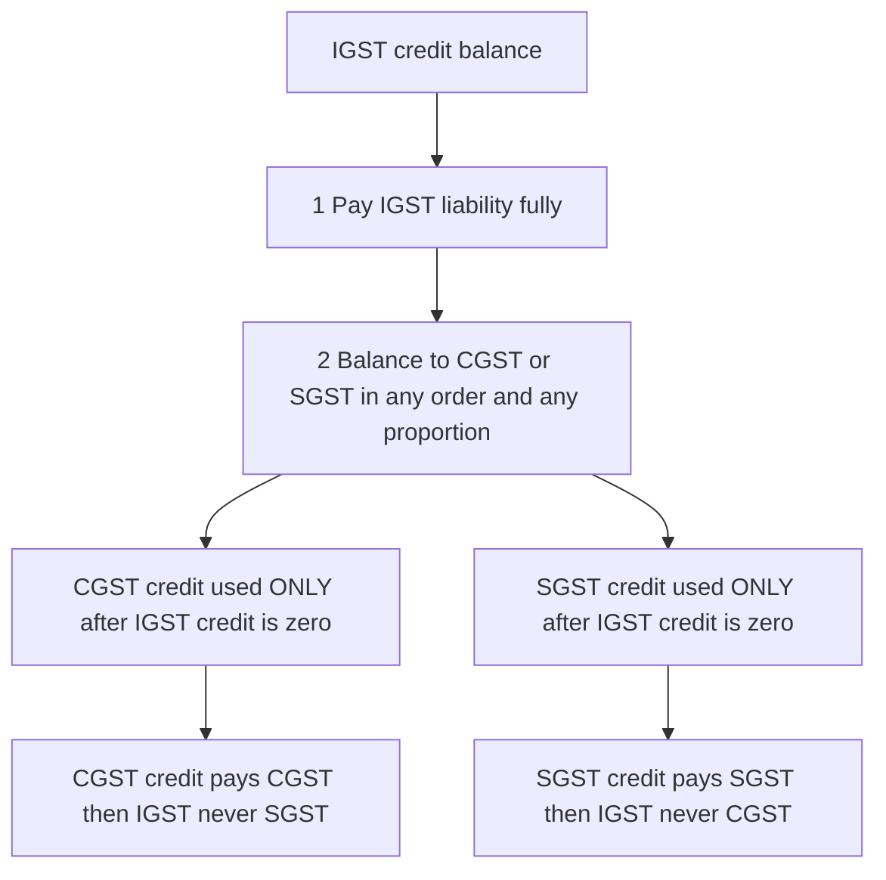
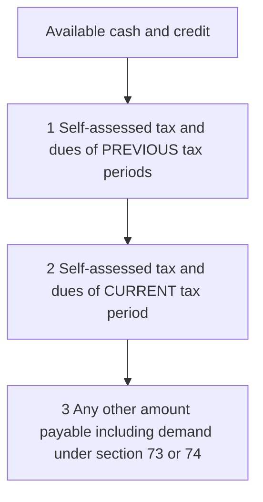

<!-- v2-deep -->

# Chapter 22 — Payment of Tax

> **Rates / thresholds / amendments flag:** This chapter teaches the *machinery* of paying GST — Sections 49, 49A, 49B, 50, 51, 52 of the CGST Act, 2017 read with Rules 85–88B and the PMT-series forms. The *mechanism* is stable and permanent knowledge. But the **TDS threshold (₹2,50,000), the TDS rate (2%), the TCS rate (currently 0.5% CGST + 0.5% SGST), the Rule 86B turnover trigger (₹50 lakh/month), and the interest rates (18% / 24%)** must be **verified against current ICAI study material and the latest notifications for your attempt.** The logic below does not change; the numbers occasionally do.

---

## 1. The Problem — Why paying a self-assessed tax is harder than it sounds

Under GST there is **no assessing officer standing at your gate** each month totting up what you owe. GST is a *self-assessment* regime: the taxpayer computes his own liability, claims his own credit, and pays the balance — millions of taxpayers, crores of transactions, every month. This design is efficient, but it opens four dangerous gaps that a payment system must close *before* it can be trusted:

**Problem 1 — Money and credit are not the same thing, yet both discharge tax.** A taxpayer can pay GST in two utterly different currencies: **actual cash** deposited with the government, and **input tax credit (ITC)** — tax someone else already paid upstream. Cash is real revenue to the exchequer; ITC is merely a *bookkeeping offset* of tax already collected earlier in the chain. If the system mixed them into one undifferentiated pool, nobody — not the taxpayer, not the department — could ever answer "how much *real money* did this person contribute?" The two must be tracked in **separate, visible accounts.**

**Problem 2 — Credit is not fungible across tax heads.** GST is not one tax; it is **three parallel taxes** (CGST to the Centre, SGST to the State, IGST shared) sitting on the same invoice. A rupee of SGST credit belongs, ultimately, to a *State*. Letting a Maharashtra taxpayer use Maharashtra-SGST credit to pay CGST (the Centre's money) or, worse, another State's tax would silently transfer revenue between governments. The payment engine must enforce **which credit can pay which tax** — this is the whole reason the utilisation order (Sec 49(5), 49A, Rule 88A) exists.

**Problem 3 — A taxpayer with dues from three months and a fresh liability will pay the "convenient" one first.** Left to choose, a person facing an old demand, a current self-assessed tax, and interest will pay whatever stops the least painful clock — usually the current return — and let old dues rot. The law needs a **mandatory order of discharge** (Sec 49(8)) so that money lands on the *oldest, hardest* liability first.

**Problem 4 — Some payers sit *outside* the normal supplier chain and would otherwise escape.** A government department buying goods, or an e-commerce platform through which thousands of small unregistered sellers transact, are choke-points where tax can leak. The system plants **collection agents** here — TDS (Sec 51) and TCS (Sec 52) — who skim a small slice at source and deposit it against the real supplier's account, creating a paper trail that self-polices the chain.

**Problem 5 — Fake-invoice fraud can pay 100% of tax with 0% real money.** If credit could discharge the *entire* liability, an operator running a fake-invoice racket would generate bogus ITC upstream and use it to "pay" tax he never actually owed on genuine value added — the exchequer receives *nothing in cash* while the paper trail looks perfectly settled. The system needs a **cash floor** (Rule 86B) and a **credit-freeze switch** (Rule 86A) to break this loop. This is why the payment chapter is not purely mechanical: two anti-abuse valves are bolted onto the plumbing.

The cascade-killing promise of GST — *seamless credit, tax only on value added* — collapses if payment is opaque. So the law builds a **glass-walled accounting system**: three electronic ledgers where every rupee of cash, every rupee of credit, and every rupee of liability is visible, dated, and rule-bound.

---

## 2. The Core Idea

> **Every registered person maintains three electronic ledgers on the common portal. The *Electronic Liability Register* (PMT-01) is what you OWE. The *Electronic Cash Ledger* (PMT-05) is real money you have DEPOSITED. The *Electronic Credit Ledger* (PMT-02) is the ITC you have EARNED. To pay tax, you DEBIT the liability register and it is discharged by debiting either cash or credit — but credit can only pay OUTPUT TAX and only in a legally fixed order, while cash can pay ANYTHING.**

Four load-bearing ideas organise the entire chapter:

1. **Separation of money from credit.** Cash and credit live in different ledgers precisely because they mean different things to the exchequer (Problem 1). Section 49(3) says the **cash ledger may be used for any payment — tax, interest, penalty, fee, any other amount.** Section 49(4) says the **credit ledger may be used ONLY for payment of *output tax*** — never for interest, penalty, or late fee.

2. **Credit flows along legal channels only.** ITC of one head cannot freely pay another. IGST credit is the universal solvent (pays anything); CGST and SGST credit are ring-fenced and can *never* cross into each other (Problem 2). This is the utilisation order.

3. **Oldest debts first.** The order of discharge (Sec 49(8)) forces money onto prior-period dues before current, and self-assessed tax before demands (Problem 3).

4. **Collect at the choke-points.** TDS and TCS are not new taxes — they are **advance collections** deposited into the *supplier's* cash ledger, plugging leakage where the normal chain is weak (Problem 4).

**A fifth, quieter idea — anti-abuse floors.** Rule 86A (block) and Rule 86B (1% cash floor) exist *only* because credit is otherwise almost frictionless. They do not change what tax is due; they change *how much of it must be real money* and *whether a suspect ledger can be touched at all* (Problem 5).

Everything technical below hangs off these hooks.

**One distinction to nail before you go further — "output tax" is a defined term (Sec 2(82)).** Output tax means tax chargeable on *taxable supplies you make*, but it **specifically excludes tax payable under reverse charge.** This one exclusion is why RCM must be paid in cash — the credit ledger, restricted to "output tax," legally cannot reach an RCM liability. Examiners lean on this constantly, so treat "output tax ≠ RCM tax" as a first-class fact, not a footnote.

---

## 3. Why It's Built This Way — the design logic behind each lever

| Design choice | The problem it solves | How the Act implements it |
|---|---|---|
| Three separate ledgers | Keep money, credit and liability distinct and visible (Problem 1) | Sec 49(1),(2),(7); Rules 85–87 |
| Cash pays anything; credit pays only output tax | Interest/penalty are the taxpayer's *own* cost — cannot be met from someone else's tax (ITC) | Sec 49(3) vs 49(4) |
| IGST credit used first and fully | IGST is the shared pool; draining it first keeps Centre–State settlement clean | Sec 49A + Rule 88A |
| CGST and SGST credit never cross | Protects each government's revenue (Problem 2) | Sec 49(5)(e),(f) |
| Mandatory order of discharge | Stops cherry-picking of easy dues (Problem 3) | Sec 49(8) |
| Interest on *net cash* for late returns | You should not pay interest on tax you had already parked as credit | Proviso to Sec 50(1) + Rule 88B(1) |
| Higher 24% interest for wrong ITC | Wrongly *used* credit is worse than merely late cash | Sec 50(3) + Rule 88B(3) |
| TDS by government buyers | Government spends are large and traceable — collect at source (Problem 4) | Sec 51 |
| TCS by e-commerce operators | Aggregates thousands of small sellers — one choke-point (Problem 4) | Sec 52 |
| Rule 86B — pay 1% in cash | Stops fraudsters discharging 100% liability with fake ITC (Problem 5) | Rule 86B |
| Rule 86A — block the ledger | Freezes suspected fake credit *before* it is spent (Problem 5) | Rule 86A |
| Unified Ledger / single cash ledger per registration | One pool of money, sub-divided by head and minor-head, so nothing is stranded | Sec 49(10),(11); Rule 87; PMT-09 |

**The elegance to internalise:** the payment system is a *plumbing diagram*, not a rulebook. Liability is the tank that must be emptied; cash and credit are two supply pipes; the valves between them open only in legally permitted directions. Learn the plumbing and every rule becomes obvious.

**A deeper "why" on the ledger separation — think of the exchequer's balance sheet.** When you pay by *cash*, the government's bank balance rises: fresh revenue enters. When you pay by *credit*, no new money moves — you are simply telling the government "the tax on this value was already collected from my supplier; net it off." If both were one pool, a refund claim (which returns *real money*) could accidentally be paid out against *credit* balances that were never cash to begin with — the exchequer would be handing out money it never received. The two-ledger wall is therefore not bureaucratic tidiness; it is the guard-rail that keeps refunds honest and Centre–State settlement arithmetically closed.

---

## 4. Full Technical Content — the ledgers, the order, the interest, the collectors

### 4.1 The three electronic ledgers (Section 49 read with Rules 85–87)

*Figure 22.1 — The two supply pipes cash and credit both empty into the liability tank but the credit pipe has a narrower mouth output tax only.*

**(a) Electronic Cash Ledger — Sec 49(1), Rule 87 — Form GST PMT-05.**
This is your **deposited money.** You generate a challan in **Form GST PMT-06** (valid for **15 days**) and pay by internet banking, credit/debit card, NEFT/RTGS, or **over-the-counter (OTC) up to ₹10,000 per challan per tax period.** On successful payment a **Challan Identification Number (CIN)** is generated and the amount is credited to the cash ledger under the relevant **major head** (IGST / CGST / SGST-UTGST / Cess) and **minor head** (tax / interest / penalty / fee / others).
*Why it matters:* Sec 49(3) — the balance here can be used for **any** payment: tax, interest, penalty, fee, or any other amount. It is real money, so it has no legal restriction on purpose.

*Structure to remember:* the cash ledger is **not one number** — it is a 4 × 5 grid (four major heads × five minor heads). This granularity is exactly why money can get "stuck" in the wrong cell and why PMT-09 exists to move it (below). A common conceptual MCQ hides here: cash sitting under "CGST-penalty" cannot pay a "CGST-tax" liability until it is transferred; the ledger will not silently reshuffle it.

*Date-of-deposit nuance (Explanation to Sec 49):* the date of **credit to the government account** is the date of deposit into the cash ledger. For NEFT/RTGS this is the date the amount is credited, which can lag the challan date — an interest-relevant subtlety when a payment is cut close to the due date.

**(b) Electronic Credit Ledger — Sec 49(2), Rule 86 — Form GST PMT-02.**
This holds **ITC self-assessed in the return.** Sec 49(4): it can be used **only for payment of output tax** (CGST, SGST/UTGST or IGST). It can **never** discharge interest, penalty, late fee or the **reverse-charge liability** (RCM must be paid in cash, because RCM tax is not "output tax" and, more intuitively, you cannot use credit to pay a tax you are yourself the "supplier-substitute" for). The credit ledger is credited when a valid return is filed and debited when credit is utilised; a rejected refund of ITC is **re-credited via PMT-03** (order) back to this ledger.

**(c) Electronic Liability Register — Sec 49(7), Rule 85 — Form GST PMT-01.**
This is the running record of **everything you owe** — tax, interest, penalty, fee. It is debited as liabilities arise (self-assessed in the return, or determined in an order) and reduced as they are discharged from the cash/credit ledgers. **Part I** records return-related and other liabilities; **Part II** records demands under proceedings. Any reduction (e.g. on appeal) is recorded here too.

> **Transfer between heads — Sec 49(10), Form GST PMT-09.** Money wrongly deposited under one head/minor-head (say IGST-interest) can be transferred within the cash ledger to another head/minor-head. Sec 49(11) makes clear this is **not treated as a refund.** This fixed the old nightmare of stranded cash. Note the *direction* of Sec 49(10): a registered person may transfer *any amount of tax, interest, penalty, fee or other amount* available in the cash ledger to the **cash ledger under any head** — it stays *within cash,* never touching the credit ledger.

Other forms to recognise: **PMT-03** (re-credit of rejected refund to the credit ledger), **PMT-04** (report discrepancy in a ledger), **PMT-07** (complaint where money debited by the bank but CIN not generated), **PMT-06** (the deposit challan).

### 4.2 The order of utilisation of ITC — Sec 49(5), 49A, 49B, Rule 88A

This is the **single most examined computation in the chapter.** Read it as a set of valves.

**Base rule — Sec 49(5):**
- **IGST credit** → pay IGST **first**, then CGST, then SGST/UTGST (any order after IGST).
- **CGST credit** → pay CGST, then IGST. **Never SGST/UTGST** (Sec 49(5)(e)).
- **SGST/UTGST credit** → pay SGST/UTGST, then IGST. **Never CGST** (Sec 49(5)(f)). *Additional condition:* SGST/UTGST credit may be used towards IGST **only when the balance of CGST credit is not available** for paying IGST — a fine point in Sec 49(5)(c) that rarely bites in problems but can appear in a theory MCQ.

**Section 49A (the "IGST-first" override):** notwithstanding the above, the CGST/SGST credit can be used **only after the IGST credit has been fully exhausted.** IGST is the shared inter-governmental pool, so it must be drained first.

**Rule 88A (the flexibility valve):** IGST credit is first used for IGST; the **balance may then be applied to CGST and SGST/UTGST in *any order and any proportion*.** This one word — *proportion* — is where cash can be saved or wasted (see Worked Example 2).

**Section 49B / Rule 88A read together — the settled sequence** the portal now enforces:
1. IGST credit → IGST liability (fully).
2. IGST credit balance → CGST and/or SGST in any order and proportion.
3. Only after IGST credit hits zero: CGST credit → CGST, then IGST.
4. Only after IGST credit hits zero: SGST credit → SGST, then IGST.

*Figure 22.2 — The utilisation waterfall. IGST credit is spent first and completely CGST and SGST credit are ring-fenced and can never touch each other.*

**Rule 86A — blocking of credit.** The Commissioner (or an officer authorised, not below Assistant Commissioner) may, on *reasons to believe* recorded in writing that credit is fraudulently availed or ineligible (e.g. supplier non-existent, tax not actually paid, no receipt of goods/services), **disallow use of the credit ledger** up to the suspect amount. It is a **restraint, not a rate**, is temporary (lapses after **one year**), and does not extinguish the credit — it merely freezes access while enquiry proceeds. *Trap:* Rule 86A can block *more than the present balance* in the sense of restraining future use up to the blocked amount, but recent judicial view restricts negative-blocking beyond available balance — treat the exam answer as "blocks use of the ledger up to the ineligible amount."

**Rule 86B — the 1%-in-cash rule.** Where the **value of taxable supply (other than exempt and zero-rated supply) in a month exceeds ₹50 lakh**, the registered person must discharge **at least 1% of the output tax liability of that month in CASH** — i.e. credit can cover at most 99%. Rationale: a fraudster manufacturing fake ITC could otherwise pay tax entirely with fake credit and never touch cash (Problem 5). **Exceptions** (Rule 86B does *not* apply) include:
- the proprietor / karta / MD / any two partners / whole-time directors etc. have **paid income tax > ₹1 lakh** in each of the **last two financial years**;
- the registered person has **received a refund > ₹1 lakh** on account of unutilised ITC (zero-rated without payment) or inverted duty structure in the preceding FY;
- the registered person has **already discharged > 1% of cumulative output tax in cash** cumulatively up to that month in the current FY;
- the registered person is a **government department, PSU, local authority or statutory body.**
*Verify the exception list and the ₹50 lakh trigger against current ICAI material for your attempt.*

### 4.3 Order of discharge of liability — Sec 49(8)

Whatever cash/credit you have is applied in this **mandatory sequence**:

*Figure 22.3 — Oldest first. You cannot pay this month return while last month return sits unpaid.*

Within each level, tax, interest, penalty and fee are all "dues." The principle: **the government's oldest, most-at-risk claim is satisfied before you get to touch the comfortable current-period tax.** Note the interaction with Sec 49(4): within any level, the *credit* ledger can only clear the *tax* component — the interest/penalty/fee slices must still come from cash. So the discharge order fixes *which period*, while the cash-vs-credit rule fixes *which instrument.*

### 4.4 Interest on delayed payment — Section 50 read with Rule 88B

Interest is **compensatory, not penal** — it is the time-value of money the government was deprived of. Two rates, three bases:

| Situation | Section | Rate | Base for interest (Rule 88B) |
|---|---|---|---|
| Delayed payment of tax — return filed late, tax declared in it | 50(1) proviso | **18% p.a.** | **Net cash liability only** — the portion paid by debiting the cash ledger, from due date to actual payment date (Rule 88B(1)) |
| Tax otherwise short-paid / not paid (not via a delayed return — e.g. determined in proceedings, or return filed after Sec 73/74 begins) | 50(1) | **18% p.a.** | On the **gross tax** amount (Rule 88B(2)) |
| ITC **wrongly availed AND utilised** | 50(3) | **24% p.a.** | On the wrongly-utilised ITC, from date of utilisation to date of reversal/payment (Rule 88B(3)) |

**The crucial concession — proviso to Sec 50(1):** where a person files the return (GSTR-3B) *late*, interest is charged **only on that part of the tax paid in cash**, not on the portion set off by ITC. *Why?* Because the ITC was **already lying in the exchequer's hands** (someone paid it upstream) — the government was never actually short of that money, so charging interest on it would be double-counting. **Exception:** if the return is filed *after commencement of proceedings under Sec 73/74*, interest runs on the **gross** amount. This proviso was made **retrospective from 1 July 2017.**

**Sec 50(3) — the "availed AND utilised" refinement (Finance Act 2022, retrospective from 1.7.2017):** interest at 24% bites only when wrongful credit is **both availed and *utilised*.** Merely availing (parking) wrong credit and reversing it before use attracts **no interest** — because unused credit did the exchequer no harm.

**What "utilised" means — Rule 88B(3) explanation.** Wrongly-availed credit is treated as *utilised* only to the extent that the **balance in the credit ledger falls below the wrongly-availed amount.** In other words, if you availed ₹1,00,000 of wrong credit but your ledger never dips below ₹1,00,000 (because you had ample genuine credit sitting on top), the wrong credit is deemed *not utilised* and no 24% interest arises until the balance drops. This is a favourite examiner subtlety: the *order* in which credit is spent, and how much genuine credit cushions the wrong credit, decides the interest. *Verify the exact wording of the Rule 88B(3) explanation for your attempt.*

*Day-count convention:* problems in the ICAI material typically use **365-day year and count from the day *after* the due date up to the date of payment** (or as directed in the question). Always state your convention; the marks are for method, not the second decimal.

### 4.5 TDS under GST — Section 51 read with Rule 66

**Who deducts (deductors):** a department/establishment of the Central or State Government, local authority, governmental agencies, and **notified persons** — e.g. an authority/board/body set up by Parliament/State legislature or by a government with **≥51% government participation** (equity or control), a society established by the Central/State Government or a local authority under the Societies Registration Act, and public sector undertakings.

**When and how much:** deduct **2%** (as **1% CGST + 1% SGST**, or **2% IGST**) from the payment made/credited to the supplier where **the total value of taxable supply under a *contract* exceeds ₹2,50,000.** The ₹2,50,000 is computed **excluding** CGST/SGST/IGST/cess indicated in the invoice.

**When NO TDS (key exclusions):**
- where the **location of supplier and the place of supply are in a State/UT *different* from the State/UT of registration of the recipient (deductor)** — because in that mismatch the deductor could not get credit of the deduction, so the law simply exempts it;
- on the **tax component** itself (deduction is on taxable value, not on tax);
- where the supply is of **exempt goods/services** or is **not a taxable supply;**
- to an **unregistered supplier** in situations the law carves out — *verify the exact exclusion list;*
- where the **contract value ≤ ₹2,50,000** (threshold is *exceeds*).

**Compliance:** deposit by the **10th of the next month;** file return in **Form GSTR-7** by the 10th; issue **TDS certificate in Form GSTR-7A.** The deducted amount is **auto-populated into the supplier's Electronic *Cash* Ledger**, which the supplier then uses to pay his own tax. **Late deposit attracts 18% interest;** late filing of GSTR-7 attracts **late fee** (verify current amount), and failure to issue the certificate historically attracted a late fee capped per the Act — *verify current position, as the certificate late fee was rationalised.*

### 4.6 TCS under GST — Section 52 read with Rule 67

**Who collects:** an **Electronic Commerce Operator (ECO)** (a marketplace) who **collects the *consideration*** on behalf of suppliers supplying goods/services through its platform. TCS does **not** apply where the ECO is itself made liable to pay tax on the supply under **Sec 9(5)** (e.g. notified services like passenger transport, certain accommodation, restaurant service through ECO) — there the ECO pays *as the supplier*, so there is nothing to collect at source.

**How much:** **up to 1% (0.5% CGST + 0.5% SGST, or 1% IGST)** of the **net value of taxable supplies** made through it by other suppliers where consideration is collected by the ECO.
**Net value of taxable supplies = aggregate taxable supplies of goods/services (other than Sec 9(5) services) made through the ECO by all registered suppliers − taxable supplies *returned* to the suppliers**, in the month. (Exempt supplies are excluded from the base.)

**Compliance:** collect and deposit by the **10th of the next month;** file **Form GSTR-8** by the 10th; and file an **annual statement** by the prescribed date. The collected TCS is credited to the **supplier's Electronic *Cash* Ledger.** A **matching mechanism** reconciles the ECO's reported supplies against each supplier's declared outward supplies; a discrepancy is communicated to both and, if unresolved, added to the supplier's liability. A supplier making supplies through an ECO liable to collect TCS is **compulsorily registrable** (with limited exceptions) — a cross-link to the Registration chapter.

> **TDS vs TCS in one line:** TDS = the *buyer* (government) skims 2% on large contracts; TCS = the *platform* skims ~1% on the sellers' net sales. Both land in the **real supplier's cash ledger** as pre-paid tax.

---

## 5. Worked Examples

### Worked Example 1 — Straight set-off applying Rule 88A / Sec 49A

**Given** (for a month, intra-state + inter-state mix):

| Head | Output tax liability | ITC available |
|---|---|---|
| IGST | ₹1,00,000 | ₹1,30,000 |
| CGST | ₹80,000 | ₹50,000 |
| SGST | ₹80,000 | ₹40,000 |
| **Total** | **₹2,60,000** | **₹2,20,000** |

**Step 1 — IGST credit first (Sec 49A).** IGST credit ₹1,30,000 pays IGST liability ₹1,00,000. **Balance IGST credit = ₹30,000.**

**Step 2 — Apply balance IGST credit to CGST/SGST (Rule 88A, any order).** Apply the ₹30,000 to CGST. CGST now needs ₹80,000 − ₹30,000 = ₹50,000 more. IGST credit exhausted → now CGST/SGST credit may be used.

**Step 3 — Own-head credit.** CGST credit ₹50,000 pays remaining CGST ₹50,000 → **CGST fully discharged, CGST credit exhausted.** SGST credit ₹40,000 pays part of SGST ₹80,000 → remaining SGST ₹40,000.

**Step 4 — Cash.** Remaining SGST ₹40,000 paid from the cash ledger.

| Head | Liability | Paid by IGST credit | Paid by own credit | Paid in CASH |
|---|---|---|---|---|
| IGST | 1,00,000 | 1,00,000 | — | 0 |
| CGST | 80,000 | 30,000 | 50,000 | 0 |
| SGST | 80,000 | — | 40,000 | 40,000 |
| **Total** | **2,60,000** | **1,30,000** | **90,000** | **40,000** |

**Reconciliation:** credit used 1,30,000 + 90,000 = ₹2,20,000 = total ITC (fully used, nothing stranded). Cash ₹40,000. 2,20,000 + 40,000 = **₹2,60,000 = total liability. ✓**

### Worked Example 2 — Why "any proportion" (Rule 88A) decides your cash outflow

**Given:** Output — CGST ₹1,00,000, SGST ₹1,00,000, IGST **nil.** ITC — IGST ₹1,00,000, CGST ₹20,000, SGST ₹90,000.

There is no IGST liability, so the entire ₹1,00,000 IGST credit must be spread over CGST and SGST. **How you split it changes the cash you pay.**

**Suboptimal split — dump all IGST credit into CGST:**
- CGST 1,00,000 = IGST credit 1,00,000 → CGST fully paid, but **CGST own-credit ₹20,000 is now stranded** (it can only pay CGST/IGST, both nil).
- SGST 1,00,000 = SGST credit 90,000 + **cash ₹10,000.**
- **Cash paid = ₹10,000; ₹20,000 CGST credit carried forward unused.**

**Optimal split — send IGST credit to the head with the *weaker* own-credit (CGST):**
- CGST 1,00,000 = own CGST credit 20,000 + **IGST credit 80,000** → fully paid, no cash.
- SGST 1,00,000 = own SGST credit 90,000 + **IGST credit 10,000** → fully paid, no cash.
- IGST credit used = 80,000 + 10,000 = 90,000; **balance IGST credit ₹10,000 carried forward.**
- **Cash paid = ₹0.**

**Reconciliation:** total liability ₹2,00,000; total ITC ₹2,10,000. Optimal answer: credit used ₹2,00,000, cash ₹0, ₹10,000 IGST credit c/f. **The examiner's trap:** mechanical "IGST → CGST first" costs ₹10,000 cash and strands ₹20,000 credit. Rule 88A's *any proportion* lets you avoid it — always route IGST balance to the head whose own-head credit is short.

### Worked Example 3 — Interest on delayed return (net-cash basis, Sec 50(1) proviso + Rule 88B(1))

**Given:** GSTR-3B for a month is due **20th**, filed **40 days late.** Output — IGST ₹30,000, CGST ₹50,000, SGST ₹50,000. ITC — IGST ₹40,000, CGST ₹20,000, SGST ₹20,000.

**Step 1 — set off (as in Ex 1).**
- IGST credit 40,000: pays IGST 30,000; balance 10,000 → apply to CGST.
- CGST 50,000 = IGST 10,000 + CGST credit 20,000 = 30,000 → cash **₹20,000.**
- SGST 50,000 = SGST credit 20,000 → cash **₹30,000.**

**Step 2 — net cash liability = ₹20,000 (CGST) + ₹30,000 (SGST) = ₹50,000.** Interest under the proviso to Sec 50(1) runs **only on this ₹50,000**, not on the ₹80,000 discharged by ITC.

**Step 3 — interest @18% for 40 days:**
- CGST: 20,000 × 18% × 40/365 = 3,600 × 40/365 = **₹394.52**
- SGST: 30,000 × 18% × 40/365 = 5,400 × 40/365 = **₹591.78**
- **Total interest = ₹986.30** (≈ ₹986)

**Cross-check on the aggregate:** 50,000 × 18% × 40/365 = 9,000 × 40/365 = **₹986.30. ✓**
**Contrast:** had interest been (wrongly) charged on gross tax ₹1,30,000 → 1,30,000 × 18% × 40/365 = ₹2,564.38. The proviso saves the taxpayer ₹1,578 by not taxing time-value on credit already in the exchequer's hands.

### Worked Example 4 — TDS under Section 51

**Given:** A State Government department contracts for taxable works of **₹5,00,000** (value excluding GST), GST @18% intra-state (CGST 9% + SGST 9%). Supplier and place of supply both in the department's State.

- Contract taxable value ₹5,00,000 **> ₹2,50,000** → **TDS applies.**
- GST on invoice = ₹90,000 (CGST 45,000 + SGST 45,000); invoice total ₹5,90,000.
- **TDS = 2% of ₹5,00,000 = ₹10,000**, i.e. **CGST 1% = ₹5,000 + SGST 1% = ₹5,000.** (TDS is on value *excluding* tax.)
- Department pays supplier ₹5,90,000 − ₹10,000 = **₹5,80,000**, and deposits **₹10,000** by the **10th of next month** via **GSTR-7**, issuing **GSTR-7A.**
- The supplier's **Electronic Cash Ledger is credited with ₹10,000**, usable against his own liability.

*Trap check:* had the value been ₹2,50,000 exactly, no TDS (threshold is *exceeds* ₹2,50,000). Had supplier/PoS been in a different State from the recipient's registration → **no TDS** even above threshold.

### Worked Example 5 — TCS under Section 52

**Given:** In a month, sellers make taxable supplies of **₹10,00,000** through an e-commerce operator; goods worth **₹1,00,000** are returned. All intra-state.

- **Net value of taxable supplies = ₹10,00,000 − ₹1,00,000 = ₹9,00,000.**
- **TCS @1% = ₹9,000**, collected as **CGST 0.5% = ₹4,500 + SGST 0.5% = ₹4,500.**
- The ECO deposits ₹9,000 by the **10th of next month** via **GSTR-8**; the amount is credited to the **suppliers' Electronic Cash Ledgers** in proportion to their supplies.

*Reconciliation:* TCS is on the *net* figure — returns are netted first, so the platform never over-collects on goods that came back.

### Worked Example 6 — Rule 86B (the 1% cash floor) and its exception

**Given:** For the month, **taxable turnover (other than exempt/zero-rated) = ₹80,00,000** (> ₹50 lakh, so Rule 86B is in scope). Output tax liability = **₹14,40,000** (₹7,20,000 CGST + ₹7,20,000 SGST). ITC available is more than enough to cover the whole liability. Consider two fact-patterns.

**Case A — no exception applies.**
- Rule 86B caps credit at 99% → **minimum cash = 1% of ₹14,40,000 = ₹14,400.**
- So even though ITC could cover 100%, the taxpayer must pay **at least ₹14,400 in cash** (split across CGST/SGST as the liability sits), discharging the remaining ₹14,25,600 by credit.
- *Why:* the 1% floor guarantees a sliver of real money touches the exchequer, defeating an all-fake-credit discharge.

**Case B — the managing director paid income tax > ₹1 lakh in each of the last two FYs.**
- The exception in Rule 86B applies → **Rule 86B does not bite.**
- The taxpayer may discharge the **entire ₹14,40,000 by ITC**, cash payable = **₹0** (assuming no interest/RCM/penalty, which would still need cash).

**Reconciliation / trap:** Rule 86B is computed on **output tax liability, not on turnover** — the ₹50 lakh turnover is only the *trigger*, the 1% is applied to *tax.* A very common error is taking 1% of ₹80,00,000. Also note the floor is **1% of the *month's* liability**, evaluated month by month, and RCM/interest/penalty always sit outside the credit ledger regardless of Rule 86B.

### Worked Example 7 — "Availed vs availed-and-utilised": when 24% interest actually starts (Sec 50(3), Rule 88B(3))

**Given:** In April a taxpayer wrongly avails **₹1,00,000** of ineligible ITC. His credit ledger movements are:
- Opening genuine credit **₹1,50,000**; plus the wrong ₹1,00,000 → total ₹2,50,000.
- April utilisation for output tax = ₹80,000 → balance ₹1,70,000.
- May utilisation = ₹1,10,000 → balance ₹60,000.
- In June the department flags it and the taxpayer reverses ₹1,00,000.

**Analysis (Rule 88B(3) — wrong credit is "utilised" only when the ledger balance falls below the wrongly-availed ₹1,00,000):**
- End of April balance ₹1,70,000 ≥ ₹1,00,000 → wrong credit **not yet utilised** → **no interest for April.**
- End of May balance ₹60,000 < ₹1,00,000 → shortfall ₹40,000 is deemed *utilisation of wrong credit.* So **₹40,000 is treated as wrongly utilised** from the date the balance dipped below ₹1,00,000.
- **24% interest runs only on the ₹40,000**, from the date of that dip to the date of reversal in June — **not on the full ₹1,00,000**, and **nothing** for the period the balance stayed above ₹1,00,000.

**Reconciliation / why:** unused wrong credit harms no one, so interest tracks only the amount that actually *left* the exchequer's control. If the taxpayer had reversed the ₹1,00,000 in April while the balance was still ₹1,70,000, interest would be **nil.** *This is the single most misread interest rule in the chapter — verify the precise Rule 88B(3) explanation wording for your attempt, as the "falls below" mechanics are examiner gold.*

---

## 6. Format / Summary Tables

**The three ledgers at a glance:**

| Ledger | Form | Section | What it holds | Can pay |
|---|---|---|---|---|
| Cash | PMT-05 | 49(1),(3) | Money deposited via PMT-06 challan | **Anything** — tax, interest, penalty, fee, other |
| Credit | PMT-02 | 49(2),(4) | Self-assessed ITC | **Output tax ONLY** |
| Liability | PMT-01 | 49(7) | All amounts owed | (register of dues) |

**PMT form family (recognise on sight):**

| Form | Purpose |
|---|---|
| PMT-01 | Electronic Liability Register |
| PMT-02 | Electronic Credit Ledger |
| PMT-03 | Re-credit of rejected refund to credit ledger |
| PMT-04 | Report a discrepancy in any ledger |
| PMT-05 | Electronic Cash Ledger |
| PMT-06 | Deposit challan (valid 15 days; OTC ≤ ₹10,000) |
| PMT-07 | Complaint — amount debited by bank but no CIN |
| PMT-09 | Transfer of amount within cash ledger (Sec 49(10)) |

**Credit utilisation matrix (can head-X credit pay head-Y tax?):**

| Credit ↓ / Tax → | IGST | CGST | SGST/UTGST |
|---|---|---|---|
| **IGST** | 1st | Yes (after IGST) | Yes (after IGST) |
| **CGST** | Yes (after IGST credit gone) | 1st | **NEVER** |
| **SGST/UTGST** | Yes (after IGST credit gone) | **NEVER** | 1st |

**Interest & collection quick-map:**

| Item | Rate | Return | Due date | Lands in |
|---|---|---|---|---|
| Delayed tax (late return) | 18% on net cash | — | with GSTR-3B | — |
| Tax short/not paid (proceedings) | 18% on gross | — | — | — |
| Wrong ITC availed & utilised | 24% | — | — | — |
| TDS (Sec 51) | 2% (1%+1%) | GSTR-7 | 10th next month | Supplier cash ledger |
| TCS (Sec 52) | ~1% (0.5%+0.5%) on net value | GSTR-8 | 10th next month | Supplier cash ledger |

---

## 7. Connections — how this chapter wires into the rest of GST

- **Input Tax Credit chapter:** the credit ledger is *fed* by eligible ITC (Sec 16–18). Payment is where that credit is finally *spent.* The utilisation order here is the downstream half of the ITC story; Rule 86A/86B are the anti-abuse gates that sit between "availed" and "utilised."
- **Returns chapter:** GSTR-3B is the document that *simultaneously* declares liability (debits PMT-01), reports ITC (credits PMT-02) and effects payment. The Sec 50(1) proviso (interest on net cash) is triggered by *late GSTR-3B.* GSTR-7/GSTR-8 are the TDS/TCS returns.
- **Time & Value of Supply:** they fix *how much* liability arises and *when* — this chapter is *how that liability is extinguished.*
- **Registration chapter:** ECO suppliers are compulsorily registrable (Sec 24); deductors/collectors take a **separate TDS/TCS registration.**
- **Refunds chapter:** excess balance in the cash ledger is refundable, and wrongly-rejected refunds re-credited via PMT-03 connect back here. The two-ledger wall keeps refunds honest.
- **Demands & Recovery (Sec 73/74):** the "any other amount / demand" tier of the discharge order (Sec 49(8)(c)), the *gross-interest* exception, and Rule 86A blocking all point forward to that chapter.
- **Income-tax TDS/TCS (Direct Tax portion of this guide):** same *philosophy* — collect at source at a choke-point — but GST TDS/TCS credit goes to the **cash ledger**, not against income tax, and the rates/thresholds differ entirely. Do not confuse the two regimes.

---

## 8. Traps & Examiner Tricks

1. **Credit for interest/penalty — the classic wrong answer.** The credit ledger can pay *output tax only* (Sec 49(4)). Interest, penalty, late fee, and **RCM tax must be paid in CASH.** Any exam set-off that discharges interest from ITC is wrong. Remember *why*: "output tax" (Sec 2(82)) **excludes RCM tax.**
2. **Interest base = net cash, not gross.** For a *late-filed return*, interest under the Sec 50(1) proviso is on the **cash portion only** (see Ex 3). Charging 18% on the ITC-set-off portion is the most common trap. But note the exception: **gross** basis if the return is filed *after* Sec 73/74 proceedings begin.
3. **"Availed" vs "availed and utilised" (24%).** Sec 50(3) interest bites only if wrong ITC is *utilised.* And per Rule 88B(3), "utilised" is measured by the ledger balance falling **below** the wrong amount — interest can be on a *part* only (see Ex 7). Wrong credit reversed before the balance dips → **no interest.**
4. **IGST credit must be fully exhausted first (Sec 49A).** You cannot start using CGST/SGST credit while IGST credit remains. But *within* the leftover IGST credit, Rule 88A gives **free choice of order and proportion** — use it to avoid stranding own-head credit (Ex 2).
5. **CGST ⇄ SGST cross-utilisation is NEVER allowed** (Sec 49(5)(e),(f)). A tempting but fatal shortcut.
6. **TDS threshold is *per contract*, on value *excluding* GST, and *exceeds* ₹2,50,000** — exactly ₹2,50,000 = no TDS. And **no TDS on the supplier/PoS-different-State-from-recipient mismatch.**
7. **TCS is on *net* value (after returns), at ~1%, not 2%** — don't borrow the TDS rate. And TCS does **not** apply where the ECO itself pays under Sec 9(5).
8. **Order of discharge is mandatory (Sec 49(8)).** You cannot pay the current period while a previous-period due is open — a favourite conceptual MCQ.
9. **Rule 86B (1% cash) is 1% of *output tax liability*, triggered by *taxable* turnover > ₹50 lakh *per month*** — not 1% of turnover, not annual, and subject to exceptions (Ex 6).
10. **PMT-09 transfers cash between heads (Sec 49(10))** — it is *not* a refund and *not* a credit-ledger transaction; it moves money *within* the cash ledger only.
11. **OTC deposit cap ₹10,000 per challan per tax period**, and challan (PMT-06) is valid only **15 days.** Cash ledger is credited on the date the amount reaches the government account (matters for NEFT/RTGS timing).
12. **Rule 86A is temporary and a *restraint*, not a levy** — it blocks *use* of the credit (max one year), it does not cancel the credit or charge any rate. Do not confuse it with Rule 86B.
13. **TDS/TCS credit lands in the *cash* ledger, not the credit ledger** — even though it feels like "credit," it is prepaid *money.* A subtle wording trap.

---

## 9. First-Principles Recap

Start from the single sentence that generates the whole chapter: **GST is self-assessed, so payment must be a glass-walled, rule-bound accounting act, not an officer's demand.**

- Because **money ≠ credit** in what they mean to the exchequer, they live in **two ledgers**, and the harmless one (credit) is restricted to output tax while the real one (cash) can pay anything.
- Because **credit belongs to specific governments**, it flows only along legal channels: **IGST first and fully, then ring-fenced CGST and SGST that never cross.**
- Because taxpayers would pay the **easy due first**, the law fixes **oldest-first discharge.**
- Because interest is **compensatory**, it is charged only on money the exchequer was *actually* deprived of — hence **net cash** for late returns, and 24% only when wrong credit was **actually used** (and only on the part that dipped the balance).
- Because the normal chain is **weak at government buyers and platforms**, collectors (TDS/TCS) skim a slice at source into the **supplier's cash ledger.**
- Because credit is otherwise **frictionless enough to be forged**, two anti-abuse gates guard it: **Rule 86A** freezes a suspect ledger, **Rule 86B** forces at least 1% real cash.

If you can rebuild the ledgers, the utilisation waterfall, the discharge order, the two interest bases, and the two anti-abuse gates from these "becauses," you never need to memorise a single sub-section — you can *derive* them.

---

## 10. Quick-Revision Sheet

**Ledgers (Sec 49):** Cash (PMT-05, pays *anything*) · Credit (PMT-02, *output tax only*, never RCM/interest/penalty) · Liability (PMT-01). Challan PMT-06 (valid 15 days, OTC ≤ ₹10,000). Transfer between cash heads = PMT-09 (Sec 49(10), not a refund). Cash ledger = 4 major heads × 5 minor heads grid.

**Utilisation (Sec 49(5), 49A, 49B, Rule 88A):** IGST credit → IGST first → then CGST/SGST *any order & proportion.* CGST/SGST credit only *after IGST credit is zero.* CGST↔SGST **never** cross. **Rule 86A:** Commissioner may block a suspect credit ledger (temporary, ≤1 year). **Rule 86B:** taxable turnover > ₹50L/month → ≥1% of *output tax liability* in **cash** (subject to exceptions).

**Order of discharge (Sec 49(8)):** (1) previous-period dues → (2) current-period dues → (3) other amounts / Sec 73–74 demand. Within each level, credit clears only the *tax* slice; interest/penalty/fee = cash.

**Interest (Sec 50, Rule 88B):** 18% on **net cash** for late return (proviso; retrospective 1.7.2017) — **gross** if after 73/74 proceedings. 24% on ITC **availed *and* utilised** (Sec 50(3)); "utilised" = balance falls below the wrong amount; no interest if reversed before the dip. Formula: **Amount × rate × days ÷ 365.**

**TDS (Sec 51):** deductor = govt/local authority/notified body ≥51% govt; **2%** (1%+1%) where contract taxable value **> ₹2,50,000** (excl. GST); no TDS on supplier/PoS-vs-recipient State mismatch; **GSTR-7** by 10th, certificate **GSTR-7A** → supplier **cash ledger;** late deposit 18% interest.

**TCS (Sec 52):** e-commerce operator; **~1%** (0.5%+0.5%) on **net value** (supplies − returns); not for Sec 9(5) supplies; **GSTR-8** by 10th + annual statement → supplier **cash ledger;** matching mechanism reconciles.

**Golden reconciliation check on every set-off sum:** *ITC used + Cash paid = Total output liability*, and *no head-credit should be stranded if it could legally have been applied.*

> **Reminder:** re-verify the ₹2,50,000 TDS threshold, 2%/1% rates, ₹50L Rule 86B trigger, its exception list, and the 18%/24% interest rates against current ICAI material and notifications for your exam attempt — the mechanism is permanent, the figures are not.
