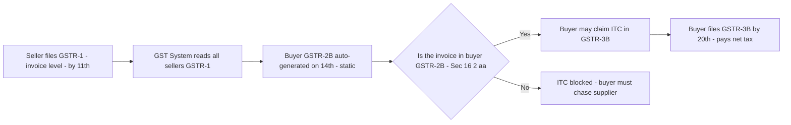
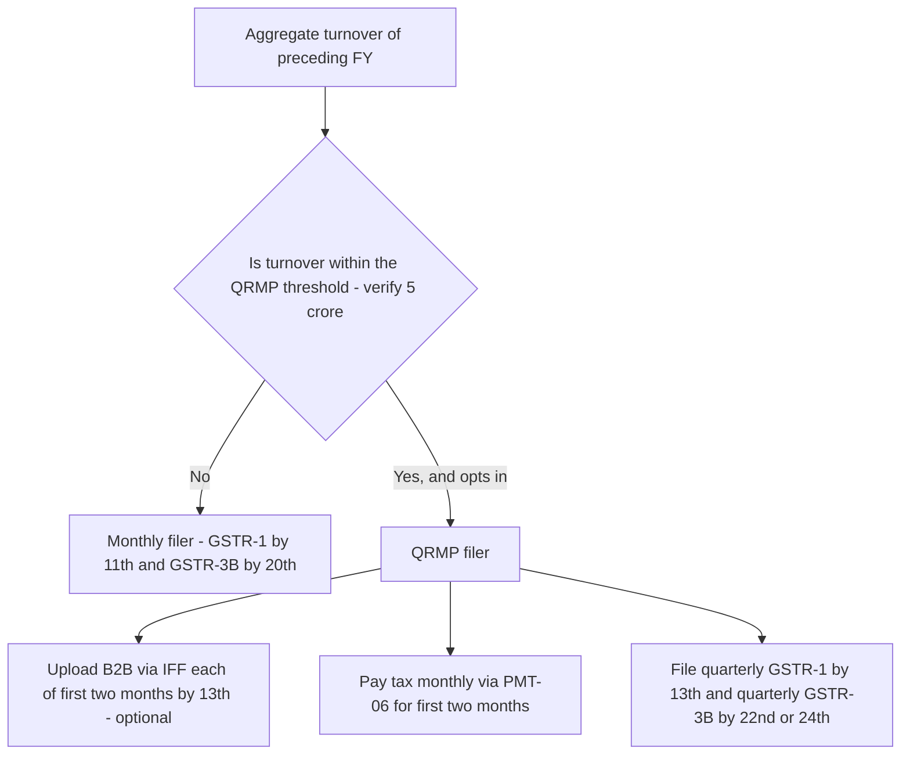
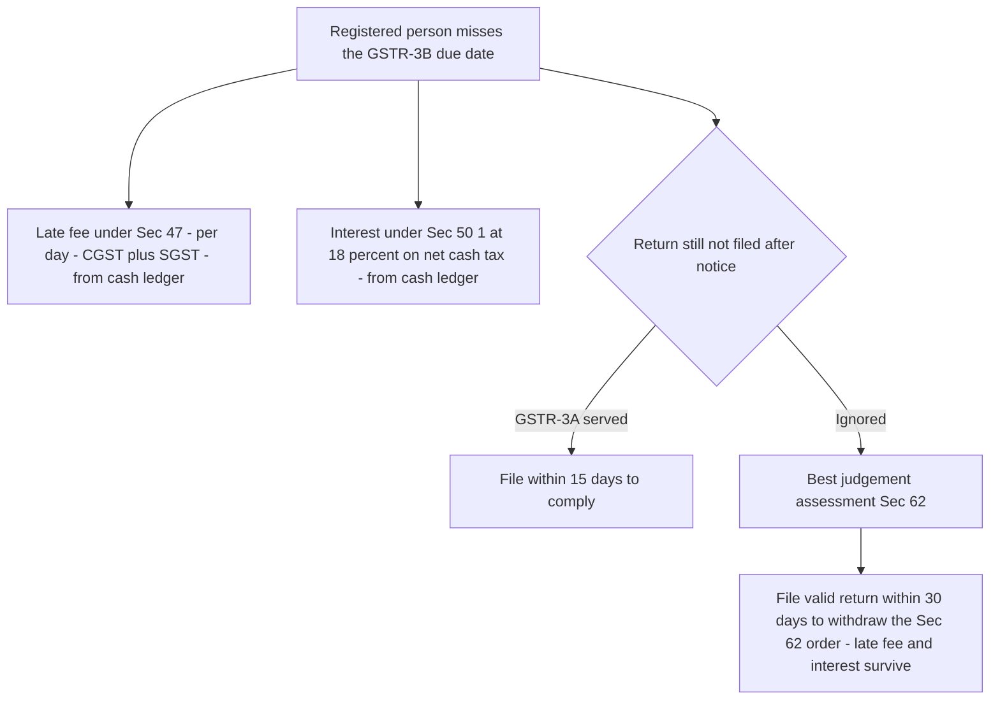

<!-- v2-deep -->

# Chapter 23 — Returns

> **Rates / thresholds / amendments flag:** This chapter teaches the *architecture and logic* of the GST return system under Sections 37–48 of the CGST Act, 2017 read with Rules 59–68 of the CGST Rules. The **return structure is the single most amendment-prone corner of GST** — GSTR-2 and GSTR-3 were suspended and never operationalised, the QRMP scheme was bolted on, GSTR-2B replaced reliance on GSTR-2A, sequential-filing and three-year time-bars were inserted, and due dates get extended by notification almost every year. Treat the *design logic* below as permanent, but **verify every due date, the current turnover thresholds for QRMP, the late-fee caps, and the latest interest rates against current ICAI study material for your attempt.** The *why* is stable; the *numbers* move.

---

## 1. The Problem — Why a self-assessed tax needs periodic returns at all

Go back to the founding bargain of GST (Chapter 13). GST is a **self-assessed** tax: nobody sits at your gate stamping every invoice. You decide what you sold, you decide what tax you owe, you decide what input tax credit (ITC) you are entitled to, and you pay the net. The State does not pre-verify any of this. That is fast and cheap — but it hands the taxpayer a loaded pen. Two things can now go wrong, and both are fatal to the exchequer:

**Problem 1 — Nobody knows what you did unless you tell them.** If tax is self-assessed, the government has *no independent record* of your transactions. It cannot collect, cannot audit, cannot even know a registered person exists as an economic actor, unless the taxpayer *periodically declares* what happened. A tax without a declaration mechanism is a tax on the honour system with no ledger. The return **is** that ledger — the structured, periodic, machine-readable confession of "here is what I supplied, here is what I paid, here is the credit I claim, here is my net cash."

**Problem 2 — The credit chain is only as honest as its weakest link.** This is the deeper problem, and it is unique to a value-added tax. Recall the seamless-credit promise: the buyer claims ITC equal to the tax the seller charged. But that credit is a *claim by the buyer* — the buyer simply asserts "I paid ₹18,000 GST on my purchases, give me credit." How does the government know the seller ever *deposited* that ₹18,000? If it never checks, a buyer can fabricate invoices, claim credit on tax that was never paid into the treasury, and the government refunds real money against fake tax. This is the single largest fraud vector in every VAT/GST system on earth — **fake ITC on bogus invoices.**

So the return system must do far more than collect declarations. It must **cross-verify one taxpayer's claim against another taxpayer's declaration.** The buyer's credit must be *matched* to the seller's disclosed liability. My purchase is your sale. If your sales return does not show my invoice, my credit is suspect. **The return system is the machinery that makes the credit chain self-policing** — it turns millions of taxpayers into witnesses against each other, because the buyer *needs* the seller to file, and the seller *needs* to file to let the buyer claim.

That is the whole game. Periodic returns exist to (a) capture self-assessed liability in a ledger the State can act on, and (b) **weld each buyer's credit to a specific seller's declaration**, so that no rupee of ITC can exist that some seller did not first declare. Everything below — every form, every due date, every auto-population — is an implementation detail of those two goals.

**A third, quieter problem the return system also solves — timing and finality.** A self-assessed tax with no clock never closes. If a taxpayer could file (or refile, or amend) any period at any time, the treasury could never treat a year as *settled*, refunds could never be safely paid, and audit trails would shift under the auditor's feet. So the return machinery also carries a *temporal spine*: fixed due dates, a mandatory *order* of filing, and hard *outer limits* (the three-year bars) after which a period is frozen. Keep this third goal in view — several of the most-tested rules (sequential filing, the 3-year bar, the annual truth-up) are not about *what* you declare but about *when* and *in what order*, and they exist to give a self-assessed system the finality a pre-assessed one gets for free.

**Why not just verify at the invoice level once, up front?** The original 2017 design (GSTR-1 → GSTR-2 → GSTR-3, with the *buyer* accepting/rejecting each invoice) tried exactly that — perfect two-sided matching before any credit flowed. It collapsed: hundreds of crores of invoices, buyers and sellers disagreeing, a "reject" by one paralysing the other's return. The lesson baked into the *current* design is that **matching must be automatic and one-directional** — the system builds the buyer's credit *from* the seller's declaration without asking the buyer to reconcile invoice-by-invoice. That single engineering retreat (from two-sided matching to one-sided auto-population) explains the entire shape of the working system. Knowing *why* GSTR-2/3 died is itself an examiner favourite.

---

## 2. The Core Idea

> **Each registered person files an outward-supply statement (GSTR-1) declaring every invoice they issued. The system reads all sellers' GSTR-1s and automatically hands each buyer a statement of the credit available to them (GSTR-2B). The buyer then files a summary return (GSTR-3B) declaring net liability and paying tax in cash, taking credit only up to what the system says is available. Once a year, an annual return (GSTR-9) reconciles the twelve monthly filings against the audited books.**

Three load-bearing ideas organise the entire chapter:

1. **The outward statement of the seller is the raw material of the buyer's credit.** GSTR-1 is not just the seller's declaration of *his* tax — it is the *source data* from which the buyer's GSTR-2B is built. One taxpayer's return literally feeds another taxpayer's credit. This coupling is the anti-fraud engine.

2. **Credit is no longer self-declared — it is system-communicated.** The old dream (GSTR-2/GSTR-3 with buyer-side invoice matching) collapsed under complexity. The working system instead *pushes* an auto-drafted credit statement (GSTR-2B) to the buyer, and the law (Sec 16(2)(aa)) now says: **you cannot claim ITC that does not appear there.** Credit went from "assert and hope" to "claim what the system shows."

3. **The summary return is where money and credit meet.** GSTR-3B is the monthly settlement: output tax minus available ITC equals net payable in cash. It is the return that actually *moves money*.

Everything else — QRMP, IFF, late fees, sequential filing, the annual reconciliation — hangs off these three hooks.

**The one sentence that unlocks every rule:** *the return system is a directed pipeline with a mandatory input order.* Data flows one way — seller declares (GSTR-1) → system builds buyer's credit (GSTR-2B) → buyer settles (GSTR-3B) → annual truth-up (GSTR-9). Almost every "surprising" rule in this chapter is just the law protecting either the *direction* of that flow (Sec 16(2)(aa) blocks credit that never entered the pipe) or its *order* (sequential filing stops a taxpayer settling before he declares). When a problem confuses you, ask: *which part of the pipeline is this protecting — the direction, or the order?* That reframe answers most questions before you touch the numbers.

---

## 3. Why It's Built This Way — the design logic behind each form

Before a single section, understand the *design choices*, because every rule is one of these in disguise.

| Design choice | The problem it solves | How the Act implements it |
|---|---|---|
| A dedicated outward-supply statement | The State needs an invoice-level record to build the credit chain | GSTR-1, Sec 37 |
| Auto-generate the buyer's credit statement from all sellers' GSTR-1 | Match credit to declared liability without asking the buyer to reconcile manually | GSTR-2B (static, Rule 60), Sec 38 |
| Bar credit not appearing in the auto-statement | Kill fake ITC on invoices no seller declared | Sec 16(2)(aa) — the credit "gate" |
| A summary return that computes and pays net tax | Actually collect the money each month | GSTR-3B, Sec 39, Rule 61 |
| Force GSTR-1 to be filed *before* GSTR-3B | Ensure the seller's data exists before he pays, so buyers' credit is populated | Sec 39(10) — sequential filing |
| Force this month's filing only after last month's is done | Prevent gaps and stale, out-of-order ledgers | Sec 37(4) / 39(10) — no leapfrogging |
| A quarterly option for small taxpayers | Compliance cost is regressive; monthly filing crushes small firms | QRMP scheme (turnover ≤ threshold) |
| A once-a-year reconciliation with the books | Monthly returns are summaries; annual truth-up catches drift | GSTR-9 / GSTR-9C, Sec 44 |
| Late fee per day + interest on late tax | Make delay costlier than compliance; self-enforcing deadlines | Sec 47 (late fee), Sec 50 (interest) |
| A hard time-bar on filing old returns | Stop indefinite reopening; force finality | Sec 37(5), 39(11), 44 — 3-year bar |
| Lock a filed GSTR-1/3B; corrections only *prospectively* by amendment | Preserve the integrity of data already fed to buyers | Amendment tables in the *next* period's GSTR-1 |
| Auto-populate GSTR-3B liability from GSTR-1 | Reduce mismatch between what the seller declared and what he pays | Sec 37 → 39 linkage; Rule 61 auto-draft |

The elegance to internalise: **the return system is a directed pipeline, not a set of independent forms.** Data flows one way — seller's GSTR-1 → system → buyer's GSTR-2B → buyer's GSTR-3B — and the sequencing rules exist purely to keep that pipeline from running dry or out of order. Once you see it as *one machine with a mandatory input order*, the due dates and the sequential-filing rules stop being arbitrary.

**Why corrections are prospective, not retrospective — a design point the exam probes.** Once GSTR-1 is filed, its invoices have already flowed into buyers' GSTR-2B. If the seller could *rewrite* a filed GSTR-1, he would silently change credit that buyers may already have claimed — the pipeline would develop back-eddies. So the law never lets you edit a filed return; you correct only through an **amendment table in a later period's GSTR-1** (B2B amendments, credit/debit notes, amended B2C). The correction therefore lands in the buyer's *later* GSTR-2B, keeping the flow strictly forward. This is why "revised returns" do not exist in GST the way they do in income tax — a favourite trap for candidates crossing over from direct tax.

**The two-speed design — invoice-level for credit, summary-level for cash.** Notice the system deliberately runs at two granularities. GSTR-1 is *invoice-level* because credit must be routed to a specific buyer; GSTR-3B is *summary-level* because paying money needs only totals. Composition dealers, who sit outside the credit chain, get an even coarser, *annual* form (GSTR-4). **Granularity is calibrated to the actor's role in the credit chain** — the deeper you are in the chain, the finer the detail the law demands. Reading any form's design as "how much does this actor's data feed someone else's credit?" predicts its frequency and detail every time.

---

## 4. Full Technical Content — the forms, sections, due dates and conditions, with the "why"

### 4.1 The overall map (Sec 37–48)

| Section | What it governs |
|---|---|
| **Sec 37** | Furnishing details of *outward* supplies (GSTR-1) |
| **Sec 38** | Communication of *inward* supplies and ITC (auto-drafted GSTR-2B) |
| **Sec 39** | Furnishing of returns (GSTR-3B and other periodic returns) |
| **Sec 40** | First return |
| **Sec 44** | Annual return (GSTR-9 / GSTR-9C) |
| **Sec 45** | Final return (GSTR-10, on cancellation) |
| **Sec 46** | Notice to return defaulters (GSTR-3A) |
| **Sec 47** | Levy of late fee |
| **Sec 48** | Goods and Services Tax Practitioners |
| **Sec 50** | Interest on delayed payment / excess ITC |

*(Sec 41 governs the availment of self-assessed ITC — now shorn of the old provisional-credit language; Sec 42, 43 and 43A, which built the abandoned invoice-matching / mismatch-reversal machinery of the GSTR-2/3 era, have been **omitted**. If a question cites Sec 42/43 matching, it is testing whether you know that architecture was scrapped — verify the current omission status for your attempt.)*

### 4.2 GSTR-1 — the outward-supply statement (Sec 37, Rule 59)

> **What it is:** An *invoice-level* declaration of every outward supply (sale) made in the tax period — B2B invoices individually, B2C above a threshold individually, small B2C in consolidated summaries, exports, credit/debit notes, and amendments. This is the **most granular** return; the whole credit chain is built from it.

**Why invoice-level and not just a total?** Because the buyer's credit is invoice-specific. If GSTR-1 only carried a lump-sum "total sales ₹50 lakh," the system could never tell *which buyer* is entitled to *which slice* of credit. Invoice-level detail is what lets the system split the seller's declaration and route each invoice's tax to the correct buyer's GSTR-2B. **Granularity in GSTR-1 = precision in the credit chain.**

**What actually goes in which table (the finer distinctions the exam tests):**
- **B2B supplies** (to registered persons) — reported invoice-by-invoice, always, regardless of value, because each feeds a specific buyer's GSTR-2B.
- **B2C Large** (inter-State supply to an *unregistered* person where invoice value exceeds the notified limit — historically **₹2,50,000**, *verify current limit*) — reported **invoice-wise**, because place-of-supply/State apportionment needs the detail even though no buyer claims credit.
- **B2C Small** (all intra-State B2C, and inter-State B2C at or below the limit) — reported **consolidated, rate-wise, State-wise** — no buyer is claiming credit, so invoice detail is wasted effort.
- **Zero-rated / exports / SEZ supplies** — separate tables, because they drive refund claims.
- **Credit notes / debit notes (Sec 34)** — reported so the buyer's credit is correspondingly *reduced/increased* in his GSTR-2B.
- **Amendments** — separate amendment tables (B2B, B2C large, CDN) to correct *earlier* periods prospectively.
- **Nil-rated, exempt and non-GST outward supplies** — declared for completeness of turnover, though they carry no tax.

**Due date:**
- **Monthly filers:** 11th of the month following the tax period.
- **QRMP filers (quarterly):** 13th of the month following the quarter, with an optional **Invoice Furnishing Facility (IFF)** to upload B2B invoices for the first two months of the quarter by the 13th of the next month — so their buyers don't wait a whole quarter for credit.

**Why IFF exists:** A quarterly GSTR-1 would starve the small filer's *buyers* of credit for up to three months — the buyer's GSTR-2B would be empty. IFF lets the quarterly seller push B2B invoices monthly so the credit pipeline keeps flowing, without forcing a full monthly return. It is a patch that reconciles "small-seller relief" with "don't break the buyer's credit."

**Sequential filing (Sec 37(4)):** A registered person **cannot furnish GSTR-1 for a period if GSTR-1 for any previous period has not been furnished.** No leapfrogging — the pipeline must fill in order.

**Time-bar (Sec 37(5)):** GSTR-1 **cannot be filed after three years** from its due date. *(Inserted to force finality; verify effective date/notification for your attempt.)*

**GSTR-1A — the fine distinction reintroduced.** A facility to *amend/add* records of the current period *before* filing GSTR-3B of the same period has been made available as **GSTR-1A** (optional). It lets a seller correct GSTR-1 within the same cycle so the corrected liability flows into his own GSTR-3B — but note it is **not** the abandoned buyer-side GSTR-2. Do not confuse the old GSTR-1A (buyer's amendments, now defunct) with any current same-period seller amendment facility; *verify its exact current form and scope for your attempt.*

### 4.3 GSTR-2B — the auto-drafted ITC statement (Sec 38, Rule 60)

> **What it is:** A **static, auto-generated** statement of the ITC *available* to a recipient for a tax period, built by the system from all the recipient's suppliers' GSTR-1s (plus IFF, GSTR-5 of non-residents, GSTR-6 of ISD, and import data from ICEGATE). It is generated on the **14th** of the month, and once generated it does **not change** for that period.

**GSTR-2A vs GSTR-2B — the distinction the examiner loves:**

| Feature | GSTR-2A | GSTR-2B |
|---|---|---|
| Nature | **Dynamic** — keeps updating as suppliers file/amend | **Static** — frozen once generated on the 14th |
| Purpose | A live view/reference | The **authoritative basis for claiming ITC** |
| Basis for ITC | No | **Yes** — Sec 16(2)(aa) ties credit to it |
| When a late-filed supplier invoice shows | In 2A of the *original* period (retro-updates) | In 2B of the *period in which the supplier actually filed* |

**Why static?** Because ITC must be claimed against a *fixed* number for a period. If the basis kept moving, you could never reconcile "credit claimed" to "credit available" — every recalculation would shift the goalposts. GSTR-2B freezes the picture on the 14th so the buyer has one stable figure to carry into GSTR-3B.

**The single most-tested consequence of "static":** a supplier invoice for April, filed *late* by the supplier in July, appears in the buyer's **July GSTR-2B — not April's**. In GSTR-2A it would retro-populate April; in the static 2B it lands in the month the supplier actually filed. So the *timing of the buyer's eligible credit follows the seller's filing date*, and the buyer claims that credit in July's 3B (still subject to the Sec 16(4) outer limit). Examiners deliberately give a "supplier filed late" fact to see whether you place the credit in the right month.

**GSTR-2B also flags eligibility, not just presence.** Beyond listing invoices, 2B marks credit as eligible/ineligible (e.g. invoices where the supply is a blocked credit under Sec 17(5), or where the recipient's registration/place-of-supply makes it non-creditable) and separates ITC reversible/re-claimable. Presence in 2B is *necessary* but not *sufficient* — the invoice must also survive the substantive ITC conditions of Sec 16 and 17. A trap: "invoice is in 2B, therefore fully creditable" is false if it is a Sec 17(5) blocked credit.

**The credit gate — Sec 16(2)(aa):** ITC on an invoice/debit note is available **only if** the details have been furnished by the supplier in *his* GSTR-1 **and communicated to the recipient** (i.e. it appears in GSTR-2B). *(Read with Sec 38 and Rule 36(4), which historically capped provisional credit; that cap has now hardened into a near-total bar — verify the current form of Rule 36(4) for your attempt.)*

**Sec 38's second lever — restricting even communicated credit (the newer layer).** Amended Sec 38 lets the system *communicate* ITC in two buckets: available and **restricted**. Credit can be flagged restricted (i.e. auto-blocked) where the supplier is newly registered, has defaulted in paying tax beyond a threshold, has declared more output in GSTR-1 than paid in GSTR-3B, has availed excess ITC, or is otherwise a risk. This pushes the gate *further*: not every invoice in 2B is claimable — the system can pre-flag high-risk suppliers' credit as ineligible. *(This is a maturing provision; verify how far it is operational for your attempt, but know the direction of travel — the gate is tightening from "did the supplier file?" toward "is the supplier trustworthy?")*

**This is the anti-fraud lock clicking shut.** Before this, a buyer could claim credit on any invoice he held. Now, if the seller did not declare the invoice in GSTR-1, it never reaches the buyer's GSTR-2B, and the buyer *cannot* claim it. **The buyer's credit is now a hostage to the seller's filing** — which is exactly the leverage the system wants, because it makes every buyer a compliance enforcer of his own suppliers.

### 4.4 GSTR-3B — the summary return and payment (Sec 39, Rule 61)

> **What it is:** A **summary** (not invoice-level) monthly/quarterly return declaring, in consolidated figures: total outward tax liability, eligible ITC, tax payable, and tax paid. **This is the return that discharges liability** — the payment happens here.

**The computation inside GSTR-3B (the heart of it):**

```
Output tax on outward supplies (from your records / GSTR-1)
LESS: Eligible ITC (capped at what GSTR-2B communicates)
= Net tax payable
   → discharged first from Electronic Credit Ledger (ITC), then Electronic Cash Ledger
```

**Filing ≠ merely submitting — the return is "furnished" only when tax is paid.** GSTR-3B is treated as validly furnished only when the tax shown is *actually discharged*; you cannot "file a 3B" and owe the money later. This is why the return itself is the payment event, and why non-payment is non-filing that then attracts late fee and blocks the *next* period's sequential filing.

**Due date:**
- **Monthly filers:** 20th of the following month.
- **QRMP filers:** staggered — **22nd or 24th** of the month following the quarter, depending on the State/UT of the principal place of business (a two-day stagger to spread server load across the country).

**QRMP monthly payment (PMT-06):** A quarterly-return filer still pays *tax* monthly for the first two months via a challan (PMT-06), using either a **fixed sum method** (35% of last period's cash) or **self-assessment**. *Return* is quarterly; *payment* stays roughly monthly — because the government will not lend the taxpayer three months of interest-free float.

**The two PMT-06 methods, made precise:**
- **Fixed Sum Method (FSM) / "35% challan":** if the previous quarter was under QRMP, pay **35%** of the net cash paid in that quarter, for *each* of months 1 and 2; if the taxpayer filed monthly in the previous quarter, pay **100%** of the last month's net cash. Its beauty: no computation, and **no interest** is charged if the fixed sum is paid on time, even if actual liability turns out higher — the shortfall is squared up interest-free in the quarterly 3B (provided that quarterly 3B is filed on time). This is a genuine safe harbour, and a common exam sweet-spot.
- **Self-Assessment Method (SAM):** compute actual liability for the month (output minus available ITC) and pay it. Used when actual liability is *lower* than the fixed sum (so FSM would overpay).

**Nil monthly liability under QRMP:** if a QRMP taxpayer has no tax to pay for a month (e.g. ITC covers it), **no PMT-06 challan is required** — you don't file a nil challan.

**Sequential filing (Sec 39(10)):** GSTR-3B for a period **cannot be filed unless GSTR-1 for the same period has been filed.** Order is forced: **declare (GSTR-1) before you settle (GSTR-3B).** The reason is the pipeline — the seller's invoices must be in the system *before* he pays, so buyers' GSTR-2B is populated and the whole month's credit chain is consistent. You also cannot file this period's 3B if a previous 3B is pending.

**Time-bar (Sec 39(11)):** GSTR-3B cannot be filed after **three years** from its due date. *(Verify effective date.)*

### 4.5 The QRMP scheme — small-taxpayer relief

**Who:** Registered persons with aggregate turnover **up to ₹5 crore** in the preceding FY *(verify threshold)* may opt for **Q**uarterly **R**eturn filing with **M**onthly **P**ayment.

**Why it exists:** Compliance cost is *regressive* — filing twelve GSTR-1s and twelve GSTR-3Bs a year is trivial overhead for a large firm and a crushing burden for a tiny one. QRMP cuts filing frequency (returns become quarterly) while **preserving monthly cash flow to the treasury** (payment via PMT-06) and **preserving buyers' credit** (via IFF). It is the classic three-way reconciliation: relieve the small taxpayer, don't starve the exchequer, don't break the buyer.

**The mechanics candidates miss:**
- **Opt-in is GSTIN-wise, not PAN-wise** — different registrations of the same PAN can independently choose QRMP or monthly.
- **The option is continuous** — once chosen, it carries forward quarter to quarter until changed; you don't re-elect every quarter.
- **A window to opt in/out** exists (broadly, from the first day of the second month of the preceding quarter to the last day of the first month of the quarter — *verify exact window*).
- **Crossing ₹5 crore *during* the year** disqualifies you from the *next* quarter — you must move to monthly from the quarter succeeding the one in which turnover crossed the limit.
- **IFF cap:** historically IFF carried a value ceiling per month (₹50 lakh) — *verify current ceiling*.

**The subtle trade-off:** QRMP eases *your* filing but can *delay your buyers' credit* if you skip IFF — so a QRMP seller with big B2B buyers is often pushed by those buyers to use IFF anyway. The scheme relieves compliance frequency but cannot escape the pipeline's demand that buyers get their credit monthly.

### 4.6 The other periodic and special returns

| Form | Who files it | Frequency / due date | Why it exists |
|---|---|---|---|
| **CMP-08** | Composition dealers | Quarterly, 18th of month after quarter | Composition pays a flat rate; this is the *payment* statement |
| **GSTR-4** | Composition dealers | **Annual**, 30th June of next FY *(verify)* | Annual return for composition — they don't touch the ITC chain, so no monthly detail needed |
| **GSTR-5** | Non-resident taxable persons | Monthly (13th) | Feeds recipients' GSTR-2B for imports of services |
| **GSTR-5A** | OIDAR service providers (to unregistered Indian recipients) | Monthly | Reports online-services tax where no Indian recipient can be a collection agent |
| **GSTR-6** | Input Service Distributor (ISD) | Monthly, 13th | Distributes common-input credit to branches; feeds their GSTR-2B |
| **GSTR-7** | Persons deducting **TDS** (Sec 51) | Monthly, 10th | Reports tax deducted; deductee gets credit in cash ledger |
| **GSTR-8** | E-commerce operators collecting **TCS** (Sec 52) | Monthly, 10th | Reports tax collected at source on supplies through the platform |
| **GSTR-9** | Regular taxpayers | **Annual**, 31st December of next FY | Reconciles the year's monthly returns (see 4.7) |
| **GSTR-9A** | Composition (annual) | Annual *(currently waived — verify)* | Composition equivalent of GSTR-9 |
| **GSTR-9C** | Taxpayers above turnover limit | With GSTR-9, 31st December | Self-certified reconciliation of returns vs audited financials |
| **GSTR-10** | Person whose registration is cancelled | **Final return**, within 3 months of cancellation (Sec 45) | Closes the account — declares stock/liability on exit |
| **GSTR-11** | Persons with a UIN (embassies etc.) | For claiming refunds | Not a liability return; refund enabler |

**Why so many forms?** Each answers a *different actor's* relationship to the credit chain. A composition dealer sits *outside* the chain (no ITC), so his return is thin and annual. An ISD's whole job is *routing* credit, so his return is a distribution statement. A TDS/TCS deductor injects money into someone else's *cash* ledger, so his return credits a third party. **The form follows the actor's role in the pipeline.**

**TDS vs TCS — the pairing examiners test together.** GSTR-7 (TDS, Sec 51) is filed by specified deductors (government bodies etc.) who deduct tax from *payments to suppliers*; GSTR-8 (TCS, Sec 52) is filed by e-commerce operators who collect tax on the *net value of supplies made through them*. Both are **monthly, due the 10th**, and both *credit a third party's cash ledger* — the deductee/supplier claims it as a cash-ledger credit (not as ITC). The distinction: TDS is a *deduction from a payment*; TCS is a *collection on a sale through a platform*. A question that hands you an e-commerce operator and asks for the "deductor's return" is baiting the TDS/TCS swap.

**First return vs final return — do not swap them.** GSTR-10 (Sec 45) is the **final** return on *cancellation* (closing the account); the **first return** (Sec 40) is not a separate form at all — it is the *first GSTR-3B/GSTR-1* filed after registration, covering the pre-registration gap. Candidates invent a "GSTR-1 first return form" — there is none.

### 4.7 The annual return — GSTR-9 and GSTR-9C (Sec 44)

> **What it is:** A consolidated annual statement reconciling the twelve monthly/quarterly returns with the taxpayer's books. **GSTR-9** is the annual return; **GSTR-9C** is a *reconciliation statement* (now self-certified) required for taxpayers whose turnover exceeds a notified limit, reconciling the annual return with the **audited financial statements**.

**Why an annual return when you already filed monthly?** Because monthly GSTR-3B is a *summary* filed under time pressure — errors, omissions and timing mismatches accumulate. The annual return is the **truth-up**: it forces the taxpayer to reconcile what he *declared and paid* across the year against what his *books* actually say, and to pay any shortfall. It is the periodic close that catches the drift monthly summaries inevitably create.

**The thresholds and exemptions (finer distinctions):**
- **GSTR-9 optional/exempt** for taxpayers with aggregate turnover **up to ₹2 crore** *(verify)* — small taxpayers are spared the annual return entirely.
- **GSTR-9C** required only above a higher turnover limit — historically **₹5 crore** *(verify)*.
- **9C moved from CA-audit to self-certification.** Earlier the reconciliation had to be *certified by a Chartered Accountant / Cost Accountant*; the law was amended so the registered person **self-certifies** 9C. If a question says "GST audit by a CA is mandatory above ₹2 crore," it is testing whether you know the **mandatory GST audit (old Sec 35(5)) was omitted** — verify the current position for your attempt.
- **Composition** dealers file **GSTR-9A** (annual), *currently waived for several years — verify*.
- **GSTR-9 is largely non-editable and additive:** it consolidates the year but does *not* let you *reduce* tax already paid; additional liability found is paid via **DRC-03**, and ITC not claimed in returns generally **cannot** be claimed for the first time through GSTR-9.

**Due date:** 31st December following the end of the financial year *(verify)*. **Time-bar (Sec 44):** cannot be furnished after **three years** from the due date.

### 4.8 First return (Sec 40) and Notice to defaulters (Sec 46)

- **First return (Sec 40):** A newly registered person declares, in his first return, outward supplies made **between the date he became liable to register and the date registration was granted** — so the gap period is not lost. *(Deeper why: a person becomes liable the day he crosses the threshold, but registration is granted days/weeks later. Supplies in that gap were validly taxable — Sec 40 gives them a home in the first return so the interregnum is not a tax-free window.)*
- **Notice to defaulters (Sec 46):** If a return is not filed, the officer issues **GSTR-3A** requiring filing within **15 days**. Ignore it and the officer may proceed to **best-judgement assessment (Sec 62)** — the State assesses your tax *for* you, on its own estimate. This is the stick behind the deadline: fail to self-assess and you lose control of the assessment entirely.
- **The escape hatch from Sec 62:** a best-judgement assessment order under Sec 62 is **withdrawn** if the defaulter files the missing valid return within **30 days** of service of the order (paying the associated late fee and interest). So the stick is designed to *coerce filing*, not to punish for its own sake — file within the window and the estimated assessment evaporates (though late fee and interest survive). This 30-day withdrawal window is a precise, testable number.

---

## The two headline diagrams


*Figure 1 — How one taxpayer's return feeds another taxpayer's credit: the seller's GSTR-1 is the raw material of the buyer's GSTR-2B, and Sec 16(2)(aa) is the gate.*


*Figure 2 — Choosing the filing frequency: QRMP relieves the small taxpayer on returns while preserving monthly payment and buyer credit.*

### 4.9 Late fee (Sec 47) and interest (Sec 50) — the self-enforcing deadlines

**Late fee (Sec 47):** A per-day charge for filing GSTR-1/GSTR-3B/annual return late — **₹100 per day under CGST + ₹100 under SGST = ₹200/day**, subject to a maximum; **nil returns** carry a reduced fee (e.g. ₹10 + ₹10 = ₹20/day). *(Caps are turnover-slabbed and revised by notification — verify current caps and nil-return fee for your attempt.)*

**The turnover-slabbed caps (know the *structure*, verify the *figures*):** the maximum late fee is graded so it does not crush small taxpayers — broadly, a lower cap for nil filers, a middle cap for taxpayers up to a turnover threshold, and a higher cap above it. The principle: **the ceiling scales with capacity to pay.** For the annual return, the late fee is a per-day charge subject to a percentage-of-turnover cap. *(All specific caps are notification-driven — verify current slabs for your attempt; the exam rewards knowing the graded *structure* even when it does not test the exact rupee cap.)*

**Why a per-day fee and not a flat penalty?** Because the harm of a late return *grows with delay* — every extra day the seller's GSTR-1 is missing is another day his buyers cannot claim credit and the State cannot see the transaction. A per-day charge makes the cost track the harm and makes *prompt* filing rational even after you've already missed the date.

**Interest (Sec 50):**
- **Sec 50(1) — late payment of tax: 18% p.a.** on the net tax paid late. Crucially, interest is on the amount paid *through the cash ledger* (i.e. the net liability), not on the portion set off by ITC that was already lying in the credit ledger — because that credit was already tax *in the system*.
- **Sec 50(3) — wrongly availed and utilised ITC: 24% p.a.** The higher rate punishes credit that was not merely late but *wrong* and *used*.

**The Sec 50(1) proviso — the "net cash" principle, made precise.** The proviso to Sec 50(1) confines interest to tax paid by *debiting the cash ledger* **provided the return is filed** (i.e. the delay is one of *filing/payment*, not of a return never filed). The logic: ITC lying unused in the credit ledger is money *already collected by the exchequer somewhere up the chain* — charging the taxpayer interest on tax the treasury already holds would be double-counting the time-value. So interest bites only on the *incremental cash* the treasury was actually deprived of.

**The refined Sec 50(3) — "availed AND utilised."** The amended Sec 50(3) charges interest only where wrong ITC is both **availed and utilised** — merely *availing* (recording) wrong credit but *reversing it before use* attracts **no interest**. The reason: if you never *used* the wrong credit to pay tax, the treasury lost nothing — no time-value was extracted. This "availed and utilised" refinement is a precise exam point; older material charging interest on mere wrong availment is outdated. *(Verify the current rate and the exact utilisation rule — Rule 88B defines when credit is treated as utilised.)*

**Why interest is separate from late fee:** the *late fee* prices the delayed *declaration* (the missing ledger entry); *interest* prices the delayed *money* (the treasury lost the time-value of tax it should have held). Two different harms, two different charges. And critically — **both are paid only from the cash ledger; ITC can never pay interest or late fee.**


*Figure 4 — The escalating cost of delay: money charges first, then a defaulter notice, then a best-judgement assessment that a late filing can still unwind.*

---

## 5. Worked Examples

### Example 1 — The credit chain in motion (why GSTR-1 timing decides GSTR-2B)

**Facts.** Alpha Ltd (monthly filer) sells goods to Beta Ltd in **April 2026**, invoice value ₹10,00,000 + IGST @ 18% = ₹1,80,000. Beta also buys from Gamma Ltd in April: ₹4,00,000 + IGST ₹72,000. Alpha files its April GSTR-1 on **10 May** (on time). Gamma is a QRMP filer and does **not** use IFF, so Gamma's April invoices reach the system only when Gamma files its quarterly GSTR-1 on **13 July**.

**Question.** What ITC can Beta claim in its **April GSTR-3B** (filed 20 May)?

**Step 1 — Build Beta's April GSTR-2B (generated 14 May).** It contains only invoices from suppliers whose GSTR-1/IFF was filed by then.
- Alpha's ₹1,80,000 — filed 10 May → **appears** in Beta's 2B.
- Gamma's ₹72,000 — not filed until 13 July, no IFF → **does not appear** in April 2B.

**Step 2 — Apply the Sec 16(2)(aa) gate.** ITC claimable = only what is in GSTR-2B.
- Alpha ₹1,80,000 → **eligible**.
- Gamma ₹72,000 → **blocked in April**; it will appear in Beta's **July** GSTR-2B and be claimable then (subject to the Sec 16(4) annual time limit).

**Step 3 — Beta's April ITC = ₹1,80,000.**

**Reconciliation / lesson.** Beta paid ₹72,000 of real tax to Gamma but *cannot use it yet* — purely because Gamma delayed disclosure. **This is the design working as intended:** the buyer's credit is welded to the seller's filing. Beta now has every incentive to pressure Gamma to file (or use IFF). The chain polices itself.

**What if the examiner tweaks it — Gamma uses IFF.** If Gamma had uploaded the April B2B invoice via **IFF by 13 May**, it *would* appear in Beta's April GSTR-2B (generated 14 May), and Beta's April ITC would be ₹1,80,000 + ₹72,000 = **₹2,52,000**. The single fact that flips the answer is *whether the small seller pushed the invoice into the pipeline before the 14th* — that is the whole point IFF exists.

### Example 2 — Computing net tax and interest in GSTR-3B

**Facts (monthly filer, May 2026).**
- Output IGST on outward supplies: ₹3,00,000.
- Eligible ITC per GSTR-2B: IGST ₹1,10,000.
- Opening balance in Electronic Credit Ledger: ₹0. Cash ledger: ₹0.
- The taxpayer files and pays on **28 June** instead of the due date **20 June** — 8 days late.

**Step 1 — Net tax payable.**

| Item | ₹ |
|---|---|
| Output tax (IGST) | 3,00,000 |
| Less: ITC available (IGST) | (1,10,000) |
| **Net tax payable in cash** | **1,90,000** |

**Step 2 — Interest under Sec 50(1) @ 18% p.a. on the net cash tax paid late.**
Interest = ₹1,90,000 × 18% × (8 / 365) = ₹1,90,000 × 0.18 × 0.021918 = **₹749.6 ≈ ₹750.**

*Note:* interest runs on ₹1,90,000 (the cash portion), **not** on ₹3,00,000 — the ₹1,10,000 met from ITC was already tax within the system.

**Step 3 — Late fee under Sec 47.**
8 days × ₹200/day (₹100 CGST + ₹100 SGST) = **₹1,600** *(assuming a non-nil return and within the cap — verify current cap).*

**Step 4 — Total outflow on 28 June.**

| Item | ₹ |
|---|---|
| Net tax | 1,90,000 |
| Interest (Sec 50(1)) | 750 |
| Late fee (Sec 47) | 1,600 |
| **Total paid via cash ledger** | **1,92,350** |

**Reconciliation.** Tax, interest and late fee are three distinct heads and are paid under distinct minor heads in the cash ledger; ITC (credit ledger) can pay *tax* but **never** interest, late fee or penalty — those must come from cash. That last point is a favourite trap.

**What if the examiner tweaks it — the taxpayer had a ₹1,10,000 credit-ledger balance sitting from April.** Suppose instead the ITC was already in the *credit ledger* (opening balance ₹1,10,000) rather than this month's 2B. The *net cash* tax is still ₹1,90,000, interest is still on ₹1,90,000 — because interest under Sec 50(1) tracks the **cash** actually paid late, and the credit-ledger money (whenever it arrived) is not cash. The answer does not change. This tests whether you understand that "net cash tax" means *cash*, full stop — not "output minus this month's 2B."

### Example 3 — The annual reconciliation (GSTR-9 truth-up)

**Facts.** During FY 2025-26, Delta Ltd's **books** show total outward taxable turnover of ₹2,05,00,000 and output tax of ₹36,90,000. But the **sum of its twelve GSTR-3Bs** reported turnover ₹2,00,00,000 and output tax ₹36,00,000 — a March invoice of ₹5,00,000 (tax ₹90,000) was omitted and never corrected in a later 3B.

**Question.** What does GSTR-9 do, and what must Delta pay?

**Step 1 — Reconcile books vs returns.**

| | Books | GSTR-3B (sum) | Difference |
|---|---|---|---|
| Turnover | 2,05,00,000 | 2,00,00,000 | 5,00,000 |
| Output tax | 36,90,000 | 36,00,000 | 90,000 |

**Step 2 — GSTR-9 discloses the additional liability.** The annual return surfaces the ₹90,000 that was declared in books but never paid through the monthly returns. Delta must pay the ₹90,000 **plus interest under Sec 50(1)** from the original due date of the March 3B up to the date of payment (via DRC-03), because the tax was short-paid for that period.

**Step 3 — Why this could not hide.** Had there been no annual reconciliation, the ₹90,000 gap between books and returns might have surfaced only in a much later audit, with heavier consequences. **GSTR-9 is the mechanism that forces the taxpayer to find and fix his own drift** — and GSTR-9C, where applicable, makes a reconciliation with *audited* financials mandatory, closing the loop between the tax return universe and the accounting universe.

### Example 4 — QRMP fixed-sum method and the interest safe harbour

**Facts.** Epsilon Ltd (QRMP, turnover ₹3 crore) was under QRMP last quarter and paid **net cash of ₹6,00,000** in that quarter. For the current quarter (Apr–Jun), it uses the **Fixed Sum Method** for the first two monthly challans. Its *actual* liabilities turn out to be: April ₹2,50,000, May ₹1,90,000, June ₹3,00,000 (all net of ITC). It pays each PMT-06 on time and files the quarterly GSTR-3B by the due date (say 22 July).

**Question.** What does Epsilon pay in April and May via PMT-06, what is squared up in the quarterly 3B, and is any interest payable?

**Step 1 — Fixed sum for each of the first two months = 35% of last quarter's net cash.**
35% × ₹6,00,000 = **₹2,10,000** for April, and **₹2,10,000** for May, paid via PMT-06.

**Step 2 — Quarterly GSTR-3B (Apr–Jun) squares up the whole quarter.**

| | ₹ |
|---|---|
| Total actual liability (2,50,000 + 1,90,000 + 3,00,000) | 7,40,000 |
| Less: paid via PMT-06 (April) | (2,10,000) |
| Less: paid via PMT-06 (May) | (2,10,000) |
| **Balance payable with quarterly 3B (for June + true-up)** | **3,20,000** |

**Step 3 — Interest?** Under the FSM safe harbour, **no interest** is charged on the first two months even though April's actual liability (₹2,50,000) exceeded the fixed sum paid (₹2,10,000) — provided the fixed sum was paid on time *and* the quarterly 3B is filed by its due date. The ₹3,20,000 balance paid with the on-time quarterly 3B carries no interest either.

**Reconciliation / lesson.** Total paid = 2,10,000 + 2,10,000 + 3,20,000 = **₹7,40,000 = actual liability.** The FSM converted a fiddly monthly computation into two fixed challans and a quarterly clean-up, **interest-free** — the reward the scheme offers for using the fixed sum and filing the quarter on time.

**What if the examiner tweaks it — the quarterly 3B is filed *late*.** Then the safe harbour for the first two months is jeopardised and interest can be attracted on the shortfalls from their respective due dates. The safe harbour is *conditional on timely quarterly filing* — remove that condition and the FSM relief unwinds. This "condition attached to the concession" is exactly where examiners set the trap.

### Example 5 — Wrong ITC: availed vs availed-and-utilised (Sec 50(3))

**Facts.** Zeta Ltd wrongly recorded ITC of ₹1,00,000 in its books for July (an ineligible Sec 17(5) credit). Consider two scenarios:
- **(a)** Zeta *availed* the ₹1,00,000 in its credit ledger but its July output tax was fully covered by *other* eligible ITC; it **reversed** the ₹1,00,000 in August **before** using it to pay any tax.
- **(b)** Zeta *availed and utilised* the ₹1,00,000 to discharge July output tax, and the error is detected in October — 90 days of utilisation.

**Question.** Interest consequences under Sec 50(3)?

**Scenario (a):** Wrong credit was availed but **never utilised** (reversed before use). Under the amended Sec 50(3), interest applies only to ITC **wrongly availed *and* utilised** — so **no interest** is payable; Zeta simply reverses the entry. The treasury lost no money because the fake credit never paid any tax.

**Scenario (b):** Wrong credit was **utilised** — the treasury was short by ₹1,00,000 for the period of utilisation. Interest @ **24% p.a.** (Sec 50(3), *verify rate*) runs on ₹1,00,000 from the date of utilisation to the date of reversal/payment.
Interest ≈ ₹1,00,000 × 24% × (90 / 365) = ₹1,00,000 × 0.24 × 0.24658 = **₹5,918 ≈ ₹5,918.**

**Reconciliation / lesson.** The identical ₹1,00,000 error costs **nothing** if caught before use and **~₹5,918** if it actually paid tax — because interest prices the *time-value the treasury lost*, and if the wrong credit never moved money, no time-value was lost. This "availed vs utilised" fork is the single most important refinement in current Sec 50 and a favourite exam distinction. *(Verify the current Sec 50(3) rate and Rule 88B's definition of "utilised" for your attempt.)*

---

## 6. Format / Summary — the return calendar at a glance


*Figure 3 — The monthly rhythm: outward statements early, credit statement mid-month, settlement late.*

| Return | Who | Frequency | Due date *(verify)* | Section |
|---|---|---|---|---|
| GSTR-1 | Regular (outward) | Monthly / Quarterly | 11th / 13th | 37 |
| GSTR-2B | Auto-drafted ITC | Monthly | Generated 14th | 38 |
| GSTR-3B | Regular (summary + pay) | Monthly / Quarterly | 20th / 22nd or 24th | 39 |
| CMP-08 | Composition (payment) | Quarterly | 18th | 39 |
| GSTR-4 | Composition (annual) | Annual | 30th June | 39 |
| GSTR-5 | Non-resident | Monthly | 13th | 39 |
| GSTR-5A | OIDAR | Monthly | 20th *(verify)* | 39 |
| GSTR-6 | ISD | Monthly | 13th | 39 |
| GSTR-7 | TDS deductor | Monthly | 10th | 39 / 51 |
| GSTR-8 | TCS (e-commerce) | Monthly | 10th | 52 |
| GSTR-9 / 9C | Regular (annual) | Annual | 31st December | 44 |
| GSTR-10 | On cancellation | Once | Within 3 months | 45 |
| GSTR-11 | UIN holder (refund) | As needed | — | — |

**The one-glance rule of thumb:** *outward and third-party returns cluster early (10th–13th), the credit statement crystallises on the 14th, and settlement happens late (20th–24th).* The month is deliberately front-loaded with *declaration* and back-loaded with *payment* — because the system must know what everyone sold before anyone computes what they owe.

---

## 7. Connections — where this chapter plugs into the rest of GST

- **← Input Tax Credit (Sec 16):** This chapter *operationalises* ITC. Sec 16(2)(aa) (invoice in GSTR-2B) and Sec 16(4) (time limit to claim) are *enforced through the return system*. Returns are where the ITC conditions actually bite.
- **← Value of Supply (Sec 15) & Time of Supply:** GSTR-1 reports supplies at the *value* (Ch. 18) and in the *period* (Ch. 17) those chapters determine. Get time of supply wrong and the supply lands in the wrong return.
- **← Payment of Tax (Electronic ledgers):** GSTR-3B is where the Electronic Credit Ledger and Cash Ledger are debited. The utilisation order (IGST credit first, then CGST/SGST rules under Sec 49, 49A, 49B and Rule 88A) is applied *inside* GSTR-3B.
- **← Composition (Sec 10):** The thin CMP-08 + annual GSTR-4 exist *because* composition dealers sit outside the ITC chain — Chapter linkage explains their light-touch return regime.
- **→ Assessment (Sec 59–64):** Self-assessment (Sec 59) *is* the act of filing these returns. Fail, and Sec 46 → Sec 62 best-judgement assessment takes over (withdrawable if you file within 30 days).
- **→ Refunds:** A refund claim (e.g. of accumulated ITC under inverted duty structure or exports) is computed off figures declared in these returns; a mismatch between GSTR-1 and GSTR-3B can hold up a refund.
- **→ Demands & Recovery (Sec 73/74):** Additional liability surfaced by GSTR-9/9C or by a GSTR-1 vs 3B mismatch is paid via **DRC-03**, or else pursued through a show-cause notice.
- **→ Registration:** Only a registered person files these returns; cancellation triggers the GSTR-10 final return (Sec 45), and continuous non-filing is itself a *ground for cancellation* of registration.

---

## 8. Traps & Examiner Tricks

1. **GSTR-2A ≠ GSTR-2B.** 2A is *dynamic* (keeps changing); 2B is *static* (frozen on the 14th) and is the **basis for ITC**. Questions that give you a "GSTR-2A figure updated later" are testing whether you know ITC is claimed off the *static 2B* for the period.

2. **ITC (credit ledger) can pay tax only — never interest, late fee or penalty.** Those three must come from the **cash ledger**. A computation that nets interest against ITC is wrong.

3. **Interest under Sec 50(1) runs on the *net cash* tax, not gross output tax.** Do not charge 18% on the whole output liability when part was met from ITC already in the system.

4. **Sequential filing.** You cannot file GSTR-3B for a period unless GSTR-1 for the same period is filed (Sec 39(10)); and you cannot skip a prior period. Watch for questions where a taxpayer "files April 3B while March is pending" — not allowed.

5. **QRMP: quarterly *return*, monthly *payment*.** The scheme does **not** defer tax by a quarter — PMT-06 keeps payment monthly. A question implying "QRMP means paying tax once a quarter" is a trap.

6. **IFF is optional and only for the first two months of a quarter, B2B only, up to the 13th.** It does not replace the quarterly GSTR-1, and it historically carries a value ceiling — *verify*.

7. **Nil return still needs filing.** A nil return is not "no return" — non-filing attracts late fee (at the reduced nil-return rate) and blocks sequential filing.

8. **The three-year time-bar (Sec 37(5)/39(11)/44).** Old returns cannot be filed after three years from the due date. Distinguish this *filing* bar from the Sec 16(4) *ITC-claim* time limit — different provisions, different triggers.

9. **Late fee is CGST + SGST both.** ₹100/day is *per Act*; total is ₹200/day. Candidates routinely halve it.

10. **First return (Sec 40) covers the pre-registration gap** — supplies between liability date and grant of registration. Do not treat the first return as starting only from the registration date; and note the first return is *not a separate form* — it is the first GSTR-1/3B.

11. **A late-filed supplier invoice lands in the *later* month's 2B.** A supplier's April invoice filed by him in July appears in the buyer's **July** GSTR-2B (static), not April's. Placing it back in April (GSTR-2A thinking) is wrong.

12. **Sec 50(3) interest needs "availed *and* utilised."** Wrong credit reversed *before* use carries **no interest**. Charging 24% on merely-availed-but-reversed credit is outdated.

13. **GSTR-7 (TDS) vs GSTR-8 (TCS).** Same 10th due date, but TDS is by government-type deductors on *payments to suppliers*; TCS is by e-commerce operators on *supplies through the platform*. Both credit the *cash* ledger of a third party, not ITC.

14. **9C is now self-certified, and the old mandatory GST audit is gone.** Do not write "CA audit mandatory above ₹2 crore" — that provision (old Sec 35(5)) was omitted; 9C is self-certified above the higher threshold. *Verify.*

15. **You cannot claim missed ITC for the first time in GSTR-9.** The annual return consolidates and lets you pay *more* tax; it does not resurrect ITC you failed to claim within the Sec 16(4) window.

16. **GSTR-3B is "furnished" only on payment.** Submitting the figures without paying the tax is not a filed return — it will attract late fee and block the next period.

17. **QRMP opt-in is GSTIN-wise and continuous.** It is not PAN-wide, and it does not need re-election each quarter. Crossing ₹5 crore mid-year pushes you to monthly from the *next* quarter.

---

## 9. First-Principles Recap

Start from the one fact that generates everything: **GST is self-assessed, and its credit is a claim.** A self-assessed tax needs a *declaration* — so returns exist. A credit that is merely *claimed* invites fraud — so the declaration of the seller (GSTR-1) is turned into the *source* of the buyer's credit (GSTR-2B), and the law bars any credit the system did not communicate (Sec 16(2)(aa)), and is now even beginning to bar credit from *untrustworthy* suppliers (amended Sec 38). To make the money actually move, a summary return (GSTR-3B) nets output tax against communicated credit and collects the balance in cash — and is treated as filed only when that cash is actually paid. To keep the pipeline flowing in order, filing is *sequenced* (declare before you settle; no leapfrogging) and corrections run strictly *forward* (amendment tables, never a rewrite of a filed return). To relieve the small taxpayer without breaking the treasury or the buyer, QRMP splits *quarterly returns* from *monthly payment* (PMT-06, with an interest-free fixed-sum safe harbour) and adds IFF so buyers still get monthly credit. To catch the drift that monthly summaries create, an *annual reconciliation* (GSTR-9/9C) trues everything up against the books. And to make every deadline self-enforcing, delay costs a *per-day late fee* (for the missing declaration) and *interest* (for the delayed money) — interest calibrated so it bites only on the *cash* the treasury actually lost and only on wrong credit that was actually *used*. Every form, every date, every rule is one of these ideas wearing a number.

---

## 10. Quick-Revision Sheet

**THE PIPELINE (memorise the direction):** Seller GSTR-1 → System → Buyer GSTR-2B (static, 14th) → Buyer GSTR-3B (claim + pay) → GSTR-9 (annual truth-up). *One taxpayer's return feeds another's credit; data flows forward only.*

**KEY FORMS & DATES (verify each attempt):**
- GSTR-1 (outward, invoice-level): 11th monthly / 13th quarterly — Sec 37
- GSTR-2B (auto ITC, static): generated 14th — Sec 38
- GSTR-3B (summary + payment): 20th monthly / 22nd–24th QRMP — Sec 39
- GSTR-9 / 9C (annual + recon): 31st December — Sec 44
- GSTR-10 (final, on cancellation): within 3 months — Sec 45
- GSTR-7/8 (TDS/TCS): 10th — Sec 51 / 52
- CMP-08 (composition pay): 18th quarterly; GSTR-4 (composition annual): 30th June

**THE CREDIT GATE:** Sec 16(2)(aa) — ITC only if the invoice appears in your GSTR-2B (seller must have filed GSTR-1). Presence in 2B is *necessary not sufficient* — Sec 17(5) blocked credits stay blocked. Amended Sec 38 can pre-flag risky suppliers' credit as restricted.

**SEQUENCING & FINALITY:** GSTR-1 before GSTR-3B (Sec 39(10)); no skipping prior periods (Sec 37(4)); 3-year filing bar (Sec 37(5)/39(11)/44); corrections only *prospectively* via amendment tables — **no revised returns in GST**.

**QRMP (turnover ≤ ₹5 cr, verify):** Quarterly return, MONTHLY payment (PMT-06 — Fixed Sum 35% or self-assessment), optional IFF (B2B, first two months, by 13th). GSTIN-wise, continuous option. FSM = interest-free safe harbour if quarterly 3B filed on time.

**MONEY RULES:**
- Net tax = Output tax − Eligible ITC (capped at GSTR-2B).
- Credit ledger pays **tax only**; interest/late fee/penalty from **cash ledger**.
- Interest Sec 50(1) = **18%** on net *cash* tax paid late; Sec 50(3) = **24%** on wrongly availed **and utilised** ITC (reversed-before-use = no interest).
- Late fee Sec 47 = **₹100 CGST + ₹100 SGST/day** (nil return reduced), subject to turnover-slabbed cap.

**ANNUAL:** GSTR-9 optional ≤ ₹2 cr; GSTR-9C (self-certified recon vs audited accounts) above ~₹5 cr; old mandatory CA/GST audit **omitted**; cannot claim fresh ITC through GSTR-9.

**DEFAULT → STICK:** Non-filing → GSTR-3A notice (Sec 46, 15 days) → best-judgement assessment (Sec 62) → withdrawn if valid return filed within **30 days** (late fee + interest survive).

**ONE-LINE WHY:** Returns exist to turn a self-assessed tax into a *self-policing* one — by welding every buyer's credit to a specific seller's declaration.

> **Final flag:** Return structure, QRMP thresholds, due dates, late-fee caps and the interest/time-bar provisions are the *most frequently amended* part of GST. Confirm every figure and the current status of GSTR-2/GSTR-3, Sec 38 restriction rules, Rule 36(4), Rule 88B and the three-year bars against the latest ICAI material for your exam attempt.
