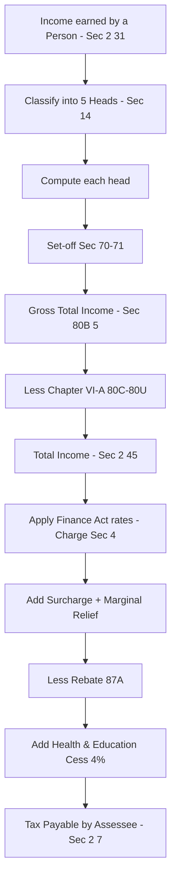

# Q&A — Basic Concepts of Income Tax

> **Scope note:** All rates, surcharge thresholds, rebate limits and slab figures below are illustrated for **AY 2025-26 (PY 2024-25)** under the Income-tax Act, 1961. **Rates and limits change every Finance Act — always re-verify against the ICAI Study Material / RTP applicable to your attempt before the exam.** Section numbers are stable; numbers are not.

---

## Section A — Concept-Check (short questions + answers)

**A1. Define "person" and list the seven categories under section 2(31).**
**Ans.** Under **Sec 2(31)**, "person" includes: (i) an Individual, (ii) a Hindu Undivided Family (HUF), (iii) a Company, (iv) a Firm, (v) an Association of Persons (AOP) or Body of Individuals (BOI), (vi) a Local Authority, and (vii) every Artificial Juridical Person not falling in the above. Explanation: an entity need not be formed for profit to be a "person" (e.g., a club or deity). This matters because tax is charged *on a person* — no person, no charge.

**A2. Distinguish "assessee" [Sec 2(7)] from "person".**
**Ans.** Every assessee is a person, but not every person is an assessee. **Sec 2(7)** "assessee" = a person by whom any tax **or any other sum** (interest/penalty) is payable, OR against whom any proceeding has been taken, OR a *deemed assessee* (e.g., legal representative u/s 159), OR an *assessee-in-default* (e.g., failure to deduct/pay TDS). So "assessee" is a person *connected to a proceeding or liability*.

**A3. Why does income tax use two years — Previous Year and Assessment Year?**
**Ans.** **Sec 3** defines Previous Year (PY) = the financial year in which income is *earned*. **Sec 2(9)** defines Assessment Year (AY) = the financial year immediately following the PY, in which income is *assessed and taxed*. Income can only be measured *after* the year ends (you cannot total a year's income mid-year), so a following year is needed to file, assess and pay. Both are always 1 April–31 March.

**A4. State the charging section and its four ingredients.**
**Ans.** **Sec 4** is the charging section: (1) tax is charged for *every assessment year* (2) at rates fixed by the *annual Finance Act* (3) on the *total income* (4) of *every person*. Without Sec 4 the Act has no operative force — it is the section that actually imposes the tax.

**A5. Differentiate Gross Total Income (GTI) from Total Income (TI).**
**Ans.** **GTI** [Sec 80B(5)] = aggregate of income computed under the five heads (Sec 14) *after* inter-head/intra-head set-off but *before* Chapter VI-A deductions. **TI** [Sec 2(45)] = GTI **minus** deductions under Chapter VI-A (Sec 80C to 80U). Tax is levied on TI, not GTI.

**A6. Name the five heads of income (Sec 14) and explain why five.**
**Ans.** Sec 14: (A) Salaries, (B) Income from House Property, (C) Profits & Gains of Business or Profession, (D) Capital Gains, (E) Income from Other Sources. Five heads exist because each income *type* has a different economic character and therefore needs its own computation rules (e.g., standard deduction for salary, 30% flat deduction for house property, indexation for capital gains). The residuary head (E) ensures *no income escapes* charge.

**A7. What is a "casual" appearance of the AY-before-PY rule? Give one exception.**
**Ans.** Normally income of PY is taxed in the *next* AY. **Exceptions** (Sec 172, 174, 174A, 175, 176) tax income *in the PY itself* — e.g., shipping business of non-residents (Sec 172), persons likely to leave India (Sec 174), or a discontinued business (Sec 176) — to protect revenue collection.

**A8. What is "marginal relief"?**
**Ans.** Where income marginally crosses a surcharge threshold, marginal relief caps the surcharge so that the *extra tax + surcharge* does not exceed the *income earned above the threshold*. It prevents a small rise in income from causing a disproportionately large jump in tax.

**A9. Under the default regime, which section governs the new tax regime for individuals/HUF?**
**Ans.** **Sec 115BAC**. From AY 2024-25 the new regime is the **default**; the assessee may *opt out* to the old regime. Salaried persons without business income can switch each year; those with business/professional income can revert to old regime only *once*.

---

## Section B — Graded Computational Problems (easy → exam-hard)

### B1 (Easy) — GTI to Total Income
Mr. A (age 40, resident) for PY 2024-25: Salary income ₹6,00,000; House property income ₹1,20,000; Interest on savings ₹15,000. Chapter VI-A: 80C ₹1,00,000; 80TTA ₹10,000. Compute GTI and TI.

**Solution.**
| Head | ₹ |
|---|---|
| Salaries (Sec 15) | 6,00,000 |
| House Property (Sec 22) | 1,20,000 |
| Other Sources (Sec 56) | 15,000 |
| **GTI (Sec 80B(5))** | **7,35,000** |
| Less: 80C | (1,00,000) |
| Less: 80TTA | (10,000) |
| **Total Income (Sec 2(45))** | **6,25,000** |

*Check:* 7,35,000 − 1,10,000 = 6,25,000. ✔

### B2 (Moderate) — Old regime tax with rebate 87A
Using B1's **TI = ₹6,25,000** (old regime, individual < 60). Compute tax.

**Solution.** Old-regime slabs (resident individual < 60): nil up to 2,50,000; 5% on 2,50,001–5,00,000; 20% on 5,00,001–10,00,000.
- 5% × (5,00,000 − 2,50,000) = 5% × 2,50,000 = **12,500**
- 20% × (6,25,000 − 5,00,000) = 20% × 1,25,000 = **25,000**
- Tax before rebate = 12,500 + 25,000 = **37,500**
- Rebate u/s 87A: available only if TI ≤ ₹5,00,000 (old regime). TI = 6,25,000 > 5,00,000 → **no rebate**.
- Add Health & Education Cess (HEC) @ 4% = 4% × 37,500 = **1,500**
- **Total tax = ₹39,000.** ✔

### B3 (Exam-level) — New regime 115BAC vs Old regime comparison
Ms. R (age 45, resident, salaried, no business income) PY 2024-25: Gross salary ₹12,00,000. She has 80C investments ₹1,50,000 and 80D ₹25,000. Standard deduction ₹50,000 available under **both** regimes for salary. Determine which regime is cheaper.

**Solution — Old Regime.**
| Item | ₹ |
|---|---|
| Gross salary | 12,00,000 |
| Less: Std deduction (Sec 16(ia)) | (50,000) |
| Salary income = GTI | 11,50,000 |
| Less: 80C | (1,50,000) |
| Less: 80D | (25,000) |
| **Total Income** | **9,75,000** |

Old-regime tax: 12,500 (up to 5L) + 20% × (9,75,000 − 5,00,000) = 12,500 + 20% × 4,75,000 = 12,500 + 95,000 = **1,07,500**. Cess 4% = 4,300. **Total = ₹1,11,800.**

**Solution — New Regime (Sec 115BAC), AY 2025-26 slabs.**
Chapter VI-A (80C/80D) **not allowed**; standard deduction ₹50,000 **is** allowed.
- Total Income = 12,00,000 − 50,000 = **11,50,000**.
- Slabs (AY 25-26): 0–3L nil; 3–7L @5%; 7–10L @10%; 10–12L @15%; 12–15L @20%; >15L @30%.
- 5% × (7,00,000 − 3,00,000) = 20,000
- 10% × (10,00,000 − 7,00,000) = 30,000
- 15% × (11,50,000 − 10,00,000) = 22,500
- Tax = 20,000 + 30,000 + 22,500 = **72,500**. Cess 4% = 2,900. **Total = ₹75,400.**

**Conclusion:** New regime (₹75,400) is cheaper than old (₹1,11,800) by **₹36,400**. *Even though old regime allows ₹1,75,000 of deductions, the lower/ wider new-regime slabs win here.* ✔

### B4 (Exam-hard) — Surcharge + Marginal Relief
Mr. K (individual, old regime) has **Total Income = ₹51,00,000** for PY 2024-25. Compute tax including surcharge and marginal relief. (Surcharge @10% applies where TI > ₹50,00,000.)

**Solution.**
Step 1 — Tax on ₹51,00,000 (old slabs): 12,500 + 1,00,000 (20% of 5L) + 30% × (51,00,000 − 10,00,000).
- 30% × 41,00,000 = 12,30,000
- Tax before surcharge = 12,500 + 1,00,000 + 12,30,000 = **13,42,500**.
Step 2 — Surcharge @10% = 1,34,250. Tax + SC = **14,76,750**.

Step 3 — **Marginal relief** check. Tax on ₹50,00,000 (threshold) = 12,500 + 1,00,000 + 30% × 40,00,000 = 12,500 + 1,00,000 + 12,00,000 = **13,12,500** (no surcharge at exactly 50L).
- Income above threshold = 51,00,000 − 50,00,000 = **1,00,000**.
- Tax+SC at 51L (14,76,750) exceeds [tax at 50L + excess income] = 13,12,500 + 1,00,000 = 14,12,500 by **64,250**.
- Marginal relief = **₹64,250**. Surcharge is reduced from 1,34,250 to (1,34,250 − 64,250) = **70,000**.
Step 4 — Tax + reduced SC = 13,42,500 + 70,000 = **14,12,500**. Add HEC 4% = 56,500.
- **Total tax = ₹14,69,000.** ✔

*Logic check:* after marginal relief, total tax before cess (14,12,500) − tax at 50L (13,12,500) = 1,00,000 = exactly the extra income. Marginal relief worked. ✔

---

## Section C — Past-Paper-Style Full Questions

### C1. "Explain the concept of Previous Year and Assessment Year with the rationale for the two-year system. Also state the exceptions where income of a PY is taxed in the PY itself." (6 marks)

**Model Answer.**
As per **Sec 3**, "Previous Year" is the financial year in which income is *earned/accrued/received*; the first PY of a newly set-up business begins on the date of set-up and ends on the following 31 March. As per **Sec 2(9)**, "Assessment Year" is the financial year immediately following the PY, running 1 April to 31 March, in which the income of the PY is *charged to tax* (Sec 4).

**Rationale:** income of a year can be aggregated, quantified and assessed only *after* the year has ended. A separate following year is therefore necessary for return filing, verification and assessment. This gives certainty and prevents part-year estimation.

**Exceptions (PY taxed in PY itself)** to protect revenue where the assessee/income may not be traceable in the next AY:
- **Sec 172** — shipping business of non-residents;
- **Sec 174** — persons likely to leave India permanently/for long;
- **Sec 174A** — AOP/BOI/AJP formed for a particular event likely to dissolve;
- **Sec 175** — persons likely to transfer property to avoid tax;
- **Sec 176** — discontinued business/profession.

### C2. "Discuss the scheme of charge of income tax under section 4 and how total income is arrived at from the five heads." (5 marks)

**Model Answer.**
**Sec 4** is the charging section. Its scheme: income tax *shall be charged* for every assessment year, at the rate(s) prescribed by the **annual Finance Act**, in respect of the **total income** of the previous year of **every person**. Where the Act so provides, tax is also deducted at source or paid in advance.

Route from raw income to total income:
1. Classify each income into one of the **five heads (Sec 14)** — Salaries, House Property, PGBP, Capital Gains, Other Sources.
2. Compute income under each head per its own provisions.
3. Apply **intra-head and inter-head set-off** (Sec 70–71).
4. Aggregate → **Gross Total Income** [Sec 80B(5)].
5. Deduct **Chapter VI-A** (Sec 80C–80U) → **Total Income** [Sec 2(45)].
6. Apply Finance Act rates + surcharge (with marginal relief) + rebate (Sec 87A) + HEC 4% → tax payable.

### C3. "State whether the following are 'persons' u/s 2(31): (a) a partnership firm, (b) a minor child, (c) Delhi Municipal Corporation, (d) an idol/deity in a temple." (4 marks)

**Model Answer.**
(a) **Firm** — yes, expressly listed [Sec 2(31)(iv)]. (b) **Minor child** — yes, an *individual*; but minor's income is generally clubbed with a parent u/s 64(1A). (c) **Delhi Municipal Corporation** — yes, a *local authority* [Sec 2(31)(vi)]. (d) **Idol/deity** — yes, an *artificial juridical person* [Sec 2(31)(vii)] (settled by judicial precedent). All four are "persons."

---

## Section D — MCQs / Case Scenarios

**D1.** Total Income is defined in which section?
(a) 2(24) (b) 2(45) (c) 2(31) (d) 80B(5)
**Ans: (b).** Sec 2(45) defines "total income"; Sec 80B(5) defines GTI.

**D2.** For AY 2025-26, the *default* tax regime for an individual is:
(a) Old regime (b) New regime u/s 115BAC (c) Optional either (d) 115BAB
**Ans: (b).** From AY 2024-25 the new regime u/s 115BAC is the default; the old regime must be opted for.

**D3.** Rebate u/s 87A under the **old regime** is available where total income does not exceed:
(a) ₹5,00,000 (b) ₹7,00,000 (c) ₹2,50,000 (d) ₹3,00,000
**Ans: (a).** Old regime 87A limit is ₹5,00,000 (rebate up to ₹12,500). *New-regime 87A limit is higher — verify current figure.*

**D4.** "Income" under Sec 2(24) is:
(a) an exhaustive list (b) an inclusive definition (c) only monetary receipts (d) only revenue receipts
**Ans: (b).** Sec 2(24) is *inclusive* ("income includes…"), so the term is wide and open-ended, catching profits, dividends, capital gains, winnings, gifts, etc.

**D5 (Case).** A non-resident earns freight from shipping cargo at an Indian port and the ship is about to leave India. When is this taxed?
(a) Next AY (b) In the PY itself u/s 172 (c) Exempt (d) Only on filing return
**Ans: (b).** Sec 172 charges the shipping income of non-residents in the PY itself, as an exception to the normal PY→AY rule.

**D6 (Case).** Mr. X failed to deduct TDS on a payment. He is best described as:
(a) Deemed assessee (b) Representative assessee (c) Assessee-in-default [Sec 2(7)] (d) Not an assessee
**Ans: (c).** Failure to deduct/pay TDS makes him an *assessee-in-default*, covered within Sec 2(7).

**D7 (Case).** Marginal relief primarily prevents:
(a) double taxation (b) surcharge exceeding the incremental income above the threshold (c) cess (d) slab jump
**Ans: (b).** Marginal relief limits surcharge so incremental tax does not exceed incremental income beyond the surcharge threshold.

---

## Flow Diagram — From Income to Tax Payable

---

## Quick-Revision Sheet — Sections & Limits

| Concept | Section | Key point |
|---|---|---|
| Person | 2(31) | 7 categories; need not be profit-seeking |
| Assessee | 2(7) | Includes deemed / representative / in-default |
| Income | 2(24) | Inclusive (open) definition |
| Previous Year | 3 | Year income earned; FY basis |
| Assessment Year | 2(9) | Following FY; year of assessment |
| Charge of tax | 4 | Every AY, Finance Act rates, on TI, every person |
| Heads of income | 14 | Salaries, HP, PGBP, Cap Gains, Other Sources |
| Gross Total Income | 80B(5) | After set-off, before Chapter VI-A |
| Total Income | 2(45) | GTI − Chapter VI-A |
| Rebate | 87A | Old regime TI ≤ ₹5,00,000 → up to ₹12,500 |
| New regime | 115BAC | Default from AY 2024-25; opt-out to old |
| PY-taxed-in-PY exceptions | 172,174,174A,175,176 | Shipping NR, leaving India, AOP event, transfer to avoid tax, discontinuance |

**Slab quick-recall (AY 2025-26 — VERIFY):**
- *Old regime (individual <60):* Nil ≤2.5L; 5% 2.5–5L; 20% 5–10L; 30% >10L.
- *New regime 115BAC:* Nil ≤3L; 5% 3–7L; 10% 7–10L; 15% 10–12L; 20% 12–15L; 30% >15L. Std deduction ₹50,000 for salary allowed; most Chapter VI-A deductions not allowed.
- *Surcharge (illustrative):* 10% >50L, 15% >1cr, 25% >2cr, 37% >5cr (37% capped at 25% under new regime); **HEC 4%** on tax + surcharge for all.

> **Final reminder:** confirm every rate, slab, surcharge rate and rebate limit against the ICAI material for *your* attempt's AY — the Finance Act revises them annually.
