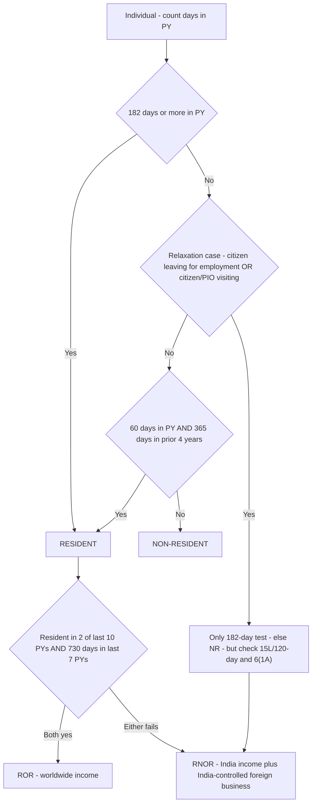

# Q&A — Residential Status & Scope of Total Income

> CA Intermediate · Taxation (Income Tax) · Income-tax Act, 1961 · Currency: Rupees (₹)
> Every question is immediately followed by a complete model answer citing the relevant Section.
> **Rates, thresholds and provisos change with the Assessment Year.** The day-counts (182 / 60 / 365 / 730), the ₹15,00,000 limit and the 120-day figure are used here for method — **verify the exact numbers and the applicable AY against current ICAI study material before your attempt.**

---

## SECTION A — Concept-Check (Short Answer)

**A1. What does residential status decide — the *rate* of tax or the *scope* of income? Which section governs scope?**
**Answer.** It decides the **scope** (which basket of income is taxable), **not the rate**. Two people with identical incomes but different statuses can owe very different tax because one basket includes foreign income and the other does not. Scope is governed by **Section 5**; status itself is determined under **Section 6**. Memory hook: *"Sec 6 = WHO you are; Sec 5 = WHAT is caught."*

**A2. State the two Basic Conditions under Section 6(1) for an individual.**
**Answer.** An individual is **Resident** if he satisfies **at least one**: **(a)** in India for **≥ 182 days** in the previous year (PY); **OR** **(b)** in India for **≥ 60 days** in the PY **AND ≥ 365 days** in the **4 years immediately preceding** the PY. Satisfying neither → **Non-Resident**.

**A3. State the two Additional Conditions under Section 6(6) and what failing them means.**
**Answer.** A resident is **Ordinarily Resident (ROR)** only if he satisfies **both**: **(i)** resident in India in **≥ 2 of the 10** preceding PYs; **AND** **(ii)** in India for **≥ 730 days in the 7** preceding PYs. Failing **either** → **Resident but Not Ordinarily Resident (RNOR)**. These test depth/continuity of connection: *"2/10 and 730/7 = history for ROR."*

**A4. Explain the two relaxations that replace "60 days" with "182 days" [Explanation 1 to Sec 6(1)].**
**Answer.** For **(a)** an **Indian citizen leaving India for employment abroad** (or as a crew member of an Indian ship), and **(b)** an **Indian citizen or Person of Indian Origin (PIO) coming on a visit** to India, condition (b)'s 60-day trigger is inoperative — only the 182-day test can make them resident. Rationale: do not penalise Indians who export their labour or NRIs who visit family.

**A5. Who is a "Person of Indian Origin" (PIO)?**
**Answer.** A person is of Indian origin if **he, or either of his parents, or any of his grandparents, was born in undivided India** (India as it existed before Partition, including present-day Pakistan and Bangladesh territory).

**A6. What is the ₹15 lakh / 120-day rule and Section 6(1A) deemed residence?**
**Answer.** (i) For a **citizen/PIO visiting India** whose **total income other than foreign-source income exceeds ₹15,00,000**, the 60-day limit is relaxed only to **120 days** (not 182). (ii) **Sec 6(1A):** an **Indian citizen** with non-foreign total income **> ₹15,00,000** who is **not liable to tax in any other country** (by domicile/residence) is **deemed resident** regardless of days. Both anti-abuse measures target "stateless" tax residency; such deemed residents / 120-day visitors are classified **RNOR**.

**A7. How is residence of an HUF, firm and company determined? Which of these have an ROR/RNOR split?**
**Answer.** **HUF, firm/AOP [Sec 6(2)]:** resident if **control and management is wholly or partly in India**; NR only if **wholly outside** India. **Company [Sec 6(3)]:** resident if it is an **Indian company (always)** OR its **Place of Effective Management (POEM) is in India**. Only **individuals and HUFs** have the ROR/RNOR split; firms and companies are simply Resident or NR. For an HUF the ROR/RNOR test is applied to the **karta** under Sec 6(6)(b).

**A8. Distinguish "received in India" from "remitted to India."**
**Answer.** *Received* means **first receipt**. Income first received abroad and later **remitted** to India was already received abroad — remittance does **not** create fresh taxability. Only income *first* received (or deemed received u/s 7) in India is "received in India."

**A9. What do Sections 7 and 9 do, and why are they needed?**
**Answer.** **Sec 7** deems certain amounts *received* in India (e.g., excess employer contribution to a recognised provident fund and interest credited beyond notified rate). **Sec 9** deems certain incomes to *accrue or arise* in India (business connection, Indian property, salary for services rendered in India, Govt salary to citizens abroad, dividend from an Indian company, and certain interest/royalty/FTS). They close the loophole of arguing that Indian-source income arose or was received abroad. *"7 & 9 = no escape."*

---

## SECTION B — Graded Computational Problems (Easy → Exam-Hard)

### B1 (Easy) — Basic condition (b) with a recurring pattern
Mr. Arun (ordinary Indian resident, no relaxation applies) stayed in India **65 days** in PY 2025-26. In the 4 preceding years he was present **100 + 90 + 95 + 120 = 405 days**. He has lived in India throughout the last decade. Classify him.

**Answer.**
**Step 1 — Basic [Sec 6(1)]:** (a) 65 ≥ 182? No. (b) 65 ≥ 60? **Yes** AND 405 ≥ 365? **Yes** → condition (b) satisfied → **Resident**.
**Step 2 — Additional [Sec 6(6)]:** resident in ≥ 2 of last 10 PYs — Yes; ≥ 730 days in last 7 — Yes (lived here throughout). Both satisfied → **ROR**.
**Conclusion:** **Resident and Ordinarily Resident.** His **worldwide income** is taxable. The recurring 405-day pattern is the "habit, not a visit" logic.

---

### B2 (Easy-Moderate) — Employment-abroad relaxation
Mr. Bhaskar, an **Indian citizen**, left India for the **first time on 15 September 2025** to take up employment in Singapore, having lived here all his life. Days in India in PY 2025-26 (1 Apr – 15 Sep) = **168 days**. Non-foreign total income ₹8,00,000. Classify and state the scope consequence.

**Answer.**
**Step 1:** He is an Indian citizen **leaving for employment abroad** → Explanation 1(a) relaxation applies → only the **182-day** test operates. 168 ≥ 182? **No.** (₹15L rule irrelevant — his income is ₹8L and the 120-day variant is for *visitors*, not those leaving to work.) → **Non-Resident**.
**Scope [Sec 5]:** As NR, only **India-connected income** is taxable — Indian salary for 1 Apr–15 Sep (services rendered in India, Sec 9(1)(ii)) plus any Indian rent/interest. **Singapore salary from 16 Sep is foreign income → not taxable in India.**
**Knife-edge:** had he stayed **182+ days** before leaving, condition (a) alone would make him resident.

---

### B3 (Moderate) — The 120-day high-income visitor
Mr. Charan, a **PIO** settled in Dubai, visited India in PY 2025-26 and stayed **135 days**. In the 4 preceding years he was in India **400 days** in total. His **total income other than foreign-source income is ₹22,00,000**. He is not covered by Sec 6(1A). Classify.

**Answer.**
**Step 1:** He is a PIO **on a visit**, so normally 60 → 182. But his non-foreign income **> ₹15,00,000**, so the relaxation is only to **120 days** (proviso to Explanation 1). Test: 135 ≥ 182? No. Modified condition: 135 ≥ **120** AND 400 ≥ 365 in prior 4 years? **Yes and Yes** → **Resident**.
**Step 2 [Sec 6(6)]:** A PIO visitor who becomes resident via the 120-day route is treated as **RNOR** (he also fails the history conditions after years abroad).
**Conclusion:** **RNOR.** Taxable: all Indian income + foreign income only from a business controlled from India; passive foreign income (Dubai) is shielded. Had he stayed **119 days**, he would have been **NR**.

---

### B4 (Moderate-Hard) — Section 6(1A) deemed resident
Ms. Divya, an **Indian citizen**, spent only **90 days** in India in PY 2025-26 and the rest travelling; she is **not liable to tax in any country** (arranged to be tax-resident nowhere). Her total income other than foreign-source income is **₹40,00,000** (Indian dividends and Indian consultancy). Classify and state scope.

**Answer.**
**Step 1 — normal test:** 90 ≥ 182? No. She left neither for employment nor is a mere visitor, but her days fail both basic conditions on their own.
**Sec 6(1A):** Indian citizen + non-foreign income **> ₹15,00,000** + **not liable to tax anywhere** → **deemed resident** regardless of days.
**Step 2:** A Sec 6(1A) deemed resident is always classified **RNOR**.
**Scope [Sec 5]:** taxable on all Indian-source income (dividends + consultancy = ₹40,00,000) and on foreign income only if from a business controlled from India; genuine passive foreign income is shielded. The rule ends "stateless" residency without overreaching on real foreign income.

---

### B5 (Exam-Hard) — Returning NRI: ROR / RNOR / NR scope contrast (full computation)
Ms. Chandni, an Indian citizen, lived in the **USA for 20 years** (NR throughout) and returned to India **permanently on 1 April 2025**, present the **entire PY 2025-26 (365 days)**. During PY 2025-26:
1. Consultancy performed in India — **₹18,00,000** (received in India)
2. Rent from her Bengaluru flat — **₹3,00,000** (received in India)
3. Interest on US bank deposits — **₹4,00,000** (accrued and received in USA; passive)
4. Profit from a **software business she controls from India**, operations in USA, income received in USA — **₹6,00,000**
5. Dividend from a US company, received in USA — **₹1,00,000** (passive)

Determine her status and total income taxable in India; contrast with ROR and NR.

**Answer.**
**Step 1 — Basic [Sec 6(1)]:** 365 ≥ 182 → **Resident**.
**Step 2 — Additional [Sec 6(6)]:** (i) resident in ≥ 2 of last 10 PYs? She was **NR in all 10** → **Fails**. Failing one condition → **RNOR**.

**Step 3 — Scope grid [Sec 5]:**

| # | Income | Nature | Taxable for RNOR? | Amount ₹ |
|---|---|---|:---:|---:|
| 1 | Consultancy, services in India, received in India | India-source (Sec 9(1)(ii)) | ✔ | 18,00,000 |
| 2 | Bengaluru rent, received in India | India-source | ✔ | 3,00,000 |
| 3 | US bank interest, accrues + received in USA | Passive foreign | ✘ | — |
| 4 | Business income received in USA but **controlled from India** | Foreign income from India-controlled business | ✔ | 6,00,000 |
| 5 | US dividend, received in USA | Passive foreign | ✘ | — |
| | **Total income taxable in India (RNOR)** | | | **27,00,000** |

**The three-status contrast (same facts):**

| Status | Items taxed | Total income ₹ |
|---|---|---:|
| **ROR** | 1,2,3,4,5 | **32,00,000** |
| **RNOR** | 1,2,4 | **27,00,000** |
| **NR** | 1,2 | **21,00,000** |

**Reconciliation:** Items 3 + 5 (₹5,00,000 passive foreign) escape *only because* she is RNOR — the soft-landing shield. But item 4 (₹6,00,000) is caught even for RNOR because a **business controlled from India** is economically Indian. If NR, item 4 would also fall out (NR is never taxed on foreign income). **One set of facts → ₹11,00,000 spread in the tax base created purely by residential status** — Section 5's core idea made numerical.

---

## SECTION C — Past-Paper-Style Full Questions

### C1. Full determination + scope (individual)
*Mr. Ravi, an Indian citizen, went to Germany on 20 August 2025 for the first time for employment and did not return during PY 2025-26 (days in India = 142). In PY 2025-26 he earned: (i) Indian salary up to departure ₹5,00,000; (ii) German salary (received in Germany) ₹12,00,000; (iii) interest on Indian savings account ₹40,000; (iv) rent from a house in Germany, received there ₹2,00,000. Determine his residential status and total income taxable in India. Cite sections.*

**Answer.**
**Residential status [Sec 6(1)]:** Indian citizen **leaving for employment abroad** → Explanation 1(a): 60 → 182. Days = 142 ≥ 182? **No** → **Non-Resident** for PY 2025-26.
**Scope [Sec 5], NR — only India-connected income:**

| Income | Reason | Taxable? | ₹ |
|---|---|:---:|---:|
| Indian salary ₹5,00,000 | Services rendered in India, Sec 9(1)(ii) | ✔ | 5,00,000 |
| German salary ₹12,00,000 | Services rendered abroad, received abroad → foreign | ✘ | — |
| Indian savings interest ₹40,000 | Accrues in India | ✔ | 40,000 |
| German house rent ₹2,00,000 | Foreign income | ✘ | — |
| **Total taxable in India** | | | **₹5,40,000** |

**Conclusion:** Total income taxable in India = **₹5,40,000**. His German salary and rent escape because an NR is taxed only on India-source income.

---

### C2. HUF residence and the karta test
*The Sharma HUF's business is managed partly from Mumbai and partly from Dubai during PY 2025-26. The karta, Mr. Sharma, has been resident in India in 7 of the last 10 years and was in India for 900 days in the last 7 years. Determine the residential status of the HUF. Cite sections.*

**Answer.**
**Step 1 — HUF residence [Sec 6(2)]:** control and management is **partly in India** (Mumbai) → an HUF is resident if control is **wholly or partly in India** → **Resident**.
**Step 2 — ROR/RNOR [Sec 6(6)(b)]:** test the **karta** on the individual additional conditions — resident in ≥ 2 of 10 years (7 ✓) and ≥ 730 days in last 7 years (900 ✓). **Both satisfied** → **HUF is Resident and Ordinarily Resident.**
**Note:** the bar to be resident is low (partial Indian control suffices); the bar to escape is high (control must be *wholly outside* India). The karta stands in for the family's depth of connection.

---

### C3. Company residence and POEM
*BetaTech Inc. is incorporated in Singapore. During PY 2025-26 all its board meetings, and the key management and commercial decisions for the business as a whole, are in substance taken from its Bengaluru office. AlphaSoft Ltd is incorporated in India but its entire operations and management are in the UK. Determine the residential status of each company. Cite sections.*

**Answer.**
**AlphaSoft Ltd [Sec 6(3)(a)]:** an **Indian company** (incorporated in India) is **always resident**, regardless of where it is managed → **Resident**.
**BetaTech Inc. [Sec 6(3)(b)]:** a foreign company is resident if its **Place of Effective Management (POEM)** — where key management and commercial decisions are *in substance* made — is in India. Its decisions are made from Bengaluru → **POEM in India → Resident**.
**Principle:** *"Indian company = always resident; foreign company = resident only if the real brain (POEM) sits in India."* POEM is a substance-over-form anti-avoidance test; companies have **no** ROR/RNOR split.

---

### C4. Deeming under Section 9 for a non-resident
*Mr. Lee, a resident of Korea and an NR for Indian tax, receives in PY 2025-26: (i) salary from the Government of India for services rendered in Korea ₹6,00,000 (he is an Indian citizen); (ii) dividend from an Indian company ₹1,00,000 received in Korea; (iii) fee for technical services rendered to and paid by a Korean company for its Korean business ₹3,00,000; (iv) royalty from an Indian resident for a patent used in India ₹2,00,000. State what is taxable in India. Cite sections.*

**Answer.**

| Income | Deeming provision | Taxable in India? | ₹ |
|---|---|:---:|---:|
| Govt salary to Indian citizen for service abroad | **Sec 9(1)(iii)** — deemed to arise in India | ✔ | 6,00,000 |
| Dividend from Indian company (received abroad) | **Sec 9(1)(iv)** — payer is Indian | ✔ | 1,00,000 |
| FTS paid by a Korean company for its Korean business | Not covered by Sec 9(1)(vii) — used abroad | ✘ | — |
| Royalty from Indian resident for patent used in India | **Sec 9(1)(vi)** — IP used in India | ✔ | 2,00,000 |
| **Total taxable in India** | | | **₹9,00,000** |

**Point:** even a non-resident is taxed on Indian-*source* income. Note item (i): Government salary to a citizen for services abroad is deemed Indian-source — a classic trap. The Korean-business FTS has no Indian nexus and escapes.

---

## Quick-Reference Decision Flow

---

## SECTION D — MCQs & Case Scenarios

**D1.** Residential status determines the ___ of tax.
(a) rate (b) **scope** (c) rebate (d) surcharge
**Answer: (b)** — Sec 5 fixes which income basket is taxable, not the rate.

**D2.** An Indian citizen leaving India for employment abroad is tested using —
(a) 60-day condition (b) **only the 182-day condition** (c) 120-day condition (d) POEM
**Answer: (b)** — Explanation 1(a) to Sec 6(1) makes the 60-day trigger inoperative.

**D3.** Which is **NOT** an additional condition under Sec 6(6)?
(a) Resident in ≥ 2 of last 10 PYs (b) ≥ 730 days in last 7 PYs (c) **≥ 182 days in current PY** (d) both (a) and (b) must be met for ROR
**Answer: (c)** — 182 days is a *basic* condition [Sec 6(1)], not an additional one.

**D4.** An Indian company is —
(a) resident only if POEM in India (b) **always resident** (c) NR if managed abroad (d) RNOR if managed abroad
**Answer: (b)** — Sec 6(3)(a): incorporation in India makes it resident regardless of management.

**D5.** Foreign income already received abroad and later remitted to India is —
(a) taxable on remittance for all (b) **not taxable merely on remittance** (c) taxable only for NR (d) deemed received in India
**Answer: (b)** — Remittance is not "first receipt"; only NR/RNOR foreign income stays outside scope.

**D6.** RNOR is taxed on foreign income if it is —
(a) any foreign income (b) **from a business controlled from / profession set up in India** (c) foreign dividend (d) foreign salary
**Answer: (b)** — Sec 5(1) proviso; passive foreign income is shielded for RNOR.

**D7.** The ROR/RNOR distinction exists for —
(a) all persons (b) companies only (c) **individuals and HUFs only** (d) firms only
**Answer: (c)** — Firms/AOP/companies are simply Resident or NR.

**D8.** Salary paid by the Government of India to an Indian citizen for services rendered abroad is —
(a) exempt for all (b) taxable only for ROR (c) **deemed to accrue in India [Sec 9(1)(iii)]** (d) foreign income
**Answer: (c)** — Indian source; taxable even for an NR.

**D9 (Case).** *Mr. Y, an Indian citizen, is not liable to tax in any country and has non-foreign income of ₹18,00,000; he was in India only 50 days this year.* His status is —
(a) NR (b) ROR (c) **RNOR (deemed resident u/s 6(1A))** (d) not chargeable
**Answer: (c)** — Sec 6(1A) deems him resident; such deemed residents are RNOR.

**D10 (Case).** *A PIO visits India for 130 days; his non-foreign total income is ₹10,00,000 (< ₹15L); he was in India 380 days in the prior 4 years.* His status (assume no ROR history) is —
(a) **NR** (b) RNOR (c) ROR (d) deemed resident
**Answer: (a)** — Income ≤ ₹15L, so the ordinary visitor relaxation (60 → 182) applies; 130 < 182 and the 120-day rule does not bite → NR.

**D11 (Case).** *Ms. Z was in India 190 days this PY, was resident in 6 of the last 10 PYs, but in India only 500 days in the last 7 PYs.* Her status is —
(a) NR (b) ROR (c) **RNOR** (d) deemed resident
**Answer: (c)** — Basic condition (a) met (Resident), but additional condition (ii) fails (500 < 730) → RNOR.

---

## One-Line Quick-Revision Recap
- **Sec 6 = WHO** (status), **Sec 5 = WHAT** (scope), **Sec 7 & 9 = no escape** (deeming).
- **Basic [6(1)]:** 182 days, OR 60 + 365. **Additional [6(6)]:** 2/10 **and** 730/7 for ROR.
- **Relaxations:** citizen leaving for employment / citizen-PIO visiting → 60 becomes **182** (or **120** if non-foreign income > ₹15L). **Sec 6(1A):** stateless Indian citizen with >₹15L non-foreign income → deemed resident → **RNOR**.
- **Non-individuals:** HUF/firm by **control & management**; company by **Indian incorporation OR POEM**. ROR/RNOR split only for **individuals & HUFs**.
- **Scope:** everyone pays on India-connected income; **RNOR** adds India-controlled foreign business; **ROR** adds all foreign income.
- **Verify** ₹15,00,000, 120-day, day-count convention and every limit against **current ICAI material for your AY**.
