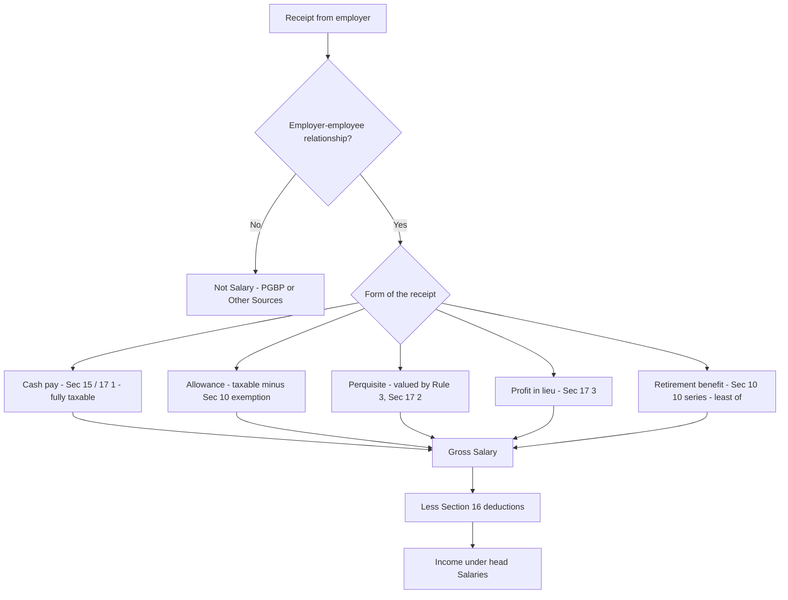

# Q&A — Income under the Head Salaries

> **Rates/limits caveat.** Every monetary cap below (standard deduction, HRA %, gratuity ceiling, car values, PF caps, notified PF interest rate) is tuned by Parliament and depends on the **applicable Assessment Year**. The *method and section logic* are durable; **verify every figure against current ICAI Study Material for your AY.** All computations assume the **old regime** unless stated, because most salary exemptions are withdrawn under the new regime (Sec 115BAC).

---

## Section A — Concept Checks (with answers)

**A1. On what basis is salary charged to tax, and under which section?**
Salary is charged under **Section 15** on the **earlier of "due" or "receipt"**, and each rupee is taxed **only once** (proviso to Sec 15 prevents double taxation of an arrear already taxed on due basis). This anti-timing-arbitrage rule blocks both *deferral* (taxed when due even if received later) and *advance* games (advance salary taxed on receipt).

**A2. Distinguish "advance salary" from "advance against salary (loan)."**
**Advance salary** is salary paid before it is due — taxable **on receipt** under Sec 15. An **advance against salary** is a **loan** later adjusted from pay — **not** salary due, hence **not** taxed on receipt (only the perquisite value of any interest concession, if applicable, is taxed). Classic examiner distinction.

**A3. Why is the employer–employee relationship the trigger for this head?**
Because the same rupee falls under different heads depending on the relationship. A director's **sitting fee** (no master–servant control) is **Other Sources**; a whole-time director's pay is **Salary**; a **partner's remuneration** is **business income** (Sec 28) — a person cannot employ himself. The **control-and-supervision** test sorts receipts into the right head.

**A4. What is the taxability of the three limbs of DA and of "salary" for different provisions?**
"Salary" is **not one number**. For **HRA (Rule 2A)** and **gratuity/PF**, salary = **Basic + DA (only if it enters retirement benefits) + commission as a fixed % of turnover**. If DA does **not** enter retirement benefits, exclude it. Always read the phrase in the problem.

**A5. Is foregone or surrendered salary taxable?**
**Yes** — salary once *due* cannot escape tax by being surrendered/foregone. The **only** exception: salary surrendered to the **Central Government** under the Voluntary Surrender of Salaries Act.

**A6. Uncommuted vs commuted pension — treatment under Sec 10(10A)?**
**Uncommuted (monthly) pension is fully taxable** as salary. **Commuted (lump-sum) pension** is exempt: **fully** for government employees; for others **1/3** of full value if gratuity is also received, **1/2** if not.

**A7. Is an employee's own PF contribution deductible from salary?**
**No.** It is a **Section 80C** deduction claimed from Gross Total Income — never from the salary head. Only the **employer's excess** contribution to RPF (over 12% of salary) is *added* to salary.

**A8. Which Section 16 deductions exist, and which is government-only?**
**16(ia)** standard deduction (flat, universal), **16(ii)** entertainment allowance (**government employees only** — least of 1/5 of basic, statutory cap, actual), **16(iii)** professional tax actually paid.

---

## Section B — Graded Computational Problems (full step-by-step; figures self-reconcile)

### B1 (Easy) — HRA, no rent paid
**Facts.** Basic ₹30,000/month, HRA received ₹12,000/month, employee **pays no rent** (stays in own house). Compute taxable HRA.

**Solution.** Sec 10(13A) exemption = least of three; **limb 2 = Rent − 10% salary = 0 − ... = negative → nil**. Since one limb is nil, exemption = **₹0**. **Entire HRA = 12,000 × 12 = ₹1,44,000 is taxable.**
*Check:* no rent = no reimbursable cost = no relief. The most common HRA trap.

---

### B2 (Easy) — HRA, metro, rent paid
**Facts.** Chennai (metro). Basic ₹50,000/month, DA ₹10,000/month (enters retirement benefits), HRA ₹20,000/month, rent ₹18,000/month.

**Solution.** Salary = (50,000 + 10,000) × 12 = **₹7,20,000**. HRA received = 2,40,000; Rent = 2,16,000.

| Limb | Computation | ₹ |
|---|---|---|
| Actual HRA | — | 2,40,000 |
| Rent − 10% salary | 2,16,000 − 72,000 | 1,44,000 |
| 50% of salary (metro) | 50% × 7,20,000 | 3,60,000 |

Exempt = least = **₹1,44,000**. **Taxable HRA = 2,40,000 − 1,44,000 = ₹96,000.**

---

### B3 (Medium) — Gratuity, non-Act employee
**Facts.** Non-government employee **not covered** by the Gratuity Act, retires after **24 years 7 months**. Average salary of last 10 months = ₹42,000/month. Gratuity received = ₹7,00,000. Ceiling ₹20,00,000 (verify).

**Solution.** Sec 10(10): non-Act → **ignore part-year → 24 completed years**; formula = ½ × avg salary × completed years.

| Limb | Computation | ₹ |
|---|---|---|
| Actual | — | 7,00,000 |
| Statutory ceiling | — | 20,00,000 |
| ½ × 42,000 × 24 | ½ month avg × years | 5,04,000 |

Exempt = least = **₹5,04,000**. **Taxable gratuity = 7,00,000 − 5,04,000 = ₹1,96,000.**
*Trap check:* had he been **Act-covered**, the 7-month part rounds **up to 25 years** and the formula is **15/26 × last-drawn salary × years** — a different answer. Read which applies.

---

### B4 (Medium) — Recognised PF: employer contribution + interest
**Facts.** Basic ₹60,000/month, DA ₹15,000/month (enters retirement benefits). Employer contributes **14%** of (Basic + DA) to RPF. Interest credited at **11%** = ₹55,000; notified exempt rate **9.5%**.

**Solution.** Salary for PF = (60,000 + 15,000) × 12 = **₹9,00,000**.
Employer contribution = 14% × 9,00,000 = ₹1,26,000. **Exempt only up to 12%** = 12% × 9,00,000 = ₹1,08,000.
**Taxable employer PF = 1,26,000 − 1,08,000 = ₹18,000.**
Taxable interest = 55,000 × (11 − 9.5)/11 = 55,000 × 1.5/11 = **₹7,500.**
**Total taxable from RPF = 18,000 + 7,500 = ₹25,500** (added to gross salary). Employee's own contribution → **80C**, not here.

---

### B5 (Hard) — Full salary computation with perquisites, allowances, RPF
**Facts (old regime; verify all caps for your AY).** Mr X, employed in **Delhi (metro)** by ABC Ltd:
- Basic ₹70,000/month; DA ₹20,000/month (**100% enters retirement benefits**); Bonus ₹1,00,000.
- HRA ₹25,000/month; rent paid ₹24,000/month.
- Children education allowance ₹800/month for 2 children (exempt ₹100/child/month).
- **1.8-litre company car** with driver, official + personal use, employer bears all costs. Assume Rule 3 value ₹2,400 + ₹900 driver = ₹3,300/month (verify).
- Employer RPF contribution **13%** of (Basic + DA); employee contributes equal.
- Professional tax paid ₹2,500. Standard deduction assume ₹50,000 (verify AY/regime).

**Step 1 — Cash.** Basic = 8,40,000; DA = 2,40,000; Bonus = 1,00,000.

**Step 2 — HRA (Sec 10(13A)).** Salary = Basic + DA(in retirement) = 8,40,000 + 2,40,000 = **₹10,80,000**. HRA received = 3,00,000; Rent = 2,88,000.

| Limb | Computation | ₹ |
|---|---|---|
| Actual HRA | — | 3,00,000 |
| Rent − 10% salary | 2,88,000 − 1,08,000 | 1,80,000 |
| 50% of salary (metro) | 50% × 10,80,000 | 5,40,000 |

Exempt = **1,80,000**. **Taxable HRA = 3,00,000 − 1,80,000 = ₹1,20,000.**

**Step 3 — CEA (Sec 10(14)).** Received = 800 × 12 = 9,600. Exempt = ₹100 × 2 × 12 = 2,400. **Taxable = ₹7,200.**

**Step 4 — Car perquisite (Rule 3).** 3,300 × 12 = **₹39,600.**

**Step 5 — RPF (Sec 17(1)).** Salary for PF = ₹10,80,000. Employer = 13% × 10,80,000 = 1,40,400; exempt up to 12% = 1,29,600. **Taxable = ₹10,800.**

**Step 6 — Gross Salary.**

| Component | ₹ |
|---|---|
| Basic | 8,40,000 |
| DA | 2,40,000 |
| Bonus | 1,00,000 |
| Taxable HRA | 1,20,000 |
| Taxable CEA | 7,200 |
| Car perquisite | 39,600 |
| Taxable employer RPF | 10,800 |
| **Gross Salary** | **13,57,600** |

**Step 7 — Section 16 deductions.** Standard 16(ia) 50,000 + Prof tax 16(iii) 2,500 = **52,500**. (Entertainment allowance 16(ii) = **Nil**, private employee.)

**Step 8 — Income under head Salaries = 13,57,600 − 52,500 = ₹13,05,100.**
*Reconciliation:* every taxable line exceeds its exemption cap; employee's own PF (₹1,40,400) is excluded here and goes to 80C. Internally consistent.

---

## Section C — Past-Paper-Style Full Questions (model answers)

### C1. Gratuity + commuted pension + leave encashment (retirement bundle)
**Facts.** Mr P, **non-government** employee **covered by the Gratuity Act**, retires after **30 years 8 months**. Last-drawn salary ₹52,000/month (Basic ₹40,000 + DA ₹12,000, DA enters retirement benefits). He receives: Gratuity ₹12,00,000; **commuted pension** ₹4,00,000 being **60% commuted** of full pension (he **also received gratuity**); leave encashment ₹2,00,000 (leave standing 300 days; entitlement 30 days/year; avg salary last 10 months ₹50,000). Ceilings: gratuity ₹20,00,000, leave ₹25,00,000 (verify).

**Gratuity — Sec 10(10), Act-covered.** 8 months > 6 → **31 years**. Formula = 15/26 × last-drawn salary × years = 15/26 × 52,000 × 31 = ₹9,30,000 (15/26 × 52,000 = 30,000; × 31 = 9,30,000).

| Limb | ₹ |
|---|---|
| Actual | 12,00,000 |
| Ceiling | 20,00,000 |
| 15/26 × 52,000 × 31 | 9,30,000 |

Exempt = **9,30,000**. **Taxable gratuity = 12,00,000 − 9,30,000 = ₹2,70,000.**

**Commuted pension — Sec 10(10A).** He received gratuity → exempt = **1/3 of full value**. 60% commuted = ₹4,00,000 → full value = 4,00,000 / 0.60 = ₹6,66,667. Exempt = 1/3 × 6,66,667 = **₹2,22,222.** **Taxable = 4,00,000 − 2,22,222 = ₹1,77,778.**

**Leave encashment — Sec 10(10AA), non-govt.** Salary = ₹50,000. Cash-equiv leave: max 30 days/completed year = 30 × 30 = 900 days entitlement; actual standing 300 days (lower) = 300/30 = 10 months.

| Limb | Computation | ₹ |
|---|---|---|
| Actual | — | 2,00,000 |
| Ceiling | — | 25,00,000 |
| 10 months' avg salary | 10 × 50,000 | 5,00,000 |
| Cash equiv (max 30/yr) | 10 × 50,000 | 5,00,000 |

Exempt = least = **₹2,00,000**. **Taxable leave encashment = ₹0.**

**Taxable retirement receipts = 2,70,000 + 1,77,778 + 0 = ₹4,47,778.**

---

### C2. Perquisites — rent-free accommodation and interest-free loan
**Facts.** Employer-owned **unfurnished** accommodation in a city with population > 40 lakh; salary for RFA purpose ₹9,00,000. Assume Rule 3 valuation 10% of salary (verify current % / population slab). Also an **interest-free loan** of ₹4,00,000 outstanding all year for buying a car; SBI rate assumed 10%; employer charged nil.

**RFA — Sec 17(2)(i)/(ii), Rule 3.** Value = 10% × 9,00,000 = **₹90,000** (less rent recovered = nil).
**Interest-free loan — Rule 3(7)(i).** Value = SBI rate on outstanding − interest charged = 10% × 4,00,000 − 0 = **₹40,000**. (Loans ≤ ₹20,000, or for specified medical treatment, are exempt — not applicable here.)
**Total perquisite = 90,000 + 40,000 = ₹1,30,000** added to gross salary.

---

### C3. Concept question — "Explain the tax treatment of the four types of Provident Fund."
**Model answer.** Sec 17(1) read with the funds' rules:

| Fund | Employer contribution | Interest | Lump sum |
|---|---|---|---|
| **SPF** | Exempt | Exempt | Fully exempt |
| **RPF** | Exempt ≤12% of salary; excess taxable | Exempt ≤ notified rate; excess taxable | Exempt if ≥5 yrs continuous service |
| **URPF** | Not taxed yearly | Not taxed yearly | At retirement: employer share + interest → **profits in lieu (Sec 17(3))**; employee's own interest → **Other Sources**; own contribution → not taxed |
| **PPF** | Self (N/A) | Exempt | Fully exempt |

*Why RPF caps at 12%?* Contributions are **deferred salary**; below the cap the state subsidises retirement saving, above it the fund becomes a tax shelter, so the excess is pulled back into salary. Employee's own RPF contribution qualifies for **80C** — the fund is **EEE** within limits.

---

## Section D — MCQs / Case Scenarios (correct option + one-line reasoning)

**D1.** Salary is chargeable to tax on the basis of —
(a) Receipt only (b) Accrual only (c) **Earlier of due or receipt** (d) Later of due or receipt
**Answer: (c).** Sec 15 — anti-timing-arbitrage; taxed once only.

**D2.** An employee pays no rent but receives HRA. The exempt HRA is —
(a) 50% of salary (b) Actual HRA (c) **Nil** (d) Rent − 10% salary
**Answer: (c).** Sec 10(13A) — limb 2 becomes nil, so least = nil; HRA fully taxable.

**D3.** Entertainment allowance deduction under Sec 16(ii) is available to —
(a) All employees (b) **Government employees only** (c) Private employees only (d) Directors
**Answer: (b).** A historical relic; private staff get no deduction.

**D4.** Uncommuted pension received monthly by a non-government employee is —
(a) Fully exempt (b) 1/3 exempt (c) 1/2 exempt (d) **Fully taxable**
**Answer: (d).** Sec 10(10A) — only *commuted* pension gets the 1/3 or 1/2 exemption.

**D5.** For a non-Act-covered employee, part-year service for gratuity is —
(a) Rounded up if > 6 months (b) **Ignored entirely** (c) Rounded to nearest year (d) Pro-rated
**Answer: (b).** Sec 10(10) — Act-covered round > 6 months up; non-Act ignore the part.

**D6. Case scenario.** Mr Q's employer pays his professional tax of ₹2,400. Treatment?
(a) Ignored (b) Only deducted (c) **Added as perquisite, then deducted u/s 16(iii)** (d) Only added
**Answer: (c).** Employer discharging employee's obligation = perquisite; then 16(iii) allows the deduction. Net is not zero because the added perquisite can inflate other %-based valuations first.

**D7. Case scenario.** ESOP shares: FMV on exercise ₹500, exercise price ₹200, later sold at ₹700. On exercise —
(a) Nothing taxable (b) **₹300 taxed as perquisite; ₹500 becomes cost for capital gains** (c) ₹500 as salary (d) ₹700 as capital gain now
**Answer: (b).** Sec 17(2)(vi) — perquisite = FMV − price paid on exercise; FMV then becomes cost of acquisition for later capital gains (₹700 − ₹500 = ₹200 gain on sale).

**D8.** Under the new regime (Sec 115BAC), which survives?
(a) HRA exemption (b) Most Sec 10(14) allowances (c) Entertainment allowance deduction (d) **Standard deduction u/s 16(ia)**
**Answer: (d).** HRA and most allowances/entertainment deduction are withdrawn; standard deduction is retained (verify AY figure).

---

## Master decision diagram

---

## One-page recall

- **Charge (Sec 15):** earlier of due/receipt, once only.
- **Definition (Sec 17(1)):** inclusive — nothing escapes by relabelling. Memory: WAGP-F-PL.
- **Perquisites (Sec 17(2), Rule 3):** standard-valued so equal benefits bear equal tax. Memory: HALE-CG.
- **Profits in lieu (Sec 17(3)):** compensation is not a tax-free wrapper.
- **Deductions (Sec 16):** standard (ia), entertainment — govt only (ii), professional tax (iii).
- **Exemptions are always "least of":** HRA 10(13A), gratuity 10(10), pension 10(10A), leave 10(10AA).
- **Four things to check first:** regime? DA in retirement? govt or non-govt? specified employee?

> **Final reminder:** the logic is durable; the numbers (standard deduction, HRA %, gratuity/leave ceilings, car values, PF caps, notified interest rate) change frequently — **reconcile every limit against current ICAI Study Material for your AY before the exam.**
