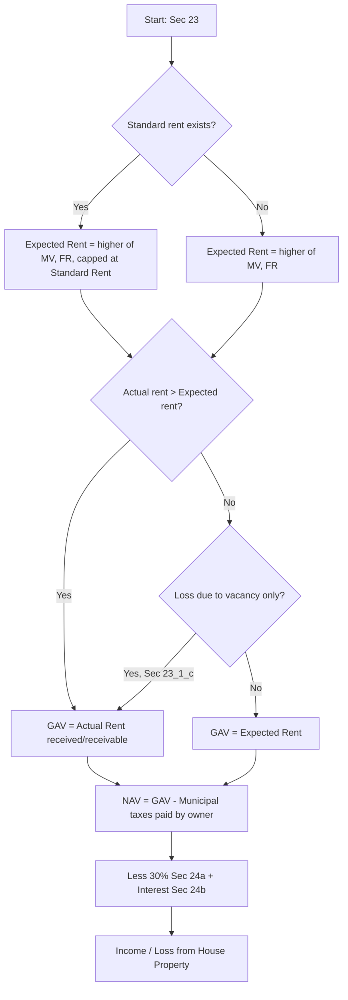

# Q&A — Income from House Property

> **AY note:** All rates and monetary limits below reflect the position generally applicable for recent assessment years (e.g., standard deduction 30%, self-occupied interest cap Rs. 2,00,000, Sec 71 set-off cap Rs. 2,00,000). **Always re-verify the exact caps for your applicable AY against current ICAI study material**, especially the interaction with the default new regime under Sec 115BAC where the SOP interest deduction and house-property loss set-off are restricted.

---

## Section A — Concept Check (with answers)

**A1. What are the three cumulative conditions in Sec 22 for an income to be taxed under "Income from House Property"?**
**Answer:** (i) The property must consist of **buildings or lands appurtenant thereto**; (ii) the assessee must be the **owner** (Sec 27 deemed-owner cases included); (iii) the property must **not be used** by the owner for his own **business or profession** whose profits are taxable. If all three hold, the *annual value* is chargeable — even if no actual rent is received. Vacant land alone (no building) is taxed under "Other Sources," not house property.

**A2. Why is house property taxed on "annual value" (a notional earning capacity) rather than actual rent?**
**Answer:** Sec 22 taxes the **inherent income-earning potential** of the building, not the cash flow. This prevents avoidance by owners who keep property idle or let it to relatives at nominal rent. Hence Sec 23 builds GAV from *expected rent* (municipal value / fair rent / standard rent) and only substitutes actual rent when it is higher.

**A3. Distinguish Gross Annual Value (GAV) and Net Annual Value (NAV).**
**Answer:** **GAV** (Sec 23) is the higher of expected rent and actual rent received/receivable (adjusted for vacancy/unrealised rent). **NAV = GAV − municipal taxes actually paid by the owner during the year.** Deductions under Sec 24 (30% + interest) are applied on NAV, not GAV.

**A4. State the two deductions allowable under Sec 24 and note that no other expense is deductible.**
**Answer:** (a) **Sec 24(a):** flat **30% of NAV** — a standard deduction covering repairs, collection, insurance etc. (allowed even if actual repairs are nil or higher). (b) **Sec 24(b):** **interest on borrowed capital** for acquisition/construction/repair/renewal. Actual repairs, ground rent, and collection charges are **not** separately deductible — the 30% is exhaustive.

**A5. What is "pre-construction interest" and how is it deducted?**
**Answer:** Interest for the period **from the date of borrowing to 31 March preceding the year in which construction/acquisition is completed**. It is aggregated and deducted in **five equal annual instalments** starting from the year of completion, under Sec 24(b), **in addition** to current-year interest — subject to the overall Rs. 2,00,000 cap for a self-occupied property.

**A6. Under Sec 25A, how is unrealised rent later recovered and arrears of rent taxed?**
**Answer:** Amounts received as **arrears of rent or recovered unrealised rent** are taxable in the year of receipt under Sec 25A, **even if the assessee no longer owns** the property. A **30% standard deduction** is allowed on such amount; no other deduction.

**A7. When does Sec 27 deem a person to be "owner" though not the legal titleholder?**
**Answer:** Key deemed owners: (i) transfer to **spouse** (not under agreement to live apart) or to a **minor child** (not married daughter) without adequate consideration; (ii) **holder of an impartible estate**; (iii) **member of a co-operative society/company** to whom a building is allotted; (iv) person in possession under **Sec 53A of Transfer of Property Act** (part performance); (v) lessee under a lease **exceeding 12 years**.

**A8. How is co-owned property (Sec 26) assessed?**
**Answer:** Where shares are **definite and ascertainable**, each co-owner is taxed on **his share** of the income, not as an AOP. For a self-occupied share, each co-owner separately gets the SOP benefit (nil GAV) and his own interest cap.

---

## Section B — Graded Computational Problems (full working)

### B1 (Easy) — Let-out property, single tenant, no complications
Municipal value Rs. 1,20,000; Fair rent Rs. 1,40,000; Actual rent Rs. 15,000 p.m.; Municipal taxes paid Rs. 12,000; Interest on loan Rs. 40,000. Compute income.

**Solution (Sec 23/24):**
| Step | Rs. |
|---|---|
| Municipal value | 1,20,000 |
| Fair rent | 1,40,000 |
| Expected rent = higher of MV, FR (no standard rent) | 1,40,000 |
| Actual rent (15,000 × 12) | 1,80,000 |
| **GAV = higher of expected rent & actual rent** | **1,80,000** |
| Less: Municipal taxes paid | (12,000) |
| **NAV** | **1,68,000** |
| Less: Sec 24(a) 30% of NAV | (50,400) |
| Less: Sec 24(b) interest | (40,000) |
| **Income from house property** | **77,600** |

*Self-verify:* 1,68,000 − 50,400 − 40,000 = 77,600. ✓

### B2 (Moderate) — Standard rent + vacancy
Municipal value Rs. 2,00,000; Fair rent Rs. 2,20,000; Standard rent Rs. 1,90,000; Actual rent Rs. 20,000 p.m.; property vacant for 2 months; municipal taxes Rs. 20,000 paid by owner; interest Rs. 1,50,000.

**Solution:**
- Expected rent = higher of MV (2,00,000) and FR (2,20,000), **capped at standard rent 1,90,000 → 1,90,000.**
- Actual rent received = 20,000 × 10 (vacant 2 months) = **2,00,000.**
- Rent for full year would be 20,000 × 12 = 2,40,000. Because actual rent (2,40,000) *would have* exceeded expected rent but for vacancy, apply Sec 23(1)(c): **GAV = actual rent received = 2,00,000** (vacancy allowance applies since actual-would-exceed-expected).

| | Rs. |
|---|---|
| GAV | 2,00,000 |
| Less: Municipal taxes | (20,000) |
| **NAV** | **1,80,000** |
| Less: 30% of NAV | (54,000) |
| Less: Interest Sec 24(b) | (1,50,000) |
| **Income (Loss)** | **(24,000)** |

*Self-verify:* 1,80,000 − 54,000 − 1,50,000 = −24,000 (loss). ✓ This loss is set off against other heads up to Rs. 2,00,000 (Sec 71).

### B3 (Exam-hard) — SOP + LOP, pre-construction interest, deemed let-out logic
Mr. A owns two houses. **House 1 (self-occupied):** loan taken 1 July 2019 Rs. 20,00,000 @ 10% p.a.; construction completed 31 March 2023; used for own residence from 1 April 2023. **House 2 (let-out):** actual rent Rs. 25,000 p.m., municipal value Rs. 2,80,000, fair rent Rs. 3,00,000, municipal taxes paid Rs. 30,000, current interest Rs. 1,80,000. Compute income for the relevant PY (assume completion enables full-year benefit).

**House 1 — pre-construction interest (Sec 24(b)):**
- Pre-construction period: 1 July 2019 → 31 March 2022 (year *before* completion year 2022-23).
- Interest p.a. = 20,00,000 × 10% = 2,00,000. Period = 1 Jul 2019 to 31 Mar 2022 = 2 years 9 months.
  - 2019-20 (Jul–Mar, 9 mo): 1,50,000; 2020-21: 2,00,000; 2021-22: 2,00,000. Total = **5,50,000.**
- Deduct in 5 equal instalments = 5,50,000 / 5 = **1,10,000 per year.**
- Current-year interest (year of occupation) = 2,00,000.
- Total interest claimed for House 1 = 1,10,000 + 2,00,000 = 3,10,000, **capped at Rs. 2,00,000** (self-occupied).

| House 1 (SOP) | Rs. |
|---|---|
| GAV (self-occupied) | Nil |
| Less: Interest (capped) | (2,00,000) |
| **Income House 1** | **(2,00,000)** |

**House 2 (LOP):**
| | Rs. |
|---|---|
| Expected rent (higher of MV 2,80,000 / FR 3,00,000) | 3,00,000 |
| Actual rent (25,000 × 12) | 3,00,000 |
| GAV (higher) | 3,00,000 |
| Less: Municipal taxes | (30,000) |
| **NAV** | **2,70,000** |
| Less: 30% | (81,000) |
| Less: Interest | (1,80,000) |
| **Income House 2** | **9,000** |

**Aggregate income from house property = (2,00,000) + 9,000 = (1,91,000) loss.**
Set-off against other heads limited to **Rs. 2,00,000** under Sec 71 — full 1,91,000 is within cap, so entire loss set off; nil carried forward.

*Self-verify:* House 2: 2,70,000 − 81,000 − 1,80,000 = 9,000 ✓. Aggregate −2,00,000 + 9,000 = −1,91,000 ✓.

---

## Section C — Past-Paper-Style Full Questions

**C1.** *Mr. Rao owns a house let out at Rs. 18,000 p.m. Municipal value Rs. 2,00,000, fair rent Rs. 2,10,000, standard rent Rs. 1,95,000. He could not realise rent for 2 months (conditions of Rule 4 satisfied). Municipal taxes Rs. 22,000, of which Rs. 8,000 paid by tenant. Interest on loan Rs. 90,000. Compute income. (Cite sections.)*

**Model answer:**
- Expected rent = higher of MV (2,00,000)/FR (2,10,000) restricted to standard rent → **1,95,000** (Sec 23(1)(a)).
- Actual rent receivable = 18,000 × 12 = 2,16,000; **less unrealised rent** (2 months, Rule 4 satisfied) 36,000 = 1,80,000 (Sec 23(1)(b)/(c)).
- GAV = higher of expected rent (1,95,000) and actual rent after unrealised deduction (1,80,000) = **1,95,000.**
- Municipal taxes deductible = **only those paid by owner** = 22,000 − 8,000 = **14,000** (Sec 23).

| | Rs. |
|---|---|
| GAV | 1,95,000 |
| Less: Municipal taxes (owner) | (14,000) |
| **NAV** | **1,81,000** |
| Less: 30% (Sec 24a) | (54,300) |
| Less: Interest (Sec 24b) | (90,000) |
| **Income from house property** | **36,700** |

*Self-verify:* 1,81,000 − 54,300 − 90,000 = 36,700 ✓.

**C2.** *Mrs. Sen transferred a house to her minor son without consideration; the house is let out (net income Rs. 1,20,000). She also received Rs. 60,000 arrears of rent in the year for a property she sold two years ago. Explain the tax treatment.*

**Model answer:**
- **Deemed ownership (Sec 27):** transfer to a minor child without adequate consideration makes Mrs. Sen the deemed owner; the Rs. 1,20,000 is taxable **in her hands** under house property (not clubbed under Sec 64 — Sec 27 overrides).
- **Arrears of rent (Sec 25A):** Rs. 60,000 taxable in the year of receipt though she no longer owns the property; **30% standard deduction** = 18,000; taxable arrears = **42,000.**
- Total house property income = 1,20,000 + 42,000 = **1,62,000.**

---

## Section D — MCQs / Case Scenarios

**D1.** Standard deduction under Sec 24(a) is computed on —
A) GAV  B) NAV  C) Municipal value  D) Actual rent
**Answer: B (NAV).** *30% is always on Net Annual Value, after municipal taxes.*

**D2.** For a self-occupied property with a housing loan taken in FY 2015-16, the maximum interest deduction (loan for acquisition, construction completed within 5 years) is —
A) Rs. 30,000  B) Rs. 1,50,000  C) Rs. 2,00,000  D) No limit
**Answer: C (Rs. 2,00,000).** *Sec 24(b) cap; falls to Rs. 30,000 if completion delayed beyond 5 years or loan for repair.*

**D3.** Municipal taxes are deductible from GAV only if —
A) Due during the year  B) Paid by the owner during the year  C) Paid by tenant  D) Assessed
**Answer: B.** *Deduction on payment basis and only the owner's payment (Sec 23).*

**D4.** A property let out for 8 months and self-occupied for 4 months is treated as —
A) SOP for 4 months  B) Let-out for whole year with proportionate GAV  C) Deemed let-out  D) Exempt
**Answer: B.** *A single house partly let/partly SOP in the same year is treated as let-out; expected rent for full year, actual rent for let period.*

**D5.** Loss under house property can be set off against other heads in the same year up to —
A) Rs. 1,50,000  B) Rs. 2,00,000  C) Unlimited  D) Nil
**Answer: B (Rs. 2,00,000).** *Sec 71 cap; balance carried forward 8 years (set off only vs house property income).*

**D6.** Which is NOT taxable under house property?
A) Rent of building  B) Composite letting inseparable from plant  C) Deemed-owner's let-out flat  D) Arrears of rent
**Answer: B.** *Inseparable composite letting → PGBP/Other Sources, not house property.*

---

## Mermaid — GAV Determination Flow

---

## Quick-Revision Ready-Reckoner
- **Sec 22:** charge on annual value of building + appurtenant land; owner; not used for own business.
- **Sec 23 GAV:** higher of expected rent (MV/FR, ≤ standard rent) and actual rent; vacancy relief Sec 23(1)(c).
- **NAV** = GAV − municipal taxes **paid by owner**.
- **Sec 24(a):** 30% of NAV (flat). **Sec 24(b):** interest; SOP cap **Rs. 2,00,000** (Rs. 30,000 if loan pre-1999-type conditions / delayed completion / repair loan). LOP interest: no cap.
- **Pre-construction interest:** borrowing date → 31 March before completion year; 1/5th for 5 years.
- **Sec 25A:** arrears/unrealised rent recovered taxable on receipt, less 30%.
- **Sec 26:** co-owners with definite shares taxed separately.
- **Sec 27:** deemed owners (spouse/minor transfer, impartible estate, co-op allottee, Sec 53A possession, lease > 12 yrs).
- **Sec 71:** house-property loss set-off vs other heads capped **Rs. 2,00,000**; carry forward 8 yrs (Sec 71B).
- **New regime (Sec 115BAC):** SOP interest not deductible; HP loss not allowed to be set off against other heads — **verify for your AY.**
