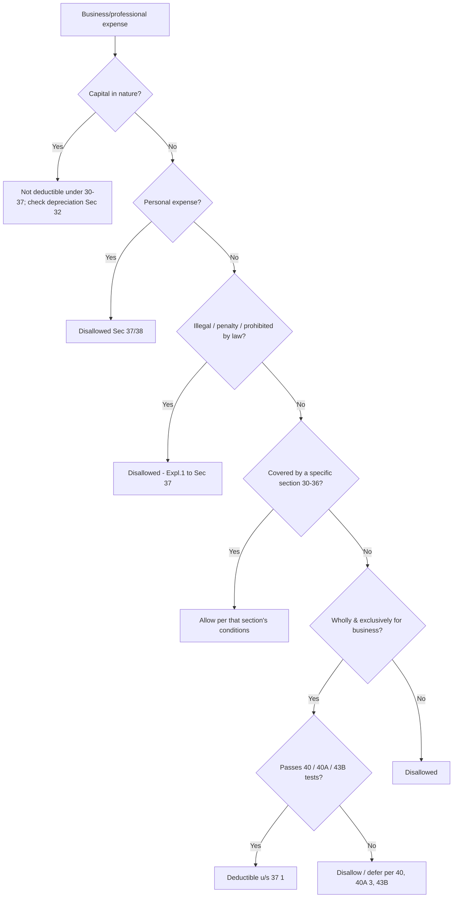

# Q&A — Profits & Gains of Business or Profession (PGBP)

> **Scope note:** This bank tests the ICAI CA Intermediate "Income Tax" chapter on PGBP. All section references are to the **Income-tax Act, 1961**. Numerical limits, depreciation rates, presumptive-scheme thresholds and turnover ceilings **change with the applicable Assessment Year** — figures here reflect commonly examined AY 2024-25 / AY 2025-26 positions. **Always verify current limits against the ICAI Study Material / Finance Act for your attempt.**

---

## SECTION A — Concept Checks (short-answer, with answers)

**A1. What is the charging section for PGBP and what four heads of income does it broadly cover?**
**Ans.** **Sec 28** is the charging section. It brings to tax: (i) profits of any business/profession carried on during the PY; (ii) compensation on termination/modification of agency or management; (iii) income of trade/professional associations from services to members; (iv) export incentives, keyman insurance receipts, non-compete fees, and value of any benefit/perquisite (whether convertible into money or not) arising from business/profession — the last being **Sec 28(iv)**.

**A2. Distinguish Sec 30, 31 and 37(1).**
**Ans.** **Sec 30** — rent, rates, repairs, insurance of *buildings*. **Sec 31** — repairs & insurance of *plant, machinery, furniture*. **Sec 37(1)** — the **residuary/general deduction**: any expense not covered by Sec 30-36, not capital, not personal, laid out **wholly and exclusively** for business, and not an offence/prohibited-by-law expense (Explanation 1), is deductible.

**A3. Why does Sec 37(1) exist if Sec 30-36 already list deductions?**
**Ans.** Sec 30-36 are *specific* allowances; business throws up countless legitimate expenses no statute can list exhaustively. Sec 37(1) is the **safety-net** that catches genuine revenue business expenditure falling outside the enumerated sections, subject to guardrails (capital/personal/illegal exclusions).

**A4. State the "block of assets" concept under Sec 2(11) and why depreciation is computed block-wise.**
**Ans.** A **block** = group of assets of the *same class* (building/machinery/furniture/intangibles) carrying the **same depreciation rate**. Depreciation under **Sec 32** is charged on the **WDV of the block**, not asset-wise. Rationale: eliminates gain/loss computation on every individual asset sale — sale proceeds simply reduce the block's WDV; individual identity is lost once assets pool.

**A5. When is depreciation restricted to 50%?**
**Ans.** Under **Sec 32**, if an asset is **put to use for less than 180 days** in the PY of acquisition, depreciation is **half the normal rate** for that year. Full rate applies from the next year.

**A6. What is "additional depreciation" and its rate?**
**Ans.** **Sec 32(1)(iia)** — a manufacturing/production undertaking (and power generation/distribution) gets **20% additional depreciation** on the actual cost of **new plant & machinery** (not second-hand, not office/vehicles/ships/aircraft). If put to use <180 days, only 10% now and the balance 10% next year.

**A7. Explain Sec 43B in one line and give its core disallowance rule.**
**Ans.** **Sec 43B** — certain expenses (statutory dues: tax, duty, cess, PF/ESI employer contribution, bonus, interest to banks/NBFCs, leave encashment) are deductible **only in the year of actual payment**, regardless of accrual — *unless* paid on or before the **due date of filing the return u/s 139(1)**. A newer clause (**43B(h)**) disallows sums payable to **micro & small enterprises** beyond the MSMED Act time limit until actually paid (no return-filing relaxation).

**A8. Contrast Sec 40A(2) and 40A(3).**
**Ans.** **40A(2)** — expenditure to *related parties* disallowed to the extent it is **excessive/unreasonable**. **40A(3)** — any expenditure paid **otherwise than by account-payee cheque/draft/electronic mode exceeding ₹10,000** (₹35,000 for transport operators) in a day to a single person is **100% disallowed**.

**A9. Which disallowances arise under Sec 40(a)(i)/(ia) and 40(a)(ii)?**
**Ans.** **40(a)(i)/(ia)** — failure to deduct/deposit **TDS**: 100% disallowance for payments to non-residents; **30% disallowance** for specified resident payments (allowed later when TDS is paid). **40(a)(ii)** — **income-tax itself** is not deductible.

**A10. What is presumptive taxation and name the three CA-Inter schemes.**
**Ans.** Presumptive schemes deem a fixed % of turnover as profit, freeing small assessees from books. **Sec 44AD** — eligible business (turnover ≤ ₹2 cr; ₹3 cr if cash receipts ≤5%): 8% of turnover (6% for banking-mode receipts). **Sec 44ADA** — specified professionals (gross receipts ≤ ₹50 lakh; ₹75 lakh if cash ≤5%): 50%. **Sec 44AE** — goods carriage (≤10 vehicles): fixed ₹1,000/ton/month for heavy vehicles, ₹7,500/month otherwise.

**A11. Sec 44AA and 44AB — what do they mandate?**
**Ans.** **44AA** — compulsory **maintenance of books** for specified professions and where business income/turnover crosses prescribed limits. **44AB** — compulsory **tax audit** where turnover > ₹1 cr (business; raised to ₹10 cr if cash ≤5% of receipts and payments) or gross receipts > ₹50 lakh (profession), or where a presumptive assessee declares lower profit than deemed and total income exceeds the basic exemption.

**A12. Why can't an assessee claim depreciation on the same machinery under both Sec 32 and Sec 44AD?**
**Ans.** In **Sec 44AD**, deductions u/s 30-38 (including depreciation u/s 32) are **deemed already allowed**; WDV is notionally reduced. So depreciation is *not* separately claimable — this prevents double-counting.

---

## SECTION B — Graded Computational Problems (full workings)

### B1 (Easy) — Basic net profit adjustment
**Q.** A trader's P&L shows net profit ₹5,00,000 after debiting: (a) income-tax ₹40,000, (b) donation to a charitable trust ₹10,000, (c) depreciation as per books ₹60,000. Depreciation allowable u/s 32 is ₹75,000. Compute PGBP.

**Ans.**
| Particulars | ₹ |
|---|---|
| Net profit as per P&L | 5,00,000 |
| **Add:** Income-tax (not deductible, Sec 40(a)(ii)) | 40,000 |
| **Add:** Donation (not wholly & exclusively for business, Sec 37) | 10,000 |
| **Add:** Depreciation as per books (disallow, add back) | 60,000 |
| **Less:** Depreciation as per Sec 32 | (75,000) |
| **PGBP** | **5,35,000** |

*(Donation may qualify separately for Sec 80G deduction, but not under PGBP.)*

---

### B2 (Easy-Moderate) — Depreciation with 180-day rule
**Q.** Machinery block (rate 15%) opening WDV ₹10,00,000. New machinery bought and put to use on 1 Nov 2024 (i.e., <180 days) for ₹4,00,000. No sales. Compute depreciation for the block for PY 2024-25.

**Ans.**
- Asset used ≥180 days: opening WDV ₹10,00,000 × 15% = **₹1,50,000**
- Asset used <180 days: ₹4,00,000 × 15% × ½ = **₹30,000**
- **Total depreciation = ₹1,80,000**
- Closing WDV = 10,00,000 + 4,00,000 − 1,80,000 = **₹12,20,000**

*Sec 32 second proviso — half depreciation on the ₹4,00,000 addition only.*

---

### B3 (Moderate) — Block with sale + additional depreciation
**Q.** A manufacturer's plant & machinery block (15%) opening WDV ₹20,00,000. During PY 2024-25 he: (i) bought new machinery ₹8,00,000 put to use on 5 May 2024 (≥180 days); (ii) sold old machinery for ₹3,00,000. Compute normal + additional depreciation and closing WDV.

**Ans.**
Step 1 — WDV of block for normal depreciation:
| | ₹ |
|---|---|
| Opening WDV | 20,00,000 |
| Add: new machinery | 8,00,000 |
| Less: sale proceeds | (3,00,000) |
| **WDV for depreciation** | **25,00,000** |

Step 2 — Normal depreciation @15% = 25,00,000 × 15% = **₹3,75,000**
Step 3 — Additional depreciation (Sec 32(1)(iia)) on new machinery ₹8,00,000, used ≥180 days, @20% = **₹1,60,000**
Step 4 — Total depreciation = 3,75,000 + 1,60,000 = **₹5,35,000**
Step 5 — Closing WDV = 25,00,000 − 5,35,000 = **₹19,65,000**

*Additional depreciation is on new P&M only; the block-level 15% is on the whole net WDV.*

---

### B4 (Moderate) — Sec 40A(3) & 43B
**Q.** Net profit ₹8,00,000 after these debits: (a) ₹50,000 cash payment to a supplier in one day (single bill); (b) GST ₹1,20,000 accrued, of which ₹90,000 paid before the return due date, ₹30,000 paid after; (c) employer PF ₹40,000 deposited after the return filing date. Compute PGBP.

**Ans.**
| Particulars | ₹ |
|---|---|
| Net profit | 8,00,000 |
| Add: Cash payment >₹10,000 disallowed (Sec 40A(3)) | 50,000 |
| Add: GST portion unpaid by return due date (Sec 43B) | 30,000 |
| Add: Employer PF paid after due date (Sec 43B) | 40,000 |
| **PGBP** | **9,20,000** |

*The ₹90,000 GST paid on time and the ₹90,000 balance are fine; only the late/unpaid statutory dues are added back. PF paid late u/s 43B is disallowed this year (employer contribution — note employees' contribution is even stricter under Sec 36(1)(va)/43B jurisprudence).*

---

### B5 (Exam-hard) — Full computation from Trial-Balance-style data
**Q.** Mr. X, running a manufacturing business, reports net profit ₹12,00,000. On scrutiny:
1. Debited depreciation (books) ₹2,00,000; depreciation u/s 32 = ₹2,60,000 (includes additional depreciation).
2. Debited ₹60,000 salary paid in cash in a single day.
3. Debited ₹1,00,000 provision for bad debts (not actual write-off).
4. Debited ₹45,000 interest to a bank, unpaid till the return due date.
5. Included in P&L credit: ₹1,50,000 rent from letting a vacant plot (not business asset).
6. Debited ₹80,000 penalty for GST law violation.
7. Debited ₹30,000 preliminary expenditure — only 1/5th allowable u/s 35D.
Compute PGBP.

**Ans.**
| Particulars | ₹ | ₹ |
|---|---|---|
| Net profit as per P&L | | 12,00,000 |
| **Add — inadmissible/adjustments:** | | |
| Depreciation as per books (add back) | 2,00,000 | |
| Cash salary >₹10,000 (Sec 40A(3)) | 60,000 | |
| Provision for bad debts (only actual write-off allowed, Sec 36(1)(vii)) | 1,00,000 | |
| Bank interest unpaid by due date (Sec 43B) | 45,000 | |
| Penalty for law violation (Sec 37(1) Expl.) | 80,000 | |
| Preliminary exp. debited in full | 30,000 | 5,15,000 |
| | | 17,15,000 |
| **Less — allowable/exclusions:** | | |
| Depreciation u/s 32 | 2,60,000 | |
| Rent from vacant plot (taxable under House Property/Other Sources, not PGBP) | 1,50,000 | |
| Preliminary exp. allowed 1/5 u/s 35D (30,000 ÷ 5) | 6,000 | (4,16,000) |
| **PGBP** | | **12,99,000** |

*Self-check: 12,00,000 + 5,15,000 − 4,16,000 = 12,99,000. The ₹1,50,000 plot rent is removed from PGBP because it is not business income; it will be assessed under its proper head. Only ₹6,000 of preliminary expenditure is a genuine PGBP deduction.*

---

### B6 (Exam-hard) — Presumptive 44AD vs normal
**Q.** Ms. Y (retailer, individual) has turnover ₹1,50,00,000 for PY 2024-25, of which ₹1,20,00,000 received through banking channels and ₹30,00,000 in cash. She opts for Sec 44AD. Compute presumptive income. If her actual profit as per books is ₹6,00,000, can she declare that instead?

**Ans.**
Turnover ≤ ₹2 cr → eligible for 44AD.
- On digital receipts ₹1,20,00,000 × **6%** = ₹7,20,000
- On cash receipts ₹30,00,000 × **8%** = ₹2,40,000
- **Presumptive income = ₹9,60,000**

She may declare a *higher* figure, but to declare a **lower** figure (e.g. ₹6,00,000) she must **maintain books u/s 44AA and get audited u/s 44AB**, and can then be denied 44AD for the next 5 AYs (Sec 44AD(4)/(5)). Under 44AD no separate depreciation is allowed — it is deemed given.

---

## SECTION C — Past-Paper-Style Full Questions

### C1. (Explain-type) "Discuss the admissibility of the following under PGBP." (8 marks)
**Q.** State with reasons whether deductible:
(a) Interest on capital borrowed for business ₹2,00,000.
(b) Expenditure on advertisement in a political party's souvenir ₹50,000.
(c) Contribution to a scientific research association ₹1,00,000.
(d) Speed money / illegal gratification ₹20,000.

**Ans.**
(a) **Deductible** u/s **36(1)(iii)** — interest on capital borrowed for business purposes (if for acquiring a capital asset, interest till the asset is first put to use is capitalised — proviso).
(b) **Not deductible under PGBP** — Sec **37(2B)** bars advertisement in a political party's publication; however it may qualify u/s **80GGB/80GGC** as a deduction from GTI.
(c) Deductible u/s **35** — weighted/100% deduction for contributions to approved scientific research associations (verify current weighted-deduction % for the AY; many weighted rates were phased to 100%).
(d) **Not deductible** — Explanation 1 to **Sec 37(1)** disallows any expense that is an offence or prohibited by law; illegal payments are never allowed.

---

### C2. (Computation) Computation of business income of a professional (10 marks)
**Q.** Dr. A, a physician, Receipts & Payments show: professional receipts ₹40,00,000; consumables ₹3,00,000; staff salary ₹6,00,000; clinic rent ₹4,00,000; depreciation on equipment (Sec 32) ₹1,50,000; car expenses ₹2,00,000 (30% personal); interest on loan for clinic ₹1,00,000; income-tax paid ₹2,50,000; life-insurance premium ₹80,000. Compute PGBP. Is 44ADA available?

**Ans.**
| Particulars | ₹ |
|---|---|
| Professional receipts | 40,00,000 |
| Less: Consumables | (3,00,000) |
| Less: Staff salary | (6,00,000) |
| Less: Clinic rent (Sec 30) | (4,00,000) |
| Less: Depreciation (Sec 32) | (1,50,000) |
| Less: Car expenses (70% business only; 30% personal disallowed) | (1,40,000) |
| Less: Interest on clinic loan (Sec 36(1)(iii)) | (1,00,000) |
| **PGBP** | **22,10,000** |

Not deductible: income-tax ₹2,50,000 (Sec 40(a)(ii)); LIC premium ₹80,000 (personal — but eligible u/s 80C from GTI). Car personal portion ₹60,000 disallowed under Sec 38.
**44ADA:** Gross receipts ₹40,00,000 ≤ ₹50,00,000 → **eligible**. Under it, deemed income = 50% × 40,00,000 = ₹20,00,000. Since actual income ₹22,10,000 > presumptive, and she'd need audit to declare lower, opting into 44ADA (₹20,00,000) is actually beneficial here.

---

### C3. (Adjustment statement) Reconcile book profit to PGBP (12 marks)
**Q.** XYZ & Co. net profit ₹15,00,000 after: donation ₹25,000; provision for income-tax ₹3,00,000; depreciation (books) ₹1,80,000 (Sec 32 = ₹2,20,000); ₹60,000 paid in cash to a contractor without TDS (contractor is resident, TDS applicable); ₹1,00,000 partner's salary (within Sec 40(b) limit); ₹40,000 fine for late statutory filing. Compute PGBP.

**Ans.**
| Particulars | ₹ |
|---|---|
| Net profit | 15,00,000 |
| Add: Donation (Sec 37) | 25,000 |
| Add: Provision for income-tax (Sec 40(a)(ii)) | 3,00,000 |
| Add: Book depreciation | 1,80,000 |
| Add: 30% of ₹60,000 for TDS default (Sec 40(a)(ia)) | 18,000 |
| Add: Fine for legal default (Sec 37(1) Expl.) | 40,000 |
| Subtotal | 20,63,000 |
| Less: Depreciation u/s 32 | (2,20,000) |
| **PGBP** | **18,43,000** |

*Partner's salary within Sec 40(b) limits is allowed → no adjustment. The contractor payment: only 30% disallowed (resident payee) under Sec 40(a)(ia), not 100%; the 30% is allowed in the year TDS is deposited.*

---

## SECTION D — MCQs & Case Scenarios

**D1.** The residuary deduction section for business expenditure is:
A) Sec 30  B) Sec 36  C) **Sec 37(1)** ✓  D) Sec 40
*Reasoning: Sec 37(1) allows revenue expense wholly & exclusively for business not otherwise covered.*

**D2.** Depreciation under the Act is computed on:
A) each asset individually  B) **block of assets (Sec 2(11)/Sec 32)** ✓  C) straight-line only  D) at the assessee's option
*Reasoning: Income-tax uses WDV block method.*

**D3.** Cash expenditure of ₹15,000 to one person in a day (not transport) is:
A) fully allowed  B) 30% disallowed  C) **100% disallowed (Sec 40A(3))** ✓  D) allowed if urgent
*Reasoning: Exceeds ₹10,000 non-banking limit → entire sum disallowed.*

**D4.** GST collected but unpaid till the due date of return filing is:
A) always deductible  B) **disallowed u/s 43B until paid** ✓  C) capital expenditure  D) deductible next year automatically
*Reasoning: Sec 43B — statutory dues deductible only on actual payment by 139(1) due date.*

**D5.** For Sec 44AD, presumptive rate on turnover received via banking channels is:
A) 8%  B) 50%  C) **6%** ✓  D) 10%
*Reasoning: 6% on digital/banking receipts; 8% on cash.*

**D6.** Additional depreciation u/s 32(1)(iia) applies to:
A) all assets  B) **new plant & machinery of a manufacturer** ✓  C) second-hand machinery  D) office equipment
*Reasoning: Only new P&M in manufacturing/production (and specified power sector); excludes second-hand, office appliances, vehicles.*

**D7. Case scenario:** A firm pays ₹5,00,000 rent to a partner's wife; fair rent is ₹3,00,000. Consequence?
A) fully allowed  B) fully disallowed  C) **₹2,00,000 excess disallowed (Sec 40A(2))** ✓  D) 30% disallowed
*Reasoning: Payment to related party disallowed to the extent excessive/unreasonable.*

**D8. Case scenario:** A specified professional has gross receipts ₹52,00,000, cash receipts nil. Can he use Sec 44ADA?
A) Yes at 50%  B) **No — exceeds ₹50 lakh (but check ₹75 lakh raised limit where cash ≤5%)** ✓  C) at 8%  D) at 6%
*Reasoning: Base 44ADA ceiling is ₹50 lakh; the enhanced ₹75 lakh applies only if cash receipts ≤5%. Here receipts are cash-free so the ₹75 lakh limit would actually apply — verify the AY's exact wording; classic exam trap on the two thresholds.*

---

## Mermaid — Decision flow: is a business expense deductible?

---

## Quick-Revision Trap List
- **43B(h)** MSME payments — **no** return-due-date relaxation (unlike other 43B dues). Common exam trap.
- **40A(3)** limit is **₹10,000** (₹35,000 transport) — *per person per day*, not per bill.
- **Additional depreciation** — NOT on second-hand machinery, vehicles, office appliances, or by traders.
- **180-day rule** halves depreciation only in the **year of acquisition**.
- **44AD/44ADA lower profit** → triggers **44AA + 44AB** obligations; 44AD lock-in of 5 years.
- Income-tax, wealth-related levies and provisions (not actual write-offs) are **never** deductible.
- Rent/interest income unrelated to business is **removed** from PGBP and taxed under its own head.

*All rates/limits are AY-sensitive — reconfirm with current ICAI Study Material and the latest Finance Act before your exam.*
