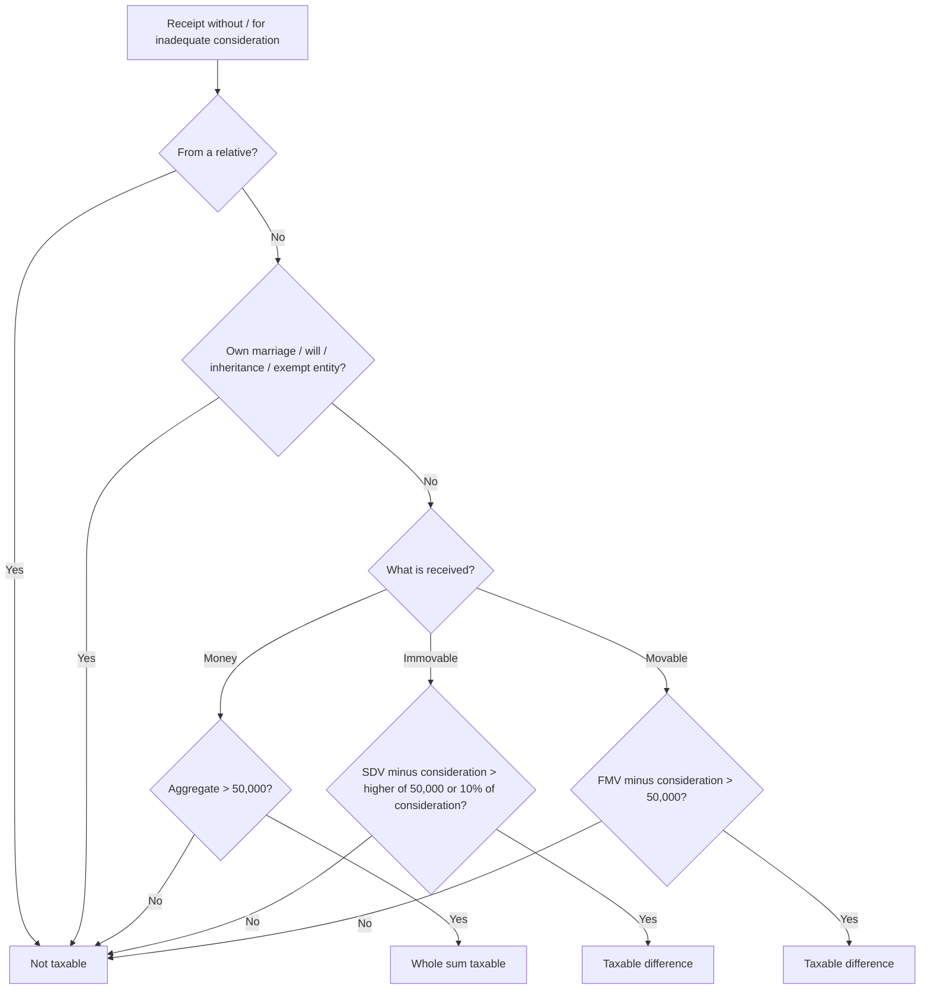

# Q&A — Income from Other Sources

> **AY flag:** Rates, monetary limits and thresholds below are stated as generally applicable for **AY 2025-26** to build working fluency. The **flat 30% on casual income (Sec 115BB)**, the **₹50,000 gift threshold**, the **10% immovable-property tolerance band**, the **₹15,000 family-pension standard deduction** and TDS thresholds can drift with each Finance Act. **Always re-verify the exact figure, %, threshold and applicable AY against the current ICAI Study Material / RTP before your attempt.** All section references are to the **Income-tax Act, 1961**. The *logic* is durable; the numbers move.

---

## Section A — Concept Check (short Q&A with section citation)

**A1. What makes Income from Other Sources a "residual" head, and which section creates the charge?**
**Sec 56(1)** charges income *of every kind* that is (a) not excluded from total income, and (b) not chargeable under the other four heads. IFOS is therefore the **safety net of last resort** — an item lands here only after Salaries, House Property, PGBP and Capital Gains have each been ruled out. This guarantees no income leaks out of the tax base.

**A2. Is the list in Sec 56(2) exhaustive?**
No. Sec 56(2) is **illustrative, not exhaustive** — introduced with "in particular, and without prejudice to the generality of Sec 56(1)." The named items (dividend, interest on securities, winnings, gifts) merely give certainty for common cases; the general residual charge still catches anything unnamed.

**A3. After abolition of DDT, how is dividend taxed and what deduction is allowed?**
Dividend is taxable **in the shareholder's hands at slab rates** under **Sec 56(2)(i)** (classical system, w.e.f. FY 2020-21). Under **Sec 57(i)** only **interest on money borrowed** to earn the dividend is deductible, **capped at 20% of the dividend income**. No collection charges or other expense are allowed against dividend.

**A4. At what rate is casual income taxed, and what may be deducted?**
Winnings from lotteries, crossword puzzles, races, card games, gambling, betting and TV game shows [**Sec 56(2)(ib)**] are taxed at a **flat 30%** (plus surcharge and cess) under **Sec 115BB** — not at slab rates. **No expense, no deduction, no basic-exemption benefit, no Chapter VI-A deduction and no set-off of any loss** is permitted [**Sec 58(4)**].

**A5. When money is gifted, why is the ₹50,000 figure a "threshold" and not an "exemption"?**
Under **Sec 56(2)(x)(a)**, if the **aggregate** sum of money received without consideration in the year **exceeds ₹50,000**, the **whole amount** (not merely the excess) is taxable. Crossing ₹50,000 pulls the entire sum in — it is a cliff, not a step. Aggregation prevents splitting one gift into many small ones.

**A6. How does the taxability test differ between immovable and movable gifted property for inadequate consideration?**
- **Immovable property [56(2)(x)(b)]:** taxable if (SDV − consideration) **exceeds the higher of ₹50,000 or 10% of consideration** — the 10% band absorbs honest valuation gaps.
- **Movable property [56(2)(x)(c)]:** taxable if (FMV − consideration) **exceeds ₹50,000 flat** — there is **no 10% band**.

**A7. Who counts as a "relative" so that a gift is exempt?**
Per the Explanation to **Sec 56(2)(x)**: spouse; brother/sister of the individual; brother/sister of the spouse; brother/sister of either parent; any lineal ascendant or descendant of the individual or of the spouse; and the spouse of all the persons above. A **friend, cousin, or a parent's cousin is NOT a relative**. (A parent's *brother/sister* — your uncle/aunt — **is** a relative.)

**A8. Why is family pension taxed under IFOS and not Salaries, and what deduction applies?**
The employee's own pension is Salary, but on his death there is **no employer-employee relationship with the legal heir**, so the pension received by the heir cannot be salary — it defaults to IFOS. **Sec 57(iia)** grants a standard deduction of **1/3 of the pension or ₹15,000, whichever is LOWER**.

**A9. How is interest on enhanced compensation taxed?**
Under **Sec 56(2)(viii)** read with **Sec 145B**, it is taxable **on receipt** (not accrual — the right is contingent until finally awarded). **Sec 57(iv)** allows a flat **50% deduction**, and no other expense is permitted.

**A10. What is "grossing up" and why is it needed?**
When interest (or winnings) is received *net* of TDS, the taxable **income is the gross amount** — TDS is merely tax already paid on the assessee's behalf. So the TDS is **added back** to reach gross income, and separately claimed as a **prepaid tax credit**. TDS never reduces gross income.

**A11. Is a car gifted by a friend taxable under Sec 56(2)(x)?**
**No.** A motor car is **not** within the *defined list* of movable "property" (shares/securities, jewellery, bullion, archaeological collections, art, drawings, paintings, sculptures). Gifting an unlisted asset like a car falls **outside 56(2)(x)** entirely.

**A12. On what basis is IFOS income computed?**
Under **Sec 145(1)**, on the **cash or mercantile basis regularly employed** by the assessee — provided it is applied consistently. Overridden to **receipt basis** for dividend and for interest on compensation/enhanced compensation [Sec 145B].

---

## Section B — Graded Computational Problems (full working, self-checked)

### B1 (Easy) — Dividend and the 20% interest cap
Mr. P received dividend of **₹1,50,000** from Indian companies. He had borrowed money to buy those shares and paid interest of **₹40,000**. He also paid ₹3,000 as portfolio collection charges. Compute income under IFOS.

**Answer.** Dividend → **Sec 56(2)(i)**, slab rate.
- Interest deductible under **57(i)** is capped at **20% of dividend** = 20% × 1,50,000 = **₹30,000** (though ₹40,000 was paid; the extra ₹10,000 is lost).
- Collection charges of ₹3,000 are **not allowed** against dividend (only interest is deductible).
- **IFOS = 1,50,000 − 30,000 = ₹1,20,000.**
*Check: 20% × 1,50,000 = 30,000; 1,50,000 − 30,000 = 1,20,000.* ✔

### B2 (Easy) — Casual income, no deduction, no set-off
Ms. Q won **₹3,00,000** (gross) in a TV game show. She spent ₹8,000 on travel to the studio and has a business loss of ₹1,00,000. Compute the taxable winnings and tax on them.

**Answer.** Winnings → **Sec 56(2)(ib)**, taxed at **flat 30% under Sec 115BB**.
- Travel ₹8,000 is **disallowed** [Sec 58(4)].
- Business loss **cannot be set off** against winnings.
- Taxable winnings = **₹3,00,000**.
- Tax = 30% × 3,00,000 = **₹90,000** (+ surcharge, if any, and 4% cess).
*Check: 3,00,000 × 0.30 = 90,000; no deduction, no set-off applied.* ✔

### B3 (Moderate) — Family pension + interest, with grossing up
Mrs. R (widow of a former employee) received: family pension **₹2,40,000**; and bank FD interest received **net ₹36,000** after TDS of **₹4,000**. Compute IFOS.

**Answer.**
- **Family pension [57(iia)]:** deduction = lower of (1/3 × 2,40,000 = ₹80,000) or ₹15,000 = **₹15,000**. Net pension = 2,40,000 − 15,000 = **₹2,25,000**.
- **Interest:** gross up = 36,000 + 4,000 = **₹40,000** taxable.
- **IFOS = 2,25,000 + 40,000 = ₹2,65,000.**
- The ₹4,000 TDS is claimed separately as prepaid tax.
*Check: lower of 80,000/15,000 = 15,000; 40,000 gross interest; total 2,65,000.* ✔

### B4 (Moderate-Hard) — Gift computation across all three categories
Mr. S, an individual, received during the previous year:
1. Cash gift ₹45,000 from a friend; ₹20,000 from another friend.
2. A plot of land, SDV ₹4,00,000, gifted free by a friend.
3. A flat purchased from a friend for ₹25,00,000; SDV ₹28,00,000.
4. Shares (FMV ₹90,000) purchased from a friend for ₹50,000.
Compute the amount taxable under IFOS.

**Answer.** Apply **Sec 56(2)(x)**; all donors are friends (non-relatives), so no exemption.

- **Item 1 — money, aggregate:** 45,000 + 20,000 = **₹65,000 > ₹50,000** → **whole ₹65,000 taxable** (threshold, not exemption).
- **Item 2 — immovable, free:** SDV ₹4,00,000 > ₹50,000 → **whole ₹4,00,000 taxable**.
- **Item 3 — immovable, inadequate consideration:** diff = 28,00,000 − 25,00,000 = ₹3,00,000. Higher of ₹50,000 or 10% of 25,00,000 (= ₹2,50,000) → ₹2,50,000. Diff ₹3,00,000 **> ₹2,50,000** → **entire ₹3,00,000 taxable**.
- **Item 4 — movable, inadequate consideration:** diff = 90,000 − 50,000 = ₹40,000. Flat test ₹50,000 (no 10% band). ₹40,000 **≤ ₹50,000** → **not taxable**.

| Item | Taxable |
|---|---|
| 1 money | 65,000 |
| 2 land free | 4,00,000 |
| 3 flat (inadequate) | 3,00,000 |
| 4 shares | Nil |
| **Total IFOS** | **₹7,65,000** |

*Check: 65,000 + 4,00,000 + 3,00,000 = 7,65,000.* ✔

### B5 (Exam-Hard) — Comprehensive IFOS with every item type
Mr. T (individual, no business), for the year:
- Dividend from Indian company ₹80,000; interest on loan to buy those shares ₹25,000.
- FD interest received net ₹45,000 (TDS ₹5,000).
- Won a lottery ₹5,00,000 (gross); TDS ₹1,50,000 deducted; bought tickets worth ₹6,000.
- Family pension ₹3,60,000.
- Let out machinery with building (inseparable letting, not business): rent ₹4,00,000; depreciation ₹60,000; repairs ₹25,000; insurance ₹5,000.
- Interest on enhanced compensation received ₹1,20,000.
- Cash gift ₹51,000 from a cousin.
Compute income under IFOS (segregating the specially-taxed items).

**Answer.**

**Slab-rate IFOS stream:**
- **Dividend [56(2)(i), 57(i)]:** interest capped at 20% × 80,000 = ₹16,000. Net = 80,000 − 16,000 = **₹64,000**.
- **FD interest:** gross up = 45,000 + 5,000 = **₹50,000**.
- **Family pension [57(iia)]:** deduction = lower of (1/3 × 3,60,000 = ₹1,20,000) or ₹15,000 = ₹15,000. Net = 3,60,000 − 15,000 = **₹3,45,000**.
- **Let-out machinery+building [56(2)(iii), 57(ii)/(iii)]:** 4,00,000 − 60,000 − 25,000 − 5,000 = **₹3,10,000**.
- **Interest on enhanced compensation [56(2)(viii), 57(iv), 145B]:** on receipt; 50% deduction. 1,20,000 − 60,000 = **₹60,000**.
- **Gift from cousin:** a **cousin is NOT a relative** → money gift ₹51,000 **> ₹50,000** → **whole ₹51,000 taxable**.

Slab-rate IFOS = 64,000 + 50,000 + 3,45,000 + 3,10,000 + 60,000 + 51,000 = **₹9,80,000**.

**Special-rate stream (kept apart):**
- **Lottery [56(2)(ib), 115BB]:** ₹6,000 ticket cost **disallowed** [58(4)]. Taxable = **₹5,00,000** at **flat 30%** = ₹1,50,000. TDS ₹1,50,000 exactly covers it.

**Total income under IFOS = 9,80,000 + 5,00,000 = ₹14,80,000** (of which ₹5,00,000 is taxed at flat 30%, the remaining ₹9,80,000 at slab rates).
- Prepaid TDS credit = 5,000 + 1,50,000 = ₹1,55,000.

*Check: slab stream 64,000+50,000+3,45,000+3,10,000+60,000+51,000 = 9,80,000; +5,00,000 lottery = 14,80,000; lottery tax 5,00,000×0.30 = 1,50,000 = TDS.* ✔

---

## Section C — Past-Paper-Style Full Questions

### C1. "Discuss taxability of each receipt under Sec 56(2)(x)"
Mr. A, an individual, received: (i) ₹1,00,000 on the occasion of his own marriage from friends; (ii) ₹75,000 cash from his elder brother; (iii) a diamond ring (FMV ₹2,00,000) from his fiancée (not yet married); (iv) ₹60,000 festival gift from his employer; (v) a house (SDV ₹15,00,000) inherited under his late father's will. State the taxability with reasons.

**Model answer.**
| Receipt | Taxable? | Reason (section) |
|---|---|---|
| (i) ₹1,00,000 on own marriage | **Exempt** | Gift on the occasion of the individual's *own* marriage — proviso to 56(2)(x) |
| (ii) ₹75,000 from elder brother | **Exempt** | Brother is a "relative" — Explanation to 56(2)(x) |
| (iii) Ring FMV ₹2,00,000 from fiancée | **Taxable ₹2,00,000** | Fiancée is **not** a relative; movable property (jewellery) free, FMV > ₹50,000 |
| (iv) ₹60,000 from employer | **Not IFOS** | Employer receipt → taxable as **Salary/perquisite**, expressly excluded from 56(2)(x) |
| (v) House by will | **Exempt** | Received under a will / inheritance — proviso to 56(2)(x) |

**Taxable under IFOS = ₹2,00,000** (item iii only). *(Item iv is taxable, but under Salaries.)*

### C2. Interest on securities, grossing up and stock-in-trade boundary
Mr. B holds 10% debentures of a listed company of face value ₹5,00,000, receiving interest **net of TDS**. TDS deducted was ₹5,000. He also holds government securities on which interest of ₹20,000 accrued. He is **not** a securities dealer. Compute IFOS. What changes if the debentures were his business stock-in-trade?

**Model answer.**
- Debenture interest is taxable under **Sec 56(2)(id)** (interest on securities), as he is not a dealer.
- Interest received net of TDS must be **grossed up**: gross debenture interest = net received + TDS. Coupon = 10% × 5,00,000 = ₹50,000 (this is the gross); TDS ₹5,000 is added back to the net to reconcile to ₹50,000.
- Government securities interest = ₹20,000.
- **IFOS = 50,000 + 20,000 = ₹70,000.** TDS ₹5,000 claimed as prepaid tax.
- **If held as stock-in-trade:** the interest becomes **business income under PGBP**, not IFOS — the phrase "not chargeable under PGBP" in 56(2) is the switch. IFOS from securities would then be Nil.

### C3. Composite letting versus house property
Mr. C lets out a factory building **together with** the plant and machinery installed in it under a single inseparable lease at ₹6,00,000 p.a. Repairs ₹40,000, depreciation ₹1,10,000, insurance ₹10,000. It is not a business activity. Where and how is this taxed?

**Model answer.**
- Because the building is let **inseparably along with** plant and machinery and the two lettings cannot be split, it is **not** House Property income; it is taxed under **Sec 56(2)(iii)** as IFOS (a composite letting).
- Deductions under **Sec 57(ii)/(iii)** — current repairs, depreciation and insurance on the let-out assets — are allowed as genuine costs of the letting.
- Income = 6,00,000 − 40,000 − 1,10,000 − 10,000 = **₹4,40,000** under IFOS.
- **Contrast:** had the building been let *alone*, it would be **House Property** (with 30% standard deduction u/s 24), and the machinery let alone (as a business) would be PGBP. The *inseparability* is what forces IFOS.

---

## Section D — MCQs / Case Scenarios

**D1.** Aggregate money gifts (from non-relatives, no occasion) of ₹55,000 in a year are taxable to the extent of:
(a) Nil (b) ₹5,000 (c) ₹50,000 (d) ₹55,000
**Ans: (d).** Sec 56(2)(x)(a) — once ₹50,000 is crossed, the **whole** sum is taxable (threshold, not exemption).

**D2.** Casual income (lottery winnings) is taxed under:
(a) slab rates (b) flat 20% (c) flat 30% (d) 12.5%
**Ans: (c).** Sec 115BB — flat 30%, with no deduction or set-off [Sec 58(4)].

**D3.** Interest deduction against dividend income is capped at:
(a) 10% of dividend (b) 20% of dividend (c) 30% of dividend (d) no cap
**Ans: (b).** Sec 57(i) — anti-erosion cap of 20% of the dividend.

**D4.** For a gift of immovable property for inadequate consideration, the tolerance band is the higher of ₹50,000 or:
(a) 5% of consideration (b) 10% of consideration (c) 15% (d) 20%
**Ans: (b).** Sec 56(2)(x)(b). Movable property has no such band — flat ₹50,000.

**D5.** Standard deduction on family pension under Sec 57(iia) is:
(a) higher of 1/3 or ₹15,000 (b) lower of 1/3 or ₹15,000 (c) flat 30% (d) ₹50,000
**Ans: (b).** Lower of one-third of the pension or ₹15,000.

**D6 (Scenario).** Mr. X received ₹1,00,000 from his father's brother (uncle). Taxable under Sec 56(2)(x)?
(a) Yes, whole amount (b) Yes, excess over ₹50,000 (c) No — uncle is a relative (d) No — below limit
**Ans: (c).** A brother of either parent (uncle/aunt) is a "relative" — exempt regardless of amount.

**D7 (Scenario).** Interest on enhanced compensation of ₹4,00,000 is received during the year. Amount taxable under IFOS:
(a) ₹4,00,000 (b) ₹2,00,000 (c) Nil (d) ₹3,20,000
**Ans: (b).** Sec 56(2)(viii)/57(iv)/145B — taxed on receipt with flat 50% deduction → 4,00,000 − 2,00,000 = ₹2,00,000.

**D8 (Scenario).** A friend gifts Mr. Y a car (FMV ₹6,00,000) free of cost. Taxable under Sec 56(2)(x)?
(a) Yes, ₹6,00,000 (b) Yes, ₹5,50,000 (c) No — car not a listed "property" (d) No — from a friend
**Ans: (c).** A motor car is outside the defined list of movable property; the gift is not chargeable under 56(2)(x).

---

## Decision Map (is a gift taxable under Sec 56(2)(x)?)

---

## Quick-Revision Trigger Sheet

| Item | Section | Key rule (AY 25-26) |
|---|---|---|
| Residual charge | 56(1) | Income not under other 4 heads, not exempt → IFOS |
| Illustrative inclusions | 56(2) | Not exhaustive |
| Dividend | 56(2)(i), 57(i) | Slab rate; interest deduction capped at 20% |
| Interest on securities | 56(2)(id) | Gross up for TDS; PGBP if stock-in-trade |
| Casual income | 56(2)(ib), 115BB, 58(4) | Flat 30%; no deduction, set-off, or basic exemption |
| Money gift | 56(2)(x)(a) | Aggregate > ₹50,000 → whole sum taxable |
| Immovable gift (inadequate) | 56(2)(x)(b) | Diff > higher of ₹50,000 or 10% of consideration |
| Movable gift (inadequate) | 56(2)(x)(c) | Diff > ₹50,000 (flat, no band) |
| Gift exemptions | proviso to 56(2)(x) | Relative; own marriage; will/inheritance; exempt entity |
| "Relative" | Explanation to 56(2)(x) | Spouse; siblings of self/spouse/parents; lineal ascend./descend. & spouses |
| Family pension | 57(iia) | Lower of 1/3 or ₹15,000 |
| Enhanced-compensation interest | 56(2)(viii), 57(iv), 145B | On receipt; flat 50% deduction |
| Composite letting | 56(2)(ii)/(iii), 57(ii) | Rent less repairs, depreciation, insurance |
| General deduction | 57(iii) | Wholly & exclusively to earn the income |
| Disallowances | 58 | Personal exp.; foreign payment w/o TDS; nothing vs casual income |
| Method of accounting | 145, 145B | Regular cash/mercantile; receipt basis for dividend & compensation interest |

**Memory hooks**
- "Last net catches all fish" → IFOS is the residual charge (56(1)).
- "₹50,000 is a cliff, not a step" → cross it on money gifts and the *whole* sum falls in.
- "Immovable gets a 10% cushion; movable gets none."
- "Windfall = 30 flat, zero off" → 30% rate, zero deductions, zero set-off.
- "Pension: take the LOWER; compensation: take HALF; dividend interest: cap at a FIFTH."

**First-principles recap:** IFOS exists because a specific-head system *must* have a residual net, or income leaks out (56(1)). Named items in 56(2) give certainty, **deem** capital-type windfalls (gifts) to be income, and plug avoidance. Deductions (57) follow the universal "cost of earning" rule with special proxies; disallowances (58) mirror anti-abuse. Windfalls are flat-rated because they carry no effort or cost; gifts are slab-taxed in the recipient's hands to stop laundering and slab-shifting, softened only by reasoned carve-outs.

> Re-confirm every ₹ figure, %, threshold, the flat 30% rate and all TDS limits against the **current ICAI Study Material and the Finance Act applicable to your attempt** before the exam. The reasoning is durable; the numbers drift.
