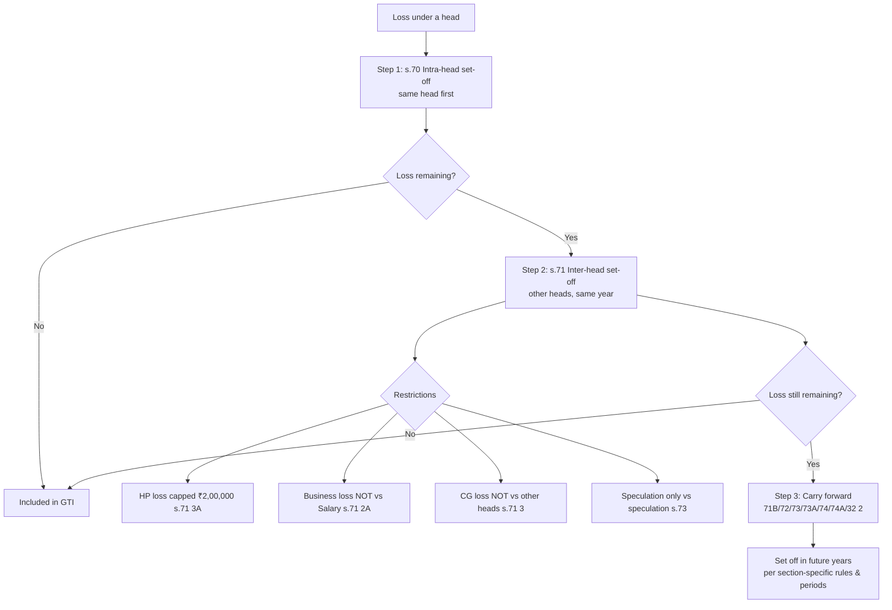

# Q&A — Clubbing of Income & Set-off/Carry-forward of Losses

> Income-tax Act, 1961. All section references below. **Rates/limits (e.g., ₹1,500 exemption u/s 10(32), tax slabs) depend on the applicable Assessment Year — verify against the AY your exam prescribes.** Computations below use ordinary provisions; the analysis is AY-agnostic.

---

## SECTION A — Concept-Check (Short Q&A)

**A1. What is "clubbing of income" and why does the law need it?**
Clubbing (ss. 60–65) means the income of one person is legally *added to and taxed in the hands of another*. Without it, a high-slab taxpayer could split income across low/nil-slab family members (spouse, minor child) to escape progressive rates. Clubbing neutralises this tax-arbitrage by taxing the income in the hands of the person who really controls the source.

**A2. Distinguish "transfer of income without transfer of asset" (s.60) from "revocable transfer of assets" (s.61).**
- **s.60** — only the *income stream* is assigned but the *asset* stays with the transferor → income still taxed in transferor's hands. Irrevocability is irrelevant.
- **s.61** — the *asset itself* is transferred but the arrangement is *revocable* (transferor can re-acquire asset/income) → income taxed in transferor's hands. Exception: s.62 — a transfer irrevocable during the transferee's lifetime / for > 6 years is *not* clubbed until the power to revoke arises.

**A3. State the "income-on-income" rule.**
Only the *first-degree* income from the transferred/clubbed asset is clubbed. Income earned by the *transferee by reinvesting* that clubbed income (income on income / accretion) is **not** clubbed — it is taxed in the transferee's own hands. (Established principle; e.g., interest on a bank deposit made out of gifted money is clubbed, but income earned by the spouse investing *that interest* is not.)

**A4. When is a spouse's remuneration from a concern clubbed u/s 64(1)(ii), and what is the exception?**
Salary/commission/fee from a concern in which the individual has a *substantial interest* (≥20% voting power/profit share) is clubbed in the hands of the spouse having higher income. **Exception:** if the remuneration is attributable to *technical or professional qualifications and experience*, it is taxed in the earner's own hands (not clubbed).

**A5. Minor child's income — rule, exceptions, and exemption.**
u/s 64(1A) all income of a minor child is clubbed with the parent whose total income (before this clubbing) is higher. **Exceptions:** income from (a) manual work done by the child, or (b) skill/talent/specialised knowledge/experience is *not* clubbed. A **s.10(32) exemption of ₹1,500 per minor child** (or the amount clubbed, if lower) is allowed to the parent. *(₹1,500 limit — confirm for your AY.)*

**A6. Give the "same head first" rule of set-off.**
- **s.70 (intra-head):** loss under a head is first set off against income under the *same head*.
- **s.71 (inter-head):** remaining loss is set off against income under *other heads* in the same year (subject to restrictions).

**A7. List the key set-off prohibitions.**
- Speculation loss → only against speculation profit (s.73).
- Long-term capital loss → only against LTCG (s.70(3)); short-term capital loss → against STCG or LTCG.
- Loss under "Capital Gains" → cannot be set off against any other head (s.71(3)).
- Business loss → cannot be set off against salary (s.71(2A)).
- House-property loss → inter-head set-off capped at **₹2,00,000** per year (s.71(3A)); balance carried forward. *(Limit — confirm for AY.)*
- Loss cannot be set off against income from lotteries/gambling etc. (s.58(4)/s.115BB context).

**A8. Match each loss to its carry-forward section and period.**

| Loss | Section | C/F period | Set off against |
|---|---|---|---|
| House property | 71B | 8 yrs | Income from HP |
| Non-speculation business | 72 | 8 yrs | Any business income |
| Speculation business | 73 | 4 yrs | Speculation income |
| Specified business u/s 35AD | 73A | Indefinite | Specified-business income |
| Capital loss (ST/LT) | 74 | 8 yrs | ST: STCG/LTCG; LT: LTCG only |
| Loss from owning/maintaining race horses | 74A | 4 yrs | Same activity |
| Unabsorbed depreciation | 32(2) | Indefinite | Any income (except salary) |

---

## SECTION B — Graded Computational Problems

### B1 (Easy) — Interest on gifted money (s.64(1)(iv))
Mr. A gifts ₹5,00,000 to his wife Mrs. A, who deposits it in an FD earning 8% p.a. interest. Mrs. A reinvests the interest in shares earning ₹3,000 dividend. Whose income, and how much is clubbed?

**Answer.**
- FD interest = 5,00,000 × 8% = **₹40,000** → clubbed in Mr. A's hands u/s 64(1)(iv) (asset transferred to spouse without adequate consideration).
- Dividend ₹3,000 is *income on income* (earned by Mrs. A on the ₹40,000 interest she reinvested) → **not clubbed**; taxable in Mrs. A's hands.
- **Clubbed in Mr. A = ₹40,000.**

### B2 (Moderate) — Minor children (s.64(1A), s.10(32))
Mr. B (income ₹9,00,000) and Mrs. B (income ₹6,00,000) have two minor children:
- Minor C: bank interest ₹6,000.
- Minor D: prize from a singing talent show ₹40,000, and interest on that prize (reinvested) ₹1,200.

Compute income clubbed.

**Answer.**
Clubbed with the parent having higher income = **Mr. B** (₹9,00,000 > ₹6,00,000).
- Minor C interest ₹6,000 → clubbed; less s.10(32) exemption ₹1,500 = **₹4,500**.
- Minor D's ₹40,000 prize is from *talent/skill* → **not clubbed** (exception to 64(1A)), taxed in D's own hands.
- Interest ₹1,200 on that prize is *not* from skill; it is ordinary income of the minor → clubbed; less s.10(32) exemption min(1,500, 1,200)=1,200 → **₹0**.
- **Total clubbed with Mr. B = ₹4,500 + ₹0 = ₹4,500.**

*(₹1,500 exemption per child — verify for AY.)*

### B3 (Hard) — Full intra- and inter-head set-off (ss.70, 71, 71(3A))
For AY 2025-26, Mr. E has:

| Source | Amount (₹) |
|---|---|
| Salary income | 8,00,000 |
| House Property A income | 1,00,000 |
| House Property B loss | (3,50,000) |
| Business — textile (profit) | 2,00,000 |
| Business — trading (loss) | (2,60,000) |
| STCG | 90,000 |
| LTCG | 40,000 |
| Short-term capital loss | (1,50,000) |

Compute Gross Total Income and losses to be carried forward.

**Answer — step by step.**

**Step 1 — House Property (s.70 intra-head):**
1,00,000 − 3,50,000 = **(2,50,000) net HP loss.**

**Step 2 — Business (s.70 intra-head):**
2,00,000 − 2,60,000 = **(60,000) net business loss.**

**Step 3 — Capital Gains (s.70(3)):** STCL set off against STCG then LTCG.
STCL 1,50,000 → set off ₹90,000 against STCG (→0), then ₹40,000 against LTCG (→0). Remaining STCL = 1,50,000 − 90,000 − 40,000 = **(20,000)** to carry forward u/s 74.
Capital Gains head = **Nil.**

**Step 4 — Inter-head set-off (s.71):**
- House-property loss: inter-head set-off capped at **₹2,00,000** (s.71(3A)). Set off ₹2,00,000 against Salary. Balance HP loss ₹50,000 → **c/f u/s 71B.**
- Business loss ₹60,000: *cannot* be set off against salary (s.71(2A)). No other head income remains (CG = nil). So full ₹60,000 → **c/f u/s 72.**

**Step 5 — Gross Total Income:**

| Head | ₹ |
|---|---|
| Salary (8,00,000 − 2,00,000 HP set-off) | 6,00,000 |
| House Property | Nil |
| Business | Nil |
| Capital Gains | Nil |
| **GTI** | **6,00,000** |

**Losses carried forward:**
- HP loss ₹50,000 (s.71B, 8 yrs)
- Business loss ₹60,000 (s.72, 8 yrs)
- STCL ₹20,000 (s.74, 8 yrs)

*Reconciliation:* Total losses ₹(2,50,000 HP + 60,000 biz + 20,000 STCL after CG absorption) = adjustments accounted: HP 2,00,000 absorbed + 50,000 c/f; STCG 90,000 + LTCG 40,000 absorbed by STCL, 20,000 c/f; business 60,000 c/f. ✓

### B4 (Exam-hard) — Clubbing + set-off combined, cross-year c/f
Mr. F transferred a house to his minor son (from talent-show earnings the son had invested — deemed adequate? No, it was a gift). The house yields net annual value computed as follows and other items for AY 2025-26:

- Minor son's house property: GAV 4,00,000; municipal taxes paid 30,000; standard deduction 30% u/s 24(a); interest on loan u/s 24(b) 2,50,000.
- Mr. F's own business income: 5,00,000.
- Mr. F's brought-forward business loss (AY 2021-22): 1,80,000.
- Mr. F's brought-forward unabsorbed depreciation: 60,000.

Compute Mr. F's Gross Total Income and any c/f.

**Answer — step by step.**

**Step 1 — Minor son's house property income (to be clubbed u/s 64(1A) with Mr. F, higher-income parent):**

| Item | ₹ |
|---|---|
| Gross Annual Value | 4,00,000 |
| Less: Municipal taxes | (30,000) |
| Net Annual Value | 3,70,000 |
| Less: Std deduction 30% of NAV | (1,11,000) |
| Less: Interest u/s 24(b) | (2,50,000) |
| **Income from HP** | **9,000** |

s.10(32) exemption = min(1,500, 9,000) = **1,500**.
**Clubbed HP income = 9,000 − 1,500 = ₹7,500.**

**Step 2 — Set off b/f business loss (s.72) against current business income:**
Business income 5,00,000 − b/f business loss 1,80,000 = **3,20,000.**

**Step 3 — Set off unabsorbed depreciation (s.32(2)):**
3,20,000 − 60,000 = **2,60,000** business income.
*(Order: current depreciation → b/f business loss s.72 → unabsorbed depreciation. Here only b/f items, so s.72 loss first then unabsorbed dep — both fully absorbed.)*

**Step 4 — Gross Total Income:**

| Head | ₹ |
|---|---|
| House Property (clubbed) | 7,500 |
| Business | 2,60,000 |
| **GTI** | **2,67,500** |

**Carry-forward:** Nil (both b/f loss and depreciation fully absorbed). ✓

---

## SECTION C — Past-Paper-Style Full Questions

### C1. (Clubbing — comprehensive; ~8 marks style)
Mr. G furnishes the following for the year. Compute income to be clubbed in his hands and state the section:
1. Interest ₹60,000 on debentures held by Mrs. G, purchased from a gift of ₹6,00,000 by Mr. G.
2. Income ₹80,000 of Mrs. G from a partnership firm where Mr. G holds 30% (Mrs. G has no technical qualification).
3. Salary ₹5,00,000 of Mrs. G from the same firm, earned for her professional (CA) services.
4. Income ₹20,000 of minor daughter from a fixed deposit made from her inheritance.
5. Income ₹50,000 of minor son (disabled, covered u/s 80U) from interest.

**Model Answer.**
1. **₹60,000 clubbed** u/s 64(1)(iv) — income from asset transferred to spouse without consideration. *(Income-on-income exception noted: any reinvestment income of Mrs. G would not be clubbed.)*
2. **₹80,000 clubbed** u/s 64(1)(ii) — remuneration/share from a concern in which spouse has substantial interest (30% ≥ 20%); no technical qualification exception applies.
3. **Not clubbed** — proviso to s.64(1)(ii): remuneration attributable to professional qualification (CA) is taxed in Mrs. G's own hands.
4. **₹20,000 minus s.10(32) ₹1,500 = ₹18,500 clubbed** u/s 64(1A) — minor's income; source (inheritance) irrelevant, still clubbed as it is not from skill/manual work.
5. **Not clubbed** — s.64(1A) proviso: income of a minor child suffering disability specified u/s 80U is **not** clubbed; taxed in the minor's own hands (return filed by guardian).

**Total clubbed = 60,000 + 80,000 + 18,500 = ₹1,58,500.**

### C2. (Set-off & carry-forward — comprehensive; ~10 marks style)
Ms. H reports for AY 2025-26:

| Item | ₹ |
|---|---|
| Income from salary | 4,00,000 |
| Loss from self-occupied house property (interest) | (1,80,000) |
| Speculation business profit | 70,000 |
| Speculation business loss (another) | (1,10,000) |
| Non-speculation business loss | (90,000) |
| LTCG (on listed shares, taxable) | 2,00,000 |
| Loss from owning & maintaining race horses | (30,000) |
| Winnings from lottery (gross) | 1,00,000 |

Compute GTI and losses c/f, citing sections.

**Model Answer — step by step.**

**Step 1 — Speculation (s.73):** 70,000 − 1,10,000 = **(40,000)**; speculation loss sets off only against speculation profit → ₹40,000 **c/f u/s 73 (4 yrs).**

**Step 2 — House property (s.71(3A)):** SOP loss ₹1,80,000. Inter-head set-off allowed up to ₹2,00,000. Set off against salary → within cap → full ₹1,80,000 set off. Salary now 4,00,000 − 1,80,000 = **2,20,000.**

**Step 3 — Non-speculation business loss (s.71):** ₹90,000. Cannot be set off against salary (s.71(2A)). Can set off against other heads except salary. Available: LTCG ₹2,00,000. Set off ₹90,000 against LTCG → LTCG = 2,00,000 − 90,000 = **1,10,000.** *(Business loss may be set off inter-head against capital gains — permitted.)*

**Step 4 — Race-horse loss (s.74A):** ₹30,000 — set off *only* against income from same activity. None here → **c/f u/s 74A (4 yrs).**

**Step 5 — Lottery winnings:** ₹1,00,000 taxed at special rate u/s 115BB; **no loss/expense/set-off allowed** against it (s.58(4)). Stands at ₹1,00,000.

**Step 6 — GTI:**

| Head | ₹ |
|---|---|
| Salary | 2,20,000 |
| House Property | Nil |
| Business (speculation nil; non-spec nil after set-off) | Nil |
| Capital Gains (LTCG) | 1,10,000 |
| Other Sources (lottery) | 1,00,000 |
| **GTI** | **4,30,000** |

**C/f:** Speculation loss ₹40,000 (s.73); Race-horse loss ₹30,000 (s.74A). ✓

---

## SECTION D — MCQs & Case Scenarios

**D1.** Loss from house property can be set off against other heads in the same year up to a maximum of:
(a) No limit (b) ₹1,50,000 (c) **₹2,00,000** (d) ₹2,50,000
**Ans: (c)** — s.71(3A); excess is carried forward u/s 71B. *(Confirm limit for AY.)*

**D2.** A short-term capital loss can be set off against:
(a) LTCG only (b) STCG only (c) **Both STCG and LTCG** (d) Any head
**Ans: (c)** — s.70(2). (LTCL, by contrast, only against LTCG — s.70(3).)

**D3.** Business loss carried forward u/s 72 can be set off against:
(a) Any head (b) **Any business income (speculative or not)** (c) Only same business (d) Salary
**Ans: (b)** — s.72; c/f business loss can be set off against *any* business income, but only business income, for 8 AYs.

**D4.** Unabsorbed depreciation u/s 32(2) can be carried forward:
(a) 8 years (b) 4 years (c) **Indefinitely** (d) 10 years
**Ans: (c)** — s.32(2); no time limit, set off against any income except salary.

**D5. (Case scenario)** Mr. J gifts ₹10 lakh to his son's wife (daughter-in-law), who invests it and earns ₹75,000 interest. Is it clubbed?
(a) No, only spouse covered (b) **Yes, in Mr. J's hands u/s 64(1)(vi)** (c) In the son's hands (d) Exempt
**Ans: (b)** — s.64(1)(vi) covers assets transferred to *son's wife* without adequate consideration → ₹75,000 clubbed with Mr. J.

**D6. (Case scenario)** Continuation loss set-off order at return stage. Which sets off first?
(a) B/f business loss then current depreciation (b) **Current-year depreciation, then b/f business loss (s.72), then unabsorbed depreciation** (c) Unabsorbed depreciation first (d) Any order
**Ans: (b)** — settled order: current-year normal depreciation → brought-forward business loss (s.72) → unabsorbed depreciation (s.32(2)). This maximises the use of time-barred items first.

**D7.** Continuation of C1 fact 3: Mrs. G's CA-fee income is not clubbed because:
(a) It exceeds ₹5 lakh (b) **It is attributable to her professional qualification (proviso to s.64(1)(ii))** (c) She has no substantial interest (d) It is exempt
**Ans: (b).**

**D8.** Loss from owning and maintaining race horses is carried forward for:
(a) 8 years (b) Indefinitely (c) **4 years** (d) 2 years
**Ans: (c)** — s.74A(3); set off only against income from the same activity.

**D9. (Case scenario)** A revocable transfer of a house to a trust, irrevocable for 7 years and the transferor derives no benefit. Current year rent?
(a) Clubbed in transferor (b) **Not clubbed until power to revoke arises (s.62)** (c) Always clubbed (d) Exempt
**Ans: (b)** — s.62 exception to s.61 (transfer irrevocable for >6 years / during transferee's lifetime).

**D10.** Speculation loss (s.73) can be carried forward for ___ and set off only against ___:
(a) 8 yrs / any business (b) **4 yrs / speculation profit** (c) 4 yrs / any income (d) indefinite / speculation
**Ans: (b).**

---

## Set-off Flow (Mermaid)

---

## One-Line Traps Recap
- Clubbing applies **even if income is negative** — a *clubbed loss* is set off in the transferor/parent's computation.
- Clubbing happens **before** the ₹1,500 s.10(32) exemption and **before** set-off.
- Substantial interest = **≥20%** voting power/profit share; test both spouses — club with the *higher-income* one; once clubbed, stays with that spouse in later years unless AO changes.
- LTCL: **LTCG only.** HP loss inter-head cap: **₹2,00,000.** Business loss: **never vs salary.**
- Return must be filed **within due date u/s 139(1)** to carry forward business/capital/speculation losses (s.80) — but **HP loss (71B) and unabsorbed depreciation (32(2)) can be c/f even with a belated return.**

*(All monetary limits and slab rates depend on the applicable Assessment Year — verify before the exam.)*
