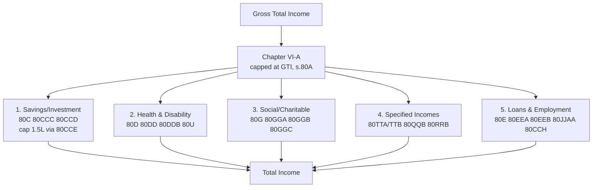

# Q&A — Deductions under Chapter VI-A

> Income-tax Act, 1961. Sections 80A–80U. **All monetary ceilings (₹1,50,000 u/s 80C, ₹25,000/₹50,000 u/s 80D, etc.) and the new-regime carve-outs depend on the applicable Assessment Year — verify against the AY your exam prescribes.** Structure and logic below are AY-agnostic.

---

## SECTION A — Concept-Check (Short Q&A)

**A1. What is the "gate" every Chapter VI-A deduction must pass, and why does it exist?**
Two gates in **s.80A**: (i) the aggregate of all Chapter VI-A deductions **cannot exceed Gross Total Income (GTI)** — deductions can bring taxable income to nil but never create a loss or refund of tax on income that was never earned; (ii) a deduction is allowed on the **amount actually paid/invested**, and no deduction is given on income already exempt. This preserves the principle that VI-A gives *relief*, not a subsidy.

**A2. Distinguish deductions "in respect of certain payments" from those "in respect of certain incomes".**
- **Payments (80C–80GGC):** reward the *outflow* — savings, insurance, donations, loan interest. Independent of how the income arose.
- **Incomes (80JJAA, 80QQB, 80RRB, 80TTA/TTB):** exempt a *slice of specified income already included in GTI* (bank interest, royalty, additional-employment cost). If that income is not in GTI, no deduction.

**A3. State the s.80CCE overall cap.**
Deductions under **80C + 80CCC + 80CCD(1)** together cannot exceed **₹1,50,000**. Crucially, **80CCD(1B)** (extra ₹50,000 NPS) and **80CCD(2)** (employer's NPS contribution) sit *outside* this cap. *(₹1,50,000 / ₹50,000 — confirm for AY.)*

**A4. Why is 80CCD(2) treated so differently from 80CCD(1)?**
80CCD(1) is the *employee's own* contribution — capped and inside the 80CCE ₹1.5 lakh basket. 80CCD(2) is the *employer's* contribution, treated as deferred remuneration; it is allowed **over and above** ₹1.5 lakh, limited to **10% of salary (14% if a Central/State Government employer)**. Because it is employer-funded, it survives even under the new regime.

**A5. 80D — map the ceilings.**
Health-insurance premium/preventive check-up (check-up sub-limit ₹5,000, within the overall cap): **₹25,000** for self+spouse+children; **₹50,000** if the insured is a **senior citizen (60+)**. A *separate* deduction of ₹25,000 / ₹50,000 for **parents**. Where no policy exists, medical *expenditure* on a senior citizen also qualifies. *(Amounts — confirm for AY.)*

**A6. Contrast 80DD, 80DDB and 80U.**
- **80DD** — expenditure/deposit for a **dependant with disability**: *fixed* deduction **₹75,000** (₹1,25,000 for severe disability, 80%+), irrespective of actual spend.
- **80DDB** — actual expenditure on **specified diseases** for self/dependant: up to **₹40,000** (**₹1,00,000** if patient is a senior citizen), reduced by insurance/employer reimbursement.
- **80U** — the **assessee himself** has a disability: fixed **₹75,000 / ₹1,25,000**. 80DD and 80U are mutually exclusive by beneficiary (dependant vs self).

**A7. 80E vs 80EEB vs 80EEA — the interest-deduction trio.**
- **80E** — interest on **education loan** (higher studies), *no monetary limit*, for **8 years** from the year repayment begins.
- **80EEA** — additional interest on **affordable housing** loan (subject to sanction-date and stamp-value conditions), over the s.24(b) limit.
- **80EEB** — interest on loan for **electric vehicle**, up to **₹1,50,000**. Each rewards a policy-favoured borrowing.

**A8. 80G — the four-quadrant logic.**
Donations fall into: **100% without** qualifying limit (e.g., PM National Relief Fund), **50% without** limit, **100% with** qualifying limit, **50% with** qualifying limit. The "qualifying limit" = **10% of Adjusted Total Income**. Cash donations **above ₹2,000 are disallowed** — must be by non-cash mode.

**A9. 80TTA vs 80TTB — never both.**
- **80TTA** — **₹10,000** on **savings-account** interest, for non-seniors.
- **80TTB** — **₹50,000** on **all deposit** interest (savings + FD/RD), exclusively for **resident senior citizens**. A senior citizen claims 80TTB, not 80TTA.

**A10. Which Chapter VI-A deductions survive under the default new regime u/s 115BAC?**
Almost all VI-A deductions are **forfeited**, with the key exceptions of **80CCD(2)** (employer NPS), **80CCH(2)** (Agnipath Seva Nidhi), and **80JJAA** (additional employee cost). The savings-linked reliefs (80C, 80D, 80G, 80TTA, etc.) are unavailable under the new regime. *(Confirm current carve-outs for AY.)*

---

## Deductions map (5 policy families)

---

## SECTION B — Graded Computational Problems

### B1 (Easy) — 80C basket and the 80CCE cap
Mr. Rao (age 45, old regime) pays: LIC premium ₹40,000 (policy sum assured ₹5,00,000), PPF ₹80,000, principal repayment of housing loan ₹60,000, tuition fees for 2 children ₹50,000, ELSS ₹30,000. Compute his 80C deduction.

**Answer.**
| Item | Section | Eligible |
|---|---|---|
| LIC premium (≤10% of SA, so full ₹40,000 allowed) | 80C | 40,000 |
| PPF | 80C | 80,000 |
| Housing-loan principal | 80C | 60,000 |
| Tuition fees (2 children, actual) | 80C | 50,000 |
| ELSS | 80C | 30,000 |
| **Gross eligible** | | **2,60,000** |

- 80CCE overall cap = **₹1,50,000**.
- **Deduction u/s 80C = ₹1,50,000** (excess ₹1,10,000 lapses). *(Cap — confirm for AY.)*

### B2 (Easy–Moderate) — 80CCD interaction, all three limbs
Ms. Iyer (Central Govt. employee) has salary (Basic+DA) ₹10,00,000. Contributions: her own NPS ₹1,20,000; employer NPS ₹1,40,000; PPF ₹50,000; additional NPS claimed under 80CCD(1B) ₹50,000. Compute total VI-A savings deduction.

**Answer.**
- **80CCD(1)** (own NPS) — limited to 10% of salary = ₹1,00,000; she contributed ₹1,20,000, so ₹1,00,000 counts here (balance ₹20,000 diverted below).
- **80C (PPF) + 80CCD(1)** = 50,000 + 1,00,000 = ₹1,50,000 → hits 80CCE cap exactly.
- **80CCD(1B)** — extra ₹50,000, outside cap. She has ₹20,000 leftover own-NPS + earmarks; she can claim the full **₹50,000** (she contributed ₹1,20,000 total own; 1,00,000 used in (1), 20,000 spare — plus she designated ₹50,000, but only ₹1,20,000 exists). Available for (1B) = 1,20,000 − 1,00,000 = **₹20,000**.
- **80CCD(2)** (employer, Central Govt → 14% of salary = ₹1,40,000 limit) = **₹1,40,000**, fully outside the cap.

**Total = 1,50,000 (80CCE) + 20,000 (1B) + 1,40,000 (2) = ₹3,10,000.** *(10%/14% and ₹50,000 — confirm for AY.)*

### B3 (Moderate) — 80D across generations
Dr. Mehta (age 52) pays: own family floater premium ₹28,000; preventive health check-up for family ₹6,000; premium for parents aged 68 ₹55,000; medical expenditure on the same parents ₹10,000. Compute 80D.

**Answer.**
*Self/family block (non-senior, cap ₹25,000):*
- Premium 28,000 + check-up 6,000 = 34,000, but check-up capped at ₹5,000 → 28,000 + 5,000 = 33,000, restricted to **₹25,000**.

*Parents block (senior, cap ₹50,000):*
- Premium 55,000 → restricted to **₹50,000**. (Medical expenditure ₹10,000 not additionally allowed once the ₹50,000 ceiling is exhausted by premium.)

**80D deduction = 25,000 + 50,000 = ₹75,000.** *(Ceilings — confirm for AY.)*

### B4 (Moderate) — 80DD vs 80DDB vs 80U in one return
Mr. Shah (age 40, resident) incurs: ₹90,000 on medical treatment + deposit for his dependant brother with 45% disability; ₹1,20,000 on cancer treatment of his father (age 66), of which ₹30,000 reimbursed by insurer; and Mr. Shah himself has 82% disability. Compute deductions.

**Answer.**
- **80DD** (dependant, 45% = normal disability, ≥40%): *fixed* **₹75,000** (actual ₹90,000 irrelevant).
- **80DDB** (father, senior citizen, specified disease): actual ₹1,20,000, cap ₹1,00,000, less reimbursement ₹30,000 = **₹70,000**.
- **80U** (assessee, 82% = severe disability, 80%+): *fixed* **₹1,25,000**.

**Total = 75,000 + 70,000 + 1,25,000 = ₹2,70,000.** *(Fixed amounts and senior cap — confirm for AY.)*

### B5 (Exam-hard) — 80G with qualifying limit and cash rule
Mr. Verma's GTI = ₹8,00,000. He also has a short-term capital loss carried into GTI of ₹0 (ignore). Donations: (a) PM National Relief Fund ₹50,000; (b) approved local charity (50%, subject to limit) ₹90,000 by cheque; (c) a temple of national importance (100%, subject to limit) ₹40,000; (d) ₹5,000 cash to a school fund (50%, with limit). Deductions already claimed under other VI-A sections: ₹1,50,000 (80C). Compute 80G.

**Answer.**
**Step 1 — Adjusted Total Income (ATI)** = GTI − deductions under VI-A *other than 80G* − LTCG/STCG u/s 111A − certain incomes.
ATI = 8,00,000 − 1,50,000 = **₹6,50,000**.
**Qualifying limit = 10% of ATI = ₹65,000.**

**Step 2 — Cash rule:** donation (d) ₹5,000 in **cash exceeds ₹2,000 → fully disallowed.**

**Step 3 — 100% without limit:** PMNRF ₹50,000 → deduction **₹50,000** (no ceiling).

**Step 4 — "with qualifying limit" pool** (items b and c):
- Gross donations subject to limit = 90,000 (50%) + 40,000 (100%) = ₹1,30,000.
- Restricted to qualifying limit **₹65,000**. Adjust *100%-category first* to maximise relief:
  - Temple 100% → ₹40,000 allowed at 100% = **₹40,000** (uses ₹40,000 of the ₹65,000 room).
  - Remaining room ₹25,000 → charity 50%: eligible amount ₹25,000 × 50% = **₹12,500**.

**Step 5 — 80G total** = 50,000 + 40,000 + 12,500 = **₹1,02,500.** *(Cash limit ₹2,000, 10% ATI — confirm for AY.)*

### B6 (Exam-hard) — 80GG rent, senior-citizen 80TTB, and the GTI ceiling
Mr. Nair (age 63, resident, old regime, self-employed, no HRA) reports: business income ₹4,60,000; savings interest ₹8,000; FD interest ₹70,000. He pays house rent ₹18,000/month and donates ₹20,000 to PMNRF. Compute Total Income.

**Answer.**
- **GTI** = 4,60,000 + 8,000 + 70,000 = **₹5,38,000.**

**80GG (rent, no HRA):** least of —
1. ₹5,000 × 12 = **₹60,000**;
2. 25% of ATI; ATI for 80GG = GTI − VI-A (except 80GG) − LTCG/STCG-special. VI-A others here = 80TTB + 80G (computed below). Provisionally ATI ≈ 5,38,000 − 50,000 (80TTB) − 20,000 (80G) = 4,68,000 → 25% = **₹1,17,000**;
3. Rent paid − 10% of ATI = 2,16,000 − 46,800 = **₹1,69,200**.
Least = **₹60,000**. *(₹5,000/month — confirm for AY.)*

- **80TTB** (senior, all deposit interest, cap ₹50,000): interest 8,000 + 70,000 = 78,000 → **₹50,000**. (80TTA not available to a senior.)
- **80G** (PMNRF, 100%, no limit) = **₹20,000**.

**Total deductions = 60,000 + 50,000 + 20,000 = ₹1,30,000** (well within GTI, s.80A satisfied).
**Total Income = 5,38,000 − 1,30,000 = ₹4,08,000.** *(All ceilings — confirm for AY.)*

---

## SECTION C — Past-Paper-Style Full Questions

### C1. "Compute deductions under Chapter VI-A"
**Q.** Mr. Kabir (age 35, resident, **old regime**) furnishes for the year: GTI ₹15,00,000 (includes LTCG on listed shares u/s 112A ₹1,00,000). Investments/payments: PPF ₹1,50,000; NPS own ₹60,000; employer NPS ₹80,000 (private employer, salary Basic+DA ₹7,00,000); health insurance self ₹22,000; education-loan interest ₹45,000; donation to a 50%-with-limit charity ₹60,000 (cheque). Compute total deductions and Total Income.

**Model Answer.**
**Step 1 — 80C/80CCE:** PPF ₹1,50,000 alone hits the ₹1,50,000 cap; own NPS ₹60,000 cannot fit here → its 80CCD(1) portion is fully absorbed, leaving room only in 80CCD(1B).
- 80CCD(1B): ₹50,000 of the own NPS → **₹50,000**. (Balance ₹10,000 lapses.)
- **80CCD(2)** (private employer, 10% of ₹7,00,000 = ₹70,000): contribution ₹80,000 restricted → **₹70,000** (outside cap).

**Step 2 — 80D:** ₹22,000 (non-senior, within ₹25,000) → **₹22,000.**

**Step 3 — 80E:** education-loan interest, no ceiling → **₹45,000.**

**Step 4 — 80G:**
- ATI = GTI − other VI-A − LTCG u/s 112A = 15,00,000 − (1,50,000 + 50,000 + 70,000 + 22,000 + 45,000) − 1,00,000 = 15,00,000 − 3,37,000 − 1,00,000 = **₹10,63,000.**
- Qualifying limit = 10% = ₹1,06,300; donation ₹60,000 < limit; 50% allowed = **₹30,000.**

**Step 5 — Totals.**
| Section | Amount |
|---|---|
| 80C (via 80CCE) | 1,50,000 |
| 80CCD(1B) | 50,000 |
| 80CCD(2) | 70,000 |
| 80D | 22,000 |
| 80E | 45,000 |
| 80G | 30,000 |
| **Total VI-A** | **3,67,000** |

**Total Income = 15,00,000 − 3,67,000 = ₹11,33,000** (of which ₹1,00,000 LTCG taxed at the special s.112A rate; note VI-A deductions are **not** allowed against 112A LTCG — the LTCG stays taxed separately). *(Limits/rates — confirm for AY.)*

### C2. Theory — "Explain the treatment of Chapter VI-A under the new tax regime."
**Model Answer.** Under **s.115BAC** (default regime from AY 2024-25), the taxpayer forgoes most exemptions and deductions in exchange for concessional slab rates. **Chapter VI-A deductions are broadly not available**, so the savings-linked reliefs — **80C, 80CCC, 80CCD(1), 80D, 80DD, 80DDB, 80E, 80G, 80GG, 80TTA, 80TTB, 80U** — cannot be claimed. The Act deliberately preserves a short list that reflects *employer-funded or employment-generating* policy goals: **80CCD(2)** (employer NPS), **80CCH(2)** (Agnipath Corpus Fund contribution), and **80JJAA** (deduction for additional employee cost). A taxpayer wanting the full 80C/80D basket must **opt out** into the old regime by the due date (business income cases requiring Form 10-IEA). *(Carve-out list — confirm for AY.)*

### C3. Theory — "80DD is a fixed deduction; 80DDB is expenditure-based. Justify."
**Model Answer.** **80DD** rewards maintenance of a dependant with disability. Because ongoing care costs are diffuse and hard to document, the law grants a **flat ₹75,000 (₹1,25,000 severe)** irrespective of actual spend — certainty over precision, requiring only Form 10-IA certification. **80DDB** targets episodic, high-cost **treatment of specified diseases**; here the cost *is* documentable, so the deduction is **actual expenditure capped at ₹40,000 (₹1,00,000 senior), net of reimbursement** to prevent double relief. The design difference mirrors the difference between a recurring status (disability) and a discrete event (treatment). *(Amounts — confirm for AY.)*

---

## SECTION D — MCQs / Case Scenarios

**D1.** Aggregate Chapter VI-A deduction can, at most, reduce GTI to —
(a) a loss (b) nil (c) 50% of GTI (d) basic exemption limit.
**Ans: (b).** *Reason:* s.80A — deductions cannot exceed GTI; they never create a loss.

**D2.** Employer's NPS contribution for a **State Government** employee is deductible u/s 80CCD(2) up to —
(a) 10% of salary (b) 14% of salary (c) ₹50,000 (d) ₹1,50,000.
**Ans: (b).** *Reason:* Govt-employer contribution limit is 14% of salary; outside the 80CCE cap. *(Confirm for AY.)*

**D3.** A ₹3,000 **cash** donation to a fund eligible for 50% deduction u/s 80G gives a deduction of —
(a) ₹1,500 (b) ₹3,000 (c) ₹0 (d) ₹300.
**Ans: (c).** *Reason:* Cash donation exceeding ₹2,000 is wholly disallowed u/s 80G(5D).

**D4.** A resident senior citizen with savings interest ₹9,000 and FD interest ₹60,000 gets a deduction of —
(a) ₹10,000 u/s 80TTA (b) ₹50,000 u/s 80TTB (c) ₹69,000 (d) ₹60,000.
**Ans: (b).** *Reason:* Seniors claim 80TTB (cap ₹50,000 on all deposit interest), not 80TTA. *(Confirm for AY.)*

**D5.** Which survives under the default regime u/s 115BAC?
(a) 80C (b) 80D (c) 80CCD(2) (d) 80TTB.
**Ans: (c).** *Reason:* Employer NPS contribution is among the few VI-A deductions retained.

**D6.** Interest on a loan for **higher education** is deductible u/s 80E for —
(a) 5 years (b) 7 years (c) 8 years or until interest fully paid, whichever earlier (d) indefinitely.
**Ans: (c).** *Reason:* 80E relief runs for a maximum of 8 assessment years from the initial year.

**D7. Case scenario.** Mrs. Bose (age 61, resident, old regime): GTI ₹6,00,000; pays own mediclaim ₹48,000 and incurs ₹22,000 on preventive check-ups for herself. Her 80D deduction is —
(a) ₹70,000 (b) ₹50,000 (c) ₹53,000 (d) ₹25,000.
**Ans: (b).** *Reason:* Senior-citizen self ceiling is ₹50,000; premium 48,000 + check-up (capped ₹5,000) = 53,000, restricted to ₹50,000. *(Confirm for AY.)*

**D8.** For computing the 80G qualifying limit, "Adjusted Total Income" is GTI reduced by —
(a) all VI-A deductions including 80G (b) VI-A deductions *except* 80G, and specified special-rate incomes (c) only 80C (d) nothing.
**Ans: (b).** *Reason:* ATI excludes 80G itself and incomes like LTCG/111A STCG to prevent circularity.

---

## Quick self-verification
- B1: 80C gross 2.60L → capped 1.50L. ✓
- B5: 50,000 + 40,000 + 12,500 = 1,02,500. ✓
- B6: 60,000 + 50,000 + 20,000 = 1,30,000 < GTI 5,38,000. ✓
- C1: 1,50,000+50,000+70,000+22,000+45,000+30,000 = 3,67,000; TI = 11,33,000. ✓

*End of Q&A — Deductions under Chapter VI-A.*
