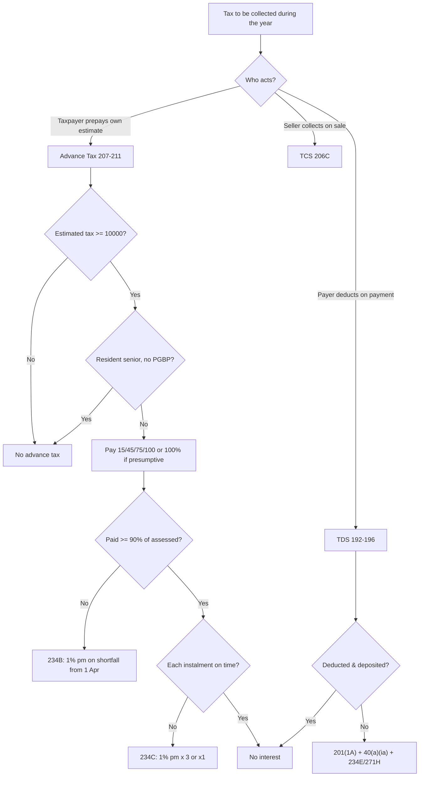

# Q&A — Advance Tax, TDS & TCS

> **AY flag:** All rates, monetary thresholds and instalment percentages below reflect the position generally examined for **AY 2025-26** under the **Income-tax Act, 1961**. The 194-series thresholds and several TDS/TCS rates are amended by almost every Finance Act (e.g., 194H/194-IB rate cuts, revised 194-I(b)/rent limits, LRS/206C(1G) changes). **Re-verify every figure against the current ICAI Study Material / RTP and the Finance Act applicable to your attempt.** All section references are to the Income-tax Act, 1961.

---

## Section A — Concept Check (short Q&A with section citation)

**A1. Why does the law collect tax during the year instead of waiting for the return?**
To give the State a **steady, reliable, hard-to-evade** revenue stream and to cure the cash-flow mismatch of one lump sum in arrears. This "pay-as-you-earn / pay-where-you-earn" philosophy is implemented through **Advance Tax (Sec 207–211)**, **TDS (Sec 192–196)** and **TCS (Sec 206C)**.

**A2. When is advance tax payable, and what is the threshold?**
Advance tax is payable on the **current income** estimated by the assessee [Sec 207] **only if the estimated tax liability for the year is ₹10,000 or more** [Sec 208]. Below ₹10,000 the four-instalment machinery is disproportionate.

**A3. Which assessee is fully exempt from advance tax, and on what two conditions?**
A **resident individual aged 60 or more (senior citizen)** who has **no income under the head PGBP** [Sec 207(2)]. Both conditions — *resident* **and** *no business/professional income* — must hold; a senior with business income is not exempt.

**A4. State the instalment schedule under Sec 211 for a normal assessee.**
Cumulative **15% / 45% / 75% / 100%** by **15 June / 15 September / 15 December / 15 March** respectively. A **presumptive** assessee (Sec 44AD / 44ADA) pays **100% in one instalment by 15 March**.

**A5. Distinguish Sec 234B from Sec 234C.**
- **234B** — default in *payment* of advance tax: triggered when advance tax paid is **< 90% of assessed tax**; interest **1% p.m.** on the shortfall from **1 April of the AY** to date of determination/payment.
- **234C** — default in *deferment* (wrong timing of instalments): interest **1% p.m.** on each short instalment, for **3 months** (first three instalments) or **1 month** (last), with a safe-harbour of **12%/36%** for the June/September instalments.

**A6. What is the general timing rule for deducting TDS on non-salary payments?**
Deduct at the time of **credit to the payee's account OR actual payment, whichever is earlier** — to stop a payer parking a liability by crediting the payee while delaying cash.

**A7. Why does Sec 192 (salary) use the "average rate" rather than a flat rate?**
Because the **employer has full information** about the employee's salary and eligible deductions, so it can compute the *exact* slab-based tax and deduct **1/12th each month**. Salary is the only TDS stream deducted at actual slab rate.

**A8. What is the consequence of the deductee not furnishing PAN?**
Under **Sec 206AA**, TDS is deducted at the **higher of the normal rate or 20%**. PAN links the credit to a person; no PAN invites a punitive rate to force disclosure.

**A9. Contrast the interest for "failure to deduct" versus "failure to deposit" under Sec 201(1A).**
Failure to **deduct**: **1% p.m.** (from date deductible to date deducted). Failure to **deposit** after deducting: **1.5% p.m.** (from date of deduction to date of deposit) — higher, because the deductor is holding the government's money.

**A10. What non-interest consequence hits a payer who fails to deduct/deposit TDS on business expenditure?**
Under **Sec 40(a)(ia)**, **30% of the expenditure is disallowed** while computing business income (100% for payments to non-residents u/s 40(a)(i)), reversed in the year the TDS is finally paid.

**A11. What is TCS and how does it differ in direction from TDS?**
Under **Sec 206C** the **seller collects** an extra amount **from the buyer** on specified goods/rights (liquor, scrap, timber, minerals, motor vehicle > ₹10L, etc.) and deposits it. TCS is **added to** the buyer's price; TDS is **deducted from** the recipient's payment.

**A12. What are the TDS/TCS deposit deadlines?**
TDS deducted in **April–February: by the 7th of the next month**; deducted in **March: by 30 April**. TCS: within **7 days from the end of the month** of collection.

---

## Section B — Graded Computational Problems (full working, self-checked)

### B1 (Easy) — Advance tax instalment schedule [Sec 208, 209, 211]
Mr. Arjun (age 40, salaried + FD interest) estimates total tax liability for AY 2025-26 at **₹1,00,000**; TDS deducted by bank/employer = **₹40,000**. Compute advance tax and its instalments.

**Answer.**
- Net liability after TDS = 1,00,000 − 40,000 = **₹60,000 ≥ ₹10,000** → advance tax payable [Sec 208].
- Advance tax base [Sec 209] = ₹60,000 (tax minus TDS deductible on his income).

| Due date | Cumulative % | Cumulative amount | Instalment |
|---|---|---|---|
| 15 Jun | 15% | 9,000 | 9,000 |
| 15 Sep | 45% | 27,000 | 18,000 |
| 15 Dec | 75% | 45,000 | 18,000 |
| 15 Mar | 100% | 60,000 | 15,000 |

*Check: 9,000 + 18,000 + 18,000 + 15,000 = ₹60,000.* ✔

### B2 (Easy-Moderate) — Senior-citizen exemption [Sec 207(2)]
Mr. Rao, **age 67, resident**, has pension and bank interest only (**no business income**). Estimated tax = ₹35,000; TDS on interest = ₹15,000. Is advance tax payable?

**Answer.** Net liability = 35,000 − 15,000 = ₹20,000 (> ₹10,000), **but** Mr. Rao is a **resident senior citizen with no PGBP income** → **exempt from advance tax u/s 207(2)**. He pays ₹20,000 as **self-assessment tax u/s 140A** at filing; **no 234B/234C** applies.
*Contrast:* had he any business income, the exemption would vanish and 234B/234C would apply on default. ✔

### B3 (Moderate) — Interest u/s 234C for deferment
Ms. Beena's assessed tax net of TDS for AY 2025-26 is **₹2,00,000**. Advance tax actually paid (cumulative): 15 Jun ₹20,000; 15 Sep ₹60,000; 15 Dec ₹1,30,000; 15 Mar ₹2,00,000. No capital gains/casual income. Compute 234C interest.

**Answer.** Safe harbour is **12%** (Jun) and **36%** (Sep); once failed, shortfall is measured against the **full required %**.

| Instalment | Required cum. | Safe harbour | Paid (cum.) | Fails? | Shortfall | Interest = SF × 1% × months |
|---|---|---|---|---|---|---|
| 15 Jun | 15% = 30,000 | 12% = 24,000 | 20,000 | Yes | 10,000 | 10,000 × 1% × 3 = **300** |
| 15 Sep | 45% = 90,000 | 36% = 72,000 | 60,000 | Yes | 30,000 | 30,000 × 1% × 3 = **900** |
| 15 Dec | 75% = 1,50,000 | (strict) | 1,30,000 | Yes | 20,000 | 20,000 × 1% × 3 = **600** |
| 15 Mar | 100% = 2,00,000 | — | 2,00,000 | No | Nil | **Nil** |

**Total 234C = 300 + 900 + 600 = ₹1,800.** Since full ₹2,00,000 was paid by 15 March (≥ 90% of assessed tax), **234B does not apply**. ✔

### B4 (Moderate) — TDS across several sections [Sec 194A/C/H/I/J]
Zenith Pvt. Ltd. made the following payments in FY 2024-25. Compute TDS on each.
1. Rent of office building ₹3,60,000 (monthly ₹30,000).
2. Professional fee to a CA ₹80,000.
3. Single bill to a contractor (a firm) ₹1,50,000.
4. Commission to an agent ₹40,000.
5. Interest on a loan from a resident (non-bank) ₹1,00,000.

**Answer.**

| Payment | Section | Threshold | Crossed? | Rate | TDS |
|---|---|---|---|---|---|
| Rent (building) 3,60,000 | 194-I | 2,40,000 | Yes | 10% | **36,000** |
| Professional fee 80,000 | 194J | 30,000 | Yes | 10% | **8,000** |
| Contractor–firm 1,50,000 | 194C | 30,000 single | Yes | 2% (payee not indiv/HUF) | **3,000** |
| Commission 40,000 | 194H | 15,000 | Yes | 2% | **800** |
| Interest 1,00,000 | 194A | 5,000 (non-bank) | Yes | 10% | **10,000** |

**Total TDS = 36,000 + 8,000 + 3,000 + 800 + 10,000 = ₹57,800.** ✔

### B5 (Moderate-Hard) — TDS default interest u/s 201(1A) + disallowance u/s 40(a)(ia)
From B4, suppose Zenith **deducted** the ₹8,000 professional-fee TDS on **10 Jan 2025** but **deposited** it only on **15 May 2025** (due date 7 Feb 2025). Also, it entirely **failed to deduct** on the ₹80,000 professional fee originally. Compute (a) 201(1A) interest on the deposit delay, (b) the 40(a)(ia) disallowance.

**Answer.**
(a) TDS was deducted on time, so only the **1.5% p.m.** "failure-to-deposit" interest applies, from date of deduction (10 Jan) to date of deposit (15 May) — Jan, Feb, Mar, Apr, May = **5 months** (part-month = full month).
- Interest = 8,000 × 1.5% × 5 = **₹600**.
(b) On non-deduction of the ₹80,000 fee, **30% of ₹80,000 = ₹24,000 disallowed** u/s 40(a)(ia) — added back to Zenith's business income until the TDS is paid, when it is reversed. ✔

### B6 (Exam-Hard) — Combined: advance tax + 234B + 234C, capital-gain carve-out
Mr. K, age 45, has assessed tax (net of TDS) of **₹4,00,000** for AY 2025-26, of which **₹1,00,000 arose from a capital gain on 20 December 2024**. Advance tax paid: 15 Jun ₹45,000; 15 Sep ₹1,35,000; 15 Dec ₹2,25,000; 15 Mar ₹2,80,000. Compute 234C and 234B interest. (Ignore cess for interest working.)

**Answer.**
**234C carve-out:** the ₹1,00,000 capital-gain tax could not be foreseen before 20 Dec; no 234C on that portion for instalments *falling due before* it arose. Being paid in the **remaining instalment(s) after it arose** (here by 15 March) escapes 234C on that slice. So test the **non-capital-gain tax = ₹3,00,000** for Jun/Sep, and the full ₹4,00,000 only where the CG had already arisen.

*Required on ₹3,00,000 base (Jun, Sep):*

| Instalment | Required cum. | Paid (cum.) | Fails safe harbour? | Shortfall | Interest |
|---|---|---|---|---|---|
| 15 Jun | 15% × 3,00,000 = 45,000 (SH 12% = 36,000) | 45,000 | No (≥ 45,000) | Nil | **Nil** |
| 15 Sep | 45% × 3,00,000 = 1,35,000 (SH 36% = 1,08,000) | 1,35,000 | No | Nil | **Nil** |

*Dec instalment — CG has now arisen (20 Dec), so full ₹4,00,000 base:*
- Required 75% × 4,00,000 = 3,00,000; paid 2,25,000; shortfall 75,000. Interest = 75,000 × 1% × 3 = **₹2,250**.

*March instalment (full base):*
- Required 100% × 4,00,000 = 4,00,000; paid 2,80,000; shortfall 1,20,000. Interest = 1,20,000 × 1% × 1 = **₹1,200**.

**Total 234C = 2,250 + 1,200 = ₹3,450.**

**234B:** advance tax paid ₹2,80,000 vs assessed ₹4,00,000. 90% of 4,00,000 = 3,60,000. Since 2,80,000 < 3,60,000, **234B applies** on shortfall = 4,00,000 − 2,80,000 = ₹1,20,000. Assume tax paid on filing 25 July 2025 → Apr, May, Jun, Jul = **4 months**.
- Interest = 1,20,000 × 1% × 4 = **₹4,800**.

*Check: 234C total ₹3,450; 234B ₹4,800.* ✔ (234C punishes timing within the year; 234B punishes the year-end shortfall — both can co-exist.)

---

## Section C — Past-Paper-Style Full Questions

### C1. Determine TDS applicability and rate for five transactions
For FY 2024-25 state whether TDS applies, the section, and the amount:
(i) Bank pays interest ₹38,000 to a resident (non-senior). (ii) Company pays ₹6,000 dividend to a shareholder. (iii) Payment of ₹28,000 (single) and later ₹80,000 (single) to the same individual contractor. (iv) Rent of plant & machinery ₹5,00,000 to a firm. (v) Winnings from a lottery ₹60,000.

**Model answer.**
- (i) **194A**, bank interest threshold ₹40,000 (non-senior). ₹38,000 **< threshold → no TDS**.
- (ii) **194**, dividend threshold ₹5,000. ₹6,000 > 5,000 → TDS @10% = **₹600**.
- (iii) **194C**, individual payee → rate **1%**. First bill ₹28,000 < ₹30,000 single limit and aggregate ₹28,000 < ₹1,00,000 → no TDS on it alone; second bill ₹80,000 crosses the ₹30,000 single limit → TDS on ₹80,000 @1% = ₹800. Aggregate now ₹1,08,000 > ₹1,00,000, so TDS also on the earlier ₹28,000 @1% = ₹280. **Total TDS = ₹1,080**.
- (iv) **194-I(a)** plant & machinery @ **2%**; ₹5,00,000 > ₹2,40,000 → TDS = **₹10,000**.
- (v) **194B**, winnings threshold ₹10,000; @**30%** on ₹60,000 = **₹18,000**.
*Checks: 6,000×10%=600; 80,000×1%=800 + 28,000×1%=280 =1,080; 5,00,000×2%=10,000; 60,000×30%=18,000.* ✔

### C2. Advance tax for a presumptive assessee [Sec 44AD, 211]
Mr. P runs a business under **presumptive taxation u/s 44AD**. His estimated tax liability for AY 2025-26 is **₹1,20,000** (no TDS). He pays nothing until 15 December and pays ₹1,20,000 on **20 March 2025**. Discuss advance-tax liability and interest.

**Model answer.**
- A 44AD assessee pays **100% of advance tax in a single instalment by 15 March** [Sec 211 proviso]. The Jun/Sep/Dec schedule does **not** apply, so **no 234C** for those dates.
- However, he paid on **20 March**, i.e., **after 15 March**. For 234C, the March instalment shortfall is tested at 100%: nothing was paid by 15 March, so shortfall = ₹1,20,000; interest = 1,20,000 × 1% × 1 = **₹1,200** (234C, 1 month for the last instalment).
- **234B:** advance tax "paid" for 234B is measured by year-end (31 March); ₹1,20,000 was paid on 20 March, i.e., within the year, ≥ 90% of assessed tax → **no 234B**.
*Result: 234C ₹1,200; 234B nil.* ✔

### C3. Consequences of TDS default — full enforcement ladder [Sec 201, 40(a)(ia), 234E, 271H]
A firm deducted TDS of ₹50,000 in FY 2024-25 but neither deposited it nor filed the quarterly TDS return. List every consequence with the governing section.

**Model answer.**
1. **Assessee-in-default** [Sec 201(1)] — the firm is liable to pay the ₹50,000 itself.
2. **Interest u/s 201(1A)** — 1.5% p.m. from date of deduction to date of deposit (deduct-but-not-deposit rate).
3. **Disallowance u/s 40(a)(ia)** — 30% of the underlying expenditure disallowed while computing the firm's business income (reversed when TDS paid).
4. **Fee u/s 234E** — ₹200 per day of delay in filing the TDS statement, capped at the TDS amount (₹50,000).
5. **Penalty u/s 271H** — ₹10,000 to ₹1,00,000 for non-/late filing of the statement.
6. **Prosecution u/s 276B** — rigorous imprisonment for failure to deposit tax deducted.
*The escalation interest → disallowance → fee → penalty → prosecution is deliberate: it makes non-compliance progressively unbearable.* ✔

---

## Section D — MCQs / Case Scenarios

**D1.** Advance tax is payable only if estimated tax liability for the year is at least:
(a) ₹5,000 (b) ₹10,000 (c) ₹15,000 (d) ₹50,000
**Ans: (b).** Sec 208 threshold is ₹10,000.

**D2.** A resident senior citizen is exempt from advance tax provided he has:
(a) only pension income (b) no PGBP income (c) income below ₹5 lakh (d) age above 80
**Ans: (b).** Sec 207(2) — resident, 60+, and **no income under PGBP**.

**D3.** Cumulative advance tax payable by 15 September for a normal assessee is:
(a) 15% (b) 30% (c) 45% (d) 75%
**Ans: (c).** Sec 211 schedule 15/45/75/100.

**D4.** Interest u/s 234B is triggered when advance tax paid is less than:
(a) 75% (b) 80% (c) 90% (d) 100% of assessed tax
**Ans: (c).** A 10% margin of error is tolerated.

**D5.** The TDS rate on professional fees u/s 194J is:
(a) 1% (b) 2% (c) 5% (d) 10%
**Ans: (d).** 10% (2% for technical services / call centres). Professional fee ≈ pure income.

**D6.** For a payment to a contractor who is an individual, TDS u/s 194C is:
(a) 1% (b) 2% (c) 5% (d) 10%
**Ans: (a).** 1% for individual/HUF payee, 2% for others.

**D7.** Where the deductee does not furnish PAN, TDS is deducted at:
(a) normal rate (b) 20% only (c) higher of normal rate or 20% (d) 30%
**Ans: (c).** Sec 206AA.

**D8.** TDS deducted in March must be deposited by:
(a) 7 April (b) 30 April (c) 7 May (d) 31 May
**Ans: (b).** March gets the extended 30 April deadline.

**D9 (Scenario).** A company credits a consultant's account on 25 March but pays cash on 10 April. TDS liability arises on:
(a) 25 March (credit) (b) 10 April (payment) (c) either (d) 31 March
**Ans: (a).** "Credit or payment, whichever is earlier" — credit on 25 March triggers it.

**D10 (Scenario).** Seller with turnover ₹15 crore sells goods worth ₹80 lakh to a buyer; buyer's payment exceeds ₹50 lakh. Applicable provision:
(a) 194Q by buyer (b) 206C(1H) by seller (c) both simultaneously (d) neither
**Ans: (a)/(b) depending on facts.** Where the buyer is liable to deduct **194Q (0.1%)**, that prevails and the seller's **206C(1H)** does not apply on the same transaction. If 194Q does not apply, seller collects 206C(1H) @0.1% on receipts above ₹50 lakh.

**D11 (Scenario).** Ms. X, presumptive u/s 44ADA, pays her entire advance tax on 15 March. Interest exposure:
(a) 234C on all four instalments (b) no 234C if fully paid by 15 March (c) 234B always (d) 234A
**Ans: (b).** Presumptive assessees pay 100% by 15 March; timely full payment escapes 234C.

**D12 (Scenario).** TCS collected on sale of a motor vehicle of ₹12,00,000:
(a) nil (b) 1% = ₹12,000 (c) 5% = ₹60,000 (d) 0.1% = ₹1,200
**Ans: (b).** Sec 206C — motor vehicle above ₹10 lakh attracts 1%.

---

## Decision Map — which mechanism / interest applies

---

## Quick-Revision Trigger Sheet

| Item | Section | Key number (AY 25-26) |
|---|---|---|
| Advance tax threshold | 208 | ₹10,000 |
| Senior exemption | 207(2) | resident 60+, no PGBP |
| Instalments | 211 | 15/45/75/100 on 15 Jun/Sep/Dec/Mar |
| Presumptive | 44AD/44ADA | 100% by 15 Mar |
| 234B | 234B | < 90% → 1% pm on shortfall from 1 Apr |
| 234C | 234C | 1% pm × 3 (first 3) / ×1 (Mar); SH 12%/36% |
| Salary TDS | 192 | average slab rate, 1/12 monthly |
| Interest (non-sec) | 194A | 10%; 40k/50k(sr)/5k |
| Contractor | 194C | 1% indiv-HUF / 2% others; 30k or 1L |
| Commission | 194H | 2%; 15k |
| Rent | 194-I | 2% P&M / 10% land-building; 2.4L |
| Professional | 194J | 10% (2% technical); 30k |
| Immovable property | 194-IA | 1%; 50L |
| Winnings | 194B/BB | 30%; 10k |
| Non-resident | 195 | rates in force / DTAA; no threshold |
| No PAN | 206AA | higher of normal or 20% |
| Deposit dates | — | 7th next month; March by 30 Apr |
| Deductor default | 201(1A) | 1% not-deducted / 1.5% not-deposited |
| Disallowance | 40(a)(ia) | 30% (100% non-resident) |
| Late TDS return | 234E / 271H | ₹200/day / ₹10k-₹1L |
| TCS | 206C | liquor/scrap/minerals 1%, timber 2.5%, tendu 5%, MV>10L 1% |
| Sale of goods TCS/TDS | 206C(1H)/194Q | 0.1%; 194Q prevails if applicable |

**First-principles recap:** every rule descends from one need — *steady, traceable, evasion-proof revenue.* Collect during the year (advance tax, front-weighted 15/45/75/100), collect at the source from the party with no incentive to hide (TDS, at rates tracking each stream's tax), mirror it for big *spending* flows (TCS), and make all three self-enforcing through escalating interest (234B/C, 201(1A)), disallowance (40(a)(ia)), penalty and prosecution, with PAN (206AA) threading every rupee into Form 26AS/AIS.

> Re-confirm all thresholds, 194-series rates and the ₹10,000 / 90% / 12%-36% figures against the **current ICAI Study Material and the Finance Act applicable to your attempt** before the exam.
