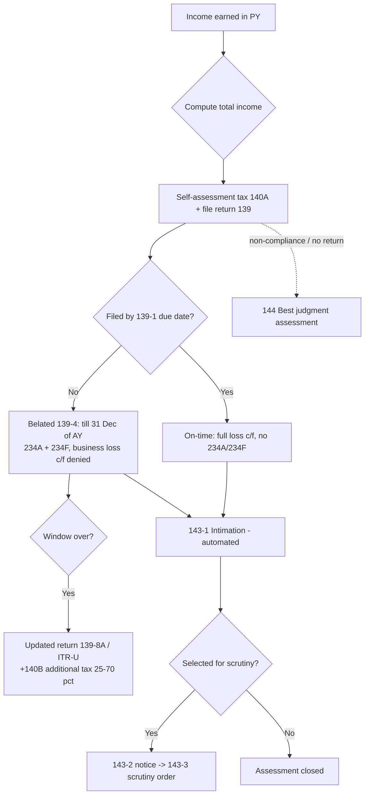

# Q&A — Return Filing & Assessment

> Income-tax Act, 1961. All monetary limits, due dates and rates are AY-specific — **verify against the AY applicable to your attempt** (illustrations use AY 2025-26 unless stated). Rates/limits flagged with ⚠ depend on the applicable AY.

---

## SECTION A — Concept Check (with answers)

**A1. What is the "self-declaration + verification bargain" the return system rests on?**
The taxpayer computes and *declares* his own income and tax (self-assessment, **Sec 140A**); the Department reserves the right to *verify* through a graded scale of assessments (**143(1) → 143(3)/144**). Trust first, verify later.

**A2. Who is *compulsorily* required to file a return under Sec 139(1)?**
(i) Companies and firms (incl. LLP) — **always**, even at nil/loss income. (ii) Any other person whose total income *before* Chapter VI-A / 54-type exemptions exceeds the basic exemption limit. (iii) Persons hit by the **7th proviso** even if income is below the limit.

**A3. State any three triggers under the 7th proviso to Sec 139(1).** ⚠
Mandatory filing regardless of income if the person: (a) deposited **> ₹1 crore** in one/more current accounts; (b) spent **> ₹2 lakh** on foreign travel (self/others); (c) paid electricity bills **> ₹1 lakh**; (d) or meets other CBDT-notified high-value criteria (e.g. business turnover > ₹60 lakh, professional receipts > ₹10 lakh, TDS/TCS ≥ ₹25,000 [₹50,000 for senior citizens], savings deposits ≥ ₹50 lakh).

**A4. Distinguish belated (139(4)), revised (139(5)) and updated (139(8A)) returns.**
- **139(4) belated** — return not filed by due date; can be filed up to **31 Dec of AY** or before assessment completion, whichever earlier. Attracts 234A + 234F.
- **139(5) revised** — corrects an *omission/wrong statement* in an already-filed return (original or belated); same deadline as belated (31 Dec of AY / before assessment).
- **139(8A) updated (ITR-U)** — voluntary return to disclose *additional* income, filed after the 139(4)/(5) window, up to **48 months** ⚠ from end of AY, with additional tax of 25%/50%/60%/70% ⚠ depending on slab of time. Cannot be used to reduce income, claim/increase refund, or report a loss.

**A5. When is a return treated as "defective" under Sec 139(9)?**
When it is incomplete — e.g. annexures/statements missing, tax + interest not paid before filing, accounts not enclosed where required. AO issues notice; assessee gets **15 days** (extendable) to cure; uncured defect → return treated as invalid (as if never filed).

**A6. Contrast Sec 143(1), 143(3) and 144.**
- **143(1)** — *intimation*: automated processing; arithmetic errors, incorrect claims apparent from return adjusted; no discretion, no opinion.
- **143(3)** — *scrutiny*: after 143(2) notice; AO examines evidence and passes a reasoned order.
- **144** — *best judgment*: AO estimates income when assessee fails to file/comply (with 139/142(1)/143(2)/144 notices).

**A7. What links Sec 139A (PAN) and 139AA (Aadhaar)?**
Every person filing a return must quote **PAN (139A)**; and must quote/link **Aadhaar (139AA)**. An unlinked PAN becomes **inoperative** — return can't be processed, higher TDS applies.

---

## SECTION B — Graded Computational Problems

### B1 (Easy) — Section 234F fee + 234A interest ⚠
**Q.** Mr. A, total income ₹6,80,000 (old regime), self-assessment tax payable after TDS = ₹12,000. Due date 31 Jul 2025; he files on 20 Nov 2025. Compute 234F fee and 234A interest.

**Solution.**
- **234F fee:** Income > ₹5 lakh and return filed after due date → **₹5,000**. *(If total income ≤ ₹5 lakh, capped at ₹1,000.)*
- **234A interest:** 1% p.m. / part-month on unpaid self-assessment tax, from day after due date to date of filing.
  - Period: Aug, Sep, Oct, Nov (part) = **4 months**.
  - Interest = ₹12,000 × 1% × 4 = **₹480**.
- **Total late cost = ₹5,000 + ₹480 = ₹5,480.**

### B2 (Moderate) — Belated return: loss carry-forward denial
**Q.** Firm XYZ has business loss ₹3,00,000 and unabsorbed depreciation ₹1,00,000 for PY 2024-25. Due date 31 Oct 2025; it files belated on 15 Dec 2025. What can be carried forward?

**Solution.**
- **Business loss ₹3,00,000:** Sec 80 requires the return to be filed **within 139(1) due date** for a business loss to be carried forward. Belated filing → **cannot carry forward** the ₹3,00,000.
- **Unabsorbed depreciation ₹1,00,000:** Governed by **Sec 32(2)**, *not* Sec 80/139(3). It carries forward **even on a belated return** → **₹1,00,000 c/f allowed.**
- **Trap:** examiners mix these; only depreciation (and House Property loss u/s 71B) survive a late return.

### B3 (Moderate-Hard) — 234A + 234B + 234C interplay
**Q.** Mr. B, AY 2025-26, assessed tax (tax on total income − TDS) = ₹1,00,000. Advance tax paid: ₹0. Due date 31 Jul 2025; return + full self-assessment tax paid on 10 Oct 2025. Compute 234A, 234B (ignore 234C detail — state treatment).

**Solution.**
- **234B (default in payment of advance tax):** advance tax paid < 90% of ₹1,00,000, so 234B applies. 1% p.m. from **1 Apr 2025** to date of determination/self-assessment payment (Oct 2025).
  - Apr–Oct = **7 months** × 1% × ₹1,00,000 = **₹7,000.**
- **234A (default in furnishing return):** 1% p.m. on unpaid tax from **1 Aug 2025** (day after due date) to 10 Oct 2025.
  - Aug, Sep, Oct(part) = **3 months** × 1% × ₹1,00,000 = **₹3,000.**
- **234C (deferment):** charged on shortfall in each quarterly instalment (15%/45%/75%/100%). Since ₹0 advance tax was paid, 234C is also attracted on each instalment shortfall — computed separately per due date (15 Jun/15 Sep/15 Dec/15 Mar).
- **234A + 234B here = ₹3,000 + ₹7,000 = ₹10,000** (plus 234C and 234F ₹5,000).

### B4 (Exam-Hard) — Updated return (ITR-U) full cost, reconciled ⚠
**Q.** Mr. C did not file for AY 2024-25 (due date passed, 139(4) window over). On 5 May 2026 he files an updated return u/s 139(8A) disclosing total income ₹9,00,000 (new regime). Assume tax on ₹9,00,000 = ₹42,500 (incl. cess) ⚠, TDS ₹10,000, no advance tax. Compute total payable.

**Solution — step by step.**
1. **Tax on total income:** ₹42,500.
2. **Less TDS:** ₹10,000 → balance ₹32,500.
3. **Interest 234A/234B/234C** (advance tax nil, return late): compute on ₹32,500.
   - 234B: 1 Apr 2024 → May 2026 ≈ 26 months × 1% × ₹32,500 ≈ ₹8,450 (illustrative).
   - 234A: from day after due date to date of furnishing updated return.
   - 234C: instalment shortfalls.
   - *For exam, show the aggregate interest figure; assume total interest ₹12,000.*
4. **234F late fee:** ₹5,000.
5. **Aggregate tax + interest + fee (before additional tax):**
   ₹32,500 + ₹12,000 + ₹5,000 = **₹49,500.**
6. **Additional tax u/s 140B:** filed within **12 months** ⚠ from end of AY (end of AY = 31 Mar 2025; 5 May 2026 is within 12–24-month band) → **50%** ⚠ of (tax + interest).
   - Additional tax = 50% × (₹32,500 + ₹12,000) = 50% × ₹44,500 = **₹22,250.**
   *(140B additional tax is on tax + interest, not on the late fee.)*
7. **Total payable with ITR-U = ₹32,500 + ₹12,000 + ₹5,000 + ₹22,250 = ₹71,750.**

> Reconciliation check: additional tax band (25% if within 12 months of AY-end; 50% if 12–24 months; 60%/70% for later extended bands ⚠). Confirm the band by counting months from **end of AY**, not from due date.

---

## SECTION C — Past-Paper-Style Full Questions

### C1. "Examine with reasons whether the following persons must file a return u/s 139(1) for AY 2025-26." ⚠
(a) A private company with nil income. (b) An individual (age 45) with gross total income ₹2,80,000 before 80C deduction of ₹40,000. (c) A resident individual, income ₹2,00,000, who deposited ₹1.5 crore in a current account.

**Model Answer.**
- **(a)** Company must file **irrespective of income/loss** — Sec 139(1) proviso (clause a/b covers companies & firms). **Return mandatory.**
- **(b)** GTI ₹2,80,000 is compared **before** Chapter VI-A deduction. Basic exemption ⚠ ₹2,50,000 (old regime). ₹2,80,000 > ₹2,50,000 → **return mandatory**, even though income after 80C (₹2,40,000) falls below the limit. Classic trap: the limit test is on income *before* deductions.
- **(c)** Income ₹2,00,000 < exemption limit, but deposit of ₹1.5 crore (> ₹1 crore) in a current account triggers the **7th proviso** → **return mandatory.**

### C2. "Mr. D filed his original return on 25 Jul 2025 (due date 31 Jul 2025) but later found he omitted interest income of ₹50,000. Advise on revising, and till when." 
**Model Answer.**
- Omission in a filed return is corrected by a **revised return u/s 139(5)**. Original was filed on time, so revision is available.
- Deadline: **31 Dec 2025** (three months before end of AY) or completion of assessment, whichever is **earlier**.
- A revised return **substitutes** the original entirely; the original is treated as withdrawn. Multiple revisions are allowed within the time limit. No 234F fee purely for revising (original was timely), but 234B/234C interest on the additional tax on ₹50,000 applies.

### C3. "State the consequences of a defective return u/s 139(9) and the assessee's remedy."
**Model Answer.**
- AO issues a notice specifying the defect; assessee has **15 days** (AO may extend on application) to rectify.
- If **cured within time** → return valid from original date of filing.
- If **not cured** → return treated as **invalid** — legal position is as if **no return was filed**, exposing the assessee to 139(4) belated consequences, 234A/234F, best-judgment assessment u/s 144, and loss of carry-forward benefits.
- If the assessee rectifies after 15 days but before assessment is completed, the AO **may** condone the delay and treat it as valid.

### C4. "Explain the assessment ladder and how each stage escalates."
**Model Answer.**
- **140A Self-assessment:** assessee pays tax + interest + fee before filing; foundation of self-declaration.
- **143(1) Intimation:** automated; only apparent adjustments (arithmetical errors, internally inconsistent/incorrect claims); refund/demand computed. No hearing.
- **143(3) Scrutiny:** requires **143(2) notice** served within the prescribed period; AO examines evidence, hears assessee, passes reasoned order.
- **144 Best judgment:** invoked on non-compliance/non-filing; AO estimates income *fairly* after giving a show-cause opportunity; can't be arbitrary.
- Escalation logic: cheap/automated verification first, human scrutiny only for flagged cases, coercive estimation only when the taxpayer breaks the bargain.

---

## Assessment / Return Flow (Mermaid)

---

## SECTION D — MCQs & Case Scenarios

**D1.** The due date u/s 139(1) for a company (not requiring transfer-pricing report) for AY 2025-26 is: ⚠
(a) 31 Jul (b) **31 Oct** (c) 30 Nov (d) 31 Dec
**Answer: (b).** Companies (and any assessee requiring audit) → 31 Oct; TP cases (92E report) → 30 Nov.

**D2.** A belated return u/s 139(4) for AY 2025-26 can be filed latest by: ⚠
(a) 31 Mar 2026 (b) **31 Dec 2025** (c) 31 Jul 2025 (d) 30 Sep 2026
**Answer: (b).** 31 Dec of the AY, or before assessment, whichever earlier.

**D3.** Which loss can be carried forward even if the return is belated?
(a) Business loss (b) Speculation loss (c) **Unabsorbed depreciation** (d) Capital loss
**Answer: (c).** Sec 32(2) is outside the 80/139(3) timely-filing bar.

**D4.** Maximum 234F fee where total income exceeds ₹5,00,000: ⚠
(a) ₹1,000 (b) **₹5,000** (c) ₹10,000 (d) ₹200/day
**Answer: (b).** ₹5,000; reduced to ₹1,000 if total income ≤ ₹5 lakh.

**D5.** An updated return u/s 139(8A) **cannot** be filed if it:
(a) increases income (b) **results in a refund or reduces total income** (c) pays additional tax (d) discloses a new source
**Answer: (b).** ITR-U only for *additional* income/tax; no loss, no refund, no reduction.

**D6.** Sec 143(1) intimation permits the AO to:
(a) examine books (b) **make arithmetical corrections/disallow apparent incorrect claims** (c) estimate income (d) impose penalty for concealment
**Answer: (b).** 143(1) is automated; no judgment or hearing.

**D7 (Case).** Ms. E's PAN is not linked with Aadhaar. She files a return. Consequence?
**Answer:** Under **139AA**, PAN becomes **inoperative** — return not processed, refunds withheld, and **higher TDS/TCS** rates apply until linkage. She must link (with fee) to make PAN operative.

**D8 (Case).** Mr. F, non-resident, earns only ₹1,80,000 Indian income (below limit) but wants to carry forward a capital loss of ₹2,00,000. Must he file, and by when?
**Answer:** To carry forward the capital loss (Sec 74 read with **139(3)**), the return **must be filed within the 139(1) due date**. Though income is below the exemption limit, he must file **on time** to preserve the loss; a belated return forfeits carry-forward. Residential status affects scope of income but not this timing rule.

**D9.** 234B interest is charged when advance tax paid is less than:
(a) 100% (b) **90%** (c) 75% (d) 45% of assessed tax
**Answer: (b).** < 90% of assessed tax attracts 234B (1% p.m. from 1 Apr of AY).

**D10 (Case).** A firm files its return showing a business loss on 5 Nov 2025 (due date 31 Oct 2025). AO issues a 143(2) notice and later a 144 order. Identify the errors in the firm's position.
**Answer:** (i) Filing on 5 Nov is **belated** → business loss carry-forward **denied** (Sec 80). (ii) 234A + 234F apply. (iii) A 143(2)/143(3) route needs cooperation; failure invites **144 best judgment**. The firm should have filed by 31 Oct to protect the loss and avoid escalation.

---

## Quick-Revision Trap List (examiner favourites)
1. Exemption-limit test is on income **before** Chapter VI-A. 
2. Companies/firms file **even at nil/loss**. 
3. **Depreciation & HP loss** carry forward on belated return; **other losses don't**. 
4. Revised return **replaces** original; belated return **can** be revised. 
5. **139(8A)** never for refund/loss/reduced income. 
6. 234F: ₹5,000 (>₹5L) vs ₹1,000 (≤₹5L). 
7. 234A from **day after due date**; 234B from **1 Apr of AY**. 
8. 140B additional tax counts months from **end of AY**, on **tax + interest** (not fee). 
9. Defective return uncured = **invalid = never filed**. 
10. Inoperative PAN (Aadhaar not linked) → return not processed + higher TDS.

> First-principles recap: **declare honestly (140A), file on time (139(1)) to keep your rights (losses, no fees), and the State verifies proportionately (143(1)→143(3)→144).** Every penalty (234A/B/C/F) prices a specific breach of that bargain.
