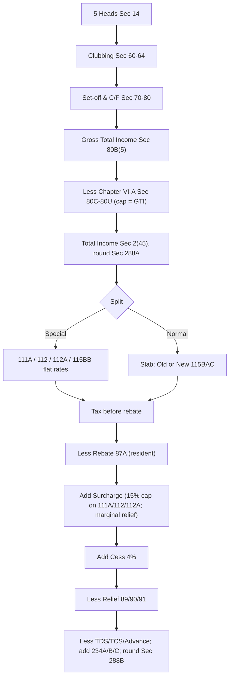

# Q&A — Computation of Total Income & Tax Liability

> **AY / regime flag:** Slab rates, the default new regime (**Sec 115BAC**), the **Sec 87A** rebate ceilings, surcharge slabs and the special rates (111A/112/112A) have all been repeatedly amended. The figures used below reflect the widely examined **AY 2025-26** position (including the post-23-July-2024 capital-gains changes). **The *pipeline* is permanent; the *numbers* are plug-in values — always re-verify the exact slab, rebate limit, surcharge slab and special rate against the current ICAI Study Material / Finance Act for your attempt.** All section references are to the **Income-tax Act, 1961**.

---

## Section A — Concept Check (short Q&A with section citation)

**A1. In what order must Total Income be built, and why is the order non-negotiable?**
The chant is **Heads → Club → Set-off → GTI → VI-A → TI → Split rates → Rebate → Surcharge → Cess → Relief → Tax payable → less prepaid taxes.** Each step consumes the previous step's output: you cannot set off a loss before each head is computed (Sec 14), cannot set off *your* loss against income that was never yours (so clubbing Sec 60-64 comes first), Chapter VI-A is capped at GTI (Sec 80A), and rebate/surcharge/cess act *on tax* so tax must exist first.

**A2. Define Gross Total Income and its statutory source.**
**GTI [Sec 80B(5)]** = the aggregate of income under the five heads (Sec 14) **after** clubbing (Sec 60-64) and after set-off/carry-forward (Sec 70-80), but **before** Chapter VI-A deductions. It is the ceiling for VI-A deductions.

**A3. What are the "two golden restrictions" on Chapter VI-A deductions (Sec 80A)?**
(i) Total VI-A deductions **cannot exceed GTI** — they can reduce Total Income to nil but never create a loss; (ii) they **cannot be set against** LTCG (Sec 112/112A), STCG on listed shares (Sec 111A) or casual income (Sec 115BB). So these special incomes are carved out of GTI first.

**A4. State the inter-head set-off cap for house property loss and its section.**
House property loss set off against *other heads* is **capped at ₹2,00,000** per year under **Sec 71(3A)**; the unabsorbed balance is carried forward for **8 years** against house property income only (**Sec 71B**).

**A5. Which losses require a return filed by the Sec 139(1) due date to be carried forward?**
Business (Sec 72), speculation (Sec 73), specified-business (Sec 73A), capital (Sec 74) and race-horse (Sec 74A) losses need a **timely return (Sec 80)**. **House property loss (71B)** and **unabsorbed depreciation (32(2))** may be carried forward even with a belated return.

**A6. What is "basic-exemption absorption" and who gets it?**
A **resident** individual/HUF whose normal (slab) income is below the basic exemption limit may set the *unused* exemption against special-rate income — **STCG 111A first, then LTCG 112/112A** — but **never against casual income (115BB)**. **Non-residents get no absorption.**

**A7. Contrast the Sec 87A rebate under the two regimes.**
Rebate is available only to a **resident individual**. Old regime: Total Income ≤ ₹5,00,000 → rebate up to **₹12,500**. New regime (115BAC): Total Income ≤ ₹7,00,000 → rebate up to **₹25,000**, with **marginal relief** just above ₹7,00,000. Rebate does **not** shelter tax on 112A LTCG (verify current stance).

**A8. On what base is Health & Education Cess computed, and at what rate?**
**4%** on **(income-tax after Sec 87A rebate + surcharge)** — not on tax before surcharge. There is no exemption from cess.

**A9. Which deductions/exemptions survive under the default new regime (Sec 115BAC)?**
Almost all VI-A deductions vanish; the survivors are **80CCD(2)** (employer NPS) and **80CCH** (Agniveer). The salary **standard deduction** (₹75,000 for AY 25-26) and family-pension deduction are allowed; **HRA, LTA, self-occupied interest, professional tax and 80C** are **not**.

**A10. Name the reliefs at the tail of the pipeline and their sections.**
**Sec 89(1)** — relief for salary arrears/advance bunched into one year (Form 10E). **Sec 90/90A** — foreign tax credit under a DTAA. **Sec 91** — unilateral relief where no DTAA exists. **AMT (Sec 115JC)** at 18.5% of adjusted total income may override for certain deduction-claimers.

**A11. Two mandatory rounding rules and their sections.**
Round **Total Income** to the nearest **₹10** under **Sec 288A**, and round **net tax payable/refund** to the nearest **₹10** under **Sec 288B**. Intermediate figures are *not* rounded.

---

## Section B — Graded Computational Problems (full working, self-checked)

### B1 (Easy) — GTI to Total Income, single regime
Mr. P (resident, age 40, AY 2025-26, **old regime**): Salary ₹7,50,000 (after standard deduction); savings-bank interest ₹9,000; 80C (PPF) ₹1,20,000; 80D ₹18,000. Compute Total Income.

**Answer.**
- Salaries = 7,50,000; Other Sources (interest) = 9,000 → **GTI = 7,59,000** [Sec 80B(5)]
- Less 80C = 1,20,000; less 80D = 18,000; less **80TTA** savings interest (max ₹10,000, here ₹9,000) = 9,000
- Total VI-A = 1,47,000
- **Total Income = 7,59,000 − 1,47,000 = ₹6,12,000** [Sec 2(45); round Sec 288A]. *Check: 1,20,000+18,000+9,000 = 1,47,000; 7,59,000−1,47,000 = 6,12,000.* ✔

### B2 (Easy-Moderate) — Slab tax + 87A under the new regime
Ms. Q (resident, AY 2025-26, **new regime**), Total Income = ₹6,80,000 (all normal income). Compute net tax.

**Answer.** New-regime slabs: 0–3L nil; 3–7L @5%.
- Tax = (6,80,000 − 3,00,000) × 5% = 3,80,000 × 5% = **₹19,000**
- **Sec 87A:** TI ₹6,80,000 ≤ ₹7,00,000 → rebate = min(19,000, 25,000) = **₹19,000**
- Tax after rebate = **Nil** → cess Nil. **Net tax payable = ₹0.** *Check: rebate fully wipes the ₹19,000.* ✔

### B3 (Moderate) — House property loss set-off with the ₹2,00,000 cap
Mr. R (resident, old regime, AY 2025-26): Business income ₹5,00,000; self-occupied house interest ₹2,60,000 (HP loss); savings interest ₹6,000; 80C ₹80,000. Compute Total Income and note carry-forward.

**Answer.**
- HP loss = ₹2,60,000. Inter-head set-off against other heads **capped at ₹2,00,000** [Sec 71(3A)] → set ₹2,00,000 against business income → business = 3,00,000. **Balance HP loss ₹60,000 carried forward (Sec 71B, 8 yrs).**
- GTI = Business 3,00,000 + Other Sources 6,000 = 3,06,000
- Less 80C 80,000; less 80TTA 6,000 = 86,000
- **Total Income = 3,06,000 − 86,000 = ₹2,20,000.** Carry-forward HP loss = **₹60,000**. *Check: 2,60,000−2,00,000 = 60,000; 3,06,000−86,000 = 2,20,000.* ✔

### B4 (Moderate-Hard) — Special-rate income + basic-exemption absorption
Mr. S (resident, age 45, old regime, AY 2025-26): Normal income (after VI-A) ₹2,10,000; STCG on listed shares 111A ₹90,000; LTCG on land 112 (no indexation, post-23-Jul-24) ₹3,00,000. Compute tax.

**Answer.** Basic exemption (old) = ₹2,50,000. Normal income ₹2,10,000 uses ₹2,10,000 → **unused exemption ₹40,000** absorbed against **111A first** [resident benefit].
- Normal income ₹2,10,000 → within slab exemption → tax **Nil**.
- STCG 111A: 90,000 − 40,000 (unused exemption) = 50,000 @ **20%** (post-23-Jul-24) = **₹10,000**
- LTCG 112: 3,00,000 @ **12.5%** (post-23-Jul-24, no indexation) = **₹37,500**
- Tax before rebate = 47,500. 87A? Total Income = 2,10,000+90,000+3,00,000 = ₹6,00,000 > ₹5L → **no rebate**.
- Cess @4% on 47,500 = 1,900. **Tax payable = ₹49,400.** *Check: 10,000+37,500 = 47,500; ×1.04 = 49,400.* ✔

### B5 (Exam-Hard) — Full pipeline, one regime, with surcharge and its cap
Mr. T (resident, age 50, old regime, AY 2025-26):
- Salary income (after standard deduction) ₹58,00,000
- LTCG on listed shares 112A (STT paid, transfer March 2025) ₹6,25,000
- 80C ₹1,50,000; 80D ₹25,000
Compute Total Income and total tax liability (with surcharge and cess).

**Answer.**
**Stage — GTI & VI-A.** VI-A cannot touch 112A LTCG, so apply against salary only.
- Salary 58,00,000 − 80C 1,50,000 − 80D 25,000 = **normal income 56,25,000**
- LTCG 112A = 6,25,000 → **Total Income = ₹62,50,000**

**Tax on normal income ₹56,25,000 (old slabs):**
- 2.5–5L @5% = 12,500
- 5–10L @20% = 1,00,000
- 10L–56,25,000 @30% = 46,25,000 × 30% = 13,87,500
- Normal tax = **14,99,999... = 15,00,000** (12,500+1,00,000+13,87,500 = **15,00,000**)

**Tax on LTCG 112A:** gain 6,25,000; first ₹1,25,000 exempt; balance 5,00,000 @ **12.5%** = **₹62,500**.
- **Tax before surcharge = 15,00,000 + 62,500 = 15,62,500**

**Surcharge.** Total Income ₹62,50,000 is in the ₹50L–₹1cr band → **10%**. But surcharge on **112A** tax is **capped at 15%** (not relevant here since band rate 10% < 15%, so 10% applies to it too).
- Surcharge = 10% × 15,62,500 = **₹1,56,250**
- Tax + surcharge = 17,18,750

**Cess @4%** = 68,750. **Total tax liability = ₹17,87,500.**
*Check: 15,00,000+62,500 = 15,62,500; ×1.10 = 17,18,750; ×1.04 = 17,87,500.* ✔ (Marginal relief not triggered — income comfortably above ₹50L.)

---

## Section C — Past-Paper-Style Full Questions

### C1. Full computation, both regimes compared (advise the client)
Mr. C (resident, age 52, AY 2025-26):
- Salary: Basic+DA ₹12,00,000; HRA received ₹2,40,000 (10(13A) exemption ₹1,80,000 — old regime); professional tax ₹2,500
- Self-occupied house: loan interest ₹2,10,000
- Business income ₹3,00,000
- LTCG on listed shares 112A (transfer June 2024) ₹1,60,000
- Interest: savings ₹18,000; FD ₹40,000
- 80C ₹1,50,000; 80D ₹25,000; 80CCD(1B) ₹50,000; employer NPS 80CCD(2) ₹1,20,000

**Model answer.**

*Salary:*
| | Old ₹ | New ₹ |
|---|---|---|
| Basic+DA + HRA | 14,40,000 | 14,40,000 |
| Less HRA 10(13A) | (1,80,000) | – |
| Less standard deduction | (50,000) | (75,000) |
| Less professional tax | (2,500) | – |
| **Salary income** | **12,07,500** | **13,65,000** |

*House property (self-occupied):* Old — interest capped at ₹2,00,000 → **loss (2,00,000)**; New — self-occupied interest **not allowed** → Nil.

*GTI:*
| Head | Old ₹ | New ₹ |
|---|---|---|
| Salary | 12,07,500 | 13,65,000 |
| House property | (2,00,000) | 0 |
| Business | 3,00,000 | 3,00,000 |
| LTCG 112A | 1,60,000 | 1,60,000 |
| Other sources (58,000) | 58,000 | 58,000 |
| **GTI** | **15,25,500** | **18,83,000** |

*VI-A (carve out LTCG first — deductions can't touch 112A):*
- **Old:** income other than LTCG = 13,65,500; less 80C 1,50,000 + 80CCD(1B) 50,000 + 80D 25,000 + 80CCD(2) 1,20,000 + 80TTA 10,000 = 3,55,000 → 10,10,500; + LTCG 1,60,000 → **TI = 11,70,500**.
- **New:** only 80CCD(2) survives. 17,23,000 − 1,20,000 = 16,03,000; + LTCG 1,60,000 → **TI = 17,63,000**.

*Tax — old regime* (normal ₹10,10,500): 12,500 + 1,00,000 + (10,500 @30% = 3,150) = **1,15,650**; LTCG 112A (June-24 transfer → 10% over ₹1L): (1,60,000−1,00,000) ×10% = **6,000**; tax before rebate 1,21,650; no 87A (TI>5L); no surcharge; cess 4,866 → **₹1,26,516 ≈ ₹1,26,520**.

*Tax — new regime* (normal ₹16,03,000): 20,000 + 30,000 + 30,000 + 60,000 + (1,03,000 @30% = 30,900) = **1,70,900**; LTCG 6,000; before rebate 1,76,900; cess 7,076 → **₹1,83,976 ≈ ₹1,83,980**.

**Advice:** Old regime tax ₹1,26,520 vs new ₹1,83,980 → **old regime saves ₹57,460** (driven by HRA, self-occupied interest, and ₹3,55,000 of deductions). Mr. C should **opt out into the old regime**. *Check (old): 12,500+1,00,000+3,150 = 1,15,650; +6,000 = 1,21,650; ×1.04 = 1,26,516.* ✔

### C2. Set-off interplay with special rates
Mr. B (resident, AY 2025-26): non-speculation business loss ₹1,50,000; salary ₹9,00,000; STCG 111A ₹2,00,000; LTCL ₹1,20,000; LTCG 112 ₹3,00,000. Show set-off and the GTI.

**Model answer.**
- **Business loss cannot be set against salary** [Sec 71(2A)]. It can be set against other heads except salary → set ₹1,50,000 against STCG 111A (Sec 71 permits business loss vs capital gains) → STCG = 50,000.
- **LTCL only against LTCG** [Sec 74] → LTCG 3,00,000 − 1,20,000 = 1,80,000.
- GTI: Salary 9,00,000 + STCG(111A) 50,000 + LTCG(112) 1,80,000 = **₹11,30,000**. *Check: business loss fully absorbed 1,50,000; LTCL fully absorbed 1,20,000.* ✔ (Salary stays intact because business loss cannot reduce it.)

### C3. Marginal relief under the new-regime 87A boundary
Ms. M (resident, new regime, AY 2025-26), Total Income ₹7,10,000 (all normal). Compute tax with marginal relief.

**Model answer.**
- Tax before rebate: 3–7L @5% = 20,000; 7L–7,10,000 @10% = 1,000 → **21,000**.
- 87A? TI ₹7,10,000 > ₹7,00,000 → **no full rebate**, but **marginal relief** applies: tax cannot exceed income above ₹7,00,000 = **₹10,000**.
- So tax is limited to **₹10,000** (relief = 21,000 − 10,000 = 11,000). Cess @4% = 400. **Tax payable = ₹10,400.** *Check: income excess 7,10,000−7,00,000 = 10,000 = capped tax; ×1.04 = 10,400.* ✔

---

## Section D — MCQs / Case Scenarios

**D1.** Chapter VI-A deductions are capped at:
(a) Total Income (b) Gross Total Income (c) Salary income (d) ₹1,50,000
**Ans: (b).** Sec 80A — VI-A deductions cannot exceed GTI or create a loss.

**D2.** House property loss set off against other heads in a year is capped at:
(a) ₹1,50,000 (b) ₹2,00,000 (c) ₹2,50,000 (d) no cap
**Ans: (b).** Sec 71(3A); balance carried forward under Sec 71B for 8 years.

**D3.** Health & Education Cess is charged at 4% on:
(a) tax before rebate (b) tax after rebate only (c) tax after rebate + surcharge (d) Total Income
**Ans: (c).** Cess base = income-tax after 87A rebate plus surcharge.

**D4.** The maximum Sec 87A rebate under the new regime (AY 2025-26) is:
(a) ₹12,500 (b) ₹25,000 (c) ₹50,000 (d) Nil
**Ans: (b).** Resident individual, Total Income ≤ ₹7,00,000, up to ₹25,000 (with marginal relief above).

**D5.** Total Income and net tax payable are rounded to the nearest:
(a) ₹1 (b) ₹10 (c) ₹100 (d) ₹1,000
**Ans: (b).** Sec 288A (Total Income) and Sec 288B (net tax payable).

**D6 (Scenario).** A resident's normal income is ₹1,80,000 and he has LTCG 112 of ₹4,00,000 (post-23-Jul-24). His unused basic exemption is absorbed:
(a) against LTCG 112 (b) against 115BB casual income (c) it lapses for non-residents' rules (d) it cannot be absorbed at all
**Ans: (a).** Sec 111A/112 absorption for residents — with no 111A income here, unused exemption (₹2,50,000 − ₹1,80,000 = ₹70,000) reduces the LTCG 112 base.

**D7 (Scenario).** Under the default new regime (Sec 115BAC), which survives?
(a) 80C (b) HRA exemption (c) 80CCD(2) employer NPS (d) self-occupied interest
**Ans: (c).** Only 80CCD(2)/80CCH and standard deduction survive; the rest are switched off.

**D8 (Scenario).** Surcharge on tax attributable to 111A/112/112A income is capped at:
(a) 10% (b) 15% (c) 25% (d) 37%
**Ans: (b).** Even if total income exceeds ₹2 crore, surcharge on these gains (and dividend) is capped at 15%.

---

## Master Pipeline (one-glance)

---

## Quick-Revision Trigger Sheet

| Item | Section | Key rule (AY 25-26) |
|---|---|---|
| Five heads | 14 | Compute each net |
| Clubbing | 60-64 | Add diverted income; minor exemption ₹1,500 (10(32)) |
| Intra→inter set-off | 70-71 | HP loss inter-head cap ₹2,00,000 (71(3A)) |
| Business loss vs salary | 71(2A) | Not allowed |
| Carry-forward + timely return | 72-74A, 80 | Business/spec/capital/race-horse need 139(1) return |
| GTI | 80B(5) | Sum of heads after set-off |
| VI-A restrictions | 80A | ≤ GTI; not vs 111A/112/112A/115BB |
| Total Income + rounding | 2(45), 288A | GTI − VI-A; round ₹10 |
| Special rates | 111A/112/112A/115BB | 20% / 12.5% / 12.5% over ₹1.25L / 30% |
| Basic-exemption absorption | — | Residents: 111A then 112/112A; never 115BB |
| Rebate | 87A | Old ≤5L→₹12,500; New ≤7L→₹25,000 (+ marginal relief) |
| Surcharge | — | 10/15/25/37% (new caps 25%); 15% cap on 111A/112/112A |
| Cess | — | 4% on (tax after rebate + surcharge) |
| Relief / AMT | 89/90/91, 115JC | Arrears (Form 10E); DTAA; AMT 18.5% |
| Net tax rounding | 288B | Round ₹10 |

**First-principles recap:** A person is taxed on **one number**, so heads are *assembled* not listed; diverted income is *clawed back* (clubbing) before losses/deductions bite; a *loss* offsets income within anti-abuse rules then carries forward; *non-ordinary* income is carved to its own rate; and tax is then discounted (rebate), surcharged (rich), cessed (health/education) and relieved (bunching/double-tax) in that fixed order before prepaid taxes are subtracted. Re-derive the pipeline from these five ideas and you never memorise the order.

> **Final flag:** Every rate, ceiling, surcharge slab and 87A limit above is a *plug-in value* subject to Finance Act change. The **sequence is permanent; the numbers are not.** Confirm both against the current ICAI Study Material and the Finance Act for your Assessment Year.
