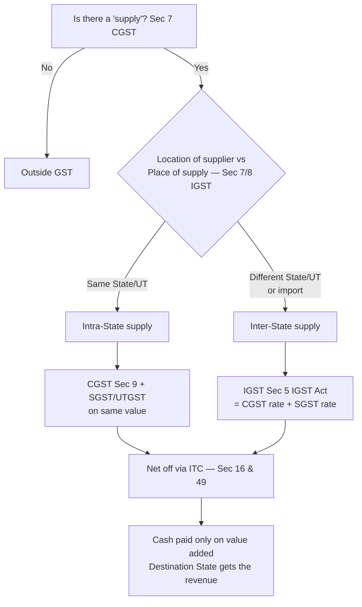

# Q&A — GST — Concept & Framework

> **Amendment / rate-sensitivity flag:** All rates, thresholds and section references below reflect the position generally examined under the **CGST Act, 2017**, **IGST Act, 2017**, **UTGST Act, 2017**, **GST (Compensation to States) Act, 2017** and Article 246A / 279A of the Constitution, as applicable for the current CA-Intermediate attempt. GST is a **notification-driven** law — rate slabs, the ₹40 lakh / ₹20 lakh / ₹10 lakh registration thresholds, the composition turnover limit (₹1.5 cr / ₹75 lakh) and the list of items outside GST (petroleum, alcohol) change frequently. **Re-verify every figure against the latest ICAI Study Material / RTP and CBIC notifications for your attempt.** Unless stated, "Act" means the CGST Act, 2017.

---

## Section A — Concept Check (short Q&A with section/Article citation)

**A1. What single defect of the old indirect-tax regime did GST cure?**
**Cascading** — "tax on tax." Excise/VAT/service tax ran in silos with no cross-credit, so tax paid at one stage became cost at the next. GST is a **destination-based tax on value addition** with a seamless input-tax-credit (ITC) chain [Sec 16, CGST Act] that lets tax flow forward and collapses only the value added at each stage.

**A2. What is the constitutional source of the power to levy GST?**
**Article 246A** (inserted by the 101st Amendment) gives **both Parliament and State Legislatures concurrent power** to make GST laws. **Article 269A** assigns levy/collection of **IGST on inter-State supply** to the Union (apportioned with States). This dual authority is why GST needed a Constitutional amendment, not an ordinary statute.

**A3. Why is GST called a "dual GST"?**
On every **intra-State** supply, the same transaction attracts **CGST (Sec 9, CGST Act)** and **SGST/UTGST** simultaneously on the same value. India adopted dual GST to preserve the **fiscal federalism** of a federal Constitution — the Centre and the States each keep a slice of the same base rather than one surrendering to the other.

**A4. Distinguish the charge under CGST/SGST from IGST.**
- **Intra-State** supply → **CGST + SGST/UTGST** [Sec 9, CGST/UTGST Acts].
- **Inter-State** supply (and imports) → **IGST = CGST rate + SGST rate**, levied under **Sec 5, IGST Act**.
IGST is a single tax that later gets apportioned between Centre and the destination State, avoiding the need to track two taxes across a State border.

**A5. What determines whether a supply is inter-State or intra-State?**
The **location of supplier vs place of supply** [Sec 7 & 8, IGST Act]. Same State → intra-State (CGST+SGST). Different States (or one is a UT/abroad) → inter-State (IGST). This is why "place of supply" rules are the backbone of GST — they decide *which* State gets the money.

**A6. Why is GST "destination-based" and not "origin-based"?**
Because tax accrues to the State where **goods/services are consumed**, not produced. A destination principle stops manufacturing States from hoarding revenue and matches GST's economic logic — it is a **consumption tax** ultimately borne by the final consumer.

**A7. Which taxes were subsumed into GST, and which four items are still outside it?**
Subsumed: central excise, service tax, CVD/SAD, State VAT, entry tax, luxury/entertainment tax, CST, etc. **Outside GST (for now):** (i) **petroleum crude, HSD, petrol, natural gas, ATF** (GST rate notified as *nil* until the Council decides), (ii) **alcoholic liquor for human consumption** (permanently outside — State excise/VAT continues), plus **tobacco** (GST *plus* central excise) and **electricity**.

**A8. What is the role of the GST Council?**
**Article 279A** creates the GST Council (Union FM as chair, State FMs as members) to **recommend** rates, exemptions, thresholds, model laws and dispute-resolution. It is the **cooperative-federalism engine** of GST; decisions need a **75% weighted majority** (Centre 1/3, States 2/3).

**A9. What is the taxable event under GST, and how is it different from the old regime?**
The taxable event is **"supply"** [Sec 7, CGST Act] — a single, unified trigger. It replaced multiple events: *manufacture* (excise), *sale* (VAT) and *provision of service* (service tax). One event removes classification disputes about whether a transaction was a "sale" or a "service."

**A10. How does the input-tax-credit chain prevent cascading?**
Each registered person pays GST on outward supply but sets off GST already paid on inputs/input services/capital goods [Sec 16 read with Sec 49, CGST Act]. Net tax to government = tax on **value added** only. Tax therefore reaches the consumer without compounding at every stage.

**A11. What is the composition scheme in one line, and who is it for?**
**Sec 10, CGST Act** — small suppliers with aggregate turnover up to **₹1.5 crore (₹75 lakh for special-category States)** pay a low flat rate on turnover (e.g., 1% traders, 5% restaurants, 6% eligible service providers) **without ITC** and **cannot make inter-State outward supplies or collect tax** from customers. It trades ITC for compliance simplicity.

**A12. Why are threshold exemptions (₹40L/₹20L/₹10L) built into GST?**
To keep **tiny suppliers out of the compliance net** — the administrative cost of taxing them exceeds the revenue. ₹40 lakh applies to goods suppliers in normal States, ₹20 lakh for services (₹10 lakh for special-category States) [Sec 22, CGST Act].

---

## Section B — Graded Computational / Application Problems (full working, self-checked)

### B1 (Easy) — Splitting the tax between CGST/SGST vs IGST [Sec 9 CGST; Sec 5 IGST]
A supply of goods has a taxable value of **₹1,00,000** and the GST rate is **18%**. Compute the tax if the supply is (a) intra-State, (b) inter-State.

**Answer.**
- Total GST @18% = 1,00,000 × 18% = **₹18,000**.
- **(a) Intra-State:** CGST 9% = ₹9,000 + SGST 9% = ₹9,000 → total **₹18,000**.
- **(b) Inter-State:** IGST 18% = **₹18,000** (single levy).
- **Check:** both routes yield the identical ₹18,000 — GST is rate-neutral to the transaction; only the *sharing* differs. ✔

### B2 (Easy–Moderate) — Cascading vs GST value addition
A product moves Manufacturer → Wholesaler → Retailer. Value added at each stage: Manufacturer **₹1,000**, Wholesaler adds **₹400**, Retailer adds **₹600**. GST rate **10%** (assume intra-State, ignore CGST/SGST split; use total 10%). Compare tax collected under a **no-credit (cascading)** regime vs **GST with ITC**.

**Answer.**
Selling prices (pre-tax): Mfr ₹1,000; WS ₹1,400; Retailer ₹2,000.

*No-credit (tax charged on price incl. earlier tax):*
- Mfr charges 10% on 1,000 = ₹100 → price 1,100.
- WS cost 1,100, adds 400 = 1,500, tax 10% = ₹150 → price 1,650.
- Retailer cost 1,650, adds 600 = 2,250, tax 10% = ₹225 → price 2,475.
- **Total tax collected = 100 + 150 + 225 = ₹475.**

*GST with ITC:*
| Stage | Value added | Output tax | ITC | Net to govt |
|---|---|---|---|---|
| Manufacturer | 1,000 | 100 | 0 | 100 |
| Wholesaler | 400 | 140 | 100 | 40 |
| Retailer | 600 | 200 | 140 | 60 |
| **Total** | **2,000** | | | **200** |

- **Check:** GST net collection ₹200 = 10% × total value added ₹2,000. Cascading collected ₹475 (tax on tax). GST saves ₹275 and the consumer's final price falls from ₹2,475 to ₹2,200. ✔

### B3 (Moderate) — ITC set-off / net cash payable [Sec 49 read with Sec 49A/49B]
For a month, a dealer (intra-State only) has: **Output CGST ₹30,000, Output SGST ₹30,000. ITC available: CGST ₹18,000, SGST ₹22,000.** Compute net cash payable.

**Answer.**
- CGST: output 30,000 − ITC 18,000 = **₹12,000 payable in cash.**
- SGST: output 30,000 − ITC 22,000 = **₹8,000 payable in cash.**
- CGST credit cannot be used against SGST and vice-versa [Sec 49(5)]; no cross-utilisation between the two.
- **Total cash = ₹20,000.** Check: total output 60,000 − total ITC 40,000 = 20,000. ✔

### B4 (Moderate–Hard) — IGST credit cross-utilisation order [Sec 49A, Rule 88A]
A dealer has **Output: IGST ₹10,000, CGST ₹10,000, SGST ₹10,000.** ITC: **IGST ₹30,000, CGST ₹2,000, SGST ₹2,000.** Determine tax payable, applying the rule that **IGST credit must be fully exhausted first** and may be used against IGST → then CGST/SGST in any order.

**Answer.**
- **Step 1 — IGST output:** set off with IGST ITC 10,000 → IGST output nil. IGST ITC left = 30,000 − 10,000 = **20,000**.
- **Step 2 — remaining IGST ITC (20,000)** applied to CGST 10,000 and SGST 10,000 → both wiped out. IGST ITC left = 0.
- **Step 3 — CGST & SGST ITC (2,000 each):** their outputs are already nil, so this credit remains unused and carries forward.
- **Cash payable = ₹0.** Balance in credit ledger c/f: CGST ₹2,000 + SGST ₹2,000 = **₹4,000.**
- **Check:** total output 30,000 fully covered by IGST ITC of 30,000; unused CGST/SGST credit ₹4,000 carried forward. ✔

### B5 (Exam-hard) — Composition scheme eligibility + tax [Sec 10]
Mr. Rao, a trader in Maharashtra (normal State), had **aggregate turnover ₹1.30 crore** last year, all intra-State. In the current year his turnover is **₹90 lakh (goods) + ₹8 lakh (interest on FDs, exempt) + ₹2 lakh (renting of commercial property, a service)**. He wants the composition scheme. (a) Is he eligible? (b) Compute composition tax.

**Answer.**
- **(a) Eligibility:** Last-year aggregate turnover ₹1.30 cr ≤ **₹1.5 cr** → within the limit [Sec 10(1)]. A composition trader may supply services up to **10% of turnover or ₹5 lakh, whichever is higher** [Sec 10(1) proviso]. Here service (renting ₹2 lakh) vs limit = higher of (10% × 1.30 cr = ₹13 lakh) or ₹5 lakh = **₹13 lakh**. ₹2 lakh ≤ ₹13 lakh → **eligible.** All supplies are intra-State (composition bars inter-State outward supply). ✔
- **(b) Tax:** For a **trader**, composition rate = **1% of turnover** (0.5% CGST + 0.5% SGST) on **taxable turnover**. Exempt FD interest is excluded from the tax base for a trader (turnover of taxable supplies). Base = goods ₹90 lakh + renting ₹2 lakh = **₹92 lakh**.
- Composition tax = 1% × 92,00,000 = **₹92,000** (CGST ₹46,000 + SGST ₹46,000).
- He **cannot collect tax** from customers and **cannot claim ITC** [Sec 10(4)]. Check: rate applied to taxable turnover, inter-State bar satisfied, service cap satisfied. ✔

### B6 (Exam-hard) — Registration threshold & aggregate turnover [Sec 22, Sec 2(6)]
Ms. Iyer operates from **Tamil Nadu (normal State)** with: taxable goods supply ₹28 lakh, exempt supply ₹9 lakh, and exports ₹6 lakh. Must she register?

**Answer.**
- **Aggregate turnover** [Sec 2(6)] = taxable + exempt + exports + inter-State — computed **all-India, PAN-based**, excluding GST itself.
- ATO = 28 + 9 + 6 = **₹43 lakh**.
- Threshold for a **supplier of goods in a normal State = ₹40 lakh** [Sec 22 with Notification No. 10/2019-CT].
- ₹43 lakh > ₹40 lakh → **registration is mandatory.**
- **Trap check:** exempt supply and exports **count** toward aggregate turnover even though they bear no/zero tax; ignoring them (28 < 40) would wrongly conclude "no registration." ✔

---

## Section C — Past-Paper-Style Full Questions (model answers)

### C1. "Explain the dual GST model adopted in India and the rationale behind it." (5 marks)

**Model answer.**
India follows a **concurrent dual GST**, sourced in **Article 246A**, under which both the Centre and the States levy GST **simultaneously on the same base**:
1. **Intra-State supply** attracts **CGST** (levied by the Centre under Sec 9, CGST Act) **and SGST/UTGST** (levied by the State/UT under the SGST/UTGST Act) on the same taxable value.
2. **Inter-State supply and imports** attract **IGST** (Centre, under Sec 5, IGST Act), where IGST rate = CGST rate + SGST rate.

**Rationale:** India is a **federal polity**; a single central GST would strip States of fiscal autonomy, while a purely State GST could not tax inter-State trade. The dual model preserves **fiscal federalism** — each government retains a revenue stream — while the **IGST mechanism** ensures a seamless credit chain across State borders and routes revenue to the **destination (consuming) State** via apportionment under **Article 269A**. The **GST Council (Art. 279A)** harmonises rates so the dual structure behaves as one tax to the taxpayer.

### C2. "Describe how GST removes the cascading effect of taxes. Illustrate briefly." (6 marks)

**Model answer.**
Under the pre-GST regime, central and State levies operated in **silos with no cross-credit** (e.g., VAT could not be set off against service tax), so each tax was charged on a base that already included earlier taxes — the **cascading / "tax-on-tax"** effect that inflated the final price.

GST removes cascading through **two design features**:
- **A single taxable event ("supply")** [Sec 7] replacing manufacture/sale/service, and
- **A seamless input-tax-credit chain** [Sec 16 r/w Sec 49] — every registered supplier deducts GST already paid on inputs, input services and capital goods from its output tax, so **only value addition is taxed at each stage**.

*Illustration:* If value added is ₹1,000 (mfr), ₹400 (WS) and ₹600 (retailer) at 10%, GST collects tax only on the running value added — net ₹100 + ₹40 + ₹60 = **₹200 = 10% of ₹2,000 total value added** — whereas a no-credit regime would collect ₹475 by taxing tax. The consumer bears tax **once**, on final consumption value.

### C3. "State which taxes have been subsumed under GST and which supplies remain outside its purview." (5 marks)

**Model answer.**
**Subsumed — Central levies:** Central Excise Duty, Additional Excise Duties, Service Tax, CVD & Special Additional Duty of Customs, Central Surcharges/Cesses relating to supply.
**Subsumed — State levies:** State VAT/Sales Tax, Central Sales Tax, Entry Tax/Octroi, Luxury Tax, Entertainment Tax (except that levied by local bodies), Taxes on lottery/betting, State cesses/surcharges on supply.

**Outside GST:**
- **Alcoholic liquor for human consumption** — permanently outside; State excise & VAT continue.
- **Five petroleum products** — petroleum crude, high-speed diesel, petrol, natural gas and ATF — **constitutionally within GST but taxed at nil GST rate** until the **GST Council** notifies a date; meanwhile central excise + State VAT apply.
- **Electricity** and **immovable property (stamp duty)** remain under existing State taxes.
- **Tobacco** is *within* GST **and** additionally bears central excise duty.
- **Basic Customs Duty** on imports continues (IGST is levied *in addition*).

---

## Section D — MCQs / Case Scenarios (correct option + one-line reasoning)

**D1.** GST in India derives its constitutional authority primarily from:
(a) Article 246 (b) **Article 246A** (c) Article 265 (d) Article 279
**Ans: (b)** — Art. 246A confers concurrent GST-legislating power on Centre and States.

**D2.** On an inter-State supply of goods, the tax levied is:
(a) CGST + SGST (b) SGST only (c) **IGST** (d) CGST only
**Ans: (c)** — Sec 5, IGST Act; inter-State supplies attract a single IGST.

**D3.** GST is best described as a:
(a) Production/origin-based tax (b) **Destination-based consumption tax** (c) Direct tax on income (d) Turnover tax without credit
**Ans: (b)** — revenue accrues to the State of consumption via ITC + destination principle.

**D4.** The GST Council is constituted under:
(a) Sec 9 CGST Act (b) Article 269A (c) **Article 279A** (d) Sec 2(6) CGST Act
**Ans: (c)** — Art. 279A creates the Council; decisions by 75% weighted vote.

**D5.** Which of the following is **NOT** subsumed under GST?
(a) Service tax (b) State VAT (c) **Alcoholic liquor for human consumption** (d) Entry tax
**Ans: (c)** — alcohol for human consumption is constitutionally outside GST.

**D6.** The taxable event under GST is:
(a) Manufacture (b) Sale (c) Provision of service (d) **Supply**
**Ans: (d)** — Sec 7, CGST Act unifies all events into "supply."

**D7. Case scenario.** A furniture dealer in Kerala sells goods worth ₹50,000 (18% GST) to a customer in Kerala. The correct tax is:
(a) IGST ₹9,000 (b) **CGST ₹4,500 + SGST ₹4,500** (c) CGST ₹9,000 (d) SGST ₹9,000
**Ans: (b)** — intra-State supply → CGST 9% + SGST 9% on ₹50,000.

**D8. Case scenario.** A composition dealer (trader) has taxable turnover ₹80 lakh. His composition tax is:
(a) ₹1,44,000 (b) ₹4,00,000 (c) **₹80,000** (d) Nil
**Ans: (c)** — traders pay 1% of turnover under Sec 10 → 1% × ₹80 lakh = ₹80,000 (no ITC, no tax collection).

**D9.** IGST revenue on inter-State supply is apportioned between the Centre and the destination State under:
(a) Article 246A (b) **Article 269A** (c) Sec 9 CGST (d) Sec 10 CGST
**Ans: (b)** — Art. 269A governs levy and apportionment of IGST.

**D10.** The threshold registration limit for a supplier of **goods** in a normal-category State is generally:
(a) ₹10 lakh (b) ₹20 lakh (c) **₹40 lakh** (d) ₹1.5 crore
**Ans: (c)** — ₹40 lakh for goods (₹20 lakh for services); ₹1.5 cr is the composition limit. *(Rate/threshold-sensitive — verify for your attempt.)*

---

## GST charge-decision flow (Mermaid)

---

### One-line first-principles recap
GST replaces a fragmented, cascading regime with **one taxable event (supply)** taxed **concurrently by Centre + State (dual GST)**, made seamless by an **ITC chain** and routed to the **consuming State (destination principle)** — all anchored in **Article 246A / 279A** and worked through the **CGST, SGST/UTGST and IGST Acts, 2017.**
