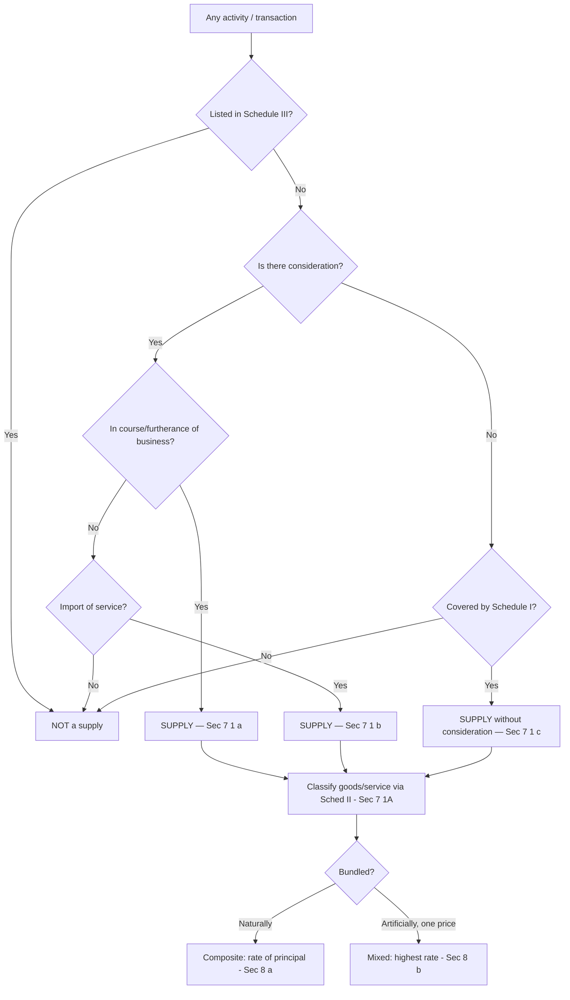

# Q&A — Supply under GST

> Statute basis: **Section 7, Section 8, Schedule I, Schedule II, Schedule III of the CGST Act, 2017** (mirrored in SGST/UTGST/IGST Acts). GST is a tax on **supply** (Art. 246A + Sec 9 CGST/Sec 5 IGST). "Taxable event" = supply, so nothing is taxable unless it first clears the Sec 7 gate.
> **Amendment flag:** Sec 7(1)(d) [Schedule II as a *charging* clause] was **omitted retrospectively w.e.f. 01.07.2017** and Sec 7(1A) inserted (CGST Amendment Act, 2018). Schedule II now only *classifies* (goods vs services) an activity that is *already* a supply — it does NOT decide *whether* it is a supply. Examiners test this constantly.

---

## Section A — Concept Check (short Q&A)

**A1. What is the "taxable event" under GST, and why did the law choose a single event?**
Answer: The taxable event is **supply** [Sec 7, CGST Act]. Pre-GST had multiple events — manufacture (excise), sale (VAT), provision of service (service tax) — causing overlap and cascading. GST replaces all with one unified trigger: *supply*. If there is no supply, there is no charge under Sec 9.

**A2. State the four positive limbs of "supply" under Sec 7(1).**
Answer: (a) **Sec 7(1)(a)** — all forms of supply of goods/services (sale, transfer, barter, exchange, licence, rental, lease, disposal) *made or agreed to be made for a consideration in the course or furtherance of business*; (b) **Sec 7(1)(b)** — **import of services for a consideration** whether or not in course/furtherance of business; (c) **Sec 7(1)(c)** — activities in **Schedule I**, made *without consideration*; (d) **Sec 7(1A)** — once an activity is a supply, Schedule II decides goods vs services.

**A3. Why is Sec 7(1)(b) special compared with 7(1)(a)?**
Answer: 7(1)(a) needs BOTH consideration AND business. 7(1)(b) (import of service) needs consideration but **drops the business test** — even a personal import of a service for consideration is a supply. (If imported *without* consideration, it is generally not supply, unless from a related person / establishment abroad in course of business — Schedule I para 4.)

**A4. Give the general rule for consideration and the two big exceptions.**
Answer: General rule — no consideration, no supply. Exceptions: (i) **Schedule I** activities are supply even *without* consideration [Sec 7(1)(c)]; (ii) import of service from a **related person/distinct establishment** in course of business [Sched I para 4] even without consideration.

**A5. What is a "deemed distinct person" and why does the concept exist?**
Answer: Under **Sec 25(4)/(5)**, each GST registration (each State registration, or separate business verticals) of the same PAN is a **distinct person**. It exists because GST is destination/State-based — value must be captured where it is consumed, so an inter-branch transfer between two registrations is taxed even though it is the same legal entity.

**A6. What does Schedule III do?**
Answer: Schedule III lists activities **treated as neither supply of goods nor supply of services** ("negative list") — e.g., services by an employee to employer in the course of employment, functions of MPs/judges/constitutional posts, sale of land, sale of *completed* building, actionable claims (other than specified actionable claims like lottery/betting/gambling — amendment sensitive), services by a court/tribunal.

**A7. Distinguish Schedule I, II and III in one line each.**
Answer: **Sched I** = supply *even without* consideration (WHEN). **Sched II** = classification goods vs services of things already supply (WHAT KIND). **Sched III** = not a supply at all (OUT).

**A8. Is a gift by an employer to an employee a supply?**
Answer: Gifts by employer to employee are **not** a supply *if* value ≤ ₹50,000 in a financial year (per employee). Gifts **exceeding ₹50,000** in aggregate in the FY are a supply [Sched I para 2, proviso]. (Employment service itself is out under Sched III para 1.)

**A9. Composite vs mixed supply — one-line test [Sec 8].**
Answer: **Composite** = naturally bundled, one principal supply → taxed at rate of the **principal supply** [Sec 8(a)]. **Mixed** = two or more independent supplies bundled for a single price, not naturally bundled → taxed at the **highest rate** among them [Sec 8(b)].

**A10. Amendment check — why is Sec 7(1)(d) not cited any more?**
Answer: It was **omitted retrospectively from 01.07.2017**. Schedule II can no longer *make* something a supply; it only classifies. Always cite **Sec 7(1A)** for the goods-vs-service classification role.

---

## Section B — Graded Computational / Application Problems

### B1 (Easy) — Consideration + business test
Mr. A, a practising lawyer, sells his old personal car to a friend for ₹3,00,000. Is it a supply?
**Solution (step-by-step):**
1. Sec 7(1)(a) needs: (i) consideration — yes, ₹3,00,000; (ii) *in the course or furtherance of business* — NO. The car is a personal asset, not a business asset of his legal practice.
2. Not covered by Sched I (no such deemed entry for personal-asset disposal by an individual).
**Conclusion:** Not a supply. No GST. *(Contrast: if it were a business asset on which ITC had been claimed, disposal even without consideration would be supply under Sched I para 1.)*

### B2 (Easy–Medium) — Schedule I para 1 (business assets)
XYZ Ltd purchased machinery for ₹10,00,000 and claimed ITC of ₹1,80,000. It later **donates** the machinery (nil consideration) to a trust. Is it a supply?
**Solution:**
1. No consideration → 7(1)(a) fails on its face.
2. Check Sched I para 1: "**permanent transfer or disposal of business assets where input tax credit has been availed**" is a supply *even without consideration*.
3. ITC was availed (₹1,80,000). Condition met.
**Conclusion:** It is a supply [Sec 7(1)(c) + Sched I para 1]. GST payable on **open market value** [Rule 27/28 valuation].

### B3 (Medium) — Employer gift threshold
During FY 2025-26, ABC Ltd gives one employee: Diwali gift voucher ₹35,000 + a watch worth ₹40,000. Taxable?
**Solution:**
1. Aggregate gifts in the FY to this employee = 35,000 + 40,000 = **₹75,000**.
2. Sched I para 2 proviso: gifts up to ₹50,000 per employee per FY are **not** supply; **excess is a supply**.
3. Since ₹75,000 > ₹50,000, the gifts are a supply. (In practice the whole amount treated as supply once threshold crossed; per ICAI, the amount exceeding ₹50,000 i.e. ₹25,000 is the taxable portion — follow the exceeds-₹50,000 rule.)
**Conclusion:** Supply arises because aggregate exceeds ₹50,000 [Sched I para 2].

### B4 (Medium) — Distinct persons (stock transfer)
Head office of DEF Ltd (registered in Maharashtra) transfers goods worth ₹5,00,000 to its branch (registered in Karnataka), same PAN, no invoice value charged. Supply?
**Solution:**
1. Maharashtra and Karnataka registrations = **distinct persons** [Sec 25(4)].
2. Sched I para 2: "supply of goods/services between distinct persons as specified in Sec 25, when made **in the course or furtherance of business**" is a supply *even without consideration*.
3. Inter-branch stock transfer for business = covered.
**Conclusion:** Supply [Sec 7(1)(c) + Sched I para 2]. **IGST** payable (inter-State). Value per Rule 28 (open market value / or invoice value acceptable if recipient eligible for full ITC).

### B5 (Medium–Hard) — Composite supply [Sec 8(a)]
A customer buys an air-conditioner for ₹40,000. The price includes **free delivery + 1-year warranty/installation**. AC @ 18%. Compute treatment.
**Solution:**
1. Are these naturally bundled? Yes — you don't buy AC delivery/installation separately in the ordinary course; they are ancillary to the AC.
2. Therefore **composite supply**; principal supply = the AC (goods).
3. Sec 8(a): tax whole ₹40,000 at the **rate of the principal supply = 18%**.
**GST = 40,000 × 18% = ₹7,200.** (No splitting of delivery/installation at other rates.)

### B6 (Hard) — Mixed supply [Sec 8(b)]
A shop sells a **festive hamper** for a single price of ₹5,000: canned foods (12%), chocolates (18%), aerated drinks (28%), fruit juice (12%). Not naturally bundled; can be sold separately. Compute.
**Solution:**
1. Sold together for one price, each item sellable independently → **mixed supply**.
2. Sec 8(b): mixed supply taxed at the **highest rate** applicable to any component. Highest = aerated drinks @ **28%**.
3. GST = 5,000 × 28% = **₹1,400**.
**Note (rate-sensitive):** exact rates change by notification/GST Council; method (highest rate) is the examinable principle.

### B7 (Exam-Hard) — Multi-part reconciliation
GHI Ltd (registered, Delhi) reports the following for a tax period. Identify which are supplies and why. Assume all business context unless stated.
| # | Transaction | Amount (₹) |
|---|-------------|-----------|
| 1 | Sale of goods to customer | 8,00,000 |
| 2 | Free samples to dealers (ITC availed on inputs) | 50,000 |
| 3 | Stock transfer to branch in Haryana (distinct person) | 2,00,000 |
| 4 | Gift to an employee (single, whole FY) | 45,000 |
| 5 | Import of consultancy service from parent company abroad, no consideration, for business | 1,20,000 |
| 6 | Sale of land held as investment | 30,00,000 |

**Solution (item-by-item):**
1. **Supply** — 7(1)(a): consideration + business. Taxable ₹8,00,000.
2. **Not a supply** — free samples given *without* consideration are not covered by Sched I (no distinct-person/related-person link, not a permanent disposal to a person against ITC-avail entry the way para 1 is worded for disposals). But **ITC on those inputs must be reversed** [Sec 17(5)(h) — goods disposed by way of gift/free samples]. So: not an outward supply, but ITC blocked.
3. **Supply** — Sched I para 2, distinct persons in course of business, even without consideration. IGST on ₹2,00,000 (Delhi→Haryana, inter-State).
4. **Not a supply** — ₹45,000 ≤ ₹50,000 gift threshold [Sched I para 2 proviso].
5. **Supply** — Sched I para 4: import of service by a person from a **related person / establishment outside India** in the course of business is supply *even without consideration*. Taxable ₹1,20,000 under **reverse charge** (IGST).
6. **Not a supply** — Sched III para 5: **sale of land** is neither supply of goods nor services.

**Reconciliation:** Taxable supplies to charge GST on = ₹8,00,000 (1) + ₹2,00,000 (3) + ₹1,20,000 (5, RCM) = **₹11,20,000** of value entering the GST net; ₹50,000 samples trigger **ITC reversal** not output tax; ₹45,000 gift and ₹30,00,000 land are fully outside.

---

## Section C — Past-Paper-Style Full Questions

### C1. "Explain the scope of supply under Section 7 of the CGST Act, 2017." (5 marks)
**Model answer:**
Section 7 defines the **scope of supply** — the taxable event for GST.
- **Sec 7(1)(a):** All forms of supply of goods or services — sale, transfer, barter, exchange, licence, rental, lease or disposal — **made or agreed to be made for a consideration** by a person **in the course or furtherance of business**. Two cumulative tests: consideration + business.
- **Sec 7(1)(b):** **Import of services for a consideration**, whether or not in the course or furtherance of business (business test dropped).
- **Sec 7(1)(c):** Activities specified in **Schedule I**, made or agreed to be made **without a consideration** (permanent transfer of business assets with ITC; supplies between related/distinct persons in course of business; principal-agent supplies; import of service from related person abroad).
- **Sec 7(1A):** Where an activity is a supply per 7(1), **Schedule II** determines whether it is a supply of **goods or of services**.
- **Sec 7(2):** Notwithstanding 7(1), activities in **Schedule III**, and notified activities of government as public authority, are **neither** supply of goods nor services.
Thus Sec 7 is a gate: an activity must clear it before Sec 9 charge applies.

### C2. "Distinguish between composite supply and mixed supply with one example each, and state the tax treatment." (5 marks)
**Model answer:**
| Basis | Composite supply [Sec 2(30)] | Mixed supply [Sec 2(74)] |
|-------|------------------------------|--------------------------|
| Bundling | **Naturally** bundled, supplied together in ordinary course | Bundled **artificially** for a single price; can be sold separately |
| Components | One **principal** + ancillary | Two or more independent supplies |
| Tax rate [Sec 8] | Rate of the **principal supply** — Sec 8(a) | **Highest** rate among components — Sec 8(b) |
| Example | Goods + transit insurance + freight sold together | Diwali hamper of sweets, chocolates, drinks for one price |
Treatment: composite is taxed as the principal supply throughout; mixed is taxed wholly at the highest component rate.

### C3. "State any four activities specified in Schedule III that are treated as no supply." (4 marks)
**Model answer (Sched III):**
1. Services by an **employee to employer** in the course of/in relation to employment [para 1].
2. Services by **any court or Tribunal**; functions of **MPs, MLAs, members of local authorities, and holders of constitutional posts** [paras 2–3].
3. **Sale of land** and, subject to Sched II para 5(b), **sale of building after completion certificate / first occupation** [para 5].
4. **Actionable claims**, other than specified actionable claims (lottery, betting, gambling — *amendment sensitive; specified actionable claims are now taxable*) [para 6].
(Also: funeral/burial services; supply of warehoused goods before clearance; high-seas sales.)

### C4. "MNO Ltd, registered in Tamil Nadu, sends goods to its own godown registered in Kerala without charging any amount. The CFO argues no GST since it is the same company and no sale occurs. Advise." (6 marks)
**Model answer:**
The CFO is **incorrect**.
1. Under **Sec 25(4)**, the Tamil Nadu and Kerala registrations of the same PAN are **distinct persons**.
2. **Schedule I para 2** deems a supply of goods between distinct persons, made **in the course or furtherance of business**, to be a supply **even without consideration** [read with Sec 7(1)(c)].
3. Absence of a sale or of consideration is therefore irrelevant; the deeming provision applies.
4. Being inter-State (TN→Kerala), it attracts **IGST** [Sec 7 IGST Act].
5. Value is determined under **Rule 28** (open market value; the invoice value may be accepted where the recipient is eligible for full ITC).
**Advice:** MNO Ltd must raise a tax invoice and pay IGST on the stock transfer.

---

## Section D — MCQs / Case Scenarios

**D1.** Import of service **without consideration** from an unrelated foreign party for personal use is:
a) Supply under 7(1)(b) b) Supply under Sched I c) **Not a supply** d) Mixed supply
**Answer: (c)** — 7(1)(b) needs consideration; Sched I para 4 needs a *related* person. Neither is met.

**D2.** An activity that is a supply is classified as goods or services by:
a) Sched I b) **Sched II [via Sec 7(1A)]** c) Sched III d) Sec 8
**Answer: (b)** — Schedule II classifies; it no longer decides *whether* something is a supply (7(1)(d) omitted).

**D3.** Renting of an immovable commercial property is, under Schedule II:
a) Supply of goods b) **Supply of services** c) No supply d) Composite supply
**Answer: (b)** — Sched II para 2(b): any lease/tenancy/licence to occupy land is a **service**.

**D4.** Gifts by employer to an employee are supply when aggregate FY value exceeds:
a) ₹5,000 b) ₹20,000 c) **₹50,000** d) ₹1,00,000
**Answer: (c)** — Sched I para 2 proviso.

**D5.** A works contract for construction of a building is treated under Schedule II as supply of:
a) Goods b) **Services** c) Both d) Neither
**Answer: (b)** — Sched II para 6(a): works contract is a **supply of services**.

**D6.** Sale of a fully-constructed flat *after* issue of completion certificate is:
a) Supply of goods b) Supply of services c) **No supply (Sched III)** d) Composite supply
**Answer: (c)** — Sched III para 5(b): no supply once completed. (Sale *before* completion = service under Sched II.)

**D7 (Case).** A caterer supplies food + service of serving at a wedding for a lump-sum ₹2,00,000. This is a:
a) Mixed supply, highest rate b) **Composite supply, principal = restaurant/catering service** c) Two separate supplies d) No supply
**Answer: (b)** — naturally bundled; taxed as the catering (service) at its rate [Sec 8(a)].

**D8 (Case).** Buy-1-get-1 toothpaste at a single MRP is best treated as:
a) Two supplies b) **Not two supplies for consideration — single price supply (treat as per the item; effectively one taxable supply, ITC not to be reversed)** c) Mixed supply at highest rate d) Free sample, no supply
**Answer: (b)** — per CBIC circular, "free" item is supplied for the single consideration; it is not a gift, so ITC on it is **not** reversed. (Distinguish from genuine free samples where ITC is reversed under Sec 17(5)(h).)

---

## Mermaid — The Supply Decision Flow

---

## First-Principles Recap
- GST taxes **supply**, nothing else. So every question begins: *is this a supply?* → run the Sec 7 gate.
- Two default tests (consideration + business) can each be waived: business is waived for **import of service** [7(1)(b)]; consideration is waived for **Schedule I** items [7(1)(c)].
- Schedule II answers only *goods or service*; Schedule III kicks activities out entirely.
- Once in, **Sec 8** handles bundling: principal-rate (composite) vs highest-rate (mixed).

## Quick-Revision Sheet
| Provision | Role | Trigger memory hook |
|-----------|------|---------------------|
| Sec 7(1)(a) | General supply | Consideration **+** Business |
| Sec 7(1)(b) | Import of service | Consideration, **no** business needed |
| Sec 7(1)(c) + Sched I | No-consideration supply | Business assets w/ ITC; distinct/related persons; agent; import from related party |
| Sec 7(1A) + Sched II | Goods vs Service | Classify only |
| Sec 7(2) + Sched III | No supply | Employment, land, completed building, actionable claims, court/MP functions |
| Sec 8(a) | Composite | Principal supply rate |
| Sec 8(b) | Mixed | Highest rate |
| Sec 25(4)/(5) | Distinct persons | Each registration = separate person |

**Amendment / rate flags:** (1) Sec 7(1)(d) omitted retrospectively 01.07.2017 — never cite it. (2) "Specified actionable claims" (lottery/betting/gambling/online money gaming) are **taxable** — carve-out from Sched III para 6; watch current-year Finance Act updates. (3) Gift threshold ₹50,000/employee/FY. (4) All GST *rates* (18%, 28% etc.) are notification-driven and Council-revised — reproduce the *method*, verify the *number* against the current rate schedule.
