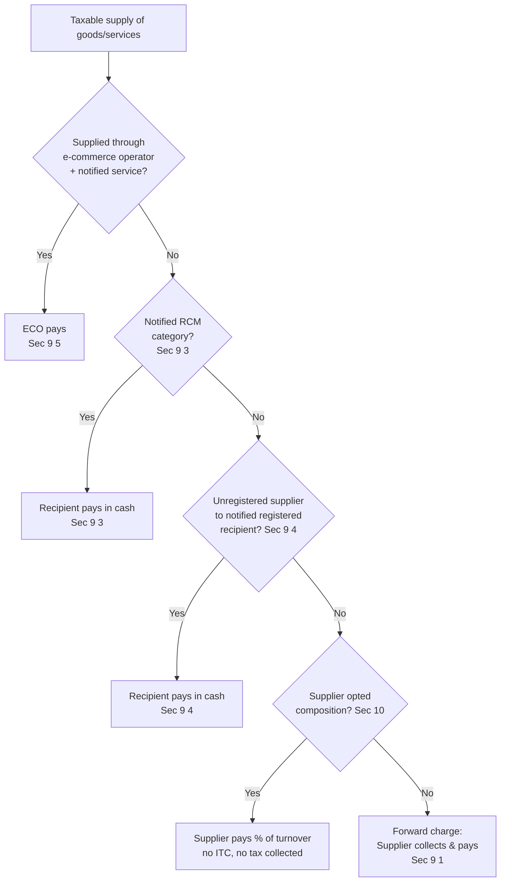

# Q&A — Charge of GST (Levy & Reverse Charge)

> Scope: Charging sections — **Sec 9, CGST Act, 2017** (intra-State) and **Sec 5, IGST Act, 2017** (inter-State); forward charge; reverse charge under **Sec 9(3)/9(4)/9(5) CGST** (and mirror **Sec 5(3)/5(4)/5(5) IGST**); composition levy under **Sec 10, CGST Act**.
> **Amendment/rate sensitivity flag:** RCM notified lists (Notif. 13/2017-CT(R) for services; 4/2017-CT(R) for goods) and composition turnover threshold (₹1.5 crore / ₹75 lakh special-category) are **notification-driven** and change frequently. Always verify against the rates/notifications in force for your attempt. Rates used here are illustrative for method, not for memorisation.

---

## SECTION A — Concept Check (short answer)

**A1. On what does GST get levied, and what is expressly kept outside the levy under Sec 9(1)?**
**Ans.** GST is levied on the **supply** of goods or services or both (Sec 9(1), CGST). It is levied on value determined under Sec 15, at notified rates (max 20% CGST), collected in the prescribed manner, and paid by the **taxable person**. Expressly excluded: supply of **alcoholic liquor for human consumption**. Further, GST on **petroleum crude, high-speed diesel, motor spirit, natural gas and ATF** is deferred to a date to be notified by GST Council (Sec 9(2)).

**A2. Distinguish forward charge and reverse charge in one line each.**
**Ans.** *Forward charge* — the **supplier** collects tax from the recipient and remits it to Government (default rule, Sec 9(1)). *Reverse charge* — the **recipient** of goods/services is liable to pay tax directly to Government (Sec 2(98); charged under Sec 9(3)/9(4)).

**A3. What is the difference between Sec 9(3) and Sec 9(4) RCM?**
**Ans.** **Sec 9(3)** — RCM on **notified categories** of goods/services (e.g., GTA, legal services from advocate, sponsorship), applies regardless of supplier's registration. **Sec 9(4)** — RCM on supplies by an **unregistered supplier to a notified registered recipient** (currently narrow, e.g., promoter/real-estate shortfall purchases). 9(3) is category-based; 9(4) is status-of-supplier-based.

**A4. Can a person paying tax under RCM claim ITC of that tax? Can he use ITC to pay the RCM liability?**
**Ans.** ITC of RCM tax **is available** (subject to normal Sec 16/17 conditions) once tax is paid. But the **RCM liability itself must be discharged in cash** — Sec 49(4) bars using ITC to pay tax payable under reverse charge. (Common trap.)

**A5. Under Sec 9(5), who pays and give examples of notified services.**
**Ans.** For specified services supplied *through* an **e-commerce operator (ECO)**, the **ECO is deemed the supplier** and is liable to pay GST as if it were the supplier. Notified services: (i) passenger transport by radio-taxi/motor cab (Ola/Uber), (ii) accommodation in hotels where the actual supplier is unregistered, (iii) housekeeping (plumber/carpenter) where actual supplier unregistered, (iv) restaurant service supplied through ECO (e.g., Swiggy/Zomato).

**A6. Is a composition dealer allowed to charge tax to customers or claim ITC?**
**Ans.** No. Under Sec 10, a composition taxpayer pays tax at a small % of turnover **out of his own pocket**, **cannot collect tax** from customers (issues bill of supply, not tax invoice), and **cannot claim ITC**.

---

## SECTION B — Graded Computational / Application Problems

### B1 (Easy) — Basic forward-charge output tax
Mr. A, a registered dealer in Telangana, makes an intra-State supply of goods worth **₹1,00,000** taxable at **18%**. Compute his tax.

**Step 1 — Nature:** Intra-State ⇒ CGST + SGST under **Sec 9(1) CGST / State GST**, split equally.
**Step 2 — Rate split:** 18% = 9% CGST + 9% SGST.
**Step 3 — Tax:** CGST = ₹1,00,000 × 9% = **₹9,000**; SGST = **₹9,000**.
**Step 4 — Who pays:** Supplier (forward charge) collects ₹18,000 from buyer, remits to Govt.
**Answer:** CGST ₹9,000 + SGST ₹9,000 = **₹18,000**.

*Self-check:* 9,000 + 9,000 = 18,000 = 18% of 1,00,000. ✓

---

### B2 (Easy–Moderate) — Inter-State vs intra-State
Same ₹1,00,000 @18%, but A (Telangana) supplies to a buyer in Maharashtra.

**Step 1 — Nature:** Inter-State ⇒ **IGST under Sec 5(1) IGST Act**.
**Step 2 — Rate:** IGST = CGST + SGST rate = 18% (single levy).
**Step 3 — Tax:** IGST = ₹1,00,000 × 18% = **₹18,000**.
**Answer:** IGST **₹18,000** (no CGST/SGST). Total tax burden is identical to B1; only the head differs.

*Self-check:* IGST 18,000 = CGST 9,000 + SGST 9,000 of B1. ✓

---

### B3 (Moderate) — Goods Transport Agency under RCM [Sec 9(3)]
XYZ Ltd (registered, Telangana) pays freight of **₹50,000** to a GTA for intra-State transport. GTA has **not** opted for forward charge; applicable rate **5%**. Who pays and how much?

**Step 1 — Trigger:** GTA service to a body corporate is a **Sec 9(3)** notified service (Notif. 13/2017). Where GTA has not opted for 12% forward charge, **recipient pays under RCM @5%**.
**Step 2 — Liability:** XYZ Ltd (recipient) is liable, not the GTA.
**Step 3 — Compute:** Intra-State ⇒ CGST 2.5% + SGST 2.5%. CGST = ₹50,000 × 2.5% = **₹1,250**; SGST = **₹1,250**.
**Step 4 — Payment mode:** Discharge **in cash** (Sec 49(4) bars ITC for RCM). ITC of ₹2,500 available thereafter (subject to Sec 16).
**Answer:** RCM tax = **₹2,500** (₹1,250 + ₹1,250), paid in cash by XYZ Ltd.

*Self-check:* 1,250 + 1,250 = 2,500 = 5% of 50,000. ✓

---

### B4 (Moderate) — Mixed transactions, net RCM cash outflow
Bright Co. (registered, Karnataka) has in a month:
- (a) Legal fees to an advocate: **₹80,000** (intra-State, 18%)
- (b) Sponsorship of an event received from a firm: **₹1,00,000** (intra-State, 18%)
- (c) Rent paid to an unregistered individual landlord for office building: **₹40,000**
- (d) Purchase of stationery from unregistered small trader: **₹10,000**

Determine RCM liability.

**Step 1 — Test each against notified lists (Sec 9(3)/9(4)):**
- (a) Legal services by an advocate to a business entity ⇒ **Sec 9(3) RCM**. Taxable.
- (b) Sponsorship service to a body corporate/partnership firm ⇒ **Sec 9(3) RCM**. Taxable.
- (c) Renting of *commercial* immovable property by an **unregistered** person to a **registered** recipient ⇒ notified under **RCM** (Notif. 13/2017 as amended, entry inserted w.e.f. 10-10-2024). Taxable. *(Amendment-sensitive — verify entry for your attempt.)*
- (d) Ordinary purchase of goods from an unregistered trader ⇒ Sec 9(4) applies **only to notified recipients** (not general). **Not taxable** under RCM here.

**Step 2 — Compute (all intra-State, 18% = 9%+9%):**
| Item | Value | CGST 9% | SGST 9% | RCM tax |
|------|-------|---------|---------|---------|
| (a) Legal | 80,000 | 7,200 | 7,200 | 14,400 |
| (b) Sponsorship | 1,00,000 | 9,000 | 9,000 | 18,000 |
| (c) Comm. rent | 40,000 | 3,600 | 3,600 | 7,200 |
| (d) Stationery | 10,000 | — | — | 0 |
| **Total** | | **19,800** | **19,800** | **39,600** |

**Step 3 — Cash payment:** RCM total **₹39,600 payable in cash** (Sec 49(4)); ITC of ₹39,600 then available (Sec 16) if used for business.
**Answer:** RCM liability = **₹39,600** (CGST ₹19,800 + SGST ₹19,800).

*Self-check:* 14,400 + 18,000 + 7,200 = 39,600; and 19,800 + 19,800 = 39,600. ✓

---

### B5 (Exam-hard) — Composition eligibility, tax, and consequence of crossing threshold
Sunrise Traders (Telangana), a goods trader, had aggregate turnover of **₹1.20 crore** last FY and validly opted for composition. In the **current FY**, quarter-wise turnover of taxable goods is: Q1 ₹35 lakh, Q2 ₹40 lakh, Q3 ₹45 lakh, Q4 ₹40 lakh. Composition rate for a **trader = 1%** (0.5% CGST + 0.5% SGST) on turnover in State. Determine (i) composition tax each quarter, (ii) the point at which he must exit composition, and (iii) treatment thereafter.

**Step 1 — Eligibility (Sec 10(1)):** Threshold for goods trader = **₹1.5 crore** aggregate turnover (₹75 lakh for special-category States). Prior year ₹1.20 cr < ₹1.5 cr ⇒ eligible to opt. ✓
**Step 2 — Rate (Sec 10(1) r/w Rule 7):** Trader = **1% of turnover of taxable supplies in the State**.
**Step 3 — Quarterly tax (paid by dealer, not collected):**
| Qtr | Turnover | Tax @1% | Cumulative TO |
|-----|----------|---------|---------------|
| Q1 | 35,00,000 | 35,000 | 35,00,000 |
| Q2 | 40,00,000 | 40,000 | 75,00,000 |
| Q3 | 45,00,000 | 45,000 | 1,20,00,000 |
| Q4 | 40,00,000 | see below | 1,60,00,000 |

**Step 4 — Crossing the limit:** Composition option **lapses the moment aggregate turnover exceeds ₹1.5 crore** (Sec 10(3)). Cumulative reaches ₹1.5 cr during Q4 (at ₹1.20 cr + ₹30 lakh). From that point he becomes a **regular taxpayer**: must issue **tax invoices**, charge GST at normal rates (say 18% = 9%+9%), and can claim ITC prospectively.
**Step 5 — Q4 tax:** ₹30 lakh of Q4 at composition 1% = **₹30,000**; balance ₹10 lakh as **regular @18% = ₹1,80,000** (CGST ₹90,000 + SGST ₹90,000), with ITC now allowed.
**Answer:** Composition tax = Q1 ₹35,000 + Q2 ₹40,000 + Q3 ₹45,000 + part-Q4 ₹30,000 = **₹1,50,000**; thereafter regular tax on ₹10 lakh = **₹1,80,000**. He exits composition on breaching ₹1.5 cr in Q4.

*Self-check:* Composition portion 1% × ₹1.5 cr = ₹1,50,000. ✓ Regular portion 18% × ₹10 lakh = ₹1,80,000. ✓

> **Rate/threshold flag:** ₹1.5 cr / ₹75 lakh and the 1%/2.5%/6% composition rates are notification-driven — confirm the figures notified for your exam year.

---

## SECTION C — Past-Paper-Style Full Questions

### C1. (Levy + why alcohol/petroleum excluded)
*"Explain the charging provision of the CGST Act. Why are alcoholic liquor and five petroleum products treated differently?"* (5 marks)

**Model answer.**
Under **Sec 9(1), CGST Act, 2017**, CGST is levied on all **intra-State supplies** of goods or services (except alcoholic liquor for human consumption) on the **value under Sec 15**, at rates notified (not exceeding 20%), collected in the prescribed manner and paid by the taxable person. The **inter-State** counterpart is **Sec 5, IGST Act**.
Two carve-outs:
1. **Alcoholic liquor for human consumption** is *constitutionally* outside GST — the States retained exclusive power to tax it (Entry 54, State List) as a revenue-protection measure; it remains under State VAT/excise. It is a **permanent** exclusion.
2. **Five petroleum products** (crude, HSD, motor spirit, natural gas, ATF) are *within* GST's constitutional ambit but the levy is **deferred** under **Sec 9(2)** until the GST Council recommends a date. Until then, Central Excise + State VAT continue. This is a **temporary** (revenue-cushion) suspension, not a permanent exclusion.
The distinction matters because supplies of these items are **non-taxable/exempt for ITC purposes**, affecting apportionment under Sec 17.

---

### C2. (RCM identification — application)
*"For the following, state who is liable to pay GST and under which provision: (i) A firm of advocates provides legal advice to ABC Ltd; (ii) Import of consultancy service from a US firm by an Indian company; (iii) Ola collects fare for a cab ride; (iv) A registered manufacturer buys raw material from a registered supplier."* (4 marks)

**Model answer.**
| # | Transaction | Liable person | Provision |
|---|-------------|---------------|-----------|
| i | Legal service by advocate to business entity | **Recipient (ABC Ltd)** — RCM | Sec 9(3) CGST, Notif. 13/2017 |
| ii | Import of service | **Recipient (Indian co.)** — RCM | Sec 5(3) IGST (import of service is inter-State) |
| iii | Radio-taxi passenger transport via ECO | **ECO (Ola)** deemed supplier | Sec 9(5) CGST |
| iv | Registered-to-registered normal supply | **Supplier** — forward charge | Sec 9(1) CGST |

Note (i) and (ii): tax discharged in **cash**; ITC available thereafter. (iii): ECO pays; the driver does not.

---

### C3. (Composition — full treatment)
*"State the persons NOT eligible for composition levy under Sec 10, and the conditions/restrictions a composition dealer must follow."* (5 marks)

**Model answer.**
**Ineligible persons (Sec 10(2)):** (a) supplier of services other than restaurant service — *except* the marginal service allowance [up to 10% of turnover or ₹5 lakh, whichever higher]; (b) supplier of **non-taxable goods** (e.g., alcohol); (c) person making **inter-State outward supplies**; (d) person supplying **through an e-commerce operator** required to collect TCS; (e) manufacturer of notified goods (e.g., ice cream, pan masala, tobacco, aerated water); (f) casual taxable person / non-resident taxable person.
**Conditions/restrictions (Sec 10(3)–(5)):**
- Cannot **collect tax** from customers; cannot **claim ITC**.
- Must issue **Bill of Supply** with words "composition taxable person, not eligible to collect tax".
- Must display "composition taxable person" on notices/signboard.
- Pays tax at: **1%** (trader/manufacturer, split 0.5+0.5), **5%** (restaurant, 2.5+2.5), **6%** (service provider under Sec 10(2A), 3+3) of turnover.
- Option **lapses** when aggregate turnover exceeds ₹1.5 cr (₹75 lakh special-category); tax then payable under normal provisions.

---

## SECTION D — MCQs / Case Scenarios

**D1.** GST under Sec 9(1) CGST is **NOT** leviable on:
(a) tobacco (b) natural gas — permanently (c) **alcoholic liquor for human consumption** (d) diesel — permanently
**Ans: (c).** Alcohol is permanently outside GST; petroleum products (b, d) are only *deferred*, tobacco (a) is taxable.

**D2.** Tax paid under reverse charge:
(a) can be paid using ITC (b) **must be paid in cash; ITC available afterwards** (c) is never creditable (d) is optional
**Ans: (b).** Sec 49(4) bars ITC for RCM discharge; credit is available post-payment under Sec 16.

**D3.** For restaurant service supplied through Zomato, GST is payable by:
(a) the restaurant (b) the customer under RCM (c) **the e-commerce operator (Zomato)** (d) nobody
**Ans: (c).** Notified under **Sec 9(5)** — ECO is deemed supplier.

**D4.** A composition dealer (trader) with turnover ₹80 lakh pays composition tax of:
(a) 5% (b) 6% (c) **1% (0.5% CGST + 0.5% SGST)** (d) 18%
**Ans: (c).** Traders/manufacturers pay 1%; restaurants 5%; other service providers 6%.

**D5. (Case)** Mr. P, registered in Kerala, pays ₹1,00,000 sponsorship to a partnership firm and ₹60,000 legal fees to an advocate, both intra-State @18%. His RCM cash liability is:
(a) ₹18,000 (b) ₹10,800 (c) **₹28,800** (d) ₹0
**Ans: (c).** Both are Sec 9(3) services. (1,00,000+60,000)×18% = ₹28,800 (CGST ₹14,400 + SGST ₹14,400), paid in cash.

**D6. (Case)** ABC Ltd opted for composition but made an inter-State outward supply worth ₹2 lakh. Consequence:
(a) allowed, pay 1% (b) **ineligible — inter-State outward supply violates Sec 10(2)(c); becomes regular taxpayer** (c) pay IGST at 1% (d) exempt
**Ans: (b).** Composition prohibits inter-State outward supplies.

**D7.** RCM under **Sec 9(4)** currently applies:
(a) to all purchases from unregistered dealers (b) **only to notified classes of registered recipients (e.g., promoters in real estate)** (c) never (d) only to imports
**Ans: (b).** The blanket 9(4) was suspended; it now applies only to notified recipients.

---

## Decision Flow — Who Pays the GST?

---

## Exam Trap Checklist
1. **RCM ≠ ITC to pay** — always cash (Sec 49(4)); credit only *after*.
2. **9(3) vs 9(4)** — category-based vs unregistered-supplier-to-notified-recipient.
3. **Petroleum/natural gas = deferred**, not exempt; **alcohol = permanently outside**.
4. **Composition dealer** — bill of supply, no tax collection, no ITC; **no inter-State outward** supply.
5. **Sec 9(5) ECO** — operator pays *as if* supplier; the underlying driver/restaurant does not.
6. Threshold/rate figures are **notification-driven** — verify for the exam year.
