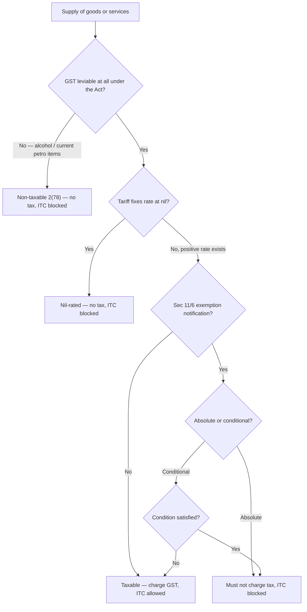

# Q&A — Exemptions from GST

> CGST Act, 2017 and IGST Act, 2017. **Every exemption entry, room-rent limit, hotel-tariff slab, threshold and rate below is amendment-sensitive — GST exemptions change almost every Council meeting. Rates used in sums are illustrative; lock in the exact current entries and limits from the ICAI Study Material/RTP for your attempt.** The logic and section structure are amendment-agnostic.

---

## SECTION A — Concept-Check (Short Q&A)

**A1. From which section does the power to exempt flow, and why is exemption done by notification rather than written into the Act?**
**Sec 11 CGST / Sec 6 IGST** (and Sec 8 UTGST). The Government, on the GST Council's recommendation and if satisfied it is in the *public interest*, may exempt by **notification**. It is delegated legislation rather than statute because essentials change frequently and the Council must add/remove entries fast without amending the Act. Sub-sections: **11(1)** general notification (wholly/partly; absolute/conditional), **11(2)** special order for exceptional circumstances (emergency), **11(3)** explanation with **retrospective** effect issued within **one year**.

**A2. Define "exempt supply" and state why three different things are folded into one definition.**
**Sec 2(47)** — supply that (a) attracts a **nil rate**, or (b) is **wholly exempt** under Sec 11/6, **and includes non-taxable supply.** All three (nil-rated, notified-exempt, non-taxable) are grouped together because they share the same two consequences: **ITC is blocked** (Sec 17(2)) and the value **still counts in aggregate turnover** (Sec 2(6)). One definition saves the Act from writing the same consequence three times.

**A3. What is a "non-taxable supply" and give examples?**
**Sec 2(78)** — a supply on which GST is **not leviable at all** under the Act, i.e. outside the charging section. Examples: **alcoholic liquor for human consumption**, and the currently out-of-GST petroleum items (petrol, diesel, ATF, natural gas, crude) which remain under VAT/excise. Note: it is *included* in "exempt supply" per 2(47), so it blocks ITC and counts in turnover.

**A4. Distinguish absolute from conditional exemption, and state the consequence of each.**
**Absolute** = no conditions attached; the exemption is **mandatory** — the supplier **cannot opt to pay tax**. If tax is wrongly charged, the recipient's **ITC is ineligible**. Example: transmission/distribution of electricity by a utility. **Conditional** = available only if a stated condition is met; miss the condition and the supply becomes **taxable**. Example: hotel accommodation exemption up to a specified value per unit per day.

**A5. Name the four flagship exemption/rate notifications.**
Goods: rates **1/2017-CT(R)**; exempt goods **2/2017-CT(R)**. Services: rates **11/2017-CT(R)**; **exempt services 12/2017-CT(R)** (the single most exam-relevant document — a numbered list of service entries, each with description, condition, and sometimes definitions). Parallel IGST versions exist (e.g. 9/2017-IT(R)).

**A6. The Big Four all show 0% output tax — which one keeps ITC, and why?**
Only **zero-rated** (exports / SEZ supplies, **Sec 16 IGST**) preserves ITC. Nil-rated, exempt and non-taxable all **block ITC** (Sec 17(2)). Reason: zero-rating exists so India does **not export its taxes** — goods must be taxed in the country of *consumption*, so embedded input tax is **refunded**, not buried. The other three are domestic-relief measures where the buried input tax is an accepted cost. *Golden line: exempt = tax dies and credit dies; zero-rated = tax dies but credit lives.*

**A7. Does making an exempt supply require registration?**
A person making **only exempt supplies** is **not liable to register** (Sec 23). But exempt turnover **counts in aggregate turnover** (Sec 2(6)), so the moment one taxable supply appears, all turnover — exempt included — is aggregated for the Sec 22 threshold test.

**A8. What document is issued for an exempt supply, and can tax be collected on it?**
A **bill of supply**, not a tax invoice (**Sec 31(3)(c)**). The registered person **must not collect any amount as tax** on an exempt supply (**Sec 32**).

**A9. Is a private coaching centre exempt like a school?**
No. Only an **"educational institution"** (pre-school to higher secondary; institution providing education for a **recognised qualification**; approved vocational courses) is exempt for services to its students/faculty/staff. A private coaching/tuition centre leads to **no recognised qualification** and is therefore **taxable**.

**A10. On a bank loan, what is exempt and what is taxable?**
Services by way of extending deposits/loans **where the consideration is by way of interest or discount** are **exempt** — so the *interest* is exempt. But **processing/documentation charges** are a separate taxable consideration. Split them: interest exempt, fees taxable.

---

## Exemption decision map

---

## SECTION B — Graded Computational Problems

### B1 (Easy) — Exempt output blocks ITC
*Wellness Clinic Pvt Ltd* provides **health care services** (exempt). In a month it buys consumables ₹10,00,000 + GST @12% and pays premises rent ₹2,00,000 + GST @18%; it bills patients ₹25,00,000. Compute output GST, ITC available and the economic effect.

**Solution.**

| Item | Amount (₹) |
|---|---|
| Output — health care (exempt supply) | 25,00,000 |
| **Output GST** (exempt → nil) | **0** |
| Input GST paid (1,20,000 + 36,000) | 1,56,000 |
| **ITC available** — Sec 17(2), inputs used for exempt supply | **0 (fully blocked)** |
| Net GST payable | 0 |
| **Un-creditable input tax absorbed as cost** | **1,56,000** |

Patients pay no GST, but the clinic swallows ₹1,56,000 of input tax it can never recover and recoups it through higher prices. **Exemption at the consumer end helps the consumer but leaves buried input tax** — the "exemption is not a pure gift" point in numbers.

### B2 (Moderate) — Conditional exemption tested per unit
*StayEasy* lodge lets rooms in a day: 20 rooms @ ₹900/day and 10 rooms @ ₹1,500/day. Assume the accommodation exemption applies where value per unit **≤ ₹1,000/day** (illustrative — verify current limit); taxable rooms bear GST @12%. Compute exempt value, taxable value and GST.

**Solution.**

| Category | Rooms | Rate/day (₹) | Value (₹) | Treatment | GST (₹) |
|---|---|---|---|---|---|
| ≤ ₹1,000 unit | 20 | 900 | 18,000 | **Exempt** (condition met) | 0 |
| > ₹1,000 unit | 10 | 1,500 | 15,000 | **Taxable** @12% (condition failed) | 1,800 |
| **Total** | 30 | — | 33,000 | — | **1,800** |

The *same service* is exempt for cheap rooms and taxable for pricier ones — the **condition (price per unit)** decides. Exempt value ₹18,000; GST payable ₹1,800. Conditional exemptions must be tested **line by line**.

### B3 (Hard) — Rule 42 apportionment of common ITC
*EduServe LLP* runs (i) a recognised higher-secondary school (**exempt** output ₹40,00,000) and (ii) a commercial coaching centre (**taxable** output ₹60,00,000, GST @18%). Common input services (admin, IT, audit) bore input GST of ₹2,00,000, treated wholly as common credit. Compute the ITC reversal and net GST payable.

**Solution — Rule 42 (Sec 17(2)).** Common credit is apportioned in the ratio of exempt turnover to total turnover; the exempt portion is reversed.

| Step | Amount (₹) |
|---|---|
| Total turnover (40,00,000 + 60,00,000) | 1,00,00,000 |
| Exempt turnover (school) | 40,00,000 |
| Exempt ratio = 40 / 100 | 0.40 (40%) |
| Common ITC (C2) | 2,00,000 |
| **ITC to reverse** (D1 = 40% × 2,00,000) | **80,000** |
| **ITC allowed** (2,00,000 − 80,000) | **1,20,000** |

**Output side (coaching):**

| Item | Amount (₹) |
|---|---|
| Output GST @18% on 60,00,000 | 10,80,000 |
| Less: eligible common ITC | (1,20,000) |
| **Net GST payable** | **9,60,000** |

Reconciles: 80,000 reversed + 1,20,000 allowed = 2,00,000. **Any exempt output forces proportionate reversal of common ITC** — even when most output is taxable.

### B4 (Exam-hard) — Zero-rated vs Exempt: ITC treatment flips
*TexPort Ltd* has two divisions, each buying inputs ₹50,00,000 + IGST @18% = ₹9,00,000. **Division A** exports garments (₹80,00,000) — **zero-rated** under **LUT without payment of tax**. **Division B** makes **exempt** domestic supplies (₹80,00,000). Compare ITC outcome and cash effect.

**Solution.**

| | Division A (Zero-rated export) | Division B (Exempt supply) |
|---|---|---|
| Output tax | 0 (zero-rated) | 0 (exempt) |
| Input IGST paid | 9,00,000 | 9,00,000 |
| ITC status | **Preserved — Sec 16 IGST** | **Blocked — Sec 17(2)** |
| Refund of unutilised ITC (under LUT) | **9,00,000 refundable** | Nil |
| Input tax becoming a cost | **0** | **9,00,000** |

Same 0% output, opposite result. The exporter recovers **every rupee** (refund) → export truly tax-free; the exempt supplier **loses all ₹9,00,000** to cost. **Never conflate "exempt" with "zero-rated."**

### B5 (Exam-hard) — Aggregate turnover, registration and the split-supply trap
*Mr. Bose* (single State) supplies in a year: fresh vegetables (exempt) ₹28,00,000; interest on loans given (exempt) ₹3,00,000; and taxable stationery ₹6,00,000. Assume registration threshold ₹20,00,000 (verify). Is he liable to register, and on what does he pay tax?

**Solution.**
Aggregate turnover (Sec 2(6)) = exempt + taxable = 28,00,000 + 3,00,000 + 6,00,000 = **₹37,00,000**, which **exceeds ₹20,00,000 → registration required (Sec 22).** Had he made *only* the exempt supplies, Sec 23 would exempt him from registration; but the ₹6,00,000 taxable supply drags **all** turnover into the threshold test. He pays GST **only on the ₹6,00,000 taxable stationery**; the vegetables (exempt goods) and interest (exempt service) bear no tax, are billed on a **bill of supply** (Sec 31(3)(c)), and block ITC on their related inputs. **Exempt turnover can force registration even though no tax is owed on it.**

---

## SECTION C — Past-Paper-Style Full Questions

### C1. "State with reasons whether GST is payable" (8 marks)
Determine taxability, citing the governing idea:
(a) Transportation of a patient by ambulance;
(b) Hair transplant / cosmetic surgery;
(c) Services by a private IIT-JEE coaching centre;
(d) Loading, unloading and warehousing of agricultural produce;
(e) Transmission of electricity by a distribution utility;
(f) Interest on a term loan sanctioned by a bank;
(g) Processing fee charged on that loan;
(h) Renting of a residential dwelling for use as residence to an unregistered person.

**Model answer.**
(a) **Exempt** — health-care-related transport of a patient in an ambulance (Notif. 12/2017 entry).
(b) **Taxable** — cosmetic/plastic surgery and hair transplant are outside "health care services" unless done to restore anatomy affected by trauma/congenital defect.
(c) **Taxable** — a private coaching centre is not an "educational institution" (no recognised qualification).
(d) **Exempt** — services relating to cultivation/rearing include warehousing, loading/unloading and packing of agricultural produce.
(e) **Exempt (absolute)** — transmission/distribution of electricity by an electricity utility.
(f) **Exempt** — extending a loan where consideration is interest/discount.
(g) **Taxable** — processing fee is a distinct consideration, not interest.
(h) **Exempt** — renting of a residential dwelling for use as a residence to an unregistered person (position for registered recipients is under **RCM**, not exemption — verify current wording).

### C2. Distinguish and explain (6 marks)
"An exemption and a zero-rated supply both result in nil output tax, yet they are opposites." Explain, citing sections, with a one-line numeric illustration.

**Model answer.**
Both charge **0% on output**, but the **ITC treatment is opposite**. Under **exemption (Sec 11/6, blocked by Sec 17(2))**, input tax cannot be recovered and becomes a **cost buried in the price** — the purpose is domestic relief on essentials, where a little cascading is accepted. Under **zero-rating (Sec 16 IGST)** for exports/SEZ, the ITC is **expressly preserved and refundable** (either LUT-without-tax + refund of unutilised ITC, or pay-IGST + refund) — the purpose is to *not export India's taxes* so exports stay globally competitive. *Illustration:* on ₹9,00,000 input tax with nil output, an exempt supplier loses ₹9,00,000 to cost; an exporter gets ₹9,00,000 refunded. Same output, opposite cash effect.

### C3. Structure question (5 marks)
Explain the structure of **Section 11 of the CGST Act** and the meaning of "wholly/partly" and "absolutely/conditionally."

**Model answer.**
**11(1)** — general exemption by **notification**, on Council recommendation, in public interest; may be **wholly** (100%, nil) or **partly** (concessional rate), and **absolutely** (mandatory, no option to pay tax) or **conditionally** (only if conditions met). **11(2)** — exemption by **special order** under exceptional circumstances (emergency, e.g. disaster relief). **11(3)** — the Government may add an **explanation** to a notification within **one year**, effective **retrospectively**. Key nuance: **partly exempt = still taxable at the lower rate → ITC is NOT blocked**; only **wholly** exempt blocks ITC.

---

## SECTION D — MCQs / Case Scenarios

**D1.** Which supply is *not* an "exempt supply" under Sec 2(47)?
A) Nil-rated grain  B) Health care exempt by notification  C) Export of goods (zero-rated)  D) Alcoholic liquor for human consumption
**Answer: C.** Zero-rated supplies keep ITC and are governed by Sec 16 IGST — they are excluded from the 2(47) definition; the other three are included.

**D2.** A registered person makes a wholly exempt supply. He must issue —
A) Tax invoice  B) Bill of supply  C) Debit note  D) Receipt voucher
**Answer: B.** Sec 31(3)(c) — a bill of supply is issued for exempt supplies, and no tax may be collected (Sec 32).

**D3.** Common input tax of ₹1,00,000; exempt turnover ₹30 lakh, taxable ₹70 lakh. ITC to be reversed under Rule 42 is —
A) ₹30,000  B) ₹70,000  C) ₹1,00,000  D) Nil
**Answer: A.** Reversal = (30/100) × 1,00,000 = ₹30,000 (exempt-turnover ratio).

**D4.** Tax is wrongly charged on an **absolutely** exempt supply. The recipient's ITC on it is —
A) Fully available  B) Ineligible  C) Available at 50%  D) Refundable
**Answer: B.** Absolute exemption is mandatory; ITC on tax that ought not to have been charged is ineligible.

**D5.** A person makes *only* exempt supplies of ₹50 lakh. He is —
A) Compulsorily registered  B) Not liable to register (Sec 23)  C) Liable under RCM  D) A casual taxable person
**Answer: B.** Sec 23 — a person exclusively making exempt supplies need not register, even above the threshold.

**D6.** Which is **taxable**?
A) Interest on a loan  B) Loan processing fee  C) Metered auto-rickshaw ride  D) Toll charges for a bridge
**Answer: B.** Interest, public transport and tolls are exempt; the processing fee is a distinct taxable consideration.

**D7.** *Case:* A hospital rents shop space to a doctor for a clinic. This renting is —
A) Exempt as health care  B) Taxable (renting of premises, not health care)  C) Zero-rated  D) Non-taxable
**Answer: B.** Health-care exemption covers treatment of patients, not commercial renting of premises.

**D8.** "Partly exempt" supply means —
A) 0% and ITC blocked  B) Concessional rate, still taxable, ITC allowed  C) Outside GST  D) Zero-rated with refund
**Answer: B.** Partly exempt = a lower positive rate = still a taxable supply, so ITC is not blocked.

---

### Top traps recap
Nil-rated ≠ zero-rated (only zero-rated keeps ITC); non-taxable supply is *still* an "exempt supply" (counts in turnover, blocks ITC); interest exempt but fees taxable; coaching ≠ education; conditional limits (hotel/GTA/charity/religious rent) must be tested per unit; **any** exempt output triggers Rule 42 reversal; absolute exemption is mandatory and its wrongly-charged tax gives no ITC.

> *Final reminder: exemption entries, room-rent limits, hotel-tariff slabs, thresholds and RCM boundaries are amended frequently. Confirm the exact current text from the latest ICAI Study Material and amendments for your attempt.*
