# Q&A — Time of Supply

> **Law flag:** All section references are to the **CGST Act, 2017** unless stated; the same rules apply mutatis mutandis to the IGST Act, 2017 via **Sec 20 IGST**. Time of Supply (TOS) fixes the **rate, and the tax-period/return** in which the liability crops up. **Amendment sensitivity:** for **goods under forward charge, Notification 66/2017-CT (dated 15-11-2017) removed GST on advances** — so despite the literal words of Sec 12(2), a normal supplier of goods pays tax on the **invoice/removal date only**, not on advances. Advances **for services remain fully taxable** (Sec 13). Composition dealers are outside 66/2017. Re-verify every figure against the ICAI Study Material / RTP for your attempt. Rate-change questions turn on **Sec 14**.

---

## Section A — Concept Check (short Q&A with section citation)

**A1. Why does GST need a "time of supply" at all?**
GST is a **transaction tax charged period-by-period**. The charging section (Sec 9 CGST / 5 IGST) says tax "shall be levied" but is silent on *when* the liability arises. TOS (**Sec 12 for goods, Sec 13 for services, Sec 14 for rate change**) supplies that missing date — it fixes the **tax period** for GSTR-3B and the **rate** to apply.

**A2. State the general TOS for goods under forward charge [Sec 12(2)].**
Earlier of (a) **date of issue of invoice** or the **last date on which invoice was required u/s 31(1)**, or (b) **date of receipt of payment**. **But** by **Notification 66/2017-CT**, clause (b) is switched off for goods — so effectively TOS = **date of invoice / last date to issue it**.

**A3. When must an invoice for goods be issued [Sec 31(1)]?**
Where supply **involves movement** — **before or at the time of removal**. Where there is **no movement** — **before or at delivery / making available** to the recipient. This "last date" is what plugs into Sec 12(2)(a).

**A4. State the general TOS for services under forward charge [Sec 13(2)].**
- If invoice issued **within** the Sec 31(2) period (normally **30 days**, **45 days** for banks/NBFC/insurers): earlier of **invoice date** or **payment date**.
- If invoice **not** issued in time: earlier of **date of provision of service** or **payment date**.
- If neither works: **date recipient shows receipt in his books**.
Note advances for services **are** taxable (no 66/2017 relief).

**A5. What is the "date of receipt of payment"?**
Earlier of **(i) date the payment is entered in the supplier's books** or **(ii) date it is credited to his bank account** [Explanation to Sec 12/13].

**A6. Give the reverse-charge TOS for goods [Sec 12(3)].**
**Earliest** of (a) **date of receipt of goods**, (b) **date of payment** (per books or bank debit, earlier), or (c) **date immediately following 30 days from the invoice date**. If none is determinable → **date of entry in the recipient's books**.

**A7. Give the reverse-charge TOS for services [Sec 13(3)].**
**Earlier** of (a) **date of payment**, or (b) **date immediately following 60 days from invoice date**. If not determinable → **date of entry in recipient's books**. For an **associated enterprise** where the supplier is **outside India** → earlier of **date of entry in recipient's books** or **date of payment**. (Note **60 days for services vs 30 days for goods**, and receipt-of-goods has **no service equivalent**.)

**A8. How is TOS of vouchers determined [Sec 12(4)/13(4)]?**
If the **supply is identifiable at the time of issue** of the voucher → **date of issue**. Otherwise → **date of redemption**.

**A9. What is the residual TOS [Sec 12(5)/13(5)]?**
Where TOS cannot be fixed by the above: if a **periodical return** is to be filed → **due date of that return**; in any other case → **date of payment of tax**.

**A10. TOS for interest, late fee or penalty for delayed payment of consideration [Sec 12(6)/13(6)]?**
The **date on which the supplier receives** such addition to value. (Only that extra amount, not the whole invoice, is re-timed.)

**A11. Under Sec 14, which events decide the rate on a change of tax rate?**
Three events — **(1) supply, (2) invoice, (3) receipt of payment**. The **rate is fixed by whichever two of the three fall on the same side** of the rate-change date; TOS is then the earlier of the two "new-side" events (or the single relevant event).

**A12. Sec 14 proviso on payment date near a rate change?**
"Date of receipt of payment" is the **date of credit in the bank account** if such credit is **after four working days** from the date of change in rate of tax (else the normal earlier-of-books/bank rule).

---

## Section B — Graded Computational Problems (full working, self-checked)

### B1 (Easy) — Goods, forward charge, advance received [Sec 12(2) + Notn 66/2017]
Supplier removes goods and issues invoice on **10 Aug**. It had received an **advance of ₹50,000 on 2 Aug**; balance paid **20 Aug**. Find TOS.

**Answer.** For goods under forward charge, **Notification 66/2017-CT** switches off the "receipt of payment" limb. So the advance of 2 Aug is **ignored**. TOS = **date of invoice = 10 Aug** [Sec 12(2)(a)].
*Trap check:* students who apply the literal "earlier of invoice/payment" would wrongly say 2 Aug for the ₹50,000. ✔

### B2 (Easy) — Services, forward charge, advance received [Sec 13(2)]
A consultant provides service and issues invoice **12 Sep** (within 30 days of completion **5 Sep**). He received an **advance ₹20,000 on 1 Sep**; balance ₹80,000 on **15 Sep**. Find TOS.

**Answer.** Services have **no 66/2017 relief**, so advances are taxable.
- On ₹20,000 advance: earlier of invoice (12 Sep) or payment (1 Sep) → **1 Sep** [Sec 13(2)(a)].
- On ₹80,000 balance: earlier of invoice (12 Sep) or payment (15 Sep) → **12 Sep**.
TOS: **₹20,000 → 1 Sep; ₹80,000 → 12 Sep.** ✔

### B3 (Moderate) — Services, invoice issued late [Sec 13(2)(b)]
Service completed **5 June**; invoice issued **20 July** (i.e. **beyond 30 days**). Full payment received **25 July**. Find TOS.

**Answer.** Since invoice was **not issued within 30 days**, limb (a) fails and limb (b) applies: earlier of **date of provision of service (5 June)** or **payment (25 July)** → **5 June** [Sec 13(2)(b)].
*Reason:* late invoicing cannot be rewarded with a later TOS. ✔

### B4 (Moderate) — Reverse charge on goods [Sec 12(3)]
Registered recipient buys goods under RCM. Invoice by supplier **1 Oct**; goods received **20 Oct**; payment made **5 Nov**. Find TOS.

**Answer.** Earliest of:
- (a) receipt of goods = **20 Oct**
- (b) payment = **5 Nov**
- (c) 30 days after invoice = 1 Oct + 30 = **31 Oct**
Earliest = **20 Oct** [Sec 12(3)]. ✔

### B5 (Moderate) — Reverse charge on goods, all dates late [Sec 12(3)(c)]
Under RCM for goods: invoice **1 Oct**; goods received **15 Nov**; payment **10 Dec**. Find TOS.

**Answer.** (a) 15 Nov; (b) 10 Dec; (c) 31 Oct (30 days after 1 Oct). Earliest = **31 Oct** — the **"30-days" limb bites** because the recipient sat on the goods and payment. [Sec 12(3)(c)] ✔

### B6 (Moderate) — Reverse charge on services [Sec 13(3)]
RCM service: supplier's invoice **1 Aug**; payment **20 Sep**. Find TOS.

**Answer.** Earlier of:
- (a) payment = **20 Sep**
- (b) 60 days after invoice = 1 Aug + 60 = **30 Sep**
Earlier = **20 Sep** [Sec 13(3)]. If payment had instead been on 5 Oct, TOS would be **30 Sep** (the 60-day limb). ✔

### B7 (Moderate) — Import of service from associated enterprise [Sec 13(3) proviso]
Indian Co. receives service from its **foreign associated enterprise**. Entry in recipient's books **10 May**; payment **25 August**. Find TOS.

**Answer.** For associated enterprise with supplier **outside India**, TOS = earlier of **date of entry in books (10 May)** or **payment (25 Aug)** → **10 May**. The 60-day rule does **not** apply to associated enterprises. ✔

### B8 (Moderate) — Vouchers [Sec 12(4)/13(4)]
(i) A retailer issues a **₹1,000 gift voucher redeemable only against a specific TV model** on **1 Jan**, redeemed **10 Feb**. (ii) A departmental store issues a **₹1,000 general voucher** on **1 Jan** usable against anything, redeemed **10 Feb**. Find TOS in each.

**Answer.**
- (i) Supply **identifiable at issue** (specific TV) → TOS = **date of issue = 1 Jan**.
- (ii) Supply **not identifiable at issue** → TOS = **date of redemption = 10 Feb**.
[Sec 12(4)/13(4)] ✔

### B9 (Moderate) — Interest for delayed payment [Sec 13(6)]
Invoice value ₹1,00,000 (TOS already fixed at 5 April). Customer pays **60 days late** and, per contract, pays **₹2,000 interest**, received on **20 July**. What is the TOS of the ₹2,000?

**Answer.** TOS of the interest = **date the supplier receives it = 20 July** [Sec 13(6)]. Only the ₹2,000 addition is re-timed; the ₹1,00,000 keeps its 5 April TOS. ✔

### B10 (Exam-Hard) — Change in rate of tax, full Sec 14 grid
Rate changed from **18% to 12% w.e.f. 1 October**. Examine the following independent cases (payment credited to bank within 4 working days each). State the applicable rate and TOS.

| Case | Supply | Invoice | Payment |
|---|---|---|---|
| (a) | 25 Sep (before) | 5 Oct (after) | 8 Oct (after) |
| (b) | 25 Sep (before) | 28 Sep (before) | 8 Oct (after) |
| (c) | 25 Sep (before) | 5 Oct (after) | 28 Sep (before) |
| (d) | 5 Oct (after) | 28 Sep (before) | 25 Sep (before) |
| (e) | 5 Oct (after) | 28 Sep (before) | 8 Oct (after) |
| (f) | 5 Oct (after) | 5 Oct (after) | 28 Sep (before) |

**Answer** — rule: the two events on the **same side** as each other decide the rate; TOS = **earlier of the two events falling *after* the rate change** (Sec 14).

| Case | Two events deciding | Rate | TOS |
|---|---|---|---|
| (a) supply before; invoice & payment after | invoice + payment (both after) | **12% (new)** | earlier of 5 Oct & 8 Oct = **5 Oct** |
| (b) supply before; invoice before; payment after | supply + invoice before | **18% (old)** | **28 Sep** (invoice) |
| (c) supply before; payment before; invoice after | supply + payment before | **18% (old)** | **28 Sep** (payment) |
| (d) supply after; invoice & payment before | invoice + payment before | **18% (old)** | earlier of 28 Sep & 25 Sep = **25 Sep** |
| (e) supply after; invoice before; payment after | supply + payment after | **12% (new)** | **8 Oct** (payment) |
| (f) supply after; payment before; invoice after | supply + invoice after | **12% (new)** | **5 Oct** (invoice) |

*Self-check:* whenever **two of {supply, invoice, payment} lie before 1 Oct → old 18%**; whenever two lie after → **new 12%**. TOS is always the earlier of the post-change events (or the single decisive one). ✔ [Sec 14]

---

## Decision flow — which TOS rule applies

```mermaid
flowchart TD
    A[Transaction] --> B{Rate changed<br/>around this supply?}
    B -- Yes --> C[Sec 14: use 2-of-3<br/>supply / invoice / payment]
    B -- No --> D{Goods or Services?}
    D -- Goods --> E{Charge type?}
    D -- Services --> F{Charge type?}
    E -- Forward --> G[Sec 12&#40;2&#41;: date of invoice /<br/>last date u/s 31; advances ignored - Notn 66/2017]
    E -- Reverse --> H[Sec 12&#40;3&#41;: earliest of<br/>receipt / payment / 30 days after invoice]
    F -- Forward --> I[Sec 13&#40;2&#41;: earlier of invoice or payment;<br/>if invoice late, provision date or payment]
    F -- Reverse --> J[Sec 13&#40;3&#41;: earlier of payment or<br/>60 days after invoice]
    G --> K{Voucher?}
    I --> K
    K -- Yes --> L[Sec 12/13&#40;4&#41;: issue if identifiable,<br/>else redemption]
    K -- No --> M{Still undetermined?}
    M -- Yes --> N[Sec 12/13&#40;5&#41; residual:<br/>due date of return / date tax paid]
```

---

## Section C — Past-paper-style full questions with model answers

### C1. Determine the time of supply in each independent case, citing the section. (ICAI-style, 5 marks)
1. Goods supplied under forward charge; removal **3 May**, invoice **3 May**, advance ₹10,000 received **28 Apr**, balance **10 May**.
2. Service (forward charge); completed **1 Jun**, invoice **2 Jun**, payment **15 Jun**.
3. Goods under RCM; invoice **4 Jul**, goods received **9 Jul**, payment **1 Sep**.
4. Service under RCM; invoice **1 Aug**, payment **20 Nov**.
5. Voucher for a specified spa package, issued **1 Jan**, redeemed **1 Mar**.

**Model answer.**
1. Forward-charge goods → **Sec 12(2)** with **Notn 66/2017**: advance ignored, TOS = **invoice/removal = 3 May**.
2. Forward-charge service, invoice within 30 days → **Sec 13(2)(a)**: earlier of invoice (2 Jun) or payment (15 Jun) = **2 Jun**.
3. RCM goods → **Sec 12(3)**: earliest of receipt (9 Jul), payment (1 Sep), 30 days after invoice (3 Aug) = **9 Jul**.
4. RCM service → **Sec 13(3)**: earlier of payment (20 Nov) or 60 days after invoice (30 Sep) = **30 Sep**.
5. Voucher, supply identifiable at issue → **Sec 13(4)** = **date of issue = 1 Jan**.

### C2. (a) Explain the time-of-supply provisions on **change in rate of tax** and (b) apply to the given facts. (7 marks)
Rate rises **12% → 18% w.e.f. 1 Sept**. A works-contract **service** was **provided on 28 Aug** (before). Invoice issued **10 Sept**; payment received **5 Sept**. State rate, TOS and reasoning. (Payment credited within 4 working days.)

**Model answer.**
**(a) Sec 14** governs supplies straddling a rate change. Where the **supply is *before*** the change: (i) invoice & payment both after → new rate, TOS = earlier of the two; (ii) invoice before, payment after → old rate (TOS = invoice); (iii) payment before, invoice after → old rate (TOS = payment). Where the **supply is *after***: mirror the above with the new rate applying whenever two events fall after. The date of receipt of payment shifts to the bank-credit date only if credited beyond **4 working days** of the change (proviso).

**(b)** Supply (28 Aug) is **before** 1 Sept; both **invoice (10 Sept) and payment (5 Sept) are after**. Therefore case (i): **new rate 18%** applies, and TOS = **earlier of 10 Sept and 5 Sept = 5 Sept** [Sec 14(a)(i)]. ✔

### C3. State, with reasons, the last date for issuing a tax invoice and its impact on TOS. (4 marks)
A goods supplier removes goods on **12 March** but issues the invoice only on **20 March**. No advance. What is the TOS?

**Model answer.** Under **Sec 31(1)(a)**, for a supply involving movement the invoice must be issued **before or at removal — i.e., by 12 March**. Under **Sec 12(2)(a)** TOS is the earlier of the invoice date or the **last date it *ought* to have been issued**. Since the invoice ought to have been issued by 12 March, TOS = **12 March**, not the delayed 20 March. Late invoicing does not defer the tax. ✔

---

## Section D — MCQs / Case Scenarios (correct option + one-line reasoning)

**D1.** For goods under forward charge, an advance of ₹1 lakh received before invoice is:
(a) taxed on receipt (b) taxed on invoice date (c) exempt (d) taxed on delivery
**Answer: (b)** — Notn 66/2017 shifts TOS to the invoice date; advance is not separately taxed. [Sec 12(2)]

**D2.** RCM on services: invoice 1 Jan, payment 10 May, no other data. TOS is:
(a) 1 Jan (b) 10 May (c) 2 Mar (61st day) (d) 31 Dec
**Answer: (c) 2 Mar** — earlier of payment (10 May) and **60 days after invoice (2 Mar)** = 2 Mar. [Sec 13(3)]

**D3.** The "date of receipt of payment" means:
(a) bank credit date only (b) books entry date only (c) **earlier of books entry or bank credit** (d) invoice date
**Answer: (c)** — Explanation to Sec 12/13. (Sec 14 proviso overrides this near a rate change.)

**D4.** A general-purpose gift card usable at any store, issued 1 Feb, redeemed 20 Feb. TOS:
(a) 1 Feb (b) **20 Feb** (c) either (d) exempt
**Answer: (b)** — supply not identifiable at issue → date of redemption. [Sec 13(4)]

**D5.** RCM on goods: invoice 5 Apr, received 25 Apr, payment 30 Apr. TOS:
(a) **5 May** (b) 25 Apr (c) 30 Apr (d) 5 Apr
**Answer: (a) 5 May** — earliest of receipt (25 Apr), payment (30 Apr), **31st day after invoice (5 May)**? Recompute: 5 Apr + 30 days = 5 May; earliest is **25 Apr**. Correct answer is **(b) 25 Apr**. *(Trap: the 30-day limb 5 May is later than actual receipt; always pick the earliest.)* [Sec 12(3)]

**D6.** Rate changes 18%→28% on 1 July. Supply 20 June, invoice 20 June, payment 5 July. Applicable rate:
(a) 28% (b) **18%** (c) average (d) nil
**Answer: (b) 18%** — supply and invoice both before 1 July (two of three) → old rate, TOS = 20 June. [Sec 14]

**D7.** Interest received for delayed payment of consideration is taxed at TOS =
(a) original invoice date (b) **date supplier receives the interest** (c) year-end (d) due date of return
**Answer: (b)** — Sec 12(6)/13(6).

**D8.** Residual TOS where a periodical return must be filed is:
(a) date of payment of tax (b) **due date of that return** (c) date of supply (d) 30 days from invoice
**Answer: (b)** — Sec 12(5)(a)/13(5)(a).

---

### Exam pointers / traps recap
- **Goods vs services split:** advances taxable for **services**, not for **goods** (Notn 66/2017) — the single most-tested trap.
- **RCM limbs:** goods use **receipt of goods + 30 days**; services use **60 days** with **no receipt-of-goods** limb.
- **Sec 12(2)(a) "last date u/s 31"** means late invoicing never pushes TOS forward.
- **Sec 14:** always identify the **two events on the same side** first; TOS is the earlier post-change event.
- **Associated enterprise (foreign supplier):** 60-day rule disabled — earlier of books-entry or payment.
- Cite the **CGST Act** section; note IGST supplies borrow these via **Sec 20 IGST**.
