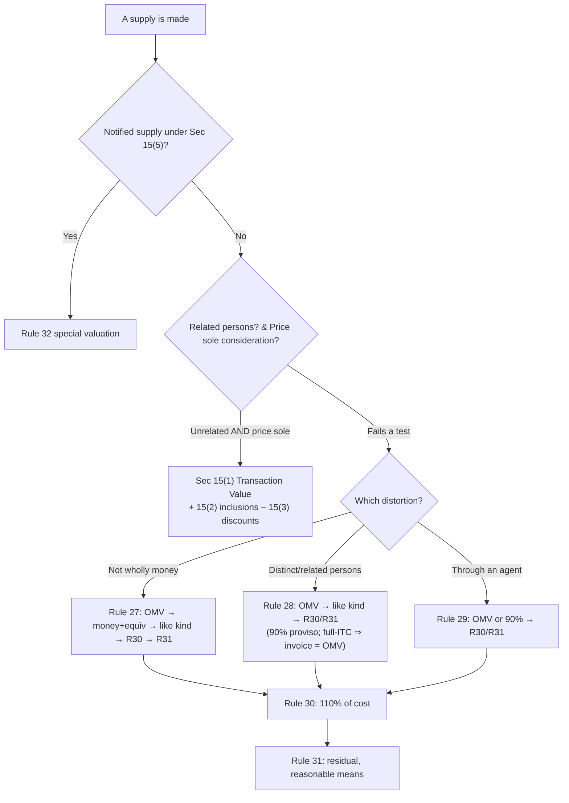

# Q&A — Value of Supply

> CGST Act, 2017 (Sec 15) read with CGST Rules, 2017 (Rules 27–35); mirrored in the IGST Act via Sec 20 IGST (Sec 15 applies to IGST). **Rates (18% used throughout), the air-travel percentages (5%/10%), the forex slabs and any monetary limits are amendment/rate-sensitive — confirm the current figures from the ICAI Study Material/RTP for your attempt.** The *structure* (transaction value → inclusions → exclusions → rules) is stable and is what the exam tests.

---

## SECTION A — Concept-Check (Short Q&A)

**A1. What is the default measure of value, and what two conditions must hold for it to apply?**
**Sec 15(1)** — value is the **transaction value**, i.e. the **price actually paid or payable** for the supply. It applies only when **(i) the supplier and recipient are not related**, and **(ii) the price is the sole consideration**. Fail either test and you drop to the **valuation rules** (Sec 15(4)/(5)).

**A2. Why does GST start from "price actually paid or payable" instead of a fixed government price?**
Because GST is a tax on the *commercial* value of a transaction. A market price set by two independent parties dealing at arm's length is the truest measure of what the supply is worth. The rules exist only as a **fallback** for when that market signal is distorted (relatives, barter, agents, notified sectors).

**A3. Is "related person" only about family?**
No. **Explanation to Sec 15** defines it widely: officers/directors of each other's business, legally recognised partners, employer–employee, a person holding **≥25%** of shares in both, one controlling the other, both controlled by a third, together controlling a third, members of the same family, and **sole agents/distributors**. Persons "**associated in business** such that one is the sole distributor of the other" are deemed related.

**A4. List the five inclusions under Sec 15(2) in one line each.**
(a) **Taxes/duties/cesses** other than CGST/SGST/IGST/Cess, if charged separately; (b) amounts the **supplier is liable to pay but the recipient has incurred** and which are not in the price; (c) **incidental expenses** (packing, commission) and anything done by the supplier **at or before delivery**; (d) **interest, late fee or penalty** for delayed payment of consideration; (e) **subsidies directly linked to the price** — **excluding** Central/State Government subsidies.

**A5. Why are Government subsidies excluded from value but private subsidies included?**
A subsidy directly linked to price is really part of the consideration — someone is paying it *for* the supply — so a private/third-party subsidy is added. A **Government** subsidy is a welfare transfer, not commercial consideration, and taxing it would mean taxing public money; hence carved out of 15(2)(e).

**A6. What are the two discount limbs under Sec 15(3)?**
(a) Discount given **before or at the time of supply** and **recorded in the invoice** — always deductible. (b) **Post-supply discount** — deductible only if it was **established in an agreement entered into at or before the time of supply**, is **linked to relevant invoices**, and the **recipient reverses the ITC** attributable to it. Miss any of the three and the post-supply discount is **not** deductible.

**A7. Why the harsh conditions on post-supply discounts?**
To stop value being shaved *after* the tax has been charged and credit taken. Without the "pre-agreed + ITC reversal" gate, a supplier could cut value later while the buyer keeps full ITC — breaking the credit chain. The conditions keep output tax and input credit symmetrical.

**A8. When do the valuation Rules 27–35 apply?**
Two gateways: **Sec 15(4)** — value cannot be determined under 15(1) (no monetary price / related parties / price not sole consideration); and **Sec 15(5)** — **notified supplies** whose value is *always* determined by rules regardless of transaction value.

**A9. State the rule ladder for "consideration not wholly in money" (Rule 27).**
In order: (a) **Open Market Value (OMV)**; (b) money + **money-equivalent of the non-monetary consideration**; (c) value of **like kind and quality**; (d) **Rule 30** (110% of cost); (e) **Rule 31** (reasonable means). You descend only when the higher step is unavailable.

**A10. What is a "pure agent" and why does Rule 33 matter?**
A **pure agent** (Rule 33) incurs expenditure on the recipient's behalf, is separately reimbursed at **actual cost**, and holds no title/interest in what is procured. Such reimbursements are **excluded** from value — otherwise you would tax a mere pass-through (e.g. a customs broker paying statutory port fees for the client).

**A11. Second-proviso to Rule 28 — the exam's favourite escape hatch.**
On supplies between **distinct/related persons**, if the **recipient is eligible for full ITC**, the **value declared in the invoice is deemed to be the OMV**. Logic: the tax is fully creditable, so it is revenue-neutral — no incentive to under-value, so no need to police it.

**A12. Rule 35 — value when the price already includes GST.**
Tax = **(value inclusive of tax × tax rate) ÷ (100 + tax rate)**. It back-calculates the tax out of a tax-inclusive figure (e.g. MRP-based / B2C).

---

## Valuation decision map

---

## SECTION B — Graded Computational Problems

### B1 (Easy) — Building the transaction value from Sec 15(2)
X Ltd sells a machine. List price **₹1,00,000**; packing **₹2,000**; installation done before delivery **₹3,000**; municipal cess charged separately **₹1,000**; discount shown on the invoice **₹6,000**. All parties unrelated. Compute value and GST @ 18%.

| Item | Sec ref | ₹ |
|---|---|---|
| List price | 15(1) | 1,00,000 |
| Packing (incidental) | 15(2)(c) | +2,000 |
| Installation before delivery | 15(2)(c) | +3,000 |
| Municipal cess (not GST) | 15(2)(a) | +1,000 |
| Discount on invoice | 15(3)(a) | −6,000 |
| **Taxable value** | | **1,00,000** |
| CGST 9% + SGST 9% | | 9,000 + 9,000 |
| **Invoice total** | | **1,18,000** |

**Check:** 1,00,000 + 2,000 + 3,000 + 1,000 − 6,000 = 1,00,000. GST 18% = 18,000. ✔

### B2 (Easy) — Recipient discharges the supplier's liability
Value agreed **₹50,000**. The supplier is legally liable to pay a freight of **₹4,000**, but the **recipient pays it** and it is **not** included in the ₹50,000. GST @ 18%.

- Sec **15(2)(b)** adds any amount the **supplier was liable** to pay but the **recipient incurred**, if not already in the price.
- Value = 50,000 + 4,000 = **₹54,000**; GST = 54,000 × 18% = **₹9,720**.
**Check:** the ₹4,000 was the supplier's obligation, so it belongs in his consideration. ✔

### B3 (Moderate) — Interest for delayed payment + subsidy
Invoice value **₹2,00,000** (unrelated buyer, GST 18%). Buyer pays 40 days late and is charged **₹5,000 interest**. A **private trade body** pays the seller a **₹10,000 subsidy directly linked to the price**; a **State Government subsidy of ₹15,000** is also received.

| Item | Sec ref | ₹ |
|---|---|---|
| Base value | 15(1) | 2,00,000 |
| Interest for delay | 15(2)(d) | +5,000 |
| Private subsidy linked to price | 15(2)(e) | +10,000 |
| State Govt subsidy | 15(2)(e) proviso | **excluded** |
| **Taxable value** | | **2,15,000** |

GST 18% = **₹38,700**. **Check:** 2,00,000 + 5,000 + 10,000 = 2,15,000; Govt ₹15,000 ignored. ✔
*Note (rate-sensitive treatment):* the interest of ₹5,000 is itself consideration; strictly it can be treated as inclusive of GST and grossed down under Rule 35 — the ICAI SM commonly adds it to value as above unless the question says "inclusive."

### B4 (Moderate) — Post-supply discount: the three-gate test
A Ltd supplied goods for **₹5,00,000** (GST 18%). It later grants a **5% turnover discount (₹25,000)**. Two scenarios:
- **(i)** The discount was **agreed in writing before supply**, is linked to the specific invoices, and the buyer **reverses the ITC** on ₹25,000 (via credit note).
- **(ii)** The discount was a **surprise year-end gesture**, not pre-agreed.

**(i)** All three conditions of **Sec 15(3)(b)** met → discount **deductible**. Revised value = 5,00,000 − 25,000 = **₹4,75,000**; GST = **₹85,500**. Supplier issues a credit note; buyer reverses ITC of ₹4,500.
**(ii)** Not established at/before supply → **not deductible**. Value stays **₹5,00,000**; GST **₹90,000**. Any discount is commercial, given post-tax, with **no tax adjustment**.
**Check:** difference in GST = 90,000 − 85,500 = ₹4,500 = 18% of ₹25,000 — exactly the credit the buyer must reverse in (i). ✔

### B5 (Moderate) — Consideration not wholly in money (Rule 27)
A dealer sells a new phone. **OMV of the new phone = ₹20,000.** The customer gives an old phone in exchange (valued ₹5,000) **plus ₹16,000 cash**.

- Price is **not the sole consideration** (part is the old phone) → **Sec 15(4)** → **Rule 27**.
- **Step (a): OMV is available = ₹20,000** → value = **₹20,000**. GST 18% = **₹3,600**.
- Do **not** use the ₹16,000 cash, nor ₹16,000 + ₹5,000 = ₹21,000 (that path is only used when OMV is *not* available).
**Check:** OMV exists, so we stop at step (a). Value ₹20,000. ✔

### B6 (Exam-hard) — Rule 28 with the two provisos
Head Office (Mumbai) transfers goods to its **branch (Pune) — a distinct person** under Sec 25(4). Cost of the goods **₹1,00,000**; **OMV ₹1,20,000**. The Pune branch will **sell them as such** to unrelated customers at **₹1,50,000**.

- Distinct persons → **Sec 15(4)** → **Rule 28**. Default = **OMV ₹1,20,000**.
- **First proviso (option to supplier):** where goods are for **further supply as such**, value may be taken at **90% of the price charged by the recipient** to its unrelated customer = 90% × 1,50,000 = **₹1,35,000** — *at the supplier's option.*
- **Second proviso (overrides):** if the **recipient branch is eligible for full ITC**, the **value declared in the invoice is deemed the OMV.** So HO may invoice at **any value, say ₹1,00,000, and that is accepted.**

**Ranked answer:** if full ITC available → invoice value (₹1,00,000) is fine (2nd proviso, revenue-neutral). If not, default OMV ₹1,20,000, or elect 90% = ₹1,35,000.
**Check:** three legitimate figures — 1,00,000 (2nd proviso), 1,20,000 (OMV), 1,35,000 (90% option) — each traceable to a limb of Rule 28. ✔

### B7 (Exam-hard) — Rule 32(3) Air travel agent + Rule 35 gross-down
An air-travel agent books tickets: **domestic basic fare ₹50,000**, **international basic fare ₹1,00,000**. Also, a separate B2C service is billed **₹11,800 inclusive of 18% GST**.

- **Rule 32(3)** (at option): value = **5% of basic fare (domestic)** + **10% (international)**.
  - Domestic: 5% × 50,000 = **₹2,500**
  - International: 10% × 1,00,000 = **₹10,000**
  - Deemed value = ₹12,500; GST 18% = **₹2,250**.
- **Rule 35** for the inclusive bill: tax = 11,800 × 18 ÷ 118 = **₹1,800**; value = **₹10,000**.
**Check:** 11,800 = 10,000 + 1,800. ✔  Air-travel value uses **basic fare only** (excludes airport taxes/other charges).

### B8 (Exam-hard) — Rule 32(5) Margin scheme (second-hand goods)
A registered dealer in used cars buys a car from an unregistered person for **₹4,00,000**, spends **₹20,000** on minor refurbishing (no change in nature), and sells it for **₹4,50,000**. No ITC was taken on purchase.

- **Rule 32(5)** margin scheme: value = **selling price − purchase price** (only where no ITC availed).
- Margin = 4,50,000 − 4,00,000 = **₹50,000** (repair cost is **not** deducted). GST 18% = **₹9,000**.
- If margin were negative, it is **ignored** (value taken as nil, no GST).
**Check:** the ₹20,000 refurbishing is *not* subtracted — only purchase price is. Margin ₹50,000. ✔

### B9 (Exam-hard) — Rule 33 Pure agent exclusion
A Company Secretary firm raises a bill: **professional fee ₹40,000**; **ROC filing fee paid to MCA on client's behalf ₹5,000** (reimbursed at actual, separately shown, firm holds no interest); **out-of-pocket courier ₹2,000** (part of its own service).

| Item | Treatment | ₹ |
|---|---|---|
| Professional fee | value | 40,000 |
| ROC fee (pure agent, Rule 33) | **excluded** | 0 |
| Courier (own expense) | value 15(2)(c) | 2,000 |
| **Taxable value** | | **42,000** |

GST 18% = **₹7,560** (plus the ₹5,000 statutory fee reimbursed separately, no GST).
**Check:** the ROC fee satisfies all pure-agent conditions → out; courier is the firm's own incidental cost → in. Value ₹42,000. ✔

---

## SECTION C — Past-Paper-Style Full Questions

### C1. "Compute the taxable value" (typical 5-mark)
**Q.** Superb Motors Ltd (unrelated B2B sale) gives you: ex-factory price **₹6,00,000**; installation charges **₹25,000**; packing **₹15,000**; extended warranty (optional, billed separately) **₹20,000**; trade discount shown on invoice **₹30,000**; TCS under Income-tax Act **₹4,700**; freight (supplier's liability) borne by buyer and not in price **₹10,000**. Determine the value and total GST @ 18%.

**Model answer.**
| Item | Sec | ₹ |
|---|---|---|
| Ex-factory price | 15(1) | 6,00,000 |
| Installation | 15(2)(c) | +25,000 |
| Packing | 15(2)(c) | +15,000 |
| Extended warranty (separate consideration, part of supply value) | 15(2)(c) | +20,000 |
| Freight (supplier liable, buyer paid) | 15(2)(b) | +10,000 |
| TCS under Income-tax Act | not a value component | 0 |
| Trade discount on invoice | 15(3)(a) | −30,000 |
| **Taxable value** | | **6,40,000** |

GST 18% = **₹1,15,200** (CGST 57,600 + SGST 57,600).
**Reasoning notes:** TCS collected under the Income-tax Act is not consideration for the supply and, per CBIC clarification, is **excluded** from value. Warranty billed separately is still consideration flowing for the composite supply → included.
**Check:** 6,00,000 + 25,000 + 15,000 + 20,000 + 10,000 − 30,000 = 6,40,000. ✔

### C2. "Which rule and why" (theory + application, 4-mark)
**Q.** State, with the governing rule, how value is determined for: (i) supply of goods through a commission agent; (ii) a free-of-cost sample to an unrelated dealer; (iii) forex conversion by a money-changer.

**Model answer.**
(i) **Rule 29** (supply through agent): OMV, **or at the principal's option 90%** of the price charged by the agent to unrelated customers, failing which Rule 30/31.
(ii) A **free sample** has **no consideration** — if to an unrelated person it is **not a supply at all** (Schedule I excepted) and the question of value does not arise; if it were a deemed supply (distinct/related), value = **Rule 28 (OMV)**. Note ITC on the inputs would be blocked under Sec 17(5)(h) for gifts/free samples.
(iii) **Rule 32(2)** forex: value = **difference between the rate charged and the RBI reference rate × units**; if the RBI rate is unavailable, **1% of the gross INR** exchanged; option 2 offers a slab method (0.25%/etc.). It is a **Sec 15(5) notified** service.

### C3. Full valuation with rule ladder (7-mark)
**Q.** Cost of manufacture of a specialised part = **₹80,000**. It is supplied to a **related party**; there is **no OMV** and **no like-kind supply**; the related recipient is **not eligible for full ITC** (exempt output). Determine value; then state how your answer changes if full ITC were available.

**Model answer.**
- Related persons → **Sec 15(4)** → **Rule 28**. OMV unavailable; like-kind unavailable → descend to **Rule 30**.
- **Rule 30:** value = **110% of cost of production** = 110% × 80,000 = **₹88,000**. GST 18% = **₹15,840**.
- Rule 31 (residual) is not reached because Rule 30 gives a workable figure.
- **If full ITC were available:** **second proviso to Rule 28** applies — the **invoice value is deemed OMV**, so whatever HO/related supplier declares (e.g. ₹80,000) is accepted; no need for Rule 30.
**Check:** 80,000 × 1.10 = 88,000. ✔ The full-ITC route makes valuation revenue-neutral, so the law stops policing it.

---

## SECTION D — MCQs / Case Scenarios

**D1.** Value is the transaction value under Sec 15(1) only when —
(a) parties unrelated; (b) price is sole consideration; (c) both; (d) neither.
**→ (c).** Both conditions in Sec 15(1) must hold simultaneously.

**D2.** A Central Government subsidy of ₹20,000 directly linked to the price of a supply is —
(a) added to value; (b) excluded from value; (c) added at 50%; (d) added only if taxable.
**→ (b).** Sec 15(2)(e) proviso excludes Government subsidies; only non-Government subsidies are added.

**D3.** A post-supply discount is deductible from value only if —
(a) it is generous; (b) recorded in the invoice; (c) pre-agreed, invoice-linked, and ITC reversed by recipient; (d) approved by GST officer.
**→ (c).** The three cumulative gates of Sec 15(3)(b); "recorded in invoice" (option b) is the *pre-supply* limb (a).

**D4.** Goods exchanged partly for an old article; OMV of the new goods is known. Value is —
(a) cash received; (b) cash + value of old article; (c) OMV; (d) 110% of cost.
**→ (c).** Rule 27 step (a) — where OMV is available it is used first, before the money-plus-equivalent method.

**D5.** On a stock transfer to a branch (distinct person) that is **eligible for full ITC**, the value is —
(a) OMV only; (b) 110% of cost; (c) the value declared in the invoice; (d) 90% of onward sale.
**→ (c).** Second proviso to Rule 28 — full-ITC recipient makes the invoice value the deemed OMV (revenue-neutral).

**D6.** Air-travel agent's deemed value on **domestic** bookings under Rule 32(3) is —
(a) 5% of basic fare; (b) 10% of basic fare; (c) 5% of total fare incl. taxes; (d) 18% of commission.
**→ (a).** 5% of **basic fare** (domestic); 10% for international. (Percentages are rate-sensitive — verify.)

**D7.** A used-goods dealer buys at ₹40,000, sells at ₹38,000, took no ITC. Taxable value under Rule 32(5) is —
(a) ₹38,000; (b) ₹2,000; (c) Nil (negative margin ignored); (d) ₹40,000.
**→ (c).** Margin is negative (−₹2,000); a negative margin is ignored, so value/GST is nil.

**D8.** Price of a supply is **₹1,18,000 inclusive of 18% GST**. The tax component under Rule 35 is —
(a) ₹21,240; (b) ₹18,000; (c) ₹1,00,000; (d) ₹18,900.
**→ (b).** 1,18,000 × 18 ÷ 118 = ₹18,000 (value ₹1,00,000).

**D9.** Reimbursement of statutory fees paid by a customs broker on the importer's behalf, at actual cost, is —
(a) always taxable; (b) excluded as pure-agent expense under Rule 33; (c) added under 15(2)(c); (d) added under 15(2)(b).
**→ (b).** Meets the pure-agent conditions of Rule 33 — a pass-through, excluded from value.

**D10. Case scenario.** HO (Delhi) sends goods to its Chennai branch (distinct person, **not** eligible for full ITC). Cost ₹2,00,000; OMV ₹2,40,000; branch will sell as-such at ₹3,00,000. The **lowest legally permissible** value HO can adopt is —
(a) ₹2,00,000; (b) ₹2,40,000; (c) ₹2,70,000; (d) ₹3,00,000.
**→ (c) ₹2,70,000.** Full-ITC escape (2nd proviso) is unavailable. Options are OMV ₹2,40,000 or 90% of onward price = ₹2,70,000; between the two *available* figures the question's framing (goods for further supply as such, supplier electing the 90% proviso) gives ₹2,70,000. *(If the exam asks simply for the default, it is OMV ₹2,40,000 — read the proviso wording carefully.)*

**D11.** Interest charged for delayed payment of consideration is —
(a) excluded from value; (b) included under Sec 15(2)(d); (c) exempt; (d) taxed at 12% flat.
**→ (b).** Sec 15(2)(d) expressly includes interest, late fee or penalty for delayed payment.

**D12.** The valuation rules (27–35) are triggered by —
(a) Sec 15(1); (b) Sec 15(2); (c) Sec 15(3); (d) Sec 15(4) and 15(5).
**→ (d).** 15(4) (value not determinable under 15(1)) and 15(5) (notified supplies).

---

## One-line traps to carry into the hall
- **OMV first** in Rules 27–29 — don't jump to cost or 90% when OMV exists.
- **Government subsidy out, private subsidy in** (15(2)(e)).
- **Post-supply discount** needs *pre-agreement + invoice link + ITC reversal* — all three.
- **Full ITC ⇒ invoice value = OMV** (2nd proviso, Rule 28) — the biggest time-saver.
- **Margin scheme (32(5))**: subtract only **purchase price**, ignore repairs; negative margin ⇒ nil.
- **Air-travel value = % of basic fare only**, not total fare.
- **TCS (Income-tax) is not** part of GST value; **non-GST taxes/cesses are** (15(2)(a)).
- **Rule 35 gross-down** whenever a figure is stated "inclusive of GST."
