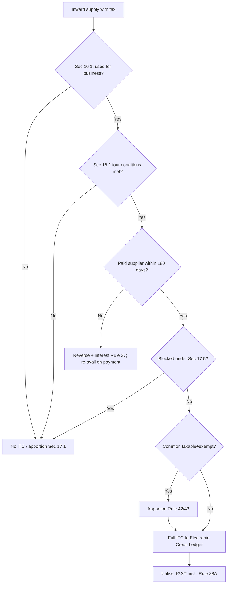

# Q&A — Input Tax Credit (ITC)

> Acts: **CGST Act, 2017** and **IGST Act, 2017** (sections cited as "Sec"). Rules = CGST Rules, 2017.
> **Amendment-sensitive** items are flagged with ⚠ — verify against the current Finance Act / notifications before the exam.

---

## SECTION A — Concept-Check (short answers)

**A1. What "disease" does ITC cure, in one line?**
**Ans.** *Cascading* — tax charged on a value that already includes tax at an earlier stage. ITC lets each supplier pay tax only on the **value he adds**, by setting off tax already paid on inward supplies (the "deposit / set-off" logic of **Sec 16(1)**).

**A2. Is ITC a right or a concession?**
**Ans.** A **conditional statutory entitlement** — available only if every gate in **Sec 16** and every rule (17, 18, Rules 36/37/42/43) is satisfied. Courts treat it as a concession, so conditions are construed strictly.

**A3. List the four cumulative conditions of Sec 16(2).**
**Ans.** (a) possession of a **tax invoice / debit note**; **(aa)** the supplier has **furnished the invoice in GSTR-1** and it is **communicated in GSTR-2B**; (b) **receipt** of goods/services (incl. "bill-to-ship-to" deemed receipt); (c) **tax actually paid** to Government by supplier; (d) recipient has **furnished the return u/s 39**. ⚠ Clause **(ba)** (Finance Act 2022) adds that the credit must **not be restricted** in GSTR-2B u/s 38.

**A4. State the 180-day rule and its consequence.**
**Ans.** **2nd proviso to Sec 16(2) r/w Rule 37**: if the recipient does not pay the **supplier** the *value + tax* within **180 days** of invoice date, the ITC availed is **added to output tax liability with interest @18% (Sec 50)**. On later payment it can be **re-availed** (no time bar). Note: this bites only where **consideration is unpaid** — not where only the ITC condition timing lapses.

**A5. State the Sec 16(4) time limit. ⚠**
**Ans.** ITC on an invoice/debit note of a financial year must be availed by the **earlier of** (i) **30th November** following the end of that FY, or (ii) date of furnishing the **annual return**. ⚠ Special relaxation: **Sec 16(5)/16(6)** (Finance (No.2) Act 2024) allow ITC for FY 2017-18 to 2020-21 up to **30.11.2021** and for revoked cancellations.

**A6. Difference between Sec 17(1) and Sec 17(2)?**
**Ans.** **17(1)** apportions credit when inputs are used partly for **business and partly for non-business/personal** use. **17(2)** apportions when used partly for **taxable + zero-rated** and partly for **exempt** supplies. Only the **business + taxable** portion survives; the rest is reversed via **Rule 42 (inputs/input services)** or **Rule 43 (capital goods)**.

**A7. Can ITC be taken on capital goods if depreciation is claimed? (Sec 16(3))**
**Ans.** If depreciation under the **Income-tax Act** is claimed on the **tax component** of a capital good, **ITC on that tax is barred**. Assessee chooses **one** benefit — ITC *or* depreciation on the GST portion, not both.

**A8. State the utilisation order under Sec 49/49A/49B r/w Rule 88A.**
**Ans.** **IGST credit must be exhausted first** — first against IGST output, then against CGST/SGST **in any order/amount**. Only after IGST credit is nil may **CGST credit** be used (CGST output → then IGST) and **SGST/UTGST credit** be used (SGST output → then IGST). **CGST and SGST credits can never cross-utilise.**

---

## SECTION B — Graded Computational Problems (full working)

### B1 (Easy) — Basic eligibility filter
A trader's inward invoices in a month carry ITC: raw material ₹40,000; office **staff car** (seating 5) repairs ₹6,000; **food** for staff party ₹3,000; courier ₹2,000. How much ITC is eligible?
**Working & Ans.**
| Item | ITC | Eligible? | Reason |
|---|---|---|---|
| Raw material | 40,000 | ✔ | Sec 16(1) — business use |
| Motor car (≤13 seats) | 6,000 | ✘ | **Sec 17(5)(a)** — blocked |
| Food & beverages | 3,000 | ✘ | **Sec 17(5)(b)** |
| Courier | 2,000 | ✔ | 16(1) |
**Eligible ITC = ₹42,000.** Blocked = ₹9,000.

---

### B2 (Moderate) — Set-off / utilisation order ⭐ (exam favourite)
Output tax: **IGST ₹1,000 · CGST ₹1,000 · SGST ₹1,000**. Credit available: **IGST ₹1,600 · CGST ₹700 · SGST ₹700**. Utilise optimally (Rule 88A) and find cash payable.

**Step-by-step (IGST-first mandate):**

| Step | Credit used | Against | Amount |
|---|---|---|---|
| 1 | IGST | IGST output (must use IGST for IGST first) | 1,000 |
| 2 | IGST (bal. 600) | CGST output | 300 |
| 3 | IGST (bal. 300) | SGST output | 300 → IGST credit now **0** |
| 4 | CGST | CGST output (1,000 − 300) | 700 → CGST credit **0** |
| 5 | SGST | SGST output (1,000 − 300) | 700 → SGST credit **0** |

Reconciliation: IGST credit 1,000+300+300 = **1,600** ✔; CGST out 300+700 = **1,000** ✔; SGST out 300+700 = **1,000** ✔.
**Cash payable = ₹0.**
*Trap:* had we naively pushed all leftover IGST into CGST only, SGST would fall short and force cash even though total credit = total liability. **The order of pushing IGST across CGST/SGST is a taxpayer choice — use it to zero out cash.**

---

### B3 (Moderate) — 180-day reversal (Rule 37)
Invoice dated **10-Apr**, value ₹1,00,000 + GST ₹18,000 (CGST ₹9,000 + SGST ₹9,000); full ITC ₹18,000 availed in April. Consideration remains **unpaid** on the 181st day. Payment finally made on **20-Feb** next year.
**Working & Ans.**
- Non-payment within 180 days → **reverse ₹18,000** (add to output liability) + **interest @18% u/s 50** from date of availing to date of reversal (2nd proviso to Sec 16(2), Rule 37).
- On **20-Feb** payment → **re-avail ₹18,000**. Re-availment is **not subject to Sec 16(4)** time limit.
- Note: reversal is only of the **ITC**, not the invoice value; interest runs only on the ITC amount reversed.

---

### B4 (Hard) — Rule 42 apportionment (common inputs) ⭐
In a tax period a manufacturer has **total input & input-service tax T = ₹1,50,000**, comprising:
- T1 (exclusively **non-business**) = ₹10,000
- T2 (exclusively **exempt** supplies) = ₹20,000
- T3 (**blocked** u/s 17(5)) = ₹5,000
- T4 (exclusively **taxable + zero-rated**) = ₹75,000
Exempt turnover **E = ₹8,00,000**; total turnover **F = ₹40,00,000**.

**Step 1 — credit to Electronic Credit Ledger:**
C1 = T − (T1+T2+T3) = 1,50,000 − 35,000 = **₹1,15,000**
**Step 2 — common credit:**
C2 = C1 − T4 = 1,15,000 − 75,000 = **₹40,000**
**Step 3 — exempt attribution:**
D1 = (E ÷ F) × C2 = (8,00,000 ÷ 40,00,000) × 40,000 = 0.20 × 40,000 = **₹8,000**
**Step 4 — deemed non-business (5% of C2):**
D2 = 5% × 40,000 = **₹2,000**
**Step 5 — eligible common credit:**
C3 = C2 − (D1+D2) = 40,000 − 10,000 = **₹30,000**

**Reversal (added to output liability) = D1 + D2 = ₹10,000.**
**Total eligible ITC = T4 + C3 = 75,000 + 30,000 = ₹1,05,000.**
Check: eligible 1,05,000 + reversed 10,000 + already-excluded (T1+T2+T3) 35,000 = **₹1,50,000 = T** ✔.
*Note:* Rule 42 is computed monthly on estimates and **re-computed annually** by 30-Nov; shortfall → interest, excess → re-credit.

---

### B5 (Hard) — Depreciation vs ITC choice (Sec 16(3))
A ₹10,00,000 machine attracts GST ₹1,80,000 (total invoice ₹11,80,000). Firm is in the **28% tax slab**, machine depreciation rate **15%**.
**Option analysis:**
- **Option A — take ITC ₹1,80,000, capitalise cost at ₹10,00,000.** Immediate credit of **₹1,80,000** usable against output tax (cash-equivalent now). Depreciation is on ₹10,00,000 only.
- **Option B — no ITC, capitalise at ₹11,80,000.** Extra depreciation base ₹1,80,000 → year-1 tax saving = 1,80,000 × 15% × 28% = **₹7,560** (and declining thereafter over the asset life).
**Decision:** Option A gives ₹1,80,000 upfront vs Option B's slow ~₹7,560/yr income-tax shield. **Take ITC** (Sec 16(3) bars claiming both). Rule 43 spreads capital-goods common credit over **60 months** if the asset is used partly for exempt supplies.

---

## SECTION C — Past-Paper-Style Full Questions

**C1.** *"Discuss the eligibility of ITC in the following independent cases with reference to Sec 17(5):"*
1. Works contract service for **construction of an office building** (capitalised).
2. **Health insurance** of employees where it is **obligatory** under a law.
3. Goods **stolen** from the warehouse.
4. **Motor vehicle** (seating 40) bought by a **passenger-transport** operator.
5. Goods distributed as **free samples**.

**Model Answer:**
1. **Blocked** — Sec 17(5)(c)/(d): works contract & goods/services for construction of immovable property on own account (except plant & machinery) → ITC **not** available.
2. **Allowed** — proviso to Sec 17(5)(b): where provision of such service is **obligatory** for an employer under any law, ITC is available.
3. **Blocked** — Sec 17(5)(h): goods **lost, stolen, destroyed, written off** → no ITC.
4. **Allowed** — Sec 17(5)(a) exception: seating capacity **>13** and/or used for **transportation of passengers** as a taxable output service.
5. **Blocked** — Sec 17(5)(h): **free samples / gifts** → ITC to be reversed.

---

**C2.** *"State the conditions for taking ITC on capital goods and explain treatment when a capital good on which ITC was taken is later sold."*
**Model Answer:**
- ITC on capital goods is allowed in **one shot** on receipt (subject to Sec 16(2) conditions), **unless** depreciation is claimed on the tax portion (**Sec 16(3)** — then barred).
- If used commonly for taxable & exempt/personal use → credit is **spread over 60 months** and monthly exempt-portion reversed under **Rule 43**.
- **On sale/disposal (Sec 18(6) r/w Rule 40(2)/44):** pay the **higher of** — (i) ITC taken **reduced by 5% per quarter** (or part) from date of invoice, or (ii) **tax on transaction value** of the capital good. If it is **refractory bricks/moulds/dies/jigs/fixtures** sold as scrap, tax on transaction value applies.

---

**C3.** *"Sec 18 — Explain availability of ITC in special circumstances."*
**Model Answer (Sec 18(1)):**
| Trigger | Entitlement | Timing |
|---|---|---|
| (a) Person becomes **liable** & applies within 30 days | ITC on **inputs in stock / semi-finished / finished** on day before liability | File **Form ITC-01** within 30 days |
| (b) **Voluntary** registration | ITC on stocks on day before grant | ITC-01 |
| (c) **Composition → regular** | ITC on stocks **+ capital goods** (reduced 5%/quarter) | ITC-01 |
| (d) **Exempt → taxable** | ITC on stocks + capital goods relatable to taxable supply | ITC-01 |
Invoices for such stock must be **≤ 1 year** old (Sec 18(2)). Reverse case (regular→composition / taxable→exempt): **reverse** ITC on stock & capital goods (Sec 18(4), Form ITC-03).

---

## SECTION D — MCQs & Case Scenarios

**D1.** ITC on an invoice pertaining to FY 2023-24 can be availed latest by:
A) 31-Mar-24 B) 30-Sep-24 C) **30-Nov-24** ✔ D) 31-Dec-24
*Reason:* Sec 16(4) — earlier of 30-Nov following FY or annual return. ⚠

**D2.** Under Rule 88A, which credit must be **fully utilised first**?
A) CGST B) SGST C) **IGST** ✔ D) Any
*Reason:* Sec 49A — IGST credit exhausted before CGST/SGST is touched.

**D3.** ITC of ₹9,000 was availed; supplier not paid within 180 days. Consequence:
A) Lapses permanently B) **Reversed with interest, re-availed on payment** ✔ C) No effect D) 50% reversed
*Reason:* 2nd proviso to Sec 16(2), Rule 37 — reverse + interest @18%, re-avail later.

**D4.** Which is **NOT** a blocked credit under Sec 17(5)?
A) Club membership B) **Raw material inputs** ✔ C) Rent-a-cab (non-obligatory) D) Free samples
*Reason:* raw materials used in business are the core eligible credit under 16(1).

**D5. Case:** Mr. X (regular dealer) buys a car (5-seater) for ₹20L + GST ₹5.6L for **personal + business** use, and inputs ₹1L + GST ₹18,000 for taxable supplies. Eligible ITC?
**Ans.** Car → **fully blocked** (Sec 17(5)(a), ≤13 seats). Inputs → **₹18,000 eligible**. **Total eligible = ₹18,000.**

**D6.** CGST credit can be utilised for payment of:
A) SGST B) **CGST then IGST** ✔ C) Only IGST D) SGST then IGST
*Reason:* Sec 49(5) — CGST credit for CGST, balance for IGST; **never SGST**.

**D7. Case (ISD):** Head office receives a common input-service invoice with **IGST ₹90,000** to be distributed to 3 branches (turnover ratio 2:1:1). Distribution?
**Ans.** Under **Sec 20 / Rule 39**, ISD distributes pro-rata to turnover: Branch A = 45,000; B = 22,500; C = 22,500. IGST credit is distributed as **IGST** (or as CGST+SGST if recipient is in same State). ⚠ ISD distribution became **mandatory** (Finance Act 2024, w.e.f. 01-04-2025).

---

## Mermaid — The Sec 16/17 ITC Gate

---

## Traps & Examiner Tricks (quick list)
1. **≤13-seat** motor vehicle blocked — but **>13 seats** or passenger-transport business is **allowed**. Count the driver.
2. **Obligatory** insurance/canteen (by law) is **allowed** despite 17(5)(b).
3. **Plant & machinery** is *excluded* from the construction bar — pipelines & telecom towers are *excluded from* P&M (so blocked). ⚠
4. 180-day rule triggers on **non-payment of value**, not on the ITC-timing condition.
5. Sec 16(4) limit is **30-Nov** — not 30-Sep (old law). ⚠
6. Depreciation on tax component ⇒ **no ITC** (Sec 16(3)) — you cannot double-dip.
7. **CGST↔SGST cross-utilisation is impossible** — a classic set-off trap.
8. IGST credit **must** clear before CGST/SGST — but its spread across CGST vs SGST is a **choice** (use it to avoid cash).
9. Rule 42 **D2 = flat 5%** of C2 (deemed non-business), independent of D1.
10. **Free samples/gifts/stolen/written-off** goods → reverse ITC (17(5)(h)).
11. **CSR expenditure** ITC **blocked** — Sec 17(5)(fa). ⚠ (Finance Act 2023, w.e.f. 01-10-2023.)
12. Blocked-credit list is **exhaustive** — if not listed in 17(5) and business-used, it is **eligible**.

---

## First-Principles Recap
Tax should fall only on **value added**. ITC is the ledger mechanism that refunds tax-on-tax by letting each link **deposit** tax paid on inputs and **set it off** against tax collected on outputs — provided the chain is **verifiable** (invoice + supplier compliance + payment). Every restriction (17, 18, blocked credits, apportionment) exists to stop credit leaking into **non-business, exempt, or personal** consumption where no further taxable value is added.

---

## Quick-Revision Sheet
- **Gate:** Sec 16(1) business use → 16(2) 4 conditions (invoice, GSTR-2B, receipt, tax paid, return) → 180-day payment → 16(4) 30-Nov limit ⚠.
- **Apportion:** 17(1) business/non-business; 17(2) taxable/exempt → **Rule 42** (inputs) / **Rule 43** (capital, 60 months).
- **Blocked (17(5)):** motor vehicles ≤13 seats, F&B, club, works contract & construction on own account, personal, lost/stolen/gifts/free samples, CSR ⚠.
- **Capital goods:** one-shot ITC or Rule 43 spread; Sec 16(3) depreciation bar; Sec 18(6) on sale = higher of (ITC − 5%/qtr) or tax on TV.
- **Utilisation (Sec 49/49A, Rule 88A):** IGST → (IGST, then CGST/SGST any order); CGST → (CGST, IGST); SGST → (SGST, IGST); **no CGST↔SGST**.
- **Transitions (Sec 18):** ITC-01 to claim on becoming taxable; ITC-03 to reverse on becoming exempt/composition.
- **ISD (Sec 20/Rule 39)** mandatory 01-04-2025 ⚠; **Job-work (Sec 19):** inputs back in **1 yr**, capital goods **3 yrs**, else deemed supply.
