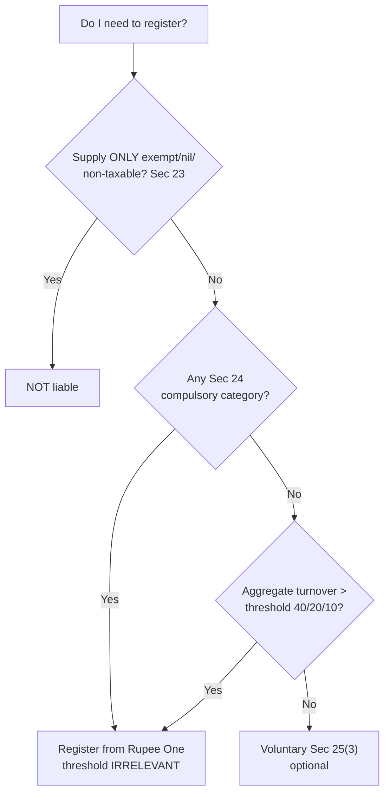

# Q&A — Registration

> CGST Act, 2017 — **Sec 2(6)** (aggregate turnover), **Sec 22** (liability threshold), **Sec 23** (not liable), **Sec 24** (compulsory), **Sec 25** (procedure/distinct persons), **Sec 27** (CTP/NRTP), **Sec 28** (amendment), **Sec 29** (cancellation), **Sec 30** (revocation); CGST Rules 8–23; IGST Act inter-State supply is what pulls Sec 24 in. **Every monetary threshold (₹40L / ₹20L / ₹10L), the special-category State list, and procedural timelines (30 days, 7 working days, 90+90, revocation extension) are amendment-sensitive — confirm current figures from the ICAI Study Material / RTP for your attempt.** The *structure* (relief → compulsion → threshold → voluntary) is stable and is what the exam tests.

---

## SECTION A — Concept-Check (Short Q&A)

**A1. What two rights does registration switch on, and why is it the "turnstile" of GST?**
Under **Sec 25**, only a *registered person* may (a) **legally collect GST** from customers and (b) **claim Input Tax Credit (ITC)**. Registration is the legal identity (GSTIN) through which the government can match invoices, demand tax, and audit — without it the self-policing credit chain (my purchase = your sale) cannot function.

**A2. Decode the GSTIN. Why PAN-based and State-wise?**
15 characters: **State code (2) + PAN (10) + entity code (1) + "Z" + checksum (1)**. PAN gives national traceability (defeats identity-splitting; links direct and indirect tax); the State code enforces fiscal federalism (each State's SGST is trackable). Hence a person in 3 States needs 3 GSTINs.

**A3. Define aggregate turnover [Sec 2(6)]. What is in and what is out?**
= **Taxable + Exempt (incl. nil-rated/non-taxable) + Exports/zero-rated + Inter-State supplies**, of the **same PAN, all-India basis**. **Exclude**: CGST/SGST/IGST/UTGST/Cess, and **inward supplies taxed under reverse charge**. Trap: exempt supplies are **included** for the threshold test though they carry no ITC.

**A4. State the thresholds under Sec 22 and the design reason for the split.**
Goods-only-and-clean (normal State) **₹40L**; Services or mixed (normal State) **₹20L**; special-category States **₹10L** (services/mixed) / **₹20L** (goods). Goods leave a physical trail (e-way bills, stock) so a higher floor is safe; services are invisible so the net is cast wider; small States get a lower floor to protect their SGST base. *(Numbers amendment-sensitive.)*

**A5. Who is NOT liable to register [Sec 23], and why does it override Sec 22?**
Persons supplying **exclusively exempt/nil-rated/non-taxable** supplies; an **agriculturist** (produce out of cultivation); persons making supplies **wholly under reverse charge**. If your entire output carries no output tax, crossing ₹40L is irrelevant — there is nothing to collect.

**A6. What is the logic of Sec 24 (compulsory registration)?**
It opens "**notwithstanding** Sec 22(1)" — **threshold irrelevant, register from Rupee One**. The unifying reason: these persons **touch someone else's tax or cross a border** — inter-State (goods), casual taxable person, RCM recipient, Sec 9(5) ECO, NRTP, TDS deductor (Sec 51), TCS/ECO (Sec 52), sellers via ECO, ISD, agents, OIDAR from abroad. The risk is *structural, not scale-based*.

**A7. The two inter-State carve-outs — what escapes Sec 24?**
Small inter-State supply of **services** up to ₹20L is **exempted** from compulsory registration (notification); so is small supply of **services through an ECO**. But inter-State supply of **goods** gets **no** such relief. Force-2 logic: tiny service providers were disproportionately burdened.

**A8. CTP vs NRTP [Sec 27] — common features?**
Both must **deposit estimated tax in advance**, apply **at least 5 days prior** to commencing business, and get a registration valid for **90 days (extendable by 90 more)**. The advance deposit is the government's security against a supplier who supplies and vanishes.

**A9. Effective date of registration — the 30-day pivot [Sec 25(1), Rule 10].**
Apply **within 30 days** of becoming liable → effective from the **date of liability** (ITC on opening stock allowed, no gap). Apply **late** → effective from the **date of grant** (gap-period output tax still owed with interest, but gap-period ITC is lost).

**A10. What is the "deemed approval" rule and why does it exist?**
If the officer takes no action within the prescribed period (broadly 7 working days where Aadhaar-authenticated, else the extended window), registration is **deemed granted**. Rationale: the State should not be able to strangle genuine entry by inaction (frictionless-entry design force).

**A11. Distinct persons [Sec 25(4)/(5)] — why do branch transfers get taxed?**
Establishments of the **same PAN in different States** (or separately-registered verticals in one State) are **distinct persons**; a stock transfer between them is a **supply** attracting GST. Reason: each State's SGST base must be independently preserved.

**A12. Sec 29(5) — the sting on cancellation.**
On cancellation the person must pay, by debit to the electronic credit/cash ledger, an amount = **ITC on inputs in stock, inputs in semi-/finished goods, and on capital goods (reduced as prescribed) OR the output tax on such goods, whichever is HIGHER**. This disgorges credit so nobody exits with tax-free stock. **Final Return GSTR-10 within 3 months.**

**A13. Revocation [Sec 30] — scope and precondition.**
Available **only against officer-initiated (suo motu) cancellation**, not your own voluntary cancellation. Precondition: **file all pending returns and pay all dues first**. Apply in **REG-21 within 30 days** of the order (extendable — verify window).

---

## Decision order (memorise the sequence)

*Order matters in exam problems: Relief (23) → Compulsion (24) → Threshold (22) → Voluntary (25(3)).*

---

## SECTION B — Graded Computational Problems

### B1 (Easy) — Aggregate turnover, the exempt trap [Sec 2(6), 22]
Mehta Traders (Maharashtra, normal State, goods only, no inter-State, no Sec-24 item): taxable goods ₹28,00,000; exempt goods ₹9,00,000; nil-rated goods ₹4,00,000; GST paid under RCM on inward legal services ₹1,50,000. Is registration required?

| Component | Sec | In/Out | ₹ |
|---|---|---|---|
| Taxable goods | 2(6) | In | 28,00,000 |
| Exempt goods | 2(6) | In | 9,00,000 |
| Nil-rated goods | 2(6) | In | 4,00,000 |
| RCM inward (legal) | 2(6) | **Out** | — |
| **Aggregate turnover** | | | **41,00,000** |

Threshold = **₹40L** (goods-only-and-clean). ₹41,00,000 **> ₹40,00,000 → liable to register.**
**Check:** drop the exempt+nil ₹13L wrongly and you get ₹28L ("not liable") — the exempt supplies are exactly what tip Mehta over. RCM inward correctly excluded. ✔

### B2 (Easy) — Services drag the threshold to ₹20L [Sec 22]
Rao & Co (Telangana): consultancy (services) ₹18,00,000 + trading of goods ₹15,00,000, all intra-State, no Sec-24 category. Liable?

- Any **service element** in a normal State kills the ₹40L upgrade → threshold = **₹20L**.
- Aggregate turnover = 18,00,000 + 15,00,000 = **₹33,00,000 > ₹20,00,000 → liable.**
**Check:** had it been goods-only ₹33L it would still be liable (>₹40L? no — ₹33L<₹40L → NOT liable). The service element is what forces registration here. ✔

### B3 (Moderate) — Sec 24 overrides a sub-threshold firm [Sec 24]
Rao Consultancy (Telangana): consultancy ₹19,00,000 (intra-State) + a single **inter-State supply of goods** ₹50,000 to Karnataka. Liable?

- **Step 1 (threshold view):** services → ₹20L; ₹19,00,000 < ₹20,00,000 → *appears* below threshold.
- **Step 2 (Sec 24 checked first):** inter-State supply of **goods** = compulsory category, **threshold irrelevant**.
- The services carve-out (inter-State **services** ≤₹20L) does **not** rescue a *goods* supply.
- **Conclusion: liable compulsorily under Sec 24.**
**Check:** had the ₹50,000 been inter-State *services*, the carve-out keeps Rao out (turnover < ₹20L). One ₹50,000 goods supply = full registration. ✔

### B4 (Moderate) — Effective date and lost ITC [Sec 25(1), Rule 10]
Nair Foods (Kerala, goods-only) crossed ₹40L on **10 August**; applied **25 September**; granted **1 October**. In the gap it made taxable supplies of ₹6,00,000 (GST @18% = ₹1,08,000) and bought inputs bearing ₹90,000 GST.

- 30-day window from 10 Aug ends **9 September**; applied 25 Sept → **late by 16 days**.
- Late ⇒ registration effective from **date of grant = 1 October**.
- Gap output tax **still owed**: ₹1,08,000 + interest/penalty (liability arose 10 Aug, independent of grant).
- Gap-period **ITC of ₹90,000 is LOST** (timely applicant would have got registration from 10 Aug and claimed ITC on stock; late application forfeits this).
**Check:** timely path → net cost = 1,08,000 − 90,000 = ₹18,000; late path → ₹1,08,000 out, ₹90,000 credit gone. The ₹90,000 asymmetry is the deliberate penalty for delay. ✔

### B5 (Moderate) — Casual taxable person advance tax [Sec 24, 27]
Bengal Handlooms (registered in WB) takes a 20-day Delhi trade-fair stall; expected supplies ₹8,00,000 @ 18% GST (intra-Delhi). What must it do?

- Occasional supply, no fixed place in Delhi = **CTP** → **Sec 24 compulsory**, threshold irrelevant.
- Apply **≥5 days before** commencing; deposit **advance tax = estimated liability** = 18% × 8,00,000 = **₹1,44,000** (CGST ₹72,000 + SGST ₹72,000, credited to electronic cash ledger).
- Registration valid **90 days**, extendable by **90 more**.
**Check:** advance deposit ≈ estimated output tax; it is the security against pack-up-and-leave. ✔

### B6 (Exam-hard) — Sec 29(5) reversal on cancellation
Surya Ltd's registration is cancelled. On the effective date it holds: inputs in stock with ITC availed ₹60,000; inputs contained in finished goods with ITC ₹25,000; capital goods bought 30 months earlier, ITC originally availed ₹1,80,000 (useful life taken as 60 months; ₹3,000 p.m.). Output tax if the stock/goods were supplied today = ₹70,000. Compute the reversal.

| Item | Basis | ₹ |
|---|---|---|
| ITC on inputs in stock | full | 60,000 |
| ITC on inputs in finished goods | full | 25,000 |
| Capital goods: ITC reduced for used life | 1,80,000 × (remaining 30/60) | 90,000 |
| **(A) ITC-based amount** | | **1,75,000** |
| **(B) Output tax on such goods** | given | **70,000** |
| **Payable = higher of (A),(B)** | Sec 29(5) | **1,75,000** |

- Capital-goods ITC is reduced by 5 percentage points per quarter (~pro-rata for months used): used 30 of 60 months → reverse the **remaining** 30 months = ₹90,000.
- File **GSTR-10 within 3 months**.
**Check:** ₹1,75,000 (ITC-based) > ₹70,000 (output-tax) → higher figure ₹1,75,000 disgorged; nobody exits with credited-but-untaxed stock. ✔ *(Prescribed reduction method is rule-sensitive — verify.)*

### B7 (Exam-hard) — Sec 23 vs Sec 24 interplay
Kisan Agro: sale of own farm produce ₹50,00,000 (agriculturist); plus it is **liable to pay tax under RCM** on ₹2,00,000 of inward goods-transport (GTA) services. Is it liable to register?

- Agriculturist's produce → **Sec 23 not liable** for that activity, and turnover of exempt-type produce would not by itself force registration.
- **BUT** being **liable under reverse charge** is an independent **Sec 24 compulsory** trigger — threshold irrelevant.
- **Conclusion: must register** (to deposit the RCM tax and be auditable), even though its outward produce alone would keep it out.
**Check:** Sec 23 relieves the *produce*; Sec 24 compels because Kisan now *pays someone else's-type tax as recipient*. Compulsion beats relief here. ✔

---

## SECTION C — Past-Paper-Style Full Questions

### C1. "Is registration required + from what date" (typical 6-mark)
**Q.** Mr. Bose supplies goods only, in Assam (special-category, ₹20L for goods) and West Bengal (normal). All-India same-PAN turnover: Assam taxable ₹12,00,000; WB taxable ₹15,00,000; WB exempt ₹6,00,000. He crossed the limit on 5 July, applied 20 July, granted 28 July. (a) Liable? (b) In which States? (c) Effective date?

**Model answer.**
- **Aggregate turnover [Sec 2(6)]** is computed **all-India, same PAN** = 12,00,000 + 15,00,000 + 6,00,000 (exempt included) = **₹33,00,000**.
- The **relevant threshold** for a *goods-only* supplier is ₹40L (normal) / ₹20L (special-category goods). Aggregate ₹33L exceeds the **₹20L special-category limit** → **liable**.
- Registration under **Sec 22** is **State-wise**: once aggregate turnover crosses the limit, he must register **in every State from which he makes taxable supplies** — i.e. **both Assam and West Bengal** (each needs its own GSTIN).
- Applied on **20 July**, within **30 days** of 5 July → effective from the **date of liability, 5 July** [Rule 10]; ITC on inputs held in stock as on 4 July is available under Sec 18(1)(a).
**Check:** threshold tested on all-India aggregate but registration taken State-wise; timely application preserves the liability-date effective date. ✔

### C2. "Explain the procedure and timelines" (theory, 5-mark)
**Q.** Outline the registration procedure under Sec 25 read with Rules 8–11, including forms and the deemed-approval concept.

**Model answer.**
1. **REG-01 Part A** — PAN (portal-validated), mobile & email (**OTP-verified**) → **TRN** issued.
2. **REG-01 Part B** — business details, place(s) of business, bank, authorised signatory, documents; verify via **DSC / e-sign / EVC**.
3. **REG-02** acknowledgement issued.
4. **Aadhaar authentication (Rule 8)** — success = fast-track; failure/risk-flag = **physical verification of premises**.
5. Officer scrutiny: if in order & Aadhaar-authenticated, **approve within 7 working days**; if physical verification, window extends (~30 days); if deficient, **notice REG-03** → applicant replies **REG-04 within 7 working days** → officer may reject **REG-05**.
6. **Deemed approval** if the officer does not act within the prescribed period — protects genuine entrants from bureaucratic inaction.
7. **Certificate REG-06** carrying the **GSTIN** is issued.
Apply **within 30 days** of becoming liable (CTP/NRTP: **5 days prior**). *(Timelines amendment-sensitive.)*

### C3. Cancellation and revocation (application, 7-mark)
**Q.** M/s Ravi Enterprises did not file returns for a continuous prescribed period; the proper officer cancelled its registration suo motu on 1 April. It holds stock on which ITC of ₹40,000 was availed and capital goods (remaining-life ITC ₹60,000); output tax on such goods = ₹55,000. It now wants back in. Advise on (a) the reversal on cancellation, (b) whether and how it can be revived.

**Model answer.**
- **(a) Sec 29(5) reversal:** pay higher of — ITC-based ₹40,000 + ₹60,000 = **₹1,00,000**, or output tax **₹55,000** → **₹1,00,000** payable by debit to the ledgers. File **Final Return GSTR-10 within 3 months** of the cancellation order.
- **(b) Revocation [Sec 30, Rule 23]:** because cancellation was **officer-initiated (suo motu)**, revocation is available (it would **not** be, had cancellation been voluntary). **Precondition:** furnish **all pending returns** and **pay all dues** (tax, interest, late fee, penalty) *first*. Then apply in **REG-21 within 30 days** of the order (extendable by the proper officer/Commissioner — verify window). Officer restores via **REG-22**; may reject after notice (REG-23) and reply (REG-24).
**Check:** revocation cures a defaulter who repairs the default; it is not a route to escape the Sec 29(5) clawback. ✔

---

## SECTION D — MCQs / Case Scenarios

**D1.** Aggregate turnover under Sec 2(6) **includes** —
(a) CGST/SGST; (b) exempt supplies; (c) RCM inward supplies; (d) none.
**→ (b).** Exempt supplies count for the threshold; taxes and RCM inward are excluded.

**D2.** The ₹40 lakh threshold applies to —
(a) any supplier; (b) service providers; (c) exclusive goods suppliers who are clean of disqualifiers; (d) special-category States.
**→ (c).** Goods-only, no inter-State, no Sec-24, no specified goods, not voluntarily registered. *(Amount amendment-sensitive.)*

**D3.** A firm with ₹8L turnover makes one inter-State supply of **goods**. It —
(a) need not register; (b) must register (Sec 24); (c) registers only if >₹20L; (d) is exempt as agriculturist.
**→ (b).** Inter-State supply of goods is compulsory registration, threshold irrelevant.

**D4.** Inter-State supply of **services** up to ₹20L —
(a) forces registration; (b) is exempt from **compulsory** registration by notification; (c) attracts ₹40L limit; (d) is prohibited.
**→ (b).** The services-only carve-out from Sec 24; goods get no such relief.

**D5.** A person supplying **wholly exempt** goods with ₹60L turnover —
(a) must register (>₹40L); (b) not liable (Sec 23); (c) CTP; (d) must take voluntary registration.
**→ (b).** Sec 23 relieves wholly-exempt suppliers; crossing ₹40L is irrelevant with no output tax.

**D6.** A CTP must apply for registration —
(a) within 30 days; (b) at least 5 days before commencing business; (c) within 90 days; (d) never.
**→ (b).** Sec 27; also deposits advance tax; validity 90 (+90) days.

**D7.** Applying for registration **after** 30 days of becoming liable makes it effective from —
(a) date of liability; (b) date of grant; (c) 1 April; (d) date of first supply.
**→ (b).** Rule 10 — late application forfeits the liability-date effect and the gap-period ITC.

**D8.** On cancellation, the amount payable under Sec 29(5) is —
(a) ITC on stock only; (b) output tax only; (c) higher of ITC on stock+capital goods OR output tax on such goods; (d) nil.
**→ (c).** Whichever is higher; then file GSTR-10 within 3 months.

**D9.** Revocation of cancellation (Sec 30) is available —
(a) for any cancellation; (b) only for voluntary cancellation; (c) only for officer-initiated cancellation after curing default; (d) automatically.
**→ (c).** REG-21 within 30 days, after filing all returns and paying dues.

**D10.** Change of **principal place of business** is —
(a) a non-core auto-amendment; (b) a core-field amendment needing officer approval (REG-14/REG-15); (c) requires fresh registration; (d) not intimated.
**→ (b).** Core field — intimate REG-14 within 15 days; officer approves REG-15.

**D11. Case scenario.** X (Delhi) has consultancy turnover ₹17L and is **liable under RCM** on inward legal services. X —
(a) need not register (below ₹20L); (b) must register (Sec 24 — RCM recipient); (c) is not liable (Sec 23); (d) registers only above ₹40L.
**→ (b).** RCM liability is a Sec 24 compulsory trigger; the ₹20L threshold is irrelevant.

**D12. Case scenario.** Same PAN, two branches — Gujarat and Rajasthan. A stock transfer between them is —
(a) not a supply (same company); (b) a supply between distinct persons, taxable (Sec 25(4)); (c) exempt; (d) an amendment.
**→ (b).** Different-State establishments of one PAN are distinct persons; the transfer is a taxable supply.

**D13.** A proprietorship converts to a company (PAN changes). It should —
(a) file REG-14 amendment; (b) take **fresh registration**; (c) revoke and reapply; (d) do nothing.
**→ (b).** GSTIN is PAN-based; a new PAN is a new legal person → fresh registration, not amendment.

---

## One-line traps to carry into the hall
- **Exempt/nil supplies COUNT** in aggregate turnover for the threshold (Sec 2(6)) — the #1 error.
- **RCM inward is OUT** of turnover, but being **RCM-liable is a Sec 24 compulsory trigger** — two different points.
- **₹40L = goods-only-and-clean**; any service element (normal State) → **₹20L**; special-category → **₹10L**.
- **Sec 24 beats the threshold** — inter-State *goods*, CTP, RCM, ECO, TDS/TCS, NRTP, ISD, agents register from Rupee One.
- **Inter-State *services* ≤₹20L escape** Sec 24; inter-State *goods* do not.
- **Timely (≤30 days) → effective from liability date & ITC on stock**; late → grant date, gap ITC lost, gap tax still due.
- **Sec 29(5): higher of ITC-on-stock-and-capital-goods OR output tax**; then **GSTR-10 in 3 months**.
- **Revocation only against officer cancellation, only after curing default** (REG-21, 30 days).
- **Core amendment (name/place/partners) needs approval; PAN-changing constitution change = fresh registration.**
- Thresholds, special-category list and timelines are **amendment-sensitive** — never quote from memory without the caveat.
