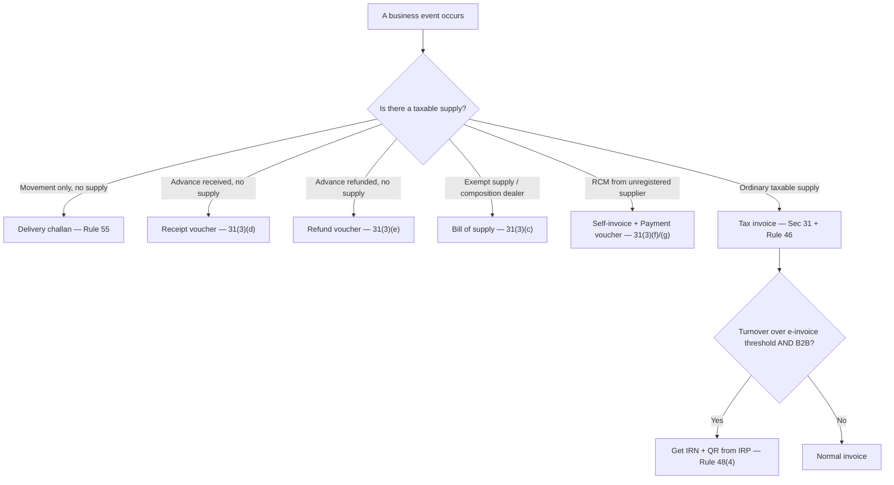
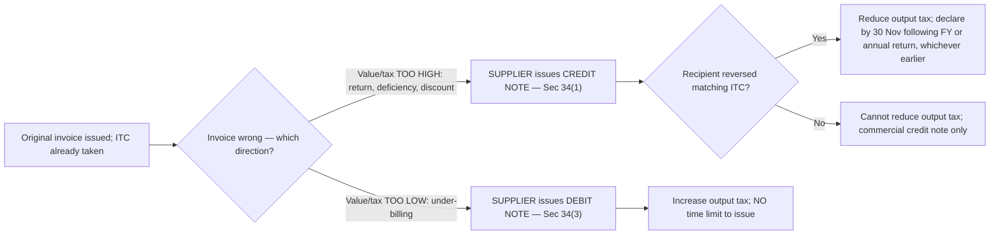

# Q&A — Tax Invoice, Credit & Debit Notes

> CGST Act, 2017 (**Sec 31–34**) read with CGST Rules, 2017 (**Rules 46–55A**); the IGST Act adopts these via **Sec 20 IGST**. **The e-invoicing turnover threshold (currently ₹5 crore aggregate turnover), HSN-digit slabs, the service-invoice window, small-value limits and the credit-note deadline (30 November) are amendment-sensitive — confirm the current figures from the ICAI Study Material/RTP for your attempt.** The *structure* — one pivotal document + substitute documents + correcting notes + e-authentication — is stable and is what the exam tests. GST rate of 18% is used throughout unless stated.

---

## SECTION A — Concept-Check (Short Q&A)

**A1. Why does GST need a *mandatory, standard-format* tax invoice at all?**
Because GST runs on **seamless ITC**, and the recipient's credit is only as real as the supplier's *documented, matchable* liability. **Sec 31 + Rule 46** make the invoice the single token that simultaneously records the supplier's output tax and authorises the recipient's ITC under **Sec 16**. One document, two mirror-image consequences.

**A2. What is the time limit to issue a tax invoice for goods vs services?**
**Goods — Sec 31(1):** before or at the time of **removal** (where movement is involved) or **delivery/making available** (no movement). **Services — Sec 31(2) + Rule 47:** within **30 days** of supply of service (**45 days** for banking companies, insurers and NBFCs). *Why the difference:* goods have a clean physical trigger (removal); services are intangible/continuous, so the law gives a capped window.

**A3. When is a *Bill of Supply* issued instead of a tax invoice, and what does it NOT show?**
**Sec 31(3)(c) + Rule 49** — issued by a **composition** taxpayer and by a supplier of **exempt** goods/services. It shows **NO tax**. A composition dealer must carry the legend *"composition taxable person, not eligible to collect tax on supplies."* *Why:* showing tax would let the recipient wrongly claim ITC on tax never legitimately charged.

**A4. Name the four "money-but-no-supply / no-invoice" documents and their sections.**
(a) **Receipt voucher** — Sec 31(3)(d) + Rule 50, on receiving an advance; (b) **Refund voucher** — Sec 31(3)(e) + Rule 51, when that advance is refunded with no supply; (c) **Payment voucher** — Sec 31(3)(g) + Rule 52, by an RCM recipient on paying the supplier; (d) **Delivery challan** — Rule 55, when goods move without a supply (job-work, stock transfer).

**A5. Who issues a *self-invoice* and why?**
**Sec 31(3)(f)** — the **recipient** issues an invoice to himself when he receives goods/services from an **unregistered supplier under reverse charge**. The unregistered supplier has no GSTIN and can issue nothing; the recipient owes the tax and needs a document to (a) discharge it and (b) later claim ITC.

**A6. A credit note reduces output tax — is that automatic?**
**No (Sec 34(2)).** The supplier may reduce output tax **only if the recipient has correspondingly reversed his ITC.** This symmetry rule protects the treasury: if the supplier reduces tax but the recipient keeps credit, the government loses. It is enforced through the return system (credit note in GSTR-1 → recipient's GSTR-2B → reversal).

**A7. State the time limit to *declare* a credit note.**
**Sec 34(2):** by the **30th November** following the end of the financial year of the original supply, **or** the date of filing the relevant **annual return**, **whichever is earlier**. After this the year is effectively closed for downward adjustments.

**A8. Does a debit note have a time limit to issue?**
**No.** A debit note (**Sec 34(3)**) *increases* output tax — the treasury never objects to more tax, so there is no issue deadline. Note the favourable twist: the **recipient's** ITC time limit under **Sec 16(4)** runs from the **debit note's own financial year**, not the original invoice's.

**A9. Who issues credit and debit notes under GST?**
**Always the SUPPLIER (Sec 34).** A "credit note" a *buyer* sends back is a commercial document with **no GST effect**. This surprises accountants used to commercial practice and is a favourite examiner trap.

**A10. GST credit note vs *commercial/financial* credit note — the distinction?**
If a post-supply discount meets **Sec 15(3)(b)** (pre-agreed, invoice-linked, ITC reversed), the supplier issues a **GST credit note** and reduces output tax. If those conditions fail, the supplier may issue only a **commercial credit note** — the taxable-value leg is settled, but **output tax is NOT reduced** and the recipient need not reverse ITC. Same label, opposite tax effect.

**A11. What is e-invoicing, and what happens if a required IRN is missing?**
**Rule 48(4):** the supplier generates the invoice in his own system in the **INV-01 JSON schema**, uploads it to the **Invoice Registration Portal (IRP)**, and receives an **IRN + signed QR code**. An invoice required to be e-invoiced but **without an IRN is NOT a valid document → the recipient cannot claim ITC.** It is a *pre-authentication* layer that blocks fake invoices before they enter the credit chain.

**A12. Copies of an invoice — goods vs services?**
**Rule 48:** goods → **triplicate** (Original-Recipient, Duplicate-Transporter, Triplicate-Supplier); services → **duplicate** (Original-Recipient, Duplicate-Supplier). The extra copy for goods lets the transporter carry proof during physical movement.

---

## Document-picker decision map

---

## SECTION B — Graded Computational Problems

### B1 (Easy) — Invoice timing, goods vs services
Alpha Ltd **removes** machinery to customer B on **10 July**; goods **reach** B on **14 July**. Alpha also completes a consultancy service to C on **10 July**. State the last date to issue each invoice.

- **Goods (movement) — Sec 31(1)(a):** invoice on or before **removal = 10 July**. Delivery (14 July) is irrelevant.
- **Service — Sec 31(2) + Rule 47:** within **30 days** of supply → on or before **9 August**. If Alpha were a bank/NBFC/insurer → **45 days** → **24 August**.

**Check:** same completion date (10 Jul), different deadlines — because goods have a physical trigger, services get a capped grace window. ✔

### B2 (Easy) — Credit note for a sales return (with the symmetry condition)
On **5 May 2025**, Supplier S sells goods to registered buyer R: taxable value **₹1,00,000**, IGST @18% = **₹18,000** (inter-State). R claims ₹18,000 ITC. On **20 June 2025**, R returns defective goods of taxable value **₹40,000**.

| Party | Original | Credit note (₹40,000 + IGST ₹7,200) | After |
|---|---|---|---|
| S output tax | ₹18,000 | −₹7,200 | **₹10,800** |
| R ITC | ₹18,000 | reverses ₹7,200 | **₹10,800** |

- S issues a **credit note (Sec 34(1))** for value ₹40,000 + IGST ₹7,200.
- S reduces output tax by ₹7,200 **only because** R reverses ₹7,200 ITC (**Sec 34(2)** symmetry).
- **Time-limit check:** supply is FY 2025-26 → declare by **30 Nov 2026** or annual-return date, whichever earlier. 20 Jun 2025 is well within limits.

**Check:** treasury neutral — ₹7,200 less collected from S, ₹7,200 less credited to R. 18% × ₹40,000 = ₹7,200. ✔

### B3 (Moderate) — Debit note for under-billing
On **12 August**, Q invoices a supply at taxable value **₹80,000**, CGST+SGST @18% = **₹14,400**. In **September** Q finds the correct value was **₹90,000**.

- Q issues a **debit note (Sec 34(3))** for the shortfall: taxable value **₹10,000** + tax **₹1,800**.
- Q's output tax **increases by ₹1,800** in the month the debit note is issued. **No time limit** to issue.
- R may claim the extra ₹1,800 ITC; R's Sec 16(4) clock runs from the **debit note's** FY.

**Check:** ₹14,400 + ₹1,800 = ₹16,200 = 18% × ₹90,000. ✔

### B4 (Moderate) — Advance for a service + receipt/refund vouchers
On **3 March 2026**, ConsultCo (registered) receives an advance of **₹1,18,000 (inclusive of 18% GST)** for a service, rate and place known. The client cancels on **10 April 2026** and the money is refunded; no invoice was issued.

- **Advance received:** issue **receipt voucher (Sec 31(3)(d))**. For *services*, receipt of advance is a **time-of-supply** trigger → tax is due on the advance.
- Value = 1,18,000 × 100/118 = **₹1,00,000**; GST = 1,18,000 × 18/118 = **₹18,000** payable for March.
- **Refund with no supply:** issue **refund voucher (Sec 31(3)(e))**; ConsultCo adjusts/claims back the ₹18,000 tax paid on the advance.

**Check:** 1,00,000 + 18,000 = 1,18,000; the receipt voucher tax reverses exactly on refund. ✔

### B5 (Moderate) — Post-supply discount: GST credit note vs commercial credit note
Supplier P sold across the year to dealer D on many invoices: total taxable value **₹50,00,000**, GST **₹9,00,000** (all credited by D). In March, P grants a **year-end volume discount of ₹2,00,000** (GST thereon = ₹36,000).

**Case A — pre-agreed in the contract, invoice-linked, and D reverses ITC (Sec 15(3)(b) met):**
- P issues a **GST credit note** — may be a **single consolidated note** against all the year's invoices (allowed since 2019).
- P reduces output tax by **₹36,000**; D reverses **₹36,000** ITC. Both value and tax adjust.

**Case B — surprise discount, not pre-agreed / D will not reverse (Sec 15(3)(b) NOT met):**
- P issues a **commercial credit note** for ₹2,00,000 only. **No GST adjustment**; D keeps full ₹9,00,000 ITC.
- P effectively bears the ₹36,000 GST.

**Check:** GST difference between cases = ₹36,000 = 18% × ₹2,00,000, exactly the ITC D must reverse in Case A. ✔

### B6 (Exam-hard) — Full ITC set-off with a mid-year credit note
Beta Ltd (regular taxpayer) has the following for a tax period, all intra-State @18% (CGST 9% + SGST 9%):

| Particular | Taxable value | CGST | SGST |
|---|---|---|---|
| Outward supplies | 20,00,000 | 1,80,000 | 1,80,000 |
| **Less:** credit note issued for goods returned (pre-agreed, buyer reverses ITC) | (2,00,000) | (18,000) | (18,000) |
| Inward supplies (eligible ITC) | 12,00,000 | 1,08,000 | 1,08,000 |
| **Add:** debit note received from a vendor (under-billing) | 1,00,000 | 9,000 | 9,000 |

Compute net GST payable in cash.

**Step 1 — Output tax after the credit note (Sec 34):**
- CGST = 1,80,000 − 18,000 = **₹1,62,000**; SGST = 1,80,000 − 18,000 = **₹1,62,000**.

**Step 2 — Eligible ITC (invoice + debit note; Sec 16):**
- CGST ITC = 1,08,000 + 9,000 = **₹1,17,000**; SGST ITC = 1,08,000 + 9,000 = **₹1,17,000**.
- The vendor's **debit note** is a valid ITC document; the buyer's ITC clock runs from the debit note's FY.

**Step 3 — Set-off (CGST ITC only against CGST/IGST; SGST ITC only against SGST/IGST — no cross between CGST and SGST):**
- CGST payable = 1,62,000 − 1,17,000 = **₹45,000** cash.
- SGST payable = 1,62,000 − 1,17,000 = **₹45,000** cash.

**Total cash = ₹90,000.**

**Check:** Net value added = (20,00,000 − 2,00,000) − (12,00,000 + 1,00,000) = 18,00,000 − 13,00,000 = ₹5,00,000. GST on value added = 18% × 5,00,000 = ₹90,000 = ₹45,000 CGST + ₹45,000 SGST. ✔ (The correcting notes flowed straight into the set-off, and the tax equals tax on true value added.)

### B7 (Exam-hard) — Which document + timing across a mixed scenario
Gamma Ltd, a regular registered taxpayer in Maharashtra, records these events. State the correct document, issuer, and section/rule for each.

| # | Event | Document | Issuer | Provision |
|---|---|---|---|---|
| 1 | Inter-State taxable sale of goods, dispatched by truck | Tax invoice (before removal) + e-way bill | Supplier | 31(1)(a) |
| 2 | Sends inputs to a job-worker in the same State | Delivery challan | Consignor | Rule 55 |
| 3 | Receives legal service from an unregistered advocate (RCM) | Self-invoice + payment voucher | Recipient (Gamma) | 31(3)(f)/(g) |
| 4 | Newly registered; supplied before certificate but after effective date | Revised invoice | Supplier | 31(3)(a) + Rule 53 |
| 5 | Sells goods to a walk-in customer for ₹150, customer doesn't want a bill | Consolidated tax invoice at day-end | Supplier | Rule 46 proviso |
| 6 | Sale of goods on sale-or-return basis; approval pending | Invoice by earlier of supply or 6 months from removal | Supplier | 31(7) |

**Check:** every row answers "what is the *truth* of the event?" — supply vs mere movement vs advance vs no-invoice-yet. ✔

### B8 (Exam-hard) — e-invoicing eligibility and ITC consequence
Delta Ltd had aggregate turnover of **₹7 crore** in FY 2023-24. In FY 2025-26 it makes: (i) a B2B supply to a registered buyer, invoice **without IRN**; (ii) a B2C supply; (iii) issues a credit note to a B2B customer without IRN. Advise.

- Turnover **> ₹5 crore** (notified threshold) → Delta **must** e-invoice its **B2B supplies, exports and credit/debit notes** (Rule 48(4)). *(Verify the current threshold for your attempt.)*
- **(i)** B2B invoice without IRN = **not a valid tax invoice** → the buyer **cannot claim ITC** (ties to Sec 16). Delta must generate the IRN.
- **(ii)** **B2C is outside e-invoicing**; no IRN needed (but large taxpayers must show a **dynamic QR code**).
- **(iii)** Credit/debit notes **also require IRN** — the note without IRN is invalid.

**Check:** e-invoicing covers B2B + exports + credit/debit notes above threshold; B2C excluded. ✔

---

## SECTION C — Past-Paper-Style Full Questions

### C1. "State the time limits for issue of tax invoice" (5-mark theory)
**Q.** Explain, with sections, the time limit for issuing a tax invoice in the case of (i) supply of goods involving movement; (ii) supply of goods not involving movement; (iii) supply of services; (iv) continuous supply of services; (v) goods sent on sale-or-return.

**Model answer.**
(i) **Goods with movement — Sec 31(1)(a):** before or at the time of **removal** of goods for supply.
(ii) **Goods without movement — Sec 31(1)(b):** before or at the time of **delivery / making available** to the recipient.
(iii) **Services — Sec 31(2) + Rule 47:** within **30 days** of supply of service (**45 days** for banking companies, insurers, NBFCs).
(iv) **Continuous supply of services — Sec 31(5):** if the due date of payment is ascertainable from the contract → on or before the **due date**; if not → before/at **receipt of payment**; if payment is linked to completion of an event → on or before that **event**.
(v) **Sale-or-return / approval — Sec 31(7):** before or at the time of supply, **or 6 months from removal, whichever is earlier.**

### C2. "Credit note or debit note — decide and compute" (6-mark application)
**Q.** On 4 June 2025, Ramesh & Co (registered, Karnataka) supplied goods to a registered buyer: taxable value ₹5,00,000, CGST 9% + SGST 9%. Later: (a) the buyer returned goods of taxable value ₹80,000 on 15 July 2025; (b) it was found that ₹20,000 of taxable value had been *under-charged* on the original invoice. State the documents, the party who issues them, the tax adjustment, and the time limits.

**Model answer.**
- **(a) Sales return → CREDIT NOTE (Sec 34(1)), issued by Ramesh & Co (supplier).** Value ₹80,000; CGST ₹7,200 + SGST ₹7,200. Ramesh may **reduce output tax by ₹14,400** *only if* the buyer **reverses ₹14,400 ITC (Sec 34(2))**. **Declare by 30 Nov 2026** or the annual-return date for FY 2025-26, whichever earlier.
- **(b) Under-billing → DEBIT NOTE (Sec 34(3)), issued by Ramesh & Co (supplier).** Value ₹20,000; CGST ₹1,800 + SGST ₹1,800 → output tax **increases by ₹3,600**. **No time limit** to issue; the buyer's ITC clock on it runs from the debit note's FY.
- **Key point:** *both* notes are issued by the **supplier** — the buyer never issues a GST credit/debit note.

**Check:** credit note reverses tax on ₹80,000 (₹14,400); debit note adds tax on ₹20,000 (₹3,600). ✔

### C3. "Explain e-invoicing and its interaction with ITC" (5-mark)
**Q.** What is e-invoicing under Rule 48(4)? Who is required to comply, who is exempt, and what is the consequence of issuing a B2B invoice without an IRN?

**Model answer.**
- **Mechanism:** the supplier prepares the invoice in his own system in the standard **INV-01 (JSON) schema**, uploads it to the **Invoice Registration Portal (IRP)**, which validates it and returns a unique **IRN (64-char hash) + signed QR code**. Only then is it a legally valid tax invoice. Data auto-populates GSTR-1 and the e-way bill.
- **Who must:** registered persons whose **aggregate turnover exceeded the notified threshold (currently ₹5 crore)** in *any* FY from 2017-18 onward, for **B2B supplies, exports, and credit/debit notes**. *(Verify current threshold.)*
- **Exempt (regardless of turnover):** SEZ **units** (not developers), insurers, banks/NBFCs, GTAs, passenger-transport suppliers, cinema/multiplex admission suppliers, and government departments/local authorities. **B2C is outside** e-invoicing (large taxpayers display a dynamic QR code).
- **Consequence:** a B2B invoice that *should* carry an IRN but does not is **not a valid document** → the **recipient loses ITC** (Sec 16). *Rationale:* pre-clearance blocks fake invoices before they poison the credit chain.

---

## Correction-engine flow

---

## SECTION D — MCQs / Case Scenarios

**D1.** A tax invoice for supply of goods involving movement must be issued —
(a) within 30 days of removal; (b) before or at the time of removal; (c) on delivery; (d) within 6 months.
**→ (b).** Sec 31(1)(a) ties the invoice to removal, not delivery.

**D2.** A composition dealer supplying goods must issue —
(a) a tax invoice; (b) a bill of supply; (c) a receipt voucher; (d) a debit note.
**→ (b).** Sec 31(3)(c) + Rule 49 — composition dealers cannot collect GST, so they issue a bill of supply showing no tax.

**D3.** Under GST, a credit note that adjusts tax is issued by —
(a) the recipient; (b) the transporter; (c) the supplier; (d) either party.
**→ (c).** Sec 34(1) — only the supplier issues it; a buyer's "credit note" has no GST effect.

**D4.** A supplier can reduce his output tax through a credit note only if —
(a) the goods are physically returned; (b) the recipient reverses the corresponding ITC; (c) a GST officer approves; (d) it is issued within 30 days.
**→ (b).** Sec 34(2) — the symmetry condition protects the treasury.

**D5.** The last date to *declare* a credit note for a supply made in FY 2024-25 is —
(a) 31 March 2025; (b) 30 September 2025; (c) 30 November 2025 or annual-return date, whichever earlier; (d) no limit.
**→ (c).** Sec 34(2). (Amendment-sensitive — verify the 30 Nov date.)

**D6.** The time limit to *issue* a debit note under Sec 34(3) is —
(a) 30 November following the FY; (b) 6 months; (c) there is no time limit; (d) 30 days.
**→ (c).** A debit note increases tax; the law imposes no issue deadline (extra tax is always welcome).

**D7.** Goods sent to a job-worker (no supply) must be accompanied by —
(a) a tax invoice; (b) a bill of supply; (c) a delivery challan; (d) a payment voucher.
**→ (c).** Rule 55 — movement without supply is documented by a delivery challan (in triplicate).

**D8.** A registered person receiving services from an unregistered supplier under RCM must issue —
(a) a bill of supply; (b) a self-invoice; (c) a refund voucher; (d) nothing.
**→ (b).** Sec 31(3)(f) — the recipient self-invoices because the unregistered supplier cannot.

**D9.** For supply of **goods**, a tax invoice is prepared in —
(a) duplicate; (b) triplicate; (c) quadruplicate; (d) a single copy.
**→ (b).** Rule 48 — triplicate (Recipient/Transporter/Supplier); services are in duplicate.

**D10.** An invoice that is required to be e-invoiced but is issued **without an IRN** —
(a) is valid but attracts a penalty; (b) is not a valid document and ITC is denied to the recipient; (c) can be regularised later with no consequence; (d) is valid for B2C only.
**→ (b).** Rule 48(4) read with Sec 16 — no IRN where required → invalid invoice → recipient loses ITC.

**D11. Case scenario.** Neptune Ltd (turnover ₹9 crore) supplies goods to a registered dealer and, separately, to walk-in retail customers. Which of its supplies require an IRN?
(a) both; (b) only the B2B supply; (c) only the B2C supply; (d) neither.
**→ (b).** Turnover exceeds the notified threshold, but e-invoicing covers only B2B/exports/credit-debit notes; **B2C is excluded** (dynamic QR only).

**D12. Case scenario.** On 2 May 2025, S sells goods to R (taxable value ₹1,00,000, IGST ₹18,000). On 1 August 2025 R returns 25% of the goods (pre-agreed, R will reverse ITC). By how much can S reduce output tax, and by when must the credit note be declared?
(a) ₹18,000; by 31 Mar 2026; (b) ₹4,500; by 30 Nov 2025; (c) ₹4,500; by 30 Nov 2026 or annual-return date, whichever earlier; (d) nil; commercial note only.
**→ (c).** 25% × ₹18,000 = ₹4,500 (Sec 34); supply is FY 2025-26, so the deadline is 30 Nov 2026 / annual-return date, whichever earlier.

---

## One-line traps to carry into the hall
- **Only the SUPPLIER** issues credit/debit notes — a buyer's note has no GST effect.
- **Credit note ≠ automatic tax reduction** — needs recipient's ITC reversal (Sec 34(2)) *and* declaration by 30 Nov / annual return.
- **Debit note has NO issue time limit**; the recipient's ITC clock on it runs from the debit note's FY (Sec 16(4)).
- **Invoice date for goods = removal date**, not delivery.
- **Services: 30 days generally, 45 days** only for banks/NBFC/insurers.
- **Composition/exempt → bill of supply** (no tax), not a tax invoice.
- **Post-supply discount reduces GST only if Sec 15(3)(b) is met** — else commercial credit note, supplier eats the GST.
- **E-invoicing = authenticate in your own system (IRN+QR)**, not "generate on the portal"; no IRN where required → no ITC.
- **Goods → triplicate, services → duplicate**; delivery challan for movement without supply (Rule 55).
- **CGST ITC never sets off against SGST** and vice-versa (B6) — a classic set-off slip.
