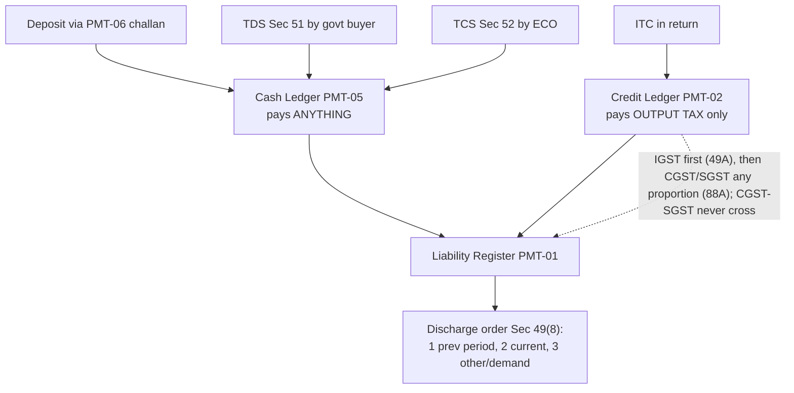

# Q&A — Payment of Tax

> CGST Act, 2017 — **Sections 49, 49A, 49B, 50, 51, 52** read with **Rules 85–88B** and the PMT-series forms; IGST paid under the IGST Act but discharged through the same machinery (Sec 20 IGST applies Sec 49 etc.). **The *mechanism* (three ledgers, utilisation waterfall, discharge order, two interest bases, TDS/TCS as source collections) is permanent. The *numbers* — TDS threshold ₹2,50,000, TDS 2%, TCS 0.5%+0.5%, Rule 86B ₹50 lakh/month trigger, interest 18%/24% — are amendment/notification-sensitive. Confirm the current figures from the ICAI Study Material/RTP for your attempt.**

---

## SECTION A — Concept-Check (Short Q&A)

**A1. Name the three electronic ledgers, their forms, and what each holds.**
**Sec 49.** *Electronic Cash Ledger* (**PMT-05**, Sec 49(1)) — real money deposited via challan PMT-06. *Electronic Credit Ledger* (**PMT-02**, Sec 49(2)) — ITC self-assessed in the return. *Electronic Liability Register* (**PMT-01**, Sec 49(7)) — the running record of all amounts owed (tax, interest, penalty, fee).

**A2. Why are cash and credit kept in two separate ledgers instead of one pool?**
Because they mean different things to the exchequer. **Cash** is fresh revenue; **credit** is merely a bookkeeping offset of tax already collected upstream. Separating them (Sec 49(1) vs 49(2)) lets everyone see how much *real money* a taxpayer contributed — and lets the law restrict the harmless one (credit → output tax only, **Sec 49(4)**) while leaving cash free for any payment (**Sec 49(3)**).

**A3. What can the cash ledger pay, and what can the credit ledger pay?**
**Sec 49(3)** — cash ledger pays **anything**: tax, interest, penalty, fee, or any other amount. **Sec 49(4)** — credit ledger pays **output tax only**; never interest, penalty, late fee, or reverse-charge (RCM) tax.

**A4. State the base utilisation rule of Sec 49(5).**
IGST credit → IGST first, then CGST/SGST in any order. CGST credit → CGST, then IGST, **never SGST** (Sec 49(5)(e)). SGST/UTGST credit → SGST, then IGST, **never CGST** (Sec 49(5)(f)).

**A5. What does Section 49A add on top of 49(5), and what does Rule 88A relax?**
**Sec 49A** — CGST/SGST credit may be used *only after IGST credit is fully exhausted* (IGST-first override). **Rule 88A** — after IGST credit pays IGST, its balance may go to CGST and SGST in **any order and any proportion** — the flexibility that lets you avoid stranding own-head credit.

**A6. Why must IGST credit be exhausted first?**
IGST is the **shared inter-governmental pool** (Centre–State settlement). Draining it first keeps the settlement accounts clean and avoids leaving IGST credit stranded while cash is paid.

**A7. State the mandatory order of discharge under Sec 49(8).**
(1) Self-assessed tax and dues of **previous** tax periods → (2) self-assessed tax and dues of the **current** tax period → (3) **any other amount** payable, including a demand under Sec 73/74. Oldest, most-at-risk claim first; you cannot pay the current return while a previous-period due is open.

**A8. On what amount is interest charged for a *late-filed return*, and why?**
**Proviso to Sec 50(1) + Rule 88B(1)** — interest @18% runs on the **net cash portion only**, not on the ITC set-off portion. Reason: the ITC was already in the exchequer's hands (paid upstream), so the government was never short of that money. **Exception:** if the return is filed *after* Sec 73/74 proceedings commence, interest runs on the **gross** tax.

**A9. When does the higher 24% interest apply?**
**Sec 50(3) + Rule 88B(3)** — only where ITC is **both availed AND utilised** wrongly. Merely availing (parking) wrong credit and reversing it before use attracts **no interest**, because unused credit did the exchequer no harm.

**A10. What is Rule 86B and Rule 86A?**
**Rule 86B** — where **taxable turnover (excl. exempt/zero-rated) in a month exceeds ₹50 lakh**, at least **1% of output tax must be paid in cash** (credit covers at most 99%); stops discharge with 100% fake ITC. **Rule 86A** — the Commissioner may **block** use of the credit ledger on reasonable belief of fraudulent/ineligible ITC (a restraint, not a rate).

**A11. TDS under Sec 51 — who, how much, threshold, and where it lands?**
Deductors = government departments, local authorities, notified persons (e.g. PSUs). Deduct **2% (1% CGST + 1% SGST, or 2% IGST)** where the taxable value **under a contract exceeds ₹2,50,000** (excluding GST). No TDS where supplier location + place of supply are in a State different from the recipient's registration State. Return **GSTR-7** by 10th, certificate **GSTR-7A**; amount lands in the **supplier's cash ledger**.

**A12. TCS under Sec 52 — who, how much, on what base?**
An **Electronic Commerce Operator** collects **up to 1% (0.5% CGST + 0.5% SGST, or 1% IGST)** on the **net value of taxable supplies** (supplies − returns) made through it by other sellers. Not applicable where the ECO itself pays under **Sec 9(5)**. Return **GSTR-8** by 10th; amount lands in the **supplier's cash ledger**.

**A13. What is Form PMT-09 for?**
**Sec 49(10)** — transfer of an amount **within the cash ledger** from one tax head/minor-head to another (e.g. IGST-interest → CGST-tax). **Sec 49(11)** confirms it is *not* treated as a refund. It fixes stranded/wrongly-deposited cash; it never touches the credit ledger.

---

## SECTION B — Graded Computational Problems

### B1 (Easy) — Straight set-off with IGST credit balance

**Given (one month):**

| Head | Output liability | ITC available |
|---|---|---|
| IGST | 60,000 | 90,000 |
| CGST | 70,000 | 40,000 |
| SGST | 70,000 | 30,000 |
| **Total** | **2,00,000** | **1,60,000** |

**Step 1 — IGST credit first (Sec 49A).** IGST credit 90,000 pays IGST 60,000. Balance IGST credit = **30,000**.
**Step 2 — Balance IGST credit to CGST (Rule 88A).** Apply 30,000 to CGST → CGST still needs 70,000 − 30,000 = 40,000. IGST credit now zero.
**Step 3 — Own-head credit.** CGST credit 40,000 pays remaining CGST 40,000 → CGST discharged, CGST credit zero. SGST credit 30,000 pays part of SGST → remaining SGST = 70,000 − 30,000 = 40,000.
**Step 4 — Cash.** SGST 40,000 from cash ledger.

| Head | Liability | IGST credit | Own credit | Cash |
|---|---|---|---|---|
| IGST | 60,000 | 60,000 | — | 0 |
| CGST | 70,000 | 30,000 | 40,000 | 0 |
| SGST | 70,000 | — | 30,000 | 40,000 |
| **Total** | **2,00,000** | **90,000** | **70,000** | **40,000** |

**Reconciliation:** credit used 90,000 + 70,000 = 1,60,000 = total ITC; cash 40,000; 1,60,000 + 40,000 = **2,00,000 = total liability. ✓** Nothing stranded.

### B2 (Moderate) — "Any proportion" (Rule 88A) decides cash outflow

**Given:** Output — CGST 1,20,000, SGST 1,20,000, IGST **nil**. ITC — IGST 1,20,000, CGST 30,000, SGST 1,00,000.

There is no IGST liability, so the full ₹1,20,000 IGST credit must be spread over CGST and SGST — and *how* you split it changes the cash.

**Suboptimal (dump IGST credit into CGST first):**
- CGST 1,20,000 = IGST credit 1,20,000 → paid, but **CGST own-credit 30,000 stranded** (can only pay CGST/IGST, both now nil).
- SGST 1,20,000 = SGST credit 1,00,000 + **cash 20,000**.
- **Cash = 20,000; 30,000 CGST credit carried forward unused.**

**Optimal (route IGST credit to the head with weaker own-credit = CGST):**
- CGST 1,20,000 = own CGST credit 30,000 + **IGST credit 90,000** → paid, no cash.
- SGST 1,20,000 = own SGST credit 1,00,000 + **IGST credit 20,000** → paid, no cash.
- IGST credit used = 90,000 + 20,000 = 1,10,000; **balance IGST credit 10,000 c/f.**
- **Cash = 0.**

**Reconciliation:** liability 2,40,000; ITC 2,50,000. Optimal: credit used 2,40,000, cash 0, 10,000 IGST credit c/f. **✓** The mechanical split wastes ₹20,000 cash and strands ₹30,000 credit; Rule 88A's *any proportion* avoids it — always send the IGST balance to the head whose own-head credit is short.

### B3 (Moderate) — Interest on a delayed return (net-cash basis)

**Given:** GSTR-3B due **20th**, filed **50 days late**. Output — IGST 40,000, CGST 60,000, SGST 60,000. ITC — IGST 50,000, CGST 25,000, SGST 25,000. (Assume a 365-day year.)

**Step 1 — set-off.**
- IGST credit 50,000: pays IGST 40,000; balance 10,000 → apply to CGST.
- CGST 60,000 = IGST 10,000 + CGST credit 25,000 = 35,000 → cash **25,000**.
- SGST 60,000 = SGST credit 25,000 → cash **35,000**.

**Step 2 — net cash liability = 25,000 + 35,000 = ₹60,000.** Interest (proviso to Sec 50(1) + Rule 88B(1)) runs only on this ₹60,000, not on the ₹1,00,000 met by ITC.

**Step 3 — interest @18% for 50 days:**
- CGST: 25,000 × 18% × 50/365 = 4,500 × 50/365 = **₹616.44**
- SGST: 35,000 × 18% × 50/365 = 6,300 × 50/365 = **₹863.01**
- **Total = ₹1,479.45 (≈ ₹1,479).**

**Cross-check:** 60,000 × 18% × 50/365 = 10,800 × 50/365 = **₹1,479.45. ✓**
**Contrast:** on gross tax ₹1,60,000 → 1,60,000 × 18% × 50/365 = **₹3,945.21** — the proviso saves ₹2,466 by not taxing time-value on credit already with the exchequer.

### B4 (Moderate) — Interest at 24% on wrongly utilised ITC

**Given:** A taxpayer wrongly availed IGST credit of ₹80,000. Of this, ₹50,000 was **utilised** to pay output tax; the remaining ₹30,000 sat unused and was reversed on discovery. Days of default on the utilised portion = 90.

**Answer (Sec 50(3) + Rule 88B(3)):** Interest @**24%** applies **only on the ₹50,000 actually utilised**, from date of utilisation to date of reversal/payment. The ₹30,000 merely availed but reversed before use attracts **no interest**.
Interest = 50,000 × 24% × 90/365 = 12,000 × 90/365 = **₹2,958.90 (≈ ₹2,959).**
*Trap:* charging 24% on the full ₹80,000 is wrong — "availed" alone is not enough; it must be "availed **and** utilised."

### B5 (Exam-hard) — Combined set-off + Rule 86B + net-cash interest

**Given (one month):** Output — IGST 1,00,000, CGST 3,00,000, SGST 3,00,000 (total **7,00,000**). ITC — IGST 1,50,000, CGST 2,80,000, SGST 2,90,000. Monthly **taxable turnover = ₹80 lakh** (so Rule 86B applies). Return filed **30 days late**; assume 365 days.

**Step 1 — set-off (optimise via Rule 88A).**
- IGST credit 1,50,000 pays IGST 1,00,000 → balance 50,000. Send it to CGST (the head we will test for cash).
- CGST 3,00,000 = own CGST credit 2,80,000 + IGST credit 20,000 = 3,00,000 → **CGST fully by credit** (IGST credit balance now 50,000 − 20,000 = 30,000).
- SGST 3,00,000 = own SGST credit 2,90,000 + IGST credit 30,000 = 3,20,000 available, need 3,00,000 → covered; IGST credit fully used, SGST own-credit 10,000 unused → **SGST fully by credit**.

Pure set-off would give **cash = 0**. But **Rule 86B** overrides: at least **1% of output tax must be paid in cash**.

**Step 2 — Rule 86B floor.** 1% of total output tax 7,00,000 = **₹7,000 minimum cash**, regardless of available credit. So ₹7,000 must be discharged in cash (credit may cover the other 99% = ₹6,93,000). The taxpayer therefore pays ₹7,000 cash and carries the corresponding unused credit forward.

**Step 3 — interest on late return.** Net cash liability here is the Rule 86B-mandated **₹7,000** (the only cash actually payable this month). Interest @18% for 30 days = 7,000 × 18% × 30/365 = 1,260 × 30/365 = **₹103.56 (≈ ₹104).**

**Reconciliation:** liability 7,00,000 = credit used 6,93,000 + cash 7,000. **✓** Rule 86B converts what looked like a zero-cash month into a ₹7,000 minimum cash outflow, on which the late-filing interest then runs.
*Note:* Rule 86B has exceptions (e.g. large income-tax paid in prior years, refunds > ₹1 lakh, government bodies) — verify the current list for your attempt.

### B6 (Exam-hard) — TDS with threshold and inter-state mismatch

**Given:** (i) A State Govt department contracts intra-state works of **₹6,00,000** (excl. GST) @18%; supplier and place of supply in the department's own State. (ii) A second contract of **₹2,50,000** (excl. GST). (iii) A third contract of **₹4,00,000** where the supplier's location + place of supply are in **State X** but the recipient department is registered in **State Y**.

**Contract (i):** Value 6,00,000 **> 2,50,000** → **TDS applies**. TDS = 2% of 6,00,000 = **₹12,000 (CGST 6,000 + SGST 6,000)**. GST on invoice = 1,08,000 (54,000 + 54,000); invoice total 7,08,000. Department pays supplier 7,08,000 − 12,000 = **₹6,96,000** and deposits ₹12,000 via **GSTR-7** by the 10th; supplier's **cash ledger** credited ₹12,000.
**Contract (ii):** Value **exactly 2,50,000** — threshold is *exceeds* ₹2,50,000 → **NO TDS**.
**Contract (iii):** Supplier/PoS State ≠ recipient's registration State → **NO TDS** (the mismatch exemption, Sec 51), even though 4,00,000 > threshold.

### B7 (Exam-hard) — TCS on net value through an ECO

**Given:** In a month, sellers make taxable supplies of **₹25,00,000** through an e-commerce operator; **₹3,00,000** of goods are returned. Separately, ₹5,00,000 of supplies are those on which the **ECO itself is liable under Sec 9(5)**. All intra-state.

**Step 1 — exclude Sec 9(5) supplies.** TCS is only on supplies by *other sellers*: 25,00,000 − 5,00,000 = ₹20,00,000.
**Step 2 — net value.** 20,00,000 − 3,00,000 (returns) = **₹17,00,000**.
**Step 3 — TCS @1%.** = **₹17,000 (CGST 8,500 + SGST 8,500)**, deposited via **GSTR-8** by the 10th; credited to the **sellers' cash ledgers**.
*Trap:* returns are netted *before* applying the rate, and Sec 9(5) supplies never enter the base.

---

## SECTION C — Past-Paper-Style Full Questions

**C1. "M/s Alpha Ltd (registered in Delhi) has, for the month, output tax of IGST ₹90,000, CGST ₹1,50,000, SGST ₹1,50,000, and ITC of IGST ₹1,20,000, CGST ₹1,00,000, SGST ₹80,000. Compute the minimum cash payable under each head, utilising ITC in the most beneficial manner. State the provisions."**

*Provisions:* Sec 49(5), 49A and Rule 88A. IGST credit first (fully), then CGST/SGST credit; balance IGST credit spread in the best proportion.

- **IGST liability 90,000** = IGST credit 90,000 → balance IGST credit 30,000.
- Route the ₹30,000 IGST balance to **SGST** (SGST own-credit 80,000 is weaker than CGST 1,00,000).
- **CGST 1,50,000** = CGST credit 1,00,000 + cash **50,000**.
- **SGST 1,50,000** = SGST credit 80,000 + IGST credit 30,000 = 1,10,000 → cash **40,000**.

| Head | Liability | IGST credit | Own credit | Cash |
|---|---|---|---|---|
| IGST | 90,000 | 90,000 | — | 0 |
| CGST | 1,50,000 | — | 1,00,000 | 50,000 |
| SGST | 1,50,000 | 30,000 | 80,000 | 40,000 |
| **Total** | **3,90,000** | **1,20,000** | **1,80,000** | **90,000** |

**Reconciliation:** credit 1,20,000 + 1,80,000 = 3,00,000; cash 90,000; total = **3,90,000. ✓** Minimum cash = **CGST 50,000 + SGST 40,000 = ₹90,000**; IGST cash nil.
*(Routing the IGST balance to CGST instead would still give total cash ₹90,000 here since both heads have surplus liability over own-credit — but the habit of feeding the weaker head is what protects you when one head's own-credit would otherwise be stranded.)*

**C2. "Explain, with the statutory basis, why interest on a belatedly filed GSTR-3B is computed only on the net cash liability, and state the one situation where it is instead computed on the gross tax."**

*Model answer:* Under the **proviso to Sec 50(1)**, read with **Rule 88B(1)**, where a return is filed after the due date, interest @18% p.a. is levied only on the tax paid by **debiting the electronic cash ledger** (the net cash component). The rationale: the ITC portion of the liability was already deposited with the government upstream by the earlier supplier, so the exchequer was never actually deprived of that money — charging interest on it would be double counting. **Exception:** where the return is furnished **after commencement of proceedings under Sec 73 or 74**, interest is charged on the **gross** tax liability (Rule 88B(2) basis), because the concession is meant for honest late filers, not for those regularised only after detection. This proviso was given **retrospective effect from 1 July 2017**.

**C3. "Distinguish TDS (Sec 51) from TCS (Sec 52) under GST on: who deducts/collects, rate, base, threshold, return, and where the amount is credited."**

| Feature | TDS — Sec 51 | TCS — Sec 52 |
|---|---|---|
| Who | Govt dept / local authority / notified persons (buyer side) | Electronic Commerce Operator (platform) |
| Rate | **2%** (1% CGST + 1% SGST / 2% IGST) | **up to 1%** (0.5% + 0.5% / 1% IGST) |
| Base | Taxable value under a contract (excl. GST) | Net value of taxable supplies (supplies − returns) |
| Threshold | Contract value **> ₹2,50,000** | No threshold |
| Not applicable | Supplier/PoS State ≠ recipient's reg. State | Supplies where ECO pays under Sec 9(5) |
| Return / cert. | **GSTR-7** by 10th; cert. **GSTR-7A** | **GSTR-8** by 10th; annual statement |
| Credited to | **Supplier's electronic cash ledger** | **Supplier's electronic cash ledger** |

Both are **collections at source** at choke-points (Problem 4 of the design), not fresh taxes; both feed the real supplier's cash ledger as pre-paid tax.

---

## SECTION D — MCQs / Case Scenarios

**D1.** The electronic credit ledger can be used to pay —
(a) tax, interest and penalty (b) output tax only (c) any liability including late fee (d) RCM tax
**Ans: (b).** Sec 49(4) restricts the credit ledger to output tax; interest/penalty/fee/RCM are cash only.

**D2.** After IGST credit pays IGST liability, its balance can be applied to CGST and SGST —
(a) equally only (b) CGST first, then SGST (c) in any order and any proportion (d) SGST first, then CGST
**Ans: (c).** Rule 88A gives free choice of order and proportion once IGST is paid.

**D3.** CGST credit can be used to pay —
(a) CGST then SGST (b) CGST then IGST (c) any head (d) SGST then IGST
**Ans: (b).** Sec 49(5)(e) — CGST then IGST; never SGST.

**D4.** Interest @24% under Sec 50(3) applies when ITC is —
(a) merely availed (b) availed and utilised (c) reversed before use (d) carried forward
**Ans: (b).** Rule 88B(3) — the credit must be both availed and utilised.

**D5.** A government department awards a taxable contract of ₹2,50,000 (excl. GST). TDS to be deducted —
(a) ₹5,000 (b) ₹2,500 (c) Nil (d) ₹10,000
**Ans: (c).** Sec 51 triggers only where value *exceeds* ₹2,50,000; exactly ₹2,50,000 = no TDS.

**D6.** Under Sec 49(8), which is discharged first?
(a) current-period self-assessed tax (b) previous-period dues (c) Sec 73/74 demand (d) interest of current period
**Ans: (b).** Order of discharge: previous-period dues → current-period dues → other amounts/demands.

**D7.** Rule 86B (1% cash) is triggered when monthly **taxable** turnover exceeds —
(a) ₹50 lakh (b) ₹1 crore (c) ₹20 lakh (d) ₹1.5 crore
**Ans: (a).** Per month, on taxable turnover (excl. exempt/zero-rated); at least 1% of output tax in cash.

**D8.** Transfer of wrongly-deposited amount between heads of the cash ledger is done through —
(a) PMT-03 (b) PMT-06 (c) PMT-09 (d) GSTR-7
**Ans: (c).** Sec 49(10), Form PMT-09; treated as not a refund (Sec 49(11)).

**D9.** An ECO's TCS is computed on —
(a) gross supplies (b) net value = supplies − returns (c) supplies + tax (d) Sec 9(5) supplies
**Ans: (b).** Sec 52 — net value; Sec 9(5) supplies are excluded (ECO pays as supplier there).

**D10 (Case).** X Ltd files GSTR-3B 20 days late. Output tax ₹2,00,000, of which ₹1,50,000 was set off by ITC and ₹50,000 paid in cash. Interest @18% (365-day year) is —
(a) on ₹2,00,000 (b) on ₹50,000 (c) nil (d) on ₹1,50,000
**Ans: (b).** Proviso to Sec 50(1) — net cash only. Amount = 50,000 × 18% × 20/365 = **₹493.15**.

**D11 (Case).** A deposits ₹10,000 as IGST-tax but should have paid it as CGST-tax. To correct without claiming a refund he should —
(a) file a refund claim (b) use PMT-09 to transfer within the cash ledger (c) reverse credit ledger (d) file GSTR-7
**Ans: (b).** Sec 49(10)/PMT-09 moves cash between heads; Sec 49(11) says it is not a refund.

---

## Ledger-and-payment flow (revision map)

---

**Golden reconciliation check for every set-off sum:** *ITC used + Cash paid = Total output liability*, and no head-credit should be stranded if it could legally have been applied. Re-verify all rates and thresholds (TDS ₹2,50,000/2%, TCS 0.5%+0.5%, Rule 86B ₹50L/month, interest 18%/24%) against current ICAI material and notifications for your attempt — the mechanism is permanent, the figures are not.
