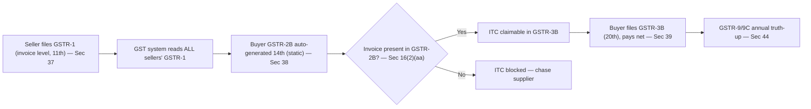

# Q&A — Returns

> CGST Act, 2017 **Sec 37–48** (returns) read with **Sec 16(2)(aa)** (ITC gate), **Sec 50** (interest) and **CGST Rules 59–68**; the IGST Act applies these via **Sec 20 IGST**. **The return system is the single most amendment-prone corner of GST.** Every due date, the QRMP turnover threshold (₹5 crore), the late-fee caps/slabs, the nil-return fee, and the current form of Rule 36(4) are **notification-driven — verify the live figures against the ICAI Study Material/RTP for your attempt.** The *architecture* (GSTR-1 → GSTR-2B → GSTR-3B, sequential filing, annual truth-up) is stable and is what the exam actually tests.

---

## SECTION A — Concept-Check (Short Q&A)

**A1. Why does a self-assessed tax like GST *need* periodic returns at all?**
Two reasons. (i) Under self-assessment the State has **no independent record** of a taxpayer's transactions — the return is the periodic, machine-readable ledger of "what I supplied, what I owe, what credit I claim." (ii) A value-added tax must **cross-verify** the buyer's ITC claim against the seller's declared liability, or fake ITC on bogus invoices drains the treasury. Returns weld each buyer's credit to a specific seller's declaration.

**A2. What does GSTR-1 declare, and why must it be invoice-level (Sec 37)?**
GSTR-1 is the **outward-supply statement** — every sale invoice, B2C summaries, exports, credit/debit notes, amendments. It must be invoice-level because **the buyer's credit is invoice-specific**: only granular data lets the system split the seller's declaration and route each invoice's tax to the correct buyer's GSTR-2B. Granularity in GSTR-1 = precision in the credit chain.

**A3. Distinguish GSTR-2A from GSTR-2B — the examiner's favourite.**
Both are auto-drafted inward-supply views. **GSTR-2A is dynamic** — it keeps updating as suppliers file/amend. **GSTR-2B (Sec 38, Rule 60) is static** — frozen once generated on the 14th, and it is the **authoritative basis for claiming ITC** under Sec 16(2)(aa). ITC must sit on a *fixed* number for a period; a moving basis could never be reconciled.

**A4. What exactly is the "credit gate" in Sec 16(2)(aa)?**
ITC on an invoice/debit note is available **only if** the supplier furnished it in *his* GSTR-1 **and** it has been communicated to the recipient (i.e. it appears in GSTR-2B). If the seller never declared the invoice, it never reaches the buyer's 2B and the buyer **cannot claim it** — the buyer's credit becomes hostage to the seller's filing.

**A5. What does GSTR-3B do, and how is it different from GSTR-1 (Sec 39)?**
GSTR-3B is the **summary return that pays the tax**: consolidated output tax − eligible ITC = net payable, discharged from the credit ledger then the cash ledger. GSTR-1 is invoice-level *declaration*; GSTR-3B is summary *settlement*. GSTR-1 moves data; GSTR-3B moves money.

**A6. State the two sequential-filing rules and their single purpose.**
(i) **Sec 37(4):** cannot file GSTR-1 if any earlier GSTR-1 is pending. (ii) **Sec 39(10):** cannot file GSTR-3B for a period unless GSTR-1 for the **same period** is filed (and cannot leapfrog a pending earlier 3B). Purpose: keep the pipeline **filled and in order** — the seller's invoices must exist before he pays, so buyers' 2B is populated.

**A7. What is QRMP, who is eligible, and what stays monthly?**
**Q**uarterly **R**eturn, **M**onthly **P**ayment — for registered persons with aggregate turnover **up to ₹5 crore** (*verify*) in the preceding FY. **Returns become quarterly** (GSTR-1 by 13th, GSTR-3B by 22nd/24th) but **tax stays monthly** via PMT-06 for the first two months. It relieves the small taxpayer without starving the treasury of monthly cash.

**A8. What is the IFF and why was it bolted on?**
The **Invoice Furnishing Facility** lets a QRMP filer upload B2B invoices for the first two months of a quarter (by the 13th). Without it, a purely quarterly GSTR-1 would leave the small seller's *buyers* with an empty GSTR-2B for up to three months. IFF keeps the buyer's credit pipeline flowing.

**A9. Why file an annual return (GSTR-9) when you already filed twelve GSTR-3Bs (Sec 44)?**
Monthly 3B is a summary filed under time pressure; errors and timing mismatches drift. **GSTR-9 is the truth-up** — it reconciles what was declared/paid across the year against the books and forces payment of any shortfall. **GSTR-9C** (self-certified) reconciles the annual return with **audited financials** above a turnover limit.

**A10. Late fee (Sec 47) vs interest (Sec 50) — why two separate charges?**
The **late fee** prices the delayed *declaration* (the missing ledger entry) — a per-day charge because the harm grows daily. **Interest** prices the delayed *money* (the treasury's lost time-value of tax). Different harms, different heads.

**A11. Interest rates under Sec 50 — the two limbs.**
**Sec 50(1): 18% p.a.** on tax paid late, computed on the **net cash** portion (not the part met from ITC already sitting in the credit ledger). **Sec 50(3): 24% p.a.** on ITC **wrongly availed AND utilised** — the higher rate punishes credit that was both wrong and used.

**A12. Can the Electronic Credit Ledger (ITC) pay interest and late fee?**
**No.** ITC can discharge only **tax**. Interest, late fee and penalty must be paid from the **Electronic Cash Ledger**. A classic trap.

**A13. What are the first return (Sec 40) and the notice to defaulters (Sec 46)?**
**Sec 40:** a newly registered person declares in his first return the outward supplies made **between the date he became liable to register and the date registration was granted** — the gap is not lost. **Sec 46:** on non-filing, the officer issues **GSTR-3A** giving 15 days; ignore it and **best-judgement assessment (Sec 62)** follows.

**A14. Flag the amendment-sensitive numbers in this chapter.**
All due dates; the ₹5 crore QRMP threshold; the ₹100+₹100/day late fee and its turnover-slabbed caps; the nil-return fee (₹10+₹10); the 3-year time-bars (Sec 37(5)/39(11)/44); and the current form of Rule 36(4). Verify each before the exam.

---

## Return pipeline (one machine, mandatory input order)

---

## SECTION B — Graded Computational Problems (full step-by-step)

### B1 (Easy) — Net cash payable in GSTR-3B
Monthly filer, intra-State supplies only, May 2026. Output: CGST ₹90,000, SGST ₹90,000. Eligible ITC per GSTR-2B: CGST ₹50,000, SGST ₹50,000. Opening ledgers nil. Compute net cash.

| Head | Output | Less ITC | Net cash |
|---|---|---|---|
| CGST | 90,000 | (50,000) | 40,000 |
| SGST | 90,000 | (50,000) | 40,000 |
| **Total** | 1,80,000 | (1,00,000) | **80,000** |

**Answer:** Net tax **₹80,000** (₹40,000 CGST + ₹40,000 SGST) paid from the cash ledger; the ₹1,00,000 ITC discharges the rest from the credit ledger. *Data reconciles: 80,000 + 1,00,000 = 1,80,000 output.* (Sec 39)

### B2 (Easy–Moderate) — Interest and late fee on delayed GSTR-3B (Sec 50(1), Sec 47)
Facts: net tax payable ₹1,90,000 (cash), due 20 June, filed & paid **28 June** (8 days late). Non-nil return, within cap.

**Step 1 — Interest, Sec 50(1) @ 18% p.a. on the net cash tax:**
= 1,90,000 × 18% × 8/365 = 1,90,000 × 0.18 × 0.021918 = **₹750** (rounded).
*Interest runs on ₹1,90,000, NOT on gross output — the ITC portion was already tax in the system.*

**Step 2 — Late fee, Sec 47:** 8 days × ₹200/day (₹100 CGST + ₹100 SGST) = **₹1,600**.

**Step 3 — Total cash outflow on 28 June:**

| Head | ₹ |
|---|---|
| Net tax | 1,90,000 |
| Interest (Sec 50(1)) | 750 |
| Late fee (Sec 47) | 1,600 |
| **Total (all from cash ledger)** | **1,92,350** |

*Trap: interest and late fee can NEVER be paid from ITC.*

### B3 (Moderate) — The full ITC set-off order (Sec 49, Rule 88A) inside GSTR-3B
Facts (monthly filer, June 2026). Output tax: **IGST ₹1,00,000, CGST ₹80,000, SGST ₹80,000**. ITC available per GSTR-2B: **IGST ₹1,50,000, CGST ₹30,000, SGST ₹30,000**. Set off using the mandated order: **IGST credit first (against IGST, then CGST/SGST in any order), then CGST credit against CGST/IGST, then SGST credit against SGST/IGST. CGST↔SGST cross-utilisation is barred.**

**Step 1 — Utilise IGST credit ₹1,50,000 (must be exhausted first, Sec 49(5)(a)/Sec 49A):**
- vs IGST output ₹1,00,000 → uses 1,00,000; IGST output nil. IGST credit left ₹50,000.
- Remaining ₹50,000 IGST credit → apply to CGST output ₹80,000 → uses 50,000; CGST output left ₹30,000. IGST credit now nil.

**Step 2 — Utilise CGST credit ₹30,000 (vs CGST, then IGST — no IGST left):**
- vs CGST output ₹30,000 → uses 30,000; CGST output nil. CGST credit nil.

**Step 3 — Utilise SGST credit ₹30,000 (vs SGST, then IGST — no IGST left):**
- vs SGST output ₹80,000 → uses 30,000; SGST output left ₹50,000. SGST credit nil.

**Step 4 — Cash payable (whatever output remains):**

| Head | Output | Set off by | Cash |
|---|---|---|---|
| IGST | 1,00,000 | IGST 1,00,000 | 0 |
| CGST | 80,000 | IGST 50,000 + CGST 30,000 | 0 |
| SGST | 80,000 | SGST 30,000 | 50,000 |
| **Total** | **2,60,000** | **2,10,000 (ITC)** | **50,000** |

**Answer:** Net cash = **₹50,000 SGST only.**
**Reconciliation:** Total ITC used = 1,00,000 + 50,000 + 30,000 + 30,000 = **₹2,10,000** = total ITC available (1,50,000+30,000+30,000). Output 2,60,000 − ITC 2,10,000 = cash 50,000. ✓ *Note the trap: SGST is left short and CGST credit cannot cross over to pay it.*

### B4 (Moderate–Hard) — GSTR-1 timing decides GSTR-2B (Sec 37 → Sec 38 → Sec 16(2)(aa))
Beta Ltd (monthly) makes April 2026 purchases: from **Alpha** ₹10,00,000 + IGST ₹1,80,000 (Alpha files GSTR-1 on 10 May); from **Gamma** (QRMP, **no IFF**) ₹4,00,000 + IGST ₹72,000 (reaches system only on quarterly GSTR-1, 13 July). Beta's output IGST for April = ₹2,50,000. What ITC and net cash in Beta's **April GSTR-3B**?

**Step 1 — Beta's April GSTR-2B (generated 14 May):** contains only Alpha's ₹1,80,000 (filed 10 May). Gamma's ₹72,000 is absent (no IFF, quarterly GSTR-1 not yet filed).

**Step 2 — Sec 16(2)(aa) gate:** claimable ITC = ₹1,80,000. Gamma's ₹72,000 is **blocked in April**; it appears in Beta's **July** 2B and is claimable then (subject to the Sec 16(4) annual limit).

**Step 3 — Net cash:** Output IGST 2,50,000 − ITC 1,80,000 = **₹70,000** cash.

**Lesson:** Beta paid ₹72,000 of *real* tax to Gamma but cannot use it yet — solely because Gamma delayed disclosure. The design is working: the chain polices itself, and Beta will pressure Gamma to use IFF.

### B5 (Exam-Hard) — Annual reconciliation truth-up (Sec 44) with interest
Delta Ltd, FY 2025-26. **Books:** outward taxable turnover ₹2,05,00,000, output tax ₹36,90,000. **Sum of twelve GSTR-3Bs:** turnover ₹2,00,00,000, output tax ₹36,00,000. A March invoice of ₹5,00,000 (tax ₹90,000, intra-State → CGST ₹45,000 + SGST ₹45,000) was omitted and never corrected. The shortfall is paid via **DRC-03 on 30 Sept 2026**; March 3B due date was **20 April 2026** (163 days delay). No ITC available to offset (it is short-*paid output*).

**Step 1 — Reconcile:**

| | Books | GSTR-3B (sum) | Difference |
|---|---|---|---|
| Turnover | 2,05,00,000 | 2,00,00,000 | 5,00,000 |
| Output tax | 36,90,000 | 36,00,000 | **90,000** |

**Step 2 — GSTR-9 surfaces the ₹90,000** declared in books but never paid. Delta pays it in cash via DRC-03 (CGST 45,000 + SGST 45,000).

**Step 3 — Interest, Sec 50(1) @ 18% p.a., from original due date (20 Apr) to payment (30 Sep) = 163 days:**
= 90,000 × 18% × 163/365 = 90,000 × 0.18 × 0.446575 = **₹7,235** (rounded).

**Step 4 — Total on 30 Sept:** tax ₹90,000 + interest ₹7,235 = **₹97,235** (all cash).

**Reconciliation / lesson:** After payment, returns now match books (36,90,000). GSTR-9 is the mechanism that forces the taxpayer to find and fix his own drift before an audit does it for him; GSTR-9C would additionally tie the return universe to *audited* financials.

---

## SECTION C — Past-Paper-Style Full Questions

**C1. "Explain the concept of GSTR-2B and its role in claiming input tax credit. How does it differ from GSTR-2A?" (5 marks)**
**Model answer.** GSTR-2B (Sec 38, Rule 60) is a **static, auto-generated statement of the ITC available** to a recipient for a tax period, compiled by the system on the **14th** of the month from all suppliers' GSTR-1/IFF, GSTR-5 (non-resident), GSTR-6 (ISD) and ICEGATE import data. Once generated it does **not change** for that period. Its role: under **Sec 16(2)(aa)** a recipient may claim ITC **only if** the invoice appears in GSTR-2B — it is the authoritative, single, fixed figure carried into GSTR-3B. **Difference from GSTR-2A:** GSTR-2A is **dynamic** (updates continuously as suppliers file/amend) and serves as a live reference only, whereas GSTR-2B is **static/frozen** and is the *basis* for ITC. The static nature exists so ITC can be reconciled against a fixed number rather than a moving target. *(This is the anti-fraud lock: no seller declaration → no buyer credit.)*

**C2. "Discuss the QRMP scheme — eligibility, the returns and payments involved, and the purpose of the Invoice Furnishing Facility." (6 marks)**
**Model answer.** **Eligibility:** registered persons with aggregate turnover **up to ₹5 crore** (*verify*) in the preceding FY may opt for **Quarterly Return, Monthly Payment**. **Returns:** GSTR-1 quarterly (by 13th of month after the quarter) and GSTR-3B quarterly (by **22nd or 24th**, staggered by State/UT to spread server load). **Payment:** tax is still paid **monthly** for the first two months via challan **PMT-06**, using either the **fixed-sum method** (35% of the preceding period's cash paid) or **self-assessment**. **Purpose of IFF:** a purely quarterly GSTR-1 would leave the small seller's buyers with an **empty GSTR-2B** for up to three months; the **IFF** lets the seller upload B2B invoices for the first two months (by 13th) so the buyer's credit pipeline keeps flowing. The scheme balances three interests: relieve the small taxpayer (quarterly returns), don't starve the exchequer (monthly PMT-06), don't break the buyer's credit (IFF).

**C3. "State the provisions relating to late fee (Sec 47) and interest (Sec 50) on returns, and explain why they are separate levies." (5 marks)**
**Model answer.** **Late fee (Sec 47):** a **per-day** charge for late filing of GSTR-1/GSTR-3B/annual return — **₹100 CGST + ₹100 SGST = ₹200/day**, subject to a turnover-slabbed **maximum**; **nil returns** attract a reduced fee (₹10 + ₹10 = ₹20/day). **Interest (Sec 50):** **50(1) — 18% p.a.** on tax paid late, on the **net cash** portion (not the ITC-funded portion); **50(3) — 24% p.a.** on ITC **wrongly availed and utilised**. **Why separate:** the late fee prices the delayed *declaration* — the missing ledger entry, whose harm grows daily, hence per-day; interest prices the delayed *money* — the treasury's lost time-value of tax. Neither can be discharged from the ITC/credit ledger; both are payable from the **cash ledger**. *(Caps, slabs and rates are notification-sensitive — verify.)*

**C4. "A newly registered person and a person whose registration is cancelled each have a special return. Identify and explain them." (4 marks)**
**Model answer.** **First return — Sec 40:** the newly registered person declares, in his first return, the **outward supplies made between the date he became liable to register and the date registration was actually granted**, so no supply in the gap period escapes. **Final return — GSTR-10, Sec 45:** a person whose registration is **cancelled** must file GSTR-10 **within three months** of the date of cancellation (or order), declaring closing stock and any liability — it closes the account on exit. *(Contrast with the annual GSTR-9, which is a going-concern reconciliation, not an exit return.)*

---

## SECTION D — MCQs / Case Scenarios

**D1.** GSTR-1 for a monthly filer is due on the —
(a) 10th (b) **11th** (c) 13th (d) 20th
**Answer: (b) 11th** — outward statement is filed early so the system can build buyers' 2B by the 14th. (Sec 37, Rule 59)

**D2.** ITC can be claimed only if the invoice appears in GSTR-2B. This condition is in —
(a) Sec 16(1) (b) Sec 16(4) (c) **Sec 16(2)(aa)** (d) Sec 17(5)
**Answer: (c)** — the credit gate tying ITC to the supplier's GSTR-1 communication. *(Sec 16(4) is the separate time-limit to claim.)*

**D3.** Which ledger can be used to pay a late fee under Sec 47?
(a) Electronic Credit Ledger (b) **Electronic Cash Ledger** (c) Either (d) ITC of IGST only
**Answer: (b)** — ITC pays only tax; interest/late fee/penalty are cash-only.

**D4.** A QRMP taxpayer pays tax for the first two months of a quarter through —
(a) GSTR-3B (b) CMP-08 (c) **Challan PMT-06** (d) DRC-03
**Answer: (c)** — monthly payment via PMT-06 (fixed-sum or self-assessment); the *return* is quarterly.

**D5.** GSTR-2B is generated on the ___ and is ___ .
(a) 14th; dynamic (b) **14th; static** (c) 20th; static (d) 11th; dynamic
**Answer: (b)** — frozen on the 14th so ITC rests on a fixed number. (Sec 38, Rule 60)

**D6. Case scenario.** Sun Ltd omits its March GSTR-1 but tries to file April's GSTR-1. The portal blocks it. Why?
(a) April 3B is pending (b) **Sec 37(4) — cannot file GSTR-1 while an earlier GSTR-1 is unfiled** (c) GSTR-2B not generated (d) Turnover exceeded QRMP limit
**Answer: (b)** — sequential filing forbids leapfrogging; the pipeline must fill in order.

**D7. Case scenario.** A composition dealer asks which returns he files. Correct pair —
(a) GSTR-1 + GSTR-3B (b) GSTR-5 + GSTR-9 (c) **CMP-08 (quarterly payment) + GSTR-4 (annual)** (d) GSTR-6 + GSTR-9C
**Answer: (c)** — composition sits *outside* the ITC chain, so its returns are thin: quarterly payment statement (CMP-08) and an annual return (GSTR-4).

**D8. Case scenario.** X Ltd wrongly availed and utilised ITC of ₹2,00,000. The interest rate is —
(a) 18% (b) nil (c) **24% p.a. (Sec 50(3))** (d) 12%
**Answer: (c)** — the higher rate applies because the credit was both **wrong and used**; 18% (Sec 50(1)) applies to merely late tax.

**D9.** GSTR-3B for a monthly filer cannot be filed unless —
(a) GSTR-9 is filed (b) **GSTR-1 for the same period is filed (Sec 39(10))** (c) GSTR-2B is downloaded (d) late fee is paid
**Answer: (b)** — declare (GSTR-1) before you settle (GSTR-3B).

**D10.** The self-certified reconciliation of the annual return with audited financials is —
(a) GSTR-9 (b) **GSTR-9C** (c) GSTR-10 (d) GSTR-4
**Answer: (b)** — GSTR-9C reconciles GSTR-9 with audited accounts above the turnover limit (Sec 44).

---

## First-principles recap
The return system is **one directed pipeline, not a set of forms**: seller's GSTR-1 → system → buyer's GSTR-2B → buyer's GSTR-3B → annual GSTR-9 truth-up. Every rule is either (i) *filling* the pipeline (invoice-level GSTR-1, IFF), (ii) *ordering* it (sequential filing, Sec 37(4)/39(10)), (iii) *gating* credit to it (Sec 16(2)(aa), static 2B), or (iv) *enforcing* it (late fee Sec 47, interest Sec 50, defaulter notice Sec 46). Master the pipeline and the numbers — all amendment-sensitive — hang off it logically.
