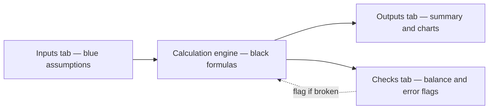
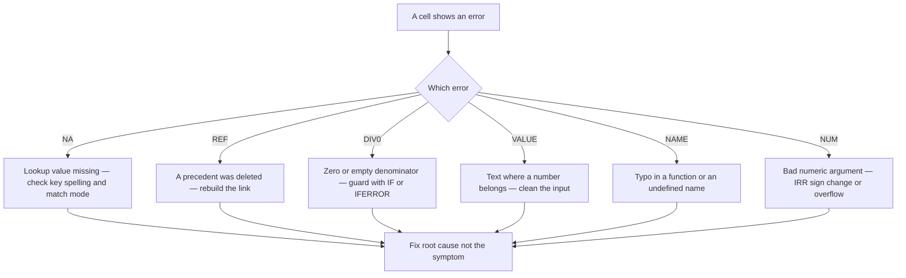
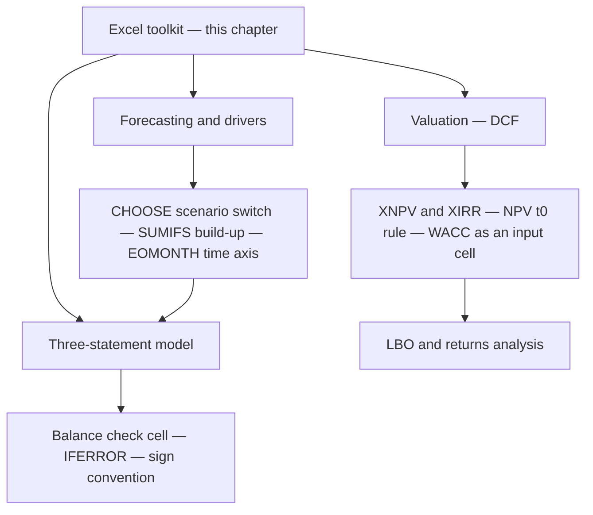
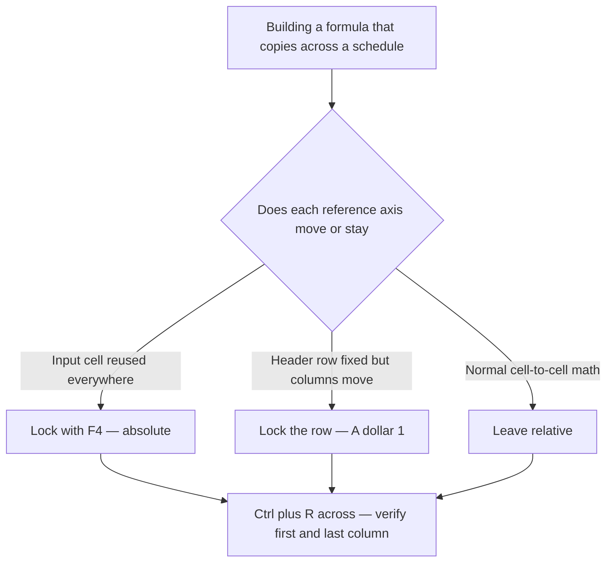

<!-- v2-deep -->

# Chapter 01 — Excel for Finance — the Analyst Toolkit

## 1. The Problem — the analyst need

Sit down at any bank, private-equity fund, corporate FP&A team, or equity-research desk and you will find the same first tool open on every screen: Microsoft Excel. Before you value a company, before you forecast revenue, before you build a leveraged-buyout model, you have to *operate the spreadsheet* — fluently, quickly, and without breaking it.

Here is the concrete problem. A financial model is a large, interconnected calculation: hundreds or thousands of cells, feeding a three-statement engine that must balance, driven by a handful of assumptions that a decision-maker will change on the fly in a meeting. The analyst's job is to build that calculation so it is (a) **correct**, (b) **auditable** by a stranger, (c) **flexible** — one input changes and the whole thing re-flows — and (d) **fast to build under deadline**. Every one of those four requirements is a *skill*, not a formula. Correctness needs the right functions used the right way. Auditability needs formatting discipline (you must be able to tell an input from a calculation at a glance). Flexibility needs formula structures that don't hard-code numbers. Speed needs keyboard fluency because a mouse-driven analyst is three times slower than a keyboard-driven one.

The tragedy of most self-taught modelers is that they know finance but treat Excel as a glorified calculator — they hard-code numbers into formulas, mix inputs and outputs, use nested `IF`s where a lookup belongs, and navigate by mouse. The model works once, then breaks the moment someone changes an assumption, and no one (including the author, three weeks later) can trace where a number came from. This chapter fixes that. It is the toolkit every later chapter silently assumes you already own.

To make the stakes tangible: the 2012 "London Whale" trading loss at JP Morgan was amplified by a value-at-risk spreadsheet where an analyst copied results between cells by hand and divided by a *sum* instead of an *average*, understating risk by roughly half. The 2012 Reinhart-Rogoff austerity paper that guided real government policy contained a `=SUM()` range that stopped five rows short, dropping five countries from the average. Neither error was a finance error. Both were *spreadsheet-operation* errors. The discipline in this chapter is not pedantry — it is the difference between a model you can bet on and a landmine.

## 2. The Core Idea — Excel as the analyst's operating system

Think of Excel not as a program you *use* but as an **operating system you live inside**. An OS has a few primitives — files, processes, a keyboard interface — and everything else is composition. Excel's primitives are the same small set:

- **The grid** (cells addressed by column-letter + row-number) is your memory.
- **References** (`A1`, `$A$1`, ranges, sheet-qualified links) are your pointers.
- **Functions** are your standard library.
- **The keyboard** is your command line.
- **Formatting** is your syntax highlighting — the visual language that tells a reader *what kind of thing* each cell is.

A master analyst uses Excel the way a senior developer uses a terminal: hands never leave the keyboard, a small vocabulary of powerful commands composed endlessly, and a strict convention for what everything *looks* like so the code reads itself. The functions in this chapter are your standard library. The shortcuts are your command line. The colour conventions are the type system. Learn the primitives cold, and every model you ever build is just composition on top of them.

There is a second half to the operating-system metaphor: **layout is architecture**. A well-built model, like well-built software, separates concerns into layers. Inputs live in one place (the assumptions tab), the engine transforms them (calculation tabs), and outputs present them (summary and chart tabs). Data flows in one direction — *inputs feed calculations feed outputs* — and never loops back informally. The moment a summary tab hard-codes a number that should have come from the engine, you have coupled two layers that should be independent, and the model rots. Keep the layers clean and a reviewer can reason about any one of them in isolation.


*Figure 2.1 — the three-layer architecture. Data flows left to right; the checks layer watches the engine and raises a flag rather than feeding numbers back in.*

## 3. Why it works

Why does a spreadsheet — a 1980s idea — remain the operating system of finance in an age of Python, R, and BI tools?

**Transparency.** In a model, every intermediate value is *visible in its own cell*. Unlike code, where logic hides inside functions, a spreadsheet forces you to lay out each step on the grid. A managing director can click any number and see the formula behind it. Finance runs on *accountability for numbers*, and Excel makes every number accountable.

**The dependency graph is free.** When you write `=B5*C5`, Excel builds a directed graph: change `B5` and every dependent recalculates automatically. You get live sensitivity, scenario switching, and "what-if" for free. That recalculation engine is exactly what a forecast needs — assumptions ripple through the statements instantly. Internally Excel topologically sorts the dependency graph so each cell is computed only after its precedents; this is also *why* an accidental cycle (a circular reference) is special — it has no valid position in that sort order, and Excel must either refuse it or switch to iterative solving.

**Universality.** Everyone in finance reads Excel. A model is a *communication artifact* as much as a calculation — it gets emailed to a client, marked up by a partner, uploaded to a data room. A Python script does not survive that workflow; an `.xlsx` does. When a buy-side analyst receives a sell-side model, they expect to open it, click through the logic, and stress it in their own meeting within minutes — no environment, no dependencies, no `pip install`.

The cost of this power is discipline. Because every cell can contain anything, a spreadsheet with no conventions becomes an unauditable swamp. The functions, formatting rules, and habits below are precisely the discipline that turns the raw power into reliable models. The trade Excel makes is *flexibility for safety*: a database enforces types and relationships, but a spreadsheet lets you type anything anywhere. Conventions are the guardrails you add back voluntarily.

## 4. Full Technical Content

### 4.1 References — the thing you must understand before any function

Every formula is built from references, and the single most common beginner error is getting *relative vs absolute* wrong when copying.

| Reference | Meaning when copied | Use for |
|---|---|---|
| `A1` | Both column and row move | Normal cell-to-cell math along a row/column |
| `$A$1` | Locked — never moves | A single constant referenced everywhere (e.g. a tax rate) |
| `$A1` | Column locked, row moves | Copying across columns but pulling from one input column |
| `A$1` | Row locked, column moves | Copying down but always pulling from one header row |

Press **F4** while the cursor is on a reference to cycle `A1 → $A$1 → A$1 → $A1 → A1`. This is the highest-leverage keystroke in modeling. The rule of thumb: *if a formula copies across a whole schedule, ask for each reference "does this axis move or stay?" and lock accordingly.*

A precise way to internalise it: the `$` freezes the axis it sits in front of. `$` before the **letter** freezes the *column*; `$` before the **number** freezes the *row*. When you copy a cell three columns right and two rows down, Excel adds +3 to every *un-frozen* column letter and +2 to every *un-frozen* row number. Work through it once by hand and you never guess again.

*Worked mixed-reference example.* Build a multiplication-style grid. Put growth rates down column `A` (`A2=5%`, `A3=10%`, `A4=15%`) and base values across row 1 (`B1=100`, `C1=200`, `D1=300`). You want each interior cell to be `base * (1 + growth)`. In `B2` write:

```
=B$1*(1+$A2)
```

`B$1` locks the row (always read the base from row 1) but lets the column move; `$A2` locks the column (always read the growth from column A) but lets the row move. Copy `B2` across to `D2` and down to `B4:D4` in one fill and the whole 3×3 grid is correct. `C3` becomes `=C$1*(1+$A3)` = `200*1.10` = **220**; `D4` becomes `=D$1*(1+$A4)` = `300*1.15` = **345**. Get one `$` wrong and the diagonal looks right while the corners are garbage — which is exactly why you always test the *last* cell, never just the first.

Sheet-qualified references look like `'Assumptions'!$B$5` (single quotes needed when the sheet name has spaces). Best practice in a multi-tab model: **pull, don't push** — a calculation sheet reaches back to the assumptions sheet; assumptions never reach forward. **Named ranges** are the readable form of an absolute reference: define `Tax_Rate` to point at `'Assumptions'!$B$5`, and every formula that uses `Tax_Rate` is both self-documenting and immune to row insertion. Names are implicitly absolute, so you rarely need `$` on them.

### 4.2 The essential function library

These are the functions that appear in essentially every professional model. Learn their exact syntax.

**IF — conditional logic**

```
=IF(logical_test, value_if_true, value_if_false)
```
Example: `=IF(D5>0, D5*Tax_Rate, 0)` — only tax positive profit. Keep nesting shallow; more than 2–3 levels means you want a lookup table instead (`IFS`, `CHOOSE`, or `INDEX/MATCH`). Two companions you will reach for constantly: `AND(cond1, cond2, …)` and `OR(cond1, cond2, …)` collapse multiple tests into one — `=IF(AND(D5>0, Region="West"), D5*Bonus, 0)`. And `IFS(test1, val1, test2, val2, …)` replaces a deep `IF` ladder with a flat list of test-then-value pairs, evaluated top to bottom, which reads far more cleanly than three closing parentheses.

**INDEX / MATCH — the professional's lookup**

```
=INDEX(return_range, MATCH(lookup_value, lookup_range, 0))
```
`MATCH` finds the *position* of a value; `INDEX` returns whatever sits at that position in another range. The `0` in `MATCH` forces an **exact** match. Why prefer this over `VLOOKUP`? Three reasons: it can look *leftward* (VLOOKUP only looks right of the key), it doesn't break when columns are inserted (VLOOKUP's hard-coded column index silently returns the wrong column), and it is faster on large sheets. A two-way lookup uses two `MATCH`es:
```
=INDEX(data, MATCH(row_key, row_labels, 0), MATCH(col_key, col_labels, 0))
```

The third `MATCH` argument matters more than beginners realise. `0` = exact match (unordered data). `1` = largest value ≤ lookup, requires the lookup range sorted **ascending** — this is how you snap a number into a *band*, e.g. mapping a credit score to a rating tier. `-1` = smallest value ≥ lookup, requires **descending** order. Approximate match on *unsorted* data is a classic silent-wrong-answer bug: it does not error, it just returns whatever it stumbled onto when the value crossed the target.

**XLOOKUP — the modern one-function lookup** (Excel 365 / 2021+)

```
=XLOOKUP(lookup_value, lookup_array, return_array, [if_not_found], [match_mode], [search_mode])
```
Example: `=XLOOKUP(E2, Tickers, Prices, "N/A")`. It looks both directions, defaults to exact match, and takes a built-in "not found" argument so you don't wrap it in `IFERROR`. The `search_mode` argument `-1` searches *bottom-up*, which returns the **most recent** matching row when a key repeats — perfect for pulling the latest price for a ticker from an append-only log. `XLOOKUP` can also return an entire row or column (a spill), so a single formula can fetch a whole record. Use it when you know the file stays in a modern Excel; fall back to `INDEX/MATCH` for maximum compatibility (older versions and some corporate environments still lack `XLOOKUP`).

**SUMIF / SUMIFS — conditional aggregation**

```
=SUMIF(criteria_range, criteria, sum_range)
=SUMIFS(sum_range, criteria_range1, criteria1, criteria_range2, criteria2, …)
```
Note the *argument order flips*: `SUMIF` puts the sum range last; `SUMIFS` puts it first. `SUMIFS` handles multiple conditions — e.g. sum revenue where Region = "West" AND Year = 2025. Sibling functions `COUNTIFS`, `AVERAGEIFS`, `MAXIFS`, `MINIFS` follow the `SUMIFS` order. Criteria accept operators as text: `">="&$B$1` sums where the value is at least the number in `B1`; `"<>West"` sums everything that is not West; `"*Corp"` with wildcards sums text ending in "Corp". These are the backbone of turning transaction-level data into summarized model inputs.

**OFFSET — dynamic ranges** (use sparingly)

```
=OFFSET(anchor, rows_down, cols_right, [height], [width])
```
Returns a range shifted from an anchor. Powerful for rolling windows (e.g. a trailing-12-month sum) and dynamic chart ranges. Caveat: `OFFSET` is **volatile** — it recalculates on every change anywhere in the workbook, which slows large models. Prefer `INDEX` (non-volatile) to build dynamic ranges where possible: `INDEX` can return a reference, so `range_start:INDEX(...)` gives a dynamic range without volatility. Example of a non-volatile trailing sum of the last 3 columns ending at the current one is far safer than the equivalent `OFFSET` construction.

**CHOOSE — index-driven switching**

```
=CHOOSE(index_num, value1, value2, …)
```
The classic scenario switch. Put a scenario selector cell (1 = Base, 2 = Bull, 3 = Bear) and drive growth off it: `=CHOOSE($C$1, 0.05, 0.10, 0.02)`. One cell flips the entire model between cases. This is how professional scenario toggles are built. In a mature model you would not hard-code the three rates inside `CHOOSE` — you would point at three blue input cells (`=CHOOSE($C$1, C2, C3, C4)`) so the cases themselves stay editable. `CHOOSE` can also switch whole *ranges*, which lets a single toggle swap an entire assumptions column.

**EOMONTH — date arithmetic for periods**

```
=EOMONTH(start_date, months)
```
Returns the last day of the month, `months` away from `start_date`. `=EOMONTH(A1, 0)` is month-end of `A1`; `=EOMONTH(A1, 1)` is next month-end. This is how you build a monthly or quarterly time axis that lands on real period-end dates — essential for any dated cash-flow model. Companion: `EDATE` (same day, N months later), `YEARFRAC` (fraction of a year between two dates, needed for day-count in interest and XIRR logic), and `EDATE`/`EOMONTH` together handle every "N periods out" question. Excel stores dates as serial numbers (1 = 1-Jan-1900), so date subtraction just yields a day count — `=EOMONTH(A1,3)` for quarter-end steps, `=EOMONTH(A1,12)` for annual.

**NPV / IRR / XNPV / XIRR — the valuation core**

```
=NPV(rate, value1, value2, …)          discounts a stream ONE period out from t0
=IRR(values, [guess])                   rate where NPV = 0, evenly spaced periods
=XNPV(rate, values, dates)              NPV with actual calendar dates
=XIRR(values, dates, [guess])           IRR with actual calendar dates
```

The single most important subtlety in all of finance-in-Excel: **`NPV` assumes the first value arrives at the end of period 1, not at t=0.** So if you have an initial outlay at time zero followed by cash flows, the correct construction is:

```
=CF0 + NPV(rate, CF1:CFn)
```
— hold the t0 cash flow *outside* the `NPV` and add it. Putting `CF0` inside `NPV` discounts it by one period, understating everything. `XNPV`/`XIRR` remove this trap entirely because they take explicit dates and discount each flow by its actual day-count from the first date — always prefer them when cash flows are irregular (which real deals are). Two more edge cases to know cold: `IRR` needs *at least one sign change* (a negative then positives) or it returns `#NUM!`; and a stream with *multiple* sign changes (outflow, inflows, then a large outflow) can have **multiple IRRs** — the `[guess]` argument nudges Excel toward the root you want, but the honest fix is to switch to NPV, which is single-valued. `XNPV`/`XIRR` also *require* the first date to be the earliest and discount everything relative to it.

### 4.3 Formatting conventions — the type system of modeling

This is not decoration. Colour is *information*. The near-universal convention on professional desks:

| Element | Colour / format | Meaning |
|---|---|---|
| **Inputs / assumptions / hard-coded numbers** | **Blue font** | "A human can change this" |
| **Formulas / calculations** | **Black font** | "Computed — do not touch" |
| **Links to another worksheet** | **Green font** | "Pulled from another tab" |
| **Links to another workbook** | **Red font** | "External — fragile, verify" |
| Headers / section titles | Bold, often a fill colour | Navigation |
| Units / currency notes | Grey italic | Context |

The reason is auditability: anyone opening the model must instantly tell *what they may change* (blue) from *what is derived* (black). A model where a hard-coded number hides inside a black formula is a landmine — someone updates the assumption sheet, but that buried constant never moves, and the model is silently wrong. **Golden rule: no raw numbers inside formulas.** The only numbers that ever get typed live in blue input cells; formulas reference those cells. A formula like `=B5*1.05` is a bug waiting to happen — the `1.05` should be a blue growth-rate input `=B5*(1+$C$2)`.

Additional formatting best practice:
- **Number formats**: comma separators for thousands, parentheses or red for negatives `(1,234)`, consistent decimal places. Percentages as percentages, not `0.05`.
- **Never** merge cells in the modeling area — it breaks selection, copy-fill, and navigation. Use "Center Across Selection" if you need centered headers.
- **Column A / B narrow, as margins**; start labels in column B or C. Gives the model a clean left gutter and room to indent sub-items.
- **Consistent sign convention**: decide up front whether costs are negative or positive and hold it everywhere. Most models keep the income statement with costs as positives (subtracted in the formula) and cash-flow outflows as negatives.
- **Group and outline** (Alt+Shift+Right) rows into collapsible sections rather than hiding them.
- **Units in one place, once.** State the scale ("USD millions") in a header row, then keep the whole tab in that scale. Mixing thousands and millions inside one schedule is a top-three source of order-of-magnitude blunders in real reviews.
- **Custom number formats** encode meaning without changing the value: `#,##0;(#,##0);"-"` shows positives plain, negatives in parentheses, and zeros as a dash so the sheet reads cleanly. A trailing comma in a format code (`#,##0,`) divides the *display* by a thousand — a fast way to show a millions-scale figure held in thousands without a helper cell.

To make the convention enforceable rather than aspirational: select all constants at once with **Go To Special** (`Ctrl+G` → Special → Constants → Numbers) and colour them blue in a single action; then Go To Special → Formulas and confirm they are all black. Any *number* that shows up highlighted inside the formula selection is a hard-code hiding in a calculation — exactly the landmine you are hunting.

### 4.4 Efficiency — the keyboard is the command line

A professional almost never touches the mouse while building. The core navigation and editing shortcuts (Windows):

| Shortcut | Action |
|---|---|
| **Ctrl + Arrow** | Jump to edge of contiguous data block |
| **Ctrl + Shift + Arrow** | *Select* to edge of block |
| **Ctrl + Space / Shift + Space** | Select entire column / row |
| **F2** | Edit the active cell (cursor into formula) |
| **F4** | Toggle absolute/relative reference (in edit); *repeat last action* (outside edit) |
| **Alt + =** | AutoSum |
| **Ctrl + D / Ctrl + R** | Fill Down / Fill Right from cell above/left |
| **Ctrl + C, Ctrl + Alt + V** | Copy, then Paste Special (values, formats, etc.) |
| **F9** | Recalculate all; *in a selected formula fragment, evaluate just that piece* |
| **Ctrl + \`** (grave) | Toggle show-formulas view |
| **Ctrl + [** | Jump to the precedent cell a formula points to |
| **Ctrl + Page Up / Down** | Move between worksheet tabs |
| **Alt (then letters)** | Ribbon key-tips — every ribbon command has a keyboard path |
| **Ctrl + 1** | Format Cells dialog |
| **Alt + Shift + Right/Left** | Group / ungroup rows or columns |
| **Ctrl + G then Alt+S** | Go To Special — select constants, formulas, blanks, errors |
| **Ctrl + Shift + Enter** | Legacy array-formula entry (pre-dynamic-arrays) |
| **Ctrl + Shift + L** | Toggle AutoFilter on a table |
| **Ctrl + T** | Convert a range to a structured Table |

Two habits that compound: (1) build one column of a schedule fully, then **Ctrl+R across** the whole time axis — this forces you to get your `$` locks right once and propagate correctly; (2) navigate by `Ctrl+Arrow` and named ranges, never by scrolling.

Two more that separate the fast from the slow. **Paste Special is a toolkit, not one command**: `Ctrl+Alt+V` then `V` pastes values only (kills a formula, keeps its result — the standard way to "freeze" an output); then `T` pastes formats; then `M` (or the "Add" operation) *adds* the copied numbers onto the destination, which lets you apply a uniform adjustment across a block without a helper column. And **F9-on-a-fragment** is the single best debugging move in Excel: in edit mode, highlight any sub-expression of a formula, press F9, and Excel replaces it with its computed value in place so you can see exactly which piece is wrong — then press **Esc** (never Enter) to restore the formula unharmed.

### 4.5 Error-checking and auditing

Models are wrong until proven right. Build in checks as you go.

- **`IFERROR(formula, fallback)`** wraps a calculation so a `#DIV/0!` or `#N/A` doesn't cascade into every downstream cell. Use judiciously — a genuine error you *hide* is worse than one you see. Prefer catching only where an error is expected (e.g. a ratio with a zero denominator in year 0). A tighter tool is `IFNA(formula, fallback)`, which traps only `#N/A` (the "lookup didn't find it" case) and lets a `#REF!` or `#DIV/0!` — which signal *structural* breakage — surface loudly.
- **The balance check.** In a three-statement model, put a cell `=Total Assets − Total Liabilities − Equity` and conditionally format it red if ≠ 0. If your balance sheet balances, the check reads 0; a non-zero flags a broken link instantly. This single cell has saved more models than any other technique. Add a **master check cell** at the top of the model — `=IF(SUM(all_individual_checks)=0, "OK", "ERROR")` — so one glance at the cover tells you whether *any* check anywhere has tripped.
- **Beware floating-point residue in checks.** A balance check can read `0.0000001` instead of `0` because binary floating point cannot represent every decimal exactly. Compare with a tolerance: `=IF(ABS(Assets-Liabs-Equity)<0.01, "OK", "OFF")`, or wrap the difference in `ROUND(…, 2)`. A check that flags on `1e-9` cries wolf and gets ignored — which defeats the check.
- **Error-trace tools**: `Trace Precedents` / `Trace Dependents` (Formulas ribbon) draw arrows showing what feeds a cell; `Ctrl+[` jumps to precedents; **F9-on-a-fragment** (select part of a formula in edit mode, press F9) evaluates just that sub-expression so you can see *which piece* is wrong, then Esc to avoid overwriting. **Evaluate Formula** (Formulas ribbon) steps through a nested formula one calculation at a time when F9-fragmenting is fiddly.
- **Common Excel errors and their meaning:**

| Error | Cause |
|---|---|
| `#DIV/0!` | Division by zero or empty cell |
| `#N/A` | Lookup value not found |
| `#REF!` | A referenced cell was deleted — a broken link |
| `#VALUE!` | Wrong data type (text where a number is expected) |
| `#NAME?` | Misspelled function or undefined named range |
| `#NUM!` | Invalid numeric argument — e.g. IRR with no sign change, or a too-large power |
| `#SPILL!` | A dynamic-array result is blocked by data in the spill range |
| Circular reference warning | A cell depends on itself (see below) |

- **Circularity**: interest-on-debt that depends on the cash balance which depends on interest creates a legitimate circular loop. Handle it with a **circularity switch** (a toggle cell that zeroes the interest link to break the loop) plus enabling *iterative calculation* (File → Options → Formulas). Never leave uncontrolled circularity — it makes models unstable and produces `0` or garbage when they "blow up." A robust pattern: keep the switch off by default, flip it on only when you deliberately want the loop to solve, and pair it with a **circularity breaker** copy-paste-values routine so a corrupted iteration can be reset without rebuilding.


*Figure 4.1 — triage an Excel error by its type, then fix the cause rather than papering over it with IFERROR.*

## 5. Worked Examples

### Example 1 — INDEX/MATCH two-way lookup for a sensitivity grid

Suppose an assumptions block on a sheet:

| | B (2023) | C (2024) | D (2025) |
|---|---|---|---|
| **5** Revenue | 1,000 | 1,150 | 1,300 |
| **6** EBIT | 200 | 250 | 310 |

You want a formula that returns EBIT for whatever *year* and *line item* a user picks in cells `H1` (item) and `H2` (year). Set row labels in `A5:A6` = {Revenue, EBIT}, column headers in `B4:D4` = {2023, 2024, 2025}.

```
=INDEX($B$5:$D$6, MATCH($H$1, $A$5:$A$6, 0), MATCH($H$2, $B$4:$D$4, 0))
```

With `H1 = "EBIT"` and `H2 = 2025`: inner `MATCH("EBIT", A5:A6, 0)` = 2 (second row); `MATCH(2025, B4:D4, 0)` = 3 (third column); `INDEX(B5:D6, 2, 3)` = **310**. Reconciles with the table. Change `H2` to 2024 and it returns 250 — no formula edit needed. This is the machinery behind every scenario table and data lookup in a model.

*What-if variation — the XLOOKUP equivalent.* The same two-way lookup in modern Excel nests two `XLOOKUP`s, the outer returning a row, the inner selecting the column:
```
=XLOOKUP($H$1, $A$5:$A$6, XLOOKUP($H$2, $B$4:$D$4, $B$5:$D$6))
```
The inner `XLOOKUP` returns the *column* for 2025 (`{1300;310}`), and the outer picks "EBIT" from it → **310**. Identical answer, and it degrades to `"N/A"` gracefully if you add the fourth argument. *Edge case:* if `H1` is typed as `"ebit "` with a trailing space, exact match fails and you get `#N/A` — real data is dirty, so wrap lookups against user input in `TRIM()` or validate the entry with a dropdown (Data Validation → List) so typos are impossible.

### Example 2 — NPV done right vs the classic mistake

A project: outflow of **−1,000** at t=0, then inflows **300, 400, 500, 400** at the end of years 1–4. Discount rate **10%**. Lay out cash flows in `B2:F2` = {−1000, 300, 400, 500, 400}, rate in `B4` = 10%.

**Correct:**
```
=B2 + NPV($B$4, C2:F2)
```
Compute the discounted inflows:

| Year | CF | Discount factor 1/1.1^t | PV |
|---|---|---|---|
| 1 | 300 | 0.9091 | 272.73 |
| 2 | 400 | 0.8264 | 330.58 |
| 3 | 500 | 0.7513 | 375.66 |
| 4 | 400 | 0.6830 | 273.21 |
| | | **Σ PV inflows** | **1,252.18** |

NPV = −1,000 + 1,252.18 = **+252.18**. Positive → the project creates value at a 10% hurdle.

**The classic mistake** — putting the t0 outflow *inside* NPV:
```
=NPV($B$4, B2:F2)   ← WRONG
```
This discounts the −1,000 by one extra year (treats it as arriving at end of year 1), giving −909.09 + (300/1.1² + 400/1.1³ + …) = **+229.24** — understated by ~22.9. Here is the clean way to *prove* the error to yourself: the wrong answer is exactly the right answer discounted one more period — 252.18 / 1.10 = **229.25** (the small gap is rounding). Every flow, including the outlay, got shifted one period late, so the entire NPV is uniformly divided by (1 + rate). Always: `=CF0 + NPV(rate, CF1:CFn)`.

**Cross-check with IRR:** `=IRR(B2:F2)` on the full stream (which *does* start at t0) ≈ **20.5%**. Since 20.5% > 10% hurdle, IRR confirms a positive NPV — the two methods reconcile. (IRR takes the whole array starting at t0 and needs the sign change from −1000 to +300, which we have.)

### Example 3 — one-variable and two-variable sensitivity with a Data Table

Take the same project. How does NPV move as the discount rate changes? Lay the rates you want to test down a column, say `H2:H4` = {8%, 10%, 12%}, and in `I1` put a formula that *points at the NPV cell* (`=B6`, where `B6` holds the correct NPV). Select `H1:I4`, then **Data → What-If Analysis → Data Table**, and in "Column input cell" point at the discount-rate input `B4`. Excel re-runs the whole model once per rate and fills the column:

| Discount rate | NPV |
|---|---|
| 8% | 311.64 |
| 10% | 252.17 |
| 12% | 196.83 |

Reconcile the middle row against Example 2: 252.17 matches. NPV falls monotonically as the discount rate rises — exactly the shape valuation intuition predicts, because a higher hurdle punishes distant cash flows more. This one-variable table *is* the engine behind a DCF sensitivity strip.

*Two-variable extension.* Put test rates across a row and, say, a revenue-growth assumption down a column; the output formula sits in the **top-left corner** of the block; feed the row input cell and the column input cell in the dialog. Excel produces a full grid — the same machinery that generates the classic valuation "football field" and the price/EPS sensitivity tables in equity research. *Trap:* a Data Table is volatile-ish and recalculates on every workbook change; on a heavy model set calculation to "Automatic Except for Data Tables" (Formulas → Calculation Options) so you are not re-solving the grid on every keystroke.

### Example 4 — SUMIFS: turning a transaction log into model inputs

Raw data almost never arrives pre-summarised. Suppose a transaction table in `A2:C6`:

| Region | Product | Revenue |
|---|---|---|
| West | A | 120 |
| East | A | 80 |
| West | B | 200 |
| West | A | 60 |
| East | B | 150 |

Total revenue is 610. You need it sliced for the model.

```
Total West:        =SUMIF(A2:A6, "West", C2:C6)                     → 380
West AND Product A: =SUMIFS(C2:C6, A2:A6, "West", B2:B6, "A")       → 180
Everything not West:=SUMIF(A2:A6, "<>West", C2:C6)                   → 230
```

Reconcile: West (380) + East (230) = **610**, the grand total — so no row was double-counted or dropped. West-and-A = 120 + 60 = **180** by hand. This slice-and-reconcile is the daily reality of building the *actuals* base that a forecast grows from. *Interview-grade nuance:* note the argument-order flip between `SUMIF` (sum range **last**) and `SUMIFS` (sum range **first**). Mixing them up is a top-five spreadsheet slip, and because `SUMIF("West", C2:C6)` with the ranges transposed can still return *a* number, it fails silently.

### Example 5 — a CHOOSE scenario switch driving a mini P&L

Put a selector in `B1` (1 = Base, 2 = Bull, 3 = Bear) and three revenue-growth inputs in `B2:B4` = {5%, 12%, −3%} (blue). Active growth:
```
B6:  =CHOOSE($B$1, B2, B3, B4)
```
Base revenue `B8 = 1,000` (blue). Next-year revenue `B9 = B8*(1+$B$6)`. Costs at a fixed 60% of revenue `B10 = B9*$B$11`, with `B11 = 60%` (blue). Operating profit `B12 = B9 - B10`.

Flip the selector and read the results without editing a single formula:

| Selector | Active growth | Yr-2 revenue | Costs at 60% | Operating profit |
|---|---|---|---|---|
| 1 (Base) | 5% | 1,050.00 | 630.00 | 420.00 |
| 2 (Bull) | 12% | 1,120.00 | 672.00 | 448.00 |
| 3 (Bear) | −3% | 970.00 | 582.00 | 388.00 |

Each row reconciles: `1,050 × 0.6 = 630`, `1,050 − 630 = 420`, and so on. One blue cell repriced the entire statement across three worlds — this is precisely how a professional scenario toggle behaves, and it is the reason cases live in cells (`B2:B4`) rather than being buried inside the `CHOOSE`.

### Example 6 — EOMONTH and YEARFRAC for a dated interest accrual

Build a period-end axis and accrue interest on the exact day-count. Start date `B1 = 15-Jan-2025`. In `B2` = `=EOMONTH(B1, 0)` gives **31-Jan-2025**; copy right with `=EOMONTH(B2, 1)` to step month-ends: 28-Feb, 31-Mar, and so on — note EOMONTH lands correctly on 28-Feb in a non-leap year without any special handling.

Now accrue simple interest on a **10,000** loan at **6%** annual from 15-Jan-2025 to 30-Jun-2025 on an actual/365 day-count:
```
Days:     =B_end - B_start                      → 166 days   (30-Jun minus 15-Jan)
Fraction: =YEARFRAC(B_start, B_end, 3)          → 0.454795   (basis 3 = actual/365)
Interest: =10000 * 6% * YEARFRAC(...)           → 272.88
```
Check the day-count by hand: 16 (rest of Jan) + 28 + 31 + 30 + 31 + 30 = **166** days; 166/365 = 0.45479; ×600 = **272.88**. The `basis` argument of `YEARFRAC` is where day-count conventions live: `0` = US 30/360, `1` = actual/actual, `2` = actual/360, `3` = actual/365, `4` = European 30/360. Bond and loan pricing hinge on choosing the right basis — a 30/360 basis would return a *different* interest number for the same dates, which is exactly the kind of "small" convention choice that moves real money.

### Example 7 — XIRR on irregular real-world dates

Real deals don't have clean annual periods. Money goes out **15-Jan-2024** (−1,000) and comes back **10-Aug-2024** (+400) and **22-Mar-2025** (+800). Put cash flows in `B2:B4` and dates in `C2:C4`.

```
=XIRR(B2:B4, C2:C4)
```

`XIRR` finds the annualized rate `r` such that Σ CFᵢ / (1+r)^(dᵢ/365) = 0, where `dᵢ` is days from the first date. The days: Jan-15 → Aug-10 = 208 days (0.5699 yr), Jan-15 → Mar-22 = 432 days (1.1836 yr). Solving gives **≈ 20.7%**. Verify with `=XNPV(0.207, B2:B4, C2:C4)` ≈ 0 (within rounding — the residual is about −0.4 on a 1,000 base), confirming the rate. Had you used plain `IRR`, it would have wrongly assumed the three flows were exactly one period apart and produced a materially different number. **For any dated cash-flow stream, use XIRR/XNPV.**

*Reconciliation to intuition:* you put in 1,000 and got back 1,200 nominal over about 1.18 years — a healthy return, and a ~20.7% annualised rate is the size you would expect. *Edge case:* if you feed `XIRR` a series with the return *before* the outflow, or all-positive flows, it returns `#NUM!` because there is no rate that zeroes the stream. And because `XIRR` iterates from a guess, a pathological stream can converge on a spurious root — pass a sensible `[guess]` (e.g. `0.1`) and always sanity-check by plugging the answer back into `XNPV`.

### Example 8 — the VLOOKUP-column-insertion bug, made concrete

Suppose a lookup table in `A1:D4` with headers `{Ticker, Sector, Shares, Price}`. You write `=VLOOKUP("AAPL", A:D, 4, FALSE)` to grab the price — column 4. It returns the right number today. Next week a colleague inserts a "Currency" column between Sector and Shares. The table's columns shift, "Price" is now the **5th** column, but your hard-coded `4` still points at what is now Shares. **No error appears** — you silently pull a share count and treat it as a price, and the model is wrong in a way nothing flags. `INDEX/MATCH` (`=INDEX(Price_col, MATCH("AAPL", Ticker_col, 0))`) or `XLOOKUP(..., Ticker_col, Price_col, ...)` reference the *columns by identity*, so an inserted column moves the reference with it and the lookup keeps working. This single failure mode is why professional desks have largely abandoned `VLOOKUP`.

### Example 9 — the circularity loop and how iterative calc resolves it

Interest that accrues on the *average* debt balance is genuinely circular: interest depends on the ending balance, the ending balance depends on the repayment, the repayment depends on cash after interest, and interest depends on interest. Take beginning debt **1,000**, rate **10%** on the average of beginning and ending balances, and cash available for debt service of **200**. Repayment = 200 − interest; ending = 1,000 − repayment; interest = 10% × (1,000 + ending) / 2.

Watch it converge by iterating from a first guess of interest = 100:

| Pass | Interest guess | Repayment | Ending debt | Recomputed interest |
|---|---|---|---|---|
| 1 | 100.00 | 100.00 | 900.00 | 95.00 |
| 2 | 95.00 | 105.00 | 895.00 | 94.75 |
| 3 | 94.75 | 105.25 | 894.75 | 94.74 |
| 4 | 94.74 | 105.26 | 894.74 | 94.74 |

It settles at interest ≈ **94.74**, ending debt ≈ **894.74**. Enabling *iterative calculation* (File → Options → Formulas → Enable iterative calculation, e.g. 100 iterations, 0.001 change) tells Excel to run exactly this loop until the change per pass falls below the threshold. The **circularity switch** — a toggle cell `C_sw` multiplying the interest link, so `Interest = C_sw * rate * avg_balance` — lets you set `C_sw = 0` to break the loop instantly if a bad iteration corrupts the model to `0` or `#NUM!`, then flip it back to `1` to re-solve. Never leave iterative calc on *without* such a switch: a single divide-by-zero mid-loop can poison every cell and you will have no clean way back.

## 6. Connections — how this threads into every later chapter

Nothing in this chapter is an end in itself; each tool is load-bearing downstream:


*Figure 6.1 — the toolkit feeds the three modeling pillars; each pillar reuses specific functions.*

- **Three-statement model** (later chapter): the balance check, blue/black discipline, and `Ctrl+R` schedule-building are exactly how you link Income Statement → Balance Sheet → Cash Flow without breaking the balance. The debt schedule's interest-on-average-balance circularity (Example 9) shows up here in full.
- **Forecasting**: `EOMONTH` builds the date header; `SUMIFS` rolls historical actuals into starting points (Example 4); `CHOOSE`/scenario cells drive the growth assumptions (Example 5).
- **DCF valuation**: the `CF0 + NPV(...)` rule and `XNPV` compute enterprise value from free cash flows; WACC and terminal-growth assumptions live in blue input cells so the whole valuation flexes. The rate-sensitivity Data Table (Example 3) becomes the DCF sensitivity grid.
- **Sensitivity & scenario analysis**: `INDEX/MATCH` two-way lookups (Example 1) and Data Tables (Example 3) produce the football-field and sensitivity grids.
- **LBO and returns analysis**: `XIRR` on dated equity flows (Example 7) is the sponsor's IRR; the day-count discipline of `YEARFRAC` (Example 6) drives the debt interest accruals.

Master the toolkit now and every later chapter becomes *finance* problems, not *Excel* problems.

## 7. Traps and Common Errors


*Figure 7.1 — decision tree for reference locking, the number-one source of copy-fill bugs.*

- **Hard-coding numbers inside formulas.** `=B5*1.05`. The `1.05` is invisible and unchangeable. Make it a blue input. This is the single most common junior mistake and the fastest way to lose credibility in an interview modeling test. Hunt them with Go To Special → Constants → Numbers.
- **Putting CF0 inside `NPV`.** Discounts the initial outlay a year too late. Use `CF0 + NPV(rate, CF1:CFn)`. Remember the tell: the wrong answer equals the right answer divided by (1 + rate).
- **`VLOOKUP` with a hard-coded column index.** Insert a column and it silently returns the wrong data — no error, just a wrong number (Example 8). Use `INDEX/MATCH` or `XLOOKUP`.
- **Approximate-match lookup on unsorted data.** `MATCH(…, 1)` or `VLOOKUP(…, TRUE)` on unsorted keys returns a plausible-looking wrong answer with no error. Use exact match (`0` / `FALSE`) unless you *deliberately* sorted for band-lookup.
- **Wrong `$` locks.** A formula that looks right in the first cell returns garbage three columns over because a reference that should have been locked wasn't (or vice versa). Always test the *last* cell of a copied range, not just the first.
- **Over-using `IFERROR`.** Wrapping everything in `IFERROR(...,0)` hides real broken links (`#REF!`) that you *need* to see. Catch only expected errors; prefer `IFNA` when you only mean "lookup missed."
- **Volatile functions everywhere** (`OFFSET`, `INDIRECT`, `TODAY`, `NOW`, `RAND`). They recalc on every keystroke and grind large models to a halt. Prefer `INDEX` for dynamic ranges.
- **Merged cells** in the model body — they break `Ctrl+Arrow`, copy-fill, and selection. Use Center Across Selection.
- **Uncontrolled circular references.** Interest ⇄ cash loops that "blow up" to zero. Add a circularity switch and enable iterative calc deliberately (Example 9).
- **Mixed sign conventions.** Costs positive in one place, negative in another — subtotals silently wrong. Decide once, hold everywhere.
- **Mixed units.** Thousands in one row, millions in the next — an order-of-magnitude blunder that survives right up to the meeting. State the scale once and hold it.
- **Floating-point noise in a check cell.** A balance check reading `1e-9` instead of `0` trips a red flag falsely and trains you to ignore the check. Compare with `ABS(diff) < tolerance` or `ROUND`.
- **No balance check.** A three-statement model with no `Assets − Liabilities − Equity = 0` flag is unauditable; a broken link can hide for hours. Add a master check cell that aggregates every individual check.
- **SUMIF vs SUMIFS argument-order slip.** `SUMIF` puts the sum range *last*; `SUMIFS` puts it *first*. Transpose them and you can still get a number — a wrong one, silently.

*Interview angles worth rehearsing.* Expect to be asked, cold: "Why NPV vs XNPV?" (NPV assumes evenly spaced periods and the first flow one period out; XNPV takes real dates); "Why INDEX/MATCH over VLOOKUP?" (looks left, survives column insertion, faster); "What is the difference between NPV and IRR, and when can IRR mislead?" (multiple sign changes give multiple IRRs; NPV is single-valued and respects the actual cost of capital); "How do you handle circularity in a debt schedule?" (circularity switch plus iterative calc); and the classic live-build tell, "colour your inputs" — a reviewer clocks whether your assumptions are blue within the first ten seconds. Being able to *explain the timing* of `NPV` and *demonstrate* a two-way `INDEX/MATCH` on the spot is a reliable signal of real modeling reps.

## 8. First-Principles Recap

Strip it to the irreducible ideas:

1. **Excel is an operating system, not a calculator.** Its power is the automatic dependency graph — change an input, everything recomputes. Your job is to build that graph correctly, transparently, and flexibly, in clean layers (inputs → engine → outputs).
2. **A model has four requirements: correct, auditable, flexible, fast.** Functions serve correctness; formatting serves auditability; reference discipline (no hard-codes, right `$` locks, input cells) serves flexibility; the keyboard serves speed.
3. **Colour is type.** Blue = human-changeable input; black = computed; green = other-sheet link; red = other-workbook link. This lets a stranger audit your model, which is the whole point.
4. **Never bury a number in a formula.** Every constant lives in a blue cell; formulas reference cells. This is what makes a model flex when assumptions change — and Go To Special is how you enforce it.
5. **Know the timing conventions of financial functions cold** — especially `NPV`'s "one period out" assumption, and the day-count `basis` in `YEARFRAC`. Prefer `XNPV`/`XIRR` for real, dated cash flows. Watch for multiple IRRs when signs change more than once.
6. **Build checks in as you go** — the balance cell (with a tolerance, not exact zero), a master check that aggregates them, `IFERROR`/`IFNA` only where expected, and formula-fragment F9 auditing. A model is wrong until a check proves it right.

Everything else in FMVA is composition on top of these six.

## 9. Quick-Reference

**Core functions**

| Function | Syntax | Use |
|---|---|---|
| IF | `IF(test, if_true, if_false)` | Simple conditional |
| IFS | `IFS(test1, v1, test2, v2, …)` | Flat multi-branch, replaces nested IF |
| INDEX/MATCH | `INDEX(range, MATCH(val, lookup, 0))` | Robust lookup, any direction |
| XLOOKUP | `XLOOKUP(val, lookup, return, [nf], [mode], [search])` | Modern one-shot lookup |
| SUMIFS | `SUMIFS(sum, crit_rng1, crit1, …)` | Multi-condition sum (sum range FIRST) |
| SUMIF | `SUMIF(crit_rng, crit, sum_rng)` | Single-condition sum (sum range LAST) |
| CHOOSE | `CHOOSE(index, v1, v2, …)` | Scenario switch |
| OFFSET | `OFFSET(anchor, r, c, [h], [w])` | Dynamic range (volatile — use sparingly) |
| EOMONTH | `EOMONTH(start, months)` | Period-end date axis |
| YEARFRAC | `YEARFRAC(start, end, [basis])` | Day-count fraction for interest |
| NPV | `CF0 + NPV(rate, CF1:CFn)` | PV of even-period stream (t0 held out!) |
| IRR | `IRR(values, [guess])` | Rate where NPV=0, even periods |
| XNPV | `XNPV(rate, values, dates)` | PV with real dates |
| XIRR | `XIRR(values, dates, [guess])` | IRR with real dates |
| IFERROR / IFNA | `IFERROR(formula, fallback)` | Trap expected errors (IFNA = only #N/A) |

**Formatting convention**

| Blue font | Black font | Green font | Red font |
|---|---|---|---|
| Input / hard-code | Formula | Other-sheet link | Other-workbook link |

**Top shortcuts (Windows)**

| Key | Action | Key | Action |
|---|---|---|---|
| F2 | Edit cell | F4 | Toggle `$` / repeat last |
| Ctrl+Arrow | Jump to edge | Ctrl+Shift+Arrow | Select to edge |
| Ctrl+D / Ctrl+R | Fill down / right | Alt+= | AutoSum |
| Ctrl+Alt+V | Paste Special | Ctrl+1 | Format Cells |
| Ctrl+[ | Go to precedent | Ctrl+\` | Show formulas |
| F9 | Recalc / evaluate fragment | Ctrl+PgUp/PgDn | Switch tabs |
| Ctrl+G, Alt+S | Go To Special | Ctrl+T | Range to Table |

**The three rules you must never break:** (1) no raw numbers inside formulas — inputs are blue cells; (2) `NPV` puts the first value one period out, so hold `CF0` outside and add it, or use `XNPV`; (3) every model has a balance/error check with a tolerance, and a master flag that aggregates them.

## 10. Build-It-Yourself

Open a blank workbook and build this from scratch — do not just read it. Twenty minutes here saves twenty hours later.

**Exercise A — a mini scenario-driven NPV model.**

1. **Assumptions block.** In `B2` put a scenario selector (type 1). In `C2:C4` list three growth rates: `5%`, `10%`, `2%`. Format all input cells **blue**.
2. **Active growth.** In `B4`: `=CHOOSE($B$2, C2, C3, C4)`. Format black. Change `B2` from 1→2→3 and watch it flip.
3. **Date axis.** In `B6` type a start date `31-Dec-2024`. In `C6`: `=EOMONTH(B6, 12)` and copy right four cells to get a 5-year year-end axis. Confirm each lands on 31-Dec.
4. **Cash flows.** In `B8` put initial outlay `-1000` (blue). Put base cash `C8 = 300` (blue), then `D8 = C8*(1+$B$4)` and copy right so each year grows by the active rate. Note the `$` lock on `$B$4`.
5. **Discount rate.** `B10 = 10%` (blue).
6. **NPV.** In `B12`: `=B8 + NPV($B$10, C8:G8)`. This is the whole point — t0 outflow held outside `NPV`.
7. **Cross-check.** In `B13`: `=IRR(B8:G8)`. Confirm IRR > 10% whenever NPV > 0. Flip the scenario selector and watch both move.
8. **Audit it.** Add `B15 = IF(B12>0, "CREATE VALUE", "DESTROY")` and conditionally format green/red. Select part of the NPV formula in edit mode and press **F9** to see the discounted sum, then **Esc**.

**Exercise B — add a sensitivity table.** Below the model, list discount rates `8%`, `10%`, `12%` down a column; in the cell one row up and one column right, put `=B12`; select the block; Data → What-If → Data Table with the *column input cell* pointing at `B10`. Confirm the 10% row matches `B12` exactly, and that NPV falls as the rate rises. You have just built a DCF sensitivity strip.

**Exercise C — break it on purpose, then fix it.** (1) Move the t0 outflow *inside* the NPV (`=NPV($B$10, B8:G8)`) and confirm the answer drops to exactly your correct NPV divided by 1.10 — feel the timing error in your hands. (2) Insert a column in the middle of your date axis and watch which formulas survive (the `INDEX/MATCH`-style and absolute-named ones) versus which throw `#REF!`. (3) Type a hard-coded `1.05` into one growth formula, then run Go To Special → Constants → Numbers and watch Excel highlight your buried landmine. Undo each after you have seen the failure — *seeing* the break is what makes the discipline stick.

When you can build Exercise A in under ten minutes, keyboard-only, with correct blue/black formatting and the `$` locks right, and then bolt on the sensitivity table and diagnose the three planted bugs, you own the toolkit — and every later chapter is now a finance problem, not an Excel one. Build it. Then build it again next week without looking.
