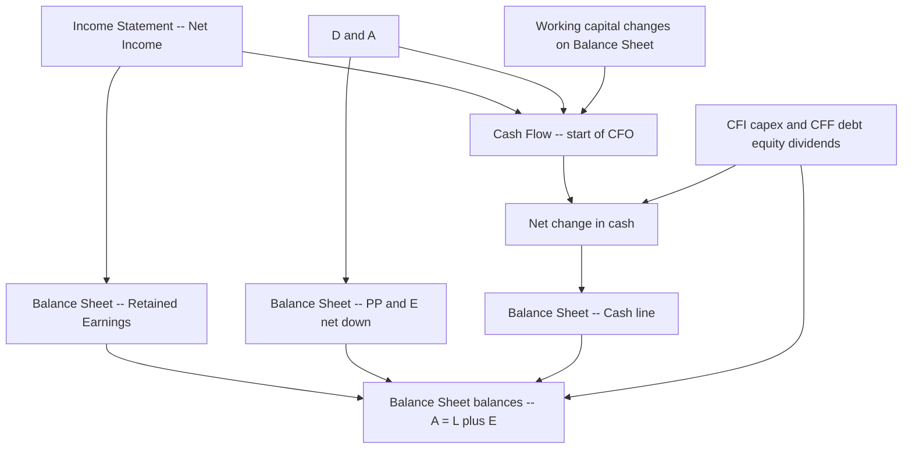
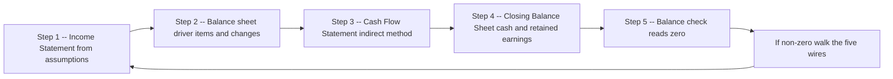
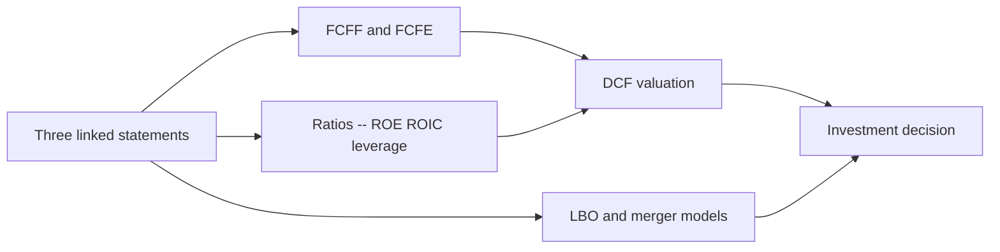

<!-- v2-deep -->

# Chapter 02 — Accounting Foundations: the Three Statements

## 1. The Problem — the analyst need

You have been handed a company and asked one deceptively simple question: *is it worth buying?* Before you can value it, forecast it, or judge its debt capacity, you must be able to read what it has already done — and read it in a language precise enough that two analysts working from the same facts arrive at the same numbers.

That language is the three financial statements: the **Income Statement**, the **Balance Sheet**, and the **Cash Flow Statement**. Every financial model you will ever build in FMVA — the DCF, the LBO, the merger model, the comparable-companies screen — is scaffolding bolted onto these three grids. If you cannot make them link and tie, nothing downstream is trustworthy. A model whose statements do not reconcile is not a conservative model or an aggressive model; it is simply *wrong*, and an interviewer will find the break in under a minute.

The specific analyst problems the three statements solve:

- **Profitability is not cash.** A company can report record profit and still go bankrupt because it cannot pay its suppliers this month. You need one statement that measures earning (the Income Statement) and a separate one that measures cash movement (the Cash Flow Statement).
- **A snapshot is not a movie.** You need to know both what the company *owns and owes right now* (the Balance Sheet, a photograph at one instant) and what *happened over the period* (the Income and Cash Flow statements, films covering the quarter or year).
- **Nothing can be measured in isolation.** Profit feeds equity; cash flow feeds the cash balance; the three statements are a single closed system. The discipline of making them close is what protects you from silent errors.

This chapter is the backbone the rest of the course rests on. Master the linkages here and the three-statement model in Chapter (the integrated model) becomes mechanical rather than mysterious.

> **Build reminder:** everything below should be re-created by you in Excel. Reading about the linkages is not the same as watching your own cash balance tie to the penny after you flow a transaction through all three grids. Open a blank workbook now and rebuild each worked example as you go.

**Why this matters in the seat you will actually sit in.** On the buy-side or in a corporate development team, the first thing you do with a target is not build a DCF — it is *spread* the historical statements: type three to five years of the company's reported figures into a clean template, tie every subtotal to the filing, and only then start forecasting. If your spread does not foot (add up) and cross-foot (agree across statements), every ratio, every multiple, and every projection built on top inherits the error. The three-statement discipline is therefore not academic housekeeping; it is the quality-control gate that everything else passes through. An analyst who cannot make statements tie is, in a very literal sense, producing numbers no one can trust.

---

## 2. The Core Idea — an analogy

Think of a company as a **bathtub with money in it**.

- The **Balance Sheet** is a photo of the tub at one instant: how much water is in it right now (assets), how much of that water you borrowed and must give back (liabilities), and how much is genuinely yours (equity). Snap the photo on 31 December and you have this year's balance sheet; snap it again next 31 December and you have next year's.
- The **Cash Flow Statement** measures the *water actually flowing through the taps and drains* between the two photos — operating taps, investing taps, financing taps. It explains, in cash terms, why the water level in the tub changed.
- The **Income Statement** measures something subtler: not water in or out, but *how much you earned* over the period regardless of whether the water has physically arrived yet. You sold a bath to a neighbour on credit — you earned it, so it hits the Income Statement, but no water moved into your tub, so it does *not* hit Cash Flow until they pay.

The two "movie" statements (Income and Cash Flow) both explain the gap between the two "photo" statements (opening and closing Balance Sheet). Income flows into equity; cash flow flows into the cash line. When both are done correctly, the closing photo is fully explained — and *that* is what "the statements tie" means.

**Pushing the analogy further, because two subtleties trip people up.** First, the Income Statement and Cash Flow Statement are *not* rival measures of the same thing where one is "right." They answer different questions. Income asks "did we do good business this period?" Cash asks "did the bank balance go up?" A furniture maker who ships a $1m order on 60-day terms did good business today (income) but will not see the water for two months (cash). Both facts are true at once. Second, the balance sheet "photo" contains the cumulative residue of every movie ever filmed: retained earnings is the running total of all net income ever earned minus all dividends ever paid, and cash is the running total of every cash flow ever recorded. That is why the *changes* in the photo between two dates must equal the *content* of the movies in between — there is nowhere else for the difference to hide.

---

## 3. Why it works

The whole system rests on one identity and one convention.

**The accounting equation:**

$$\text{Assets} = \text{Liabilities} + \text{Equity}$$

Everything a company controls (assets) was funded either by someone else's money it must repay (liabilities) or by the owners' money and retained profit (equity). There is no third source. This is not a law of nature that happens to be true — it is true *by construction*, because every transaction is recorded in two places (double-entry bookkeeping) so that the equation can never fall out of balance. Buy a $100 machine with cash: assets go up $100 (machine) and down $100 (cash) — net zero, still balanced. Buy it on credit: assets +$100 (machine), liabilities +$100 (payable) — both sides rise together.

**The accrual convention:** revenue is recognised when it is *earned* (goods delivered, service performed), and expenses when they are *incurred* (matched to the revenue they helped generate) — **not** when cash changes hands. This is what makes the Income Statement a fair measure of a period's economic performance, and it is precisely what forces the Cash Flow Statement to exist: because accrual profit and cash movement differ, you need a bridge from one to the other.

The reason the three statements *must* reconcile is that they are three views of the same underlying double-entry ledger:

- Net income (Income Statement) is the change in **retained earnings** (an equity account on the Balance Sheet), before dividends.
- The net change in cash (Cash Flow Statement) is the change in the **cash** line (an asset on the Balance Sheet).
- Because Assets = Liabilities + Equity must hold at *both* period-ends, the changes in every line between them must also net to zero — which is exactly the arithmetic the Cash Flow Statement performs.

If your model balances, you have proof the double-entry logic held. If it does not, you have introduced a "plug" somewhere that violates it.

**The deeper proof, worth internalising once.** Take the accounting equation at the start and end of a period and subtract:

$$\Delta\text{Assets} = \Delta\text{Liabilities} + \Delta\text{Equity}$$

Now split assets into cash and everything else, and split the change in equity into net income, dividends, and share issuance:

$$\Delta\text{Cash} + \Delta\text{Non-cash assets} = \Delta\text{Liabilities} + \text{Net income} - \text{Dividends} + \Delta\text{Share capital}$$

Solve for the change in cash:

$$\Delta\text{Cash} = \text{Net income} - \Delta\text{Non-cash assets} + \Delta\text{Liabilities} - \text{Dividends} + \Delta\text{Share capital}$$

Read the right-hand side carefully: that *is* the Cash Flow Statement. Net income is the top of CFO. "Minus the change in non-cash assets" captures both the add-back of D&A (a non-cash asset going down raises cash) and the working-capital rule (receivables and inventory going up lowers cash). "Plus the change in liabilities" captures payables rising (CFO) and debt drawn (CFF). Dividends and share issuance are CFF. The Cash Flow Statement is therefore not a separate invention you must memorise — it is the accounting equation, rearranged to explain the cash line. Once you see this, the working-capital sign rule stops being a rule to memorise and becomes something you can re-derive at the whiteboard.

---

## 4. Full Technical Content — formulas, build logic, Excel functions, formatting

### 4.1 The Income Statement (the "P&L")

Purpose: measure profit earned over a period. It runs top-to-bottom from revenue to net income.

| Line | Definition | Typical formula |
|---|---|---|
| Revenue (Sales) | Value of goods/services earned in period | driver-based, e.g. `Units * Price` |
| Cost of Goods Sold (COGS) | Direct costs of what was sold | `Revenue * (1 - Gross margin %)` |
| **Gross Profit** | Revenue less COGS | `Revenue - COGS` |
| Operating expenses (SG&A, R&D) | Indirect costs to run the business | `% of Revenue` or fixed + growth |
| **EBITDA** | Earnings before interest tax dep & amort | `Gross Profit - Cash opex` |
| Depreciation & Amortisation | Non-cash spreading of capex/intangibles | from the D&A schedule |
| **EBIT (Operating profit)** | Earnings before interest and tax | `EBITDA - D&A` |
| Interest expense (net) | Cost of debt less interest income | from the debt schedule |
| **EBT (Pre-tax income)** | Earnings before tax | `EBIT - Interest` |
| Tax | Corporate income tax | `EBT * Tax rate` |
| **Net Income** | Bottom-line profit | `EBT - Tax` |

**Build logic in Excel.** Put every hardcoded assumption (growth %, margin %, tax rate) in a clearly-flagged *inputs* area, coloured blue, and never bury a number inside a formula. Each calculated line references cells above it or a supporting schedule. Subtotals (Gross Profit, EBIT, Net Income) get a top border and bold. Use `=SUM()` for stacks of line items rather than chaining `+` so inserted rows stay captured.

**Exact cell-by-cell example.** Suppose your Income Statement occupies column C, with rows laid out as follows and the inputs sitting in a block from C4 down:

| Cell | Label | Formula | Result |
|---|---|---|---|
| C10 | Revenue | `=C4*C5` (Units 1,000 × Price 0.5) | 500 |
| C11 | COGS | `=-C10*(1-C6)` (gross margin C6 = 40%) | (300) |
| C12 | Gross profit | `=SUM(C10:C11)` | 200 |
| C13 | SG&A | `=-C10*C7` (SG&A % C7 = 16%) | (80) |
| C14 | EBITDA | `=C12+C13` | 120 |
| C15 | D&A | `=-C8` (from D&A schedule) | (20) |
| C16 | EBIT | `=C14+C15` | 100 |
| C17 | Interest | `=-C9` (from debt schedule) | (10) |
| C18 | EBT | `=C16+C17` | 90 |
| C19 | Tax | `=-C18*C20` (tax rate C20 = 30%) | (27) |
| C21 | Net income | `=C18+C19` | 63 |

Notice the convention: **expenses are stored as negative numbers**, so every subtotal is a simple `SUM` or addition — you never have to remember whether to add or subtract a given line, because the sign already lives in the cell. This single habit eliminates a whole class of sign errors and makes the statement read like the printed filing (parentheses for costs).

**A subtle tax point interviewers probe:** tax is levied on EBT, not on EBIT and not on net income. If interest is deductible (as it usually is), a dollar of interest saves you `tax rate × $1` in tax — the "interest tax shield," worth 30 cents here per dollar of interest. This is why debt is "cheaper" than it looks and is the entire engine behind an LBO. Watch for the variation where a portion of interest is *non-deductible* (thin-capitalisation rules): then tax is computed on `EBIT − deductible interest`, and net income falls.

### 4.2 The Balance Sheet

Purpose: list what the company owns and owes at one instant. Two sides that must be equal.

| Assets | Liabilities & Equity |
|---|---|
| Cash & equivalents | Accounts payable |
| Accounts receivable | Accrued & other current liabilities |
| Inventory | Short-term debt |
| Prepaid expenses | **Total current liabilities** |
| **Total current assets** | Long-term debt |
| Property, plant & equipment (PP&E, net) | Deferred tax, other |
| Intangibles & goodwill | **Total liabilities** |
| Other long-term assets | Share capital / paid-in capital |
| | Retained earnings |
| **Total assets** | **Total liabilities & equity** |

**The master check:** `Total assets − Total liabilities & equity = 0`. Build this cell explicitly, colour it, and keep it on screen. In a live model it is the single most important number: the instant it goes non-zero you stop and find the break.

**Build logic.** Most balance-sheet lines are driven, in a forecast, by ratios to the Income Statement (see §4.4). But two lines are special because they are *fed by the other statements* and are what make the model integrate:

- **Cash** = prior-period cash + net change in cash from the Cash Flow Statement.
- **Retained earnings** = prior retained earnings + net income − dividends.

Those two links are the heart of three-statement integration. Everything else is supporting detail.

**How balance-sheet lines are actually forecast (the driver ratios).** Historical balance-sheet items are not projected in isolation; they are tied to an Income Statement line via a turnover assumption, so they grow sensibly with the business:

| Balance-sheet line | Driver | Formula |
|---|---|---|
| Accounts receivable | Days Sales Outstanding (DSO) | `DSO / 365 * Revenue` |
| Inventory | Days Inventory Held (DIH) | `DIH / 365 * COGS` |
| Accounts payable | Days Payable Outstanding (DPO) | `DPO / 365 * COGS` |
| Prepaid expenses | % of opex | `% * Operating expenses` |
| Accrued liabilities | % of opex or COGS | `% * base` |

*Worked micro-example:* if forecast Revenue is 500 and you assume DSO of 40 days, receivables = `40 / 365 × 500 = 54.8 ≈ 55`. If COGS is 300 and DIH is 42.6 days, inventory = `42.6 / 365 × 300 = 35`. These are exactly the closing working-capital figures used in Example 2 below — now you can see where they come from rather than accepting them as given. Forecasting the *ratio* (which is usually stable) rather than the raw balance is what keeps a projection disciplined.

**Two lines that are counter-intuitive.** *PP&E, net* is not a market value and not what you would sell the assets for; it is historical cost minus accumulated depreciation, a bookkeeping residue. *Retained earnings* is not a pile of cash — it is a cumulative equity claim; a company can have huge retained earnings and almost no cash if it reinvested every dollar. Confusing retained earnings with a cash reserve is a classic novice error.

### 4.3 The Cash Flow Statement

Purpose: reconcile accrual net income to the actual change in cash. Three sections.

**Cash Flow from Operations (CFO)** — start from net income, add back non-cash charges, adjust for changes in working capital.

$$\text{CFO} = \text{Net Income} + \text{D\&A} \pm \Delta\text{Working Capital} + \text{other non-cash}$$

The working-capital sign rule (memorise it — it trips everyone up early):

| Change | Cash effect | Sign in CFO |
|---|---|---|
| Receivables **up** | you are owed more, cash not collected | **−** |
| Receivables **down** | collected cash | **+** |
| Inventory **up** | cash spent building stock | **−** |
| Inventory **down** | sold stock without restocking | **+** |
| Payables **up** | you delayed paying suppliers, kept cash | **+** |
| Payables **down** | you paid suppliers | **−** |

Rule of thumb: **an increase in an operating asset uses cash (−); an increase in an operating liability provides cash (+).**

**Cash Flow from Investing (CFI)** — capital expenditure (cash out, −), acquisitions (−), asset sales / divestitures (+).

**Cash Flow from Financing (CFF)** — debt drawn (+), debt repaid (−), equity issued (+), share buybacks (−), dividends paid (−).

$$\Delta\text{Cash} = \text{CFO} + \text{CFI} + \text{CFF}$$

**Build logic.** The indirect method (starting from net income) is standard in modelling and is what CFI/CFO teaches, because it makes the linkage to the Income Statement and the working-capital lines of the Balance Sheet explicit. Every CFO adjustment line should reference a Balance Sheet change: e.g. `Δ Receivables = -(AR_this − AR_last)`. The closing cash it produces is the number the Balance Sheet cash line pulls in.

**Indirect vs direct method — know the distinction for interviews.** The *indirect* method starts from net income and reverses out non-cash and accrual effects; almost every model and most published statements use it because it transparently connects to the other two statements. The *direct* method instead lists actual cash receipts and cash payments (cash collected from customers, cash paid to suppliers, cash paid in wages). It produces the *identical* CFO total but is rarely built because it does not tie cleanly to the accrual Income Statement. If asked "which do you use and why," the answer is indirect, because it makes the three-statement linkage auditable.

**Exact Excel wiring for the working-capital block.** Put the current-year balance sheet in column D and the prior year in column C. Then in the Cash Flow Statement:

| Cash Flow line | Formula | Logic |
|---|---|---|
| Δ Receivables | `=-(D_AR - C_AR)` | asset increase → negative cash |
| Δ Inventory | `=-(D_Inv - C_Inv)` | asset increase → negative cash |
| Δ Payables | `=+(D_AP - C_AP)` | liability increase → positive cash |

The leading minus on asset changes and plus on liability changes *is* the sign rule, hard-wired once so you never re-decide it line by line. Note the elegance: because assets and liabilities carry opposite signs in these formulas, you can compute the entire working-capital adjustment as `−(Δ operating assets) + (Δ operating liabilities)` in one stroke, and it will always have the right sign.

### 4.4 The linkage map — how the three lock together

The five wires that connect the statements:

1. **Net income** (bottom of Income Statement) → top of Cash Flow Statement, and → retained earnings on the Balance Sheet.
2. **D&A** (Income Statement) → added back in CFO, and → reduces PP&E on the Balance Sheet.
3. **Working-capital changes** (Balance Sheet period-over-period) → CFO adjustments.
4. **Capex / debt / equity flows** (Cash Flow investing & financing) → PP&E, debt and equity lines on the Balance Sheet.
5. **Net change in cash** (bottom of Cash Flow Statement) → cash line on the Balance Sheet.

*Figure 1 — the five wires linking the three statements into one closed system.*

**The build order that respects the wires.** The five wires impose a natural sequence on how you construct a period, because each statement needs outputs from the one before it. Build out of order and you will chase circularities and broken links. The disciplined order is: Income Statement first (it needs no other statement, only assumptions), then the working-capital and non-cash *changes* on the Balance Sheet, then the Cash Flow Statement (which consumes net income, D&A, and those changes), and finally the closing Balance Sheet (whose cash and retained-earnings lines consume Cash Flow and net income). The closing balance check is the last thing you build and the first thing you watch.

*Figure 3 — the build sequence dictated by the linkages, ending in the balance check loop.*

### 4.5 Excel functions and formatting best practice

| Purpose | Function / technique |
|---|---|
| Subtotals that survive row inserts | `=SUM(range)` |
| Circularity-safe interest (advanced) | iterative calc + a circuit-breaker switch |
| Pull prior-period balances | direct cell link `=PriorCol` |
| Conditional error flags | `=IF(ROUND(check,0)=0,"OK","ERROR")` |
| Avoid `#DIV/0!` in ratios | `=IFERROR(a/b,0)` |
| Lookups to a driver table | `INDEX/MATCH` or `XLOOKUP` |

Formatting conventions every reviewer expects:
- **Blue font = hardcoded input; black = formula; green = link to another sheet.** Never mix.
- Negative numbers in parentheses; use a custom number format `#,##0;(#,##0)`.
- One consistent unit (e.g. $ millions) stated at the top of each sheet.
- No hardcoded numbers inside formulas — an assumption you cannot see is an assumption you cannot audit.
- A visible **balance check** row and a **cash flow tie** check row, both of which should read exactly zero.

**Two extra checks a senior modeller always adds.** First, a *cash-flow tie*: `Closing cash on the Balance Sheet − closing cash from the Cash Flow Statement = 0`. This catches the case where the balance sheet happens to balance for the wrong reason (two offsetting errors). Second, a *sign-sanity* check on subtotals — for example flag any year where EBITDA is positive but CFO is deeply negative, since that pairing, while possible, usually signals a working-capital error. Use `=IF(ROUND(check,0)=0,"OK","ERROR")` and conditionally format the cell red on "ERROR" so a break is impossible to miss even at a glance.

**On rounding.** Always wrap balance and tie checks in `ROUND(...,0)` (or to your unit's precision). Floating-point arithmetic can leave a residue like 0.0000001 that is economically zero but reads as a non-zero check and sends you hunting for a phantom error. Round the *check*, never the underlying figures.

---

## 5. Worked Examples

### Example 1 — one transaction through all three statements

*Setup:* On 1 Jan the company has Cash 100, PP&E 0, Payables 0, Share capital 100, Retained earnings 0. (Assets 100 = L+E 100. Balanced.)

**Transaction A:** Sell goods for 200 on credit. COGS is 120 (paid in cash). Ignore tax for clarity.

Trace it:

| Statement | Effect |
|---|---|
| Income Statement | Revenue +200, COGS −120, **Net income +80** |
| Balance Sheet — assets | Receivables +200, Cash −120 (paid for goods), inventory unchanged (assume goods bought and sold same period) |
| Balance Sheet — equity | Retained earnings +80 |
| Cash Flow — CFO | Net income +80, less Δreceivables (−200) = **CFO −120** |

Check the cash: opening 100 + CFO (−120) = **closing cash −20**? That is negative, which is economically the point — you *earned* 80 of profit but your cash went *down* 120 because the customer has not paid. Accrual profit ≠ cash. (In practice the firm would need financing; here we just observe the divergence.)

Balance check at close:

| Assets | | Liabilities & Equity | |
|---|---|---|---|
| Cash | −20 | Payables | 0 |
| Receivables | 200 | Share capital | 100 |
| | | Retained earnings | 80 |
| **Total** | **180** | **Total** | **180** |

Balanced. The 80 net income landed in retained earnings; the CFO of −120 explains the cash move from 100 to −20. All three tie.

**Now vary the transaction (the "what if" drill).** Change one fact at a time and re-trace; this is the single fastest way to build intuition.

- *What if the customer pays cash instead of credit?* Then receivables do not move; cash rises by `+200 − 120 = +80`. CFO = net income 80 + Δreceivables 0 = +80. Closing cash 180, receivables 0, retained earnings 80. Total assets 180 = L+E 180. Profit and cash now agree, because there is no accrual gap.
- *What if COGS is bought on credit rather than paid in cash?* Then cash does not fall by 120; instead payables rise 120. CFO = net income 80 − Δreceivables 200 + Δpayables 120 = 0. Cash unchanged at 100. Balance: cash 100 + receivables 200 = 300 assets; payables 120 + share capital 100 + RE 80 = 300. Balanced, and CFO is exactly zero — you earned 80 but neither collected nor paid anything, so no cash moved.
- *What if 25 of the goods are returned before year-end?* Revenue falls to 175, COGS to 105 (the returned units come back into… nothing, since we assumed same-period; treat the return as reversing 25 revenue and its 15 cost). Net income = 175 − 105 = 70; receivables = 175. CFO = 70 − 175 = −105; cash = 100 − 105 = −5. Assets = −5 + 175 = 170; L+E = 100 + 70 = 170. Still balances. The lesson: the system self-corrects for any transaction as long as every leg is booked once.

### Example 2 — a full simple period, statements reconciling

*Opening Balance Sheet (Year 0):* Cash 50, Receivables 40, Inventory 30, PP&E 200 → Assets 320. Payables 30, Debt 100, Share capital 100, Retained earnings 90 → L+E 320. Balanced.

*Year 1 assumptions:* Revenue 500; COGS 300; SG&A 80; D&A 20; Interest 10 (on the 100 debt at 10%); Tax 30%. Capex 25. Dividends 15. Debt repayment 10. Working capital at year-end: Receivables 55, Inventory 35, Payables 40.

**Income Statement:**

| Line | Value |
|---|---|
| Revenue | 500 |
| COGS | (300) |
| Gross profit | 200 |
| SG&A | (80) |
| EBITDA | 120 |
| D&A | (20) |
| EBIT | 100 |
| Interest | (10) |
| EBT | 90 |
| Tax @ 30% | (27) |
| **Net income** | **63** |

**Cash Flow Statement:**

| Line | Value |
|---|---|
| Net income | 63 |
| Add: D&A | 20 |
| Δ Receivables (40→55) | (15) |
| Δ Inventory (30→35) | (5) |
| Δ Payables (30→40) | +10 |
| **CFO** | **73** |
| Capex | (25) |
| **CFI** | **(25)** |
| Debt repayment | (10) |
| Dividends | (15) |
| **CFF** | **(25)** |
| **Net change in cash** | **23** |

Closing cash = 50 + 23 = **73**.

**Closing Balance Sheet (Year 1):**

| Assets | | Liabilities & Equity | |
|---|---|---|---|
| Cash | 73 | Payables | 40 |
| Receivables | 55 | Debt (100 − 10) | 90 |
| Inventory | 35 | Share capital | 100 |
| PP&E (200 + 25 − 20) | 205 | Retained earnings (90 + 63 − 15) | 138 |
| **Total assets** | **368** | **Total L & E** | **368** |

Balanced — 368 = 368. Verify every link:
- Retained earnings 90 + net income 63 − dividends 15 = 138. ✓
- PP&E 200 + capex 25 − D&A 20 = 205. ✓
- Cash 50 + net change 23 = 73. ✓
- Debt 100 − repayment 10 = 90. ✓

Every wire from §4.4 fired correctly and the statement ties. This is the exact discipline your three-statement model must reproduce automatically.

**Extending Example 2 to Year 2 (proving the model is dynamic, not a one-off).** Carry the Year 1 closing sheet forward as the Year 2 opening, and apply new assumptions: Revenue grows 10% to 550; COGS stays 60% of revenue = 330; SG&A 16% of revenue = 88; D&A 22; interest now 10% × opening debt of 90 = 9; tax 30%; capex 30; dividends 20; debt repayment 10. Year-end working capital: Receivables 60, Inventory 39, Payables 44.

Income Statement: Revenue 550 − COGS 330 = gross profit 220; − SG&A 88 = EBITDA 132; − D&A 22 = EBIT 110; − interest 9 = EBT 101; − tax 30.3 = **net income 70.7**.

Cash Flow: NI 70.7 + D&A 22 − ΔAR (60−55=5) − ΔInv (39−35=4) + ΔAP (44−40=4) = **CFO 87.7**; − capex 30 = CFI (30); − debt repay 10 − dividends 20 = CFF (30); **net change in cash = 27.7**. Closing cash = 73 + 27.7 = **100.7**.

Closing Balance Sheet: Cash 100.7, Receivables 60, Inventory 39, PP&E (205 + 30 − 22 = 213) → **assets 412.7**. Payables 44, Debt (90 − 10 = 80), Share capital 100, Retained earnings (138 + 70.7 − 20 = 188.7) → **L+E 412.7**. Balanced, 412.7 = 412.7. ✓ The point: the *same* formulas that tied Year 1 tie Year 2 with entirely different inputs — that is what "the links are live" means, and it is what step 7 of the Build-It-Yourself section stress-tests.

### Example 3 — profit up, cash down (the classic warning)

*Setup:* A fast-growing firm reports net income of 100 and D&A of 10, but grew receivables by 90 and inventory by 60 (funding a sales surge) while payables rose only 20.

$$\text{CFO} = 100 + 10 - 90 - 60 + 20 = -20$$

Profit says +100; cash says −20. The 120 of extra working capital consumed all the profit and then some. This is how profitable companies run out of cash — and why the Cash Flow Statement exists as a separate document. An analyst who reads only the Income Statement would completely miss the liquidity risk.

### Example 4 — a non-cash write-down and a deferred-revenue inflow

Two effects that regularly confuse candidates, worked explicitly.

*Setup:* A software firm has Revenue 400, cash operating costs 250, D&A 30, and this year takes a 50 **goodwill impairment** (a non-cash charge). Separately, customers prepay 60 for next year's subscriptions (**deferred revenue**, a liability, because the service is not yet delivered). Tax rate 25%, and assume the impairment is *not* tax-deductible.

Income Statement: Revenue 400 − cash opex 250 = 150; − D&A 30 = EBIT before impairment 120; − impairment 50 = **operating profit 70**. Tax is on the *taxable* base — since the impairment is non-deductible, tax = 25% × (120) = 30, not 25% × 70. So **net income = 70 − 30 = 40**.

Cash Flow (CFO): start net income 40; add back D&A 30; add back impairment 50 (non-cash, so it never touched cash); add the deferred-revenue inflow of +60 (a liability rose — cash came in ahead of the earning). **CFO = 40 + 30 + 50 + 60 = 180.** Cash surged even though reported net income was only 40, because two of the biggest lines (D&A and impairment) were non-cash and one (deferred revenue) was cash received before it hit the P&L.

The interview-grade insight: an impairment *reduces net income and equity but does not touch cash* (add it straight back in CFO), and deferred revenue is the mirror image of receivables — cash arrives *before* the revenue is earned, so it is a positive working-capital swing. Candidates who blindly add back "D&A" but forget the impairment, or who net deferred revenue the wrong way, will misstate CFO badly.

### Example 5 — the buy-a-machine transaction across time (why capex is not an expense)

*Setup:* Buy a machine for 100 cash on day 1, depreciate straight-line over 5 years (20/year), tax rate 30%, and assume it generates exactly enough revenue to cover its own cash costs so we can isolate the machine's own footprint.

Year 1 Income Statement effect: depreciation 20 → pre-tax profit lower by 20 → tax lower by 6 → **net income lower by 14**. But cash out for the purchase was the full **100** on day 1, recorded in CFI, *not* on the Income Statement at all.

Reconciliation of Year 1 cash effect via CFO+CFI: CFO picks up net income (−14) and adds back the non-cash depreciation (+20) = +6 (the depreciation tax shield, `20 × 30%`); CFI shows the −100 purchase. Total cash effect Year 1 = 6 − 100 = **−94**. Over five years, the Income Statement charges the full 100 as depreciation (20 × 5) and the CFI charge of 100 happens once up front; the difference in *timing* is precisely what the Cash Flow Statement exists to reveal. This is the cleanest illustration of why capex hits the balance sheet and cash flow but *never* the Income Statement directly — only its depreciation does.

---

## 6. Connections — to the rest of the model and valuation

- **The integrated three-statement model** (next major build) is simply Examples 1–2 made dynamic across many forecast years, with every link a live formula.
- **Free Cash Flow to the Firm (FCFF)**, the input to a DCF, is built directly off these statements:
  $$\text{FCFF} = \text{EBIT} \times (1 - t) + \text{D\&A} - \text{Capex} - \Delta\text{NWC}$$
  Every term comes from a specific line you built above — EBIT and tax from the Income Statement, D&A and capex from the Cash Flow Statement, ΔNWC from the Balance Sheet working-capital changes.
- **Free Cash Flow to Equity (FCFE)** extends FCFF by netting after-tax interest and net borrowing — again, straight from the debt schedule and financing cash flows.
- **Ratio analysis** (liquidity, leverage, returns like ROE and ROIC) pulls numerator and denominator from across the three grids; a wrong linkage silently corrupts every ratio.
- **LBO and merger models** stress-test the *same* linkages under debt and acquisition scenarios. There is no separate accounting for those models — just harder assumptions on the identical backbone.

**A worked FCFF off Example 2, so the connection is concrete.** Using the Year 1 figures: EBIT 100, tax rate 30%, D&A 20, capex 25, and ΔNWC = increase in operating working capital = (ΔAR 15 + ΔInv 5) − ΔAP 10 = 10. Then

$$\text{FCFF} = 100 \times (1 - 0.30) + 20 - 25 - 10 = 70 + 20 - 25 - 10 = 55.$$

Sanity-check against the statements: CFO was 73, which already reflects *actual* interest paid and the tax on EBT. FCFF instead uses *unlevered* tax (tax as if there were no debt: `EBIT × t = 30`), so it should exceed CFO−capex by the after-tax interest that FCFF ignores. CFO 73 − capex 25 = 48; add back after-tax interest `10 × (1 − 0.30) = 7` → 55. The two roads meet at 55. This reconciliation — building FCFF two ways and tying them — is a favourite senior-analyst check and a common interview question.

*Figure 2 — the three statements are the foundation every valuation and analysis tool is built on.*

---

## 7. Traps and Common Errors

- **Balance sheet does not balance.** Ninety percent of the time the cause is a single missed link: net income not flowing to retained earnings, cash not pulling from the Cash Flow Statement, or a working-capital change with the wrong sign. Debug by checking the five wires of §4.4 one at a time.
- **Wrong working-capital signs.** An *increase* in receivables or inventory is a cash *outflow* (−); an increase in payables is an *inflow* (+). Getting this backwards is the single most common CFO mistake.
- **Double-counting D&A.** D&A must reduce EBIT on the Income Statement *and* be added back in CFO *and* reduce PP&E — three appearances, each once. Miss one and the model breaks.
- **Dividends omitted from retained earnings.** Retained earnings = prior + net income − dividends. Forgetting the dividend subtraction makes equity too high and unbalances the sheet.
- **Hardcoding over a formula (a "plug").** Typing a number to force the balance to close hides the real error and will be caught instantly in interview. Never plug the balance check.
- **Confusing profit with cash.** Telling an interviewer a company is "healthy because it's profitable" without checking CFO is a classic failure — see Example 3.
- **Mixing cash and accrual within a statement.** The Income Statement is accrual throughout; the Cash Flow Statement bridges to cash. Do not sneak a cash item onto the P&L.
- **Circular reference panic.** Interest on a revolver that depends on the cash it funds creates a legitimate circularity. Handle with iterative calculation plus a circuit-breaker switch — do not just delete the interest link.
- **Treating capex as an expense.** Capex hits CFI and builds PP&E; only its *depreciation* touches the Income Statement, spread over years (see Example 5). Expensing capex directly understates profit and breaks the PP&E roll.
- **Adding back the wrong non-cash items — or missing them.** Impairments, stock-based compensation, and deferred taxes are all non-cash and must be added back in CFO, but each also has a specific balance-sheet counterpart. Forgetting stock-based comp is a very common CFO understatement in tech models (see Example 4 for the impairment version).
- **Netting deferred revenue the wrong way.** Deferred revenue is a *liability*; when it rises, cash came in early, so it is a **+** in CFO — the opposite of receivables. Reversing it is a subtle but frequent error in subscription-business models.
- **Using ending vs average balances inconsistently in ratios.** Return ratios (ROE, ROIC) can use either, but you must be consistent; mixing a period-average denominator with a point-in-time numerator is a silent corruption an interviewer may probe.
- **Two offsetting errors that still "balance."** A balance sheet can foot correctly while being wrong, if two mistakes cancel. This is why the *cash-flow tie* check (§4.5) exists alongside the balance check — it catches breaks the balance check alone would miss.

---

## 8. First-Principles Recap

Strip everything back and only three ideas remain:

1. **Assets = Liabilities + Equity, always.** Every transaction touches two places so this never breaks. The balance check proving it is your single source of truth.
2. **Accrual measures earning; cash measures money.** They differ, so you need two "movie" statements — the Income Statement for profit earned and the Cash Flow Statement for cash moved — bridged by the indirect method.
3. **The two movies explain the gap between the two photos.** Net income flows into retained equity; net change in cash flows into the cash asset; and because both closing photos must balance, everything reconciles. Integration is not a trick — it is what happens automatically when you record each item once, in the right place, with the right sign.

Learn these three and every model in FMVA becomes an application of the same closed system.

**The one derivation to keep in your head.** If you ever forget a sign or a link under pressure, re-derive the Cash Flow Statement from the accounting equation as in §3: `ΔCash = Net income − ΔNon-cash assets + ΔLiabilities − Dividends + ΔShare capital`. Every add-back and every working-capital sign falls straight out of it. You never need to memorise the Cash Flow Statement if you can reconstruct it from the identity that cannot be false.

---

## 9. Quick-Reference

**Core identities**

| Item | Formula |
|---|---|
| Accounting equation | `Assets = Liabilities + Equity` |
| Retained earnings roll | `RE_end = RE_start + Net income − Dividends` |
| PP&E roll | `PP&E_end = PP&E_start + Capex − D&A` |
| Debt roll | `Debt_end = Debt_start + Draws − Repayments` |
| Cash roll | `Cash_end = Cash_start + (CFO + CFI + CFF)` |
| CFO (indirect) | `NI + D&A ± ΔWorking capital + other non-cash` |
| Net change in cash | `CFO + CFI + CFF` |
| Balance check | `Total assets − Total L&E = 0` |
| Cash-flow tie | `BS closing cash − CFS closing cash = 0` |
| FCFF | `EBIT × (1 − t) + D&A − Capex − ΔNWC` |
| ΔNWC | `Δ(operating current assets) − Δ(operating current liabilities)` |
| Interest tax shield | `Interest × tax rate` |

**Working-capital driver ratios**

| Line | Formula |
|---|---|
| Receivables | `DSO / 365 × Revenue` |
| Inventory | `DIH / 365 × COGS` |
| Payables | `DPO / 365 × COGS` |

**Working-capital sign rule:** asset up → cash down (−); liability up → cash up (+).

**Non-cash add-backs in CFO:** D&A, impairments/write-downs, stock-based compensation, deferred taxes — each added back once, each with its own balance-sheet counterpart.

**Excel functions:** `SUM`, `IF`, `IFERROR`, `INDEX/MATCH`, `XLOOKUP`, `ROUND`; iterative calc for circularity.

**Formatting:** blue = input, black = formula, green = link; negatives in parentheses; visible balance-check and cash-tie rows reading zero.

**Shortcuts:** `Alt =` autosum; `F2` edit cell; `Ctrl + [` trace precedent; `Ctrl + `` show formulas; `F4` toggle absolute references.

---

## 10. Build-It-Yourself

Open a blank Excel workbook and reproduce Example 2 from scratch — do not copy the tables, build them from the assumptions.

1. Create an **Inputs** block (blue font): Revenue 500, COGS 300, SG&A 80, D&A 20, interest rate 10%, tax 30%, capex 25, dividends 15, debt repayment 10, and the three closing working-capital balances (Receivables 55, Inventory 35, Payables 40).
2. Enter the **opening Balance Sheet** (Year 0) exactly as given and add a balance-check cell: `=Total assets − Total L&E`. Confirm it reads 0.
3. Build the **Income Statement** top to bottom, referencing only input cells and prior lines. Interest = 10% × opening debt of 100. Compute net income. Store expenses as negatives so every subtotal is a `SUM`.
4. Build the **Cash Flow Statement** by the indirect method: start from net income, add D&A, subtract each working-capital increase (mind the signs), then CFI (capex) and CFF (debt repayment and dividends). Compute net change in cash.
5. Build the **closing Balance Sheet**: cash = opening + net change; retained earnings = opening + NI − dividends; PP&E = opening + capex − D&A; debt = opening − repayment. Everything else carries forward.
6. Add the **balance check** on the closing sheet. It must read exactly 0 (368 = 368). If it does not, walk the five wires of §4.4 until it does. Wrap it in `ROUND(check,0)` so floating-point residue does not raise a false alarm, and add a `=IF(ROUND(check,0)=0,"OK","ERROR")` flag with red conditional formatting.
7. **Stress it:** raise capex to 50 and drop dividends to 0. Watch cash and retained earnings both change and confirm the sheet still balances. This proves your links are live formulas, not hardcodes.
8. **Add a second period.** Carry the closing sheet forward as Year 2 opening and apply the Year 2 assumptions from Example 2's extension (Revenue 550, COGS 330, SG&A 88, D&A 22, capex 30, dividends 20, debt repayment 10, closing WC 60/39/44, interest = 10% × opening debt 90). Confirm it ties at 412.7 = 412.7. If Year 1 balances but Year 2 does not, the break is almost always a link that referenced a hardcoded cell instead of "prior period."
9. **Add the cash-flow tie check** (§4.5): a cell equal to `BS closing cash − CFS closing cash`, which must read zero every year. This is your defence against two offsetting errors that leave the balance check deceptively at zero.
10. **Break it on purpose, then fix it.** Flip the sign on the Δreceivables line and watch both the balance check and the cash-flow tie light up "ERROR"; correct it and watch them return to zero. Deliberately breaking and repairing the model is the fastest way to make the five wires permanent knowledge rather than memorised trivia.

If your closing balance check reads zero after step 6, *survives* step 7, *ties a second period* in step 8, and you can diagnose the deliberate break in step 10, you have built a correctly integrated set of statements — the foundation every later chapter assumes you can produce on demand.
