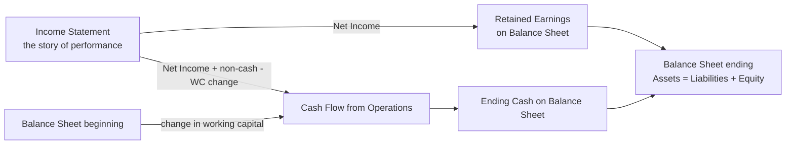
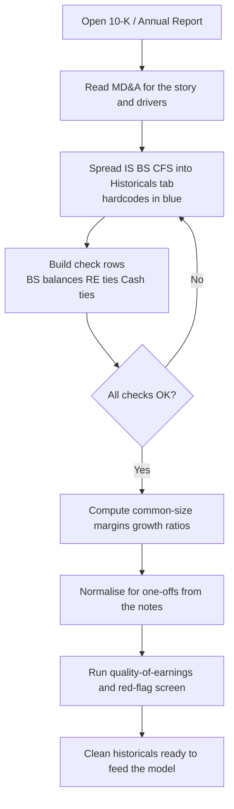
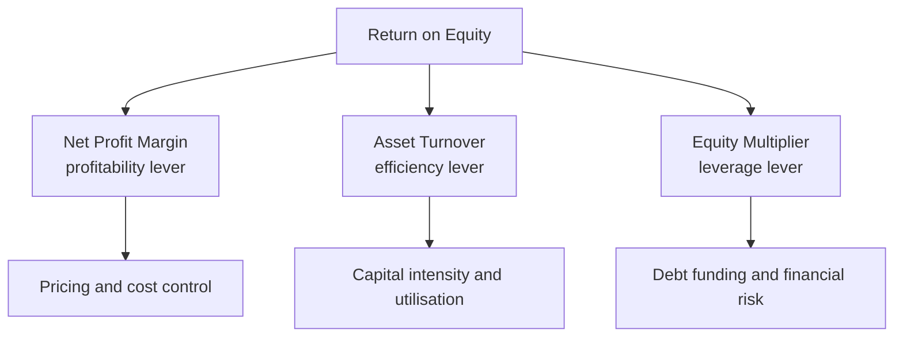
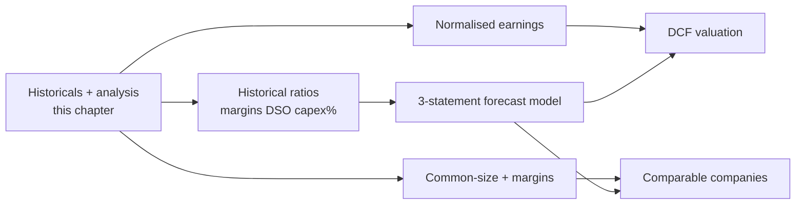

<!-- v2-deep -->

# Chapter 03 — Reading and Analysing Financial Statements

## 1. The Problem — what the analyst actually needs to do

Every model you will ever build starts from the same raw material: a company's **historical financial statements**. Before you forecast a single future year, you have to answer three brutally practical questions:

1. **What actually happened?** — Extract 3–5 clean years of Income Statement, Balance Sheet, and Cash Flow into a spreadsheet, line by line, tying to the audited numbers.
2. **What does it mean?** — Are margins expanding or shrinking? Is the company generating cash or just booking accounting profit? Is growth real or borrowed from the future?
3. **Can I trust the numbers?** — Is reported earnings *high quality* (backed by cash and durable), or is it propped up by aggressive revenue recognition, one-offs, and balance-sheet games?

An analyst who skips this and jumps straight to "grow revenue 10% a year" builds a beautiful model on rotten foundations. The forecast is only as good as your understanding of the base. This chapter teaches you to **read a real annual report / 10-K, spread the historicals, compute the diagnostics (common-size, margins, quality-of-earnings), and spot the red flags** — the exact workflow that precedes building the 3-statement model in later chapters.

The deliverable of this chapter is a **"historicals" tab**: a clean, formula-linked spreadsheet of 3–5 actual years, fully reconciled, ready to become the left edge of your model.

**Why 3–5 years and not one?** Because analysis is the study of *change*. A single year is a photograph; three-to-five years is a film. Margins, working-capital days, capital intensity, and earnings quality only become meaningful when you can see their *trajectory*. Five years also spans enough of a business cycle to reveal whether "record profit" is a structural improvement or the crest of a cyclical wave you would be foolish to extrapolate. If you can get it, one extra pre-crisis year (2019, say) is worth more than a fourth forecast decimal place: it shows you the trough behaviour that a boom-only window hides.

**The cost of getting this wrong is not linear — it compounds.** A 5-point error in your base-year gross margin does not just move year one; it propagates through every forecast year, through the terminal value, and into the valuation multiple. In a DCF the terminal value is often 60–80% of enterprise value, and terminal value inherits the base-year margin structure. A sloppy historicals tab is therefore not a small error; it is a *leveraged* error. Analysts who are careless here and diligent everywhere else are optimising the wrong 10%.

---

## 2. The Core Idea — the annual report is a witness, and you are cross-examining it

Think of a set of financial statements as **testimony from a witness who has a strong incentive to look good**. Management chose the accounting policies, the estimates, the presentation, and the narrative. Auditors constrain the lies but do not eliminate the *spin*. Your job as the analyst is the cross-examination:

- The **Income Statement** is the witness's *story of performance* ("we earned $X").
- The **Cash Flow Statement** is the *lie detector* ("here's the cash that actually moved").
- The **Balance Sheet** is the *paper trail* ("here's what's left over, and what we owe").
- The **Notes** are where the body is buried — revenue policies, segment detail, off-balance-sheet items, one-offs, related parties.

Cross-examination technique: you never take one statement at face value. You **triangulate**. Net income says profit rose 20%? Show me the cash. Revenue jumped? Show me receivables. Margins expanded? Show me whether it's mix, pricing, or a capitalised cost that should have been an expense. Good earnings survive triangulation; bad earnings fall apart under it.

**Why the witness metaphor is exact and not just a mnemonic.** A witness under oath cannot flatly lie about a check-able fact (that is fraud, and audit sampling plus the identities below make it risky), but a witness *can* choose which true facts to emphasise, which time periods to frame, and which estimates to pitch optimistically. That is precisely the space accounting standards leave open. Two honest companies applying the same standard to the same economic reality can report materially different profit because they made different *estimates* — useful life of assets, allowance for doubtful debts, warranty provisions, percentage-of-completion. None of these is a lie; each is a judgement. The analyst's job is to detect *the direction of the judgement* (aggressive vs conservative) and adjust for it, not to catch fraud. Fraud is rare; aggressive-but-legal spin is everywhere, and it is what quietly wrecks unadjusted forecasts.

**The prosecutor's habit: always ask "compared to what?"** A number in isolation carries almost no information. Gross margin of 38% is neither good nor bad until you place it against (a) the company's own history, (b) close peers, and (c) the economic logic of the business. The three benchmarks are your three cross-examination lenses — trend, peer, and first-principles — and a claim that survives all three is one you can carry into the model.

---

## 3. Why it works — the accounting identities that make triangulation possible

Triangulation isn't a vibe; it rests on **hard identities** that must always hold. If they don't reconcile, either you made an extraction error or the company did something worth investigating.

**Identity 1 — The accounting equation (Balance Sheet always balances):**
$$\text{Assets} = \text{Liabilities} + \text{Equity}$$

**Identity 2 — Retained earnings roll-forward (links IS to BS):**
$$\text{RE}_{end} = \text{RE}_{beg} + \text{Net Income} - \text{Dividends}$$

**Identity 3 — Cash roll-forward (links CFS to BS):**
$$\text{Cash}_{end} = \text{Cash}_{beg} + \text{CFO} + \text{CFI} + \text{CFF}$$

**Identity 4 — The indirect cash flow bridge (links IS to CFS via BS changes):**
$$\text{CFO} = \text{Net Income} + \text{Non-cash charges} - \Delta\text{Working Capital}$$

Because accrual accounting records revenue when *earned* and expenses when *incurred* — not when cash moves — profit and cash diverge. That divergence is captured *entirely* by non-cash items (depreciation, amortisation, stock comp, impairments) and **changes in working capital** (receivables, inventory, payables). Identity 4 is why the cash flow statement is the lie detector: any earnings that isn't backed by cash *must* show up as a growing accrual on the balance sheet. You can literally see the gap.

*Why it works:* the statements are three views of one reality bound by these identities, so no single statement can be manipulated in isolation without leaving a footprint in another. The analyst's edge is knowing where to look for the footprint.

**The sign conventions that trip everyone up.** In the indirect method, an *increase* in an operating asset (receivables, inventory) is a *use* of cash and carries a **minus** sign; an *increase* in an operating liability (payables, accrued expenses, deferred revenue) is a *source* of cash and carries a **plus** sign. The intuition: if customers owe you more (AR up), you booked the sale in profit but haven't collected the cash yet, so cash is *lower* than profit. If you owe suppliers more (AP up), you recorded the expense but haven't paid, so cash is *higher* than profit. Memorise the direction from the logic, not the sign, and you will never flip it under interview pressure.

**Why non-cash charges are *added back*, not subtracted.** Depreciation reduced net income on the income statement but no cash left the building — the cash left years ago when the asset was bought (that outflow lives in CFI as capex). Adding D&A back in CFO simply reverses a bookkeeping deduction that never touched the bank account. The same logic applies to amortisation, share-based compensation (paid in stock, not cash), impairments, and deferred-tax movements. This is the single most tested concept in a modelling interview and the single most common place beginners lose the plot.

**A worked micro-reconciliation of Identity 4.** Suppose net income is 175, D&A is 100, receivables rose 60, inventory rose 50, and payables rose 30. Then:
$$\text{CFO} = 175 + 100 - 60 - 50 + 30 = 195.$$
Profit was 175 but cash from operations was 195 — the business threw off *more* cash than profit because the non-cash D&A add-back (+100) outweighed the working-capital drag (−80). That is a healthy signature. Flip the working capital to a −180 drag and CFO would be 95, well below profit — the accrual-build signature you learn to fear. Same profit, two entirely different qualities of earnings, and *only* Identity 4 lets you see which is which.

*Figure 1 — The three statements are one linked system; every identity is a place you can check the witness's story against the paper trail.*

---

## 4. Full Technical Content — reading the report and spreading the historicals

### 4.1 Anatomy of an annual report / 10-K — where to find what

A US **Form 10-K** (annual) or **10-Q** (quarterly), or an international **Annual Report**, has a predictable structure. Learn to navigate it fast.

| Section | What's in it | Why you care |
|---|---|---|
| Business (Item 1) | What the company does, segments, customers | Understand the revenue engine before modelling it |
| Risk Factors (Item 1A) | Everything that could go wrong | Downside scenarios, sensitivities |
| **MD&A** (Item 7) | Management's Discussion & Analysis — narrative on results, drivers, liquidity | The *why* behind the numbers, in management's words |
| **Financial Statements** (Item 8) | The audited IS, BS, CFS, equity statement | Your raw data — spread these |
| **Notes to accounts** | Accounting policies, segments, debt schedule, leases, taxes, one-offs | Where you find revenue recognition policy, off-BS items, adjustments |
| Auditor's report | Opinion + **Critical Audit Matters** | Unqualified opinion expected; CAMs flag the risky estimates |
| Controls (Item 9A) | Internal control assessment | Material weakness = red flag |

**Workflow to read fast:** MD&A first (management tells you the story and the drivers) → Financial Statements (get the numbers) → Notes (verify and adjust) → Auditor's report and controls (trust check). Read at least **two consecutive years** so you can see the *change*, which is where insight lives.

**A speed-reading protocol for the first pass (30–45 minutes on a new name):**

1. **MD&A results section** — pull the three or four numbers management leads with and the *reasons* they give. Underline every causal claim ("margins improved due to…") — you will test each one against the statements.
2. **The three statement faces** — do not read every line yet; just capture the shape: is revenue growing, is CFO tracking net income, is debt rising, is cash building or draining?
3. **Revenue recognition note** — always. It defines what "revenue" even means for this company (see §4.2).
4. **Debt note / maturity schedule** — how much is due, when, at what rate. This drives interest and refinancing risk.
5. **"Other"/"exceptional" lines and the tax note** — the usual hiding places for one-offs.
6. **Auditor's Critical Audit Matters** — the auditor is *telling you* which estimates are subjective and material. Free red-flag map.

**Where the international reader diverges.** IFRS filers present the same economic content under different labels: the income statement may be a "Statement of Profit or Loss", cash may sit inside "Cash and cash equivalents", and there is no Item-number scaffolding. Two structural differences matter for modelling: under IFRS, interest paid and dividends received *may* be classified in CFO or CFF (a policy choice — check the note, because it shifts CFO), and development costs can be *capitalised* under IAS 38 where US GAAP would expense most R&D. Both change comparability with US peers, so normalise before you compare.

### 4.2 Revenue recognition — the single most important policy

Under **IFRS 15 / ASC 606**, revenue is recognised using a **5-step model**: (1) identify the contract, (2) identify performance obligations, (3) determine the transaction price, (4) allocate price to obligations, (5) **recognise revenue as each obligation is satisfied** (at a point in time or over time).

Why an analyst cares: *when* revenue hits the P&L is a judgement call, and it's the most common place for earnings management. Read the revenue note and ask:

- **Point-in-time vs over-time?** A SaaS company recognising a 3-year contract over time is conservative; one recognising it upfront is aggressive.
- **Gross vs net (principal vs agent)?** A marketplace booking gross merchandise value as revenue looks 10x bigger than one booking only its commission. Compare like with like.
- **Channel stuffing / bill-and-hold?** Shipping product to distributors and booking revenue before real end-demand. Footprint: receivables and inventory grow faster than sales.
- **Deferred revenue** (a liability): cash received before delivery. *Rising* deferred revenue is a bullish sign for subscription businesses — it's booked cash, future revenue.

**The gross-vs-net trap, quantified.** Take a marketplace processing $1,000 of gross merchandise value and keeping a 15% commission. As a **principal** it reports revenue of $1,000, cost of revenue of $850, and gross profit of $150 — a 15% gross margin. As an **agent** it reports revenue of $150, no cost of revenue, and gross profit of $150 — a *100%* gross margin. **Net income is identical; "revenue" differs by 6.7x and gross margin by 85 points.** Any price-to-sales multiple you slap on these two is meaningless unless you first standardise the presentation. This is not hypothetical — the principal-vs-agent line moved billions of reported "revenue" across ride-hailing and food-delivery names when ASC 606 landed. Always read step 4/5 of the revenue note to learn which one you are holding.

**Deferred revenue and the subscription tell.** For a subscription business, cash arrives *before* the service is delivered, so the balance sheet carries a **deferred (unearned) revenue** liability that is released into the income statement over the contract. Two diagnostics fall out of this: (1) *billings* = revenue + change in deferred revenue is a better demand signal than reported revenue, because it captures cash the company has locked in but not yet recognised; (2) rising deferred revenue is one of the few balance-sheet increases that is unambiguously *bullish* — it is booked cash and contracted future revenue, the opposite of a receivable build. When deferred revenue *shrinks* while revenue holds up, the company is recognising faster than it is signing — a forward-demand warning that the income statement alone will not show you for several quarters.

### 4.3 Margins — the profitability ladder

Spread every level of margin. Each answers a different question.

| Margin | Formula | Question it answers |
|---|---|---|
| Gross margin | Gross Profit ÷ Revenue | Pricing power and unit economics |
| EBITDA margin | EBITDA ÷ Revenue | Core operating cash profitability (pre-capital-structure) |
| Operating (EBIT) margin | EBIT ÷ Revenue | Profit after running the business incl. D&A |
| Net margin | Net Income ÷ Revenue | Bottom line after interest and tax |

Where **EBITDA = EBIT + Depreciation + Amortisation**, and equivalently **EBIT = Revenue − COGS − Operating expenses**. Analyse the *trend* and *decompose the change*: did gross margin fall because of input-cost inflation (COGS up) or discounting (price down)? MD&A usually tells you; the numbers confirm it.

**Read the ladder top-to-bottom to localise where profit is won or lost.** If gross margin is stable but operating margin is falling, the problem is *below* the gross line — SG&A or D&A growing faster than sales (overhead bloat, over-investment in salesforce, a big amortising acquisition). If gross margin itself is falling, the problem is in *unit economics* — pricing, input costs, or mix. If operating margin is steady but net margin cratered, look at *interest* (leverage) or *tax* (a rate change, a lost credit, a foreign-mix shift). Each rung isolates a different management lever, which is exactly what you need before you decide which lines to forecast independently versus hold as a percentage of revenue.

**A caution on EBITDA.** EBITDA is beloved because it strips out capital structure (interest) and accounting policy (D&A) to approximate operating cash generation, and it is the basis of the most common enterprise-value multiple (EV/EBITDA). But it is *not* cash flow: it ignores the capex needed to sustain the asset base, the working-capital swing, and cash taxes. For a capital-intensive business (telecom, manufacturing, utilities) EBITDA flatters reality because it hides the enormous reinvestment those assets demand — a better lens there is EBITDA − maintenance capex. Charlie Munger's jibe that you should replace "EBITDA" with "bullshit earnings" is an overstatement, but the discipline behind it is right: never let EBITDA be the *only* profitability number you look at.

**Contribution vs gross margin — a modelling subtlety.** Gross margin as reported blends *variable* costs (materials, direct labour, freight) with *fixed* costs sometimes buried in COGS (factory depreciation, plant overhead). For scenario work you often want the *variable* margin — the share of each incremental sales dollar that drops to profit — because that is what flexes when volume moves. When you stress revenue down 20% in a downside case, holding reported gross margin flat *overstates* the profit fall's severity if fixed costs sit in COGS, and understates it if you wrongly treat fixed cost as variable. Read the cost note to learn the split before you build volume sensitivities.

### 4.4 Quality of earnings (QoE) — is profit real and durable?

High-quality earnings are **cash-backed, recurring, and conservatively stated**. Two workhorse checks:

**(a) Cash conversion / accruals ratio.** Compare accrual profit to cash:
$$\text{Cash conversion} = \frac{\text{CFO}}{\text{Net Income}}$$
Healthy businesses convert well above 100% over a cycle (D&A is a non-cash expense that boosts CFO). A ratio persistently **below ~80–100%** means earnings aren't turning into cash — a classic warning that profit is being manufactured by accruals.

**Balance-sheet accruals ratio (Sloan):**
$$\text{Accruals} = \frac{(\text{Net Income} - \text{CFO} - \text{CFI})}{\text{Average Total Assets}}$$
High positive accruals predict lower future returns — earnings leaning on the balance sheet rather than cash.

**(b) Normalise for one-offs.** Reported net income mixes recurring and non-recurring items. Strip out: restructuring charges, impairments, gains/losses on asset sales, litigation settlements, and other "exceptional" items. What's left is **normalised / underlying earnings** — the number you actually forecast. Never build a model off a year distorted by a giant one-off.

**Why cash conversion runs *above* 100% for a healthy mature company.** Profit is charged D&A (a non-cash expense), so CFO gets that add-back for free; a business no longer growing its working capital aggressively will therefore convert profit to cash at more than 1:1. The rough steady-state expectation is CFO ≈ Net Income + D&A − maintenance-capex-timing effects, which for an asset-heavy firm can be 120–150%. The warning is not a single sub-100% year — a fast-growing company legitimately consumes cash in working capital and can run at 60–80% while still being excellent — but a *persistent, widening* gap between profit and cash across several years with no growth story to justify it.

**The three flavours of accrual you are hunting.** (1) *Working-capital accruals* — receivables and inventory building faster than sales; the classic revenue-quality tell. (2) *Non-operating / long-term accruals* — capitalising costs that should be expensed (software development, customer-acquisition costs), which inflates both profit and an asset. (3) *Estimate accruals* — under-provisioning for bad debts, warranties, or returns, which flatters current profit and stores up a future charge. The Sloan ratio catches all three because it measures the *total* non-cash component of earnings (net income minus everything that showed up as cash in CFO and CFI). A firm with Sloan accruals in the top decile of its peer set has historically underperformed — earnings that lean on the balance sheet mean-revert.

**Normalisation is a two-sided discipline.** Beginners strip out one-off *gains* and feel virtuous, then forget the one-off *charges* — leaving the base artificially low. Do both. And distinguish *truly* non-recurring (a factory fire, a litigation settlement, a one-time gain on a disposal) from *serial* "one-offs" (a company that restructures every single year is not incurring exceptional costs — that restructuring *is* its operating reality and belongs in the base). The tax effect matters too: a pre-tax one-off must be tax-affected before you remove it from *after-tax* net income, using the marginal rate implied in the tax note, not the headline statutory rate (they differ because of credits, foreign mix, and valuation allowances).

### 4.5 Common-size statements — the great equaliser

You cannot compare a $500bn company to a $2bn one, or this year to five years ago, using absolute dollars. **Common-size** rebases everything to a percentage:

- **Common-size Income Statement:** every line ÷ **Revenue**.
- **Common-size Balance Sheet:** every line ÷ **Total Assets**.

Now every number is a structural ratio, comparable across time and across peers. This is the fastest way to *see* margin trends, cost creep, and balance-sheet shifts. In Excel it's a single relative-then-absolute-reference formula dragged across the block.

**Two directions of common-sizing, two different insights.** *Vertical* common-sizing (every line ÷ revenue, within one year) reveals the cost *structure* — what share of every sales dollar each cost consumes. *Horizontal* common-sizing, better called **trend/index analysis**, rebases every line to 100 in a base year and indexes forward, revealing *growth divergence*: if revenue indexes to 130 over four years but receivables index to 190, collections are deteriorating or revenue is being pulled forward, and the divergence is visible at a glance even before you compute a single day-count ratio. Build both — vertical down the statement, horizontal across the years — and the interesting lines announce themselves.

### 4.6 The build — spreading historicals in Excel, step by step

This is the deliverable. Build a **"Historicals" tab**.

**Step 1 — Lay out the grid.** Years across the top (oldest on the left, e.g. `FY20 … FY24`). Line items down column B. Reserve column A for a units/notes label. Freeze panes at the first data cell (`View → Freeze Panes`) so labels stay visible.

**Step 2 — Type the numbers as they appear in the 10-K.** Input hard-coded actuals in a distinct colour — the universal convention is **blue font for inputs/hardcodes, black for formulas**. This is not decoration; it lets anyone (including future-you and an interviewer) instantly see what's an assumption vs a calculation. Enter revenue, each cost line, D&A, interest, tax, net income, then the full BS and CFS.

**Step 3 — Add subtotal formulas in black.** Don't hardcode Gross Profit — compute it: `=Revenue - COGS`. Same for EBITDA, EBIT, pre-tax income, net income. Let the model *derive* subtotals so an error in a component is visible.

**Step 4 — Build the check rows.** This is what separates an analyst from an amateur. Add explicit reconciliation rows:

| Check | Formula (per year column) | Must equal |
|---|---|---|
| Balance sheet balances | `=Total_Assets - Total_Liab_and_Equity` | 0 |
| Retained earnings ties | `=RE_prior + Net_Income - Dividends - RE_current` | 0 |
| Cash ties | `=Cash_prior + CFO + CFI + CFF - Cash_current` | 0 |

Wrap each in a flag: `=IF(ABS(check)<0.5,"OK","ERROR")` and conditionally format red. If any says ERROR, you mis-keyed a number — fix it before going further. Never model on top of a broken tie.

**Step 5 — Layer the common-size and margin block.** Below or beside the raw statements, compute each margin and each common-size percentage with formulas referencing the raw block. Use mixed references so you can drag: for common-size IS, anchor revenue's row `=B10/B$4` (row 4 = revenue) and fill across and down.

**Step 6 — Growth rates and ratios.** Add year-over-year growth `=(B_curr/B_prior)-1` for revenue and key lines, and the diagnostic ratios (cash conversion, DSO, DIO, DPO — see §4.7). Format as `%`.

**Step 7 — Format for readability.** Comma style with no decimals for currency (`Ctrl+Shift+1`), parentheses or a leading minus for negatives, `%` for ratios, thin top-border on subtotal rows, bold on totals. Label units clearly ("$ in millions"). A clean historicals tab signals competence.

**Concrete cell map — a worked skeleton you can literally type.** Assume `C:H` are the year columns (`C`=FY20 … `G`=FY24), row labels in column `B`, and "$ in millions".

| Row | Label (col B) | FY24 (col G) formula | Notes |
|---|---|---|---|
| 4 | Revenue | hardcode, **blue** | driver of common-size IS |
| 5 | COGS | hardcode, **blue** | enter as a positive; subtract in subtotal |
| 6 | Gross Profit | `=G4-G5` | black formula |
| 7 | SG&A (ex-D&A) | hardcode, **blue** | |
| 8 | D&A | hardcode, **blue** | needed again in CFO |
| 9 | EBIT | `=G6-G7-G8` | black |
| 10 | Interest expense | hardcode, **blue** | |
| 11 | Pre-tax income | `=G9-G10` | black |
| 12 | Tax | `=G11*G$40` | ref an effective-tax-rate cell |
| 13 | Net income | `=G11-G12` | black; feeds RE and CFO |
| 20 | EBITDA | `=G9+G8` | black; margin denominator |
| 22 | Gross margin | `=G6/G$4` | fill down the margin block |
| 23 | EBIT margin | `=G9/G$4` | |
| 24 | Net margin | `=G13/G$4` | |
| 30 | CFO | `=G13+G8-G32-G33+G34` | NI + D&A − ΔAR − ΔInv + ΔAP |
| 31 | Cash conversion | `=G30/G13` | QoE flag |
| 50 | BS check | `=G_TA-G_TLE` | should be 0 |
| 51 | BS flag | `=IF(ABS(G50)<0.5,"OK","ERROR")` | conditional-format red |

The exact rows do not matter; the *discipline* does — hardcodes blue, every subtotal a formula, an effective-tax-rate cell rather than a hardcoded tax, and a live check row that screams when a tie breaks.

**Handling messy real-world inputs.**
- **Sign conventions.** Decide once whether costs are entered positive (and subtracted in subtotals) or negative (and summed). Mixing the two mid-statement is the number-one keying bug. The skeleton above enters costs positive.
- **Restatements.** When a company restates a prior year, always take the *restated* figure from the *later* filing, not the original — otherwise your trend has a phantom break. Note it in column A.
- **Fiscal-year changes and stub periods.** If a company shifts its year-end, one period will be a short "stub" (e.g. 9 months). Never compare a stub to a full year on absolute lines; annualise or flag it, and prefer margins (which are period-length-neutral) over dollar growth.
- **Segments that don't sum to the total.** Corporate/unallocated costs and eliminations mean segment revenues rarely add to consolidated revenue. Add a plug/reconciliation row rather than forcing the numbers.
- **Currency.** For a foreign filer reporting in EUR, keep the model in the reporting currency and convert only the final output; converting each historical line at a spot rate destroys the internal ties.

### 4.7 Working-capital efficiency ratios — the cash-cycle lens

These convert balance-sheet stocks into days, revealing whether the company is tying up or releasing cash:

| Ratio | Formula | Reads as |
|---|---|---|
| Days Sales Outstanding (DSO) | Accounts Receivable ÷ Revenue × 365 | Days to collect from customers |
| Days Inventory Outstanding (DIO) | Inventory ÷ COGS × 365 | Days stock sits before sale |
| Days Payable Outstanding (DPO) | Accounts Payable ÷ COGS × 365 | Days the company takes to pay suppliers |
| Cash Conversion Cycle | DSO + DIO − DPO | Net days cash is tied up in operations |

Rising DSO while revenue is flat = customers slow to pay *or* revenue was pulled forward (red flag). These same day-count assumptions become your **working-capital forecast drivers** in the model, so computing them from history is doing double duty.

**Averaging and denominator choices matter.** Purists compute the days ratios on the *average* of opening and closing balances (because the balance-sheet stock is a point-in-time snapshot while revenue/COGS is a full-year flow); pragmatists use the closing balance for simplicity and consistency with the forecast. Either is defensible — just be consistent across all years and all peers, or your "trend" is an artefact of your method. Two more conventions to fix and hold: use **365** (or 360 if the firm's disclosures do) uniformly, and match the *denominator* to the economics — DSO belongs on **revenue** (what customers were billed), while DIO and DPO belong on **COGS** (what inventory and supplier purchases actually cost). Putting DPO on revenue instead of COGS is a common and wrong shortcut that inflates the number and breaks peer comparison.

**A negative cash conversion cycle is a business model, not an error.** Some of the best businesses collect from customers *before* they pay suppliers — the CCC goes negative and the company is effectively financed by its own working capital, generating cash *faster* as it grows. Subscription software (annual prepayment), large-scale retail with fast inventory turns and long supplier terms, and marketplaces routinely run negative CCC. When you see it, do not "fix" it — recognise that growth is *self-funding*, which changes the entire capital story of the model.

*Figure 2 — The end-to-end workflow from raw report to model-ready historicals.*

### 4.8 DuPont decomposition — where does the return actually come from?

Return on equity is the headline "how good is this business for owners" number, but a single ROE figure hides *why* it is what it is. **DuPont** splits it into three levers:

$$\text{ROE} = \underbrace{\frac{\text{Net Income}}{\text{Revenue}}}_{\text{net margin}} \times \underbrace{\frac{\text{Revenue}}{\text{Avg Assets}}}_{\text{asset turnover}} \times \underbrace{\frac{\text{Avg Assets}}{\text{Avg Equity}}}_{\text{equity multiplier}}$$

The three levers map to three distinct strategies: **profitability** (margin), **efficiency** (how much revenue each dollar of assets generates), and **leverage** (how much of the asset base is funded by debt rather than equity). Two firms with identical 21% ROE can be completely different animals — one a high-margin, low-turnover luxury brand; the other a razor-thin-margin, high-turnover discounter; a third a mediocre operator juicing ROE with dangerous leverage. Decomposing tells you which, and therefore how *durable* and how *risky* that return is. A rising ROE driven by the equity multiplier (more debt) is a warning, not a triumph — it is borrowed return that reverses violently in a downturn.

*Figure 3 — DuPont splits one ROE number into the three levers that produced it, so you can judge quality and risk, not just level.*

### 4.9 Solvency and coverage — can the company survive its own balance sheet?

Profit and cash are about *performance*; solvency is about *survival*. Three lenses:

| Ratio | Formula | Reads as |
|---|---|---|
| Interest coverage | EBIT ÷ Interest expense | How many times operating profit covers the interest bill |
| Net debt / EBITDA | (Total debt − Cash) ÷ EBITDA | Years of cash earnings to repay net borrowings |
| Current ratio | Current assets ÷ Current liabilities | Short-term liquidity buffer |

Interest coverage below roughly 2–3x is a distress zone — a small profit wobble and the company cannot service its debt. Net debt/EBITDA above ~4–5x is aggressively leveraged for most industries (utilities and infrastructure carry more because cash flows are stable and contracted). These ratios are the backbone of credit analysis and they also gate the *equity* story: a company that looks cheap on earnings but is one covenant breach from a distressed refinancing is not cheap, it is a value trap. Always pair the profitability picture with the solvency picture before you form a view.

---

## 5. Worked Examples

### Example 1 — Common-size and margins reveal the real story

**Firm A**, $ in millions:

| Line | FY23 | FY24 |
|---|---|---|
| Revenue | 1,000 | 1,200 |
| COGS | 600 | 780 |
| Gross Profit | 400 | 420 |
| Operating expenses | 250 | 260 |
| EBIT | 150 | 160 |
| D&A (incl. above) | 50 | 55 |

**Compute margins:**

| Metric | FY23 | FY24 |
|---|---|---|
| Revenue growth | — | (1,200/1,000)−1 = **+20.0%** |
| Gross margin | 400/1,000 = **40.0%** | 420/1,200 = **35.0%** |
| EBIT margin | 150/1,000 = **15.0%** | 160/1,200 = **13.3%** |
| EBITDA | 150+50 = 200 | 160+55 = 215 |
| EBITDA margin | 200/1,000 = **20.0%** | 215/1,200 = **17.9%** |

**Read it:** revenue grew a healthy 20%, but **gross margin collapsed 5 points** (40% → 35%). Common-size COGS went from 60% to 65% of revenue. Growth was *bought* with discounting or absorbed input-cost inflation — the extra $200m of revenue carried only $20m of extra gross profit (10% incremental gross margin vs 40% base). The headline "revenue up 20%, EBIT up ~7%" hides a deteriorating unit economics story. **A naïve model that grows revenue and holds margins flat would overstate future profit.** This is exactly why you common-size before forecasting.

**What-if variation — is it price or cost?** Suppose the notes reveal volume rose 25% but average selling price *fell* 4% (1.25 × 0.96 = 1.20, reconciling to the +20% revenue). Then the margin collapse is a *pricing* story — the company discounted to move volume — and the question becomes whether pricing recovers or the discount is permanent. If instead volume was flat-ish and revenue grew on price while COGS per unit spiked (a commodity input), it is a *cost* story that may reverse when the input normalises. Same 5-point margin fall, opposite forecasting conclusions. The common-size flags *that* something changed; the MD&A and notes tell you *which*, and only then can you forecast the trend rather than freeze it.

### Example 2 — Quality of earnings: cash tells the truth

**Firm B**, $ in millions:

| Line | FY24 |
|---|---|
| Net Income | 100 |
| Depreciation & Amortisation | 40 |
| Increase in Accounts Receivable | (70) |
| Increase in Inventory | (30) |
| Increase in Accounts Payable | 10 |
| **Cash Flow from Operations (CFO)** | **50** |

**Cash conversion** = CFO ÷ Net Income = 50 / 100 = **50%**.

Despite $100m of reported profit, only $50m became cash — and that's *after* adding back $40m of non-cash D&A. Working capital consumed $90m (AR +70, Inv +30, AP only +10). **Reconcile:** 100 + 40 − 70 − 30 + 10 = 50. ✓

**Read it:** receivables ballooned $70m — customers aren't paying, *or* revenue was booked aggressively (channel stuffing). Inventory rose $30m — demand may be softening. A cash conversion of 50% is a bright-red QoE flag. The "profit" is sitting on the balance sheet as accruals, not in the bank. If you build DSO: assume revenue ~$800m, AR rose $70m → DSO climbing fast. **Verdict:** do not take FY24 net income at face value; investigate the receivables note before modelling.

**What-if variation — the growth defence.** Before condemning Firm B, ask whether it is *fast-growing*. If revenue jumped from $500m to $800m (+60%), a working-capital build is the natural cost of financing that growth — receivables and inventory *should* rise with sales, and 50% conversion in a hyper-growth year is not damning by itself. The discriminating test is the *ratio*, not the dollar: did DSO and DIO rise faster than revenue? If revenue grew 60% but AR grew 60% too, the days are flat and the cash drain is just scale. If AR grew 90% on 60% revenue, the days are deteriorating and the red flag stands. This is why you never read a single year's cash conversion in isolation — you read the *trajectory of the days*.

### Example 3 — Normalising for a one-off

**Firm C** reports FY24 net income of **$250m**, but the notes reveal a **$120m pre-tax gain** on the sale of a building (tax rate 25%).

- After-tax one-off gain = 120 × (1 − 0.25) = **$90m**.
- **Normalised net income** = 250 − 90 = **$160m**.

If FY23 normalised net income was $150m, real underlying growth is 160/150 − 1 = **+6.7%**, not the reported 250/150 − 1 = +66.7%. **Read it:** the headline "profit up 67%" is an accounting mirage driven by a non-recurring asset sale. You forecast off the **$160m** base. Forecasting off $250m would embed a one-time gain into every future year — a rookie error that inflates a valuation by tens of percent.

**What-if variation — the hidden charge.** Now suppose the *same* company also took a $40m pre-tax restructuring charge in the *prior* year (FY23) that you failed to strip. FY23 reported was $120m; normalised FY23 = 120 + 40 × (1 − 0.25) = 120 + 30 = **$150m** — which is why the base above was $150m, not $120m. Miss that charge and you would compute growth off an artificially *low* $120m base, getting 160/120 − 1 = +33%, overstating the durable growth rate. **Normalisation cuts both ways:** strip the gains *and* the charges, tax-affect both, and only then compare like-for-like. The tax-affecting is not optional — removing a *pre-tax* item from an *after-tax* number without multiplying by (1 − tax) double-counts the distortion.

### Example 4 — A fully-reconciled three-statement mini-model

This is the capstone example: a complete, internally consistent set for **Firm D** where every identity ties. Reproduce it in Excel and every check row should read OK. **$ in millions.**

**Income Statement (FY24):**

| Line | FY24 | Derivation |
|---|---|---|
| Revenue | 2,000 | hardcode |
| COGS | 1,200 | hardcode |
| Gross Profit | 800 | 2,000 − 1,200 |
| SG&A (ex-D&A) | 400 | hardcode |
| D&A | 100 | hardcode |
| EBIT | 300 | 800 − 400 − 100 |
| Interest expense | 50 | hardcode |
| Pre-tax income | 250 | 300 − 50 |
| Tax at 30% | 75 | 250 × 0.30 |
| **Net income** | **175** | 250 − 75 |
| Dividends paid | 50 | hardcode |

**Balance Sheet:**

| Line | FY23 (beg) | FY24 (end) | Change |
|---|---|---|---|
| Cash | 100 | 85 | −15 |
| Accounts receivable | 300 | 360 | +60 |
| Inventory | 200 | 250 | +50 |
| PP&E, net | 900 | 920 | +20 |
| **Total assets** | **1,500** | **1,615** | |
| Accounts payable | 150 | 180 | +30 |
| Debt | 600 | 560 | −40 |
| Common stock | 400 | 400 | 0 |
| Retained earnings | 350 | 475 | +125 |
| **Total L&E** | **1,500** | **1,615** | |

**Cash Flow Statement (FY24):**

| Section | Line | Amount |
|---|---|---|
| CFO | Net income | 175 |
| | + D&A | 100 |
| | − Increase in AR | (60) |
| | − Increase in inventory | (50) |
| | + Increase in AP | 30 |
| | **CFO subtotal** | **195** |
| CFI | Capex | (120) |
| | **CFI subtotal** | **(120)** |
| CFF | Debt repayment | (40) |
| | Dividends paid | (50) |
| | **CFF subtotal** | **(90)** |
| | **Net change in cash** | **(15)** |

**Now run the three checks — every one must tie:**

1. **Balance sheet balances:** 1,615 − 1,615 = **0** ✓
2. **RE roll-forward:** RE_beg + NI − Div − RE_end = 350 + 175 − 50 − 475 = **0** ✓
3. **Cash roll-forward:** Cash_beg + CFO + CFI + CFF − Cash_end = 100 + 195 − 120 − 90 − 85 = **0** ✓

**Cross-check the two derived asset lines by hand:**
- PP&E, net: 900 + capex 120 − D&A 100 = **920** ✓ (matches the balance sheet)
- Cash: 100 − 15 = **85** ✓

**Now the diagnostics fall straight out of the same numbers:**

| Metric | Value | Working |
|---|---|---|
| Gross margin | 40.0% | 800 / 2,000 |
| EBIT margin | 15.0% | 300 / 2,000 |
| Net margin | 8.75% | 175 / 2,000 |
| EBITDA margin | 20.0% | (300 + 100) / 2,000 |
| Cash conversion | 111.4% | 195 / 175 |
| DSO | 65.7 days | 360 / 2,000 × 365 |
| DIO | 76.0 days | 250 / 1,200 × 365 |
| DPO | 54.8 days | 180 / 1,200 × 365 |
| Cash conversion cycle | 87.0 days | 65.7 + 76.0 − 54.8 |
| Sloan accruals ratio | 6.4% | (175 − 195 − (−120)) / ((1,500 + 1,615)/2) |
| Interest coverage | 6.0x | 300 / 50 |
| Net debt / EBITDA | 1.19x | (560 − 85) / 400 |

**DuPont on Firm D** (using averages: avg assets 1,557.5, avg equity 812.5):
$$\text{ROE} = \underbrace{8.75\%}_{\text{margin}} \times \underbrace{1.284}_{\text{turnover: }2000/1557.5} \times \underbrace{1.917}_{\text{multiplier: }1557.5/812.5} = 21.5\%$$
Direct check: 175 / 812.5 = **21.5%** ✓ — the decomposition reconciles to the direct ROE, as it must.

**Read it:** Firm D is a healthy, moderately-leveraged business — profit converts to cash above 100%, coverage is a comfortable 6x, net leverage is a mild 1.2x, and the 21.5% ROE is driven mostly by operations (margin × turnover) rather than debt. This is what a *clean* historicals base looks like, and it is the exact table you hand to the forecasting chapter: the margins, the working-capital days, and the capital-intensity (capex 120 vs D&A 100, so the firm is investing slightly ahead of depreciation) all become your forecast drivers.

### Example 5 — Detecting channel stuffing from the DSO trend

**Firm E**, three years:

| Year | Revenue | Accounts receivable | DSO |
|---|---|---|---|
| FY22 | 1,000 | 120 | 43.8 days |
| FY23 | 1,100 | 140 | 46.5 days |
| FY24 | 1,150 | 220 | 69.8 days |

**Read the divergence:** revenue growth *decelerated* (+10.0% then +4.5%) while receivables *accelerated* — AR grew 16.7% in FY23 but **57.1%** in FY24 on only 4.5% revenue growth. DSO jumped from a stable ~44–46 days to nearly 70. **This is the classic channel-stuffing signature:** to hit a slowing revenue target, the company shipped extra product to distributors near year-end and booked the revenue, but the cash has not been collected — it is sitting in receivables, and the "sales" may reverse as returns next year. The income statement looks *fine* (revenue still grew); only the receivables trend exposes it. A model that extrapolates FY24 revenue would forecast phantom sales; the correct move is to normalise FY24 revenue down toward the sustainable run-rate and flag the FY25 return risk. **Insight lives in the change, and the change lived on the balance sheet, not the P&L.**

---

## 6. Connections — how this feeds the rest of the model and valuation

- **3-statement model (Chs on modelling):** the historicals tab you build here *is* the left edge of the model. Forecasts are anchored to historical ratios — margins, DSO/DIO/DPO, capex-to-revenue, D&A-to-revenue — which you computed in §4.6–4.7. Firm D above shows the hand-off exactly: its 40% gross margin, 66/76/55 working-capital days, and capex-slightly-above-D&A become the FY25+ assumptions.
- **Revenue build:** your understanding of the revenue-recognition policy (§4.2) determines whether you forecast units × price, subscriptions × ARPU, or bookings converting to revenue over time.
- **DCF valuation:** free cash flow starts from **normalised** operating earnings (§4.4). Feed a one-off-distorted number into FCFF and the whole valuation is wrong. Quality-of-earnings work protects the DCF, and because terminal value is usually the majority of enterprise value, a base-year margin error is a *leveraged* valuation error.
- **Comparable companies:** common-size and margins (§4.3, §4.5) are how you judge whether a peer is genuinely comparable and whether a multiple premium/discount is justified. The gross-vs-net revenue standardisation (§4.2) must be done *before* you compare any price-to-sales multiple.
- **Credit analysis:** the cash-conversion and working-capital lenses (§4.4, §4.7) plus the solvency ratios (§4.9) are the core of assessing whether a borrower can service debt from real cash.
- **Returns analysis:** the DuPont decomposition (§4.8) tells you whether a headline ROE is earned operationally or borrowed via leverage — which changes both the durability of the return and the risk you assign it.
- **Red-flag screen (§7):** protects every downstream deliverable — a model built on manipulated earnings is worthless regardless of how elegant the formulas are.

*Figure 4 — Analysis done here is the trusted input for every valuation method downstream.*

---

## 7. Traps and Common Errors

- **Modelling off reported (un-normalised) earnings.** One-off gains/charges baked into the base year distort every forecast year. Always normalise first, and normalise *both* gains and charges (Examples 3).
- **Forgetting to tax-affect a one-off.** Removing a *pre-tax* item from an *after-tax* net income without multiplying by (1 − tax) double-counts the adjustment. A $120m pre-tax gain removes $90m, not $120m, at a 25% rate.
- **Ignoring the cash flow statement.** Net income can be engineered; CFO is far harder to fake. If you only read the P&L, you will miss the earnings-quality story every time (Example 2).
- **Reading a single year's cash conversion in isolation.** A fast-growing company legitimately runs below 100% while it finances working capital. Judge the *trend of the days*, not one year's ratio (Example 2 what-if).
- **Comparing gross-vs-net revenue companies head-to-head.** A principal booking gross revenue vs an agent booking net commission are not comparable — their "revenue" differs by multiples and their gross margins by tens of points (§4.2 worked case).
- **Putting DPO or DIO on revenue instead of COGS.** Payables and inventory are purchase/cost items — their day-count denominator is COGS. Using revenue inflates the days and breaks peer comparison.
- **Broken balance-sheet tie left unfixed.** If Assets ≠ Liabilities + Equity in your historicals, *stop*. Every downstream number is suspect. Build the check rows and honour them.
- **Mixing sign conventions mid-statement.** Decide once whether costs are entered positive or negative; flipping halfway is the number-one keying bug.
- **Confusing depreciation timing with cash.** D&A is a non-cash expense; it reduces net income but not cash (the cash left as capex, years earlier, in CFI). Forgetting to add it back mis-states CFO and cash conversion.
- **Flipping the working-capital sign.** An *increase* in receivables is a *use* of cash (minus); an *increase* in payables is a *source* (plus). Derive the direction from the logic, not memory.
- **Reading one year in isolation.** Insight lives in the *change*. Always spread at least 3 years and read consecutive years side by side (Example 5).
- **Comparing a stub period to a full year.** After a fiscal-year change, one period is short. Compare margins (period-neutral), not dollar growth.
- **Using original figures after a restatement.** Always pull the restated prior year from the later filing, or your trend has a phantom break.
- **Trusting the auditor's "unqualified" opinion as a clean bill of health.** It only means the statements are free of *material misstatement* per the standards — it does not certify the business is healthy or the accounting conservative. Read the Critical Audit Matters.
- **Treating serial "one-offs" as non-recurring.** A company that restructures every year is not incurring exceptional costs — that restructuring is its operating reality and belongs in the base.
- **Letting EBITDA be your only profit number.** It ignores capex, working capital, and cash taxes; for capital-intensive firms it flatters reality. Pair it with a cash-flow view.
- **Celebrating an ROE rise driven by leverage.** DuPont-decompose it; a rising equity multiplier is borrowed return that reverses in a downturn, not an operational win.
- **Hardcoding subtotals.** Typing Gross Profit as a number instead of `=Revenue−COGS` hides component errors and breaks when you update inputs.
- **Skipping the notes.** Revenue policy, segment mix, debt maturities, leases, and one-offs live in the notes, not the face of the statements. The face is the summary; the notes are the truth.
- **Blue/black colour convention ignored.** In interviews, a model where you can't tell inputs from formulas reads as unprofessional and un-auditable.

### Red-flag quick screen

| Red flag | What it may signal |
|---|---|
| CFO growing slower than net income (cash conversion < 100%) | Earnings not cash-backed; accrual build-up |
| Receivables (DSO) rising faster than revenue | Aggressive revenue recognition or collection trouble |
| Inventory (DIO) rising faster than COGS | Slowing demand, obsolescence risk |
| High Sloan accruals ratio vs peers | Total earnings leaning on the balance sheet; likely mean-reversion |
| Capitalising costs peers expense (dev costs, customer acquisition) | Inflating both profit and an asset simultaneously |
| Recurring "one-off" charges every year | Charges aren't really one-off; normalising being gamed |
| Frequent changes in accounting policy or estimates | Earnings smoothing / management |
| Large gap between GAAP and "adjusted" (non-GAAP) earnings | Add-backs flattering the story |
| Falling deferred revenue while revenue holds up | Recognising faster than signing; forward-demand warning |
| Rising deferred revenue (subscription) | *Positive* — booked cash, future revenue |
| Interest coverage below ~2–3x | Little cushion to service debt; distress risk |
| Net debt/EBITDA above ~4–5x (ex-utilities) | Aggressive leverage; refinancing and covenant risk |
| Auditor change, late filing, or material weakness disclosed | Governance / control problems |
| Related-party transactions of size | Potential value leakage |

---

## 8. First-Principles Recap

Accrual accounting records *earning*, not *cash movement*, so profit and cash diverge — and that divergence, captured entirely by non-cash items and working-capital changes, is where earnings quality lives. Because the three statements are bound by hard identities (Assets = Liabilities + Equity; retained-earnings and cash roll-forwards; the CFO bridge), **no story on one statement can hide without a footprint on another.** The analyst's whole craft is triangulation: read management's narrative, spread the numbers, and then check the P&L story against the cash and the balance sheet. Rebase to common-size so trends and peers become comparable; strip one-offs (both gains and charges, tax-affected) so you forecast the durable base; decompose the return with DuPont so you know whether it is earned or borrowed; pair profitability with solvency so you never mistake a levered value trap for a bargain; and always build the reconciliation checks so you never model on a broken foundation. Do this, and the historicals you hand to the model are *trustworthy*. Skip it, and every downstream formula is precision built on sand — a leveraged error that propagates through every forecast year and dominates the terminal value.

---

## 9. Quick-Reference

**Key formulas**

| Item | Formula |
|---|---|
| Gross margin | Gross Profit ÷ Revenue |
| EBITDA | EBIT + Depreciation + Amortisation |
| EBIT (operating) margin | EBIT ÷ Revenue |
| Net margin | Net Income ÷ Revenue |
| Revenue growth (YoY) | (Rev_t ÷ Rev_t−1) − 1 |
| Cash conversion | CFO ÷ Net Income |
| Indirect CFO bridge | Net Income + D&A − ΔAR − ΔInv + ΔAP |
| Accruals ratio (Sloan) | (Net Income − CFO − CFI) ÷ Avg Total Assets |
| DSO | AR ÷ Revenue × 365 |
| DIO | Inventory ÷ COGS × 365 |
| DPO | AP ÷ COGS × 365 |
| Cash conversion cycle | DSO + DIO − DPO |
| ROE (DuPont) | Net margin × Asset turnover × Equity multiplier |
| Asset turnover | Revenue ÷ Avg Total Assets |
| Equity multiplier | Avg Total Assets ÷ Avg Equity |
| Interest coverage | EBIT ÷ Interest expense |
| Net debt / EBITDA | (Total debt − Cash) ÷ EBITDA |
| Current ratio | Current assets ÷ Current liabilities |
| Normalised NI | Reported NI − after-tax one-off items |
| After-tax one-off | Pre-tax item × (1 − tax rate) |
| Common-size IS | Line ÷ Revenue |
| Common-size BS | Line ÷ Total Assets |

**Reconciliation checks (must all = 0)**
- `Total Assets − (Total Liabilities + Equity)`
- `RE_beg + Net Income − Dividends − RE_end`
- `Cash_beg + CFO + CFI + CFF − Cash_end`
- Cross-checks: `PP&E_end = PP&E_beg + Capex − D&A`; `Cash_end = Cash_beg + Net change in cash`

**Working-cash-conversion intuition**
- Non-cash charges (D&A, SBC, impairment) → **add back** in CFO (no cash moved).
- Operating asset up (AR, Inv) → **use** of cash (minus). Operating liability up (AP, deferred rev) → **source** of cash (plus).
- Healthy mature firm: cash conversion **> 100%**; fast-growth firm can sit **60–80%** legitimately.

**Excel functions / shortcuts**
- `=IF(ABS(check)<0.5,"OK","ERROR")` — reconciliation flag
- Mixed references `B$4` — anchor the revenue/total-assets row for common-size drag
- Effective-tax-rate cell: `Tax =PretaxIncome*TaxRateCell` — never hardcode tax
- `Ctrl+Shift+1` — comma number format, no decimals
- `Ctrl+Shift+5` — percent format
- `View → Freeze Panes` — keep labels and year headers visible
- Conditional formatting → red fill when flag = "ERROR"
- Colour convention: **blue = hardcoded input, black = formula**

**Report navigation:** MD&A → Financial Statements → Notes → Auditor's report / controls. Always read ≥ 2 consecutive years. First-pass order: MD&A results → statement shapes → revenue note → debt note → one-offs/tax → Critical Audit Matters.

---

## 10. Build-It-Yourself

**Exercise (do this in Excel before moving on — this is the point of the chapter):**

1. Pick a real listed company and download its latest **10-K / annual report** (SEC EDGAR or the company's investor-relations page).
2. Create a **Historicals** tab. Spread **3 years** of the Income Statement, Balance Sheet, and Cash Flow — hardcodes in **blue**, subtotals as **black formulas**. Fix a single sign convention for costs.
3. Build the **three check rows** (BS balances, RE ties, Cash ties) each wrapped in an `=IF(ABS(...)<0.5,"OK","ERROR")` flag with red conditional formatting. Add the two cross-checks (PP&E roll-forward, cash roll-forward). Fix any ERROR until all read OK.
4. Add a **common-size Income Statement** (each line ÷ revenue) *and* a **trend/index block** (each line rebased to 100 in the first year) so you can see both structure and growth-divergence. Add a **margin block** (gross, EBITDA, EBIT, net) for all three years.
5. Compute **DSO, DIO, DPO, cash conversion cycle**, and **cash conversion (CFO ÷ NI)** for each year. Note where DSO/DIO diverge from revenue/COGS growth.
6. Compute the **DuPont decomposition** of ROE for the latest year and confirm the three levers multiply back to the direct ROE (NI ÷ avg equity).
7. Compute **interest coverage** and **net debt/EBITDA**; state whether the balance sheet is comfortable or stretched.
8. From the notes and MD&A, identify one **one-off item**, tax-affect it, and compute **normalised net income**.
9. Write **four sentences** answering: Are margins expanding or shrinking, and is it price or cost? Is earnings cash-backed (and what's the DSO/DIO trend saying)? Is the ROE earned operationally or borrowed via leverage? Any red flag from the screen in §7?

If your checks and cross-checks tie, your common-size and trend blocks reveal the margin and working-capital trajectory, your DuPont reconciles, and you can state the earnings-quality and solvency verdict in plain English — you have produced a model-ready set of historicals and you are ready to forecast. **Now go build it.**
