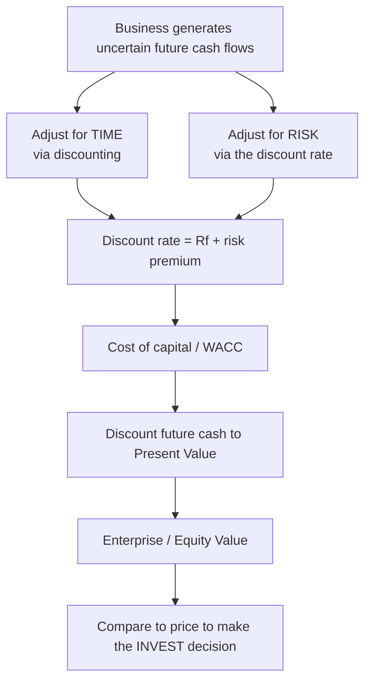
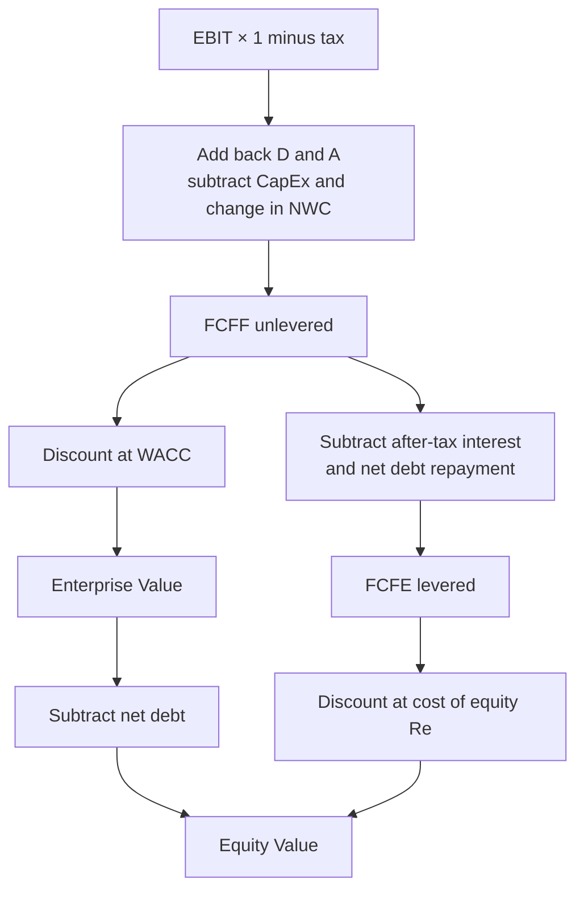
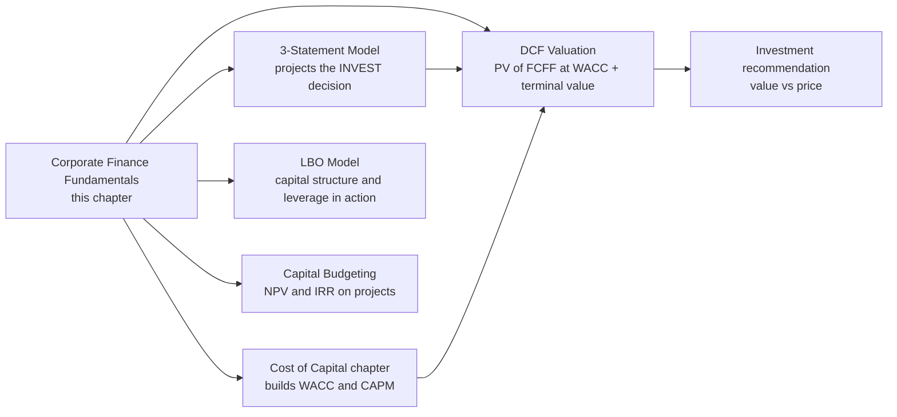
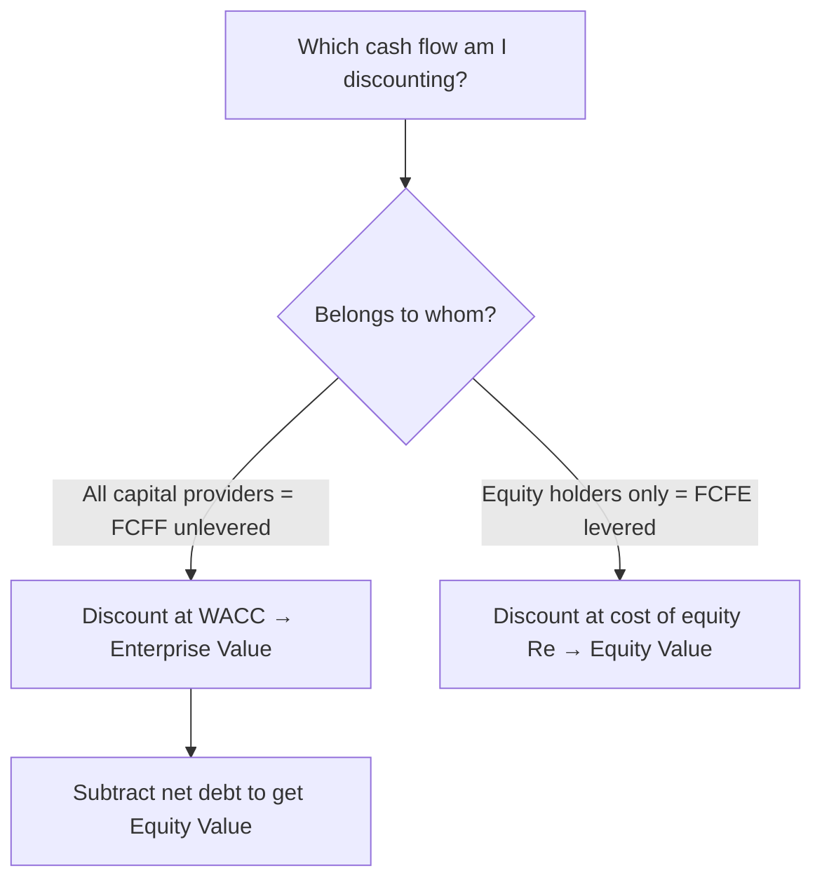

<!-- v2-deep -->

# Chapter 04 — Corporate Finance Fundamentals

> Every valuation model you will ever build is a machine for answering one question: *what is a stream of future cash worth today, given its risk?* Before you can build the machine, you need the theory it runs on. This chapter is that theory — the small set of ideas (time value of money, risk and return, cost of capital, capital structure, and the three corporate-finance decisions) that everything downstream in the FMVA program silently assumes. Master these five ideas and DCF, LBO, comparable-company, and merger models stop being formulas to memorise and become obvious consequences.

---

## 1. The Problem — The Analyst's Need

You are handed a business. It will throw off cash for the next twenty years: some years strong, some weak, all uncertain. Someone asks the only question that matters in finance: **"What should we pay for it today?"**

You cannot just add up the future cash. A rupee (or dollar) arriving in year 20 is *not* worth the same as a rupee in your hand today — you could invest today's rupee and have more than a rupee by year 20. And the year-20 cash is *uncertain*, while cash in hand is certain. So the future cash needs two adjustments before you can compare it to a price tag on the table today: an adjustment for **time**, and an adjustment for **risk**.

Corporate finance is the discipline that supplies those two adjustments and then uses them to answer three practical questions that a business faces every single day:

1. **Investment decision** — which projects/assets should we put money into? (Capital budgeting.)
2. **Financing decision** — how do we fund them: debt, equity, or a mix? (Capital structure.)
3. **Distribution decision** — what do we do with the cash the business generates: reinvest or return it to owners? (Dividend/payout policy.)

Financial modelling is simply the *quantification* of these three decisions. A three-statement model projects the consequences of the investment decision; a debt schedule and WACC calculation encode the financing decision; a dividend/buyback line and free-cash-flow build encode the distribution decision. **If you don't understand the underlying corporate finance, you are copying formulas without knowing what breaks them.** This chapter fixes that.

**Make the problem concrete.** Suppose a seller quotes ₹1,000m for a business you believe will pay ₹150m of cash next year, growing 4% forever, and you judge the right risk-adjusted return to be 10%. Is ₹1,000m cheap or dear? You cannot eyeball it. Run the growing-perpetuity engine you will meet in §4.1: value = 150 / (0.10 − 0.04) = ₹2,500m. The asset is worth 2.5× the asking price — a screaming buy. Change your required return to 16% and the value collapses to 150 / (0.16 − 0.04) = ₹1,250m — still cheap, but the *margin of safety* has shrunk from 150% to 25% on a single change of assumption. That violent sensitivity of value to the discount rate is exactly why the two adjustments (time and risk) are not academic niceties: **they decide whether you make or lose money.** Every technique in the rest of this chapter exists to pin those two numbers down defensibly.

---

## 2. The Core Idea — Analogies

**Time value of money — the ripening fruit.** Money is like a seed that grows if planted. A rupee planted today at 10% becomes ₹1.10 in a year — it *ripens*. So to compare fruit picked next year against a seed you hold today, you must "un-ripen" the future fruit back to seed-equivalent: that reverse operation is **discounting**. Growing money forward is **compounding**; shrinking it backward is **discounting**. They are the same machine run in opposite directions.

**Risk and return — the interest a nervous lender charges.** Would you lend ₹100 to the government (which prints the currency and always repays) at the same rate you'd lend it to a shaky startup? Of course not. You demand *extra* return from the risky borrower to compensate for the chance of loss. That extra is the **risk premium**. The riskier the cash flow, the higher the return you demand, and — because return demanded *is* the discount rate — the harder you discount, and the less you'll pay today.

**Cost of capital — the toll on the money highway.** Capital isn't free. Lenders want interest; shareholders want a return that beats the risk they bear. The blended toll the company must pay to *use* everyone's money is its **cost of capital** — and it is simultaneously the *hurdle rate* every new project must clear and the *discount rate* you apply to the whole firm's cash flows.

**Capital structure — the recipe of debt and equity.** A firm is funded like a layered cake: a base of (cheaper, riskier-to-the-firm) debt and a top of (costlier, safer-to-the-firm) equity. The mix changes the flavour — more debt lowers the average toll (interest is tax-deductible) but adds the risk of choking on repayments. There's a sweet spot.

**One more analogy that ties them together — the currency exchange desk.** Think of a discount rate as an exchange rate between "future rupees" and "today rupees." A high discount rate is a punishing exchange rate: future rupees convert into very few today-rupees. A low discount rate is a generous one. Time sets a baseline exchange rate (the risk-free curve); risk widens the spread the desk charges. When you value a company you are simply running every future cash flow through this exchange desk and summing the today-rupees you get back. This reframing is useful because it makes obvious why *two* things move value — you can change how much future cash there is (the numerator) *or* change the exchange rate (the denominator), and analysts spend their lives arguing about both.

---

## 3. Why It Works

Why is a future rupee worth less than a present one? Three independent reasons, and they *stack*:

1. **Opportunity cost.** A rupee today can be invested to earn a return. Forgoing that return is a real cost, so future money must be discounted by at least the return you gave up.
2. **Inflation.** Prices tend to rise, so a future rupee buys fewer goods. Even risk-free, purchasing power erodes.
3. **Risk/uncertainty.** Promised future cash may not fully arrive. The less certain, the larger the discount.

The **discount rate** bundles all three. A risk-free government rate captures opportunity cost + expected inflation; adding a **risk premium** captures uncertainty. This is *the* foundational mechanism of valuation: 

$$\text{Discount rate} = \text{Risk-free rate} + \text{Risk premium}$$

Why does higher risk *mechanically* mean lower value? Because value is future cash divided by (1 + discount rate) raised to a power. Push the discount rate up and the denominator explodes, so present value falls. **Risk and value are inversely linked through the discount rate** — this single sentence is the spine of every DCF you will build.

Why does the *market* set a consistent price for risk rather than every investor guessing? Because diversified investors compete. If a risky asset is priced to yield more than its risk warrants, buyers pile in, the price rises, and the yield falls back to fair. Equilibrium leaves only *non-diversifiable* (systematic/market) risk being rewarded — the intuition behind CAPM, which we meet in the cost-of-equity chapter.

**How much does each reason contribute? A numeric decomposition.** Say a 10-year government bond yields 7%. Long-run expected inflation is about 4.5%, so the *real* risk-free return is roughly 7% − 4.5% ≈ 2.5% (this is the opportunity-cost piece stripped of inflation). Now a mid-risk equity might require 12%. Line it up:

| Layer | Rate | What it compensates |
|---|---:|---|
| Real risk-free return | 2.5% | Pure opportunity cost / time preference |
| Expected inflation | 4.5% | Erosion of purchasing power |
| **Nominal risk-free rate** | **7.0%** | Government (default-free) return |
| Equity risk premium × beta | 5.0% | Bearing non-diversifiable business risk |
| **Required return on the equity** | **12.0%** | The discount rate you actually use |

Every rupee of that 12% traces to one of the three stacked reasons. When a colleague challenges "why 12%?", this decomposition is your defensible answer — not a number you plucked from air.

**Why compounding, not simple interest?** Because returns themselves earn returns. ₹100 at 10% simple interest for 3 years gives 100 + 3×10 = ₹130. At 10% *compound* it gives 100 × 1.1³ = ₹133.10 — the extra ₹3.10 is interest-on-interest. Over long horizons this gap becomes enormous (₹100 at 10% for 30 years is ₹1,745 compound versus ₹400 simple), which is precisely why every valuation formula uses $(1+r)^n$, never simple interest. The exponent is not decoration; it is the mathematics of money breeding money.

---

## 4. Full Technical Content

### 4.1 Time Value of Money — the master equations

The single most important relationship in finance links a present value (PV), a future value (FV), a rate (r) per period, and a number of periods (n):

$$FV = PV \times (1+r)^n \qquad\Longleftrightarrow\qquad PV = \frac{FV}{(1+r)^n}$$

The term $(1+r)^n$ is the **compound factor** (grows money forward); its reciprocal $\dfrac{1}{(1+r)^n}$ is the **discount factor** (brings money back). *Everything* in valuation is one of these two operations applied repeatedly.

**A stream of cash flows.** Real assets pay cash in many periods. Discount each cash flow $CF_t$ by its own factor and add them up:

$$PV = \sum_{t=1}^{n} \frac{CF_t}{(1+r)^t}$$

This is the **general DCF formula**. A whole DCF valuation is nothing but this equation with the free cash flows plugged into $CF_t$ and WACC plugged into $r$.

**Shortcut formulas** (memorise — they save you and appear in interviews):

| Instrument | What it is | Present-value formula |
|---|---|---|
| Perpetuity | Constant cash $C$ forever | $PV = \dfrac{C}{r}$ |
| Growing perpetuity (Gordon) | Cash grows at $g$ forever | $PV = \dfrac{C_1}{r-g}$ (needs $r>g$) |
| Annuity | Constant cash $C$ for $n$ periods | $PV = \dfrac{C}{r}\left[1-\dfrac{1}{(1+r)^n}\right]$ |
| Growing annuity | Cash grows at $g$ for $n$ periods | $PV = \dfrac{C_1}{r-g}\left[1-\left(\dfrac{1+g}{1+r}\right)^n\right]$ |

The growing perpetuity is the engine of the **terminal value** in DCF — burn it into memory now.

**Where these shortcuts come from (so you never mis-apply them).** The plain perpetuity $C/r$ is the limit of the annuity formula as $n \to \infty$: the bracket $[1 - 1/(1+r)^n]$ marches to 1, leaving $C/r$. That tells you the perpetuity assumes the *first* cash flow arrives **one period from now** and every payment is identical. The growing perpetuity $C_1/(r-g)$ has the same one-period-ahead timing but the numerator is **next year's** cash flow $C_1$, not this year's $C_0$. Analysts routinely blow the terminal value by putting $C_0$ on top instead of $C_0 \times (1+g)$ — a silent error worth millions on a large model. Memorise the timing, not just the algebra.

**Compounding frequency — the hidden lever.** Everything above assumes annual periods, but rates can compound semi-annually, monthly, or continuously. Converting a stated annual (nominal) rate into what you actually earn (effective) uses:

$$EAR = \left(1 + \frac{r_{nominal}}{m}\right)^{m} - 1$$

where $m$ is compounding periods per year. A 12% nominal rate compounded monthly ($m=12$) yields an EAR of $(1 + 0.12/12)^{12} - 1 = 1.01^{12} - 1 = 12.68\%$. Continuous compounding ($m \to \infty$) gives $e^{0.12} - 1 = 12.75\%$. For bond math and option pricing this distinction matters; for annual FCF models it does not — but an interviewer may probe whether you know the difference.

### 4.2 Building TVM in Excel — step by step

Excel has purpose-built functions. **Sign convention matters**: cash you pay out is negative, cash you receive is positive. If you ignore signs you get `#NUM!` or a nonsensical negative.

| Task | Excel function | Syntax | Note |
|---|---|---|---|
| Future value | `FV` | `=FV(rate, nper, pmt, [pv], [type])` | Lump sum: set `pmt=0` |
| Present value | `PV` | `=PV(rate, nper, pmt, [fv], [type])` | Discount a future lump sum or annuity |
| PV of uneven flows | `NPV` | `=NPV(rate, value1, value2, …)` | **Assumes first cash flow is one period away** |
| PV of dated flows | `XNPV` | `=XNPV(rate, values, dates)` | Uses actual calendar dates — the professional default |
| Solve for rate | `RATE` / `IRR` / `XIRR` | `=IRR(values)` | IRR is the rate that makes NPV = 0 |
| Solve for periods | `NPER` | `=NPER(rate, pmt, pv, [fv])` | |
| Periodic payment | `PMT` | `=PMT(rate, nper, pv, [fv])` | Loan/annuity instalment |

**The `NPV` trap you must internalise now (it costs analysts real money):** Excel's `NPV` discounts *value1* by one full period. So if your year-0 cash outflow sits inside the range, it gets wrongly discounted. The best-practice build is:

```
Correct NPV = CF_0 + NPV(rate, CF_1 : CF_n)
```

i.e. leave the **time-0** cash flow *outside* the `NPV()` and add it separately (undiscounted). For irregular dates, prefer `XNPV`/`XIRR`, which take explicit dates and treat the first as time-0 automatically.

**Discount-factor build (the modelling-desk standard).** Rather than trusting `NPV`, analysts usually build an explicit discount-factor row so the logic is transparent and auditable:

| Row | Y0 | Y1 | Y2 | Y3 |
|---|---|---|---|---|
| Period number `t` | 0 | 1 | 2 | 3 |
| Free cash flow | — | `CF1` | `CF2` | `CF3` |
| Discount factor `=1/(1+r)^t` | 1.000 | 0.909 | 0.826 | 0.751 |
| PV `= CF × factor` | — | … | … | … |
| **Sum of PVs** | **=SUM(...)** | | | |

Formatting/best-practice: **hard-code inputs in blue, formulas in black, links to other sheets in green**; put the single discount rate in one clearly labelled input cell and reference it with an absolute reference (`$B$2`) so every factor pulls from the same assumption.

**Concrete cell-by-cell walk-through.** Lay it out exactly like this in a blank sheet so you can reproduce it:

| | A | B | C | D | E |
|---|---|---|---|---|---|
| 1 | Discount rate | 0.10 | | | |
| 2 | Period t | 0 | 1 | 2 | 3 |
| 3 | Cash flow | 0 | 100 | 120 | 140 |
| 4 | Discount factor | `=1/(1+$B$1)^B2` | `=1/(1+$B$1)^C2` | `=1/(1+$B$1)^D2` | `=1/(1+$B$1)^E2` |
| 5 | PV of flow | `=B3*B4` | `=C3*C4` | `=D3*D4` | `=E3*E4` |
| 6 | Total PV | `=SUM(B5:E5)` | | | |

Row 4 evaluates to 1.000, 0.9091, 0.8264, 0.7513. Row 5 gives 0, 90.91, 99.17, 105.18. Cell **B6 = 295.26**. Now cross-check with the built-in: `=NPV($B$1, C3:E3)` = **295.26** — identical, because here CF0 is genuinely zero so the off-by-one does not bite. The moment you change B3 from 0 to, say, −250, the two methods diverge unless you write `=B3 + NPV($B$1, C3:E3)`. Building both and reconciling them to the paisa is the single best habit for catching the NPV bug before it reaches a client.

**`XNPV` when dates are irregular.** If cash flows land on 15-Jan-2026, 30-Jun-2026, and 31-Dec-2027 rather than clean annual boundaries, `NPV` is wrong because it assumes equal spacing. Use `=XNPV(rate, values, dates)` where `values` includes the time-0 flow and `dates` are actual serial dates; `XNPV` discounts using (days between date and first date)/365. This is the desk default for any real transaction because deals rarely close on 31 December.

### 4.3 Risk and Return — quantifying the premium

**Expected return** of a probability-weighted set of outcomes:

$$E(R) = \sum_i p_i R_i$$

**Risk = dispersion**, measured by variance and its square root, standard deviation:

$$\sigma^2 = \sum_i p_i \big(R_i - E(R)\big)^2 \qquad \sigma = \sqrt{\sigma^2}$$

**Diversification.** Combining assets whose returns don't move perfectly together reduces portfolio $\sigma$ without proportionally reducing expected return — the only "free lunch" in finance. The residual risk that diversification *cannot* remove is **systematic (market) risk**, measured by **beta ($\beta$)**. Because investors can diversify away the rest for free, the market only pays a premium for systematic risk. That gives the **Capital Asset Pricing Model** (developed fully in the cost-of-equity chapter):

$$R_e = R_f + \beta \,(R_m - R_f)$$

where $R_f$ = risk-free rate, $(R_m - R_f)$ = equity risk premium, and $\beta$ scales it to the specific asset's market sensitivity. This is *the* link from "risk" to a usable "discount rate for equity."

**Worked risk calculation.** A stock has three equally likely (p = 1/3) annual return scenarios: −10%, +8%, +26%.

- $E(R) = \tfrac{1}{3}(-10\%) + \tfrac{1}{3}(8\%) + \tfrac{1}{3}(26\%) = \tfrac{1}{3}(24\%) = 8.0\%$.
- Deviations: (−10 − 8) = −18, (8 − 8) = 0, (26 − 8) = +18.
- $\sigma^2 = \tfrac{1}{3}(18^2 + 0^2 + 18^2) = \tfrac{1}{3}(324 + 0 + 324) = \tfrac{648}{3} = 216$ (in %²).
- $\sigma = \sqrt{216} = 14.7\%$.

So this stock offers an 8% expected return with a 14.7% standard deviation. In Excel: `=SUMPRODUCT(probs, returns)` for the mean, and `=SQRT(SUMPRODUCT(probs,(returns-mean)^2))` entered as an array (or with a helper column) for σ.

**Why diversification works, numerically.** Two stocks each with σ = 20%. If perfectly correlated (ρ = 1), a 50/50 portfolio still has σ = 20% — no benefit. If uncorrelated (ρ = 0), portfolio variance = $0.5^2(20^2) + 0.5^2(20^2) = 200$, so σ = √200 = **14.1%** — a third of the risk vanished for free. If perfectly *negatively* correlated (ρ = −1), the two exactly offset and σ = **0%**. This is the whole reason CAPM rewards only systematic (undiversifiable) risk: the rest can be engineered away at no cost, so the market refuses to pay you for bearing it.

**Beta, intuitively.** Beta of 1.0 means the asset moves one-for-one with the market. Beta of 1.5 means a 10% market move drags the asset 15% — so it demands a bigger premium. Beta of 0.6 (a utility, say) moves only 6% for a 10% market swing, so a lower premium. With $R_f = 7\%$ and equity risk premium $(R_m - R_f) = 5\%$: a β = 1.5 stock requires $7 + 1.5(5) = 14.5\%$; a β = 0.6 stock requires $7 + 0.6(5) = 10.0\%$. Same market, different discount rates, purely because of systematic sensitivity.

### 4.4 Cost of Capital — the hurdle and the discount rate

Capital comes from two camps, each demanding a return:

- **Cost of debt, $R_d$** — the interest rate lenders charge. Because interest is **tax-deductible**, the firm's *after-tax* cost of debt is $R_d (1 - T)$, where $T$ is the marginal tax rate. This "tax shield" is why debt looks cheap.
- **Cost of equity, $R_e$** — the return shareholders require, from CAPM above. Always higher than $R_d$ because equity holders are paid last and bear the most risk.

The blended figure is the **Weighted Average Cost of Capital (WACC)** — weight each source by its share of total capital *at market value*:

$$\boxed{WACC = \frac{E}{V}\,R_e \;+\; \frac{D}{V}\,R_d\,(1-T)}$$

where $E$ = market value of equity, $D$ = market value of debt, $V = E + D$. WACC is the number you discount **unlevered free cash flow (FCFF)** with, because FCFF belongs to *all* capital providers. (Discount **levered** free cash flow, FCFE — which belongs only to shareholders — at $R_e$ instead. Matching the cash flow to the right rate is a rule you must never break; see Traps.)

**Why the after-tax adjustment sits only on debt.** Interest is paid *before* tax, so every ₹100 of interest cuts taxable profit by ₹100 and saves ₹100 × T in tax. Dividends, by contrast, are paid from *after-tax* profit — no shield. That asymmetry is the entire mechanical reason debt is "cheaper" than equity beyond its lower risk. Verify with a mini income statement: at T = 25%, a firm paying ₹100 interest has a tax bill ₹25 lower than one paying ₹100 dividend, so the true economic cost of that debt is ₹75, i.e. $100 × (1 − 0.25)$.

**A three-source WACC (preferred stock added).** Real firms sometimes carry preferred equity, which sits between debt and common equity — a fixed dividend, no tax shield, senior to common. The formula generalises:

$$WACC = \frac{E}{V}R_e + \frac{P}{V}R_p + \frac{D}{V}R_d(1-T)$$

with $V = E + P + D$ and $R_p$ = cost of preferred = preferred dividend / preferred price. Note the preferred term has **no** (1−T) because its dividend is not tax-deductible. If an interviewer hands you preferred stock and you tax-shield it, that is an immediate red flag.

### 4.5 Capital Structure — the debt/equity mix

**Modigliani–Miller (MM), Proposition I, no taxes (1958):** in a perfect market with no taxes, no bankruptcy costs, no information gaps, *firm value is independent of capital structure*. Slicing the cake differently doesn't change the cake. This is the essential baseline — it tells you that in theory financing *alone* creates no value; value comes from the assets/investments.

**MM with corporate taxes:** because interest is tax-deductible, adding debt creates a **tax shield** worth (in the simple perpetual case) $T \times D$, so levered value = unlevered value + $T \times D$. Taken literally this says "use 100% debt," which is obviously wrong in the real world.

**The trade-off theory** restores realism: as leverage rises, the tax-shield benefit grows *but so do expected financial-distress and bankruptcy costs* (suppliers demand cash upfront, talent leaves, fire-sale asset values). The **optimal capital structure** is where the marginal tax benefit equals the marginal distress cost — the point that **minimises WACC and maximises firm value.**

*Convention note:* MM's tax-shield mechanics are near-universal, but real-world "optimal" leverage is industry-specific — utilities and real estate carry heavy debt against stable cash flows; software and pharma carry little because their cash flows and asset collateral are volatile. Always benchmark leverage against sector peers, not an abstract ideal.

**MM Proposition II — why cost of equity rises with leverage.** MM's second proposition states that levering up does not give a free lunch on WACC in the no-tax world, because equity holders demand more as debt grows:

$$R_e = R_0 + (R_0 - R_d)\frac{D}{E}$$

where $R_0$ is the unlevered (all-equity) cost of capital. Plug numbers: $R_0 = 10\%$, $R_d = 6\%$. At D/E = 0, $R_e = 10\%$. At D/E = 1, $R_e = 10 + (10-6)(1) = 14\%$. At D/E = 2, $R_e = 10 + (4)(2) = 18\%$. Notice that in the *no-tax* world, when you recompute WACC it stays pinned at 10% — the cheaper debt weight is exactly cancelled by the rising cost of equity. That is MM Proposition I in action, and it is why the tax shield (not leverage per se) is the only value lever in the taxed version.

**Numeric trade-off: locating the optimum.** Suppose unlevered value $V_U$ = ₹1,000m, T = 25%, and estimated present value of distress costs grows non-linearly with debt:

| Debt $D$ (₹m) | Tax shield $T·D$ | PV distress costs | Levered value $V_L = V_U + T·D − \text{distress}$ |
|---:|---:|---:|---:|
| 0 | 0 | 0 | 1,000 |
| 200 | 50 | 5 | 1,045 |
| 400 | 100 | 25 | 1,075 |
| 600 | 150 | 70 | 1,080 |
| 800 | 200 | 160 | 1,040 |
| 1,000 | 250 | 320 | 930 |

Value peaks near **₹600m of debt** (V_L ≈ ₹1,080m) — that is the optimal capital structure for this firm. Below it, you are leaving tax shield on the table; above it, distress costs devour the shield and then some. The shape is the classic inverted-U, and it is the whole content of trade-off theory rendered as arithmetic.

**Pecking-order theory (the behavioural alternative).** Trade-off theory is not the only story. Pecking-order theory observes that managers, who know more about the firm than outside investors, fund in a preference order: **internal cash first, then debt, then equity last** — because issuing equity signals "management thinks the stock is overvalued," which drives the price down. This explains why highly profitable firms often carry *less* debt than trade-off theory predicts (they simply fund from retained earnings). You do not need to model it, but naming it in an interview shows range.

### 4.6 The Three Decisions — the operating loop

| Decision | Core question | Tool / metric | Rule |
|---|---|---|---|
| **Invest** | Which assets/projects? | NPV, IRR, payback | Accept if **NPV > 0** (equivalently IRR > WACC) |
| **Finance** | Debt vs equity mix? | WACC, D/E, coverage ratios | Choose mix that **minimises WACC** subject to acceptable distress risk |
| **Distribute** | Reinvest or pay out? | Payout ratio, FCFE | Return cash when internal projects can't beat the cost of capital |

**NPV decision rule (the heart of the investment decision):**

$$NPV = \sum_{t=1}^{n}\frac{CF_t}{(1+r)^t} - \text{Initial Investment}$$

Positive NPV means the project earns *more* than the cost of the capital it consumes — it creates value; take it. **IRR** is the rate at which $NPV=0$; accept when IRR > hurdle rate (WACC). NPV and IRR usually agree but can conflict on scale or unconventional cash-flow sign patterns — when they conflict, **NPV wins** because it measures value in currency, not a percentage that ignores project size.

**The full capital-budgeting toolkit (know the trade-offs).**

| Metric | What it answers | Strength | Weakness |
|---|---|---|---|
| NPV | Value created in currency | Correct, additive, uses all cash flows | Needs a discount rate; not intuitive as a % |
| IRR | The project's own break-even rate | Intuitive %, no rate needed to compute | Multiple/no IRR with sign flips; ignores scale |
| Payback | Years to recover the outlay | Simple liquidity gauge | Ignores time value and post-payback cash |
| Discounted payback | Years to recover in PV terms | Fixes payback's TVM flaw | Still ignores cash after cutoff |
| Profitability index (PI) | PV of inflows per ₹1 invested | Ranks under capital rationing | Can mislead vs NPV on mutually exclusive scale |

**Profitability index formula:** $PI = \dfrac{\text{PV of future cash flows}}{\text{Initial investment}}$. Accept if PI > 1 (equivalent to NPV > 0). PI shines when capital is *rationed* — with a fixed budget you rank projects by bang-per-rupee, not raw NPV.

**When NPV and IRR truly conflict — a worked clash.** Two mutually exclusive projects, hurdle 10%:

- Project S (small): −100 now, +130 in year 1. NPV = −100 + 130/1.1 = **+18.2**. IRR = 30%.
- Project L (large): −1,000 now, +1,180 in year 1. NPV = −1,000 + 1,180/1.1 = **+72.7**. IRR = 18%.

IRR ranks S first (30% > 18%); NPV ranks L first (72.7 > 18.2). **Take L** — it creates ₹72.7 of value versus ₹18.2, and you cannot "reinvest" the freed-up capital from S at 30% in reality. This is the textbook scale-conflict trap, and NPV is the tie-breaker every time.

### 4.7 How the pieces link — the master flow


*Figure 4.1 — Time and risk are the two adjustments that turn future cash into a value you can compare against a price.*

### 4.8 From cash flow to two kinds of value — FCFF vs FCFE

Two free-cash-flow definitions run through every valuation, and mixing them is the most common modelling sin. Build them from the same starting point:

**FCFF (unlevered, to all capital providers):**

$$FCFF = EBIT(1-T) + \text{D\&A} - \text{CapEx} - \Delta \text{NWC}$$

**FCFE (levered, to equity only):**

$$FCFE = FCFF - \text{Interest}(1-T) - \text{Debt repayment} + \text{New debt raised}$$

The bridge is intuitive: FCFF is the cash the *whole* business throws off before any financing choices; FCFE strips out what the lenders take (after-tax interest and net principal) to leave what belongs to shareholders. **Discount FCFF at WACC to get enterprise value; discount FCFE at $R_e$ to get equity value directly.** Both should, in a consistent model, hand you the same equity value after you subtract net debt from the enterprise-value route.


*Figure 4.4 — Two roads to the same equity value. The unlevered road goes through enterprise value and subtracts net debt; the levered road reaches equity value directly. Use the same rate on the matching cash flow.*

---

## 5. Worked Examples

### Example 1 — Single cash flow: compounding and discounting reconcile

You invest **₹10,000** today at **8%** for **5 years**.

**Forward (FV):** $FV = 10{,}000 \times (1.08)^5 = 10{,}000 \times 1.46933 = ₹14{,}693.28$.
Excel: `=FV(0.08,5,0,-10000)` → **14,693.28** (note the −10000: cash paid out).

**Reverse (PV):** discount that ₹14,693.28 back at 8% for 5 years:
$PV = \dfrac{14{,}693.28}{(1.08)^5} = \dfrac{14{,}693.28}{1.46933} = ₹10{,}000$. ✔ It reconciles — compounding and discounting are exact inverses. Excel: `=PV(0.08,5,0,14693.28)` → **−10,000**.

**What-if variation — semi-annual compounding.** Same 8% nominal but compounded twice a year means 4% per half-period over 10 half-periods: $FV = 10{,}000 \times 1.04^{10} = 10{,}000 \times 1.48024 = ₹14{,}802.44$. You earn ₹109 more than annual compounding purely from earning interest on interest twice as often. Excel: `=FV(0.08/2, 5*2, 0, -10000)`.

### Example 2 — Multi-period project NPV (the investment decision)

A project costs **₹1,000** today (time 0) and returns **₹400 / ₹400 / ₹400 / ₹300** at the end of years 1–4. Discount rate (WACC) = **10%**.

| Year `t` | Cash flow | Discount factor `1/1.1^t` | Present value |
|---|---:|---:|---:|
| 0 | −1,000 | 1.0000 | −1,000.00 |
| 1 | 400 | 0.9091 | 363.64 |
| 2 | 400 | 0.8264 | 330.58 |
| 3 | 400 | 0.7513 | 300.53 |
| 4 | 300 | 0.6830 | 204.90 |
| | | **NPV** | **+199.65** |

**NPV = +₹199.65 > 0 → accept the project.** It earns more than the 10% cost of capital.
Excel (best practice): `=-1000 + NPV(0.10, 400,400,400,300)` → **199.65**. Note the −1000 sits *outside* NPV because it occurs at time 0.

**IRR check:** `=IRR({-1000,400,400,400,300})` ≈ **19.0%**. Since 19.0% > 10% hurdle, IRR agrees with NPV — accept.

**What-if variation — the hurdle rises to 19%.** Re-discount at 19%: factors become 0.8403, 0.7062, 0.5934, 0.4987, giving PVs of 336.13, 282.46, 237.36, 149.62, summing to ₹1,005.57 of inflows against the ₹1,000 outlay → **NPV ≈ +₹5.6**, essentially zero. This confirms IRR ≈ 19% is exactly the rate that zeroes NPV. Push the hurdle to 22% and NPV turns **negative** — the project now destroys value. This is why knowing your WACC precisely matters: a marginal project flips sign inside a few percentage points.

**Common-error trap demonstrated.** If a careless analyst writes `=NPV(0.10, -1000, 400, 400, 400, 300)` with the −1000 *inside*, Excel discounts the outlay by one year: it computes −909.09 + (PVs of the inflows also each shoved one year further out) and returns **≈ 181.5**, understating NPV by ~₹18. On a real deal that off-by-one has scuppered bids. Always keep CF0 outside.

### Example 3 — WACC and the financing decision

A firm has **₹600m equity** and **₹400m debt** at market value (so $V$ = ₹1,000m). Cost of equity $R_e$ = **12%**, pre-tax cost of debt $R_d$ = **7%**, tax rate $T$ = **25%**.

| Component | Weight | Cost | After-tax cost | Contribution |
|---|---:|---:|---:|---:|
| Equity | 600/1000 = 0.60 | 12% | 12% | 0.60 × 12% = 7.20% |
| Debt | 400/1000 = 0.40 | 7% | 7% × (1−0.25) = 5.25% | 0.40 × 5.25% = 2.10% |
| | | | **WACC** | **9.30%** |

$$WACC = 0.60(12\%) + 0.40(7\%)(1-0.25) = 7.20\% + 2.10\% = \mathbf{9.30\%}$$

**Interpretation & link to the distribution decision:** any project earning above 9.30% creates value; below it, destroys value. If the firm has no project beating 9.30%, the *distribution decision* says return the cash to shareholders (dividend/buyback) rather than reinvest below the hurdle.

**Now flex the financing decision.** Suppose the firm shifts to **₹300m equity / ₹700m debt** and, because leverage raised risk, $R_e$ rises to 13.5% and $R_d$ to 8%:

$$WACC = 0.30(13.5\%) + 0.70(8\%)(0.75) = 4.05\% + 4.20\% = \mathbf{8.25\%}$$

More debt *lowered* WACC (tax shield + cheaper debt weight) — good, up to the point where distress costs make lenders and shareholders demand so much more that WACC turns back up. That U-shape is the trade-off theory in a single number.

**What-if variation — push leverage too far.** Now go to **₹100m equity / ₹900m debt**. Distress fears spike: lenders demand $R_d$ = 12% and shareholders, facing near-wipeout risk, demand $R_e$ = 22%:

$$WACC = 0.10(22\%) + 0.90(12\%)(0.75) = 2.20\% + 8.10\% = \mathbf{10.30\%}$$

WACC has now risen *above* the original 9.30% — the firm blew past its optimum. Line up the three points: 9.30% at 40% debt, 8.25% at 70% debt, 10.30% at 90% debt. That is the inverted-U of value (equivalently the U of WACC) traced in three data points, and it demonstrates why "more debt is cheaper" is only true until it isn't.

### Example 4 — Terminal value via growing perpetuity (ties TVM to valuation)

A firm's free cash flow next year ($CF_1$) is **₹120m**, expected to grow at **3%** forever; WACC = **9%**.

$$TV = \frac{CF_1}{WACC - g} = \frac{120}{0.09 - 0.03} = \frac{120}{0.06} = ₹2{,}000\text{m}$$

That single growing-perpetuity formula from §4.1 *is* the DCF terminal value — proof that TVM isn't abstract theory but the literal machinery of company valuation. If this terminal value occurs at end of year 5, you'd then discount it back: $2{,}000 / (1.09)^5 = ₹1{,}299.9\text{m}$.

**What-if variation — the terrifying WACC−g sensitivity.** Hold $CF_1$ = 120 and nudge only the spread:

| WACC | g | WACC − g | Terminal value |
|---:|---:|---:|---:|
| 9% | 2% | 7% | 120/0.07 = ₹1,714m |
| 9% | 3% | 6% | 120/0.06 = ₹2,000m |
| 9% | 4% | 5% | 120/0.05 = ₹2,400m |
| 8% | 4% | 4% | 120/0.04 = ₹3,000m |
| 8% | 5% | 3% | 120/0.03 = ₹4,000m |

A single percentage-point change in *either* input swings terminal value by hundreds of crores, and as WACC − g heads toward zero the value goes hyperbolic. Since terminal value is often 60–80% of a DCF's total, **this is the most dangerous cell in any model** — always sensitise it and never let g creep toward WACC.

### Example 5 — FCFF vs FCFE reconcile to the same equity value

A firm has **EBIT = ₹500m**, tax rate **T = 25%**, D&A = ₹80m, CapEx = ₹120m, ΔNWC = ₹30m. It carries **₹1,000m debt** at 8% interest. Assume for simplicity these are steady-state perpetual figures, WACC = 10%, and cost of equity $R_e$ = 14%. Net debt = ₹1,000m.

**Unlevered road (FCFF → enterprise value):**
$$FCFF = 500(0.75) + 80 - 120 - 30 = 375 + 80 - 120 - 30 = ₹305\text{m}$$
As a perpetuity: Enterprise Value = 305 / 0.10 = **₹3,050m**. Subtract net debt ₹1,000m → **Equity Value = ₹2,050m**.

**Levered road (FCFE → equity value):**
Interest = 1,000 × 8% = ₹80m; after-tax interest = 80 × 0.75 = ₹60m. With no net new borrowing in steady state:
$$FCFE = 305 - 60 = ₹245\text{m}$$
As a perpetuity discounted at $R_e$: Equity Value = 245 / 0.14 = **₹1,750m**.

**They don't match (2,050 vs 1,750) — why, and the lesson.** The two roads reconcile *only* when the WACC and $R_e$ are mutually consistent with the actual capital structure (E and D must be the *market* values that fall out of the valuation, used to weight WACC — a circularity real models resolve by iteration or by targeting a capital structure). Here the assumed 10% WACC and 14% $R_e$ are not internally consistent with a ₹1,000m-debt / ₹2,050m-equity mix, so the routes diverge. The takeaway for interviews: **FCFF/WACC and FCFE/$R_e$ agree only under consistent weights; if your two DCFs disagree, your discount rates and capital structure are not talking to each other.** The unlevered route is preferred in practice precisely because it sidesteps the moving-target cost of equity as leverage changes.

---

## 6. Connections — where this reappears in the FMVA program


*Figure 4.2 — This chapter is the root; every later modelling module is a branch that applies one of its five ideas.*

- **Three-statement model:** projects the cash-flow consequences of the *investment* decision; the debt schedule encodes the *financing* decision; the dividends/retained-earnings line encodes the *distribution* decision.
- **DCF valuation:** literally the §4.1 DCF formula with FCFF as $CF_t$ and WACC as $r$, capped by the §4.8 terminal-value growing perpetuity.
- **Cost of capital chapter:** expands §4.3–4.4 into full CAPM, beta un/re-levering, and WACC mechanics.
- **LBO & M&A models:** stress-test capital structure (§4.5) — how much debt a target can carry and what it does to returns. An LBO is the trade-off theory pushed to its limit: maximise the tax shield and equity return without tripping the distress costs (covenant breach, missed interest).
- **Comparable-company / precedent transactions:** the market's shortcut to the same PV — multiples are compressed DCFs that embed the same risk/growth trade-off. An EV/EBITDA multiple, algebraically, is just $\frac{1}{WACC - g}$ dressed up: a high-growth, low-risk firm *should* trade at a high multiple because its WACC − g is small.

---

## 7. Traps and Common Errors


*Figure 4.3 — The single most tested judgment in modelling: match the cash flow to the correct discount rate.*

1. **Mismatching cash flow and discount rate.** FCFF ↔ WACC (gives enterprise value); FCFE ↔ cost of equity (gives equity value directly). Discounting FCFF at $R_e$, or FCFE at WACC, silently corrupts the valuation and is a classic interview-killer.
2. **The Excel `NPV` off-by-one.** `NPV()` discounts the first argument by one full period. Putting the time-0 outflow inside the range under-values it. Fix: keep CF₀ outside and add it, or use `XNPV` with dates.
3. **Double-counting the tax shield.** WACC already contains the after-tax cost of debt $R_d(1-T)$. If you *also* add interest tax savings into the free cash flows, you count the shield twice. In an FCFF/WACC framework, interest never appears in the cash flows.
4. **$r \le g$ in a perpetuity.** If growth ≥ discount rate, $\dfrac{C}{r-g}$ goes negative or infinite — nonsense. Terminal growth must stay below WACC and generally below long-run GDP growth (2–3%). A firm cannot outgrow the economy forever.
5. **Book weights instead of market weights in WACC.** Use *market* values of debt and equity; book values distort the mix, especially for equity.
6. **Confusing IRR's percentage with value.** A 40% IRR on ₹1 beats a 15% IRR on ₹1bn in *rate* but not in *value created*. For mutually exclusive projects of different sizes, decide on **NPV**.
7. **Nominal vs real mismatch.** Discount nominal cash flows at nominal rates, real at real. Mixing them (e.g., real cash flows at a nominal WACC) systematically understates value.
8. **Forgetting equity's cost entirely.** Retained earnings are *not* free money — shareholders still demand $R_e$ on them. "We funded it from profits so there's no cost" is wrong and destroys value if the project returns less than $R_e$.
9. **Ignoring diversifiable vs systematic risk.** Only systematic risk (beta) is priced. Loading a discount rate with company-specific risk that a diversified investor sheds for free over-discounts and under-values.
10. **Terminal value using this year's cash flow.** The growing perpetuity needs *next* year's flow on top: $TV = \dfrac{CF_n \times (1+g)}{r-g}$, not $\dfrac{CF_n}{r-g}$. Forgetting the $(1+g)$ understates TV by a factor of $(1+g)$ — a subtle but universal rookie error.
11. **Multiple IRRs on sign-flipping cash flows.** A project with an outflow, inflows, then a large cleanup outflow (mining, nuclear) can have two or more IRRs, or none. IRR becomes meaningless; fall back to NPV or use MIRR.
12. **Using a single firm-wide WACC for a project of different risk.** A stable-utility firm evaluating a risky tech venture must not discount it at the utility's low WACC — that would accept value-destroying bets. Match the discount rate to the *project's* risk, not the parent's.
13. **Confusing enterprise value with equity value.** EV is the whole business (debt + equity); equity value is what shareholders own. Forgetting to subtract net debt (and add non-operating assets like excess cash) to bridge EV → equity value is a per-share error that mis-prices the stock.
14. **Interview trap — "does share buyback create value?"** A buyback at fair value is financially neutral (it returns cash; it doesn't manufacture value). It only *adds* value if the shares are undervalued, or if the distribution decision is right because the firm had no project beating its hurdle. Saying "buybacks always boost value because EPS rises" is wrong — EPS can rise while value per share is unchanged.

**Interview-angle quick fire.** Expect rapid conceptual probes: *"Two firms, identical operations, one has more debt — which has the higher WACC?"* (usually the low-debt one, up to the optimum, because it forgoes tax shield — but say "assuming both are below their distress threshold"). *"If interest rates rise, what happens to your DCF value?"* (WACC rises, value falls, and terminal value falls most because it is furthest out and most sensitive to WACC − g). *"Why is cost of equity higher than cost of debt?"* (equity is residual and junior, bears more risk, and gets no tax shield). Being able to reason these live, from the five core ideas, is what separates a modeller from a formula-copier.

---

## 8. First-Principles Recap

Strip everything back and only five ideas remain:

1. **Money has a time value.** A future rupee is worth less than a present one because of opportunity cost, inflation, and risk. Convert between them with $(1+r)^n$: multiply to grow, divide to discount.
2. **Risk is priced through the discount rate.** More risk → higher required return → harder discounting → lower present value. Value and risk are inversely linked through $r = R_f + \text{risk premium}$.
3. **Capital costs money, and the blended cost is WACC.** It is simultaneously the hurdle every project must clear and the rate you discount whole-firm cash flows at.
4. **Capital structure shifts WACC but not the underlying assets' cash-generating power.** Debt adds a tax shield (lowers WACC) up to the point distress costs dominate — the trade-off, U-shaped optimum.
5. **All of corporate finance is three decisions:** invest (NPV > 0), finance (minimise WACC at tolerable risk), distribute (pay out when you can't beat the hurdle). Valuation is just these applied to a whole business.

If you can rebuild the DCF formula, WACC, and the NPV rule from these five sentences without notes, you own this chapter.

**A self-test to prove you own it.** Without looking back, answer these five and check them against the chapter: (a) Why does terminal value use $CF_n(1+g)$ and not $CF_n$? (b) A project returns 11% and the firm's WACC is 9% but the project is riskier than the firm — accept or reject, and on what basis? (c) You raise debt from 30% to 50% of capital and WACC *falls* — name the two forces at work and the force that eventually reverses it. (d) Your FCFF-based equity value and FCFE-based equity value disagree by 15% — what is the most likely cause? (e) Excel's `NPV` returns a number ₹18 lower than your discount-factor sheet — what did you probably do wrong? If all five come easily, move on; if any stalls, re-read the matching section.

---

## 9. Quick-Reference

**Core formulas**

| Concept | Formula |
|---|---|
| Future value | $FV = PV(1+r)^n$ |
| Present value | $PV = FV / (1+r)^n$ |
| Effective annual rate | $EAR = (1 + r/m)^m - 1$ |
| DCF (general) | $PV = \sum CF_t / (1+r)^t$ |
| Perpetuity | $PV = C / r$ |
| Growing perpetuity / Terminal value | $PV = C_1 / (r-g)$ |
| Annuity | $PV = \frac{C}{r}[1 - (1+r)^{-n}]$ |
| NPV | $\sum CF_t/(1+r)^t - \text{Investment}$ |
| Profitability index | $PI = \text{PV of inflows} / \text{Investment}$ |
| CAPM (cost of equity) | $R_e = R_f + \beta(R_m - R_f)$ |
| MM Prop II (levered Re) | $R_e = R_0 + (R_0 - R_d)\,D/E$ |
| After-tax cost of debt | $R_d(1-T)$ |
| WACC | $\frac{E}{V}R_e + \frac{D}{V}R_d(1-T)$ |
| WACC with preferred | $\frac{E}{V}R_e + \frac{P}{V}R_p + \frac{D}{V}R_d(1-T)$ |
| Levered value (MM + tax) | $V_L = V_U + T\cdot D$ |
| FCFF | $EBIT(1-T) + D\&A - CapEx - \Delta NWC$ |
| FCFE | $FCFF - \text{Int}(1-T) - \text{Debt repaid} + \text{New debt}$ |

**Essential Excel functions**

| Function | Use |
|---|---|
| `=FV(rate,nper,pmt,pv)` | Grow money forward |
| `=PV(rate,nper,pmt,fv)` | Discount to today |
| `=NPV(rate,CF1:CFn)` | PV of period-end flows (**CF0 added separately**) |
| `=XNPV(rate,values,dates)` | PV with actual calendar dates (preferred) |
| `=IRR(range)` / `=XIRR(values,dates)` | Rate where NPV = 0 |
| `=MIRR(range,finance_rate,reinvest_rate)` | Fixes multiple-IRR and reinvestment issues |
| `=PMT / NPER / RATE(...)` | Solve loans/annuities |
| `=SUMPRODUCT(prob,returns)` | Expected value of a distribution |

**Rules of thumb**

- Accept a project if **NPV > 0** ⇔ **IRR > WACC** ⇔ **PI > 1**.
- **FCFF → WACC**; **FCFE → cost of equity.** Never cross them.
- Keep terminal growth **g < WACC** and **g ≤ long-run GDP (~2–3%)**.
- Terminal value uses **next** year's flow: $CF_n(1+g)/(r-g)$.
- Use **market-value** weights in WACC.
- Match the discount rate to the **project's** risk, not the parent firm's.
- Bridge EV → equity value: **subtract net debt**, add non-operating assets.
- Excel colour code: **blue = input, black = formula, green = link.**

**Shortcuts:** `F4` toggles absolute references (`$B$2`); `Alt + =` autosum; `Ctrl + [` trace precedents; `F9` recalculate; `Ctrl + Shift + Enter` for legacy array formulas.

---

## 10. Build-It-Yourself

Open a blank Excel workbook and build this from scratch — reading is not modelling.

1. **Inputs block (colour blue).** In cells: WACC = 10%, terminal growth g = 3%, initial investment = 1,000.
2. **Cash-flow row.** Years 0–5 across the top. Year 0 = −1,000; years 1–5 = 250, 300, 350, 400, 450.
3. **Discount-factor row.** `=1/(1+$WACC)^t` where `t` is the period number. Reference the WACC input with an absolute reference so all five factors pull from one cell.
4. **PV row.** `= cash flow × discount factor`. 
5. **Terminal value.** In year 5, add $TV = \dfrac{450 \times (1+g)}{WACC - g}$, then multiply by the year-5 discount factor to bring it to today.
6. **Enterprise value.** `=SUM` of all PVs (explicit + discounted terminal value). Because CF0 is negative, this SUM *is* the NPV.
7. **Cross-check.** Rebuild the explicit-period PV using `=-1000 + NPV(WACC, year1:year5)` and confirm it matches your manual discount-factor sum to the paisa. They must reconcile — if not, hunt the `NPV` off-by-one.
8. **Sensitivity (stretch).** Wrap a two-variable Data Table (`What-If Analysis → Data Table`) around WACC (8–12%) and g (2–4%) to watch value swing. Notice how violently value moves as `WACC − g` shrinks — the single most important sensitivity in all of valuation.

**Reconcile the numbers before you move on.** With the inputs above, verify these landmark figures so you know your sheet is correct:

- Year-5 discount factor = $1/1.1^5 = 0.6209$.
- Terminal value at year 5 = $450 \times 1.03 / (0.10 - 0.03) = 463.5 / 0.07 = ₹6{,}621.4$m.
- PV of that terminal value = $6{,}621.4 \times 0.6209 = ₹4{,}111.2$m.
- Sum of the PVs of the explicit flows (250→450 over years 1–5) ≈ ₹1,299.7m of inflows; less the ₹1,000 outlay → explicit-period NPV ≈ **+₹299.7m**.
- Total enterprise value (explicit PVs + PV of TV − outlay) ≈ **₹4,410.9m**.

If your sheet reproduces these to within a rupee, the wiring is right. If the terminal value is off by exactly a factor of 1.03, you forgot the $(1+g)$ on top (Trap 10). If your NPV cross-check is off by ~₹18–20, you buried CF0 inside `NPV()` (Trap 2).

9. **Add the FCFF/FCFE layer (stretch).** Below your DCF, build the Example 5 bridge: from EBIT compute FCFF, discount at WACC for enterprise value, subtract net debt for equity value; separately compute FCFE and discount at $R_e$. Deliberately watch the two equity values diverge when your WACC and $R_e$ are not consistent with the capital structure — then adjust $R_e$ until they converge. Feeling that circularity by hand is the fastest way to understand why professional DCFs iterate on the capital structure.
10. **Break it on purpose (learning by sabotage).** Set g = 10% while WACC = 10% and watch terminal value blow up to a `#DIV/0!` or a giant number — the $r > g$ rule made visceral. Then flip a mid-year cash flow negative and add another sign change to see `IRR` return a bizarre value or `#NUM!`, demonstrating the multiple-IRR trap. Undo both. Deliberately triggering these failures cements the traps far better than reading them.

When your manual DCF and the `NPV()` version agree, your FCFF and FCFE roads reconcile, and your Data Table behaves, you have physically built the entire theory of this chapter into a working model. That muscle memory — inputs feed factors feed PVs feed value — is exactly what every later FMVA model scales up.
