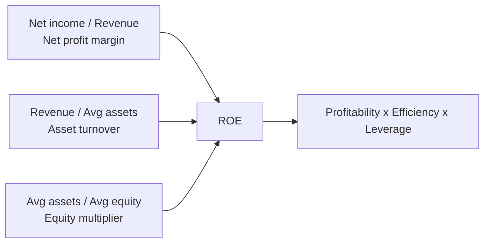
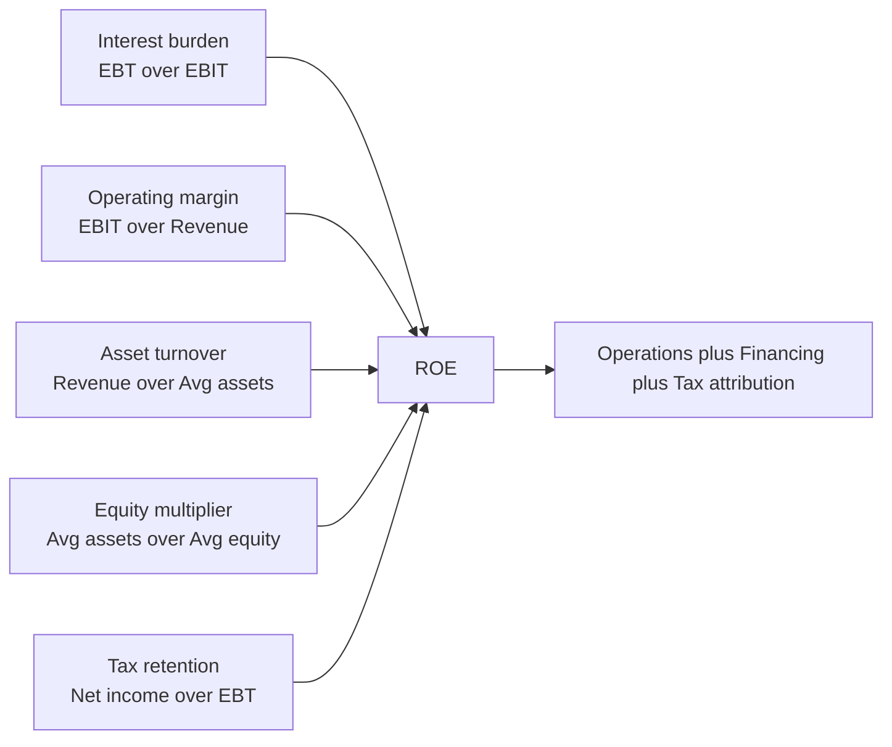
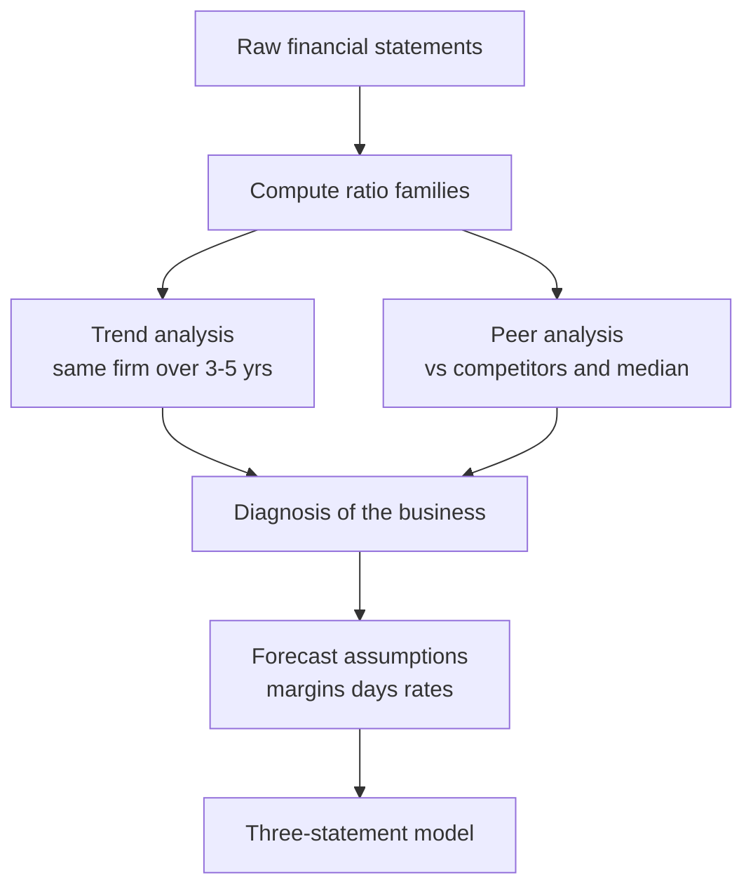
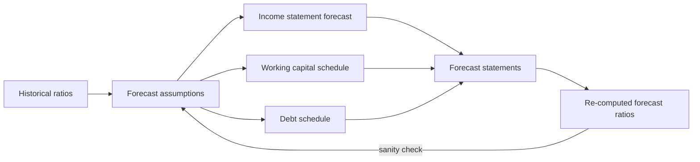

<!-- v2-deep -->

# Chapter 05 — Ratio and Financial Analysis

## 1. The Problem — Raw Statements Don't Speak

You have just built or downloaded three financial statements for a company. The income statement says revenue is $4,200 million and net income is $310 million. The balance sheet says total assets are $3,900 million and equity is $1,600 million. The cash flow statement says operating cash flow is $480 million.

Now answer these questions:

- Is $310 million of profit *good*?
- Is this company more or less profitable than its competitor that earned $180 million?
- Can it pay its bills next quarter?
- Is it drowning in debt, or does it have room to borrow?
- When I forecast next year in my model, what gross margin, what receivable days, what interest rate should I assume?

You **cannot answer a single one of these from the raw numbers**. A dollar figure in isolation is meaningless. $310 million of profit is spectacular for a company with $500 million of assets and catastrophic for one with $50 billion of assets. A big company naturally has big numbers; that tells you nothing about *quality*.

The absolute numbers are also **not comparable** — across time (the company was half the size five years ago), across peers (a rival reports in euros and is three times larger), or across the model (your forecast needs *rates and relationships*, not restated dollar amounts).

Ratio analysis exists to solve this. A ratio divides one statement line by another to produce a **standardised, unit-free, scale-independent number** that can be compared across companies, across years, and against your own forecast assumptions. Ratios are the language in which analysts, lenders, and investors actually think — and, crucially for a modeller, **almost every forecast driver in a three-statement model is a ratio**. Learn to read ratios and you learn to both diagnose a business and build its future.

A concrete illustration of scale blindness. Below, three companies each earn the *same* $310m of net income. The raw profit is identical; the ratios are worlds apart.

| Company | Net income | Total assets | Equity | ROA | ROE | Verdict |
|---|---|---|---|---|---|---|
| SmallCo | 310 | 900 | 500 | 34.4% | 62.0% | Extraordinary |
| MidCo | 310 | 3,900 | 1,600 | 7.9% | 19.4% | Solid |
| MegaCo | 310 | 48,000 | 22,000 | 0.6% | 1.4% | Value-destroying |

Same numerator, three verdicts. The dollar figure hid everything; the ratio revealed it. This single table is the entire justification for the chapter.

## 2. The Core Idea — The Blood Test for a Business

Think of a company's financial statements as a patient's raw body. Height, weight, and total blood volume tell a doctor almost nothing on their own — a 6-foot adult and a toddler have wildly different "normal" numbers.

A **blood test** works differently. It reports *ratios and concentrations*: cholesterol per decilitre, white cells per microlitre, glucose in mg/dL. These are standardised so the doctor can compare *you* against *population norms*, against *your own last check-up*, and against *danger thresholds* — regardless of your size.

Financial ratios are the blood panel for a business. Return on equity is its metabolic rate. The current ratio is its blood pressure — can it handle immediate stress? The debt-to-equity ratio is its cholesterol — fine at moderate levels, dangerous when it clogs the arteries. Inventory days measure how fast food moves through the system.

And like a doctor, **no analyst diagnoses from a single number**. One high reading might be a fluke; a *pattern across the panel*, tracked over time and compared to healthy peers, is what reveals the true condition. Ratio analysis is pattern recognition on a standardised panel.

The analogy runs one level deeper, and it matters for modelling. A doctor doesn't just diagnose *today* — they **project**: "at this cholesterol trajectory, expect a problem in ten years." That forward step is exactly what a modeller does with ratios. A stable receivable-days figure is like a stable resting heart rate: it is a *structural property of the organism*, so you can reasonably assume it persists into next year and build the forecast on top of it. Diagnosis looks backward; the same standardised panel, held forward, becomes prognosis. Chapters 4 built the body; this chapter reads its vitals *and* writes its prognosis.

## 3. Why It Works

Ratios work because of three mathematical properties that dollar figures lack:

**1. Scale invariance (normalisation).** Dividing by a size measure — revenue, assets, or equity — cancels out the "bigness" of a company. A 12% net margin is 12% whether the firm earns $1 million or $100 billion. This is exactly what lets you place a startup and a giant on the same axis.

**2. Relationship, not level.** A ratio captures how two things *move together*. Receivables ÷ revenue isn't about how much cash is owed; it's about how *efficiently* the company converts sales into collected cash. That relationship tends to be **stable and persistent** — which is precisely why it's forecastable. Companies don't usually swing from 45 receivable-days to 90 and back; the ratio is a structural feature of the business model.

**3. Common-sizing enables comparison.** Because every ratio is unit-free, you can lay ten companies side by side, or twenty years of one company, and read differences directly. This is the engine of both **trend analysis** (same company over time) and **peer/benchmark analysis** (company vs. competitors).

The deep reason ratios matter *to a modeller*: forecasting a raw dollar line ("revenue will be $4,620m") requires you to predict scale, which is hard and arbitrary. Forecasting a *ratio* ("gross margin holds at 38%, receivable days stay at 42") anchors your forecast to the **economics of the business**, which are stable. You then multiply the ratio back onto a forecast driver to *recover* the dollar amount. Ratios are how you turn historical statements into forward-looking assumptions — the entire bridge from Chapter 4's statement mechanics to a live forecast.

**A worked proof of scale invariance.** Take Meridian's gross margin and imagine the whole company doubled overnight — every line multiplied by 2. Revenue 3,600 → 7,200; gross profit 1,260 → 2,520. The margin: 2,520 ÷ 7,200 = 35.0% — *identical* to 1,260 ÷ 3,600 = 35.0%. The dollar profit doubled; the ratio did not move a hair. That invariance is not a convenience, it is the mathematical fact that makes a small firm and a giant directly comparable on one axis, and it is why a ratio held constant in a forecast automatically scales with your revenue driver.

## 4. Full Technical Content — The Five Families, Built Line by Line

Ratios group into five families by the question they answer:

| Family | Question it answers | Primary users |
|---|---|---|
| Liquidity | Can it pay short-term bills? | Short-term lenders, suppliers |
| Leverage / Solvency | Can it survive its debt long-term? | Bond investors, banks |
| Efficiency / Activity | How hard do the assets work? | Operating analysts, modellers |
| Profitability | Does it make good money on sales/capital? | Equity investors |
| Market / Valuation | What does the market pay for it? | Equity investors (Ch. 9+) |

We build the first four in depth here (market ratios belong with valuation). For every ratio: the formula, what it *tells* you, the Excel build, and how it feeds a model.

### 4.0 One rule before any formula: stock vs. flow

The income statement and cash flow statement are **flows** — they measure activity *over a period* (a year). The balance sheet is a **stock** — a snapshot *at one instant* (year-end).

When a ratio mixes a flow (e.g., revenue) with a stock (e.g., receivables), the flow spans the whole year but the stock is only the end-of-year photo. Best practice is to use the **average balance** = (opening + closing) ÷ 2, so the snapshot represents the period the flow covers.

- **Average** is technically correct for turnover and return ratios and is preferred by textbooks and the CFA.
- **Ending balance** is common in quick industry screens and in many banking models for simplicity.
- **Be consistent.** Pick one convention and apply it to every ratio and every year. Mixing them is a classic error that makes trends meaningless.

In this chapter I use averages for turnover/return ratios and flag it each time.

**How much does the convention actually move the number?** Meridian's Year 2 ROE on *average* equity is 310 ÷ 1,525 = 20.3%. On *ending* equity it is 310 ÷ 1,600 = 19.4%. On *opening* equity it is 310 ÷ 1,450 = 21.4%. Same firm, same year, three answers spanning a full two percentage points — entirely an artefact of the denominator convention. This is why "which convention?" is the first question a good interviewer asks, and why the honest answer is always "whichever one, applied identically everywhere." When a company is growing fast, the gap widens; for a firm that raised a big equity slug mid-year, ending-balance ROE can understate true performance badly, and average is not just polite but necessary.

### 4.1 Liquidity ratios — can it pay this year's bills?

| Ratio | Formula | Reads as |
|---|---|---|
| Current ratio | Current Assets ÷ Current Liabilities | ×  (times) |
| Quick (acid-test) ratio | (Current Assets − Inventory − Prepaids) ÷ Current Liabilities | × |
| Cash ratio | (Cash + Marketable Securities) ÷ Current Liabilities | × |
| Net working capital | Current Assets − Current Liabilities | $ |

**Current ratio** > 1 means current assets cover current liabilities — the firm can theoretically pay everything due within a year. A rule of thumb is ~1.5–2.0, but this is fiercely industry-dependent: supermarkets run below 1.0 (they sell inventory for cash before paying suppliers) and are perfectly healthy.

**Quick ratio** strips out inventory (the least liquid current asset — you must sell it first) and prepaids (you can't turn them back into cash). It's the stricter test: can you pay with assets that are already cash or nearly cash?

**Excel build.** If current assets are in `B10` and current liabilities in `B20`:
```
=B10/B20                    'current ratio
=(B10-B12-B14)/B20          'quick ratio, B12 inventory, B14 prepaids
=(B16+B17)/B20              'cash ratio, B16 cash, B17 securities
```
Format as a number with an `"x"` suffix using a custom format `0.00"x"` so `1.83` shows as `1.83x`. Never format a ratio as a percentage unless it genuinely *is* a percent (margins, returns).

**Higher isn't always better.** A current ratio of 4.0 can signal *lazy* working capital — too much cash idle, too much inventory unsold, receivables uncollected. Liquidity ratios have a healthy band, not a "maximise" direction.

**Worked "what if" — the window-dressing trap.** A company with current assets 1,140 and current liabilities 600 has a current ratio of 1.90x. On 31 December it uses $200 of cash to pay down $200 of current liabilities. New figures: current assets 940, current liabilities 400, current ratio 940 ÷ 400 = **2.35x**. The ratio *improved* purely from a same-day cash-for-payables swap that created no value at all. Quick ratio moves the same way. Lesson: liquidity ratios are trivially gameable at period-end (this is called *window dressing*), which is exactly why lenders look at *average* balances through the year and at the cash-conversion cycle, not just the year-end snapshot. Notice, too, the arithmetic rule buried here: paying down a current liability with a current asset *raises* the current ratio only when it already exceeds 1.0, and *lowers* it when it is below 1.0. Prove it to yourself: at CA 90, CL 100 (ratio 0.90x), paying 20 gives 70 ÷ 80 = 0.875x — it fell.

### 4.2 Leverage / solvency ratios — can it survive its debt?

Liquidity is the short game; solvency is the long game. Leverage ratios measure how much the firm relies on borrowed money and whether it can service that debt.

| Ratio | Formula | Reads as |
|---|---|---|
| Debt-to-equity (D/E) | Total Debt ÷ Total Equity | × |
| Debt-to-assets | Total Debt ÷ Total Assets | × or % |
| Equity multiplier | Total Assets ÷ Total Equity | × |
| Interest coverage (TIE) | EBIT ÷ Interest Expense | × |
| Net debt / EBITDA | (Total Debt − Cash) ÷ EBITDA | × |
| Debt service coverage (DSCR) | EBITDA ÷ (Interest + Principal due) | × |

**Two distinct questions.** *Capital-structure* ratios (D/E, debt-to-assets, equity multiplier) ask "how much leverage is on the balance sheet?" *Coverage* ratios (interest coverage, Net debt/EBITDA, DSCR) ask "can the cash flows actually service that leverage?" A firm can look modestly levered on the balance sheet yet be dangerously uncovered if its earnings are thin or volatile — so always read the two together.

**Define "debt" carefully.** Use *interest-bearing* debt: short-term borrowings + current portion of long-term debt + long-term debt + (in modern practice) capitalised lease liabilities. Do **not** dump all liabilities into "debt" — payables and accruals are operating, not financing. State your definition and hold it constant.

**Interest coverage (Times Interest Earned)** is the single most important solvency number for a lender: how many times over does operating profit cover the interest bill? A TIE of 8× is comfortable; 1.5× means one bad quarter from missing a payment. Rating agencies map coverage ratios almost directly to credit ratings.

**Net debt / EBITDA** is the leverage metric that credit markets quote. It answers "how many years of cash earnings would it take to repay all debt?" Investment-grade is typically < 3×; leveraged-buyout territory is 5–7×.

**The three capital-structure ratios are the same fact in three costumes.** Debt-to-assets, D/E, and the equity multiplier are algebraically linked. If a firm funds assets 40% with debt and 60% with equity, then debt-to-assets = 0.40, D/E = 0.40 ÷ 0.60 = 0.67x, and equity multiplier = 1 ÷ 0.60 = 1.67x. And the identity `Equity multiplier = 1 + D/E` holds whenever debt + equity = assets: 1 + 0.67 = 1.67. ✓ Knowing one, you know all three — a favourite interview check.

**Excel build:**
```
=B30/B40                    'D/E: total debt / total equity
=B32/B33                    'interest coverage: EBIT / interest expense
=(B30-B16)/B34              'net debt/EBITDA: (debt-cash)/EBITDA
=1+B30/B40                  'equity multiplier via the identity
```
Guard against a zero denominator (a debt-free firm has no interest expense): `=IF(B33=0,"n/a",B32/B33)`.

**Worked "what if" — a debt-funded buyback recut.** Suppose Meridian borrows $400 and uses it to repurchase equity. Debt 1,000 → 1,400; equity 1,600 → 1,200 (cash is unchanged because it went straight out to shareholders). D/E jumps from 0.63x to 1,400 ÷ 1,200 = **1.17x**. Interest at 7.2% on the new $400 adds ≈ $29 of interest, so interest expense 72 → 101, and coverage falls from 504 ÷ 72 = 7.0x to 504 ÷ 101 = **4.99x**. Net debt/EBITDA rises from 1.22x to (1,400 − 260) ÷ 604 = **1.89x**. Nothing about the *operations* changed — EBIT is still 504 — yet every leverage and coverage ratio deteriorated, and (as we will see in DuPont) ROE would actually *rise* on the smaller equity base. That divergence — ROE up, safety down — is the exact tension credit and equity investors fight over, and it is why you never read leverage without coverage.

### 4.3 Efficiency / activity ratios — how hard do the assets work?

These are the modeller's favourites, because they *are* the working-capital drivers you'll forecast.

| Ratio | Formula | Reads as |
|---|---|---|
| Receivables turnover | Revenue ÷ Avg Accounts Receivable | × per year |
| Days Sales Outstanding (DSO) | 365 ÷ Receivables turnover, or Avg AR ÷ Revenue × 365 | days |
| Inventory turnover | COGS ÷ Avg Inventory | × per year |
| Days Inventory Outstanding (DIO) | 365 ÷ Inventory turnover, or Avg Inv ÷ COGS × 365 | days |
| Payables turnover | COGS ÷ Avg Accounts Payable | × per year |
| Days Payable Outstanding (DPO) | 365 ÷ Payables turnover, or Avg AP ÷ COGS × 365 | days |
| Asset turnover | Revenue ÷ Avg Total Assets | × |
| Fixed-asset turnover | Revenue ÷ Avg Net PP&E | × |

**Turnover vs. days — same idea, two dials.** Turnover asks "how many times per year does this balance cycle?" Days asks "how many days does one cycle take?" They're reciprocals scaled by 365. Analysts prefer **days** because they're intuitive ("we collect in 42 days") and translate straight into forecast assumptions.

**Match the flow to the balance.** Receivables come from *sales*, so DSO uses **revenue**. Inventory and payables relate to *cost*, so DIO and DPO use **COGS**. A common blunder is using revenue for inventory days — wrong flow, meaningless number.

**The Cash Conversion Cycle (CCC)** ties them together:
$$\text{CCC} = \text{DIO} + \text{DSO} - \text{DPO}$$
It's the number of days cash is *tied up* in operations: you buy inventory (clock starts), hold and sell it (DIO), wait to collect (DSO), but you got to delay paying suppliers (DPO, a free loan). A low or negative CCC (Amazon, Dell) means suppliers finance your growth — a huge competitive advantage.

**Excel build** (revenue `B3`, COGS `B5`, opening/closing AR `C50`/`D50`):
```
=365/((B3)/((C50+D50)/2))               'DSO the long way
=((C50+D50)/2)/B3*365                    'DSO the short, preferred way
=((C52+D52)/2)/B5*365                    'DIO on COGS
=((C54+D54)/2)/B5*365                    'DPO on COGS
=E60+E61-E62                             'CCC = DIO+DSO-DPO
```
Format days as `0.0" days"`.

**Worked "what if" — the cash a working-capital improvement releases.** Cutting DSO does not just improve a ratio; it *frees cash*. Suppose Meridian tightens collections so Year 3 DSO falls from 38.2 to 32.0 days on projected revenue of 4,800. Forecast AR at 38.2 days = 38.2 ÷ 365 × 4,800 = 502; at 32.0 days = 32.0 ÷ 365 × 4,800 = 421. The company collects the same sales while carrying **$81m less** in receivables — an $81m one-time cash *inflow* on the forecast cash flow statement, on top of ordinary operations. Every day of DSO here is worth 4,800 ÷ 365 ≈ $13.2m of cash. This is why "release working capital" is a real lever a CFO pulls, and why activity ratios are cash-flow drivers, not academic curiosities.

**Worked "what if" — negative CCC.** Rework the CCC with a supermarket-style profile: DIO 30, DSO 4 (mostly cash and card), DPO 45. CCC = 30 + 4 − 45 = **−11 days**. A negative cycle means the firm has *already collected from customers* eleven days before it must pay suppliers — the supplier is bankrolling the working capital, and faster growth *generates* cash instead of consuming it. Contrast Meridian's +47.9 days, where growth *eats* cash. Same three dials, opposite sign, opposite strategic reality.

### 4.4 Profitability ratios — does it make good money?

| Ratio | Formula | Reads as |
|---|---|---|
| Gross margin | Gross Profit ÷ Revenue | % |
| Operating margin (EBIT margin) | EBIT ÷ Revenue | % |
| EBITDA margin | EBITDA ÷ Revenue | % |
| Net profit margin | Net Income ÷ Revenue | % |
| Return on Assets (ROA) | Net Income ÷ Avg Total Assets | % |
| Return on Equity (ROE) | Net Income ÷ Avg Shareholders' Equity | % |
| Return on Invested Capital (ROIC) | NOPAT ÷ Invested Capital | % |

**Margins** read the income statement *top to bottom*. Gross margin measures the core product economics (price vs. direct cost). Operating margin adds the cost of running the business (SG&A, R&D). Net margin is what's left for shareholders after interest and tax. Watching the *waterfall* of margins tells you exactly where money leaks out.

**Returns** measure profit against the *capital* used to earn it. ROA asks "how much profit per dollar of assets?" ROE asks "how much per dollar of shareholders' money?" — the number equity investors care about most.

**ROIC** (NOPAT ÷ invested capital, where NOPAT = EBIT × (1 − tax rate), and invested capital = debt + equity − cash) is the purest measure of operating value creation because it's *capital-structure neutral*. The single most important comparison in valuation: **ROIC vs. WACC**. If ROIC > WACC, growth creates value; if ROIC < WACC, growth destroys it. Hold that thought for the valuation chapters.

**The margin waterfall, in numbers (Meridian Year 2).** Read the income statement as a cascade of margins, each one revealing where a slice of the revenue dollar disappears:

| Level | $m | Margin | What the drop from the line above cost |
|---|---|---|---|
| Revenue | 4,200 | 100.0% | — |
| Gross profit | 1,554 | 37.0% | COGS ate 63.0% |
| EBITDA | 604 | 14.4% | Cash opex ate 22.6% |
| EBIT | 504 | 12.0% | Depreciation ate 2.4% |
| EBT | 432 | 10.3% | Interest ate 1.7% |
| Net income | 310 | 7.4% | Tax ate 2.9% |

Every gap is a diagnosis. If next year gross margin holds but net margin falls, the leak is *below* the gross line — opex, interest, or tax — and the waterfall points straight at it. Modellers forecast each rung as its own ratio, which is why the table above *is* the P&L assumption set.

**Excel build:**
```
=B4/B3                                   'gross margin
=B6/B3                                   'operating margin
=B8/B3                                   'net margin
=B8/((C40+D40)/2)                        'ROE on average equity
=B6*(1-taxrate)/(invested_capital)       'ROIC
```
Format all as percentages, `0.0%`.

**Worked ROIC vs. WACC for Meridian.** NOPAT = EBIT × (1 − tax) = 504 × (1 − 0.30) = 352.8. Invested capital (ending) = debt + equity − cash = 1,000 + 1,600 − 260 = 2,340. ROIC = 352.8 ÷ 2,340 = **15.1%**. If Meridian's WACC is, say, 9%, then ROIC − WACC = +6.1 points: every dollar the firm invests earns six points above its cost of capital, so *growth creates value* and the business deserves a premium multiple. Flip the WACC to 17% and the spread turns negative — the same growth would now *destroy* value, and you would want the firm to return cash rather than reinvest. One subtraction decides the entire strategic story; memorise the sign of the spread, not just the level of ROIC.

### 4.5 DuPont decomposition — dissecting ROE

ROE is the headline, but a single number hides *why* it's high or low. Two firms can both post 18% ROE for completely different reasons — one earns fat margins, the other piles on debt. **DuPont analysis** cracks ROE open so you can see the engine.

**3-step DuPont:**
$$\text{ROE} = \underbrace{\frac{\text{Net Income}}{\text{Revenue}}}_{\text{Net margin}} \times \underbrace{\frac{\text{Revenue}}{\text{Avg Assets}}}_{\text{Asset turnover}} \times \underbrace{\frac{\text{Avg Assets}}{\text{Avg Equity}}}_{\text{Equity multiplier}}$$

Read left to right, this says **ROE = Profitability × Efficiency × Leverage**. Every term cancels algebraically back to Net Income ÷ Equity — but decomposed, it *diagnoses*:

- High ROE from **margin** → a premium/brand business (luxury goods).
- High ROE from **turnover** → a volume/thin-margin business (discount retail).
- High ROE from **leverage** → a financed business (banks, real estate) — and a warning flag, because leverage-driven ROE is fragile.

**5-step DuPont** splits net margin further into operating margin, an interest burden, and a tax burden, isolating how much of ROE comes from operations versus financing and tax:
$$\text{ROE} = \frac{\text{EBT}}{\text{EBIT}} \times \frac{\text{EBIT}}{\text{Revenue}} \times \frac{\text{Revenue}}{\text{Avg Assets}} \times \frac{\text{Avg Assets}}{\text{Avg Equity}} \times \frac{\text{Net Income}}{\text{EBT}}$$
(the last term is the tax-retention ratio, 1 − effective tax rate; the first is the interest burden).

**5-step DuPont, fully numeric for Meridian Year 2.** Every factor from the statements:

| Factor | Formula | Value |
|---|---|---|
| Interest burden | EBT ÷ EBIT = 432 ÷ 504 | 0.857 |
| Operating margin | EBIT ÷ Revenue = 504 ÷ 4,200 | 0.120 |
| Asset turnover | Revenue ÷ Avg assets = 4,200 ÷ 3,650 | 1.151 |
| Equity multiplier | Avg assets ÷ Avg equity = 3,650 ÷ 1,525 | 2.393 |
| Tax retention | NI ÷ EBT = 310 ÷ 432 | 0.718 |

Product = 0.857 × 0.120 × 1.151 × 2.393 × 0.718 = **0.2032 ≈ 20.3%**, matching ROE. The power of the 5-step form is *attribution*: it shows that Meridian's interest burden (0.857) shaves about 14% off pre-interest profitability and tax retention (0.718) shaves another 28% — so of the operating engine, roughly 61% survives to shareholders (0.857 × 0.718 = 0.615). If ROE fell next year, this table tells you *which* of the five levers moved, turning a vague "returns dropped" into "the tax rate rose" or "turnover slowed."

The following diagram shows how the three levers combine into ROE.


*Figure 5.1 — Three-step DuPont: ROE is the product of a profitability lever, an efficiency lever, and a leverage lever.*

The 5-step version fans the profitability lever into three sub-levers, so you can see operations, financing, and tax separately.


*Figure 5.2 — Five-step DuPont separates the operating engine from the financing and tax drags.*

### 4.6 Trend analysis and peer comparison

A ratio alone is a dot; **analysis needs a line or a benchmark**.

**Trend (time-series) analysis** — same company, multiple years. Lay 3–5 years of each ratio in columns and look for *direction and stability*. Is gross margin eroding (pricing pressure, cost inflation)? Are receivable days creeping up (weakening collections, channel stuffing, or a looming bad-debt problem)? Trends reveal the *trajectory* a single year hides.

**Common-size statements** are trend analysis's companion: restate every income-statement line as a % of revenue and every balance-sheet line as a % of total assets. Now the whole statement is ratios, and you can see structural shifts at a glance.

**Peer / cross-sectional analysis** — same year, multiple companies. Build a "comps" table: rows = companies, columns = ratios. Compare the target against direct competitors and the industry median. *Median, not mean* — one outlier (a firm with a tiny equity base and 200% ROE) destroys an average.

**The two golden rules of comparison:**
1. **Compare like with like.** Same industry, similar size, same accounting regime (IFRS vs. US GAAP differ on leases, inventory (LIFO), R&D capitalisation). A DSO of 60 days is alarming for a supermarket and normal for an equipment maker selling on terms.
2. **Consistency over precision.** Whatever conventions you choose (average vs. ending balances, 365 vs. 360 days, debt definition), apply them identically to every company and year. A consistent-but-simplified method beats an inconsistent "correct" one.

**Worked common-size — where the money moved.** Meridian's income statement as a percent of revenue, both years:

| Line | Year 1 % | Year 2 % | Shift |
|---|---|---|---|
| Revenue | 100.0% | 100.0% | — |
| COGS | 65.0% | 63.0% | −2.0 pts (improved) |
| Gross profit | 35.0% | 37.0% | +2.0 pts |
| Operating expenses | 25.0% | 25.0% | flat |
| EBIT | 10.0% | 12.0% | +2.0 pts |
| Net income | 5.8% | 7.4% | +1.6 pts |

The whole improvement traces to a 2-point drop in COGS as a share of sales — better input pricing, mix, or scale — that flows cleanly down the waterfall. Opex held flat as a percent (it *grew* in dollars but only in line with revenue). This is the diagnostic superpower of common-sizing: it localises the change to a single line instead of leaving you with "profits went up." A median-based peer version of the same table (Meridian vs. three rivals) would tell you whether 37% gross margin is leadership or merely average for the industry.


*Figure 5.3 — Ratios flow from statements into two comparison lenses, then into a diagnosis, then into the forward assumptions that drive the model.*

## 5. Worked Examples

### Example 1 — Full ratio panel for "Meridian Foods"

Selected figures ($ millions):

| Line | Year 1 | Year 2 |
|---|---|---|
| Revenue | 3,600 | 4,200 |
| COGS | 2,340 | 2,646 |
| Gross profit | 1,260 | 1,554 |
| Operating expenses | 900 | 1,050 |
| EBIT | 360 | 504 |
| Interest expense | 60 | 72 |
| EBT | 300 | 432 |
| Tax (30%) | 90 | 122 |
| Net income | 210 | 310 |
| Accounts receivable (year-end) | 380 | 500 |
| Inventory (year-end) | 300 | 380 |
| Accounts payable (year-end) | 240 | 300 |
| Total assets (year-end) | 3,400 | 3,900 |
| Total debt | 900 | 1,000 |
| Total equity | 1,450 | 1,600 |
| Cash | 200 | 260 |

*(Year 0 balances for averaging: AR 340, Inventory 260, AP 210, Assets 3,100, Equity 1,300.)*

*(Note: the tax line rounds to 122 for display; EBT 432 × 30% = 129.6 and NI = 432 − 129.6 = 302.4, but the statement carries the given NI of 310, implying an effective tax rate of 310 ÷ 432 = 28.2%. Use the reported NI of 310 throughout; the small rounding in the printed tax line does not affect any ratio.)*

**Profitability, Year 2:**
- Gross margin = 1,554 / 4,200 = **37.0%** (Y1: 1,260/3,600 = 35.0%) → margin *expanding*, good sign.
- Operating margin = 504 / 4,200 = **12.0%** (Y1: 10.0%).
- Net margin = 310 / 4,200 = **7.38%** (Y1: 5.83%).
- ROE (avg equity) = 310 / ((1,450+1,600)/2) = 310 / 1,525 = **20.3%**.
- ROA (avg assets) = 310 / ((3,400+3,900)/2) = 310 / 3,650 = **8.49%**.

**Liquidity, Year 2** (assume current assets = AR + Inv + Cash = 500+380+260 = 1,140; current liabilities = AP + short-term debt; take current liabilities = 600):
- Current ratio = 1,140 / 600 = **1.90x**.
- Quick ratio = (1,140 − 380) / 600 = **1.27x**.

**Leverage, Year 2:**
- D/E = 1,000 / 1,600 = **0.63x**.
- Interest coverage = EBIT / interest = 504 / 72 = **7.0x** (Y1: 360/60 = 6.0x) → coverage improving.
- Net debt / EBITDA: taking depreciation = 100, EBITDA = 604; (1,000 − 260)/604 = 740/604 = **1.22x** → conservatively levered.

**Efficiency, Year 2** (average balances):
- DSO = ((380+500)/2) / 4,200 × 365 = 440/4,200 × 365 = **38.2 days** (Y1: ((340+380)/2)/3,600×365 = 360/3,600×365 = 36.5 days) → slight rise, watch collections.
- DIO = ((300+380)/2) / 2,646 × 365 = 340/2,646 × 365 = **46.9 days**.
- DPO = ((240+300)/2) / 2,646 × 365 = 270/2,646 × 365 = **37.2 days**.
- CCC = 38.2 + 46.9 − 37.2 = **47.9 days**.

**Reconciliation check.** Net income margin × asset turnover × equity multiplier should reproduce ROE:
- Net margin = 7.38%.
- Asset turnover = 4,200 / 3,650 = 1.151×.
- Equity multiplier = 3,650 / 1,525 = 2.393×.
- Product = 0.0738 × 1.151 × 2.393 = **0.2033 = 20.3%.** ✓ Matches ROE exactly. DuPont ties out.

**Second reconciliation — ROA the DuPont way.** ROA should also equal net margin × asset turnover: 0.0738 × 1.151 = 0.0849 = **8.49%**, matching the direct ROA above. ✓ And ROE ÷ ROA = 20.3% ÷ 8.49% = 2.39×, which is exactly the equity multiplier — a third independent tie-out. Three checks agreeing is how you *know* the stock/flow conventions were applied consistently; if any one broke, you would have a mismatch to hunt down before trusting a single number in the panel.

**Diagnosis in one paragraph.** Meridian is a healthy, improving business: margins expanding at every level (better pricing or cost control), comfortable liquidity (1.9x current), conservative leverage (0.63x D/E, 7x interest cover), and a modest cash-conversion cycle. The one yellow flag: DSO ticked up from 36.5 to 38.2 days — collections are slightly slower, worth a footnote and worth *holding flat* (not improving) in the forecast.

### Example 2 — DuPont tells two stories

Two firms, both **ROE = 18%**:

| Driver | LuxeBrand | ValueMart |
|---|---|---|
| Net margin | 15.0% | 3.0% |
| Asset turnover | 0.80× | 3.00× |
| Equity multiplier | 1.50× | 2.00× |
| ROE (product) | **18.0%** | **18.0%** |

Check: LuxeBrand 0.15 × 0.80 × 1.50 = 0.18. ValueMart 0.03 × 3.00 × 2.00 = 0.18. ✓

Same headline ROE, opposite businesses. **LuxeBrand** earns its return on *fat margins* and lazy asset use — a premium brand that sells slowly at high markup with little leverage. **ValueMart** earns the identical ROE on *razor-thin margins* rescued by *blistering turnover* and a dose of leverage — a discount retailer. If you were told only "both earn 18% ROE" you'd think them twins; DuPont reveals they share nothing. This is why you *never* forecast a business off a single ratio — model LuxeBrand by protecting its margin, model ValueMart by protecting its sales velocity.

**Stress test — who breaks first in a downturn?** Cut both firms' sales 20% and hold the cost structure. LuxeBrand's fat 15% margin has huge cushion; even if its margin halves to 7.5% it is still profitable. ValueMart's 3% margin is one bad quarter from zero — a small cost overrun or a discount war flips it to a loss, and its 2.0× leverage then amplifies the equity hit. Identical 18% ROE in good times; utterly different *fragility*. DuPont is not just a decomposition, it is a risk map: leverage and thin margins are the fault lines, and they don't show up in the headline number at all.

### Example 3 — From ratio to forecast driver

Using Meridian's Year 2 DSO of 38.2 days, forecast Year 3 receivables if revenue is projected at $4,800m and you assume DSO holds:
$$\text{Forecast AR} = \frac{\text{DSO}}{365} \times \text{Forecast Revenue} = \frac{38.2}{365} \times 4{,}800 = \textbf{\$502m}$$
That $502m drops straight onto the forecast balance sheet, and the *change* in AR (502 − 500 = +$2m) becomes a working-capital cash outflow on the cash flow statement. **This is the whole point of ratio analysis for a modeller**: the historical ratio becomes the forward assumption, and the assumption regenerates the dollar line. Do the same for inventory (DIO → inventory), payables (DPO → AP), and every margin (margin → each P&L line).

**Complete the working-capital forecast.** Carry the same logic across all three lines for Year 3 (revenue 4,800, and COGS forecast at 63% of revenue = 3,024):

| Line | Driver held | Formula | Year 3 balance | Year 2 balance | Change (cash) |
|---|---|---|---|---|---|
| Receivables | DSO 38.2 | 38.2 ÷ 365 × 4,800 | 502 | 500 | −2 outflow |
| Inventory | DIO 46.9 | 46.9 ÷ 365 × 3,024 | 389 | 380 | −9 outflow |
| Payables | DPO 37.2 | 37.2 ÷ 365 × 3,024 | 308 | 300 | +8 inflow |
| **Net working capital change** | | | | | **−3 outflow** |

Growing revenue from 4,200 to 4,800 while holding the activity ratios constant consumes a net $3m of cash — receivables and inventory swell faster than payables fund them. That $3m is the working-capital line on the forecast cash flow statement, produced entirely by three ratios. Notice the mechanism: because Meridian has a *positive* CCC, growth is cash-hungry; a negative-CCC firm would have thrown off cash on the same growth. The ratios did not just forecast the balances — they forecast the *sign* of the cash impact.

### Example 4 — Diagnosing a deteriorating firm from ratios alone

You are handed only a ratio panel for "Halden Industrial" — no narrative. Three years:

| Ratio | Year 1 | Year 2 | Year 3 |
|---|---|---|---|
| Gross margin | 34.0% | 33.5% | 33.0% |
| Net margin | 6.0% | 4.5% | 2.8% |
| DSO (days) | 45 | 58 | 74 |
| DIO (days) | 60 | 71 | 88 |
| Interest coverage | 6.0x | 3.8x | 2.1x |
| Current ratio | 1.8x | 1.6x | 1.4x |
| D/E | 0.7x | 1.0x | 1.4x |

Read the pattern, not any single cell. Gross margin is nearly flat, so the *product* economics are stable — this is not a pricing collapse. But net margin is falling more than twice as fast as gross margin, which means the leak is *below* the gross line: rising interest (coverage cratering from 6.0x to 2.1x) is eating the difference. Why is interest rising? Because D/E doubled. And why is the firm borrowing? Look at the activity ratios: DSO ballooned from 45 to 74 days and DIO from 60 to 88 — cash is being trapped in uncollected receivables and unsold inventory (CCC exploding), so the firm is funding a swelling working-capital hole with debt. The current ratio slipping toward the danger zone confirms the liquidity squeeze. **Diagnosis:** not a demand problem but a *working-capital and financing* problem — likely channel stuffing (sales booked but not collected) or obsolete inventory, plugged with borrowing until coverage becomes unsafe. No income-statement line alone told this story; the *cross-family pattern* did. This is exactly the reasoning an interviewer or credit committee wants to hear.

## 6. Connections — Where Ratios Live in the Model

Ratios are not a side-analysis; they are the **spine of the forecast**. Chapter 4 gave you the statement mechanics; ratios are how you *drive* them forward.

- **Revenue build → margins.** You forecast revenue, then apply gross margin to get COGS, operating margin logic to get EBIT. The margins *are* your P&L assumptions.
- **Working capital schedule → activity ratios.** DSO, DIO, DPO forecast AR, inventory, and AP directly (Example 3). Their period-over-period change is the working-capital line on the cash flow statement.
- **Debt schedule → leverage & coverage.** Target D/E or Net debt/EBITDA sets how much the firm borrows; interest coverage sanity-checks that the modelled debt is serviceable.
- **Returns → valuation.** ROIC vs. WACC decides whether forecast growth creates value; ROE feeds the sustainable-growth rate (g = ROE × retention ratio) used in terminal-value logic.
- **Ratio checks → model integrity.** After building, you re-run the ratios on the *forecast* years. If projected ROE balloons to 45% or margins march to 60%, your assumptions are broken. Ratios are both the input *and* the audit of the model.

**Sustainable growth, worked.** The internal growth a firm can fund from retained earnings without new external equity is g = ROE × retention ratio, where retention = 1 − payout. If Meridian holds ROE at 20.3% and pays out 40% of earnings (retention 60%), sustainable g = 0.203 × 0.60 = **12.2%**. That is a hard reality check on the revenue forecast: if you have penciled in 18% revenue growth but the firm can only *self-fund* 12.2%, your model must show it either raising fresh equity, levering up (watch coverage), or the growth assumption is fantasy. This single equation links the profitability family, the payout policy, and the top-line driver — and it is why ratios audit forecasts rather than merely describing history.


*Figure 5.4 — Ratios are a closed loop: historicals set assumptions, assumptions build the statements, and re-computed ratios audit the result.*

## 7. Traps and Common Errors

1. **Mixing stock and flow inconsistently.** Using ending balances for one ratio and averages for another, or across different years, makes trends spurious. Pick a convention; hold it.
2. **Wrong flow in the numerator.** Inventory and payables days use **COGS**, receivables days use **revenue**. Using revenue for inventory turnover is a classic error that overstates efficiency.
3. **Treating "higher is always better."** Liquidity has an optimal band; a 4.0x current ratio may mean idle cash and dead inventory. Leverage isn't purely bad — some debt lowers WACC. Diagnose direction with context.
4. **Comparing across industries or accounting regimes.** LIFO vs. FIFO inventory, capitalised vs. expensed R&D, IFRS vs. GAAP lease treatment all distort ratios. Compare like with like.
5. **Analysing a single year in isolation.** One data point is noise. Interviewers and credit committees want *trend and peer context*. Always show 3–5 years and a benchmark.
6. **Ignoring the denominator sign or size.** Negative equity makes ROE meaningless (and can flip its sign); a tiny denominator produces absurd percentages. Flag and exclude, don't report blindly.
7. **Averaging with a mean instead of a median in comps.** One outlier wrecks the mean. Use the median (and show the range) for peer benchmarks.
8. **Loose "debt" definition.** Dumping all liabilities into leverage ratios overstates gearing. Use interest-bearing debt (plus leases) consistently.
9. **Off-balance-sheet and one-offs.** Non-recurring gains inflate margins for a year; operating leases (pre-IFRS 16) hid debt. Normalise for one-offs before trending.
10. **Hard-coding ratios instead of linking them.** In Excel, a ratio should always be a live formula referencing the statements, never a typed number — otherwise it won't update when you flex an assumption, and it can't audit the model.
11. **The negative-over-negative sign trap.** When *both* numerator and denominator are negative, the ratio comes out *positive* and looks healthy. A firm with net loss −50 and negative equity −25 shows "ROE" = −50 ÷ −25 = +200%, a grotesque flattery of a bankrupt balance sheet. Always inspect the *signs of the inputs*, not just the output. The same trap hits interest coverage when EBIT is negative: −80 ÷ 40 = −2.0x is not "coverage," it means the firm cannot even cover interest from operations — read it as a red flag, not a small number.
12. **Days basis inconsistency (365 vs. 360 vs. 366).** Banks often use a 360-day year; textbooks use 365; leap years have 366. On a 74-day DSO the 360-vs-365 choice shifts the number by roughly 1 day — small, but in a peer table where one source used 360 and another 365, the gap is spurious. Fix the basis once for the whole analysis.
13. **Annualising a partial period wrong.** A quarter's COGS against a year-end inventory balance gives a DIO that is 4× too low. When you build days ratios from quarterly flows, annualise the flow (×4) or use a trailing-twelve-month figure before dividing. Mismatched period length is one of the most common junior-analyst errors.
14. **Comparing margins built on different revenue definitions.** Gross vs. net revenue (before vs. after returns, rebates, or excise taxes) can swing a margin by points. Two "gross margins" are only comparable if the denominator revenue is defined identically — check the accounting policy note, not just the number.

## 8. First-Principles Recap

- A raw dollar figure is meaningless because it carries *scale*. **Dividing by a size measure removes scale**, producing a standardised number comparable across time, firms, and your forecast.
- Ratios cluster by the **question** they answer: liquidity (short-term survival), leverage (long-term survival), efficiency (asset productivity), profitability (return on sales and capital).
- A ratio captures a **relationship**, and relationships are stable — which is exactly why they are *forecastable*. That stability is the bridge from historical statements to model assumptions.
- **DuPont** proves no single number is enough: it factors ROE into margin × turnover × leverage (and, in 5 steps, further into interest and tax burdens), revealing *why* returns are what they are and where they are *fragile*.
- **Analysis = comparison.** A ratio only means something against its own history (trend) or against peers (benchmark). One number is a dot; insight lives in the line or the gap.
- **Read the panel, not the cell.** Real diagnosis (Example 4) comes from the *cross-family pattern* — margins stable but coverage falling and days rising together tells a story no single ratio can.
- For a modeller, the loop closes: **historical ratio → forecast assumption → dollar line → re-computed ratio as an audit.**

## 9. Quick-Reference

**Formulas**

| Ratio | Formula |
|---|---|
| Current ratio | CA ÷ CL |
| Quick ratio | (CA − Inventory − Prepaids) ÷ CL |
| Cash ratio | (Cash + Securities) ÷ CL |
| D/E | Total Debt ÷ Total Equity |
| Equity multiplier | 1 + D/E (when debt + equity = assets) |
| Interest coverage | EBIT ÷ Interest |
| Net debt / EBITDA | (Debt − Cash) ÷ EBITDA |
| DSO | Avg AR ÷ Revenue × 365 |
| DIO | Avg Inventory ÷ COGS × 365 |
| DPO | Avg AP ÷ COGS × 365 |
| CCC | DIO + DSO − DPO |
| Asset turnover | Revenue ÷ Avg Assets |
| Gross / Op / Net margin | Gross profit / EBIT / Net income ÷ Revenue |
| ROA | Net income ÷ Avg Assets |
| ROE | Net income ÷ Avg Equity |
| ROIC | EBIT × (1 − tax) ÷ Invested Capital |
| DuPont (3-step) | Net margin × Asset turnover × Equity multiplier |
| DuPont (5-step) | Interest burden × Op margin × Asset turnover × Equity multiplier × Tax retention |
| Sustainable growth g | ROE × (1 − payout ratio) |
| Forecast AR | DSO ÷ 365 × Forecast Revenue |
| Forecast Inventory | DIO ÷ 365 × Forecast COGS |
| Forecast AP | DPO ÷ 365 × Forecast COGS |

**Excel functions & tricks**

| Task | Function / trick |
|---|---|
| Average of two balances | `=AVERAGE(open,close)` or `=(open+close)/2` |
| Guard zero denominator | `=IF(denom=0,"n/a",num/denom)` or `=IFERROR(num/denom,"n/a")` |
| Ratio format (times) | Custom format `0.00"x"` |
| Days format | Custom format `0.0" days"` |
| Percent format | `0.0%` |
| Peer median (not mean) | `=MEDIAN(range)` |
| Peer range for context | `=MAX(range)-MIN(range)` |
| YoY change | `=this/prev-1` formatted `0.0%` |
| DuPont self-audit | `=ROUND(dupont-roe,4)` must equal 0 |
| Flag negative-input ratio | `=IF(OR(num<0,denom<0),"check signs",num/denom)` |
| Lookup a peer ratio | `=XLOOKUP(ticker,tickers,ratios)` |

**Keyboard shortcuts**

| Action | Windows |
|---|---|
| Percent format | Ctrl+Shift+% |
| Copy formula across a row | Ctrl+R |
| Copy down | Ctrl+D |
| Trace precedents (audit a ratio) | Alt+M, P |
| Trace dependents | Alt+M, D |
| Format cells dialog (custom formats) | Ctrl+1 |
| Toggle formula view | Ctrl+` |

## 10. Build-It-Yourself

**Goal:** build a live ratio panel that audits itself against DuPont.

1. Open a workbook. On a `Statements` sheet, type Meridian's Year 1 and Year 2 figures from Example 1 into two columns. Add the Year 0 balances in a small block for averaging.
2. On a new `Ratios` sheet, create four labelled blocks — Liquidity, Leverage, Efficiency, Profitability. In each, write **live formulas** referencing the `Statements` sheet (never type a number). Compute every ratio in Section 9 for both years.
3. Use average balances for all turnover and return ratios: `=AVERAGE(Statements!open,Statements!close)`. Wrap every division in `=IFERROR(...,"n/a")`.
4. Apply the custom formats: `0.00"x"` for times, `0.0" days"` for days, `0.0%` for margins and returns.
5. Add a **DuPont audit row**: compute net margin × asset turnover × equity multiplier in one cell, and ROE directly in the next. In a third cell, write `=ROUND(dupont-roe,4)` — it must return `0`. If it doesn't, you have a stock/flow mismatch to hunt down.
6. Add a **triple-tie-out check**: in three cells verify (a) ROA = net margin × asset turnover, (b) ROE ÷ ROA = equity multiplier, and (c) the 5-step DuPont product = ROE. All three must reconcile to zero. Passing all three is your proof the conventions are consistent across the whole panel.
7. Add a **YoY column** (`=Y2/Y1-1`) for every ratio and conditionally format red for deteriorating trends (rising DSO, falling margin).
8. Add a **working-capital forecast block**: type a Year 3 revenue assumption and a COGS-as-%-of-revenue assumption in two input cells (shade them blue), then build forecast AR, Inventory, and AP from the held DSO/DIO/DPO (Example 3's table). Sum the change in net working capital — it should read −3 with Meridian's numbers.
9. **Stretch:** paste a second company's figures, build the same panel, and add a `MEDIAN` benchmark column plus a `MAX−MIN` range column. Write a two-sentence diagnosis of which firm is healthier and *why* (cite the specific ratios), and replicate the Example 4 reasoning — read the cross-family pattern, not a single cell.

Do this by hand in Excel — the formatting, the `IFERROR` guards, the self-auditing DuPont checks, and the ratio-driven working-capital forecast are muscle memory you'll use in every model you ever build. Reading the chapter is not enough; the skill lives in the cells.
