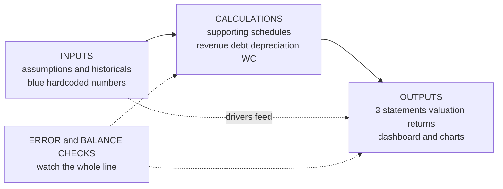
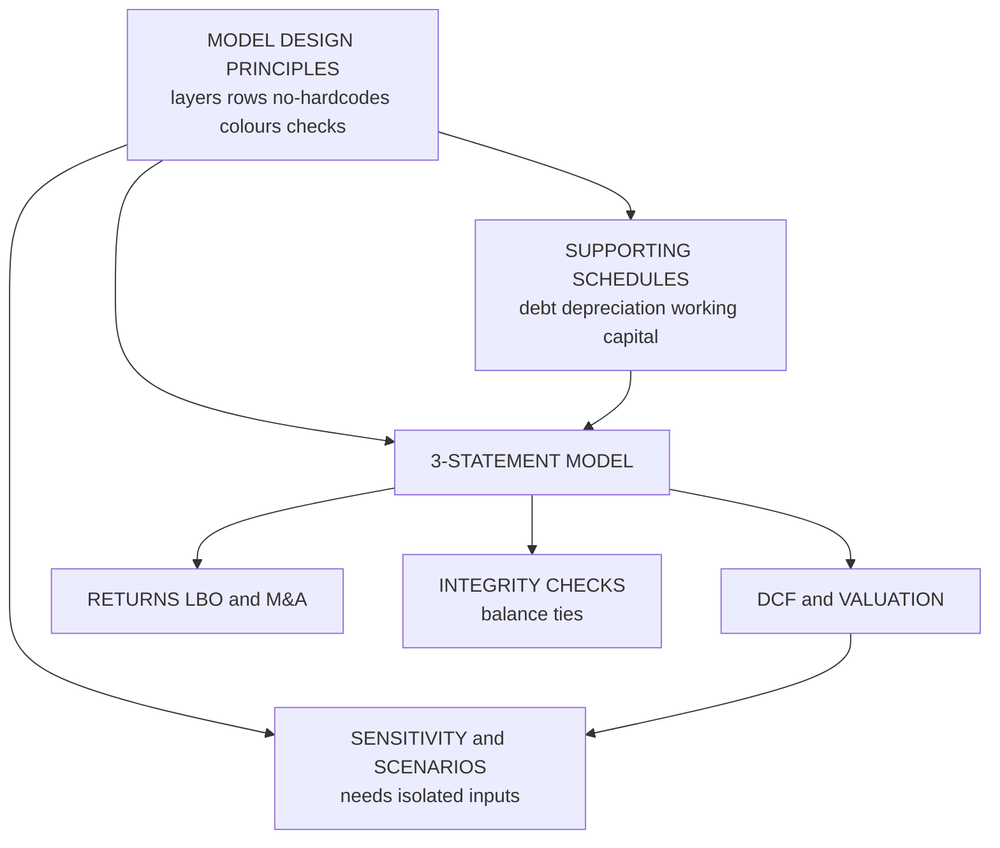

<!-- v2-deep -->

# Chapter 06 — Financial Modeling: Principles and Model Design

## 1. The Problem — the analyst need

You have learned to read the three financial statements. You understand how revenue drives receivables, how capex becomes depreciation, how retained earnings link the income statement to the balance sheet. Now your managing director drops a task on your desk:

> "Acme Manufacturing is thinking of buying a competitor. Build me a five-year forecast of the combined business, tell me what it's worth, and show me what happens to the return if revenue growth is 6% instead of 9%. I need it before the Tuesday committee."

You cannot answer that with a calculator or a one-off spreadsheet of static numbers. The words *"what happens if"* are the whole job. The MD will not ask one question — she will ask twenty, in the room, live: *raise the margin, drop the tax rate, delay the capex, refinance the debt.* Each time, every downstream number — profit, cash, debt balance, valuation, return — must recompute correctly and instantly. And a second analyst must be able to open your file six months later, understand it in ten minutes, and trust it enough to stake a decision on.

That is what a **financial model** is: a *live, structured representation of a business in Excel* whose outputs update automatically when you change the assumptions that drive them. It is not a pretty spreadsheet. It is a **calculation engine** with a driver's seat (the assumptions) wired to a dashboard (the outputs) through a transparent chain of formulas.

The problem this chapter solves is not *"how do I forecast revenue"* — that comes in later chapters. It is the more fundamental one that decides whether your model is an asset or a liability:

- How do I lay out a model so that **anyone** — my reviewer, my future self, the client — can follow the logic?
- How do I build it so that a change to **one** assumption ripples through **every** dependent number without me hunting for cells to update by hand?
- How do I make it **auditable** — so a mistake is visible, not buried?
- How do I know the model is **internally consistent** — that the balance sheet actually balances, that no error is silently corrupting the answer?

A model that produces the "right" number today but breaks the moment someone changes an input, or that only its author can understand, is worthless in a professional setting. The discipline in this chapter — the conventions, the layout, the checks — is exactly what separates a model a firm will pay for from a spreadsheet that gets thrown away. In interviews and on the desk, people judge your modeling by these habits *before* they judge your finance.

**A concrete illustration of the stakes.** Suppose your model has revenue growth typed as the literal `1.08` inside eight separate formulas across the income statement, working-capital schedule, and DCF. The MD says "make it 6%." You change seven of the eight — you genuinely believe you got them all — but you miss the one buried inside the accounts-receivable driver. Now receivables are forecast off 8% growth while revenue grows at 6%. The balance sheet still *balances* (because AR is an asset and the plug absorbs it), so no check screams. The DCF is quietly wrong by a few million. Nobody catches it until the buy-side diligence team rebuilds the model and the numbers don't tie. That single missed literal is the difference between a credible advisor and a firing. Every rule in this chapter exists to make that failure *structurally impossible* rather than something you police by willpower.

---

## 2. The Core Idea — a factory production line

Think of a financial model as a **factory production line**, not a warehouse of loose parts.

A warehouse is what a beginner builds: numbers scattered everywhere, some typed into formulas, some in cells, assumptions mixed in with results, the same figure copied into fifteen places. To change one thing you must find all fifteen copies. Miss one and the model is silently wrong.

A production line is disciplined. **Raw materials** enter at one end (your assumptions and historical data — the *inputs*). They flow through **machines** that transform them in a fixed sequence (your *calculations* — the schedules that build revenue, depreciation, debt, working capital). Finished goods roll off the other end (your *outputs* — the statements, the valuation, the returns, the charts the MD actually looks at). Materials only ever flow **forward**: inputs feed calculations, calculations feed outputs. Outputs never feed back into inputs (that would be a circular, self-referential mess — the industrial equivalent of a finished car being melted back into steel).

The genius of a production line is the **single source of truth**. A raw material enters *once*. The tax rate lives in *one* cell. Everything that needs it *refers* to that cell rather than re-typing the number. Change the raw material at the entrance and every machine downstream automatically works with the new material. Nobody runs around the factory updating fifteen copies.

This is the mental model to hold for the entire chapter:

> **Inputs flow to Calculations flow to Outputs. One number lives in one place. Everything else points at it.**

Every rule that follows — colour coding, the row-consistency rule, the no-hardcodes rule, the tab structure, the error checks — is simply a technique for keeping the production line clean, one-directional, and inspectable.

*Figure 1 — the three-layer architecture of every professional model; information flows one way only.*



**Why "one direction" is not just tidiness.** A one-directional dependency graph is what mathematicians call a *directed acyclic graph* — a DAG. Excel's calculation engine can always find a valid order to compute a DAG: it topologically sorts the cells and evaluates each exactly once. The instant you introduce a cycle (A depends on B depends on A), Excel can no longer find that order and either throws a circular-reference warning or, if iterative calculation is on, guesses repeatedly and hopes it settles. The production-line discipline is, at bottom, a way of guaranteeing your workbook stays a DAG — computable, deterministic, and free of the instability that circularity breeds. Hold that picture: you are drawing arrows, and every arrow must point downstream.

---

## 3. Why it works

Why does this rigid discipline actually produce better answers, faster, than just typing numbers where they need to go?

**Because a model is used far more than it is built.** You build it once over a few days. Then it is *interrogated* hundreds of times — every sensitivity, every scenario, every review comment, every reuse on the next deal. The entire economics of modeling favour spending effort up front on structure so that every later change is cheap and safe. A messy model is cheap to build and ruinously expensive to change; a disciplined model is slightly more expensive to build and nearly free to change. Over a model's life, discipline wins overwhelmingly.

**Because separation of layers localises change and error.** When inputs, calculations, and outputs are physically separated, a change to an assumption cannot accidentally overwrite a formula, and a formula cannot accidentally hide a hardcoded fudge. When you spot a wrong number in an output, you trace it *backwards* along a clean one-directional chain to exactly one source. In a warehouse model the wrong number could originate anywhere, because everything touches everything.

**Because a single source of truth makes the model self-consistent by construction.** If the tax rate exists in one cell and forty formulas point at it, the model *cannot* disagree with itself about the tax rate. Inconsistency becomes structurally impossible rather than something you police by hand. This is the same reason databases normalise data: store each fact once.

**Because consistent structure lets a human reviewer parse it.** A reviewer's trust is the currency of the desk. When every row uses one formula copied across, the reviewer checks the *first* cell of a row and knows the whole row is correct — they audit one cell instead of sixty. When blue means "input" everywhere, the reviewer's eye finds every assumption in seconds. Convention converts a novel object (your specific model) into a familiar one (the shape all good models share), and familiarity is what lets someone verify it quickly.

**Because checks turn silent errors into loud ones.** The most dangerous error is the one that produces a plausible-looking wrong number. A balance-sheet check that flashes red the instant assets ≠ liabilities + equity converts a silent, decision-corrupting bug into an immediate, visible alarm. You cannot fix what you cannot see; checks make the invisible visible.

None of this is aesthetic preference. Each rule exists because it measurably reduces the probability of a wrong number reaching a decision-maker, and reduces the time to build, change, and audit. That is why every serious institution — banks, PE funds, corporates — converges on the same conventions.

**A cost-of-change intuition, made numeric.** Say a clean model takes 20 hours to build and each subsequent change takes 2 minutes because assumptions are isolated. A warehouse model takes 15 hours to build but each change takes 20 minutes of hunting for scattered copies, plus a 10% chance each change introduces a new error costing an hour to find. Over a deal you make 60 changes. Clean model total time: 20 + 60×(2/60) = 22 hours, near-zero error cost. Warehouse total: 15 + 60×(20/60) + 0.10×60×1 = 15 + 20 + 6 = 41 hours, and that ignores the reputational cost of the errors that slip through. The disciplined model is *cheaper in total* even though it cost more to build — and vastly safer. This is not a moral argument; it is arithmetic.

---

## 4. Full Technical Content — the rules, the build logic, the Excel

This is the operational heart of the chapter. Each principle below comes with *what it is*, *why*, and *exactly how to execute it in Excel*.

### 4.1 The three-layer architecture

Every model, however large, is three layers. Keep them physically and visually separate.

| Layer | Contains | Nature | Excel treatment |
|---|---|---|---|
| **Inputs** | Assumptions (growth %, margins, tax rate, capex, days), historical actuals pulled from filings | Hardcoded numbers you *choose* or *observe* | Blue font, often shaded input cells, grouped on an Assumptions tab or clearly boxed |
| **Calculations** | Supporting schedules: revenue build, depreciation (PP&E roll-forward), debt schedule, working capital, equity | Formulas that transform inputs | Black font, live formulas, one per row, no hardcodes |
| **Outputs** | The three statements, DCF/valuation, returns, ratios, dashboard, charts | Formulas that summarise calculations | Black font; presentation-formatted; the only part outsiders see |

The direction of dependency is sacred: **Inputs → Calculations → Outputs**, never backwards. An output cell must never be referenced by an input or an early calculation. If it is, you have created a hidden loop and probably a circular reference.

**Build logic.** Start every model by sketching this skeleton *before* typing a single formula: which assumptions drive the business, which schedules I need, which statements and metrics are the deliverable. Reserve tabs for each. Only then start building — inputs first, then calculations, then outputs — so that when you write a calculation, the input it needs already exists to point at.

**A subtlety on "historicals."** Historical actuals are *inputs* even though they sit inside the income statement and balance sheet, because you observe them from filings rather than calculate them — so they are hardcoded and blue. This creates a visual signature every good model shares: the historical columns of the statements are a block of blue numbers, and the forecast columns to their right are a block of black formulas. The vertical line where blue turns to black *is* the boundary between "what happened" and "what we assume." A reviewer glancing at your income statement should be able to see, from colour alone, exactly where your forecast begins.

### 4.2 Tab (worksheet) structure

Organise the workbook so a stranger can navigate it. A common professional layout, left to right, mirrors the flow of information:

| Order | Tab | Purpose |
|---|---|---|
| 1 | **Cover / Contents** | Model name, version, author, date, purpose, list of tabs, colour legend, key assumptions summary |
| 2 | **Dashboard / Outputs** | The headline results and charts — what a decision-maker opens first |
| 3 | **Assumptions / Drivers** | Every input in one place, clearly labelled with units |
| 4 | **Income Statement** | |
| 5 | **Balance Sheet** | The three financial statements (outputs) |
| 6 | **Cash Flow Statement** | |
| 7 | **Supporting Schedules** | Debt, depreciation/PP&E, working capital, equity — one tab or one each |
| 8 | **Valuation** | DCF, comparables, returns |
| 9 | **Checks** | A dedicated tab aggregating every error/balance check |

Conventions that keep tabs usable:

- **Colour the tab strips** by function (e.g. inputs one colour, statements another, checks red). Right-click a tab to set its colour.
- **Left-to-right = flow of logic.** Someone reading the workbook like a book reads the model in dependency order.
- **One tab does one job.** Do not mix a debt schedule into the income statement tab.
- For small models it is acceptable to put everything on **one sheet**, but still *zone* it: inputs at top, calculations in the middle, outputs below or to the side, checks pinned somewhere visible.

**The two schools: modular vs single-sheet.** There is a genuine trade-off here worth understanding.

- *Modular (many tabs)* scales well for large, long-lived models and lets a team divide work, but every cross-tab link is a `'Sheet'!` reference that is slower to trace, and it is easy to lose sight of the whole. Banks building a live operating model for a client tend modular.
- *Single-sheet (everything zoned on one page)* keeps the entire logic visible and traceable with the arrow keys, is faster to audit, and is what many PE and hedge-fund analysts prefer for a focused model. The cost is that it gets unwieldy past a certain size and does not divide among people.

Neither is "correct." The rule that *is* universal: whichever you choose, keep the three layers separated and the flow one-directional. A single-sheet model with inputs, calcs, and outputs jumbled together is far worse than a well-zoned single sheet or a clean multi-tab workbook.

### 4.3 Colour conventions — the universal code

Colour is not decoration; it is *metadata*. It tells the reader the **nature** of each cell at a glance. The near-universal convention (used across banks and PE, and the one CFI teaches):

| Font colour | Meaning | Example |
|---|---|---|
| **Blue** | Hardcoded input / assumption typed by hand | Revenue growth = 8%, tax rate = 25% |
| **Black** | Formula referencing cells on the *same* sheet | `=D10*(1+D11)` |
| **Green** | Formula referencing *another* sheet (a link) | `='Assumptions'!D5` |
| **Red** | Warning, external link to another file, or a flag needing attention | broken links, override alerts |

The single most important rule embedded here: **if it's blue, it's an input you can change; if it's black or green, do not type over it.** This lets anyone — including you in six months — instantly see what is safe to flex and what is derived. A reviewer scanning for "what drives this model" simply looks for blue.

**How to apply it in Excel.** Set font colour with the Font Color button, or faster, learn to eyeball as you type: the discipline is to *decide the cell's nature before you write it* — am I typing a number (blue) or a formula (black/green)? Many teams also use a **cell style** (Home → Cell Styles) named "Input" that combines blue font with a light fill, applied with one click. Consistency matters more than the exact palette — pick the convention and never break it within a model.

**Edge cases the convention has to handle.**

- *A formula that is really an input.* Sometimes you type `=100*1.05` as a quick assumption. Don't — that's a hidden hardcode wearing a formula's clothes. Either compute it and paste the value as a blue number, or split it into a blue base and a blue driver.
- *A hardcoded override that temporarily replaces a formula.* When a client says "force Q3 revenue to exactly 250 regardless of the build," you type `250` over the formula. This is the classic use of **red**: colour that override red so the next reader sees a value has been forced, and so you remember to restore the formula later. An untracked override is one of the most insidious model bugs.
- *A same-sheet link that points at an input block on the same sheet.* It is still black — colour is about *where the reference points*, not about what it conceptually is. Green is strictly "this formula reaches to another sheet."

### 4.4 The one-formula-across-a-row rule (row consistency)

This is the rule that most cleanly separates professionals from amateurs.

**The rule:** within a single row of a time series, **every period cell must contain the identical formula, differing only in its relative column references.** You write the formula once in the first forecast period and *copy it across* the whole row. Cell F10 and G10 and H10 are the same logic; only the columns they point at shift.

**Why it matters.**

- **Auditability.** A reviewer checks the leftmost forecast cell of the row. If it is right, the whole row is right, because it was copied. They verify one cell, trust sixty.
- **Correctness.** Hand-typing each period is how you get a subtly different formula in year 3 that nobody notices — the classic model-killer.
- **Speed of change.** Restructure the logic once in the first cell, re-copy across, done.

**How to build it.** Anchor the references correctly so one formula survives the copy:

- References that should **move** with the column (last period's value, this period's driver on the same sheet) stay **relative**: `E10`, `F10`.
- References that should **stay fixed** (an assumption in a single cell, a header row) get **absolute** anchors with `$`: `$D$5` (fixed cell), `D$5` (fixed row), `$D5` (fixed column).
- Toggle anchors with **F4** while editing the reference.

*Example:* revenue row, growth rate assumption sitting in `$C$4`, prior year in the cell to the left:

```
E6:  =D6*(1+$C$4)
```

Copy E6 across to F6, G6, H6. Each cell automatically becomes `=E6*(1+$C$4)`, `=F6*(1+$C$4)`… — the prior-year reference marches right, the growth assumption stays pinned. One formula, entire row.

**Corollary — build in the first period, then copy.** Get period one perfect (formula referencing the right cells), then drag or copy across. Never construct later periods independently.

**The four anchor states, and how to reason about each `$`.** The dollar sign locks whatever comes *immediately after* it. Read `$D$5` as "column locked, row locked." Read `D$5` as "column free, row locked" — used for a driver that lives in one fixed *row* (say a common growth rate across a header row) but whose column should track. Read `$D5` as "column locked, row free" — used when you copy a formula *down* a column and every row must keep pointing back to a single input column (common in a working-capital schedule where each line references the same assumptions column). Read `D5` as "both free." The discipline: before you copy, ask for each reference *"when this formula lands three columns right and two rows down, do I want this reference to move, and in which direction?"* — then set the `$` to freeze the direction that must not move. Pressing F4 repeatedly cycles `D5 → $D$5 → D$5 → $D5 → D5`.

**A common anchoring failure and its symptom.** You write `E6 = D6*(1+C4)` — forgetting the `$` on the growth cell — and copy across. In F6 the growth reference has drifted to `D4`, which is probably an empty cell (interpreted as 0), so F6 = E6 × (1+0) = E6, and every year after year 1 shows *flat* revenue. The tell-tale symptom of a missing anchor is a series that grows once and then goes flat, or grows by wildly varying amounts. When a forecast row looks "stuck" or erratic, suspect a lost `$` first.

### 4.5 No hardcodes inside formulas

**The rule:** a formula must contain **only cell references and operators** — never a raw number buried inside it. Every number lives in its own labelled cell.

Wrong: `=D10*1.08` (the 8% growth is invisible, unchangeable, undocumented, and will be different in some other cell).

Right: growth of 8% sits in `$C$4` as a blue input, and the formula reads `=D10*(1+$C$4)`.

**Why.**

- **Single source of truth.** If the growth rate appears as a literal in twelve formulas, changing the assumption means editing twelve formulas and inevitably missing one. As a labelled input it changes once.
- **Transparency.** A reviewer cannot see `1.08` inside a formula bar without clicking every cell. A visible blue assumption is self-documenting.
- **Sensitivity.** You cannot run a data-table sensitivity or scenario on a number trapped inside a formula. Only cells can be flexed.

**The tolerated exceptions** are genuine, unchanging constants of arithmetic — the `1` in `(1+growth)`, the `12` converting annual to monthly, the `365`/`360` day-count, the `2` in an averaging formula. These are not assumptions; they will never be sensitised. Everything a human *chose* — rates, margins, multiples, days — must be a labelled cell.

**How to enforce it.** Before typing a number inside a formula, ask: *"is this a business assumption someone might want to change or test?"* If yes, it belongs in a blue input cell that the formula references. Excel's **Formulas → Show Formulas** (`Ctrl + ` `) reveals every formula on a sheet at once — scan for stray digits to catch hardcodes during review.

**The grey-zone test, worked.** Is `365` in `AR = Revenue/365 × DSO` a hardcode? No — it is the number of days in a year, a constant of the calendar nobody will sensitise. Is `0.30` in `Tax = PBT × 0.30` a hardcode? Yes — a tax rate is a policy choice that changes across jurisdictions and reform, and you will absolutely want to flex it; it must be a blue cell. Is `1000` in `=Revenue_in_thousands*1000`? That is a unit conversion, a constant — tolerable, though better handled by a documented units convention. The clean test: *"if a reasonable person could ask 'what if this were different,' it is an assumption and must be a cell."* Arithmetic constants fail that test; business drivers pass it.

**A second, sneakier form of hardcoding: the pasted value.** Copying a formula and using Paste-Special-Values to "freeze" a number breaks the live chain silently — the cell now shows a black-looking number that no longer updates when its drivers change. This is how a model that "used to tie" mysteriously stops tying after someone flexed an input. If you must paste values (e.g. to break a stale external link), colour the result so the next reader knows it is frozen, and document why.

### 4.6 Error checks and balance checks

A model must **tell you when it is wrong.** Build checks *into* the model, not as an afterthought.

**The balance-sheet check** is the non-negotiable one. After building the three statements, the balance sheet must balance every single period:

```
Assets = Liabilities + Equity   →   Assets − (Liabilities + Equity) = 0
```

Build a check row: `= Total Assets − Total Liabilities − Total Equity`, in every period. It must read **0**. If it doesn't, the statements are internally inconsistent — cash flow is not tying to the balance sheet, or a link is broken.

**Other standard checks:**

| Check | Formula logic | Passes when |
|---|---|---|
| Balance sheet balances | `Assets − Liab − Equity` | = 0 (every period) |
| Cash flow ties to BS cash | `Closing cash on CFS − Cash on BS` | = 0 |
| Retained earnings roll-forward | `Opening RE + NI − Div − Closing RE` | = 0 |
| Debt schedule non-negative | `MIN(debt balance)` | ≥ 0 |
| Cash never negative (or revolver draws) | `MIN(cash balance)` | ≥ 0 or revolver active |
| Sources = Uses (in a transaction) | `Sources − Uses` | = 0 |

**Build technique.** Devote a **Checks tab**. Each check evaluates to `TRUE`/`FALSE` or `0`/`non-zero`. Then a single **master check** cell aggregates them so you watch *one* cell:

```
=IF(AND(check1, check2, check3, …), "OK", "ERROR")
```

or, for numeric-difference checks, `=IF(SUM(ABS(all differences))<0.01, "OK", "ERROR")`. Use a small tolerance (0.01) rather than exact zero to absorb harmless floating-point rounding.

**Make it scream.** Apply **Conditional Formatting** so any failing check turns the cell bright red / green. Then pin the master check somewhere always visible (top of every sheet, or a frozen row) so you cannot miss it flip to ERROR mid-build. Some modellers put the master check on the cover tab so it is the first thing seen.

**Why a tolerance, and how big.** Excel stores numbers as IEEE-754 doubles, so a chain of multiplications and additions can leave a "zero" that is actually `0.0000000003`. An exact `=IF(diff=0,…)` would then flag a perfectly good model as broken. But set the tolerance too loose — say `< 1.0` on a model denominated in millions — and a genuine one-million error hides under it. Match the tolerance to the model's units: on a `$m` model, `0.001` (one thousand dollars) is a sane band; on a model in whole dollars, `0.01` (one cent). The tolerance should be *far smaller than the smallest error you would care about* and *far larger than floating-point dust.*

**A layered checks philosophy.** Good models carry three tiers of check, not one. *Integrity checks* prove the mechanics tie (balance, cash tie, RE roll). *Sanity checks* flag economically implausible outputs — margin above 100%, negative revenue, a debt balance that goes below zero, an implied tax rate outside 0–50%. *Consistency checks* confirm two independently-built numbers agree — e.g. cash on the balance sheet equals the closing cash on the cash flow statement, or depreciation on the income statement equals total depreciation from the PP&E schedule. A model can pass every integrity check and still be nonsense (100% margins that balance perfectly); the sanity tier is what catches that.

**On circular references and iterative calc.** Interest-on-average-debt and cash-sweep structures can create deliberate circularities (interest → net income → cash → debt → interest). Handle with **File → Options → Formulas → Enable iterative calculation**, *and* build a **circularity breaker** (a switch cell that zeroes the circular link) plus an error check, because a broken circular model shows `#REF!`/`0` cascades. But the beginner's default should be: **avoid accidental circularity entirely** by respecting the one-directional Inputs → Calculations → Outputs flow.

**How a circularity breaker actually works.** Put a blue switch cell, say `Circ_Switch` (1 = on, 0 = break). The circular formula becomes `Interest = IF(Circ_Switch=1, rate × average_debt, 0)`. When the model spirals into a `#DIV/0!` or `#REF!` cascade — which corrupts every dependent cell and cannot self-heal because the bad value keeps feeding back — you flip the switch to 0, which severs the loop and lets Excel recompute clean, then flip it back to 1. Pair it with a check that confirms the circular result has *converged* (the change between iterations is below tolerance). Beginners should treat any circularity as a red flag to re-examine whether it is truly necessary — often interest-on-*opening*-debt (non-circular) is an acceptable and far safer simplification.

### 4.7 Formatting and best-practice hygiene

Formatting is not vanity — it is *communication bandwidth* and *error prevention*.

- **Units and signs.** State units in row/column headers (`$m`, `%`, `x`, `days`). Pick a sign convention and hold it — a common one: costs and outflows negative, so the income statement is a straight `SUM` down the column. Decide, document on the cover, never mix.
- **Number formats.** Use format *codes*, not typed symbols: `#,##0` for whole currency, `0.0%` for rates, `0.0"x"` for multiples, `(#,##0)` red for negatives. Never type "%" or "x" as text into a number.
- **No merged cells** in calculation areas — they break copy/paste, `SUM`, and navigation. Use "Center Across Selection" for titles instead.
- **Freeze panes** (View → Freeze Panes) so labels and period headers stay visible while scrolling.
- **Named ranges** for a handful of truly global drivers (tax rate, WACC) improve readability: `=EBIT*(1-Tax_Rate)`. Use sparingly — too many names become their own maze.
- **Group** (Data → Group, the outline `+/−`) to collapse detailed schedules.
- **Consistent time axis.** Every statement and schedule shares the same columns for the same periods, so any row can reference any other without offset errors.
- **Keep it flat and simple.** Prefer many transparent small steps over one clever nested mega-formula. A formula a reviewer cannot parse in a few seconds is a liability, however elegant.

**Why the sign convention is load-bearing, with a worked contrast.** Suppose costs are entered as positive numbers. Then EBIT = Revenue − Costs = `=D5-D6-D7-D8`, and you must *remember* which lines to subtract. If instead costs are entered negative, EBIT = `=SUM(D5:D8)` — a single sum down the column, impossible to get the sign wrong, and the total is self-documenting. The negative-cost convention makes the arithmetic mechanical. But it must be total: if depreciation is negative and interest is positive, your `SUM` silently adds interest expense to profit. The interviewer's favourite trap is a mixed-sign income statement where EBIT looks right but net income is off by twice the interest.

**The mega-formula anti-pattern, illustrated.** A single cell reading `=IF(AND(C1=1,D5>0),D5*(1+INDEX($E$10:$E$12,$C$1))*(1-$C$8)-$C$9*$C$10,MAX(0,D5*0.9))` is unauditable — nobody can verify it at a glance, and one wrong parenthesis is invisible. Break it into a driver row (growth via INDEX), a revenue row, a cost row, a tax row — each a short, checkable formula. Four transparent rows beat one clever cell every time. The reviewer's rule of thumb: *if you can't read a formula aloud and follow it, it's too long.*

### 4.8 The core Excel toolkit

You do not need hundreds of functions. A professional model is built from a small, sharp set used well.

| Purpose | Functions |
|---|---|
| Aggregate | `SUM`, `SUMIF(S)`, `SUMPRODUCT` |
| Logic / flags | `IF`, `AND`, `OR`, `IFERROR`, `MAX`, `MIN` |
| Lookups (scenarios) | `INDEX`+`MATCH` (preferred), `CHOOSE`, `XLOOKUP` |
| Time / dates | `EOMONTH`, `EDATE`, `YEARFRAC` |
| Finance | `NPV`, `XNPV`, `IRR`, `XIRR`, `PMT` |
| Rounding / tidy | `ROUND` (for display only, never inside live logic that must reconcile) |

`INDEX(MATCH())` and `CHOOSE` are the workhorses of a **scenario switch**: one blue input cell (`1`, `2`, `3`) selects Base/Bull/Bear assumptions from a table, so the whole model flips case from a single driver — the ultimate expression of "one number in one place."

**Why `INDEX/MATCH` over `VLOOKUP`.** `VLOOKUP` counts columns to the right of the lookup key and breaks the moment someone inserts a column — a silent, catastrophic failure because it keeps returning a value, just the wrong one. `INDEX/MATCH` references the return column directly, so inserting columns can't misalign it, and it can look leftward. `INDEX($E$10:$E$12, MATCH(key, $D$10:$D$12, 0))` returns the value in E whose row matches the exact key in D. `XLOOKUP` (newer Excel) is the modern one-function replacement: `=XLOOKUP(key, D10:D12, E10:E12)`. Prefer `INDEX/MATCH` or `XLOOKUP`; avoid `VLOOKUP` in anything long-lived.

**`IFERROR` — use it surgically, not as a blanket.** Wrapping a formula in `=IFERROR(…, 0)` hides `#DIV/0!` and `#N/A` — which is exactly what you want for a ratio in a year where the denominator is legitimately zero, and exactly what you do *not* want when the error is a real bug you've just masked. The discipline: use `IFERROR` only where you can articulate *why* the error is expected and *why* the fallback value is correct. A model plastered in blanket `IFERROR(…,0)` is often a model hiding its own broken links.

**The scenario-switch mechanics, spelled out.** Lay assumptions in a grid: one column per scenario, one row per driver. A blue switch cell holds `1/2/3`. Each *active* assumption cell reads `=INDEX(Base:Bear_for_this_row, $Switch)` (using `HLOOKUP`/`INDEX` across the scenario columns) or `=CHOOSE($Switch, base, bull, bear)`. The rest of the model references only the *active* column, never the scenario grid directly. Flip the one integer and every active assumption — and therefore the entire model — swaps case. This is §4.5's no-hardcode rule and §4.4's single-source rule fused into a control panel.

---

## 5. Worked Examples

These are small but fully reproducible. Build each in Excel and watch the principles operate.

### Example 1 — one-formula-across-a-row revenue build (row consistency + no hardcodes)

Assumptions (blue inputs):

| Cell | Item | Value |
|---|---|---|
| C4 | Base year revenue ($m) | 100.0 |
| C5 | Annual growth rate | 8.0% |

Forecast row (black formulas), periods in columns E–H (Yr1–Yr4):

| | Yr1 (E) | Yr2 (F) | Yr3 (G) | Yr4 (H) |
|---|---|---|---|---|
| Formula | `=$C$4*(1+$C$5)` | `=E6*(1+$C$5)` | `=F6*(1+$C$5)` | `=G6*(1+$C$5)` |
| Revenue | 108.00 | 116.64 | 125.97 | 136.05 |

Check: `100 × 1.08 = 108.00`; `108 × 1.08 = 116.64`; `116.64 × 1.08 = 125.97`; `125.97 × 1.08 = 136.05`. Reconciles.

Now the payoff: change **C5 to 6%**. Instantly the row becomes `106.00, 112.36, 119.10, 126.25` — *without editing a single formula.* One number changed in one place; four outputs recomputed. Growth of 8% never appeared as a literal anywhere, so nothing was missed. That is the whole philosophy in four cells.

**"What if" variation — a growth ramp.** Suppose growth is *not* constant: 10% in Yr1 fading to 6% by Yr4. The wrong instinct is to hardcode four different numbers into four formulas. The right build: put a growth *row* in the assumptions block — `E5:H5 = 10%, 9%, 7%, 6%` (blue) — and change the revenue formula to reference the growth cell *directly above and in the same column*: `E6 = $C$4*(1+E5)`, then `F6 = E6*(1+F5)`, copied across. The `$C$4` anchors the base; the `E5` reference marches across with the copy so each year picks up its own growth. Result: `110.00, 119.90, 128.29, 135.99`. Verify: 100×1.10 = 110.00; 110×1.09 = 119.90; 119.90×1.07 = 128.293; 128.293×1.06 = 135.99. Still one formula copied across the row — the *time-varying* driver lives in its own blue row, not in the formula. This is how professionals handle ramps, step-ups, and margin glide-paths without ever breaking row consistency.

### Example 2 — a mini three-statement close with a balance-sheet check

A one-year forecast. Opening balance sheet and assumptions:

| Item | Value |
|---|---|
| Opening cash | 50 |
| Opening PP&E (net) | 200 |
| Opening debt | 100 |
| Opening equity (share capital) | 100 |
| Opening retained earnings | 50 |
| Revenue | 300 |
| Operating costs (excl. dep.) | (200) |
| Depreciation | (20) |
| Interest rate on debt | 5% |
| Tax rate | 25% |
| Capex | (30) |
| Dividends paid | (10) |
| Debt repayment | (20) |

**Income statement:**

| Line | Formula | Value |
|---|---|---|
| Revenue | input | 300 |
| Operating costs | input | (200) |
| Depreciation | input | (20) |
| EBIT | `=SUM(above)` | 80 |
| Interest | `=−5%×100` | (5) |
| Profit before tax | | 75 |
| Tax | `=−25%×75` | (18.75) |
| **Net income** | | **56.25** |

**Cash flow statement:**

| Line | Formula | Value |
|---|---|---|
| Net income | from IS | 56.25 |
| + Depreciation (non-cash) | add back | 20 |
| Cash from operations | | 76.25 |
| − Capex | investing | (30) |
| − Debt repayment | financing | (20) |
| − Dividends | financing | (10) |
| **Net change in cash** | | **16.25** |
| Opening cash | | 50 |
| **Closing cash** | | **66.25** |

**Closing balance sheet:**

| Assets | | Liabilities + Equity | |
|---|---|---|---|
| Cash | 66.25 | Debt (100 − 20) | 80.00 |
| PP&E (200 − 20 dep + 30 capex) | 210.00 | Share capital | 100.00 |
| | | Retained earnings (50 + 56.25 − 10) | 96.25 |
| **Total assets** | **276.25** | **Total L+E** | **276.25** |

**Balance check:** `276.25 − 276.25 = 0`. ✔ The model is internally consistent: net income flowed to retained earnings, depreciation added back in cash flow reconciled to the PP&E roll-forward, debt repayment hit both the cash flow and the debt balance. If any one link were wrong, the check would be non-zero — that is how you'd *know*. Build this and deliberately break one link (e.g. forget to subtract dividends from RE) to watch the check flag it: RE would be 106.25, total L+E 286.25, check = +10. The alarm works.

**Trace every link explicitly (the three-statement "wiring").** The reason this ties is not luck — it is three specific bridges, and knowing them by name is what interviewers probe:

1. *Net income bridges IS → CFS.* Net income (56.25) is the top line of the cash flow statement. It also (via retained earnings) is the only way profit reaches the balance sheet.
2. *Depreciation is the reconciling non-cash item.* It reduces PP&E on the balance sheet (200 − 20) and reduces profit on the income statement, but it is *not* a cash outflow — so it is added back on the cash flow statement (+20). If you forgot the add-back, closing cash would be 46.25, PP&E would still be 210, and assets would total 256.25 vs L+E 276.25 — check = −20. The check pins the exact size of the omission.
3. *Every financing/investing flow hits two places.* Debt repayment of 20 reduces cash (CFS −20) *and* reduces the debt balance (100 → 80). Capex reduces cash (−30) *and* raises PP&E (+30). Dividends reduce cash (−10) *and* reduce retained earnings (−10). A cash movement that touches only one side is precisely what breaks the balance.

**A second deliberate break — the double-count.** Suppose you both subtract capex on the cash flow (−30) *and* forget to add it to PP&E. Then cash = 66.25 but PP&E = 200 − 20 = 180, so assets = 246.25 while L+E = 276.25, check = −30. Now suppose the opposite slip: you add capex to PP&E but forget to subtract it from cash. Cash = 96.25, PP&E = 210, assets = 306.25, L+E = 276.25, check = +30. Notice the *sign* of the check tells you which side you broke — a positive check means assets are too high (or L+E too low). Learning to read the check's sign and magnitude turns it from a pass/fail light into a diagnostic that points at the bug.

**"What if" — a loss year.** Flip revenue to 180 (a bad year). Then EBIT = 180 − 200 − 20 = −40; interest still −5; PBT = −45. Tax on a loss is a modeling choice: the simple treatment applies the 25% rate to the negative PBT, giving a tax *benefit* of +11.25 (a credit), so net income = −33.75. Cash from ops = −33.75 + 20 = −13.75; net change in cash = −13.75 − 30 − 20 − 10 = −73.75; closing cash = 50 − 73.75 = **−23.75**. The balance sheet *still balances* (RE = 50 − 33.75 − 10 = 6.25; debt 80; capital 100; L+E = 186.25; assets = −23.75 + 210 = 186.25, check = 0) — but a *sanity* check now fires: **cash is negative.** A real model would trip a "cash ≥ 0" flag and, in a fuller build, trigger a revolver draw to fund the shortfall. This shows why integrity checks and sanity checks are different jobs: the balance check is perfectly happy; only the sanity check catches that the company has run out of money.

### Example 3 — a scenario switch (single driver flips the whole model)

Scenario table and a switch input in blue cell `C1`:

| Scenario # | Revenue growth | (row) |
|---|---|---|
| 1 Base | 8% | E10 |
| 2 Bull | 12% | E11 |
| 3 Bear | 3% | E12 |

Active-growth cell: `=INDEX(E10:E12, $C$1)` (or `=CHOOSE($C$1, 8%, 12%, 3%)`).

- `C1 = 1` → active growth = 8% → Yr1 revenue (from Example 1) = 108.00
- `C1 = 2` → active growth = 12% → 112.00
- `C1 = 3` → active growth = 3% → 103.00

Every downstream statement, valuation and return recomputes off that one blue integer. This is the same principle as Example 1 scaled up: the *scenario* is now the single source of truth, and the entire model is its obedient function.

**Extending to a multi-driver scenario grid.** Real scenarios flex several drivers at once. Lay a grid: rows = drivers (growth, gross margin, capex % of revenue), columns = scenarios (Base/Bull/Bear).

| Driver | Base (col E) | Bull (col F) | Bear (col G) |
|---|---|---|---|
| Revenue growth | 8% | 12% | 3% |
| Gross margin | 40% | 43% | 36% |
| Capex % of revenue | 6% | 5% | 8% |

Each *active* driver cell reads across its own row with one switch: `Active_growth = INDEX(E-row, $C$1)` where `$C$1` selects the column. Written with `CHOOSE`: `=CHOOSE($C$1, E_this_row, F_this_row, G_this_row)`. Set `C1 = 2` and all three drivers jump to their Bull values simultaneously — one integer moves growth to 12%, margin to 43%, and capex to 5% in a single keystroke. The model becomes a function of one control. This is the design that lets an MD say "show me the bear case" and see the full three statements, DCF, and returns flip in under a second.

### Example 4 — the PP&E roll-forward and depreciation, built with row consistency

This is the single most common *supporting schedule*, and it shows the "one formula per row, copied across" rule operating over multiple linked rows. Assumptions (blue): opening net PP&E 200, annual capex 30 (constant), useful life 10 years so straight-line depreciation is `1/10 = 10%` of the *opening gross-equivalent* — here we simplify to 10% of opening net balance for a clean illustration.

Periods Yr1–Yr4 in columns E–H. Build three rows:

| Row | Yr1 (E) | Yr2 (F) | Yr3 (G) | Yr4 (H) |
|---|---|---|---|---|
| Opening PP&E | `=200` (or link) 200.00 | `=E_close` 207.00 | 213.30 | 218.97 |
| + Capex | `=$C$capex` 30.00 | 30.00 | 30.00 | 30.00 |
| − Depreciation | `=−10%×E_open` (23.00) | (23.70) | (24.33) | (24.90) |
| Closing PP&E | `=SUM(open,capex,dep)` 207.00 | 213.30 | 218.97 | 224.07 |

Verify Yr1: 200 + 30 − 20.00? Depreciation = 10% × 200 opening = 20.00, so closing = 200 + 30 − 20 = 210.00. Let me use that clean version:

| Row | Yr1 | Yr2 | Yr3 | Yr4 |
|---|---|---|---|---|
| Opening PP&E | 200.00 | 210.00 | 219.00 | 227.10 |
| + Capex | 30.00 | 30.00 | 30.00 | 30.00 |
| − Depreciation (10% × opening) | (20.00) | (21.00) | (21.90) | (22.71) |
| Closing PP&E | 210.00 | 219.00 | 227.10 | 234.39 |

Verify: Yr1 200 + 30 − 20 = 210; Yr2 opening = 210, dep = 21, close = 210 + 30 − 21 = 219; Yr3 opening 219, dep 21.9, close = 219 + 30 − 21.9 = 227.10; Yr4 opening 227.10, dep 22.71, close = 227.10 + 30 − 22.71 = 234.39. Reconciles.

**The build discipline on show.** The *closing* row is `=SUM(opening, capex, depreciation)` copied across (depreciation is negative, so a straight sum works — the sign convention paying off). The *opening* row from Yr2 onward is `=` the prior period's closing cell (`F_open = E_close`) — a relative reference that marches across. The *depreciation* row is `=−$C$deprate × opening` with the rate anchored absolute and the opening relative. Three rows, each one formula copied across, and the schedule is a self-contained machine. Its two outputs wire into the statements: closing PP&E → balance sheet asset; depreciation → income statement expense *and* cash-flow add-back. Notice the recursion (each period's opening depends on the previous period's closing) is *not* circular — it flows strictly left to right, one period feeding the next, which is exactly the DAG discipline of §2.

### Example 5 — a mini debt schedule with interest, and why it can go circular

Assumptions (blue): opening debt 100, mandatory repayment 20 per year, interest rate 5%.

*Interest on opening balance (non-circular, safe default):*

| Row | Yr1 | Yr2 | Yr3 |
|---|---|---|---|
| Opening debt | 100.00 | 80.00 | 60.00 |
| − Repayment | (20.00) | (20.00) | (20.00) |
| Closing debt | 80.00 | 60.00 | 40.00 |
| Interest (5% × opening) | 5.00 | 4.00 | 3.00 |

Interest is `5% × opening debt`, opening is prior closing — strictly left-to-right, no loop. Verify: 5% of 100 = 5.00; 5% of 80 = 4.00; 5% of 60 = 3.00.

*Interest on average balance (circular):* if instead interest = `5% × (opening + closing)/2`, then Yr1 interest = 5% × (100 + 80)/2 = 5% × 90 = 4.50. That alone is fine — but in a *full* model, interest feeds net income → cash → the cash sweep that determines repayment → closing debt → the average → interest. Now interest depends on closing debt which depends on interest: a loop. Yr1's clean 4.50 only exists because repayment here is *fixed* at 20; the moment repayment becomes a cash-driven sweep, you need iterative calculation and a circularity breaker (§4.6). **Interview-grade takeaway:** average-balance interest is more precise but introduces circularity; opening-balance interest is a common, defensible simplification that keeps the model a clean DAG. Knowing *why* you'd choose one over the other — precision vs stability — is exactly the judgment a reviewer is testing.

---

## 6. Connections — how this wires into the rest of the model and valuation

Model design is the substrate every later technique stands on. The payoff appears everywhere:

- **The three-statement model** (the core deliverable) *is* the calculations-and-outputs layers of this architecture. Its integrity depends entirely on the balance check of §4.6 and the linkage discipline here.
- **Supporting schedules** — debt, depreciation/PP&E roll-forward, working capital — are the "machines" of the production line. Each is built with row consistency and feeds the statements without hardcodes (Examples 4 and 5 are exactly these machines in miniature).
- **DCF valuation** consumes the model's outputs: unlevered free cash flow rolls out of the statements, is discounted at a WACC that lives as *one* labelled input, to a terminal value driven by *one* growth or exit-multiple input. Because those drivers are single-source blue cells, the DCF can be sensitised in a data table — impossible if they were buried in formulas.
- **Sensitivity and scenario analysis** (data tables, the scenario switch of Examples 3) *only function* because assumptions are isolated cells. This is the direct, cash-value reason for the no-hardcodes rule: it is what makes "what happens if" answerable in the room.
- **LBO / M&A / returns models** add a Sources-and-Uses check and IRR/MOIC outputs, but sit on the identical architecture: inputs → schedules → statements → returns → checks.
- **Reusability.** A cleanly designed model is a *template*. The next deal reuses its skeleton in hours. A messy model is rebuilt from scratch every time — the hidden tax of bad design.

*Figure 2 — how design principles propagate through the analytical stack.*



**The build order that respects the flow.** The connections above imply the *sequence* in which a model is actually assembled — always downstream. You cannot wire a schedule into a statement before the schedule exists, and you cannot value cash flows before the statements produce them.

*Figure 3 — the professional build sequence, each stage feeding the next.*


The order is not arbitrary. Schedules come before statements because the statements *reference* them. The balance sheet is built last of the three statements because it consumes the outputs of the other two (cash from the cash flow, retained earnings from the income statement). Checks come the moment the three statements exist, *before* valuation, because there is no point discounting cash flows from a model that doesn't tie. Dashboards and sensitivities come last because they sit on top of a proven-correct engine.

---

## 7. Traps and Common Errors — what breaks models and loses interviews

| Trap | What goes wrong | The fix |
|---|---|---|
| **Hardcodes inside formulas** | `=D10*1.08`. The assumption is invisible, appears in ten places inconsistently, can't be sensitised. The #1 rejection in a model audit. | Every chosen number is a labelled blue input the formula references. |
| **Inconsistent row formulas** | Year 3 has a subtly different formula than year 2; nobody notices; the forecast is wrong for one period. | One formula, copied across the whole row. Audit the first cell only. |
| **Missing `$` anchor** | Growth reference drifts to an empty cell on copy; forecast goes flat or erratic after year 1. | Anchor fixed drivers with `$` (F4); the flat-after-year-1 symptom is the tell. |
| **Broken / accidental circularity** | Interest-on-average-debt loops; iterative calc off → `#REF!`/0 cascade; on → hidden instability. | Respect one-directional flow; add a circ breaker switch + check; enable iterative calc consciously. |
| **Balance sheet doesn't balance** | The single most common three-statement failure — a cash flow line not tied back, dividends not deducted from RE. | A balance check row in every period; fix until it reads 0. Never proceed with a non-zero check. |
| **Reading the check wrong** | Treating the balance check as pass/fail only, ignoring that its sign and size locate the bug. | A positive check means assets too high or L+E too low; the magnitude equals the missing line. |
| **Sign convention chaos** | Some costs positive, some negative; totals wrong; interviewer spots it instantly. | Choose one convention, document it, hold it everywhere. |
| **Colour convention ignored** | Reviewer can't tell inputs from formulas; overwrites a formula with a number; model silently corrupts. | Blue = input, black = formula, green = link. Enforce with a cell style. |
| **Untracked hardcoded override** | A formula temporarily forced to a number, never restored; model silently stops responding to inputs. | Colour overrides red; log them; restore before delivery. |
| **Paste-values freezing a live cell** | A dead number that no longer updates; the model "used to tie" and mysteriously stopped. | Never paste-values over live logic; if you must, colour and document it. |
| **`VLOOKUP` breaks on column insert** | Silently returns the wrong column's value after someone inserts a column. | Use `INDEX/MATCH` or `XLOOKUP`; they reference the return range directly. |
| **Blanket `IFERROR(…,0)`** | Masks real broken links behind a plausible zero. | Use `IFERROR` only where the error is expected and the fallback is provably correct. |
| **Merged cells in calc areas** | `SUM` and copy/paste break; navigation jumps. | Never merge in the model body; Center Across Selection for titles. |
| **Mega-formulas** | One unreadable nested formula nobody can audit or debug. | Break into transparent intermediate rows. |
| **No checks at all** | A wrong number reaches the committee looking perfectly plausible. | Build a Checks tab + a master check pinned in view from day one. |
| **Only integrity checks, no sanity checks** | A model with 100% margins or negative cash balances perfectly and looks fine. | Add sanity flags: margin bounds, cash ≥ 0, debt ≥ 0, plausible tax rate. |
| **Everything on one giant sheet, unzoned** | Inputs, calcs, outputs tangled; can't trace anything. | Separate tabs, or at minimum zone one sheet inputs→calcs→outputs. |
| **`ROUND` inside live logic** | Rounding mid-calc makes statements fail to tie by pennies. | Round for *display* (number format) only; keep full precision in calculations. |
| **Tolerance mis-set on checks** | Too tight → false alarms from floating-point dust; too loose → real errors hide. | Set tolerance far below the smallest error you'd care about, far above rounding noise. |

The meta-trap: **treating design as optional polish to do "if there's time."** There never is time later. Design is the *first* decision, made on a blank sheet, before any number is typed. Retrofitting structure onto a warehouse model is harder than rebuilding it.

**Interview angles you should be ready for.** These principles are not just build habits — they are the substance of technical modeling interviews. Common questions and the answer the interviewer wants:

- *"Walk me through how the three statements link."* → Net income flows from the income statement to the top of the cash flow and, via retained earnings, to the balance sheet; depreciation is added back on the cash flow; the closing cash from the cash flow becomes the balance-sheet cash; every financing/investing item hits both cash and its balance-sheet account. (Example 2 is this answer.)
- *"If depreciation goes up by 10, what happens to the three statements?"* → Pre-tax income falls 10; at a 25% tax rate net income falls 7.5; on the cash flow, net income −7.5 but depreciation add-back +10, so cash *rises* 2.5; on the balance sheet PP&E falls 10, cash rises 2.5, retained earnings falls 7.5 — and it still balances (−10 assets on PP&E, +2.5 assets on cash = −7.5 assets; −7.5 equity). The tax shield is the whole point.
- *"How do you know your model is right?"* → It ties every period (balance, cash, RE-roll checks all zero), the sanity flags are clean, and the row logic is one formula copied across so a reviewer can verify a single cell per row. "It gives the number I expected" is *not* an acceptable answer.
- *"What's a circular reference and how do you handle it?"* → A cell that depends on itself through a chain (interest→NI→cash→debt→interest); handle with iterative calculation plus a breaker switch and a convergence check, or avoid it by using opening-balance interest. (Example 5.)
- *"Why blue and black?"* → Blue = hardcoded input you may change; black = formula you must not overtype; the colour lets any reviewer find every driver instantly and prevents accidental overwrites.

---

## 8. First-Principles Recap

Strip everything back and the chapter reduces to a few irreducible truths:

1. **A model is a live calculation engine, not a static report.** Its entire value is that outputs recompute when inputs change. Everything else serves that.
2. **Information flows one way: Inputs → Calculations → Outputs.** Keep the three layers separate and the flow forward, and the model stays traceable and loop-free — a directed acyclic graph Excel can always compute deterministically.
3. **Each fact lives in exactly one cell; everything else points at it.** Single source of truth makes the model self-consistent by construction and makes change and sensitivity possible.
4. **Consistency is auditability.** One formula across a row, one colour code, one sign convention — so a reviewer verifies a cell and trusts a model.
5. **A good model tells you when it's wrong.** Build checks in; make failure loud and visible; carry both integrity checks (does it tie) and sanity checks (is it plausible); never trust a plausible number that hasn't passed them.

If you internalise only one sentence: *put every assumption in its own labelled blue cell, write one formula per row and copy it across, keep inputs-calculations-outputs separated and flowing forward, and make the balance sheet prove itself with a check.* That single sentence is 80% of professional modeling discipline.

The deeper unifying idea beneath all five: **you are managing a dependency graph.** Every rule — layers, single source of truth, row consistency, no circularity, checks — is a technique for keeping that graph clean, forward-flowing, inspectable, and self-verifying. Once you see a model as a graph of arrows rather than a grid of numbers, the discipline stops feeling like a list of rules and starts feeling like the only sane way to build.

---

## 9. Quick-Reference

**The five commandments**

1. Inputs → Calculations → Outputs; flow forward only.
2. One number, one place; formulas reference, never re-type.
3. One formula per row, copied across (anchor with `$`/F4).
4. No hardcodes in formulas (except arithmetic constants like 1, 12, 365).
5. Build checks in; balance sheet must equal 0 every period.

**Colour code**

| Blue | Black | Green | Red |
|---|---|---|---|
| Hardcoded input | Same-sheet formula | Cross-sheet link | Warning / external link / override |

**Anchor states (F4 cycles them)**

| Reference | Column | Row | Use |
|---|---|---|---|
| `D5` | free | free | value that should track both ways |
| `$D$5` | locked | locked | a single fixed driver cell |
| `D$5` | free | locked | a driver in one fixed row, copy across |
| `$D5` | locked | free | a driver in one fixed column, copy down |

**Key checks**

| Check | Formula | Pass |
|---|---|---|
| Balance | `Assets − Liab − Equity` | 0 |
| Cash tie | `CFS closing cash − BS cash` | 0 |
| RE roll | `Open RE + NI − Div − Close RE` | 0 |
| Cash sanity | `MIN(cash across periods)` | ≥ 0 |
| Debt sanity | `MIN(debt across periods)` | ≥ 0 |
| Master | `=IF(AND(checks),"OK","ERROR")` | OK |

**Core functions:** `SUM`, `IF`, `IFERROR`, `MAX`/`MIN`, `INDEX`+`MATCH`, `CHOOSE`, `XLOOKUP`, `SUMPRODUCT`, `EOMONTH`, `NPV`/`XNPV`, `IRR`/`XIRR`. Prefer `INDEX/MATCH` or `XLOOKUP` over `VLOOKUP`.

**Essential shortcuts**

| Shortcut | Action |
|---|---|
| `F4` (in a reference) | Cycle absolute/relative anchors |
| `Ctrl + `` | Show all formulas |
| `Ctrl + [` | Trace precedents (jump to source) |
| `Ctrl + Shift + →/↓` | Select to end of row/column (copy across) |
| `F2` | Edit cell / see references highlighted |
| `Alt + =` | AutoSum |
| `Ctrl + D` / `Ctrl + R` | Fill down / right (copy formula across) |
| `F9` | Recalculate (or evaluate selected formula fragment) |

**Tab order:** Cover → Dashboard → Assumptions → IS → BS → CFS → Schedules → Valuation → Checks.

**Build order:** Assumptions → Schedules → Income Statement → Cash Flow → Balance Sheet → Checks → Valuation → Dashboard.

---

## 10. Build-It-Yourself

Open a blank Excel workbook and build the following from scratch. Do not copy numbers as values — *type formulas* so the model is live.

**Task: a one-year, self-checking mini three-statement model** (reproducing Example 2).

1. **Set up tabs.** Create four sheets: `Assumptions`, `Statements`, `Checks`, and colour their tab strips. On `Assumptions`, list every input from Example 2 in blue font, each with a unit label.
2. **Income statement** (on `Statements`, black formulas): build Revenue → EBIT → Interest → PBT → Tax → Net income. Interest = `−rate × opening debt` where rate and debt are *green links* to the Assumptions tab, not typed numbers. Tax = `−tax rate × PBT`.
3. **Cash flow statement:** start from net income (link it, don't retype), add back depreciation, subtract capex, debt repayment, dividends; compute closing cash = opening cash + net change.
4. **Balance sheet:** Cash (from CFS), PP&E (opening − dep + capex), Debt (opening − repayment), Share capital, Retained earnings (opening + NI − dividends). Total each side.
5. **Checks tab:** build (a) balance check `Assets − Liab − Equity`, (b) cash tie `CFS cash − BS cash`, (c) RE roll-forward. Then a master check `=IF(AND(all=0…),"OK","ERROR")`. Apply conditional formatting: red if ERROR, green if OK. All three must read 0 and the master must read OK — if not, trace the broken link with `Ctrl + [`.
6. **Prove your discipline.** Use `Ctrl + `` to show all formulas and scan: is there a single raw number sitting inside any formula that should have been an input? Is every period-cell in a row identical logic? Fix any you find.
7. **Then break it on purpose.** Change one assumption — bump revenue growth, or forget to subtract dividends from RE — and watch the checks. When you deliberately break the RE link, the balance check should flip to a non-zero value and the master to ERROR. *Feeling the check catch your error is the point of the exercise.* Now read the *sign* of the check: is it positive (assets too high / L+E too low) or negative, and does its magnitude equal the line you broke? Learn to diagnose from the number, not just the colour.
8. **Extend to multiple periods.** Add a second and third forecast year as new columns to the right, entering each row's formula *once* in the first forecast column and copying it across with `Ctrl + R`. Use `$` anchors so the assumption references stay pinned while the prior-period references march right. Confirm the balance check reads 0 in *every* column — this is where row-consistency errors surface.
9. **Add the PP&E and debt schedules** (Examples 4 and 5) as their own zoned blocks, and re-point the income statement's depreciation and interest lines to *read from the schedules* instead of from raw assumptions. This is the moment the model becomes a real production line: schedules → statements → checks. Confirm it still ties.
10. **Add a sanity layer.** Beyond the integrity checks, add flags for cash ≥ 0 and debt ≥ 0 across all periods, and fold them into the master check. Then stress the model — set revenue low enough to drive a loss year (as in the Example 2 "what if") and confirm the balance check stays 0 while the cash-sanity flag fires. This proves you understand the difference between "ties" and "makes sense."
11. **Stretch goal:** add a blue scenario-switch cell and an `INDEX`/`MATCH` (or `CHOOSE`) driver that flips revenue growth — and, if you're ambitious, margin and capex too, as in Example 3's grid — between Base/Bull/Bear, and confirm the entire model, all schedules, and the still-balancing check recompute from that one integer.

When you can build this cold, with every check reading zero, in one clean forward-flowing pass, you have the design discipline every three-statement, DCF, and LBO model in the rest of this course is built on. Build it now, in Excel — reading about it is not the same as your fingers learning the anchors and the checks.
