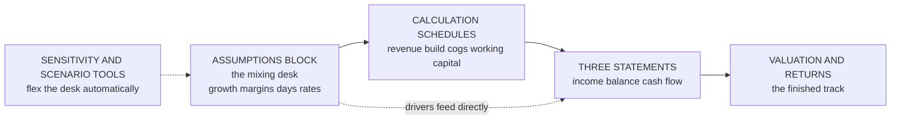
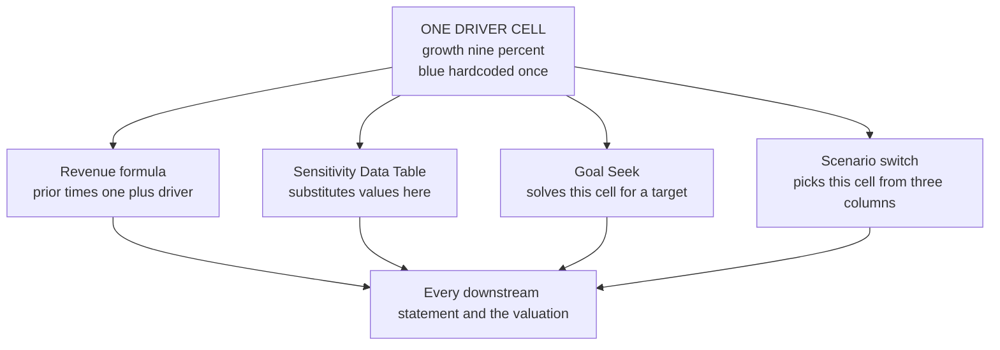
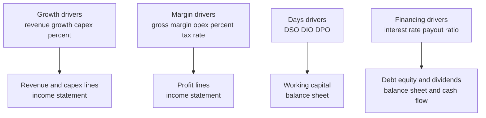
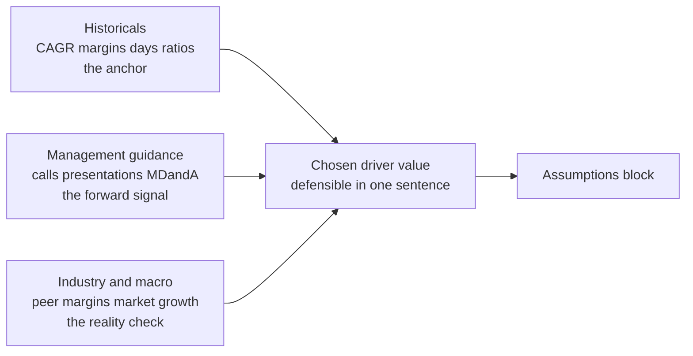
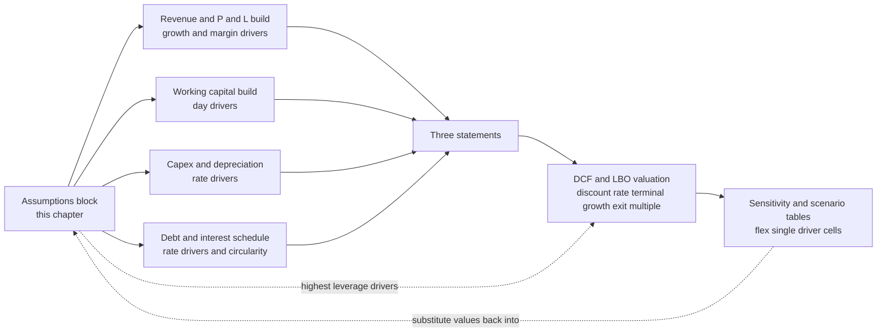

<!-- v2-deep -->

# Chapter 07 — Assumptions and Drivers: the Model Engine

## 1. The Problem — the analyst need

In the last chapter you learned *how to lay out* a model: three layers, one-directional flow, colour codes, checks. You have a clean, empty factory. This chapter is about the raw materials that enter it — and the single most consequential design decision you will make on any model.

Here is the situation. Your MD wants a five-year forecast of Acme. Revenue next year is going to be, say, ₹1,180 crore. You could **type** that number into the revenue row of your income statement. It would look fine. The statements would foot, the balance would balance, the valuation would spit out an answer. And you would have built a model that is quietly, structurally worthless.

Because the very next thing that happens is the MD says: *"What if growth is 6% not 9%? What if the gross margin slips 200 basis points? What if suppliers tighten terms and payables fall from 60 days to 45?"* If your revenue number is a hardcoded ₹1,180, you now have to reverse-engineer where it came from, recompute it by hand, retype it, and repeat for every line she touches — live, in the room, under time pressure, making arithmetic errors as you go.

The problem this chapter solves is: **where do the forecast numbers actually come from, and how do I structure them so the model can be re-driven instantly without breaking?**

The answer is that a forecast number like ₹1,180 crore is never an *input*. It is an *output* of a calculation: `last year's revenue × (1 + growth rate)`. The real input — the thing a human chose, the thing the MD wants to flex — is the **9% growth rate**. That growth rate is an **assumption**. It is a **driver**. And the discipline of professional modeling is to isolate every one of these driver assumptions into a dedicated, visible, single block, and to *derive* every forecast figure from them by formula.

A model is a machine for answering "what if". The assumptions block is the machine's control panel. If the panel is missing — if the levers are welded shut because you typed answers instead of drivers — the machine cannot do the one job it exists to do. This chapter teaches you to build the control panel: what belongs on it, how to express each kind of driver (growth rates, margins, days-based ratios), where the numbers come from, and the iron discipline of keeping them all in one place.

**A concrete cost of getting this wrong.** Two analysts each hand in a five-year Acme model. Analyst A hardcoded the forecast lines; Analyst B drove them off a block. The MD asks for four scenarios in a live meeting. Analyst B changes four cells and re-prints in under a minute — every scenario internally consistent, every statement re-footing automatically. Analyst A opens the file, tries to retype revenue, forgets that COGS was also hardcoded off the *old* revenue, and hands over a model where gross margin silently jumped to 55% because COGS never moved. One of these analysts is asked back. The difference is not talent or effort — it is *architecture*, and the architecture is this chapter.

---

## 2. The Core Idea — the mixing desk

Think of a recording studio's **mixing desk**.

The music — the finished track the audience hears — is the *output*. But the sound engineer never edits the finished track directly. In front of them sits a desk of **sliders and knobs**: one slider for vocals, one for bass, one for drums, a knob for reverb, a knob for treble. Every slider controls one thing. To make the vocals louder, the engineer pushes *one* slider and the whole mix re-balances instantly. They do not re-record the song. They do not hunt through the track for every place the voice appears. They move one labelled control and listen to the result.

A financial model works exactly the same way. The three statements and the valuation are the finished track. The **assumptions block is the mixing desk** — a panel of labelled sliders, each controlling one economic force in the business:

- a **growth slider** for revenue,
- a **margin slider** for profitability,
- a **days slider** for how fast cash comes in and goes out,
- a **rate slider** for tax, for interest, for capex.

The genius of the desk is *separation of control from output*. The engineer changes the sound by moving controls, never by touching the recording. The analyst changes the forecast by moving assumptions, never by touching the statements. Every statement line is a formula that *reads* the desk; no statement line contains a typed answer.

Hold this image for the whole chapter:

> **The statements are the music. The assumptions block is the mixing desk. You only ever touch the desk. Every knob is labelled, lives in one place, and controls exactly one thing.**

There is a second half to the metaphor worth naming. A good engineer *labels every fader and groups them into channels* — vocals here, rhythm there — so a stranger can sit down and mix. A bad one leaves forty unlabelled knobs and only he knows which does what. A model with drivers scattered and unlabelled is the second desk: it may "work" for the person who built it today, but it is unusable by the reviewer tomorrow and by the builder himself in six months. The layout discipline in §4.3 is the labelling; the one-block discipline in §4.5 is the channel grouping.

*Figure 1 — assumptions are the only human-entered inputs; every forecast figure is derived from them and flows one way into the statements and valuation.*



*Figure 1b — the single-cell driver is the pivot: one thing a human chose, read by many formulas, never typed twice.*



---

## 3. Why it works

Why does isolating drivers into one block, and deriving everything else, produce a model that is faster, safer, and more useful than typing forecast numbers directly?

**Because a model exists to be re-run, not to be run once.** The value of a model is not the first answer it gives — it is the twentieth. Every sensitivity, every scenario, every review comment is a re-run with different driver values. If drivers are isolated, a re-run is one keystroke. If forecast numbers are hardcoded, every re-run is a manual rebuild. The entire economic value of the model lives in how cheaply you can change the assumptions, and that cheapness comes *only* from separation.

**Because a driver is a hypothesis, and hypotheses must be visible to be challenged.** "Revenue grows 9%" is a claim about the world that a reviewer, a client, or a credit committee has every right to interrogate. When that 9% sits alone in a labelled cell, anyone can see it, question it, source it, and flex it. When it is buried inside `=1084*1.09` in the middle of the income statement, it is hidden — the model asserts a view of the future that nobody can find or dispute. Isolating drivers makes the model's *judgements* auditable, and judgements are the part that actually matters.

**Because separating drivers from calculations prevents the two deadliest errors.** Error one: a hardcoded number inside a formula that everyone forgets is there, so the model silently ignores your new assumption. Error two: the same economic fact typed in two places that drift apart, so the model disagrees with itself. Both vanish structurally when every driver lives once, in the block, and every formula points at it.

**Because drivers, not raw figures, are how business people actually think.** A CFO does not think "receivables will be ₹197 crore." She thinks "customers pay us in about 60 days." The days figure is the real mental model; the rupee figure is a consequence. Building the model on drivers means the control panel speaks the language of the business — so management can give you guidance in their terms, and you can hand results back in their terms. The model becomes a conversation, not a black box.

**Because sensitivity analysis is only possible on isolated inputs.** Excel's Data Table, Goal Seek, and scenario manager all work by *substituting values into a single input cell* and reading a single output cell. If your "input" is smeared across forty formulas, these tools cannot touch it. A model is *sensitivity-ready* precisely to the degree that its drivers are clean, single cells. The architecture in this chapter is what makes chapters 20+ (sensitivities, scenarios, DCF) even mechanically possible.

**Because a driver-based model degrades gracefully but a hardcoded one fails catastrophically.** If a driver is slightly wrong, the whole model shifts by a proportional, traceable amount you can reason about. If a hardcoded figure is wrong, the error sits at one point, contradicts the cells around it, and breaks internal ratios in ways that are hard to spot precisely because everything *else* still looks consistent. Driver errors are visible and bounded; hardcode errors are invisible and local — and local invisible errors are the ones that survive to the printed page.

None of this is style. Each reason maps to a measurable outcome: faster re-runs, fewer silent errors, credible answers under challenge, and the raw ability to run the analysis the job requires.

---

## 4. Full Technical Content — building the assumptions engine

This is the operational core. We cover: what qualifies as a driver, the three main driver *types* and their exact formulas, how to lay out the block in Excel, and how to source the numbers.

### 4.1 What is and is not an assumption

The test is simple and you apply it to every number in the model:

> **If a human chose it, it is an assumption and it lives in the assumptions block as a hardcoded (blue) input. If a formula could produce it, it is a calculation and it must never be typed.**

| Number | Human-chosen driver? | Where it lives |
|---|---|---|
| Revenue growth rate 9% | Yes — a judgement about the future | Assumptions block, hardcoded |
| Forecast revenue ₹1,181 cr | No — equals prior revenue × (1+growth) | Income statement, formula |
| Gross margin 42% | Yes — a target/expectation | Assumptions block, hardcoded |
| Forecast COGS ₹685 cr | No — equals revenue × (1−margin) | Income statement, formula |
| Receivable days 60 | Yes — a view on collection terms | Assumptions block, hardcoded |
| Forecast receivables ₹194 cr | No — equals days ÷ 365 × revenue | Balance sheet, formula |
| Tax rate 25% | Yes — statutory/effective choice | Assumptions block, hardcoded |
| Historical revenue ₹1,084 cr (actual) | It is a fact, not a choice | Historicals area, hardcoded blue |

Two subtleties:

- **Historical actuals are hardcoded but they are not assumptions.** They are pasted facts. Keep them in a clearly separated historicals area to the left of your forecast columns. They are blue (typed), but they represent *what happened*, whereas assumptions represent *what you expect*. Never overwrite a historical with a formula and never let a forecast formula spill back over a historical column.
- **A driver can itself be built from sub-drivers.** Revenue growth of 9% might be decomposed into "volume growth 5% × price growth 4%". That is fine and often better — it just means your desk has two sliders instead of one. The rule holds at every level: the *judgement* is hardcoded, the *arithmetic* is a formula. (Note: 5% volume × 4% price is *not* 9% growth but 1.05 × 1.04 − 1 = **9.2%**; compounding the sub-drivers is itself an arithmetic step, so it too must be a formula, never a typed 9%.)

**A grey-zone case worth naming: the "hardcoded schedule from management."** Sometimes management hands you an explicit capex plan — ₹300 cr, ₹450 cr, ₹200 cr over three years — with no underlying ratio. Those figures *are* human-chosen judgements, so they are legitimate blue inputs and they belong in the block, entered period by period, not derived from revenue. The test still passes: a human chose them. What is forbidden is typing a *derivable* figure (revenue, COGS, receivables) as though it were a given. The distinction is not "typed vs formula" in the abstract — it is "is this the judgement, or the consequence of a judgement?"

### 4.2 The three workhorse driver types

Almost every forecast line in a standard 3-statement model is driven by one of three driver types. Master these three and you can drive most of a model.

#### Type A — Growth-rate drivers (for flows that compound off themselves)

Used for **revenue** and any line best expressed as "this year is last year plus a percentage." The forecast line refers to its *own prior period*.

**Formula:**

```
Forecast value  =  Prior-period value × (1 + growth rate)
```

**Excel build.** Say historical revenue is in `D10` and the growth assumption for the first forecast year is in `E5` (a cell in the assumptions block). In the first forecast revenue cell `E10`:

```
=D10*(1+E5)
```

Copy `F10` `=E10*(1+F5)`, and so on. Each forecast year points to the year to its left and to the growth slider directly above/below it.

**Anchoring when the driver block sits above the statements in the same columns.** If your growth row is row 5 and your revenue row is row 10, both spanning columns `E:I` for FY26–FY30, write the revenue cell as:

```
=D10*(1+E$5)
```

The `$` locks the *row* (always read the growth row) while leaving the *column* free (each year reads its own year's growth). Copy `E10` rightward across the whole forecast horizon and it stays correctly wired. This one dollar sign is the difference between a row you can drag-fill in one motion and one you retype five times.

To express a growth rate as a **CAGR** between two known endpoints instead:

```
CAGR = (Ending value / Beginning value)^(1 / number of years) − 1
```
Excel: `=(D10/A10)^(1/3)-1` for a 3-year CAGR from `A10` to `D10`. Analysts use this to *read* the historical growth rate that then informs the forward assumption. **Worked mini-example:** if revenue ran ₹820 cr (FY22) to ₹1,084 cr (FY25), that is 3 years of growth, so CAGR `=(1084/820)^(1/3)-1` = (1.32195)^(0.3333) − 1 = 1.0975 − 1 = **9.75%**. Note the exponent is `1/n` where *n* is the number of *periods between* the endpoints (3), not the number of data points (4) — off-by-one here is a classic slip.

**Edge case — negative growth.** A decline is just a negative rate: revenue falling 5% is `=D10*(1+(-0.05))` = `=D10*0.95`. The formula shape never changes; only the sign of the driver flips. Never build a separate "decline" formula — that fragments the lever.

#### Type B — Margin / percentage-of-a-base drivers (for lines that scale with another line)

Used for **COGS, gross profit, operating expenses, and many others** — anything best thought of as "a percentage of revenue." The forecast line refers to a *contemporaneous base* (usually revenue) times a ratio.

**Formulas:**

```
COGS            =  Revenue × (1 − Gross margin %)
   or           =  Revenue × COGS-as-%-of-revenue
Gross profit    =  Revenue × Gross margin %
Any opex line   =  Revenue × that-line-as-%-of-revenue
EBITDA          =  Revenue × EBITDA margin %
```

**Excel build.** Revenue for the forecast year in `E10`, gross-margin assumption in `E6`. Gross profit in `E12`:

```
=E10*E6
```
COGS in `E11` as the plug: `=E10-E12`, or directly `=E10*(1-E6)`. The discipline: the *margin* is the slider (in `E6`), never the rupee figure. To read a historical margin so you can set the assumption: `Gross margin % = Gross profit / Revenue`, Excel `=D12/D10`.

**Which to model — the margin or the cost ratio?** They are two views of the same coin (`gross margin % + COGS-as-%-of-revenue = 100%`). Model whichever management *guides on*. If the CFO says "we target 42% gross margin," make margin the slider and plug COGS. If she says "our cost of goods runs about 58 paise on the rupee," make the COGS ratio the slider and plug gross profit. Do **not** hardcode both and let them contradict — pick one driver, derive the other, and the two always sum to 100% by construction.

**Fixed-plus-variable refinement (an edge case for opex).** Pure "% of revenue" assumes a cost is fully variable. Many opex lines are partly fixed. A more honest driver splits them: `Opex = Fixed base (a hardcoded ₹ amount, grown with inflation) + variable rate × revenue`. Excel: `=E20*(1+E$21)+E$22*E10` where `E20` is prior-year fixed base, `E21` an inflation slider, `E22` a variable-rate slider. This is still fully driver-based — it just uses *three* sliders instead of one to capture operating leverage (the reason margins expand as revenue grows).

#### Type C — Days-based (turnover) drivers (for balance-sheet working-capital items)

This is the one beginners get wrong, so we go slowly. Working-capital items — **receivables, inventory, payables** — are *stocks* on the balance sheet, but the natural way to forecast them is by how many *days* of activity they represent. "We collect in 60 days" is a driver; the receivables balance is its consequence.

**The three canonical days ratios (and their inverses to forecast the balance):**

| Item | Days ratio (read from history) | Forecast the balance |
|---|---|---|
| Receivables (DSO) | `DSO = Receivables / Revenue × 365` | `Receivables = DSO / 365 × Revenue` |
| Inventory (DIO) | `DIO = Inventory / COGS × 365` | `Inventory = DIO / 365 × COGS` |
| Payables (DPO) | `DPO = Payables / COGS × 365` | `Payables = DPO / 365 × COGS` |

Note carefully the **base** each one uses: receivables run off **revenue** (you invoice customers at selling price); inventory and payables run off **COGS** (you buy and hold goods at cost). Getting the base wrong is the classic error.

**Excel build.** DSO assumption in `E7`, forecast revenue in `E10`. Forecast receivables:

```
=E7/365*E10
```
Inventory with DIO in `E8` and COGS in `E11`: `=E8/365*E11`. Payables with DPO in `E9` and COGS in `E11`: `=E9/365*E11`. Some houses use 360 days; be consistent and match whatever you used to *read* the historical ratio. To read historical DSO so you can set the assumption: `=D_receivables/D_revenue*365`.

**Why days beat a flat percentage.** A days driver automatically scales the balance with the size of the business *and* lets you express operational change directly ("we will tighten collections to 45 days"). It is the language credit and treasury teams actually use.

**The cash-flow consequence — what days *for* .** The reason we bother with days at all is the change in these balances *is a cash flow*. When receivables rise, cash is trapped in unpaid invoices (a use of cash). When payables rise, you are financing yourself on suppliers' money (a source of cash). So the day-driver does not just set a balance-sheet number; it sets the working-capital line of the cash flow statement via `ΔWC = (change in receivables) + (change in inventory) − (change in payables)`, with the sign flipped for the cash impact. Example 4 works this through numerically.

**Average vs closing balances.** Purists compute DSO on the *average* of opening and closing receivables (because revenue is earned across the year, not at the closing snapshot): `DSO = average receivables / revenue × 365`. Forecasting off the closing balance (as above) is standard and simpler and avoids a self-reference; just be aware that if the historical ratio you read used *averages*, your forward closing-balance ratio will look slightly different for the same economics. Match the convention end to end.

#### Other common drivers (rate-based)

- **Tax:** `Tax = Pre-tax profit × Tax rate`. Rate is the slider.
- **Interest:** `Interest = Debt balance × Interest rate` (ideally on the average or opening balance — see the debt chapter).
- **Capex:** often `Capex = Revenue × capex-as-%-of-revenue`, or a hardcoded schedule if management gave specific plans.
- **Depreciation:** `Depreciation = Opening PP&E × depreciation rate`, or `Capex / useful life`.
- **Dividends:** `Dividend = Net income × payout ratio`.

Every one follows the same shape: **a rate/ratio is the driver; the rupee figure is a formula.**

**Worked PP&E roll-forward (ties capex and depreciation together).** Opening PP&E `₹500 cr`; capex driver 8% of revenue; depreciation driver 12% of opening PP&E. With forecast revenue `₹1,181.56 cr` from Example 1:
- Capex = 0.08 × 1181.56 = **₹94.52 cr** — `=E_capexrate*E10`
- Depreciation = 0.12 × 500 = **₹60.00 cr** — `=E_deprate*E_openingPPE`
- Closing PP&E = 500 + 94.52 − 60.00 = **₹534.52 cr** — `=opening + capex − dep`

Next year's *opening* PP&E is this year's closing (`=E_closing`), so the schedule rolls forward with no hardcodes after the first opening balance. This is the roll-forward pattern (`opening + additions − reductions = closing`) that recurs for debt, equity, and every stock account in the model.

**Interest and the circularity warning.** `Interest = rate × debt` looks like Type-rate, but interest feeds net income → retained earnings → cash → the revolver → debt → back to interest. That loop is a genuine circular reference handled in the debt chapter (with a circularity switch or averaging on the *opening* balance). Flag it now: the *driver* (the interest rate) is still one clean cell in the block; only the arithmetic downstream loops.

### 4.3 Laying out the assumptions block in Excel

Structure the block so it reads like a control panel. Best practice:

1. **One block, one location.** All operating drivers live together — ideally on a dedicated `Assumptions` tab, or a clearly bordered block at the top of the model, above or beside the schedules. Never scatter them. (More on this discipline in §4.5.)
2. **Group by theme, label every row.** Growth drivers together, margin drivers together, working-capital days together, financing rates together. Every row has a plain-English label in column A/B and, where relevant, a **units** column (`%`, `days`, `x`, `₹cr`).
3. **Columns are periods, aligned to the model.** Forecast years run left to right in the *same column positions* as the statements, so `E` is always FY26 everywhere in the file. This lets a single assumption row sit directly above the statement line it drives and copy cleanly across years.
4. **Colour and format by convention (from Chapter 06).** Hardcoded assumptions are **blue font**. Format percentages as `%` with 1 decimal, days as a number, multiples with an `x` custom format. A reviewer's eye should land on the block and instantly see every lever.
5. **Show the historical alongside the assumption.** Put the last actual value or the historical ratio next to the forecast slider, so the analyst sets each assumption *in the context of what the business actually did.* A forecast DSO of 45 next to a historical of 61 immediately flags "you are assuming a big improvement — is that justified?"
6. **Consider an assumptions summary / scenario switch.** A single `Scenario` cell (Base/Bull/Bear) driving a `CHOOSE` or `INDEX` across three columns of assumptions turns your desk into a scenario machine. (Full treatment in the scenarios chapter; design the block now so it is ready.)

**A concrete scenario-switch formula.** Put a scenario selector in `$B$1` holding 1, 2, or 3 (Base/Bull/Bear). Hold three columns of raw growth assumptions in, say, `M5:O5`. The *live* growth driver the model reads becomes:

```
=CHOOSE($B$1, M5, N5, O5)
```
or, more robustly against inserted columns, `=INDEX(M5:O5, $B$1)`. Now flipping `$B$1` from 1 to 3 re-drives the entire model to the Bear case in one keystroke — and every downstream statement recomputes because they all read this one live cell, which in turn reads the chosen scenario column. The single-cell discipline is what makes the switch possible; you cannot switch a driver that is smeared across formulas.

**A skeleton of what the block looks like on the sheet** (illustrative cell references, FY26 in column `E`):

| Row | Col B label | Col C units | Col D FY25 hist | Col E FY26 | Col F FY27 |
|---|---|---|---|---|---|
| 5 | Revenue growth | % | 9.7% (CAGR) | 9.0% | 8.0% |
| 6 | Gross margin | % | 41.0% | 42.0% | 42.5% |
| 7 | DSO | days | 61.9 | 60 | 58 |
| 8 | DIO | days | 45.1 | 45 | 45 |
| 9 | DPO | days | 59.9 | 60 | 60 |

Everything in columns `E`/`F` is blue and typed; column `D` shows the historical anchor beside it; the statement rows below simply point up to rows 5–9.

*Figure 2 — the internal anatomy of the assumptions block: three driver families feeding three parts of the model.*



### 4.4 Making the model sensitivity-ready

A model is *sensitivity-ready* when any single driver can be swapped for another value and every output recomputes correctly with no manual intervention. Concretely, design so that:

- **Every driver is one cell.** Excel's sensitivity tools operate on a single input cell. A `Data Table` (What-If Analysis → Data Table) flexes one or two input cells and tabulates one output. `Goal Seek` sets one output by changing one input. Neither works if the "input" is spread across formulas. So: *one driver, one cell, always.*
- **Outputs are single, clearly located cells.** Keep the headline results (valuation, IRR, EPS) in labelled output cells so you can point a Data Table's row/column input at them.
- **No hardcodes anywhere downstream.** A single typed number buried in a schedule breaks the chain silently — the sensitivity moves the driver but this one cell ignores it, so the output is wrong in a way that *looks* right. Use `Formulas → Show Formulas` (`Ctrl+`` `) and `Ctrl+[` (trace precedents) to hunt hardcodes out.
- **The chain is unbroken from driver to output.** Trace it once with `Ctrl+]` (dependents) from the driver: it should light up a path all the way to the valuation. Any gap is a broken link.

If those four hold, you can later drop a two-variable Data Table flexing growth (across the top) against margin (down the side) and watch the valuation grid populate — the payoff of clean drivers.

**The mechanics of a two-variable Data Table** (you build one numerically in Example 5). Put the output formula in the top-left corner cell of the grid (e.g. `=E12`, the gross-profit output). List the growth values along the top row to its right, and the margin values down the column below it. Select the whole rectangle, `Data → What-If Analysis → Data Table`, set *Row input cell* = the growth driver `E5` and *Column input cell* = the margin driver `E6`, and Excel substitutes each pair into those two cells and records the output. It works *only* because `E5` and `E6` are single cells that the output genuinely depends on — the exact property this chapter builds.

### 4.5 The discipline of one assumptions block

This deserves its own section because it is the habit that most separates professionals from amateurs.

**The rule:** *every operating driver the model uses lives in one designated block, once.* Not "mostly in one block." Once, in one place.

Why the absolutism? Because the moment a single driver escapes the block — a growth rate typed straight into a schedule, a tax rate hardcoded in the tax line "just this once" — you have lost the guarantee that the block *is* the complete control panel. A reviewer can no longer trust that flexing the block flexes the model. Sensitivity tools silently miss the stray driver. The model develops a hidden lever nobody can find. One exception destroys the property that makes the whole design work.

**Practical enforcement:**

- Give the block a home (a tab or a bordered region) and a rule: *if it is a judgement about the future, it goes here or it does not go in the model.*
- When a schedule needs a driver, it **points up** to the block (`=Assumptions!E5`), never contains the number.
- Periodically audit: select the whole calculation area, `Ctrl+`` ` to reveal formulas, and scan for any blue hardcodes that are not historical actuals. Each one is a driver that escaped — repatriate it to the block.
- If two schedules need the same fact, they both point at the *same* block cell. The fact exists once.

**A fast audit trick beyond eyeballing.** Use `Home → Find & Select → Go To Special → Constants → Numbers` after selecting the forecast/calculation region. Excel highlights *every* cell in that region that is a typed number rather than a formula. In a correctly built forecast area, that selection should be **empty** (all forecast cells are formulas); anything it highlights is either a legitimate hardcoded management schedule or an escaped driver to repatriate. This turns "hunt for hardcodes" from a hopeful scan into a deterministic sweep.

The reward is enormous and specific: you can hand the model to anyone and say "the entire forecast is controlled by this one block — change anything here and trust that the whole model responds." That sentence is only true if the discipline was absolute.

### 4.6 Sourcing assumptions — where the numbers come from

An isolated, well-formatted driver is worthless if the *number* in it is a guess. Every assumption should be **triangulated** from three sources, and ideally you can defend each one in a sentence.

**Source 1 — Historicals (the anchor).** Read what the business actually did over the last 3–5 years. Compute historical growth (`CAGR`), historical margins (`gross profit / revenue`), historical days (`DSO`, `DIO`, `DPO`). These are the gravitational centre: a forecast that departs sharply from history needs a *reason*. Excel: build a small "historical ratios" section that computes each ratio from the actual statements, so your forward assumption sits right next to the trend it should respect.

**Source 2 — Management guidance (the forward signal).** Companies publish guidance ("we expect mid-teens revenue growth," "gross margin to expand 100–150 bps," "capex of ₹300 cr next year"). Earnings-call transcripts, investor presentations, and MD&A sections carry management's own forward view. This overrides raw history where the two conflict *and management is credible*, because management knows about the new plant, the price hike, the contract win that history cannot see.

**Source 3 — Industry / macro (the reality check).** No company grows faster than its market forever; no margin escapes competitive gravity. Sanity-check each driver against industry growth rates, peer margins, sector benchmarks, and macro inputs (GDP growth, inflation, interest rates). If you assume 20% growth in a market growing 4%, you are implicitly assuming massive share gains — is that defensible?

*Figure 3 — every driver value is triangulated from three sources before it enters the block.*



**The triangulation discipline:**

| Driver | Historical anchor | Management guidance | Industry check | Chosen assumption |
|---|---|---|---|---|
| Revenue growth | 3-yr CAGR = 8% | "high single digits" | market +5%, share gains | **9%** |
| Gross margin | trailing 41% | "modest expansion" | peers 40–44% | **42%** |
| DSO | last 3 yrs 58–62 | terms unchanged | sector norm ~60 | **60 days** |

Every chosen number should be reconcilable to the three columns to its left. When the MD asks "why 9%?", you answer in one breath: *"History is 8%, management guides high-single-digits, and the market's growing 5% with share gains — 9% sits just above trend, consistent with guidance, and defensible on share."* That is what sourcing buys you: not a number, but a *defence*.

**When the three sources disagree.** Triangulation does not always converge. If history says 8%, management guides 15%, and the market grows 4%, you have a *tension*, and the tension is information. The rule of thumb: **weight the source with the most specific, verifiable knowledge and haircut the rest.** Management's 15% might reflect a real contract win (credible, keep it) or promotional optimism (haircut toward history). The market's 4% caps what is possible without share gains you must then justify explicitly. Document *which source you leaned on and why* — the disagreement, not just the answer, is what a good reviewer probes.

**Document the source.** Put a comment or a "source" column next to each assumption. Six months later, neither you nor your reviewer will remember why DSO is 60 — unless you wrote it down. A practical pattern: reserve a column to the right of the block for a one-line source note per driver (`"FY25 call: guided high-single-digit; 3yr CAGR 8%"`), so the defence travels *with* the number.

---

## 5. Worked Examples

We will build one small forecast engine end to end, using all three driver types, and verify it reconciles. Then a multi-year extension, a base-error trap, a single-lever ripple, and a full two-variable sensitivity grid.

### Example 1 — A one-year forecast driven entirely by the assumptions block

**Given (historicals, FY25 actuals):**

| Item | FY25 actual |
|---|---|
| Revenue | ₹1,084 cr |
| COGS | ₹640 cr |
| Receivables | ₹184 cr |
| Inventory | ₹79 cr |
| Payables | ₹105 cr |

**Step 1 — read the historical ratios (so we can set assumptions in context).**

- Historical gross margin = (1084 − 640) / 1084 = 444 / 1084 = **40.96%**
- Historical DSO = 184 / 1084 × 365 = **61.9 days**
- Historical DIO = 79 / 640 × 365 = **45.1 days**
- Historical DPO = 105 / 640 × 365 = **59.9 days**

**Step 2 — set the FY26 assumptions block (the mixing desk), triangulated.**

| Driver | Cell | Value | Rationale |
|---|---|---|---|
| Revenue growth | E5 | 9.0% | trend 8%, guidance high-single-digit |
| Gross margin | E6 | 42.0% | slight expansion from 41% |
| DSO | E7 | 60 days | tighten from 62 |
| DIO | E8 | 45 days | flat |
| DPO | E9 | 60 days | flat |

**Step 3 — derive every FY26 figure by formula (touching only the desk).**

- Revenue (Type A) = 1084 × (1 + 0.09) = **₹1,181.56 cr** — Excel `=D10*(1+E5)`
- Gross profit (Type B) = 1181.56 × 0.42 = **₹496.26 cr** — `=E10*E6`
- COGS (Type B, plug) = 1181.56 − 496.26 = **₹685.30 cr** — `=E10-E12`
- Receivables (Type C, on revenue) = 60 / 365 × 1181.56 = **₹194.23 cr** — `=E7/365*E10`
- Inventory (Type C, on COGS) = 45 / 365 × 685.30 = **₹84.49 cr** — `=E8/365*E11`
- Payables (Type C, on COGS) = 60 / 365 × 685.30 = **₹112.65 cr** — `=E9/365*E11`

**Step 4 — self-verify by reversing the ratios out of the forecast figures.**

- Forecast gross margin = 496.26 / 1181.56 = 42.00% ✓ (matches E6)
- Forecast DSO = 194.23 / 1181.56 × 365 = 60.00 days ✓ (matches E7)
- Forecast DIO = 84.49 / 685.30 × 365 = 45.00 days ✓ (matches E8)
- Forecast DPO = 112.65 / 685.30 × 365 = 60.00 days ✓ (matches E9)

Every derived figure reverses cleanly back to its driver — the chain is intact. **Now the payoff:** change `E5` from 9% to 6% and, without touching anything else, revenue becomes 1084 × 1.06 = ₹1,149.04, gross profit = 482.60, receivables = 188.86, and so on — all recompute instantly because each is a formula on the desk. That is a sensitivity-ready model.

### Example 2 — Why the days *base* matters (a reconciliation trap)

Suppose an analyst forecasts inventory off *revenue* instead of COGS. Using Example 1's figures with DIO = 45:

- Wrong: 45 / 365 × 1181.56 (revenue) = **₹145.67 cr**
- Right: 45 / 365 × 685.30 (COGS) = **₹84.49 cr**

The error overstates inventory by ₹61 cr — a 72% overstatement — which inflates the balance sheet, understates cash (more tied up in stock), and corrupts the entire cash flow and valuation. **Check:** reverse it out. 145.67 / 685.30 × 365 = 77.6 days, *not* the 45 you intended. The reversal not matching your driver is the tell. Always reconcile inventory and payables against **COGS**, receivables against **revenue**.

### Example 3 — One driver change, whole-model ripple (sensitivity in action)

Take Example 1 and flex a single lever: tighten DSO from 60 to 45 days (a collections initiative), everything else held.

- Receivables = 45 / 365 × 1181.56 = **₹145.67 cr** (was 194.23)
- Cash released = 194.23 − 145.67 = **₹48.56 cr** flows into cash on the balance sheet and into operating cash flow.

Notice: we changed **one cell** (E7). Revenue, COGS, inventory, payables are untouched; only receivables and everything downstream of the cash it frees up moved. This is the mixing-desk property — one slider, clean re-balance — and it is *only* possible because receivables was a formula on the DSO driver, not a typed ₹194.

### Example 4 — Extending to a second year and reading the working-capital cash flow

The real test of a driver block is that year two *compounds off year one automatically*. Take Example 1's FY26 outputs as the base and set FY27 drivers: growth 8%, gross margin 42.5%, DSO 58, DIO 45, DPO 60.

**FY27 forecast (each cell points at FY26 to its left and the FY27 driver column `F`):**

- Revenue = 1181.56 × 1.08 = **₹1,276.08 cr** — `=E10*(1+F5)`
- Gross profit = 1276.08 × 0.425 = **₹542.34 cr** — `=F10*F6`
- COGS = 1276.08 − 542.34 = **₹733.75 cr** — `=F10-F12`
- Receivables = 58 / 365 × 1276.08 = **₹202.77 cr** — `=F7/365*F10`
- Inventory = 45 / 365 × 733.75 = **₹90.46 cr** — `=F8/365*F11`
- Payables = 60 / 365 × 733.75 = **₹120.62 cr** — `=F9/365*F11`

**Reversal check (FY27):** margin 542.34/1276.08 = 42.50% ✓; DSO 202.77/1276.08×365 = 58.0 ✓; DIO 90.46/733.75×365 = 45.0 ✓; DPO 120.62/733.75×365 = 60.0 ✓.

**Now the cash-flow payoff — the working-capital movement FY26 → FY27:**

| WC item | FY26 | FY27 | Change | Cash effect |
|---|---|---|---|---|
| Receivables | 194.23 | 202.77 | +8.54 | use of cash −8.54 |
| Inventory | 84.49 | 90.46 | +5.97 | use of cash −5.97 |
| Payables | 112.65 | 120.62 | +7.97 | source of cash +7.97 |

Net change in working capital = `−(ΔRec) − (ΔInv) + (ΔPay)` = −8.54 − 5.97 + 7.97 = **−₹6.54 cr** of cash. Growth *consumed* ₹6.54 cr of cash into working capital even though the business is profitable — the single most under-appreciated fact in modeling, and it fell straight out of the day-drivers with no extra typing. Change any day-driver in column `F` and this cash number re-derives itself.

### Example 5 — A full two-variable sensitivity grid (the payoff, built out)

Flex FY26 gross profit against two drivers at once: growth across the top (6%, 9%, 12%), margin down the side (40%, 42%, 44%). Output = FY26 gross profit = `1084 × (1 + growth) × margin`. First the revenue at each growth: 1084×1.06 = 1149.04; 1084×1.09 = 1181.56; 1084×1.12 = 1214.08. Then multiply by each margin:

| Gross profit ₹cr | growth 6% | growth 9% | growth 12% |
|---|---|---|---|
| **margin 40%** | 459.62 | 472.62 | 485.63 |
| **margin 42%** | 482.60 | 496.26 | 509.91 |
| **margin 44%** | 505.58 | 519.89 | 534.20 |

**Spot checks:** the centre cell (9%, 42%) = 1181.56 × 0.42 = **496.26**, exactly Example 1's gross profit — the grid must pass through the base case, and it does. Corner (12%, 44%) = 1214.08 × 0.44 = **534.20** ✓. In Excel this is one Data Table: output formula `=E12` in the corner, `Row input cell = E5` (growth), `Column input cell = E6` (margin) — and it populates in a single action *only because* E5 and E6 are clean single-cell drivers. Type either number into the statements instead and the Data Table produces a grid of nine identical numbers, silently useless.

---

## 6. Connections — how this links into the wider model

The assumptions block is the origin point of almost every forecast number, so it connects to nearly everything downstream:

- **To the income statement (Chapters on revenue & the P&L).** Growth drivers build the revenue line; margin drivers build gross profit, opex, and EBITDA; the tax-rate driver builds the tax line. The entire P&L below the top line is margin drivers applied to revenue.
- **To the balance sheet & working capital.** Days drivers (DSO/DIO/DPO) build receivables, inventory, and payables — the working-capital engine. Capex and depreciation drivers build PP&E.
- **To the cash flow statement.** Because cash flow is derived from changes in the other two statements, and those are driven by the block, the cash flow is *indirectly* an output of the desk. Change a days driver and operating cash flow moves — exactly the ₹6.54 cr movement Example 4 produced from nothing but day-drivers.
- **To the debt & interest schedule.** The interest-rate driver and any debt-paydown assumptions live in the block and feed the financing section, which often creates the circularity handled later.
- **To valuation & returns (DCF, LBO).** The DCF discount rate, terminal growth rate, and exit multiple are all assumptions — the highest-leverage drivers in the whole model. They belong in the block with the same discipline.
- **To sensitivity, scenario, and Data Table tooling (later chapters).** Everything those chapters do is *mechanically* dependent on the single-cell-driver discipline established here. This chapter is the enabling foundation for all "what-if" analysis.

*Figure 4 — the driver block is the steering column every later chapter bolts onto.*



In short: master the assumptions block and you have built the steering column that every other chapter's machinery bolts onto.

---

## 7. Traps and Common Errors

- **Hardcoding a forecast figure instead of its driver.** Typing `1181` into revenue instead of `=D10*(1+E5)`. The model looks fine and is uselessly rigid. *Fix:* apply the §4.1 test to every forecast cell — if a formula could produce it, a formula must.
- **A driver that escapes the block.** A growth rate typed directly into a schedule "just this once." Breaks the single-source guarantee and hides a lever. *Fix:* audit with `Ctrl+`` `; or use `Go To Special → Constants → Numbers` to highlight every stray hardcode deterministically; repatriate each.
- **Wrong base on a days ratio.** Running inventory or payables off revenue instead of COGS (Example 2). Systematically distorts working capital. *Fix:* receivables ← revenue; inventory & payables ← COGS. Reverse-check the days out of the balance.
- **Mixing 365 and 360.** Reading historical DSO on 365 but forecasting on 360 (or vice versa) introduces a silent ~1.4% error. *Fix:* pick one convention, use it everywhere.
- **Basis-point / percentage confusion.** "Margin expands 200 bps" means +2.0 percentage points (41% → 43%), not ×2%. *Fix:* 100 bps = 1.00 percentage point.
- **Growth rate off the wrong prior period.** Referring two columns left, or to a historical when you meant the prior forecast. *Fix:* Type-A cells always reference the *immediately prior* period cell.
- **Missing the row-anchor when copying across years.** Writing `=D10*(1+E5)` and dragging right so it drifts to `=E10*(1+F5)` correctly *only by luck of layout*; when the block is above the statements, forgetting `E$5` makes the copy read a data row instead of the growth row. *Fix:* anchor the driver row with `$` (`E$5`), test by dragging and checking one far cell traces back to the block.
- **Compounding sub-drivers by adding.** Treating 5% volume + 4% price as 9% growth. It is 1.05 × 1.04 − 1 = 9.2%. *Fix:* multiply the growth factors, never add the rates.
- **Double-driving a line.** Hardcoding both gross margin *and* the COGS ratio so they contradict (they must sum to 100%). *Fix:* pick one as the slider, derive the other.
- **Assumptions with no source.** A number nobody can defend. Collapses under the first "why?". *Fix:* triangulate (historical / guidance / industry) and document the source in a comment or column.
- **Over-precision.** Forecasting growth at 8.73%. Spurious accuracy that implies false confidence. *Fix:* round assumptions to sensible precision (9%, 60 days); the model's job is a defensible range, not false decimals.
- **Ratios that drift to absurdity.** A margin creeping to 80% or DSO to 200 by year 5 because you grew each year's driver mechanically. *Fix:* sanity-check the *terminal* value of every driver against industry reality, not just year 1.
- **Impossible assumption combinations.** 20% revenue growth *and* falling capex *and* flat working-capital days — you cannot grow that fast without investing, and Example 4 shows growth itself consumes working-capital cash. *Fix:* read the drivers together as a business story; they must be mutually consistent.

---

## 7A. Interview Angles

Assumptions and drivers are a favourite of modeling-test and technical interviews because they reveal instantly whether you *build* models or merely *fill them in*. Common questions and the crisp answers:

- **"Would you hardcode next year's revenue?"** No. A forecast figure is an output; the input is the growth rate. Hardcoding it welds the model shut and defeats every sensitivity. You type the driver and derive the figure.
- **"What base do you forecast receivables / inventory / payables off, and why?"** Receivables off **revenue** (you invoice at selling price); inventory and payables off **COGS** (you buy and hold at cost). Mixing these is the single most common working-capital error.
- **"A company grows revenue 20% but its cash falls. How?"** Growth consumes working capital: rising receivables and inventory trap cash faster than rising payables release it (Example 4's ₹6.54 cr use). Plus capex to support the growth. Profit is not cash.
- **"If gross margin and DSO both improve, what happens to the cash flow statement?"** Higher margin lifts profit and operating cash flow; lower DSO shrinks receivables, releasing trapped cash — both push operating cash flow up. Name both channels.
- **"How do you make a model sensitivity-ready?"** Every driver is one cell, outputs are single labelled cells, zero downstream hardcodes, unbroken driver-to-output chain. Then Data Table and Goal Seek just work.
- **"Your three sources for an assumption disagree. What do you do?"** Weight the most specific verifiable source, haircut the rest, cap against what the market allows without justified share gains, and document which source you leaned on. The disagreement is information.
- **"Where do the DCF's most important assumptions live?"** In the same block, with the same discipline — the discount rate, terminal growth, and exit multiple are the highest-leverage drivers in the entire model.
- **"200 basis points of margin expansion on a 41% margin — what's the new margin?"** 43%. bps are additive percentage points, not multiplicative.

---

## 8. First-Principles Recap

Strip everything away and the logic is a short chain:

1. A model exists to answer **"what if"** — it will be re-run far more often than it is built.
2. Answering "what if" means **changing an input and reading a new output**, instantly and correctly.
3. Therefore the **inputs must be isolated, single, and visible** — the mixing desk. Anything a human *chose* about the future is such an input: a driver.
4. Every forecast figure is a **consequence** of the drivers, so it must be a **formula**, never a typed number — otherwise it ignores the levers.
5. Drivers come in three workhorse forms: **growth rates** (flows off their own prior period), **margins** (lines as a % of a base), and **days ratios** (balances as days of revenue or COGS). Plus rate-based drivers for tax, interest, capex, payout.
6. The drivers' *values* must be **sourced** — anchored to history, informed by guidance, checked against industry — so each is defensible in a sentence.
7. All of it lives in **one block, once**, because a single escaped driver destroys the guarantee that the block controls the model.

Everything technical in this chapter — the formulas, the layout, the colour codes, the Data Table readiness — is just machinery for keeping that chain unbroken.

---

## 9. Quick-Reference

**The test for every number:** *Human chose it → assumption (blue, in the block). Formula could make it → calculation (never typed).*

**Three driver types:**

| Type | Use for | Read from history | Forecast the figure |
|---|---|---|---|
| A — Growth | Revenue, flows | CAGR = `(End/Begin)^(1/n)−1` | `Prior × (1 + growth)` |
| B — Margin | COGS, opex, profit | `Line / Revenue` | `Revenue × ratio` |
| C — Days (DSO) | Receivables | `Rec / Rev × 365` | `DSO/365 × Revenue` |
| C — Days (DIO) | Inventory | `Inv / COGS × 365` | `DIO/365 × COGS` |
| C — Days (DPO) | Payables | `Pay / COGS × 365` | `DPO/365 × COGS` |

**Rate drivers:** Tax `= PBT × rate` · Interest `= Debt × rate` · Capex `= Revenue × %` · Depreciation `= Opening PP&E × rate` · Dividend `= NI × payout`.

**Roll-forward pattern (all stock accounts):** `Closing = Opening + additions − reductions`; next year's opening = this year's closing.

**Base memory aid:** Receivables ← **Revenue**; Inventory & Payables ← **COGS**.

**Sub-driver compounding:** growth factors *multiply* — 5% × 4% is `1.05×1.04−1 = 9.2%`, not 9%.

**Basis points:** 100 bps = 1.00 percentage point (additive).

**Working-capital cash flow:** `ΔWC cash = −ΔReceivables − ΔInventory + ΔPayables`.

**Sourcing triangle:** Historical anchor + Management guidance + Industry check → defensible number. On disagreement, weight the most specific source, cap by market, document the choice.

**Sensitivity-ready checklist:** ① every driver is one cell ② outputs are labelled single cells ③ zero downstream hardcodes ④ unbroken driver→output chain (trace with `Ctrl+]`).

**Scenario switch:** `=CHOOSE($B$1, base, bull, bear)` or `=INDEX(range, $B$1)` off one selector cell.

**Discipline:** one block, once, everything points up to it (`=Assumptions!E5`); anchor the driver row when copying across years (`E$5`).

**Excel tools:** `Ctrl+`` ` show formulas (hunt hardcodes) · `Go To Special → Constants → Numbers` (sweep for stray hardcodes) · `Ctrl+[` precedents · `Ctrl+]` dependents · What-If → Data Table (1- and 2-variable sensitivities) · Goal Seek (solve one input for one output).

---

## 10. Build-It-Yourself Exercise

Open Excel and build a two-year forecast engine from scratch. Do not type a single forecast figure — derive everything from an assumptions block.

**Given FY25 actuals:** Revenue ₹2,000 cr · COGS ₹1,300 cr · Receivables ₹360 cr · Inventory ₹190 cr · Payables ₹210 cr.

**Your tasks:**

1. **Read the historical ratios.** Compute gross margin, DSO, DIO, DPO from the actuals. (Check: margin 35.0%, DSO 65.7, DIO 53.3, DPO 59.0.)
2. **Build the assumptions block** on its own bordered area, blue font, labelled, with a units column and a "historical" column beside each slider. Set FY26 and FY27 drivers: revenue growth 10% then 8%; gross margin 35% rising to 36%; DSO 60 both years; DIO 50 both years; DPO 60 both years.
3. **Derive the forecast** for both years using only formulas that point at the block: revenue (Type A off prior year), gross profit and COGS (Type B), receivables (Type C on revenue), inventory and payables (Type C on COGS).
4. **Self-verify.** Reverse each ratio out of your forecast figures and confirm it matches the driver you set (margin back to 35%/36%, DSO back to 60, etc.). If any reversal misses, you have a wrong base or a hardcode — hunt it with `Ctrl+`` ` or `Go To Special → Constants`.
5. **Prove it is sensitivity-ready.** Change FY26 growth from 10% to 5% in the single driver cell and confirm every downstream figure — revenue, COGS, all three working-capital lines, and FY27 (which compounds off FY26) — recomputes with no further edits.
6. **Compute the working-capital cash flow.** For FY26, calculate `−ΔReceivables − ΔInventory + ΔPayables` versus the FY25 actuals, and note whether growth consumed or released cash. (Check: ΔRec = 361.6 − 360 = +1.6; ΔInv = 195.9 − 190 = +5.9; ΔPay = 235.1 − 210 = +25.1; net WC cash = −1.6 − 5.9 + 25.1 = **+₹17.6 cr released** — here rising payables more than fund the modest receivable and inventory build, so growth *released* cash. Contrast this with Example 4 and understand *why the sign flipped*: DSO fell sharply from 65.7 to 60 and DPO rose, both cash-friendly.)
7. **Stretch — build a scenario switch.** Add a selector cell and three columns of growth assumptions (Bear 5% / Base 10% / Bull 14% for FY26), wire the live growth driver with `=CHOOSE($sel, ...)`, and confirm flipping the selector re-drives the whole model.
8. **Stretch — source it.** For each of the six drivers, write one sentence of justification triangulating a plausible historical anchor, a piece of management guidance, and an industry check. If you cannot defend a number in a sentence, you have not finished setting it.

**Target check for task 3, FY26:** revenue ₹2,200; gross profit ₹770; COGS ₹1,430; receivables ₹361.6; inventory ₹195.9; payables ₹235.1.
**Target check for task 3, FY27** (compounds off FY26, growth 8%, margin 36%, days unchanged): revenue 2200×1.08 = ₹2,376; gross profit 2376×0.36 = ₹855.4; COGS = ₹1,520.6; receivables 60/365×2376 = ₹390.6; inventory 50/365×1520.6 = ₹208.3; payables 60/365×1520.6 = ₹249.9. If your numbers match and every reversal in task 4 holds, your engine is correctly wired — and you have built your first real model driver block.
