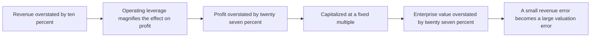
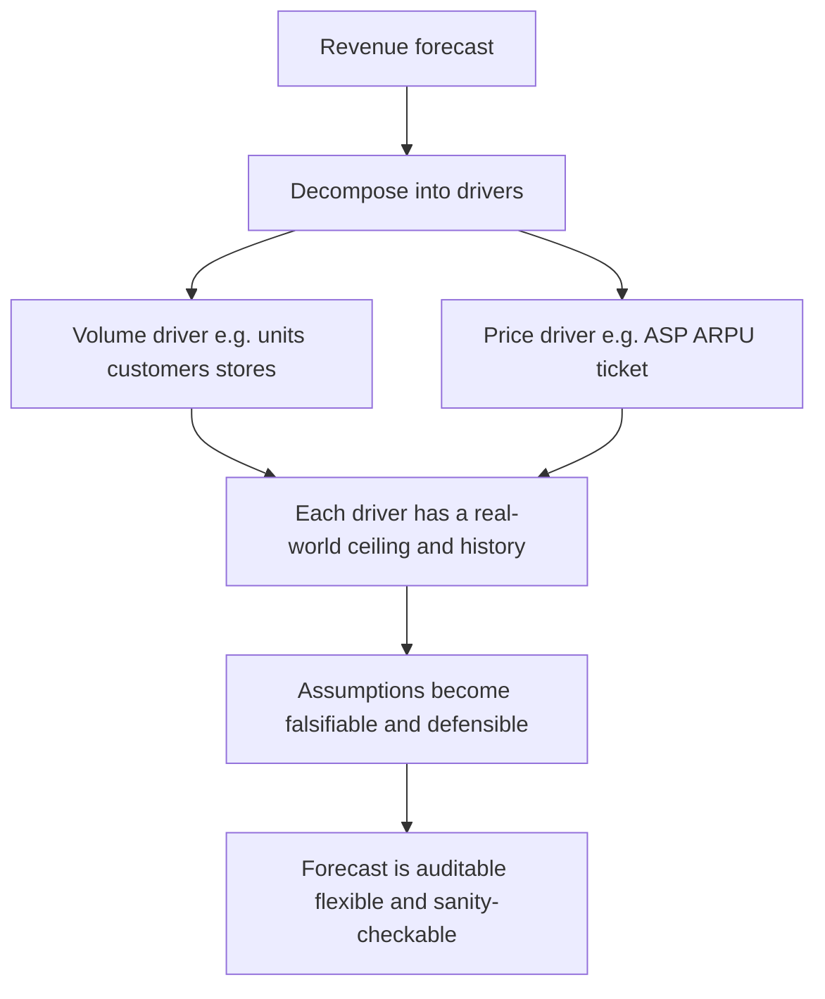
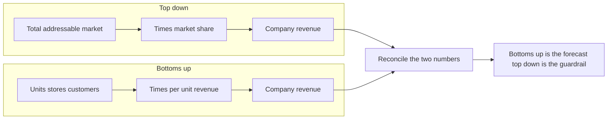
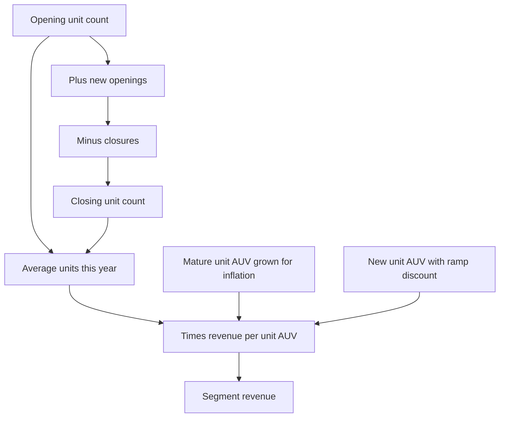
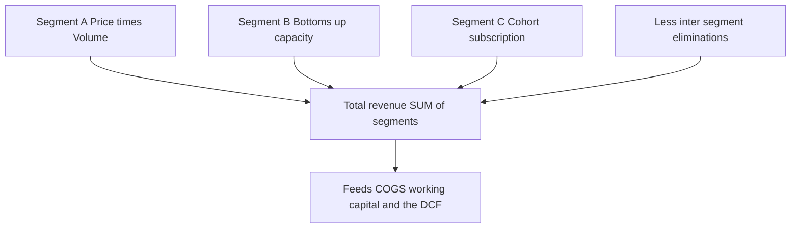
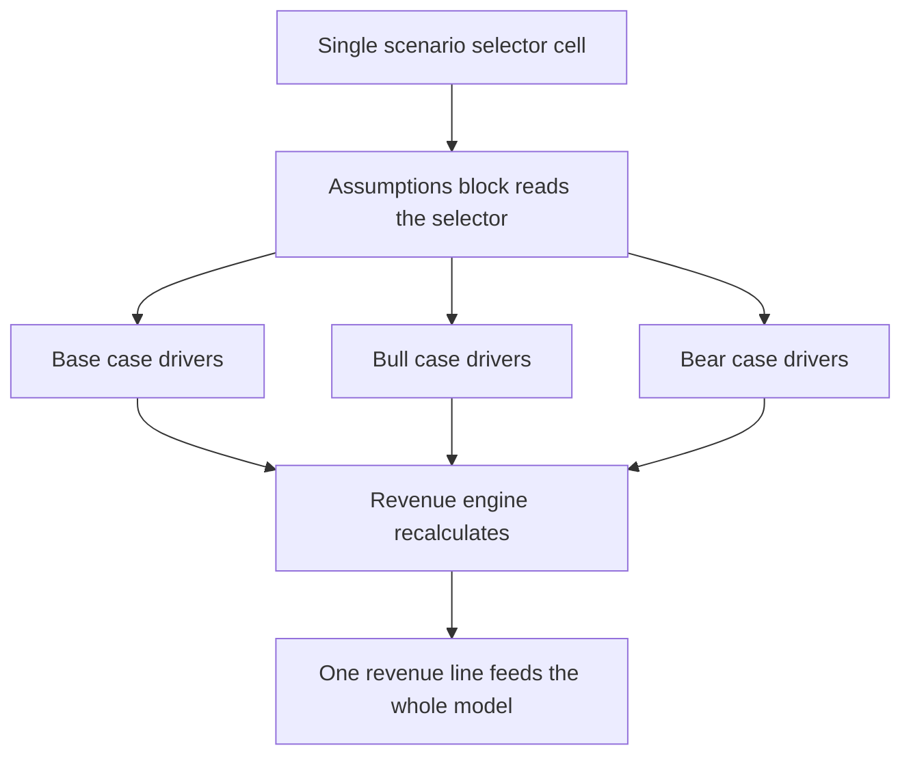

<!-- v2-deep -->

# Chapter 08 — Revenue Modeling and Forecasting

## 1. The Problem

Every three-statement model is a tower. The income statement sits on top of revenue, the balance sheet inherits working capital driven by revenue, the cash flow statement collects what falls out of both, and the valuation at the very end multiplies a revenue-derived cash flow by some factor. Pull the bottom brick — revenue — and the whole tower moves.

This is the first uncomfortable truth of financial modeling: **revenue is simultaneously the most important line in the model and the one you have the least reliable information about.** Costs are, to a surprising degree, mechanical. Cost of goods sold tends to track revenue as a fairly stable percentage. Depreciation follows a schedule you can literally read off a table. Interest follows the debt balance. But revenue depends on customers who have not yet decided to buy, at prices that have not yet been set, in markets that have not yet materialized. There is no schedule to read. You are genuinely forecasting the future.

Consider the damage a small revenue error does. Suppose a company earns a 15% operating margin. If you overstate revenue by 10%, and costs are mostly variable, the dollar error in operating profit is roughly proportional — but if a chunk of costs is fixed, that same 10% revenue miss can swing operating profit by 20%, 30%, or more because of operating leverage. Then that inflated profit flows into a DCF, gets capitalized at a multiple, and a 10% revenue optimism becomes a 40% valuation error. **Revenue errors do not stay small. They amplify as they travel down the model.**

Let us make that amplification concrete with numbers you can reproduce. Take a firm with revenue of $100m, variable costs of 60% of revenue ($60m), and fixed costs of $25m. Operating profit = 100 − 60 − 25 = $15m, a 15% margin. Now overstate revenue by 10% to $110m. Variable costs scale to $66m, but fixed costs stay at $25m. Operating profit = 110 − 66 − 25 = $19m. That is a jump from $15m to $19m — a **26.7% increase in profit** from a **10% increase in revenue**. If a DCF or a comparable-company analysis capitalizes that profit at a fixed EBIT multiple, the enterprise value moves 26.7% too. The fixed-cost base is the lever: the more fixed cost in the structure, the more a revenue error magnifies. This single arithmetic — profit elasticity greater than one whenever fixed costs exist — is why the revenue block earns more scrutiny than any other part of the model.


*Figure 1 — Operating leverage plus capitalization turns a modest revenue error into a large valuation error.*

So the problem is not merely "predict a number." The problem is:

- Build revenue from **drivers you can defend**, not a single hopeful growth rate typed into a cell.
- Make the forecast **auditable**, so a reviewer can see exactly which assumption produces which dollar.
- Make it **flexible**, so when the assumption is wrong (it will be), you change one input and the model re-solves.
- Make it **sanity-checkable** against reality — market size, capacity, history, and peers.

This chapter teaches you how to do all four in Excel, and how to choose the right building method for the business in front of you.

---

## 2. The Core Idea (Analogy)

Think of revenue like the flow of water arriving at a reservoir.

A lazy modeler measures last year's water level, assumes it rises 8% a year, and walks away. That is the **growth-rate approach** — fast, but it tells you nothing about *why* the water is rising, and it breaks the moment conditions change.

A real hydrologist does something different. She decomposes the inflow into its sources: this much from rainfall, this much from the river, this much from snowmelt — each with its own cause and its own limit. She knows the reservoir cannot exceed the size of the valley that feeds it. She checks that her rainfall estimate is not larger than the total rain that physically falls on the catchment area.

That is what a revenue driver model does. You **break revenue into its physical sources** — price and volume, or customers and spend-per-customer, or market size and share — model each source with its own logic and its own ceiling, then add them back up. The decomposition is the whole game. Once revenue is split into causes, every assumption becomes a question you can actually answer ("how many stores will they open?" is answerable; "what's the growth rate?" is a guess).

The governing equation behind almost every credible revenue build is deceptively simple:

> **Revenue = Quantity × Price**

Everything else in this chapter is a different way of estimating quantity and price for a specific kind of business — a subscription business measures quantity as "subscribers," a retailer as "stores × transactions," a SaaS platform as "customers × seats." The skill is choosing the right decomposition and building it cleanly.

One more idea travels with the analogy: **the level of decomposition is a choice, and more is not always better.** Splitting rainfall into "morning rain" and "afternoon rain" adds cells without adding insight if you cannot forecast the two separately. The right granularity is the finest level at which each atom has (a) its own cause and (b) its own data or defensible assumption. Decompose until each driver is answerable, then stop. A model that splits revenue into forty micro-drivers you cannot defend is worse than one with three you can — false precision is still false.

---

## 3. Why It Works

Why is decomposition better than just extrapolating a growth rate? Three reasons, each rooted in how forecasting error behaves.

**Reason 1 — Drivers have natural ceilings; growth rates do not.** An 8% growth rate compounded for ten years implies revenue 2.16× today's with no upper bound; nothing in the formula knows the company only has 500 possible customers. A driver model does know: if you model customers explicitly and the addressable market is 500, the model physically cannot forecast 600. The structure enforces reality. This is why bottoms-up models rarely produce the absurd hockey-sticks that pure growth models do.

**Reason 2 — Errors in independent drivers partially cancel.** If you forecast volume slightly high and price slightly low, the revenue error is smaller than either individual error. When you collapse everything into one growth number, you lose that diversification — a single wrong assumption is the entire forecast. Decomposition spreads your bets. There is a statistical version of this: if volume error and price error are uncorrelated, the variance of the product is smaller than if you had loaded all the uncertainty onto one blended figure, because the two errors do not move in lockstep.

**Reason 3 — Decomposition makes assumptions falsifiable, which makes them improvable.** "Revenue grows 12%" cannot be checked against anything until the year is over. "The company opens 40 new stores at $2.1m average unit volume" can be checked *today* against the store pipeline, the lease disclosures, and comparable-store data. Falsifiable assumptions get corrected; vague ones just get defended. A model built on falsifiable drivers gets more accurate every time new information arrives, because you know exactly which input to update.

There is also a communication reason. When you present a decomposed model, you are not asking the audience to trust your growth rate — you are showing them a chain of cause and effect they can interrogate and push back on. That is the difference between a forecast and a spreadsheet-shaped opinion. In a live setting — an investment committee, an interview, a management meeting — the first question is always "why?" A decomposed model has an answer at every node; a growth-rate model has one answer ("that felt about right") and it does not survive scrutiny.


*Figure 2 — Decomposition turns a single guessed growth rate into a chain of checkable drivers.*

---

## 4. Full Technical Content

This is the long section. We will cover the five main approaches, when each fits, the exact Excel build logic for each, the segment-level structure that ties them together, the scenario architecture that makes the block flexible, and the formatting conventions that make a revenue block trustworthy.

### 4.1 The five canonical approaches

| Approach | Core formula | Best for | Data you need |
|---|---|---|---|
| Growth rate | Rev_t = Rev_(t-1) × (1 + g) | Stable, mature, low-visibility businesses; quick first cut | History of revenue and growth |
| Price × Volume | Rev = Units × ASP | Manufacturers, commodities, hardware, anything with a countable unit | Unit volumes and average selling price |
| Market size × Share | Rev = TAM × Market share | Growth companies, new markets, strategy-driven cases | Total market size and a defensible share path |
| Bottoms-up (capacity) | Rev = Capacity units × Utilization × Price per unit | Retail, restaurants, hotels, airlines, clinics, anything with physical units | Store/room/seat counts and per-unit economics |
| Cohort / subscription | Rev = Σ(active subscribers per cohort × ARPU) | SaaS, telecom, media, any recurring-revenue model | New adds, churn/retention, ARPU |

These are not mutually exclusive. A serious model often uses **price × volume within each segment**, where segments are built **bottoms-up**, and cross-checks the total against a **market-size × share** sanity bound. Think of them as tools, not tribes.

A useful mental map: growth rate is the *zero-driver* method (no decomposition), price × volume is the *two-driver* method, and the bottoms-up and cohort builds are *two-driver methods where one driver is itself a roll-forward schedule* (a unit count or a subscriber count that carries a balance from period to period). Market size × share is the only genuinely *top-down* member of the family. Recognizing this tells you what to reach for: if the quantity you care about accumulates a balance over time (stores that persist, subscribers that persist), you need a roll-forward, not a growth rate on the stock.

### 4.2 Top-down vs bottoms-up — the fundamental axis

Before the specific methods, understand the axis they sit on.

- **Top-down** starts from a big external number (the total market) and multiplies down by share to reach the company's revenue. It answers "what could this business become?" It is honest about ceilings but weak on near-term precision.
- **Bottoms-up** starts from the company's own atoms (stores, customers, sales reps, product SKUs), forecasts each, and sums up. It answers "what will this business actually deliver next year?" It is precise near-term but can drift into fantasy over long horizons if you never check it against the market ceiling.

**Best practice: build bottoms-up for the forecast, sanity-check top-down.** Your primary revenue number should come from the atoms you can defend; the market-size calculation is the guardrail that catches you when the atoms imply an impossible market share.

There is a horizon logic here worth internalizing. Bottoms-up is most trustworthy in years 1–3, where you can see the pipeline (leases signed, sales reps hired, cohorts already acquired). It degrades in years 4–10, where the atoms become speculative. Top-down is the reverse: it is nearly useless for pinning next year's number but excellent for bounding the long run, because the market ceiling is more stable than any single company's trajectory. Mature models therefore lean on bottoms-up early and let the top-down ceiling increasingly discipline the later years — a natural way to make the two methods converge as the forecast ages.


*Figure 3 — Two directions of attack; use bottoms-up to forecast and top-down to bound.*

### 4.3 Approach 1 — Growth rate

The simplest build. Lay years across columns. Put a growth-rate assumption row in your assumptions block (blue font — see formatting), and drive each forecast year off the prior year.

Suppose historical revenue sits in row 10 and the growth-rate assumption sits in row 11. In the first forecast column (say F):

```
F10 = E10 * (1 + F11)
```

Then copy right. `F11` is your input (a hard-typed blue number or a formula referencing a market growth assumption). The single most important discipline here: **the growth rate must decline toward a sustainable long-run rate.** No business grows 30% forever. A common structure is a **fade**: start near the recent historical rate and step down linearly to a terminal rate (often near long-run nominal GDP, 3–5%) by the end of the explicit forecast. You can build the fade with a straight-line interpolation:

```
Growth_t = Start_g - (Start_g - Terminal_g) * (t - 1) / (N - 1)
```

where `t` is the forecast year index (1…N) and `N` is the number of forecast years. In Excel, if start-growth is in `$C$5`, terminal in `$C$6`, total forecast years `N` in `$C$7`, and the year index in row 8:

```
F11 = $C$5 - ($C$5 - $C$6) * (F8 - 1) / ($C$7 - 1)
```

Worked fade, so you can reproduce it exactly. Suppose Start_g = 12%, Terminal_g = 4%, N = 5. Then the coefficient (Start − Terminal)/(N−1) = (0.12 − 0.04)/4 = 0.02 per year. The fade is:

| Year index t | Formula | Growth |
|---|---|---|
| 1 | 0.12 − 0.02×0 | 12.0% |
| 2 | 0.12 − 0.02×1 | 10.0% |
| 3 | 0.12 − 0.02×2 | 8.0% |
| 4 | 0.12 − 0.02×3 | 6.0% |
| 5 | 0.12 − 0.02×4 | 4.0% |

Apply it to a starting revenue of $100m: Year 1 = 100 × 1.12 = 112.0; Year 2 = 112.0 × 1.10 = 123.20; Year 3 = 123.20 × 1.08 = 133.06; Year 4 = 133.06 × 1.06 = 141.04; Year 5 = 141.04 × 1.04 = 146.68. The five-year CAGR implied is (146.68/100)^(1/5) − 1 = 7.98% — note it lands well below the 12% starting rate, which is exactly the point: a fade prevents the starting rate from silently compounding into an implausible endpoint.

**Edge cases and variations.** A *linear* fade is the default, but two variants come up. A **geometric fade** (each year's growth is the prior year's times a constant decay factor) declines faster early and asymptotes — useful when you believe the growth premium erodes proportionally. A **stepped fade** holds growth flat for a year or two (a visible catalyst — a product launch, a contract) and then declines; use it when you have a specific reason the near-term rate is sticky. Whichever you pick, the terminal-year growth must be at or below the rate you will use for the DCF terminal value, or you create a discontinuity at the forecast boundary that inflates terminal value.

Use the growth-rate approach when the business is mature and stable, when you genuinely lack driver data, or as a **first-cut scaffold** you will later replace with a driver build. Never ship it as the final answer for a business where drivers are knowable.

### 4.4 Approach 2 — Price × Volume

The workhorse. You forecast a **volume row** and a **price row** and multiply. The power is that price and volume have completely different causes — inflation and mix drive price; capacity and demand drive volume — so modeling them separately is more honest than blending them into one growth rate.

Structure (three rows per product):

| Row | Label | Logic |
|---|---|---|
| 1 | Volume (units) | Prior units × (1 + volume growth), or a driver like capacity × utilization |
| 2 | ASP (price per unit) | Prior ASP × (1 + price growth), often tied to inflation |
| 3 | Revenue | Volume × ASP |

If volume is in row 20, ASP in row 21, revenue in row 22, and column F is the first forecast year:

```
F20 = E20 * (1 + F$14)      // F14 = volume growth assumption
F21 = E21 * (1 + F$15)      // F15 = price growth assumption
F22 = F20 * F21             // revenue
```

Watch your **units**. If volume is in thousands of units and ASP is dollars per unit, revenue comes out in thousands of dollars — keep a units label in column A and be religious about it. Half of all revenue-model errors are units errors hiding in plain sight.

**Mix — the third driver hiding inside price.** For a single product, ASP has one cause: the price you charge. For a multi-product firm, the *blended* ASP moves for a second reason — **mix shift**. If customers migrate toward a higher-priced product, blended ASP rises even when no individual price changes. This is why a naive "blended ASP × total units" build can mislead: it cannot tell price effects from mix effects. The clean fix is to model each product on its own price × volume block and let the blended ASP *emerge* from the sum, rather than forecasting the blend directly. When you must compress the blend into one cell, use `SUMPRODUCT`:

```
Blended ASP = SUMPRODUCT(units_range, price_range) / SUM(units_range)
```

Concretely, if Product X sells 600,000 units at $40 and Product Y sells 400,000 units at $70, then `SUMPRODUCT` gives 600,000×40 + 400,000×70 = 24,000,000 + 28,000,000 = 52,000,000, divided by 1,000,000 total units = **$52.00 blended ASP**. Next year, if X grows faster than Y, the same formula returns a *lower* blended ASP even with both prices frozen — the model has captured mix shift automatically. That is the payoff of building the blend from the atoms.

For multi-product firms, repeat the three-row block per product and sum the revenue rows into a total. This naturally leads to the segment build (§4.8).

**Interview angle.** A classic prompt is: "Revenue grew 8% — how much of that was price and how much was volume?" The decomposition answers it directly: (1 + volume growth) × (1 + price growth) − 1 = total growth, so if volume rose 5% and price rose ~2.9%, you get 1.05 × 1.029 − 1 = 8.0%. A candidate who can split reported growth into a price effect and a volume effect on the spot signals real modeling fluency; one who only knows "it grew 8%" does not.

### 4.5 Approach 3 — Market size × Share

Top-down. You need a defensible **TAM** (total addressable market) and a **share path**. The formula:

```
Company revenue = TAM × Market share
```

Build the TAM itself with its own logic — usually `TAM_t = TAM_(t-1) × (1 + market growth)` from an external research figure, or `Population × Penetration × Spend per user`. Then model share as a path that moves gradually — share almost never jumps; it creeps. If TAM is in row 30 and share in row 31:

```
F30 = E30 * (1 + F$16)      // F16 = market growth
F31 = E31 + F$17            // F17 = annual share gain in percentage points
F32 = F30 * F31             // company revenue
```

Worked example so it reconciles. Suppose Year-0 TAM is $200m growing 6% per year, and the company starts at 5% share, gaining 1 percentage point per year:

| Line | Year 1 | Year 2 | Year 3 | Year 4 | Year 5 |
|---|---|---|---|---|---|
| TAM ($m) | 212.00 | 224.72 | 238.20 | 252.50 | 267.65 |
| Share | 6% | 7% | 8% | 9% | 10% |
| Revenue ($m) | 12.72 | 15.73 | 19.06 | 22.72 | 26.76 |

Check Year 3: TAM = 200 × 1.06³ = 200 × 1.191016 = 238.20; share 8%; revenue = 238.20 × 0.08 = 19.06. Notice that revenue grows faster than the market — the Year-2-to-Year-3 revenue growth is 19.06/15.73 − 1 = 21.2%, well above the 6% market growth, because *share gains stack on top of market growth*. That decomposition (market growth plus share gain) is itself a useful way to explain a top-down forecast: "the market gives us 6%, share gains add the rest."

**Two flavors of TAM to keep straight.** *TAM* (total addressable market) is the entire demand if everyone who could buy did. *SAM* (serviceable addressable market) narrows it to the segment the company's product and geography actually reach. *SOM* (serviceable obtainable market) narrows further to what is realistically winnable given competition. Anchoring share against TAM when the company can only reach SAM overstates the ceiling and flatters the forecast. State which base your share is a percentage of, and be consistent.

The discipline here is that **share must stay plausible.** If your bottoms-up build implies 60% share in a fragmented market with ten competitors, something is wrong. This is precisely why market-size × share works best as the *guardrail* on a bottoms-up forecast (§4.2) rather than the primary engine — except in early-stage/strategy cases where you have no atoms yet.

### 4.6 Approach 4 — Bottoms-up capacity build

The most defensible near-term method for physical businesses. The atom is a **capacity unit**: a store, a restaurant, a hotel room, an airline seat-mile, a hospital bed, a manufacturing line. Revenue is:

```
Revenue = Number of units × Revenue per unit
```

and revenue-per-unit itself often decomposes further. For a retailer:

```
Store revenue = Stores × Average unit volume (AUV)
```

For a hotel:

```
Room revenue = Rooms × 365 × Occupancy × ADR
```

(ADR = average daily rate.) A useful compression here is **RevPAR** (revenue per available room) = Occupancy × ADR, so Room revenue = Rooms × 365 × RevPAR. RevPAR is the single metric hotel operators live by because it folds price and utilization into one number — but note it *hides* whether a change came from filling more rooms or charging more, exactly the price-versus-volume ambiguity from §4.4. Keep occupancy and ADR on separate rows and let RevPAR emerge. For a restaurant:

```
Revenue = Locations × Transactions per location × Average ticket
```

The build has two moving parts you must model separately:

1. **The unit count over time** — a roll-forward schedule: opening units + openings − closures = closing units. Use the *average* of opening and closing units for the year when multiplying by per-unit revenue, because units opened mid-year do not earn a full year.
2. **The revenue per unit** — grown for inflation and, crucially, split between **mature units** and **new units** if new units ramp (a new store rarely hits full AUV in year one).

Store roll-forward in Excel (opening in row 40, openings row 41, closures row 42, closing row 43, average row 44):

```
F40 = E43                       // opening = prior closing
F41 = 40                        // new openings (assumption)
F42 = 3                         // closures (assumption)
F43 = F40 + F41 - F42           // closing count
F44 = AVERAGE(F40, F43)         // average units in service this year
F45 = F44 * F46                 // revenue = avg units * AUV per unit (row 46)
```

**A subtlety in the mid-year convention.** `AVERAGE(opening, closing)` implicitly assumes openings and closures are spread evenly through the year — a "half-year" convention. If a company front-loads openings into January or back-loads them into December, the simple average is wrong. Two refinements: (a) if you know openings cluster late in the year, weight the new units by the fraction of the year they operate (e.g., a store opened at month 9 earns 3/12 of a year), or (b) build the model monthly and let the annual figure fall out of twelve monthly columns. For most annual models the simple average is close enough; reach for the refinement only when timing is both known and material.

Worked hotel micro-example to lock in the RevPAR identity. A 200-room hotel runs 70% occupancy at an ADR of $180. Room revenue = 200 × 365 × 0.70 × 180 = 200 × 365 = 73,000 room-nights available; × 0.70 = 51,100 room-nights sold; × 180 = **$9,198,000**. Via RevPAR: RevPAR = 0.70 × 180 = $126; 200 × 365 × 126 = **$9,198,000**. The two routes reconcile exactly, which is the check that your occupancy and ADR are wired correctly.

This is the gold standard for retail, hospitality, and services because every input maps to something management actually discloses or plans (the store pipeline, the lease schedule, comparable-store sales). It is also the method most robust to the hockey-stick problem — you cannot open 400 stores next year if you only have leases for 40.


*Figure 4 — A capacity roll-forward: model the unit count and the per-unit revenue as two separate schedules, then multiply.*

### 4.7 Approach 5 — Cohort / subscription build

For recurring-revenue businesses (SaaS, telecom, streaming, gyms), the atom is a **subscriber**, and the defining feature is **churn**: you keep only a fraction of last period's customers, then add new ones. The subscriber roll-forward:

```
Ending subs = Beginning subs − Churned subs + Gross adds
            = Beginning subs × (1 − churn rate) + Gross adds
Revenue     = Average subs × ARPU
```

where ARPU is average revenue per user (per month or per year — pick one and label it). Beginning subs in row 50, churn rate assumption in row 51, gross adds in row 52, ending in row 53:

```
F53 = F50 * (1 - F51) + F52     // ending subscribers
F54 = AVERAGE(F50, F53)         // average subs during the year
F55 = F54 * F56 * 12            // revenue = avg subs * monthly ARPU * 12 months
F50(next col) = F53             // next period's beginning = this ending
```

**Retention vs churn:** retention = 1 − churn. Net revenue retention (NRR) above 100% means existing customers spend *more* over time (upsell exceeds churn) — a hallmark of strong SaaS. If you model NRR directly, existing-customer revenue = prior existing-customer revenue × NRR, and you add new-customer revenue on top. Small NRR worked step: if existing-customer revenue is $10m and NRR is 110%, existing revenue next year is $11m before adding a cent of new business; layer $2m of new-customer revenue and you reach $13m. The reason investors prize NRR above 100% is that it means the business *grows even if it never signs another customer* — the installed base is a compounding engine, not a leaking bucket.

**Gross vs net churn, and where dollars differ from logos.** *Logo churn* counts customers lost; *revenue (dollar) churn* counts dollars lost. They diverge when churned customers are smaller or larger than average, or when survivors upsell. A business can have 15% logo churn and still positive *net dollar* retention if the survivors expand enough. Always state whether a churn number is logos or dollars — modeling dollar churn against a subscriber count, or vice versa, is a units error in disguise.

A true **cohort model** goes further: it tracks each year's new customers as a separate cohort that decays on its own retention curve, then sums all surviving cohorts. This matters when early cohorts churn faster than mature ones (retention curves flatten with age). For most models a single blended churn rate is adequate; reach for full cohorts when retention differs sharply by vintage or when management reports cohort data you want to mirror. A worked cohort example appears in §5.5.


*Figure 5 — Subscriber roll-forward: retain a fraction, add new, multiply the average by ARPU.*

### 4.8 The segment build — how it all assembles

Real companies are portfolios of businesses. A conglomerate might have a products segment (price × volume), a services segment (bottoms-up), and a subscriptions segment (cohort). The professional structure is:

1. Build **each segment on its own most-appropriate method** in its own block of rows.
2. Each block outputs one **segment revenue row**.
3. A **total revenue row** sums the segment revenue rows with a single `SUM`.
4. Optionally, an **eliminations row** removes inter-segment sales so the total is not double-counted.

The total revenue row is the single cell that the rest of the three-statement model points to. Everything downstream — COGS as % of revenue, receivables as days of revenue, the DCF — links to that one consolidated line. This is why the segment structure matters: it lets you build each business with the right logic while presenting one clean number to the rest of the model.

**Why eliminations matter and how to spot the need.** If a company's own manufacturing segment sells components to its own assembly segment, both segments book that sale, but the consolidated entity has not sold anything to the outside world until the finished product leaves. Summing segment revenues without an eliminations row double-counts the internal transfer. You need the row whenever segments transact with each other; you can skip it when segments are independent (a retailer's apparel and footwear divisions selling to different end customers). A quick tell: if segment revenues sum to more than total reported revenue in the historicals, eliminations are the missing piece.


*Figure 6 — Segment blocks each use the best method, then sum into the one revenue line the rest of the model consumes.*

### 4.9 Scenario and sensitivity architecture — making the block flexible

A revenue block is only as useful as its ability to answer "what if?" The professional pattern is a **single scenario selector** — one cell (often a dropdown driven by data validation) holding 1, 2, or 3 for Base, Bull, Bear. Every switchable assumption reads its value from a small table indexed by that selector using `CHOOSE` or `INDEX`:

```
Volume growth = CHOOSE($C$2, Base_vol, Bull_vol, Bear_vol)
  or
Volume growth = INDEX(vol_scenarios_row, $C$2)
```

Now flipping one cell re-solves the entire model into a different world, and — critically — you never overwrite an assumption to run a case, so the cases are preserved and reproducible. This is the structural cure for the "hard-coded plug" trap: if the only way to change a number is through the selector or a blue input, nobody can quietly bury an override.

For two-variable stress tests (revenue against volume growth *and* price growth simultaneously), Excel's **Data Table** (Data ▸ What-If Analysis ▸ Data Table) computes a grid without a single extra formula: put the output formula in the corner, the two driver ranges down the side and across the top, and Excel fills the interior. It is the fastest way to see the shape of revenue's sensitivity — and to catch the moment an un-faded growth rate produces an implausible endpoint.


*Figure 7 — One selector cell swaps entire driver sets so the model re-solves without overwriting any assumption.*

### 4.10 Excel functions and formatting that make revenue models trustworthy

**Functions you will actually use:**

- Basic arithmetic and `SUM` for totals — resist the urge to be clever; revenue math should be readable.
- `AVERAGE(opening, closing)` for mid-year unit and subscriber counts.
- `EOMONTH` / date functions if you build monthly and roll to annual.
- `SUMPRODUCT` for weighted blends (e.g., blended ASP across a product mix in one cell) — but only when a transparent multi-row build is genuinely too bulky; prefer visible rows.
- `INDEX/MATCH` or `XLOOKUP` to pull segment-level assumptions from a driver table.
- `CHOOSE` or `INDEX` to switch between Base/Bull/Bear scenario columns from one selector cell.
- Avoid volatile/opaque constructs (`OFFSET`, deeply nested `IF`) in the revenue engine — they hide logic and break audits.

**Formatting conventions (industry standard):**

- **Blue font = hard-coded input** (an assumption you type). **Black font = formula.** **Green font = link to another sheet.** A reviewer scanning your revenue block should be able to see every assumption at a glance by color.
- Put all assumptions (growth rates, churn, ASP growth, openings) in a **clearly labeled assumptions section**, ideally the same rows across every segment, so scenarios are one place to change.
- Label **units** in column A of every driver row ("units 000s", "$ per unit", "% churn").
- Separate **historical** columns from **forecast** columns with a visible divider (a vertical border or shaded header), because the two are epistemically different — one is fact, the other is assumption.
- Show **growth % and margin check rows** beneath revenue so trends are visible while you build.
- One formula per row, copied cleanly across — if column F and column G have structurally different formulas, that is a red flag.
- Anchor references deliberately: use `F$14` (row-locked) when copying a single assumption row down into a block, and `$C$2` (fully locked) for a global selector. A stray unanchored reference that "works" in column F and breaks in column G is the single most common self-inflicted revenue-model bug.

---

## 5. Worked Examples

Each example is reproducible: type the inputs into Excel and you will get the outputs shown. Each reconciles.

### 5.1 Example A — Price × Volume for a hardware product

A company sells one product. Year 0 (historical): 1,000,000 units at $50.00 ASP.

Assumptions:
- Volume growth: 10% per year.
- Price growth: 3% per year (inflation).

| Line | Year 0 | Year 1 | Year 2 | Year 3 |
|---|---|---|---|---|
| Volume (units) | 1,000,000 | 1,100,000 | 1,210,000 | 1,331,000 |
| ASP ($) | 50.00 | 51.50 | 53.05 | 54.64 |
| Revenue ($) | 50,000,000 | 56,650,000 | 64,190,500 | 72,727,922 |
| Revenue growth % | — | 13.3% | 13.3% | 13.3% |

Check the reconciliation. Year 1 volume = 1,000,000 × 1.10 = 1,100,000. Year 1 ASP = 50 × 1.03 = 51.50. Revenue = 1,100,000 × 51.50 = 56,650,000. Growth = 56.65 / 50.00 − 1 = 13.3%. Note the elegant result: **combined growth = (1.10 × 1.03) − 1 = 13.3%**, exactly the compounding of the two drivers. This is the sanity identity to remember — blended revenue growth equals volume growth compounded with price growth, and it should reconcile every year.

Verify Year 3 to the dollar so there is no doubt: volume = 1,000,000 × 1.10³ = 1,331,000; ASP = 50 × 1.03³ = 50 × 1.092727 = 54.6364; revenue = 1,331,000 × 54.6364 = 72,727,... precisely 72,727,922. And a three-year revenue CAGR of (72,727,922 / 50,000,000)^(1/3) − 1 = 13.3%, matching the annual figure exactly because both drivers grow at constant rates.

### 5.2 Example B — Bottoms-up retail store build with ramping new stores

A retailer opens stores that take two years to mature. Mature AUV is $2.0m; a store earns 60% of mature AUV in its opening year, then full AUV thereafter. AUV grows 2% per year for inflation. Start of Year 1: 100 mature stores. Opens 20 stores per year, closes none.

Store count roll-forward:

| Line | Year 1 | Year 2 | Year 3 |
|---|---|---|---|
| Opening stores | 100 | 120 | 140 |
| New openings | 20 | 20 | 20 |
| Closing stores | 120 | 140 | 160 |
| Mature stores (full AUV) | 100 | 120 | 140 |
| New stores (ramp AUV) | 20 | 20 | 20 |

Per-store AUV (grown 2%/yr): Year 1 mature = $2.000m, Year 2 = $2.040m, Year 3 = $2.081m. New-store AUV = 60% of that year's mature AUV.

Revenue build:

| Line | Year 1 | Year 2 | Year 3 |
|---|---|---|---|
| Mature-store revenue | 100 × 2.000 = 200.0 | 120 × 2.040 = 244.8 | 140 × 2.081 = 291.3 |
| New-store revenue (60%) | 20 × 1.200 = 24.0 | 20 × 1.224 = 24.5 | 20 × 1.248 = 25.0 |
| **Total revenue ($m)** | **224.0** | **269.3** | **316.3** |

Reconciliation of Year 2: mature stores are the 120 that were open at the start of Year 2 (last year's 120 closing count are now mature) earning full AUV of $2.040m = $244.8m; the 20 opened during Year 2 earn 60% × $2.040m = $1.224m each = $24.5m; total $269.3m. Notice the new-store drag: total store count rose 17% (120→140) but revenue rose 20% because last year's new stores matured to full AUV — exactly the ramp dynamic a naive "stores × AUV" model would miss.

**What-if variation — a maturation cliff.** Watch what happens when openings stop. Suppose in Year 4 the retailer pauses expansion (0 openings, 0 closures) but the 20 stores opened in Year 3 mature to full AUV. Store count is flat at 160, yet revenue still rises: mature-store revenue = 160 × (2.081 × 1.02) = 160 × 2.123 = $339.7m, versus Year 3's $316.3m — a 7.4% gain from *zero net new stores*, purely from last year's cohort maturing plus 2% inflation. This is the "maturation tailwind" that flatters a retailer's same-store metrics for a year or two after expansion slows, and it is invisible unless you model the ramp.

### 5.3 Example C — Subscription cohort build with churn

A SaaS business. Start of Year 1: 10,000 subscribers. Monthly ARPU $40 (so annual ARPU $480). Annual churn 20% (retention 80%). Gross adds: 4,000 in Year 1, 4,500 in Year 2, 5,000 in Year 3.

Subscriber roll-forward:

| Line | Year 1 | Year 2 | Year 3 |
|---|---|---|---|
| Beginning subscribers | 10,000 | 12,000 | 14,100 |
| Churned (20%) | (2,000) | (2,400) | (2,820) |
| Gross adds | 4,000 | 4,500 | 5,000 |
| Ending subscribers | 12,000 | 14,100 | 16,280 |
| Average subscribers | 11,000 | 13,050 | 15,190 |
| **Revenue ($m) = avg × $480** | **5.28** | **6.26** | **7.29** |

Reconciliation of Year 2: beginning 12,000 (Year 1 ending), churn 20% × 12,000 = 2,400, adds 4,500, ending = 12,000 − 2,400 + 4,500 = 14,100. Average = (12,000 + 14,100)/2 = 13,050. Revenue = 13,050 × $480 = $6.264m. The churn drag is the story: gross adds are rising, but net adds (ending − beginning) are only 2,000 → 2,100 → 2,180 because churn scales with the growing base. This is the trap a growth-rate model hides and a cohort model exposes — as the base grows, churn eats an ever-larger absolute number of customers, and gross adds must keep climbing just to hold net growth flat.

**Where does growth stall?** Push the logic one step: the base stops growing when gross adds exactly equal churn, i.e. when gross adds = 20% × beginning base. At a 20% churn rate, a base of 25,000 would churn 5,000 per year — so with gross adds plateauing near 5,000, this business asymptotes toward roughly 25,000 subscribers and then flatlines unless adds accelerate or churn falls. Solving `steady-state base = gross adds / churn rate` (here 5,000 / 0.20 = 25,000) gives you the ceiling the model is walking toward. Knowing that number is a powerful sanity check: if your forecast blows through it, you are implicitly assuming ever-rising adds or falling churn, and you should be able to say why.

### 5.4 Example D — Growth-rate fade for a mature business

A stable consumer-staples company with Year-0 revenue of $100m and no reliable unit data. Recent growth has been ~12%, but the category is mature; you fade to a 4% terminal rate over five years using the linear formula from §4.3 (coefficient 0.02/yr).

| Line | Year 1 | Year 2 | Year 3 | Year 4 | Year 5 |
|---|---|---|---|---|---|
| Growth assumption | 12.0% | 10.0% | 8.0% | 6.0% | 4.0% |
| Revenue ($m) | 112.00 | 123.20 | 133.06 | 141.04 | 146.68 |

Reconciliation: Year 3 = 123.20 × 1.08 = 133.056 ≈ 133.06; Year 5 = 141.04 × 1.04 = 146.68. The implied five-year CAGR is (146.68/100)^(1/5) − 1 = 7.98%. Compare this to what a *flat* 12% would have produced: 100 × 1.12⁵ = $176.2m — a full 20% higher endpoint. That $29.5m gap between the faded and un-faded paths is the hockey-stick premium you avoid by forcing growth down toward a sustainable rate. It is also why terminal value is so sensitive to the fade: whatever rate you end on becomes the anchor for the perpetuity.

### 5.5 Example E — True cohort model with an age-based retention curve

When early-life churn is heavier than late-life churn, a single blended rate misfires and you track cohorts by vintage. Each cohort decays on a survival curve measured from its acquisition year: 100% in the acquisition year (age 0), 75% at age 1, 60% at age 2. ARPU is $500/year. New cohorts: 1,000 customers acquired in Year 1, 1,200 in Year 2, 1,400 in Year 3.

Active customers by cohort and year:

| Cohort | Year 1 | Year 2 | Year 3 |
|---|---|---|---|
| Y1 cohort (1,000) | 1,000 (age 0) | 750 (age 1) | 600 (age 2) |
| Y2 cohort (1,200) | — | 1,200 (age 0) | 900 (age 1) |
| Y3 cohort (1,400) | — | — | 1,400 (age 0) |
| **Total active** | **1,000** | **1,950** | **2,900** |
| **Revenue ($) = active × $500** | **500,000** | **975,000** | **1,450,000** |

Reconciliation of Year 3 active count: the Y1 cohort is now age 2 → 1,000 × 60% = 600; the Y2 cohort is age 1 → 1,200 × 75% = 900; the Y3 cohort is age 0 → 1,400; total 600 + 900 + 1,400 = 2,900; revenue = 2,900 × $500 = $1,450,000. The value of the cohort structure is visible here: because age-1 retention (75%) exceeds the naive "blended" survival you would infer from mixing vintages, the model correctly credits the seasoned Y1 cohort with a higher survival than a first-year cohort would get. Blend everything into one churn rate and you either over-penalize old cohorts or under-penalize new ones — the cohort table keeps each vintage honest.

### 5.6 Example F — Blended ASP and the mix-shift trap

Two products in one segment. Year 1: Product X sells 600,000 units at $40; Product Y sells 400,000 units at $70. Year 2: X grows 20% to 720,000 units, Y grows 5% to 420,000 units; both prices are frozen.

| Line | Year 1 | Year 2 |
|---|---|---|
| X units | 600,000 | 720,000 |
| Y units | 400,000 | 420,000 |
| X revenue ($) | 24,000,000 | 28,800,000 |
| Y revenue ($) | 28,000,000 | 29,400,000 |
| Total revenue ($) | 52,000,000 | 58,200,000 |
| Total units | 1,000,000 | 1,140,000 |
| **Blended ASP ($)** | **52.00** | **51.05** |

Reconciliation: Year-2 blended ASP = 58,200,000 / 1,140,000 = $51.05, *down* from $52.00 even though not one price changed. The lower-priced product X grew its share of the mix (from 60% of units to 63%), dragging the blend down. A modeler who forecast "blended ASP grows with inflation" would have raised it — and been wrong by the entire mix effect. The lesson: never forecast a blended price directly when you can forecast the components and let the blend emerge via `SUMPRODUCT(units, prices) / SUM(units)`.

---

## 6. Connections

Revenue is the head of the water for the entire model. Trace where the total revenue line flows:

- **Cost of goods sold and gross profit.** COGS is typically modeled as a percentage of revenue (or, better, unit cost × the same volume driver you already built). Either way it points back at your revenue block. If you built volume explicitly, reuse that volume for a matching cost-per-unit build — consistency between the revenue and cost engines is what makes gross margin credible. A subtle payoff: if COGS is a fixed percentage of revenue, gross margin is constant by construction and you have quietly assumed away all operating leverage in cost of sales; a unit-cost build lets margins move as scale changes, which is usually more realistic.
- **Operating expenses.** Some are revenue-linked (sales commissions, shipping), some are fixed (rent, G&A). Splitting them correctly is what produces **operating leverage** — the reason a revenue miss hits profit harder than proportionally, as the §1 arithmetic showed ($100m → $110m revenue lifting profit from $15m to $19m). The larger the fixed base, the more violent the swing in both directions.
- **Working capital.** Accounts receivable is usually modeled as *days of revenue* (`AR = revenue / 365 × DSO`), and inventory as days of COGS. So revenue drives the balance sheet, not just the income statement. Faster revenue growth consumes more cash into receivables — a link the cash flow statement will surface.
- **The cash flow statement.** Revenue-driven profit flows to the top of cash from operations; revenue-driven working capital changes adjust it. Growth is not free — it ties up cash. A fast-growing subscription business can be GAAP-profitable and cash-negative simultaneously because it pays to acquire customers now and collects the revenue over years.
- **Capex and capacity.** In a bottoms-up build the store/room/subscriber count that drives revenue often *also* drives capex (each new store costs money to build). Link them: the same openings row feeds both revenue and the capital expenditure schedule. This is one of the highest-value links in the whole model — it forces internal consistency, so you cannot forecast revenue from 40 new stores while forgetting the cash to build them.
- **Valuation.** The DCF discounts revenue-derived free cash flows; a comparable-company analysis applies an EV/Revenue or EV/EBITDA multiple to your forecast. Every valuation output inherits your revenue assumptions. The terminal value — often 60–80% of a DCF — rests on the terminal growth rate you faded revenue toward in §4.3, which is why the fade is not cosmetic: it *is* the terminal value assumption in disguise.

The practical takeaway: because revenue touches everything, **it should be the most carefully built and most heavily sanity-checked block in the model.** Time spent here has the highest leverage of anything you do.

---

## 7. Traps and Common Errors

**The permanent hockey stick.** Forecasting high growth that never fades. Every explicit forecast must decline toward a sustainable terminal rate. If year 10 growth still exceeds nominal GDP, ask why this company outgrows the economy forever — usually it cannot. Example D quantified the cost: a flat 12% versus a fade to 4% differed by $29.5m on a $100m base over five years.

**Implied market share that exceeds 100% (or just implausible levels).** The classic bottoms-up failure: sum your segment forecasts, divide by the market size, and discover you've assumed the company captures 70% of a competitive market. Always run the top-down guardrail (§4.2). And check the *base* — share against TAM when the firm can only reach SAM is silently overstated.

**Units errors.** Thousands vs millions, monthly vs annual ARPU, units vs dollars. These produce answers off by 12× or 1,000× and are embarrassingly common. Label every row's units and reconcile totals against a known reference. The monthly-vs-annual ARPU slip (forgetting the ×12) is the single most frequent SaaS-model error.

**Forgetting the mid-year convention.** Multiplying full-year per-unit revenue by *closing* store or subscriber count overstates revenue, because units added during the year did not earn all year. Use the average of opening and closing counts — and refine it if openings cluster at one end of the year (§4.6).

**Ignoring churn in recurring models.** Modeling subscriber growth off gross adds alone. As the base grows, churn removes an ever-larger absolute number; net adds can shrink even as gross adds rise. Model the retention explicitly, and know your steady-state ceiling (gross adds ÷ churn rate, §5.3).

**New-unit ramp ignored.** Assuming a new store or new cohort earns full economics immediately. New units almost always underperform mature ones for a period; model the ramp or you overstate near-term revenue. The flip side — a maturation tailwind after expansion slows (§5.2) — is equally easy to miss.

**Confusing mix shift with price change.** Forecasting a blended ASP directly and attributing all of its movement to pricing. Blended ASP moves when the *mix* shifts even with every price frozen (§5.6). Build the blend from product-level atoms with `SUMPRODUCT`.

**Confusing logo churn with dollar churn.** Applying a customer-count churn rate to revenue, or vice versa. They diverge whenever churned customers differ in size from survivors or survivors upsell. State which one every churn number is.

**Price and volume blended into one growth rate.** You lose the ability to stress-test them independently and to sanity-check price growth against inflation. Keep them on separate rows wherever data allows.

**Circularity from revenue-linked interest.** If revenue drives cash, cash drives debt paydown, debt drives interest, and interest sits above a revenue-linked line, you can create a circular reference. Keep the revenue engine clean and handle circularity deliberately (iterative calc or a circuit breaker) downstream — never let it live inside the revenue build.

**Hard-coding a formula cell.** Typing a number over what should be a formula (a "plug") to hit a target. It breaks when you change an assumption and silently corrupts scenarios. Every forecast revenue cell should be a live formula; every input should be an isolated blue cell. The scenario-selector architecture (§4.9) is the structural defense: if the only way to change a number is through a blue input or the selector, plugs cannot hide.

**Inconsistent formulas across a row.** Column F multiplies but column G adds, or an anchor that should be `F$14` was left as `F14` and drifted when copied. One formula per row, copied cleanly — anything else is a red flag and a likely bug.

**No sanity check against history.** Forecasting 25% growth for a company that has never exceeded 8%. Always place the forecast next to the historical trend and justify any break.

---

## 8. First-Principles Recap

Strip everything away and revenue reduces to one identity: **Revenue = Quantity × Price.** Every method in this chapter is a way of estimating quantity and price for a particular business.

- If you cannot get to quantity and price, you fall back to a **growth rate** — the least informative method — and you must at least make it fade to a sustainable long-run rate.
- If the business has a countable unit, use **price × volume**, modeling the two drivers separately because they have different causes, and letting any blend emerge from the atoms so mix and price never get confused.
- If the business is defined by physical capacity, build **bottoms-up** from a unit roll-forward, using average units and a new-unit ramp.
- If the business is recurring, build a **subscriber roll-forward** with explicit churn, because retention — not gross adds — governs the trajectory; escalate to full cohorts when retention differs by vintage.
- If you are sizing an opportunity or lack atoms, use **market size × share**, keeping share plausible and anchored to the right base (TAM, SAM, or SOM).

Whatever method you pick, obey the three invariants: **decompose into defensible drivers, fade growth toward sustainability, and cross-check bottoms-up against top-down.** A fourth, quieter invariant makes the first three usable: **build it so that changing one input re-solves the whole block** — isolated blue inputs, a scenario selector, one formula per row. A forecast that satisfies all of these is defensible even when it turns out wrong — because you can point to exactly which assumption moved, and fix it. That is the difference between modeling and guessing.

---

## 9. Quick-Reference

**Core formulas**

| Purpose | Formula |
|---|---|
| Growth rate | Rev_t = Rev_(t-1) × (1 + g) |
| Growth fade | g_t = g_start − (g_start − g_term) × (t−1)/(N−1) |
| Price × volume | Rev = Units × ASP |
| Blended ASP | ASP = SUMPRODUCT(units, prices) / SUM(units) |
| Market share | Rev = TAM × Share |
| Capacity build | Rev = Avg units × Revenue per unit |
| Store AUV | Rev = Avg stores × AUV |
| Hotel | Rev = Rooms × 365 × Occupancy × ADR |
| Hotel via RevPAR | Rev = Rooms × 365 × RevPAR, RevPAR = Occupancy × ADR |
| Subscriber roll | End = Begin × (1 − churn) + Gross adds |
| Subscription rev | Rev = Avg subs × ARPU × periods |
| Subscriber steady state | Ceiling = Gross adds ÷ churn rate |
| NRR expansion | Existing rev_t = Existing rev_(t−1) × NRR |
| Mid-year count | Avg = AVERAGE(opening, closing) |
| Blended growth check | (1 + vol growth) × (1 + price growth) − 1 |
| AR from revenue | AR = Revenue / 365 × DSO |
| Scenario switch | X = CHOOSE(selector, Base, Bull, Bear) |

**Choosing an approach (decision order)**
1. Recurring revenue with churn? → Cohort / subscription (full cohorts if retention differs by vintage).
2. Physical capacity units (stores, rooms, seats)? → Bottoms-up roll-forward.
3. Countable product units with a price? → Price × volume, per segment.
4. Sizing a market or no atoms available? → Market size × share.
5. Mature, stable, low visibility, or first cut? → Faded growth rate.
6. Always: sum bottoms-up, then check implied market share top-down.

**Formatting checklist**
- Blue = input, black = formula, green = link.
- Assumptions isolated and labeled; units on every row.
- Historical and forecast visually divided.
- Growth % and margin check rows visible.
- One formula per row, copied cleanly; anchors deliberate (`F$14`, `$C$2`).
- Scenario selector drives switchable assumptions; no plugs.

**Sanity checks before you trust a revenue forecast**
- Does growth fade to a sustainable terminal rate at or below the DCF terminal rate?
- Is implied market share plausible, and against the right base (TAM/SAM/SOM)?
- Do units reconcile (thousands, monthly vs annual, logos vs dollars)?
- Did you use average, not closing, counts?
- Is the forecast defensible against the historical trend?
- Does blended growth equal volume compounded with price?
- Did blended ASP move for a mix reason you can explain?
- Does the subscriber base respect its steady-state ceiling?

---

## 10. Build-It-Yourself Exercise

Build a two-segment revenue model in Excel for a fictional company, "Northwind," over a 5-year explicit forecast plus a terminal year. Do it from a blank sheet — the point is the muscle memory.

**Segment 1 — Hardware (price × volume).**
- Year 0: 500,000 units at $80 ASP.
- Volume growth fades from 12% in Year 1 to 4% in Year 5 (use the linear fade formula; coefficient (0.12−0.04)/4 = 0.02/yr, giving 12%, 10%, 8%, 6%, 4%).
- ASP grows 3% per year.
- Output a revenue row and a revenue-growth check row.

**Segment 2 — Subscriptions (cohort with churn).**
- Year 0 ending base: 50,000 subscribers. Monthly ARPU $15.
- Annual churn 15%. Gross adds: 20,000 rising 10% per year.
- Build the subscriber roll-forward (beginning, churn, adds, ending, average) and a revenue row.

**Consolidation.**
- Sum the two segment revenue rows into total revenue.
- Add a total-revenue-growth row and a subscription-mix row (subscription revenue ÷ total).

**Add a scenario selector.**
- Put a selector cell (1 = Base, 2 = Bull, 3 = Bear) at the top.
- Wire hardware volume growth and subscription churn to read from a three-column scenario table via `CHOOSE` or `INDEX`.
- Bull: volume fade starts at 16%, churn 10%. Bear: volume fade starts at 8%, churn 22%. Confirm the whole block re-solves when you flip the one cell.

**Then sanity-check:**
1. Confirm hardware blended growth in Year 1 equals (1.12 × 1.03) − 1 = 15.4%.
2. Confirm subscription net adds shrink even as gross adds rise — explain why in one sentence. Then compute the steady-state subscriber ceiling at 15% churn once gross adds plateau, and confirm your forecast stays below it.
3. Assume the total market for Northwind's category is $200m in Year 0 growing 6% per year. Compute implied market share each year. Is it plausible? If it exceeds ~40%, revisit your volume assumptions.
4. Change hardware volume growth to a flat 20% (un-faded) and watch total revenue and implied share. Note how fast an un-faded growth rate produces an implausible share — that is the hockey-stick trap made visible. Then build a two-way Data Table of Year-5 total revenue against hardware starting volume growth (rows) and ASP growth (columns) to see the sensitivity surface.
5. Split each hardware year's revenue growth into its price component and its volume component and confirm they compound back to the total — the §4.4 interview identity.

**Success criteria:** every forecast cell is a live formula, every assumption is a blue isolated input, units are labeled, the two segments use different methods, a single selector cell flips the entire block between Base/Bull/Bear without overwriting anything, the total reconciles to the sum of segments, and you have run the top-down market-share guardrail against your bottoms-up build. When you can change one assumption and watch the entire revenue block — and the implied market share — re-solve correctly, you have built a real revenue model.
