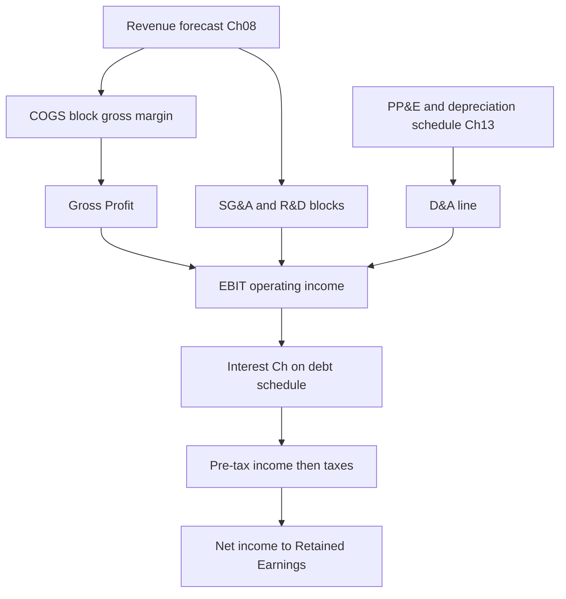
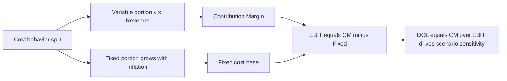
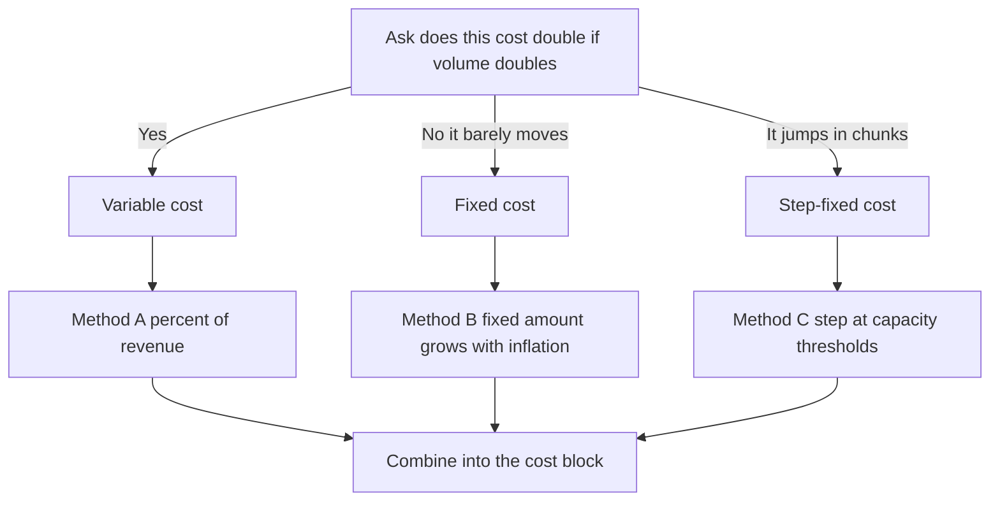

<!-- v2-deep -->

# Chapter 09 — Cost and Expense Modeling

## 1. The Problem

You have already learned how to forecast revenue (Chapter 08). Revenue is the top line — but nobody gets paid from revenue. A company can double its sales and still go bankrupt if its costs rise faster than its revenue. The number that actually matters to owners, lenders, and equity investors is what is *left over* after costs: gross profit, operating profit, and ultimately free cash flow.

So the moment your revenue line is built, you face the next question: **for every rupee (or dollar) of revenue, how much gets consumed by costs, and how much survives to the bottom line?**

This is deceptively hard, and here is why. The junior-analyst instinct is to grab last year's income statement, compute each cost line as a percentage of revenue, and paste that same percentage across all five forecast years. COGS was 62% of revenue last year? Make it 62% forever. SG&A was 18%? 18% forever. It takes ten minutes and it looks professional.

It is also often **wrong**, and wrong in a way that quietly destroys the credibility of the whole model. The flat-percent method silently assumes that *every single cost rises and falls in perfect lockstep with sales*. It assumes a factory's rent goes up when you sell more, that your CFO's salary scales with unit volume, that depreciation on a machine bought three years ago somehow tracks this year's revenue. None of that is true. Real businesses have **fixed costs** that stay put while volume moves, and **variable costs** that genuinely scale. Blending them into one flat ratio erases the single most important dynamic in the business: **operating leverage** — the reason profit margins expand as a company grows and collapse when it shrinks.

To feel the stakes, consider a simple two-line thought experiment. Two companies each earn ₹1,000 of revenue and ₹100 of operating profit today — identical, on the surface. Company A is a consultancy whose costs are 90% variable (people you can bill or bench). Company B is a semiconductor fab whose costs are 90% fixed (the plant is built whether it runs or not). Grow both by 20%. Company A's profit rises to about ₹120; Company B's profit rises to about ₹280. Same starting income statement, wildly different futures — and a flat-percent model would forecast *both* at ₹120, silently erasing the entire reason a fab is worth analyzing. The cost structure, not the current margin, is what determines how a business responds to the future. That is what this chapter teaches you to model.

The purpose of this chapter is to give you a disciplined, honest way to model the cost side of the income statement. You will learn *which* costs to model as a percent of revenue, *which* to model as fixed or step-fixed, how to think about **gross margin** and **contribution margin**, where **SG&A, R&D, and D&A** belong on the statement and in the model, and how to build a cost block that reacts *correctly* when revenue changes — so that your profit forecast bends the way a real business bends.

## 2. The Core Idea (Analogy)

Think about the economics of running a **coffee shop**.

Some of your costs move every time a customer walks in. Each cup requires beans, milk, a paper cup, a lid, a sleeve. Sell 100 cups, you buy 100 cups' worth of beans. Sell 200, you buy twice the beans. These are **variable costs** — they scale (roughly) linearly with volume. Modeling them as a percentage of revenue is honest, because they genuinely *are* a percentage of revenue.

Other costs do not care how many cups you sell. The monthly rent on the shop is the same whether you serve 10 customers or 10,000. The manager's salary, the espresso machine's depreciation, the insurance premium, the "Open" sign's electricity — these are **fixed costs**. They are a fortress wall that does not move with the tide of daily sales.

Now watch what happens. On a slow day you sell 100 cups and barely cover the rent — you might lose money. On a busy day you sell 1,000 cups. The beans cost 10x more (variable), but the rent is *exactly the same*. Every cup beyond the break-even point drops a huge chunk of its price straight to profit, because the fixed wall is already paid for. This is **operating leverage**: once fixed costs are covered, incremental revenue is disproportionately profitable. It also cuts the other way — if sales fall, the rent still has to be paid, and profit collapses faster than revenue.

Push the analogy one step further, because real businesses live here: what happens when the busy day becomes the *normal* day? At 1,000 cups a day, one espresso machine and one barista can no longer keep up. You buy a second machine and hire a second barista. Your "fixed" rent just jumped — not smoothly, but in a **step**. Fixed costs are only fixed *within a relevant range* of activity; cross the range and the wall moves up a notch. This is why the honest model is not "fixed vs variable" but "fixed *within a range*, variable, and step-fixed at the boundaries." A modeler who forgets the steps will happily forecast one coffee machine serving a million cups a year.

A good cost model is simply an honest map of *which* of your costs are "beans," *which* are "rent," and *where the rent jumps*. The flat-percent trap treats everything as beans. Reality is a mix. Your job as the modeler is to separate the three so the model breathes like the real business.

## 3. Why It Works

Why does the fixed-plus-variable split produce better forecasts than a single flat percentage? Three reasons rooted in how businesses actually behave.

**First, cost behavior is a physical fact, not an accounting choice.** A lease contract fixes rent for the year regardless of sales. A raw-material bill is literally a function of units produced. When you model costs as fixed-plus-variable, you are matching the *causal structure* of the business — the drivers that actually generate the cost. A model that mirrors real causation forecasts better than one that curve-fits a single ratio to last year's happenstance.

**Second, it captures margin dynamics that flat percentages cannot.** Because fixed costs are spread over more units as revenue grows, the *total-cost-to-revenue ratio* naturally *falls* as the company scales, and *rises* when it shrinks. That is exactly what we observe in real companies: growing firms show margin expansion, shrinking firms show margin compression. Flat-percent modeling produces a dead-flat margin forever, which almost never matches reality and immediately signals a lazy model to any experienced reviewer.

**Third, it makes the model *responsive and defensible*.** The entire point of a financial model is to answer "what if?" What if revenue grows 20% instead of 10%? A flat-percent model answers "profit grows exactly 20% too" — mechanically, uninterestingly, wrongly. A fixed-plus-variable model answers "profit grows *28%*, because the fixed base is already covered and the extra revenue is highly incremental." That second answer is the one that helps a decision-maker, and it is the one you can defend line by line when someone asks "why?"

The deeper principle: **good modeling replaces one opaque assumption with several transparent ones.** "COGS is 62% of revenue" hides everything. "COGS is 45% variable materials plus a ₹80-crore fixed manufacturing overhead" exposes the logic, lets you stress each piece independently, and forces you to actually understand the business.

There is also a mathematical way to see why the flat-percent method is a *special case* — and a degenerate one. The general cost equation is `Cost = Fixed + v × Revenue`. Divide both sides by revenue and the **cost ratio** is `Cost/Revenue = v + Fixed/Revenue`. The variable rate `v` is a constant; the second term `Fixed/Revenue` *shrinks* as revenue grows. So the cost ratio is a downward-sloping curve, not a flat line — it only *looks* flat if fixed costs are near zero or revenue barely moves. The flat-percent method is the assumption `Fixed = 0`. You are not choosing a "simpler" model; you are asserting the company has no fixed costs at all. Stated that baldly, nobody would defend it — yet it is the default in ten thousand junior models.

## 4. Full Technical Content

### 4.1 The cost structure of the income statement

Before modeling anything, get the *ordering* right, because placement on the statement determines which subtotal each cost affects. The standard structure:

| Line | What it is | Subtotal it feeds |
|---|---|---|
| Revenue | Top line (Chapter 08) | — |
| **(–) COGS / Cost of Sales** | Direct cost of producing what you sold | → **Gross Profit** |
| = Gross Profit | Revenue − COGS | Gross Margin % |
| (–) SG&A | Selling, general & administrative | → Operating income |
| (–) R&D | Research & development | → Operating income |
| (–) D&A | Depreciation & amortization | → Operating income |
| = **EBIT / Operating Income** | Profit from core operations | Operating Margin % |
| (–) Interest | Cost of debt | → Pre-tax income |
| (–) Taxes | Government's share | → Net income |
| = Net Income | Bottom line | Net Margin % |

Two definitions you must lock in:

- **Gross Profit = Revenue − COGS.** **Gross Margin % = Gross Profit ÷ Revenue.** This isolates production economics from overhead.
- **EBIT (Operating Income) = Gross Profit − Operating Expenses (SG&A + R&D + D&A).** **Operating Margin % = EBIT ÷ Revenue.**

A subtle but critical placement question is **where D&A lives**. Depreciation on manufacturing equipment is technically part of COGS (it is a cost of producing goods). Depreciation on the head-office building is an operating expense below the gross-profit line. Many companies bury D&A inside COGS and SG&A rather than showing it as one line. For modeling, the cleanest and most common convention is to **forecast D&A separately** (driven by the PP&E and depreciation schedule — Chapter 13), pull it out as its own line, and add it back in the cash flow statement. We will follow that convention: model COGS and SG&A on a *cash* basis (excluding D&A) and show D&A as an explicit line sourced from the fixed-asset schedule. Always state which convention you are using in a note cell, because mixing them double-counts or omits depreciation.

**A note on EBIT vs EBITDA.** Analysts often quote **EBITDA = EBIT + D&A** because it strips out the non-cash depreciation charge and the accounting choices baked into it (useful lives, methods), giving a cleaner cross-company comparison of operating cash generation. In our cost block, EBITDA falls out for free: if COGS and SG&A are modeled cash-basis (excluding D&A), then `EBITDA = Gross Profit − SG&A − R&D` and `EBIT = EBITDA − D&A`. Keep both visible; the DCF (Chapter 14) discounts unlevered free cash flow that starts from EBIT, but the trading-comps and debt-covenant world speaks in EBITDA.

### 4.2 The two modeling methods

**Method A — Percent-of-revenue (the ratio method).**

$$\text{Cost}_t = \text{DriverRatio} \times \text{Revenue}_t$$

Simple, fast, appropriate for costs that genuinely scale: direct materials, sales commissions, credit-card fees, shipping. Excel:

```
COGS = $C$4_ratio * D_Revenue
```

**Method B — Fixed-plus-variable (the cost-behavior method).**

$$\text{Cost}_t = \text{FixedCost} + (\text{VariableRate} \times \text{Volume}_t)$$

where Volume is either units or revenue. If you drive off revenue:

$$\text{Cost}_t = \text{Fixed} + (v \times \text{Revenue}_t)$$

Here `v` is the variable-cost ratio (variable cost per rupee of revenue) and `Fixed` is a currency amount that stays constant (or grows with inflation, not with volume). This is the workhorse for COGS with meaningful manufacturing overhead, and for most of SG&A.

**Method C — Step-fixed.** Fixed costs are only fixed *within a relevant range*. Add a second sales rep when revenue crosses a threshold; open a second factory when the first hits capacity. Model with a step:

```
= Fixed_base + IF(Revenue > Threshold, Fixed_step, 0)
```

For *multiple* steps (a cost that jumps at several thresholds), a cleaner pattern uses capacity units rather than nested IFs:

```
= Fixed_per_block * ROUNDUP(Revenue / Capacity_per_block, 0)
```

This says "you need one block of capacity for every `Capacity_per_block` of revenue, rounded up, and each block costs `Fixed_per_block`." One robust formula replaces a tangle of `IF(Rev>t1, s1, 0)+IF(Rev>t2, s2, 0)+…`. Use step-fixed when you know capacity limits; otherwise fixed-plus-variable with periodic manual step-ups is usually enough.

**Choosing between the methods — a decision rule.** Ask: *if volume doubled overnight, would this cost roughly double?* If yes, it is variable → Method A. If it would barely move, it is fixed → treat as a fixed amount in Method B. If it would move in chunks (new hire, new site, new line), it is step-fixed → Method C. Most real cost lines are a *blend*, which is exactly why Method B (fixed *plus* variable in one line) is the default workhorse rather than the pure ratio.

### 4.3 How to *estimate* the split (high-low method)

If you have two or more historical years, you can decompose a cost into its fixed and variable pieces using the **high-low method**:

$$v = \frac{\text{Cost}_{high} - \text{Cost}_{low}}{\text{Volume}_{high} - \text{Volume}_{low}}$$

$$\text{Fixed} = \text{Cost}_{high} - (v \times \text{Volume}_{high})$$

Take the highest-activity period and the lowest-activity period, find the *change* in cost divided by the *change* in volume — that slope is your variable rate. Plug back in to solve for the fixed intercept. With more data points, use Excel's `=SLOPE(cost_range, volume_range)` for `v` and `=INTERCEPT(cost_range, volume_range)` for Fixed — a regression that uses all points, not just two.

**Worked high-low.** You observe four quarters of a plant's total manufacturing cost against units produced:

| Quarter | Units | Total cost (₹) |
|---|---|---|
| Q1 | 800 | 6,400 |
| Q2 | 1,200 | 8,000 |
| Q3 | 600 | 5,600 |
| Q4 | 1,000 | 7,200 |

High activity = Q2 (1,200 units, ₹8,000); low activity = Q3 (600 units, ₹5,600). Note: pick high/low by *activity* (units), not by cost.

- `v = (8,000 − 5,600) ÷ (1,200 − 600) = 2,400 ÷ 600 = ₹4.00 per unit`
- `Fixed = 8,000 − (4.00 × 1,200) = 8,000 − 4,800 = ₹3,200 per quarter`

So `Total cost ≈ 3,200 + 4 × Units`. Sanity-check on an *unused* point, Q4: `3,200 + 4 × 1,000 = 7,200` ✓ — matches the actual exactly here (real data would be close, not perfect). The regression version, `=SLOPE()` over all four points, would return a `v` near ₹4.00 and `=INTERCEPT()` near ₹3,200, and is more robust because it does not throw away Q1 and Q4. **Caveat:** high-low is fragile — a single outlier in the extreme period corrupts both the slope and the intercept, because it uses *only* the two endpoints. Prefer regression whenever you have three or more clean data points.

### 4.4 Gross margin logic

Gross margin is the single most watched cost metric because it captures *unit economics* — can the product be made and sold for more than it costs to produce? Model it deliberately:

1. Pull 3–5 years of historical **Gross Margin %** = Gross Profit ÷ Revenue.
2. Ask *why* it is where it is and where it is heading: scale economies (rising), input-cost inflation (falling), pricing power (rising), competition/commoditization (falling), mix shift toward higher- or lower-margin products.
3. Set a forecast margin path — often a gentle glide from the last actual toward a long-run steady state, *not* a flat copy.
4. Compute COGS as the residual: `COGS = Revenue × (1 − GrossMargin%)`.

Driving off an explicit gross-margin assumption is cleaner than driving off a COGS-ratio, because gross margin is the number management guides to and analysts debate — it makes your assumption legible.

**A glide-path example in numbers.** Suppose last actual gross margin is 38%, and you believe scale economies will lift it toward a 44% steady state over five years. A common, defensible pattern is a *linear glide*: add 1.2 points per year (the 6-point gap spread over 5 years). Year 1 = 39.2%, Yr2 = 40.4%, Yr3 = 41.6%, Yr4 = 42.8%, Yr5 = 44.0%. In Excel, if `$B$5` holds 38% (last actual), `$B$6` holds the 44% target, and `$B$7` holds the number of glide years (5), the margin for forecast year `n` (1-indexed) is:

```
= $B$5 + ($B$6 - $B$5) * MIN(n, $B$7) / $B$7
```

The `MIN(n, $B$7)` clamps the margin at the target once you pass the glide window, so year 6 and beyond stay at 44% rather than overshooting. This is more honest than a flat copy *and* more disciplined than a hand-typed number in every column, because the whole path flexes from three inputs.

### 4.5 SG&A, R&D, and D&A

**SG&A (Selling, General & Administrative).** Almost always a fixed-plus-variable animal. The *selling* portion (commissions, marketing tied to sales pushes) scales with revenue; the *G&A* portion (executive salaries, HR, finance, rent, legal) is largely fixed and grows with headcount and inflation, not directly with sales. Best practice: split SG&A into a variable component (`v × Revenue`) and a fixed component that grows at an inflation/headcount rate (`Fixed_{t-1} × (1 + g)`). If you cannot split it, at minimum let the SG&A-to-revenue ratio *decline gradually* as revenue grows, reflecting fixed-cost leverage.

**R&D.** Usually modeled as a **percent of revenue**, because companies tend to budget R&D as a policy ratio ("we reinvest 12% of sales into R&D"). But it is discretionary and lumpy — check management guidance. In some firms it is better treated as fixed-plus-growth. R&D is expensed as incurred under most frameworks (it hits the income statement, not the balance sheet), unlike capital expenditure. (Note the emerging exception: some accounting regimes and tax codes now require *capitalizing and amortizing* certain R&D. If so, it moves off the operating-expense line and into an amortization schedule — always confirm the treatment before you model it.)

**D&A (Depreciation & Amortization).** *Do not* model this as a percent of revenue — that is a classic error. Depreciation is a function of the **asset base and its useful life**, not this year's sales. It comes from the **PP&E schedule** (Chapter 13): opening PP&E + CapEx − depreciation = closing PP&E, with depreciation = f(asset cost, useful life). For a first-pass model you may approximate D&A as a percent of *prior-year PP&E* or a percent of *CapEx*, but never as a percent of revenue. In the integrated model, D&A is subtracted on the income statement and added back on the cash flow statement, and it accumulates in the balance-sheet's accumulated-depreciation contra-account.

**Stock-based compensation (SBC) — a modern trap worth flagging.** For technology and growth firms, SBC is a large, real operating expense that sits inside SG&A and R&D. It is non-cash (like D&A), so it is subtracted to reach EBIT but added back on the cash flow statement. Treat it explicitly rather than letting it hide inside a percent-of-revenue SG&A ratio, because it dilutes shareholders and must be reflected in the share count for per-share valuation. Beginners routinely add it back for cash flow while forgetting the dilution — a double benefit the company never actually received.

### 4.6 Contribution margin and operating leverage — the mechanics

**Contribution margin** is what remains from each sales rupee *after variable costs*, available to cover fixed costs and then profit:

$$\text{Contribution Margin (₹)} = \text{Revenue} - \text{Variable Costs}$$
$$\text{CM Ratio} = \frac{\text{Revenue} - \text{Variable Costs}}{\text{Revenue}}$$

Once you know CM ratio and total fixed costs, you get powerful outputs almost for free:

$$\text{Break-even Revenue} = \frac{\text{Fixed Costs}}{\text{CM Ratio}}$$

$$\text{EBIT} = (\text{CM Ratio} \times \text{Revenue}) - \text{Fixed Costs}$$

A closely related output is the **margin of safety** — how far revenue can fall before you hit break-even:

$$\text{Margin of Safety} = \frac{\text{Revenue} - \text{Break-even Revenue}}{\text{Revenue}}$$

A margin of safety of 25% says sales could drop a quarter before the company starts losing money. It is the plain-language flip side of DOL: low margin of safety and high DOL are the same fact — a fragile, fixed-cost-heavy structure — seen from two angles.

**Operating leverage** is measured by the **Degree of Operating Leverage (DOL)**:

$$\text{DOL} = \frac{\text{Contribution Margin}}{\text{EBIT}} = \frac{\%\,\Delta\,\text{EBIT}}{\%\,\Delta\,\text{Revenue}}$$

A DOL of 3.0 means a 10% rise in revenue produces a 30% rise in EBIT. High fixed costs → high DOL → more margin expansion on the way up and more brutal compression on the way down. This single number tells a reader how *risky and how leveraged* the cost structure is — and it falls straight out of a fixed-plus-variable model. A flat-percent model can never produce a DOL other than 1.0, which is precisely why it is useless for scenario analysis.

**Why DOL falls as revenue grows — a point that trips up interviewees.** DOL is not a constant of the business; it is a *snapshot at the current revenue level*. As revenue rises above break-even, EBIT grows while contribution margin grows only proportionally, so the ratio CM/EBIT *declines toward 1.0*. Near break-even (tiny EBIT), DOL is enormous — even infinite exactly at break-even, where a small revenue change flips a loss to a profit. Far above break-even, DOL approaches 1.0 and the company behaves almost like a pure variable-cost business. So "this company has a DOL of 4" is only true at a stated revenue; state the level or you will mislead. You can prove it algebraically: `DOL = CM / (CM − Fixed) = 1 / (1 − Fixed/CM)`, and as revenue rises, CM rises, `Fixed/CM` shrinks, and DOL falls toward 1.

### 4.7 Excel build — the cost block

Here is the canonical layout. Assumptions in one block (blue inputs), calculations below (black formulas), columns = years.

```
Row  A (label)                 B (assumption)   C=Yr1   D=Yr2   E=Yr3
 2   REVENUE (from Ch08)                         1000    1150    1300
 3
 4   ASSUMPTIONS
 5   Gross margin %                  55%
 6   Variable SG&A % of rev          8%
 7   Fixed SG&A (Yr1)                120
 8   Fixed SG&A growth %             5%
 9   R&D % of revenue                6%
10   D&A (from PP&E schedule)                     60      66      72
11
12   INCOME STATEMENT
13   Revenue                                      =C2     =D2     =E2
14   COGS                                         =-C13*(1-$B$5)  ...
15   Gross Profit                                 =C13+C14
16     Gross margin %                             =C15/C13
17   SG&A                                         =-($B$6*C13 + FixedSG&A_t)
18   R&D                                          =-$B$9*C13
19   D&A                                          =-C10
20   EBIT                                         =C15+C17+C18+C19
21     Operating margin %                         =C20/C13
```

**The Fixed SG&A row deserves its own line, spelled out**, because "FixedSG&A_t" above hides the one place beginners go wrong. Put fixed SG&A on its own helper row, say row 22, and reference it from the SG&A formula:

```
Row 22  Fixed SG&A (grown)      C22 =$B$7            D22 =C22*(1+$B$8)   E22 =D22*(1+$B$8)
Row 17  SG&A                    C17 =-($B$6*C13+C22) D17 =-($B$6*D13+D22) E17 =-($B$6*E13+E22)
```

Read row 22 aloud: the *first* forecast column anchors to the assumption `$B$7`; *every later column* compounds the prior column by `(1+$B$8)`. Crucially the grown-fixed row references **the year before it (C22 → D22)**, never revenue. That is the mechanical guarantee that fixed costs stay fixed. If you ever see `Revenue` inside the fixed-SG&A formula, you have reintroduced the flat-percent trap by accident.

Build notes that separate a professional model from a fragile one:

- **Sign convention:** pick one and never deviate. Common choice: revenue positive, all costs entered as **negatives**, subtotals are simple `SUM`s. This removes sign-flip bugs. (Above, COGS/SG&A/R&D/D&A are negatives, so Gross Profit `=C13+C14`.)
- **Fixed SG&A growth:** in the first forecast column, `Fixed_1 = $B$7`; thereafter `Fixed_t = Fixed_{t-1} * (1+$B$8)`. This makes the fixed base grow with inflation, *not* revenue — the whole point.
- **Anchor absolute references** (`$B$5`) on assumption cells so you can drag formulas across the year columns without the reference drifting. Master the mixed-reference discipline: `$B$5` (both locked) for a single-cell assumption; `$B5` (column locked) when dragging *across* columns but reading the same assumption column; `B$5` (row locked) when dragging *down* but reading the same header row. Getting these wrong is the number-one cause of "it worked in column C but broke in column D."
- **Never hard-code a number inside a formula.** If a rate belongs in the model, it belongs in a labeled assumption cell. A reviewer must be able to change any driver in the blue block and watch the whole statement recalculate.
- **Color code:** blue = hard-coded inputs, black = formulas, green = links to other sheets. D&A (row 10) should be green — it *links* from the depreciation schedule, it is not typed here in the final model.
- **Add margin check rows** (16, 21). Showing gross and operating margin percentages next to the currency lines lets you sanity-check the trajectory at a glance — if operating margin suddenly jumps from 15% to 40%, you have a bug.
- **Add an EBITDA row** just above EBIT: `EBITDA = Gross Profit − SG&A − R&D` (i.e. EBIT before the D&A line). It costs one row and gives you the metric comps and lenders speak in, plus an easy `EBITDA margin` check.
- **Build one column, then drag.** Get column C (Year 1) perfect and reconciling, *then* fill right. If your references are anchored correctly, D and E populate flawlessly in one drag. If they don't, the break tells you exactly which reference wasn't locked. Never build five columns by hand — you will make five copies of the same typo.

## 5. Worked Examples

### Example 1 — Fixed-plus-variable vs flat-percent: the divergence

**Setup.** A manufacturer, Year 0 actuals: Revenue ₹1,000; COGS ₹620 (gross margin 38%). Through analysis (high-low on prior years), you decompose COGS into **variable = 45% of revenue** and **fixed manufacturing overhead = ₹170**. Check: `0.45 × 1000 + 170 = 450 + 170 = 620` ✓ — reconciles to the actual.

Now revenue grows to **₹1,300** (up 30%). Compare the two methods.

**Flat-percent method:** COGS = 62% × 1,300 = **₹806**. Gross Profit = 1,300 − 806 = ₹494. Gross margin = 494/1,300 = **38.0%** — unchanged, by construction.

**Fixed-plus-variable method:** COGS = 0.45 × 1,300 + 170 = 585 + 170 = **₹755**. Gross Profit = 1,300 − 755 = ₹545. Gross margin = 545/1,300 = **41.9%**.

| Metric | Flat-percent | Fixed+variable |
|---|---|---|
| Revenue | 1,300 | 1,300 |
| COGS | 806 | 755 |
| Gross Profit | 494 | 545 |
| Gross Margin % | 38.0% | 41.9% |

The gap is **₹51 of gross profit**, every single year, growing as revenue grows. The flat method *understates* profit in a growing business because it fails to spread the fixed ₹170 over a larger base. On a 5-year forecast with a valuation multiple attached, that ₹51/year error compounds into a materially wrong enterprise value. This is the flat-percent trap made concrete.

**Now run it the other way — a downturn.** Suppose instead revenue *falls* 30% to **₹700**. Flat-percent COGS = 62% × 700 = ₹434, gross profit = ₹266, margin still a serene 38.0%. Fixed-plus-variable COGS = 0.45 × 700 + 170 = 315 + 170 = ₹485, gross profit = 700 − 485 = ₹215, margin = 30.7%. Here the flat method *overstates* profit by ₹51 and hides the margin compression entirely. The lesson is symmetric and important: the flat-percent method is not merely "optimistic" or "pessimistic" — it is *directionally blind*. It overstates profit in downturns and understates it in booms, always missing the very leverage that makes the forecast worth building. The ₹51 error is the fixed cost the flat model refuses to hold still.

### Example 2 — Contribution margin, break-even, and DOL

**Setup.** A software company. Revenue ₹500. Variable costs (hosting, payment processing, support-per-customer) = 20% of revenue. Fixed costs (engineering salaries, office, fixed marketing) = ₹300. Compute the full contribution picture.

- Variable costs = 0.20 × 500 = ₹100
- **Contribution Margin = 500 − 100 = ₹400**; CM ratio = 400/500 = **80%**
- EBIT = CM − Fixed = 400 − 300 = **₹100**
- **Break-even revenue = Fixed ÷ CM ratio = 300 ÷ 0.80 = ₹375.** Below ₹375 of sales, the company loses money.
- **Margin of safety = (500 − 375) ÷ 500 = 25%.** Revenue can fall a quarter before losses begin.
- **DOL = CM ÷ EBIT = 400 ÷ 100 = 4.0.**

Now **test the DOL prediction** — the model's most important self-check. Grow revenue 10% to ₹550:

- Variable = 0.20 × 550 = ₹110
- CM = 550 − 110 = ₹440
- EBIT = 440 − 300 = **₹140**
- % change in EBIT = (140 − 100)/100 = **40%**

Revenue rose 10%; EBIT rose 40%. Ratio = 40/10 = **4.0 = DOL** ✓. The model reconciles exactly. This is operating leverage in action: an 80% CM ratio with a fat fixed base makes profit hypersensitive to revenue. Note the danger too — a 10% revenue *drop* to ₹450 gives CM = 360, EBIT = 60, a **40% EBIT fall**. High leverage is a double-edged sword, and only a fixed-plus-variable model shows it.

**Watch DOL move — the snapshot point from Section 4.6.** At the new ₹550 level, recompute DOL = CM ÷ EBIT = 440 ÷ 140 = **3.14**, down from 4.0. The company is now further above break-even, so it is *less* leverage-sensitive than before. If you had naively assumed "DOL is 4, forever" and applied it to the next 10% growth step, you would over-predict the EBIT jump. DOL is a local slope, not a constant — always recompute it at each revenue level.

### Example 3 — A full one-year operating block

**Setup.** Retailer. Revenue ₹2,000. Assumptions: gross margin 40%; variable SG&A 10% of revenue; fixed SG&A ₹150; R&D none; D&A ₹90 (from PP&E schedule). Build the block.

| Line | Formula | Value (₹) |
|---|---|---|
| Revenue | input | 2,000 |
| COGS | −2,000 × (1 − 0.40) | −1,200 |
| **Gross Profit** | 2,000 − 1,200 | **800** |
| Gross margin % | 800 ÷ 2,000 | 40.0% |
| SG&A | −(0.10 × 2,000 + 150) | −350 |
| EBITDA | 800 − 350 | 450 |
| D&A | from schedule | −90 |
| **EBIT** | 450 − 90 | **360** |
| Operating margin % | 360 ÷ 2,000 | 18.0% |

**Reconciliation check via contribution margin.** Variable costs = COGS variable + variable SG&A. Here COGS is modeled via margin, so treat all ₹1,200 COGS as variable plus ₹200 variable SG&A = ₹1,400 variable. CM = 2,000 − 1,400 = ₹600 (CM ratio 30%). Fixed = fixed SG&A 150 + D&A 90 = ₹240. EBIT = 600 − 240 = **₹360** ✓. Both routes give ₹360 — the block is internally consistent.

### Example 4 — Step-fixed costs cross a capacity ceiling

**Setup.** A logistics firm runs one distribution center that can service up to ₹1,500 of revenue. Each center costs ₹200 of fixed cost per year. Variable costs (fuel, per-parcel handling) run 60% of revenue. Forecast three years at revenue ₹1,200, ₹1,600, ₹3,200 and watch what a naïve "one fixed center forever" model gets wrong.

Using the capacity formula `Centers needed = ROUNDUP(Revenue / 1,500, 0)`:

| Year | Revenue | Centers `ROUNDUP(Rev/1500)` | Fixed = 200 × Centers | Variable = 60% × Rev | EBIT = Rev − Var − Fixed |
|---|---|---|---|---|---|
| Yr1 | 1,200 | 1 | 200 | 720 | 280 |
| Yr2 | 1,600 | 2 | 400 | 960 | 240 |
| Yr3 | 3,200 | 3 | 600 | 1,920 | 680 |

Look at Year 2: revenue rose 33% (1,200 → 1,600) but **EBIT fell** from 280 to 240, because crossing ₹1,500 forced a second ₹200 center online while the new center is barely utilized. A model that held fixed cost flat at ₹200 would have reported Yr2 EBIT of 1,600 − 960 − 200 = ₹440 — overstating profit by ₹200 and completely missing the margin dip that real capacity investment causes. By Year 3 the third center is well utilized and EBIT recovers strongly. This "profit dips right after a capacity step, then recovers" sawtooth is invisible to both flat-percent *and* simple fixed-plus-variable models — only step-fixed captures it. Reviewers who know the business will ask "where does the next warehouse/plant/shift show up?" and this is your answer.

### Example 5 — Splitting a blended cost with regression, then forecasting

**Setup.** You are handed three years of SG&A against revenue and told "it's about 20% of sales." You suspect a large fixed core. Data: (Rev 800, SG&A 260), (Rev 1,000, SG&A 300), (Rev 1,400, SG&A 380).

High-low (Rev 1,400 high, Rev 800 low): `v = (380 − 260) ÷ (1,400 − 800) = 120 ÷ 600 = 0.20`. `Fixed = 380 − 0.20 × 1,400 = 380 − 280 = ₹100`. So SG&A ≈ ₹100 fixed + 20% of revenue. Verify the middle point: `100 + 0.20 × 1,000 = 300` ✓.

Now forecast revenue of ₹2,000. The **"20% of sales" flat model** predicts SG&A = ₹400 and an SG&A ratio of 20%. The **fixed-plus-variable model** predicts SG&A = `100 + 0.20 × 2,000 = ₹500`... wait — that is *higher*, not lower. Read carefully: at ₹2,000 the split model gives SG&A of ₹500 versus the flat model's ₹400, so the split model is more conservative here. Why? Because the flat 20% was fitted to the *low* end of the historical range; the true relationship has a ₹100 fixed floor the flat ratio ignored. As an SG&A *ratio*, the split model gives 500/2,000 = **25%**, versus the flat 20%. The direction of the error depends entirely on whether you extrapolate above or below the revenue range you fitted to — extrapolate far from your data and the fixed component dominates the divergence. Lesson: always recover the fixed/variable split before extrapolating, and never trust a single blended ratio quoted without the revenue level it was measured at.

## 6. Connections to the Rest of the Model

The cost block is the hinge between revenue and everything downstream. Here is how it wires into the integrated 3-statement model.


*Figure 1 — Cost and expense lines convert the revenue forecast into EBIT, then flow down to net income and into the balance sheet via retained earnings.*

Specific linkages you must respect:

- **Revenue → costs:** every variable cost references the revenue line, so a single change to a revenue driver ripples correctly through the entire cost block. This is why costs must *link* to revenue, never be typed as independent numbers.
- **D&A → three statements:** D&A comes *from* the PP&E schedule, is subtracted on the **income statement**, added back on the **cash flow statement** (it is non-cash), and accumulates in **accumulated depreciation** on the **balance sheet**. Model it once, in the schedule; reference it everywhere else.
- **EBIT → interest → taxes:** EBIT feeds the interest and tax calculations. Note the circularity risk: interest depends on debt, debt depends on cash flow, cash flow depends on net income, net income depends on interest. This is the classic model circularity, handled with an iterative-calc switch or a circularity breaker (covered when you build the debt schedule).
- **Net income → retained earnings → balance sheet:** the bottom line built here flows into retained earnings, which is what makes the balance sheet balance.
- **Costs → working capital:** COGS drives the **inventory** and **accounts payable** forecasts (days-based off COGS, not revenue). So your cost lines also feed the working-capital schedule — another reason to get COGS right as a standalone number.
- **EBIT → DCF (Chapter 14):** unlevered free cash flow starts from EBIT (or from EBIT × (1 − tax) = NOPAT), then adds back D&A, subtracts CapEx and the change in working capital. The quality of your entire valuation rests on the EBIT you build here, which is why cost modeling is not a bookkeeping chore but a valuation input.


*Figure 2 — The fixed-plus-variable split is what makes contribution margin, break-even, and operating leverage computable inside the model.*


*Figure 3 — A decision tree for classifying any cost line into the right modeling method before you type a single formula.*

## 7. Traps and Common Errors

**The flat-percent trap (the big one).** Copying last year's cost-to-revenue ratio across all forecast years. It kills operating leverage, produces dead-flat margins, and makes scenario analysis meaningless (DOL forced to 1.0). *Fix:* split fixed from variable, or at least let ratios glide with scale.

**Modeling D&A as a percent of revenue.** D&A is a function of the asset base and useful life, not sales. A revenue-driven D&A line will balloon absurdly in a high-growth forecast and break the link to the balance sheet. *Fix:* always source D&A from the PP&E schedule.

**Double-counting or omitting D&A.** If D&A is already embedded inside your COGS and SG&A ratios *and* you add a separate D&A line, you count it twice. If you strip it out but forget to add it back, you understate profit. *Fix:* pick a convention (we use "COGS/SG&A on a cash basis, D&A as a separate line"), write it in a note cell, and check that total D&A on the IS equals total D&A in the schedule.

**Fixed costs that grow with revenue.** If you accidentally reference revenue in the fixed-cost formula, "fixed" costs balloon with sales and you lose all leverage. *Fix:* fixed costs grow at an inflation/headcount rate (`Fixed_{t-1} × (1+g)`) or stay flat — never `× Revenue`.

**Sign-convention chaos.** Mixing positive and negative cost entries causes subtotal errors that are maddening to trace. *Fix:* choose one convention (costs negative, subtotals = SUM) and enforce it everywhere.

**Ignoring step-fixed reality.** Treating fixed costs as fixed *forever* over a 5-year horizon where revenue triples is unrealistic — you would need new factories, offices, and staff. *Fix:* add step-ups at capacity thresholds (Example 4).

**Margins that drift to impossible levels.** Unchecked operating leverage can push forecast operating margins to 45%+ for a business that has never exceeded 20%. *Fix:* always display margin % rows and cap them against industry benchmarks and the company's own history.

**Hard-coding rates inside formulas.** `=C13*0.62` instead of `=C13*$B$5`. Nobody can find or flex the assumption. *Fix:* every driver lives in a labeled input cell.

**Forecasting inventory/payables off revenue.** These are driven by **COGS**, not revenue. Using revenue overstates both. *Fix:* base inventory days and payable days on COGS.

**Assuming a constant DOL.** Quoting "the DOL is 4" and reusing it at every revenue level. DOL is a local slope that declines as revenue rises above break-even (Example 2). *Fix:* recompute DOL = CM ÷ EBIT at each forecast year; never hard-code it as a growth multiplier.

**Extrapolating a blended ratio far outside its historical range.** A "20% of sales" cost fitted at ₹800–1,400 of revenue misleads badly at ₹200 or ₹5,000 because the hidden fixed component dominates at the extremes (Example 5). *Fix:* recover the fixed/variable split with high-low or regression before projecting.

**Forgetting SBC dilution.** Adding stock-based comp back for cash flow while ignoring the extra shares it creates. *Fix:* add SBC back on the cash flow statement *and* grow the diluted share count used in per-share valuation.

**Confusing gross margin with contribution margin.** They are not the same: gross margin subtracts *all* COGS (which may contain fixed manufacturing overhead), while contribution margin subtracts only *variable* costs (which may include some variable SG&A below the gross-profit line). *Fix:* keep the two computations separate and labeled; use gross margin for the income statement and contribution margin for break-even/DOL analysis.

## 8. First-Principles Recap

Strip everything away and here is the irreducible logic:

1. **Profit is what survives after costs.** The cost side of the model deserves as much rigor as the revenue side.
2. **Costs behave in three fundamentally different ways.** *Variable* costs scale with activity (they *are* a percent of revenue). *Fixed* costs do not (they are a currency amount that grows with inflation, not volume). *Step-fixed* costs are fixed within a range and jump at capacity thresholds. Every real cost is a blend.
3. **Modeling each cost according to its true behavior** matches the causal structure of the business, which forecasts better than curve-fitting one ratio.
4. **The fixed-plus-variable split creates operating leverage** — the reason margins expand with scale and compress with decline. This is the most important dynamic on the cost side, and the flat-percent method destroys it. Algebraically, the cost ratio is `v + Fixed/Revenue` — a falling curve, not a flat line — and flat-percent is the false assumption `Fixed = 0`.
5. **Contribution margin (Revenue − Variable Costs) is the bridge.** From it flow break-even (Fixed ÷ CM ratio), margin of safety, EBIT (CM − Fixed), and DOL (CM ÷ EBIT) — the numbers a decision-maker actually wants. Remember DOL is a snapshot that falls toward 1.0 as revenue climbs above break-even.
6. **Placement matters:** COGS → Gross Profit; SG&A/R&D/D&A → EBIT. D&A is special — sourced from the asset schedule, never from revenue, and threaded through all three statements. EBITDA = EBIT + D&A is the comparison metric the market speaks.
7. **A good cost model replaces one opaque ratio with several transparent, flexible, defensible assumptions.**

If you internalize only one sentence: *separate the beans from the rent, and your model will breathe like the real business.*

## 9. Quick-Reference

| Concept | Formula |
|---|---|
| Gross Profit | Revenue − COGS |
| Gross Margin % | Gross Profit ÷ Revenue |
| COGS (via margin) | Revenue × (1 − Gross Margin %) |
| Cost (percent method) | Ratio × Revenue |
| Cost (fixed+variable) | Fixed + (v × Revenue or Volume) |
| Step-fixed (single) | Fixed_base + IF(Rev > Threshold, Step, 0) |
| Step-fixed (capacity) | Fixed_per_block × ROUNDUP(Rev ÷ Capacity, 0) |
| Fixed cost growth | Fixed_{t−1} × (1 + inflation g) |
| Margin glide path | Start + (Target − Start) × MIN(n, Years) ÷ Years |
| Variable rate (high-low) | (Cost_high − Cost_low) ÷ (Vol_high − Vol_low) |
| Fixed (high-low) | Cost_high − (v × Vol_high) |
| EBITDA | Gross Profit − SG&A − R&D (= EBIT + D&A) |
| EBIT | Gross Profit − SG&A − R&D − D&A |
| Operating Margin % | EBIT ÷ Revenue |
| Contribution Margin | Revenue − Variable Costs |
| CM Ratio | Contribution Margin ÷ Revenue |
| Break-even Revenue | Fixed Costs ÷ CM Ratio |
| Margin of Safety | (Revenue − Break-even) ÷ Revenue |
| DOL | Contribution Margin ÷ EBIT = %ΔEBIT ÷ %ΔRevenue |

**Excel functions:** `=SLOPE(cost, volume)` and `=INTERCEPT(cost, volume)` to split fixed/variable from history; `=SUM()` for subtotals (with negative-cost convention); `IF()` and `ROUNDUP()` for step-fixed; `MIN()` for clamping glide paths; absolute/mixed refs `$B$5`, `$B5`, `B$5` on assumption cells.

**Which method for which line:**

| Line | Default method |
|---|---|
| COGS | Gross margin % (or fixed-plus-variable if overhead is material) |
| Variable SG&A (selling) | % of revenue |
| Fixed SG&A (G&A) | Fixed × (1 + inflation) |
| R&D | % of revenue (check guidance; confirm expense vs capitalize) |
| Stock-based comp | Explicit line; non-cash add-back + share dilution |
| D&A | From PP&E schedule — never % of revenue |
| Inventory / Payables | Days based on **COGS** |
| Step-fixed capacity costs | ROUNDUP capacity blocks × cost per block |

## 10. Build-It-Yourself Exercise

Open Excel and build a **3-year operating block** for a fictional consumer-electronics company. Do not peek at the answer figures until you have built it.

**Given (Year 0 actual and assumptions):**
- Year 0 Revenue = ₹1,000; forecast growth 15% per year (so Yr1 1,150; Yr2 1,322.5; Yr3 1,520.9).
- COGS behavior: variable = 50% of revenue; fixed manufacturing overhead = ₹120 in Yr1, growing 4%/year.
- SG&A: variable = 9% of revenue; fixed = ₹100 in Yr1, growing 5%/year.
- R&D = 7% of revenue.
- D&A (from schedule, given): Yr1 ₹70, Yr2 ₹78, Yr3 ₹86.

**Tasks:**
1. Lay out an assumptions block (blue) and an income-statement block (black), years across the columns. Use the negative-cost sign convention.
2. Compute COGS via fixed-plus-variable, then Gross Profit and Gross Margin %.
3. Compute SG&A (fixed grows 5%, variable = 9% × revenue), R&D, an **EBITDA line**, then subtract D&A, and compute EBIT and Operating Margin %.
4. Add a **contribution-margin panel**: total variable costs, CM, CM ratio, total fixed costs (including D&A), break-even revenue, margin of safety, and DOL for each year.
5. **Self-check:** compute %ΔEBIT and %ΔRevenue between Yr1 and Yr2, and confirm their ratio equals your Yr1 DOL (approximately — it holds exactly only for infinitesimal changes and constant CM ratio; expect it to be very close). Then recompute DOL at Yr2 and confirm it has *fallen* versus Yr1.
6. **Interpretation:** Does gross margin *rise* across the three years? It should, because the fixed ₹120 overhead is spread over growing revenue. Write one sentence explaining the trend to a non-modeler.
7. **Stretch — step-fixed variation:** assume each ₹1,300 of revenue needs one production line at ₹120 fixed overhead. Replace the smoothly-growing fixed overhead with `120 × ROUNDUP(Revenue / 1300, 0)` and note which year a second line switches on and what it does to that year's EBIT and gross margin.

**Check figures (Year 1):** COGS = −(0.50×1,150 + 120) = −₹695; Gross Profit = ₹455; Gross Margin = 39.6%. SG&A = −(0.09×1,150 + 100) = −₹203.5; R&D = −₹80.5; EBITDA = 455 − 203.5 − 80.5 = ₹171; D&A = −₹70; EBIT = 171 − 70 = **₹101**; Operating Margin = 8.8%. Variable costs = 575 (COGS var) + 103.5 (SG&A var) + 80.5 (R&D) = ₹759; CM = 1,150 − 759 = ₹391 (34% CM ratio); Fixed = 120 + 100 + 70 = ₹290; EBIT check = 391 − 290 = **₹101** ✓; Break-even = 290 ÷ 0.34 = ₹853; Margin of safety = (1,150 − 853) ÷ 1,150 = 25.8%; DOL = 391 ÷ 101 = **3.87**.

**Check figures (Year 2, abbreviated):** Revenue 1,322.5; COGS = −(0.50×1,322.5 + 124.8) = −₹786.05; Gross Profit = ₹536.45 (margin 40.6%, up from 39.6% ✓ — leverage at work); SG&A = −(0.09×1,322.5 + 105) = −₹224.03; R&D = −₹92.58; EBITDA = 536.45 − 224.03 − 92.58 = ₹219.85; D&A = −₹78; EBIT = **₹141.85**. %ΔRevenue = 15%; %ΔEBIT = (141.85 − 101)/101 = 40.4%; ratio = 40.4/15 = **2.69** — close to but below the Yr1 DOL of 3.87, and note the DOL itself has fallen (recompute at Yr2: CM = 1,322.5 − variable(0.50×1,322.5 + 0.09×1,322.5 + 0.0925... use 0.66×1,322.5 = 872.85) → CM ≈ 449.65; DOL = 449.65 ÷ 141.85 ≈ **3.17**, down from 3.87 ✓, exactly as theory predicts).

If your block reconciles both ways to ₹101 in Year 1 and your gross margin rises across the years, you have built an honest, leverage-aware cost model — and you have escaped the flat-percent trap for good. Now change the revenue growth rate to 5% and watch EBIT fall far faster than 10 points of growth would suggest: that is operating leverage, and now your model *shows* it. Change it to a −10% *decline* and watch the same leverage bite in reverse — the year a fixed cost refuses to shrink is the year your margin collapses.
