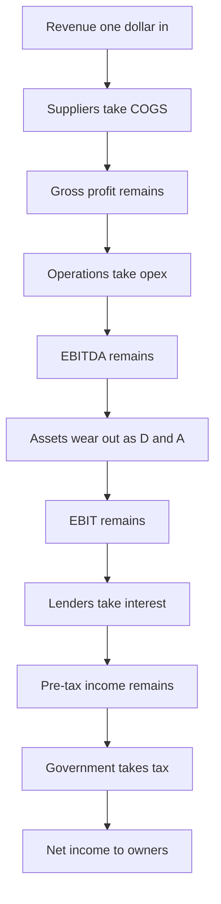
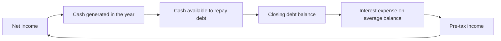
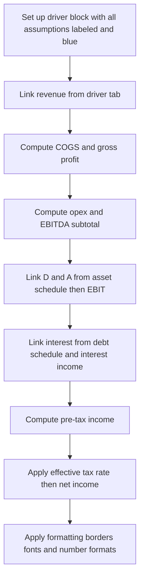
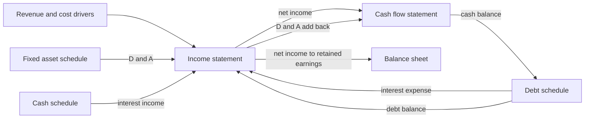

<!-- v2-deep -->

# Chapter 10 — Building the Projected Income Statement

## 1. The Problem

You have spent the last several chapters building the raw material of a forecast: revenue drivers (price times volume, or growth rates by segment), cost assumptions, headcount plans, and the beginnings of a debt schedule. Right now these live as scattered assumptions on a page. They are opinions about the future. What they are *not* yet is a **statement** — a single, disciplined, top-to-bottom accounting of what the business will earn.

The problem this chapter solves is **assembly and arithmetic under accounting rules**. An income statement is not a free-form list of numbers you like. It is a strict waterfall: you start at revenue, and every line below it either *adds* value the business created or *subtracts* a cost of creating that value, in a fixed order, until you arrive at the single number owners actually care about — **net income**. Get the order wrong, put an operating cost below the operating-income line, or tax the wrong base, and every downstream number — earnings per share, retained earnings, the cash flow statement, the valuation — inherits the error.

There is a second, subtler problem. The income statement cannot be built in isolation. Two of its most important lines are **not yours to invent**:

- **Interest expense** depends on how much debt the company carries, which depends on how much cash it generates, which depends on... net income. This is the famous circularity of the three-statement model.
- **Taxes** depend on pre-tax income, which depends on interest, which depends on debt.

So the income statement is simultaneously the *first* statement you build (everything flows from revenue) and a statement that *reaches back* into schedules you build later. Learning to lay it out so those links are clean — and so the circularity is contained rather than chaotic — is the real skill.

By the end of this chapter you will be able to take a driver block and construct a fully-linked projected income statement in Excel, from revenue down to net income, with EBITDA and EBIT as explicit subtotals, interest wired to a debt schedule, and taxes computed on the correct base — formatted the way a real analyst would hand it to a managing director.

**A concrete failure to keep in mind.** Imagine you accidentally place a recurring $30m rent line *below* EBIT instead of inside SG&A. Your EBIT rises by $30m, your EBIT margin looks 3 points better than reality, your EV/EBIT multiple in the comps looks artificially cheap, and a DCF that starts from EBIT × (1 − tax) overstates unlevered free cash flow by roughly $22m every single forecast year. One misplaced row, and the valuation is wrong by tens of millions. That is why the *structure* — not just the numbers — is the deliverable.

## 2. The Core Idea (analogy)

Think of the income statement as a **series of sieves stacked in a funnel**.

You pour a year's worth of revenue in at the top. Each sieve below catches a specific category of cost and lets the rest fall through. The first sieve catches the direct cost of making the product (COGS). What falls through is **gross profit**. The next sieve catches the cost of running the business — salaries, marketing, rent (operating expenses). What falls through is **operating profit (EBIT)**. Further down, a sieve catches the cost of borrowing money (interest). What falls through is **pre-tax income**. The last sieve catches the government's share (tax). What finally drips out of the bottom of the funnel is **net income** — the profit that belongs to shareholders.

The power of the analogy is the **fixed order and the "you can only catch it once" rule**. Each cost belongs to exactly one sieve. Rent is an operating cost — it goes in the operating sieve, never the interest sieve. A one-time legal settlement is not part of core operations — it belongs in a special "non-operating" sieve *below* EBIT, so that your EBIT still reflects the true earning power of the business. The reason analysts obsess over *where* a cost sits is that each subtotal — gross profit, EBITDA, EBIT, pre-tax income — is a **lens** used by a different audience. Misplace a cost and you distort the lens.

The projected income statement is the same funnel, but instead of pouring in *actual* revenue you pour in **forecast** revenue, and each sieve's size is set by an **assumption** (a margin, a growth rate, a percent-of-sales ratio) rather than a recorded transaction.

Here is the funnel drawn as the flow of a single dollar of revenue being claimed, layer by layer, until only the owners' residual remains:



*Figure 1 — The revenue dollar as a funnel of stakeholder claims, each subtotal a checkpoint before the next claimant.*

## 3. Why It Works

Why does this rigid waterfall structure earn its place as the first of the three statements? Three reasons.

**First, it mirrors economic reality in the order value is created and consumed.** A business first generates sales. Then it consumes resources to do so — first the direct ones (materials, direct labor), then the indirect ones (overhead, admin), then the financial ones (interest on borrowed capital), then the sovereign one (tax). Reading top to bottom is reading the life of a dollar of revenue as it gets progressively claimed by different stakeholders: suppliers, employees, lenders, the state, and finally owners.

**Second, the subtotals isolate different questions.** This is the whole reason we bother computing intermediate lines rather than one giant subtraction:

- **Gross profit** answers: *is the product itself economically viable?*
- **EBITDA** answers: *how much cash-like operating earnings does the core business throw off, before financing and accounting choices?* It strips out interest (a financing choice), taxes (a jurisdiction/structure choice), and depreciation/amortization (a non-cash allocation of past capital spending). That makes it the cleanest cross-company comparison and the workhorse of valuation multiples.
- **EBIT (operating income)** answers: *how profitable are operations after the real economic cost of using up long-lived assets?* Unlike EBITDA it respects depreciation, so it is a fairer measure of a capital-intensive business.
- **Pre-tax income** answers: *what's left for owners and the taxman after lenders are paid?*
- **Net income** answers: *what actually accrues to shareholders?*

**Third, it forecasts cleanly because most lines behave as a stable relationship to something above them.** COGS tends to be a percent of revenue. SG&A grows with revenue or with headcount. This means you can project the entire statement from a *small* number of assumptions, and — critically — you can sanity-check each one against history and against peers. The waterfall is not just presentation; it is the scaffold that makes a defensible forecast possible with a handful of judgments rather than hundreds.

**Why each subtotal has a distinct "owner."** It helps to remember *who reaches for which lens*:

| Subtotal | Primary audience | The question they are asking |
|---|---|---|
| Gross profit | Product / pricing managers | Does the unit economics of the product work at all |
| EBITDA | Credit analysts, PE buyers, comps | How much cash-like earning power exists before capital structure |
| EBIT | Operators, DCF modelers | Are operations profitable after real asset consumption |
| Pre-tax income | Tax and treasury | What base does the government tax |
| Net income | Equity holders, EPS | What is the residual for owners |

Because the audiences are different, the *placement rule* is not pedantry — it is what keeps each audience's number honest. A credit analyst leaning on EBITDA is implicitly trusting that you did not sneak a financing cost above the EBITDA line.

## 4. Full Technical Content

This is the build. We will construct the projected income statement top to bottom, giving the exact formula for each line, the Excel mechanics, and the formatting conventions. Assume a standard model layout: **historical actuals in the left columns, forecast years to the right**, with an **assumptions/driver block** sitting either above the statement or on a dedicated tab.

### 4.1 The overall skeleton

Here is the canonical structure, top to bottom:

| Line | Label | How it is computed |
|---|---|---|
| 1 | Revenue | From the revenue driver block |
| 2 | Cost of goods sold (COGS) | Driver: % of revenue, or unit cost × volume |
| 3 | **Gross profit** | Revenue − COGS *(subtotal)* |
| 4 | SG&A / Operating expenses | Driver: % of revenue or growth |
| 5 | Other operating expenses (R&D, etc.) | Driver-based |
| 6 | **EBITDA** | Gross profit − operating opex *(subtotal)* |
| 7 | Depreciation & amortization | From the fixed-asset / D&A schedule |
| 8 | **EBIT (operating income)** | EBITDA − D&A *(subtotal)* |
| 9 | Interest expense | From the debt schedule |
| 10 | Interest income | From the cash schedule |
| 11 | Other non-operating items | Driver / one-time assumptions |
| 12 | **Pre-tax income (EBT)** | EBIT − net interest ± non-operating *(subtotal)* |
| 13 | Income tax expense | EBT × effective tax rate |
| 14 | **Net income** | EBT − tax *(the bottom line)* |

Everything below is the detail for each block. To make the Excel references concrete, assume this fixed row map on the statement sheet (`IS`) and driver rows on the same sheet — the worked examples in §5 use exactly these rows:

| Row | Content | Row | Content |
|---|---|---|---|
| 4 | Driver: COGS % | 12 | Gross profit |
| 5 | Driver: SG&A % | 13 | SG&A |
| 6 | Driver: tax rate | 14 | (other opex, if any) |
| 10 | Revenue | 15 | EBITDA |
| 11 | COGS | 16 | D&A |
| — | — | 17 | EBIT |
| — | — | 18 | Interest expense |
| — | — | 19 | Interest income |
| — | — | 20 | Other non-operating |
| — | — | 21 | Pre-tax income (EBT) |
| — | — | 22 | Income tax |
| — | — | 24 | Net income |

Column `D` is the first forecast year; `E`, `F` are subsequent years. Every formula shown for column `D` is copied *unchanged* across `E:F`.

### 4.2 Revenue — the anchor line

Revenue is the single most important input and is built in its own driver block (covered in the revenue chapter). On the income statement itself, the revenue line is usually a **link**, not a calculation:

```
D10 = Revenue_Drivers!D25          ' pull total revenue from the driver tab
```

If the driver block is on the same sheet above the statement, it is a simple cell reference. The golden rule: **the income statement should mostly contain links and light arithmetic, not heavy driver logic.** Keep the "why" (the assumptions) separate from the "what" (the statement).

**A segment-build worked micro-example.** Suppose revenue is two segments: Segment A of 600 growing 15%, Segment B of 400 growing 5%. On the driver tab:

```
Segment A Y1 = 600 * (1 + 0.15) = 690.0
Segment B Y1 = 400 * (1 + 0.05) = 420.0
Total revenue Y1 = 690.0 + 420.0 = 1,110.0
```

The blended growth is 1,110 / 1,000 − 1 = **11.0%**, even though neither segment grows at 11%. This is *mix shift*: the faster-growing segment pulls the blended rate above the simple midpoint of 10%. If you forecast total revenue with a single 10% growth assumption you would understate Year 1 by 10.0, and the error compounds every year. This is exactly why a segment build lives on its own tab and only the *total* links to `D10`.

### 4.3 COGS and gross profit

COGS is typically forecast as a **percentage of revenue**, because in most businesses direct costs scale with sales:

```
COGS %  (assumption, e.g. 60%)      → cell in driver block, say D4
COGS    = Revenue × COGS%
D11 = D10 * D$4
```

Note the **negative sign convention decision** you must make up front and keep consistent for the whole model. Two schools:

1. **Costs entered as positives, subtracted in subtotals.** Gross profit `= Revenue − COGS`. Cleaner to read; most common in banking.
2. **Costs entered as negatives, subtotals are sums.** Gross profit `= SUM(Revenue:COGS)`. Fewer sign errors in long stacks.

Pick one. This chapter uses **school 1 (costs positive)** because it reads like a printed financial statement. So:

```
Gross profit
D12 = D10 - D11
```

Format the subtotal row with a **single top border** to signal "this is a total of the lines above."

**Why COGS-as-a-percent is a *decision*, not a default.** Percent-of-revenue implicitly assumes 100% variable cost. Real COGS usually has a fixed component (a factory's depreciation, a minimum staffing level). If a business has meaningful fixed costs in COGS, holding COGS flat as a percent will *understate* gross margin when revenue grows (fixed costs should dilute) and *overstate* it when revenue falls. A more faithful build splits COGS into a variable piece (`% of revenue`) and a fixed piece (`prior year × inflation`). For a first-pass model the single percent is fine — but know what you are assuming.

### 4.4 Operating expenses and EBITDA

Operating expenses (SG&A, R&D, marketing) are forecast by whichever driver fits:

- **% of revenue** for costs that scale with the business (sales commissions, distribution).
- **Growth rate off prior year** for semi-fixed costs (corporate overhead) — `= PriorYear × (1 + growth%)`.
- **Headcount × cost per head** for people-heavy lines, linked to a staffing schedule.

```
SG&A % (assumption)  → D5
SG&A
D13 = D10 * D$5                     ' % of revenue method
```

Then EBITDA:

```
EBITDA
D15 = D12 - D13 - D14               ' gross profit less each operating opex line
```

**Critical build rule: EBITDA sits ABOVE depreciation and amortization.** By definition EBITDA excludes D&A. A classic beginner error is to compute EBITDA after subtracting depreciation — that's just EBIT. Lay the statement out so D&A physically appears on the row *between* EBITDA and EBIT, and make sure no D&A is buried inside COGS or SG&A. (In published GAAP statements, depreciation often *is* embedded in COGS/SG&A. For a model you usually **pull it out** and show it on its own line so EBITDA and EBIT are both explicit and clean. If you leave D&A inside COGS, you must add it back to get a true EBITDA.)

**The two ways to drive a semi-fixed cost — worked side by side.** Take corporate overhead of 250 in Year 0, revenue of 2,000 growing 8%.

| Method | Year 1 | Year 2 | Year 3 | Effect on margin as revenue grows |
|---|---|---|---|---|
| % of revenue (12.5%) | 270.0 | 291.6 | 315.0 | Margin unchanged — cost scales 1-for-1 |
| Growth 5% off prior | 262.5 | 275.6 | 289.4 | Margin *improves* — cost grows slower than sales |

Year 1: 2,000 × 1.08 = 2,160; 12.5% × 2,160 = 270.0 versus 250 × 1.05 = 262.5. The 7.5 difference *is* operating leverage, and it flows straight to EBIT and net income. Choosing the wrong method silently invents or destroys margin expansion. Whenever a forecast shows margins moving, you must be able to point at *which cost line* and *which method* is doing it.

### 4.5 D&A and EBIT

Depreciation and amortization come from the **fixed-asset schedule** (built in its own chapter). On the income statement, D&A is a **link**:

```
D&A
D16 = PPE_Schedule!D40             ' total depreciation + amortization for the year
```

Then EBIT, also called operating income:

```
EBIT (operating income)
D17 = D15 - D16
```

EBIT is the boundary line of the statement: **everything above it is operating; everything below it is financing, non-operating, and tax.** Guard this boundary jealously — it is what makes EBIT and EBITDA meaningful.

### 4.6 Interest expense — linked to the debt schedule

This is where the income statement stops being a solo instrument. Interest expense is **not an assumption on the income statement**; it is an *output of the debt schedule*, pulled in as a link.

The debt schedule (its own chapter) computes, for each tranche of debt, interest as:

```
Interest = Interest rate × average balance
Average balance = (Opening debt + Closing debt) / 2
```

Using the average of opening and closing balances is best practice because debt is paid down (or drawn) *during* the year, so the balance that actually accrues interest is roughly the average, not the year-end figure. **Worked:** opening debt 500, a 50 mandatory repayment brings closing to 450, so the average is (500 + 450) / 2 = 475, and at a 5% rate interest = 0.05 × 475 = **23.75**. Contrast the naive approaches: on opening balance you'd book 25.0 (overstated); on closing balance 22.5 (understated). The average splits the difference and matches the economics of a repayment made mid-year.

On the income statement:

```
Interest expense
D18 = Debt_Schedule!D30            ' total interest across all debt tranches, positive
```

**The circularity warning.** Interest depends on the debt balance → the debt balance depends on how much cash is available to repay debt → available cash depends on net income → net income depends on interest. This loop is *why* three-statement models often need **iterative calculation enabled** (File → Options → Formulas → Enable iterative calculation, typically 100 iterations, max change 0.001). Many modelers instead break the loop with a **circularity switch** — a cell that, when set to 0, forces interest to a hardcoded value so the model can be reset if it "blows up" into `#REF!`/`#VALUE!` spirals. We treat this fully in the debt and circularity chapter; for now, know that the *link itself* (`= Debt_Schedule!...`) is what creates the loop, and it is intentional.

If you are building the income statement **before** the debt schedule exists, place a temporary hardcode or a simple `rate × prior-year debt` calculation as a placeholder, clearly flagged (blue font or a comment), and replace it with the live link once the debt schedule is built.

Here is the loop drawn explicitly, so you can see why it is a *ring* and not a line:



*Figure 2 — The interest circularity as a closed ring. Break it at any single arrow with a switch and the model becomes solvable in one pass.*

### 4.7 Interest income and other non-operating items

**Interest income** on the company's cash balance is the mirror of interest expense, pulled from the cash/revolver schedule:

```
Interest income
D19 = Cash_Schedule!D30            ' rate × average cash balance, a positive
```

**Net interest** is often shown as a single line (interest expense net of interest income) or as two lines. Two lines is more transparent.

**Other non-operating items** — gains/losses on asset sales, FX effects, equity-method income, one-time legal settlements — go **below EBIT** precisely because they are not part of recurring operations. For a forecast, most one-time items are assumed to be **zero in future years** (you don't forecast next year's lawsuit), while structural items (equity-method income from a stake in another company) get their own small driver. The discipline: *if it isn't part of the repeatable operating engine, it lives below EBIT so it doesn't contaminate your operating margins.*

### 4.8 Pre-tax income (EBT)

Sum EBIT with net interest and non-operating items:

```
Pre-tax income (EBT)
' with school-1 signs and interest expense stored positive:
D21 = D17 - D18 + D19 + D20         ' EBIT − interest expense + interest income ± other
```

(Here D18 is interest expense stored as a positive cost, so we subtract it; D19 is interest income, a positive, so we add it.) This is the **tax base**.

### 4.9 Income tax expense — the effective rate

Taxes are forecast by applying an **effective tax rate** to pre-tax income:

```
Effective tax rate (assumption, e.g. 25%)  → D6
Income tax expense
D22 = D21 * D$6
```

Why the *effective* rate rather than the statutory rate? Because the rate a company actually pays differs from the headline statutory rate due to permanent differences, tax credits, foreign-rate mixing, and the like. Best practice for a forecast is to use the company's **recent historical effective rate** (tax expense ÷ pre-tax income over the last 2–3 years), possibly nudged toward the statutory rate if you expect the special items to fade. Compute it from actuals:

```
Historical effective rate = Historical tax expense / Historical pre-tax income
```

**Edge case — losses and NOLs.** If pre-tax income is negative, `EBT × rate` produces a negative tax expense (a tax *benefit*). In a simple model you often let this flow through (it implies a tax loss carryforward reduces future tax). In a rigorous model you'd model **net operating loss (NOL) carryforwards** — no benefit today, but a shield against future taxable income. For a first build, applying the flat rate is an acceptable simplification; flag it. Also consider wrapping tax in `=MAX(0, EBT) * rate` if you want to prevent a benefit — but be aware that suppresses the NOL logic entirely, so document the choice. Example E below works the NOL mechanics in full so you can see how much the two approaches diverge.

### 4.10 Net income — the bottom line

```
Net income
D24 = D21 - D22
```

Net income is the **terminus of the income statement and the origin of the other two statements**: it is the top line of the cash flow statement (indirect method) and it feeds retained earnings on the balance sheet (`Retained earnings closing = opening + net income − dividends`). Format it with a **double bottom border** — the universal accounting signal for "final total."

### 4.11 Formatting — the professional layer

Formatting is not cosmetic; in a model it *encodes meaning* so a reviewer can read the logic at a glance. The conventions:

- **Font color = source of the number.** Blue for hardcoded inputs/assumptions; black for formulas/calculations; green for links pulling from *another sheet*. This lets anyone instantly see what is an assumption vs. a calculation. This is the single most important modeling habit.
- **Number format:** `#,##0;(#,##0)` — thousands separators, negatives in parentheses, no decimals for large currency figures. Percentages to 1 decimal.
- **Subtotal rows:** single top border. **Final total (net income):** top border + double bottom border.
- **Units label** at the top: "$ in millions" or "$ in thousands." State it once, honor it everywhere.
- **Column consistency:** every year column uses the *identical* formula, copied across. If year 2's formula differs structurally from year 1's, that's a red flag — spot it by selecting the row and checking the formula bar as you arrow across.
- **No hardcodes inside formulas.** A tax rate typed as `*0.25` inside the tax formula is invisible and unauditable. Every assumption gets its own labeled cell. The only numbers allowed inside a formula are structural (like the `2` in an averaging formula, or `1` in `1+growth`).
- **Sign discipline:** whatever convention you chose (costs positive or negative), apply it to 100% of lines.

### 4.12 The build sequence in Excel

The practical order of operations when you sit down to build it:



*Figure 3 — The recommended top-to-bottom build sequence for the projected income statement in Excel.*

## 5. Worked Examples

### Example A — Full statement build, single year

**Assumptions (driver block):**

| Assumption | Value |
|---|---|
| Revenue (from driver tab) | 1,000.0 |
| COGS % of revenue | 60% |
| SG&A % of revenue | 18% |
| D&A (from asset schedule) | 40.0 |
| Interest expense (from debt schedule) | 25.0 |
| Interest income (from cash schedule) | 3.0 |
| Effective tax rate | 25% |

**Build, line by line, with the exact cell formula:**

| Line | Cell | Formula | Result |
|---|---|---|---|
| Revenue | D10 | `=Drivers!D25` | 1,000.0 |
| COGS | D11 | `=D10*D$4` | 600.0 |
| **Gross profit** | D12 | `=D10-D11` | **400.0** |
| SG&A | D13 | `=D10*D$5` | 180.0 |
| **EBITDA** | D15 | `=D12-D13` | **220.0** |
| D&A | D16 | `=PPE!D40` | 40.0 |
| **EBIT** | D17 | `=D15-D16` | **180.0** |
| Interest expense | D18 | `=Debt!D30` | 25.0 |
| Interest income | D19 | `=Cash!D30` | 3.0 |
| **Pre-tax income** | D21 | `=D17-D18+D19` | **158.0** |
| Income tax | D22 | `=D21*D$6` | 39.5 |
| **Net income** | D24 | `=D21-D22` | **118.5** |

**Self-check via margins:** Gross margin = 400/1,000 = **40.0%**. EBITDA margin = 220/1,000 = **22.0%**. EBIT margin = 180/1,000 = **18.0%**. Net margin = 118.5/1,000 = **11.85%**. These are internally consistent and reasonable — margins decline monotonically down the statement, as they must, since each line only subtracts. If any margin *rose* going down, you'd have a sign error.

### Example B — Three-year projection from growth and margin assumptions

Start from Year 0 revenue of 1,000, growing 10% per year. Hold COGS at 60% of revenue, SG&A at 18%, D&A growing with the asset base (44, 48, 52), interest declining as debt is repaid (25, 22, 19), interest income (3, 3, 4), tax rate 25%.

| Line | Year 1 | Year 2 | Year 3 |
|---|---|---|---|
| Revenue | 1,100.0 | 1,210.0 | 1,331.0 |
| COGS (60%) | 660.0 | 726.0 | 798.6 |
| **Gross profit** | **440.0** | **484.0** | **532.4** |
| SG&A (18%) | 198.0 | 217.8 | 239.6 |
| **EBITDA** | **242.0** | **266.2** | **292.8** |
| D&A | 44.0 | 48.0 | 52.0 |
| **EBIT** | **198.0** | **218.2** | **240.8** |
| Interest expense | 25.0 | 22.0 | 19.0 |
| Interest income | 3.0 | 3.0 | 4.0 |
| **Pre-tax income** | **176.0** | **199.2** | **225.8** |
| Income tax (25%) | 44.0 | 49.8 | 56.5 |
| **Net income** | **132.0** | **149.4** | **169.4** |

**Self-check:** Revenue grows 10% each year: 1,000 → 1,100 → 1,210 → 1,331 ✓ (1,000 × 1.1³ = 1,331). Net income grows *faster* than revenue (132 → 149.4 is +13.2%, vs revenue +10%) because interest expense is falling — financial deleveraging boosts the bottom line even as operations grow at a steady rate. This is exactly the kind of insight the waterfall structure surfaces: **operating growth is 10%, but equity-holder growth is 13% because lenders are being paid off.** Year 2 EBITDA margin = 266.2/1,210 = 22.0%, identical to Year 1's 242/1,100 = 22.0% ✓ — margins are flat because we held the ratios flat, confirming the formulas copied across correctly.

### Example C — Effective tax rate from history

Suppose historicals show:

| | Year −2 | Year −1 |
|---|---|---|
| Pre-tax income | 140.0 | 152.0 |
| Tax expense | 32.2 | 38.0 |
| Implied effective rate | 23.0% | 25.0% |

The two-year average effective rate is (23.0% + 25.0%)/2 = **24.0%**. If the statutory rate is 25% and you expect the special items that lowered Year −2's rate to persist, you might forecast **24%**. If you expect them to fade, forecast toward 25%. This is the judgment behind the single tax-rate assumption cell — and why it must be a visible, blue, labeled input rather than a number buried in a formula.

### Example D — "What if" sensitivity, and why after-tax deltas reconcile

Take Example A's base case (net income 118.5) and flex one driver at a time. The elegance of the waterfall is that each single-driver shock has a *clean, predictable* after-tax footprint — which is also how you audit that your formulas are truly linked.

| Scenario | Change | Pre-tax effect | After-tax effect (× 0.75) | New net income |
|---|---|---|---|---|
| Base | — | — | — | 118.5 |
| COGS 60% → 62% | +20 cost | −20.0 | −15.0 | 103.5 |
| SG&A 18% → 17% | −10 cost | +10.0 | +7.5 | 126.0 |
| Interest 25 → 35 | +10 cost | −10.0 | −7.5 | 111.0 |
| Revenue 1,000 → 1,050 at same margins | +50 sales | +11.0* | +8.25 | 126.75 |

*The revenue case is not a flat pass-through: an extra 50 of revenue drags 60% COGS (30) and 18% SG&A (9) with it, so pre-tax rises by 50 × (1 − 0.60 − 0.18) = 50 × 0.22 = **11.0**, i.e. the incremental EBITDA margin. After tax that is 11.0 × 0.75 = 8.25.

**The reconciliation rule to memorize:** any change that lands *below* the gross-profit line but *above* tax moves net income by `Δpre-tax × (1 − tax rate)`. A +20 COGS shock is −20 pre-tax → −15 after tax, and indeed 118.5 − 15.0 = 103.5 ✓. If your model does *not* move by exactly the after-tax amount when you flex one input, a link is broken or a hardcode is lurking. This is the single fastest integrity test on a finished income statement.

### Example E — NOL carryforward vs. flat-rate tax, side by side

A company has a loss year then recovers. Pre-tax income: Year 1 = −100, Year 2 = +60, Year 3 = +80. Tax rate 25%. Compare the two treatments.

**Flat-rate (simple) treatment — let the rate flow through even on losses:**

| | Year 1 | Year 2 | Year 3 |
|---|---|---|---|
| Pre-tax income | (100.0) | 60.0 | 80.0 |
| Tax at 25% | (25.0) | 15.0 | 20.0 |
| Net income | (75.0) | 45.0 | 60.0 |

**NOL-carryforward (rigorous) treatment — no benefit in the loss year, shield future income:**

| | Year 1 | Year 2 | Year 3 |
|---|---|---|---|
| Pre-tax income | (100.0) | 60.0 | 80.0 |
| NOL used this year | 0.0 | 60.0 | 40.0 |
| Taxable income | 0.0 | 0.0 | 40.0 |
| Cash tax at 25% | 0.0 | 0.0 | 10.0 |
| Net income | (100.0) | 60.0 | 70.0 |
| NOL balance carried forward | 100.0 | 40.0 | 0.0 |

Walkthrough of the NOL version: Year 1's 100 loss creates a 100 NOL and books *zero* tax (no benefit taken). Year 2's 60 profit is fully sheltered by the NOL, so tax is 0 and 40 of NOL remains. Year 3's 80 profit is sheltered by the remaining 40, leaving 40 taxable → 10 tax. The Year 3 *effective* rate is 10/80 = **12.5%**, well below the 25% statutory rate — that dip is the NOL doing its job.

The two methods disagree by a lot: cumulative net income is (75 + 45 + 60) = 30 under flat-rate versus (−100 + 60 + 70) = 30 as well — the *totals* match here because the flat-rate benefit is exactly the NOL shield spread differently — but the *timing* and the year-by-year net income differ materially, which matters for every valuation that discounts by year. For a first build, flat-rate is acceptable *if flagged*; for a leveraged or cyclical company where losses are plausible, model the NOL.

### Example F — EBITDA add-back when D&A is buried in COGS

You pull historicals where the company reports COGS of 640 that *includes* 40 of depreciation, and does not break D&A out. Revenue 1,000, SG&A 180. If you naively treat reported COGS as your clean COGS and *also* add a separate 40 D&A line, you double-count depreciation. The fix is to reclassify:

| | Reported (D&A buried) | Model (D&A pulled out) |
|---|---|---|
| Revenue | 1,000.0 | 1,000.0 |
| COGS | 640.0 | 600.0 |
| Gross profit | 360.0 | 400.0 |
| SG&A | 180.0 | 180.0 |
| EBITDA | — (not shown) | 220.0 |
| D&A | (inside COGS) | 40.0 |
| EBIT | 180.0 | 180.0 |

Note **EBIT is identical (180) either way** — reclassification never changes EBIT, because it only moves the 40 from one line to another *above* EBIT. But EBITDA only exists cleanly in the right-hand version: 220 = 180 EBIT + 40 D&A. The lesson: to get a true EBITDA you must know how much D&A is hiding inside COGS and SG&A, and add it back. If you cannot find it, your EBITDA is not trustworthy — which is precisely the criticism levelled at EBITDA as a metric.

## 6. Connections

The projected income statement is the **hub from which the other two statements radiate**. Nothing in a three-statement model stands alone, and the income statement's links run in both directions.



*Figure 4 — The income statement's inbound links from schedules and its outbound links to the cash flow statement and balance sheet, closing the circular loop.*

The key linkages to internalize:

- **Net income → cash flow statement.** Under the indirect method, net income is the *starting line* of the cash flow statement. Every non-cash item (D&A, working-capital changes) is then adjusted off it.
- **Net income → retained earnings on the balance sheet.** `RE closing = RE opening + Net income − Dividends`. This is the thread that keeps the balance sheet balancing.
- **D&A → cash flow add-back.** The D&A you subtracted on the income statement (a non-cash expense) is added back on the cash flow statement — so the *same number* touches two statements with opposite signs. A mismatch here is a common balancing bug.
- **Interest expense ← debt schedule, and the loop back.** Interest flows *in* from the debt schedule, but the debt schedule's balance depends on cash generated, which depends on net income. This is the circular reference the whole model is built around.
- **EBIT and EBITDA → valuation.** In the DCF chapter, unlevered free cash flow starts from EBIT (× (1 − tax) to get NOPAT). In comparable-companies analysis, EV/EBITDA is the headline multiple. The subtotals you carefully isolated here become the primary inputs to valuation.

**Interview angles you should be able to answer cold.** These come up constantly on modeling and IB interviews, and every one is answered by the structure in this chapter:

- *"Walk me through the income statement from revenue to net income."* Recite the waterfall in §4.1, naming each subtotal and the one-line question it answers.
- *"If depreciation goes up by 10, walk me through all three statements."* IS: EBIT down 10, pre-tax down 10, tax down 2.5 (at 25%), net income down 7.5. CFS: net income down 7.5 but D&A add-back up 10, so cash *up* 2.5 — the tax shield of non-cash depreciation. BS: PP&E down 10, cash up 2.5, retained earnings down 7.5; assets fall 7.5 and equity falls 7.5, so it balances.
- *"Why do we use EBITDA?"* Neutralizes financing (interest), tax jurisdiction, and non-cash D&A, so it compares operating engines across companies with different capital structures — but it ignores real capex needs, which is its weakness.
- *"What's the tax base — EBIT or EBT?"* Always EBT; taxing EBIT would ignore the interest tax shield.
- *"Where does a one-time restructuring charge go?"* Below EBIT as a non-operating item, and forecast at zero in future years, so operating margins stay clean.

## 7. Traps and Common Errors

**Trap 1 — Depreciation double-counted or misplaced.** If D&A is embedded in the COGS you pulled from historicals *and* you also show it on its own line, you subtract it twice. Decide once: either pull D&A *out* of COGS/SG&A (cleaner, recommended — see Example F) or leave it in and don't show a separate line. Never both.

**Trap 2 — EBITDA computed after D&A.** By definition EBITDA is *before* D&A. If your "EBITDA" row sits below the depreciation line, you've actually computed EBIT and mislabeled it. Check: EBITDA − D&A should equal EBIT, and EBITDA should always be ≥ EBIT.

**Trap 3 — Operating costs living below EBIT (or non-operating items above it).** Putting a recurring cost like rent below the EBIT line inflates operating margin; putting a one-time gain above it inflates it too. The EBIT boundary must contain *only* recurring operating items above it. Ask of every line: "is this part of the repeatable operating engine?"

**Trap 4 — Taxing the wrong base.** Tax is `Pre-tax income × rate`, not `EBIT × rate` and not `Net income × rate`. Applying the rate to EBIT ignores the interest tax shield and overstates tax. Applying it to net income is circular nonsense. Always tax **EBT**.

**Trap 5 — Interest hardcoded instead of linked.** If interest is a typed number rather than a link to the debt schedule, your model won't respond when debt assumptions change, and the interest tax shield will be wrong. Link it — and accept the resulting circularity, managed with iterative calc and a circ-breaker switch.

**Trap 6 — Sign convention drift.** Mixing "costs positive" and "costs negative" within one statement produces a subtotal that adds a cost instead of subtracting it. Pick one convention and audit every row against it. A quick check: no subtotal should ever be *larger* than the line above it (given only subtractions).

**Trap 7 — Hardcodes buried in formulas.** `=D21*0.25` hides the tax rate. Six months later nobody knows why tax is 25% or how to change it globally. Every assumption gets a labeled, blue cell; formulas reference the cell.

**Trap 8 — Formula inconsistency across columns.** Year 3's formula secretly differs from Year 2's (someone typed over a cell). Arrow across each row watching the formula bar, or use Excel's Formulas → Show Formulas view to eyeball the whole grid. Inconsistent formulas are the number-one source of silent model errors.

**Trap 9 — Effective rate applied to a loss without thinking.** A negative EBT × 25% yields a tax *benefit*. Sometimes correct (loss carryback), sometimes not (should be an NOL carryforward — see Example E). Decide deliberately and flag the assumption.

**Trap 10 — Margins that expand implausibly.** If your forecast shows EBIT margin climbing every year with no operating-leverage story, you've probably held a fixed cost as a *percent of revenue* (so it shrinks as revenue grows) when it should have been a slower growth rate, or vice versa. Always eyeball the margin trend and have a reason for it.

**Trap 11 — Relative vs. absolute references dropped.** When you copy `=D10*D4` across, if the driver row was not anchored (`D$4`), Excel shifts it to `E5`, `F6` and your margins silently drift. Anchor the row of same-sheet drivers with `$` before pasting across, then spot-check the last column's formula.

**Trap 12 — Interest income and expense netted with the wrong sign.** Storing interest income as a negative (like a cost) or expense as a positive-that-you-add flips the EBT. Sanity test: EBT should be *below* EBIT for a company with net debt (interest expense > interest income). If EBT sits above EBIT, your net-interest sign is inverted.

## 8. First-Principles Recap

Strip away the Excel mechanics and the income statement is one idea: **revenue, minus the claims on it in economic order, equals what's left for owners.** 

- Direct costs are claimed first → **gross profit**.
- The cost of running operations is claimed next → **operating profit (EBIT)**, with **EBITDA** as the pre-depreciation view that isolates cash-like operating earnings.
- Lenders are claimed next through interest → **pre-tax income**.
- The government is claimed next through tax → **net income**.

Each subtotal exists because a different audience asks a different question, and each must contain *only* the costs that belong to its layer — that discipline is what makes the subtotals meaningful. Forecasting the statement means expressing each layer as a *relationship* (a margin, a rate, a growth) to something above it, so the whole waterfall follows from a handful of defensible assumptions. And because two layers — interest and tax — depend on numbers that only exist after the statement is (partly) built, the income statement is both the *first* statement and a statement that *closes a loop* with the schedules feeding it. Build it as mostly links and light arithmetic, keep every assumption visible and labeled, honor one sign convention, and let the subtotals tell their story.

## 9. Quick-Reference

**The waterfall (costs-positive convention):**

| Subtotal | Formula |
|---|---|
| Gross profit | Revenue − COGS |
| EBITDA | Gross profit − operating opex (excl. D&A) |
| EBIT | EBITDA − D&A |
| Pre-tax income (EBT) | EBIT − interest expense + interest income ± non-operating |
| Net income | EBT − (EBT × effective tax rate) |

**Key drivers and their usual method:**

| Line | Typical driver |
|---|---|
| Revenue | Price × volume, or growth %, or segment build |
| COGS | % of revenue (or unit cost × volume) |
| SG&A | % of revenue, growth %, or headcount × cost/head |
| D&A | Link from fixed-asset schedule |
| Interest expense | Link from debt schedule (rate × avg balance) |
| Interest income | Link from cash schedule (rate × avg cash) |
| Tax | EBT × effective rate (from historicals) |

**Formatting cheat sheet:**
- Blue = input, black = formula, green = link to another sheet.
- `#,##0;(#,##0)` number format; percentages to 1 decimal.
- Subtotal = single top border; net income = top + double bottom border.
- No hardcodes in formulas; every assumption in its own labeled cell.
- Identical formula copied across every forecast column; anchor same-sheet driver rows with `$`.

**Sanity checks:**
- EBITDA ≥ EBIT always (difference = D&A).
- Margins fall monotonically down the statement.
- Tax base = EBT (never EBIT, never net income).
- Interest is a *link*, not a hardcode; accept the circularity.
- Flex any single line above tax: net income moves by `Δpre-tax × (1 − tax rate)`. If not, a link is broken.
- Net income → cash flow statement top line *and* → retained earnings.

**Excel functions you'll actually use here:** direct cell links (`=Sheet!Cell`), `SUM` for subtotals, `MAX(0, …)` to floor tax at zero if desired, `AVERAGE` for average-balance interest, and iterative calculation enabled for the interest circularity.

## 10. Build-It-Yourself Exercise

Open Excel and build a three-year projected income statement from scratch. Do not copy Example B's numbers — use these fresh inputs so you have to reason, not pattern-match.

**Given:**
- Year 0 revenue: 2,000, growing 8% per year.
- COGS: 55% of revenue.
- SG&A: a *semi-fixed* cost of 250 in Year 0, growing 5% per year (note: NOT a percent of revenue — this is the operating-leverage twist).
- D&A: 80, 88, 95 for Years 1–3 (from a hypothetical asset schedule).
- Interest expense: 30, 27, 24 (debt being repaid).
- Interest income: 4, 5, 6.
- Effective tax rate: 26%.

**Your tasks:**
1. Lay out the driver block with every assumption in its own blue, labeled cell. State units at top.
2. Build the full waterfall for all three years using consistent, copied-across formulas. Show gross profit, EBITDA, EBIT, pre-tax income, and net income as explicitly formatted subtotals.
3. Add a small margin block below: gross margin, EBITDA margin, EBIT margin, net margin for each year.
4. **Observe and explain:** Because SG&A grows at only 5% while revenue grows at 8%, your EBIT margin should *expand* each year. Confirm it does, and write one sentence explaining why (operating leverage: a slower-growing cost base against faster-growing revenue lifts margins).
5. Apply full formatting: font-color coding, number formats, subtotal and total borders.

**Self-check targets** (compute independently, then verify): Year 1 revenue should be 2,160.0; Year 1 gross profit 972.0; Year 1 SG&A 262.5; Year 1 EBITDA 709.5; Year 1 EBIT 629.5; Year 1 pre-tax income 603.5; Year 1 net income 446.6 (603.5 × 0.74).

**Full three-year answer key** (build it yourself first, then check every cell):

| Line | Year 1 | Year 2 | Year 3 |
|---|---|---|---|
| Revenue | 2,160.0 | 2,332.8 | 2,519.4 |
| COGS (55%) | 1,188.0 | 1,283.0 | 1,385.7 |
| **Gross profit** | **972.0** | **1,049.8** | **1,133.7** |
| SG&A (5% growth) | 262.5 | 275.6 | 289.4 |
| **EBITDA** | **709.5** | **774.1** | **844.3** |
| D&A | 80.0 | 88.0 | 95.0 |
| **EBIT** | **629.5** | **686.1** | **749.3** |
| Interest expense | 30.0 | 27.0 | 24.0 |
| Interest income | 4.0 | 5.0 | 6.0 |
| **Pre-tax income** | **603.5** | **664.1** | **731.3** |
| Income tax (26%) | 156.9 | 172.7 | 190.1 |
| **Net income** | **446.6** | **491.5** | **541.2** |

| Margin | Year 1 | Year 2 | Year 3 |
|---|---|---|---|
| Gross margin | 45.0% | 45.0% | 45.0% |
| EBITDA margin | 32.8% | 33.2% | 33.5% |
| EBIT margin | 29.1% | 29.4% | 29.7% |
| Net margin | 20.7% | 21.1% | 21.5% |

Notice the EBIT margin climbing 29.1% → 29.4% → 29.7% while gross margin stays pinned at 45.0%. Gross margin is flat because COGS is a fixed *percent* of revenue; EBIT margin rises purely because SG&A grows slower (5%) than revenue (8%). That gap **is** operating leverage, and isolating it is the whole point of the exercise.

As a final test, change the SG&A growth assumption to 8% (matching revenue) and confirm the EBITDA margin now stays *flat* — proving your formulas are truly driven by the assumption cell and not hardcoded. (At 8% SG&A growth, Year 1 SG&A becomes 270.0, EBITDA 702.0, EBIT 622.0, and the EBITDA margin holds at 32.5% across all three years. EBIT margin sits at roughly 28.8% and drifts a hair to 28.7% only because D&A itself grows faster than 8% — a reminder that EBIT margin answers to *two* cost lines, not one.)

Then, and only then, wire the interest line to a real debt schedule (next chapters) and watch the circularity come alive.
