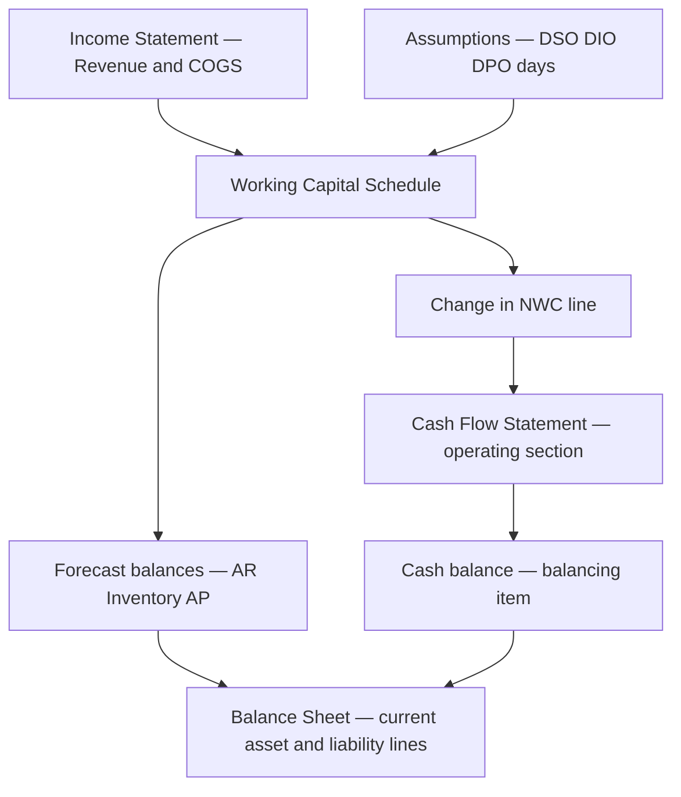
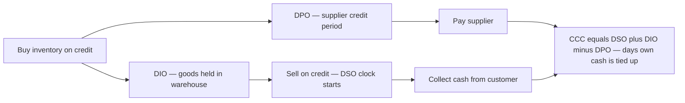
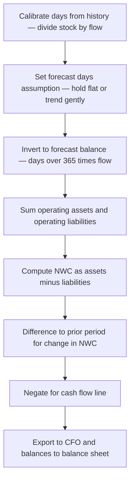
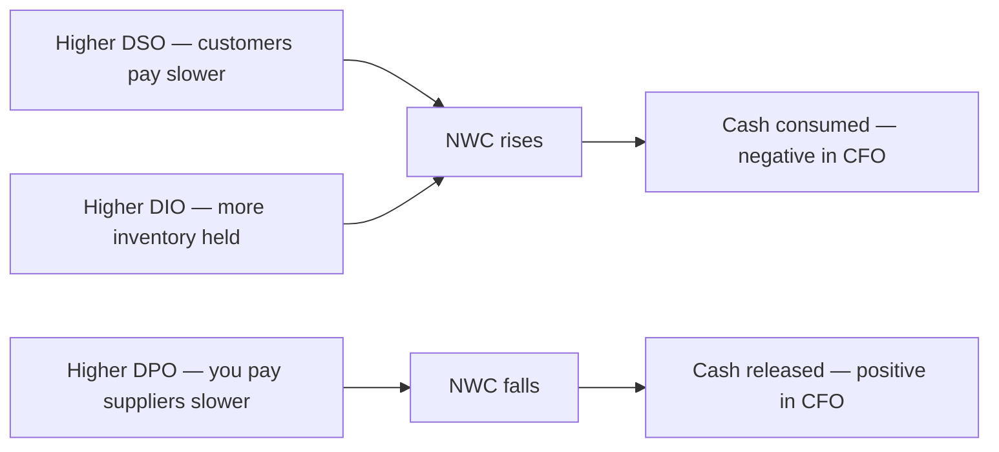

<!-- v2-deep -->

# Chapter 11 — The Working Capital Schedule

## 1. The Problem

You have built a revenue forecast, an operating cost forecast, and you can compute projected net income. A naive analyst stops there and says: "Net income is the cash the business generates." That statement is wrong, and the gap between it and reality has bankrupted profitable companies.

Consider a distributor that sells INR 100 of goods on 31 December on 60-day credit. The income statement records INR 100 of revenue and (say) INR 30 of profit on that day. But not a single rupee has arrived. The customer will pay in late February. Meanwhile the distributor already paid its supplier in November for the inventory it just shipped. So on 31 December the business is **more profitable and poorer at the same time**. Profit went up; cash went down.

This mismatch is not an accounting error. It is the fundamental timing difference between when a sale is *recognised* (accrual accounting) and when cash actually *moves*. That timing difference lives in three balance-sheet accounts:

- **Accounts receivable** — sales you have recorded but not yet collected (cash you are owed).
- **Inventory** — cash you have already spent on goods sitting in the warehouse, not yet sold.
- **Accounts payable** — purchases you have recorded but not yet paid (cash you still owe suppliers).

Together with a few smaller items, these form **net working capital**. Every time the business grows, these accounts swell — you carry more receivables, hold more inventory, and yes, stretch more payables. The *net* swelling of these accounts is cash that gets **trapped inside the operating cycle** and cannot be distributed to shareholders or used to service debt.

A three-statement model that ignores this will systematically overstate free cash flow, overstate the cash balance, and — because the balance sheet must balance — simply **fail to balance**. The working capital schedule is the machine that translates your P&L drivers into the exact balance-sheet accounts and the exact cash impact. Without it, your model is a profit fantasy, not a cash reality.

This chapter builds that machine from first principles.

**A concrete cautionary tale.** Imagine a firm that grows revenue 40% a year and earns a healthy 8% net margin. It is profitable every single year. Yet if its cash conversion cycle is 90 days, then roughly a quarter of every incremental rupee of sales gets locked into the operating pipe *before* the profit on those sales is collected. In a high-growth year the cash *consumed* by working capital can exceed the entire net profit, so the "profitable" company burns cash and either draws its revolver, raises equity, or dies. This is not hypothetical — it is the textbook mechanism behind the phrase "growing broke," and the working capital schedule is the only part of the model that makes it visible in advance.

## 2. The Core Idea (An Analogy)

Think of your business as a **bathtub with a pipe running through it**.

Cash flows in through the tap (customer collections) and out through the drain (supplier payments, wages). But between the tap and the drain, there is a long coiled pipe — the **operating cycle** — and that pipe holds a certain volume of water at all times. That trapped water is your working capital.

When business is steady, the pipe stays equally full: the same amount of water enters and leaves each day, and the level in the tub reflects true cash generation. But the moment you **grow**, the pipe has to hold *more* water — a longer queue of unpaid invoices, a bigger stack of inventory. Filling that larger pipe takes water *out of the tub*. Your profit says the tap is running hard, but your cash level barely rises because the growing pipe is drinking the difference.

Conversely, if you **shrink** the business or collect faster, the pipe drains back into the tub — releasing a one-time gush of cash that has nothing to do with profit.

The three levers control how much water the pipe holds:

- **DSO (Days Sales Outstanding)** — how long customers take to pay. Longer pipe on the collection side.
- **DIO (Days Inventory Outstanding)** — how long goods sit before selling. Longer pipe in the middle.
- **DPO (Days Payable Outstanding)** — how long *you* take to pay suppliers. This is the one lever that *shortens* your net pipe, because supplier credit funds part of it for free.

The working capital schedule is simply the instrument panel that measures how full the pipe is each period and reports how much water moved in or out of the tub as a result. **Profit fills the tub; changes in working capital decide how much of that profit you can actually keep as cash.**

**Pushing the analogy one notch further.** Two facts about the pipe matter enormously in modelling. First, it is the *change* in the water level, not the level itself, that hits your cash flow — a business with a permanently huge but *stable* pipe generates cash normally, because water enters and leaves at the same rate. Cash pain comes only from the pipe *filling further*. Second, the pipe fills in proportion to *flow*, not to profit: receivables scale with revenue, inventory and payables with cost of goods. That is why we drive the schedule off income-statement flows and *days* ratios, never off net income. Keep both facts in mind and the entire schedule becomes intuitive rather than a set of rules to memorise.

## 3. Why It Works

The logic rests on one accounting identity and one behavioural fact.

**The identity.** The cash flow statement's operating section starts with net income (an accrual number) and adds back non-cash items, then adjusts for every change in an operating balance-sheet account. Why? Because net income already assumed cash moved when the sale/expense was booked. To get back to *actual* cash, you reverse the accrual wherever cash and recognition diverged.

- Revenue of 100 booked, but receivables rose 100 → no cash came in → **subtract** the 100 increase in receivables.
- Inventory rose 40 → you spent 40 of cash the P&L hasn't expensed yet → **subtract** the 40.
- Payables rose 25 → you booked 25 of cost but haven't paid it → **add back** the 25.

So the rule crystallises:

> **An increase in an operating *asset* (receivables, inventory) is a use of cash → negative.
> An increase in an operating *liability* (payables, accrued expenses) is a source of cash → positive.**

Decreases flip the sign. This is not a convention to memorise — it *falls directly out of* the accrual-to-cash reconciliation. Cash you are owed but haven't got is not cash; cash you owe but haven't paid is cash you still hold.

**The behavioural fact.** These accounts don't move randomly. They scale with the volume of business, and the proportionality is captured by *days ratios*. If customers reliably pay in ~45 days, then receivables will always sit at roughly 45 days' worth of sales. Double the sales, and receivables double. This is why we forecast each account as **days × the relevant daily flow** rather than guessing an absolute number. The days ratio encodes the *policy and efficiency* of the business (credit terms, stocking strategy, supplier terms), which tends to be stable, while the daily flow encodes the *scale*, which grows. Separating the two is what makes the forecast both realistic and driver-based.

Because the schedule ties each balance to an income-statement line, it automatically keeps the balance sheet internally consistent as the model grows — and it hands the *change* in each balance to the cash flow statement, closing the loop.

**Why days ratios beat "percent of revenue."** You could, in principle, forecast receivables as a flat percent of revenue and get the same answer — because "days ÷ 365" *is* a percentage. The reason professionals speak in days rather than percentages is communication and calibration. "Customers pay in 45 days" is a fact a credit manager can confirm against the actual invoice terms; "receivables are 12.3% of revenue" is an abstraction nobody can validate against a contract. Days also travel across businesses of different sizes and let you benchmark against competitors and against stated payment terms (net-30, net-60). Same maths, far better sanity-checking.

**A subtle point on flows vs stocks.** Revenue and COGS are *flows* measured over a whole year; receivables, inventory and payables are *stocks* measured at a single instant (the balance-sheet date). The days ratio is the bridge between a flow and a stock: it says "this stock equals so many days' worth of that flow." When you build monthly or quarterly models, you must annualise the flow before applying a 365-day ratio (a monthly revenue figure times 12, or use 30/90-day ratios instead). Getting the flow period and the day-count period to agree is the most common source of silent errors in period-mismatched models.

## 4. Full Technical Content

### 4.1 The days ratios — precise definitions

Each ratio answers "how many days of flow is parked in this account?" The trick is pairing each balance-sheet account with the *correct* income-statement denominator.

| Ratio | Formula | Denominator to use | Why that denominator |
|---|---|---|---|
| **DSO** (Days Sales Outstanding) | (Accounts Receivable ÷ Revenue) × 365 | **Revenue** | Receivables are unpaid *sales*, valued at selling price. |
| **DIO** (Days Inventory Outstanding) | (Inventory ÷ COGS) × 365 | **COGS** | Inventory is carried at *cost*, so match it to cost of goods sold. |
| **DPO** (Days Payable Outstanding) | (Accounts Payable ÷ COGS) × 365 | **COGS** (or purchases) | Payables arise from buying goods, recorded at *cost*. |

Use 365 days consistently (or 360 if your house style demands it — just never mix). For inventory and payables, COGS is the standard practical denominator; the theoretically purer denominator for DPO is **purchases** (COGS + ending inventory − beginning inventory), which you should use if inventory swings are large.

**Historical calibration.** You do not invent the days figures. You compute them from the last 2-3 years of actuals, observe the trend, and then *hold them flat or trend them gently* into the forecast. That is the entire forecasting philosophy: history sets the ratio, the ratio drives the balance.

Excel, computing DSO from actuals in column C:

```
=IF(C_Revenue=0, 0, C_AccountsReceivable / C_Revenue * 365)
```

**Purchases-based DPO worked out.** Suppose beginning inventory is 900, ending inventory is 1,100, and COGS is 6,000. Then purchases = COGS + (ending − beginning) inventory = 6,000 + (1,100 − 900) = **6,200**. If payables are 740, the COGS-based DPO is 740 ÷ 6,000 × 365 = 45.0 days, whereas the purchases-based DPO is 740 ÷ 6,200 × 365 = **43.6 days**. The 1.4-day difference is immaterial here, but if the firm doubled its inventory in the year, purchases would diverge sharply from COGS and the COGS-based figure would overstate DPO. Rule of thumb: use COGS unless inventory moved more than ~15% year over year, then switch to purchases.

**The averaging choice, made precise.** Some analysts calibrate on the *average* balance rather than the ending balance:

```
DSO_average = ( (Opening AR + Closing AR) / 2 ) / Revenue * 365
```

Average balances smooth out a lumpy year-end (e.g. a big December shipment inflating closing receivables). This is fine and arguably better for *historical analysis*. But for a *forecast* the ending-balance convention is cleaner because each forecast balance links one-to-one to the projected balance sheet line for that date. Never calibrate on average and then forecast on ending, or vice versa — the inconsistency injects a one-period step change in cash flow.

### 4.2 Forecasting the balances — invert the ratio

In the forecast, you *assume* the days ratio and *solve for the balance*:

| Account | Forecast formula |
|---|---|
| Accounts Receivable | = **DSO ÷ 365 × Revenue** |
| Inventory | = **DIO ÷ 365 × COGS** |
| Accounts Payable | = **DPO ÷ 365 × COGS** |

Excel, for a forecast year in column D (assumption in row `DSO_assum`):

```
Accounts Receivable  =D_DSO_assum / 365 * D_Revenue
Inventory            =D_DIO_assum / 365 * D_COGS
Accounts Payable     =D_DPO_assum / 365 * D_COGS
```

Every projected balance now flexes automatically with revenue and COGS. Change a growth assumption and the whole working-capital block re-forecasts itself.

**Why inversion is exactly the reverse operation.** Calibration divides a stock by a flow to extract days; forecasting multiplies days by a flow to rebuild the stock. If you calibrate Year 0 DSO as 1,315 ÷ 10,000 × 365 = 48.0, then immediately invert it back on the *same* Year 0 revenue (48.0 ÷ 365 × 10,000), you must recover 1,315 to the rupee. Doing this round-trip check on a historical column is a two-second audit that catches denominator swaps and 360/365 mismatches instantly — if the inverted balance does not equal the actual balance, your two formulas disagree.

### 4.3 Other working-capital items

Real models include more than the big three. Handle the rest either by days-of-relevant-flow or, for small/unpredictable items, as a **percentage of revenue** or simply held flat:

| Item | Type | Common driver |
|---|---|---|
| Prepaid expenses | Operating asset | % of operating expenses |
| Other current assets | Operating asset | % of revenue |
| Accrued expenses / accrued liabilities | Operating liability | % of operating expenses or COGS |
| Deferred revenue / customer advances | Operating liability | % of revenue |
| Taxes payable | Operating liability | % of tax expense or held per schedule |

> **Exclude** cash, short-term debt, current portion of long-term debt, and dividends payable from the working-capital schedule. Cash is the *plug/output* of the whole model, and debt items are *financing*, not operating — they belong in their own schedules. Mixing them in double-counts cash and corrupts the CFO section.

**How to classify a doubtful item in three questions.** When you meet a current-account line you are unsure about, ask: (1) Does it arise from the day-to-day *operating* cycle (selling, buying, paying staff and suppliers)? If no — e.g. it is debt or a dividend — it is *financing/investing*, exclude it. (2) Is it *cash or a cash equivalent*? If yes, it is the model's plug, exclude it. (3) Does it scale with an income-statement flow? If yes, drive it off that flow with a days or percent ratio; if it is small and idiosyncratic, hold it flat. This three-question filter resolves nearly every classification doubt without needing a memorised list.

### 4.4 Net working capital and its change

**Net Working Capital (NWC)** as used in modelling (the *operating* NWC, cash and debt excluded):

```
NWC = Operating Current Assets − Operating Current Liabilities
    = (Receivables + Inventory + Prepaids + Other CA)
      − (Payables + Accrued Expenses + Deferred Revenue + Other CL)
```

The number that actually hits the cash flow statement is the **change**:

```
ΔNWC = NWC(this period) − NWC(prior period)
```

And the cash flow impact carries the **opposite sign**:

```
Cash flow from ΔNWC = − ΔNWC = −(NWC_t − NWC_{t-1})
```

An *increase* in NWC (assets growing faster than liabilities) is cash *consumed* → negative in CFO. A *decrease* releases cash → positive in CFO. This single line is what the schedule delivers upward to the statement of cash flows.

**Watch the textbook vs modelling definition.** An accounting textbook defines working capital as *all* current assets minus *all* current liabilities — including cash and short-term debt. That "total" working capital is a liquidity measure (it underlies the current ratio). The *modelling* NWC deliberately strips out cash and debt because those are handled elsewhere in the model. Both definitions are correct in their own context; using the textbook one in a cash flow forecast is a classic error because it drags the cash plug and financing items into the operating section. Whenever someone says "working capital," pin down which definition they mean before you trust a number.

### 4.5 The Cash Conversion Cycle (CCC)

The days ratios combine into one summary metric of operating cash efficiency:

```
CCC = DSO + DIO − DPO
```

Read it literally: cash is tied up for DIO days while inventory sits, plus DSO days waiting for the customer to pay, *minus* the DPO days your supplier is financing you for free. The result is the number of days your *own* cash is locked in the operating cycle.

- **Positive CCC** (most manufacturers, distributors): you fund the gap; growth eats cash.
- **Near-zero or negative CCC** (supermarkets, Amazon, subscription businesses): customers pay before/at delivery and suppliers wait — the business is *financed by its own operations*, and growth *releases* cash. This is a structurally superior position.

A shorter CCC means less cash trapped per rupee of sales — directly higher free cash flow and higher valuation.

**Turning CCC into a cash number.** CCC in days is easy to translate into money. Approximate the cash tied in the cycle as CCC ÷ 365 × the relevant flow. For a firm with CCC of 63 days on revenue of 10,000, roughly 63 ÷ 365 × 10,000 ≈ 1,726 of cash is locked up (the exact figure depends on whether you weight each leg by its own flow). Shave 10 days off the CCC and you free roughly 10 ÷ 365 × 10,000 ≈ 274 of cash — permanently, as a one-time release. This is why treasury teams chase single-digit day improvements: on a large revenue base each day is real money.

### 4.6 Building the schedule — step by step

Build the block on its own tab or clearly walled-off section, one column per period, historical columns to the left, forecast to the right.

1. **Pull the drivers.** Link Revenue and COGS from the income statement to the top of the schedule (blue-font links; never re-type numbers).
2. **Compute historical days ratios** for every account using the actual balances from the historical balance sheet (Section 4.1 formulas).
3. **Set forecast assumptions.** In a distinct assumptions row per account, enter forecast DSO/DIO/DPO — typically the last historical value, a 2-3 year average, or a gentle trend. Colour these input cells (e.g., blue or a shaded "assumption" style) so they are visibly editable.
4. **Forecast the balances** by inverting the ratios (Section 4.2). These are formulas, black font.
5. **Sum the sub-totals**: total operating current assets, total operating current liabilities.
6. **Compute NWC** = assets − liabilities, for every column.
7. **Compute ΔNWC** = current column − prior column (the very first period has no prior, so leave blank or reference opening balance).
8. **Compute the cash flow line** = −ΔNWC. This is the export line to the CFO.
9. **Compute the CCC** row (DSO + DIO − DPO) as a sanity/insight metric.

**A concrete cell map.** Here is one clean way to lay the block out so every formula has an unambiguous home. Assume row labels in column A, Year 0 actual in column C, Year 1 forecast in column D, and so on.

| Row | Label | Column C (Year 0, actual) | Column D (Year 1, forecast) |
|---|---|---|---|
| 3 | Revenue (link from IS) | `=IS!C_Rev` | `=IS!D_Rev` |
| 4 | COGS (link from IS) | `=IS!C_COGS` | `=IS!D_COGS` |
| 6 | DSO days | `=C10/C3*365` | `=D6_input` (blue) |
| 7 | DIO days | `=C11/C4*365` | `=D7_input` (blue) |
| 8 | DPO days | `=C13/C4*365` | `=D8_input` (blue) |
| 10 | Accounts receivable | actual (blue) | `=D6/365*D3` |
| 11 | Inventory | actual (blue) | `=D7/365*D4` |
| 12 | Operating current assets | `=C10+C11` | `=D10+D11` |
| 13 | Accounts payable | actual (blue) | `=D8/365*D4` |
| 14 | Operating current liabilities | `=C13` | `=D13` |
| 15 | Net working capital | `=C12-C14` | `=D12-D14` |
| 16 | Change in NWC | (blank, no prior) | `=D15-C15` |
| 17 | Cash flow from NWC | (blank) | `=-D16` |
| 18 | CCC days | `=C6+C7-C8` | `=D6+D7-D8` |

Notice the reversal of dependence between historical and forecast columns: in the actual column the *days* rows (6-8) are formulas that read the *balance* rows (10-13), whereas in the forecast column the *balance* rows are formulas that read the *days* rows. The days rows are the hinge; on the left they are outputs, on the right they are inputs.

### 4.7 Linking it into the three statements

- **Balance sheet:** each forecast balance (receivables, inventory, payables, …) is linked *from* this schedule *into* the corresponding balance-sheet line. The schedule is the single source of truth; the balance sheet just references it.
- **Cash flow statement:** the working-capital section of CFO pulls in either each individual account's change or the single −ΔNWC line. Signs: −(increase in assets), +(increase in liabilities).
- **Circularity note:** the working-capital schedule itself is *not* circular — it depends only on revenue and COGS, which are upstream of interest and the cash sweep. This makes it one of the safest, most stable schedules in the model. Build it early.

**Two linking styles, and when to use each.** You can export working capital to the CFO in two ways. (1) *Line-by-line*: feed each account's own change into its own CFO row (−Δreceivables, −Δinventory, +Δpayables …). This is the more transparent, audit-friendly style and matches how published cash flow statements read. (2) *Single-line*: feed one −ΔNWC total. This is compact and fine for quick models but hides which account moved. Whichever you choose, the *sum* must be identical — a fast reconciliation is to check that the sum of the individual line changes equals the single −ΔNWC figure to the rupee. If they differ, an account is either missing from the total or double-counted.


*Figure 1 — The working capital schedule sits between the P&L drivers and both the balance sheet and the cash flow statement.*


*Figure 2 — The cash conversion cycle traces one unit of goods from purchase to final collection, net of supplier financing.*


*Figure 3 — The nine-step build pipeline from historical calibration to the cash flow export line.*


*Figure 4 — Which lever pushes cash which way. Asset-side days consume cash when they rise; the payables lever releases cash when it rises.*

## 5. Worked Examples

### Example 1 — Calibrate from history, then forecast one year

**Historical actuals (Year 0):**

| Item | Value (INR) |
|---|---|
| Revenue | 10,000 |
| COGS | 6,000 |
| Accounts Receivable | 1,315 |
| Inventory | 987 |
| Accounts Payable | 740 |

**Step 1 — historical days ratios (365-day basis):**

- DSO = 1,315 ÷ 10,000 × 365 = **48.0 days**
- DIO = 987 ÷ 6,000 × 365 = **60.0 days**
- DPO = 740 ÷ 6,000 × 365 = **45.0 days**
- CCC = 48 + 60 − 45 = **63 days**

**Step 2 — forecast Year 1.** Assume Revenue grows 20% to 12,000, COGS stays at 60% of revenue = 7,200, and we *hold the days flat* (same operating efficiency).

- AR = 48 ÷ 365 × 12,000 = **1,578**
- Inventory = 60 ÷ 365 × 7,200 = **1,184**
- AP = 45 ÷ 365 × 7,200 = **888**

**Step 3 — NWC and its change:**

| | Year 0 | Year 1 |
|---|---|---|
| Receivables | 1,315 | 1,578 |
| Inventory | 987 | 1,184 |
| Operating current assets | 2,302 | 2,762 |
| Payables | 740 | 888 |
| **Net working capital** | **1,562** | **1,874** |

- ΔNWC = 1,874 − 1,562 = **+312**
- Cash flow impact = −ΔNWC = **−312**

**Interpretation and reconciliation.** Sales grew 20% and, because the business held its days ratios constant, NWC also grew ~20% (1,562 → 1,874, +20.0%). That 312 of extra cash was *consumed* purely to fund the larger pipe — even though the P&L would show higher profit. This is the growth-eats-cash effect made concrete. Note the internal consistency: assets rose 460, liabilities (payables) rose 148, and 460 − 148 = 312 = ΔNWC. Every number ties.

**A rounding footnote worth internalising.** Because Year 1 days were rounded to whole numbers in the calibration display (48.0, 60.0, 45.0), each forecast balance carries a tiny rounding of a few rupees relative to what the exact unrounded days would give. In a live model you should feed the *unrounded* days ratios (full precision cell references) into the forecast, not the displayed rounded values, and only round for presentation. Rounding at the input stage is a real and avoidable source of small balance-sheet imbalances.

### Example 2 — Improving efficiency releases cash

Same Year 1 revenue (12,000) and COGS (7,200), but now management runs a working-capital improvement programme: collect faster and stretch suppliers.

- New DSO = 40 (down from 48) → AR = 40 ÷ 365 × 12,000 = **1,315**
- DIO unchanged 60 → Inventory = **1,184**
- New DPO = 55 (up from 45) → AP = 55 ÷ 365 × 7,200 = **1,085**

| | Year 0 | Year 1 (improved) |
|---|---|---|
| Operating current assets (AR + Inv) | 2,302 | 2,499 |
| Payables | 740 | 1,085 |
| **Net working capital** | **1,562** | **1,414** |

- ΔNWC = 1,414 − 1,562 = **−148**
- Cash flow impact = −ΔNWC = **+148**
- New CCC = 40 + 60 − 55 = **45 days** (down from 63)

**Interpretation.** Despite growing sales 20%, the company *released* 148 of cash instead of consuming 312 — a swing of 460 of cash flow versus Example 1, entirely from an 18-day compression of the cash conversion cycle. This shows why working-capital efficiency is a genuine value lever: no extra profit was earned, yet nearly half a thousand rupees of extra cash appeared. It also shows the danger in reverse — a deteriorating CCC silently drains cash a P&L-only analyst never sees.

**Decomposing the 460 swing.** It is instructive to attribute the improvement to each lever. Faster collection (DSO 48→40) cut receivables from 1,578 to 1,315, freeing **263**. Stretching suppliers (DPO 45→55) raised payables from 888 to 1,085, freeing **197**. Inventory was unchanged. Together 263 + 197 = **460**, exactly the gap between Example 1's −312 and Example 2's +148. Being able to attribute a cash swing to individual days movements is precisely the kind of bridge an interviewer or a CFO will ask you to produce on the spot.

### Example 3 — A negative-CCC business (self-funding growth)

A subscription/retail hybrid collects from customers up front (deferred revenue) and pays suppliers slowly.

- Revenue 20,000, COGS 12,000.
- DSO = 5 (mostly prepaid) → AR = 5 ÷ 365 × 20,000 = **274**
- DIO = 20 → Inventory = 20 ÷ 365 × 12,000 = **658**
- DPO = 50 → AP = 50 ÷ 365 × 12,000 = **1,644**
- Deferred revenue held at 8% of revenue = **1,600** (an operating liability)

| | Value |
|---|---|
| Operating current assets (AR + Inv) | 932 |
| Operating current liabilities (AP + Deferred rev) | 3,244 |
| **Net working capital** | **−2,312** |

- CCC = 5 + 20 − 50 = **−25 days**

**Interpretation.** NWC is *negative*: customers and suppliers together fund the entire operating cycle and then some. When this business grows, NWC becomes *more* negative, which is a *source* of cash (−ΔNWC is positive). Growth pays for itself. This is the structural reason such businesses can scale fast without external financing — and why analysts prize a negative CCC.

**Quantifying the self-funding.** Suppose next year revenue grows 25% to 25,000 and COGS to 15,000, with the same days and the same 8%-of-revenue deferred revenue. Recomputing: AR = 5 ÷ 365 × 25,000 = 342; Inventory = 20 ÷ 365 × 15,000 = 822; AP = 50 ÷ 365 × 15,000 = 2,055; Deferred revenue = 8% × 25,000 = 2,000. New NWC = (342 + 822) − (2,055 + 2,000) = 1,164 − 4,055 = **−2,891**. ΔNWC = −2,891 − (−2,312) = **−579**, so the cash flow line is **+579**. Growing sales by 5,000 *generated* 579 of cash from working capital before a single rupee of profit — the mirror image of Example 1's growth drain. This is the number that makes such businesses so cash-generative.

### Example 4 — Multi-year forecast with a trending ratio

A single-year example hides the compounding that makes multi-year working capital dangerous. Here we forecast three years and deliberately let DSO drift because a large new customer pays slowly.

**Year 0 actuals:** Revenue 10,000; COGS 6,000; AR 1,315 (DSO 48); Inventory 987 (DIO 60); AP 740 (DPO 45).

**Assumptions:** Revenue grows 20%, 15%, 10%. COGS held at 60% of revenue. DIO and DPO flat at 60 and 45. DSO *worsens* by 3 days a year (48 → 51 → 54 → 57) as the slow-paying customer grows.

| | Year 0 | Year 1 | Year 2 | Year 3 |
|---|---|---|---|---|
| Revenue | 10,000 | 12,000 | 13,800 | 15,180 |
| COGS | 6,000 | 7,200 | 8,280 | 9,108 |
| DSO days | 48 | 51 | 54 | 57 |
| Receivables | 1,315 | 1,677 | 2,041 | 2,371 |
| Inventory (DIO 60) | 987 | 1,184 | 1,361 | 1,497 |
| Payables (DPO 45) | 740 | 888 | 1,021 | 1,123 |
| Operating current assets | 2,302 | 2,861 | 3,402 | 3,868 |
| **Net working capital** | **1,562** | **1,973** | **2,381** | **2,745** |
| ΔNWC | — | +411 | +408 | +364 |
| Cash flow (−ΔNWC) | — | −411 | −408 | −364 |
| CCC days | 63 | 66 | 69 | 72 |

Spot-check the arithmetic on Year 2: AR = 54 ÷ 365 × 13,800 = 2,041; Inventory = 60 ÷ 365 × 8,280 = 1,361; AP = 45 ÷ 365 × 8,280 = 1,021; NWC = (2,041 + 1,361) − 1,021 = 2,381. ΔNWC = 2,381 − 1,973 = 408. All ties.

**Interpretation.** Two forces stack. Growth alone would raise NWC in proportion to sales; the *deteriorating* DSO adds a second, compounding drain. Over three years the cumulative cash consumed by working capital is 411 + 408 + 364 = **1,183** — a material sum that a P&L-only view completely misses, and the CCC creeping from 63 to 72 days is the early-warning signal. Had DSO been held flat at 48, Year 3 receivables would be 48 ÷ 365 × 15,180 = 1,996 rather than 2,370, so the drifting assumption alone accounts for **375** of extra trapped cash by Year 3.

### Example 5 — Line-by-line CFO export (reconciling to the single line)

Using Example 1's numbers, here is the CFO working-capital section built the transparent, line-by-line way, proving it equals the single −ΔNWC figure.

| CFO working-capital line | Change | Cash effect |
|---|---|---|
| Increase in receivables (1,315 → 1,578) | +263 | −263 |
| Increase in inventory (987 → 1,184) | +197 | −197 |
| Increase in payables (740 → 888) | +148 | +148 |
| **Sum** | | **−312** |

The sum, −312, is identical to −ΔNWC from Example 1. This reconciliation — sum of individual account cash effects equals the single working-capital line — is the exact check you run whenever the balance sheet refuses to balance by a working-capital-sized amount.

## 6. Connections

The working capital schedule is a hub, not an island.

- **Upstream — Income Statement (Ch. on revenue & cost forecasting):** Revenue drives receivables and, via COGS, drives inventory and payables. Any change to the revenue build immediately re-shapes working capital. Garbage revenue in → garbage cash out.
- **Downstream — Balance Sheet:** Every forecast current-asset and current-liability line is *sourced* from this schedule. The schedule is why your projected balance sheet's current section is defensible rather than plugged.
- **Downstream — Cash Flow Statement:** The −ΔNWC line is a headline component of Cash Flow from Operations. It sits right below net income and the depreciation add-back and often *dominates* CFO for a fast-growing company.
- **Free Cash Flow & Valuation (DCF chapter):** Unlevered FCF = EBIT(1−t) + D&A − CapEx − ΔNWC. The exact same ΔNWC feeds the DCF. Under-forecast working capital needs and you overstate FCF and overvalue the company. Working capital is where many rosy valuations quietly break.
- **The balancing mechanism:** Because working capital consumes/releases cash, it flows into the cash balance, which is the model's ultimate plug. If your model won't balance, a sign error in the working-capital-to-CFO link is one of the two most common culprits (the other being retained earnings).
- **Debt & liquidity:** A model that reveals large working-capital cash needs during growth may show a funding gap, driving the need for a revolver draw. The working capital schedule is therefore an input to the debt/revolver logic.
- **Terminal value sanity:** In a DCF, the terminal year's ΔNWC must be consistent with terminal growth. If the business grows into perpetuity, working capital keeps consuming cash forever, so the terminal-year FCF must include a normalised ΔNWC equal to roughly (NWC ÷ revenue) × terminal growth × revenue. Dropping ΔNWC to zero in the terminal year — a very common shortcut — quietly inflates terminal value and therefore the entire valuation.

**Interview-style angles you should be ready for:**

- *"A company is profitable but keeps running out of cash. Walk me through why."* Anchor on the operating cycle: positive CCC plus growth means NWC rises faster than profit is collected, so cash is consumed even as net income is positive. Name the three accounts and the days levers.
- *"If DSO increases by 10 days, what happens to the model?"* Receivables rise by 10 ÷ 365 × revenue; that increase is a use of cash in CFO in the year of the change; the cash balance falls; if it falls below the minimum, the revolver draws; interest rises; net income falls slightly — and if interest feeds back into cash, you have touched the model's circular loop.
- *"Should working capital include cash?"* No, in a model. Cash is the plug; including it double-counts. The accounting current ratio does include it, so clarify which context is meant.
- *"Why divide inventory by COGS and not revenue?"* Inventory is carried at cost; revenue includes the gross margin, so pairing inventory with revenue would understate DIO by exactly the margin percentage.
- *"How does a negative-CCC business affect a DCF?"* Growth releases cash (−ΔNWC is positive), boosting FCF in growth years — a genuine structural advantage, though you must still normalise ΔNWC in the terminal year.

## 7. Traps and Common Errors

1. **Wrong denominator.** Using Revenue for DIO or DPO. Inventory and payables are carried at *cost*, so they must be paired with COGS (or purchases), not revenue. Mixing them makes the days figures meaningless and the forecast wrong.
2. **Sign errors into the cash flow statement.** The single most common model-breaker. Remember: increase in asset = **use** of cash (negative); increase in liability = **source** of cash (positive). Write it on a sticky note. When the balance sheet won't balance, check this first.
3. **Including cash or debt in NWC.** Cash is the output plug; short-term debt, current portion of long-term debt, and dividends payable are financing. Sweeping them into working capital double-counts and corrupts CFO. Keep the schedule strictly *operating*.
4. **Mixing 360 and 365.** Pick one day-count and use it in *both* the historical calibration and the forecast inversion. A 360/365 mismatch silently distorts every balance.
5. **Forecasting absolute balances instead of days.** Typing "receivables grow 10%" ignores that receivables *must* track sales. Days-driven forecasting keeps the balances internally consistent as growth assumptions change; hard-coded balances break the moment you flex revenue.
6. **Assuming days can improve forever.** A model that trends DSO from 60 to 20 over five years is asserting a heroic operational turnaround with no basis. Hold days flat unless you have a specific, defensible reason and can name the mechanism.
7. **Forgetting the smaller items.** Prepaids, accrued expenses, deferred revenue and taxes payable can be material, especially for services and subscription firms. Omitting them understates the true working-capital swing.
8. **Using ending vs. average inconsistently.** Some analysts compute days on *average* balances ((open+close)/2). That is fine for historical *analysis*, but for a driver-based *forecast* the ending-balance convention is cleaner because it links one-to-one to the balance sheet. Be consistent, and know which you are doing.
9. **Negative balances from silly assumptions.** A DSO of, say, 400 days on a tiny-revenue division can produce a receivables balance larger than annual sales. Sanity-check that each forecast balance is plausible relative to its flow.
10. **Letting the CCC drift unnoticed.** Always carry a CCC row. If it silently balloons across the forecast, your model is quietly assuming a working-capital cash drain you may not have intended.
11. **Rounding days at the input stage.** Feeding rounded whole-number days into the forecast (rather than the full-precision ratio) injects small balance errors every period. Round only for display; compute off unrounded cells.
12. **Period mismatch in interim models.** Applying a 365-day ratio to a single quarter's revenue without annualising the flow overstates every balance roughly fourfold. Match the day-count to the flow period: 90 or 91 days for a quarter, ~30 for a month, or annualise the flow first.
13. **Dropping terminal-year ΔNWC in a DCF.** Setting the terminal ΔNWC to zero while assuming perpetual growth overstates terminal FCF and inflates value. A growing business needs ever-more working capital forever; the terminal year must reflect it.
14. **Double-counting when mixing line-by-line and single-line exports.** Feeding both the individual account changes *and* a summary −ΔNWC line into CFO counts working capital twice. Pick one export style.
15. **Ignoring seasonality with a year-end snapshot.** A retailer's December balance sheet can show unusually low inventory (post-holiday) or high receivables. Calibrating days off a single seasonal snapshot mis-states the whole forecast; use an average or a representative period when the business is seasonal.

## 8. First-Principles Recap

Strip everything back and only these truths remain:

- **Profit is an opinion; cash is a fact.** Accrual accounting records sales and costs when *earned/incurred*, not when *paid*. The gap lives in working capital.
- **Working capital is cash trapped in the operating cycle** — money owed to you (receivables), money spent on unsold goods (inventory), minus money you owe suppliers (payables).
- **Growth consumes cash** because a bigger business needs a bigger pipe; the trapped volume scales with sales. That is why a profitable company can run out of money.
- **Days ratios encode policy and efficiency; daily flows encode scale.** Separating them gives a forecast that is both stable and driver-based. Balance = days ÷ 365 × flow.
- **The cash impact is −ΔNWC.** Increase in operating assets uses cash; increase in operating liabilities provides it. This falls straight out of the accrual-to-cash reconciliation, not from a rule to memorise.
- **CCC = DSO + DIO − DPO** is the one-number summary of how long your own cash is locked up. Shorter is better; negative is best.
- **It is the *change*, not the level, that hits cash.** A large but stable working-capital base generates cash normally; only the incremental filling or draining of the pipe touches the cash flow statement.

If you can rebuild the days ratios, invert them to balances, difference them to ΔNWC, and negate for cash — from a blank sheet — you own this chapter.

## 9. Quick-Reference

**Days ratios (historical calibration):**

| Ratio | Formula |
|---|---|
| DSO | AR ÷ Revenue × 365 |
| DIO | Inventory ÷ COGS × 365 |
| DPO | AP ÷ COGS × 365 |
| CCC | DSO + DIO − DPO |

**Forecast balances (invert the ratio):**

| Account | Formula |
|---|---|
| Accounts Receivable | DSO ÷ 365 × Revenue |
| Inventory | DIO ÷ 365 × COGS |
| Accounts Payable | DPO ÷ 365 × COGS |

**Net working capital and cash impact:**

```
NWC              = Operating Current Assets − Operating Current Liabilities
ΔNWC             = NWC(t) − NWC(t−1)
Cash flow (CFO)  = − ΔNWC
```

**Sign rules for the cash flow statement:**

| Movement | Cash effect |
|---|---|
| Operating asset ↑ | − (use of cash) |
| Operating asset ↓ | + (source) |
| Operating liability ↑ | + (source) |
| Operating liability ↓ | − (use) |

**Purchases-based DPO (large inventory swings):**

```
Purchases = COGS + (Ending Inventory − Beginning Inventory)
DPO       = Accounts Payable ÷ Purchases × 365
```

**Cash tied up (rough):** CCC ÷ 365 × relevant flow. Each day of CCC on revenue R ≈ R ÷ 365 of cash.

**Key Excel functions:** direct cell links for driver pulls; `IF(denominator=0, 0, …)` to guard divide-by-zero in days ratios; consistent 365 constant; colour-coded input cells for the days assumptions; compute off unrounded ratios and round only for display.

**Exclude from NWC:** cash, revolver/short-term debt, current portion of LTD, dividends payable.

**Reconciliation checks:** (a) ΔNWC = Δoperating assets − Δoperating liabilities; (b) round-trip a historical column — inverting the calibrated days on the same flow must reproduce the actual balance; (c) sum of line-by-line CFO account changes must equal the single −ΔNWC line.

## 10. Build-It-Yourself Exercise

Open Excel and build a working-capital schedule from scratch. Do not copy formulas from this chapter until you are stuck — derive them.

**Given (Year 0 actuals, INR):** Revenue 15,000; COGS 9,750; Accounts Receivable 1,849; Inventory 1,363; Accounts Payable 1,041; Accrued expenses 400 (hold at % of COGS).

**Tasks:**

1. **Calibrate.** Compute Year 0 DSO, DIO, DPO and CCC. (You should get DSO ≈ 45, DIO ≈ 51, DPO ≈ 39, CCC ≈ 57. If not, check your denominators.)
2. **Forecast three years.** Revenue grows 15%, 12%, 10%. COGS stays at 65% of revenue. Hold all days ratios flat and accrued expenses at its Year 0 % of COGS.
3. **Build the balances** for Years 1-3 by inverting the ratios. Colour your assumption cells.
4. **Compute** total operating current assets, total operating current liabilities, NWC, ΔNWC, and the cash flow line (−ΔNWC) for each year.
5. **Add a CCC row** across all four years and confirm it stays flat (since days are held constant).
6. **Link it up.** Feed the forecast balances into a mini balance-sheet block and the −ΔNWC line into a mini CFO block.
7. **Stress test.** Now change Year 1 DSO from 45 to 35 and DPO from 39 to 50. Recompute ΔNWC. How much extra cash did the improvement release in Year 1? Explain in one sentence why cash moved even though profit did not change.
8. **Extend (optional).** Add a deferred-revenue line at 10% of revenue and observe how it pulls NWC down and the CCC toward (or below) zero. Which real-world businesses does this resemble?

**Worked answer key (check yourself against this).**

Calibration: DSO = 1,849 ÷ 15,000 × 365 = **45.0**; DIO = 1,363 ÷ 9,750 × 365 = **51.0**; DPO = 1,041 ÷ 9,750 × 365 = **39.0**; CCC = 45 + 51 − 39 = **57**. Accrued expenses as % of COGS = 400 ÷ 9,750 = **4.10%**.

Flows: Revenue 15,000 → 17,250 → 19,320 → 21,252. COGS at 65% → 11,213 → 12,558 → 13,814 (Year 0 COGS 9,750 is 65% of 15,000).

Balances (days flat 45/51/39; accrued at 4.10% of COGS):

| | Year 0 | Year 1 | Year 2 | Year 3 |
|---|---|---|---|---|
| Receivables (DSO 45) | 1,849 | 2,127 | 2,382 | 2,620 |
| Inventory (DIO 51) | 1,363 | 1,567 | 1,755 | 1,930 |
| Operating current assets | 3,212 | 3,694 | 4,137 | 4,550 |
| Payables (DPO 39) | 1,041 | 1,198 | 1,342 | 1,476 |
| Accrued expenses (4.10% COGS) | 400 | 460 | 515 | 567 |
| Operating current liabilities | 1,441 | 1,658 | 1,857 | 2,043 |
| **Net working capital** | **1,771** | **2,036** | **2,280** | **2,507** |
| ΔNWC | — | +265 | +244 | +227 |
| Cash flow (−ΔNWC) | — | −265 | −244 | −227 |
| CCC days | 57 | 57 | 57 | 57 |

Spot-check Year 1: Receivables = 45 ÷ 365 × 17,250 = 2,127; Inventory = 51 ÷ 365 × 11,213 = 1,567; Payables = 39 ÷ 365 × 11,213 = 1,198; Accrued = 4.10% × 11,213 = 460. NWC = (2,127 + 1,567) − (1,198 + 460) = 3,694 − 1,658 = 2,036. ΔNWC = 2,036 − 1,771 = 265. Ties.

Task 7 stress test (Year 1 only, DSO 45→35, DPO 39→50): Receivables = 35 ÷ 365 × 17,250 = **1,654**; Payables = 50 ÷ 365 × 11,213 = **1,536**; Inventory and accrued unchanged at 1,567 and 460. New NWC = (1,654 + 1,567) − (1,536 + 460) = 3,221 − 1,996 = **1,225**. New ΔNWC = 1,225 − 1,771 = **−546**, so the cash flow line is **+546** versus −265 before — a swing of **811** of cash released in Year 1. Cash moved because collecting receivables faster (freeing 2,127 − 1,654 = 473) and paying suppliers slower (adding 1,536 − 1,198 = 338) both pull cash out of the operating pipe; 473 + 338 = 811. Profit is untouched because none of DSO, DPO, revenue or cost affects the income statement — only the *timing* of cash changed.

**Self-check:** In Task 2, because every account scales with its flow and days are held flat, your NWC should grow at almost exactly the blended growth rate of revenue/COGS each year, and each year's ΔNWC should be a positive (cash-consuming) number. If any ΔNWC comes out negative while everything is growing, you have a sign or denominator error — hunt it down before moving on. Always build this in Excel, flex the assumptions, and watch the cash flow line respond. That live feedback is where the concept becomes intuition.
