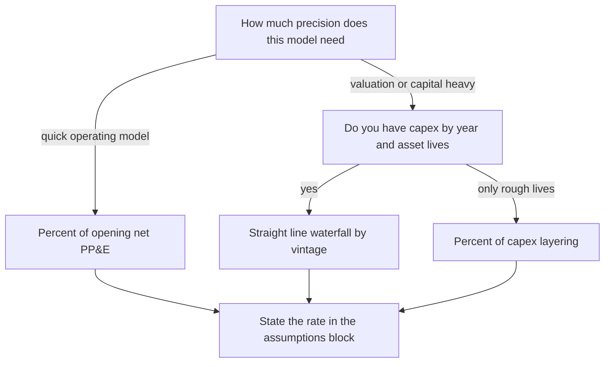
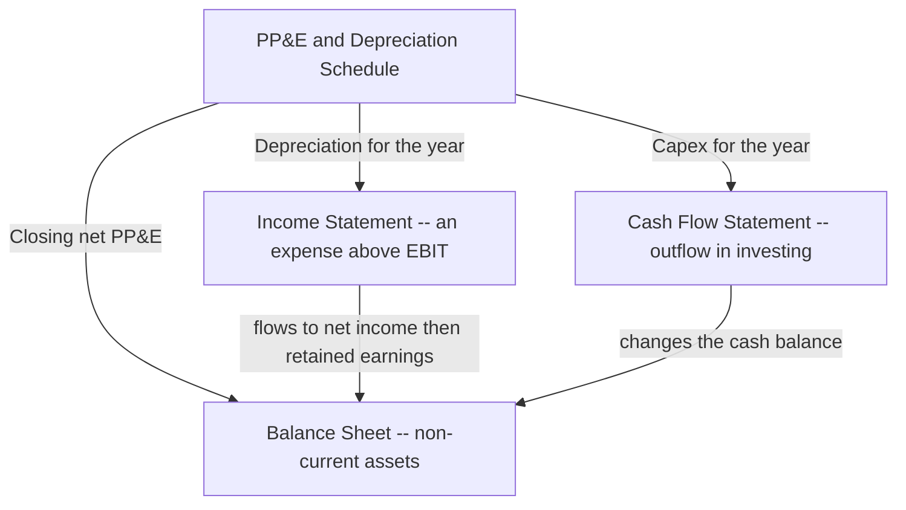
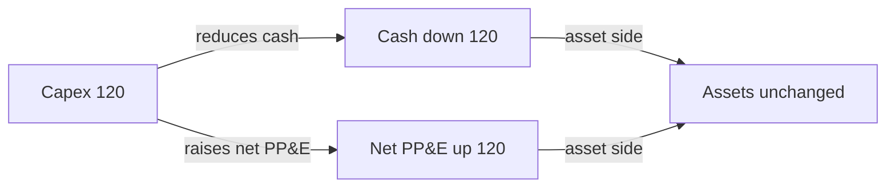
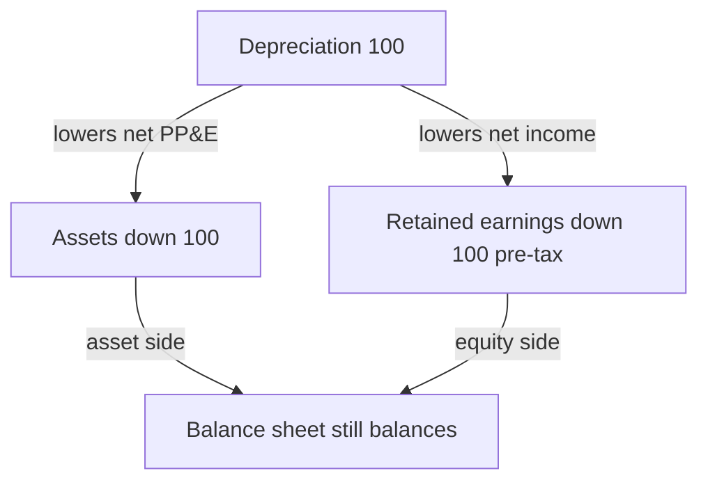

<!-- v2-deep -->

# Chapter 12 — The PP&E and Depreciation Schedule

## 1. The Problem

You are three quarters of the way through building a 3-statement model. The income statement needs a depreciation line. The cash flow statement needs a capital expenditure line. The balance sheet needs a net PP&E line. And here is the uncomfortable truth: **all three of those numbers come from the same underlying physical reality — the company's factories, machines, trucks, servers and buildings — yet they show up in three different statements, expressed three different ways.**

If you type each of those numbers in by hand, three problems appear immediately.

First, they will not agree with each other. Depreciation on the income statement is supposed to be the *same* depreciation that reduces net PP&E on the balance sheet. If you hard-key one at 120 and the other at 118, your balance sheet will not balance and you will spend an hour hunting a 2-unit ghost.

Second, they will not respond to your assumptions. A model exists so you can ask "what if we spend 200 more on capex next year?" If capex, depreciation and net PP&E are all typed constants, changing capex changes nothing downstream. The model is dead.

Third, you lose the audit trail. A reviewer — your boss, a lender, an investment committee — will ask "why is depreciation 118?" The only acceptable answer is "here is the schedule that builds it." A hard-keyed number has no answer.

The **PP&E and depreciation schedule** is a small supporting worksheet that solves all three at once. It is the single place where you decide how much the company invests (capex), how fast those assets wear out (depreciation), and what the assets are worth on the books (net PP&E). Every statement then *pulls* its number from this one schedule. Change one assumption here, and the income statement, cash flow statement and balance sheet all move together, consistently, automatically.

To see the stakes concretely, imagine a lender's analyst opens your model and drags a highlight across the depreciation cell on the income statement. If the formula bar shows a link like `='PP&E'!C12`, the analyst trusts you: there is a schedule, it is one number, it is traceable. If the formula bar shows `118` typed in black, the analyst has just learned that somewhere in your model a number was invented, and now every other number is suspect. The schedule is not busywork — it is the difference between a model that survives due diligence and one that does not.

This chapter builds that schedule from scratch, cell by cell, and then stress-tests it against every variation and trap you are likely to meet.

## 2. The Core Idea — a Bathtub with a Tap and a Drain

Picture a bathtub.

The **water already in the tub** at the start of the year is your **opening net PP&E** — the book value of everything the company already owns.

The **tap** running water *in* is **capital expenditure (capex)** — new machines, buildings, equipment the company buys this year.

The **drain** letting water *out* is **depreciation** — the accounting recognition that assets wear out, get used up, and lose value over time.

The **water left in the tub** at the end of the year is your **closing net PP&E**.

That is the entire schedule in one sentence:

> **Closing PP&E = Opening PP&E + Capex − Depreciation**

This is called a **roll-forward** (or a **corkscrew** schedule, because on paper the closing balance of one year hooks around to become the opening balance of the next, drawing a little corkscrew shape). It is the single most important structural pattern in financial modeling. You will use the identical shape for debt, for retained earnings, for working capital, for the cash balance — anything that has a balance carried across time. Learn it perfectly here and you have learned it everywhere.

The beauty of the bathtub is that it *forces consistency*. The water leaving through the drain (depreciation) is the exact same water that lowers the level in the tub (net PP&E). You physically cannot have depreciation mean one thing for the income statement and another for the balance sheet — it is one flow, drawn once.

Here is the corkscrew drawn explicitly, so you can see why each year's opening is not a new assumption but a mechanical consequence of the year before:


*Figure 1 — the corkscrew. Each closing hooks around to become the next opening, so no book value ever leaks between years. The numbers are from Worked Example 1.*

The corkscrew is worth internalising as a *shape*, not a formula. On a printed page the arrow from one year's closing to the next year's opening literally curls back and down, like the thread of a screw. Every professional model you will ever open has dozens of these curls stacked on supporting tabs. Once your eye recognises the shape you can audit a stranger's model in seconds: find the opening, check it points at last year's closing, and you have verified the whole spine.

## 3. Why It Works

Why is a roll-forward the *correct* way to model an asset, rather than just forecasting net PP&E directly?

Because of a deep accounting truth: **a balance is the accumulation of flows.** The book value of PP&E today is not an independent fact — it is the sum of every dollar ever spent on assets, minus every dollar of depreciation ever charged. Balance sheets are stocks; income and cash flow statements are flows. A roll-forward is simply the bridge that says "this year's stock = last year's stock + this year's flows."

This matters because of the **matching principle**, the reason depreciation exists at all. When a company buys a machine for 500 that will last 5 years, it does not expense 500 in year one. That would wildly overstate the cost of doing business in year one and understate it in years two through five. Instead, accounting *spreads* the cost across the years the machine actually helps generate revenue. Depreciation is that spreading. It is a **non-cash expense**: the cash left in year one (that is capex), but the *expense* is recognized gradually.

This single fact — cash out now, expense recognized later — is exactly why capex and depreciation live on different statements:

- **Cash flow statement** cares about *cash*, so it shows the full capex when it is paid.
- **Income statement** cares about *matched expense*, so it shows only this year's slice of depreciation.
- **Balance sheet** cares about *remaining value*, so it shows net PP&E = cost not yet depreciated.

The roll-forward is the machine that keeps these three views of the same asset perfectly reconciled. If it did not exist you would have to enforce that consistency by hand, and you would fail.

**A worked micro-illustration of the matching principle.** Buy one machine for 500, 5-year life, zero salvage, straight-line. Watch the three statements over its life:

| Year | Cash out (CFS) | Depreciation expense (IS) | Net book value (BS) |
|---|---:|---:|---:|
| 0 (purchase) | 500 | 0 | 500 |
| 1 | 0 | 100 | 400 |
| 2 | 0 | 100 | 300 |
| 3 | 0 | 100 | 200 |
| 4 | 0 | 100 | 100 |
| 5 | 0 | 100 | 0 |
| **Total** | **500** | **500** | — |

Notice two things that are the heart of this whole chapter. First, **the cash column and the expense column sum to the same 500** — depreciation never invents or destroys value, it only re-times *when* the 500 hits the income statement. Second, the balance-sheet column is just the running remainder: 500 minus cumulative depreciation. That remainder *is* net book value, and rolling it forward year by year *is* the corkscrew. The entire schedule you are about to build is nothing more than this table, generalised to many assets bought in many years.

## 4. Full Technical Content

### 4.1 The two ways to build it: net vs. gross

There are two common structures. Know both; pick deliberately.

**Net PP&E roll-forward (the simple, most-used version).** You track a single line, net PP&E, and roll it forward:

```
Opening net PP&E
  + Capex
  − Depreciation
= Closing net PP&E
```

This is what most FMVA-style operating models use. It is clean, it links to all three statements, and it is enough for the vast majority of forecasting work.

**Gross PP&E + accumulated depreciation (the fuller version).** You track two lines separately:

```
Gross PP&E:          Opening gross + Capex − Disposals (at cost) = Closing gross
Accumulated deprec:  Opening accum + Depreciation − Disposals (accum) = Closing accum
Net PP&E = Closing gross − Closing accumulated depreciation
```

This matches how the balance sheet actually presents PP&E (gross cost less accumulated depreciation) and is required when you model asset disposals or want the note disclosure to tie. We build the net version as our spine and show the gross extension in a worked example.

A quick decision rule: **use net when nobody disposes of assets and you only need net PP&E to flow to the balance sheet; use gross when you model disposals, when the client's note disclosure must tie line-for-line, or when a bank covenant references gross fixed assets.** When in doubt for a first draft, build net — you can always split it into gross-and-accumulated later without changing any of the three statement links, because the closing net figure is identical either way (as Example 3 proves).

### 4.2 Laying out the schedule in Excel

Put the schedule on its own worksheet (call the tab `PP&E`), or in a clearly bordered block below your main model. Years run across columns; line items run down rows. A clean layout:

| Row label | 2024A | 2025F | 2026F | 2027F |
|---|---|---|---|---|
| **Assumptions** | | | | |
| Capex ( % of revenue ) | | 5.0% | 5.0% | 5.0% |
| Depreciation ( % of opening ) | | 10.0% | 10.0% | 10.0% |
| **PP&E roll-forward** | | | | |
| Opening net PP&E | | =prior close | =prior close | =prior close |
| (+) Capex | | | | |
| (−) Depreciation | | | | |
| **Closing net PP&E** | | | | |

Formatting conventions that mark you as a real analyst:

- **Blue font for hard-coded inputs** (the assumption percentages), **black font for formulas** (everything computed). This one habit lets any reviewer see instantly what is an assumption and what is a calculation.
- Show inflows as positive and outflows with a **negative sign in the formula** (`=-depreciation`), so the roll-forward is a literal sum: `=SUM(opening, capex, depreciation)`. Never make the reader guess whether to add or subtract.
- The **Closing** row is bold and often has a top border. It is the line other sheets will reference.
- Percentages formatted as `%` with one decimal; currency with thousands separators and no decimals for large models.

**A concrete cell map you can copy.** Suppose the schedule occupies these cells, with 2024A in column B and 2025F–2027F in columns C, D, E:

| Cell(s) | Content | Font |
|---|---|---|
| `B3` | tab / block title `PP&E and Depreciation Schedule` | black |
| `C5:E5` | Capex % of revenue, e.g. `5.0%` | **blue** |
| `C6:E6` | Depreciation % of opening, e.g. `10.0%` | **blue** |
| `B10` | last historical closing net PP&E, e.g. `1000` (or a link to historicals) | blue |
| `C9` | opening 2025 `=B10` | black |
| `D9` | opening 2026 `=C12` | black |
| `E9` | opening 2027 `=D12` | black |
| `C10:E10` | capex `=C$revrow*C5` etc. | black |
| `C11:E11` | depreciation `=-C6*C9` (note the leading minus) | black |
| `C12:E12` | closing `=SUM(C9:C11)` | black, **bold**, top border |

That is the whole engine in ten formulas. Everything later in this chapter is a variation on which formula goes in row 10 (capex driver) and row 11 (depreciation method). The opening link (row 9) and the closing `SUM` (row 12) never change.

### 4.3 The opening balance link — the corkscrew

The first-year opening balance comes from the **last actual (historical) closing net PP&E** — a number you read off the company's most recent balance sheet. Type it as a link to your historicals, not a hard key if you can avoid it.

Every subsequent opening balance is a pure formula: **this year's opening = last year's closing.** If closing 2025F sits in cell `C12` and opening 2026F sits in `D9`:

```
D9:  =C12
```

Drag that right across all forecast years. That single relationship is the corkscrew. It guarantees no PP&E ever leaks between years — whatever ended last year starts this year, exactly.

A tiny discipline that saves hours: after wiring the openings, click opening 2026 and press `Ctrl+[` (Excel's "trace precedent / go to precedent") — the cursor should jump to closing 2025. If it jumps to a hard number or to the wrong cell, your corkscrew is broken before you have even entered a forecast. Verifying the spine *empty*, before any assumptions distract you, is far easier than untangling it later.

### 4.4 Modeling capex

Capex is a forecast *assumption*, driven by how you think the business grows. Three standard drivers:

**(a) Capex as a percent of revenue.** The workhorse. Capital-intensive businesses spend a stable fraction of sales on assets. If revenue for 2025F is in `C$` on the model and the capex assumption (say 5%) is in `C5`:

```
Capex 2025F  =  Revenue_2025F * Capex%_2025F
             =  C_revenue * C5
```

Use this when the business scales its asset base with sales — manufacturers, telecoms, retailers.

**(b) Capex as a fixed dollar amount.** When you have management guidance ("we plan to spend 300 on the new plant in 2026"), just hard-key the number, in blue. Simple and often the most honest for near-term forecasts.

**(c) Maintenance + growth capex split.** More advanced: maintenance capex ≈ depreciation (just replacing what wears out) plus a growth capex layer for expansion. Useful in valuation when you want steady-state free cash flow.

A **fourth**, less common but worth knowing: **capex as a percent of the prior-year asset base** (capex = k × opening gross PP&E). This ties investment to how big the plant already is rather than to sales, and it is useful for utilities and infrastructure where the reinvestment rate is a property of the asset stock, not of this year's revenue.

A sanity rule worth burning in: **over the long run, capex should be at least equal to depreciation** for a going concern. If your model forecasts capex permanently below depreciation, net PP&E shrinks toward zero — you are quietly liquidating the company's asset base. Sometimes intended (a declining business); usually a mistake. A companion sanity check is the **capex-to-depreciation ratio**: a healthy growing company runs it around 1.2–2.0×; a mature steady-state company hovers near 1.0×; anything persistently below 1.0× is a wind-down. Put this ratio in a cell under the schedule and glance at it — it catches more modeling errors than any single other check.

### 4.5 Modeling depreciation — the three methods

Depreciation is where beginners overcomplicate. Here are the three methods you will actually use, from simplest to most rigorous.

**Method 1 — Depreciation as a percent of opening (or average) net PP&E.**

The most common quick method in operating models. Pick a rate that reflects the asset base's blended life and apply it to the opening balance:

```
Depreciation 2025F  =  Opening net PP&E_2025F * Deprec%
```

A 10% rate implies a ~10-year average asset life. It is fast, it is stable, and it self-adjusts: as the asset base grows, depreciation grows. The weakness is circular-feeling logic (depreciation depends on a balance that depreciation reduces), but because it keys off the *opening* balance there is no actual circularity — opening is already fixed from last year.

A refinement is to depreciate a **percent of gross PP&E** instead, which avoids the base shrinking over time and is closer to how straight-line actually works.

**Method 2 — Straight-line on cost with a useful life.**

The textbook method and how companies actually depreciate. An asset costing `C` with useful life `N` years and salvage value `S` depreciates:

```
Annual depreciation  =  (Cost − Salvage) / Useful life
                     =  (C − S) / N
```

In a model, straight-line total depreciation = (depreciation on the pre-existing asset base) + (depreciation on each new year's capex, each spread over its own life). Done rigorously this needs a **depreciation waterfall** — a grid where each capex vintage has its own row and you diagonal-sum the columns. Powerful and precise; we build a compact version in the worked examples.

**Method 3 — Depreciation as a percent of capex (the layering method).**

A pragmatic hybrid: assume existing PP&E keeps depreciating at some rate, and each new year's capex adds its own depreciation slice equal to (capex / useful life). This is really straight-line applied only to new investment, and it is common when you do not want a full waterfall but want capex to *drive* future depreciation realistically.

Here is how to choose, as a diagram:


*Figure 2 — choosing a depreciation method. Speed on the left, fidelity on the right; whichever branch you take, the assumption must be visible and single-sourced.*

Which to choose? For most FMVA operating models: **% of opening net PP&E** for speed, or the **straight-line waterfall** when precision matters (valuation, capital-intensive businesses, or when a reviewer will scrutinize the depreciation trend). Whichever you pick, state the assumption explicitly in the assumptions block.

### 4.6 The closing balance and the Excel functions that help

The closing line is trivial by design:

```
Closing net PP&E  =  Opening + Capex − Depreciation
                  =  SUM( opening_cell, capex_cell, deprec_cell )
```

with depreciation stored as a negative. That is the whole engine.

Excel functions that show up in these schedules:

- `SUM` — to total the roll-forward and to diagonal-sum a depreciation waterfall.
- `SLN(cost, salvage, life)` — Excel's built-in **straight-line** depreciation for one asset. Returns `(cost − salvage) / life`. Handy for a single-asset check.
- `SYD` and `DB` / `DDB` — sum-of-years-digits and declining-balance for **accelerated** depreciation (common in tax models). You rarely need these in a book-depreciation operating model, but know they exist.
- `MIN` / `MAX` — to cap depreciation so it never exceeds remaining book value (an asset cannot depreciate below zero/salvage).
- `IF` / `EOMONTH` — for half-year conventions or mid-year capex timing in monthly models.
- `SUMPRODUCT` or `OFFSET` — occasionally used to collapse a waterfall grid into a single per-year depreciation figure without a visible triangular block, though a visible grid is almost always more auditable.

A quick numeric feel for the accelerated functions on a 500-cost, 5-year, zero-salvage asset (so you recognise them if you meet them): `SLN` gives a flat **100** every year; `SYD` front-loads it as 167, 133, 100, 67, 33; `DDB` (200% declining balance) gives 200, 120, 72, and then tapers. All three sum to 500 over the life — they only differ in *timing*. Book models overwhelmingly use straight-line (`SLN` logic); accelerated methods live mostly in tax schedules, which is why a full model often carries **two** depreciation numbers, book and tax, whose difference creates deferred tax. That deferred-tax linkage is beyond this chapter, but knowing *why* two depreciation figures can coexist stops you from "correcting" a model that is actually right.

### 4.7 A subtle but important refinement — depreciating current-year capex

Should this year's capex be depreciated *this* year? In reality an asset bought in June only serves half the year. Three conventions:

1. **No current-year depreciation** (depreciate opening balance only). Simplest; slightly understates depreciation.
2. **Full-year on current capex.** Depreciate opening PP&E *plus* full capex. Slightly overstates.
3. **Half-year convention.** Depreciate opening plus half of current-year capex — the realistic middle ground, and a common best practice.

Half-year, using a % method:

```
Depreciation  =  Deprec% * ( Opening net PP&E + 0.5 * Capex )
```

Pick one, apply it consistently, and note it. The choice rarely swings the model much, but a reviewer will notice inconsistency. Worked Example 4 quantifies exactly how much the convention moves the answer, so you can judge when it is worth the extra formula.

## 5. Worked Examples

### Example 1 — The basic net PP&E roll-forward (% of revenue capex, % of opening depreciation)

A company ends 2024 with **net PP&E of 1,000**. Forecast assumptions:

- Revenue: 2025 = 2,000; 2026 = 2,300; 2027 = 2,645.
- Capex = 6% of revenue.
- Depreciation = 10% of opening net PP&E.
- No current-year depreciation on new capex (convention 1).

**Step 1 — capex each year.**

| Year | Revenue | Capex ( 6% ) |
|---|---|---|
| 2025 | 2,000 | 120 |
| 2026 | 2,300 | 138 |
| 2027 | 2,645 | 158.7 |

**Step 2 — roll it forward.** Depreciation = 10% × opening.

| Line | 2025 | 2026 | 2027 |
|---|---:|---:|---:|
| Opening net PP&E | 1,000.0 | 1,020.0 | 1,020.0 |
| (+) Capex | 120.0 | 138.0 | 158.7 |
| (−) Depreciation (10% × opening) | (100.0) | (102.0) | (102.0) |
| **Closing net PP&E** | **1,020.0** | **1,056.0** | **1,076.7** |

Let me verify the corkscrew. 2025 closing = 1,000 + 120 − 100 = **1,020.0**. That becomes 2026 opening. 2026 closing = 1,020 + 138 − 102 = **1,056.0**. That becomes 2027 opening. 2027 closing = 1,056 + 158.7 − 105.6 = **1,109.1**.

Wait — I must re-key 2027 with the *correct* opening. The table above froze depreciation at 102 by mistake; let me redo it honestly, because depreciation must be 10% of each year's *actual* opening.

| Line | 2025 | 2026 | 2027 |
|---|---:|---:|---:|
| Opening net PP&E | 1,000.0 | 1,020.0 | 1,056.0 |
| (+) Capex | 120.0 | 138.0 | 158.7 |
| (−) Depreciation (10% × opening) | (100.0) | (102.0) | (105.6) |
| **Closing net PP&E** | **1,020.0** | **1,056.0** | **1,109.1** |

Now it reconciles: each opening equals the prior closing (1,020 → 1,020; 1,056 → 1,056), and each depreciation is exactly 10% of that year's opening (100, 102, 105.6). That self-correction is exactly the discipline the schedule enforces — and exactly why you never hard-key these lines. **Closing 2027 = 1,109.1.**

Notice capex (120, 138, 158.7) exceeds depreciation (100, 102, 105.6) every year, so net PP&E grows — consistent with a growing business. Good sign. The capex-to-depreciation ratio here runs 1.20, 1.35, 1.50 — comfortably above 1.0, confirming reinvestment ahead of wear.

**The exact Excel formulas for this example** (opening 2025 in `C9`, revenue for 2025 in `C4`, capex % `6%` in `C5`, deprec % `10%` in `C6`):

```
C9   =B_hist_close          (link to the 1000 historical closing)
C10  =C4*C5                 -> 120
C11  =-C6*C9                -> -100   (leading minus stores it negative)
C12  =SUM(C9:C11)           -> 1020
D9   =C12                   -> 1020   (the corkscrew)
D10  =D4*D5 ... and drag right
```

Drag `C10:C12` right to columns D and E and the whole forecast fills itself. Change any assumption cell and all closings re-solve — that is the entire payoff.

### Example 2 — Straight-line depreciation waterfall (per-vintage, precise)

Same company, but now depreciate on a **straight-line, 10-year life, zero salvage** basis, and depreciate the pre-existing 1,000 base plus each capex vintage. Assume **full-year** depreciation in the year of spend for simplicity, and that the opening 1,000 base depreciates at 100/year (i.e. it has 10 years of life left).

Each capex vintage depreciates at capex/10 per year.

| Depreciation source | Annual charge | 2025 | 2026 | 2027 |
|---|---:|---:|---:|---:|
| Existing base (1,000 / 10) | 100.0 | 100.0 | 100.0 | 100.0 |
| 2025 capex (120 / 10) | 12.0 | 12.0 | 12.0 | 12.0 |
| 2026 capex (138 / 10) | 13.8 | — | 13.8 | 13.8 |
| 2027 capex (158.7 / 10) | 15.87 | — | — | 15.87 |
| **Total depreciation** | | **112.0** | **125.8** | **141.67** |

This is the "waterfall" — each new vintage adds a layer that persists. In Excel you build a triangular grid and `SUM` down each year column; the diagonal fill (a vintage only starts in its own year) is what gives the schedule its staircase shape. The mechanical trick is a single formula copied across the whole grid: in the cell for *vintage row v, year column t*, write something like `=IF(AND(t>=v_year, t<v_year+life), capex_v/life, 0)`. The `IF` switches the layer on in its birth year and off after its life expires; copy it across the rectangle and the triangular staircase appears automatically, no manual dashes required.

Now the roll-forward with these more precise depreciation figures:

| Line | 2025 | 2026 | 2027 |
|---|---:|---:|---:|
| Opening net PP&E | 1,000.0 | 1,008.0 | 1,020.2 |
| (+) Capex | 120.0 | 138.0 | 158.7 |
| (−) Depreciation (waterfall) | (112.0) | (125.8) | (141.67) |
| **Closing net PP&E** | **1,008.0** | **1,020.2** | **1,037.23** |

Verify: 2025 closing = 1,000 + 120 − 112 = **1,008.0** ✓ → 2026 opening. 2026 closing = 1,008 + 138 − 125.8 = **1,020.2** ✓ → 2027 opening. 2027 closing = 1,020.2 + 158.7 − 141.67 = **1,037.23** ✓.

Compare to Example 1's closing of 1,109.1. The waterfall depreciates faster (because it charges the new vintages too), so net PP&E ends lower. Both are internally consistent; the waterfall is simply more faithful to real straight-line accounting.

**What-if: the useful life is 5 years, not 10.** Halving the life doubles every layer's charge. The 2025 total depreciation becomes 200 (base) + 24 (2025 capex) = 224, and 2025 closing collapses to 1,000 + 120 − 224 = **896** instead of 1,008. Shorter lives mean a heavier drain, a smaller tub, and — importantly for valuation — a *higher* depreciation tax shield in the near term. This is why the assumed useful life is never a throwaway input: it swings both the balance sheet and the tax line.

**What-if: a vintage reaches the end of its life.** Extend the horizon to 2035 and the 2025 vintage (10-year life) must stop charging its 12.0 after 2034. If you forget the stop, that layer depreciates forever and net PP&E drifts negative. The fix is the `MIN` cap discussed in the traps section, or the `IF(...life...)` switch shown above, which zeroes the layer automatically once `t >= v_year + life`.

### Example 3 — Gross PP&E and accumulated depreciation (with a disposal)

Now the fuller presentation. Start 2025 with **gross PP&E 1,600** and **accumulated depreciation 600** (so net = 1,000, matching Examples 1–2). In 2026 the company **sells an asset that originally cost 80 and had 30 of accumulated depreciation** (net book value 50). Use straight-line depreciation from Example 2.

**Gross PP&E roll-forward:**

| Line | 2025 | 2026 |
|---|---:|---:|
| Opening gross | 1,600.0 | 1,720.0 |
| (+) Capex | 120.0 | 138.0 |
| (−) Disposal at cost | — | (80.0) |
| **Closing gross** | **1,720.0** | **1,778.0** |

**Accumulated depreciation roll-forward:**

| Line | 2025 | 2026 |
|---|---:|---:|
| Opening accumulated | 600.0 | 712.0 |
| (+) Depreciation for year | 112.0 | 125.8 |
| (−) Accum. deprec. on disposal | — | (30.0) |
| **Closing accumulated** | **712.0** | **807.8** |

**Net PP&E = Gross − Accumulated:**

| | 2025 | 2026 |
|---|---:|---:|
| Closing gross | 1,720.0 | 1,778.0 |
| Closing accumulated | (712.0) | (807.8) |
| **Net PP&E** | **1,008.0** | **970.2** |

Verify 2025 net = 1,720 − 712 = **1,008.0**, matching Example 2's 2025 closing exactly. Good — the gross method and net method agree when there are no disposals. In 2026 the disposal removes net book value of 80 − 30 = 50 from the tub, so net PP&E (970.2) is lower than Example 2's 1,020.2 by exactly the 50 disposed. Everything ties.

**Where the disposal goes on the other statements.** The 50 of net book value that left the balance sheet has to reappear somewhere, and this is where students lose the plot, so trace it carefully with two proceeds cases:

- **Sold for 70 (a gain).** Cash flow from investing shows **+70** (the actual proceeds — that is the real cash event). The income statement shows a **gain on disposal of 70 − 50 = +20**, which lifts net income. But that 20 gain is non-cash-timing noise relative to the 70 already captured in investing, so on the cash flow statement you **subtract the 20 gain** in the operating section to avoid double-counting it. Net cash effect: +70, exactly the proceeds.
- **Sold for 40 (a loss).** Investing shows **+40**. The income statement shows a **loss of 40 − 50 = −10**, reducing net income. On the cash flow statement you **add the 10 loss back** in operating (it was a non-cash charge). Net cash effect: +40, again exactly the proceeds.

The pattern to memorise: *proceeds hit investing; the gain or loss (proceeds minus net book value) is a non-cash plug reversed in operating so the only real cash that survives is the proceeds themselves.* The gain or loss never changes cash — it only re-labels part of the disposal between operating and investing.

### Example 4 — Half-year convention vs no-current-year (same inputs, quantified)

Take Example 1's exact inputs (net PP&E 1,000; capex 6% of revenue; deprec rate 10%) but switch to the **half-year convention**: depreciate opening plus half of the current-year capex.

```
Depreciation  =  10% * ( Opening + 0.5 * Capex )
```

| Line | 2025 | 2026 | 2027 |
|---|---:|---:|---:|
| Opening net PP&E | 1,000.0 | 1,014.0 | 1,043.7 |
| (+) Capex | 120.0 | 138.0 | 158.7 |
| (−) Depreciation (half-year) | (106.0) | (108.3) | (112.305) |
| **Closing net PP&E** | **1,014.0** | **1,043.7** | **1,090.095** |

Verify 2025: 10% × (1,000 + 60) = 106; closing = 1,000 + 120 − 106 = **1,014.0** ✓. 2026: 10% × (1,014 + 69) = 108.3; closing = 1,014 + 138 − 108.3 = **1,043.7** ✓. 2027: 10% × (1,043.7 + 79.35) = 112.305; closing = 1,043.7 + 158.7 − 112.305 = **1,090.095** ✓.

Compare the 2027 closings: convention 1 (no current-year) ended at **1,109.1**; half-year ends at **1,090.1**. The half-year convention charged 6, 6.3 and 6.7 more depreciation each year, so the tub sits about 19 lower after three years — under 2% of the balance. That is the honest scale of the "which convention" question: it matters for the depreciation *trend* a reviewer inspects and for the near-term tax shield, but it rarely moves the balance sheet materially. Choose one, note it, move on.

### Example 5 — Sensitivity: the model must breathe

The whole reason to build a schedule instead of hard-keying is so a single input change ripples correctly. Rerun Example 1 with capex lifted from 6% to **10% of revenue** and everything else unchanged.

Capex becomes 200, 230, 264.5.

| Line | 2025 | 2026 | 2027 |
|---|---:|---:|---:|
| Opening net PP&E | 1,000.0 | 1,100.0 | 1,220.0 |
| (+) Capex (10%) | 200.0 | 230.0 | 264.5 |
| (−) Depreciation (10% × opening) | (100.0) | (110.0) | (122.0) |
| **Closing net PP&E** | **1,100.0** | **1,220.0** | **1,362.5** |

Closing 2027 jumps from 1,109.1 to **1,362.5** — the heavier tap fills the tub faster, and because depreciation keys off the (now larger) opening, depreciation rises too (100 → 110 → 122), partly self-braking the growth. In your live sheet you changed exactly one cell (the 6% → 10%) and four closing balances, three depreciation figures, and the three statement links all moved. If any of them stayed put, you have a hard-key to hunt.

**Contrast — the wind-down.** Now drop capex to **3% of revenue** (60, 69, 79.35) with deprec still 10%:

| Line | 2025 | 2026 | 2027 |
|---|---:|---:|---:|
| Opening net PP&E | 1,000.0 | 960.0 | 933.0 |
| (+) Capex (3%) | 60.0 | 69.0 | 79.35 |
| (−) Depreciation (10% × opening) | (100.0) | (96.0) | (93.3) |
| **Closing net PP&E** | **960.0** | **933.0** | **919.05** |

Here capex sits below depreciation every year (60 < 100, 69 < 96, 79.35 < 93.3), the tub drains faster than the tap fills it, and net PP&E declines. Nothing is broken — this is a faithful picture of a company harvesting its asset base. But if you did *not* intend a wind-down, this shrinking net-PP&E trend is your alarm bell: capex is too low relative to depreciation.

## 6. Connections — How the Schedule Wires Into the Model

The PP&E schedule is a *hub*. Three spokes run out of it, one to each statement. This is the payoff for all the work above.


*Figure 3 — the schedule is the single source; each statement pulls its own view of the same assets.*

Walk each link:

**To the income statement — depreciation.** The income statement pulls the **depreciation for the year** as an operating expense (either inside cost of sales / operating expenses, or as its own line). It reduces operating profit and therefore taxable income and net income. The IS cell should be a *direct link* to the schedule's depreciation row — never a re-typed number.

**To the cash flow statement — capex and depreciation both.** Two links here, and this is where students trip:

- **Capex** appears in **cash flow from investing** as an outflow (negative). It is the full amount spent — the whole tap, not the drain.
- **Depreciation** appears in **cash flow from operations** as an *add-back*. Why? Because it was subtracted on the income statement to get net income, but it never used cash. The cash flow statement starts from net income and adds depreciation back to undo the non-cash deduction.

So depreciation touches the cash flow statement too — but as a reversal, not a payment. Capex is the real cash event.

**To the balance sheet — closing net PP&E.** The balance sheet's **net PP&E** line links directly to the schedule's **closing** row. Nothing else. Because the roll-forward already embedded capex (up) and depreciation (down), the balance sheet value is correct by construction.

Here is the elegant part — **why the balance sheet balances.** Follow the loop:


*Figure 4 — capex is an asset swap; cash falls and PP&E rises by the same amount, so total assets are unchanged and the sheet still balances.*

Capex moves value *within* the asset side (cash → PP&E), so it never unbalances anything. Depreciation reduces net PP&E on the asset side and, via the income statement, reduces net income and therefore retained earnings on the equity side — again by the same amount, so the two sides fall together. The roll-forward is what makes both of these self-balance without any plug.


*Figure 5 — depreciation lowers assets and equity by the same amount, so balance is preserved.*

Because capex flows *from* the schedule *into* both the CFS and the balance sheet, and depreciation flows *from* the schedule *into* the IS, the CFS and the balance sheet, changing a single capex or depreciation assumption ripples through all three statements consistently. That is the whole point of building the schedule instead of hard-keying.

**A one-number tax nuance worth carrying forward.** Depreciation, because it reduces taxable income, creates a **tax shield** equal to depreciation × tax rate. In Example 1, the 100 of 2025 depreciation at a 25% tax rate saves 25 of cash tax. So depreciation is non-cash, yet it *does* affect cash — indirectly, through lower tax. This is why analysts speak of the "depreciation tax shield" and why accelerated tax depreciation is valuable: it pulls that cash saving forward. You will not build the tax detail in this chapter, but understanding that the depreciation line quietly moves cash tax is what separates a mechanical modeler from someone who understands the model.

### 6.1 Interview angles on the wiring

These are the questions that come up in modeling interviews, phrased the way an interviewer phrases them, with the crisp answer.

- *"Walk me through what happens across the three statements if depreciation increases by 10, tax rate 0."* Income statement: pre-tax income down 10, net income down 10. Cash flow: net income down 10, but add back the 10 non-cash depreciation, so cash from operations unchanged; cash unchanged overall. Balance sheet: net PP&E down 10 on assets, retained earnings down 10 on equity — balances. Net cash effect zero because depreciation is non-cash.
- *"Same question, but tax rate 25%."* Pre-tax down 10, tax down 2.5, net income down 7.5. Cash flow: net income down 7.5, add back 10 depreciation, so cash from operations *up* 2.5 — that is the tax shield. Balance sheet: net PP&E down 10, cash up 2.5, so assets down 7.5; retained earnings down 7.5 — balances.
- *"What happens to the three statements when the company spends 100 on capex?"* Cash flow: investing outflow of 100, cash down 100. Balance sheet: PP&E up 100, cash down 100 — assets flat, still balances. Income statement: nothing this year (capex is not an expense; only its future depreciation is).
- *"Why does depreciation appear on two statements but capex on one?"* Depreciation is an expense (income statement) that is non-cash (so reversed on the cash flow statement); it is a re-timing of cost. Capex is a single cash event (investing) that becomes an asset, not an expense — its cost hits the income statement only later, as depreciation.
- *"Your capex is below depreciation for ten straight years — is that a problem?"* Only if unintended. It means net PP&E shrinks toward zero — a wind-down / liquidation profile. Fine for a declining business, a red flag for a going concern that should be reinvesting.

## 7. Traps and Common Errors

**Sign errors in the roll-forward.** The classic. Capex adds, depreciation subtracts. If you store depreciation as a positive and then *add* it, net PP&E balloons. Best practice: store outflows as negatives and use `SUM`, so the arithmetic reads itself.

**Depreciating the wrong base.** If your rate is meant to apply to *opening* net PP&E, do not accidentally point it at *closing* — that creates true circularity (closing depends on depreciation depends on closing) and Excel throws a circular reference. Key off opening (or a fixed base) to stay clean.

**Forgetting to link the opening balance to the prior closing.** If openings are hard-keyed, the corkscrew is broken and next year's PP&E ignores this year's activity. Every opening after the first must be `=prior closing`.

**Depreciation exceeding book value.** An asset cannot depreciate below zero (or below salvage). In long forecasts a naive % method never quite hits zero (fine), but a waterfall vintage must stop after its useful life. Cap it with `MIN(remaining book value, straight-line charge)` if your horizon is long. Concretely, for a vintage with remaining net book value in `R` and a scheduled charge `s`, write `=MIN(R, s)` — in the final year the remainder is smaller than `s`, so the cap catches it and the layer lands exactly on zero instead of overshooting.

**Capex chronically below depreciation.** As noted, this silently liquidates the asset base and eventually drives net PP&E negative — impossible in reality. Unless you are deliberately modeling a wind-down, keep long-run capex ≥ depreciation. Add a `=capex/depreciation` check cell and eyeball it.

**Putting depreciation only on the income statement.** Beginners link depreciation to the IS and forget the add-back on the cash flow statement. Result: cash is understated and the balance sheet will not balance. Depreciation touches *two* statements.

**Putting capex on the income statement.** Capex is *not* an expense — it is an asset purchase. It never appears on the income statement (only its depreciation does). Newcomers sometimes deduct capex from profit; that double-counts and is simply wrong.

**Mismatched depreciation between IS and balance sheet.** If you compute depreciation twice — once for the IS, once in the schedule — they will drift. Compute it *once*, in the schedule, and link everywhere. One source of truth.

**Inconsistent capex timing convention.** Mixing "full-year depreciation on new capex" in one year and "no depreciation on new capex" in another makes the depreciation trend jump. Choose a convention (half-year is a safe default) and apply it every year.

**Forgetting the disposal's two-sided removal in the gross method.** When you dispose of an asset you must remove it from *both* gross PP&E (at cost) and accumulated depreciation (the accumulated portion). Remove only from gross and net PP&E falls too far; remove only from accumulated and it rises. The net book value that actually leaves the tub is cost minus accumulated — 50 in Example 3 — and that must equal what your cash-flow and gain/loss logic assumes.

**Double-counting the gain or loss on disposal.** The full proceeds already sit in investing cash flow. If you also let the accounting gain flow through operating cash without reversing it, you count part of the sale twice. Always subtract a gain / add back a loss in the operating section so only the true proceeds survive as cash.

**Depreciating the historical base forever.** A % of opening method quietly assumes the legacy asset base never fully wears out. Over a 20-year forecast that overstates late-period net PP&E. For long horizons or valuation terminal periods, prefer a waterfall (or at least reconcile that long-run capex ≈ long-run depreciation so the base stabilises rather than compounding).

**Growth capex with no matching depreciation.** If you ramp capex hard but keep a flat depreciation rate on opening, near-term depreciation lags the new spend and margins look artificially high for a year or two. A waterfall or a "% of capex" layer fixes this by making new capex generate its own depreciation immediately.

## 8. First-Principles Recap

Strip everything away and here is what remains:

1. **A balance is accumulated flows.** Net PP&E today is every dollar ever invested minus every dollar ever depreciated. So you model it by rolling flows forward, not by guessing the balance.

2. **The roll-forward identity:** Closing = Opening + Capex − Depreciation. Opening = prior closing. That corkscrew is the spine.

3. **Capex is cash out now; depreciation is expense recognized later.** They are the same assets viewed through two lenses — cash and matched cost. That is why one number splits across three statements.

4. **Three links, one source.** Depreciation → income statement (expense) and cash flow (add-back). Capex → cash flow (investing outflow). Closing net PP&E → balance sheet. All pulled from the one schedule.

5. **Consistency is structural, not manual.** Because capex is an asset swap and depreciation lowers assets and equity equally, the balance sheet balances automatically — provided every statement links back to this single schedule instead of holding its own copy.

If you understand only those five sentences, you can rebuild the entire chapter. A useful sixth, once the five are second nature: **timing and life are the only real judgment calls.** The corkscrew arithmetic is mechanical; the only genuinely debatable inputs are how much capex, over what useful life, recognised on what convention. Master the mechanics so your attention is free for those three judgments — that is where a model earns or loses credibility.

## 9. Quick-Reference

| Item | Formula / rule |
|---|---|
| Roll-forward | Closing = Opening + Capex − Depreciation |
| Opening balance | = prior year closing ( first year = last historical net PP&E ) |
| Capex — % of revenue | Capex = Revenue × Capex% |
| Capex — % of asset base | Capex = Opening gross PP&E × rate |
| Capex — sanity check | Long-run Capex ≥ Depreciation; ratio ~1.0 mature, 1.2–2.0 growth |
| Depreciation — % of opening | Deprec = Opening net PP&E × rate |
| Depreciation — straight-line | ( Cost − Salvage ) / Useful life |
| Depreciation — half-year conv. | rate × ( Opening + 0.5 × Capex ) |
| Depreciation — waterfall | Σ ( each capex vintage / its life ) + base charge |
| Depreciation tax shield | Depreciation × tax rate ( cash saved ) |
| Disposal — net book value | Cost of disposed − its accumulated depreciation |
| Disposal — cash flow | Proceeds in investing; gain subtracted / loss added back in operating |
| Net vs gross | Net PP&E = Gross PP&E − Accumulated depreciation |
| Excel: straight-line | `=SLN(cost, salvage, life)` |
| Excel: accelerated | `=SYD(...)`, `=DB(...)`, `=DDB(...)` |
| Excel: cap depreciation | `=MIN(remaining book value, charge)` |
| Excel: vintage on/off switch | `=IF(AND(t>=v_year, t<v_year+life), capex/life, 0)` |

**Statement links**

| Statement | Line | Links to |
|---|---|---|
| Income statement | Depreciation ( expense ) | schedule depreciation row |
| Cash flow — operations | Depreciation ( add-back ) | schedule depreciation row |
| Cash flow — operations | Gain / loss on disposal ( reversed ) | disposal calc |
| Cash flow — investing | Capex ( outflow ) | schedule capex row |
| Cash flow — investing | Disposal proceeds ( inflow ) | disposal calc |
| Balance sheet | Net PP&E | schedule closing row |

**Formatting**

- Blue = hard input, black = formula.
- Outflows negative; total with `SUM`.
- Closing row bold, top-bordered — it is the reference line.

## 10. Build-It-Yourself Exercise

Open Excel and build this from a blank sheet. Do not copy the examples' numbers — use these fresh inputs so you cannot autopilot.

**Given.** A logistics company ends 2024 with **net PP&E of 800**. Forecast:

- Revenue: 2025 = 1,500; 2026 = 1,725; 2027 = 1,984; 2028 = 2,281.
- Capex = 8% of revenue.
- Depreciation = 12.5% of opening net PP&E (≈ 8-year average life).
- Convention: no depreciation on current-year capex.

**Tasks.**

1. Lay out a schedule: assumptions block on top (capex %, depreciation %, both in blue), then the four-line roll-forward (Opening, +Capex, −Depreciation, Closing) across 2025–2028.
2. Link every opening balance to the prior closing with a formula. Type only the 2024 closing (800) as a value.
3. Build closing with `=SUM(...)` and depreciation stored negative.
4. Add three "link" cells below the schedule labeled *To Income Statement (depreciation)*, *To Cash Flow (capex)*, *To Balance Sheet (net PP&E)*, each pointing at the right schedule row.
5. **Stress test:** change the capex assumption from 8% to 12% in one cell and confirm all four closing balances, the depreciation trend, and the three link cells update automatically. If any number is stuck, you hard-keyed something — find it and fix it.
6. **Extension (optional but recommended):** add a `=capex/depreciation` check row and confirm it stays above 1.0 every year (it should, so net PP&E grows). Then temporarily set capex to 5% and watch the ratio fall below 1.0 and the closing balances start declining — a live demonstration of the wind-down trap.

**Self-check targets** (rounded, so you know you built it right):

| Line | 2025 | 2026 | 2027 | 2028 |
|---|---:|---:|---:|---:|
| Opening net PP&E | 800.0 | 820.0 | 855.3 | 906.6 |
| (+) Capex ( 8% ) | 120.0 | 138.0 | 158.7 | 182.5 |
| (−) Depreciation ( 12.5% × opening ) | (100.0) | (102.5) | (106.9) | (113.3) |
| **Closing net PP&E** | **820.0** | **855.3** | **906.6** | **975.8** |

Check the corkscrew: 800 + 120 − 100 = 820 → 820 + 138 − 102.5 = 855.5 (rounds to 855.3 with unrounded carry) → and so on to a 2028 closing near **976**. If your live sheet lands within a rounding whisker of these and every number moves when you change the 8%, you have built a correct, living PP&E schedule — the same engine used in every professional 3-statement model.

**A fully-precise reconciliation** (unrounded, so you can tie to the last decimal if your sheet does not round intermediate steps). Using capex = 8% of the stated revenues (120.00, 138.00, 158.72, 182.48) and depreciation = 12.5% of each actual opening:

| Line | 2025 | 2026 | 2027 | 2028 |
|---|---:|---:|---:|---:|
| Opening net PP&E | 800.000 | 820.000 | 855.500 | 907.283 |
| (+) Capex ( 8% ) | 120.000 | 138.000 | 158.720 | 182.480 |
| (−) Depreciation ( 12.5% × opening ) | (100.000) | (102.500) | (106.938) | (113.410) |
| **Closing net PP&E** | **820.000** | **855.500** | **907.283** | **976.352** |

The rounded table above and this precise one agree to within a fraction of a unit each year; the small gaps (855.3 vs 855.5) are pure display rounding, not a modeling error. Seeing both trains your eye to distinguish a genuine break from a harmless rounding artefact — a skill you will use every time a balance sheet is "off by 0.1."

Now go build it in Excel. Reading it is not the same as wiring it; the muscle memory of the corkscrew is what you are actually training.
