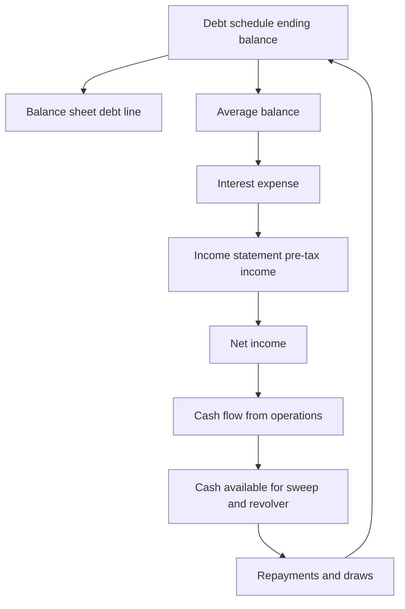
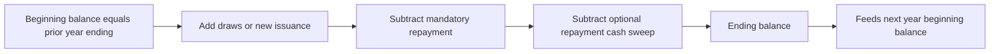
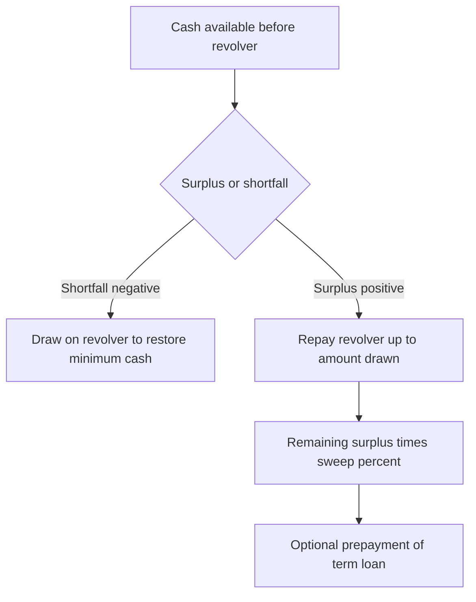
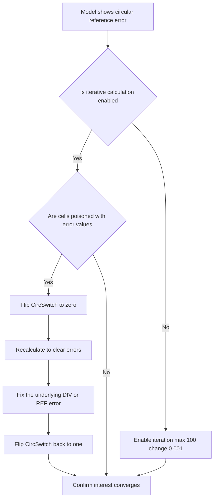
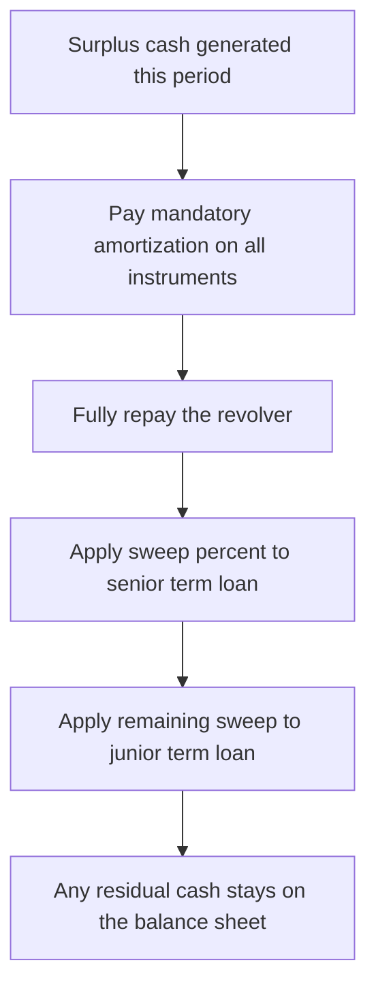

<!-- v2-deep -->

# Chapter 13 — The Debt and Interest Schedule (and Circularity)

## 1. The Problem

You have built the operating side of a three-statement model: revenue, costs, working capital, and capital expenditure. The company throws off cash — or burns it. But a model that stops there is answering the wrong question. A business does not sit on an idealized pile of "net cash." It carries a term loan with a fixed amortization schedule, a revolving credit facility it draws on when short and repays when flush, and perhaps a bond that only matures years out. Each of these has a **balance that changes every period**, and each generates **interest expense** that lands on the income statement, reduces net income, reduces retained earnings, and changes the cash the business actually has.

So the first problem is bookkeeping: you need a place that tracks, for every debt instrument, how much is owed at the start of the year, what was added, what was paid down, and how much is owed at the end. This is the **debt schedule**, and its closing balances must feed the balance sheet exactly.

The second problem is subtler and is the reason this chapter exists as its own topic. **Interest expense depends on the debt balance. The debt balance depends on how much cash the business generated. Cash generated depends on net income. Net income depends on interest expense.** You have just drawn a loop. Follow it: interest → net income → cash flow → debt paydown → interest. If you compute interest on the *average* balance during the year (the correct, defensible way), the average depends on the closing balance, the closing balance depends on the cash sweep, the sweep depends on cash available, cash available depends on net income, and net income depends on the very interest number you were trying to compute. Excel will flash a warning: **circular reference**. Beginners panic and hardwire numbers. Analysts learn to *engineer* the loop deliberately.

There is a third, quieter problem that only shows up when you sit an interview or hand a model to a credit committee: **the debt schedule is where the model's economics stop being additive and start being circular, iterative, and behavioural.** Everything upstream (revenue drivers, cost ratios, capex) is a clean one-directional calculation. The debt block is the first place where an output feeds back into an input. Understanding *why* that is unavoidable — and how professionals tame it without cheating — is the single most tested modelling concept in analyst interviews. This chapter teaches the mechanical schedule, the discipline of controlled circularity, and the muscle memory of watching the loop converge under your own hands.

## 2. The Core Idea

A debt schedule is a **roll-forward**. Every balance-sheet item that changes over time — debt, PP&E, equity, retained earnings — obeys the same universal identity:

> **Closing balance = Opening balance + Additions − Reductions**

For debt specifically:

> **Ending debt = Beginning debt + Draws (new borrowing) − Repayments (mandatory + optional)**

The beginning balance of any year is simply last year's ending balance. That single link — `Beginning_t = Ending_(t−1)` — chains every period together. Around this spine you attach two more layers:

1. **A repayment logic layer.** Mandatory amortization is contractual and fixed. Optional repayment (the *cash sweep*) and revolver draws are *behavioral* — they respond to how much cash the business has. The sweep says "if there is spare cash, use it to pay down debt early." The revolver says "if there is a shortfall, borrow to cover it." Together they make the model self-balancing.

2. **An interest layer.** Multiply the balance by the interest rate to get expense, then route that expense to the income statement. Choosing *which* balance to multiply — beginning, ending, or average — is the decision that either creates or avoids circularity.

The core idea of handling circularity is this: **the loop is real and economically correct, so do not delete it — control it.** Excel can solve circular references by *iteration* (recomputing the loop repeatedly until the numbers stop moving). You turn on iterative calculation and add a **circularity breaker switch** so that if the model ever chokes, you can sever the loop, clear the error, and re-enable it — without losing your formulas.

One mental model to carry through the whole chapter: **a debt schedule is two stacked machines.** The lower machine is pure bookkeeping — a roll-forward that would work identically whether interest existed or not. The upper machine is the pricing layer — it reads a balance out of the lower machine and prices it. Circularity is *only* ever a property of the upper machine reaching into a balance that the lower machine has not yet finished computing. If you keep the two machines mentally separate, you will always know exactly where the loop is and how to cut it.

## 3. Why It Works

**Why a roll-forward and not a fresh calculation each year?** Because debt is a *stock*, not a *flow*. Its value at any moment is the accumulated history of every draw and repayment. Re-deriving it from scratch each period would be error-prone and would break the audit trail. The roll-forward makes the model *articulate* — each period visibly hands off to the next, so an error in year 2 is traceable to a specific draw or repayment, not lost in a black box.

**Why does the closing balance have to hit the balance sheet exactly?** Because the balance sheet is the model's lie detector. Assets must equal liabilities plus equity. The debt schedule's ending balance is the *source of truth* for the debt line; the balance sheet merely *links* to it. If you ever type a debt number directly onto the balance sheet instead of linking, the two will drift and your balance sheet will not balance. The schedule exists precisely so there is one authoritative number.

**Why interest on the average balance?** Because interest accrues continuously as the balance changes through the year. If a company starts the year owing 1,000 and ends owing 800 (having amortized 200 evenly), it did not owe 1,000 all year, nor 800 all year. On average it owed roughly 900. Charging interest on 900 is the honest approximation. Charging on the beginning 1,000 overstates expense; charging on the ending 800 understates it. The average `(Beginning + Ending) / 2` is the standard, defensible convention.

**Why does averaging create the loop and beginning-balance does not?** Ending debt is downstream of this year's cash flow, which is downstream of this year's net income, which is downstream of this year's interest. So making interest depend on the *ending* (via the average) reaches forward into numbers that themselves depend on interest — a cycle. The *beginning* balance is a fact inherited from last year; it is already settled before this year's income statement runs, so no cycle forms. That is why the beginning-balance convention is the clean escape hatch when you want to avoid circularity entirely.

**Why let the loop exist at all, then?** Because iteration *converges*. Each pass around the loop changes interest by a smaller amount than the last (interest is a few percent of a balance that is itself only mildly sensitive to interest). After a handful of passes the numbers stabilize to the penny. Excel's iterative calculation exploits exactly this: repeat until the change is below a tiny threshold. The economics guarantee convergence; Excel just automates the grind.

**Why does iteration converge so fast — and can it ever fail?** The loop is a contraction mapping. Walk one full lap: interest goes up by ΔI, which lowers net income and cash by ΔI, which lowers the sweep by ΔI, which raises ending debt by ΔI, which raises the average balance by ΔI/2, which raises interest by `rate × ΔI/2`. So each lap the change shrinks by a factor of `rate × sweep% / 2` — with an 8% rate and a 100% sweep that is 0.04, meaning every pass kills 96% of the remaining error. Five or six passes and you are at the penny. It *only* fails to converge in pathological cases — e.g., a modelled interest rate above 200% combined with a full sweep, which no real credit agreement carries. This is why you can trust iteration: the economics of debt make the feedback gain far below 1.

**Why a switch and not just careful formulas?** Because iteration has a nasty failure mode. If any cell in the loop momentarily evaluates to an Excel error (`#DIV/0!`, `#REF!`, `#VALUE!`), iteration feeds that error back into itself on the next pass, and it *sticks* — the whole loop is poisoned and stays poisoned even after you fix the root cause, because there is no clean value left to iterate from. The switch injects a hard-coded `0` that gives the loop a clean starting point to re-converge from. It is not a hack; it is the reset button that iteration structurally requires.

## 4. Full Technical Content

### 4.1 Layout of the debt schedule

Build the debt schedule on its own worksheet (or a clearly separated block), one row-group per instrument, with years across the columns matching your model's timeline. A clean structure for a single term loan looks like this:

| Row | Line item | Formula logic |
|---|---|---|
| 1 | Beginning balance | `= prior year Ending balance` |
| 2 | (+) Draws / new issuance | hardcoded assumption or revolver logic |
| 3 | (−) Mandatory repayment | `= −MIN(scheduled amortization, Beginning balance)` |
| 4 | (−) Optional repayment (cash sweep) | `= −MIN(cash available for sweep, remaining balance)` |
| 5 | **Ending balance** | `= SUM(Beginning + Draws − Mandatory − Optional)` |
| 6 | Interest rate | assumption |
| 7 | Average balance | `= (Beginning + Ending) / 2` |
| 8 | Interest expense | `= Average balance × Interest rate` |

Rows 1 and 5 are the roll-forward spine. Rows 2–4 are the movement. Rows 6–8 are the interest layer.

**Ordering matters.** Within each instrument, always put the movement rows (draws, mandatory, optional) *between* Beginning and Ending, and put the interest layer *below* Ending. This left-to-right, top-to-bottom flow means your eye can audit a column the way water runs downhill — Beginning at the top, Ending in the middle, price of that balance at the bottom. Reviewers read hundreds of these; a non-standard order costs you credibility instantly.

**Multiple instruments.** Stack instrument blocks vertically — Revolver block, then Term Loan A, then Term Loan B, then Bonds — each a self-contained roll-forward, then a **Total debt** summary block at the bottom that sums the ending balances and the interest lines. The order is not arbitrary: put the revolver *first* because it is the last instrument repaid and the first drawn (it is the residual plug), and it depends on the cash left over after every other instrument's movement. Building it at the top but *referencing* the others forces you to lay the sweep waterfall out cleanly.

### 4.2 The roll-forward spine, cell by cell

Assume the term loan block occupies row 10 (Beginning) through row 15 (Ending), with the first forecast year in column D.

- **Beginning balance (D10):** For the very first forecast year, link to the last historical/actual debt balance — say it sits in C15 as the opening position: `=C15`. For every subsequent year, beginning equals the prior year's ending: `E10 =D15`, `F10 =E15`, and so on. Build D10 correctly, then drag right so each year inherits the last.

- **Ending balance (D15):** `=D10+D11-D12-D13` where D11 is draws, D12 mandatory repayment (entered as a positive number and subtracted here, or entered negative and added — pick one convention and hold it), D13 optional repayment. Never type the ending balance; always compute it.

**A cleaner sign discipline.** Many professional templates enter *every* movement row as a signed number (draws positive, all repayments negative) and make the ending balance a single `=SUM(D10:D13)`. This has two virtues: the ending formula never changes no matter how many movement rows you add, and every movement row can be linked *directly* to the cash flow financing section with no sign flip. If you adopt this, row 12 becomes `=-MIN($B$12,D10)` (note the leading minus) and D15 becomes `=SUM(D10:D14)`. Choose one style at the start of the model and never mix.

**The drag-right test.** After you build column D, select D10:D15, copy, and paste into E:G. Then check E10 — it must read `=D15`, not `=C15` or an absolute reference. If your first-year beginning used a hard link that does not shift, the drag will silently break the chain. Always build the *general* year (which uses a relative prior-year link) and then override *only* the first forecast year's beginning with the historical link.

### 4.3 Mandatory repayment

Mandatory amortization is contractual — e.g., "repay 10% of the original 1,000 principal each year," i.e., 100 per year. Two guardrails:

1. **Never repay more than you owe.** Wrap it in `MIN`:
   `Mandatory repayment = MIN(Scheduled amortization, Beginning balance)`
   In cells: `D12 =MIN($B$12, D10)` where B12 holds the annual scheduled amount. This prevents a negative debt balance in the final years when the loan is nearly paid off.

2. **Bullet vs amortizing.** A *bullet* loan (or a bond) pays nothing until maturity, then repays the whole principal in one year. Model that as zero mandatory in every year except the maturity year. A *fully amortizing* loan spreads principal evenly. Match the schedule to the actual term sheet.

**Amortization as a percentage of the original face.** The most common credit-agreement wording is a percentage of the *original* principal, not the current balance. So "5% per year for years 1–5, then a 75% bullet at maturity in year 6" means the scheduled amount is `5% × original face` in each of years 1–5 (a constant number), and a balloon in year 6. Model the original face as a hard input and reference it — do *not* multiply 5% by the *current* beginning balance, which would give a declining, never-fully-repaid amortization (a classic error). If you want years-1-to-5 amortization on a 1,000 face: `D12 =MIN(5%*$B$9, D10)` where B9 = original face 1,000, giving 50 per year.

**Interaction with the sweep on remaining balance.** The cash sweep can only ever attack the balance *left after* mandatory amortization. So the "remaining balance" that caps the sweep is `Beginning − Mandatory`, never `Beginning` alone. If you forget this, a year where mandatory already retires most of the loan will let the sweep formula try to repay principal that mandatory just cleared — the `MIN` against remaining balance is what stops the double-repayment.

### 4.4 The revolver and the cash sweep

The revolving credit facility is the model's shock absorber. It has two jobs, and they are mirror images:

- **When the business is short of cash, it draws on the revolver** to keep the minimum cash balance from going negative.
- **When the business has surplus cash, it repays the revolver** (and possibly sweeps the term loan too).

The mechanism hinges on **cash available before the revolver**. Compute, from the cash flow statement, the cash position *after* operating, investing, and all *non-revolver* financing flows (including mandatory term-loan amortization):

```
Cash available for revolver = Beginning cash
                            + Cash flow from operations
                            + Cash flow from investing
                            + Cash flow from non-revolver financing
                            − Minimum cash balance required
```

Then:

- **Revolver draw** (when the number is negative, i.e., a shortfall):
  `Draw = MAX(0, Minimum cash + Cash outflows − Cash available)`
  Equivalently `= MAX(0, −(Cash available for revolver))` — borrow just enough to restore the minimum cash floor, never more.

- **Revolver repayment** (when the number is positive, i.e., surplus), capped at what is currently drawn:
  `Repayment = −MIN(Beginning revolver balance, MAX(0, Cash available for revolver))`
  You can only repay what you owe (hence `MIN` against the beginning revolver balance) and only if you have surplus (hence the inner `MAX(0, …)`).

The **cash sweep** on the *term loan* is the same idea applied to optional prepayment: after the revolver is fully repaid, any remaining surplus (times a *sweep percentage*, often 50% or 100% per the credit agreement) pays down the term loan early:

`Optional term repayment = −MIN(Remaining term balance, Sweep% × Surplus cash after revolver)`

Where remaining term balance = Beginning − Mandatory (you cannot optionally repay principal you've already amortized this year).

**The waterfall order is not optional.** Surplus cash is applied in a strict priority: (1) pay all *mandatory* amortization on every instrument; (2) fully repay the *revolver* (it is the cheapest, most flexible facility and is meant to be zero when not needed); (3) *then* apply the sweep percentage to whatever remains, against the term loan (and often the most senior term loan first). Building the formulas in any other order will let a lower-priority instrument grab cash it should not — for example sweeping the term loan while the revolver is still drawn, which no credit agreement permits.

**Facility-limit cap on the revolver.** A revolver cannot be drawn beyond its committed limit. In a stressed model the raw draw formula can ask for more than the facility allows; cap it: `Draw = MIN(MAX(0, shortfall), Facility limit − Beginning revolver)`. If the cap ever binds, the model is telling you the business has run out of committed liquidity — cash would actually go below the minimum. That is a real signal (a covenant/liquidity breach), not a modelling nuisance to paper over.

**Cash sweep step-downs.** Real credit agreements often tie the sweep percentage to leverage: 75% sweep above 4.0x net debt/EBITDA, 50% between 3.0x and 4.0x, 0% below 3.0x. Model this with a lookup on the current-year leverage ratio feeding the `Sweep%` input. This is an advanced but common variation and a favourite interview follow-up: "how would you make the sweep leverage-based?"

### 4.5 The interest layer and where circularity is born

Interest for each instrument:

`Interest expense = Interest rate × Average balance = Rate × (Beginning + Ending) / 2`

In cells: `D14 =(D10+D15)/2` (average), `D8_interest =$B$16 * D14`.

Total interest expense (sum across all instruments) links to the **income statement** interest line. On revolvers you may also model a **commitment fee** on the *undrawn* portion: `Fee = Commitment fee rate × (Facility limit − Average drawn)`.

The moment `Ending balance` appears inside the average, you have circularity, because Ending depends on repayments, repayments depend on cash available, cash available depends on CFO, CFO depends on net income, and net income depends on this interest number. Excel will show `0` everywhere and a status-bar "Circular References" warning until you enable iteration.

**Interest income on cash — the second loop.** If you also model interest *earned* on the cash balance (`Interest income = Rate × Average cash`), you create a second circular loop, because the cash balance depends on the sweep, which depends on net income, which depends on interest income. This loop runs the *opposite* direction (more cash → more income → more cash) but is even weaker (deposit rates are tiny) and converges just as readily under the same iteration. Net the two: the income statement line is usually "Interest expense, net" = interest on debt − interest on cash. Both loops resolve in the same iteration pass.

**Where exactly the circular reference "lives."** Trace it in cells so you can point to it in an interview. Say interest is D8, it flows to net income at IS!D30, which flows to CFO at CF!D12, which flows to cash-available at Debt!D20, which caps the sweep at Debt!D13, which sets ending balance Debt!D15, which sets the average Debt!D14, which sets interest Debt!D8 — closing the ring. There is no single "wrong" cell; the *ring* is the object. When Excel says "Circular References: D8," it is naming one arbitrary node on a ring, not the culprit.

### 4.6 Three ways to handle circularity

**Option A — Iterative calculation (the professional default).**
Turn it on: **File → Options → Formulas → Enable iterative calculation**, set **Maximum Iterations = 100** and **Maximum Change = 0.001**. Now Excel recomputes the loop up to 100 times per calculation, stopping when nothing moves by more than 0.001. Your average-balance interest works and converges to the correct value. Cost: the file becomes fragile — a single `#DIV/0!` or `#REF!` anywhere in the loop poisons every cell in the loop with errors that *persist even after you fix the source*, because the iteration keeps feeding the error back into itself.

**Option B — The circularity switch (iteration + a breaker).**
This is the robust professional pattern. Add a single control cell, say `CircSwitch` (value 1 = live, 0 = broken). Route the interest calculation through it:

`Interest expense = IF(CircSwitch=1, Rate × Average balance, 0)`

When the model errors out, flip `CircSwitch` to 0. Interest becomes 0, the loop is severed, every `#VALUE!`/`#REF!` clears, and the model recalculates cleanly. Flip it back to 1 and iteration re-converges from clean numbers. Best practice is to place the switch prominently on an assumptions/control tab with conditional formatting (red when 0) so no one leaves it off and ships a model with zero interest expense. Some analysts additionally point the interest formula at a *hard-coded copy* of the average balance during a break, but the `IF`-switch is the standard.

**Option C — Beginning-balance interest (avoid the loop entirely).**
Charge interest on the *opening* balance only:

`Interest expense = Interest rate × Beginning balance`

Because the beginning balance is last year's settled ending balance, it does not depend on this year's net income. No loop forms; no iteration needed; the model is bulletproof and portable. The cost is a slight, systematic overstatement of interest in years when debt is falling (and understatement when rising), because you ignore the intra-year change. Many practitioners — and many banks' modeling standards — deliberately choose this to keep models robust, accepting the small imprecision. It is the safest choice for a model that will be shared, audited, or stress-tested heavily.

> Rule of thumb: use **average-balance + circularity switch** when precision matters and you control the file; use **beginning-balance** when robustness and shareability matter more than a fraction of a percent of interest.

**Option D — Copy/Paste-Special "de-circing" (the audit-grade escape).** For a model that must be delivered with iteration turned *off* entirely, some shops compute interest on the average with iteration temporarily on, then Paste-Special-as-Values the interest row and hard-code it, breaking the loop permanently. This is fragile (the hard-coded interest no longer updates if assumptions change) and should only be a final-delivery step, never a working state. Know it exists because you will meet models built this way and must recognize why their interest line is blue (hard-coded) rather than black (formula).

**The macro helper.** Serious models add a one-line VBA macro or a manual "Calculate" button that toggles `CircSwitch` from 1→0→1 with a recalculation between each step, to flush a poisoned loop in one click. If you cannot use macros (many locked-down environments forbid them), the manual three-step — set to 0, press F9, set to 1, press F9 — does the same job.

### 4.7 Links to the three statements

The debt schedule is a hub. Its outputs radiate to all three statements:

- **Income statement:** Total interest expense (all instruments, plus commitment fees, minus interest income on cash if modeled) → the "Interest expense, net" line, above pre-tax income.
- **Cash flow statement (Financing section):** Draws are cash *inflows* (positive), repayments are cash *outflows* (negative). Each links from the corresponding debt-schedule row. Interest *expense itself is not a financing item* — it already reduced net income at the top of CFO, so do not double-count it in financing.
- **Balance sheet (Liabilities):** Each instrument's **ending balance** links directly to its debt line (revolver, current portion of long-term debt, long-term debt). This is the closing of the loop that lets the balance sheet balance.

**The tax coupling you must not miss.** Interest is tax-deductible, so a higher interest expense lowers pre-tax income and therefore lowers the tax bill — a partial offset. This means the *net* cash impact of one extra dollar of interest is `1 − tax rate`, not one full dollar. It also means the circular loop's feedback gain is even smaller than the pre-tax analysis suggests (the sweep only shrinks by the after-tax interest change), so a taxed model converges *faster*, not slower. When you hand-check convergence, remember to run the interest change through the tax rate before it hits cash.

**Current vs long-term portion.** The balance sheet often splits debt into "current portion of long-term debt" (principal due within 12 months — i.e., next year's mandatory amortization) and the remaining "long-term debt." Both link back to the schedule: current portion = next year's scheduled mandatory repayment; long-term = ending balance − current portion. This is presentation, not economics, but auditors expect it.

### 4.8 Formatting and build discipline

- **Blue font for hardcoded inputs** (interest rates, scheduled amortization, sweep %, minimum cash), **black for formulas**, **green for links to other sheets**. This is the universal three-colour convention; it lets any reviewer see at a glance what is an assumption versus a calculation.
- **Show draws as positive, repayments as negative** in the movement rows, then `SUM` them — this makes the roll-forward a single clean addition and matches the sign convention of the cash flow financing section.
- **One authoritative ending balance per instrument.** Balance sheet and cash flow *link* to it; they never recompute it.
- **Total row.** Sum all instruments to a "Total debt" line for the balance sheet and a "Total interest expense" line for the income statement.
- **Sanity checks.** Add a row that flags `=IF(Ending balance < 0, "ERROR", "ok")`. Negative debt means your repayment logic lacks a `MIN` cap.
- **Separate the assumptions from the calculations.** Interest rates, amortization amounts, sweep percentages, and the minimum cash floor all belong in a clearly labelled input block (ideally on a dedicated assumptions tab), referenced by the schedule with absolute references (`$B$16`). Never bury a hard number inside a formula in the calculation grid — a reviewer scanning for blue cells will miss it, and a sensitivity run will not catch it.
- **A dedicated convergence check.** Add a row `=Ending cash − Minimum cash` and confirm it is never negative (would mean the revolver failed to plug a shortfall) and, in full-sweep models, is exactly zero in surplus years. This is a second, independent lie detector alongside the balance sheet check.

## 5. Worked Examples

### Example 1 — A simple amortizing term loan with beginning-balance interest (no circularity)

Facts: Term loan opens at **1,000**. Mandatory amortization **200 per year**. Interest rate **8%**, charged on the **beginning balance**. No draws, no sweep. Project 3 years.

| Line | Year 1 | Year 2 | Year 3 |
|---|---|---|---|
| Beginning balance | 1,000 | 800 | 600 |
| Draws | 0 | 0 | 0 |
| Mandatory repayment | −200 | −200 | −200 |
| **Ending balance** | **800** | **600** | **400** |
| Interest @ 8% × Beginning | 80.0 | 64.0 | 48.0 |

Check the roll-forward: Year 1 ending = 1,000 − 200 = 800; Year 2 beginning = 800 ✓; Year 2 ending = 800 − 200 = 600 ✓; Year 3 ending = 400 ✓. Interest: 8% × 1,000 = 80; 8% × 800 = 64; 8% × 600 = 48 ✓. No circular reference because interest never touches the ending balance.

### Example 2 — Same loan, but interest on the average balance (circularity in principle, solved by iteration)

Same facts, but now interest = 8% × average balance. Because there is no cash sweep here, the ending balances are still fixed by the mandatory schedule, so we can compute the average directly and see the *difference* the convention makes.

| Line | Year 1 | Year 2 | Year 3 |
|---|---|---|---|
| Beginning balance | 1,000 | 800 | 600 |
| Ending balance | 800 | 600 | 400 |
| Average balance | 900 | 700 | 500 |
| Interest @ 8% × Average | 72.0 | 56.0 | 40.0 |

Compare to Example 1: interest is 72 vs 80 in Year 1, 56 vs 64 in Year 2, 40 vs 48 in Year 3 — the average convention charges 8 less each year (8% of the 100 average reduction). Over three years, average-balance interest totals 168 versus beginning-balance's 192, a 24 difference. Neither is "wrong"; they are different conventions, and this example shows the material gap the choice creates. When a *cash sweep* is present, the ending balance would itself depend on interest (via cash flow), and only iteration or the switch would resolve the numbers.

### Example 3 — Revolver as a cash-flow shock absorber

Facts: Minimum cash required **50**. Beginning cash **50**. Beginning revolver balance **0**. In Year 1 the business generates cash *before financing* of **−30** (a shortfall); in Year 2 it generates **+120** (a surplus). Revolver interest **6%** on beginning balance (kept simple). No term loan.

**Year 1 (shortfall):**
- Cash available before revolver = Beginning cash 50 + pre-financing flow (−30) − Minimum cash 50 = **−30**. Negative → must draw.
- Revolver draw = MAX(0, 30) = **30**.
- Ending revolver = 0 + 30 = **30**.
- Ending cash = 50 + (−30) + 30 draw = **50** ✓ (restored exactly to the minimum).

**Year 2 (surplus):**
- Beginning revolver = 30. Revolver interest = 6% × 30 = **1.8** (hits income statement, already inside the +120 pre-financing flow if we assume it's captured there; for clarity treat the 120 as after-interest).
- Cash available before revolver = Beginning cash 50 + 120 − Minimum cash 50 = **120**. Positive → repay.
- Revolver repayment = −MIN(Beginning revolver 30, 120) = **−30** (repay the full drawn amount; you cannot repay more than 30).
- Ending revolver = 30 − 30 = **0**.
- Ending cash = 50 + 120 − 30 repayment = **140** (surplus above minimum is retained as cash).

| Line | Year 1 | Year 2 |
|---|---|---|
| Beginning revolver | 0 | 30 |
| Draw | 30 | 0 |
| Repayment | 0 | −30 |
| **Ending revolver** | **30** | **0** |
| Ending cash | 50 | 140 |

The revolver drew exactly enough to hold cash at the 50 floor in the shortfall year, then repaid fully in the surplus year — the self-balancing behavior that keeps the model's cash line from ever going impossibly negative.

### Example 4 — The full circular loop, solved by hand (this is the one to internalize)

Now we combine a term loan, a cash sweep, and **average-balance interest** so the circularity is real, and we solve it algebraically *and* by iteration to prove they agree. Taxes are set to zero and there is no D&A or working-capital change, so `CFO = Net income = EBIT − Interest`. This keeps every number hand-checkable.

**Facts (Year 1 only):**
- Term loan beginning balance **1,000**. Mandatory amortization **100**. Interest rate **8%** on the *average* balance.
- Cash sweep **100%** of surplus cash after mandatory. No revolver needed.
- Minimum cash **50**, beginning cash **50**. `EBIT = 300`.

**Set up the ring algebraically.** Let `I` = interest.
- `CFO = 300 − I`.
- Surplus for sweep = Beginning cash 50 + CFO − Minimum cash 50 − Mandatory 100 = `50 + (300 − I) − 50 − 100 = 200 − I`.
- Sweep = MIN(remaining 900, 200 − I) = `200 − I` (it is well under 900).
- Ending debt = 1,000 − 100 − (200 − I) = `700 + I`.
- Average = (1,000 + Ending)/2 = (1,700 + I)/2 = `850 + I/2`.
- Interest identity: `I = 8% × (850 + I/2) = 68 + 0.04 I`.

Solve: `0.96 I = 68` → **I = 70.833**.

Back-substitute: Ending debt = 700 + 70.833 = **770.833**; Average = 850 + 35.417 = **885.417**; check 8% × 885.417 = 70.833 ✓. Sweep = 200 − 70.833 = **129.167**. Ending cash = 50 + (300 − 70.833) − 100 − 129.167 = **50** ✓ (exactly the minimum, since a 100% sweep leaves no residual cash).

**Now watch iteration reproduce it.** Excel starts every circular cell at 0 and re-loops using `I_next = 68 + 0.04 × I_current`:

| Pass | Interest guess | Ending debt = 700 + I | Average = 850 + I/2 | New interest = 8% × Average |
|---|---|---|---|---|
| 0 (seed) | 0.000 | 700.000 | 850.000 | 68.000 |
| 1 | 68.000 | 768.000 | 884.000 | 70.720 |
| 2 | 70.720 | 770.720 | 885.360 | 70.829 |
| 3 | 70.829 | 770.829 | 885.414 | 70.8331 |
| 4 | 70.8331 | 770.8331 | 885.4166 | 70.8333 |
| 5 | 70.8333 | 770.8333 | 885.4167 | 70.8333 |

Each pass kills 96% of the remaining error (the residual shrinks by the factor 0.04), so by pass 5 the change is far below Excel's 0.001 threshold and iteration stops. **The by-hand algebra and the machine iteration land on the identical 70.833** — that is the proof that iteration is not magic; it is just solving the same linear equation you solved with a pen.

**Reconciliation to the three statements (Year 1):**
- Income statement: Interest 70.833 → Net income = 300 − 70.833 = **229.167**.
- Cash flow financing: Mandatory −100, Sweep −129.167 → total debt repayment **−229.167**.
- CFO 229.167 + Financing −229.167 = **0** net change in cash → Ending cash stays at 50 ✓.
- Balance sheet: debt line = ending balance **770.833**, linked directly from the schedule.

### Example 5 — Same loop, but beginning-balance interest (see the robustness/precision trade-off in numbers)

Take Example 4 and change *only* the interest convention to the **beginning** balance. Now there is no loop, because interest = 8% × 1,000 = **80** is a settled number the instant the year opens.

- Interest = **80.0** (vs 70.833 on the average).
- CFO = 300 − 80 = 220. Surplus for sweep = 50 + 220 − 50 − 100 = **70**? 

Recompute carefully: surplus = 200 − I = 200 − 80 = **120**. Sweep = 120. Ending debt = 700 + 80... 

Hold the formula: Ending debt = 1,000 − 100 − sweep. Sweep = 200 − I only held when the *cash identity* used that I; here I = 80, so surplus = 200 − 80 = 120, sweep = 120, Ending debt = 1,000 − 100 − 120 = **780**.

| Convention | Interest | Sweep | Ending debt | Net income |
|---|---|---|---|---|
| Average balance (Ex. 4) | 70.83 | 129.17 | 770.83 | 229.17 |
| Beginning balance (Ex. 5) | 80.00 | 120.00 | 780.00 | 220.00 |

The beginning-balance convention charges **9.17 more interest** in this falling-debt year, sweeps **9.17 less**, and therefore ends with **9.17 more debt** and **9.17 less net income**. The gap is exactly the interest on half the year's balance reduction. This is the whole precision-versus-robustness trade in one table: the beginning-balance model needed *no iteration, no switch, and can never be poisoned* — at the cost of a ~1% overstatement of interest. For a model handed to a credit committee, most would take that trade every time.

### Example 6 — Convergence stress test (why the loop is safe)

A quick "what if the rate were absurd?" check builds intuition for why iteration is trustworthy. Keep Example 4's structure but vary the rate and sweep; the per-pass error-shrink factor is `rate × sweep% / 2`:

| Rate | Sweep% | Shrink factor | Passes to reach 0.001 accuracy |
|---|---|---|---|
| 8% | 100% | 0.040 | ~5 |
| 15% | 100% | 0.075 | ~6 |
| 30% | 100% | 0.150 | ~7 |
| 8% | 50% | 0.020 | ~4 |
| 200% | 100% | 1.000 | never converges |

Only a physically impossible 200% rate with a full sweep pushes the factor to 1 and breaks convergence. Every real credit agreement lives in the top rows, where five to seven passes suffice — which is why Excel's default of 100 maximum iterations is enormous overkill and the file resolves instantly.

## 6. Connections

- **Cash flow statement (Chapter on CFS):** The debt schedule's draws and repayments *are* the financing section's debt lines. The revolver logic is driven by the cash flow's pre-financing subtotal. This is the tightest coupling in the whole model.
- **Income statement:** Interest expense flows up from here into pre-tax income, so the debt schedule indirectly drives taxes and net income.
- **Balance sheet:** Ending balances are the balance sheet's debt lines. If the model balances, the debt schedule is internally consistent.
- **Retained earnings / equity roll-forward:** Same roll-forward mechanics (Opening + Net income − Dividends = Closing). Master the pattern here and every other schedule follows.
- **PP&E and depreciation schedule:** Also a roll-forward (Opening + Capex − Depreciation = Closing). The debt schedule is one member of a family.
- **DCF valuation:** Interest expense and net debt (total debt − cash) computed here feed the bridge from enterprise value to equity value.
- **LBO modelling:** The cash sweep is the *engine* of a leveraged buyout return. In an LBO, the sponsor deliberately loads maximum debt and sweeps 100% of free cash to deleverage; equity value grows as debt falls even if enterprise value is flat. Everything in this chapter is the beating heart of an LBO model.
- **Credit analysis and covenants:** Interest coverage (EBIT / interest) and leverage (net debt / EBITDA) ratios are computed straight off this schedule's outputs, and covenant step-downs feed back into the sweep percentage — a second, slower feedback loop layered on the interest loop.

*The debt schedule sits at the crossroads of all three statements — it is where the model's circular economics live.*


*The loop that creates circularity: ending balance drives interest, interest drives net income, net income drives cash, cash drives repayments, repayments drive ending balance.*


*The universal roll-forward spine that every debt instrument follows.*


*Revolver and cash sweep decision logic that makes the model self-balancing.*


*The troubleshooting decision tree for a circular debt model — enable iteration, then use the switch to flush poison.*


*The cash-sweep waterfall priority — the strict order in which surplus cash is applied to debt.*

## 7. Traps and Common Errors

- **Hardcoding debt on the balance sheet.** Typing a debt number directly onto the balance sheet instead of linking to the schedule's ending balance. The two drift and the balance sheet stops balancing. Always link.
- **No `MIN` cap on repayments.** Without `=MIN(scheduled, beginning)` the balance goes negative in the final years — the model "repays" principal that no longer exists. Every repayment line needs a cap.
- **Double-counting interest in the cash flow.** Interest expense already reduced net income (top of CFO). Do *not* also subtract it in the financing section. Only *principal* draws and repayments belong in financing.
- **Leaving the circularity switch off.** Flipping `CircSwitch` to 0 to clear an error, then forgetting to flip it back — shipping a model that shows *zero interest expense*. Use conditional formatting (bright red when off) so it screams at you.
- **Enabling iteration to mask a real error.** Iterative calculation will happily converge on nonsense if your formulas are wrong. It resolves circularity; it does not resolve mistakes. When numbers look off, break the loop (switch to 0) and audit with clean values.
- **Sign convention chaos.** Mixing "repayments as positive" in one row and "negative" in another. Pick one (repayments negative, draws positive is cleanest) and hold it everywhere, including the cash flow links.
- **Average-balance interest without iteration turned on.** You get `0` everywhere and a circular-reference warning, then assume the model is broken. It isn't — you just haven't enabled iterative calculation.
- **Revolver that over-borrows.** Forgetting the `MAX(0, …)` so the revolver "draws" a negative amount (i.e., silently repays) in surplus years, or over-repays more than is drawn. Separate the draw and repay logic and cap the repay at the beginning balance.
- **Wrong first-year beginning balance.** Linking Year 1 beginning to a forecast cell instead of the last actual balance. The whole chain inherits the error.
- **Amortizing on the current balance instead of original face.** Writing "5% of beginning balance" when the term sheet says "5% of the original principal." The current-balance version declines every year and never fully repays; the face-value version is a constant. Read the credit agreement wording precisely.
- **Sweeping before repaying the revolver.** Applying the cash sweep to the term loan while the revolver is still drawn violates the waterfall — no lender lets you prepay a term loan while owing on the revolver. Enforce the priority order in the formula chain.
- **Forgetting the facility-limit cap.** A revolver that draws past its committed limit hides a genuine liquidity breach. Cap the draw at `Limit − Beginning drawn` and treat a binding cap as a red-flag output, not a bug.
- **Ignoring the tax shield on interest.** Modelling interest as a full dollar-for-dollar cash cost when it is tax-deductible overstates the cash impact by the tax rate. The after-tax cost is `interest × (1 − tax rate)`, and this feeds the sweep.
- **Circular reference from interest income on cash.** Adding interest earned on cash creates a *second* loop that beginners do not expect; if iteration is off, it also zeroes out with a warning. Net it into "interest, net" and let the same iteration resolve both.
- **Mismatched maturity.** Modelling a bullet loan as if it amortizes, or continuing to charge interest after the maturity year when the balance should be zero. Anchor the schedule to the actual term and set post-maturity balances (and their interest) to zero.

## 8. First-Principles Recap

Strip everything away and two truths remain.

**First, debt is a stock governed by a roll-forward.** Its value today is yesterday's value plus what you borrowed minus what you repaid. `Ending = Beginning + Draws − Repayments`, and `Beginning_t = Ending_(t−1)`. This single identity, repeated across every period and every instrument, is the entire structural skeleton. The revolver and cash sweep are just *rules* for filling in the draws and repayments based on how much cash exists.

**Second, interest is a price on a balance, and pricing the average balance creates an honest loop.** Interest is rate times balance. Using the average balance is the truthful convention, but the average includes the ending balance, and the ending balance is downstream of the interest you are trying to compute. The loop is not a bug — it is the faithful representation of a business whose borrowing costs depend on its cash, whose cash depends on its profits, and whose profits depend on its borrowing costs. You resolve it by iteration (let Excel spin the loop to convergence), or you sidestep it by pricing the *beginning* balance instead (a settled fact from last year). Either is legitimate; the choice is precision versus robustness.

A third truth ties the two together: **the loop always converges because its feedback gain is tiny.** One lap around the ring multiplies any error by `rate × sweep% / 2` — a number far below one for any real instrument. That is why iteration is trustworthy and not a leap of faith: the economics of debt guarantee that each pass shrinks the error, and the by-hand algebra of Example 4 lands on exactly the same answer as Excel's iteration. When you can solve the ring with a pen and watch the machine agree, circularity stops being scary.

Everything else — the switch, the formatting, the three-statement links, the waterfall priority — is engineering discipline around those truths.

## 9. Quick-Reference

| Concept | Formula / Rule |
|---|---|
| Roll-forward | `Ending = Beginning + Draws − Repayments` |
| Period link | `Beginning_t = Ending_(t−1)` |
| Mandatory repayment | `= MIN(Scheduled amortization, Beginning balance)` |
| Amortization on face | `= MIN(Amort% × Original face, Beginning balance)` |
| Revolver draw | `= MIN(Facility limit − Beginning drawn, MAX(0, Minimum cash − Cash available before revolver))` |
| Revolver repayment | `= −MIN(Beginning revolver, MAX(0, Surplus cash))` |
| Cash sweep (term loan) | `= −MIN(Remaining balance, Sweep% × Surplus after revolver)` |
| Remaining balance for sweep | `= Beginning − Mandatory` |
| Average balance | `= (Beginning + Ending) / 2` |
| Interest (average) | `= Rate × (Beginning + Ending) / 2`  → circular |
| Interest (beginning) | `= Rate × Beginning`  → no circularity |
| Interest, net of cash income | `= Rate_debt × Avg debt − Rate_cash × Avg cash` |
| After-tax cash cost of interest | `= Interest × (1 − Tax rate)` |
| Circularity switch | `= IF(CircSwitch = 1, Rate × Average, 0)` |
| Iteration settings | Options → Formulas → Enable iterative calc, Max 100, Change 0.001 |
| Commitment fee | `= Fee rate × (Facility limit − Average drawn)` |
| Convergence shrink factor | `= Rate × Sweep% / 2`  (must be below 1) |
| Negative-balance check | `= IF(Ending < 0, "ERROR", "ok")` |

**Links out of the schedule:**
- Interest expense → Income statement (above pre-tax income)
- Draws (+) and repayments (−) → Cash flow, Financing section
- Ending balances → Balance sheet, Liabilities

**Colour code:** blue = input, black = formula, green = cross-sheet link.

**Circularity troubleshooting:** error appears → flip `CircSwitch` to 0 → let it recalc clean → fix the underlying `#REF!`/`#DIV/0!` → flip back to 1 → confirm convergence.

**Interview soundbites:**
- "Circularity comes from average-balance interest, because the average uses the ending balance, which depends on the sweep, which depends on net income, which depends on interest."
- "I resolve it with iterative calculation plus a breaker switch; I could also avoid it entirely by charging interest on the opening balance."
- "The loop always converges because one pass multiplies the error by rate times sweep over two — well below one for any real deal."
- "The waterfall is mandatory amortization, then revolver, then term-loan sweep — never out of order."

## 10. Build-It-Yourself Exercise

Build a debt schedule for a company with **two instruments**: a term loan and a revolver. Do it in Excel, in a fresh workbook, from these assumptions.

**Assumptions**
- Term loan opening balance: **2,000**. Mandatory amortization: **250 per year**. Interest rate: **7%**.
- Revolver: facility limit **1,000**, opening balance **0**, interest rate **5%** on beginning balance, commitment fee **0.5%** on the undrawn portion.
- Term-loan cash sweep: **50%** of surplus cash after the revolver is fully repaid.
- Minimum cash balance: **100**. Opening cash: **100**.
- Cash flow *before financing* (i.e., after operations, investing, and taxes, but before any debt movement): Year 1 **+180**, Year 2 **+420**, Year 3 **+650**.
- Forecast **3 years**.

**Tasks**
1. Build the term-loan roll-forward with a `MIN`-capped mandatory repayment and a 50% cash sweep. Build the revolver roll-forward with draw and repay logic capped correctly.
2. Compute interest on the **average balance** for both instruments. Enable iterative calculation (Max iterations 100, Max change 0.001).
3. Add a **circularity switch** cell and route both interest formulas through an `IF`. Test it: flip the switch to 0, confirm interest zeroes and any errors clear; flip back to 1 and confirm the numbers converge.
4. Add the revolver **commitment fee** on the undrawn portion.
5. Link total interest to a one-line income statement, link draws and repayments to a financing section, and link ending balances to a two-line balance sheet debt block. Add a check row that flags any negative ending balance.

**Self-check targets**
- The term loan's ending balance must fall each year by at least the 250 mandatory amount, more in years the sweep triggers, and must never go negative.
- With strong positive pre-financing cash flow every year, the revolver should stay at **0** (no draws needed) and the surplus should flow into the term-loan sweep and residual cash.
- Term-loan Year 1: beginning 2,000, mandatory −250, then sweep = 50% of surplus after revolver. If pre-financing cash is 180 and minimum cash is already met, surplus after mandatory and revolver is small — work out whether the sweep even triggers, and confirm your `MIN` cap prevents over-repayment.
- Confirm that when you flip the circularity switch off, *every* interest and dependent cell resolves to a clean number with no `#VALUE!` residue — proof your switch actually severs the loop.

**Worked hint for Year 1 (so you can grade yourself).** Ignore interest for a first pass to find whether the sweep even fires. Beginning cash 100 + pre-financing 180 = 280. Subtract minimum cash 100 → 180 available. Subtract mandatory 250 → **−70**: the mandatory amortization *alone* exceeds available surplus, so cash would dip below the floor and the **revolver must draw ~70** to keep cash at 100, meaning there is *no* surplus for a term-loan sweep in Year 1. So expect: revolver draws in Year 1 (not zero as the naive reading suggests), the sweep is 0, and the term loan falls by exactly the 250 mandatory to 1,750. Now layer interest back on (7% average on the term loan, 5% on the small revolver draw, plus the 0.5% commitment fee on the undrawn ~930) and let iteration settle. Years 2 and 3, with much stronger cash flow, repay the revolver and begin triggering the sweep. This deliberately contradicts the "revolver stays at 0" first guess — the lesson is that mandatory amortization can *create* a shortfall even when operating cash flow is positive, which is exactly the kind of subtlety the revolver exists to absorb.

**Extension challenges (optional, for depth).**
- Make the sweep percentage leverage-based: 75% when net debt / EBITDA is above 3.0x, else 50%. Assume EBITDA of 500. Watch the second, slower feedback loop this creates.
- Add interest income on the cash balance at 2% on the average cash, netted into the income statement. Confirm the model still converges (it will, faster than you fear).
- Split the term loan's ending balance into a current portion (next year's 250 mandatory) and a long-term portion on the balance sheet.

Now open Excel and build it. The schedule only becomes intuitive once you have watched the circular reference converge under your own hands and felt the relief of the switch clearing a poisoned model.
