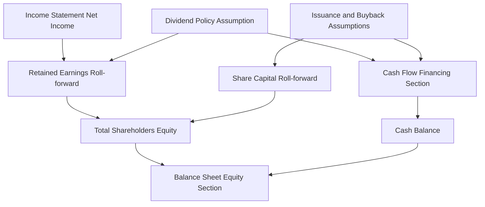
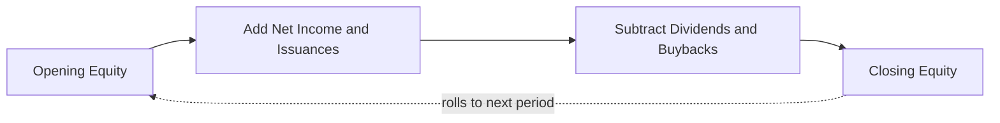
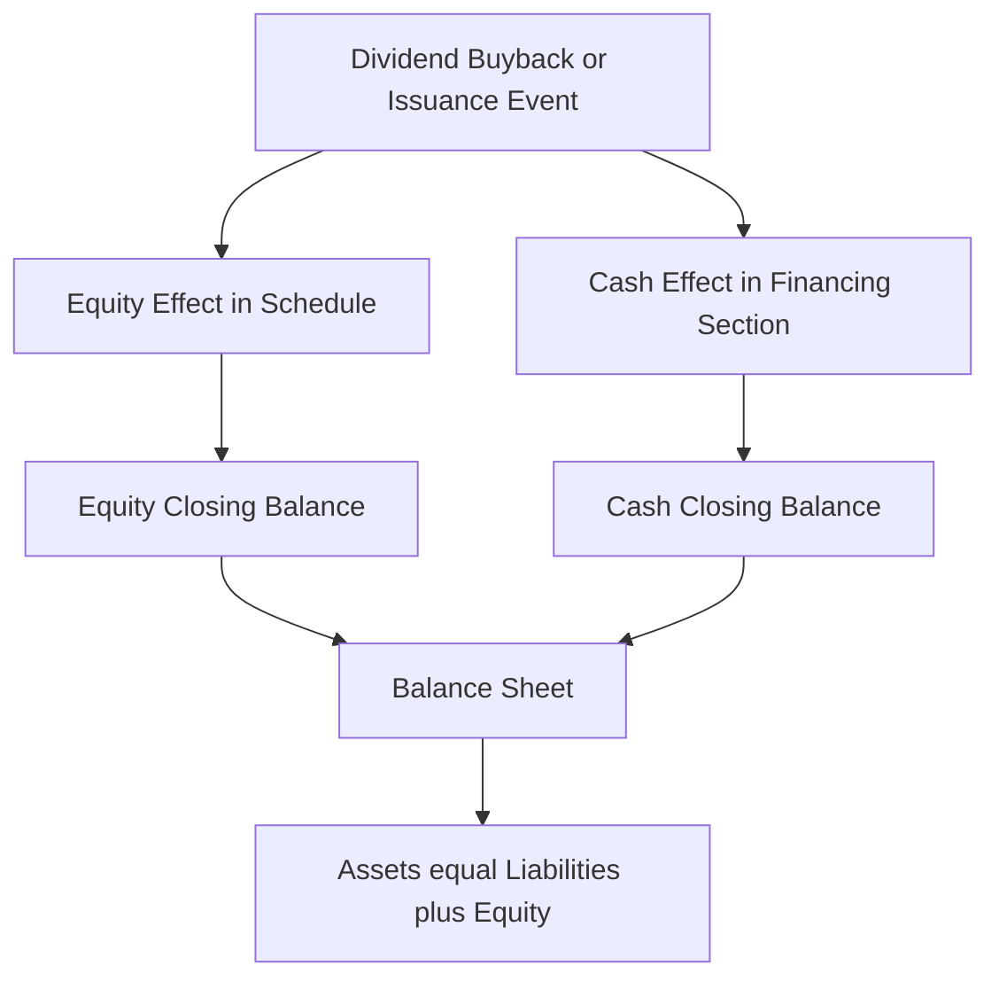
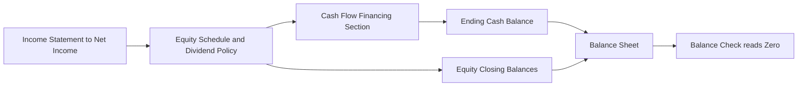

<!-- v2-deep -->

# Chapter 14 — The Equity Schedule

## 1. The Problem

You have built the income statement down to net income. You have built the cash flow statement's operating and investing sections. Your balance sheet almost balances — but there is one line, or rather one whole section, that refuses to sit still: **shareholders' equity**.

Equity is the residual claim of owners on the assets of the business. On any given balance sheet date it is a *stock* — a photograph of accumulated ownership value. But that photograph changes for reasons that live in three different statements at once:

- **Net income** earned during the year (from the income statement) increases equity.
- **Dividends** paid to shareholders (a financing outflow on the cash flow statement) decrease equity.
- **Share issuances** — selling new stock to raise capital (a financing inflow) — increase equity.
- **Share buybacks** — repurchasing your own stock (a financing outflow) — decrease equity.

If you try to hard-code the closing equity number on the balance sheet, two bad things happen. First, your model stops being a *model* — change an assumption and equity no longer responds, so the balance sheet breaks. Second, you lose the audit trail: nobody, including future-you, can see *why* equity moved from one year to the next.

The problem the equity schedule solves is this: **equity is driven by flows that originate in other statements, and those flows must be captured in one dedicated, self-checking roll-forward so that the balance sheet ties out and every movement is explainable.** Without it, the three-statement model has a hole exactly where ownership value lives.

A concrete way to feel the pain: imagine you finish a model and the balance sheet is off by \$30m in Year 2. Where do you look? If equity is a hard-code, you have no roll-forward to inspect and no idea whether the culprit is a mis-linked dividend, a forgotten buyback, or a stray net-income sign. With a proper equity schedule, the \$30m has a *home* — it is one line in one BASE block, and the integrity check (Section 4.6) points at it directly. The schedule is not paperwork; it is the diagnostic instrument that turns "the model is broken" into "row 12 in column F is wrong."

## 2. The Core Idea

The equity schedule is a **roll-forward** (also called a "BASE" schedule): you begin with a *B*eginning balance, *A*dd increases, *S*ubtract decreases, and *E*nd with a closing balance that becomes next period's beginning balance. It is the same machinery you use for PP&E, debt, and working capital — applied to the owners' account.

The heart of it is the retained earnings identity, which you should be able to write from memory:

> **Closing Retained Earnings = Opening Retained Earnings + Net Income − Dividends Declared**

Alongside retained earnings, you track **contributed capital** (common stock and additional paid-in capital), which rolls forward on its own logic:

> **Closing Share Capital = Opening Share Capital + Issuances − Buybacks**

Add the two closing balances (plus any other reserves like treasury stock or accumulated other comprehensive income) and you get **total shareholders' equity**, the number that plugs straight into the balance sheet. Every input to the schedule is *sourced* from another statement — net income from the P&L, dividends and share activity from cash-flow financing — so the equity schedule is the connective tissue that makes the three statements move together.

The mental model: **the income statement feeds equity through retained earnings; the financing section of cash flow feeds equity through dividends, issuances, and buybacks; the equity schedule collects both and hands a single closing balance to the balance sheet.**

One sentence worth memorizing for interviews: *"Retained earnings is the only balance-sheet account that the income statement touches directly."* Every other link between the P&L and the balance sheet is indirect (through cash, through accruals). Net income's single, direct destination on the balance sheet is retained earnings — and that journey happens inside the equity schedule. If you internalize only one idea from this chapter, make it that.

## 3. Why It Works

Why does opening + net income − dividends equal closing retained earnings? Because of the fundamental accounting equation and the definition of retained earnings.

Retained earnings *is* the cumulative pool of profits a company has earned since inception and chosen **not** to distribute. Every dollar of profit either stays in the business (retained) or leaves as a dividend. So in any period:

```
Change in Retained Earnings = Profit earned − Profit distributed
                            = Net Income − Dividends
```

This is not a convention someone invented; it falls straight out of double-entry bookkeeping. When you earn net income, the closing entry debits the income summary and **credits retained earnings** — equity rises. When you declare a dividend, you **debit retained earnings** and credit dividends payable (then cash when paid) — equity falls. The schedule simply records those two credits and debits over a period.

Contributed capital works the same way. Issuing shares brings in cash (debit cash) and raises common stock plus paid-in capital (credit equity). Buying back shares uses cash (credit cash) and reduces equity (debit treasury stock or retire the shares). Again, pure double entry.

And here is the deep reason the schedule makes your **whole model** balance. The cash flow statement's financing section already records the *cash* consequences of dividends, issuances, and buybacks. The equity schedule records the *equity* consequences of the very same transactions, plus net income (whose cash effect flows through operating activities). Because both sides trace to identical underlying events, the balance sheet's assets and equity move in lockstep. If your equity schedule and your cash flow financing section disagree on dividends or buybacks, the balance sheet will *not* balance — and that mismatch is precisely the diagnostic signal a good modeler relies on.

Follow one transaction all the way through to see it prove out. Suppose the company pays a \$36m cash dividend:

```
Debit  Retained Earnings   36   (equity down 36)
Credit Cash                36   (assets down 36)
```

Assets fall by 36 and equity falls by 36 — the accounting equation stays in balance by construction. In the model, the "cash down 36" arrives through the cash flow financing section (which feeds the closing cash balance on the balance sheet's asset side), while the "equity down 36" arrives through the retained-earnings roll-forward (which feeds the balance sheet's equity side). Two statements, one event, self-balancing. Now suppose you *only* recorded the equity side and forgot the cash side: equity would fall 36 with no matching asset movement, and Assets − Liabilities − Equity would read +36. That is why a single shared assumption cell — feeding both the schedule and the financing section — is non-negotiable.

## 4. Full Technical Content

### 4.1 Anatomy of the equity section

A typical shareholders' equity block on the balance sheet contains:

| Component | What it is | How it moves |
|---|---|---|
| Common stock (par) | Par value of issued shares | Issuances at par; buybacks (if retired) |
| Additional paid-in capital (APIC) | Amount paid above par | Issuances above par; stock-based comp |
| Retained earnings | Cumulative undistributed profit | + Net income − Dividends |
| Treasury stock (contra) | Cost of repurchased-but-not-retired shares | − Buybacks (negative balance) |
| AOCI | Unrealized gains/losses (FX, pensions, hedges) | Other comprehensive income items |

In many practical models you can simplify to two rolling lines — **Share Capital** (common stock + APIC combined) and **Retained Earnings** — plus a Treasury Stock line if buybacks matter. Keep the granularity your analysis needs and no more.

A note on **par value**. Par is a legal-nominal figure (often \$0.01 or \$0.001 per share) with almost no economic meaning. When a company issues one share at \$40 with \$0.01 par, \$0.01 goes to common stock and \$39.99 goes to APIC. In practice, modelers almost always combine common stock and APIC into one "Share Capital" or "Paid-in Capital" line because the split does not affect total equity, cash, or valuation. Only carve out par separately if the assignment or the target company's disclosures demand it. The exam-relevant point: *par is a formatting detail, not an economic driver.*

**AOCI** deserves a word because candidates often mishandle it. Other comprehensive income (foreign-currency translation, unrealized gains on available-for-sale securities, pension remeasurements, certain hedge gains/losses) bypasses net income and lands in equity directly. In a standard operating three-statement model you usually hold AOCI flat (no forecast movement) unless FX or pension dynamics are core to the thesis. If you *do* forecast it, remember: OCI items do **not** pass through retained earnings — they roll forward in their own AOCI line. Routing an FX gain through net income would double-count it.

### 4.2 The retained earnings roll-forward — build logic

Lay this out as a block on your schedules tab. Assume years run across columns starting at, say, column D for the first forecast year.

| Row label | Formula (year in column D) |
|---|---|
| Opening retained earnings | `=C_closing` (prior year's closing) |
| (+) Net income | `=D_IS_NetIncome` (link to income statement) |
| (−) Dividends declared | `=-D_Dividends` (link to dividend policy line) |
| Closing retained earnings | `=SUM(D_open:D_dividends)` |

Concrete cell mechanics:

1. **Opening balance (row, say, 10).** For the first forecast year: `=` the last *historical* closing retained earnings from the balance sheet. For every subsequent year the opening equals the prior period's closing, so the formula is simply `=C10`-style pointing one column left at the closing row. The cleanest construction: put the closing formula in row 13 and set opening `D10 =C13`. This creates the roll-forward chain.

2. **Net income (row 11).** Link directly to the net income line on the income statement: `=D$IncomeStatement.NetIncome`. Never re-type the number — link it. This is the single most important link in the model because it is where the P&L pours into the balance sheet.

3. **Dividends (row 12).** Link to your dividend policy line (Section 4.5), entered as a negative: `=-D_DividendsPaid`. Sign discipline matters — decide once that outflows are negative and hold it everywhere.

4. **Closing balance (row 13).** `=SUM(D10:D12)`. Because dividends are already negative, a simple SUM works. This closing figure is what the balance sheet's retained earnings line points to.

Best-practice formatting: input/assumption cells (like the payout ratio) in **blue**, formula cells in **black**, links to other sheets often in **green**. Wrap the whole block in a light border, label it "Retained Earnings Roll-forward," and put the check (Section 4.6) directly beneath it.

**Worked cell layout (copy this to a blank sheet).** Put years in row 8 (`D8=2027`, `E8=2028`, `F8=2029`). Then:

| Cell | Content | Meaning |
|---|---|---|
| `C13` | `800` (historical, blue hard-code) | Year-0 closing RE seed |
| `D10` | `=C13` | Y1 opening = Y0 closing |
| `D11` | `=IS!D30` | Y1 net income link |
| `D12` | `=-D_Div` | Y1 dividends (negative) |
| `D13` | `=SUM(D10:D12)` | Y1 closing |
| `E10` | `=D13` | Y2 opening = Y1 closing |
| `E13` | `=SUM(E10:E12)` | Y2 closing |
| `F10` | `=E13` | Y3 opening chains from Y2 |

The key discipline: `D10:D13` is one column you can select and drag right across E and F. Because every reference is relative one column back, the drag reproduces the chain perfectly. If a single opening cell is ever a hard-code instead of `=<prior closing>`, the chain snaps at that column and every year to its right is silently wrong.

### 4.3 The share capital roll-forward — issuances and buybacks

| Row label | Formula (column D) |
|---|---|
| Opening share capital | `=C_closing` |
| (+) Share issuances | `=D_Issuance` (link to CF financing, positive) |
| (−) Share buybacks | `=-D_Buyback` (link to CF financing) |
| Closing share capital | `=SUM(open:buyback)` |

- **Issuances** raise cash and equity together. If your model assumes an equity raise of \$50m, that \$50m appears as a *financing inflow* on the cash flow statement **and** as an addition here. Drive both from the *same* assumption cell so they can never diverge.
- **Buybacks** reduce cash and equity. Model them as a negative in this schedule and a financing *outflow* on cash flow, again from one shared assumption. If you retire the shares, reduce common stock/APIC; if you hold them as treasury, route the reduction to a separate Treasury Stock line (a contra-equity account that carries a negative balance).
- **Stock-based compensation** is a non-cash expense that *increases* APIC. If your model includes SBC, add a line `(+) Stock-based comp` here, linked to the SBC add-back in cash flow operating activities. This keeps equity, cash flow, and the P&L consistent.

**Treasury method vs. retirement — the mechanical difference.** Say you repurchase \$40m of stock. Under the **treasury method**, you leave common stock and APIC untouched and post −\$40m to a contra-equity "Treasury stock" line; total equity falls \$40m and the shares still legally exist (they just do not count as outstanding for EPS). Under **retirement**, you remove the shares permanently: reduce common stock by their par and APIC by their original issue premium, with any excess of repurchase price over original issue price debited to retained earnings. Both routes reduce *total* equity by \$40m — but they populate different lines and treat share count differently. For a clean forecast model where you only track total equity and diluted share count, either is acceptable *as long as you are consistent*; the trap is switching methods mid-model.

### 4.4 Assembling total equity and linking to the balance sheet

On the balance sheet, the shareholders' equity section should contain **only links**, no fresh calculations:

```
Common stock & APIC        =Schedule.ShareCapital_Closing
Retained earnings          =Schedule.RetainedEarnings_Closing
Treasury stock             =Schedule.Treasury_Closing   (negative)
Total shareholders' equity =SUM(above)
```

Then total equity feeds the balance-sheet identity you rely on to prove the model:

> **Total Assets = Total Liabilities + Total Shareholders' Equity**

Your balance-sheet check row computes `Total Assets − (Total Liabilities + Total Equity)` and must read **0** in every column.

A subtle sequencing point that trips up first-time modelers: the balance sheet's *cash* line is usually the last thing to resolve, because cash is the plug that comes off the bottom of the cash flow statement, and the cash flow statement depends on dividends and buybacks that also live in the equity schedule. So the correct build order is: (1) income statement to net income, (2) equity schedule pulls net income and computes dividends/buybacks, (3) cash flow financing pulls those *same* dividend/buyback numbers, (4) cash flow closes to an ending cash balance, (5) that cash balance and the equity closing balances both land on the balance sheet, (6) the balance sheet ties out. Equity is deliberately built *before* cash because cash depends on it, not the other way around.

### 4.5 Dividend policy in the model

Dividends are a *policy choice*, so the schedule needs a driver, not a hard-code. The three standard approaches, from simplest to richest:

**(a) Payout ratio.** Dividends = payout % × net income.
`Dividends = Payout_Ratio * D_NetIncome`
A 30% payout on \$100m net income gives \$30m of dividends. Simple, ties dividends to profitability, and self-adjusts as earnings grow. Watch the edge case: if net income is negative, a naive payout formula produces *negative dividends* (equity would rise). Guard it: `=MAX(0, Payout_Ratio * D_NetIncome)`.

**(b) Dividend per share (DPS) × shares outstanding.**
`Dividends = DPS * Shares_Outstanding`
Mirrors how real boards think (they declare a per-share amount) and often grows DPS at a steady rate. Requires a shares-outstanding roll-forward (opening shares + shares issued − shares repurchased).

**(c) Residual / plug.** Pay out whatever cash is left after funding capex and required debt paydown. Common in LBO and cash-sweep models; more complex and can create circularity.

Whatever method you choose, the dividend line is an **assumption-driven output** that feeds *both* the retained earnings roll-forward (as a reduction) *and* the cash flow financing section (as an outflow) from a single source cell. Two links, one number.

**A fourth, real-world nuance: declared vs. paid.** The identity uses dividends *declared*, but the cash flow statement records dividends *paid*. The bridge is the **dividends payable** liability on the balance sheet:

```
Closing Dividends Payable = Opening + Dividends Declared − Dividends Paid
```

In most forecast models you assume declared = paid within the same period, so dividends payable stays flat and the distinction collapses. But if an assignment gives you a payable balance that moves, respect it: retained earnings falls by *declared*, cash falls by *paid*, and the difference accumulates in the payable. Getting this wrong is a classic reason a balance sheet misses by the change in dividends payable.

### 4.6 The self-check

Directly under the schedule, add an integrity check. The most useful one reconciles the equity change to its drivers:

```
Check = Closing_Equity
      − Opening_Equity
      − Net_Income
      + Dividends
      − Issuances
      + Buybacks
```

This must equal **0**. Wrap it so errors scream: `=IF(ROUND(check,0)=0,"OK","ERROR")` with conditional formatting turning the cell red on "ERROR". A green wall of "OK" across your forecast years is the fastest confidence signal in modeling.

Why `ROUND`? Floating-point arithmetic in Excel can leave a residue of, say, 0.0000001 that makes an exact `=0` test read FALSE even when the model is perfect. `ROUND(check,0)` (or a tolerance test `ABS(check)<0.5`) absorbs that noise. Do not, however, round so aggressively that a real \$0.4m error hides — round to the nearest whole unit if you model in millions, and investigate any check that is non-zero *before* rounding by more than a rounding cent.

### 4.7 Useful Excel functions

- `SUM` — total the roll-forward columns.
- `MAX(0, …)` — floor dividends at zero when earnings turn negative.
- `MIN(…)` — cap dividends at available distributable reserves or a covenant limit.
- `IF` / `IFERROR` — build checks and guard against divide-by-zero in payout math.
- `SUMPRODUCT` or a shares roll-forward — for DPS-based dividends across changing share counts.
- `ROUND` / `ABS` — build a noise-tolerant integrity check.
- Conditional formatting — flag the check row automatically.
- **Avoid** volatile references; keep opening balances as clean one-cell links to the prior column's closing so the roll-forward chain is unbreakable.

## 5. Worked Examples

### Example 1 — Retained earnings roll-forward with a payout ratio

**Assumptions.** Opening retained earnings (end of Year 0) = \$500m. Forecast net income: Y1 \$120m, Y2 \$150m, Y3 \$180m. Dividend policy: 30% payout ratio.

| Line | Year 1 | Year 2 | Year 3 |
|---|---:|---:|---:|
| Opening retained earnings | 500.0 | 584.0 | 689.0 |
| (+) Net income | 120.0 | 150.0 | 180.0 |
| (−) Dividends (30% × NI) | (36.0) | (45.0) | (54.0) |
| **Closing retained earnings** | **584.0** | **689.0** | **815.0** |

**Check the chain.** Year 1: 500 + 120 − 36 = 584. Year 2 opens at 584 (Year 1 closing) → 584 + 150 − 45 = 689. Year 3 opens at 689 → 689 + 180 − 54 = 815. Each opening equals the prior closing — the roll-forward chains cleanly.

**Reconciliation to cash flow.** The dividends (36, 45, 54) are the exact numbers that appear as financing outflows on the cash flow statement. Net income (120, 150, 180) is the top line of cash flow from operations. Same numbers, two statements — the model is internally consistent.

### Example 2 — Adding an equity raise and a buyback

Now include contributed capital. **Assumptions.** Opening share capital = \$300m. Year 1: issue \$50m of new stock to fund expansion. Year 3: repurchase \$40m of stock (retired, so share capital falls). No SBC.

**Share capital roll-forward:**

| Line | Year 1 | Year 2 | Year 3 |
|---|---:|---:|---:|
| Opening share capital | 300.0 | 350.0 | 350.0 |
| (+) Issuances | 50.0 | 0.0 | 0.0 |
| (−) Buybacks | 0.0 | 0.0 | (40.0) |
| **Closing share capital** | **350.0** | **350.0** | **310.0** |

**Total equity (combine with Example 1's retained earnings):**

| Line | Year 1 | Year 2 | Year 3 |
|---|---:|---:|---:|
| Share capital (closing) | 350.0 | 350.0 | 310.0 |
| Retained earnings (closing) | 584.0 | 689.0 | 815.0 |
| **Total shareholders' equity** | **934.0** | **1,039.0** | **1,125.0** |

**Reconciliation via the self-check (Year 3).** Opening total equity = 350 + 689 = 1,039. Add net income 180, subtract dividends 54, add issuances 0, subtract buybacks 40:
1,039 + 180 − 54 + 0 − 40 = **1,125**. ✓ Matches the closing total exactly.

**Cash flow financing tie-out (Year 3).** Financing section shows: dividends (54), issuances 0, buybacks (40) → net financing from equity activity = −94. Every one of those numbers is shared with the equity schedule. If you changed the buyback to \$60m in one place only, the balance sheet would break by \$20m — which is exactly how the schedule catches errors.

### Example 3 — Dividend guard when earnings turn negative

**Assumptions.** Opening retained earnings = \$200m. Year 1 net income = −\$40m (a loss). Payout ratio = 25%.

Naive formula `25% × (−40) = −10` would *add* \$10m to equity — nonsense; you cannot pay a negative dividend. With the guard `=MAX(0, 25% × NI)`, dividends = \$0.

| Line | Year 1 (guarded) |
|---|---:|
| Opening retained earnings | 200.0 |
| (+) Net income | (40.0) |
| (−) Dividends | 0.0 |
| **Closing retained earnings** | **160.0** |

Check: 200 − 40 − 0 = 160. ✓ Equity correctly *falls* by the full loss, and no phantom dividend appears. This is why the `MAX(0, …)` guard belongs in every payout-based model.

### Example 4 — DPS method with a share-count roll-forward and stock-based comp

This example shows the richer DPS approach *and* SBC, wired together. **Assumptions:**

- Opening retained earnings \$1,000m; opening share capital \$600m.
- Opening shares outstanding: 100.0m.
- Net income: Y1 \$220m, Y2 \$250m.
- Dividend policy: DPS of \$1.20 in Y1, growing to \$1.30 in Y2, paid on *opening* shares for simplicity.
- Stock-based comp (non-cash): \$15m each year — expensed in the P&L (already inside net income) and added to APIC in the equity schedule.
- Y2: issue 5.0m new shares for \$50m cash (a \$10.00 issue price).
- No buybacks.

**Share-count roll-forward:**

| Line | Year 1 | Year 2 |
|---|---:|---:|
| Opening shares (m) | 100.0 | 100.0 |
| (+) Shares issued (m) | 0.0 | 5.0 |
| **Closing shares (m)** | **100.0** | **105.0** |

**Dividends = DPS × opening shares:** Y1 = 1.20 × 100.0 = **120.0**; Y2 = 1.30 × 100.0 = **130.0** (opening shares are 100.0m in both years because the 5m issuance happens *during* Y2 and we pay on the opening base).

**Retained earnings roll-forward:**

| Line | Year 1 | Year 2 |
|---|---:|---:|
| Opening RE | 1,000.0 | 1,100.0 |
| (+) Net income | 220.0 | 250.0 |
| (−) Dividends | (120.0) | (130.0) |
| **Closing RE** | **1,100.0** | **1,220.0** |

**Share capital roll-forward (with SBC):**

| Line | Year 1 | Year 2 |
|---|---:|---:|
| Opening share capital | 600.0 | 615.0 |
| (+) Issuances | 0.0 | 50.0 |
| (+) Stock-based comp | 15.0 | 15.0 |
| (−) Buybacks | 0.0 | 0.0 |
| **Closing share capital** | **615.0** | **680.0** |

**Total equity:** Y1 = 1,100 + 615 = **1,715.0**; Y2 = 1,220 + 680 = **1,900.0**.

**Full integrity check (Year 2).** Opening total equity = 1,100 + 615 = 1,715. Movements: + net income 250, − dividends 130, + issuances 50, + SBC 15, − buybacks 0:
1,715 + 250 − 130 + 50 + 15 = **1,900**. ✓

**Why SBC must appear here.** SBC of \$15m is a non-cash expense buried inside net income (so it *reduces* retained earnings via a lower profit) but it does not consume cash, so cash flow adds it back \$15m. If the equity schedule ignored SBC, that \$15m add-back would inflate cash with no matching equity credit, and the balance sheet would break by \$15m each year. Adding \$15m to APIC restores balance: net income is \$15m lower (RE effect), APIC is \$15m higher (share-capital effect), and the two wash out inside equity while cash is correctly unaffected. This is the single most common intermediate-level equity error.

### Example 5 — Buyback held as treasury stock (not retired)

Same \$40m repurchase as Example 2, but the shares are held in **treasury** rather than retired. **Assumptions:** opening share capital \$350m, opening treasury stock \$0, retained earnings closing (from Example 1) \$815m in Year 3. The buyback happens in Year 3.

| Line | Year 3 |
|---|---:|
| Share capital (unchanged by treasury method) | 350.0 |
| Treasury stock (contra, negative) | (40.0) |
| Retained earnings (closing) | 815.0 |
| **Total shareholders' equity** | **1,125.0** |

Notice the **total is identical** to Example 2's \$1,125.0 — the buyback reduces total equity by \$40m either way. What changes is *where* it lands: Example 2 pushed share capital down to 310; here share capital stays at 350 and a separate −40 treasury line carries the reduction. The economics and the balance-sheet total are the same; only the presentation and the legal share-count treatment differ (treasury shares still exist but are excluded from shares outstanding for EPS). Choose one method and never mix — see Trap 7.

### Example 6 — Prior-period adjustment and an opening-balance restatement

Occasionally the opening retained earnings must be *restated* — an accounting-policy change, a correction of a prior error, or the day-one impact of adopting a new standard (e.g., a lease or revenue standard booked directly to opening equity, net of tax). **Assumptions:** reported opening RE \$700m; a new standard requires a \$25m after-tax debit to opening retained earnings on the transition date. Year 1 net income \$140m, 20% payout.

| Line | Year 1 |
|---|---:|
| Opening RE (as reported) | 700.0 |
| (±) Transition adjustment | (25.0) |
| Opening RE (restated) | 675.0 |
| (+) Net income | 140.0 |
| (−) Dividends (20% × 140) | (28.0) |
| **Closing RE** | **787.0** |

Check: 675 + 140 − 28 = 787. ✓ The lesson: transition and prior-period adjustments hit retained earnings *directly*, bypassing net income — they are neither profit nor dividend, so they get their own line in the roll-forward rather than being smuggled into net income (which would distort the P&L) or ignored (which would break the balance sheet by \$25m).

## 6. Connections

The equity schedule is a hub. Trace its wires:



*Figure 1 — The equity schedule collects flows from the income statement and financing assumptions, then feeds a single closing equity figure to the balance sheet.*

- **To the income statement:** net income is the primary inflow to retained earnings. Anything that changes the P&L bottom line ripples into equity.
- **To the cash flow statement:** dividends, issuances, and buybacks are financing-section items. The equity schedule and CF financing must draw from identical assumption cells.
- **To the balance sheet:** the closing balances *are* the equity section. No independent numbers live on the balance sheet's equity lines — only links.
- **To the debt schedule:** dividend and buyback capacity is often constrained by cash available after debt service (residual policy) or by loan covenants. In LBO/cash-sweep models, equity distributions and debt paydown compete for the same free cash flow.
- **To valuation:** dividends drive the dividend discount model; net issuances affect share count and therefore per-share value; buybacks are a return-of-capital lever in DCF and accretion/dilution analysis.



*Figure 2 — The BASE roll-forward pattern that every schedule in the model shares.*

The next diagram shows how the *same* transaction splits into a cash effect and an equity effect that must reconcile — the reason the schedule keeps the model in balance:



*Figure 3 — One event, two mirrored effects. Because both trace to a shared assumption, assets and equity move together and the identity proves out.*

This final diagram maps the build sequence, showing why equity is constructed before cash resolves:



*Figure 4 — Build order. Equity is deliberately wired before cash because the financing section pulls dividends and buybacks from the equity schedule.*

## 7. Traps and Common Errors

1. **Hard-coding closing equity.** The number one killer of a live model. If equity does not respond to assumptions, the balance sheet cannot balance dynamically. Always roll it forward.

2. **Dividends and cash flow disagreeing.** If the retained earnings reduction and the CF financing outflow are typed separately, they drift. Drive both from one cell.

3. **Sign errors.** Mixing conventions (dividends positive here, negative there) silently breaks the SUM. Pick "outflows negative," enforce it, and let a single `SUM` do the work.

4. **Negative dividends on a loss.** A payout formula without `MAX(0, …)` invents a dividend inflow when net income is negative. Guard it.

5. **Broken roll-forward chain.** Opening balance not pointing at the prior column's *closing*. The chain snaps and every subsequent year is wrong. Build opening as a one-cell link to the closing row one period back.

6. **Forgetting stock-based comp.** If the P&L expenses SBC and cash flow adds it back, but the equity schedule ignores it, APIC is understated and the balance sheet breaks by the SBC amount. Include an SBC line whenever the P&L has the expense.

7. **Treasury vs. retirement confusion.** Repurchased shares held as treasury go to a contra-equity line at cost; retired shares reduce common stock/APIC. Mixing them misstates the components even if the total is right — and misstates share count for EPS.

8. **Double-counting net income.** Net income belongs in the retained-earnings roll-forward *once*. Don't also add it directly to the balance sheet equity line.

9. **Circular reference from residual dividends.** Paying out "cash left over" can loop: dividends affect cash, cash affects the residual, which affects dividends. If you use residual policy, understand the circularity and manage it (iterative calc on, or a copy-paste breaker), don't let it silently error.

10. **Declared vs. paid confusion.** Reducing retained earnings by dividends *paid* while cash falls by dividends *declared* (or vice versa) breaks the balance sheet by the change in dividends payable. Retained earnings uses declared; cash uses paid; the payable bridges them.

11. **Routing OCI through net income.** Foreign-currency and other comprehensive-income items bypass the P&L and land in AOCI directly. Pushing them through net income double-counts them and mis-states both retained earnings and AOCI.

12. **Paying dividends out of a negative retained-earnings balance.** Some jurisdictions bar distributions when accumulated retained earnings (distributable reserves) are negative. A payout-ratio formula tied only to current-year net income can pay a dividend even when cumulative RE is negative. If the assignment enforces this, cap dividends with a `MIN` against available reserves.

13. **Forgetting the issuance is non-round.** Real raises rarely equal a tidy number after fees. Underwriting fees reduce APIC (they are netted against proceeds, not expensed). If proceeds are \$50m and fees \$2m, equity rises \$48m and cash rises \$48m — feed the *net* figure to both.

## 8. Interview Angles

Equity-schedule mechanics are a favorite screen for analyst and associate roles because they test whether you truly understand how the three statements link. Common questions and the crisp answers:

- **"If net income goes up \$10, walk me through the three statements."** Income statement: net income +\$10. Cash flow: +\$10 at the top of operations, so (absent other changes) ending cash +\$10. Balance sheet: cash +\$10 on the asset side; retained earnings +\$10 on the equity side (through the equity schedule). Assets +\$10, equity +\$10 — balanced. The retained-earnings link is the equity schedule doing its job.

- **"A company pays a \$5 dividend. What happens to the three statements?"** No income-statement effect (dividends are not an expense). Cash flow: −\$5 in financing. Balance sheet: cash −\$5, retained earnings −\$5. Assets down 5, equity down 5 — still balanced.

- **"Where does stock-based compensation show up?"** Income statement: an operating expense, so net income is lower. Cash flow: added back in operations (non-cash). Balance sheet: increases APIC within equity, so total equity is unchanged by SBC on net (RE down, APIC up), while cash is correctly unaffected. This is the question that separates people who memorized from people who understand.

- **"Why doesn't a buyback hit the income statement?"** A buyback is a capital transaction between the firm and its owners, not an operating event. It reduces cash and equity by the same amount; there is no gain or loss to recognize (US GAAP and IFRS both forbid booking P&L on a company's own equity instruments).

- **"What's the difference between dividends declared and paid?"** Declared reduces retained earnings and creates a dividends-payable liability; paid extinguishes the payable and reduces cash. Over a full year they usually equal each other; within a quarter the payable captures the timing gap.

- **"Your model's balance sheet is off by exactly last year's net income. What's wrong?"** Classic symptom: net income was never linked into (or was double-counted in) the retained-earnings roll-forward. Check that link first — a break there produces an error equal to the missing/extra net income.

- **"Retained earnings is huge but the company has no cash. How?"** Retained earnings is cumulative *profit*, not cash. Those profits were reinvested in PP&E, inventory, receivables, or acquisitions, or used to pay down debt. Retained earnings is a source-of-funds memory, not a pile of money.

## 9. First-Principles Recap

Strip everything away and two identities remain:

> **Closing Retained Earnings = Opening + Net Income − Dividends**
> **Closing Share Capital = Opening + Issuances − Buybacks**

They exist because every profit either stays (retained) or leaves (dividend), and every ownership dollar is either contributed (issuance) or returned (buyback) — pure double-entry bookkeeping. The equity schedule is nothing more than these two BASE roll-forwards, wired to their sources: net income from the income statement, and the three financing flows (dividends, issuances, buybacks) shared with cash flow. Their closing sum is total equity, which plugs the balance sheet's right-hand side and lets Assets = Liabilities + Equity prove out. If you understand *why* profit and distributions move equity, you can rebuild this schedule from a blank sheet.

Two refinements sit on top of the core identities without changing them: stock-based comp raises APIC while lowering net income (so equity nets flat and cash is untouched), and OCI items roll forward in their own AOCI line without ever touching net income. Master the two identities first; layer these in second.

## 10. Quick-Reference

| Item | Formula |
|---|---|
| Retained earnings closing | Opening + Net Income − Dividends |
| Share capital closing | Opening + Issuances − Buybacks + SBC |
| Dividends (payout method) | `=MAX(0, Payout% × Net Income)` |
| Dividends (DPS method) | `=DPS × Shares Outstanding` |
| Dividends (with reserve cap) | `=MIN(MAX(0, Payout% × NI), Available Reserves)` |
| Total shareholders' equity | Share Capital + Retained Earnings + Treasury (neg) + AOCI |
| Opening balance (any year) | `=` prior year's closing cell |
| Dividends payable roll | Opening + Declared − Paid |
| Balance-sheet identity | Assets = Liabilities + Equity |
| Integrity check | Closing − Opening − NI + Div − Issuance + Buyback − SBC = 0 |

**Sourcing map:** Net income ← income statement. Dividends / issuances / buybacks / SBC add-back ← shared with cash-flow financing and operations. Closing balances → balance-sheet equity section.

**Sign convention:** inflows positive, outflows (dividends, buybacks) negative; then a plain `SUM` rolls each column.

**Build order:** income statement → equity schedule → cash-flow financing → ending cash → balance sheet → check = 0.

## 11. Build-It-Yourself Exercise

Open Excel and build a three-year equity schedule from scratch.

**Given:**
- Opening retained earnings: \$800m. Opening share capital: \$400m.
- Net income: Y1 \$160m, Y2 \$95m, Y3 −\$30m (a loss year).
- Dividend policy: 40% payout ratio, floored at zero.
- Year 2: raise \$75m of new equity. Year 3: buy back \$25m (retired).

**Do this:**
1. Build the retained earnings roll-forward with opening linked to the prior closing. Use `=MAX(0, 40%*NI)` for dividends.
2. Build the share capital roll-forward with issuance and buyback lines.
3. Compute total shareholders' equity each year.
4. Add the integrity check row `=IF(ROUND(Closing − Opening − NI + Div − Issuance + Buyback,0)=0,"OK","ERROR")` and confirm three "OK"s.
5. Format: blue for the 40% assumption, black for formulas, red conditional format on any "ERROR".

**Answer key (verify against this):**

| Line | Y1 | Y2 | Y3 |
|---|---:|---:|---:|
| Opening RE | 800.0 | 896.0 | 953.0 |
| Net income | 160.0 | 95.0 | (30.0) |
| Dividends (40%, floored) | (64.0) | (38.0) | 0.0 |
| Closing RE | 896.0 | 953.0 | 923.0 |
| Opening share capital | 400.0 | 400.0 | 475.0 |
| Issuances | 0.0 | 75.0 | 0.0 |
| Buybacks | 0.0 | 0.0 | (25.0) |
| Closing share capital | 400.0 | 475.0 | 450.0 |
| **Total equity** | **1,296.0** | **1,428.0** | **1,373.0** |

Spot-check Year 3: dividends are \$0 because net income is negative (the `MAX(0, …)` guard fires). Retained earnings: 953 − 30 − 0 = 923. Share capital: 475 − 25 = 450. Total: 923 + 450 = 1,373. Integrity check Year 3: 1,373 − (953+475) − (−30) + 0 − 0 + 25 = 1,373 − 1,428 + 30 + 25 = 0. ✓

**Extension (optional, to lock in the SBC concept).** Re-run the exercise adding \$12m of stock-based comp each year. SBC is *already* inside the net income figures given (treat them as unchanged), so it does not alter the P&L numbers here — instead add a `(+) Stock-based comp 12.0` line to the *share capital* roll-forward each year. New closing share capital: Y1 412.0, Y2 499.0 (412 + 75 + 12), Y3 486.0 (499 − 25 + 12). New total equity: Y1 1,308.0, Y2 1,452.0, Y3 1,409.0. Update the integrity check to subtract SBC: `Closing − Opening − NI + Div − Issuance + Buyback − SBC = 0`. Verify Year 2: 1,452 − 1,308 − 95 + 38 − 75 + 0 − 12 = 0. ✓ Confirm Year 2 opening total equity is Y1 closing 1,308 (896 + 412). ✓

If your check row shows three "OK"s and your totals match the key, you have built a working equity schedule — the piece that lets the entire three-statement model balance.
