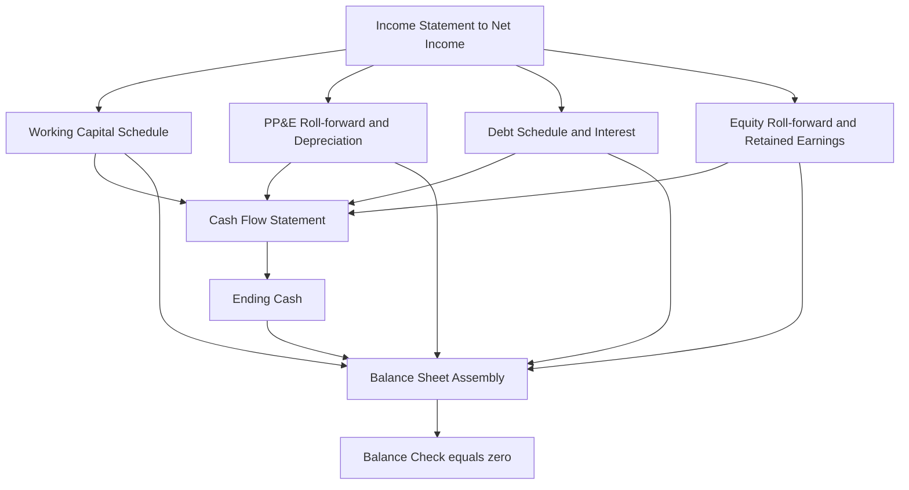
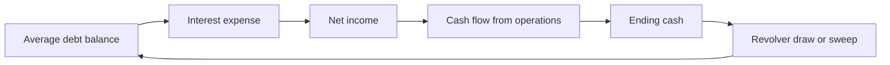
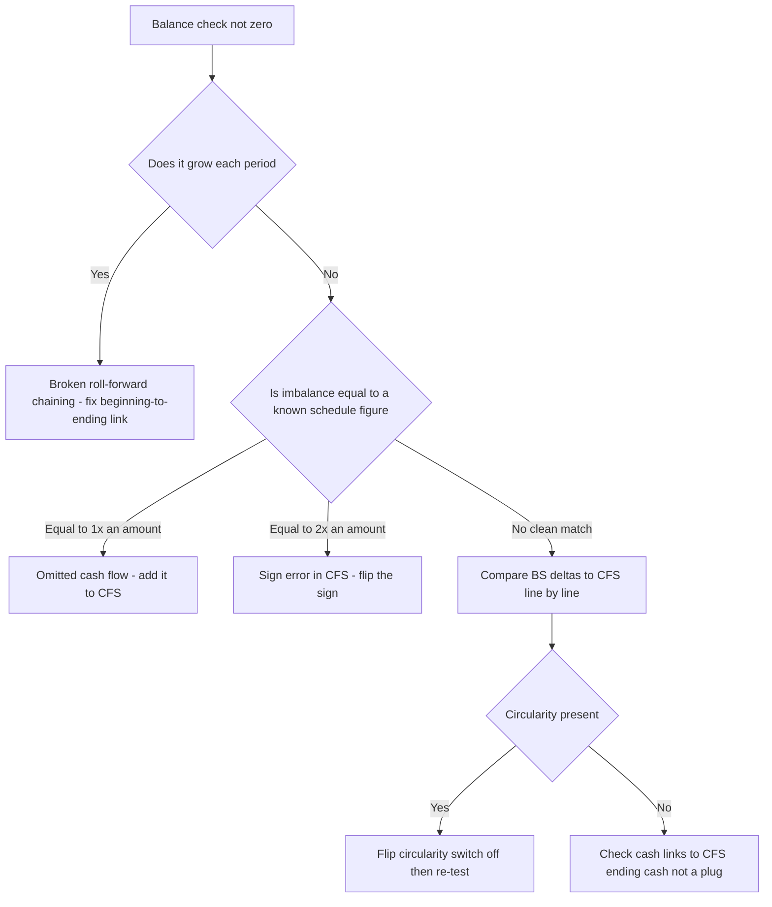

<!-- v2-deep -->

# Chapter 15 — Building and Balancing the Balance Sheet

## 1. The Problem

You have spent the last several chapters building the engine of a three-statement model. You forecast revenue and costs down to a projected net income. You built a working-capital schedule, a fixed-asset (PP&E) roll-forward with depreciation, a debt schedule with interest and principal repayments, and an equity roll-forward tracking retained earnings and dividends. Each of these lives on its own tab or block, quietly humming.

Now comes the moment that separates a real model from a pile of disconnected schedules: you must **assemble the projected balance sheet** and prove that it *balances* — that total assets equal total liabilities plus shareholders' equity, in every single forecast period.

Here is the problem. The balance sheet is the one statement you do **not** get to forecast line by line with independent assumptions. Almost every line is an *output* pulled from a schedule you already built. If you try to "plug" a number to force the balance, you have destroyed the model's integrity — the numbers no longer describe a coherent business. And when the balance sheet *doesn't* balance (it usually won't the first time), you are staring at a single difference — say, assets exceed liabilities-plus-equity by 4,732 — with no obvious clue which of a dozen schedules created the discrepancy.

Beginners react to an unbalanced balance sheet by panicking, hard-coding the ending cash figure, or hunting randomly through cells. Professionals treat it as a *diagnostic signal*. An out-of-balance model is not a nuisance; it is the model telling you that money has appeared or disappeared somewhere without being properly recorded. Learning to read that signal — and to build the balance sheet so it *self-checks* — is the single most important structural skill in financial modeling.

Consider what is really at stake. A model that balances is not automatically *correct* — but a model that does not balance is *guaranteed to be wrong*. Balancing is therefore a necessary gate, not a victory lap. Every downstream number you care about — free cash flow, net debt, the enterprise value that anchors your entire investment thesis — is computed from balance sheet lines. If the sheet does not close, those numbers are fiction. Worse, a subtle imbalance that you "fix" with a plug does not go away; it silently poisons every ratio, every credit metric, every valuation multiple, and it does so invisibly, because the check now reads zero. The discipline this chapter teaches is not bureaucratic tidiness. It is the difference between a model you can stake a decision on and one that merely looks finished.

This chapter teaches you to assemble the balance sheet from your supporting schedules, to install a balance check that catches errors instantly, to understand *why* the balance sheet only balances when the cash flow statement is correct, and to troubleshoot an unbalanced model in a systematic, repeatable way rather than by trial and error.

## 2. The Core Idea

The core idea rests on one immovable accounting identity:

> **Assets = Liabilities + Shareholders' Equity**

This is not a formula you compute; it is a law that *must* hold because of double-entry bookkeeping. Every economic event that a business records touches at least two accounts in equal and offsetting amounts. Buy inventory for cash: inventory (asset) up, cash (asset) down — net zero. Borrow 1,000: cash (asset) up 1,000, debt (liability) up 1,000 — both sides rise equally. Earn profit: assets rise (cash or receivables) and retained earnings (equity) rise by the same net income. Because every transaction preserves the identity, a correctly assembled balance sheet *cannot* be out of balance.

It helps to see the four possible "shapes" a single transaction can take, because every business event is one of these and each preserves the identity:

| Transaction type | Left side (Assets) | Right side (L + E) | Identity preserved because |
|---|---|---|---|
| Asset swap | one asset up, another down | unchanged | left side nets to zero |
| Asset + liability up | asset up | liability up | both sides rise equally |
| Asset + liability down | asset down | liability down | both sides fall equally |
| Asset up, equity up (or down) | asset up | equity up | both sides rise equally |

Every capex, every loan drawdown, every dividend, every sale on credit collapses into one of these four rows. This is *why* the identity is unbreakable at the transaction level — and therefore why any imbalance in a model must be a *recording* failure, not an accounting-law failure.

So the modeling idea is this: **you do not force the balance sheet to balance — you let it balance as the automatic consequence of building every other schedule correctly.** The balance sheet is a *reporting layer*, not a *calculation layer*. Each line points to a schedule:

- Cash → the ending cash line from the **cash flow statement**
- Accounts receivable, inventory, accounts payable → the **working-capital schedule**
- Net PP&E → the **fixed-asset roll-forward**
- Debt → the **debt schedule**
- Retained earnings → the **equity roll-forward** (opening + net income − dividends)

The linchpin — the line that makes the whole thing work — is **cash**. Every schedule feeds the cash flow statement, the cash flow statement produces ending cash, and ending cash flows into the balance sheet. If you have accounted for every source and use of cash correctly, the two sides of the balance sheet will agree to the penny. If they don't, you have double-counted a cash flow, omitted one, or given it the wrong sign somewhere. The balance check is your smoke detector.

There is a useful mental reframing here. Think of the balance sheet's two sides as two independent *paths* from the opening balance sheet to the closing one. The **right-hand path** (liabilities and equity) is built from schedules that never touch cash directly — debt principal, retained earnings, share capital. The **left-hand path** (assets) is built the same way for every non-cash line, but its cash line is computed by a *completely separate* engine: the cash flow statement, which walks through net income and every non-cash change. Balancing means these two independently constructed paths land on the same total. They will land together only if the cash flow statement's walk captured *exactly* the same set of changes, with the same signs, as the schedules feeding the other lines. The balance check is a comparison of two paths that were never allowed to peek at each other's answer.

## 3. Why It Works

Why does getting the cash flow statement right *guarantee* the balance sheet balances? The proof is short and worth internalizing, because it is the intellectual foundation of the entire troubleshooting method.

Start from the identity holding in the **prior** period (period 0), which we assume is true — it's a historical, audited balance sheet:

$$A_0 = L_0 + E_0$$

Now move to period 1. Every balance-sheet line changes by some amount. Split assets into cash and non-cash assets:

$$A_1 = \text{Cash}_1 + \text{NonCashAssets}_1$$

The change in cash from period 0 to period 1 is, by definition, the **net change in cash** computed on the cash flow statement:

$$\text{Cash}_1 = \text{Cash}_0 + \Delta\text{Cash}$$

where ΔCash = Cash Flow from Operations + Cash Flow from Investing + Cash Flow from Financing.

Here is the key insight. The cash flow statement is *constructed* by taking net income and adjusting for every change in every non-cash balance sheet account. CFO adds back non-cash expenses (depreciation) and subtracts increases in non-cash working-capital assets while adding increases in liabilities. CFI captures changes in PP&E and investments. CFF captures changes in debt and equity and subtracts dividends. In other words, ΔCash is *defined* as:

$$\Delta\text{Cash} = \text{Net Income} - \Delta\text{NonCashAssets} + \Delta\text{Liabilities} + \Delta\text{Equity from financing}$$

Because net income flows into retained earnings (equity), the change in *total* equity is net income minus dividends plus any share issuance. Substitute all the changes back into the identity and every non-cash term cancels against its mirror image on the cash flow statement. What remains is exactly:

$$A_1 = L_1 + E_1$$

Let us make the cancellation fully explicit, because seeing it once removes all mystery. We want to show that the *change* in each side is equal — i.e. ΔA = ΔL + ΔE. Write the change in total assets as the change in cash plus the change in non-cash assets:

$$\Delta A = \Delta\text{Cash} + \Delta\text{NonCashAssets}$$

Substitute the definition of ΔCash from above:

$$\Delta A = \big(\text{NI} - \Delta\text{NonCashAssets} + \Delta L + \Delta E_{fin}\big) + \Delta\text{NonCashAssets}$$

The two ΔNonCashAssets terms cancel:

$$\Delta A = \text{NI} + \Delta L + \Delta E_{fin}$$

Now, the change in total equity is retained-earnings growth (NI − Dividends) plus financing changes (share issuance/buyback), and Dividends are already inside ΔE_fin as a financing outflow, so NI + ΔE_fin is precisely ΔE (total equity change). Therefore:

$$\Delta A = \Delta L + \Delta E \quad\Longrightarrow\quad A_1 = L_1 + E_1$$

The identity **propagates** from period 0 to period 1 *automatically* — but only if ΔCash on the cash flow statement captures the change in *every* non-cash account with the correct sign. Miss one account, or double-count one, and the cancellation is incomplete: the leftover term is precisely your out-of-balance amount.

This is why the phrase "the balance sheet only balances when the cash flow statement is correct" is literally true. The cash flow statement is the *reconciliation* between two consecutive balance sheets. If the reconciliation is complete, balance is guaranteed; if it has a gap, that gap shows up as the imbalance. The size of your imbalance *is* the size of the cash flow error.

One corollary is worth stating because it powers the entire diagnostic method in Section 9. Suppose exactly one non-cash change of magnitude *x* is omitted from the cash flow statement. Then the cancellation leaves a single residual term of size *x*, and the balance check reads exactly *x* (with a sign that tells you whether assets or L+E is too high). If instead a change of magnitude *x* has its *sign flipped* on the cash flow statement, the residual is 2*x* — you both failed to remove the correct term and added its negative. The imbalance magnitude is not random noise; it is a fingerprint that maps directly back to the schedule amount that was mishandled.

## 4. Full Technical Content

### 4.1 The build order: schedules first, balance sheet last

Never build the balance sheet first. Build it *last*, after every supporting schedule and the cash flow statement are complete. The professional sequence is:


*Every supporting schedule feeds both the cash flow statement and the balance sheet; ending cash is the bridge that closes the loop.*

### 4.2 Assembling each balance sheet line

Every balance sheet line should be a **link to a schedule**, never a hard-coded number and never a fresh assumption. Below is the standard mapping for a projection column (say cell references are illustrative; build the real thing in Excel).

**Assets**

| Line | Source | Illustrative formula |
|---|---|---|
| Cash and equivalents | Cash flow statement, ending cash | `=CashFlow!EndingCash` |
| Accounts receivable | Working-capital schedule | `=WC!AR_ending` |
| Inventory | Working-capital schedule | `=WC!Inv_ending` |
| Prepaid / other current assets | Working-capital schedule | `=WC!OtherCA_ending` |
| Net PP&E | Fixed-asset roll-forward | `=PPE!NetPPE_ending` |
| Intangibles / goodwill | Intangibles roll-forward | `=Intang!Net_ending` |

**Liabilities**

| Line | Source | Illustrative formula |
|---|---|---|
| Accounts payable | Working-capital schedule | `=WC!AP_ending` |
| Accrued / other current liabilities | Working-capital schedule | `=WC!OtherCL_ending` |
| Short-term / revolver debt | Debt schedule | `=Debt!Revolver_ending` |
| Long-term debt | Debt schedule | `=Debt!LTD_ending` |
| Deferred tax liability | Tax / deferred-tax schedule | `=Tax!DTL_ending` |

**Shareholders' equity**

| Line | Source | Illustrative formula |
|---|---|---|
| Common stock / paid-in capital | Equity roll-forward | `=Equity!PaidIn_ending` |
| Retained earnings | Equity roll-forward | `=Equity!RE_ending` |
| Treasury stock (contra-equity) | Equity roll-forward | `=Equity!Treasury_ending` |

The retained earnings roll-forward is worth spelling out because it is where net income re-enters the balance sheet:

$$\text{RE}_{end} = \text{RE}_{beg} + \text{Net Income} - \text{Dividends}$$

In Excel, the ending retained earnings of one period must equal the beginning retained earnings of the next — so `RE_beg` in column D links to `RE_end` in column C. This chaining is what carries equity forward through the forecast.

### 4.3 A concrete cell-by-cell layout

Abstract formulas like `=WC!AR_ending` are fine as concepts, but you build models in real cells. Here is a concrete single-tab layout you can reproduce exactly. Assume the model sits on one worksheet, historicals in column **C** (Year 0), and forecast Year 1 in column **D**. Assumptions live in rows near the top; schedules in the middle; statements below.

Working-capital block (rows 20–24):

| Cell | Contents | Formula |
|---|---|---|
| C21 | AR Year 0 | `150` (input, blue) |
| D21 | AR Year 1 | `=D6` (driver → e.g. days-sales link, or direct `170`) |
| C22 | Inventory Year 0 | `120` |
| D22 | Inventory Year 1 | `170`-type link |
| C23 | AP Year 0 | `60` |
| D23 | AP Year 1 | link |

PP&E roll-forward (rows 30–34):

| Cell | Contents | Formula |
|---|---|---|
| D30 | Beginning net PP&E | `=C34` (chains to prior ending) |
| D31 | Plus capex | `=D12` (capex assumption) |
| D32 | Less depreciation | `=-D13` (depreciation assumption, entered negative) |
| D34 | Ending net PP&E | `=D30+D31+D32` |

Debt schedule (rows 40–43):

| Cell | Contents | Formula |
|---|---|---|
| D40 | Beginning LTD | `=C43` |
| D41 | Less repayment | `=-D14` |
| D43 | Ending LTD | `=D40+D41` |

Retained-earnings roll-forward (rows 50–53):

| Cell | Contents | Formula |
|---|---|---|
| D50 | Beginning RE | `=C53` |
| D51 | Plus net income | `=D80` (link to IS net income) |
| D52 | Less dividends | `=-D15` |
| D53 | Ending RE | `=D50+D51+D52` |

Cash flow statement (rows 60–72):

| Cell | Contents | Formula |
|---|---|---|
| D61 | Net income | `=D80` |
| D62 | Plus depreciation | `=D13` |
| D63 | Less increase in AR | `=-(D21-C21)` |
| D64 | Less increase in inventory | `=-(D22-C22)` |
| D65 | Plus increase in AP | `=D23-C23` |
| D66 | **CFO subtotal** | `=SUM(D61:D65)` |
| D68 | Capex | `=-D12` |
| D69 | **CFI subtotal** | `=D68` |
| D70 | Debt repayment | `=-D14` |
| D71 | Dividends paid | `=-D15` |
| D72 | **CFF subtotal** | `=SUM(D70:D71)` |
| D74 | Net change in cash | `=D66+D69+D72` |
| D75 | Beginning cash | `=C90` (prior ending cash) |
| D76 | Ending cash | `=D75+D74` |

Balance sheet (rows 90–104):

| Cell | Contents | Formula |
|---|---|---|
| D90 | Cash | `=D76` (links to CFS ending cash — never a typed number) |
| D91 | AR | `=D21` |
| D92 | Inventory | `=D22` |
| D93 | Net PP&E | `=D34` |
| D95 | **Total assets** | `=SUM(D90:D93)` |
| D97 | AP | `=D23` |
| D98 | LTD | `=D43` |
| D100 | Common stock | `=C100` (no issuance → carried flat) |
| D101 | Retained earnings | `=D53` |
| D103 | **Total L + E** | `=SUM(D97:D101)` |
| D104 | **Balance check** | `=ROUND(D95-D103,3)` |

Notice that **every single forecast cell in the balance sheet block (rows 90–103) is a link** — there is not one typed number among them. That is the visual signature of a correctly wired model: select rows 90–103 in the forecast column, and Excel's formula auditing should show every cell pointing elsewhere. If any cell shows a constant, you have found a plug before it ever hurt you.

### 4.4 Building the totals and the balance check

After the lines are linked, sum them:

- `Total Assets` = `SUM(all asset lines)`
- `Total Liabilities` = `SUM(all liability lines)`
- `Total Equity` = `SUM(all equity lines)`
- `Total Liabilities and Equity` = `Total Liabilities + Total Equity`

Then build the **balance check** as a dedicated row, ideally directly beneath the balance sheet and repeated on a summary/checks tab:

```
Balance Check = Total Assets − Total Liabilities and Equity
```

In Excel: `=B_TotalAssets - B_TotalLiabEquity`. This should read **0** in every column. Best practice is to wrap it so errors are visually loud:

```
=IF(ROUND(TotalAssets - TotalLiabEquity, 3) = 0, "OK", TotalAssets - TotalLiabEquity)
```

Note the `ROUND` to three decimals: floating-point arithmetic in Excel can leave a residue like 0.0000000004, which is not a real error but would trip a raw `=0` test. Rounding to a fraction of a currency unit tolerates that noise while still catching any genuine imbalance (which will be at least a whole currency unit).

Formatting the check is as important as building it. Apply **conditional formatting**: if the absolute value exceeds a tiny tolerance (e.g. `ABS(check) > 0.5`), fill the cell red. A green/red check row across all periods gives you an instant, unmissable health readout. Many analysts also build a single master check cell — `=SUM(ABS(all period checks))` — pinned at the top of the model, so one glance confirms the whole model is intact.

A subtle point on the master check: use `SUM(ABS(...))`, not `ABS(SUM(...))`. If period 1 is off by +50 and period 2 is off by −50, `ABS(SUM(...))` reads zero and lulls you into thinking the model is clean, while `SUM(ABS(...))` correctly reports 100. Errors of opposite sign in different periods are common (a timing misalignment shifts an item one period), so the aggregation must not let them cancel.

### 4.5 The circularity wrinkle: interest, cash, and the revolver

There is a structural subtlety that often causes *apparent* balance problems: **circularity**. If your model computes interest expense on *average* debt (including a cash-sweeping revolver), then interest affects net income, which affects cash, which affects the revolver balance, which affects interest — a circular reference. Excel handles this only if **iterative calculation** is enabled (File → Options → Formulas → Enable iterative calculation, typically 100 iterations, max change 0.001).

The loop is worth seeing as a diagram, because understanding *where* it closes is what lets you break it cleanly:


*The interest-cash-revolver loop. Each arrow is a real dependency; together they form a cycle Excel can only resolve by iterating.*

Circularity is legitimate and common, but it makes debugging harder because a single error can cascade and Excel may throw `#REF!`/`0` "circ breaker" values. Best practice: build a **circularity switch** — a cell (say `CircSwitch` = 1 or 0) that, when set to 0, forces interest to reference a fixed value or zero, breaking the loop. When your balance check breaks, flip the switch off, let the model settle, fix the error, then flip it back on. This isolates genuine logic errors from circularity artifacts.

A robust switch is built like this. Suppose average-debt interest would be `=Rate*AVERAGE(D40,D43)`. Wrap it: `=IF(CircSwitch=1, Rate*AVERAGE(D40,D43), Rate*D40)`. With the switch off, interest is computed on the *beginning* balance only — no dependence on the ending balance, so the loop opens and the model becomes deterministic. Many teams go further and add a "copy-paste-values" interest override: a row where, if a boolean is set, the interest cell reads a hard-coded snapshot instead of any formula. The point is always the same — you need a one-click way to make the model non-circular so that when the check breaks you can tell *logic error* from *iteration not-yet-converged*.

### 4.6 Formatting conventions that prevent errors

- **Colour code inputs vs. formulas.** Blue font for hard-coded inputs/assumptions, black for formulas/links. On a properly built balance sheet, *no cell should be blue* except possibly the opening historical column. A blue cell in a forecast column is a red flag that someone plugged a number.
- **No hard-codes in projection columns.** Every forecast cell is a link or a calculation.
- **Consistent sign convention.** Assets, liabilities, and equity are all shown as positives on the balance sheet. Signs (negatives for uses of cash) live on the cash flow statement, not here.
- **Anchor the check visibly.** Put the balance check row immediately under Total Liabilities and Equity and on a dedicated "Checks" tab.
- **Freeze the historicals.** The last actual column should be locked (or clearly shaded) so no one accidentally overwrites the audited opening balances the whole forecast propagates from.

## 5. Worked Examples

### Example A — A clean, balancing build

We project one year forward. Opening (Year 0) balance sheet, all figures in ₹ '000:

| Year 0 | Assets | | Liab + Equity | |
|---|---|---|---|---|
| Cash | 100 | Accounts payable | 60 | |
| Accounts receivable | 150 | Long-term debt | 300 | |
| Inventory | 120 | Common stock | 200 | |
| Net PP&E | 400 | Retained earnings | 210 | |
| **Total assets** | **770** | **Total L+E** | **770** | |

Year 1 assumptions and schedule outputs:

- Net income = 90; dividends = 30
- AR rises to 170 (+20); Inventory rises to 140 (+20); AP rises to 75 (+15)
- Capex = 80; depreciation = 50 → Net PP&E = 400 + 80 − 50 = 430
- Debt: repay 40 → LTD = 300 − 40 = 260
- No share issuance → Common stock stays 200

**Step 1 — Retained earnings roll-forward:**
RE₁ = 210 + 90 − 30 = **270**

**Step 2 — Cash flow statement:**

*CFO:* Net income 90 + depreciation 50 − ΔAR 20 − ΔInventory 20 + ΔAP 15 = **115**
*CFI:* − Capex 80 = **−80**
*CFF:* − Debt repayment 40 − Dividends 30 = **−70**

ΔCash = 115 − 80 − 70 = **−35**
Ending cash = 100 + (−35) = **65**

**Step 3 — Assemble Year 1 balance sheet:**

| Year 1 | Assets | | Liab + Equity | |
|---|---|---|---|---|
| Cash | 65 | Accounts payable | 75 | |
| Accounts receivable | 170 | Long-term debt | 260 | |
| Inventory | 140 | Common stock | 200 | |
| Net PP&E | 430 | Retained earnings | 270 | |
| **Total assets** | **805** | **Total L+E** | **805** | |

**Step 4 — Balance check:** 805 − 805 = **0. ✓**

The model balances because *every* change flowed through the cash flow statement. Notice how ending cash (65) was not assumed — it was the residual output that makes the identity hold.

To drive home the two-paths intuition from Section 2, verify the balance a second way — by *deltas* rather than by totals. The right side changed by: ΔAP +15, ΔLTD −40, ΔCommon 0, ΔRE +60, total **+35**. The left side's non-cash lines changed by: ΔAR +20, ΔInventory +20, ΔPP&E +30, total **+70**; so for the identity to hold, cash must change by 35 − 70 = **−35**. And indeed the cash flow statement, built entirely independently, produced ΔCash = −35. The two paths meet. That agreement is the balance check.

### Example B — Introducing an error, then diagnosing it

Take Example A but suppose the modeller **forgot to include dividends in the cash flow statement** (a very common mistake — dividends are recorded in the equity roll-forward but omitted from CFF).

Now CFF = −40 (debt repayment only), so ΔCash = 115 − 80 − 40 = **−5**, and ending cash = 100 − 5 = **95**.

But retained earnings *still* subtracted the 30 dividend (RE = 270), because the equity schedule is separate and correct. Re-assemble:

| Year 1 (with error) | Assets | | Liab + Equity | |
|---|---|---|---|---|
| Cash | 95 | Accounts payable | 75 | |
| Accounts receivable | 170 | Long-term debt | 260 | |
| Inventory | 140 | Common stock | 200 | |
| Net PP&E | 430 | Retained earnings | 270 | |
| **Total assets** | **835** | **Total L+E** | **805** | |

**Balance check:** 835 − 805 = **+30. ✗**

The imbalance is **exactly 30** — the omitted dividend. This is the whole diagnostic principle in one number: *the size of the imbalance equals the size of the missing (or double-counted) cash flow.* Assets are too high by 30 because we kept 30 of cash that should have left the business; equity correctly reflects that the 30 is gone. The cash flow statement — the reconciliation between the two balance sheets — had a 30-sized hole.

### Example C — A sign error that doubles the damage

Suppose instead the modeller entered the debt repayment with the **wrong sign** in CFF, treating the 40 repayment as a +40 borrowing:

CFF = +40 (wrong) − 30 dividends = +10, so ΔCash = 115 − 80 + 10 = **45**, ending cash = 145.

But the debt schedule (separate and correct) still shows LTD = 260 (repaid). Re-assemble: Total assets = 145 + 170 + 140 + 430 = 885; Total L+E = 75 + 260 + 200 + 270 = 805.

**Balance check = 885 − 805 = +80. ✗**

Here the imbalance is **80 = 2 × 40**. A sign error is doubly costly: you removed the −40 *and* added a +40, an 80-swing. Recognising that an imbalance is exactly *twice* a schedule figure is a strong hint that you have flipped a sign rather than omitted a line. This pattern — imbalance = 1× (omission) or 2× (sign flip) of a specific schedule amount — is your fastest route to the culprit.

### Example D — A broken roll-forward that drifts over two periods

The errors above show up in a single period. The most insidious error grows. Extend Example A to a second year (Year 2), with these Year 2 assumptions: Net income 100; dividends 30; AR → 190 (+20); Inventory → 155 (+15); AP → 85 (+10); Capex 70; Depreciation 55; Debt repayment 40.

**Correct Year 2 (for reference).**
RE₂ = 270 + 100 − 30 = 340. PP&E₂ = 430 + 70 − 55 = 445. LTD₂ = 260 − 40 = 220.
CFO = 100 + 55 − 20 − 15 + 10 = 130. CFI = −70. CFF = −40 − 30 = −70. ΔCash = 130 − 70 − 70 = −10. Ending cash = 65 − 10 = 55.
Total assets = 55 + 190 + 155 + 445 = **845**. Total L+E = 85 + 220 + 200 + 340 = **845**. Check = **0. ✓**

**Now the error:** the modeller wired Year 2 beginning retained earnings to a *typed* 210 (the Year 0 figure) instead of linking to Year 1 ending RE of 270 — a classic broken chain. Then RE₂ = 210 + 100 − 30 = **280** instead of 340, understating equity by 60. Cash and every other line are unchanged (the cash flow statement is still correct), so:

Total assets = **845** (unchanged). Total L+E = 85 + 220 + 200 + 280 = **785**.
**Balance check (Year 2) = 845 − 785 = +60. ✗**

Two things make this the signature of a broken roll-forward. First, **Year 1 still balances** (0) while Year 2 is off by 60 — the error appears the moment the broken link takes effect. Second, if you carried the same mistake forward, the gap would *compound*: Year 3's beginning RE would inherit the 60 shortfall and add its own, so the imbalance climbs period after period. A check row that reads 0, 0, 60, 125, 190... is screaming "broken chaining" — trace the ending-to-beginning link of retained earnings (and then PP&E and debt) and you will find the typed constant where a link belongs.

### Example E — A legitimate imbalance that is not an error: the missing revolver

Here is a case that trips up learners because the model is *not* wrong in the accounting sense — it is *incomplete*. Return to Example A but change one assumption: the firm has a large discretionary capex of **250** in Year 1 instead of 80, and there is no revolver in the model.

CFO stays 115. CFI = −250. CFF = −40 − 30 = −70. ΔCash = 115 − 250 − 70 = **−205**. Ending cash = 100 − 205 = **−105**.

Assemble: Total assets = −105 + 170 + 140 + (400 + 250 − 50 = 600) = **805**. Total L+E = 75 + 260 + 200 + 270 = **805**. **Check = 0. ✓**

The balance sheet *balances* — but cash is **negative 105**, which is economically impossible; a company cannot hold negative cash in the bank. The model is internally consistent (the identity holds) yet describes an infeasible business. This is exactly the problem a **revolver / cash-sweep** solves: it draws down a line of credit to keep cash at or above a minimum, and repays it when cash is ample. Adding a revolver that draws 105 (plus any minimum-cash buffer) would move cash to 0 and add 105 of revolver debt — assets +105, liabilities +105 — and the sheet still balances, now feasibly. The lesson: **a zero balance check confirms consistency, not realism.** Always scan the cash line for negatives; a balanced model with negative cash is a model missing its financing plug (the revolver), which is a legitimate mechanism, not a hard-code.

## 6. Connections

- **To the cash flow statement (Chapter 14):** The balance sheet cannot be understood in isolation from the cash flow statement. The CFS *is* the change-reconciliation between two balance sheets; the balance check is really a check on the CFS. Any balance sheet error is a cash flow error wearing a disguise.
- **To the income statement:** Net income links to the balance sheet *only* through retained earnings. If net income is wrong, retained earnings and cash both move, so the sheet may still balance while being wrong — a reminder that *balancing is necessary but not sufficient* for correctness.
- **To the supporting schedules (Chapters 10–13):** Every non-cash line is an *output* of a schedule. The discipline of "balance sheet lines are links, never inputs" is what makes the identity self-enforcing.
- **To the revolver / cash sweep (debt schedule):** As Example E shows, a balancing model can still be infeasible (negative cash). The revolver is the legitimate mechanism that absorbs cash shortfalls and surpluses; it is what turns a merely *consistent* model into a *realistic* one, and it is the usual source of intentional circularity.
- **To valuation (later chapters):** Unlevered free cash flow, net debt, and invested capital all draw directly from these balance sheet lines. A model that doesn't balance produces a nonsensical enterprise value. Balancing is the gate you must pass before any valuation output can be trusted.
- **To scenario/sensitivity analysis:** Because the balance check propagates across all periods, toggling a driver and watching the check *stay at zero* confirms your links are robust. A scenario that breaks the balance reveals a hard-code you missed.

## 7. Traps and Common Errors

1. **Plugging cash to force a balance.** The cardinal sin. Hard-coding ending cash (or worse, a "plug" line) makes the check read zero while the model is silently broken. Cash must *always* link to the cash flow statement's ending cash.
2. **Omitting a cash flow.** Dividends, share buybacks, capex, or deferred taxes recorded in a schedule but forgotten in the CFS. Imbalance = the omitted amount.
3. **Sign errors in the cash flow statement.** Treating a use of cash as a source or vice versa. Imbalance = 2× the amount — a telltale signature.
4. **Double-counting a change.** Capturing the same working-capital movement twice, or letting an item hit both CFO and CFI. Imbalance = the doubled amount.
5. **Broken roll-forward chaining.** Ending balance of one period not linked to the beginning balance of the next (retained earnings, PP&E, debt). This typically causes the imbalance to *grow each period* — a cumulative drift is the fingerprint (see Example D).
6. **Inconsistent depreciation.** Depreciation added back in CFO but not deducted in the PP&E roll-forward (or a different figure used in each). The PP&E and CFS must reference the *same* depreciation cell.
7. **Iterative calculation off (or circularity mishandled).** With a debt/interest circularity, disabling iteration yields zeros or `#REF!` that masquerade as balance errors. Know whether your imbalance is a logic error or a circularity artifact — use the circularity switch to tell them apart.
8. **Rounding a hard `=0` check.** A raw equality test can flag harmless floating-point residue. Use `ROUND(check, 3)` so real errors (≥1 unit) still trip it but noise doesn't.
9. **Mixing signs on the balance sheet itself.** Entering a liability as negative to "make it net." Keep all balance sheet figures positive; signs belong on the cash flow statement.
10. **`ABS(SUM())` instead of `SUM(ABS())` in the master check.** Opposite-sign period errors cancel and hide themselves. Always aggregate absolute values so a +50 and a −50 report as 100, not 0.
11. **Ignoring a balanced sheet with negative cash.** The check reads zero, so it "passes," but cash is impossible (Example E). A balanced model is not automatically feasible; scan the cash line and add a revolver if it goes negative.
12. **Deferred taxes and other non-obvious accruals.** A change in deferred tax liability is a real non-cash source of cash that must appear in CFO. Model the DTL on the balance sheet but forget the CFO add-back, and you get a clean 1× imbalance equal to the DTL movement.
13. **Stock issuance/buyback split across statements.** Cash from a share issuance belongs in CFF and paid-in capital rises on the balance sheet — both must move together. Recording one without the other is a 1× imbalance.
14. **Overwriting a historical opening balance.** If the last actual column is edited by accident, the whole forecast propagates from a wrong base and every period is off by the same constant. Lock or shade the historicals.

## 8. Interview Angles

Balance-sheet mechanics are among the most heavily tested topics in finance interviews because they reveal instantly whether a candidate *understands* the three statements or has merely memorized them. Common questions and the crisp answers:

- **"Walk me through what happens to the three statements if depreciation increases by 10 (assume a 25% tax rate)."** Income statement: pre-tax income falls 10, tax falls 2.5, net income falls 7.5. Cash flow statement: start from net income −7.5, add back the +10 non-cash depreciation → cash *rises* 2.5 (the tax shield). Balance sheet: cash up 2.5, net PP&E down 10 (assets net −7.5); retained earnings down 7.5 (equity −7.5). Both sides fall 7.5 — it balances. The elegant point: depreciation is a *source* of cash equal to the tax it shelters.
- **"If you could have only two of the three statements, which would you pick and why?"** The balance sheet and the income statement — because from those two you can *reconstruct* the cash flow statement (it is exactly the reconciliation of the change in the balance sheet given the income statement). You cannot reverse the logic to rebuild a balance sheet from the income statement and cash flow statement alone without an opening balance sheet.
- **"Why might a model balance but still be wrong?"** Because balancing only proves the cash flow reconciliation is *complete*, not that any individual assumption is *correct*. A wrong net income flows into both cash and retained earnings, moving both sides equally — the sheet balances around a wrong number.
- **"Your model is off by 2× the debt repayment. What's your first guess?"** A sign error on the debt repayment line of the cash flow statement (Example C's signature).
- **"Your check is zero in Year 1 but grows every year after. Diagnosis?"** A broken roll-forward link — an ending balance not chained to the next period's beginning balance (Example D).
- **"The sheet balances but cash is negative. Is the model wrong?"** Not accounting-wrong, but economically infeasible; it is missing a revolver/cash-sweep to fund the shortfall (Example E).

## 9. First-Principles Recap

Strip everything away and you are left with one law: **Assets = Liabilities + Equity**, enforced by double-entry bookkeeping in which every transaction moves two accounts by equal and offsetting amounts. Because the law holds in the opening period and every transaction preserves it, the *only* way a projected balance sheet can fail to balance is if a transaction's two halves were not both recorded — and the place where that omission surfaces is the cash flow statement, which is nothing more than the complete reconciliation of the change in cash to the change in every non-cash account.

So the balance sheet is an *output*, assembled by linking each line to the schedule that owns it, with cash linked to the cash flow statement. The balance check is not a formality — it is a live proof that your reconciliation is complete. When it reads zero, every source and use of funds has been accounted for. When it reads anything else, the *magnitude* of the number points you straight at the missing, doubled, or sign-flipped cash flow. You never force the balance; you earn it by building every schedule correctly, and the identity closes itself. And even a zero check is only half the assurance — it certifies consistency, not realism, so you still glance at the cash line to confirm the business it describes could actually exist.

## 10. Quick-Reference

**The identity:** Assets = Liabilities + Shareholders' Equity (every period).

**Balance sheet line sources:**

| BS line | Comes from |
|---|---|
| Cash | Cash flow statement — ending cash |
| AR, Inventory, AP, accruals | Working-capital schedule |
| Net PP&E | PP&E roll-forward |
| Debt (ST + LT) | Debt schedule |
| Deferred tax liability | Tax / deferred-tax schedule |
| Retained earnings | Equity roll-forward: RE_beg + NI − Dividends |
| Common stock | Equity roll-forward |

**The balance check:** `=ROUND(Total Assets − Total Liab-and-Equity, 3)` → must be 0. Wrap in `IF(...=0,"OK",diff)`, conditional-format red on `ABS>tolerance`, and pin a master `SUM(ABS(all checks))` cell (never `ABS(SUM(...))`).

**Troubleshooting decision tree:**


*A systematic path from imbalance to root cause, driven by the magnitude and behaviour of the check.*

**Fast diagnostic rules of thumb:**
- Imbalance = a schedule amount → *omitted* cash flow.
- Imbalance = 2× a schedule amount → *sign-flipped* cash flow.
- Imbalance *grows each period* → broken roll-forward link.
- Imbalance appears only with circularity on → circularity artifact, not logic.
- Check reads zero but cash is negative → missing revolver, not a balancing error.
- First thing to verify: does BS cash link to CFS ending cash? Is any forecast cell blue (a hard-code)?

**The precise troubleshooting method:** For the first period that breaks, list the change (Δ) in every balance sheet line from prior to current period. Then compare each Δ to the corresponding line on the cash flow statement. Every non-cash Δ must appear on the CFS with the correct sign (asset increase = cash use, liability/equity increase = cash source). The line where the BS delta and the CFS entry disagree is your error. This converts a vague "it's off by 4,732" into a mechanical line-by-line reconciliation that *always* finds the culprit.

## 11. Build-It-Yourself Exercise

Build this in Excel from scratch. Do not copy the answers — construct the live, linked model so that changing any driver keeps the check at zero.

**Given — Year 0 balance sheet (₹ '000):** Cash 80, AR 120, Inventory 100, Net PP&E 500 (Total assets 800); AP 50, Long-term debt 350, Common stock 200, Retained earnings 200 (Total L+E 800).

**Year 1 assumptions:** Net income 110; dividends 40; AR → 140; Inventory → 130; AP → 65; Capex 90; Depreciation 60; Debt repayment 50; no share issuance.

**Your tasks:**
1. Build a **retained-earnings roll-forward** and a **PP&E roll-forward** as separate blocks, each with beginning + additions − subtractions = ending, colour-coding inputs blue and formulas black.
2. Build a **cash flow statement** (CFO, CFI, CFF) that references those schedules — never re-typing numbers — and compute ending cash.
3. **Assemble the Year 1 balance sheet** with every line linked to its schedule and cash linked to the CFS ending cash.
4. Add a **balance check row** using `ROUND(TotalAssets − TotalLiabEquity, 3)` and conditional-format it red on any non-zero.
5. **Verify it balances.** (Self-check target: ending cash should be 80 + [CFO 110 + 60 − 20 − 30 + 15 = 135] + [CFI −90] + [CFF −50 − 40 = −90] = 80 + 135 − 90 − 90 = **35**; Total assets = 35 + 140 + 130 + 530 = **835**; Total L+E = 65 + 300 + 200 + 270 = **835**; check = 0.)
6. **Extend to Year 2** with: Net income 120; dividends 40; AR → 155; Inventory → 145; AP → 72; Capex 80; Depreciation 65; Debt repayment 50. Chain every beginning balance to the prior ending balance. (Self-check: RE₂ = 270 + 120 − 40 = 350; PP&E₂ = 530 + 80 − 65 = 545; LTD₂ = 300 − 50 = 250; CFO = 120 + 65 − 15 − 15 + 7 = 162; CFI = −80; CFF = −50 − 40 = −90; ΔCash = −8; ending cash = 35 − 8 = 27; Total assets = 27 + 155 + 145 + 545 = **872**; Total L+E = 72 + 250 + 200 + 350 = **872**; check = 0.)
7. **Now break it three ways, one at a time, and confirm the signature each time:**
   - **(a) Omission:** delete the dividend line from CFF in Year 1 only. Confirm the check jumps to exactly **+40** in Year 1.
   - **(b) Sign flip:** restore the dividend, then flip the Year 1 debt-repayment sign in the CFS from −50 to +50. Confirm the check reads exactly **+100** (2 × 50).
   - **(c) Broken chain:** restore the sign, then rewire Year 2 beginning retained earnings to a typed 200 instead of linking to Year 1 ending RE of 270. Confirm Year 1 still reads **0** while Year 2 reads **+70** (the 70 of lost RE growth), and that the gap would compound if carried further.
   In each case, use the line-by-line reconciliation method from Section 10 to locate and restore the fault. This step is the real lesson — you have now experienced all three imbalance signatures *as signals* and used their magnitude and behaviour to find the fault, which is exactly what you will do on every real model you ever build.

Build every piece in Excel yourself; reading the mechanics is not the same as wiring the links and watching the check hold at zero as you flex the drivers.
