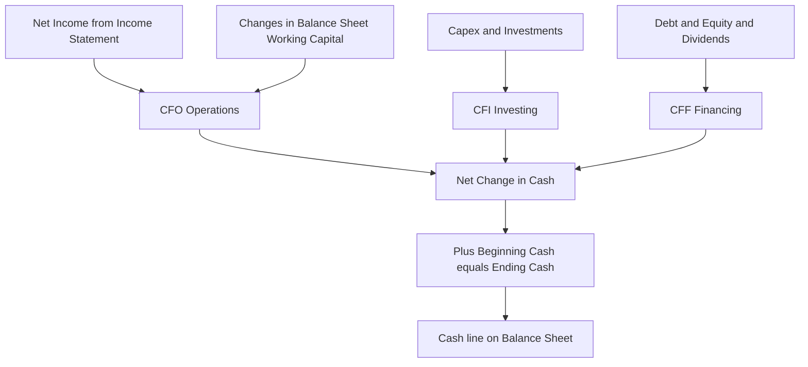
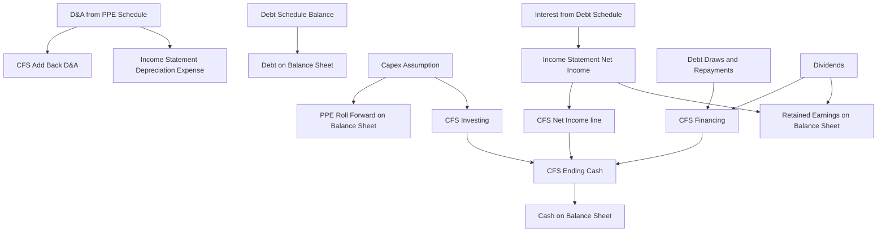
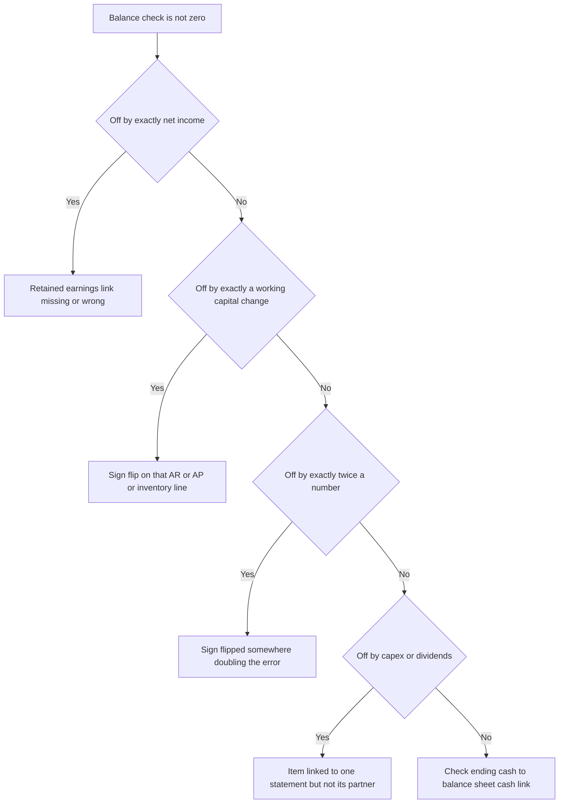

<!-- v2-deep -->

# Chapter 16 — The Cash Flow Statement and Linking the Three Statements

## 1. The Problem

You have built an income statement that ends in net income, and a balance sheet that lists assets, liabilities, and equity at two points in time. Both are useful. Neither answers the single question that keeps a business alive: **did we actually generate cash this year, and where did it go?**

Net income is not cash. A company can report $50 million of profit and still run out of money — because it sold on credit and never collected, or it poured $80 million into a new factory, or it repaid a maturing loan. Conversely, a company can report a loss and still be swimming in cash because it collected old receivables and slashed inventory. Profit is an *accrual* concept: it records revenue when earned and expense when incurred, regardless of when cash changes hands. Solvency is a *cash* concept. The gap between the two is exactly what the cash flow statement measures.

There is a second, model-specific problem. In a three-statement financial model, the income statement and balance sheet are not independent — they are wired together. Net income flows into retained earnings. Capex flows into PP&E. Debt drawdowns flow into the debt balance. If you change one assumption — say, a slower collection of receivables — it must ripple through all three statements *consistently*, and at the end **the balance sheet must still balance**. The mechanism that enforces this consistency, and that produces the one number every model needs — **ending cash** — is the cash flow statement.

Without a cash flow statement, your model is two disconnected pictures. With it, the model becomes a single living organism where every assumption has a traceable cash consequence, and where a broken link announces itself instantly: the balance sheet stops balancing. This chapter shows you how to build that statement using the indirect method, and how to wire the three statements into one integrated, self-checking model.

A concrete illustration of why profit and cash diverge — three companies, all reporting exactly the same $1,000 of net income, land in completely different cash positions:

| Company | Net income | What happened operationally | Operating cash generated |
|---|---|---|---|
| "Collector" | 1,000 | Collected old receivables, cut inventory hard | ~1,600 (cash far above profit) |
| "Steady" | 1,000 | Working capital flat, only D&A add-back | ~1,250 (cash a bit above profit) |
| "Grower" | 1,000 | Sales on credit ballooning, stocking inventory to grow | ~400 (cash far below profit) |

Same income statement line, three different survival odds. The cash flow statement is the only statement that tells these three apart — which is why lenders and acquirers read it first.

## 2. The Core Idea

The cash flow statement reconciles the change in the cash balance between two balance sheet dates by explaining it in three buckets:

- **CFO — Cash Flow from Operations:** cash generated by running the core business (selling products, paying suppliers and employees).
- **CFI — Cash Flow from Investing:** cash spent on or received from long-term assets (buying equipment, acquiring companies, selling investments).
- **CFF — Cash Flow from Financing:** cash from and to capital providers (borrowing, repaying debt, issuing or buying back stock, paying dividends).

Add the three together and you get the **net change in cash** for the period. Add that to **beginning cash** and you get **ending cash** — which is the exact number that appears as the cash line on this year's balance sheet.


*The three cash flow buckets sum to the change in cash, which links straight back to the balance sheet.*

The **indirect method** is the analyst's standard for building CFO. Instead of listing every cash receipt and payment (the direct method, which requires internal data you rarely have in a model), it *starts from net income* and adjusts it back to cash by (a) adding back non-cash expenses like depreciation, and (b) adding or subtracting the changes in working capital accounts. This is elegant because it uses numbers you already have — net income from the income statement, and balance-sheet account changes — and it explicitly bridges the accrual world to the cash world.

**A quick contrast — direct vs indirect method.** Both produce the *identical* CFO number; they differ only in presentation of the operating section:

| | Direct method | Indirect method |
|---|---|---|
| Starting point | Cash collected from customers | Net income |
| How it builds | Lists actual cash receipts and payments | Adjusts accrual profit for non-cash items and working-capital changes |
| Data needed | Gross cash flows (rarely available externally) | Net income + two balance sheets (always available) |
| Investing/financing sections | Identical | Identical |
| Who uses it in modeling | Almost nobody | Essentially everybody |

Because the two methods must reconcile to the same CFO, GAAP actually requires a supplemental reconciliation from net income to CFO even when a company reports using the direct method — which is the indirect method appearing anyway. That is why FMVA teaches the indirect method exclusively: it is what you will build, and it is what the reconciliation footnote of any direct-method filer collapses to.

## 3. Why It Works

The indirect method rests on a single accounting identity. Every balance sheet balances: Assets = Liabilities + Equity. Because it balances in *both* periods, the *changes* also balance:

$$\Delta \text{Assets} = \Delta \text{Liabilities} + \Delta \text{Equity}$$

Now split assets into cash and non-cash assets:

$$\Delta \text{Cash} + \Delta \text{NonCashAssets} = \Delta \text{Liabilities} + \Delta \text{Equity}$$

Rearrange to isolate the change in cash:

$$\Delta \text{Cash} = \Delta \text{Liabilities} + \Delta \text{Equity} - \Delta \text{NonCashAssets}$$

This is the whole cash flow statement in one line. The change in cash is *fully explained* by the changes in every other balance sheet account. That is why, if you capture every non-cash account's movement correctly, ending cash will always make the balance sheet balance — it is a mathematical consequence, not a coincidence.

Read the identity intuitively:

- An **asset going up** uses cash. Buy inventory (inventory up) — cash goes down. Extend credit (receivables up) — cash you *earned* but haven't *collected*, so subtract it. Hence the minus sign on ΔNonCashAssets.
- A **liability going up** is a source of cash. Delay paying a supplier (payables up) — you're holding onto cash. Borrow money (debt up) — cash in. Hence the plus sign on ΔLiabilities.
- **Equity** rises from net income (which we start with) and stock issuance (a financing source), and falls with dividends and buybacks (financing uses).

The indirect method simply *organizes* this identity into the three business-meaning buckets. Net income and working-capital swings that relate to operations go into CFO; changes in long-term assets go into CFI; changes in debt and equity go into CFF. The total is unchanged from the raw identity — it is only re-sorted so a human can read the story.

The **depreciation add-back** deserves its own sentence of "why." Depreciation reduced net income but no cash left the building — the cash left years ago when the asset was purchased (that outflow was recorded as capex in CFI back then). So to get from net income to cash, you add depreciation straight back. It is the purest example of the accrual-to-cash bridge.

**Proving the identity really does re-sort into the three buckets.** Take the rearranged identity and split each term by whether it belongs to operations, investing, or financing:

$$\Delta\text{Cash} = \underbrace{(\text{NI} + \text{D\&A} - \Delta\text{AR} - \Delta\text{Inv} + \Delta\text{AP} + \Delta\text{Accr})}_{\text{CFO}} + \underbrace{(-\Delta\text{grossPPE excl. D\&A})}_{\text{CFI}} + \underbrace{(\Delta\text{Debt} + \Delta\text{Stock} - \text{Div})}_{\text{CFF}}$$

Notice that the equity change $\Delta E$ was split into two pieces: net income (routed into CFO as the starting line) and stock issuance minus dividends (routed into CFF). Net income is not "double counted" — it appears once, at the top of CFO, and its *effect on equity* (retained earnings) is booked on the balance sheet through the retained-earnings roll-forward. The two must agree, which is exactly why the retained-earnings link (Section 4.6) is load-bearing. Every term of the identity has a home in exactly one of the three buckets. Nothing is created, nothing is lost; the total still equals ΔCash. That is the proof that the human-readable statement and the raw identity are the same object.

## 4. Full Technical Content

We build the cash flow statement using the indirect method, section by section, then wire ending cash to the balance sheet and set up the debt/cash plug that makes the model self-balancing.

### 4.1 Layout and inputs

Assume a standard model layout: one column per year, with historical years to the left and forecast years to the right. You need two things already built:

1. A completed **income statement** through net income.
2. A **balance sheet** for the current and prior period (forecast balances driven by their own supporting schedules — working capital days, the PP&E roll-forward, the debt schedule, and the equity roll-forward).

The cash flow statement is built *last* among the three, because it consumes outputs from the other two. Every line either references the income statement or computes a change between two balance sheet columns.

**A concrete column map.** Say your model uses columns `C` (FY0 historical), `D` (FY1), `E` (FY2), `F` (FY3), and rows are consistent across the three statement blocks. Then in the FY1 cash flow column (`D`) a working-capital change line references *two* balance sheet columns — the current FY1 balance in `D` and the prior FY0 balance in `C`. Getting the column offset right (`current − prior`, i.e. `D − C`, never `C − D`) is half the battle; the other half is the sign convention below. A disciplined analyst names the columns once (FY0…FY3 in a header row) and never types a bare year number into a formula again.

### 4.2 Cash Flow from Operations (CFO)

Start with net income and adjust:

| Line | Formula logic | Sign convention |
|---|---|---|
| Net income | `=IS!NetIncome` (link, don't retype) | + |
| Add: Depreciation & amortization | `=+PP&E_Schedule!D&A` | + (add back non-cash) |
| Add: Other non-cash items (stock comp, deferred tax) | link to source | + |
| Change in accounts receivable | `=-(AR_this - AR_prior)` | asset up = cash out |
| Change in inventory | `=-(Inv_this - Inv_prior)` | asset up = cash out |
| Change in accounts payable | `=+(AP_this - AP_prior)` | liability up = cash in |
| Change in accrued expenses | `=+(Accr_this - Accr_prior)` | liability up = cash in |
| **Cash Flow from Operations** | `=SUM(above)` | |

The single most error-prone thing here is **sign convention on working capital**. Burn this rule into memory:

- **Asset increase → subtract** (uses cash). Asset decrease → add.
- **Liability increase → add** (source of cash). Liability decrease → subtract.

A clean way to write every working-capital line so the sign takes care of itself: for an **asset** use `=-(current - prior)`; for a **liability** use `=+(current - prior)`. If you write it that way consistently, an asset that grows automatically produces a negative (cash outflow) and you never have to reason about the sign case by case.

Excel functions and mechanics:
- Use direct cell links (`=Sheet!Cell`) for net income and D&A — never hardcode a number that lives elsewhere.
- For changes, reference the two balance sheet cells directly rather than a separately typed number, so the change updates automatically when assumptions move.
- Format inflows as positive and outflows as negative (many models show outflows in parentheses via the accounting number format `#,##0;(#,##0)`).

**Exact cell-by-cell build for the FY1 CFO block** (assume the CFS block starts at row 40 on a single-sheet model, IS net income sits in `D30`, the PP&E schedule D&A in `D62`, and the balance sheet has AR in row 12, inventory row 13, AP row 20, accruals row 21 — with FY0 in column `C`, FY1 in `D`):

| Cell | Line | Formula |
|---|---|---|
| `D40` | Net income | `=D30` |
| `D41` | Add: D&A | `=D62` |
| `D42` | Change in AR | `=-(D12-C12)` |
| `D43` | Change in inventory | `=-(D13-C13)` |
| `D44` | Change in AP | `=D20-C20` |
| `D45` | Change in accruals | `=D21-C21` |
| `D46` | **CFO** | `=SUM(D40:D45)` |

Then copy `D40:D46` rightward to `E` and `F` for FY2 and FY3 — because every reference is relative and column-consistent, the copy automatically re-points each change to *its* current-minus-prior pair. That copy-right discipline is the single biggest time-saver in three-statement modeling, and it only works if row structure is identical across the balance sheet block.

**Guard against blowing up the sign with a double negative.** Writing `=-(D12-C12)` for an asset is correct. Writing `=-(C12-D12)` is also correct (two sign flips cancel) but reads backwards and will bite you when you copy it. Writing `=D12-C12` for an asset (forgetting the leading minus) is the classic bug — it flips CFO by twice the change. Pick the `=-(current-prior)` form for assets and `=(current-prior)` for liabilities and never deviate.

### 4.3 Cash Flow from Investing (CFI)

CFI captures the acquisition and disposal of long-term assets.

| Line | Formula logic | Typical sign |
|---|---|---|
| Capital expenditures (capex) | `=-Capex_assumption` | negative (outflow) |
| Purchases of investments | `=-Purchases` | negative |
| Proceeds from asset sales | `=+Proceeds` | positive |
| Acquisitions net of cash | `=-Acquisition_cost` | negative |
| **Cash Flow from Investing** | `=SUM(above)` | usually negative |

Capex is the headline. It is almost always an assumption (often driven as a percent of revenue, or from a management capex plan) and it feeds the PP&E roll-forward. The important linkage: **the same capex number appears in CFI and in the PP&E schedule**. Enter it once, in one place, and link both uses to it. A healthy growing company shows persistently negative CFI — it is investing to grow.

**The gain/loss on asset sale trap.** When a company sells equipment, two things must be handled and they interact:

1. The **cash proceeds** (the actual money received) go in CFI as a positive.
2. Any **gain or loss** on the sale already sits inside net income (as a non-operating line). But that gain is not operating cash — the cash is the proceeds, which you are capturing in CFI. So the gain must be **subtracted** in CFO (and a loss added back) to avoid double counting.

Worked micro-example: an asset with book value 40 is sold for proceeds of 50, generating a gain of 10. Net income already includes +10. In the CFS: subtract the 10 gain in CFO (reversing it out of operating), and add the full 50 proceeds in CFI. Net effect on total cash flow = −10 + 50 = +40, which is exactly the book value released — correct. If you forgot to strip the gain out of CFO, you would count that 10 twice and the balance sheet would be off by 10.

### 4.4 Cash Flow from Financing (CFF)

CFF captures flows to and from capital providers.

| Line | Formula logic | Typical sign |
|---|---|---|
| Debt drawdowns / new borrowings | `=+Draws` | positive (inflow) |
| Debt repayments | `=-Repayments` | negative |
| Revolver draw or (paydown) | `=+Revolver_change` (the plug) | + or − |
| Equity issuance | `=+Issuance` | positive |
| Share buybacks | `=-Buybacks` | negative |
| Dividends paid | `=-Dividends` | negative |
| **Cash Flow from Financing** | `=SUM(above)` | + or − |

Debt lines link to the **debt schedule**; dividends link to the **equity/retained-earnings roll-forward**. The revolver line is special — it is frequently the model's **cash plug** (Section 4.7).

**Dividends: the subtle double link.** Dividends touch the model in exactly two places and must be the *same* number in both: (a) CFF as a cash outflow, and (b) the retained-earnings roll-forward as a reduction of equity. If you type dividends as 200 in CFF but the RE roll-forward subtracts 180, the balance sheet breaks by 20. Drive dividends from one cell (often a payout-ratio assumption times net income) and link both uses to it.

### 4.5 Net change in cash and the link to the balance sheet

Below the three sections:

| Line | Formula |
|---|---|
| Net change in cash | `=CFO + CFI + CFF` |
| Beginning cash | `=Prior period ending cash` (= last year's BS cash) |
| **Ending cash** | `=Beginning cash + Net change in cash` |

Then, on the **balance sheet**, the cash line for the current year is simply:

```
Balance Sheet Cash (this year) = Cash Flow Statement Ending Cash (this year)
```

This is the keystone link. Cash on the balance sheet is *not* an independent assumption — it is an *output* of the cash flow statement. Beginning cash on the CFS references the prior year's balance sheet cash, ending cash feeds this year's balance sheet cash, and the two statements chain forward through time.


*Ending cash chains from one year's balance sheet into the next year's cash flow statement.*

**Exact cells for this block** (continuing the layout: CFI total in `D50`, CFF total in `D57`, FY0 balance sheet cash in `C10`):

| Cell | Line | Formula |
|---|---|---|
| `D58` | Net change in cash | `=D46+D50+D57` |
| `D59` | Beginning cash | `=C10` (prior year BS cash) |
| `D60` | Ending cash | `=D59+D58` |
| `D10` | Balance sheet cash (FY1) | `=D60` |

For FY2, beginning cash in `E59` must reference `D10` (FY1 ending balance sheet cash), and ending cash `E60` feeds `E10`. When you copy the block rightward this chains automatically — provided beginning cash points at the balance-sheet cash cell of the immediately prior column.

### 4.6 The full three-statement linkage

Here is every wire that makes the model integrated. Each is a formula link, entered once at the source and referenced everywhere it is needed.


*The complete web of links: income statement, supporting schedules, cash flow statement, and balance sheet all reference shared source numbers so a single change flows everywhere.*

The four load-bearing links most people forget:

1. **Net income → retained earnings.** `RE_this = RE_prior + Net income − Dividends`. This is on the balance sheet, and it is what makes the balance sheet respond to profitability.
2. **Net income → CFS.** The starting line of CFO.
3. **D&A → three places.** It is an expense on the income statement, an add-back in CFO, and the accumulated-depreciation driver in the PP&E schedule. Enter it once in the PP&E schedule and link outward.
4. **Ending cash → balance sheet cash.** Closes the loop.

**The "one source, many links" discipline.** A well-built model has exactly one cell where each real-world quantity is *decided*, and every other appearance is a link to it. Here is the source-of-truth map for the most linked items:

| Quantity | Single source cell (where it is decided) | Every place that links to it |
|---|---|---|
| Net income | Income statement bottom line | CFO top line; RE roll-forward |
| D&A | PP&E schedule | IS expense; CFO add-back; accumulated depreciation |
| Capex | Capex assumption row | CFI outflow; PP&E roll-forward |
| Interest expense | Debt schedule | IS interest line |
| Dividends | Payout assumption × net income | CFF outflow; RE roll-forward |
| Debt draws/repayments | Debt schedule | CFF; balance sheet debt |
| Ending cash | CFS ending-cash line | Balance sheet cash |

If any quantity is *typed twice* with two different values, the model will eventually disagree with itself and the balance check will break. The rule is absolute: decide once, link everywhere.

### 4.7 The plug: how the model self-balances

Suppose your operating and investing assumptions imply the business will run low on cash — ending cash goes negative. A real company doesn't hold negative cash; it draws on a **revolving credit facility** (revolver). Conversely, if it generates excess cash, it either lets cash pile up or sweeps it to repay the revolver. The **plug** is the mechanism that automates this so the balance sheet always balances and cash never goes impossibly negative.

The classic **revolver plug** logic:

1. Compute a **cash flow before the revolver** — everything in CFO + CFI + CFF *except* the revolver line.
2. Set a **minimum cash** the business wants to keep (e.g., $10m).
3. **If** projected cash (beginning cash + pre-revolver flow) would fall below the minimum, **draw** enough on the revolver to reach the minimum. **If** there is surplus above the minimum and a revolver balance outstanding, **repay** down to zero.

A compact revolver-draw formula (guarding against circularity aside):

```
Revolver draw/(paydown) =
  MAX( 0, MinimumCash − (BeginningCash + PreRevolverCashFlow) )   ← draw when short
  − MIN( RevolverBeginningBalance,
         MAX(0, (BeginningCash + PreRevolverCashFlow) − MinimumCash) )  ← repay when flush
```

The revolver line lands in CFF, changes ending cash, and the new revolver balance goes to the balance sheet debt section — restoring balance.

**Why a plug is legitimate, not a fudge:** a genuinely correct model *needs no plug to balance* — the accounting identity guarantees balance if every link is right. The plug is not there to force a broken model to balance; it is there to model a real financing decision (drawing/repaying a credit line) that a company actually makes when cash is tight or abundant. If your balance sheet only balances *because* of the plug absorbing an unexplained number, you have a linking error — hunt it down. The plug should be doing an economically real job, not hiding a mistake.

Two practical notes:
- The revolver (and interest on it) creates a **circular reference**: interest depends on the revolver balance, which depends on cash flow, which depends on interest. Handle it by enabling **iterative calculation** (File → Options → Formulas → Enable iterative calculation) and building a **circularity switch** — a cell that, when set to 0, zeroes out revolver interest so you can break the loop if the model errors to `#REF!` or blows up.
- Always build a **balance check** row: `Balance check = Total assets − (Total liabilities + Total equity)`. It must read exactly `0` in every column. Conditional-format it red if it is ever non-zero. This is your single most important diagnostic.

**How the circularity switch actually works, cell by cell.** The loop is: revolver balance → revolver interest → net income → cash flow → revolver draw → new revolver balance. To tame it:

1. Put a switch cell somewhere obvious, say `B2`, holding either 1 (live) or 0 (broken).
2. Write revolver interest as `=B2 * InterestRate * AverageRevolverBalance`. When `B2=0`, interest is forced to zero, snapping the loop.
3. Enable iterative calculation with, e.g., 100 maximum iterations and maximum change 0.001.
4. If the model errors out (you see `#REF!`, `#DIV/0!`, or a runaway number), set `B2=0`, let Excel recalc to a clean state, fix the underlying error, then set `B2=1` and let it converge again.

The switch is a circuit breaker, not a permanent setting. Leaving it at 0 in a finished model understates financing cost — you are giving the company free use of its revolver. The trap in Section 7 (#7) is exactly this: don't ship a model with the switch off.

**Sculpting the revolver as a roll-forward.** The revolver is cleanest as its own three-line schedule that the CFS and balance sheet both read:

```
Revolver beginning balance   = prior year revolver ending balance
Revolver draw / (paydown)    = the plug formula above
Revolver ending balance      = beginning + draw/(paydown)   (never below 0)
```

The CFF revolver line links to *draw/(paydown)*; the balance sheet revolver-debt line links to *ending balance*; the interest schedule uses the *beginning* (or average) balance. This separation keeps the plug in one place and makes the circularity easy to trace.

## 5. Worked Examples

### Example 1 — Building CFO from net income (indirect method)

Given for FY2 (all figures $000s):

- Net income: 1,200
- Depreciation (from PP&E schedule): 400
- Accounts receivable: FY1 = 800, FY2 = 950
- Inventory: FY1 = 600, FY2 = 540
- Accounts payable: FY1 = 500, FY2 = 620
- Accrued expenses: FY1 = 150, FY2 = 130

Apply the sign rules.

| Line | Computation | Amount |
|---|---|---|
| Net income | given | 1,200 |
| Add: Depreciation | non-cash add-back | +400 |
| Change in AR | −(950 − 800) | −150 |
| Change in inventory | −(540 − 600) | +60 |
| Change in AP | +(620 − 500) | +120 |
| Change in accrued exp. | +(130 − 150) | −20 |
| **CFO** | sum | **1,610** |

Reading it: receivables grew by 150 (sold more on credit, cash tied up → −150). Inventory *fell* by 60 (drew down stock, released cash → +60). Payables grew by 120 (holding supplier cash longer → +120). Accruals fell by 20 (paid down some accrued items → −20). Net income of 1,200 became **1,610 of operating cash** — the business converted profit to cash at better than 100% this year, largely thanks to depreciation and inventory release.

### Example 2 — Full statement to ending cash, closing the balance sheet loop

Continue FY2 with:

- CFO (from Example 1): 1,610
- Capex: 700 (outflow)
- Proceeds from sale of old equipment: 50
- New long-term debt drawn: 300
- Debt repayment: 150
- Dividends paid: 200
- Beginning cash (FY1 ending balance sheet cash): 500

| Section | Line | Amount |
|---|---|---|
| CFO | | **1,610** |
| CFI | Capex | −700 |
| | Proceeds from asset sale | +50 |
| | **CFI total** | **−650** |
| CFF | Debt drawn | +300 |
| | Debt repaid | −150 |
| | Dividends | −200 |
| | **CFF total** | **−50** |
| | **Net change in cash** | **+910** |
| | Beginning cash | 500 |
| | **Ending cash** | **1,410** |

Net change = 1,610 − 650 − 50 = 910. Ending cash = 500 + 910 = **1,410**. This 1,410 is now written to the FY2 balance sheet cash line.

**Reconciliation check via the balance sheet identity.** Let's verify ending cash independently using $\Delta \text{Cash} = \Delta L + \Delta E - \Delta \text{NonCashAssets}$. Non-cash asset changes this year: AR +150, inventory −60, and net PP&E change = capex 700 − depreciation 400 − net book value of asset sold (proceeds 50, assume sold at book) 50 = +250. Total ΔNonCashAssets = 150 − 60 + 250 = **340**. Liability changes: AP +120, accruals −20, debt +(300 − 150) = +150 → ΔL = **250**. Equity change: net income 1,200 − dividends 200 = **+1,000**. 

$$\Delta \text{Cash} = 250 + 1{,}000 - 340 = 910 \checkmark$$

The independent identity reproduces the +910 net change exactly. The statement reconciles. Ending cash of 1,410 will make the balance sheet balance.

**Full FY2 balance sheet proving it balances.** Assume FY1 (prior) balances and add the FY2 movements to every account. Starting FY1 balances: Cash 500, AR 800, Inventory 600, Net PP&E 3,000, AP 500, Accruals 150, Debt 2,000, Common stock 1,000, Retained earnings 1,250 (check FY1: assets 500+800+600+3,000 = 4,900; L+E = 500+150+2,000+1,000+1,250 = 4,900 ✓). Now roll to FY2:

| Account | FY1 | Movement | FY2 |
|---|---|---|---|
| Cash | 500 | +910 (from CFS) | 1,410 |
| Accounts receivable | 800 | +150 | 950 |
| Inventory | 600 | −60 | 540 |
| Net PP&E | 3,000 | +250 (capex 700 − dep 400 − disposal 50) | 3,250 |
| **Total assets** | **4,900** | | **6,150** |
| Accounts payable | 500 | +120 | 620 |
| Accrued expenses | 150 | −20 | 130 |
| Debt | 2,000 | +150 (300 drawn − 150 repaid) | 2,150 |
| Common stock | 1,000 | 0 | 1,000 |
| Retained earnings | 1,250 | +1,000 (NI 1,200 − div 200) | 2,250 |
| **Total liabilities + equity** | **4,900** | | **6,150** |

Assets 6,150 = Liabilities + equity 6,150. **Balance check = 0.** Every FY2 movement traces to a cash flow statement line, and the cash line itself is the CFS ending cash. This is the whole model in miniature: get the movements right and balance is automatic.

### Example 3 — The revolver plug in action (draw)

Same company, FY3. Assume a heavy investment year:

- Beginning cash (FY2 ending): 1,410
- Pre-revolver cash flow (CFO + CFI + CFF excluding revolver): **−1,600** (big capex year)
- Minimum cash the company wants to hold: 200
- Revolver beginning balance: 0

Projected cash before the revolver = 1,410 + (−1,600) = **−190**. That is below the minimum of 200 (and below zero — impossible to hold). The shortfall to reach minimum:

$$\text{Draw} = \max(0,\ 200 - (-190)) = \max(0,\ 390) = 390$$

The revolver draws **390**. This adds +390 to CFF, so:

- Net change in cash = −1,600 + 390 = −1,210
- Ending cash = 1,410 − 1,210 = **200** (exactly the minimum, as designed)
- Revolver balance on the FY3 balance sheet = 0 + 390 = **390**

The +390 debt on the liability side and the cash floor of 200 together keep the balance sheet balanced while modeling the real decision to tap the credit line. If FY4 instead throws off surplus cash, the same logic flips to a paydown, reducing the 390 back toward zero.

### Example 4 — The revolver plug in action (paydown)

Now FY4 is a strong cash year and the company sweeps surplus against the revolver it drew in FY3.

- Beginning cash (FY3 ending): 200
- Pre-revolver cash flow: **+500** (strong operations, light capex)
- Minimum cash: 200
- Revolver beginning balance (from FY3): 390

Projected cash before the revolver = 200 + 500 = **700**. Surplus above the minimum = 700 − 200 = 500. The company repays the smaller of the surplus and the outstanding revolver:

$$\text{Repay} = \min(390,\ \max(0,\ 700 - 200)) = \min(390,\ 500) = 390$$

The revolver is fully repaid (390), not 500 — you cannot repay more than you owe. So:

- Revolver draw/(paydown) = **−390**
- Net change in cash = +500 − 390 = +110
- Ending cash = 200 + 110 = **310** (above the 200 floor, because surplus exceeded the debt outstanding)
- Revolver balance on FY4 balance sheet = 390 − 390 = **0**

The remaining 500 − 390 = 110 of surplus that could not be used to repay simply accumulates as cash (200 floor + 110 = 310). This asymmetry — draw *up to* whatever is needed, repay only *down to zero* — is why the plug formula uses `MIN(RevolverBalance, surplus)` on the repayment leg. Get that `MIN` wrong and the model will "repay" the revolver into a negative balance, which shows up as a phantom negative liability and, of course, breaks the balance check.

### Example 5 — What-if sensitivity: slowing collections crushes cash

Take Example 1's FY2 but stress one assumption: receivables collection slows so AR ends at 1,150 instead of 950 (customers taking longer to pay). Nothing else changes — same net income 1,200, same depreciation, same other working capital.

| Line | Base case (AR 950) | Slow-collection case (AR 1,150) |
|---|---|---|
| Net income | 1,200 | 1,200 |
| Add: Depreciation | +400 | +400 |
| Change in AR | −150 | −(1,150 − 800) = −350 |
| Change in inventory | +60 | +60 |
| Change in AP | +120 | +120 |
| Change in accruals | −20 | −20 |
| **CFO** | **1,610** | **1,410** |

Profit is identical, yet CFO falls by exactly 200 — the extra receivables the company financed. This is the single most important lesson of the chapter made numeric: *the same income statement can produce wildly different cash*. The balance sheet still balances in both cases (the extra 200 of AR is matched by 200 less cash), which is the point — a correct model quietly absorbs the assumption change and rebalances. An analyst who only watched net income would see no problem; the CFS is what surfaces the cash squeeze that a slow-paying customer base creates.

### Example 6 — What-if: a dividend cut frees cash but doesn't touch CFO

Return to Example 2. Management cuts the dividend from 200 to 0. Trace where that flows:

- CFO is **unchanged** at 1,610 — dividends are a financing item, never operating.
- CFF improves by 200: was −50, now +150.
- Net change in cash = 1,610 − 650 + 150 = 1,110 (was 910).
- Ending cash = 500 + 1,110 = **1,610** (was 1,410).
- Retained earnings gains 200: RE movement is now +1,200 (NI only, no dividend).

Both the extra 200 of cash (asset) and the extra 200 of retained earnings (equity) rise together, so the balance sheet still balances. This is a favorite interview probe: "A company cuts its dividend — what happens to each statement?" Answer: income statement unchanged (dividends are below net income, a distribution not an expense), CFF and ending cash rise, retained earnings on the balance sheet rise by the same amount, balance preserved. If a candidate says CFO changes, they have confused a distribution with an operating cost.

## 6. Connections

- **To the income statement (Ch. 12–14):** net income is the top line of CFO; depreciation and interest expense are income-statement lines that also drive CFS (add-back) and the debt schedule (interest). Change a revenue growth or margin assumption and CFO moves through net income.
- **To the balance sheet (Ch. 15):** every CFS line except net income and D&A is *literally a change in a balance sheet account*. The CFS is the balance sheet's motion; the balance sheet is the CFS's accumulated position. Ending cash closes the loop.
- **To the PP&E / depreciation schedule (Ch. 17):** capex (CFI) and depreciation (CFO add-back) both live in the PP&E roll-forward: `Ending PP&E = Beginning + Capex − Depreciation − Disposals`.
- **To the debt schedule (Ch. 18):** draws and repayments (CFF) and interest expense (IS) come from the debt schedule; the revolver plug is the tightest coupling and the source of intentional circularity.
- **To free cash flow and DCF valuation (Ch. 20–22):** unlevered free cash flow is built directly from CFS components — FCF = CFO + after-tax interest − capex, roughly. Mastering the CFS is a prerequisite for valuation. FCFF and FCFE both start here.
- **To LBO and credit models:** the cash sweep in an LBO is a more aggressive cousin of the revolver plug — surplus cash is forced to repay debt in a priority waterfall.

**From CFS to unlevered free cash flow, numerically.** Take Example 2's figures and assume interest expense inside net income was 120 and the tax rate is 25%. Unlevered FCF (FCFF) strips out the financing effect of interest so the cash flow belongs to *all* capital providers:

```
FCFF = CFO + Interest × (1 − tax) − Capex
     = 1,610 + 120 × 0.75 − 700
     = 1,610 + 90 − 700
     = 1,000
```

The +90 add-back is the after-tax cost of the interest that was already deducted in getting to net income (and hence CFO); we add it back because unlevered cash flow ignores how the firm is financed. This 1,000 is the number a DCF would discount. The chapter you are reading is therefore the literal on-ramp to valuation — every DCF starts from a correctly built cash flow statement.

## 7. Traps and Common Errors

1. **Working-capital sign flips.** The number-one modeling bug. Adopt the mechanical rule — assets `=-(current−prior)`, liabilities `=+(current−prior)` — and never eyeball signs. A flipped sign on a big working-capital swing can double the error, and the balance sheet will be off by exactly twice that swing.
2. **Hardcoding cash on the balance sheet.** Cash is an *output*. If you type a cash number on the balance sheet instead of linking it to CFS ending cash, the model looks balanced but is dead — assumptions no longer flow. Balance-sheet cash must always be `=CFS!EndingCash`.
3. **Forgetting the retained-earnings link.** If RE doesn't equal prior RE + net income − dividends, the balance sheet will be off by exactly net income (or dividends). When your balance check equals net income, look here first.
4. **Depreciation entered in two places with two values.** D&A must be one source number (the PP&E schedule) linked to the IS, the CFS add-back, and the accumulated depreciation. Typing it separately guarantees a mismatch.
5. **Double-counting capex.** Capex appears in CFI *and* drives the PP&E schedule — but it is *one* assumption linked twice, not two separate entries. If you also let depreciation or disposals leak into the wrong statement, PP&E won't tie.
6. **Ignoring non-cash items beyond D&A.** Stock-based compensation, deferred taxes, and asset write-downs are non-cash and must be added back in CFO, with their balance-sheet counterparts moving too. Omitting them throws off both CFO and the balance sheet.
7. **Circular reference panic.** The revolver creates deliberate circularity. Turn on iterative calculation and build a circularity switch. Don't "fix" it by breaking the interest-on-revolver link permanently — you'll understate financing cost.
8. **Balance check ignored.** Build the `Assets − (Liab + Equity)` check row on day one and watch it every edit. Debugging is far easier when you catch the break on the line that caused it, not fifteen edits later.
9. **Beginning cash mislinked.** Beginning cash must reference the *prior period's* ending balance-sheet cash. Pointing it at the wrong column silently breaks the time chain and every subsequent year is wrong.
10. **Gain or loss on asset sale not reversed out of CFO.** Proceeds go in CFI; the gain/loss already sits in net income and must be reversed in CFO (subtract a gain, add back a loss). Skip this and you double-count the gain — the balance sheet breaks by the gain amount.
11. **Revolver repaid below zero.** The repayment leg must be capped with `MIN(RevolverBalance, surplus)`. Without the cap, a flush year "repays" more than is owed, creating a negative liability and an off-balance model.
12. **Signs on the balance sheet debt movement vs the CFS.** Debt drawn is +cash in CFF but *increases* the debt liability; repayment is −cash but *decreases* the liability. Linking the CFS draw to the balance sheet with a flipped sign is a common way to break balance by twice the draw.
13. **Mixing operating and non-operating working capital.** Only *operating* current assets/liabilities (AR, inventory, AP, accruals) belong in CFO. Short-term debt and the current portion of long-term debt are *financing* — they belong in CFF, not in the working-capital section. Sweeping them into CFO is a classic misclassification that still balances but misstates operating cash.

**A diagnostic decision tree for a broken balance check** — read the *magnitude and sign* of the imbalance and it usually names the culprit:


*Match the imbalance to a pattern before touching cells — the number tells you where to look.*

## 8. First-Principles Recap

Because the balance sheet balances in both periods, the change in cash is *fully determined* by the changes in every other account: $\Delta\text{Cash} = \Delta L + \Delta E - \Delta\text{NonCashAssets}$. The cash flow statement is nothing more than this identity, re-sorted into three human-readable buckets — operations, investing, financing — starting from net income and adjusting back to cash. Because it is an identity, a correctly linked model *cannot* fail to balance; if it does, a link is wrong, and the size and location of the imbalance point straight at the culprit. Ending cash is the statement's one irreplaceable output: it flows onto the balance sheet, chains into next year's beginning cash, and turns three static pictures into one integrated, self-checking model. The revolver plug adds realism — automating the draw-or-repay decision — but it earns balance honestly only when every other link is already correct.

The deepest way to hold all of this: **the cash flow statement is not a third independent statement — it is the derivative of the balance sheet with net income spliced in at the top.** The balance sheet is a stock (position at a point in time); the income statement and cash flow statement are flows (changes over a period). CFS = ΔBalance sheet, re-sorted so a human can read the story of where cash came from and went. Once that clicks, you stop memorizing sign rules and start deriving them from the identity on demand.

## 9. Quick-Reference

**Sign rules (memorize):**
- Asset ↑ → subtract (cash out); Asset ↓ → add.
- Liability ↑ → add (cash in); Liability ↓ → subtract.
- Non-cash expense (D&A, SBC) → add back in CFO.

**Structure:**
```
CFO = Net income + D&A + other non-cash ± ΔWorking capital
CFI = −Capex − investments purchased + proceeds from sales
CFF = +Draws − repayments + issuance − buybacks − dividends
Net change in cash = CFO + CFI + CFF
Ending cash = Beginning cash + Net change in cash
Balance sheet cash = Ending cash
```

**Key links:**
- `RE_this = RE_prior + Net income − Dividends`
- `Ending PP&E = Begin PP&E + Capex − Depreciation − Disposals`
- Beginning cash = prior year ending balance-sheet cash
- `Balance check = Assets − (Liabilities + Equity) = 0` (every column)

**Revolver plug (simplified):**
```
Draw = MAX(0, MinCash − (BegCash + PreRevolverCF))
Repay = MIN(RevolverBalance, MAX(0, (BegCash + PreRevolverCF) − MinCash))
Revolver ending balance = Beginning + Draw − Repay   (never below 0)
```

**Asset-sale handling:**
```
CFO: subtract gain (or add back loss) to reverse it out of net income
CFI: add full cash proceeds
Net cash effect = book value of the asset sold
```

**FCFF from CFS (on-ramp to DCF):**
```
FCFF ≈ CFO + Interest × (1 − tax) − Capex
```

**Debugging by imbalance magnitude:**
- Off by net income → retained-earnings link.
- Off by a working-capital change → sign flip on that line.
- Off by twice a number → a doubled sign error.
- Off by capex or dividends → linked to one statement, not its partner.

**Excel setup:** link (`=Sheet!Cell`), never hardcode cross-sheet numbers; accounting format `#,##0;(#,##0)` for parentheses on outflows; enable iterative calculation for the revolver; build a circularity switch cell that zeroes revolver interest; copy the CFS block rightward so relative references re-point automatically; conditional-format the balance check red when ≠ 0.

## 10. Build-It-Yourself Exercise

Open Excel and build a three-year integrated model for a fictional company from these assumptions.

**Setup.** Columns: FY0 (historical) and FY1–FY3 (forecast). Build four tabs or four stacked blocks: Income Statement, Balance Sheet, Cash Flow Statement, and Supporting Schedules (working capital, PP&E, debt/revolver).

**Assumptions:**
- FY0 balance sheet: Cash 300, AR 400, Inventory 350, Net PP&E 2,000, AP 250, Long-term debt 1,000, Common stock 800, Retained earnings 1,000. (Confirm it balances: assets 3,050 = liabilities 1,250 + equity 1,800.)
- Revenue FY1 3,000, growing 10% per year. COGS 60% of revenue. Operating expenses (excl. depreciation) 20% of revenue. Depreciation 250 per year. Interest 8% on beginning long-term debt plus 10% on beginning revolver. Tax 25%.
- Working capital: AR = 13% of revenue; Inventory = 20% of COGS; AP = 15% of COGS.
- Capex 300 per year. No disposals. Dividends = 30% of net income. Debt: repay 100 of long-term debt each year. Minimum cash 200; revolver plug covers shortfalls.

**Your tasks:**
1. Build the income statement down to net income for FY1–FY3.
2. Build the working-capital schedule (AR, inventory, AP each year) and the PP&E roll-forward.
3. Build the cash flow statement using the indirect method. Compute CFO, CFI, CFF, net change, beginning cash, ending cash.
4. Link ending cash to the balance sheet cash line. Link retained earnings, PP&E, debt, and revolver.
5. Add the revolver plug so cash never drops below 200. Enable iterative calculation.
6. Add a balance check row and confirm it reads 0 in every column.

**Worked FY1 answer key (build to these numbers before moving on).** Compute the income statement first:

| Line | FY1 computation | FY1 |
|---|---|---|
| Revenue | given | 3,000 |
| COGS | 60% × 3,000 | 1,800 |
| Gross profit | 3,000 − 1,800 | 1,200 |
| Operating expenses | 20% × 3,000 | 600 |
| Depreciation | given | 250 |
| EBIT | 1,200 − 600 − 250 | 350 |
| Interest | 8% × 1,000 beginning debt (revolver 0) | 80 |
| Pre-tax income | 350 − 80 | 270 |
| Tax | 25% × 270 | 67.5 |
| **Net income** | 270 − 67.5 | **202.5** |

Now the FY1 working capital and its changes from FY0:

| Item | FY0 | FY1 driver | FY1 | Change | CFO effect |
|---|---|---|---|---|---|
| AR | 400 | 13% × 3,000 | 390 | −10 | +10 (asset fell) |
| Inventory | 350 | 20% × 1,800 | 360 | +10 | −10 (asset rose) |
| AP | 250 | 15% × 1,800 | 270 | +20 | +20 (liability rose) |

CFO = 202.5 + 250 depreciation + 10 − 10 + 20 = **472.5**. CFI = −300 capex = **−300**. CFF before revolver = −100 debt repayment − dividends (30% × 202.5 = 60.75) = **−160.75**. Pre-revolver net change = 472.5 − 300 − 160.75 = **11.75**. Beginning cash 300 → pre-revolver cash 311.75, which is above the 200 minimum, so **revolver draw = 0**. Ending cash = **311.75**.

Balance sheet FY1 check: Cash 311.75 + AR 390 + Inventory 360 + Net PP&E (2,000 + 300 − 250 = 2,050) = **3,111.75**. Liabilities + equity: AP 270 + Debt (1,000 − 100 = 900) + Revolver 0 + Common stock 800 + Retained earnings (1,000 + 202.5 − 60.75 = 1,141.75) = **3,111.75**. **Balance check = 0.** If your FY1 doesn't hit 3,111.75 on both sides, debug before touching FY2.

**Self-check targets (approximate, FY1):** Net income lands at 202.5 (before any revolver interest, of which there is none in FY1 since the revolver starts at 0). CFO of 472.5 exceeds net income thanks to the +250 depreciation add-back, only lightly offset by working-capital growth. Most importantly, **your balance check must be exactly 0 in FY0, FY1, FY2, and FY3.** If it isn't, do not adjust cash to force it — instead check, in order: retained earnings link, ending-cash link, working-capital signs, and the PP&E roll-forward. When the check hits zero across all years without a single hardcode, you have built a genuinely integrated three-statement model — the core deliverable of financial modeling.

**Stretch variations once it balances:**
- Raise revenue growth to 25% and watch working capital consume cash — does the revolver kick in by FY3?
- Set dividends to 80% of net income and confirm the revolver draws to hold the 200 floor.
- Flip one working-capital sign on purpose and read the balance check: it should break by exactly twice that change, proving trap #1 numerically.

Build it in Excel now. Reading this chapter tells you the logic; only wiring the cells yourself and watching the balance check snap to zero will make it stick.
