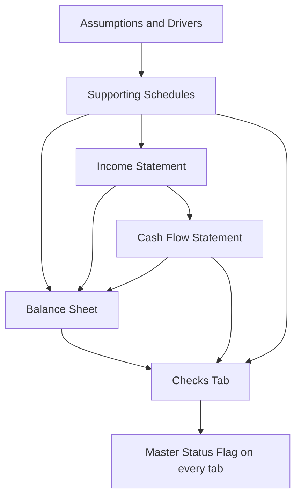
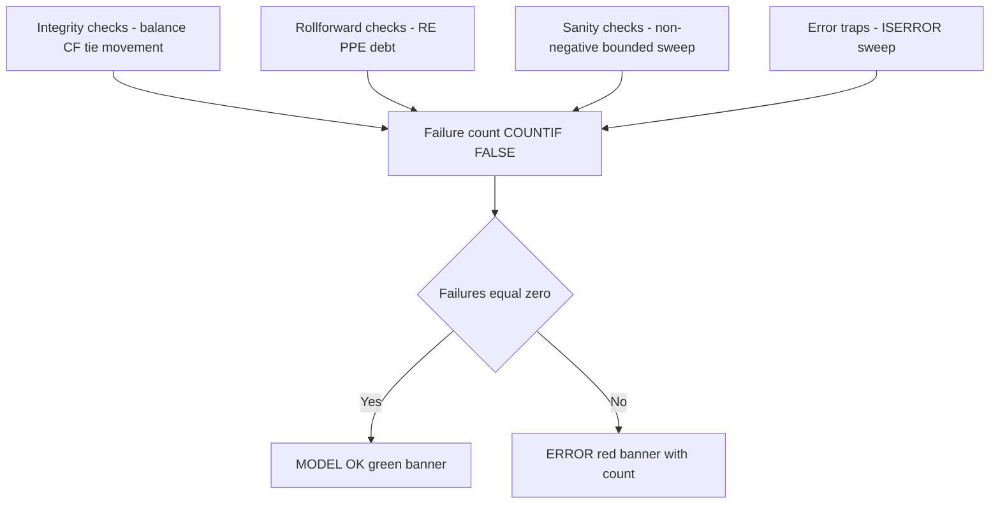
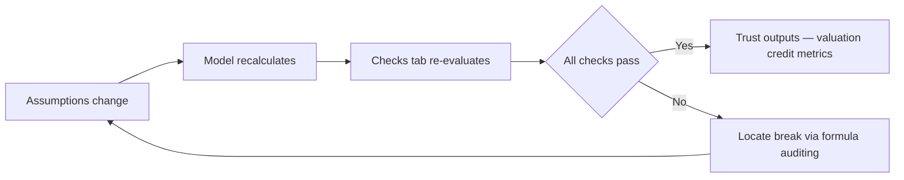

<!-- v2-deep -->

# Chapter 17 — Auditing and Error-Checking the Model

## 1. The Problem

You have just spent two days building a three-statement model. It has revenue drivers, a working-capital schedule, a debt sweep, a depreciation waterfall, retained earnings rolling from the income statement into equity, and a cash flow statement stitching it all together. You hit `F9`, the numbers cascade, and it *looks* finished.

Then your managing director glances at it for eleven seconds, points at the balance sheet, and says: "Assets don't equal liabilities plus equity in 2027. Fix it before the client call." You feel your stomach drop. Somewhere across roughly 4,000 populated cells, one link is wrong — a `SUM` that grabbed one row too few, a sign flip on capex, a hard-coded number pasted over a formula. You have no idea where it is, and the call is in ninety minutes.

This is the defining nightmare of financial modeling, and it is not rare — it is the *default* state of any model without deliberate error-checking. A financial model is a densely connected graph: change one cell and dozens of downstream cells recalculate. That interconnection is the model's power (ask a question, get a fully-articulated answer) and its peril (make one mistake, and it silently propagates everywhere, poisoning valuation, credit metrics, and every decision downstream).

The cost of model error is not academic. The 2012 "London Whale" losses at JPMorgan were amplified by a spreadsheet that divided by a sum instead of an average. The 2010 Reinhart-Rogoff austerity paper — cited by finance ministers worldwide — contained a formula that omitted five countries from an `AVERAGE`. TransAlta lost $24 million on a copy-paste error in a bid spreadsheet. These were not built by amateurs. They were built by people exactly like you, working fast, under pressure, without a checks layer.

To put a number on it: field studies of operational spreadsheets (the EuSpRIG research body) consistently find that **88% or more of spreadsheets contain at least one error**, and that error rates run around **1% to 5% of all formula cells**. A model with 4,000 formulas, at even a 1% cell error rate, expects roughly **40 errors** on first build. The question is never "does my model have a bug?" — statistically it does. The question is "will I find it before it costs me, or after?" That reframing is the whole reason this chapter exists.

The problem this chapter solves: **how do you know, at a glance and at all times, whether your model is internally consistent — and when it breaks, how do you find the break in minutes rather than hours?** The answer is a discipline of built-in checks plus a fluency with Excel's formula-auditing tools. A professional model does not *hope* it is correct. It *proves* it is correct, continuously, on a dedicated checks tab that turns green when everything ties and screams red the instant anything doesn't.

## 2. The Core Idea

The core idea is **redundancy as verification**. If a quantity can be computed two independent ways, then computing it both ways and comparing gives you a free correctness test. When the two agree, you have strong evidence the logic between them is sound. When they disagree, you have caught an error *before* it reaches a decision-maker.

The three-statement model has a beautiful built-in redundancy that makes this possible: **the balance sheet must balance, and it does so only if every other statement is internally correct.** Assets = Liabilities + Equity is not something you force by plugging a number — it is an *emergent consequence* of building the income statement, the cash flow statement, and every supporting schedule correctly. If your depreciation is wrong, or your debt paydown doesn't flow to cash, or retained earnings drops a period of net income, the balance sheet will refuse to balance. It is the single most powerful error-detector in all of finance — a global integrity check that costs one subtraction.

So the discipline is: **build a checks layer whose entire job is to test claims that should be true and shout when they aren't.** Each check is a formula that evaluates to `TRUE`/`FALSE` or to a difference that should be zero. You aggregate them into a master flag. You conditionally format that flag so a passing model is calm green and a broken model is alarming red. And you place the flag where you cannot miss it — ideally on every tab.

The mindset shift: you are not just building a model that *produces* answers. You are building a model that *audits itself*. The checks are not decoration added at the end; they are structural, like the load-bearing tie-beams of a building. A reviewer-friendly model wears its correctness on its sleeve.

There is a useful mental taxonomy for what checks can and cannot catch. Errors come in three grades. **Hard errors** are Excel-visible: `#REF!`, `#DIV/0!`, `#VALUE!` — the spreadsheet itself is telling you. **Mechanical errors** are silent but violate an identity: a dropped `SUM` row, a sign flip, a broken link. These are exactly what integrity and rollforward checks catch. **Judgment errors** are the deepest — the model computes flawlessly but the *assumptions* are wrong (revenue growing 40% forever, a tax rate of 5%). Checks catch grades one and two mechanically; grade three is caught only by sanity checks that encode reality plus a human who reads the outputs. Knowing which grade you are hunting tells you which tool to reach for.

## 3. Why It Works

Why does the balance check catch so much? Because of double-entry accounting, the invisible skeleton beneath every model. Every economic event hits the books in two equal-and-opposite places. Sell inventory for cash: cash up, inventory down, and the margin flows to retained earnings via net income. Borrow money: cash up, debt up. Because every transaction preserves the accounting equation, a *correctly built* model preserves it automatically across all periods. The equation is a conserved quantity — like energy in physics. If it's violated, energy appeared from nowhere, which means you made an error.

Crucially, the balance sheet is downstream of *everything*. Retained earnings pulls from the income statement's net income. Cash pulls from the cash flow statement's ending balance. PP&E pulls from the depreciation and capex schedules. Debt pulls from the financing schedule. So a break anywhere upstream — a mislinked interest expense, a dropped working-capital delta, a sign error on dividends — eventually distorts one side of the balance sheet but not the other, and the check flashes. One test surveils dozens of schedules at once. That is enormous leverage.

The cash-flow tie works for the same reason from a different angle. The cash flow statement is built *bottom-up*: start with net income, add back non-cash items, adjust for working-capital changes, subtract investing outflows, add financing flows. That produces an ending cash balance through *construction*. Independently, cash also appears on the balance sheet as a *line item*. If you built the cash flow statement correctly, its ending cash must equal the balance sheet's cash line. Two roads to the same number; if they diverge, one road has a pothole.

Sanity checks work on a different principle: **domain knowledge as a constraint.** Some things are impossible or nonsensical in a correct model — inventory can't be negative, a debt sweep can't repay more than the outstanding balance, a depreciation schedule can't depreciate an asset below zero, gross margin can't exceed 100%. These aren't guaranteed by accounting identities; they're guaranteed by *reality*. Encoding them as checks catches a whole class of errors (bad assumptions, broken circularity, `MIN`/`MAX` logic failures) that the balance check alone would miss because a model can balance perfectly while being economically absurd.

Formula auditing works because Excel exposes the dependency graph. Every formula declares its inputs (precedents) and its consumers (dependents). When a check fails, you don't need to eyeball 4,000 cells — you follow the graph backward from the symptom to the cause, pruning the search space at each step. It converts a needle-in-a-haystack problem into a guided binary search.

There is a subtle but powerful reason checks are so *efficient* at localizing errors: **most errors break exactly one identity.** A dropped depreciation add-back breaks the balance check but leaves the RE rollforward intact. A hard-coded cash cell breaks the CF tie *and* the balance check but leaves everything else green. A broken debt sweep breaks the sweep sanity check but not the balance check. Because different errors fail *different subsets* of checks, the *pattern* of which checks are red is itself a diagnostic fingerprint — before you trace a single arrow, the set of failing checks already tells you roughly which schedule to open. This is why a rich checks tab (many small, specific checks) localizes faster than one big balance check: it partitions the error space more finely. A single check tells you *that* something is wrong; a dozen specific checks tell you *where*.

## 4. Full Technical Content

### 4.1 The three families of checks

Every robust model carries three kinds of checks. Understand the purpose of each:

| Check family | What it verifies | How it fails |
|---|---|---|
| **Integrity checks** | Accounting identities hold (BS balances, CF ties) | Broken links, dropped rows, sign errors, hard-codes |
| **Sanity checks** | Values respect economic reality (non-negative, bounded, monotonic where expected) | Bad assumptions, broken `MIN`/`MAX`, circularity gone wrong |
| **Consistency checks** | Two schedules that share a number agree | Timing mismatches, one schedule updated but not its twin |

A fourth, informal family worth naming is **error-trap checks** — cells that simply count Excel's own hard errors so a stray `#REF!` anywhere in the model surfaces on the checks tab rather than lurking. The pattern is `=SUMPRODUCT(--ISERROR(range))` or, across a whole sheet, `=COUNTIF(range,"#REF!")` (though `ISERROR` inside `SUMPRODUCT` is more general because it catches every error type). Put one per statement and one grand total. This catches the class of failure where a deleted column leaves `#REF!` scattered through formulas you haven't scrolled to.

### 4.2 The balance check — the king of checks

The claim: **Total Assets − (Total Liabilities + Total Equity) = 0**, in every single period.

Build it as a row on your checks tab (or a hidden row beneath the balance sheet), computed for each forecast column. Suppose on your balance sheet, Total Assets is in row 40 and Total Liabilities + Equity is in row 60, with 2027 in column F:

```
Balance check (F):   =F40 - F60
```

Do **not** stop at computing the difference. Floating-point arithmetic means a "balanced" model may show `0.0000001` instead of a clean zero. So wrap it in a tolerance test:

```
Balance OK? (F):     =ABS(F40 - F60) < 0.001
```

This returns `TRUE` when the imbalance is smaller than a tenth of a cent — genuinely balanced — and `FALSE` otherwise. Copy it across every period column. Then create a single master cell that is `TRUE` only if *all* periods pass:

```
All periods balance: =AND(F62:K62)
```

where row 62 holds the per-period `TRUE`/`FALSE` flags across the forecast horizon F:K.

**A better display than raw TRUE/FALSE.** For fast human scanning, keep *two* rows: the signed difference (`=F40-F60`) and the pass flag. The signed difference is diagnostic gold — its *magnitude* often equals the size of the missing item (you'll see this in Example 1, where the imbalance is exactly the depreciation figure), and its *sign* tells you which side is short. A positive `Assets − (L+E)` means assets are too big or L+E too small; a negative means the reverse. Analysts who only keep the boolean throw away this free clue.

**Critical discipline: never plug the balance sheet.** The rookie temptation is to make one line item (often cash, or a "balancing figure") equal whatever it takes to force balance — e.g. setting equity = assets − other-liabilities. This *destroys* the check's entire value. You've converted your best error detector into a machine that hides errors. Every line on the balance sheet must be built from its own honest schedule; balance must *emerge*, never be *imposed*.

**How to tell if you have accidentally plugged.** A quick self-test: click your cash line and your equity line and read the formulas. If cash is `=CF!ending_cash` (a link to an independently built statement) you are honest. If cash — or any line — is `=TotalAssets_other_side - sum_of_everything_else`, you have plugged, and your balance check is cosmetic. A plugged model shows `TRUE` forever and catches nothing.

### 4.3 The cash-flow tie

The claim: **Ending cash on the cash flow statement = Cash line on the balance sheet**, every period.

Your cash flow statement ends with a computed closing cash balance (opening cash + net change in cash). Your balance sheet has a cash line item (which should itself *link to* the cash flow statement's ending cash — that is the correct wiring). The tie verifies the link is intact and no rogue hard-code has been pasted over the cash line:

```
CF tie (F):   =ABS(F_CF_endingcash - F_BS_cash) < 0.001
```

If cash on the balance sheet is properly linked `=F_CF_endingcash`, this check is trivially `TRUE` — which is fine; its job is to scream if someone later overtypes that link with a number. It's a tripwire.

A second, deeper cash check: **the change in cash reconciles to the movement of the balance.** Ending cash minus opening cash (from the balance sheet) should equal the net change in cash computed by the cash flow statement:

```
Cash movement tie (F):   =ABS( (F_BS_cash - E_BS_cash) - F_CF_netchange ) < 0.001
```

This catches errors where the cash flow statement's *components* are wrong even though the ending balance happens to be forced.

**Why you want both cash checks, concretely.** Suppose your CF ending cash is computed as `opening + operating + investing + financing`, and your BS cash simply links to it. The plain CF tie is then `TRUE` by construction and only catches a later overtype — a tripwire, nothing more. The *movement* tie, by contrast, re-derives the change from the two independently-carried balance-sheet cash cells and compares it to the CF's own `netchange` subtotal. If, say, your operating section double-counts a working-capital swing but your financing section drops an equal-and-opposite amount, the ending cash could still be right by luck while the *components* are wrong — the movement tie catches the internal inconsistency the plain tie is blind to. Belt and braces.

### 4.4 Sanity / logic checks

These encode reality. Build one row per rule; each returns `TRUE` when reality is respected:

| Rule | Formula pattern | Why |
|---|---|---|
| Cash never negative | `=MIN(F_cash_row:K_cash_row) >= 0` | Negative cash means you needed a revolver draw you didn't model |
| Debt sweep ≥ 0 | `=MIN(F_repay:K_repay) >= 0` | You can't "un-repay" (negative repayment = phantom borrowing) |
| Sweep ≤ opening balance | `=F_repay <= F_debt_opening` | Can't repay more than you owe |
| Retained earnings rolls | `=ABS(F_RE - (E_RE + F_NI - F_div)) < 0.001` | RE must equal prior RE + net income − dividends |
| PP&E rolls | `=ABS(F_PPE - (E_PPE + F_capex - F_dep)) < 0.001` | Closing PP&E = opening + capex − depreciation |
| Gross margin bounded | `=AND(F_GM >= 0, F_GM <= 1)` | Margin outside [0,100%] signals a driver error |
| Depreciation ≤ NBV | `=F_dep <= E_PPE + F_capex` | Can't depreciate more asset than exists |

The rollforward checks (retained earnings, PP&E, debt) are especially valuable: they independently re-derive a balance-sheet line from its own logic and compare to what's actually on the balance sheet. Each is a mini balance-check for one schedule, letting you localize a break faster.

A few more sanity rules worth adding as a model grows in complexity:

| Rule | Formula pattern | Why |
|---|---|---|
| Revolver undrawn when cash ample | `=IF(F_cash_pre_revolver>0, F_revolver_draw=0, TRUE)` | Draws only when the pre-financing cash is short |
| DSCR floor (covenant) | `=F_CFADS / F_debt_service >= 1.0` | Below 1.0 the entity can't service debt — a red flag even if the model balances |
| Days ratios in a sane band | `=AND(F_DSO>=0, F_DSO<=180)` | A 900-day receivable period signals a driver typo |
| Effective tax rate plausible | `=AND(F_tax/F_PBT>=0, F_tax/F_PBT<=0.5)` | Wrap in `IFERROR` for the `PBT=0` case, and surface it |
| Working capital sign | `=IF(F_rev>0, F_receivables>=0, TRUE)` | Negative receivables on positive revenue = sign error |

### 4.5 Aggregating checks into a master flag

Individual checks are useful, but you want *one* place to look. Build a master flag:

```
Master check:   =AND(all_individual_check_cells)
```

More reviewer-friendly is a *count of failures*, so you know how many things are wrong:

```
Errors:   =COUNTIF(check_range, FALSE)
```

where `check_range` is the block of all your `TRUE`/`FALSE` flags. A healthy model reads `0`. Display it prominently:

```
Status:   =IF(COUNTIF(check_range, FALSE) = 0, "MODEL OK", "ERROR — CHECK FAILED")
```

**Aggregating a 2-D block of checks.** Once you have checks laid out both down (one per rule) and across (one per period), `COUNTIF` on a single column is not enough — you want to count failures across the whole rectangle. Two idioms:

```
Total failures (2-D):   =SUMPRODUCT(--(check_block = FALSE))
Total failures (2-D):   =COUNTIF(check_block, FALSE)     ' COUNTIF also accepts a 2-D range
```

Both count every `FALSE` in the block. Prefer `SUMPRODUCT(--(...))` when your checks are numeric differences you want to threshold on the fly, e.g. `=SUMPRODUCT(--(ABS(diff_block) > 0.001))` counts every period-and-rule pair breaching tolerance in one cell, with no helper flags at all.

**Guarding against a check that errors.** If one of your checks itself evaluates to `#DIV/0!` (say a ratio in period zero), `AND` and `COUNTIF` can behave unexpectedly. Make the aggregator robust:

```
Robust status: =IF(SUMPRODUCT(--ISERROR(check_block))>0, "CHECK ITSELF ERRORED",
                 IF(COUNTIF(check_block,FALSE)=0,"MODEL OK","ERROR"))
```

This distinguishes "a check failed" from "a check couldn't even compute," which are different problems.

### 4.6 Excel functions for building checks

- **`ABS`** — for tolerance comparisons; always compare `ABS(difference) < tolerance`, never `difference = 0`.
- **`AND` / `OR`** — combine many booleans into one.
- **`COUNTIF(range, FALSE)`** — count failed checks in one cell.
- **`MIN` / `MAX`** — test that a whole row respects a bound (e.g. `MIN(row) >= 0`).
- **`SUMPRODUCT`** — count failures across a 2-D block: `=SUMPRODUCT(--(check_block=FALSE))`.
- **`N(...)`** — coerce booleans to 1/0 if you prefer numeric aggregation.
- **`ISERROR` / `ISNUMBER`** — trap Excel's own hard errors; `=SUMPRODUCT(--ISERROR(range))` counts every `#REF!`/`#DIV/0!` in a block.
- **`ROUND`** — an alternative to tolerance testing: `=ROUND(A-B, 2) = 0` treats anything under half a cent as balanced. Cleaner to read than `ABS(...) < 0.005` for some teams, though `ABS` is more explicit about the tolerance.
- **`IFERROR`** — but use it *sparingly* and *never* to blanket-hide errors; a stray `#DIV/0!` is information. Wrap only where a benign error (e.g. a ratio in period zero) is expected, and prefer surfacing it in a check.

### 4.7 Excel's formula-auditing toolkit

When a check fails, these tools find the culprit. Learn the keyboard shortcuts — speed here is a real professional edge.

**Trace Precedents** (`Formulas ▸ Trace Precedents`, or `Alt` `M` `P`): select the broken cell; Excel draws blue arrows to every cell feeding it. Follow arrows upstream to find where a good number becomes bad.

**Trace Dependents** (`Alt` `M` `D`): the reverse — shows every cell that *uses* the selected cell. Use it to gauge blast radius before changing an input, and to confirm a driver actually flows where you think.

**Remove Arrows** (`Alt` `M` `A` `A`): clears the tracing overlay.

**Ctrl+[** (open square bracket): *jumps* to the precedents of the active cell — even across worksheets. `Ctrl+]` jumps to dependents. Far faster than drawing arrows when hunting. `F5` then `Enter` bounces you back.

**Evaluate Formula** (`Formulas ▸ Evaluate Formula`, or `Alt` `M` `V`): steps through a complex formula one calculation at a time, showing each intermediate result. Indispensable for nested `IF`/`INDEX`-`MATCH`/`MIN` logic where you can *see* exactly which branch or lookup returns garbage.

**Show Formulas** (`Ctrl+`` ` — the grave accent): toggles the grid to display formulas instead of values. The fastest way to eyeball a row for an inconsistent formula — a hard-coded number sitting among live formulas jumps out because it lacks an `=`.

**F2** (edit cell): highlights all precedents *in color* right on the grid — the quickest single-cell inspection.

**F9 on a selection**: inside the formula bar, select any *sub-expression* and press `F9` to evaluate just that fragment to its value. `Esc` to restore — never `Enter`, or you hard-code the result. Brilliant for isolating which term of a long formula is wrong.

**Go To Special** (`Ctrl+G` ▸ Special, or `F5` ▸ Special): select all *Constants* to reveal every hard-coded number in a range (hard-codes among formulas are the #1 source of breaks); select *Formulas* to see the inverse; select *Precedents/Dependents* to map dependencies. This single feature finds most "someone pasted a value over a formula" bugs in seconds.

**Error Checking** (`Formulas ▸ Error Checking`): walks you through cells Excel flags with green-triangle warnings (inconsistent formula, number-as-text, formula omits adjacent cells) — often surfaces the exact `SUM` that dropped a row.

**Watch Window** (`Formulas ▸ Watch Window`): pin the balance-check cell and the master status into a floating window that stays visible while you scroll and edit *any* sheet. You watch the flag flip live as you touch cells — invaluable when bisecting to find which of several edits broke the tie.

**A disciplined bug hunt** is a binary search, not a linear scan. Given a failing balance check in one period:
1. Read the *signed difference* and its magnitude — it often names the culprit line directly.
2. Check the *pattern* of which other checks are red (§3) — RE rollforward red points at the IS→equity link; PP&E rollforward red points at capex/depreciation; only cash checks red points at cash.
3. From the failing balance total, `Ctrl+[` into its precedents, halving the search each hop, until you reach a cell whose value is wrong but whose inputs are right — that cell is the bug.
4. Confirm with Evaluate Formula or by `F9`-ing the suspect sub-expression.

### 4.8 Formatting checks so a human can't miss them

A check nobody looks at is useless. Make failures visually violent.

1. **Dedicate a checks tab**, named `Checks` and placed first or last, tab colored (red when failing is a nice touch via VBA, but at minimum a distinct color). List every check with a label, the computed difference, and a `TRUE`/`FALSE` (or `OK`/`ERROR`) flag.

2. **Conditional formatting**: select the flag column, `Home ▸ Conditional Formatting ▸ New Rule`. Rule 1: cell equals `FALSE` → fill red, bold white text. Rule 2: cell equals `TRUE` → fill green (or subtle grey, so only red draws the eye). Applied to the whole column, any single failure lights up instantly.

3. **A global status banner on every tab.** In a spare top-corner cell on *each* worksheet, put `='Checks'!$B$1` (the master status). Conditionally format it red-on-fail. Now no matter which tab you're on, a broken model glares at you. This is what separates a reviewer-friendly model from a landmine.

4. **Color convention for inputs.** Independent of checks, adopt the universal modeling standard: **blue font for hard-coded inputs/assumptions, black for formulas, green for links to other sheets, red for external-workbook links** (avoid these). This isn't a runtime check but it's an *auditing* aid — a reviewer instantly sees which cells are assumptions (should be blue) and can spot a stray blue number where a formula belongs (a smuggled hard-code).

5. **Use an icon-set or symbol, not just color, for accessibility.** Roughly 1 in 12 men has some red-green colour deficiency, and your reviewer might be one. Pair the fill with a glyph: conditional-format the flag to show a check mark for pass and a cross for fail, or drive a cell with `=IF(check,"✓ OK","✗ FAIL")`. Colour plus symbol survives a colour-blind reviewer, a greyscale printout, and a projector that washes out reds.

### 4.9 Where the checks tab sits in the model architecture


*The checks tab observes the outputs of every layer and rolls a single verdict back onto every sheet.*

The internal anatomy of the checks tab itself is worth picturing — how many small checks funnel into one verdict:


*Many specific checks partition the error space finely, then aggregate into a single count and a single banner.*

## 5. Worked Examples

### Example 1 — The balance check catches a dropped depreciation link

A simplified one-period forecast. Assume opening balances and these flows:

| Item | Value |
|---|---|
| Opening cash | 100 |
| Opening PP&E | 500 |
| Opening retained earnings | 300 |
| Opening equity (share capital) | 200 |
| Opening debt | 100 |
| Revenue | 1,000 |
| Operating costs (cash) | 700 |
| Depreciation | 50 |
| Capex | 80 |
| Dividends | 20 |
| Tax and interest | 0 (ignored for clarity) |

**Correct build.** Net income = 1,000 − 700 − 50 = **250**.
Cash flow: NI 250 + depreciation 50 (add-back) − capex 80 − dividends 20 = **+200**. Ending cash = 100 + 200 = **300**.
Closing PP&E = 500 + 80 capex − 50 dep = **530**.
Closing RE = 300 + 250 − 20 = **530**.

Balance sheet:

| Assets | | Liab + Equity | |
|---|---|---|---|
| Cash | 300 | Debt | 100 |
| PP&E | 530 | Share capital | 200 |
| | | Retained earnings | 530 |
| **Total** | **830** | **Total** | **830** |

Balance check = |830 − 830| = 0 < 0.001 → **TRUE**. 

**Now inject the classic error:** someone forgets to link depreciation into the cash flow add-back (a very common break — the CF statement starts from NI but the analyst deletes the depreciation add-back row).

Cash flow becomes: NI 250 − capex 80 − dividends 20 = **+150**. Ending cash = 100 + 150 = **250**.

But depreciation is *still* correctly reducing PP&E on the balance sheet (530) and *still* embedded in net income → RE (530). Only the cash side lost the add-back. New balance sheet:

| Assets | | Liab + Equity | |
|---|---|---|---|
| Cash | **250** | Debt | 100 |
| PP&E | 530 | Share capital | 200 |
| | | Retained earnings | 530 |
| **Total** | **780** | **Total** | **830** |

Balance check = |780 − 830| = **50** → **FALSE**. The imbalance is exactly the missing depreciation add-back (50). This is the check earning its keep: the error is invisible on the income statement (net income is unchanged and correct) but the global check catches it and even *tells you the magnitude* — 50 — which points you straight at the depreciation line. **Reproduce this in Excel** and watch the flag flip red.

**Exact Excel layout to reproduce.** Put the correct model in column F and lay out the checks in a small block:

| Cell | Formula | Result |
|---|---|---|
| `F1` Revenue | `1000` | 1000 |
| `F2` Op costs | `700` | 700 |
| `F3` Depreciation | `50` | 50 |
| `F4` Net income | `=F1-F2-F3` | 250 |
| `F5` Capex | `80` | 80 |
| `F6` Dividends | `20` | 20 |
| `F7` Opening cash | `100` | 100 |
| `F8` CF add-back dep | `=F3` | 50 |
| `F9` Net change in cash | `=F4+F8-F5-F6` | 200 |
| `F10` Ending cash | `=F7+F9` | 300 |
| `F11` Closing PP&E | `=500+F5-F3` | 530 |
| `F12` Closing RE | `=300+F4-F6` | 530 |
| `F13` Total assets | `=F10+F11` | 830 |
| `F14` Total L+E | `=100+200+F12` | 830 |
| `F15` Balance diff | `=F13-F14` | 0 |
| `F16` Balance OK | `=ABS(F15)<0.001` | TRUE |

Now break it: change `F8` from `=F3` to `0` (delete the add-back). `F9` recalculates to 150, `F10` to 250, `F13` to 780, `F15` to **−50**, and `F16` flips to **FALSE**. Note the sign: `F15` is negative, meaning **assets fell short** of L+E by 50 — pointing you to the asset side (cash), and the magnitude 50 matching depreciation names the culprit. This is the entire discipline in sixteen cells.

### Example 2 — Cash-flow tie catches a hard-code

Same correct model as above (balanced at 830). A colleague, "cleaning up," overtypes the balance-sheet cash cell — which was linked `=CF!ending_cash` (300) — with the hard number `310` (a fat-finger, meant to type 300).

Balance check: total assets now 310 + 530 = 840; L+E still 830 → |840 − 830| = 10 → **FALSE**. So the balance check *does* fire. But which of dozens of lines caused it? The **cash-flow tie** localizes it instantly:

```
CF tie = ABS(310 − 300) = 10  →  FALSE
```

Every *other* check (RE rollforward, PP&E rollforward, debt sweep) stays `TRUE`. Only the cash tie and the master balance fail. Two failing checks, both pointing at cash → you go straight to the cash line, press `Ctrl+[` to trace its precedents, find it's a constant not a link (or use Go To Special ▸ Constants to reveal the smuggled `310`), and restore `=CF!ending_cash`. Elapsed time: under a minute. Without the tie, you'd be hunting the whole balance sheet.

**The fingerprint table.** Notice how the *pattern* of red checks is the diagnostic, exactly as §3 promised. Compare the two errors so far:

| Check | Ex.1 dropped dep add-back | Ex.2 hard-coded cash |
|---|---|---|
| Balance check | **FAIL (−50)** | **FAIL (+10)** |
| CF tie (ending cash) | FAIL (50) | **FAIL (10)** |
| Cash movement tie | **FAIL** | pass* |
| RE rollforward | pass | pass |
| PP&E rollforward | pass | pass |
| Debt sweep sanity | pass | pass |

*In Example 2 the CF's own ending-cash is still 300 and its net-change subtotal is unchanged; only the BS cash *line* was overtyped, so the movement tie — which reads the BS cash deltas — actually *does* trip too if it references the overtyped cell. The point stands: no two errors light the same set of lamps, so the lit set tells you where to look before you trace anything.

### Example 3 — Sanity check catches an over-aggressive debt sweep

A model with a cash sweep: excess cash automatically repays debt. Opening debt = 100. The intended logic caps repayment at the lesser of available cash and outstanding debt:

```
Repayment = MIN(available_cash, opening_debt)
```

Suppose available cash for sweep = 140. Correct repayment = MIN(140, 100) = **100**, leaving debt at 0.

**The error:** the analyst wrote `=available_cash` and forgot the `MIN`. Repayment = 140. Closing debt = 100 − 140 = **−40**. Negative debt is nonsense — the model now shows the company *lending* 40 to its creditors.

Astonishingly, **the balance sheet may still balance!** The −40 debt reduces liabilities by 40, but the extra 40 of cash paid out also reduces cash assets by 40 (140 swept vs. 100 that should have been). Assets and L+E both drop 40; the equation holds. The balance check reads **TRUE** — it's blind to this error. This is exactly why you need sanity checks. The rule:

```
Debt sweep sane = AND(closing_debt >= 0, repayment <= opening_debt)
```

evaluates `AND(-40 >= 0, 140 <= 100)` = `AND(FALSE, FALSE)` → **FALSE**. Caught. The lesson: integrity checks and sanity checks catch *different* error classes. You need both — a model can be perfectly balanced and completely wrong.

### Example 4 — Multi-period rollforward catches a one-year drop

Rollforward checks earn their keep across time, where a single-period spot check would pass. Take retained earnings over three years. Opening RE = 300. Net income 250, 280, 300; dividends 20, 20, 20.

| Year | RE prior | + NI | − Div | RE should be | RE on BS | Rollforward diff |
|---|---|---|---|---|---|---|
| 2027 | 300 | 250 | 20 | **530** | 530 | 0 → TRUE |
| 2028 | 530 | 280 | 20 | **790** | 790 | 0 → TRUE |
| 2029 | 790 | 300 | 20 | **1,070** | **1,050** | **−20 → FALSE** |

In 2029 someone dragged the RE formula but the fill picked up the wrong prior-year cell (referenced 2027's opening chain, or a dividend was double-counted), landing RE at 1,050 instead of 1,070. The rollforward check `=ABS(RE - (RE_prior + NI - Div)) < 0.001` reads |1,050 − 1,070| = 20 → **FALSE** in 2029 only. Because the check is *per period*, the red cell pinpoints not just *that* RE is wrong but *which year* broke — you open 2029, `Ctrl+[` the RE cell, and see it points at the wrong prior cell. The balance check would also go red in 2029, but the rollforward tells you it's an equity-side problem before you look anywhere else. This is the localization power of many small checks over one big one.

### Example 5 — A dropped SUM row that balances but understates

The nastiest errors keep the model *balanced* while making it *wrong*. Suppose current assets are totalled with `=SUM(F20:F24)` covering cash, receivables, inventory, prepaids, and other. A new line "short-term investments" of 60 is inserted at row 25 — *outside* the sum. The current-assets subtotal silently omits 60.

Does the balance check catch it? It depends on wiring. If Total Assets sums the *subtotals* (`=current_assets_subtotal + PPE`), then Total Assets is understated by 60, L+E is unchanged, and the balance check reads a 60 imbalance → **FALSE**. Good. But if some analyst built Total Assets as `=SUM(F20:F26)` directly over the line items, it *includes* row 25, so Total Assets is right, the subtotal is wrong, and the two disagree only if another cell references the broken subtotal. The moral: **totals should be built consistently and checked against their own components.** Add a check `=ABS(current_assets_subtotal - SUM(component_lines)) < 0.001`, or use Excel's green-triangle "formula omits adjacent cells" warning, which flags this exact insertion. Best defence: sum with a deliberate buffer row inside the range, or use structured Table references that auto-expand.

## 6. Connections

**To the three-statement model (Chapters 12–14).** The checks layer is the acceptance test for the whole integrated model. The balance check only works because the three statements are correctly wired: net income flowing IS → RE, ending cash flowing CF → BS, schedules feeding both. The checks are how you *know* the wiring you built in those chapters actually holds.

**To circularity and iterative calculation (interest on average debt).** When interest depends on debt which depends on cash which depends on interest, you enable iterative calculation. Circular models are fragile — a single `#REF!` or a toggled-off iteration can send the whole thing to `0` or `#DIV/0!`. A dedicated **circularity breaker switch** plus a check that the model still balances *with the switch on* is essential. Your checks tab is your early-warning system for circularity blowups. A practical pattern: keep a `#DIV/0!` counter (`=SUMPRODUCT(--ISERROR(model_range))`) on the checks tab — the *first* symptom of a collapsed circular reference is a spray of errors, and the counter catches it before you notice the balance check went blank.

**To scenario and sensitivity analysis (Chapter 16).** Before you trust *any* scenario, the base case must pass all checks. But more: a robust model must balance in *every* scenario. Flip to the downside case, to the aggressive case — if the balance check goes red only in one scenario, you have a switch or a `MIN`/`MAX` that misbehaves at extremes. Run your checks across scenarios as a matter of routine. A neat trick: build a **checks-in-data-table** — a one-variable data table whose row input is the scenario switch and whose output cell is the master failure count. One glance shows a `0` for every scenario, or a non-zero that names the scenario that breaks.

**To valuation (DCF, LBO).** Unlevered free cash flow in a DCF is derived from the same statements. If the model doesn't tie, the free cash flow is wrong, and the enterprise value is wrong. In an LBO, the debt schedule and cash sweep *are* the value engine; sanity checks on the sweep are non-negotiable. Checks are upstream of every number a decision rests on.

**To model governance and handoff.** A reviewer-friendly, self-checking model is a professional deliverable. The next analyst — or you in six months — can change an assumption and *immediately* see whether they broke something. Checks turn a fragile personal artifact into durable, auditable infrastructure.


*The edit-check-fix loop that a self-auditing model enforces on every change.*

## 7. Traps and Common Errors

- **Plugging the balance sheet.** Forcing one line (equity, cash, a "plug" row) to equal whatever balances the sheet. This guarantees balance and thereby *destroys* your best error detector. Every line must come from an honest schedule.

- **Testing `= 0` instead of `ABS(...) < tolerance`.** Floating-point residue means a truly balanced model shows `4.5E-11`, and `= 0` returns `FALSE`, crying wolf. Always use a small tolerance (0.001 for figures in dollars; scale it to your units).

- **Tolerance too loose.** The mirror error: a tolerance of `1000` on a model in thousands would ignore a real $1,000,000 error. Set tolerance just above floating-point noise, not above real mistakes.

- **Tolerance not scaled to units.** A model in whole dollars wants tolerance `0.001`; a model in thousands wants `0.001` *of a thousand* only if you care about sub-dollar residue — but the floating-point noise also scales, so `0.01` (i.e. ten dollars) is often the right threshold in a thousands model. The rule: tolerance should sit an order of magnitude above the largest floating-point residue you observe and an order of magnitude below the smallest real error you care about. Check the actual residue on a known-good model before picking the number.

- **Blanket `IFERROR` wrappers.** Wrapping whole schedules in `IFERROR(...,0)` to make `#DIV/0!` disappear hides the very errors you need to see. A visible error is a gift. Fix the cause; don't gag the symptom.

- **Checks that reference the thing they check via the same broken link.** If your "cash tie" compares CF ending cash to a BS cash cell that is *itself* `=CF!ending_cash`, the check is `TRUE` by construction and can never catch a hard-code — wait, actually it *can* catch an overtype (that's its purpose), but it cannot catch an error *inside* the CF build. Pair it with the cash-*movement* tie (§4.3) which re-derives from balance deltas.

- **Only checking the base case.** Models often balance at the base and break at extremes where `MIN`/`MAX`/`IF` switch branches. Run checks under every scenario.

- **Hard-codes pasted over formulas.** The single most common break. A number typed into a formula cell. Defenses: the blue/black color convention (a black or wrongly-blue constant among formulas), `Ctrl+`` ` to show formulas, and `Go To Special ▸ Constants` to list every hard-code in a range.

- **`SUM` that drops a row.** Inserting a row just outside a `SUM` range (`=SUM(F5:F10)` when the new line is in F11) silently under-totals. Excel's green-triangle "formula omits adjacent cells" warning and Error Checking catch many of these. Build totals with a buffer or use structured references.

- **Sign errors.** Capex, dividends, repayments — outflows. Get a sign wrong and the number doubles in the wrong direction. Sanity checks (non-negative repayment, RE rollforward) catch most sign flips.

- **A checks tab nobody looks at.** If the master flag lives only on a back tab, a rushing analyst never sees it. Propagate the status banner to *every* sheet.

- **Deleting a check because "it's always been fine."** The check that never fails is doing its job — it's a smoke detector, not a nuisance. Never remove checks to "clean up."

- **Circular reference switched off, model silently reads zero.** With iterative calculation disabled, a circular chain (interest → debt → cash → interest) returns `0` or errors, and downstream numbers quietly go wrong while the balance check may still pass if the zeros cancel. Keep an error-count check and confirm iterative calc is *on* (`File ▸ Options ▸ Formulas ▸ Enable iterative calculation`) as part of your open-the-model ritual.

- **Trusting a green check on a plugged model.** The most dangerous state of all: the balance check reads `TRUE` because someone plugged a line, so the reviewer relaxes — while the plug is *absorbing* a real error into the plugged line. A green balance check is only meaningful if you have verified no line is a plug. Green plus honest lines equals trust; green plus a plug equals a lie.

- **Volatile checks that slow the model.** Building hundreds of `INDIRECT`/`OFFSET`-based checks makes every `F9` sluggish and can mask a stale display. Prefer direct cell references; reserve volatile functions for cases with no alternative.

## 8. First-Principles Recap

Strip everything away and here is what remains. A financial model is a web of dependencies where one error propagates silently everywhere. You cannot eyeball 4,000 cells for correctness. So you exploit **redundancy**: any quantity computable two independent ways gives a free correctness test when you compare the results.

Double-entry accounting hands you the ultimate redundancy — **Assets = Liabilities + Equity** is a conserved quantity that holds automatically if and only if every statement and schedule is built correctly. Compute both sides, subtract, and demand the difference be zero (within floating-point tolerance). That single subtraction surveils the entire model.

Layer on **sanity checks** — encodings of economic reality (nothing negative that shouldn't be, nothing unbounded that should be bounded, every rollforward reconciling) — because a model can balance perfectly while being economically absurd. Integrity and sanity catch *different* error classes; you need both.

Add **rollforward checks** — mini balance-checks for each schedule that re-derive a line from its own logic — because they don't just tell you *that* something broke, they tell you *which* schedule and *which* period. The finer you partition the error space with many specific checks, the faster the pattern of red lamps localizes any break.

Aggregate all checks into one master flag, format failures as visually violent red (and a glyph, for colour-blind and greyscale robustness), and propagate the status to every tab so it is impossible to ignore. When it goes red, read the signed difference and the pattern of failing checks first, then use Excel's dependency graph — trace precedents, `Ctrl+[`, Evaluate Formula, Go To Special — to binary-search backward from symptom to cause in minutes.

The deepest principle: **a professional model proves its own correctness continuously.** It does not hope; it verifies. Checks are not the last step you add if there's time — they are structural, built alongside the model, load-bearing. The model that audits itself is the model you can trust, hand off, and stake a decision on.

## 9. Quick-Reference

**The three check families**
- Integrity: BS balances, CF ties, movement reconciles.
- Sanity: non-negative cash/debt/repayment, bounded margins, sweep ≤ debt, depreciation ≤ NBV.
- Consistency/rollforward: RE = prior RE + NI − div; PP&E = prior + capex − dep; debt = prior − repay + draw.

**Essential formulas**
```
Balance check:     =ABS(TotalAssets - TotalLiabEquity) < 0.001
Signed diff:       =TotalAssets - TotalLiabEquity        ' keep this too — sign+size diagnose
CF tie:            =ABS(CF_EndCash - BS_Cash) < 0.001
Cash movement:     =ABS((BS_Cash - BS_Cash_prior) - CF_NetChange) < 0.001
RE rollforward:    =ABS(RE - (RE_prior + NI - Dividends)) < 0.001
PP&E rollforward:  =ABS(PPE - (PPE_prior + Capex - Dep)) < 0.001
Debt rollforward:  =ABS(Debt - (Debt_prior - Repay + Draw)) < 0.001
Sweep sane:        =AND(ClosingDebt >= 0, Repayment <= OpeningDebt)
Error trap:        =SUMPRODUCT(--ISERROR(ModelRange))    ' 0 = no #REF!/#DIV/0!
Count failures:    =COUNTIF(CheckRange, FALSE)          ' 0 = healthy
2-D failures:      =SUMPRODUCT(--(CheckBlock = FALSE))
Status text:       =IF(COUNTIF(CheckRange,FALSE)=0,"MODEL OK","ERROR")
All periods pass:  =AND(PerPeriodFlagRow)
```

**Which check catches which error**
| Error | Balance | CF tie | Movement | Rollforward | Sanity |
|---|---|---|---|---|---|
| Dropped dep add-back | ✓ | ✓ | ✓ | — | — |
| Hard-coded cash | ✓ | ✓ | ✓ | — | — |
| Over-aggressive sweep (neg debt) | — | — | — | ✓ (debt) | ✓ |
| Wrong RE prior-year link | ✓ | — | — | ✓ (RE) | — |
| Dropped SUM row | ✓* | — | — | maybe | — |
| `#REF!` from deleted column | ✓ | maybe | maybe | maybe | error trap |

\*If totals are built from subtotals; see Example 5.

**Formula-auditing shortcuts**
| Action | Shortcut |
|---|---|
| Trace precedents | `Alt M P` |
| Trace dependents | `Alt M D` |
| Remove arrows | `Alt M A A` |
| Jump to precedents | `Ctrl+[` |
| Jump to dependents | `Ctrl+]` |
| Return after jump | `F5` `Enter` |
| Evaluate formula | `Alt M V` |
| Show all formulas | `Ctrl+`` ` (grave accent) |
| Highlight precedents in cell | `F2` |
| Evaluate a sub-expression | select it in formula bar, `F9`, then `Esc` |
| Go To Special (find constants) | `F5` ▸ Special ▸ Constants |
| Error Checking sweep | `Formulas ▸ Error Checking` |
| Pin a cell to watch while scrolling | `Formulas ▸ Watch Window` |

**Golden rules**
1. Never plug the balance sheet.
2. Always `ABS(diff) < tolerance`, never `= 0`.
3. Never blanket-`IFERROR` to hide errors.
4. Blue = input, black = formula, green = link.
5. Status banner on every tab — colour *and* glyph.
6. Run checks in every scenario.
7. A check that never fails is doing its job — keep it.
8. Read the signed difference and the pattern of red checks *before* you trace.

## 10. Interview Angles

Auditing shows up constantly in modeling-test and technical interviews because it separates people who *understand* the integrated model from people who merely copied one. Expect these:

- **"Your balance sheet doesn't balance. Walk me through how you find the error."** The gold answer: read the *signed* imbalance and its magnitude first (it often names the line); check whether the imbalance is constant across periods or grows (constant → a one-off dropped item; growing → a flow that's wrong every period, like depreciation or a working-capital delta); check the rollforward checks to see which schedule is implicated; then `Ctrl+[` to binary-search precedents. Mention that you'd confirm no line is plugged.

- **"Name three ways a model can balance and still be wrong."** (1) A plugged line absorbing the error; (2) an over-aggressive debt sweep driving debt negative while cash falls equally (Example 3); (3) two equal-and-opposite errors in the same statement (e.g. operating cash overstated and financing understated by the same amount). Each is why sanity and movement checks exist alongside the balance check.

- **"If the balance check is TRUE, is the model correct?"** No — necessary, not sufficient. It proves the accounting identity holds; it says nothing about whether assumptions are sane or whether a plug is hiding an error. Correctness needs integrity *and* sanity checks *and* a human reading the outputs.

- **"Why `ABS(diff) < 0.001` and not `diff = 0`?"** Floating-point representation: `0.1 + 0.2` is not exactly `0.3` in binary, so a truly balanced model leaves residue like `4.5E-11`. `= 0` would report a false failure every recalculation.

- **"What's the difference between an integrity check and a sanity check?"** Integrity checks test accounting *identities* guaranteed by double-entry (they must hold in any correct model). Sanity checks test *economic reality* (non-negative cash, sweep ≤ debt) which the identities don't guarantee — a model can satisfy every identity while being economically impossible.

- **"How would you make a broken model impossible to miss?"** Master failure count on a dedicated Checks tab, conditional-formatted red with a cross glyph, and a status banner linked into the corner of every worksheet so any tab you land on shows the alarm.

- **"Interest is circular. How do you keep the model auditable?"** Iterative calculation on, a circularity-breaker switch to zero the interest link if it blows up, and an error-count check (`SUMPRODUCT(--ISERROR(...))`) that catches the `#DIV/0!` spray the instant a circular reference collapses.

## 11. Build-It-Yourself Exercise

Take the three-statement model you built in Chapters 12–14 (or build the Example 1 mini-model above from scratch). Then:

1. **Create a `Checks` tab.** Place it first, give it a distinct tab color, and lay out a table with three columns: *Check name*, *Value/Difference*, *Pass?*. Add a fourth column showing a glyph via `=IF(pass,"✓","✗")`.

2. **Build the integrity checks.** Add rows for the balance check (per period, across your full forecast horizon), the cash-flow tie, and the cash-movement reconciliation. Keep *both* the signed difference and the `ABS(...) < 0.001` flag. Confirm every flag reads `TRUE` and every signed difference reads `0`.

3. **Build four sanity checks.** Non-negative cash, non-negative debt repayment, RE rollforward, PP&E rollforward. Confirm all `TRUE`.

4. **Add an error trap.** One cell per statement: `=SUMPRODUCT(--ISERROR(statement_range))`, plus a grand-total error count. Confirm all read `0`.

5. **Aggregate.** In cell `B1`, build a master status: `=IF(COUNTIF(PassColumn,FALSE)=0,"MODEL OK","ERROR — "&COUNTIF(PassColumn,FALSE)&" CHECKS FAILED")`. If your checks span a 2-D block, use `=SUMPRODUCT(--(CheckBlock=FALSE))` instead of `COUNTIF`.

6. **Format for visibility.** Conditional-format the Pass column: `FALSE` → red fill, white bold, plus the cross glyph. Then put `='Checks'!$B$1` in the top-right corner of *every other tab* and conditionally format it red when it contains "ERROR".

7. **Break it on purpose — five times.** (a) Delete the depreciation add-back in your cash flow statement. Watch the balance check go red and confirm the *signed* imbalance equals *minus* your depreciation figure. (b) Overtype the balance-sheet cash cell with a wrong number. Confirm the CF tie *and* balance check fail while the rollforwards stay green — note how the two red checks localize the error. (c) Replace your debt sweep `MIN(cash, debt)` with just `cash` so debt goes negative. Confirm the balance check stays green (!) but the sweep sanity check catches it. (d) Insert a new line item just outside a subtotal `SUM` (Example 5) and see which checks fire. (e) Delete a column that a formula references to spray `#REF!`, and confirm your error trap count jumps above zero.

8. **Fix each break using formula auditing.** For each, use `Go To Special ▸ Constants` or `Ctrl+[` (trace precedents) or Evaluate Formula to locate the culprit *from the failing check alone* — do not just undo. Time yourself; aim for under two minutes each.

9. **Stress it across scenarios.** Toggle your model to an aggressive downside case. Do all checks still pass? Build a one-variable data table with the scenario switch as row input and the master failure count as output — every cell should read `0`. If any go red only under one scenario, investigate the `MIN`/`MAX`/`IF` responsible — you've just found a real robustness bug.

10. **Pin and watch.** Add the master status and the balance-check cell to the Watch Window. Make an edit on a distant tab and watch the flag react live. This is the muscle memory of a modeler who never ships a broken model.

When you finish, you will have a model that greets you with a calm green "MODEL OK" and turns the entire workbook red the instant anyone — including future you — breaks a link. That is the difference between a spreadsheet and a professional financial model.
