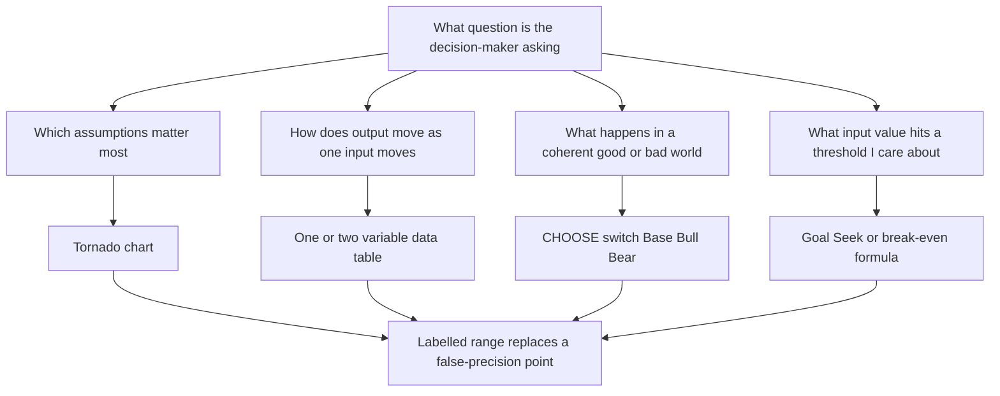
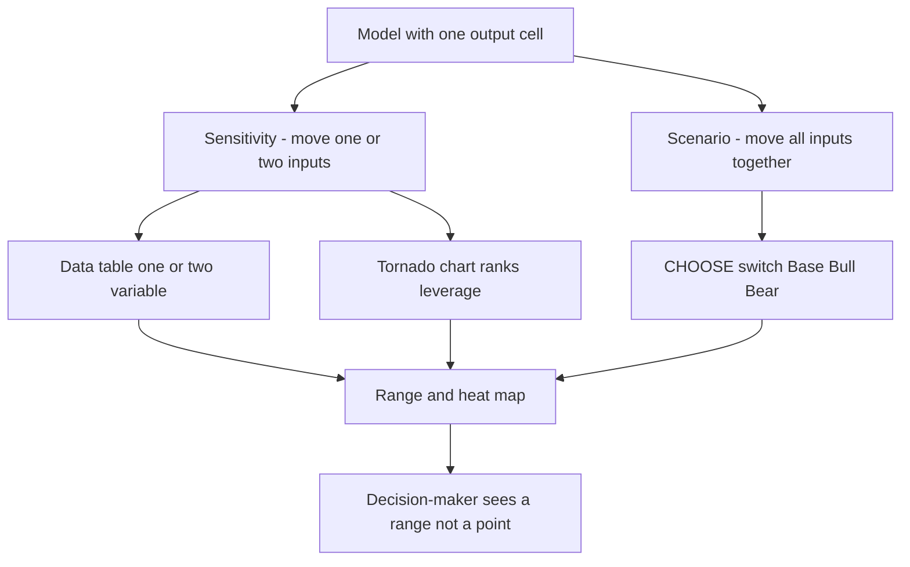
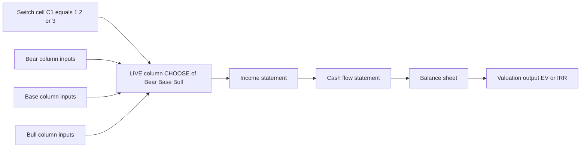

<!-- v2-deep -->

# Chapter 18 — Scenario and Sensitivity Analysis

## 1. The Problem

You have just finished a three-statement model. Revenue grows 8% a year, gross margin holds at 42%, working capital cycles at 45 days, and the DCF spits out an enterprise value of ₹1,240 crore. You paste that number into a board deck and someone asks the only question that matters: *"How confident are you in that?"*

The honest answer is: not very. Every one of those inputs is a guess dressed up as a decimal. Revenue growth could be 5% or 11%. Margins compress when a competitor cuts prices. Interest rates move. Your ₹1,240 crore is one draw from a distribution of possible outcomes, and you have shown the reader a single point as if the future were already settled.

This is the central lie of a naive model: **false precision**. A number like ₹1,240.7 crore *looks* rigorous — it has a decimal, it came from a spreadsheet, it reconciles to the rupee. But the confidence interval around it might be ±40%. Presenting a point estimate to a decision-maker hides the very thing they are paid to manage: uncertainty and its consequences.

Decisions are rarely "what is the number?" They are "what happens if I am wrong, and how wrong can I afford to be?" A lender wants to know whether the borrower still services debt if EBITDA falls 20%. A CFO deciding on a ₹500 crore capex wants to know the return in a downturn, not just the plan. An acquirer wants the price at which the deal stops making sense. None of these questions can be answered by a single output cell.

Scenario and sensitivity analysis exist to convert your model from a **fortune-telling machine into a decision instrument** — one that maps a *range* of assumptions to a *range* of outcomes, and tells the decision-maker which assumptions actually move the needle.

**A concrete taste of why this matters.** Suppose your base EV is ₹1,250 cr and the decision is "should we bid ₹1,100 cr for this company?" On the point estimate alone, yes — you are buying below fair value. But if a two-minute sensitivity shows that a single percentage point of WACC error (well within your uncertainty) drops EV to ₹1,111 cr, then your ₹150 cr margin of safety is really a ₹11 cr margin of safety, and one bad assumption erases it. That reframing — *from "we have upside" to "we have almost no cushion"* — is the entire value of this chapter, and it costs you thirty seconds of Data-Table work to surface it.

## 2. The Core Idea

There are two distinct techniques, and beginners conflate them constantly. Keep them separate in your head.

- **Sensitivity analysis** asks: *if this one input changes, how much does the output change?* You wiggle one (or two) variables in isolation, holding everything else fixed, and watch the output respond. It isolates the *slope* — the leverage each assumption has on your answer. Its natural output is a **data table** or a **tornado chart**.

- **Scenario analysis** asks: *if the world looks like X, what is the output?* A scenario is a **coherent bundle** of assumptions that move together because they describe one story. In a recession, revenue growth falls *and* margins compress *and* receivables stretch *and* the discount rate rises — all at once, because they share a cause. Its natural output is a small set of named worlds: **Base, Bull, Bear**.

The mental model:

- Sensitivity = *one knob at a time*, mechanical, reveals leverage.
- Scenario = *a whole dashboard of knobs preset to tell a story*, narrative, reveals plausible outcomes.

Both replace a point with a range. Sensitivity tells you *where to look* (which inputs matter). Scenario tells you *what to plan for* (which futures are survivable). A complete analysis uses both: sensitivity to find the two or three assumptions that dominate the answer, then scenarios to bundle those into stories a human can reason about.

**A third relative: break-even (goal-seek) analysis.** There is a mirror-image question that sits alongside these two. Sensitivity asks "given this input, what is the output?" Break-even inverts it: "what input value drives the output to a threshold I care about?" — the WACC at which NPV hits zero, the revenue at which the covenant is exactly met, the price at which the deal stops adding value. Excel's **Goal Seek** solves this inversion automatically (§4.7). Think of it as sensitivity run backwards: instead of scanning inputs to see where the output lands, you name the output you need and let Excel find the input that produces it.

**The decision map** — which instrument answers which question:



## 3. Why It Works

**Why ranges beat points.** Any forecast input is a random variable with a mean and a spread. Reporting only the mean discards the spread — and the spread is decision-relevant whenever outcomes are asymmetric. A project with an expected NPV of ₹50 crore but a 30% chance of ruin is a different animal from one with the same expected NPV and no downside. The point estimate is identical; the decision is opposite. Ranges surface the asymmetry.

**Why isolating one variable reveals leverage.** Outputs depend non-linearly on many inputs, but *locally* — around your base case — the output responds roughly linearly to small changes in each input. The partial derivative of output with respect to each input is its **sensitivity**. Inputs with large partials are the ones worth arguing about; inputs with tiny partials are noise you can stop worrying about. This is why a tornado chart is so powerful: it ranks assumptions by how much they actually matter, so you spend your research time where it pays.

**Making "the slope" concrete.** For our valuation engine `EV = FCFF₁ / (WACC − g)`, calculus gives the exact partial derivatives, and they explain everything a data table shows you:

- ∂EV/∂WACC = −FCFF₁ / (WACC − g)². At the base (100, 11%, 3%): −100 / 0.08² = −100 / 0.0064 = **−15,625**. Reading: a one-percentage-point (0.01) rise in WACC costs roughly 0.01 × 15,625 ≈ ₹156 cr — which is why the WACC column in Example 1 falls by ~₹110–200 cr per point.
- ∂EV/∂g = +FCFF₁ / (WACC − g)² = **+15,625** (equal magnitude, opposite sign). WACC and g have the *same* leverage here — they enter the denominator symmetrically. That is why the tornado bars for a discount-rate move and an equal-sized growth move come out comparable.
- ∂EV/∂FCFF₁ = 1 / (WACC − g) = 1 / 0.08 = **12.5**. Every ₹1 cr of extra year-one cash flow adds ₹12.5 cr of EV — the value is simply scaled by the perpetuity multiple.

The key insight the derivatives reveal: the `(WACC − g)²` denominator means sensitivity to *both* rate inputs **explodes as the spread narrows**. At a 4% spread the WACC partial would be −100/0.0016 = −62,500 — four times as violent. This is the mathematical reason DCFs with high terminal growth relative to WACC are so fragile, and why reviewers instinctively distrust a terminal spread below ~3–4%.

**Why bundling assumptions into scenarios is more honest than moving them independently.** Real-world variables are *correlated*. If you sensitise revenue and margin independently, the model will happily produce a "high revenue, high margin" cell that may be economically impossible (high growth usually costs margin). Scenarios respect correlation by construction: each named world sets every input to a value consistent with one causal story. A bear case where revenue collapses but margins expand is incoherent, and scenario thinking prevents you from accidentally presenting it.

**Why this earns trust.** When you hand a decision-maker a range with the drivers labelled, you are showing your work. You are saying "here is the answer, here is what could break it, and here is how bad it gets." That is the difference between an analyst who is a calculator and one who is a partner in the decision.

## 4. Full Technical Content

We will build these instruments, from simplest to most powerful:

1. One-variable data table (sensitivity)
2. Two-variable data table (sensitivity)
3. CHOOSE/switch-driven scenarios (Base/Bull/Bear)
4. Tornado analysis (ranked sensitivity)
5. Goal Seek and break-even (inverse sensitivity)

Throughout, the golden rule of model architecture applies: **inputs, calculations, and outputs live in separate, clearly-formatted regions.** Sensitivity tools only work cleanly when your model has a single, well-defined output cell and a single, well-defined set of input cells.

### 4.1 Data tables: the mechanism

Excel's **Data Table** (`Data ▸ What-If Analysis ▸ Data Table`) is a built-in engine that automates "change an input, record the output, repeat." It is an *array formula* under the hood — you cannot edit or delete a single cell of its results; you must select the whole block. Behind the scenes Excel substitutes each value you list into a designated input cell, recalculates the entire workbook, and writes the resulting output into the grid.

**Critical structural requirement:** the data table's formula must *point to* the model output, and the input cells you sensitise must be the *actual* input cells the model uses. A data table does not understand your logic; it just swaps values into cells and reads the result. If your output cell isn't genuinely a function of the input cell, the table returns a flat, identical column — the classic "my data table isn't working" symptom.

**What the substitution really does, step by step.** For a one-variable table sensitising WACC in cell `C10`, with WACC test values 9%…13% down column A and the output link at the top of column B, Excel internally executes this loop:

1. Read the first input value (9%) from column A.
2. Temporarily write 9% into `C10` (the *real* model input — not a copy).
3. Recalculate the whole workbook so every dependent cell updates.
4. Read the output cell the corner formula points to, and write it beside the 9% row.
5. Restore `C10` to its original value and repeat for 10%, 11%, …

It never leaves `C10` permanently changed; the substitution is transient. This is exactly why the input cell must be a genuine *hard-coded input*, never itself a formula — Excel cannot "write into" a formula cell, so pointing the Column input cell at a calculated cell silently produces garbage or a flat table.

### 4.2 One-variable data table — build steps

Goal: show how enterprise value (EV) responds to WACC.

Assume your model computes EV in cell `B2` (a live formula referencing WACC in some input cell, say `C10`).

**Step 1 — Lay out the input values.** In a column, list the WACC values you want to test. Put them *down* a column starting one row below and one column left of where results will go:

```
        A            B
2                 =B2   ← output formula reference (top of results)
3     9.0%
4    10.0%
5    11.0%
6    12.0%
7    13.0%
```

Column A holds the input values (9%–13%). Cell `B2` contains `=B2`... no — it references the model output. If the model output lives elsewhere, put `=OutputCell` in the corner cell (here `B2`), one row *above* the first result and one column *right* of the input list. This corner cell is the linkage; format it hidden (custom format `;;;`) so it doesn't clutter the presentation.

**Step 2 — Select the table range.** Select from the corner formula down and across: `A2:B7`. The selection must include the column of inputs *and* the column where outputs will be written, with the formula sitting in the top-right corner.

**Step 3 — Invoke the tool.** `Data ▸ What-If Analysis ▸ Data Table`. Because the inputs run down a *column*, put your model's input cell reference in the **Column input cell** box: `$C$10` (the WACC cell). Leave "Row input cell" blank. Click OK.

**Step 4 — Read the result.** Excel fills `B3:B7` with the EV that results from each WACC. It has, for each row, dropped the row's WACC into `C10`, recalculated the model, and pasted EV back. The formula shown is `{=TABLE(,C10)}` — the curly braces mark it as an array you cannot partially edit.

**Formatting:** number-format the input column as percentages, the output column as currency (₹ crore, comma-separated). Give the corner cell the hidden `;;;` format and add a plain-language column header above the inputs ("WACC") and above the outputs ("Enterprise Value").

**Multiple outputs in one table.** A one-variable data table can report *several* outputs at once — just place additional output links across the top row, one per column. To show EV **and** implied equity value (EV − net debt) as WACC varies, put `=EV_cell` in `B2` and `=Equity_cell` in `C2`, list the WACC values down `A3:A7`, select `A2:C7`, and set **Column input cell** = `$C$10`. Excel fills both `B` and `C` columns from the single substitution loop. This is the cheapest way to hand a reviewer a value-and-per-share table simultaneously (see Example 7).

### 4.3 Two-variable data table — build steps

Goal: EV as a function of **WACC** (rows) and **terminal growth rate g** (columns) — the canonical DCF sensitivity grid.

**Step 1 — Corner formula.** In the top-left corner of the grid, put `=OutputCell` (the EV cell). Say the grid corner is `A2`, so `A2 = B2` (the model's EV).

**Step 2 — Inputs on two axes.** Down column A below the corner: the WACC values. Across row 2 to the right of the corner: the g values.

```
        A        B        C        D        E
2   =EV      1.0%     2.0%     3.0%     4.0%    ← g across the top
3   9.0%
4  10.0%
5  11.0%
6  12.0%
7  13.0%
        ↑
   WACC down the side
```

**Step 3 — Select and invoke.** Select the whole block `A2:E7`. `Data ▸ What-If Analysis ▸ Data Table`. Now you use **both** boxes:
- **Row input cell** = the input cell for the values running across the top (g) → `$C$11`.
- **Column input cell** = the input cell for the values running down the side (WACC) → `$C$10`.

Getting these two swapped is the single most common data-table error — the grid fills but every number is nonsense. Mnemonic: **Row input cell ↔ values in the top Row; Column input cell ↔ values in the left Column.**

**Step 4 — Read and format.** Each interior cell now holds the EV for that (WACC, g) pair. Format the corner cell hidden (`;;;`), the axes as percentages, the interior as currency. Apply a **colour scale** (`Home ▸ Conditional Formatting ▸ Color Scales`) so the reader sees the gradient of value across the grid at a glance — green high, red low. Highlight the base-case cell (your live WACC and g) with a border so the reader anchors on it.

**A quick sanity check that catches a swapped-axes error instantly.** After the table fills, glance at the corner cell's neighbours: read *down* the left axis at the base-case g-column and confirm EV *falls* as WACC *rises* (higher discount rate, lower value). Read *across* the top axis at the base-case WACC-row and confirm EV *rises* as g *rises*. If either monotonic pattern is reversed or scrambled, you have swapped the Row and Column input cells. This ten-second directional check is faster and more reliable than re-reading the dialog.

**Performance note:** data tables recalculate on *every* workbook calc, which can make a large model crawl. If it does, set `Formulas ▸ Calculation Options ▸ Automatic Except for Data Tables`, and press F9 (or Ctrl+Alt+F9 for full recalc) when you want the tables refreshed. A 5×4 grid is 20 full model recalcs per keystroke; a 20×20 grid is 400. On a heavy three-statement model that difference is the gap between an instant sheet and a five-second freeze on every edit.

### 4.4 Scenario switching with CHOOSE — build steps

Data tables sensitise one or two inputs. **Scenarios** move a whole set of inputs together. The professional standard is a **scenario switch driven by `CHOOSE`** (or `INDEX`), not Excel's Scenario Manager (§4.5), because the switch is transparent, auditable, and lives on the sheet.

**Architecture:**

Build a small **assumptions block** with one row per driver and one column per scenario, plus a single **switch cell** that names the active scenario by number.

```
                         Bear(1)   Base(2)   Bull(3)   | LIVE (active)
Scenario switch:  [ 2 ]                                |
Revenue growth            3%        8%       12%       |  =CHOOSE($C$1, D-row...)
Gross margin             38%       42%       46%       |  =CHOOSE(...)
Working-capital days      55        45        38       |  =CHOOSE(...)
WACC                     13%       11%       10%       |  =CHOOSE(...)
```

**Step 1 — The switch cell.** Pick a cell, say `C1`. Enter `2` for Base. Restrict it with **Data Validation** (`Data ▸ Data Validation ▸ List`, values `1,2,3`, or a dropdown) so no one types `7`. Optionally add a `CHOOSE(C1,"Bear","Base","Bull")` label cell beside it so the active scenario name is visible.

**Step 2 — The scenario table.** In columns D, E, F lay out the Bear, Base, Bull value for each driver, one driver per row. These are *hard-coded inputs* — the only hard-coded numbers in this region — so format them blue (the convention for inputs).

**Step 3 — The LIVE column.** In a dedicated column (say `H`), each driver's live value is:

```
=CHOOSE($C$1, D5, E5, F5)
```

for the driver on row 5. `CHOOSE` returns the Dth, Eth, or Fth argument depending on the switch. When `C1 = 2`, every LIVE cell pulls its Base value; flip `C1` to `1` and the entire model swings to Bear in one keystroke.

**Step 4 — Wire the model to LIVE, never to the scenario columns.** Your three-statement model must reference **only** the LIVE column (`H`), never `D`/`E`/`F` directly. This is the discipline that makes it work: there is exactly one live value per driver, and the switch controls all of them coherently.

**Why CHOOSE over IF-nesting:** `CHOOSE(C1, Bear, Base, Bull)` is flat and reads left-to-right in scenario order. Nested `IF(C1=1,…,IF(C1=2,…,…))` is error-prone and hard to extend to a fourth scenario. `INDEX(D5:F5, C1)` is an equivalent alternative and scales to many scenarios via a horizontal range.

**The scalable alternative — INDEX with a horizontal range.** When you have four, five, or eight scenarios, typing every cell into `CHOOSE` becomes unwieldy. Use `=INDEX($D5:$F5, $C$1)` instead: it returns the `C1`-th cell in the driver's row of scenario values. To add a "Management case" you simply widen the range to `$D5:$G5` and extend the data validation list to `1,2,3,4` — no formula rewrite per row. A common refinement pairs `INDEX` with a **named scenario picked by text**: put a dropdown of scenario *names* in `C1`, then compute a hidden index cell `=MATCH(C1, ScenarioHeaderRow, 0)` and feed that into `INDEX`. Now the user picks "Bear" from a list of words rather than remembering that Bear = 1.

**Formatting the switch prominently:** put the switch cell top-left of the model, shaded yellow with a thick border — it is the model's master control, and every user should see it immediately.

### 4.5 Scenario Manager — the built-in alternative

Excel's **Scenario Manager** (`Data ▸ What-If Analysis ▸ Scenario Manager`) stores named sets of input values and swaps them into your cells on demand. You define a scenario ("Bear"), tell it which cells change and to what values, and it can generate a summary report comparing outputs across scenarios.

**When to use it:** quick, throwaway comparisons, or when you cannot restructure the sheet to add a switch column.

**Why professionals usually avoid it for delivered models:** the scenario values are hidden inside a dialog box, not on the sheet — invisible to a reviewer, impossible to audit at a glance, and easy to forget. The CHOOSE-switch approach keeps every scenario value visible and version-controllable. Use Scenario Manager to *learn* the concept; ship the CHOOSE switch.

**Build (if you want it):** `Add ▸ name "Bear" ▸ Changing cells = the input cells ▸ enter Bear values`. Repeat for Base and Bull. `Summary ▸ choose result cells (EV, IRR)` produces a comparison table on a new sheet.

### 4.6 Tornado analysis — build steps

A **tornado chart** ranks inputs by their impact on the output, drawing a horizontal bar for each input showing how far the output swings when that input moves from its low to its high case. Sorted longest-bar-on-top, the shape resembles a tornado — hence the name. It is the visual answer to "which assumptions actually matter?"

There is no native "tornado" button; you build it from a one-at-a-time sensitivity table plus a bar chart.

**Step 1 — Define a low and high for each input.** For each driver, decide a downside and upside value (e.g., ±20%, or the Bear/Bull values). Keep everything else at Base.

**Step 2 — Compute output at each extreme.** For each input, use a one-variable data table (or manual substitution) to get: output when that input is at Low (all else base), and output when at High. Record `Output_Low` and `Output_High` per input. The **swing** = `|Output_High − Output_Low|`.

| Input | Output at Low | Output at High | Swing |
|---|---|---|---|
| Revenue growth | 1,050 | 1,470 | 420 |
| Gross margin | 1,090 | 1,410 | 320 |
| WACC | 1,380 | 1,120 | 260 |
| WC days | 1,215 | 1,265 | 50 |

**Step 3 — Sort by swing, descending.** Largest swing on top.

**Step 4 — Chart it.** Create a **stacked horizontal bar chart** where each bar spans from `Output_Low` to `Output_High`, centred conceptually on the base output. A common technique: plot two series — a transparent series from 0 (or from the minimum) to `Output_Low`, and a visible series of width `Swing`. Add a vertical line at the base-case output so the reader sees which inputs push value up versus down. Sort the category axis so the biggest bar is at the top.

**Exact spreadsheet recipe for the floating bars.** The trick that trips people up is making the bars "float" so each starts at that input's low value rather than at zero. Build three helper columns per input:

- `Base_anchor` = the minimum of the two outcomes for that input = `MIN(Output_Low, Output_High)`. This is the *transparent* base series.
- `Swing` = `ABS(Output_High − Output_Low)`. This is the *visible* series stacked on top of the anchor.
- Sort all three columns together by `Swing` descending.

Then insert a **2-D Stacked Bar** chart on the two columns `Base_anchor` and `Swing`, select the `Base_anchor` series, and set its fill to **No Fill** (and no border). What remains visible is a set of bars that each begin at their own low value and extend by their swing — the floating tornado. Finally add the base-case output as a vertical reference line by inserting a one-point scatter/line series at x = base output, or simply drawing a formatted vertical line. Bars to the *left* of that line are downside-dominant inputs; bars to the *right* are upside-dominant.

**Reading it:** the top three bars are your model's *dominant assumptions* — the ones to research hardest, defend in the memo, and turn into scenarios. The bottom bars are inputs you can fix at base and stop debating.

**The build pipeline as a picture:**


**Tornado versus spider (one-way sensitivity plot).** A tornado shows one bar per input at a single ±move. A **spider chart** plots output on the y-axis against percentage change in each input on the x-axis, one *line* per input, so the **slope and curvature** of each line show leverage across a *range* of moves, not just at the extremes. Use a tornado to rank drivers for an executive audience; use a spider when a driver's effect is non-linear and you need to show that it accelerates (steepening line) as it moves — for instance our WACC line, whose slope steepens as WACC falls toward g.

### 4.7 Goal Seek and break-even — inverse sensitivity

Sensitivity scans inputs to see where the output lands. **Break-even** inverts the question: *what input value makes the output equal a target?* Two ways to get it.

**Analytically, when the formula inverts cleanly.** Our engine `EV = FCFF₁ / (WACC − g)` rearranges directly. If a buyer will pay ₹1,100 cr, the WACC that justifies that price (holding FCFF₁ = 100, g = 3%) solves `1,100 = 100 / (WACC − 0.03)` → `WACC − 0.03 = 100 / 1,100 = 0.090909` → `WACC = 0.120909` ≈ **12.09%**. Reading: any WACC below ~12.1% makes the ₹1,100 cr bid a value purchase; above it, you overpay. That single break-even number is often more decision-useful than the whole grid.

**Numerically, with Goal Seek, when the formula does not invert** (a multi-year DCF, an IRR, a circular interest calc). `Data ▸ What-If Analysis ▸ Goal Seek`:
- **Set cell** = the output cell (e.g., the NPV cell).
- **To value** = the target (e.g., `0` for break-even NPV).
- **By changing cell** = the single input you want solved (e.g., the WACC cell, or annual FCF).

Excel iterates until the output hits the target and writes the solved input into the changing cell. Caveats: Goal Seek changes **one** input and **overwrites** it permanently (note the original value first, or work on a copy), solves for **one** output at a time, and finds **one** root — for a non-monotonic output it may land on a local solution or fail to converge (raise iteration limits under `File ▸ Options ▸ Formulas` if needed). See Example 5 for the break-even FCF worked both ways.

### 4.8 A note on interview framing of the toolkit

Interviewers routinely test whether you know *which* instrument fits *which* question, because picking the wrong one signals you have only memorised buttons. Keep this crisp mapping ready: "one input, full range of moves → data table or spider; rank all inputs at a glance → tornado; a coherent story across many inputs → scenario switch; solve for a threshold → Goal Seek; probabilistic full distribution → Monte Carlo." The rest of §6 expands the interview angles.

## 5. Worked Examples

We use a compact DCF so every number is reproducible by hand. Build this in Excel alongside.

**Base model.** A firm generates Free Cash Flow to Firm (FCFF) with a simple two-line valuation:

- Year-1 FCFF = ₹100 crore
- FCFF grows at `g` forever (Gordon growth)
- Discount rate = WACC

Enterprise Value (perpetuity, first cash flow one year out):

```
EV = FCFF₁ / (WACC − g)
```

Base assumptions: `WACC = 11%`, `g = 3%`.

```
EV_base = 100 / (0.11 − 0.03) = 100 / 0.08 = ₹1,250 crore
```

### Example 1 — One-variable sensitivity (EV vs WACC)

Hold `g = 3%`, vary WACC. `EV = 100 / (WACC − 0.03)`:

| WACC | WACC − g | EV = 100 / (WACC−g) |
|---|---|---|
| 9%  | 0.06 | ₹1,666.7 cr |
| 10% | 0.07 | ₹1,428.6 cr |
| 11% | 0.08 | ₹1,250.0 cr |
| 12% | 0.09 | ₹1,111.1 cr |
| 13% | 0.10 | ₹1,000.0 cr |

**Reading:** a single percentage point of WACC moves EV by roughly ₹110–200 crore near the base — and the effect is *non-linear* (the jump from 9→10% is larger than 12→13%, because the denominator is smaller at low rates). This is exactly what a one-variable data table produces automatically. Note the point estimate ₹1,250 cr sits inside a ₹1,000–1,667 cr band from a plausible WACC range alone.

**Tying it back to the slope (§3).** The step from 11% to 12% is 1,250.0 − 1,111.1 = ₹138.9 cr; the derivative predicted ~₹156 cr *at* 11%. The realised step is smaller because the derivative measures the instantaneous slope at the starting point, while a full 1% move rides down the curve into flatter territory — the discrete step always undershoots the point-slope estimate for a convex-decreasing function. This gap between "local slope" and "actual step" is why analysts prefer a real data table over a back-of-envelope derivative for anything beyond a tiny nudge.

### Example 2 — Two-variable sensitivity (EV vs WACC and g)

Now vary both. `EV = 100 / (WACC − g)`:

| WACC \ g | g = 1% | g = 2% | g = 3% | g = 4% |
|---|---|---|---|---|
| **9%**  | 100/0.08 = 1,250.0 | 100/0.07 = 1,428.6 | 100/0.06 = 1,666.7 | 100/0.05 = 2,000.0 |
| **10%** | 100/0.09 = 1,111.1 | 100/0.08 = 1,250.0 | 100/0.07 = 1,428.6 | 100/0.06 = 1,666.7 |
| **11%** | 100/0.10 = 1,000.0 | 100/0.09 = 1,111.1 | **100/0.08 = 1,250.0** | 100/0.07 = 1,428.6 |
| **12%** | 100/0.11 = 909.1 | 100/0.10 = 1,000.0 | 100/0.09 = 1,111.1 | 100/0.08 = 1,250.0 |
| **13%** | 100/0.12 = 833.3 | 100/0.11 = 909.1 | 100/0.10 = 1,000.0 | 100/0.09 = 1,111.1 |

The base case (11%, 3%) = ₹1,250 cr sits in the middle (bold). **Reading:** across a reasonable box of assumptions, EV ranges from ₹833 cr (bear corner: high WACC, low growth) to ₹2,000 cr (bull corner: low WACC, high growth). That ±40–60% band *is the honest answer* — far more useful to a decision-maker than "₹1,250 crore." Notice the diagonal of equal values: (9%,1%), (10%,2%), (11%,3%), (12%,4%) all give ₹1,250 cr, because they share the same spread `WACC − g = 0.08`. That diagonal is the intuition a colour-scale heat map makes visible instantly.

**Edge case — the exploding corner.** Extend the top-right one more step to g = 5% at WACC = 9% and the spread collapses to 0.04, giving 100/0.04 = ₹2,500 cr; push to g = 8% at WACC = 9% and the spread is 0.01, giving ₹10,000 cr; let g reach WACC and EV goes to infinity, and if g *exceeds* WACC the formula returns a *negative* EV, which is economic nonsense. This is not a rounding quirk — it is the Gordon model breaking down when perpetual growth approaches the discount rate. **Practical rule:** never let a terminal-growth sensitivity axis approach WACC; cap g a comfortable margin below the lowest WACC on the grid, and be suspicious of any cell where the implied multiple `1/(WACC−g)` exceeds what the market pays for comparable perpetuities.

### Example 3 — Scenario analysis (Base/Bull/Bear via CHOOSE)

Now bundle assumptions into coherent stories. Each scenario sets FCFF₁, g, and WACC together:

| Driver | Bear (1) | Base (2) | Bull (3) |
|---|---|---|---|
| FCFF₁ (₹ cr) | 85 | 100 | 115 |
| Growth g | 2% | 3% | 4% |
| WACC | 13% | 11% | 10% |

LIVE cell for each driver = `=CHOOSE($C$1, Bear, Base, Bull)`. EV = `FCFF₁ / (WACC − g)`:

- **Bear** (`C1=1`): 85 / (0.13 − 0.02) = 85 / 0.11 = **₹772.7 cr**
- **Base** (`C1=2`): 100 / (0.11 − 0.03) = 100 / 0.08 = **₹1,250.0 cr**
- **Bull** (`C1=3`): 115 / (0.10 − 0.04) = 115 / 0.06 = **₹1,916.7 cr**

**Reading:** flipping one cell (`C1`) swings the whole model. The three coherent worlds span ₹773 cr to ₹1,917 cr. Crucially, this is *narrower and more defensible* than the two-variable corner (₹833–2,000) because a scenario forbids incoherent combinations — the bear case does not pair collapsing cash flow with a bull-case discount rate. This is the number set you take to a board: "Base ₹1,250 cr, downside ₹773 cr if the recession bites, upside ₹1,917 cr if the expansion holds."

**A subtlety worth catching.** Compare Example 2's grid corner (833–2,000, a range of 1,167) with Example 3's scenario span (773–1,917, a range of 1,144). The scenario *low* (773) is actually *below* the grid's bear corner (833) — how, if scenarios are supposed to be narrower? Because the scenario also moves FCFF₁ (down to 85), a driver the WACC×g grid held fixed at 100. So a scenario is not simply "a diagonal slice of the grid"; it lives in a higher-dimensional assumption space the 2-D grid cannot show. The lesson: a two-variable data table and a scenario answer *different* questions, and neither is a substitute for the other. The grid isolates two drivers cleanly; the scenario bundles *all* drivers coherently.

### Example 4 — Tornado (which driver dominates?)

Vary each driver alone from its Bear to its Bull value, holding the other two at Base, and measure the EV swing:

| Driver (others at Base) | Low case → EV | High case → EV | Swing |
|---|---|---|---|
| **WACC** (13%→10%) | 100/(0.13−0.03)=1,000.0 | 100/(0.10−0.03)=1,428.6 | **428.6** |
| **FCFF₁** (85→115) | 85/0.08 = 1,062.5 | 115/0.08 = 1,437.5 | **375.0** |
| **Growth g** (2%→4%) | 100/(0.11−0.02)=1,111.1 | 100/(0.11−0.04)=1,428.6 | **317.5** |

Sorted, the tornado is: **WACC (428.6) > FCFF₁ (375.0) > g (317.5)**. **Reading:** the discount rate is the single most powerful lever in this valuation, so it deserves the most scrutiny and the tightest justification in the memo. All three swings are large and comparable — this valuation is genuinely uncertain, and no single point estimate does it justice.

**Why the ranking depends on the range you chose, not just the math.** WACC "wins" partly because we gave it a 3-point spread (13→10) versus g's 2-point spread (4→2). If you instead gave g a symmetric ±2-point move *and* WACC only a ±1-point move, g would out-swing WACC even though §3 showed their partials are equal in magnitude. **The trap:** a tornado ranks `slope × range`, not slope alone. An honest tornado uses *equally-plausible* low/high bands per driver (e.g., each set to its own realistic 10th/90th percentile), not arbitrary equal-percentage bumps — otherwise you are ranking your choice of ranges, not the model's true leverage. Always state the low/high band next to each bar so the reader can judge whether the ranges are fair.

### Example 5 — Break-even and Goal Seek on a multi-year NPV

The perpetuity inverts by hand; a real multi-year project needs Goal Seek. Build a five-year project:

- Investment at t = 0: ₹1,000 cr (outflow)
- Free cash flow: ₹300 cr per year for years 1–5
- Discount rate (WACC): 10%

NPV = −1,000 + 300 × [annuity factor]. The 5-year, 10% annuity factor is `(1 − 1.10⁻⁵)/0.10`. Since `1.10⁵ = 1.61051`, `1.10⁻⁵ = 0.620921`, so the factor = `(1 − 0.620921)/0.10 = 3.790787`.

```
NPV_base = −1,000 + 300 × 3.790787 = −1,000 + 1,137.24 = ₹137.24 cr
```

**Sensitivity to WACC** (FCF fixed at 300):

| WACC | Annuity factor | PV of inflows | NPV |
|---|---|---|---|
| 8%  | (1−1.08⁻⁵)/0.08 = 3.992710 | 1,197.81 | **+197.81** |
| 10% | 3.790787 | 1,137.24 | **+137.24** |
| 12% | (1−1.12⁻⁵)/0.12 = 3.604776 | 1,081.43 | **+81.43** |
| 14% | (1−1.14⁻⁵)/0.14 = 3.433081 | 1,029.92 | **+29.92** |

**Sensitivity to annual FCF** (WACC fixed at 10%, factor 3.790787):

| Annual FCF | PV of inflows | NPV |
|---|---|---|
| 250 | 947.70 | **−52.30** |
| 300 | 1,137.24 | **+137.24** |
| 350 | 1,326.78 | **+326.78** |

**Break-even, both ways.** At FCF = 250 the project *destroys* value (NPV −52.3), so somewhere between 250 and 300 lies the break-even cash flow. Analytically: NPV = 0 needs `FCF × 3.790787 = 1,000`, i.e. `FCF = 1,000 / 3.790787 = ₹263.80 cr`. Check: 263.80 × 3.790787 = 1,000.02 ≈ 1,000. ✓ In Excel you get the identical answer with **Goal Seek**: Set cell = NPV cell, To value = `0`, By changing cell = the annual-FCF input; Excel writes ≈263.80 into it. Likewise the break-even **WACC** (FCF back at 300) solves `300 × factor = 1,000` → factor = 3.3333 → Goal Seek returns WACC ≈ **15.24%** (the project's IRR). **Reading for the memo:** "The project clears its cost of capital as long as annual cash flow stays above ~₹264 cr or the discount rate stays below ~15.2%. Both thresholds are uncomfortably close to plan — a 12% cash-flow miss wipes out the entire NPV."

### Example 6 — Credit scenario (does the borrower survive a downturn?)

Lenders do not ask "what is the value?" — they ask "does the borrower keep paying under stress?" The instrument is a scenario on the **Debt-Service Coverage Ratio**, `DSCR = CFADS / Debt Service`, where CFADS (cash flow available for debt service) = EBITDA − cash tax − maintenance capex − increase in working capital. Covenant: DSCR must stay ≥ **1.20×**.

| Line (₹ cr) | Base | Bear (EBITDA −20%) |
|---|---|---|
| EBITDA | 300 | 240 |
| less cash tax | 50 | 35 |
| less maintenance capex | 40 | 40 |
| less increase in working capital | 10 | 25 |
| **CFADS** | **200** | **140** |
| Debt service (interest 45 + principal 75) | 120 | 120 |
| **DSCR** | **1.67×** | **1.17×** |

**Reading:** Base coverage of 1.67× looks comfortable, but the scenario reveals the covenant is fragile — a 20% EBITDA fall drives DSCR to 1.17×, *below* the 1.20× covenant, tripping a default even though the borrower is still cash-generative (CFADS 140 > debt service 120, so it can physically pay). Note the coherence discipline from §3 at work: the bear case does not *only* cut EBITDA; it also lets working capital stretch (10 → 25, because customers pay slower in a downturn) and taxes fall with profit — one causal story, several moving lines. A naive analyst who flexed *only* EBITDA would get CFADS = 240 − 50 − 40 − 10 = 140 by luck here, but in a real model the correlated working-capital drag is often what actually breaks the covenant. **The lender's take-away:** ask for a covenant of 1.20× tested against a −20% EBITDA scenario, and the deal needs either a smaller principal amortisation or an equity cushion before it is bankable.

### Example 7 — One data table, two outputs (EV and equity value)

Using the §4.2 multi-output technique, sensitise WACC and report both EV and **equity value** = EV − net debt, with net debt = ₹300 cr (g held at 3%):

| WACC | EV (₹ cr) | Equity = EV − 300 | Per share (100 cr shares) |
|---|---|---|---|
| 9%  | 1,666.7 | 1,366.7 | ₹13.67 |
| 10% | 1,428.6 | 1,128.6 | ₹11.29 |
| 11% | 1,250.0 | 950.0 | ₹9.50 |
| 12% | 1,111.1 | 811.1 | ₹8.11 |
| 13% | 1,000.0 | 700.0 | ₹7.00 |

**Reading:** because net debt is a *fixed* ₹300 cr subtraction, equity value swings by the *same absolute* amount as EV (a ₹238 cr EV drop from 10→11% is a ₹238 cr equity drop) but by a *larger percentage* — equity falls from ₹1,128.6 cr to ₹950 cr, a 15.8% drop, versus EV's 12.5% drop over the same step. This is **financial leverage amplifying the sensitivity of equity**: the more debt in the capital structure, the more violently the equity value (and share price) reacts to the same change in enterprise value. It is the single most important reason a one-variable EV table should almost always be extended to show equity value per share — that is the number the shareholder actually feels.

## 6. Connections

- **Chapter link — the 3-statement model (Ch. 6–10):** sensitivity and scenario tools are only as good as the model's *integrity*. The LIVE column must feed the income statement, which feeds the cash flow, which feeds the balance sheet, which must still balance under every scenario. If flipping to Bear breaks your balance sheet, you have a plug error, not a scenario.
- **DCF and WACC (Ch. 14–16):** the two-variable WACC×g grid is the *standard* output of any DCF — reviewers expect it. Terminal value dominates most DCFs, so terminal-growth and discount-rate sensitivities are non-negotiable. The `(WACC−g)²` fragility from §3 is exactly why.
- **LBO and credit models (Ch. 20+):** lenders live in Bear scenarios. Debt covenants (DSCR, leverage) are tested under downside cases; the whole point of a credit model's scenario layer is to prove the borrower survives stress (Example 6). In an LBO the equity IRR is hyper-sensitive to exit multiple and leverage — the two-variable exit-multiple × leverage grid is the LBO's signature output.
- **Monte Carlo (advanced):** data tables move inputs one or two at a time on a grid; Monte Carlo draws thousands of *random* combinations from input distributions and produces a full probability distribution of the output. Scenario/sensitivity is the deterministic, presentable cousin — start here; graduate to Monte Carlo when correlations and probabilities are well-understood.
- **Presentation (Ch. 22+):** the output of this chapter — a range, a heat map, a tornado, three named cases — is what actually appears in the investment memo. The model is the engine; these are the deliverables.

**Interview angles.** This topic is a favourite because it separates button-pushers from thinkers. Common questions and the crisp answers:

1. *"Difference between sensitivity and scenario analysis?"* — Sensitivity moves one or two inputs in isolation to measure leverage; scenario moves *all* inputs together in a coherent story. Sensitivity finds which assumptions matter; scenario finds which futures are survivable.
2. *"In a DCF, what are you most sensitive to?"* — Terminal-value drivers: the discount rate and terminal growth, because TV is usually 60–80% of EV and the `(WACC−g)²` denominator makes both explosive near a tight spread. Always volunteer the WACC×g grid.
3. *"Why not just move every variable to its worst case and call that the downside?"* — Because those grid corners are usually economically impossible (correlated variables); the "all bad at once" corner over-states the true downside. Report a *coherent* bear scenario instead.
4. *"How would you decide which variables to sensitise?"* — Run a tornado first; it ranks drivers by swing. Sensitise the top two or three; fix the rest at base.
5. *"Client says EV is ₹1,250 cr — is that right?"* — Reject the premise politely: no single number is "right." Give the range and the drivers. That reframing is the answer they are testing for.
6. *"CHOOSE vs Scenario Manager?"* — CHOOSE keeps every scenario value visible and auditable on the sheet; Scenario Manager hides them in a dialog. Ship CHOOSE.
7. *"What breaks a two-variable data table?"* — Swapped row/column input cells, or a corner formula not downstream of the input cells. Show you know the directional sanity check.
8. *"How does leverage affect sensitivity?"* — Debt is a fixed claim, so equity value swings by the same *absolute* amount as EV but a larger *percentage* — leverage amplifies equity sensitivity (Example 7).

## 7. Traps and Common Errors

1. **Swapped row/column input cells** in a two-variable data table. The grid fills with plausible-looking garbage. Always re-derive: *values across the top → Row input cell; values down the side → Column input cell.* Confirm with the directional sanity check (§4.3).
2. **Data table pointing at a dead output.** If the corner formula references a cell that isn't actually a function of the input cell, every result is identical. Symptom: a flat column/grid. Fix: confirm the model input cell is genuinely upstream of the output.
3. **Wiring the model to scenario columns instead of the LIVE column.** If any statement references the Base column directly, flipping the switch won't move it, and your Bear case silently contains Base numbers. Reference *only* LIVE.
4. **Incoherent scenario bundles.** A bear case that pairs falling revenue with *expanding* margins and a *falling* discount rate is a fantasy. Each scenario must tell one causally consistent story.
5. **Sensitising correlated variables independently and reporting the corner.** The "everything good at once" and "everything bad at once" corners of a multi-variable grid are usually impossible. Report scenario ranges, not grid-corner extremes, as your headline downside/upside.
6. **Deleting one cell of a data table.** Excel blocks it ("cannot change part of a data table") — you must select and clear the whole array. Not a bug; it's an array formula.
7. **Slow workbook from live data tables.** Large models with several data tables recalculate endlessly. Switch to *Automatic Except for Data Tables* and refresh with F9.
8. **False precision in the deliverable.** Reporting "EV = ₹1,247.63 cr" when your sensitivity band is ₹773–1,917 cr is misleading. Round to the precision your uncertainty supports and *show the range*.
9. **Too many scenarios.** Base/Bull/Bear (three) is the sweet spot. Five or six named worlds dilute the message; decision-makers cannot hold them. Add a "Management case" or "Stress case" only if it drives a specific decision.
10. **Forgetting to protect the switch cell.** Without data validation, a user types `4` into a 3-scenario `CHOOSE` and gets `#VALUE!`. Constrain the switch to a dropdown.
11. **Letting a terminal-growth axis approach WACC.** As `g → WACC` the Gordon denominator collapses and EV explodes toward infinity, then flips *negative* once `g > WACC`. A sensitivity grid that wanders into this zone prints nonsense values that a colour scale will happily paint bright green. Cap g well below the lowest WACC on the axis.
12. **Unfair tornado ranges.** Ranking drivers by swing while giving each an arbitrary, unequal band ranks your *choice of ranges*, not the model's leverage (Example 4). Use each driver's own plausible 10th/90th-percentile band and label it on the bar.
13. **Goal Seek overwriting a real input silently.** Goal Seek permanently replaces the "changing cell" with its solved value and offers no undo history beyond Ctrl+Z. Note the original value first, or run it on a scratch copy — otherwise your base case is quietly corrupted.
14. **Forgetting the balance sheet must balance in every scenario.** A scenario switch that only touches the P&L but not the linked financing/plug can leave the balance sheet out by the change in retained earnings under Bear/Bull. Test the balance check under *all three* switch positions, not just Base.
15. **Reporting EV sensitivity but not equity sensitivity.** The shareholder cares about equity value per share, which (with fixed net debt) swings by a larger *percentage* than EV. An EV-only table understates the volatility the owner actually experiences (Example 7).

## 8. First-Principles Recap

Strip everything away and here is what remains. A model output is a function of uncertain inputs. A single output number hides that uncertainty and creates false confidence. Three moves restore honesty:

- **Sensitivity** perturbs inputs one or two at a time to measure *leverage* — the slope of output with respect to each input. Excel's **data table** automates the perturbation; the **tornado chart** ranks the results. This tells you *which assumptions matter*.
- **Scenario** presets every input to a value consistent with one coherent story, and a single **switch cell driving CHOOSE** flips the whole model between Base, Bull, and Bear. This tells you *which futures are survivable*.
- **Break-even** inverts the question — *what input value hits a threshold?* — solved by algebra when the formula inverts or by **Goal Seek** when it does not. This tells you *how much room to be wrong* you actually have.

The deliverable is never a point. It is a **range with its drivers labelled**: here is the base case, here is what breaks it, here is how bad and how good it plausibly gets, and here is the assumption that matters most. That is the difference between reporting a number and informing a decision.

## 9. Quick-Reference

**Core formula (worked example):** `EV = FCFF₁ / (WACC − g)`

**Slopes at the base case (100, 11%, 3%):** ∂EV/∂WACC = −FCFF₁/(WACC−g)² = −15,625; ∂EV/∂g = +15,625; ∂EV/∂FCFF₁ = 1/(WACC−g) = 12.5.

**One-variable data table:**
- Inputs down a column; output-reference formula in the corner (one row up, one col right).
- Select block → `Data ▸ What-If ▸ Data Table` → **Column input cell** = model input cell.
- Two outputs: place a second `=OutputCell` link in the adjacent top-row cell before selecting.

**Two-variable data table:**
- Output formula in top-left corner; one input across the top row, the other down the left column.
- Select block → Data Table → **Row input cell** = top-row's input; **Column input cell** = left-column's input.
- Sanity check: EV should fall as WACC rises and rise as g rises; if not, axes are swapped.

**Scenario switch:**
- Switch cell (data-validated 1/2/3) → `LIVE = CHOOSE($switch, Bear, Base, Bull)` per driver → model references LIVE only.
- Alternative that scales: `INDEX($BearToBull_range, $switch)`; pick by name with `MATCH(name, header, 0)`.

**Tornado:** for each input, `Swing = |Output_High − Output_Low|` (others at base); sort descending; `Anchor = MIN(Low,High)` transparent series + `Swing` visible series in a stacked bar; add base-case reference line.

**Break-even / Goal Seek:** `Data ▸ What-If ▸ Goal Seek` → Set cell = output, To value = target, By changing cell = one input. Notes: overwrites the input, one output and one input at a time, one root only.

**Key Excel functions:** `CHOOSE`, `INDEX`, `MATCH`, `DATA TABLE (What-If)`, `GOAL SEEK`, `Data Validation`, `Conditional Formatting ▸ Color Scales`.

**Formatting conventions:** blue = hard-coded inputs; black = formulas; hidden corner cell = `;;;`; yellow-shaded switch cell; percentages on rate axes; currency on value cells; colour-scale on the grid.

**Diagram — the two techniques and their outputs:**



*Both techniques feed one deliverable: a labelled range instead of a false-precision point.*

**Diagram — how the CHOOSE switch drives the whole model:**



*One keystroke in the switch cell swings every statement coherently to a new world.*

## 10. Build-It-Yourself Exercise

Open Excel and build the following from scratch. Do not copy the numbers blindly — wire the formulas so the sheet is live.

**Part A — The base DCF.**
1. Create an inputs block: `FCFF₁ = 100`, `g = 3%`, `WACC = 11%` (blue font, one cell each).
2. In an output cell, compute `EV = FCFF₁ / (WACC − g)`. Confirm you get ₹1,250 cr.

**Part B — Two-variable data table.**
3. Build a WACC (9%–13%, down the side) × g (1%–4%, across the top) grid. Put `=EV` in the corner; format it `;;;`.
4. Run the data table with the correct Row and Column input cells. Verify the base cell reads 1,250 and the bear corner (13%, 1%) reads 833.3.
5. Apply a green-red colour scale. Add a border around the base-case cell. Run the directional sanity check: EV should fall going down the WACC axis and rise going across the g axis.

**Part C — Scenario switch.**
6. Add a Bear/Base/Bull table for FCFF₁ (85/100/115), g (2%/3%/4%), WACC (13%/11%/10%).
7. Add a switch cell with data validation (list 1,2,3) and a LIVE column using `CHOOSE`.
8. Re-point your EV formula to the LIVE values. Flip the switch through 1→2→3 and confirm EV reads 772.7 → 1,250 → 1,916.7.

**Part D — Tornado.**
9. For each of the three drivers, compute EV at its Bear and Bull value with the other two at Base. Record the swing.
10. Sort by swing and build a horizontal bar chart using the `MIN`-anchor + `Swing` stacked-bar recipe. Confirm WACC has the largest swing (≈428.6). Label each bar with its low/high band.

**Part E — Break-even.**
11. Add the five-year project from Example 5 (invest 1,000; FCF 300 for years 1–5; WACC 10%; NPV should read ≈137.24). Use **Goal Seek** to find the annual FCF that makes NPV = 0 (expect ≈263.8) and the WACC that makes NPV = 0 (expect ≈15.24%, the IRR). Note the original input value before running Goal Seek so you can restore it.

**Part F — The deliverable.**
12. Write two sentences you would put under the chart in a board memo, stating the base case, the downside, the upside, the single driver that matters most, and the break-even threshold that gives you least comfort.

**Self-check:** if your Bear EV isn't ₹772.7 cr, your LIVE column is probably still pulling a Base value — check that every model input references LIVE, not the scenario columns. If your data-table grid is flat, your corner formula isn't pointing at a cell downstream of the input cells. If Goal Seek won't converge on the break-even WACC, raise the iteration count under `File ▸ Options ▸ Formulas` and confirm your NPV cell truly depends on the WACC input.
