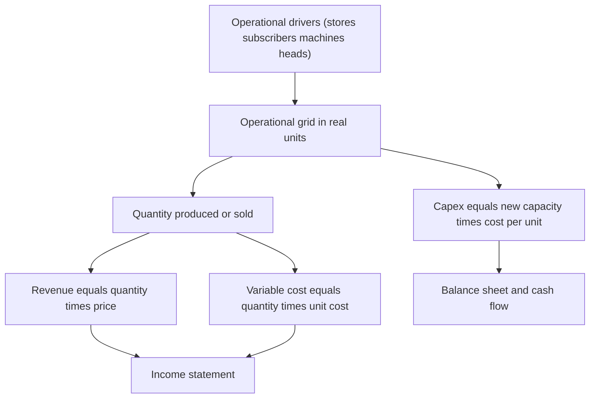
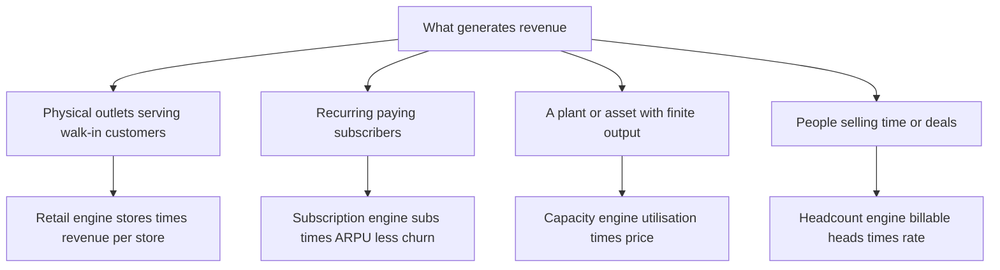
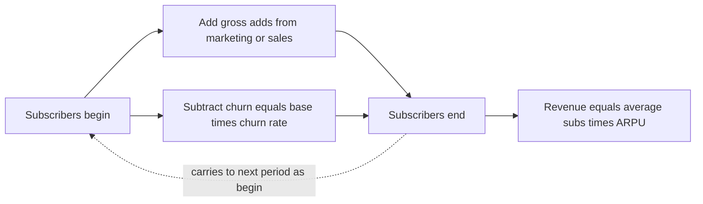
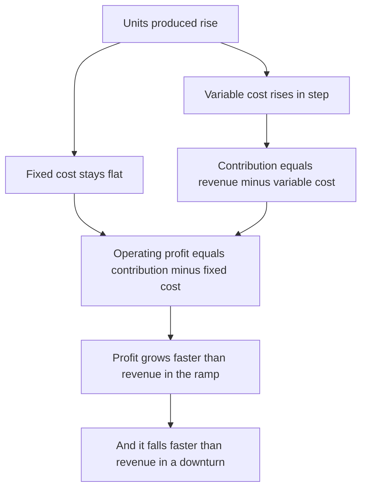
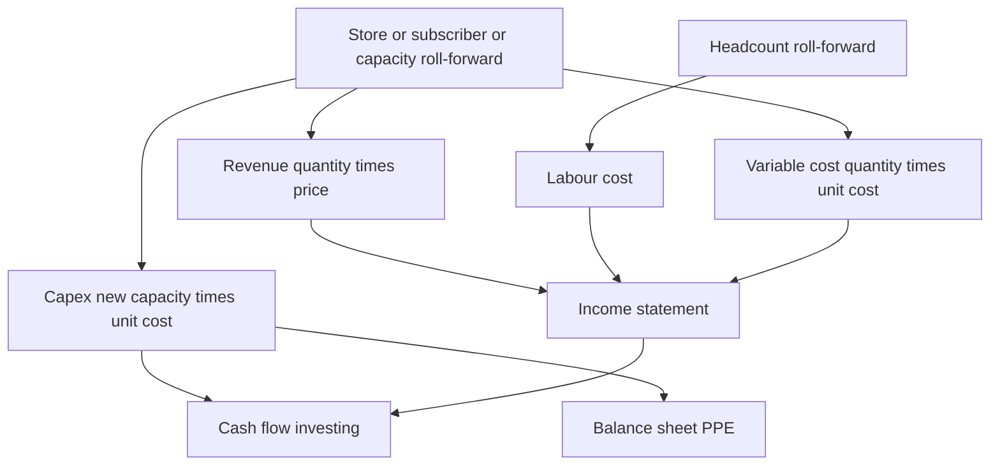

<!-- v2-deep -->

# Chapter 19 — Operational Modeling

## 1. The Problem

Open almost any beginner's three-statement model and you will find a revenue line that reads: `= Prior_Year_Revenue * (1 + Growth%)`. The growth cell is blue, hard-coded, and utterly opaque. Ask the analyst *why* growth is 12% and the honest answer is "because that felt about right" or "because that's what the last banker plugged in." The model looks precise — it computes to the cent — but it is precision built on a guess. It cannot answer the questions that actually matter to a management team or an investor:

- If we open 40 new stores next year instead of 25, what happens to revenue *and* to labour cost *and* to capex?
- Our subscriber churn crept from 2.0% to 2.5% monthly. How much does that cost us over three years?
- The plant runs at 78% utilisation. What is the revenue ceiling before we must buy a second line?
- We're hiring 30 salespeople. When do they become productive, and what's the payback?

A single top-line growth percentage answers *none* of these. It hides the business inside one number. The moment you want to **stress-test operations**, **defend a forecast to a board**, or **decide where to spend capital**, the percentage-growth model collapses because it has no moving parts underneath it. Revenue is not a percentage — revenue is *stores times sales-per-store*, or *subscribers times price*, or *units times price*, and each of those pieces has its own driver, its own constraint, and its own cost consequence.

Consider a concrete failure. A retailer forecasts "15% revenue growth" for three years. Buried inside that number, without anyone noticing, is an *implied* store count that would require opening 60 stores a year when the company's real estate team can source 25. The percentage model books the revenue anyway. Capex stays flat because nobody wired it to store openings. The result is a model that shows revenue tripling while the store count, the rent line, and the capex line all stay pinned to reality — an internally contradictory picture that no operator would sign and no diligence team would trust. The error is invisible precisely *because* the model has no operational layer to catch it.

Operational modeling is the discipline of **building the top and cost lines from the physical and behavioural drivers of the business**, so that the financial statements become an *output* of how the business actually runs, not an input you assume.

## 2. The Core Idea

> Model the business in its own operational units first — stores, subscribers, machines, seats, headcount, units — and let currency fall out of the operational grid.

Every real business has a small set of **operating drivers** that generate everything else. A retailer's engine is *number of stores* and *revenue per store*. A SaaS company's engine is *subscribers*, *average revenue per user (ARPU)*, and *churn*. A factory's engine is *installed capacity*, *utilisation*, and *price per unit*. A consulting firm's engine is *billable headcount*, *utilisation rate*, and *bill rate*.

The core idea of operational modeling is a **two-layer architecture**:

1. **The operational layer** — a grid, in real-world units, that answers "how much *stuff* does the business do?" Store counts, subscriber cohorts, machine-hours, headcount, units produced.
2. **The financial layer** — the three statements — which simply *prices* that operational grid. Revenue = quantity × price. Cost = quantity × unit cost + fixed. Capex = new capacity × cost per unit of capacity.

You build the operational layer *bottoms-up* from drivers, then multiply by prices to get money. The revenue line in your income statement stops being an assumption and becomes a formula that traces all the way down to "we will operate 145 stores at an average of 42,000 per store per month."

This is why the discipline is sometimes called **KPI-driven** or **driver-based** modeling. The KPIs (key performance indicators) that management already tracks on their dashboards — same-store sales growth, net revenue retention, capacity utilisation, revenue per employee — become the literal inputs of your forecast.

A useful mental test for whether a number belongs in the operational layer or the financial layer: **ask whether an operator could count it or observe it.** A store manager can count stores, members, and staff; those are operational drivers. Nobody can "observe" a 12% growth rate — it is an *emergent* result. If you find yourself typing a number that is really an outcome of other numbers, it belongs in the financial layer as a formula, not in the driver block as an input.

*Figure 19.1 — The two-layer architecture: operational drivers generate units, which are priced into the financial statements.*



*Figure 19.4 — Choosing an operating engine from what actually generates the revenue.*



## 3. Why It Works

**Because it separates volume from price, and behaviour from arithmetic.** When revenue is one growth cell, a change in *why* growth moves — more customers versus higher prices — is invisible. Split into quantity × price, each lever is independent and inspectable. A pricing decision touches one row; an expansion decision touches another. Sensitivity analysis becomes meaningful because each driver has an economic meaning.

**Because it enforces internal consistency across the statements.** In a driver-based model the *same* store count that generates revenue also generates rent, store labour, and the capex to build the store. You physically cannot forecast 200% revenue growth while holding headcount and capex flat, because they are wired to the same driver. Percentage models routinely produce these impossible combinations; operational models make them structurally hard.

**Because it exposes constraints.** A factory cannot produce more than its installed capacity × maximum utilisation. A store cannot generate infinite sales per square foot. A salesperson can only close so many deals. When these ceilings live *in the model as formulas*, the forecast automatically respects them — and automatically tells you the year you must add a line, open a region, or hire a cohort. Growth percentages have no ceiling; they will happily forecast a single plant producing the GDP of a small nation.

**Because it matches how operators think and how diligence tests.** A CFO does not manage to "12% growth." She manages to "open 25 stores, hold same-store sales at +3%, keep labour at 18% of sales." When your model speaks in those units, management can validate every assumption from their own operating knowledge, and an investor doing diligence can benchmark each KPI against comparable companies. A model that reconciles to operational reality survives scrutiny; a black-box growth rate does not.

**Because it makes the forecast falsifiable.** Each driver is a testable claim about the world. "Revenue per store of 42,000" can be checked against the last twelve months of actuals. When actuals arrive, you compare *driver by driver*, learn which assumption was wrong, and improve. A monolithic growth number teaches you nothing when it misses.

**Because it localises error and blast radius.** When a single assumption is wrong in a driver model, the damage is contained to the lines that depend on that driver, and you can point to it. When a single assumption is wrong in a growth-rate model, you often cannot even *find* it, because everything downstream is a smear of one blended number. Auditability is not a nicety — it is the difference between a model you can defend under questioning and one you quietly abandon.

## 4. Full Technical Content

Operational modeling is less a single formula than a *building pattern* you apply to whichever business you face. We'll first lay down the universal pattern, then work three concrete engines (retail, subscription, manufacturing), then the headcount build that sits under almost every model, then how the operational layer wires into the three statements, how to format it, and finally a cell-by-cell build you can type into a blank sheet.

### 4.1 The universal driver pattern

Every operational build follows the same skeleton, expressed as a **roll-forward** across time:

```
Ending_units = Beginning_units + Additions − Losses
Average_units = (Beginning_units + Ending_units) / 2
Volume = Average_units × Productivity_per_unit × Periods
Revenue = Volume × Price
Variable_cost = Volume × Unit_cost   (or Revenue × cost_%)
```

Two mechanical principles govern the skeleton:

- **Roll-forward, not restate.** A stock (stores, subscribers, machines, employees) is carried period to period as *beginning + additions − losses = ending*. Never re-type the ending balance as a hard number; always let it compute from the opening balance and the flows. This is the single most important habit in operational modeling — it guarantees continuity and makes every period auditable.
- **Average the stock when it drives a flow.** If you add 24 stores evenly through the year, the *average* store count that earns revenue this year is roughly beginning + 12, not the ending count. Using the ending count overstates revenue in the growth year. Use `AVERAGE(Beginning, Ending)` for the revenue-driving base, or, for finer work, a mid-period convention on each cohort.

A third principle is worth stating explicitly because beginners violate it constantly: **a stock and a flow are different kinds of number and must never be added to each other.** Stores (a stock, measured *at a point in time*) and store openings (a flow, measured *over a period*) sit on different rows and combine only through the roll-forward identity. Revenue (a flow) and store count (a stock) combine only through a rate (revenue per store per year). Confusing the two — for example, multiplying an *ending* stock by a *full-period* rate — is the mechanical origin of the averaging error.

### 4.2 Timing: the monthly-versus-annual choice

Operational reality happens monthly (or weekly). A store opened in November earns two months this year, not twelve. A subscriber cohort acquired in Q3 churns for only two quarters this year. If you model annually with a single "additions" number, you will *systematically overstate* the first-year contribution of anything added mid-year.

Two acceptable resolutions:

1. **Build monthly, summarise annually.** The rigorous choice for cohort-heavy businesses (subscriptions, ramping stores). Build a monthly grid; use `SUMIF`/`SUMIFS` on a period-header row to roll up to years.
2. **Model annually with a half-year (mid-period) convention.** Assume additions arrive evenly, so on average they are live for half the period. Revenue base = beginning + additions × 0.5. Coarser, but adequate for stable businesses and far lighter to build.

Decide this *before* you build. Retrofitting monthly granularity into an annual model is a rebuild.

How much does the convention actually matter? For a stable business with modest additions, surprisingly little — Example 4 below builds a subscriber base *both* ways (full monthly grid and annual half-year shortcut) and the two average-subscriber figures land within about 0.6% of each other. For a *hyper-growth* business adding half its base in a single year, the gap widens sharply, and the monthly build becomes mandatory. The practical rule: **the faster the base is changing relative to its size, the more the timing convention matters.** A business adding 5% of its base per year can use the half-year shortcut; one adding 80% cannot.

### 4.3 Engine A — Retail / store-based businesses

The retail engine has two revenue components that must be kept separate because they are driven by different things:

- **New-store revenue** — driven by the *store count roll-forward* and revenue-per-new-store.
- **Same-store (comparable) sales growth** — the organic growth of stores open for the full prior year, the famous "comps" or SSSG.

**Build steps:**

1. **Store roll-forward** (one row per line, years across):
   - `Stores_open_end = Stores_open_begin + Store_openings − Store_closures`
   - `Average_stores = AVERAGE(Stores_open_begin, Stores_open_end)`
2. **Revenue per store.** Split the base into mature stores (subject to SSSG) and new stores (which ramp). A common simplification: one blended `Revenue_per_store_per_year`, grown by same-store sales growth: `Rev_per_store(t) = Rev_per_store(t−1) × (1 + SSSG%)`.
3. **Revenue** = `Average_stores × Rev_per_store_per_year`. (If modelling monthly, `Rev_per_store_per_month × months open`.)
4. **Store-level variable costs** driven by the same base:
   - Cost of goods = `Revenue × (1 − Gross_margin%)`
   - Store labour = `Revenue × Store_labour_%` or `Average_stores × Staff_per_store × Wage`
   - Rent = `Average_stores × Rent_per_store` (a *per-store fixed*, not a % of sales)
5. **Capex** = `Store_openings × Build_cost_per_store`. This is where the store count directly drives the balance sheet.

The key subtlety: **rent and store labour scale with store count, not with sales.** If you lazily model them as a % of revenue, a same-store-sales decline will make your rent fall — which is nonsense, because the lease is fixed. Drive fixed-per-store costs off the store count; drive truly variable costs (COGS, card fees) off revenue.

**Refinement — the new-store ramp.** A brand-new store does not do mature-store volume on day one; it typically ramps over one to three years as it builds local awareness. The blended `Rev_per_store` above quietly assumes every store is mature, which *overstates* revenue in a fast-expanding chain (where a large fraction of the fleet is immature). The fix is to split the fleet into vintages: mature stores at 100% of the mature rate, first-year stores at (say) 65%, second-year at 85%. Revenue then equals the sum over vintages of `stores_in_vintage × mature_rate × ramp_factor`. This matters most exactly when it is hardest to ignore — during aggressive expansion, when the immature cohort is large.

### 4.4 Engine B — Subscription / SaaS businesses

The subscription engine is a **subscriber roll-forward** with churn, and it is the purest example of why averaging and timing matter.

**Build steps:**

1. **Subscriber roll-forward** (ideally monthly):
   - `Subs_end = Subs_begin + Gross_adds − Churned`
   - `Churned = Subs_begin × Monthly_churn%`  (churn applies to the opening base)
   - `Gross_adds` come from a marketing driver: `Marketing_spend / CAC`, or a sales-capacity driver (reps × quota).
2. **Net adds** = `Gross_adds − Churned`. Watch the sign: if churn exceeds gross adds, the base shrinks — the model must permit that.
3. **ARPU** (average revenue per user per month), possibly rising with price increases or upsell: `ARPU(t) = ARPU(t−1) × (1 + Price_growth%)`.
4. **Revenue** = `Average_subs × ARPU × months`. Use average subs, because a subscriber acquired in June only pays for part of the year.
5. **Unit economics layer** (the KPIs investors demand):
   - **CAC** (customer acquisition cost) = `Sales_and_marketing_spend / Gross_adds`
   - **LTV** (lifetime value) = `ARPU × Gross_margin% × Average_lifetime_months`, where `Average_lifetime_months = 1 / Monthly_churn%`
   - **LTV/CAC ratio** — the headline efficiency metric; > 3× is the informal health bar
   - **CAC payback (months)** = `CAC / (ARPU × Gross_margin%)`
   - **Net revenue retention (NRR)** = `(Starting_MRR − Churned_MRR + Expansion_MRR) / Starting_MRR`; > 100% means the existing base grows even before new sales
6. **MRR / ARR** (monthly / annual recurring revenue) = `Subs_end × ARPU` and `× 12`.

Churn is where the mathematics bites hardest. Because it compounds on the *base*, a small change in monthly churn produces a large change in steady-state size. Average lifetime = 1 / churn: 2% monthly churn → 50-month life; 4% → 25-month life. **Doubling churn halves customer lifetime and roughly halves LTV** — the single most sensitive assumption in the whole model.

There is also a **steady-state ceiling** hiding in the roll-forward that every SaaS modeller should be able to derive on demand. The base stops growing when gross adds exactly replace churn: `Gross_adds = Steady_state_base × churn%`, so `Steady_state_base = Gross_adds / churn%`. With 1,000 gross adds a month and 2% churn, the base can never exceed 1,000 / 0.02 = 50,000 subscribers *at that acquisition rate* — no matter how many years you run the model. This is the subscription analogue of the factory's capacity ceiling: growth is not a percentage that runs forever, it asymptotes to a level set by the ratio of acquisition to churn. If your model shows the base sailing past that ceiling, you have a formula error.

*Figure 19.2 — The subscriber roll-forward: the base compounds churn every period while new adds refill it.*



### 4.5 Engine C — Manufacturing / capacity businesses

The manufacturing engine is a **capacity-and-utilisation** build, and its defining feature is a *hard ceiling*: you cannot sell what you cannot make.

**Build steps:**

1. **Installed capacity** (units the plant *could* produce at 100%): a roll-forward, because capex adds capacity.
   - `Capacity_end = Capacity_begin + New_capacity_added − Retirements`
   - New capacity is driven by capex: `New_capacity = Capex_on_lines / Cost_per_unit_of_capacity`
2. **Utilisation %** — the fraction of capacity actually run, a management/demand assumption, capped at a realistic maximum (say 92% for maintenance downtime).
3. **Units produced** = `Average_capacity × Utilisation% = MIN(Demand, Average_capacity × Max_utilisation%)`. The `MIN` is the ceiling: production is the lesser of demand and what the plant can physically make.
4. **Revenue** = `Units_sold × Price_per_unit`. (Units sold may differ from produced if you model finished-goods inventory; often sold = produced for simplicity.)
5. **Cost of production**, split by behaviour:
   - **Variable** (materials, direct labour, energy) = `Units_produced × Variable_cost_per_unit`
   - **Fixed** (depreciation, plant management, maintenance) = a period amount independent of volume
   - This split gives you the **contribution margin per unit** = `Price − Variable_cost_per_unit`, the foundation of operating leverage and breakeven.
6. **The capacity trigger.** Build a flag that tells you when to invest: `IF(Demand > Average_capacity × Max_utilisation%, "ADD LINE", "OK")`. This is the operational model earning its keep — it tells management the *year* a new line is needed, and the capex build responds.

Operating leverage lives here: because fixed cost is spread over more units as utilisation rises, **profit grows faster than revenue** in the ramp, and collapses faster in a downturn. A percentage-growth model cannot show this; a capacity model shows it automatically.

The **breakeven volume** falls straight out of the same split and is worth carrying as a KPI row: `Breakeven_units = Fixed_cost / Contribution_per_unit`. With 1.2m of fixed cost and a 20-per-unit contribution, breakeven is 60,000 units — so at 80,000 units the plant clears breakeven by a third, and every incremental unit above 60,000 drops its full 20 of contribution straight to operating profit. That is why the profit line is so much more volatile than the revenue line, and why capacity businesses live and die on utilisation.

*Figure 19.5 — The operating-leverage cascade in a capacity model.*



### 4.6 The headcount build (sits under almost every model)

People are usually the largest cost after COGS, and they deserve their own driver-based schedule rather than a "% of revenue" plug.

**Build pattern — by department, roll-forward by month or year:**

1. **Headcount roll-forward:** `Heads_end = Heads_begin + Hires − Attrition`.
2. **Driver-linked hiring.** Tie hires to the operational grid, not to a guess:
   - Store staff = `Stores × Staff_per_store`
   - Support agents = `Subscribers / Subs_per_agent`
   - Salespeople = derived from the bookings target ÷ quota per rep
3. **Fully-loaded cost per head** = `Base_salary × (1 + Benefits_and_payroll_tax%)`. Never model salary alone — the loaded figure (benefits, employer taxes, equipment) is 25–40% higher.
4. **Total comp** = `Average_heads × Loaded_cost × (1 + Annual_raise%)`.
5. **Productivity ramp** (for revenue-generating hires). A salesperson hired today is not fully productive for months. Apply a ramp vector — e.g. 0%, 25%, 50%, 100% of quota over the first four quarters — so new-hire revenue phases in realistically. This is what separates a credible sales model from a fantasy.

**Revenue per employee** (`Revenue / Average_heads`) is the cross-check KPI: benchmark it against comparable companies; a forecast that quietly implies revenue-per-head doubling is usually wrong.

*Figure 19.3 — Where operational drivers wire into each financial statement.*



### 4.7 Wiring the operational layer into the three statements

The operational grid should live on its **own worksheet** (call it "Operating Model" or "Drivers"), and the three statements *pull* from it by link. Discipline:

- **Income statement:** Revenue line = link to `Operating!Revenue`. COGS, labour, and other operating costs link to their operational rows. Nothing on the P&L is a bare percentage input; each is a link to a driven calculation.
- **Balance sheet & cash flow:** Capex from the capacity/store build feeds PP&E and the investing section. Working capital often scales with the operational base too (inventory per store, receivables as days of driven revenue).
- **One-way flow.** Drivers → operations → statements. The statements must never feed back into the operational layer (that creates circularity beyond the deliberate interest-on-debt loop). Keep the arrow pointing one way.

A concrete wiring worth internalising: the *same* store-openings row does triple duty. It feeds (1) the revenue build through the store roll-forward, (2) the capex line through `openings × build cost`, and (3) — via that capex — the PP&E balance and the depreciation schedule, which loops back into the P&L as a non-cash expense and into the cash flow as an add-back. Change store openings from 20 to 30 in a properly wired model and revenue, rent, store labour, capex, PP&E, depreciation, and operating cash flow *all move together*, in the right directions, with no further keystrokes. That single-lever coherence is the entire payoff of the discipline, and it is the thing a percentage-growth model can never deliver.

### 4.8 Excel functions and mechanics you will actually use

| Task | Function / technique |
|---|---|
| Roll-forward ending balance | `=Beginning + Additions − Losses` (never hard-typed) |
| Average base for a flow | `=AVERAGE(Begin, End)` |
| Roll monthly grid up to annual | `=SUMIFS(MonthlyRow, HeaderRow, Year)` |
| Capacity ceiling / MIN of demand vs capacity | `=MIN(Demand, Capacity*MaxUtil)` |
| Investment trigger flag | `=IF(Demand>Capacity*MaxUtil,"ADD","OK")` |
| Productivity ramp lookup | `=INDEX(RampVector, MONTH_since_hire)` or `HLOOKUP` |
| Cohort/segment sub-totals | `=SUMPRODUCT` across driver × price arrays |
| Prevent divide-by-zero in ratios (LTV, per-head) | `=IFERROR(x/y, 0)` |
| Scenario switch across driver sets | `=CHOOSE(ScenarioNo, Base, Bull, Bear)` |
| Toggle a build phase on/off | flag cell × the line, `=Flag*Value` |
| Vintage / cohort revenue sum | `=SUMPRODUCT(StoresByVintage, RampVector)*MatureRate` |
| Compound a rate forward | `=Prior*(1+GrowthRate)` (relative ref, copy across) |
| Anchor a global assumption | `$B$4` absolute reference so copy-across is safe |

**Formatting conventions** (non-negotiable in professional models):

- **Blue = input/hard-coded** driver (store openings, churn%, price). **Black = formula.** **Green = link from another sheet.** This colour code lets any reviewer see instantly what is an assumption and what is derived.
- **Units in the row labels.** "Stores (#)", "Revenue per store (000s)", "Churn (% monthly)". Ambiguous units are the number-one cause of two-order-of-magnitude errors.
- **Group the sheet top-to-bottom:** assumptions block → roll-forwards → volume → pricing → revenue → cost → capex. Reading order = calculation order.
- **A checks row.** Utilisation ≤ 100%? Ending subs ≥ 0? Average stores between begin and end? Put boolean checks that must read TRUE at the top of the sheet.

### 4.9 A cell-by-cell retail build you can type into a blank sheet

To make §4.3 concrete, here is an exact layout. Put labels in column A, and Years 1–3 in columns C, D, E. Global assumptions live in column B so they can be `$`-anchored and copied across.

| Cell | Label / assumption | Formula to type |
|---|---|---|
| `$B$1` | SSSG (% per year) | `4%` (blue input) |
| `$B$2` | Build cost per store (000s) | `300` (blue input) |
| `$B$3` | Gross margin (%) | `65%` (blue input) |
| `$B$4` | Rent per store (000s) | `100` (blue input) |
| `C4` | Stores begin | `50` (blue input) |
| `D4`, `E4` | Stores begin (Y2, Y3) | `=C7`, `=D7` (link to prior end) |
| `C5:E5` | Store openings | `20` (blue input) |
| `C6:E6` | Store closures | `2` (blue input) |
| `C7` | Stores end | `=C4+C5-C6` (copy across) |
| `C8` | Average stores | `=AVERAGE(C4,C7)` (copy across) |
| `C9` | Revenue per store (000s) | `1200` (blue input) |
| `D9`, `E9` | Revenue per store, grown | `=C9*(1+$B$1)`, `=D9*(1+$B$1)` |
| `C10` | **Revenue (000s)** | `=C8*C9` (copy across) |
| `C11` | COGS (000s) | `=C10*(1-$B$3)` |
| `C12` | Rent (000s) | `=C8*$B$4` |
| `C13` | Store capex (000s) | `=C5*$B$2` |
| `C15` | CHECK stores end | `=C7=C4+C5-C6` should read TRUE |
| `C16` | CHECK avg in range | `=AND(C8>=MIN(C4,C7),C8<=MAX(C4,C7))` TRUE |

The point of writing it at this granularity: notice that **not one cell in the money block is a hard number.** `C10` (revenue) traces to `C8` (average stores, itself a formula off the roll-forward) times `C9` (revenue per store, itself compounding off SSSG). Change `$B$1` from 4% to 6% and every year's revenue, COGS, and rent re-price instantly — while capex, which is store-count driven not sales driven, correctly does *not* move. That behavioural difference between the lines is the whole game.

## 5. Worked Examples

### Example 1 — Retail store roll-forward (annual, mid-period convention)

A coffee chain starts Year 1 with **50 stores**. It opens **20 per year** and closes **2 per year**. Revenue per store is **1.20m/year** in Year 1, growing at same-store sales of **4%/year**. Store build cost is **0.30m** each. Gross margin 65%; rent is **0.10m per store per year**.

**Store roll-forward and revenue:**

| | Y1 | Y2 | Y3 |
|---|---|---|---|
| Stores begin | 50 | 68 | 86 |
| Openings | 20 | 20 | 20 |
| Closures | −2 | −2 | −2 |
| **Stores end** | **68** | **86** | **104** |
| Average stores | 59 | 77 | 95 |
| Rev per store (000s) | 1,200 | 1,248 | 1,298 |
| **Revenue (000s)** | **70,800** | **96,096** | **123,310** |

*Check:* Stores end Y1 = 50 + 20 − 2 = 68 ✓; carries to Y2 begin = 68 ✓. Average Y1 = (50+68)/2 = 59 ✓. Rev per store Y2 = 1,200 × 1.04 = 1,248 ✓. Revenue Y1 = 59 × 1,200 = 70,800 ✓.

**Cost and capex:**

| (000s) | Y1 | Y2 | Y3 |
|---|---|---|---|
| COGS = Rev × 35% | 24,780 | 33,634 | 43,159 |
| Rent = Avg stores × 100 | 5,900 | 7,700 | 9,500 |
| Store capex = Openings × 300 | 6,000 | 6,000 | 6,000 |

*Check:* COGS Y1 = 70,800 × 0.35 = 24,780 ✓. Rent Y1 = 59 × 100 = 5,900 ✓. Note rent is driven by *store count*, not revenue — exactly the discipline from §4.3. Revenue grew 36% Y1→Y2 while rent grew 31% (store-count driven), so the two lines correctly diverge.

### Example 1b — Layering headcount onto the retail chain and closing a full P&L

Take the same chain and add staff. Each store runs **8 employees**; the fully-loaded cost per employee is **35,000/year** in Y1, rising **3%/year** with raises. Headcount is driven by average stores.

| | Y1 | Y2 | Y3 |
|---|---|---|---|
| Average stores | 59 | 77 | 95 |
| Staff per store | 8 | 8 | 8 |
| **Employees** | **472** | **616** | **760** |
| Loaded cost per head | 35,000 | 36,050 | 37,132 |
| **Labour (000s)** | **16,520** | **22,207** | **28,220** |
| Revenue per head (000s) | 150.0 | 156.0 | 162.3 |

*Check:* Employees Y1 = 59 × 8 = 472 ✓. Loaded cost Y2 = 35,000 × 1.03 = 36,050 ✓. Labour Y1 = 472 × 35,000 = 16,520,000 = 16,520 (000s) ✓. Revenue per head Y1 = 70,800 / 472 = 150.0 ✓ — and it rises to 156.0, 162.3, tracking SSSG almost exactly, which is the sanity signal you want: staff productivity is not secretly ballooning.

Now assemble the full operating P&L by linking every line to the grid — no bare percentages:

| (000s) | Y1 | Y2 | Y3 |
|---|---|---|---|
| Revenue | 70,800 | 96,096 | 123,310 |
| − COGS | −24,780 | −33,634 | −43,159 |
| − Labour | −16,520 | −22,207 | −28,220 |
| − Rent | −5,900 | −7,700 | −9,500 |
| **Operating profit** | **23,600** | **32,556** | **42,432** |
| Operating margin | 33.3% | 33.9% | 34.4% |

*Check:* Y1 = 70,800 − 24,780 − 16,520 − 5,900 = 23,600 ✓. Margin *expands* from 33.3% to 34.4% across three years — and it does so for a reason you can articulate: rent is a per-store fixed cost that grows with the store count (roughly +30%/yr) while revenue per store *also* grows with SSSG on top of store growth, so revenue outruns the fixed-per-store line. That is operating leverage, and it fell out of the model automatically because rent was driven by store count and not by a flat percentage of sales. Wire rent as "8.3% of revenue" instead and the margin would have been dead flat — a subtly wrong and much less informative answer.

### Example 2 — SaaS subscriber roll-forward and unit economics (annual, half-year convention)

A SaaS business starts the year with **10,000 subscribers**. Monthly churn is **2%** (annualised, we'll approximate annual churn at `1−(1−0.02)^12 ≈ 21.5%`). Marketing spend is **3.0m/year**; CAC is **250** per customer. ARPU is **40/month = 480/year**. Gross margin 80%.

**Subscriber roll-forward (annual):**

- Gross adds = 3,000,000 / 250 = **12,000**
- Churned = 10,000 × 21.5% = **2,153** (churn on the opening base)
- Subs end = 10,000 + 12,000 − 2,153 = **19,847**
- Average subs = (10,000 + 19,847)/2 = **14,924**

**Revenue** = 14,924 × 480 = **7.16m**.

**Unit economics:**

| KPI | Formula | Value |
|---|---|---|
| Avg lifetime (months) | 1 / 0.02 | 50 months |
| LTV | ARPU/mo × GM% × life = 40 × 0.80 × 50 | **1,600** |
| CAC | Spend / gross adds = 3.0m / 12,000 | **250** |
| **LTV/CAC** | 1,600 / 250 | **6.4×** |
| CAC payback | 250 / (40 × 0.80) | **7.8 months** |

*Check:* LTV/CAC of 6.4× is comfortably above the 3× health bar — this business acquires customers profitably and should arguably spend *more* on marketing. Now the sensitivity that proves the point: **raise monthly churn to 4%.** Lifetime halves to 25 months, LTV falls to 40 × 0.80 × 25 = **800**, LTV/CAC drops to **3.2×** — a hair above the danger line — and churned customers in the roll-forward jump to 10,000 × (1−(0.96)^12) = ~3,870, cutting subs end to ~18,130. One driver, doubled, nearly halves the value of every customer. *This is the insight a growth-percentage model can never surface.*

### Example 3 — Manufacturing capacity ceiling and the investment trigger

A plant has **installed capacity of 100,000 units/year**, max sustainable utilisation **90%**. Price is **50/unit**; variable cost **30/unit**; fixed cost **1.2m/year**. Demand is forecast at **80,000 (Y1)**, **92,000 (Y2)**, **105,000 (Y3)**.

**Production = MIN(Demand, Capacity × 90%) = MIN(Demand, 90,000):**

| | Y1 | Y2 | Y3 |
|---|---|---|---|
| Demand (units) | 80,000 | 92,000 | 105,000 |
| Capacity ceiling (90%) | 90,000 | 90,000 | 90,000 |
| **Units produced** | **80,000** | **90,000** | **90,000** |
| Utilisation actual | 80% | 90% | 90% |
| Trigger flag | OK | **ADD LINE** | **ADD LINE** |
| Revenue (000s) | 4,000 | 4,500 | 4,500 |
| Contribution (Price−VC=20) | 1,600 | 1,800 | 1,800 |
| Less fixed | −1,200 | −1,200 | −1,200 |
| **Operating profit (000s)** | **400** | **600** | **600** |

*Check:* Y2 demand 92,000 exceeds the 90,000 ceiling, so production is capped at 90,000 and the flag fires "ADD LINE." Y3 demand of 105,000 is **stranded** at 90,000 — the model refuses to invent 15,000 units of phantom revenue. A percentage-growth model would have blindly booked all 105,000 units and overstated Y3 revenue by 3.0m. Notice operating leverage: revenue rose 12.5% Y1→Y2 (4.0m→4.5m) while operating profit rose 50% (400→600), because the 1.2m fixed cost spread over more units. That non-linear profit response is the signature of a capacity model — and the trigger tells management to fund a second line *now* if Y3 demand is real.

### Example 3b — What the second line does: capex responding to the trigger

The trigger in Example 3 is only useful if the capex build *responds* to it. Suppose management funds a second line at the start of Y3 that adds **60,000 units of capacity** at a cost of **2.4m** (i.e. `Cost_per_unit_of_capacity = 40`), commissioned so it is fully available in Y3. Re-run the capacity roll-forward:

| | Y1 | Y2 | Y3 (with new line) |
|---|---|---|---|
| Capacity begin | 100,000 | 100,000 | 100,000 |
| New capacity added | 0 | 0 | 60,000 |
| **Capacity end** | 100,000 | 100,000 | 160,000 |
| Ceiling at 90% | 90,000 | 90,000 | 144,000 |
| Demand | 80,000 | 92,000 | 105,000 |
| **Units produced = MIN** | 80,000 | 90,000 | **105,000** |
| Revenue (000s) | 4,000 | 4,500 | **5,250** |
| Contribution at 20/unit | 1,600 | 1,800 | 2,100 |
| Less fixed (000s) | −1,200 | −1,200 | −1,500 |
| **Operating profit (000s)** | 400 | 600 | **600** |
| Capex (000s) | 0 | 0 | **2,400** |

*Check:* New capacity Y3 = 2,400 / 40 = 60,000 ✓. Capacity end = 100,000 + 60,000 = 160,000, ceiling = 144,000, so `MIN(105,000, 144,000) = 105,000` — demand is now fully served ✓. Two things to notice. First, revenue jumps to 5,250 because the previously *stranded* 15,000 units now get made and sold — the investment "unlocked" 0.75m of revenue that the constrained model correctly refused to book. Second, fixed cost rose to 1,500 (the new line brings its own depreciation and maintenance), so operating profit is flat at 600 in the *first* year of the new line even though revenue rose 17% — the classic capacity-investment J-curve, where a big fixed-cost step temporarily eats the leverage before rising volume pays it back. A percentage model shows none of this texture; the driver model shows the whole story from a single capex decision.

### Example 4 — Monthly cohort build reconciling to the annual shortcut

This example settles the §4.2 question of *how much the timing convention matters*. Same SaaS business, but built month by month. Start January with **10,000 subscribers**, **2% monthly churn**, **1,000 gross adds/month** (= 12,000/year, matching Example 2), ARPU **40/month**.

The roll-forward recurrence is `S(n) = S(n−1) × 0.98 + 1,000`, with a closed form `S(n) = 50,000 − 40,000 × 0.98^n` (the 50,000 is the steady-state ceiling from §4.4: 1,000 / 0.02). First three months worked by hand:

| Month | Begin | Churn (2%) | Adds | **End** |
|---|---|---|---|---|
| Jan | 10,000 | 200 | 1,000 | **10,800** |
| Feb | 10,800 | 216 | 1,000 | **11,584** |
| Mar | 11,584 | 232 | 1,000 | **12,352** |
| … | … | … | … | … |
| Dec | 18,175 | 364 | 1,000 | **18,611** |

*Check (closed form):* `S(12) = 50,000 − 40,000 × 0.98^12 = 50,000 − 40,000 × 0.7847 = 18,611` ✓. Ending subs of 18,611 sits below Example 2's cruder annual estimate of 19,847 — because the annual method churned only the January opening base once, while the monthly build churns a *growing* base twelve times, which is more realistic.

Now the reconciliation. Average of the twelve monthly *ending* balances works out to **14,837** subscribers, and monthly revenue summed to a year is ≈ 14,837 × 40 × 12 = **7.12m**. Example 2's annual half-year convention produced **14,924** average subs and **7.16m** revenue.

*Check:* the two methods differ by 14,924 vs 14,837 = **0.6%**. The verdict from §4.2 holds: for a business adding a modest fraction of its base per period, the annual half-year shortcut is within a rounding error of the full monthly grid, so the shortcut is defensible and far cheaper to build. Rebuild the same example with 5,000 gross adds/month (adding half the base per year) and the gap balloons past 5% — at which point you *must* go monthly. The discipline is not "always build monthly"; it is "know when the shortcut breaks, and prove it with a reconciliation like this one."

### Example 5 — A two-way sensitivity table on the manufacturing plant

Operational drivers are the natural axes of a sensitivity table because each has economic meaning. Take Example 3's plant (unconstrained by capacity here, to isolate the price/cost effect) at 90,000 units and flex **price per unit** against **variable cost per unit**. Operating profit = `90,000 × (Price − VC) − 1.2m`.

| Op profit (000s) | VC = 28 | VC = 30 | VC = 32 |
|---|---|---|---|
| **Price = 48** | 600 | 420 | 240 |
| **Price = 50** | 780 | 600 | 420 |
| **Price = 52** | 960 | 780 | 600 |

*Check:* centre cell (Price 50, VC 30) = 90,000 × 20 − 1,200,000 = 600,000 = 600 (000s) ✓, matching Example 3's Y2. Top-left (Price 48, VC 28) = 90,000 × 20 − 1,200 = 600 too — because the *spread* is still 20. The table makes the operating-leverage intuition visible: a 2-unit move in price or cost is a 2-unit move in contribution, worth 90,000 × 2 = 180,000 of operating profit — a **30% swing** off a base of 600 for a **4% move** in price. In Excel this is a `Data Table` (What-If Analysis) with the price list down the left, the VC list across the top, and the profit formula in the corner. This is exactly why you split price from cost from volume: each becomes a clean, interpretable sensitivity axis.

## 6. Connections

- **Revenue build (Ch. on revenue modeling):** operational modeling *is* the rigorous revenue build. The store/subscriber/capacity grid replaces the naive growth-rate top line.
- **Three-statement model:** capex from the capacity build feeds PP&E and the depreciation schedule; the operational cost lines feed the P&L; working-capital drivers scale off the operational base. The operational sheet is the engine; the statements are the dashboard.
- **DCF / valuation:** every free-cash-flow driver — revenue, margins, capex, working capital — ultimately traces to an operating driver. A DCF is only as credible as the operational model beneath it; terminal-value growth should be reconcilable to a mature store count or subscriber base, not a wishful percentage. A terminal growth rate of 3% is only defensible if it corresponds to a plausible mature-state operating picture — e.g. a stable store fleet growing with population, not a fleet still doubling.
- **Scenario & sensitivity analysis:** operational drivers are the natural sensitivity axes. "SSSG ±2%", "churn ±1%", "utilisation ±5%" produce economically meaningful scenarios; "growth ±2%" does not.
- **Unit economics & cohort analysis:** the SaaS engine's LTV/CAC and NRR are the same metrics used in venture diligence and board reporting.
- **Operating leverage & breakeven (cost accounting):** the fixed/variable split in the manufacturing engine is the CVP (cost-volume-profit) framework applied inside a forecast; breakeven units = fixed cost / contribution per unit is the same formula in both worlds.
- **Working capital modeling:** inventory driven as "days of driven COGS" or "per store," and receivables as "days of driven revenue," are themselves operational drivers — the discipline extends past the P&L into the balance sheet.

### Interview angles

Operational modeling is a favourite of technical interviews precisely because it separates people who *understand* a model from people who can only fill one in. Expect questions like these, with the crisp answers a strong candidate gives:

- **"Why not just grow revenue at a percentage?"** Because a percentage hides volume and price, cannot enforce consistency with capex and headcount, has no capacity ceiling, and cannot be benchmarked or falsified. Money is quantity times price — forecast the quantity.
- **"Walk me through a subscriber roll-forward."** Begin plus gross adds minus churn equals end; churn applies to the *opening* base; revenue uses *average* subs times ARPU because a mid-year subscriber pays for only part of the year.
- **"Why do you average the base?"** Because a stock that grows through the period earns revenue on its average level, not its ending level. Using the ending count overstates the growth year.
- **"If monthly churn doubles from 2% to 4%, what happens to LTV?"** It roughly halves, because average lifetime = 1/churn, so lifetime falls from 50 to 25 months and LTV = ARPU × GM% × lifetime scales with it.
- **"What is the steady-state size of a subscriber base?"** Gross adds ÷ churn rate — the level where new adds exactly replace churn. It is the subscription analogue of a factory's capacity ceiling.
- **"Rent as a percentage of sales — what's wrong with that?"** Rent is a fixed lease cost driven by store *count*, not sales. Modelling it as a % of revenue makes rent fall when comps fall, which is economically false. Drive per-store fixed costs off the store count.
- **"Where does operating leverage show up, and why?"** In any business with fixed cost spread over volume — the capacity engine especially. Profit grows faster than revenue on the way up because fixed cost is diluted over more units, and falls faster on the way down. Breakeven = fixed ÷ contribution per unit.
- **"How does a capacity constraint change a DCF?"** It caps revenue at what the asset can produce and forces a capex step (and its depreciation and financing) exactly when demand crosses the ceiling — so free cash flow is lumpier and lower than an unconstrained percentage forecast would show.
- **"Your model shows 40% revenue growth but flat headcount and capex. Is that right?"** Almost certainly not, in a driver model those are wired to the same base and would move together; flat headcount and capex against 40% growth is the signature of a disconnected percentage model.

## 7. Traps and Common Errors

1. **Percentage-of-revenue for fixed-per-unit costs.** Modelling rent or store labour as a % of sales makes them fall when comps fall — economically false. Drive per-store fixed costs off store *count*.
2. **Using ending balance instead of average to drive revenue.** If you add stores/subscribers through the year and multiply the *ending* count by full-year revenue-per-unit, you overstate the growth year. Use the average (or a mid-period convention).
3. **Ignoring timing of mid-year additions.** A store opened in month 11 earns two months, not twelve. Annual models without a half-year convention systematically overstate first-year contribution.
4. **Churn applied to the wrong base.** Churn hits the *opening* subscribers, before adds. Applying it to the ending or average base misstates losses and can hide a shrinking business.
5. **No capacity ceiling.** Forgetting the `MIN(demand, capacity)` cap lets the model book revenue the plant physically cannot produce — the most common overstatement in industrial models.
6. **Salary instead of loaded cost.** Modelling base pay without the 25–40% of benefits and payroll taxes understates the single largest cost line.
7. **No productivity ramp on new hires/new stores.** Assuming a salesperson or a new store is fully productive on day one front-loads revenue that won't arrive for quarters.
8. **Double-driving a cost.** Wiring a cost to *both* a % of revenue *and* a headcount count double-counts it. Each cost should have exactly one driver.
9. **Circularity from statements feeding operations.** The operational layer must be upstream of the statements. Only the deliberate interest-on-average-debt loop belongs in the statements; keep it out of the drivers.
10. **Broken roll-forward continuity.** Hard-typing an ending balance, or failing to carry ending → next-period beginning, silently desynchronises the whole grid. Always link period n+1 beginning to period n ending.
11. **Unlabelled units.** "Revenue per store = 1,200" — is that thousands, or 1,200 whole currency? Two-order-of-magnitude blow-ups start here. Label every row's units.
12. **Utilisation above 100%.** Without a `MIN(…, MaxUtil)` cap and a check row, an aggressive demand assumption silently pushes utilisation past physical reality.
13. **Treating every store as mature.** A blended revenue-per-store applied to a fast-expanding fleet ignores the new-store ramp and overstates revenue exactly when the immature cohort is largest. Split the fleet into vintages during aggressive expansion.
14. **Forgetting the fixed-cost step on new capacity.** A new plant line brings its own depreciation and maintenance. Adding capacity but holding fixed cost flat overstates the profit of the investment's first year and hides the J-curve (see Example 3b).
15. **Mixing stocks and flows in one formula.** Adding a store *count* (stock) to store *openings* (flow) outside the roll-forward, or multiplying an ending stock by a full-period rate, is the mechanical root of most averaging and timing errors. Keep stocks and flows on separate rows joined only through the roll-forward.
16. **Absolute-versus-relative reference slips when copying across.** A global assumption like SSSG must be `$`-anchored (`$B$1`) so it holds when you copy the revenue formula across years; a prior-period link (`=C7`) must stay relative so it steps forward. Getting these backwards silently corrupts the whole horizontal fill.
17. **No steady-state sanity check on subscriptions.** If the subscriber base sails past gross adds ÷ churn, a formula is wrong — the base cannot exceed that ceiling at a constant acquisition rate.

## 8. First-Principles Recap

Strip everything away and operational modeling is one sentence: **money is quantity times price, so forecast the quantity in its real units and price it, rather than guessing the money directly.**

From that seed everything grows. Quantity is a *stock* that rolls forward — beginning plus additions minus losses — so you build a roll-forward. A stock that changes through the period earns on its *average*, so you average. Additions arrive over time, so you respect timing. Physical things have limits, so quantity is capped by capacity. Costs attach to *whatever physically drives them* — units to variable cost, count to per-unit fixed cost, heads to labour — so you drive each cost off its true driver. And because every line traces to a driver, every driver is a testable claim you can benchmark, stress, and correct.

Two invariants recur across every engine and are worth memorising as the load-bearing structure: **(1) the roll-forward identity** — beginning + additions − losses = ending, with ending linking to the next period's beginning — which guarantees continuity and auditability; and **(2) the price/volume/driver separation** — money always factors into a physical quantity times a price, with the quantity built from a driver. Retail, SaaS, and manufacturing look different on the surface, but each is just these two invariants dressed in different units: stores × revenue-per-store, subs × ARPU, units × price. Learn the invariants and you can model a business you have never seen before.

The financial statements were never the model. They are the *photograph* of a model whose real subject is the operating business — stores serving customers, subscribers paying monthly, machines turning material into product, people doing work. Get the operations right in their own units, price them honestly, and the statements take care of themselves.

## 9. Quick-Reference

**Universal skeleton**
```
Ending = Beginning + Additions − Losses
Average = (Beginning + Ending) / 2
Volume = Average × Productivity
Revenue = Volume × Price
Variable cost = Volume × Unit cost
Capex = New capacity × Cost per unit of capacity
```

**Retail engine** — Revenue = Avg stores × Rev/store; Rev/store grows at SSSG%; per-store fixed costs (rent, store labour) driven by store count; capex = openings × build cost; split the fleet into vintages with a ramp during fast expansion.

**Subscription engine** — Subs_end = Subs_begin + Gross adds − (Subs_begin × churn); Revenue = Avg subs × ARPU; Life = 1/churn; LTV = ARPU × GM% × life; CAC = spend/adds; health at LTV/CAC > 3× and payback < 12 months; NRR > 100% means the base self-grows; steady-state base = gross adds / churn.

**Manufacturing engine** — Units = MIN(Demand, Avg capacity × Max util%); Contribution/unit = Price − VC/unit; Operating profit = Units × Contribution − Fixed; breakeven units = Fixed / Contribution per unit; trigger `IF(Demand > Capacity×MaxUtil, "ADD", "OK")`; new capacity brings its own fixed cost (the J-curve).

**Headcount** — Heads_end = Heads_begin + Hires − Attrition; hires linked to operational driver; loaded cost = salary × (1 + benefits%); apply ramp to revenue-generating hires; cross-check revenue/head.

**Timing rule** — annual half-year convention is fine when additions are a small fraction of the base (reconciles within ~1% of a monthly build); go monthly when additions approach half the base.

**Key Excel** — `AVERAGE`, `SUMIFS` (monthly→annual), `MIN` (ceiling), `IF` (trigger), `INDEX`/`HLOOKUP` (ramp), `IFERROR` (safe ratios), `CHOOSE` (scenarios), `SUMPRODUCT` (vintage sums), `Data Table` (two-way sensitivity), `$` anchoring for global assumptions.

**Formatting** — blue input / black formula / green link; units in every label; assumptions → roll-forward → volume → price → revenue → cost → capex, top to bottom; a checks row (util ≤ 100%, subs ≥ 0).

**Golden rules** — roll-forward never restated · average the base · respect timing · cap at capacity · one driver per cost · loaded not base salary · keep stocks and flows on separate rows · label your units.

## 10. Build-It-Yourself Exercise

Build a **standalone operational model for a fitness-club chain** in Excel, then wire its outputs into a mini P&L. Do it on one worksheet, monthly for Year 1 rolling up to annual, then annual for Years 2–3.

**Given assumptions (make them blue inputs):**
- Start with 8 clubs; open 3 per year; close 1 per year; build cost 0.5m per club.
- Members per mature club: 1,200; new clubs ramp 40% → 70% → 100% of that over their first three years.
- Monthly membership fee: 40; annual fee growth 3%.
- Monthly member churn: 3%; gross new members per club per month: 45.
- Staff per club: 6; loaded cost per staff: 45,000/year; annual raise 4%.
- Rent per club: 0.15m/year. Variable cost (utilities, supplies) = 12% of revenue.

**Tasks:**
1. Build the **club roll-forward** (begin + openings − closures = end) and the **average club count**.
2. Build a **member roll-forward per club-vintage** with the ramp and 3% monthly churn; derive total average members.
3. Compute **revenue** = average members × monthly fee × 12, with the fee growing 3%/year. Verify by an independent path: revenue per club × average clubs.
4. Build the **headcount schedule** (clubs × 6 staff), loaded labour cost, and revenue-per-employee KPI.
5. Compute **rent** (club-count driven), **variable cost** (revenue driven), and **capex** (openings × 0.5m).
6. Assemble a **mini P&L**: Revenue − Variable − Labour − Rent = Operating profit. Link every line to the operational grid (no bare percentages on the P&L).
7. Add a **checks row**: utilisation-style sanity (members per club ≤ 1,200), clubs end = begin + openings − closures, average between begin and end.
8. **Sensitivity:** rebuild operating profit for churn at 2%, 3%, 4% and openings at 2, 3, 4 per year. Which lever moves profit more? Explain *why* in one line using lifetime = 1/churn.

**Extension tasks (do these once the base model reconciles):**
9. Compute the **steady-state members per club** at 45 gross adds/member/month and 3% churn (= 45 / 0.03 = 1,500) and confirm it sits *above* the 1,200 mature cap — meaning the cap, not acquisition, is the binding constraint. What would gross adds have to fall to before acquisition became binding? (Answer: below 1,200 × 3% = 36/month.)
10. Add a **member-vintage ramp** using `SUMPRODUCT` so first-year clubs earn 40% of mature members, second-year 70%, mature 100%, and confirm the ramped revenue is *below* the naive "every club mature" revenue in every growth year.
11. Build a **two-way Data Table** of operating profit against churn (2%, 3%, 4%) and fee growth (2%, 3%, 4%) and read off which corner is best and worst.

**Self-check targets:** Year 1 average clubs ≈ 9.0; if your revenue-per-club path and your members-per-club path disagree by more than rounding, you have a timing or averaging error — hunt it down before moving on. Confirm that raising churn from 3% to 4% cuts member lifetime from ~33 to ~25 months and visibly shrinks the ending member base. Confirm the steady-state ceiling of 1,500 members per club exceeds the 1,200 cap, so clubs fill to the cap and hold. When both revenue paths reconcile, the churn sensitivity behaves, and the vintage ramp pulls revenue below the naive path, you have built a real operational model — and you can price *any* business the same way.
