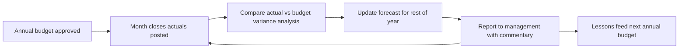
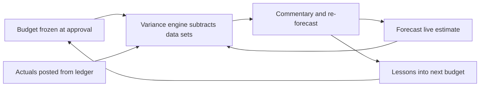
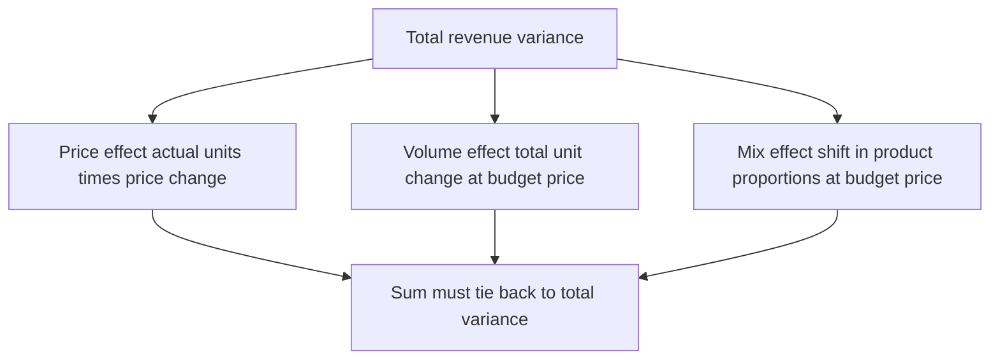
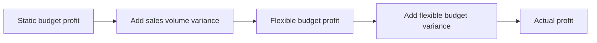
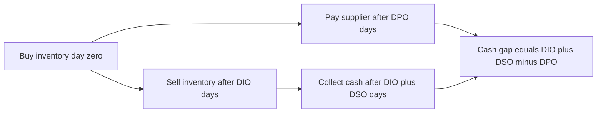

<!-- v2-deep -->

# Chapter 20 — Budgeting, Forecasting and FP&A

## 1. The Problem

Every operating company faces a brutal timing mismatch: decisions must be made *before* results are known. You commit to headcount in November for a fiscal year that starts in January. You sign a lease, order raw material, and set sales quotas — all in advance of the revenue that is supposed to justify them. If you wait for the numbers to arrive before acting, the year is already over.

So management needs a numerical picture of the future that is (a) detailed enough to authorize spending, (b) revisited often enough to stay honest, and (c) reconciled against reality so the organization actually *learns*. That picture is the job of **Financial Planning & Analysis (FP&A)** — the internal, forward-looking finance discipline that runs the company's budget, keeps a live forecast, and dissects the gap between plan and actuals every month.

This is a fundamentally different problem from the valuation and deal modeling covered earlier in this course. When you build a DCF or an LBO, you are pricing a business *once*, from the outside, to support a transaction. FP&A models never "close." They are living instruments a controller updates monthly for the rest of the company's life. The skill overlaps with deal modeling — same Excel discipline, same three-statement logic — but the purpose, cadence, and audience are different, and getting that difference wrong is a classic reason analysts fumble the transition from banking to a corporate finance seat.

The specific pains FP&A exists to kill:

- **Blind commitment.** Without a budget, spending has no ceiling and no owner. Money leaks.
- **Stale plans.** A budget set in December is obsolete by March, yet many companies keep steering by it all year — the "annual lock" problem that rolling forecasts were invented to fix.
- **Unexplained misses.** "We missed revenue by 8%." *Why?* Fewer units? Lower price? Wrong product mix? Without variance analysis you cannot tell, so you cannot fix it.
- **Cash surprises.** A profitable company can still run out of cash. The P&L can look fine while the bank balance craters because of timing — receivables, inventory builds, capex, debt repayments. A cash-flow forecast is what keeps the lights on.

To make the timing problem concrete, picture a simple decision ledger. In November a CFO must approve: 12 new hires (each ~₹15 lakh loaded, a ~₹1.8cr commitment), a warehouse lease (₹40 lakh/year, five-year term), and an inventory pre-buy for a product launch (₹2cr of cash out three months before the first sale). Every one of those is a cash outflow committed against revenue that does not yet exist and might not arrive on schedule. FP&A is the apparatus that lets the CFO sign those approvals with a defensible number behind each — and then hold each owner accountable to it. Remove FP&A and those decisions become gut calls with no scorecard.

## 2. The Core Idea

FP&A rests on three artifacts and the discipline of comparing them:

- **Budget** — the *approved financial plan* for a defined period (usually a fiscal year), fixed once at the start. It is a commitment and a scorecard. It rarely changes mid-year.
- **Forecast** — the *current best estimate* of how the period will actually end, updated as new information arrives (monthly or quarterly). It moves.
- **Actuals** — what really happened, straight from the accounting ledger once the books close.

The core loop is: **set the budget → track actuals → re-forecast the rest of the year → explain the variances → feed lessons into next year's budget.** Repeat forever.


*The FP&A cycle is a permanent loop, not a one-time build. Each month closes, gets explained, and reshapes the live forecast.*

Two engineering ideas make this loop practical:

1. **Driver-based logic.** Instead of typing a revenue number, you build revenue from operational *drivers* — units × price, or customers × ARPU × retention. Change a driver, and the plan re-flows. This makes the model explainable ("we grew because units rose 5%") and re-forecastable (swap in the new unit assumption).
2. **Bridge/variance thinking.** Any gap between two numbers can be decomposed into named, additive causes. The revenue miss isn't a mystery; it's `price effect + volume effect + mix effect`, and those three sum exactly to the total gap. Decomposition converts a scary aggregate into a to-do list.

A third idea sits underneath both and is worth naming explicitly: **the three data sets share one skeleton.** Budget, Forecast, and Actual are not three different models — they are three columns of the *same* model, keyed to the same chart of accounts and the same calendar. That shared skeleton is precisely what makes them subtractable. A variance is only meaningful because line 42 "SaaS subscription revenue — EMEA" means the identical thing in all three data sets. The single most common cause of a variance analysis that "won't tie" is a structural mismatch — an account that exists in the budget but got reclassified in the actuals. Discipline about the skeleton is not cosmetic; it is what makes the arithmetic legal.


*All three data sets ride the same line-item skeleton, which is what lets the variance engine subtract them cleanly and feed the loop.*

## 3. Why It Works

**Why separate budget from forecast?** Because they answer different questions. The budget answers *"what did we commit to and are we accountable to it?"* — so it must stay fixed to be a fair scorecard. The forecast answers *"where will we actually land?"* — so it must move to be useful for decisions. If you let the budget drift, you can no longer measure performance against a promise. If you refuse to update the forecast, you steer the company using numbers you already know are wrong. You need both, precisely because they conflict.

**Why driver-based works.** Financial outcomes are downstream of physical and commercial reality. Revenue *is* a quantity sold times a price; cost of goods *is* units times unit cost. Modeling at the driver level means your assumptions are things a business owner can actually debate and control ("can we really raise price 3%?") rather than an abstract growth percentage nobody owns. It also localizes error — if you're wrong, you know *which* driver was wrong.

**Why variance decomposition is exact.** Price, volume, and mix effects are constructed to be mutually exclusive and collectively exhaustive: each isolates one thing changing while holding the others at a defined reference point. Built correctly they *must* sum to the total variance — which is both the analytical power and the self-check. If your bridge doesn't tie to the total, the bridge is wrong, not reality.

**Why rolling forecasts beat the annual lock.** A fixed annual plan has a decaying information horizon — in December you can see 12 months ahead; by November you can see only 1. A rolling forecast always re-extends to a constant horizon (say, always the next 12–18 months), so management always has the same-quality forward view and is never "coasting" on the last two months of a stale plan.

**Why the "interaction term" has to go somewhere.** When both price and volume change, part of the total variance is genuinely caused by *both at once* — the little rectangle `ΔP × ΔQ`. It is real money, but it belongs to no single cause. Any two-way decomposition must therefore adopt a *convention* that parks that rectangle in one bucket. The standard FP&A convention (budget price for the volume line, actual quantity for the price line) folds the interaction into price. This is not "more correct" than the alternative — it is a *choice*, and the reason it works is only that everyone in the room uses the same choice, so the numbers are comparable period to period. The moment two analysts use different conventions, their bridges disagree by exactly `ΔP × ΔQ` and the review dissolves into a methodology argument instead of a business discussion. Consistency, not theoretical purity, is the source of the power.

**Why cash and profit diverge.** Accrual accounting records revenue when *earned* and expense when *incurred*, deliberately divorcing them from cash timing so that the P&L measures economic performance in a period. That is the right design for measuring profit — and exactly why the P&L is silent on solvency. Cash moves when customers *pay* (DSO later than the sale), when you *pay* suppliers (DPO after the purchase), and when inventory is *funded* (DIO of shelf time). A cash forecast re-times the accrual P&L back into the bank account. It works because working-capital ratios are stable enough to project the lag — the timing is modelable, which is the whole reason a forward cash forecast is possible at all.

## 4. Full Technical Content

### 4.1 The three data sets and how they live in the model

A well-built FP&A workbook keeps **Budget**, **Forecast**, and **Actual** as three parallel data sets across the same row structure (the chart of accounts / line items) and the same 12-month column structure. Best practice:

- One **Actuals** block, populated from the GL as each month closes.
- One **Budget** block, frozen (paste-special as values, or protected) at approval.
- One **Forecast** block that is a *hybrid*: actuals for closed months, estimates for open months. This is the **"Actual + Forecast"** or **"AF"** view — the number leadership actually steers by.

A clean structural trick is a single **"current month" switch** (e.g. cell `B1 = 7` for July). Then each forecast cell chooses its source:

```
=IF(MonthNum <= $B$1, ActualCell, ForecastCell)
```

So the forecast row automatically shows actuals for Jan–Jul and estimates Aug–Dec, and rolls forward with one keystroke each month.

| View | Source | Changes over year? | Purpose |
|---|---|---|---|
| Budget | Set at approval | No (frozen) | Commitment + scorecard |
| Actual | GL, post-close | Grows one month at a time | Truth |
| Forecast (AF) | Actuals + estimates | Yes, monthly | Steering + landing point |

**Cell-level build of the AF row.** Suppose actuals live in row 20 (`C20:N20`), the pure forecast in row 22 (`C22:N22`), and the month-number header in row 8 (`C8:N8` = 1…12), with the current-month switch in `$B$4`. The AF row 24 is one formula copied across:

```
C24 =IF(C$8<=$B$4, C20, C22)     ' copy right to N24
```

When you close July you change one cell — `$B$4` from 6 to 7 — and column H (July) instantly flips from estimate to actual. Nothing else moves. To make the flip visually obvious, apply conditional formatting to `C24:N24` with the rule `=C$8<=$B$4` shading actual months grey, so any reader can see at a glance where truth ends and estimate begins. Add a full-year total in `O24 =SUM(C24:N24)` and — critically — a **landing-point** callout: `=O24` versus budget `=SUM(C21:N21)` and last year `=SUM(prior)`. That three-number strip (Forecast / Budget / Prior Year) is the single most-read cell range in a company.

**Why paste-special-as-values for the budget.** If the budget block contains live formulas that reference the same driver cells the forecast uses, then re-forecasting silently rewrites the budget and destroys the scorecard. Freezing the budget as hard values at board approval severs that link. A defensible workflow: build the budget with drivers, get approval, then `Copy → Paste Special → Values` the entire budget block and lock the sheet. From that day the budget is an inert historical fact.

### 4.2 Driver-based revenue and cost build

**Revenue.** Never hard-code a total. Build from drivers. Two common patterns:

- *Units × Price:* `Revenue = Units_Sold * Avg_Selling_Price`
- *Subscription:* `Revenue = Beginning_Customers + New - Churned, then × ARPU`

Excel build (monthly columns C:N, drivers in labeled rows):

```
Units      (row 10)   =C10                    ' input or grown from prior
Price      (row 11)   =C11
Revenue    (row 12)   =C10*C11
```

Grow drivers explicitly. A monthly volume grown from an annual rate:

```
=PriorMonthUnits*(1+$AnnualGrowth/12)      ' simple
=PriorMonthUnits*(1+$AnnualGrowth)^(1/12)  ' compounded, more correct
```

The two growth conventions are not interchangeable, and the gap compounds. On a 12% annual growth assumption: simple gives `1%` per month → `(1.01)^12 − 1 = 12.68%` realized annual growth; the compounded form gives `(1.12)^(1/12) − 1 = 0.949%` per month → exactly `12.00%` over the year. On a base of 10,000 units in January, December units are `10,000 × 1.01^11 = 11,157` under simple versus `10,000 × 1.12^(11/12) = 10,000 × 1.1094 = 11,094` under compounded — a 63-unit divergence in one line that ripples into revenue, COGS, AR and cash. Pick the compounded form when the "12%" is meant as a true annual rate; document the choice in the inputs block.

**The full subscription build.** Subscription revenue rewards an explicit customer *roll-forward*, because churn and new-logo adds are the drivers leadership argues about. Lay it out as a waterfall in rows:

```
Beginning customers   (row 30)   C30 = <opening>,  D30 = C34   ' prior ending
New customers         (row 31)   input or =C30*$NewRate
Churned customers     (row 32)   = -C30*$MonthlyChurn
Ending customers      (row 34)   = C30 + C31 + C32
ARPU                  (row 35)   input
Revenue               (row 36)   = C34 * C35        ' or AVERAGE(C30,C34)*C35
```

Worked: open at 1,000 customers, 8% monthly gross adds, 3% monthly churn, ARPU ₹500. January: new `= 1,000 × 8% = 80`, churn `= −1,000 × 3% = −30`, ending `= 1,050`. February begins at 1,050: new `84`, churn `−31.5`, ending `1,102.5`. Net monthly growth is `5%` of base, compounding — the classic SaaS "net add" engine. Revenue on ending base: Jan `1,050 × 500 = ₹525,000`, Feb `1,102.5 × 500 = ₹551,250`. Using the *average* base `AVERAGE(1000,1050)×500 = ₹512,500` is more conservative and better matches revenue actually recognized when customers arrive mid-month — a defensible refinement to note in the assumptions.

**Variable cost** follows the same unit logic: `COGS = Units * Unit_Cost`. **Fixed costs** (rent, core salaries, software) are entered as monthly amounts, often with a step function for known changes (a new lease starts in month 6). A clean step-cost formula avoids hard-coding the jump into every cell: `=IF(C$8>=$LeaseStartMonth, $NewRent, $OldRent)` so the model documents *why* the number changes and re-flows if the start month slips.

**Headcount / payroll** deserves its own driver schedule — it's usually the largest controllable cost. Build a small roster: headcount by department by month, times fully-loaded cost per head (salary × (1 + benefits load)). Hires and attrition are inputs that flow into the count.

*Worked headcount example.* Engineering opens the year with 20 heads at an average base salary of ₹12,00,000/year and a 30% benefits-and-tax load, so fully-loaded cost per head is `12,00,000 × 1.30 = ₹15,60,000/year = ₹1,30,000/month`. Plan three hires: one starting in March, two in July, and assume one attrition in September. Build a monthly count row:

```
Beginning heads  (row 40)  C40 = 20,  D40 = C44
Hires            (row 41)  input: Mar=1, Jul=2, else 0
Attrition        (row 42)  input: Sep=-1, else 0
Ending heads     (row 44)  = C40 + C41 + C42
Payroll cost     (row 45)  = C44 * $LoadedCostPerHead/12
```

Headcount path: 20 (Jan–Feb) → 21 (Mar–Jun) → 23 (Jul–Aug) → 22 (Sep–Dec). Annual payroll `= (₹1,30,000) × [20×2 + 21×4 + 23×2 + 22×4] = ₹1,30,000 × [40 + 84 + 46 + 88] = ₹1,30,000 × 258 = ₹3,35,40,000`. Note the subtlety: a mid-year hire costs only a *fraction* of a full-year salary, so budgeting all three hires at full-year cost would overstate payroll by `₹1,30,000 × [10 (Mar hire) + 12 (two Jul hires ×6) ...]` — the "full-year effect versus in-year effect" distinction that trips up first-year analysts and recurs every planning cycle because this year's partial hires become next year's full-year run-rate.

### 4.3 Variance analysis: price / volume / mix

Variance analysis is the engine of the monthly review. Start with the simplest split and build up.

**Total revenue variance** = Actual Revenue − Budget Revenue.

For a single product, decompose into two effects using this standard construction:

- **Volume (quantity) variance** = (Actual Units − Budget Units) × **Budget Price**
- **Price (rate) variance** = (Actual Price − Budget Price) × **Actual Units**

Check: Volume + Price = Total variance. (The "cross term" — the interaction of both changing — is conventionally folded into the price variance by using *actual* units in the price line. Some texts split the interaction out separately; pick one convention and be consistent.)

```
Volume var = (Act_Q - Bud_Q) * Bud_P
Price  var = (Act_P - Bud_P) * Act_Q
Total       = Act_Q*Act_P - Bud_Q*Bud_P
```

To see *why* the convention closes exactly, expand the total algebraically. Let total `= Act_Q·Act_P − Bud_Q·Bud_P`. Add and subtract `Bud_P·Act_Q`:

```
Total = (Act_Q·Bud_P - Bud_Q·Bud_P) + (Act_Q·Act_P - Act_Q·Bud_P)
      = (Act_Q - Bud_Q)·Bud_P       + (Act_P - Bud_P)·Act_Q
      =  Volume variance            +  Price variance
```

The identity is exact — no residual — precisely *because* the price line carries actual quantity. Had you written the price line with *budget* quantity, you would be left with a leftover `(Act_Q − Bud_Q)(Act_P − Bud_P)` interaction rectangle that ties to nothing. Seeing the algebra is the antidote to memorizing "budget price on volume, actual quantity on price" as a spell.

**Adding mix (multi-product).** When you sell several products at different prices, an aggregate "volume" change hides *which* products drove it. Decompose total volume into:

- **Volume (pure quantity) effect** = (Total Actual Units − Total Budget Units) × Budget *average* price (weighted at budget mix)
- **Mix effect** = the part of the revenue change caused by selling a *different proportion* of products than budgeted, holding total units constant.

Practical formula per product, then summed:

- Volume effect (per product) = (Total Act Units × Budget Mix% − Budget Units) × Budget Price
- Mix effect (per product) = (Actual Units − Total Act Units × Budget Mix%) × Budget Price

Where `Budget Mix% = Budget Units of product / Total Budget Units`. These two sum to each product's total volume variance, and across all products they sum to the total volume variance — which, plus the price variance, ties to the grand total. Always build the reconciliation row.

**Excel implementation of the mix bridge.** With products in rows 50:52 and columns for `Bud_Q, Bud_P, Act_Q, Act_P`, compute per-product:

```
TotBudQ  = SUM(Bud_Q range)           ' e.g. $F$53
TotActQ  = SUM(Act_Q range)           ' e.g. $H$53
BudMix%  = Bud_Q / TotBudQ            ' per row
AtBudMix = $H$53 * BudMix%            ' actual total units re-split at budget proportions
VolEff   = (AtBudMix - Bud_Q) * Bud_P
MixEff   = (Act_Q - AtBudMix) * Bud_P
PriceEff = (Act_P - Bud_P) * Act_Q
RowTotal = Act_Q*Act_P - Bud_Q*Bud_P
Check    = RowTotal - (VolEff+MixEff+PriceEff)   ' must be 0 every row
```

The `Check` column is not optional decoration — it is the proof. Sum it; if the column total is anything but zero you have a reference error, and you fix the bridge, never the commentary.


*A revenue bridge splits one aggregate miss into price, volume, and mix — three additive causes that must reconcile to the total.*

**Cost-side variances (rate and efficiency).** The identical machine runs on the cost side, where the two effects are renamed **rate** (price of an input) and **efficiency** (quantity of input consumed per unit of output):

- **Rate variance** = (Actual Rate − Standard Rate) × Actual Quantity of input
- **Efficiency variance** = (Actual Quantity − Standard Quantity allowed) × Standard Rate

"Standard quantity allowed" means the input you *should* have used for the output you *actually* produced — the flexing step that makes the comparison fair. This is the same two-way split as price/volume, just applied to labor hours or material kilograms instead of units sold. Section 5, Example 4 works it numerically.

**The flexible-budget lens (profit-level variance).** Before drilling into price/volume/mix on a single line, senior FP&A often frames the *whole* profit miss with two variances that any operating manager can grasp:

- **Sales-volume variance** = Flexible-budget profit − Static-budget profit (how much profit changed purely because you sold a different number of units, everything else at plan)
- **Flexible-budget variance** = Actual profit − Flexible-budget profit (everything *other* than volume — price, spending, efficiency)

The "flexible budget" is the static budget re-computed at *actual* volume. This two-way split is the parent of all the detailed bridges: the flexible-budget variance is then itself decomposed into price, rate, efficiency, and spending pieces. Example 5 below runs the numbers.


*The static-to-actual walk splits first into a volume effect and an everything-else effect, which then decomposes further into price rate and spending pieces.*

### 4.4 The rolling forecast

A **rolling forecast** always maintains a constant number of future periods (commonly 12 or 18 months). Each time a month closes, you drop the oldest month and add one new month at the far end, and re-estimate the periods in between.

Build mechanics:

- Use a **horizon-driven layout**: columns keyed off the "current month" switch so that formulas like `=EDATE($CurrentMonth, ColumnOffset)` generate the rolling date headers automatically.
- Re-forecast open months by re-running the drivers with updated assumptions (new pipeline, revised price, actual run-rate). A common technique is **run-rate forecasting**: annualize recent actuals (e.g. last 3 months × 4) as a sanity baseline, then layer known changes.
- Keep the **original budget column** untouched alongside, so you can always show Forecast vs Budget.

*Worked run-rate baseline.* Suppose the last three closed months posted revenue of ₹3,20,000 (Apr), ₹3,40,000 (May), ₹3,60,000 (Jun). The quarter-annualized run-rate is `(3,20,000 + 3,40,000 + 3,60,000) × 4 = 10,20,000 × 4 = ₹40,80,000`. That is your *no-change* baseline for the next twelve months. Now layer known events: a price rise of 5% effective month 3 adds roughly `40,80,000 × 5% × (10/12) = ₹1,70,000`; the loss of a customer worth ₹2,00,000/year subtracts `₹2,00,000`. Rolling forecast ≈ `40,80,000 + 1,70,000 − 2,00,000 = ₹40,50,000`. The value of the run-rate is that it anchors the forecast to demonstrated reality before you add hopes — a forecaster who ignores the run-rate and rebuilds bottom-up every month tends to drift optimistic.

**Rolling date headers, cell by cell.** Put the anchor (current month-end) in `$B$2`, then in the first forecast column: `C2 =EDATE($B$2,1)`, and copy right: `D2 =EDATE(C2,1)`, etc. Format as `mmm-yy`. Because every header chains off `$B$2`, advancing the anchor one month re-labels the entire horizon and — if your driver formulas reference the header dates — re-points every seasonal factor automatically. Pair with `EOMONTH` when you need days-in-month for the working-capital conversions (`=DAY(EOMONTH(C2,0))` gives 28/29/30/31 correctly, which matters for DSO math in February).

Rolling forecasts trade effort for currency: they cost more analyst time (you re-forecast every month) but never go stale. Many companies run *both* — a fixed annual budget for accountability plus a rolling forecast for steering. A frequent hybrid is a **quarterly re-forecast** (four touches a year rather than twelve) as a cost-benefit compromise: enough currency to catch a trend, cheap enough that the FP&A team still has time to analyze rather than merely re-key.

### 4.5 The monthly/quarterly cash-flow forecast model

Profit is an opinion; cash is a fact. A cash-flow forecast converts the P&L plan into actual bank movements by modeling **timing**. Two approaches:

- **Indirect method** (most common in FP&A three-statement models): start from forecast net income, add back non-cash items (D&A), adjust for changes in working capital, then subtract capex and net financing flows. This ties to the balance sheet.
- **Direct method** (short-term treasury / 13-week cash forecast): schedule literal cash receipts and disbursements — cash in from collections, cash out for payroll, suppliers, rent, tax, debt.

**Working capital is where the timing lives.** Model each component off a driver ratio:

| Item | Driver | Formula |
|---|---|---|
| Accounts receivable | DSO (days sales outstanding) | `AR = Revenue/365 * DSO` (monthly: `Revenue/days_in_month * DSO`) |
| Inventory | DIO (days inventory outstanding) | `Inv = COGS/365 * DIO` |
| Accounts payable | DPO (days payable outstanding) | `AP = COGS/365 * DPO` |

The **change** in each drives cash: a rise in AR *uses* cash (`−ΔAR`), a rise in AP *provides* cash (`+ΔAP`). The **cash conversion cycle** `= DSO + DIO − DPO` tells you how many days of operations you must self-fund.


*The cash conversion cycle is the number of days between paying for inventory and collecting from the customer — the gap the business must self-fund.*

Indirect monthly cash build (per column):

```
Net income                         (from P&L)
+ Depreciation & amortization      (non-cash add-back)
- Increase in AR        = -(AR_t - AR_{t-1})
- Increase in Inventory = -(Inv_t - Inv_{t-1})
+ Increase in AP        = +(AP_t - AP_{t-1})
= Cash from operations
- Capex
+/- Debt drawdown/repayment
- Interest & tax paid (if not already in NI timing)
= Net change in cash
Beginning cash + Net change = Ending cash
```

The **ending cash of one month is the beginning cash of the next** — a single left-to-right link that makes the whole schedule a chain. This is the row that answers "will we breach our minimum cash / revolver covenant?" Add a **minimum-cash trigger** row and a revolver that auto-draws when ending cash would fall below the floor (a `MAX(0, floor − pre-revolver cash)` formula), mirroring the LBO cash sweep logic from earlier chapters.

**The revolver, spelled out.** A revolver that both draws and repays needs four rows and a beginning-balance link, or it will either fail to repay or (worse) create a circularity that Excel resolves to garbage. Lay it out beneath the cash build:

```
Pre-revolver ending cash   = Beginning cash + Net change before financing
Revolver beginning balance = prior month Revolver ending balance
Draw                       = MAX(0, $MinCash - Pre-revolver ending cash)
Repay                      = -MIN(Revolver beginning balance, MAX(0, Pre-revolver ending cash - $MinCash))
Revolver ending balance    = Rev beg + Draw + Repay
Ending cash                = Pre-revolver ending cash + Draw + Repay
```

Read the logic: if pre-revolver cash would fall below the floor, `Draw` tops it up to exactly the floor; if there is cash *above* the floor *and* a balance outstanding, `Repay` sweeps the excess (capped at what you owe). The `MIN`/`MAX` pair guarantees you never draw negative or repay more than you borrowed. Note this line introduces a **circularity** if interest on the revolver feeds back into net income — the standard fixes are to enable iterative calculation (`File → Options → Formulas → Enable iterative calculation`, 100 iterations, max change 0.001) or to add a **circularity-breaker switch** cell that zeroes the interest feedback when toggled, so you can force-recalculate a broken file. Interviewers love asking how you'd kill a `#REF!`-cascading circular model; "iterative calc plus a breaker switch" is the answer.

### 4.6 The annual planning cycle

The budget is produced once a year through a structured, calendar-driven process. Two philosophies:

- **Incremental (last-year-plus):** start from prior actuals, adjust each line by a growth/inflation factor. Fast, but bakes in existing inefficiency.
- **Zero-based budgeting (ZBB):** every line must be justified from zero each year. Rigorous, disciplines cost, but expensive in effort.
- **Driver-based (recommended default):** rebuild the plan from operational drivers and target assumptions — the middle path most modern FP&A teams use.

*Incremental vs ZBB, numerically.* Take a marketing budget that was ₹1,00,00,000 last year, of which ₹20,00,000 was a one-off product-launch campaign that will not recur. **Incremental** logic says "grow 8% for inflation and expansion" → `1,00,00,000 × 1.08 = ₹1,08,00,000` — and silently re-funds the ₹20 lakh that should have died. **ZBB** rebuilds from activities: core brand ₹50 lakh, always-on digital ₹25 lakh, two events ₹12 lakh, tooling ₹5 lakh → `₹92,00,000`, and the dead launch spend simply never gets re-proposed. The ₹16 lakh gap between the two methods is exactly the inefficiency incrementalism preserves — which is why cost-cutting mandates so often arrive dressed as "we're going zero-based this year."

A typical cycle for a January fiscal year:


*The annual budget blends a top-down target with bottom-up departmental builds, reconciled through iteration before board approval.*

The tension every cycle is **top-down vs bottom-up**: leadership sets a target (grow EBIT 15%), departments build what they think is achievable (usually less profit, more spend), and FP&A brokers the gap through iteration. A concrete reconciliation: the board wants EBIT of ₹30cr; the bottom-up build sums to ₹22cr because every department padded costs and sandbagged revenue. The ₹8cr gap is not closed by fiat — FP&A challenges the drivers ("your churn assumption is worse than actuals," "this hire can slip a quarter"), reallocates a target to the units best placed to deliver it, and iterates two or three rounds until the build ties to a number the board will approve and the departments will own. The output must be *both* ambitious enough for the board and credible enough that managers accept accountability — a plan nobody believes is worse than no plan.

### 4.7 Formatting and best-practice conventions

- **Colour code inputs blue, formulas black, links to other sheets green.** Never overwrite a formula with a hard number silently.
- **One row = one calculation, consistent across all 12 columns.** You should be able to copy any formula rightward.
- **Separate assumptions from calculations.** Drivers live in a labeled inputs block; the statements only reference them.
- **Sign convention:** decide up front (costs negative vs positive) and hold it everywhere. Variance sign: define whether "favorable" is + or −, and flag it (`=IF(var>0,"F","U")`).
- **Number formatting:** thousands separators, negatives in parentheses or red, one consistent unit (₹ '000 or $mm) labeled at top.
- **Build checks:** a reconciliation row for every variance bridge; a balance-sheet balance check (`Assets − Liab − Equity = 0`); a cash tie between the CF statement and the balance sheet cash line.
- **No hard-coded plugs inside formulas.** A number typed *inside* a formula (`=C12*1.05`) is invisible to the reader and un-flexable. Move the 1.05 to a labeled input cell and reference it. The only acceptable constants inside formulas are true universals like the 12 in "annual/12" or 365 in a day-count.
- **Error trapping on ratios.** Any formula that divides — margins, DSO, growth rates — should wrap in `IFERROR(...,0)` or `IFERROR(...,"n/a")` so a single division-by-zero in an empty month doesn't cascade `#DIV/0!` across the whole model and hide a real problem three rows down.
- **A dedicated checks block.** Consolidate every tie-out into one visible panel (variance ties to zero, balance sheet balances, cash statement equals balance-sheet cash, sum of monthly equals annual) with a single master flag: `=IF(AND(all checks),"OK","*** BROKEN ***")` in a big cell at the top. A model without a checks panel is a model you cannot trust after the third edit.

## 5. Worked Examples

### Example 1 — Price / Volume variance (single product)

Budget: sell **10,000** units at **₹50**. Actual: sold **11,000** units at **₹48**.

| | Units | Price | Revenue |
|---|---|---|---|
| Budget | 10,000 | 50 | 500,000 |
| Actual | 11,000 | 48 | 528,000 |
| **Total variance** | | | **+28,000 (Favorable)** |

Decompose:

- **Volume variance** = (11,000 − 10,000) × ₹50 (budget price) = **+50,000 F**
- **Price variance** = (₹48 − ₹50) × 11,000 (actual units) = **−22,000 U**

Check: 50,000 − 22,000 = **+28,000** ✓ ties to total.

*Interpretation:* We beat revenue, but the story is nuanced — we won on volume (+50k) and lost on price (−22k). If the price cut *caused* the volume gain, that may be a deliberate, healthy trade; if not, we're leaving margin on the table. The aggregate "+28k, great" would have hidden this entirely.

*What-if — the interaction term made visible.* Had we (wrongly) put budget units on the price line, price variance would be `(48−50)×10,000 = −20,000` and volume `+50,000`, summing to `+30,000` — which does **not** tie to the +28,000 total. The missing `−2,000` is exactly the interaction `ΔP×ΔQ = (−2)×(1,000)`. This is the single most common bridge error, and seeing it fail to tie is how you catch it. The correct convention (actual units on price) absorbs that −2,000, which is why it reconciles.

### Example 2 — Adding mix (two products)

Budget and actual for a company selling Standard and Premium:

| Product | Bud Units | Bud Price | Act Units | Act Price |
|---|---|---|---|---|
| Standard | 8,000 | 40 | 7,000 | 40 |
| Premium | 2,000 | 100 | 5,000 | 100 |
| **Total** | **10,000** | | **12,000** | |

Prices held at budget (so price variance = 0; we isolate volume and mix). Budget revenue = 8,000×40 + 2,000×100 = 320,000 + 200,000 = **520,000**. Actual revenue = 7,000×40 + 5,000×100 = 280,000 + 500,000 = **780,000**. Total variance = **+260,000 F**.

Budget mix: Standard 80%, Premium 20%. Total actual units = 12,000, so "at-budget-mix" actual = Standard 9,600, Premium 2,400.

**Pure volume effect** (total units up 10,000→12,000 at budget mix and budget price):

- Standard: (9,600 − 8,000) × 40 = +64,000
- Premium: (2,400 − 2,000) × 100 = +40,000
- Volume effect = **+104,000 F**

**Mix effect** (actual units vs at-budget-mix units, at budget price):

- Standard: (7,000 − 9,600) × 40 = −104,000
- Premium: (5,000 − 2,400) × 100 = +260,000
- Mix effect = **+156,000 F**

Check: Volume 104,000 + Mix 156,000 = **+260,000** ✓ ties to total.

*Interpretation:* Growth was only partly about selling more (+104k); the bigger driver was **shifting toward Premium** (+156k) — customers traded up. That is a far more valuable insight for strategy than "revenue up 50%," and it's invisible without the mix split.

*What-if — add a price move on top.* Now suppose Premium's actual price was ₹110 instead of ₹100 (Standard still ₹40). Price variance = Standard `(40−40)×7,000 = 0` + Premium `(110−100)×5,000 = +50,000`. Volume and mix are computed at *budget* price so they are unchanged (+104k and +156k). New total = `+260,000 (vol+mix) + 50,000 (price) = +310,000`, and actual revenue is now `280,000 + 5,000×110 = 830,000`, versus budget 520,000 → `+310,000` ✓. The three effects still reconcile because each is anchored to a fixed reference; layering price on top does not disturb the volume/mix split. That separability is the whole point of the construction.

### Example 3 — Monthly cash-flow forecast (working-capital timing)

A company forecasts Q1. Assume 30-day months for simplicity, D&A ₹10k/month, no capex or debt.

| Item | Jan | Feb | Mar |
|---|---|---|---|
| Revenue | 300,000 | 360,000 | 300,000 |
| COGS | 180,000 | 216,000 | 180,000 |
| Net income (after 40% opex+tax, illustrative) | 30,000 | 40,000 | 30,000 |

Working capital: DSO 45, DIO 30, DPO 30. Opening AR 400,000, Inventory 180,000, AP 180,000; opening cash 50,000.

Compute balances (`Rev/30 × DSO`, `COGS/30 × DIO/DPO`):

| | Jan | Feb | Mar |
|---|---|---|---|
| AR = Rev/30×45 | 450,000 | 540,000 | 450,000 |
| Inventory = COGS/30×30 | 180,000 | 216,000 | 180,000 |
| AP = COGS/30×30 | 180,000 | 216,000 | 180,000 |

Cash build (indirect):

| | Jan | Feb | Mar |
|---|---|---|---|
| Net income | 30,000 | 40,000 | 30,000 |
| + D&A | 10,000 | 10,000 | 10,000 |
| − ΔAR | −(450−400)=−50,000 | −(540−450)=−90,000 | −(450−540)=+90,000 |
| − ΔInventory | −(180−180)=0 | −(216−180)=−36,000 | −(180−216)=+36,000 |
| + ΔAP | +(180−180)=0 | +(216−180)=+36,000 | +(180−216)=−36,000 |
| **Cash from ops** | **−10,000** | **−40,000** | **+130,000** |
| Beginning cash | 50,000 | 40,000 | 0 |
| **Ending cash** | **40,000** | **0** | **130,000** |

*Interpretation:* The business is *profitable every single month* (NI positive throughout) yet **runs its cash balance to zero in February** because growth (rising revenue) inflates AR and inventory faster than profit generates cash. This is the textbook "growing broke" trap, and only a cash-flow forecast — not the P&L — reveals it. Management now knows to arrange a revolver or tighten DSO *before* February, not after. Note how the working-capital swings reverse in March (revenue falls back, AR and inventory unwind), releasing cash — the timing, not the profit, is doing the work.

*What-if — tighten DSO from 45 to 30.* Re-collect faster and AR balances drop to `Rev/30×30`: Jan 300,000, Feb 360,000, Mar 300,000. Inventory and AP are unchanged. Re-running the indirect build:

| | Jan | Feb | Mar |
|---|---|---|---|
| Net income + D&A | 40,000 | 50,000 | 40,000 |
| − ΔAR | −(300−400)=**+100,000** | −(360−300)=−60,000 | −(300−360)=+60,000 |
| − ΔInventory | 0 | −36,000 | +36,000 |
| + ΔAP | 0 | +36,000 | −36,000 |
| **Cash from ops** | **+140,000** | **−10,000** | **+100,000** |
| Beginning cash | 50,000 | 190,000 | 180,000 |
| **Ending cash** | **190,000** | **180,000** | **280,000** |

The February cash crunch **disappears** — the trough is now ₹180,000, not zero — and ending March cash is ₹280,000 versus ₹130,000, a permanent **₹150,000** improvement. That ₹150,000 is exactly `Revenue/30 × (45−30) days = 300,000/30 × 15 = 150,000` of receivables you no longer carry: 15 fewer days of a ₹10,000/day sales rate. This is the quantified business case a controller takes to the sales team to justify tighter credit terms — "every 15 days off DSO frees ₹1.5 lakh permanently, and eliminates our February revolver draw."

### Example 4 — Cost-side rate and efficiency variance (labor)

Standard: each unit needs **2 labor hours** at **₹200/hour**. The plan produces **1,000 units**, so standard is **2,000 hours** costing **₹400,000**. Actual: the factory used **2,200 hours** at **₹210/hour**, costing **₹462,000**. Total labor cost variance = `462,000 − 400,000 = +62,000 Unfavorable` (we spent more than standard).

Decompose:

- **Rate variance** = (Actual rate − Standard rate) × Actual hours = `(210 − 200) × 2,200 = +22,000 U` (labor cost ₹10/hr more than planned)
- **Efficiency variance** = (Actual hours − Standard hours allowed) × Standard rate = `(2,200 − 2,000) × 200 = +40,000 U` (used 200 hours more than the 2,000 the output warranted)

Check: `22,000 + 40,000 = +62,000` ✓ ties to total.

*Interpretation:* Two distinct problems, two different owners. The **rate** miss (+22k) is a *purchasing/HR* issue — we paid a higher wage, perhaps overtime or a market bump. The **efficiency** miss (+40k) is an *operations* issue — the line consumed more hours per unit than standard, maybe from rework or a training gap. Note the convention mirror-images the revenue case: here the efficiency (quantity) line carries the *standard* rate and the rate (price) line carries *actual* hours, folding the interaction into rate. Same algebra, cost-side vocabulary. Both are "unfavorable" because on the cost side, spending *more* than standard is bad — the sign interpretation flips versus revenue, which is exactly why you flag favorable/unfavorable explicitly rather than trusting the +/− sign.

### Example 5 — Flexible-budget variance (whole-P&L framing)

| | Static budget | Flexible budget (at actual units) | Actual |
|---|---|---|---|
| Units | 10,000 | 11,000 | 11,000 |
| Revenue | 500,000 | 550,000 | 528,000 |
| Variable cost | 300,000 | 330,000 | 340,000 |
| Fixed cost | 150,000 | 150,000 | 155,000 |
| **Profit** | **50,000** | **70,000** | **33,000** |

The flexible budget re-computes the plan at the *actual* 11,000 units: revenue `11,000 × ₹50 = 550,000`, variable `11,000 × ₹30 = 330,000`, fixed held at 150,000 (fixed by definition), profit `70,000`.

- **Sales-volume variance** = Flexible profit − Static profit = `70,000 − 50,000 = +20,000 F` (selling 1,000 more units *at plan economics* should have added ₹20k of contribution — 1,000 × ₹20 contribution/unit)
- **Flexible-budget variance** = Actual profit − Flexible profit = `33,000 − 70,000 = −37,000 U` (everything *other* than volume — lower price, higher variable cost, fixed overspend)

Check: `+20,000 − 37,000 = −17,000`, and Actual − Static = `33,000 − 50,000 = −17,000` ✓ ties.

*Interpretation:* At the headline, profit missed by ₹17k. But the volume story was actually *good* (+₹20k from selling more). The damage is entirely in the flexible-budget variance (−₹37k), which you then drill: price fell (revenue 528k vs flex 550k = −22k), variable cost ran hot (340k vs 330k = −10k), fixed overspent (155k vs 150k = −5k) → `−22 −10 −5 = −37k` ✓. This layered walk — static → volume → flex → price/cost/spending — is how a CFO narrates a miss in a board meeting: "we sold more but discounted too hard and overspent on the fixed line." One number becomes a story with named owners.

## 6. Connections

- **To the three-statement model (Ch. on integrated models):** FP&A *is* a live three-statement model. The cash-flow forecast here uses the identical indirect-method plumbing — NI + D&A ± ΔWC − capex ± financing — you built for valuation, just run monthly and forward.
- **To DCF/valuation:** the *output* of FP&A (a credible operating forecast) is the *input* to a DCF. A valuation's first forecast year should reconcile to the company's own budget; when they diverge wildly, one of them is wrong.
- **To LBO modeling:** the minimum-cash revolver / cash-sweep mechanic in the cash forecast is the same logic as an LBO's debt schedule. Covenant testing (min cash, DSCR) lives in both, and the circularity-breaker switch is the same device you use to tame interest-on-cash loops in an LBO.
- **To ratio analysis:** DSO, DIO, DPO, and the cash conversion cycle are the working-capital ratios — here used *forward* (to forecast balances) rather than *backward* (to analyze history).
- **To cost accounting / standard costing:** the rate and efficiency variances in Example 4 are the standard-costing variances taught in management accounting — FP&A is where they get applied to a live operating review rather than a textbook.
- **To sensitivity/scenario analysis:** driver-based design means you can flex a driver and instantly produce base/bull/bear cases and a data-table sensitivity — the natural next chapter. A `CHOOSE`-driven scenario switch (`=CHOOSE($ScenarioCell, BaseInput, BullInput, BearInput)`) turns one model into three.

## 7. Traps and Common Errors

- **Confusing budget and forecast.** Editing the budget mid-year to "match" reality destroys accountability. Freeze the budget; move the forecast.
- **Hard-coding over drivers.** Typing a revenue total means you cannot re-forecast or explain it. Always build units × price.
- **Variance bridge that doesn't reconcile.** If price + volume + mix ≠ total, you have double-counted or dropped the interaction term. Always include a tie-out row.
- **Wrong reference in the bridge.** Using actual price in the volume line (or budget units in the price line) shifts the interaction term and changes the answer. Fix the convention (budget price for volume, actual units for price) and never mix. Example 1's what-if shows exactly the −2,000 this produces.
- **Modeling profit but not cash timing.** Forgetting working-capital changes makes the cash forecast useless — the whole point is timing. A profitable P&L with no ΔWC modeling will hide a cash crunch.
- **DSO/DIO/DPO on the wrong base.** AR runs off *revenue*, but Inventory and AP run off *COGS*, not revenue. Mixing them corrupts the balances.
- **Days-in-month error.** Using 30 (or 365/12) for every month understates February AR and overstates 31-day-month AR. For a precise cash forecast use `DAY(EOMONTH(date,0))` so February gets 28 and the daily rate is right.
- **Sign errors on ΔWC.** Increase in AR is a *use* of cash (negative); increase in AP is a *source* (positive). Getting a sign backward can flip a cash crunch into an apparent surplus.
- **Revolver that won't repay (or over-repays).** Forgetting the `MIN(balance, excess)` cap either repays more than you borrowed (negative revolver balance) or never sweeps at all. Build draw and repay as separate rows with explicit caps.
- **Ignoring circularity.** Revolver interest feeding net income creates a loop; disabling iterative calc leaves `#REF!` or a frozen `0`. Enable iterative calculation and add a breaker switch.
- **Simple vs compounded growth confusion.** `rate/12` monthly compounds to *more* than the annual rate; `(1+rate)^(1/12)` ties out exactly. On long horizons the gap is material — decide which you mean.
- **Full-year vs in-year cost.** Budgeting a mid-year hire or a mid-year lease at full-year cost overstates this year and understates next year's run-rate. Model the start month.
- **Annual lock.** Steering all year off a December budget. By Q3 it's fiction — add a rolling forecast.
- **Sandbagging / padding.** Departments low-ball revenue and pad costs to guarantee a "beat." FP&A's job is to challenge drivers, not just consolidate.
- **Favorable/unfavorable sign flip between revenue and cost.** A positive variance is good on revenue but *bad* on cost. Never rely on the raw sign — flag F/U explicitly per line.
- **Treating FP&A like a deal model.** A deal model is built once and thrown at a decision; an FP&A model must be *maintainable* every month by someone else. Over-clever formulas that only you understand are a liability, not a flex.

## 8. First-Principles Recap

Strip everything away and three ideas remain:

1. **Decisions precede results, so you must model the future** — and because the future is uncertain, you keep *two* numbers: a frozen promise (budget) and a live estimate (forecast), measured against truth (actuals).
2. **Outcomes are downstream of drivers.** Model the physical/commercial reality (units, price, customers, days) and the money flows out. This makes plans explainable, controllable, and re-forecastable.
3. **Any gap can be decomposed into additive, named causes** — price, volume, mix; rate, efficiency; profit vs cash timing. Decomposition turns an aggregate mystery into an action list, and the reconciliation is your proof you got it right.

Everything else — the annual cycle, rolling forecasts, the cash model, the revolver — is machinery in service of running that loop faster and more honestly. If you can articulate *why the budget must freeze while the forecast must move*, *why a bridge reconciles to the penny*, and *why a profitable company can run out of cash*, you understand the discipline; the Excel is just where you write it down.

## 9. Quick-Reference

| Concept | Formula / Rule |
|---|---|
| Volume variance (single) | (Act Q − Bud Q) × Bud Price |
| Price variance (single) | (Act P − Bud P) × Act Q |
| Volume effect (multi) | (Total Act Q × Bud Mix% − Bud Q) × Bud Price |
| Mix effect (multi) | (Act Q − Total Act Q × Bud Mix%) × Bud Price |
| Rate variance (cost) | (Act Rate − Std Rate) × Act Quantity |
| Efficiency variance (cost) | (Act Qty − Std Qty allowed) × Std Rate |
| Sales-volume variance | Flexible-budget profit − Static-budget profit |
| Flexible-budget variance | Actual profit − Flexible-budget profit |
| Bridge check | Price + Volume + Mix = Total variance |
| Favorable/Unfavorable flag | `=IF(var>0,"F","U")` (revenue); reverse for cost |
| AR balance | Revenue / days × DSO |
| Inventory balance | COGS / days × DIO |
| AP balance | COGS / days × DPO |
| Days in month | `=DAY(EOMONTH(date,0))` |
| Cash conversion cycle | DSO + DIO − DPO |
| Cash from ops (indirect) | NI + D&A − ΔAR − ΔInv + ΔAP |
| ΔWC sign | ↑AR/↑Inv = uses cash (−); ↑AP = source (+) |
| Ending cash link | Ending cash(t) = Beginning cash(t+1) |
| Revolver draw | `=MAX(0, MinCash − PreRevolverCash)` |
| Revolver repay | `=-MIN(RevBalance, MAX(0, PreRevolverCash − MinCash))` |
| Current-month switch | `=IF(MonthNum<=CurMonth, Actual, Forecast)` |
| Run-rate forecast | Last 3 months × 4 (annualized baseline) |
| Compounded monthly growth | `=(1+AnnualRate)^(1/12) − 1` |
| Scenario switch | `=CHOOSE(ScenarioCell, Base, Bull, Bear)` |

**Excel functions you'll lean on:** `SUMIFS`/`SUMPRODUCT` (mix and weighted builds), `EDATE`/`EOMONTH`/`DAY` (rolling date headers and day-counts), `INDEX/MATCH` or `XLOOKUP` (pull actuals by month), `IF`/`MAX`/`MIN` (switches, revolver, floors), `CHOOSE` with a scenario cell, `IFERROR` (ratio guards), and data tables for sensitivity.

## 10. Build-It-Yourself Exercise

Build a **12-month driver-based operating and cash-flow forecast** for a two-product company in Excel. Requirements:

1. **Inputs block (blue):** for each product — starting monthly units, monthly volume growth %, and price. Working-capital drivers: DSO 45, DIO 40, DPO 35. D&A ₹8k/month, capex ₹20k in month 6, opening cash ₹100k, minimum cash ₹25k.
2. **Revenue & COGS:** build each product's monthly revenue as units × price with units grown month-over-month (use the compounded form `=(1+growth)^(1/12)` and confirm December ties to a full-year growth); assume unit cost = 55% of price for COGS.
3. **P&L:** revenue − COGS − fixed opex (₹120k/month) − D&A = operating profit; apply 25% tax to get net income.
4. **Working capital:** compute AR, Inventory, AP each month off the driver ratios, using `DAY(EOMONTH(...))` for correct days-in-month; compute the monthly Δ of each.
5. **Cash flow (indirect):** NI + D&A − ΔAR − ΔInv + ΔAP − capex = net change; chain beginning→ending cash. Add a **revolver block** (beginning balance, draw, repay, ending balance) that draws `MAX(0, 25,000 − pre-revolver ending cash)` and repays `MIN(balance, excess over 25,000)` when cash allows. Enable iterative calculation if you feed revolver interest back into NI.
6. **Budget vs Forecast:** freeze your month-1 build as "Budget" (paste values). Then change month-4 units downward by 15% to simulate a miss, and build a **price/volume/mix variance bridge** for full-year revenue, with a reconciliation `Check` column that ties every row to zero.
7. **Scenario switch:** add a `CHOOSE`-driven scenario cell (1 = base, 2 = bull +10% units, 3 = bear −10% units and −5% price) that re-flows the entire model from one cell.
8. **Checks panel:** variance bridge ties; ending cash never negative after revolver; sum of monthly equals your annual totals; one master `=IF(AND(...),"OK","BROKEN")` flag.

*Then answer:* In which month is cash tightest, and is the driver profit or working-capital timing? If you shortened DSO from 45 to 30, how much cash would that free, and in which months (compute it as `Revenue/days × 15` and confirm against your model)? Under the bear scenario, does the revolver ever draw, and what is the peak balance? Build it in Excel — reproducing the reconciliations by hand is where the understanding actually forms.
