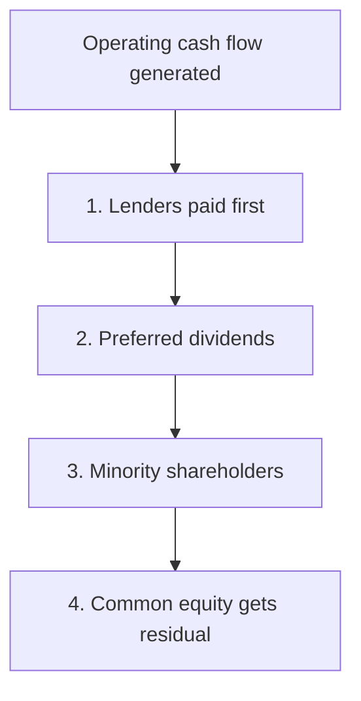
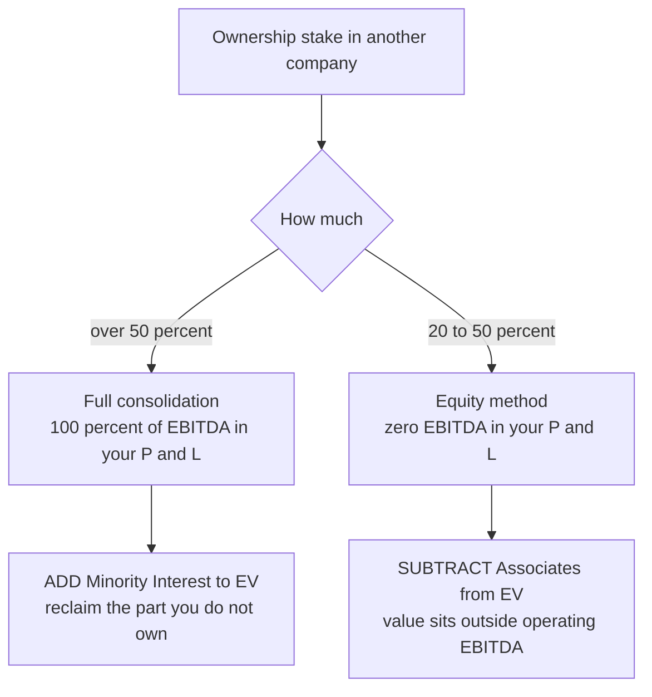
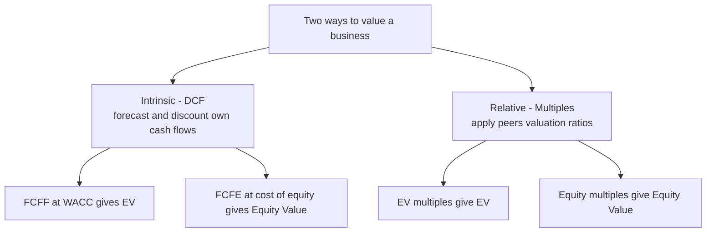
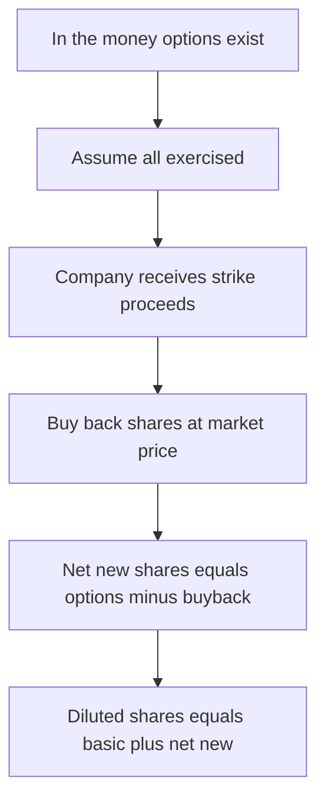

<!-- v2-deep -->

# Chapter 21 — Valuation Fundamentals: Enterprise vs Equity Value

## 1. The Problem

You have built a three-statement model. It projects revenue, EBITDA, net income, and free cash flow for the next five years. A colleague leans over and asks a deceptively simple question: **"So what's the company worth?"**

You freeze. Worth to whom? The bank that lent it money cares about a different number than the shareholder who owns a slice of equity. The acquirer buying the whole business cares about a third number entirely. And when you open a data provider and see that "Company A trades at 8x and Company B trades at 12x," you have no idea whether those multiples are even comparable — 8x *what*, divided into *whose* claim?

Here is the trap that catches almost every beginner. They pull up a comparable company, see it trades at a P/E of 15, and multiply their own company's net income by 15 to get a value. Then they pull up an EV/EBITDA of 9 from another comp, multiply their EBITDA by 9, and get a **wildly different answer**. They conclude that valuation is arbitrary guesswork. It is not. The two numbers measure two *different things*, and mixing them is like adding a distance in miles to a temperature in Celsius.

The core confusion is this: **a business is financed by more than one type of investor.** Debt holders and equity holders both have claims on the same underlying operations. "The value of the business" and "the value of the shareholders' stake" are different quantities separated by the company's net borrowings. Until you can move cleanly between them — and know which cash flows and which multiples belong to which — every valuation you produce will be internally inconsistent.

Consider a concrete version of the confusion. Suppose two analysts value the same airline. Analyst One reads a press release: *"the shares are worth $6 billion in total."* Analyst Two reads the acquisition rumour: *"the airline is being bought for $14 billion."* Both are correct. The $6 billion is Equity Value (market capitalization) and the $14 billion is Enterprise Value, and the gap — roughly $8 billion — is the airline's net debt, mostly aircraft financing and leases. A junior analyst who does not know which figure is which will happily divide the $14 billion by net income and produce a multiple that means nothing. The number is not wrong because the arithmetic failed; it is wrong because a whole-business value was divided by a shareholders-only metric.

This chapter builds the single most important scaffold in all of valuation: the **Enterprise Value to Equity Value bridge**. Master it, and every subsequent technique (DCF, comparable companies, precedent transactions, LBO) snaps into place. Skip it, and you will make errors that no amount of Excel skill can rescue.

## 2. The Core Idea

Think of a company as a **house that generates rent**. The house itself — the income-producing asset — has a value independent of how it was paid for. Call that the **Enterprise Value (EV)**: the value of the core operating business, the machine that produces cash for *everyone* who financed it.

Now, that house was bought partly with a mortgage (debt) and partly with the owner's own money (equity). If the house is worth $500,000 and there is a $200,000 mortgage outstanding, the owner's stake — the **Equity Value** — is $300,000. If the owner also happens to have $20,000 sitting in a bank account tied to the house, their real net position is $320,000, because that cash could immediately pay down the mortgage.

That is the entire idea in one line:

> **Enterprise Value is what the operating business is worth to all capital providers. Equity Value is what is left for shareholders after the debt holders are paid, adjusted for cash and a few other claims.**

The instrument that moves you from one to the other is the **bridge**:

$$\textbf{Enterprise Value} = \text{Equity Value} + \text{Net Debt} + \text{Minority Interest} + \text{Preferred Equity} - \text{Investments in Associates}$$

Rearranged to solve for what shareholders own:

$$\textbf{Equity Value} = \text{Enterprise Value} - \text{Net Debt} - \text{Minority Interest} - \text{Preferred Equity} + \text{Investments in Associates}$$

where **Net Debt = Total Debt − Cash & Cash Equivalents**.

Every valuation you ever do lands on *one* of these two numbers first, then crosses the bridge to get the other. A DCF of free cash flow to the firm gives you EV. A P/E multiple gives you Equity Value. The bridge is how they talk to each other.

One more intuition before the mechanics. Notice the direction of the arithmetic. To go *from* the shareholder's slice *up to* the whole enterprise, you **add** everyone who ranks ahead of the shareholder (debt, preferred, minority) and **remove** the assets that are not part of the operating machine (cash, associates). To go the other way — *from* the whole enterprise *down to* the shareholder — you do the exact opposite. The bridge is not two formulas to memorise; it is one idea read forwards or backwards. If you ever forget a sign, ask: *"Does this party get paid before the common shareholder?"* If yes, it sits between EV and equity and gets added when climbing to EV. *"Is this an asset unrelated to operations?"* If yes, it is like cash and gets subtracted from EV.

*Figure 1 — The bridge separates the value of the business from the value of the shareholders' slice.*

## 3. Why It Works

Why must these two numbers be different? Because **different investors have different claims on the same cash, and those claims sit in a strict priority order.**

When a company generates operating cash flow, that cash does not belong to shareholders first. It flows through a waterfall:

1. **The business** produces operating profit.
2. **Lenders** get paid interest and principal — their claim is senior.
3. **Preferred shareholders** get their fixed dividend next.
4. **Minority (non-controlling) shareholders** in partly-owned subsidiaries take their proportional slice.
5. **Common equity holders** get whatever is left — the residual.

Enterprise Value captures the value available to *all* of these claimants combined, because it values the operating engine *before* splitting the proceeds. Equity Value captures only the bottom of the waterfall — the residual that common shareholders actually keep.

This is why **EV is "capital-structure neutral"** and Equity Value is not. Imagine two identical pizza shops with identical stores, ovens, and customers. Shop A is financed entirely with equity. Shop B borrowed half its money. The two shops have the *same Enterprise Value* — the ovens make the same pizzas — but *very different Equity Values*, because Shop B's shareholders are behind a lender in the queue. If you tried to compare the two shops using Equity Value, you would wrongly conclude they are different businesses. Compare them on EV, and you correctly see they are twins. **This capital-structure neutrality is the whole reason EV exists** — it lets you compare businesses without their financing decisions polluting the comparison.

The subtraction of **cash** has the same logic. Cash is not part of the operating business — it is a financial asset the owners could distribute tomorrow. If you buy a company for its EV and it happens to hold $100 of surplus cash, you effectively get that $100 back the moment you own it, so it reduces the true price you pay for the *operations*. Net debt (debt minus cash) is what genuinely stands between the enterprise and the equity holder.

Here is a way to *feel* the cash subtraction rather than just accept it. Suppose you agree to buy a lemonade stand for an Enterprise Value of $1,000. On the day you take over, you open the cash register and find $200 that came with the business. What did the *operations* actually cost you? $800 — because you got $200 back instantly. That is precisely why cash reduces EV: the price of the operating machine is the total price minus the free cash that rides along with it. If instead the stand came with a $300 loan you must repay, the operations effectively cost you $1,300. Debt adds; cash subtracts; net debt is the combined effect.

The two adjustments that trip people up — **minority interest** and **associates** — follow from an accounting mismatch, and Section 4 explains exactly why. But the principle is already visible: the bridge exists to reconcile *the value of an operating machine* with *the value of one specific claim on that machine's output.*

*Figure 2 — The claim waterfall: equity holders stand last, which is why their value differs from the whole enterprise.*

## 4. Full Technical Content

This is the section where you learn to build the bridge in Excel, line by line, and to compute both EV and Equity Value from either direction.

### 4.1 The two anchor definitions

**Equity Value** (also called **market capitalization** for a public company) is the value of all common shares:

$$\text{Equity Value} = \text{Share Price} \times \text{Diluted Shares Outstanding}$$

Always use **diluted** shares — shares that would exist if in-the-money options, warrants, and convertibles were exercised. The standard method is the **Treasury Stock Method (TSM)**: for options with strike below the current price, add the option count and subtract the shares the company could buy back with the proceeds. (This is covered fully in the chapter on the diluted share count; the essential mechanics are worked in Example D below, so you can build the bridge end-to-end without waiting.)

**Enterprise Value** is Equity Value plus every other claim on the operating business, net of non-operating assets. Working from the market, for a public company:

$$\text{EV} = \text{Equity Value} + \text{Total Debt} + \text{Preferred} + \text{Minority Interest} - \text{Cash \& Equivalents}$$

(add associates back into this as a subtraction when the company holds equity-method stakes — see 4.3).

### 4.2 Building the bridge in Excel — the standard layout

Set up a clean vertical schedule. Use consistent sign conventions and colour coding: **blue for hardcoded inputs**, **black for formulas**. Here is the canonical build:

| Row | Line item | Excel logic | Sign |
|-----|-----------|-------------|------|
| 1 | Share price | Hardcode (blue) | — |
| 2 | Diluted shares outstanding | Hardcode or TSM calc | — |
| 3 | **Equity Value** | `=B1*B2` | Start |
| 4 | (+) Total debt | Hardcode from balance sheet | Add |
| 5 | (+) Preferred equity | Hardcode | Add |
| 6 | (+) Minority interest | Hardcode | Add |
| 7 | (−) Cash & equivalents | Hardcode (enter negative) | Subtract |
| 8 | (−) Investments in associates | Hardcode (enter negative) | Subtract |
| 9 | **Enterprise Value** | `=SUM(B3:B8)` | Result |

To reverse the bridge (you have EV from a DCF and want Equity Value per share), simply flip every sign below the anchor:

| Row | Line item | Excel logic |
|-----|-----------|-------------|
| 1 | **Enterprise Value** (from DCF) | Link from DCF tab |
| 2 | (−) Total debt | Subtract |
| 3 | (−) Preferred equity | Subtract |
| 4 | (−) Minority interest | Subtract |
| 5 | (+) Cash & equivalents | Add |
| 6 | (+) Investments in associates | Add |
| 7 | **Equity Value** | `=SUM(B1:B6)` |
| 8 | (÷) Diluted shares | `=B7/DilutedShares` |
| 9 | **Implied share price** | Result |

**Best-practice tip:** always enter cash and associates as *negative* numbers in the "build EV from equity" direction, then use a single `=SUM()` across the whole block. This prevents the classic sign error where an analyst accidentally *adds* cash. A `=SUM` over pre-signed inputs is far safer than a long `=B3+B4-B5-B6+...` formula that must be re-audited every time a line moves.

**Cell-by-cell walkthrough (build EV from Equity, using Example A's numbers).** Lay the schedule out with labels in column A and values in column B, starting row 2:

- `B2` = `40` (share price, blue input)
- `B3` = `100` (diluted shares, blue input)
- `B4` = `=B2*B3` → 4,000 (Equity Value, black formula)
- `B5` = `800` (total debt, blue, positive because it adds)
- `B6` = `50` (preferred, blue, positive)
- `B7` = `120` (minority interest, blue, positive)
- `B8` = `-150` (cash, blue, **entered negative**)
- `B9` = `-90` (associates, blue, **entered negative**)
- `B10` = `=SUM(B5:B9)` → 730 (total bridge adjustments)
- `B11` = `=B4+B10` → 4,730 (Enterprise Value, black)

Notice `B11` is a two-term sum: the anchor plus the pre-signed adjustment block. If a new claim appears (say, an underfunded pension), you insert one row inside `B5:B9`, pre-sign it, and `B10` and `B11` update automatically. This is why professionals pre-sign and `=SUM` rather than write one long chained formula: the layout is *insertion-safe*.

**Add a live round-trip check.** In a spare block, rebuild Equity from the EV you just produced:

- `E2` = `=B11` (start from computed EV, 4,730)
- `E3` = `=-B5` → −800 (flip debt)
- `E4` = `=-B6` → −50 (flip preferred)
- `E5` = `=-B7` → −120 (flip minority)
- `E6` = `=-B8` → +150 (flip cash back to positive)
- `E7` = `=-B9` → +90 (flip associates back to positive)
- `E8` = `=SUM(E2:E7)` → 4,000 (rebuilt Equity Value)
- `E9` = `=IF(ROUND(E8-B4,1)=0,"OK","CHECK")` → **OK**

If `E9` ever shows "CHECK", you have a sign error somewhere. This single guard cell catches the most common bridge mistakes before they reach a valuation output.

### 4.3 The five bridge components explained

**Total Debt.** Include everything that is genuinely debt-like: short-term borrowings, the current portion of long-term debt, long-term debt, bonds, and — under modern accounting — **capitalised operating and finance leases** (IFRS 16 / ASC 842 bring most leases onto the balance sheet as debt). Use the **book value** of debt as a practical proxy for market value unless the debt trades at a large discount (distressed situations), in which case use market value. Debt-like items that beginners forget: **drawn revolvers**, **finance-lease obligations**, and **convertible bonds** (the debt component). Do *not* include ordinary trade payables or accrued expenses — those are operating liabilities already captured inside working capital, not financing.

**Cash & Cash Equivalents.** Subtract cash because it is a non-operating asset. A subtlety: some analysts subtract only **"excess" cash**, arguing a business needs a minimum operating cash buffer. In practice, most models subtract total cash for simplicity and comparability, since the "required" buffer is hard to estimate consistently. A related trap is **trapped cash** — cash held in a foreign subsidiary that would incur repatriation tax if brought home. Strictly, only the after-tax repatriable amount reduces the price you effectively pay, but most models ignore this unless the trapped balance is material.

**Preferred Equity.** Preferred stock sits between debt and common equity in the waterfall. It has a prior claim over common shareholders, so from the common shareholder's perspective it behaves like debt: add it to get from Equity Value to EV. Use its redemption/liquidation value or market value. Watch for **convertible preferred** that is in-the-money — if it is economically common equity, treat it in the diluted share count instead of as a preferred add-back, or you will double-count.

**Minority Interest (Non-Controlling Interest, NCI).** This is the subtle one. When a parent owns *more than 50%* of a subsidiary, accounting rules require it to **fully consolidate** that subsidiary — 100% of the subsidiary's revenue, EBITDA, and assets appear on the parent's financials, *even though the parent does not own 100%.* The NCI line represents the portion the parent does *not* own. Because your EBITDA (and hence an EV built on it) reflects 100% of the subsidiary, you must **add back minority interest** so that EV represents the total enterprise consistent with that full-consolidation EBITDA. If you did not, you would be dividing a 100%-EBITDA into an EV that only reflected the parent's share — a mismatch. *Refinement:* the book value of NCI on the balance sheet is an imperfect proxy; a purist marks it to fair value (for example, the NCI's ownership percentage times the subsidiary's own implied EV). Most models use book value unless NCI is large.

**Investments in Associates (equity-method investments).** The mirror image. When a company owns *20%–50%* of another company, it uses the **equity method**: *none* of the associate's revenue or EBITDA appears in the parent's operating lines; only a single "share of profit of associates" line sits below operating profit. So the associate contributes value to the company but contributes *nothing* to the EBITDA your EV is built on. You therefore **subtract** the value of associates from EV, because that value is not part of the core operating engine you are valuing with an operating multiple. (Equivalently: it is a non-operating asset, like cash.) The mirror of the NCI refinement applies: book value of the associate understates its worth if the associate is itself valuable; a purist marks it to a fair value or an implied stake value.

*Figure 3 — Minority interest and associates come from opposite accounting treatments, so they get opposite signs.*

**A memory hook for the two hard signs.** Minority interest is a claim held by *outsiders* on cash flow that *is* inside your EBITDA → you owe them a slice → **add** it back to reach the full enterprise. Associates are a stake *you* hold whose cash flow is *outside* your EBITDA → it is a non-operating asset like cash → **subtract** it. "Inside EBITDA, owned by others = add; outside EBITDA, owned by you = subtract."

### 4.4 Intrinsic vs relative valuation

There are two philosophies for arriving at value, and both land on the bridge.

**Intrinsic valuation (Discounted Cash Flow, DCF).** You forecast the cash the business will generate and discount it to today at a rate reflecting its risk. It asks: *what is this company fundamentally worth, based on its own cash flows, independent of what the market thinks?* Two variants matter enormously here:

- **FCFF (Free Cash Flow to the Firm)** is cash available to *all* investors (debt and equity), so discounting it at the **WACC** produces **Enterprise Value** directly.
  $$\text{FCFF} = \text{EBIT} \times (1 - \text{tax rate}) + \text{D\&A} - \text{CapEx} - \Delta\text{Working Capital}$$
- **FCFE (Free Cash Flow to Equity)** is cash available *only to shareholders* after debt payments, so discounting it at the **cost of equity** produces **Equity Value** directly.
  $$\text{FCFE} = \text{FCFF} - \text{Interest} \times (1 - \text{tax}) + \text{Net Borrowing}$$

Note the beautiful consistency: FCFF ↔ WACC ↔ EV, and FCFE ↔ cost of equity ↔ Equity Value. The cash flow, the discount rate, and the output all speak the same language. Mixing them (discounting FCFF at cost of equity) is a fatal error.

The **WACC** that discounts FCFF is:
$$\text{WACC} = \frac{E}{V} \times r_e + \frac{D}{V} \times r_d \times (1 - t)$$
where $r_e$ (cost of equity) usually comes from **CAPM**: $r_e = r_f + \beta \times (r_m - r_f)$.

**Relative valuation (multiples / comparables).** Instead of forecasting cash flows, you find similar companies and apply their valuation ratios to your company's metric. It asks: *what is the market currently paying for a dollar of EBITDA (or earnings) at comparable businesses?* This is faster, market-grounded, and the language of most deal conversations — but it inherits whatever mispricing exists in the comp set.

*Figure 4 — Both roads lead to the bridge; each road has an EV lane and an Equity lane.*

### 4.5 Matching the right multiple to the right metric — the golden rule

This is where the whole chapter pays off. A multiple is a ratio of *value* over *a metric*. The rule is absolute:

> **The numerator (value) and the denominator (metric) must belong to the same claimants.** If the metric is available to all investors, use EV. If the metric is available only to shareholders, use Equity Value.

Trace *who has already been paid* at each line of the income statement:

| Income statement line | Debt paid yet? | Belongs to | Correct numerator |
|-----------------------|----------------|------------|-------------------|
| Revenue / Sales | No | All investors | **EV** → EV/Sales |
| EBITDA | No (before interest) | All investors | **EV** → EV/EBITDA |
| EBIT | No (before interest) | All investors | **EV** → EV/EBIT |
| Net Income (Earnings) | Yes (after interest) | Shareholders only | **Equity** → P/E |
| Book value of equity | Yes | Shareholders only | **Equity** → P/B |
| Free Cash Flow to Equity | Yes | Shareholders only | **Equity** → P/FCFE |

The pivot is **interest expense**. Everything *above* interest on the income statement is pre-financing — it belongs to lenders and shareholders alike, so it pairs with EV. Everything *below* interest is post-financing — lenders have been paid, so it belongs to shareholders alone, and pairs with Equity Value.

This is why **EV/EBITDA** is the workhorse of comparison: EBITDA is before interest (capital-structure neutral) *and* before D&A (accounting-policy neutral), so it strips out both financing and depreciation choices, letting you compare businesses cleanly. And it is why **P/E**, which uses net income (after interest and after tax), must sit over Equity Value / share price. **Putting EV over net income, or price over EBITDA, is nonsensical** — you would be comparing a whole-company claim to a shareholders-only metric.

**One boundary case worth memorising: EV/FCFF vs P/FCFE.** Free cash flow to the *firm* is pre-financing, so it pairs with EV; free cash flow to *equity* is post-financing, so it pairs with price. The same interest-expense pivot governs cash-flow multiples exactly as it governs earnings multiples. And a subtle one interviewers love: **EV/EBIT is defensible, but "EV/Net Income" is never** — net income is post-interest, so it can only ever sit under price.

## 5. Worked Examples

### Example A — Building EV from a public company's market data

**Given (all figures in $ millions):**

| Item | Value |
|------|-------|
| Share price | $40.00 |
| Diluted shares outstanding | 100 |
| Total debt | 800 |
| Cash & equivalents | 150 |
| Preferred equity | 50 |
| Minority interest | 120 |
| Investments in associates | 90 |

**Step 1 — Equity Value:**
$$\text{Equity Value} = 40.00 \times 100 = \$4{,}000\text{m}$$

**Step 2 — Cross the bridge to EV:**

| Line | Amount | Running EV |
|------|--------:|-----------:|
| Equity Value | 4,000 | 4,000 |
| (+) Total debt | 800 | 4,800 |
| (+) Preferred equity | 50 | 4,850 |
| (+) Minority interest | 120 | 4,970 |
| (−) Cash | (150) | 4,820 |
| (−) Associates | (90) | **4,730** |

$$\boxed{\text{Enterprise Value} = \$4{,}730\text{m}}$$

**Step 3 — Sanity check the multiple.** If this company's EBITDA is $591.25m, then:
$$\text{EV/EBITDA} = 4{,}730 / 591.25 = 8.0\times$$
A clean 8.0x. If net income is $250m, then $\text{P/E} = 4{,}000 / 250 = 16.0\times$. Note we used **Equity Value ($4,000m)** for P/E, not EV — the two multiples describe different claims.

### Example B — Reversing the bridge: from a DCF to a share price

Your FCFF-based DCF produced an **Enterprise Value of $4,730m** (same company, confirming the intrinsic and market values happen to agree). Now derive the implied share price.

| Line | Amount | Running total |
|------|--------:|--------------:|
| Enterprise Value (from DCF) | 4,730 | 4,730 |
| (−) Total debt | (800) | 3,930 |
| (−) Preferred equity | (50) | 3,880 |
| (−) Minority interest | (120) | 3,760 |
| (+) Cash | 150 | 3,910 |
| (+) Associates | 90 | **4,000** |

$$\text{Equity Value} = \$4{,}000\text{m}, \qquad \text{Implied share price} = \frac{4{,}000}{100} = \$40.00$$

The bridge reconciles perfectly — every sign flipped relative to Example A, and we recovered the exact $40.00 share price. **This round-trip is your built-in error check:** build EV from equity, then rebuild equity from EV, and you must return to your starting point.

### Example C — Why mismatched multiples mislead: comparing two firms

Two companies run identical operations. Both have **EBITDA of $500m** and both have an **Enterprise Value of $4,000m** (so both trade at **EV/EBITDA = 8.0x** — correctly identified as twins). But their financing differs:

| | Firm L (levered) | Firm U (unlevered) |
|---|---:|---:|
| Enterprise Value | 4,000 | 4,000 |
| Net debt | 2,000 | 0 |
| Equity Value | 2,000 | 4,000 |
| Interest expense | 120 | 0 |
| EBIT (both) | 350 | 350 |
| Pre-tax profit | 230 | 350 |
| Net income (25% tax) | 172.5 | 262.5 |
| **P/E** = Equity Value / NI | **11.6×** | **15.2×** |
| **EV/EBITDA** | **8.0×** | **8.0×** |

Look at what happened. On **P/E**, the two identical businesses look *completely different* — 11.6x vs 15.2x — purely because of leverage. An analyst using P/E alone would wrongly conclude Firm U is "more expensive" or a "higher quality" business. On **EV/EBITDA**, they are correctly revealed as identical twins at 8.0x. **This is the single most important demonstration in the chapter:** EV/EBITDA neutralises capital structure; equity multiples do not. When comparing companies with different leverage, EV multiples are almost always the fairer lens.

*Why does the levered firm show a lower P/E?* Its interest expense of 120 cuts pre-tax profit, but the equity base fell even more sharply (from 4,000 to 2,000). Both numerator and denominator of P/E shrank, and here the denominator shrank proportionally less than the numerator, so the ratio fell. The precise number is incidental; the lesson is that leverage moves the equity multiple around even when the underlying business is unchanged.

### Example D — The Treasury Stock Method feeding the bridge

Example A simply *gave* you 100 diluted shares. Here is where that number comes from, so you can build it yourself.

**Given:**

| Item | Value |
|------|------:|
| Basic shares outstanding | 95.0m |
| Options outstanding | 10.0m |
| Option strike price | $20.00 |
| Current share price | $40.00 |

**Step 1 — Are the options in the money?** Strike $20 < price $40, so yes; assume all 10.0m are exercised.

**Step 2 — Cash the company receives on exercise:**
$$\text{Proceeds} = 10.0 \times \$20.00 = \$200\text{m}$$

**Step 3 — Shares repurchased with those proceeds at the market price:**
$$\text{Buyback} = \frac{200}{40.00} = 5.0\text{m shares}$$

**Step 4 — Net new shares and diluted count:**
$$\text{Net new} = 10.0 - 5.0 = 5.0\text{m}, \qquad \text{Diluted} = 95.0 + 5.0 = 100.0\text{m}$$

That 100.0m flows straight into `B3` of the bridge in 4.2, producing Equity Value of $4,000m exactly as in Example A. **Excel formula for net dilution in one cell:** `=Options*MAX(0,Price-Strike)/Price` → `=10*MAX(0,40-20)/40` = 5.0. The `MAX(0,...)` guard automatically ignores out-of-the-money options (where strike ≥ price), so you can list every tranche in a table and sum the column without manually screening.

*Figure 5 — The Treasury Stock Method converts basic shares into the diluted count the bridge requires.*

### Example E — Net cash: when EV is smaller than Equity Value

Not every company carries net debt. A cash-rich software firm often has *net cash* (cash exceeds debt), which makes **EV smaller than Equity Value** — a result that surprises beginners but is entirely correct.

**Given (all $ millions):**

| Item | Value |
|------|------:|
| Share price | $50.00 |
| Diluted shares | 80.0 |
| Total debt | 200 |
| Cash & equivalents | 900 |
| Preferred / MI / associates | 0 |
| LTM EBITDA | 330 |
| LTM Net income | 200 |

**Step 1 — Equity Value:** $50.00 × 80 = **$4,000m**.

**Step 2 — Net debt:** $200 − 900 = **−$700m** (net *cash*).

**Step 3 — Cross the bridge:**
$$\text{EV} = 4{,}000 + 200 - 900 = \$3{,}300\text{m}$$

**Step 4 — Multiples:**
$$\text{EV/EBITDA} = 3{,}300 / 330 = 10.0\times, \qquad \text{P/E} = 4{,}000 / 200 = 20.0\times$$

Note EV ($3,300m) is **below** Equity Value ($4,000m). This is not an error — the company's shareholders own the operating business *plus* a $700m net cash pile, so their claim exceeds the value of operations alone. Interview gotcha: *"Can Enterprise Value be less than Equity Value? Can it be negative?"* Answer: **yes** to the first whenever the company has net cash; **yes** to the second in the extreme case where net cash exceeds the operating value (rare, seen in beaten-down cash-rich firms or shells) — a technically negative EV signals the market values the operations at less than zero, usually a distress or liquidation signal.

### Example F — Applying the bridge inside a comparable-companies analysis

This is how the bridge earns its keep in practice: you value a *private* target by borrowing multiples from *public* peers, then cross the bridge to a per-share number.

**Step 1 — Gather peer multiples.**

| Peer | EV/EBITDA | P/E |
|------|----------:|----:|
| A | 8.0× | 14.0× |
| B | 9.0× | 16.0× |
| C | 10.0× | 18.0× |
| D | 8.5× | 15.0× |
| E | 9.5× | 17.0× |
| **Median** | **9.0×** | **16.0×** |

Use the **median** (robust to outliers), not the mean.

**Step 2 — Apply EV/EBITDA to the target.** Target LTM EBITDA = $600m:
$$\text{Implied EV} = 9.0 \times 600 = \$5{,}400\text{m}$$

**Step 3 — Cross the bridge to Equity Value.** Target has net debt $1,400m, minority interest $100m, associates $200m, no preferred:
$$\text{Equity Value} = 5{,}400 - 1{,}400 - 100 - 0 + 200 = \$4{,}100\text{m}$$

With 100m diluted shares, that implies **$41.00 per share**.

**Step 4 — Cross-check with P/E.** Target LTM net income = $250m:
$$\text{Implied Equity Value} = 16.0 \times 250 = \$4{,}000\text{m} \Rightarrow \$40.00\text{ per share}$$

The two independent routes — an EV multiple crossed down the bridge, and an equity multiple applied directly — land at **$41.00 and $40.00**. They agree to within about 2.5%, which is a strong signal the valuation is internally consistent. If instead they had diverged wildly (say $41 vs $28), that gap would flag something: different leverage between target and peers, a distorted net-income line (one-off items, unusual tax rate), or a badly chosen comp set. **A well-built comps sheet always computes both and reconciles them through the bridge.**

### Example G — A lease adjustment changes the multiple

Two retailers look identical on EBITDA but account for their stores differently, and the bridge exposes it.

**Given (all $ millions):** Both have operating EBITDA (post-IFRS 16, so rent is *not* in operating expense) of **$500m**. Retailer P **owns** its stores (no leases). Retailer Q **leases** its stores, with a capitalised lease liability of **$1,500m** now sitting in debt.

| | Retailer P (owns) | Retailer Q (leases) |
|---|---:|---:|
| Equity Value | 3,000 | 3,000 |
| Total debt (incl. leases) | 500 | 500 + 1,500 = 2,000 |
| Cash | 0 | 0 |
| Enterprise Value | 3,500 | 5,000 |
| EBITDA | 500 | 500 |
| **EV/EBITDA** | **7.0×** | **10.0×** |

If you *excluded* the $1,500m lease liability from Q's debt, you would compute Q's EV as $3,500m and 7.0x — falsely matching P. But Q's EBITDA of $500m already excludes rent (IFRS 16 strips rent out of operating costs), so the lease obligation *must* be counted as debt to keep the numerator and denominator consistent. **The rule: if EBITDA is on a post-IFRS-16 basis, include lease liabilities in debt; if a peer reports pre-IFRS-16 EBITDA (rent still in opex), exclude the lease from debt.** Mixing the two conventions across a comp set is a silent, common error that makes leased-heavy businesses look artificially cheap or expensive.

## 6. Connections

The EV/Equity bridge is the central junction of the entire valuation model. Everything wires into it:

- **← Three-statement model (Ch. 8–12).** Total debt, cash, minority interest, and associates all come straight off your projected balance sheet. The bridge consumes the balance sheet's financing side.
- **← Diluted share count / Treasury Stock Method.** Equity Value depends on diluted shares; the TSM feeds the denominator (worked in Example D).
- **→ DCF (Ch. 22–24).** An FCFF DCF outputs EV and crosses the bridge *forward* to a share price. An FCFE DCF outputs Equity Value directly, bypassing the bridge — a useful cross-check.
- **→ Comparable Companies analysis (Ch. 25).** You compute EV/EBITDA and P/E for a peer set, apply the median to your company's metrics, then use the bridge to translate between the EV-based and equity-based outputs (worked in Example F). A well-built comps sheet computes *both* and checks they roughly agree.
- **→ Precedent Transactions & LBO (Ch. 26–28).** Deal values are quoted on a **Transaction Enterprise Value** (also "firm value" or "total consideration") basis; the bridge converts the offer-per-share (equity) into the EV that the acquirer is really paying for the operations. In an LBO, the bridge is run twice — at entry to size the purchase EV, and at exit to convert exit EV back to equity proceeds for the IRR.
- **↔ WACC (Ch. 20).** The discount rate mirrors the cash flow: WACC (all-investor return) discounts FCFF to EV; cost of equity (shareholder return) discounts FCFE to Equity Value. The bridge and the discount-rate choice are two views of the same capital-structure logic.
- **↔ Accounting (consolidation rules).** The minority-interest and associates adjustments are *pure accounting consequences*. Understanding full consolidation vs the equity method (Ch. on group accounts) is what makes those two signs obvious rather than memorised.

## 7. Traps and Common Errors

1. **The cardinal sin: EV ÷ Net Income or Price ÷ EBITDA.** Never divide an all-investor value by a shareholders-only metric, or vice versa. If you ever see "EV/Net Income" or "P/EBITDA," a mistake has been made. Memorise the pivot: *above interest → EV; below interest → Equity.*

2. **Wrong sign on cash.** Cash is *subtracted* to get EV from Equity Value (and *added* going the other way). Adding cash to reach EV is the most common bridge error. Pre-sign your inputs and `=SUM` to avoid it.

3. **Forgetting minority interest / associates.** Beginners often build EV = Equity + Debt − Cash and stop. For any company with consolidated subsidiaries or equity-method stakes, that omits real claims. Add minority interest; subtract associates.

4. **Getting their signs backwards.** Minority interest is *added*; associates are *subtracted*. Remember the logic: MI corrects for EBITDA you *over*-counted (full consolidation), associates correct for value *not* in EBITDA. Opposite problems, opposite signs.

5. **Using basic instead of diluted shares.** In-the-money options and convertibles dilute existing holders. Basic shares overstate value per share. Always run the Treasury Stock Method (Example D).

6. **Book vs market value of debt.** For a healthy company, book value of debt is a fine proxy. For a distressed company whose bonds trade at 60 cents, using book value badly overstates the true claim — use market value.

7. **Mismatched time periods.** Market EV is *today's* value; it should pair with a *forward or trailing* metric consistently. Comparing today's EV to a metric from three years ago produces a meaningless multiple. Label everything LTM (last twelve months) or NTM (next twelve months).

8. **Ignoring leases post-IFRS 16 / ASC 842.** Modern accounting capitalises most leases as debt. If a peer reports lease liabilities and you exclude them from debt, your EV understates the true enterprise and your EV/EBITDA is not comparable to lease-inclusive peers (Example G).

9. **Double-counting non-operating assets.** If you already subtracted an associate stake as a non-operating asset, do not *also* include its earnings in the EBITDA your multiple divides into. Keep operating and non-operating strictly separate.

10. **Treating operating liabilities as debt.** Trade payables, accruals, and deferred revenue are *operating* items already inside working capital and EBITDA. Adding them to "debt" in the bridge double-counts and inflates EV. Only *financing* liabilities (borrowings, bonds, leases, drawn revolvers) belong in the debt line.

11. **Convertible double-count.** An in-the-money convertible bond can be treated two ways — as debt (add the face value) *or* as converted equity (add the shares to the diluted count). Do **one**, never both. Doing both counts the same claim twice.

12. **Confusing "net debt is negative" with an error.** Net cash companies legitimately produce EV below Equity Value (Example E). Do not "fix" a negative net-debt figure — it is real and meaningful.

13. **Averaging multiples instead of taking the median.** One outlier peer (a company mid-acquisition, or with a distorted earnings base) can drag a simple average far off. Use the median for a robust central estimate, and inspect outliers rather than blindly including them.

## 8. First-Principles Recap

Strip everything away and here is the irreducible logic:

- A business is a **machine that produces cash for the people who financed it.** Its value to *all* of them is **Enterprise Value.**
- Those financiers stand in a **priority queue**: lenders, then preferred, then minority holders, then common shareholders last. What is left for the common shareholder is **Equity Value.**
- The distance between the two is **net debt plus other senior claims** — the **bridge.** Because it is arithmetic, it is exact and reversible: build EV from equity, rebuild equity from EV, and you must return to the same number.
- **EV is capital-structure neutral; Equity Value is not.** That single fact tells you EV is the right lens for comparing businesses with different leverage.
- **Match the claim to the metric.** Everything above interest on the income statement belongs to all investors → pair with EV. Everything below interest belongs to shareholders → pair with Equity Value. FCFF↔WACC↔EV; FCFE↔cost of equity↔Equity Value; EBITDA↔EV; net income↔price.

If you internalise only one sentence: *value the whole machine, then subtract everyone who gets paid before you.*

### Interview-style angles

These are the ways the concept gets tested. If you can answer all of them cold, you own the material.

- **"Walk me from Enterprise Value to Equity Value."** Subtract net debt, subtract preferred, subtract minority interest, add associates (and any other non-operating assets). Then divide by diluted shares for per-share value.
- **"Why do you use EV/EBITDA instead of P/E to compare two companies?"** Because EV/EBITDA is neutral to both capital structure (before interest) and depreciation policy (before D&A), so it compares the operating businesses cleanly; P/E is distorted by leverage and tax (Example C).
- **"Two identical companies, one levered, one not — which has the higher P/E?"** The unlevered one, typically, because leverage shrinks the equity base and the after-tax earnings differently; EV/EBITDA is identical for both.
- **"Can Enterprise Value be negative?"** Yes — if net cash exceeds the operating value of the business. Usually a distress or shell signal (Example E).
- **"A company issues $200m of debt and holds the cash. What happens to EV?"** Nothing. Debt goes up $200m, cash goes up $200m, net debt is unchanged, so EV is unchanged. Equity Value is also unchanged. This is a clean test of whether you understand *net* debt.
- **"A company pays a $100m cash dividend. What happens to EV and to Equity Value?"** Cash falls $100m so net debt rises $100m; Equity Value falls by roughly $100m (the shareholders got paid) while **EV is roughly unchanged** — the operating machine did not change. The value simply moved from inside the company to the shareholders' pockets.
- **"Why add minority interest but subtract associates?"** Full consolidation puts 100% of a majority-owned sub's EBITDA in your numerator's implied denominator, so you add back the slice you don't own; the equity method puts 0% of an associate's EBITDA in, so you subtract its value as a non-operating asset (4.3).
- **"Where do operating leases go?"** Post-IFRS-16, into debt — provided EBITDA is on the same post-IFRS-16 basis (Example G).

## 9. Quick-Reference

**The bridge (both directions):**
$$\text{EV} = \text{Equity Value} + \text{Net Debt} + \text{Minority Interest} + \text{Preferred} - \text{Associates}$$
$$\text{Equity Value} = \text{EV} - \text{Net Debt} - \text{Minority Interest} - \text{Preferred} + \text{Associates}$$
$$\text{Net Debt} = \text{Total Debt} - \text{Cash \& Equivalents}$$

**Sign map (building EV from Equity Value):**

| Component | Sign |
|-----------|:----:|
| Total debt | + |
| Preferred equity | + |
| Minority interest | + |
| Cash & equivalents | − |
| Investments in associates | − |

**Multiple-to-metric matching:**

| Multiple | Numerator | Denominator | Metric belongs to |
|----------|-----------|-------------|-------------------|
| EV/Sales | EV | Revenue | All investors |
| EV/EBITDA | EV | EBITDA | All investors |
| EV/EBIT | EV | EBIT | All investors |
| EV/FCFF | EV | Free cash flow to firm | All investors |
| P/E | Equity Value | Net income | Shareholders |
| P/B | Equity Value | Book equity | Shareholders |
| P/FCFE | Equity Value | FCFE | Shareholders |

**Cash-flow / discount-rate / output consistency:**

| Cash flow | Discount at | Produces |
|-----------|-------------|----------|
| FCFF | WACC | Enterprise Value |
| FCFE | Cost of equity | Equity Value |

**Treasury Stock Method net dilution (one cell):** `=Options*MAX(0,Price-Strike)/Price`, summed across tranches, added to basic shares.

**Common "no-change" facts (for sanity and interviews):**

| Event | Effect on EV | Effect on Equity Value |
|-------|:---:|:---:|
| Raise debt, hold the cash | none | none |
| Pay cash dividend | none | falls by dividend |
| Repay debt with cash on hand | none | none |
| Company holds net cash | EV below Equity Value | — |

**Excel best practice:** pre-sign inputs, use `=SUM()` across the bridge block, blue for inputs / black for formulas, always round-trip EV↔Equity with an `=IF(ROUND(...),"OK","CHECK")` guard cell.

## 10. Build-It-Yourself Exercise

Open Excel and build the following from scratch. Do not copy the worked example numbers — use these.

**Given data (all $ millions):**

- Share price: $25.00
- Diluted shares outstanding: 200
- Total debt: 1,500 (includes $200 of capitalised leases)
- Cash & equivalents: 300
- Preferred equity: 100
- Minority interest: 250
- Investments in associates: 180
- LTM EBITDA: 900
- LTM Net income: 340

**Your tasks:**

1. Build a vertical bridge schedule that computes **Equity Value** and then **Enterprise Value**. Pre-sign your cash and associates inputs as negatives and use a single `=SUM()`. (Expected Equity Value = $5,000m; expected EV = 5,000 + 1,500 + 100 + 250 − 300 − 180 = **$6,370m**.)

2. Compute **EV/EBITDA** and **P/E**. (Check: EV/EBITDA = 6,370 / 900 = **7.08×**; P/E = 5,000 / 340 = **14.7×**.) State in one sentence why you used EV for the first and Equity Value for the second.

3. Now **reverse the bridge**: pretend a DCF gave you an EV of $8,000m. Flip every sign and compute the implied Equity Value and implied share price. (Check: Equity = 8,000 − 1,500 − 100 − 250 + 300 + 180 = **$6,630m**; per share = 6,630 / 200 = **$33.15**.) Confirm your reverse schedule returns the original $5,000m equity when fed the original $6,370m EV.

4. **Add a Treasury Stock Method block.** Suppose the 200 diluted shares came from 190m basic plus one option tranche: 20m options struck at $12.50 with the stock at $25.00. Verify the TSM reproduces 200m diluted. (Check: proceeds 20 × 12.5 = 250; buyback 250 / 25 = 10; net new 20 − 10 = 10; diluted 190 + 10 = **200**.)

5. **Stress test:** a peer identical in operations but with *zero* net debt reports the same $900m EBITDA. Compute the peer's implied Equity Value at the same 7.08× EV/EBITDA (net debt is zero, and assume no MI, preferred, or associates for the peer), then compute both firms' P/E at the same net-income margin. Explain in two sentences why the P/E figures diverge while EV/EBITDA does not.

6. **Net-cash variation:** change cash to $1,900m (everything else unchanged) so the firm now holds net cash. Recompute EV and confirm it falls **below** Equity Value. (Check: net debt = 1,500 − 1,900 = −400; EV = 5,000 + 100 + 250 − 400 − 180 = **$4,770m** < $5,000m equity.) Explain in one sentence why this is correct rather than an error.

7. **Format it:** apply blue-for-input / black-for-formula colouring, add a round-trip check cell that returns "OK" via `=IF(ROUND(RebuiltEquity-StartEquity,1)=0,"OK","CHECK")`, and label every metric LTM.

Work through it until your round-trip check reads "OK" and you can explain every sign from first principles. When you can do that without notes — and can answer every question in the "Interview-style angles" list cold — you have mastered the foundation on which every valuation in this course is built.
