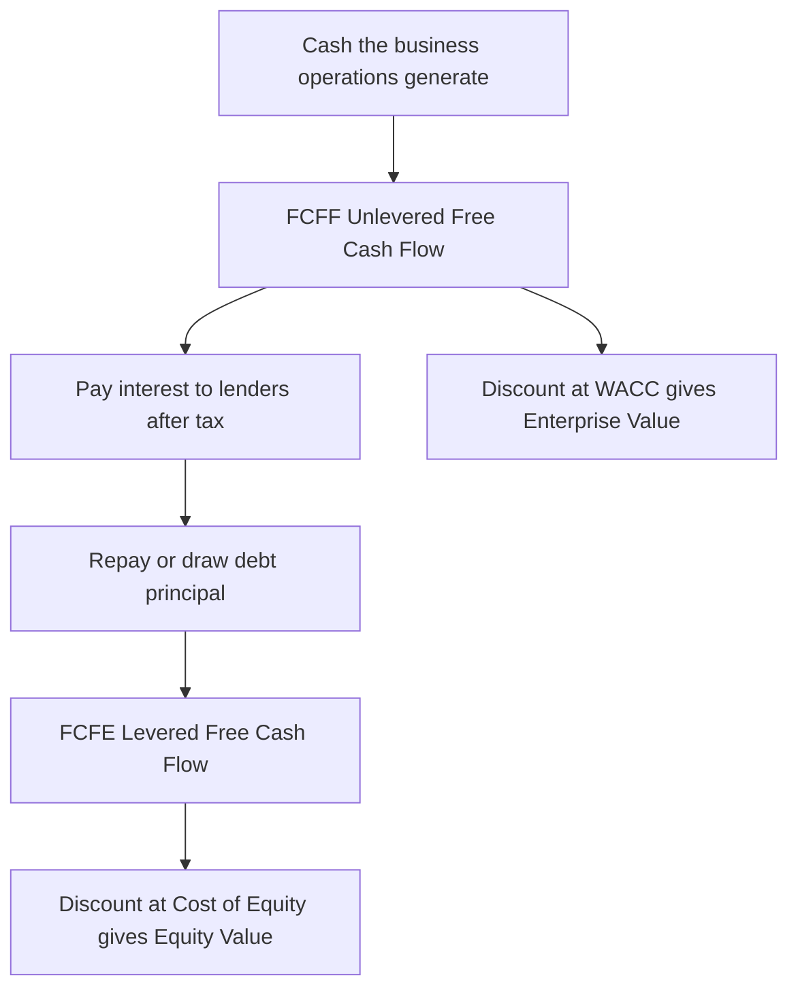
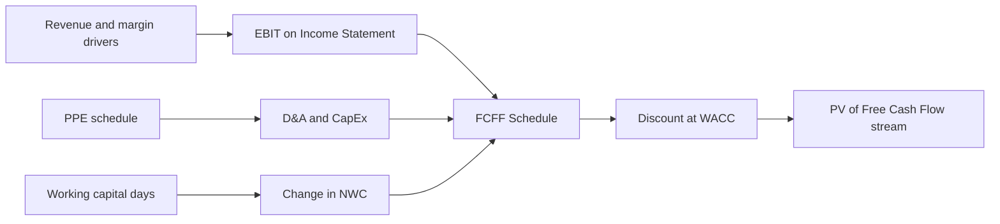
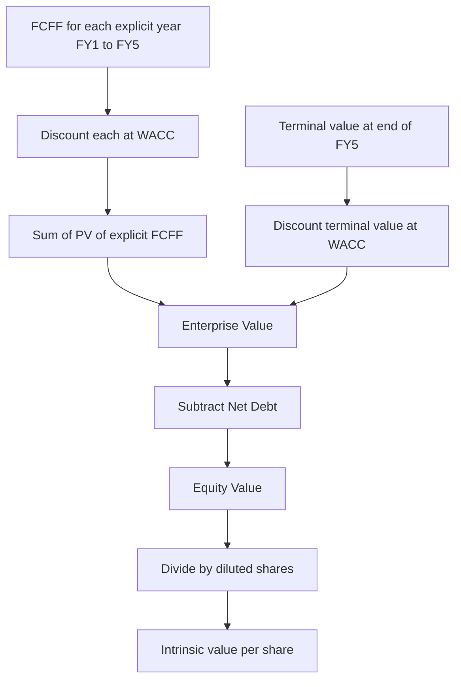

<!-- v2-deep -->

# Chapter 22 — DCF: Free Cash Flow

## 1. The Problem

You have finished the hard part. Across the last dozen chapters you built a fully integrated three-statement model: revenue drivers feed an income statement, a debt schedule and a PP&E schedule feed the balance sheet, and a cash flow statement links it all together so the balance sheet balances every year. You can now press a key and watch five years of financial statements recalculate.

But a working model is not the same thing as an **answer**. The question a client, an investor, or an interview panel actually asks is: *what is this business worth today?* Your model produces net income, EBITDA, and ending cash — none of which is a value. Net income is polluted by non-cash charges and by the company's financing choices. EBITDA ignores the very real cash a business must sink into equipment and inventory just to keep running. Ending cash tells you the bank balance, not the enterprise value.

To turn a model into a valuation you need a number that represents **the actual cash a business throws off that is genuinely available to the people who funded it** — after the business has paid for everything it needs to sustain and grow itself, but *before* it decides how to slice that cash between lenders and shareholders. That number is **free cash flow (FCF)**. It is the raw material of every discounted cash flow (DCF) valuation.

The problem this chapter solves is precise and mechanical: how do you extract a clean, defensible free-cash-flow stream from the model you already built, and which *version* of free cash flow do you need? Get the definition wrong — mix a financing item into an operating cash flow, or discount the wrong flow with the wrong rate — and every downstream number (terminal value, enterprise value, share price) is wrong by construction. This is the single most error-prone junction in all of financial modeling, and it is where sloppy analysts are exposed.

Why does this junction sit where it does? Because the three-statement model and the valuation speak two different languages. The three-statement model speaks **accrual accounting** — revenue when earned, expense when incurred, depreciation spread over years, financing and operations mingled on one income statement. Valuation speaks **cash to capital providers**. FCF is the translator between the two. Every mistake in this chapter is, at root, a failure of translation: an accrual left un-converted, a financing item left in an operating flow, a tax shield counted twice or not at all. Master the translation and the rest of the DCF (terminal value, WACC, the equity bridge) is arithmetic.

## 2. The Core Idea

Free cash flow is the cash a company generates that is **free** to be distributed to its capital providers without impairing the ongoing business. "Free" is the load-bearing word. Cash the company *must* reinvest — to replace worn-out machines, to fund the extra inventory a growing business needs — is not free. Only what is left over after those mandatory reinvestments counts.

There are two versions of free cash flow, and confusing them is the classic beginner error. They differ by **which capital providers they serve**:

- **Free Cash Flow to the Firm (FCFF)**, also called **unlevered free cash flow**, is the cash available to *all* providers of capital — both debt and equity holders — *before* any financing effects. It is the cash the business itself produces, independent of how it is financed. Because it belongs to everyone, it is discounted at the blended cost of all capital, the **WACC**, and it produces **enterprise value**.

- **Free Cash Flow to Equity (FCFE)**, also called **levered free cash flow**, is the cash available to *equity holders only* — after lenders have been paid their interest and their principal, and after new borrowing has been added back. Because it belongs only to shareholders, it is discounted at the **cost of equity**, and it produces **equity value** directly.

*Two versions of free cash flow serve two different audiences and demand two different discount rates.*

The overwhelming majority of professional DCF valuations use **FCFF discounted at WACC**. This chapter builds that path carefully, then shows precisely how FCFE differs so you understand both and never mix them. The governing discipline is a matching rule you must burn into memory: **the cash flow and the discount rate must serve the same claimants.** Firm-level cash flow (belongs to everyone) pairs with WACC (the cost of everyone's capital). Equity-level cash flow (belongs to shareholders) pairs with the cost of equity (the return shareholders demand). Cross the wires and the valuation is nonsense.

There is a second, quieter idea worth naming now because it drives the whole build: **free cash flow is the reinvestment residual.** A business first earns operating profit; then it must plough some of that profit back into fixed assets (capex) and into the working-capital base (receivables plus inventory less payables) simply to keep operating at its new, larger scale. What survives that mandatory reinvestment is what is genuinely distributable. Notice the immediate corollary: a fast-growing company can be highly *profitable* and yet produce *little or negative* free cash flow, because growth demands heavy reinvestment. Profit and free cash flow are not the same animal, and the gap between them is exactly the reinvestment the accrual income statement hides. FCF drags that hidden reinvestment into the daylight.

## 3. Why It Works

Why go to the trouble of building FCFF and discounting at WACC, rather than just discounting net income or dividends? Three reasons, each rooted in a real economic truth.

**First, value comes from cash, not accounting profit.** Depreciation reduces net income but no cash leaves the building the year the charge is recorded — the cash left years earlier when the asset was bought. A DCF that discounted net income would double-count: it would penalize you for depreciation *and* for the original capex. Free cash flow fixes the timing by starting from an operating profit measure, adding back the non-cash depreciation, and subtracting the *actual* capex in the year it is spent. Cash timing, not accrual timing, drives value.

**Second, unlevered free cash flow separates operating performance from financing choices.** A company's underlying business — the factories, the products, the customers — has a value that does not depend on whether the CFO funded it with 20% debt or 60% debt. FCFF deliberately strips out interest expense so that it measures *only* the operating engine. This is what lets you value the enterprise cleanly, then layer the specific capital structure on afterward (subtract net debt to get to equity). It also sidesteps a nasty trap: interest expense creates a tax shield, and if you left interest inside the cash flow you would have to also adjust the discount rate — the two must be handled consistently. By pulling financing *entirely* out of FCFF and putting *all* of it into the WACC (whose after-tax cost of debt already captures the tax shield), the model handles financing in exactly one place, cleanly.

**Third, WACC is the honest hurdle rate for firm-level cash.** If FCFF is the cash pool that both lenders and shareholders draw from, then the right discount rate is the *blended* required return of those two groups, weighted by how much capital each supplies:

$$WACC = \frac{E}{E+D} \cdot k_e + \frac{D}{E+D} \cdot k_d \cdot (1 - t)$$

where $k_e$ is the cost of equity (from CAPM), $k_d$ is the pre-tax cost of debt, $t$ is the tax rate, and $E$ and $D$ are the market values of equity and debt. The $(1-t)$ term on the debt piece is the tax shield: interest is tax-deductible, so the true cost of debt to the firm is lower than the coupon. Because FCFF is computed *before* interest, the tax benefit of debt does not appear in the cash flow — so it must appear in the rate, and it does, precisely here. That symmetry is the reason the FCFF-and-WACC pairing is internally consistent and the reason it is the industry default.

There is a fourth reason that is really the reason behind the reasons — **Modigliani–Miller.** In a frictionless world, the value of a firm's operations does not depend on how it is financed; capital structure only reshuffles who holds the claims, not how much cash the assets throw off. Real markets have one big friction — the tax deductibility of interest — and FCFF/WACC handles it in exactly one designated place (the after-tax cost of debt). This is why an analyst can value the *enterprise* first, treating it as if all-equity financed (that is precisely what NOPAT and FCFF assume), and only afterward subtract net debt to reach *equity*. The separation is not a convenience; it is the theorem that makes the whole DCF architecture legitimate.

The deep principle: **you are free to define cash flow at any level of the capital stack, as long as the discount rate matches that same level.** Everything else in this chapter is the disciplined execution of that one idea.

## 4. Full Technical Content

### 4.1 The FCFF build — the canonical formula

The standard construction of unlevered free cash flow starts from **EBIT** (earnings before interest and taxes, also called operating income) and walks down to cash:

$$FCFF = EBIT \times (1 - t) + D\&A - CapEx - \Delta NWC$$

Read each term and *why* it is there:

| Term | What it is | Why it appears | Sign |
|---|---|---|---|
| $EBIT \times (1-t)$ | Operating profit, then taxed as if the firm had **no debt** | Start from a pre-financing profit; tax it at the full rate to get **NOPAT** (net operating profit after tax) | Base |
| $+\ D\&A$ | Depreciation and amortization | Non-cash expense subtracted to reach EBIT; add it back because no cash left | Add |
| $-\ CapEx$ | Capital expenditure | Real cash spent on long-term assets to sustain and grow the business | Subtract |
| $-\ \Delta NWC$ | Increase in net working capital | Cash tied up in receivables and inventory net of payables as the business grows | Subtract |

The result, NOPAT plus D&A minus capex minus the change in working capital, is the cash the operating business produces for **all** capital providers. Note what is *conspicuously absent*: interest expense. FCFF never touches interest. That omission is the entire point of "unlevered."

The subtle move is the tax term. We do **not** use the tax the company actually paid, because actual tax was reduced by the interest deduction. Instead we compute a hypothetical **unlevered tax** — $EBIT \times t$ — the tax the firm *would* pay if it had no debt at all. This gives NOPAT, an all-equity-financed profit. The tax benefit the firm really gets from its debt is not lost; it is captured later, inside WACC's after-tax cost of debt. Handling the shield in exactly one place — never both, never neither — is the mark of a correct model.

**A precise word on the marginal tax rate.** The $t$ used here should be the company's **marginal** tax rate (the rate that applies to the next dollar of profit), not the *effective* rate you back out of the accounts (tax expense ÷ pre-tax income). The effective rate is distorted by one-off items, deferred-tax movements, tax credits, and prior-year true-ups; the marginal rate — usually the statutory corporate rate, adjusted for a stable state or local layer — is the economically correct rate for a forward-looking valuation. Where a company benefits from durable structural advantages (a permanently lower rate from a tax-favoured jurisdiction), some analysts blend toward the effective rate for the explicit years and toward the marginal rate at the terminal year. Whatever you choose, keep it a single referenced assumption cell and document the reasoning.

**A note on "amortization."** The A in D&A here means the non-cash amortization of *capitalized intangibles* (software, capitalized development costs, acquired intangibles) — a genuine non-cash charge you add back. Do **not** confuse it with *amortization of a loan's principal*, which is a financing cash flow and belongs in FCFE, not in the D&A add-back. Same word, opposite treatment. Also treat stock-based compensation (SBC) with care: it is non-cash and is often added back, but doing so mechanically overstates FCFF because SBC is a real economic cost that dilutes shareholders — the disciplined fix is to model the resulting share-count growth in the equity bridge. This SBC subtlety is a favourite of technology-sector interviewers.

### 4.2 Net working capital and its change

**Net working capital (NWC)** for valuation purposes is the *operating* (non-cash, non-debt) short-term accounts:

$$NWC = (\text{Accounts Receivable} + \text{Inventory} + \text{Other Operating Current Assets}) - (\text{Accounts Payable} + \text{Accrued Expenses} + \text{Other Operating Current Liabilities})$$

Exclude cash (it *is* the thing we are measuring) and exclude short-term debt and the current portion of long-term debt (those are financing, not operations). Then:

$$\Delta NWC = NWC_{\text{this year}} - NWC_{\text{last year}}$$

The sign convention trips everyone up, so anchor it in cash logic. When NWC **increases**, the company has tied *more* cash up in the business — extended more credit to customers, stacked more inventory on shelves. That is a cash **outflow**, so it is **subtracted** in the FCFF formula. When NWC **decreases** (you collected receivables, ran down inventory, stretched payables), cash is **released** — a cash **inflow**, added back. This is identical to the working-capital section of the cash flow statement you built in Chapter 16; FCFF simply re-uses those numbers.

**Where the forecast NWC actually comes from — the days ratios.** You do not guess ΔNWC; it falls out of the operating-days assumptions you set in the working-capital schedule:

- **DSO (Days Sales Outstanding)** = AR ÷ Revenue × 365, so forecast $AR = \text{DSO} \times \text{Revenue} / 365$.
- **DIO (Days Inventory Outstanding)** = Inventory ÷ COGS × 365, so forecast $\text{Inventory} = \text{DIO} \times \text{COGS} / 365$.
- **DPO (Days Payable Outstanding)** = AP ÷ COGS × 365, so forecast $AP = \text{DPO} \times \text{COGS} / 365$.

The **cash conversion cycle** = DSO + DIO − DPO tells you, in days, how long a dollar is trapped in operations before it comes back as cash. A *lengthening* cycle (rising DSO or DIO, falling DPO) means NWC grows faster than revenue and quietly drains FCFF; a *tightening* cycle releases cash. Modeling NWC via days rather than as a flat percentage of revenue is more defensible because it exposes exactly *which* operating lever is moving cash — and it is what separates a rigorous model from a lazy one.

**A worked ΔNWC micro-example.** Revenue rises from $1,000 to $1,200; COGS is 60% of revenue (so 600 → 720). DSO 40, DIO 50, DPO 30, 365-day year.

| Item | Year 0 | Year 1 |
|---|---|---|
| AR = DSO × Rev / 365 | 40 × 1000/365 = 109.6 | 40 × 1200/365 = 131.5 |
| Inventory = DIO × COGS / 365 | 50 × 600/365 = 82.2 | 50 × 720/365 = 98.6 |
| AP = DPO × COGS / 365 | 30 × 600/365 = 49.3 | 30 × 720/365 = 59.2 |
| **NWC = AR + Inv − AP** | **142.5** | **170.9** |

ΔNWC = 170.9 − 142.5 = **+28.4**, a cash *outflow* of $28.4 subtracted in FCFF. Growth of $200 in revenue silently consumed $28.4 of cash into the operating base — invisible on the income statement, decisive in the DCF.

### 4.3 The alternative starting points

You can arrive at the same FCFF from different lines of the model. Knowing all three lets you build from whatever your model exposes and, crucially, lets you **cross-check** your answer:

**From EBITDA** (common because EBITDA is often modeled directly):
$$FCFF = EBITDA \times (1-t) + D\&A \times t - CapEx - \Delta NWC$$
Here EBITDA already includes D&A, so we tax EBITDA but then add back only the *tax shield on D&A* ($D\&A \times t$) rather than the full D&A. Algebraically identical to the EBIT version — verify: $EBITDA(1-t) + D\&A \cdot t = (EBIT + D\&A)(1-t) + D\&A \cdot t = EBIT(1-t) + D\&A - D\&A \cdot t + D\&A \cdot t = EBIT(1-t) + D\&A$. ✓

**From Net Income** (the "bottom-up" reconstruction, useful to prove you did not sneak financing in):
$$FCFF = \text{Net Income} + \text{Interest} \times (1-t) + D\&A - CapEx - \Delta NWC$$
Net income is *after* interest, so you add interest back — but only the after-tax portion, $Interest \times (1-t)$, because the interest deduction already lowered the tax bill embedded in net income. Add back D&A, subtract capex and ΔNWC as always.

**From Cash Flow from Operations (CFO)** — the fastest real-world route when you have a full cash flow statement:
$$FCFF = CFO + \text{Interest} \times (1-t) - CapEx$$
CFO already contains the D&A add-back and the working-capital change (indirect method, Chapter 16), so you do *not* re-add them. But CFO is computed *after* interest was expensed and taxed, so you must add the after-tax interest back to strip the financing out. Then subtract capex (which lives in the investing section, not CFO). This route is popular in equity research because it leans on the model's already-reconciled cash flow statement.

All four routes must land on the identical FCFF. If they do not, you have a definitional error to hunt down. This is not busywork — the reconciliation is your *proof of correctness*, and interviewers love asking you to walk from one starting point to another out loud.

### 4.4 FCFE — the levered cousin

To get from FCFF to FCFE, layer the financing back in:

$$FCFE = FCFF - \text{Interest} \times (1-t) + \text{Net Borrowing}$$

where **Net Borrowing** = new debt drawn − debt repaid. Equivalently, build FCFE directly from net income:

$$FCFE = \text{Net Income} + D\&A - CapEx - \Delta NWC + \text{Net Borrowing}$$

FCFE is the cash left for shareholders after lenders are fully served — interest paid and principal movements settled. It is discounted at the **cost of equity** ($k_e$), and the sum of discounted FCFE plus a terminal value gives **equity value directly** — no need to subtract net debt afterward, because the debt was already handled inside the cash flow. FCFE is standard for valuing banks and financial institutions (where debt is raw material, not just financing) but the FCFF/WACC route dominates general corporate valuation because it is more stable — FCFE swings violently with lumpy debt repayments.

**Why FCFE is treacherous in practice.** FCFE embeds the *actual financing plan* — every drawdown and repayment — so a single large scheduled principal repayment can drive FCFE sharply down or even negative in one year and back up the next, even when the underlying business is perfectly steady. Discounting such a jagged stream produces an equity value that is hostage to the debt-repayment calendar rather than to operating fundamentals. FCFF sidesteps this entirely by valuing the business first and dealing with debt once, at the end. The exception is financial institutions: for a bank, leverage *is* the business (it borrows to lend), net debt is not a clean concept, and interest is core revenue and cost — so FCFE (or its dividend-based cousin) is the right and standard tool.

### 4.5 Building the FCF schedule in Excel — step by step

Build the FCF stream as a dedicated block *below* your integrated statements, drawing every input by **cell reference** from the model. Never hard-code a number that already lives upstream — that is how models silently break. Lay out years across columns (say C:G for FY1–FY5), line items down rows.

**Step 1 — Pull EBIT.** In the first forecast column, link to the income statement's operating income line: `=IncomeStatement!C25` (whatever row EBIT sits on). Do not retype it. Fill right across all forecast years.

**Step 2 — Compute the unlevered tax.** Reference a tax-rate assumption cell (keep it in your assumptions tab, e.g. `Assumptions!$B$8`, absolute-referenced so it does not drift when copied). NOPAT row: `=C_EBIT*(1-Assumptions!$B$8)`. This is EBIT×(1−t). Format the tax rate cell blue (input) per your model's convention; formulas stay black.

**Step 3 — Add back D&A.** Link to the D&A line from your PP&E schedule (Chapter 12): `=+PPE!C30`. Enter it as a positive number in an "Add: D&A" row.

**Step 4 — Subtract CapEx.** Link to capex from the PP&E schedule: `=-PPE!C18`. Enter as negative (a "Less: CapEx" row) so the sum formula is a clean addition. Capex is usually driven as a percentage of revenue or from a specific investment plan in your assumptions.

**Step 5 — Subtract the change in NWC.** From your working-capital schedule (Chapter 11), you already have NWC each year. Compute the change and negate the increase: `=-(WC!C40-WC!B40)` where row 40 is total NWC. An *increase* in NWC (this year minus last year positive) becomes a negative cash flow — correct.

**Step 6 — Sum to FCFF.** `=SUM(C_NOPAT:C_dNWC)` down the block, or an explicit `=C_NOPAT + C_DA + C_CapEx + C_dNWC` (capex and ΔNWC already carry negative signs). This is your unlevered free cash flow for the year. Fill right.

**Step 7 — Discount factor and period.** Add a "Discount Period" row: for mid-year convention use 0.5, 1.5, 2.5, …; for year-end convention use 1, 2, 3, …. Discount factor row: `=1/(1+WACC)^period`, with WACC referenced from a single named cell, e.g. `=1/(1+$WACC$)^C_period`. Present value of FCFF row: `=C_FCFF * C_DiscFactor`.

**Step 8 — Sum the PVs** with `=SUM(...)` across the forecast years for the PV of the explicit stream. (Terminal value and enterprise-value assembly come in the next chapters — this chapter's deliverable is a clean, correctly signed FCFF line and its present value.)

**A concrete cell map** (so you can see the whole block at once). Suppose the FCFF block starts on row 3 of a sheet named `DCF`, with years in columns C through G:

| Row | Label | FY1 formula (col C) | Fill |
|---|---|---|---|
| 3 | EBIT | `=IS!C25` | → G |
| 4 | Tax rate | `=Assumptions!$B$8` | → G |
| 5 | NOPAT | `=C3*(1-C4)` | → G |
| 6 | Add: D&A | `=PPE!C30` | → G |
| 7 | Less: CapEx | `=-PPE!C18` | → G |
| 8 | Less: ΔNWC | `=-(WC!C40-WC!B40)` | → G |
| 9 | **FCFF** | `=SUM(C5:C8)` | → G |
| 10 | Discount period | `=C$11-0.5` *(mid-year)* or `1,2,3…` | → G |
| 11 | Year index | `1` then `=C11+1` | → G |
| 12 | Discount factor | `=1/(1+$B$1)^C10` | → G |
| 13 | PV of FCFF | `=C9*C12` | → G |
| 14 | **Sum PV** | `=SUM(C13:G13)` | one cell |

Here `$B$1` holds WACC as a single referenced assumption. Notice row 8 reaches one column *left* (`B40`) for the prior-year NWC — the classic place a fill-right silently breaks if you forget the relative reference, so eyeball FY1 after filling.

**Excel functions and best practice.** Use `SUM` for the roll-up; `NPV` is available but treacherous — it assumes the *first* cash flow is one full period away and cannot do mid-year convention, so professionals build the discount factors manually (Step 7) rather than trusting `NPV`. If you *must* use a built-in, `XNPV(rate, values, dates)` is far safer because it discounts by actual calendar dates and therefore handles mid-year and stub periods correctly — but manual discount factors remain the auditable standard. Absolute-reference (`$`) every assumption cell so fills do not corrupt them. Color inputs blue, formulas black, links to other sheets green — the standard convention from Chapter 6. Add a check row that reconstructs FCFF from net income (Section 4.3) and flags any mismatch: `=IF(ROUND(C_FCFF_from_EBIT - C_FCFF_from_NI,0)=0,"OK","ERR")`.

**Mid-year convention, precisely.** Companies generate cash roughly evenly through the year, not in a lump on 31 December. The mid-year convention discounts each year's FCFF as if it arrived at the *midpoint* — periods 0.5, 1.5, 2.5, … — which raises every present value slightly versus year-end discounting and typically lifts the valuation by ~2–4%. It is the more defensible default for an operating company. Just be consistent: if you discount explicit FCFF at mid-year, the terminal value (next chapter) must be discounted on the same footing, or you introduce a timing inconsistency worth several percent of value.

### 4.6 Projecting the FCF stream from the model

The elegance of the integrated model is that **you do not forecast free cash flow directly — it falls out of the drivers you already set**. Revenue growth flows to EBIT through your margin assumptions; capex and D&A come from the PP&E schedule tied to revenue or a capital plan; ΔNWC comes from the working-capital days assumptions (DSO, DIO, DPO). Change one driver — say, push revenue growth from 8% to 12% — and FCFF recomputes everywhere automatically. That is *why* you built the three-statement model first: the DCF is not a separate spreadsheet, it is a **read-out** of the model.

The explicit forecast horizon is typically **5 to 10 years** — long enough for the business to reach a steady state (stable margins, capex roughly equal to D&A, working capital growing proportionally with revenue), short enough that the projections remain credible. In the final forecast year the company should look "mature": growth decelerating toward a sustainable long-run rate, so that a terminal value can be attached cleanly in the next chapter.

**Reading the FCFF profile as a diagnostic.** A healthy explicit forecast usually shows FCFF *growing* year over year but at a *decelerating* rate, with the reinvestment items (capex and ΔNWC) shrinking as a percentage of revenue as growth slows — until, at the terminal year, capex converges toward D&A and ΔNWC settles at a low steady percentage of incremental revenue. If your model instead shows FCFF exploding because capex was modeled as a flat dollar amount while revenue compounds, or collapsing because ΔNWC keeps accelerating, the forecast is not in steady state and the terminal value you bolt on will be wrong. The FCFF stream is thus a *check on the plausibility of your whole operating forecast*, not merely an output.

*Free cash flow is not forecast separately — it is assembled from drivers already living in the integrated model.*

### 4.7 The full valuation bridge — where this chapter sits

It helps to see the entire road from FCFF to a share price, so you know exactly which plank this chapter lays and which planks the next chapters add:

*This chapter delivers box C. Chapter 23 builds the terminal value, Chapter 24 completes the bridge from Enterprise Value down to value per share.*

The load-bearing identities on that bridge: **Enterprise Value** = PV(explicit FCFF) + PV(terminal value); **Equity Value** = Enterprise Value − Net Debt (+ non-operating assets such as excess cash and investments); **value per share** = Equity Value ÷ fully diluted share count. Net Debt here is the *balance* of total debt minus cash and equivalents at the valuation date — a stock, not the flow of net borrowing that appears inside FCFE. Keep those two "net debt" ideas rigorously separate.

## 5. Worked Examples

### Example 1 — Build FCFF from EBIT, one year

A company reports, for FY1: EBIT = $500, D&A = $120, CapEx = $180, and net working capital rose from $300 (FY0) to $340 (FY1). The tax rate is 25%.

| Line | Formula | Value |
|---|---|---|
| EBIT | given | 500 |
| Less: unlevered tax (25%) | 500 × 0.25 | (125) |
| **NOPAT** | 500 × (1 − 0.25) | **375** |
| Add: D&A | +120 | 120 |
| Less: CapEx | −180 | (180) |
| Less: ΔNWC | −(340 − 300) = −40 | (40) |
| **FCFF** | 375 + 120 − 180 − 40 | **275** |

Unlevered free cash flow for FY1 is **$275**. Note the working-capital increase of $40 is a *drain* — the growing business locked $40 more into receivables and inventory.

**Cross-check from net income.** Suppose the same company has interest expense of $60. Then pre-tax income = 500 − 60 = 440; tax at 25% = 110; net income = 330.
$$FCFF = 330 + 60 \times (1-0.25) + 120 - 180 - 40 = 330 + 45 + 120 - 180 - 40 = 275 \checkmark$$
Both routes give $275. The reconciliation proves no financing leaked into the operating cash flow.

**Cross-check from EBITDA.** EBITDA = EBIT + D&A = 500 + 120 = 620.
$$FCFF = 620 \times 0.75 + 120 \times 0.25 - 180 - 40 = 465 + 30 - 180 - 40 = 275 \checkmark$$

**Cross-check from CFO.** CFO (indirect) = NI + D&A − ΔNWC = 330 + 120 − 40 = 410.
$$FCFF = CFO + \text{Interest}\times(1-t) - CapEx = 410 + 45 - 180 = 275 \checkmark$$

All four independent routes converge on **$275** — this quadruple reconciliation is exactly the discipline that catches definitional errors before they metastasize into the valuation.

### Example 2 — Project and discount a five-year FCFF stream

Assumptions: FY1 revenue = $1,000, growing 10% per year. EBIT margin = 20%. Tax = 25%. D&A = 8% of revenue. CapEx = 10% of revenue. NWC = 15% of revenue (so ΔNWC = 15% of the revenue *increase*). WACC = 10%. Year-end discounting. FY0 revenue was $909.1 (so FY1 is the first forecast year, and FY0 NWC = 15% × 909.1 = 136.4).

**Step A — revenue and EBIT:**

| | FY1 | FY2 | FY3 | FY4 | FY5 |
|---|---|---|---|---|---|
| Revenue | 1,000.0 | 1,100.0 | 1,210.0 | 1,331.0 | 1,464.1 |
| EBIT (20%) | 200.0 | 220.0 | 242.0 | 266.2 | 292.8 |
| NOPAT (75%) | 150.0 | 165.0 | 181.5 | 199.7 | 219.6 |

**Step B — D&A, CapEx, ΔNWC:**

| | FY1 | FY2 | FY3 | FY4 | FY5 |
|---|---|---|---|---|---|
| D&A (8% rev) | 80.0 | 88.0 | 96.8 | 106.5 | 117.1 |
| CapEx (10% rev) | 100.0 | 110.0 | 121.0 | 133.1 | 146.4 |
| NWC (15% rev) | 150.0 | 165.0 | 181.5 | 199.7 | 219.6 |
| ΔNWC | 13.6 | 15.0 | 16.5 | 18.2 | 20.0 |

ΔNWC for FY1 = 150.0 − 136.4 = 13.6; thereafter ΔNWC = 15% of the revenue increase (e.g. FY2: 15% × 100 = 15.0).

**Step C — assemble FCFF:**

| | FY1 | FY2 | FY3 | FY4 | FY5 |
|---|---|---|---|---|---|
| NOPAT | 150.0 | 165.0 | 181.5 | 199.7 | 219.6 |
| + D&A | 80.0 | 88.0 | 96.8 | 106.5 | 117.1 |
| − CapEx | (100.0) | (110.0) | (121.0) | (133.1) | (146.4) |
| − ΔNWC | (13.6) | (15.0) | (16.5) | (18.2) | (20.0) |
| **FCFF** | **116.4** | **128.0** | **140.8** | **154.9** | **170.3** |

**Step D — discount at WACC = 10%, year-end:**

| | FY1 | FY2 | FY3 | FY4 | FY5 |
|---|---|---|---|---|---|
| Discount factor 1/1.1^n | 0.9091 | 0.8264 | 0.7513 | 0.6830 | 0.6209 |
| PV of FCFF | 105.8 | 105.8 | 105.8 | 105.8 | 105.7 |

Sum of PV of the explicit FCFF stream = 105.8 + 105.8 + 105.8 + 105.8 + 105.7 = **$528.9**.

(The near-constant PVs are a coincidence of these particular assumptions — 10% growth in a business whose cash flow grows ~9.7% almost exactly offset by 10% discounting. It is a nice sanity signal that the arithmetic is internally consistent, not a general rule.) This $528.9 is the present value of the explicit-period free cash flows; the terminal value that captures FY6-onward is added in Chapter 23 to complete the enterprise value.

**Mid-year variation.** Re-discount the *same* FCFF using periods 0.5, 1.5, 2.5, 3.5, 4.5:

| | FY1 | FY2 | FY3 | FY4 | FY5 |
|---|---|---|---|---|---|
| Period | 0.5 | 1.5 | 2.5 | 3.5 | 4.5 |
| Factor 1/1.1^n | 0.9535 | 0.8668 | 0.7880 | 0.7164 | 0.6512 |
| PV of FCFF | 111.0 | 111.0 | 110.9 | 111.0 | 110.9 |

Sum = **$554.8**, about **4.9% higher** than the $528.9 year-end figure — a clean illustration of why the timing convention is a real assumption, not a rounding detail. The factor ratio is exactly $1.1^{0.5} = 1.0488$, so every mid-year PV is 4.88% above its year-end twin.

### Example 3 — FCFF vs FCFE on the same year

Take Example 1's company (FCFF = $275, interest = $60, tax = 25%). Suppose during FY1 it drew $50 of new debt and repaid $30, so net borrowing = +$20.

$$FCFE = FCFF - \text{Interest}\times(1-t) + \text{Net Borrowing} = 275 - 60\times0.75 + 20 = 275 - 45 + 20 = 250$$

FCFE is **$250** — the cash actually available to shareholders after lenders were served, but boosted by the net new borrowing. Discount FCFF at WACC to get enterprise value; discount this FCFE at the cost of equity to get equity value directly. They answer different questions and *must* use different rates.

**Direct rebuild from net income** (should also give $250): NI = 330 (from Example 1), so
$$FCFE = 330 + 120 - 180 - 40 + 20 = 250 \checkmark$$

**What-if: a big principal repayment.** Now suppose instead the company repaid $200 of debt and drew nothing, so net borrowing = −$200. Then FCFE = 275 − 45 − 200 = **$30**. The *identical operating business* now shows FCFE collapsing from $250 to $30 purely because of the debt calendar — while FCFF stays fixed at $275. This is precisely why FCFF/WACC is preferred for general corporate valuation: the enterprise's value should not lurch because of a scheduled loan repayment.

### Example 4 — The reinvestment-heavy grower (negative FCFF)

A hyper-growth company: EBIT = $120, tax = 25% (NOPAT = 90), D&A = $40, but it is building capacity hard — CapEx = $150 — and revenue is scaling so fast that ΔNWC = $60.

$$FCFF = 90 + 40 - 150 - 60 = -80$$

FCFF is **negative $80** despite healthy operating profit. The company is *profitable* (positive NOPAT) yet *cash-consuming*, because growth demands reinvestment exceeding internal cash generation. This is entirely normal for early-stage or aggressively expanding firms and is why they must keep raising capital. The valuation lesson: a DCF of such a company puts almost all of its value in the *terminal* year, when reinvestment finally normalizes (capex → D&A, ΔNWC → small) and FCFF turns strongly positive — which makes the terminal-value assumptions, not the explicit years, the dominant driver of the answer. Never conclude a business is unhealthy just because early FCFF is negative; read *why* it is negative.

### Example 5 — Sensitivity of PV to the discount rate

Using Example 2's FCFF stream (116.4, 128.0, 140.8, 154.9, 170.3), re-discount the explicit period at three WACCs, year-end convention, to feel the leverage of the rate:

| WACC | PV FY1 | PV FY2 | PV FY3 | PV FY4 | PV FY5 | **Sum PV** |
|---|---|---|---|---|---|---|
| 8% | 107.8 | 109.7 | 111.8 | 113.8 | 115.9 | **559.0** |
| 10% | 105.8 | 105.8 | 105.8 | 105.8 | 105.7 | **528.9** |
| 12% | 103.9 | 102.0 | 100.2 | 98.4 | 96.6 | **501.1** |

A 2-point move in WACC swings the explicit-period PV by roughly ±5–6% *here* — and this is only the explicit stream. Because the terminal value (Chapter 23) discounts a perpetuity and is far more rate-sensitive, the total enterprise value typically moves 15–25% for the same 2-point WACC change. This is why the canonical DCF deliverable is a **sensitivity table of value-per-share against WACC and terminal growth**, not a single point estimate — a DCF that reports one number without a sensitivity grid is telling you it has not been stress-tested.

## 6. Connections

- **Chapters 11, 12, 16 (the schedules):** Every input to FCFF — EBIT, D&A, CapEx, ΔNWC — is lifted by cell reference from the working-capital schedule, the PP&E schedule, and the income statement you already built. The FCFF block is a consumer of the integrated model, never a re-typing of it.
- **Chapter 16 (cash flow statement):** The D&A add-back and the working-capital adjustment are the *same* mechanics as CFO under the indirect method. FCFF is essentially "CFO adjusted to be unlevered" (add back after-tax interest, subtract capex). Recognizing this overlap is a fast way to sanity-check your FCFF — it is literally the Section 4.3 CFO route.
- **Chapter 4 (corporate finance) and WACC:** FCFF is meaningless without its partner rate. The next step is estimating $k_e$ via CAPM ($k_e = r_f + \beta(r_m - r_f)$) and blending it with the after-tax cost of debt into WACC — the discount rate this whole chapter was built to feed.
- **Chapter 23 (terminal value) and Chapter 24 (enterprise → equity value):** This chapter delivers the explicit-period PV. Terminal value captures everything beyond the horizon; then Enterprise Value = PV(explicit FCFF) + PV(terminal value), and Equity Value = Enterprise Value − Net Debt. The FCFF you built here is the foundation of that entire bridge. The steady-state discipline of Section 4.6 (capex → D&A) is what makes the perpetuity in Chapter 23 legitimate.
- **Chapter 18 (sensitivity):** Because FCFF is driven by revenue growth, margin, and capex assumptions, it is the natural place to run data-table sensitivities — value per share against WACC and terminal growth is the canonical DCF output grid, as Example 5 previews.
- **Chapter 19/20 (comparable companies / precedent transactions):** The DCF built on this FCFF is the *intrinsic* valuation; comps are the *relative* valuation. A rigorous engagement triangulates: if your FCFF-based enterprise value implies an EV/EBITDA multiple wildly outside the trading range of comparable companies, either your FCFF forecast or your WACC is off — the multiple is a reality check on the cash-flow model.

## 7. Traps and Common Errors

- **Using actual tax instead of unlevered tax.** The single most common FCFF error. If you tax pre-tax income (which is *after* interest) you have smuggled the financing tax shield into the cash flow — and then WACC's after-tax cost of debt counts it *again*. Always tax **EBIT**, not EBT. Double-counting the shield inflates value.
- **Leaving interest inside FCFF.** FCFF is *unlevered*. If interest expense appears anywhere in the FCFF build, it is not FCFF — it is a corrupted hybrid. Interest belongs in FCFE (or in WACC), never in FCFF.
- **Mismatching cash flow and discount rate.** FCFF with WACC → enterprise value. FCFE with cost of equity → equity value. Any other pairing (FCFF discounted at cost of equity, FCFE at WACC) is simply wrong and will produce a nonsense valuation.
- **Sign error on ΔNWC.** An *increase* in working capital is a *use* of cash and must be **subtracted**. Modelers routinely flip this. Test it: if the business is growing, ΔNWC should reduce FCFF — if your growing company shows working capital *boosting* cash, you have the sign backward.
- **Confusing net debt with change in debt.** In FCFE, add **net borrowing** (drawdowns − repayments) for the period — a *flow*. Do not confuse it with the total net debt *balance*, which is used only at the very end to bridge enterprise value to equity value. Example 3's what-if drives the difference home.
- **Trusting Excel's `NPV` blindly.** `NPV` assumes the first cash flow is exactly one period out and offers no mid-year convention. For anything but the simplest year-end model, build discount factors manually (or use `XNPV` with real dates) so you control the timing.
- **Forecasting FCF as its own line divorced from the model.** If you type free cash flow directly instead of deriving it from EBIT, D&A, capex, and NWC, changing an operating driver will not flow through, and your DCF will silently lie. Always assemble FCFF from linked model outputs.
- **Capex not equal to D&A at the terminal year.** For the terminal value to be sensible, the final explicit year should approach a steady state where capex ≈ D&A (a mature company only replaces what wears out). A terminal year with capex wildly above D&A but modeled as perpetual will understate FCFF forever — fix it before extending to perpetuity in the next chapter.
- **Adding back D&A but forgetting it is embedded in EBIT already, or double-adding via EBITDA.** If you start from EBITDA you must add back only the *tax shield* on D&A ($D\&A \times t$), not the full D&A — adding the full amount double-counts and inflates FCFF. Pick one starting point and use its correct add-back.
- **Amortization confusion.** Add back amortization of *intangibles* (non-cash). Never add back amortization of loan *principal* — that is a financing repayment and belongs only in FCFE's net-borrowing line.
- **Mechanically adding back all of stock-based compensation.** SBC is non-cash so it inflates FCFF when added back, but it is a genuine cost that dilutes owners. Either treat it as a cash cost (do not add it back) or add it back and then capture the dilution in a growing share count at the equity bridge — but never ignore it entirely.
- **Effective vs marginal tax rate.** Using a distorted effective rate (warped by one-offs and deferred taxes) instead of the forward-looking marginal/statutory rate misstates NOPAT every single year. Use the marginal rate for a forward valuation.
- **Timing inconsistency between explicit FCFF and terminal value.** If you discount explicit FCFF at mid-year, you must discount the terminal value on the same convention. Mixing year-end explicit discounting with a mid-year terminal value (or vice versa) injects a silent few-percent error.
- **Mid-cycle / non-normalized base year.** If FY1's margin, capex, or working capital reflects a boom or a one-off (a strike, a pandemic, a large customer win), every forecast year compounds that distortion. Normalize the base year before projecting.

## 8. First-Principles Recap

Strip everything away and one idea remains: **a business is worth the present value of the cash it can hand to the people who funded it.** Free cash flow is that hand-off cash, measured before we decide who gets what.

To compute it, start from operating profit (EBIT), because that is the business's earning power stripped of financing. Tax it as if there were no debt (EBIT × (1−t)) to get NOPAT — the honest, capital-structure-neutral profit. Then correct accrual accounting into cash reality: add back depreciation (an expense that consumed no cash this year), subtract the capital expenditure that *did* consume cash, and subtract the cash swallowed by a growing working-capital base. What remains — FCFF — is the unlevered cash the enterprise produces for everyone.

Because it belongs to everyone, discount it at everyone's blended required return, WACC, whose after-tax cost of debt quietly carries the tax benefit of leverage that we deliberately kept out of the cash flow. Cash and rate serve the same claimants; the valuation is consistent. Want equity value directly instead? Pay the lenders inside the cash flow (subtract after-tax interest, add net borrowing) to get FCFE, and switch the rate to the cost of equity. Same principle, different level of the capital stack.

The two mental hooks to carry out of this chapter: **(1) FCF is the reinvestment residual** — profit minus the capex and working capital a business must plough back just to run at its new scale, which is why a profitable company can burn cash. **(2) The matching rule** — cash flow and discount rate must serve the same claimants. Hold those two ideas and free cash flow stops being a formula to memorize and becomes an idea you can rebuild from scratch, at the whiteboard, under interview pressure, with nothing but first principles.

## 9. Quick-Reference

**FCFF (unlevered) — the workhorse:**
$$FCFF = EBIT \times (1-t) + D\&A - CapEx - \Delta NWC \quad\Rightarrow\quad \text{discount at WACC} \Rightarrow \text{Enterprise Value}$$

**FCFE (levered):**
$$FCFE = FCFF - \text{Interest}\times(1-t) + \text{Net Borrowing} \quad\Rightarrow\quad \text{discount at } k_e \Rightarrow \text{Equity Value}$$

**Alternative FCFF starting points (must all reconcile):**
- From EBITDA: $EBITDA(1-t) + D\&A \cdot t - CapEx - \Delta NWC$
- From Net Income: $NI + \text{Interest}(1-t) + D\&A - CapEx - \Delta NWC$
- From CFO: $CFO + \text{Interest}(1-t) - CapEx$

**WACC:** $\dfrac{E}{E+D}k_e + \dfrac{D}{E+D}k_d(1-t)$

**Working-capital drivers:** $AR = \text{DSO}\cdot Rev/365$; $Inv = \text{DIO}\cdot COGS/365$; $AP = \text{DPO}\cdot COGS/365$; cash conversion cycle = DSO + DIO − DPO.

**Valuation bridge:** EV = PV(explicit FCFF) + PV(TV); Equity Value = EV − Net Debt (+ non-op assets); per share = Equity Value ÷ diluted shares.

**Key rules:**
- Tax **EBIT**, never EBT — keeps the financing tax shield out of FCFF (it lives in WACC). Use the **marginal** tax rate.
- ΔNWC **increase → subtract** (cash used); decrease → add (cash released).
- Match the flow to the rate: FCFF↔WACC↔Enterprise Value; FCFE↔cost of equity↔Equity Value.
- Discount period: year-end = 1,2,3…; mid-year = 0.5,1.5,2.5… (mid-year lifts value ~2–5%). Keep explicit and terminal on the same convention.
- Discount factor: $1/(1+r)^n$; PV of stream: $\sum FCFF_n \times$ factor.
- Build discount factors manually; do not rely on Excel `NPV` (use `XNPV` if you need a built-in).
- Explicit horizon: 5–10 years, ending at a steady state (capex ≈ D&A, growth → long-run rate).
- Net **borrowing** (flow, in FCFE) ≠ net **debt** (stock, in the equity bridge).

**Interview one-liners:**
- *Why unlevered?* To value the operating business independent of capital structure, then layer debt on once via the equity bridge (Modigliani–Miller with a tax friction).
- *Where does the interest tax shield go?* Into WACC's after-tax cost of debt — exactly once, never in the cash flow.
- *Why can a profitable company have negative FCF?* Because FCF is profit minus mandatory reinvestment; heavy growth capex and working-capital build can exceed NOPAT.
- *FCFF vs FCFE?* FCFF discounted at WACC gives EV; FCFE discounted at $k_e$ gives equity value directly. FCFF is more stable; FCFE is standard for banks.

## 10. Build-It-Yourself Exercise

Open the integrated three-statement model you completed in Chapter 17 and add a free-cash-flow block on a new sheet.

1. **Lay out the grid.** Years FY1–FY5 across columns. Rows: EBIT, unlevered tax, NOPAT, +D&A, −CapEx, −ΔNWC, FCFF. Follow the cell map in Section 4.5.
2. **Link, do not type.** Reference EBIT from the income statement, D&A and CapEx from the PP&E schedule, and total NWC from the working-capital schedule — all by cell reference across sheets. Put the tax rate and WACC in single, absolute-referenced assumption cells.
3. **Compute ΔNWC** as this year's NWC minus last year's, and enter it into FCFF with a *negative* sign for increases. Confirm the FY1 formula reaches one column left for the prior-year NWC.
4. **Assemble FCFF** for each year and confirm all five values.
5. **Cross-check — twice.** In two separate rows, rebuild FCFF (a) from net income ($NI + \text{Interest}(1-t) + D\&A - CapEx - \Delta NWC$) and (b) from CFO ($CFO + \text{Interest}(1-t) - CapEx$). Add an `IF` check that displays "OK" only when all three FCFF figures match to the nearest whole number. This proves no financing leaked in and that your cash flow statement ties.
6. **Discount both ways.** Add a discount-period row for year-end (1,2,3…) *and* a second for mid-year (0.5,1.5,2.5…), a discount-factor row for each (`=1/(1+WACC)^period`), PV rows, and `SUM`s. Note the ~2–5% gap and decide which convention your model will commit to. Use WACC = 10% as a placeholder until Chapter 24 estimates the real one.
7. **Extend to FCFE.** Add three more rows: −after-tax interest, +net borrowing (from your debt schedule), = FCFE. Then re-run with a large one-year principal repayment and watch FCFE lurch while FCFF stays put — feel *why* FCFF is preferred.
8. **Stress it.** Change the EBIT margin assumption by two percentage points and watch FCFF and the PV total recompute automatically. If nothing downstream moves, you hard-coded something — go back and fix the link. Then build a small data table of Sum-of-PV against WACC (8%, 10%, 12%) as in Example 5.

Reproduce Example 2's numbers first as a controlled test (you should land on a PV sum of ≈ $528.9 year-end, ≈ $554.8 mid-year), then plug in your own company's drivers. When all three cross-checks read "OK" and the sensitivity ripples through cleanly, you have a valuation-grade free-cash-flow engine — and you are ready to attach a terminal value in the next chapter.
