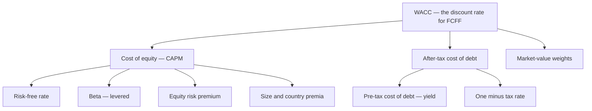
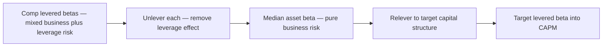
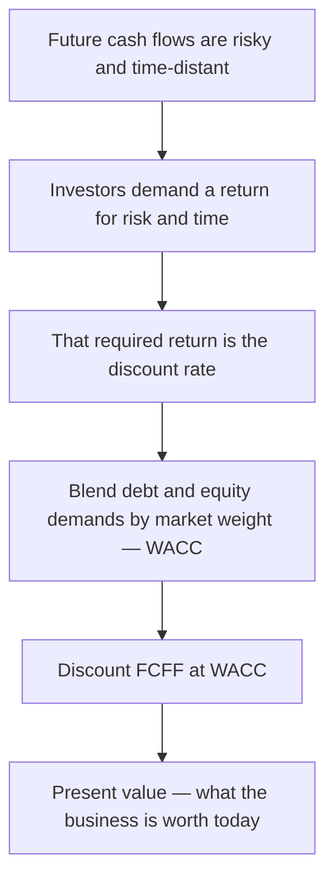
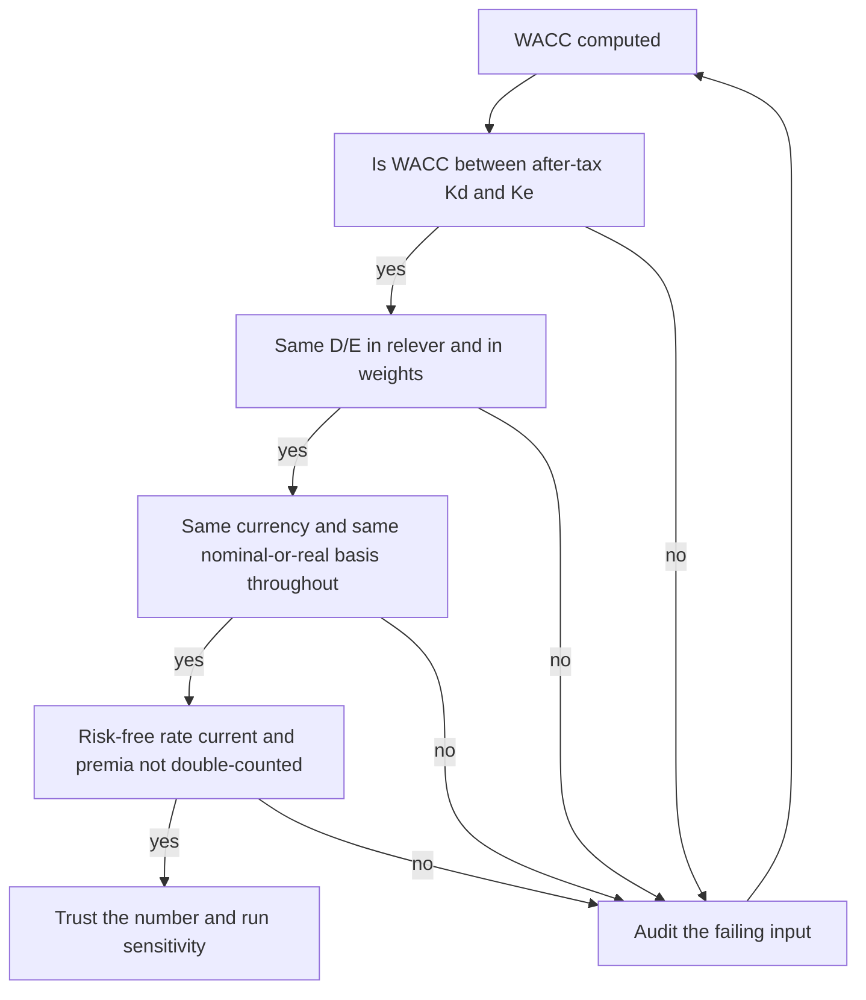

<!-- v2-deep -->

# Chapter 23 — DCF: WACC and the Cost of Capital

## 1. The Problem

You have just spent chapters building a three-statement model and projecting unlevered free cash flow for a business. You now hold a column of numbers: the cash the company will throw off in years 1 through 5, plus a terminal value that captures everything after. Each of those numbers sits in a different future year, and each is *uncertain*. A dollar the company expects to earn in Year 5 is worth less to you today than a dollar in hand — partly because you could invest today's dollar and earn a return in the meantime (time value), and partly because the Year-5 dollar might never arrive (risk).

To collapse that stream of future cash flows into a single number — what the business is worth *today* — you have to divide each future cash flow by a **discount rate**. Get the discount rate wrong and the whole valuation is wrong, no matter how carefully you built the cash flows. A DCF is famously sensitive here: moving the discount rate by a single percentage point can swing an equity value by 20% or more, because the rate compounds against every year and dominates the terminal value.

So the problem is this: **what is the right rate at which to discount a company's cash flows, and how do you compute it from observable market data?** The answer is the **Weighted Average Cost of Capital (WACC)** — and building it correctly, component by component, is the subject of this chapter.

Two sub-problems hide inside the main one. First, a company is financed by *two kinds* of investors — lenders (debt) and shareholders (equity) — who demand *different* returns for *different* risks. You need a blended rate that respects both. Second, the return equity investors demand is not printed anywhere; unlike a bond's interest rate, it is *implicit* and must be estimated. That estimation — the **cost of equity via CAPM** — is where most of the intellectual work lives.

**How sensitive, concretely?** Take a business with next-year FCFF of \$100, growing at $g = 2.5\%$ forever, valued as a simple growing perpetuity $V = \dfrac{100}{\text{WACC}-g}$. At WACC = 9.0%, $V = 100/0.065 = \$1{,}538$. At WACC = 10.0%, $V = 100/0.075 = \$1{,}333$. A single point on the discount rate erased **13.3%** of the value — and that is *before* the effect compounds through a multi-year explicit forecast. This is not a rounding-error business; the discount rate is the highest-leverage number you will estimate in the entire model, which is exactly why an entire chapter is devoted to sourcing it defensibly.

## 2. The Core Idea

The discount rate for a company's *unlevered* free cash flow (FCFF) is the **weighted average of what all its capital providers require**, where the weights are the market values of debt and equity in the capital structure.

$$\text{WACC} = \frac{E}{E+D} \cdot k_e \;+\; \frac{D}{E+D} \cdot k_d \cdot (1 - t)$$

where:
- $E$ = market value of equity, $D$ = market value of debt
- $k_e$ = cost of equity (return shareholders require)
- $k_d$ = pre-tax cost of debt (return lenders require)
- $t$ = marginal tax rate
- $(1-t)$ = the tax shield adjustment, because interest is tax-deductible

The cost of equity, $k_e$, is itself built from the **Capital Asset Pricing Model (CAPM)**:

$$k_e = r_f + \beta \cdot (r_m - r_f)$$

A risk-free base rate ($r_f$), plus a *risk premium* that scales with how much the stock moves with the market ($\beta$) times the price the market charges per unit of that risk (the equity risk premium, $r_m - r_f$).

That is the entire skeleton. Everything else in this chapter is (a) *why* each piece looks the way it does, and (b) *how* to source each input and assemble it in Excel without fooling yourself.

**A one-line mental model.** WACC answers a rental question: "if all the money invested in this business (debt plus equity) is rented capital, what blended annual rent does the market charge?" Equity is expensive rent (residual claimants, paid last, so they demand more); debt is cheaper rent (senior claim, contractual coupon) and comes with a government rebate (the tax shield). WACC is the blend — the opportunity cost of the capital tied up in this specific business at this specific risk.

*Figure 23.1 — The WACC build hierarchy: every branch must be estimated before the trunk.*



## 3. Why It Works

**Why a *weighted average*?** Because the free cash flow you are discounting (FCFF) belongs to *all* capital providers jointly — it is the cash available before any distinction between paying interest to lenders and paying dividends to shareholders. If the cash pool serves both groups, the required return on that pool must blend both groups' demands, in proportion to how much capital each supplied. Debt-heavy firms lean toward the (lower) cost of debt; equity-heavy firms lean toward the (higher) cost of equity.

**Why does the discount rate reflect *risk*?** Investors are risk-averse: they will not accept a risky future payoff unless it promises a higher *expected* return than a safe one. The discount rate is precisely the return investors *require* to bear the risk of these cash flows. Discounting by a higher rate is mathematically identical to saying "these cash flows are risky, so I'll pay less for them today." A higher rate → lower present value → lower price → higher expected return for whoever buys. Risk and discount rate are two names for the same thing.

**Why CAPM for equity?** Investors hold diversified portfolios, so they don't get paid for risk they could have diversified away (company-specific, "idiosyncratic" risk). They only get paid for **systematic risk** — the tendency of a stock to move *with the whole market*, which no amount of diversification removes. Beta measures exactly that co-movement. CAPM says: your required return is the risk-free rate plus a premium proportional to how much systematic risk you're carrying. A stock with $\beta = 1$ carries market-average risk and earns the market return; $\beta = 1.5$ carries 50% more and demands a bigger premium; $\beta = 0.5$ is defensive and demands less.

**Why the after-tax cost of debt?** Interest expense is deductible from taxable income. Every dollar of interest a company pays reduces its tax bill by $t$ dollars. So the *true* economic cost of borrowing is not the coupon rate $k_d$ but $k_d(1-t)$. This "tax shield" is a real, recurring subsidy from the government to debt financing, and it is the single biggest reason firms use debt at all. We build the shield into WACC rather than into the cash flows, so that FCFF stays a clean pre-financing number.

*Illustrating the shield with numbers.* A firm borrows \$1,000 at a 6% coupon and pays \$60 of interest. If its marginal tax rate is 25%, that \$60 deduction lowers its tax bill by \$60 × 25% = \$15. The *net* cash cost of the borrowing is \$60 − \$15 = \$45, i.e. an effective rate of 4.5% = 6% × (1 − 0.25). That is *exactly* $k_d(1-t)$. The government is silently paying 25% of your interest bill; WACC must reflect that, or you will systematically overstate the cost of capital and undervalue every levered business.

**Why market-value weights, not book value?** The discount rate must reflect what investors require *today* on capital valued at *today's* prices. Book values are accounting relics of past transactions. If a stock trades at three times book, using book equity would drastically understate the true equity weight and hand too much influence to the cheaper debt — deflating WACC and inflating value. We always weight by market value.

**Why the *unlevered* rate for the *unlevered* cash flow?** There is a matching principle at the core of DCF. FCFF is defined *before* the effect of financing (it is computed from EBIT, not net income). Its discount rate must therefore also be a whole-firm, all-providers rate — WACC. If you discounted FCFF by the cost of equity alone, you would be charging equity's (high) required return against cash that partly belongs to lenders, understating value. The stream and the rate must describe the same claimants. Chapter section 6 returns to this pairing because getting it wrong is the most common structural error in the discipline.

## 4. Full Technical Content

We build WACC from the outside in: first each input, then the assembly. Set up a dedicated **WACC tab** or a boxed assumptions area, with every hard-coded input in blue font and every calculation in black — the standard modeling convention so a reviewer can instantly see what you *chose* versus what you *computed*.

**Suggested tab layout (rows).** A clean, auditable WACC block reads top to bottom in this order, one input per labelled row:

```
Row  Label                     Cell   Value / formula                Font
 3   Risk-free rate  rf         C3     4.00%                          blue (input)
 4   Equity risk premium ERP    C4     5.50%                          blue (input)
 5   Marginal tax rate  t       C5     25.0%                          blue (input)
 6   Size premium  SP           C6     1.50%                          blue (input)
 7   Country risk premium CRP   C7     0.00%                          blue (input)
 8   Credit spread              C8     2.00%                          blue (input)
 9   Target D/E                 C9     0.50                           blue (input)
10   -- comp beta table below --
...
20   Asset beta (median)        C20    =MEDIAN(...)                   black
21   Relevered beta             C21    =C20*(1+(1-C5)*C9)             black
22   Cost of equity  Ke         C22    =C3+C21*C4+C6+C7               black
23   Pre-tax cost of debt Kd    C23    =C3+C8                         black
24   After-tax cost of debt     C24    =C23*(1-C5)                    black
25   Equity weight  We          C25    =1/(1+C9)                      black
26   Debt weight    Wd          C26    =C9/(1+C9)                     black
27   WACC                       C27    =C25*C22+C26*C24               black (boxed)
```

Note two convenient identities used above: with $D/E$ in one cell, $w_e = \dfrac{1}{1+D/E}$ and $w_d = \dfrac{D/E}{1+D/E}$, so you never need separate $E$ and $D$ figures if all you have is the ratio. (Proof: $w_e = \dfrac{E}{E+D} = \dfrac{1}{1+D/E}$ after dividing top and bottom by $E$.)

### 4.1 The risk-free rate ($r_f$)

**What it is:** the return on a default-free security whose maturity matches the horizon of the cash flows. For a going-concern DCF valuing a perpetual stream, the market standard is the **10-year (or 20-year) government bond yield** in the currency of the cash flows — the 10-year US Treasury for a USD model, the 10-year gilt for GBP, the 10-year G-Sec for an INR model.

**How to source it:** pull the current constant-maturity yield from a data terminal or the treasury/central-bank website. Use the *current* yield, not a historical average — CAPM is forward-looking.

**Excel:** hard-code as a blue input, e.g. `=4.25%` in cell `C5`, with a comment noting the source and date. Never bury it in a formula.

**Why the 10-year and not the 3-month T-bill?** The discount rate applies to long-dated cash flows, and the terminal value behaves like a perpetuity. A short T-bill yield reflects only near-term monetary conditions and is far more volatile; a 10-year yield better matches the *duration* of the stream you are discounting. Some practitioners use the 20-year or 30-year for very long-lived assets (infrastructure, utilities), accepting slightly worse liquidity for a better duration match.

**Edge case — a distorted or negative sovereign yield.** In some regimes (post-2010s Eurozone, Japan) the government yield was near zero or negative, which is not a credible long-run cost of money. A defensible fix is a **normalized risk-free rate**: use the long-run average real yield plus expected inflation, or a "build-up" of expected inflation plus a modest real rate (say 1.5–2.0% real). Document the choice; a negative $r_f$ fed literally into CAPM produces an artificially low $k_e$ and inflates value.

**Trap to flag now:** match the currency. Discounting INR cash flows with a USD risk-free rate double-counts or omits inflation and produces nonsense. Currency of $r_f$ = currency of cash flows.

### 4.2 The equity risk premium ($r_m - r_f$, "ERP")

**What it is:** the *extra* return investors demand for holding the market portfolio of stocks instead of the risk-free asset. It is the "price of risk" per unit of beta.

**How to estimate it:** three approaches.
1. **Historical:** long-run average of (stock market return − risk-free return). US long-run figures cluster around 4.5%–6%. Use the arithmetic or geometric mean over as long a period as possible.
2. **Implied / forward-looking:** back out the ERP that makes today's index level equal to the present value of expected future dividends/earnings (Damodaran publishes these monthly). This is more responsive to current conditions.
3. **Survey / practitioner consensus:** many banks simply adopt a house number, commonly **5.0%–5.5%** for mature markets.

**Arithmetic vs. geometric mean — which and why.** The arithmetic mean (simple average of annual excess returns) is the theoretically correct input for a *single-period* expected return, which is what CAPM asks for; it is always the higher of the two. The geometric mean (compound annual growth) better describes *realized multi-period* performance and is lower. Because a DCF chains many single periods, some practitioners split the difference or use the arithmetic mean over a long horizon. The gap is not trivial: US arithmetic ERP has historically run ~1.5–2.0 points above geometric. State which you used.

**Excel:** hard-code as a blue input (e.g. `5.5%`), sourced and dated. Pick one method, document it, and apply it consistently across every company you value — do not let the ERP drift deal-to-deal or you lose comparability.

**Interview angle.** "Your ERP is 5.5% — where did that come from, and would you change it in a market crash?" A strong answer: the historical figure is stable by construction, but the *implied* (forward-looking) ERP rises sharply when prices fall (higher expected returns from lower entry prices). Using a fixed historical ERP through a crash can understate the discount rate exactly when risk aversion spikes. Know both, and know that switching methods mid-portfolio destroys comparability.

### 4.3 Beta ($\beta$) — the heart of the estimate

Beta measures a stock's systematic risk: the slope of a regression of the stock's returns on the market's returns. $\beta = \frac{\text{Cov}(r_{\text{stock}}, r_{\text{market}})}{\text{Var}(r_{\text{market}})}$.

**Two ways to get beta:**

*(a) Regression beta (for a listed company).* Regress ~2–5 years of weekly or monthly returns of the stock against a broad index. In Excel: `=SLOPE(stock_returns_range, market_returns_range)`. Raw regression betas are noisy, so many providers report an **adjusted beta** that pulls the estimate toward 1.0 (the Bloomberg convention): $\beta_{\text{adj}} = 0.67 \cdot \beta_{\text{raw}} + 0.33 \cdot 1.0$.

*(b) Bottom-up / comparable-company beta (the robust, always-available method).* Regression betas are unavailable for private companies and unreliable for any single firm. The professional standard is to build beta from a set of *comparable listed companies*, and this requires **unlevering and relevering**.

**Regression choices that change the number.** The same stock can show betas of 0.9 or 1.3 depending on: (i) the *index* (S&P 500 vs. a broader total-market index); (ii) the *frequency* (daily returns are noisy and suffer from non-trading bias; weekly or monthly are cleaner); (iii) the *window* (2 years is responsive but jumpy, 5 years is stable but stale). The FMVA-standard combination is **5 years of monthly returns against a broad local index**, matching most data providers so your number is reproducible and defensible.

**Worked mini-regression.** Suppose over five months the stock and market posted these returns:

| Month | Stock $r_s$ | Market $r_m$ |
|-------|-------------|--------------|
| 1 | 3.0% | 2.0% |
| 2 | −1.0% | −1.0% |
| 3 | 4.0% | 2.5% |
| 4 | 2.0% | 1.0% |
| 5 | −2.0% | −1.5% |

`=SLOPE(stock, market)` returns the covariance-over-variance slope. Mean $r_s = 1.2\%$, mean $r_m = 0.6\%$. Computing $\sum (r_m-\bar r_m)(r_s-\bar r_s) / \sum (r_m-\bar r_m)^2$ gives a slope of ≈ **1.34**, i.e. a raw beta of 1.34. Adjusted: $0.67 \times 1.34 + 0.33 = 1.23$. (Five points is far too few for a real estimate — you want 60 monthly observations — but it shows the mechanic that `SLOPE` performs.)

### 4.4 Unlevering and relevering beta — why and how

A company's *observed* (equity, "levered") beta reflects **two** sources of risk: the risk of the underlying business (asset/operating risk) **and** the extra risk that financial leverage piles on top. Two firms in the identical business can have very different equity betas simply because one carries more debt — debt makes equity returns more volatile.

To compare businesses cleanly, we strip the leverage out of each comparable's equity beta to isolate the pure **asset (unlevered) beta**, average those, then *re-lever* to the target company's own capital structure. The workhorse formula (Hamada, assuming debt beta ≈ 0):

**Unlever:**
$$\beta_U = \frac{\beta_L}{1 + (1 - t)\cdot \dfrac{D}{E}}$$

**Relever (to the target's D/E):**
$$\beta_L^{\text{target}} = \beta_U \cdot \left[1 + (1 - t)\cdot \frac{D}{E}\Big|_{\text{target}}\right]$$

**Where does the Hamada formula come from?** Equity in a levered firm is a claim on the firm's assets *after* the fixed debt claim is paid — economically it is a leveraged position on the assets. The asset beta is the value-weighted average of the debt and equity betas: $\beta_U = \beta_E \cdot \dfrac{E}{E+D} + \beta_D \cdot \dfrac{D}{E+D}$ (with a tax adjustment on the debt leg because the tax shield is itself an asset). Setting the debt beta $\beta_D \approx 0$ (investment-grade debt barely co-moves with the market) and rearranging yields the two boxed formulas. The $(1-t)$ term appears because the tax shield partly offsets how much leverage amplifies equity risk.

**When the debt-beta-zero assumption breaks.** For a highly leveraged or distressed firm, debt *does* co-move with the market (junk bonds fall in recessions), so $\beta_D > 0$. Assuming $\beta_D = 0$ then over-unlevers — it credits the equity holders with too little risk. The fuller formula $\beta_U = \dfrac{\beta_L + \beta_D(1-t)(D/E)}{1+(1-t)(D/E)}$ restores the debt beta; a common practical estimate is $\beta_D \approx 0.10$–$0.30$ for sub-investment-grade credits.

**The build procedure (bottom-up beta):**
1. List 5–10 comparable listed companies (the "comp set").
2. For each, pull its levered/equity beta, its marginal tax rate, and its market D/E.
3. Unlever each comparable's beta with the formula above → column of asset betas.
4. Take the **median** asset beta of the comp set (median resists outliers better than mean).
5. Relever that median asset beta to the *target's* D/E and tax rate → the target's levered beta.
6. Feed this relevered beta into CAPM.

**Excel layout:** one row per comp, columns for Levered β, Tax rate, D/E, and a computed Unlevered β via `=levered_beta/(1+(1-tax)*DE)`. Below the table, `=MEDIAN(unlevered_range)` for the asset beta, then a relever cell `=asset_beta*(1+(1-target_tax)*target_DE)`.

**Why median, not mean.** One comp with an aberrant balance sheet or a bad regression can drag a mean well off. If four asset betas are 0.90, 0.92, 0.95, and a mis-estimated 1.60, the mean is 1.09 but the median is 0.935 — far closer to the cluster. Report both; lead with the median.

*Figure 23.2 — Bottom-up beta strips financial risk out of comps and re-adds the target's own.*



### 4.5 Assembling the cost of equity

Plug the relevered beta into CAPM, then add any premia the base model omits:

$$k_e = r_f + \beta_L \cdot \text{ERP} + \text{SP} + \text{CRP}$$

- **Size premium (SP):** empirically, small companies have earned returns above what their betas alone predict. Small-cap and micro-cap firms therefore get an added premium (published in valuation handbooks such as Kroll/Duff & Phelps), often **1%–5%** depending on size decile. Large caps: zero.
- **Country risk premium (CRP):** for companies operating in emerging or higher-risk markets, add a premium reflecting sovereign/political risk. A common approach: CRP = sovereign default spread (from the country's bond yield vs. a mature-market bond), optionally scaled by relative equity volatility. Damodaran publishes country-by-country CRPs.

These add-ons exist because plain CAPM is known to *under*-predict required returns for small and emerging-market firms. Include them when the target fits those profiles; document each one.

**Two ways to inject country risk — do not use both.** (a) The **add-on** method above, adding CRP as a flat premium to $k_e$; simple, but assumes every firm in the country bears identical country risk. (b) The **lambda** method, which scales CRP by the firm's actual exposure to the local economy (an exporter earning revenue abroad has lower $\lambda$ than a domestic utility): $k_e = r_f + \beta \cdot \text{ERP} + \lambda \cdot \text{CRP}$. The add-on method is the special case $\lambda = 1$. Choose one and state it; layering a country-inflated ERP *and* a separate CRP double-counts the same sovereign risk.

### 4.6 The cost of debt

**Pre-tax cost of debt ($k_d$):** the rate the company would pay to borrow *today*. Best estimates, in order of preference:
1. **Yield to maturity** on the company's own traded bonds (the market's live verdict on its credit).
2. **Risk-free rate + credit spread** implied by the company's credit rating (e.g. BBB spread ≈ 1.5%). Build $k_d = r_f + \text{spread}$.
3. **Synthetic rating:** if unrated, estimate a rating from the interest coverage ratio (EBIT ÷ interest), then apply the matching spread.
4. As a rough fallback only: **interest expense ÷ total debt** from the financials — but this is a *historical average* rate on *old* debt, not today's marginal rate, so use it with caution.

**Synthetic rating, worked.** A firm with EBIT of \$240m and interest expense of \$40m has an interest coverage ratio of 240/40 = **6.0×**. On a typical spread grid, coverage of ~6× maps to roughly an A rating and a spread of, say, 1.3% over the risk-free. With $r_f = 4.0\%$, the synthetic pre-tax $k_d = 4.0\% + 1.3\% = 5.3\%$. If coverage were only 2.0× (EBIT \$80m over \$40m interest), the firm might map to BB with a ~3.5% spread and $k_d = 7.5\%$ — the model *feels* the weaker balance sheet through a higher borrowing cost.

**After-tax cost of debt:** multiply by $(1-t)$:
$$k_d^{\text{after-tax}} = k_d \cdot (1 - t)$$

**A subtlety — tax shields require taxable income.** The $(1-t)$ benefit only exists if the firm is *paying* tax. A loss-making firm with large carryforwards gets no current shield; the effective near-term after-tax cost of debt is closer to the full pre-tax $k_d$. For a going-concern that returns to profitability, using the marginal statutory $t$ is fine; for a structurally loss-making entity, flag that the shield is deferred, not free.

**Tax rate $t$:** use the **marginal** tax rate (statutory rate the next dollar of income is taxed at), not the effective rate, because the shield applies at the margin. Keep this the *same* $t$ you used in unlevering beta and in the after-tax debt term — consistency across the model matters.

### 4.7 The weights

Compute market-value weights:
- **Equity, $E$:** market capitalisation = share price × diluted shares outstanding. For a private target, use an estimated equity value (often iterated — see traps).
- **Debt, $D$:** market value of interest-bearing debt. Book value is an acceptable proxy for debt trading near par; use market value if bonds trade well off par. Include the debt-like portion of leases per the applicable accounting standard.
- Weights: $w_e = \dfrac{E}{E+D}$ and $w_d = \dfrac{D}{E+D}$. They must sum to 1.

**What counts as "debt"?** Interest-bearing borrowings: bank loans, bonds, notes, drawn revolvers, and capitalized/finance leases. Typically *excluded*: accounts payable and other non-interest-bearing operating liabilities (they are captured in working capital inside FCFF, not in the capital structure). **Cash nuance:** some practitioners use *net* debt (debt minus excess cash) for the weights, arguing surplus cash offsets borrowings; others use *gross* debt. Be explicit — net vs. gross debt can shift $w_d$ by several points and must be consistent with how the DCF bridges enterprise value to equity value.

**Whose capital structure — the target's current, or a target/optimal one?** For a standard going-concern DCF, use the company's **current** market-value weights if they are stable, or a **target/industry-norm** structure if you expect the mix to migrate there. Be consistent: the D/E you use in the *weights* should be the same D/E you used to *relever beta*. A mismatch is a classic error.

**Worked weight conversions.** If a company has 200m diluted shares at \$30, equity $E = \$6{,}000$m. If interest-bearing debt is \$2,000m (near par, so market ≈ book) and there are \$500m of finance leases, $D = \$2{,}500$m. Then $E+D = \$8{,}500$m, $w_e = 6000/8500 = 70.6\%$, $w_d = 2500/8500 = 29.4\%$, and the implied $D/E = 2500/6000 = 0.417$. That 0.417 is the ratio you must also relever beta at — write it once and reference it in both places.

### 4.8 Putting WACC together

$$\text{WACC} = w_e \cdot k_e + w_d \cdot k_d \cdot (1-t)$$

**Excel formula**, referencing your labelled cells:
```
WACC = (E/(E+D))*Ke + (D/(E+D))*Kd*(1-Tax)
```
Build it as `=We*Ke + Wd*Kd*(1-Tax)` with each term visible in its own helper cell so a reviewer can audit the pieces. Then run a **sensitivity table** (Data → What-If → Data Table) showing enterprise value against WACC on one axis and terminal growth on the other — because these two assumptions dominate the output, you must show how much they move it.

**Building the 2-way Data Table, step by step:**
1. Put the live WACC output (or the EV it drives) in a corner cell, say `F10` — this is the "formula cell" the table reads.
2. Down column `F` starting `F11`, list the row inputs (e.g. WACC values 9.0%, 9.5%, 10.0%, 10.5%, 11.0%).
3. Across row `10` starting `G10`, list the column inputs (e.g. $g$ = 2.0%, 2.5%, 3.0%).
4. Select the whole block `F10:I15`.
5. Data → What-If Analysis → Data Table. Set **Row input cell** = the cell holding $g$; **Column input cell** = the cell holding WACC.
6. Excel recomputes the model once per combination and fills the grid. Format the interior as values, and shade the base-case cell.

**Formatting best practice:** blue for inputs ($r_f$, ERP, betas of comps, tax, spread), black for computed values, box the final WACC, and add a one-line source note beside every hard-coded input with its date. Percentages to one decimal; betas to two.

## 5. Worked Examples

### Example A — Cost of equity for a large, listed, single-market firm

Inputs (all sourced, dated, blue in the model):
- Risk-free rate $r_f = 4.0\%$
- Equity risk premium = $5.5\%$
- Relevered beta $\beta = 1.20$
- Size premium = $0\%$ (large cap), country premium = $0\%$ (mature market)

$$k_e = 4.0\% + 1.20 \times 5.5\% = 4.0\% + 6.6\% = 10.6\%$$

Shareholders require **10.6%**. Sanity check: beta above 1 means above-market risk, so $k_e$ (10.6%) sits above the implied market return of $r_f + \text{ERP} = 9.5\%$. Consistent. ✓

### Example B — Full WACC, with bottom-up beta

**Step 1 — Unlever and relever beta.** Three comparables:

| Comp | Levered β | Tax $t$ | D/E | Unlevered β = $\beta_L / (1+(1-t)\cdot D/E)$ |
|------|-----------|---------|-----|---------------------------------------------|
| A | 1.30 | 25% | 0.40 | 1.30 / (1 + 0.75·0.40) = 1.30 / 1.30 = **1.000** |
| B | 1.10 | 25% | 0.25 | 1.10 / (1 + 0.75·0.25) = 1.10 / 1.1875 = **0.926** |
| C | 1.45 | 25% | 0.60 | 1.45 / (1 + 0.75·0.60) = 1.45 / 1.45 = **1.000** |

Median unlevered (asset) beta = **1.000**.

Target company: tax 25%, target D/E = 0.50.
$$\beta_L^{\text{target}} = 1.000 \times [1 + (1-0.25)\times 0.50] = 1.000 \times 1.375 = 1.375$$

**Step 2 — Cost of equity (CAPM).** With $r_f = 4.0\%$, ERP $= 5.5\%$, and a small-cap size premium of $1.5\%$:
$$k_e = 4.0\% + 1.375 \times 5.5\% + 1.5\% = 4.0\% + 7.5625\% + 1.5\% = 13.06\%$$

**Step 3 — After-tax cost of debt.** The firm is rated BBB; spread over the risk-free is 2.0%, so pre-tax $k_d = 4.0\% + 2.0\% = 6.0\%$.
$$k_d^{\text{after-tax}} = 6.0\% \times (1 - 0.25) = 4.5\%$$

**Step 4 — Market-value weights.** Target D/E = 0.50 means $D = 0.5E$. So with $E = 1$, $D = 0.5$, total $= 1.5$:
$$w_e = \frac{1}{1.5} = 66.7\%, \qquad w_d = \frac{0.5}{1.5} = 33.3\%$$
(Note: the same D/E = 0.50 drives both the relever step and the weights — consistent. ✓)

**Step 5 — WACC.**
$$\text{WACC} = 0.667 \times 13.06\% + 0.333 \times 4.5\% = 8.71\% + 1.50\% = 10.21\%$$

WACC ≈ **10.2%**. Sanity checks: WACC (10.2%) sits *between* the after-tax cost of debt (4.5%) and the cost of equity (13.06%) — it must, as a weighted average. ✓ It leans toward equity because equity is two-thirds of the structure. ✓

### Example C — What one input does to the answer

Take Example B and change *only* the ERP from 5.5% to 6.5% (a plausible re-estimate).

New $k_e = 4.0\% + 1.375 \times 6.5\% + 1.5\% = 4.0\% + 8.9375\% + 1.5\% = 14.44\%$.

New WACC $= 0.667 \times 14.44\% + 0.333 \times 4.5\% = 9.63\% + 1.50\% = 11.13\%$.

A 1-point ERP change moved WACC by ~0.9 points (from 10.21% to 11.13%). In a DCF, that alone can cut enterprise value by roughly 10–15%. This is *why* you document every input and *why* the sensitivity table is mandatory — the discount rate is the highest-leverage assumption in the whole model.

### Example D — Same business, two capital structures (leverage is not free)

A tempting misconception is that piling on cheap debt lowers WACC without limit. It does not, because leverage raises the cost of *equity* through the relever step. Take the asset beta of 1.000 from Example B, $r_f = 4.0\%$, ERP $= 5.5\%$, no size/country premia, $t = 25\%$, and pre-tax $k_d = 6.0\%$ (assume the rate holds at moderate leverage). Compare **D/E = 0.25** against **D/E = 1.00**.

*Low leverage (D/E = 0.25):*
- Relevered β $= 1.000 \times (1 + 0.75 \times 0.25) = 1.1875$
- $k_e = 4.0\% + 1.1875 \times 5.5\% = 4.0\% + 6.53\% = 10.53\%$
- $w_e = 1/1.25 = 80.0\%$, $w_d = 20.0\%$
- WACC $= 0.80 \times 10.53\% + 0.20 \times 4.5\% = 8.43\% + 0.90\% = 9.33\%$

*High leverage (D/E = 1.00):*
- Relevered β $= 1.000 \times (1 + 0.75 \times 1.00) = 1.750$
- $k_e = 4.0\% + 1.750 \times 5.5\% = 4.0\% + 9.625\% = 13.63\%$
- $w_e = 1/2.0 = 50.0\%$, $w_d = 50.0\%$
- WACC $= 0.50 \times 13.63\% + 0.50 \times 4.5\% = 6.81\% + 2.25\% = 9.06\%$

WACC fell only modestly (9.33% → 9.06%) even as debt doubled from 20% to 50% of capital, because the cheaper debt weight was largely offset by a more expensive equity (10.53% → 13.63%). This is the Modigliani-Miller intuition with taxes: the tax shield gives a *gentle* downward tilt to WACC as leverage rises, not a free fall. And this ignores that at high leverage $k_d$ itself would climb (credit deteriorates), which eventually pushes WACC back *up* — the basis of an "optimal capital structure." The lesson for a modeler: never treat WACC as mechanically minimizable by assuming ever-cheaper debt; the equity cost pushes back.

### Example E — Discounting a real stream (WACC in action)

WACC is not the destination; it is the denominator. Discount three years of FCFF plus a Gordon-growth terminal value using the Example B WACC of 10.21% (call it 10.2%) and $g = 2.5\%$.

| Year | FCFF | Discount factor $= 1/(1.102)^n$ | PV |
|------|------|--------------------------------|-----|
| 1 | 100.0 | 0.9074 | 90.74 |
| 2 | 108.0 | 0.8233 | 88.92 |
| 3 | 115.0 | 0.7471 | 85.92 |

Terminal value at end of Year 3: $\text{TV} = \dfrac{115.0 \times (1+0.025)}{0.102 - 0.025} = \dfrac{117.875}{0.077} = 1{,}530.8$.
PV of TV $= 1{,}530.8 \times 0.7471 = 1{,}143.6$.

Enterprise value $= 90.74 + 88.92 + 85.92 + 1{,}143.6 = \mathbf{1{,}409.2}$.

Two things to notice. First, the terminal value's present value (1,143.6) is **81%** of the total EV — typical, and the reason WACC's effect on the TV dominates everything. Second, re-run with WACC = 11.2% (one point higher): the discount factors shrink and TV becomes $117.875/(0.112-0.025) = 1{,}354.9$, PV of TV $= 1{,}354.9 \times 0.7273 = 985.4$, and EV falls to roughly **1,236** — a **12%** drop from a single point of WACC. This is Example C's warning made concrete in a full valuation.

## 6. Connections

- **To FCFF (Chapter on unlevered cash flow):** WACC is the *matched* discount rate for **FCFF**. FCFF is pre-financing cash to all providers, so it must be discounted by the all-providers rate. Never discount FCFF by the cost of equity, and never discount FCFE (levered, equity-only cash flow) by WACC. Cash flow type and discount rate must agree.
- **To terminal value (next chapter):** WACC is the denominator in the Gordon growth terminal value $\text{TV} = \dfrac{FCFF_{n}(1+g)}{\text{WACC} - g}$. The tiny gap between WACC and $g$ makes terminal value hypersensitive to WACC — small rate errors explode here. As Example E showed, 80%+ of enterprise value can live in that one term.
- **To capital structure & the tax shield:** the $(1-t)$ term is where the value of debt financing enters an enterprise DCF. In an APV (adjusted present value) approach you would instead value the unlevered firm at the *unlevered* cost of capital and add the tax shield separately — same economics, different bookkeeping. APV is preferred when leverage changes materially year to year (LBOs), because a single constant WACC cannot capture a moving capital structure.
- **To comparable companies (comps):** the same comp set that anchors your trading multiples also supplies the betas for your bottom-up beta. The two methods share a spine.
- **To the football-field and cross-checks:** a DCF built on WACC produces one value; the comps and precedent-transactions methods produce others. If your WACC-driven DCF sits far outside the comps range, that is a signal to re-examine WACC (often the beta or ERP) before trusting the output.
- **To sensitivity and scenario analysis:** WACC is always a primary axis in the DCF sensitivity table, precisely because it is estimated, not observed.
- **To the mid-year convention:** if you discount cash flows as if received mid-year rather than year-end, the discount exponents shift to 0.5, 1.5, 2.5 …; WACC itself is unchanged, but the timing assumption interacts with it to lift value a percent or two. Keep the convention consistent between the explicit period and the terminal value.

## 7. Traps and Common Errors

1. **Book-value weights.** Using book equity/debt instead of market values. Almost always understates the equity weight and depresses WACC. Fix: market cap for equity, market (or par-proxy) value for debt.
2. **Mismatched currency.** Risk-free rate in one currency, cash flows in another. The risk-free, ERP, and cash flows must all live in the same currency.
3. **Cash-flow / rate mismatch.** Discounting FCFF with $k_e$, or FCFE with WACC. The single most common structural error. Match the stream to the rate.
4. **Inconsistent D/E.** Relevering beta at one leverage ratio but weighting WACC at another. Use one capital structure throughout.
5. **Inconsistent tax rate.** Different $t$ in the beta unlever step, the after-tax debt term, and the cash flows. Pick one marginal rate and reuse it.
6. **Historical average interest rate as $k_d$.** Interest expense ÷ debt reflects *old* borrowings, not today's marginal cost. Prefer YTM or rating-implied spread.
7. **Raw single-company regression beta.** Noisy and unstable. Use adjusted beta and, better, a bottom-up median from comps.
8. **Double-counting risk.** Adding a country premium *and* using an already-inflated emerging-market ERP, or padding the discount rate for company-specific risk that also got baked into conservative cash flows. Risk goes in *once*.
9. **Forgetting size/country premia when they apply** — plain CAPM systematically under-states $k_e$ for small and emerging-market firms.
10. **Stale risk-free rate.** CAPM is forward-looking; use the *current* government yield, not a multi-year average.
11. **Circularity in weights for private targets.** Equity value depends on WACC, but WACC's weights depend on equity value. Resolve with a target capital structure, or enable iterative calculation deliberately (File → Options → Formulas → Enable iterative calculation) — never let an accidental circular reference silence itself.
12. **Over-precision.** Reporting WACC as 10.213%. The inputs carry error bars of whole percentage points; present a rate and a sensitivity range, not false precision.
13. **Mean instead of median asset beta.** A single mis-levered or mis-regressed comp can drag the mean off the cluster; the median is robust. Report both and lead with the median.
14. **Gross vs. net debt confusion.** Using net debt in the WACC weights but bridging enterprise-to-equity value with gross debt (or vice versa) double-counts or omits cash. Fix the convention once and apply it end to end.
15. **Debt beta assumed zero for a junk-rated firm.** For distressed or heavily leveraged names, $\beta_D > 0$; assuming zero over-unlevers and understates equity risk. Use the debt-beta form of the Hamada equation.
16. **Nominal-versus-real mismatch.** A nominal WACC (built from a nominal $r_f$) must discount *nominal* cash flows; if your projections are in real terms, either inflate them or use a real discount rate. Mixing the two is a silent, large error.
17. **Wrong beta window/frequency vs. the comps.** Pulling a 2-year daily beta for the target but 5-year monthly for comps makes the numbers non-comparable. Standardize the regression convention across the whole comp set.

## 8. First-Principles Recap

Start from one sentence: *investors require higher returns for higher risk, so risky future cash flows are worth less today.* The discount rate **is** that required return.

- Because a firm's unlevered cash flow serves both lenders and shareholders, the rate is a **weighted average** of both groups' demands → WACC.
- Lenders' demand is nearly observable (a yield), and interest is tax-deductible, so their real cost is **$k_d(1-t)$**.
- Shareholders' demand is *not* observable, so we model it. Diversification means only **systematic** risk is priced; **beta** measures it; **CAPM** turns beta into a required return: $r_f + \beta \cdot \text{ERP}$.
- Because leverage inflates equity risk, we **unlever comps to isolate business risk, then relever to the target** — so beta reflects the *target's* actual financial risk, not the comps'.
- Small and emerging-market firms need **add-on premia** because plain CAPM under-predicts their returns.
- Weight by **market values**, keep **currency, tax rate, and capital structure consistent** everywhere, and the blended number is WACC — the rate that translates future risk into present value.

Every piece traces back to the founding sentence. Nothing in WACC is arbitrary; each term is a specific answer to "how much return does this risk deserve?"

**Sanity net you can run without a spreadsheet.** After any WACC build, ask four questions: (1) Does WACC sit between after-tax $k_d$ and $k_e$? If not, the arithmetic is broken. (2) Is $k_e$ above $r_f + \text{ERP}$ when beta > 1, and below it when beta < 1? (3) Do the weights sum to 1 and is the same D/E used to relever beta? (4) Are $r_f$, ERP, and the cash flows all in one currency and all nominal-or-all-real? If any answer is "no," stop and audit before the number leaves your desk.

*Figure 23.3 — The chain of reasoning from risk to a present value.*



*Figure 23.4 — The self-audit loop every finished WACC must pass before it is trusted.*



## 9. Quick-Reference

| Item | Formula / rule | Excel |
|------|----------------|-------|
| Cost of equity | $k_e = r_f + \beta\cdot\text{ERP} + \text{SP} + \text{CRP}$ | `=Rf + Beta*ERP + SP + CRP` |
| Regression beta | slope of stock vs. market returns | `=SLOPE(stock, market)` |
| Adjusted beta | $0.67\beta_{\text{raw}} + 0.33$ | `=0.67*B + 0.33` |
| Unlever beta | $\beta_U = \dfrac{\beta_L}{1+(1-t)D/E}$ | `=BetaL/(1+(1-t)*DE)` |
| Unlever with debt beta | $\beta_U = \dfrac{\beta_L+\beta_D(1-t)D/E}{1+(1-t)D/E}$ | `=(BetaL+BetaD*(1-t)*DE)/(1+(1-t)*DE)` |
| Relever beta | $\beta_L = \beta_U[1+(1-t)D/E]$ | `=BetaU*(1+(1-t)*DE)` |
| Asset beta of comps | median of unlevered betas | `=MEDIAN(range)` |
| Pre-tax cost of debt | YTM, or $r_f + \text{spread}$ | `=Rf + Spread` |
| After-tax cost of debt | $k_d(1-t)$ | `=Kd*(1-t)` |
| Equity weight | $E/(E+D)$ or $1/(1+D/E)$ | `=E/(E+D)` or `=1/(1+DE)` |
| Debt weight | $D/(E+D)$ or $(D/E)/(1+D/E)$ | `=D/(E+D)` or `=DE/(1+DE)` |
| Coverage ratio (synthetic rating) | EBIT ÷ interest | `=EBIT/Interest` |
| **WACC** | $w_e k_e + w_d k_d(1-t)$ | `=We*Ke + Wd*Kd*(1-t)` |
| Growing-perpetuity value (uses WACC) | $\dfrac{CF_1}{\text{WACC}-g}$ | `=CF1/(WACC-g)` |

**Sanity checks every time:** WACC lies between after-tax $k_d$ and $k_e$; weights sum to 1; same $t$, same D/E, same currency, same nominal-or-real basis used throughout; $r_f$ is current; beta > 1 ⇒ $k_e$ above market return.

**Typical ranges (mature markets, orient yourself):** $r_f$ 3–5%, ERP 5–6%, large-cap $\beta$ 0.7–1.4, size premium 0–5%, after-tax $k_d$ 3–6%, WACC 7–12% for stable large caps, higher for small/risky firms.

**Interview quick-fire.**
- *"Walk me through WACC."* Weighted average of after-tax cost of debt and cost of equity, weighted by market values; cost of equity from CAPM; used to discount unlevered FCFF.
- *"Why after-tax on debt but not equity?"* Interest is tax-deductible (creates a shield); dividends are not. The shield lives in $(1-t)$.
- *"If a company raises debt, does WACC go up or down?"* Usually down slightly at first (cheaper debt + tax shield), but the relever step raises $k_e$ and, beyond an optimal point, rising credit spreads push $k_d$ and then WACC back up (see Example D).
- *"Why unlever and relever beta?"* To strip comps' financing risk and re-impose the target's, isolating pure business risk in between.
- *"Which is bigger, cost of equity or cost of debt, and why?"* Equity — shareholders are residual, junior claimants bearing more risk, so they demand a higher return.

## 10. Build-It-Yourself Exercise

Open a fresh Excel workbook and build a self-contained WACC tab from scratch. Do **not** copy the answers until you have derived your own.

**Given:**
- Risk-free rate: 4.5%
- Equity risk premium: 5.5%
- Marginal tax rate: 25%
- Target capital structure: D/E = 0.40
- Size premium: 1.0% (mid-cap); country premium: 0%
- Credit spread over risk-free: 1.8%
- Comparable companies:

| Comp | Levered β | D/E | Tax |
|------|-----------|-----|-----|
| P | 1.15 | 0.30 | 25% |
| Q | 1.05 | 0.20 | 25% |
| R | 1.35 | 0.55 | 25% |
| S | 1.20 | 0.35 | 25% |

**Tasks:**
1. Build an unlevering table: compute each comp's asset beta with `=BetaL/(1+(1-t)*DE)`. Take the **median**.
2. Relever the median asset beta to the target's D/E = 0.40.
3. Compute $k_e$ via CAPM including the size premium.
4. Compute pre-tax and after-tax cost of debt.
5. Convert D/E = 0.40 into equity and debt weights.
6. Assemble WACC in a boxed cell with each term visible.
7. Format: blue inputs, black calculations, one-decimal percentages, source notes.
8. Build a 2-way Data Table showing WACC as beta (rows) and ERP (columns) each vary ±0.2 / ±1%.

**Self-check targets** (compute, then verify — note the median of *four* numbers is the average of the two middle values, a step that trips people up):
- Unlevered betas: P $= 1.15/1.225 = \mathbf{0.939}$; Q $= 1.05/1.15 = \mathbf{0.913}$; R $= 1.35/1.4125 = \mathbf{0.956}$; S $= 1.20/1.2625 = \mathbf{0.951}$.
- Sorted: 0.913, 0.939, 0.951, 0.956 → **median = (0.939 + 0.951)/2 ≈ 0.945** (not 0.939 — that is only comp P's value; the median of four is the average of the middle two).
- Relevered β $= 0.945 \times (1 + 0.75 \times 0.40) = 0.945 \times 1.30 ≈ \mathbf{1.228}$.
- $k_e = 4.5\% + 1.228 \times 5.5\% + 1.0\% ≈ 4.5\% + 6.75\% + 1.0\% = \mathbf{12.25\%}$.
- After-tax $k_d = (4.5\% + 1.8\%) \times 0.75 = 6.3\% \times 0.75 = \mathbf{4.73\%}$.
- Weights: $w_e = 1/1.4 = \mathbf{71.4\%}$, $w_d = 0.4/1.4 = \mathbf{28.6\%}$.
- **WACC $= 0.714 \times 12.25\% + 0.286 \times 4.73\% = 8.75\% + 1.35\% = 10.10\%$.**

Confirm WACC sits between 4.73% and 12.25%, and that your weights sum to 1. If your median came out as 0.939, you took a single comp instead of averaging the two middle values — recompute. If your WACC differs, audit each helper cell before moving on: a WACC you cannot reproduce by hand is a WACC you cannot trust.

**Stretch tasks (optional, to deepen mastery):**
- Re-do the whole build assuming a **debt beta of 0.15** in the unlever and relever steps. Does the target's relevered beta rise or fall, and why? (It falls slightly, because some risk is attributed to debt rather than equity.)
- Switch from the target D/E of 0.40 to **0.80** and recompute WACC. Show numerically that $k_e$ rises but WACC moves only modestly (the Example D lesson).
- Add a **country risk premium of 2.0%** via the add-on method and note the new $k_e$ and WACC; then argue in one sentence why you must *not* also switch to an emerging-market ERP.
